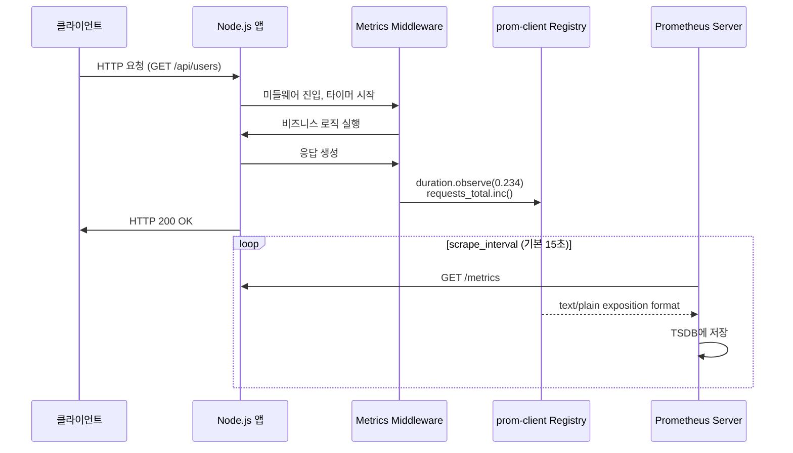
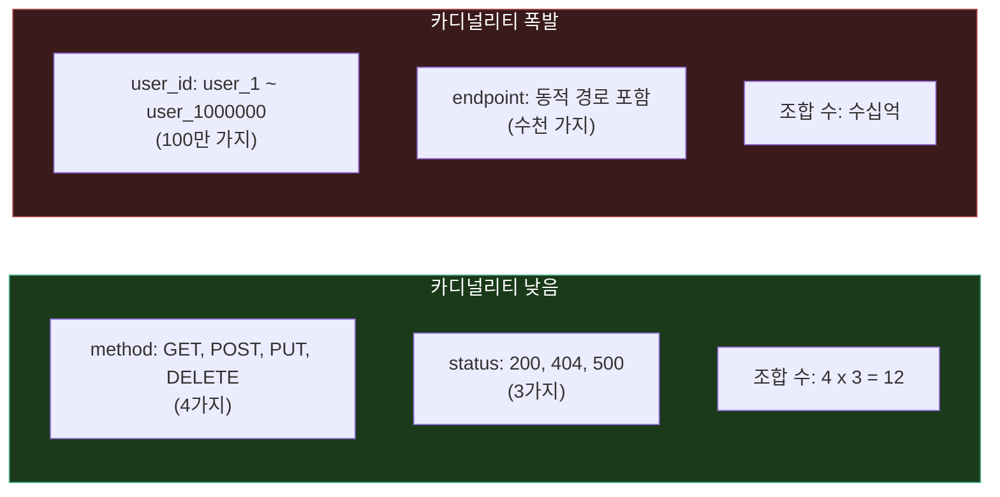
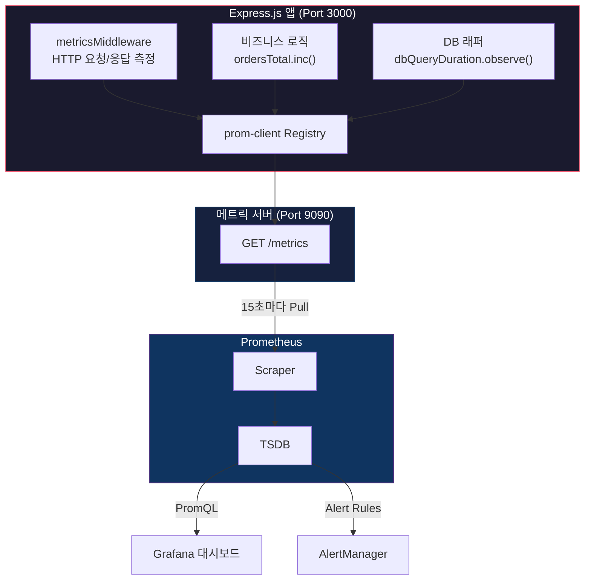
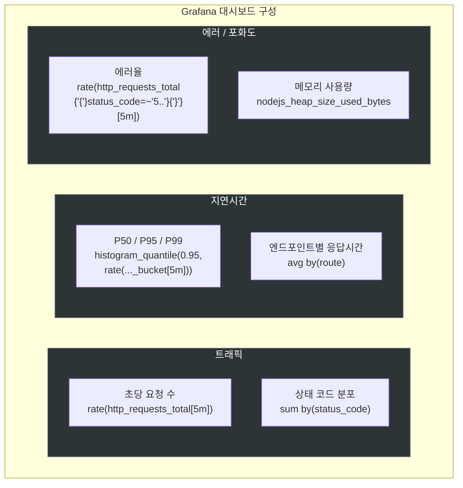

# Prometheus 메트릭 수집

Prometheus 아키텍처, PromQL, 알림 규칙 같은 Prometheus 자체 운영 내용은 [Prometheus](Prometheus.md) 문서를 참고한다. 이 문서는 **Node.js 애플리케이션에서 prom-client로 메트릭을 정의하고 수집하는 실무 내용**에 집중한다.

---

## 메트릭 수집 흐름

Node.js 앱에서 메트릭이 Prometheus에 도달하기까지의 흐름이다.



핵심은 **앱이 메트릭을 Push하는 게 아니라, Prometheus가 Pull 해간다**는 점이다. 앱은 `/metrics` 엔드포인트만 열어두면 된다.

---

## 메트릭 타입

Prometheus는 4가지 메트릭 타입을 제공한다. 타입을 잘못 선택하면 나중에 PromQL 쿼리가 꼬이니 처음에 제대로 골라야 한다.

### Counter

누적 값만 증가하는 메트릭이다. 앱이 재시작되면 0으로 리셋된다. `rate()` 함수로 증가율을 계산하는 게 핵심이다.

```javascript
const httpRequestsTotal = new client.Counter({
  name: 'http_requests_total',
  help: 'Total number of HTTP requests',
  labelNames: ['method', 'route', 'status_code']
});

// 사용
httpRequestsTotal.labels('GET', '/api/users', '200').inc();
```

쓰는 곳: 총 요청 수, 에러 발생 횟수, 사용자 등록 수

### Gauge

증가/감소 모두 가능한 현재 상태 값이다. 특정 시점의 스냅샷을 나타낸다.

```javascript
const activeConnections = new client.Gauge({
  name: 'active_connections',
  help: 'Number of active connections'
});

// 사용
activeConnections.inc();   // 연결 추가
activeConnections.dec();   // 연결 제거
activeConnections.set(42); // 직접 값 설정
```

쓰는 곳: 메모리 사용량, 활성 연결 수, 큐 크기

### Histogram

값의 분포를 버킷으로 나누어 측정한다. 응답 시간 같은 메트릭에 쓴다.

```javascript
const httpRequestDuration = new client.Histogram({
  name: 'http_request_duration_seconds',
  help: 'Duration of HTTP requests in seconds',
  labelNames: ['method', 'route', 'status_code'],
  buckets: [0.01, 0.05, 0.1, 0.5, 1, 2, 5, 10]
});

// 타이머 사용 (권장)
const end = httpRequestDuration.startTimer();
// ... 작업 수행 ...
end({ method: 'GET', route: '/api/users', status_code: '200' });

// 직접 관찰
httpRequestDuration.observe(0.523);
```

Histogram은 `_bucket`, `_sum`, `_count` 세 가지 시계열을 자동 생성한다:

```
http_request_duration_seconds_bucket{le="0.1"} 250
http_request_duration_seconds_bucket{le="0.5"} 480
http_request_duration_seconds_sum 2450.5
http_request_duration_seconds_count 530
```

PromQL에서 `histogram_quantile(0.95, rate(..._bucket[5m]))` 형태로 백분위수를 계산한다.

### Summary

클라이언트 측에서 백분위수를 직접 계산한다. Histogram과 비슷하지만 차이가 있다.

```javascript
const responseSummary = new client.Summary({
  name: 'response_time_seconds',
  help: 'Response time in seconds',
  percentiles: [0.5, 0.9, 0.95, 0.99]
});

responseSummary.observe(0.523);
```

**Histogram vs Summary**: Histogram은 서버 측에서 집계 가능하고 여러 인스턴스의 데이터를 합칠 수 있다. Summary는 클라이언트에서 계산하므로 정확하지만 집계가 안 된다. 대부분의 경우 **Histogram을 쓰는 게 낫다**. 인스턴스가 여러 개인 환경에서 Summary는 합산이 불가능해서 곤란해진다.

---

## 레이블 설계

레이블은 메트릭에 다차원을 추가하는 키-값 쌍이다. 레이블 설계를 잘못하면 Prometheus 서버가 메모리를 폭발적으로 소모한다.

```
http_requests_total{method="GET", endpoint="/api/users", status="200"} 1547
```

### 카디널리티 문제

레이블 값의 고유한 조합 수를 카디널리티라고 한다. 이게 높으면 Prometheus가 저장해야 할 시계열 수가 급증한다.



실무에서 자주 실수하는 케이스:

- `user_id`를 레이블에 넣는 경우 — 사용자 수만큼 시계열이 생긴다
- `/api/users/:id` 같은 동적 경로를 그대로 레이블에 넣는 경우 — `/api/users/1`, `/api/users/2`... 무한대로 늘어난다
- 타임스탬프나 UUID를 레이블에 넣는 경우

해결: 동적 경로는 패턴으로 정규화한다 (`/api/users/:id`). 사용자별 구분이 필요하면 `user_type: "premium"` 같은 제한된 값을 쓴다.

---

## prom-client 설정

### 기본 설치

```bash
npm install prom-client
```

### 레지스트리와 기본 메트릭

```javascript
const client = require('prom-client');

// 커스텀 레지스트리 사용 (권장)
const register = new client.Registry();

// Node.js 기본 메트릭 수집 (GC, 이벤트 루프, 메모리 등)
client.collectDefaultMetrics({
  register,
  prefix: 'nodejs_',
  gcDurationBuckets: [0.001, 0.01, 0.1, 1, 2, 5]
});
```

`collectDefaultMetrics()`를 호출하면 Node.js 런타임 관련 메트릭이 자동으로 수집된다:
- `nodejs_heap_size_total_bytes` — 힙 메모리 전체 크기
- `nodejs_heap_size_used_bytes` — 힙 메모리 사용량
- `nodejs_eventloop_lag_seconds` — 이벤트 루프 지연
- `nodejs_active_handles_total` — 활성 핸들 수
- `nodejs_gc_duration_seconds` — GC 실행 시간

기본 레지스트리(`client.register`)를 쓸 수도 있지만, 테스트 시 메트릭 충돌이 발생하는 경우가 있다. 커스텀 레지스트리를 만들어 쓰는 게 낫다.

### 커스텀 메트릭 정의

실무에서 자주 쓰는 메트릭 구성이다:

```javascript
// HTTP 메트릭
const httpRequestDuration = new client.Histogram({
  name: 'http_request_duration_seconds',
  help: 'Duration of HTTP requests in seconds',
  labelNames: ['method', 'route', 'status_code'],
  buckets: [0.01, 0.05, 0.1, 0.5, 1, 2, 5, 10],
  registers: [register]
});

const httpRequestsTotal = new client.Counter({
  name: 'http_requests_total',
  help: 'Total number of HTTP requests',
  labelNames: ['method', 'route', 'status_code'],
  registers: [register]
});

// DB 메트릭
const dbQueryDuration = new client.Histogram({
  name: 'db_query_duration_seconds',
  help: 'Duration of database queries in seconds',
  labelNames: ['operation', 'table'],
  buckets: [0.001, 0.005, 0.01, 0.05, 0.1, 0.5, 1, 2],
  registers: [register]
});

const dbConnectionsActive = new client.Gauge({
  name: 'db_connections_active',
  help: 'Number of active database connections',
  registers: [register]
});

// 비즈니스 메트릭
const ordersTotal = new client.Counter({
  name: 'orders_total',
  help: 'Total number of orders',
  labelNames: ['status'],
  registers: [register]
});
```

`registers: [register]`를 생성 시점에 넣으면 `register.registerMetric()`을 따로 호출하지 않아도 된다. 하나씩 등록하다 빠뜨리는 실수를 방지한다.

---

## Express 미들웨어로 메트릭 수집

### HTTP 요청 메트릭 미들웨어

```javascript
function metricsMiddleware(req, res, next) {
  // /metrics 자체는 측정하지 않는다
  if (req.path === '/metrics') return next();

  const end = httpRequestDuration.startTimer();

  res.on('finish', () => {
    const route = req.route?.path || req.path;
    const labels = {
      method: req.method,
      route: normalizeRoute(route),
      status_code: res.statusCode.toString()
    };
    end(labels);
    httpRequestsTotal.inc(labels);
  });

  next();
}

// 동적 경로를 패턴으로 정규화
function normalizeRoute(route) {
  return route
    .replace(/\/[0-9a-f]{24}/g, '/:id')      // MongoDB ObjectId
    .replace(/\/\d+/g, '/:id');                // 숫자 ID
}
```

`res.on('finish')` 이벤트를 쓰는 이유: `res.send()`를 오버라이드하는 방식은 스트리밍 응답이나 `res.json()` 등 다른 메서드 호출 시 누락될 수 있다. `finish` 이벤트는 응답이 클라이언트에 전송된 후 항상 발생한다.

`normalizeRoute()`가 중요하다. `/api/users/123`과 `/api/users/456`을 각각 별개 레이블로 기록하면 카디널리티가 폭발한다. 패턴으로 정규화해서 `/api/users/:id` 하나로 합쳐야 한다.

### /metrics 엔드포인트 노출

```javascript
const express = require('express');
const app = express();

// 메트릭 미들웨어 등록
app.use(metricsMiddleware);

// Prometheus가 scrape하는 엔드포인트
app.get('/metrics', async (req, res) => {
  res.set('Content-Type', register.contentType);
  res.end(await register.metrics());
});

app.listen(3000);
```

운영 환경에서 `/metrics` 엔드포인트를 외부에 노출하면 안 된다. 내부 네트워크에서만 접근 가능하게 하거나, 메트릭 전용 포트를 별도로 여는 방법이 있다:

```javascript
// 메인 앱: 포트 3000
app.listen(3000);

// 메트릭 전용: 포트 9090 (내부망에서만 접근)
const metricsApp = express();
metricsApp.get('/metrics', async (req, res) => {
  res.set('Content-Type', register.contentType);
  res.end(await register.metrics());
});
metricsApp.listen(9090);
```

---

## DB 쿼리 메트릭 수집

DB 쿼리 래퍼를 만들어서 자동으로 측정한다:

```javascript
async function queryWithMetrics(pool, sql, params) {
  const end = dbQueryDuration.startTimer();
  try {
    const result = await pool.query(sql, params);
    end({ operation: detectOperation(sql), table: detectTable(sql) });
    return result;
  } catch (error) {
    end({ operation: detectOperation(sql), table: detectTable(sql) });
    throw error;
  }
}

function detectOperation(sql) {
  const normalized = sql.trim().toUpperCase();
  if (normalized.startsWith('SELECT')) return 'select';
  if (normalized.startsWith('INSERT')) return 'insert';
  if (normalized.startsWith('UPDATE')) return 'update';
  if (normalized.startsWith('DELETE')) return 'delete';
  return 'other';
}

function detectTable(sql) {
  const match = sql.match(/(?:FROM|INTO|UPDATE)\s+(\w+)/i);
  return match ? match[1] : 'unknown';
}
```

DB 커넥션 풀을 쓰는 경우 활성 연결 수도 주기적으로 기록한다:

```javascript
setInterval(() => {
  dbConnectionsActive.set(pool.totalCount - pool.idleCount);
}, 5000);
```

---

## 전체 구성 다이어그램



---

## Grafana 대시보드 연동

Prometheus에서 수집한 메트릭을 Grafana로 시각화한다. 실제 운영에서는 Google SRE 책에서 말하는 Golden Signals 4가지를 기준으로 대시보드를 구성하는 경우가 많다.



자주 쓰는 PromQL 쿼리:

```promql
# 초당 요청 수 (5분 평균)
rate(http_requests_total[5m])

# 95 퍼센타일 응답 시간
histogram_quantile(0.95, rate(http_request_duration_seconds_bucket[5m]))

# 에러율 (5xx 비율)
sum(rate(http_requests_total{status_code=~"5.."}[5m]))
/
sum(rate(http_requests_total[5m]))

# 메모리 사용량
nodejs_heap_size_used_bytes

# 활성 DB 연결 수
db_connections_active
```

---

## 주의사항

### 메트릭 수집이 앱 성능에 미치는 영향

메트릭 수집 자체가 CPU와 메모리를 소모한다. 무작정 메트릭을 늘리면 앱 성능이 떨어진다.

- **Histogram 버킷 수**: 버킷이 많을수록 메모리를 더 쓴다. 레이블 조합이 10개이고 버킷이 20개면 시계열 200개가 생긴다. 10~15개가 적당하다
- **scrape 타임아웃**: 메트릭이 많으면 `/metrics` 응답이 느려진다. scrape_timeout보다 응답이 느리면 메트릭 수집이 실패한다
- **메트릭 서버 분리**: `/metrics` 요청이 비즈니스 요청과 같은 이벤트 루프를 쓰면 영향을 줄 수 있다. 포트를 분리하는 것만으로도 어느 정도 해소된다

### 네이밍 규칙

- Counter는 `_total` 접미사를 붙인다: `http_requests_total`
- 시간 관련 메트릭은 초 단위를 사용한다: `http_request_duration_seconds`
- 바이트 관련 메트릭은 `_bytes` 접미사를 붙인다: `memory_usage_bytes`
- 이름만 보고 무슨 메트릭인지 알 수 있어야 한다. `metric_1` 같은 이름은 쓰면 안 된다

### 테스트 시 주의점

prom-client 메트릭은 싱글톤처럼 동작한다. 같은 이름의 메트릭을 두 번 등록하면 에러가 난다. 테스트 코드에서 이 문제가 자주 발생한다:

```javascript
// 테스트 전에 레지스트리를 초기화
beforeEach(() => {
  register.clear();
});
```

기본 레지스트리(`client.register`)를 쓰면 테스트 간 상태가 공유되어 깨지는 경우가 있다. 커스텀 레지스트리를 쓰면 이 문제를 피할 수 있다.

### Prometheus scrape 설정

앱 쪽 설정이 아니라 Prometheus 서버의 `prometheus.yml` 설정이다:

```yaml
scrape_configs:
  - job_name: 'nodejs-app'
    static_configs:
      - targets: ['app-server:9090']
    metrics_path: '/metrics'
    scrape_interval: 15s
    scrape_timeout: 10s
```

`scrape_interval`은 15초가 기본이다. 5초로 줄이면 더 세밀한 데이터를 얻지만 저장소 사용량이 3배가 된다. 대부분의 경우 15초면 충분하다. 장애 감지 속도가 중요한 메트릭만 별도로 짧게 설정한다.

---

## 참고

Prometheus 아키텍처, PromQL 문법, AlertManager 설정, Recording Rules 같은 Prometheus 서버 운영 관련 내용은 [Prometheus](Prometheus.md) 문서에 정리되어 있다.

- [prom-client GitHub](https://github.com/siimon/prom-client) — Node.js용 Prometheus 클라이언트
- [Prometheus Metric Types](https://prometheus.io/docs/concepts/metric_types/) — 메트릭 타입 공식 문서
- [Prometheus Naming Conventions](https://prometheus.io/docs/practices/naming/) — 네이밍 규칙 공식 문서
