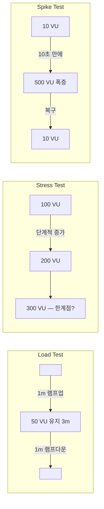
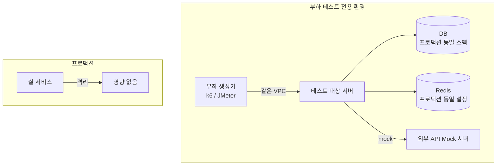
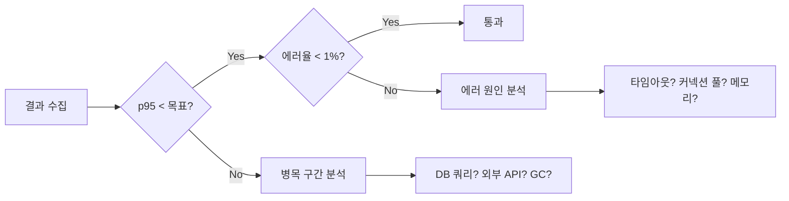
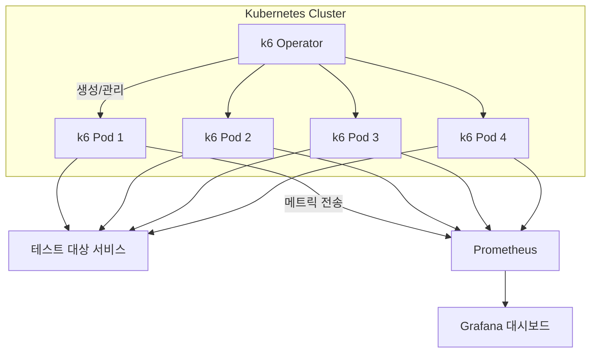

# 부하 테스트(Load Testing)

## 개요

부하 테스트는 실제 트래픽 조건에서 시스템이 어떻게 동작하는지 사전에 검증한다. 프로덕션 배포 전에 병목을 발견하고, 서버 스펙 결정의 근거를 확보하는 데 쓰인다.

부하 테스트를 안 하면 "트래픽 몰리면 얼마나 버티나?", "DB 커넥션 풀이 충분한가?", "메모리 누수가 있는가?" 같은 질문에 "모름"으로 답하게 된다. 서버 대수를 감으로 결정하는 상황이 벌어진다.

---

## 테스트 종류

| 종류 | 목적 | 방법 |
|------|------|------|
| **Load Test** | 예상 트래픽에서 성능 검증 | 목표 VU로 일정 시간 유지 |
| **Stress Test** | 한계점(breaking point) 파악 | 트래픽을 점진적으로 높임 |
| **Spike Test** | 급격한 트래픽 증가 처리 | 짧은 시간 내 폭증 시뮬레이션 |
| **Soak Test** | 장시간 안정성 / 메모리 누수 탐지 | 보통 부하를 수 시간 유지 |

아래 그림은 각 테스트 유형별 VU(가상 사용자) 패턴이다.



---

## 테스트 환경 구성 시 주의사항

부하 테스트는 테스트 환경을 얼마나 잘 구성하느냐에 따라 결과의 신뢰도가 달라진다. 실제로 환경 차이 때문에 스테이징에서 통과한 테스트가 프로덕션에서 장애로 이어지는 경우가 많다.

### 데이터 준비

테스트 데이터가 빈약하면 결과가 왜곡된다. 테이블에 row가 100건인 환경과 1,000만 건인 환경은 쿼리 실행 계획 자체가 다르다.

```
프로덕션 DB: users 테이블 500만 건, orders 테이블 2,000만 건
스테이징 DB: users 테이블 100건, orders 테이블 50건

→ 인덱스 스캔 vs 풀 스캔 차이 발생
→ 스테이징에서 10ms 걸리던 쿼리가 프로덕션에서 3초
```

데이터 준비 시 고려할 점:

- **데이터 볼륨**: 프로덕션의 최소 10% 이상 데이터를 넣어야 인덱스 동작이 유사해진다
- **데이터 분포**: 특정 컬럼에 값이 몰려 있는 패턴(skew)을 반영해야 한다. 균등 분포로 생성하면 실제와 다른 실행 계획이 나온다
- **테스트 계정 분리**: VU마다 같은 계정을 쓰면 캐시 히트율이 비정상적으로 높아진다. VU별로 다른 계정을 사용한다

```javascript
// k6에서 VU별 다른 계정 사용
import { SharedArray } from 'k6/data';

const users = new SharedArray('users', function () {
  return JSON.parse(open('./test-users.json'));
});

export default function () {
  const user = users[__VU % users.length];
  const res = http.post(`${BASE_URL}/api/auth/login`, JSON.stringify({
    email: user.email,
    password: user.password,
  }), { headers: { 'Content-Type': 'application/json' } });
}
```

### 네트워크 격리

부하 테스트 트래픽이 다른 서비스에 영향을 주지 않도록 격리한다.

- 부하 테스트 전용 네트워크 세그먼트(VPC, subnet)를 분리한다
- 외부 API 호출이 포함된 시나리오라면, 외부 API는 mock 서버로 대체한다. 실제 외부 서비스에 수만 건 요청을 보내면 rate limit에 걸리거나 차단당한다
- 부하 생성기(k6, JMeter)와 테스트 대상 서버가 같은 리전에 있어야 한다. 리전이 다르면 네트워크 레이턴시가 결과에 섞여 들어간다



### 인프라 스펙

DB 커넥션 풀, Redis 커넥션 수, 스레드 풀 크기 등 인프라 설정을 프로덕션과 맞춘다. 서버 인스턴스 스펙만 동일하게 맞추고 이런 설정을 빠뜨리는 경우가 흔하다.

```
흔한 실수:
  프로덕션 DB: max_connections = 200, HikariCP pool = 50
  스테이징 DB: max_connections = 50, HikariCP pool = 10
  
  → 스테이징에서 50 VU도 커넥션 풀 고갈
  → 프로덕션 문제가 아닌데 프로덕션 문제로 오판
```

---

## k6 — 기본 사용법

### 설치

```bash
# macOS
brew install k6

# Docker
docker run --rm -i grafana/k6 run - < script.js
```

### Load Test 시나리오

```javascript
// load-test.js
import http from 'k6/http';
import { check, sleep } from 'k6';
import { Rate, Trend, Counter } from 'k6/metrics';

const errorRate   = new Rate('errors');
const apiDuration = new Trend('api_duration');
const totalReqs   = new Counter('total_requests');

export const options = {
  stages: [
    { duration: '1m', target: 50 },  // 램프업: 1분 동안 50 VU
    { duration: '3m', target: 50 },  // 유지: 3분
    { duration: '1m', target: 0  },  // 램프다운
  ],
  thresholds: {
    http_req_duration: ['p(95)<500'],  // P95 응답 500ms 이하
    http_req_failed:   ['rate<0.01'],  // 에러율 1% 이하
    errors:            ['rate<0.01'],
  },
};

const BASE_URL = __ENV.BASE_URL ?? 'http://localhost:3000';

export default function () {
  // 1. 로그인
  const loginRes = http.post(
    `${BASE_URL}/api/auth/login`,
    JSON.stringify({ email: 'test@example.com', password: 'password123' }),
    { headers: { 'Content-Type': 'application/json' } }
  );

  const loginOk = check(loginRes, {
    'login: 200': (r) => r.status === 200,
    'login: token 있음': (r) => !!r.json('token'),
  });

  errorRate.add(!loginOk);
  totalReqs.add(1);

  if (!loginOk) return;

  const token = loginRes.json('token');
  const authHeaders = { Authorization: `Bearer ${token}` };

  // 2. 상품 목록 조회
  const productsRes = http.get(`${BASE_URL}/api/products`, { headers: authHeaders });

  check(productsRes, {
    'products: 200': (r) => r.status === 200,
    'products: 300ms 이하': (r) => r.timings.duration < 300,
  });

  apiDuration.add(productsRes.timings.duration, { endpoint: 'products' });
  errorRate.add(productsRes.status !== 200);
  totalReqs.add(1);

  // 3. 주문 생성
  const orderRes = http.post(
    `${BASE_URL}/api/orders`,
    JSON.stringify({ productId: 'prod-1', quantity: 1 }),
    { headers: { ...authHeaders, 'Content-Type': 'application/json' } }
  );

  check(orderRes, {
    'order: 201': (r) => r.status === 201,
  });

  errorRate.add(orderRes.status !== 201);
  totalReqs.add(1);

  sleep(1);  // 실제 사용자 행동 모방 — think time
}
```

### Stress Test

```javascript
// stress-test.js
export const options = {
  stages: [
    { duration: '2m', target: 100 },
    { duration: '5m', target: 100 },
    { duration: '2m', target: 200 },
    { duration: '5m', target: 200 },
    { duration: '2m', target: 300 },
    { duration: '5m', target: 300 }, // 여기서 무너지면 한계점 = 300 VU
    { duration: '2m', target: 0   },
  ],
};
```

### Spike Test

```javascript
// spike-test.js
export const options = {
  stages: [
    { duration: '30s', target: 10  }, // 정상 상태
    { duration: '10s', target: 500 }, // 갑자기 500명으로 폭증
    { duration: '1m',  target: 500 }, // 유지
    { duration: '10s', target: 10  }, // 복구
    { duration: '3m',  target: 10  }, // 회복 확인
  ],
};
```

### Soak Test

```javascript
// soak-test.js — 메모리 누수 탐지
export const options = {
  stages: [
    { duration: '5m', target: 100 },
    { duration: '4h', target: 100 }, // 4시간 유지 → 메모리 증가 여부 확인
    { duration: '5m', target: 0   },
  ],
};
```

### 실행 명령어

```bash
# 기본 실행
k6 run load-test.js

# 환경변수 전달
k6 run -e BASE_URL=https://api.example.com load-test.js

# VU·시간 CLI 지정 (스크립트 options 무시)
k6 run --vus 100 --duration 30s load-test.js

# 결과를 JSON으로 저장
k6 run --out json=results.json load-test.js

# Grafana Cloud에 실시간 전송
k6 run --out cloud load-test.js
```

---

## 결과 해석

```
k6 실행 결과 예시:

  http_req_duration......: avg=143ms  min=12ms  med=98ms  max=2.1s  p(90)=312ms  p(95)=489ms
  http_req_failed........: 0.02%  ✓ 9998  ✗ 2
  http_reqs..............: 10000  (33.3/s)
  vus....................: 50
  vus_max................: 50
```

| 지표 | 의미 | 기준 |
|------|------|------|
| `p(95)` | 상위 5% 요청의 응답 시간 | SLA 기준으로 주로 사용 |
| `p(99)` | 상위 1% — 최악 케이스 | 민감한 서비스 기준 |
| `avg` | 평균 — 이상치에 민감 | 단독으로 보지 않음 |
| `http_req_failed` | 에러율 | 1% 초과 시 문제 |
| `http_reqs/s` | 처리량 (RPS) | 목표 RPS 달성 여부 확인 |

결과를 볼 때 p95와 p99의 차이가 크다면 간헐적으로 느린 요청이 있다는 뜻이다. 평균만 보고 판단하면 안 된다. p95가 500ms인데 p99가 5초라면, 100명 중 1명은 5초를 기다리고 있다.



---

## 실제 트러블슈팅 사례

부하 테스트에서 자주 마주치는 문제들이다. 실제로 겪었던 상황과 해결 과정을 정리했다.

### 사례 1: 커넥션 풀 고갈

**증상**: 50 VU까지는 p95가 200ms였는데, 80 VU부터 갑자기 p95가 10초 이상으로 튀었다. 에러 로그에 `Connection is not available, request timed out after 30000ms`가 쏟아졌다.

**원인**: HikariCP의 `maximumPoolSize`가 10으로 설정되어 있었다. 80 VU가 동시에 DB 쿼리를 날리면 커넥션 10개로는 감당이 안 된다. 대기 큐에 쌓이면서 응답 시간이 기하급수적으로 늘어났다.

```
요청 흐름:
  VU 80개 → API 서버 → HikariCP(max=10) → DB
                         ↑
                    여기서 70개가 대기
                    30초 후 timeout
```

**해결**:

```yaml
# application.yml
spring:
  datasource:
    hikari:
      maximum-pool-size: 50
      minimum-idle: 10
      connection-timeout: 5000   # 30초 → 5초로 줄임 (빠르게 실패)
      max-lifetime: 1800000
```

커넥션 풀 크기를 산정할 때 공식 하나로 정해지지 않는다. DB의 `max_connections`에서 운영용 여유분을 빼고, 인스턴스 수로 나눠서 계산한다.

```
DB max_connections = 200
운영 여유분(모니터링, 마이그레이션 등) = 20
서버 인스턴스 수 = 3

인스턴스당 최대 풀 = (200 - 20) / 3 = 60
```

### 사례 2: GC 튀는 상황

**증상**: Soak Test 2시간쯤 지나면 p99가 주기적으로 3~5초까지 치솟았다. 평소에는 100ms 수준인데 30분마다 한 번씩 스파이크가 발생했다.

**원인**: JVM Old Gen이 꽉 차서 Full GC가 발생하고 있었다. 요청마다 큰 JSON 응답 객체를 생성했는데, Young Gen에서 처리되지 못하고 Old Gen으로 승격(promotion)되고 있었다.

```
GC 로그:
  [GC (Allocation Failure) -- 2048M->2048M(2048M), 0.0015s]
  [Full GC (Ergonomics)     2048M->1200M(2048M), 4.312s]  ← 4초 동안 STW
```

**해결**:

```bash
# G1GC로 변경하고 힙 사이즈 조정
java -XX:+UseG1GC \
     -XX:MaxGCPauseMillis=200 \
     -Xms4g -Xmx4g \
     -XX:NewRatio=2 \
     -XX:+PrintGCDetails \
     -XX:+PrintGCDateStamps \
     -Xloggc:/var/log/gc.log \
     -jar app.jar
```

Soak Test 시에는 반드시 GC 로그를 켜고, JVM 힙 메모리 추이를 모니터링한다. Grafana + Prometheus로 JVM 메트릭을 수집하면 GC 발생 시점과 응답 시간 스파이크가 정확히 겹치는 걸 확인할 수 있다.

### 사례 3: 파일 디스크립터 부족

**증상**: 200 VU에서 `Too many open files` 에러가 터졌다. 서버 프로세스의 fd 제한이 1024(기본값)로 걸려 있었다.

**해결**:

```bash
# 현재 fd 제한 확인
ulimit -n

# 프로세스별 열린 fd 수 확인
ls /proc/<PID>/fd | wc -l

# 시스템 레벨 설정 (/etc/security/limits.conf)
appuser  soft  nofile  65536
appuser  hard  nofile  65536

# systemd 서비스 설정
[Service]
LimitNOFILE=65536
```

### 사례 4: DNS 조회 병목

**증상**: k6에서 `http_req_connecting` 시간이 비정상적으로 길었다. 요청 자체는 빠른데 연결 수립에 200~500ms가 걸렸다.

**원인**: 매 요청마다 DNS 조회가 발생하고 있었다. k6의 기본 동작은 OS의 DNS resolver를 사용하는데, 부하가 높아지면 DNS 조회가 병목이 된다.

**해결**: `/etc/hosts`에 테스트 대상 호스트를 직접 매핑하거나, k6의 `dns` 옵션을 설정한다.

```javascript
export const options = {
  dns: {
    ttl: '5m',    // DNS 결과를 5분간 캐싱
    select: 'roundRobin',
  },
};
```

---

## 분산 부하 테스트

단일 장비에서 k6를 돌리면 CPU, 메모리, 네트워크 대역폭의 제약을 받는다. 1,000 VU 이상이 필요하거나 RPS가 수만 이상인 경우, 여러 장비에서 동시에 부하를 생성해야 한다.

### 단일 장비의 한계

```
k6 단일 인스턴스 실제 측정값 (c5.xlarge, 4vCPU, 8GB):
  - HTTP 요청만: ~6,000 RPS
  - WebSocket: ~1,000 VU
  - CPU 바운드 시나리오 (JSON 파싱 등): ~2,000 RPS
  
  → 목표 RPS가 20,000이면 최소 4대 필요
```

### k6 Operator (Kubernetes 환경)

Kubernetes 클러스터가 있다면 k6 Operator가 가장 편하다. k6 스크립트를 CRD로 정의하면, Operator가 알아서 여러 Pod에 분산 실행한다.

```yaml
# k6-operator 설치
# helm repo add grafana https://grafana.github.io/helm-charts
# helm install k6-operator grafana/k6-operator

# k6-test.yaml — CRD 정의
apiVersion: k6.io/v1alpha1
kind: TestRun
metadata:
  name: load-test
spec:
  parallelism: 4          # 4개 Pod에 분산
  script:
    configMap:
      name: load-test-script
      file: load-test.js
  runner:
    resources:
      requests:
        cpu: "1"
        memory: "2Gi"
      limits:
        cpu: "2"
        memory: "4Gi"
    env:
      - name: BASE_URL
        value: "http://api-service.default.svc.cluster.local"
```

```bash
# 스크립트를 ConfigMap으로 등록
kubectl create configmap load-test-script --from-file=load-test.js

# 테스트 실행
kubectl apply -f k6-test.yaml

# 상태 확인
kubectl get testrun load-test -w

# 각 Pod 로그 확인
kubectl logs -l k6_cr=load-test --tail=50
```



분산 실행 시 주의할 점:

- 각 Pod의 VU 수는 `전체 VU / parallelism`으로 자동 분배된다. 스크립트에서 100 VU를 설정하고 parallelism이 4면 Pod당 25 VU
- `SharedArray`나 파일 기반 데이터는 각 Pod에 동일하게 복제된다. 테스트 계정이 겹치지 않도록 VU ID 기반으로 분배해야 한다
- 테스트 결과는 각 Pod에서 개별 출력된다. 통합 결과를 보려면 Prometheus + Grafana 조합으로 수집한다

### JMeter 분산 실행

JMeter는 Controller-Worker 구조로 분산 테스트를 지원한다.

```bash
# Worker 노드에서 (각 장비마다 실행)
jmeter-server -Djava.rmi.server.hostname=<워커IP>

# Controller 노드에서
jmeter -n \
  -t test-plan.jmx \
  -R worker1:1099,worker2:1099,worker3:1099 \
  -l results.jtl \
  -e -o report/
```

JMeter 분산 실행의 제약:

- Controller와 Worker 간 통신이 RMI 기반이라 방화벽 설정이 번거롭다
- Worker에 JMeter를 직접 설치하고 관리해야 한다
- 테스트 데이터 파일을 각 Worker에 수동으로 배포해야 한다

---

## Grafana k6 + Grafana 대시보드 연동

```bash
# InfluxDB에 결과 저장 후 Grafana로 시각화
docker run -d -p 8086:8086 influxdb:1.8
k6 run --out influxdb=http://localhost:8086/k6 load-test.js

# Grafana에서 k6 대시보드 임포트
# Dashboard ID: 2587 (공식 k6 대시보드)
```

Prometheus + Grafana 조합이라면 k6의 `--out experimental-prometheus-rw` 옵션을 쓴다.

```bash
k6 run \
  --out experimental-prometheus-rw \
  -e K6_PROMETHEUS_RW_SERVER_URL=http://prometheus:9090/api/v1/write \
  load-test.js
```

---

## JMeter — GUI 기반 테스트

Java 환경이나 복잡한 시나리오에 적합하다. k6보다 학습 곡선이 높지만 GUI 지원과 플러그인 생태계가 넓다.

```bash
# 설치
brew install jmeter

# GUI 실행 (테스트 계획 작성용)
jmeter

# CLI 실행 (CI/CD 파이프라인용)
jmeter -n \
  -t test-plan.jmx \
  -l results.jtl \
  -e -o report/ \
  -Jthreads=100 \
  -Jduration=300 \
  -Jrampup=60
```

### k6 vs JMeter

| 항목 | k6 | JMeter |
|------|----|----|
| **스크립팅** | JavaScript (ES6+) | XML + GUI |
| **성능 (도구 자체)** | 낮은 리소스 소비 | 리소스 소비 높음 |
| **CI/CD 통합** | 쉬움 | 가능하나 복잡 |
| **학습 곡선** | 낮음 | 높음 |
| **GUI** | 없음 (k6 Cloud 유료) | 기본 제공 |
| **분산 실행** | k6 Operator / Cloud | RMI 기반 Controller-Worker |
| **적합한 상황** | 코드 중심, CI 자동화 | 복잡한 시나리오, GUI 필요 |

---

## CI/CD에 통합 (GitHub Actions)

```yaml
# .github/workflows/load-test.yml
name: Load Test

on:
  push:
    branches: [main]

jobs:
  load-test:
    runs-on: ubuntu-latest
    steps:
      - uses: actions/checkout@v4

      - name: Start app (docker compose)
        run: docker compose up -d --wait

      - name: Run k6 load test
        uses: grafana/k6-action@v0.3.0
        with:
          filename: tests/load-test.js
          flags: -e BASE_URL=http://localhost:3000
        env:
          K6_CLOUD_TOKEN: ${{ secrets.K6_CLOUD_TOKEN }}

      - name: Tear down
        if: always()
        run: docker compose down
```
