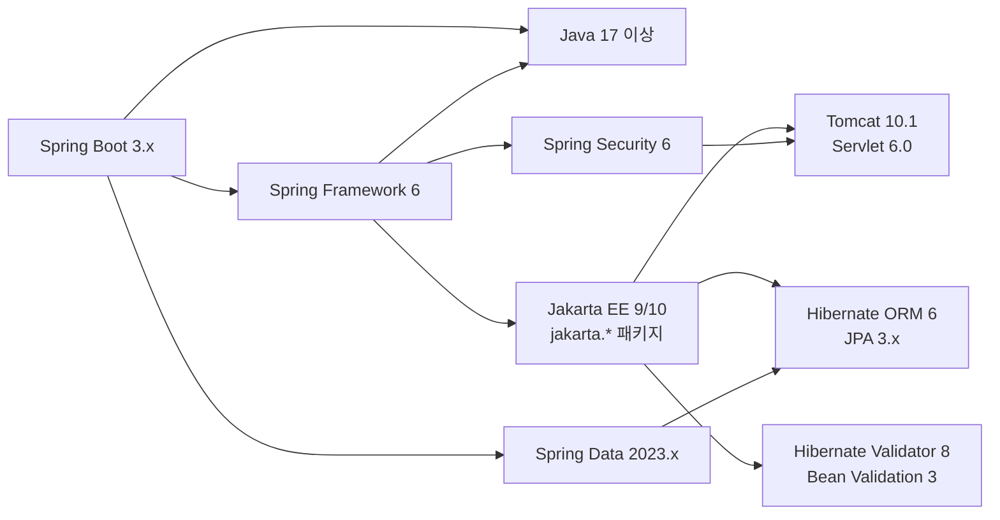
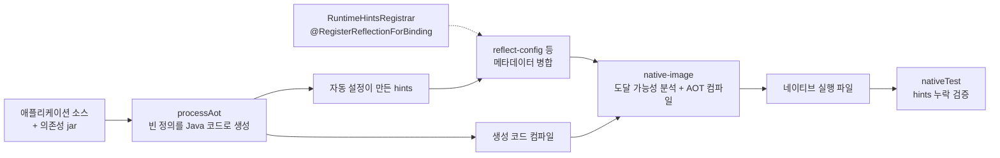
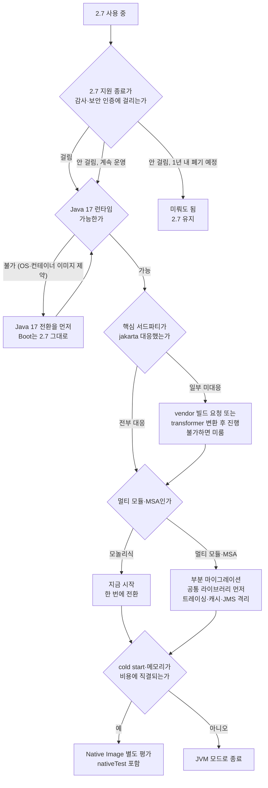

# Spring Boot 2.x vs 3.x 마이그레이션 의사결정
이 문서는 Spring Boot 2.x와 3.x를 어떤 기준으로 비교하고, 마이그레이션을 언제 어떤 방식으로 결정해야 하는지를 다룬다. 실제 마이그레이션 실행 절차는 [Spring_Boot_Migration_2_to_3.md](Spring_Boot_Migration_2_to_3.md)에서 다루므로, 여기서는 차이의 본질과 의사결정에 집중한다.

## 왜 이 비교가 필요한가

2025-08을 기점으로 Spring Boot 2.7의 상용(VMware Tanzu) 지원이 끝났다. OSS 지원은 이미 2023-11에 종료됐다. 즉, 2025년 후반 이후로는 보안 패치를 자체적으로 백포팅하지 않는 한 2.x 라인은 사실상 동결 상태가 된다. 그런데도 2.x를 못 떠나는 팀이 많은 이유는 단 하나다. 마이그레이션 비용을 잘못 추산하기 때문이다. "javax를 jakarta로 바꾸기만 하면 되는 작업"으로 시작해서 Spring Security 필터 체인을 새로 짜고, MockBean이 안 먹어서 테스트 절반을 손보고, Hibernate 6 ID 전략 변화로 운영 DB 시퀀스가 어긋나는 사고를 겪고 나면 그제야 "이건 마이너 업그레이드가 아니라 메이저 리플랫포밍이구나"를 깨닫는다.

이 문서의 목적은 그 비용을 미리 계산할 수 있게 만드는 것이다.

## 버전 매트릭스 - 무엇이 같이 묶여서 올라가는가

Spring Boot 3.x는 단일 라이브러리 업그레이드가 아니다. 한 번에 다섯 개의 메이저 버전이 따라 올라온다.

| 영역 | Spring Boot 2.7 | Spring Boot 3.2 |
|------|-----------------|------------------|
| Java | 8 / 11 / 17 (선택) | 17 최소, 21 권장 |
| Spring Framework | 5.3 | 6.1 |
| Jakarta EE | Java EE 8 (javax) | Jakarta EE 10 (jakarta) |
| Spring Security | 5.7 | 6.2 |
| Spring Data | 2021.x | 2023.x |
| Hibernate ORM | 5.6 | 6.4 |
| Tomcat | 9.x | 10.1 |
| Servlet API | 4.0 | 6.0 |
| Micrometer | 1.9 | 1.12 |
| Tracing | Spring Cloud Sleuth | Micrometer Tracing |

여기서 중요한 건 한 줄도 옵셔널이 아니라는 점이다. Spring Boot 3.x를 쓰려면 Java 17이 강제되고, Java EE는 강제로 Jakarta EE로 바뀌고, Tomcat 10은 Servlet 6 기반이라 9.x용 서블릿 필터가 그대로 안 돌아간다. 따라서 마이그레이션 견적을 낼 때 "Spring Boot만 올린다"는 시나리오는 존재하지 않는다.

아래 도식은 위 표의 항목이 서로 어떻게 물려 있는지를 보여준다. 가운데 Jakarta EE 노드가 Tomcat과 Hibernate를 동시에 끌고 올라가는 축이고, Java 17은 Boot와 Framework 양쪽에서 걸린다. 한 칸만 떼어서 올릴 수 없는 이유가 이 그림이다.



Spring Security 6가 Servlet 6 기반 컨테이너를 전제로 하고, Spring Data JPA가 Hibernate 6을 끌고 온다. 그래서 `javax`를 쓰는 서드파티 jar가 하나라도 남아 있으면 이 그래프의 어느 쪽에서든 런타임에 터진다.

### Spring Framework 6의 영향 범위

Spring Framework 6은 Spring Boot 외부에서도 영향을 준다. 직접 `spring-context`나 `spring-web`을 의존하는 별도 모듈이 회사 내에 있다면 그 모듈도 같이 올라가야 한다. 보통 사내 공통 라이브러리(인증, 로깅, 메시징 SDK 등)가 여기 해당한다. 이 공통 라이브러리가 javax 기반인 채로 머물러 있으면 Spring Boot 3.x 애플리케이션 빌드 단계에서는 통과하지만 런타임에 `NoClassDefFoundError: javax/servlet/ServletException` 같은 형태로 터진다. 마이그레이션 우선순위에서 사내 공통 라이브러리를 가장 먼저 올려야 하는 이유다.

## javax에서 jakarta로 - 견적에서 따로 떼어 볼 부분

가장 단순해 보이지만 가장 사고가 많이 나는 영역이다. IDE의 일괄 변환이나 OpenRewrite 레시피를 돌려도 import 문만 바뀌고, 컴파일러가 못 보는 곳에 `javax`가 남는다. 변환 절차와 코드 예제는 [Spring_Boot_Migration_2_to_3.md](Spring_Boot_Migration_2_to_3.md)의 javax → jakarta 절에 있고, 여기서는 견적에 반영해야 할 범위만 적는다.

| 남는 위치 | 증상이 드러나는 시점 | 찾는 방법 |
|-----------|----------------------|-----------|
| 문자열 FQCN (리플렉션, AOP 포인트컷, SpEL) | 운영에서 해당 메서드가 처음 호출될 때 `ClassNotFoundException` | `grep -rn "javax\." src/`로 import 외 줄을 직접 훑는다 |
| 어노테이션 파라미터의 클래스 리터럴 (`@Constraint(validatedBy=...)`) | 빈 등록 시점에 `HV000074` | 사용자 정의 validator 구현체를 전수 확인 |
| `persistence.xml`, `web.xml` 등 XML | `EntityManagerFactory` 부팅 실패 | namespace URL과 version을 같이 바꿨는지 grep |
| 외부 jar (PG사, SMS, SSO SDK) | 빌드는 통과, 런타임에 `NoClassDefFoundError` | vendor에 jakarta 빌드를 요청하거나 `transformer-cli`로 jar를 변환해 사내 저장소에 올린다 |

네 번째 줄이 일정을 가장 많이 흔든다. vendor 응답이 한 달 걸리면 다른 작업이 다 끝나도 배포가 못 나간다. 의존성 매트릭스 분석에서 외부 SDK 조사를 제일 먼저 시작해야 하는 이유다.

## GraalVM Native Image - 마케팅과 실무의 간극

Spring Boot 3.x의 핵심 마케팅 포인트지만, 실무에서 적용 가능한 워크로드는 상당히 좁다. 2년간 운영하면서 정리된 판단 기준은 다음과 같다.

### Native Image가 가져다주는 것

- 시작 시간 50ms 수준 (JVM은 2~5초)
- RSS 메모리 50~100MB (JVM은 250~500MB)
- 워밍업 없이 첫 요청부터 정상 응답 시간

### Native Image가 가져가는 것

- 빌드 시간 3~10분 (JVM 빌드는 30초)
- 빌드 시 메모리 8~16GB 요구
- 리플렉션, 다이내믹 프록시, JNI, 리소스 접근 모두 사전 등록 필요
- JIT 최적화 부재로 sustained throughput은 JVM 대비 20~30% 낮음
- 힙 덤프, JFR, 동적 agent attach 등 운영 도구 일부 제한

### 적합한 워크로드

- AWS Lambda, Cloud Run 등 cold start가 비용에 직결되는 서버리스
- CLI 툴, 단발성 배치
- 사이드카, 인증 게이트웨이 같이 메모리 점유가 비용인 마이크로 컴포넌트

### 부적합한 워크로드

- 트래픽이 많은 모놀리식 API 서버 (sustained throughput 우선)
- Hibernate, JPA Criteria, MapStruct 등 리플렉션 의존이 많은 도메인
- 운영 중 동적 클래스 로딩, 플러그인 아키텍처가 있는 시스템
- 빌드 파이프라인 시간에 민감한 팀 (CI 비용이 10배가 된다)

### RuntimeHints - 필수 작업

Spring Boot 3.x는 `@AutoConfiguration`이 붙은 자동 설정을 AOT 처리해주지만, 직접 작성한 코드의 리플렉션 메타데이터는 개발자가 등록해야 한다.

```java
@RegisterReflectionForBinding({UserDto.class, OrderDto.class})
@Configuration
public class NativeHintsConfig implements RuntimeHintsRegistrar {

    @Override
    public void registerHints(RuntimeHints hints, ClassLoader cl) {
        hints.reflection()
            .registerType(InternalEvent.class, MemberCategory.INVOKE_DECLARED_CONSTRUCTORS,
                                                MemberCategory.DECLARED_FIELDS);

        hints.resources().registerPattern("messages/*.properties");

        hints.proxies().registerJdkProxy(TransactionalAdvice.class);
    }
}
```

`spring-boot-starter-test`로 돌리는 단위 테스트는 JVM 모드라 이 hints 누락을 감지하지 못한다. 반드시 `nativeTest` 단계까지 CI에 넣어야 한다. 누락된 클래스는 운영에서 처음 호출될 때 `MissingReflectionRegistrationException`으로 터진다.

### 빌드 흐름에서 hints가 끼는 자리

JVM 모드와 달리 Native Image는 빌드 시점에 도달 가능한 코드를 전부 확정한다(closed world). 그래서 런타임에 리플렉션으로 찾는 클래스는 빌드 전에 목록으로 넘겨야 한다. 아래 도식에서 AOT 단계가 만든 hints와 직접 등록한 `RuntimeHints`가 합쳐져 `native-image` 입력이 된다. 점선 쪽이 개발자가 놓치기 쉬운 경로다.



`processAot`가 만드는 hints는 Spring이 아는 범위(자동 설정, `@ConfigurationProperties` 바인딩, `@RegisterReflectionForBinding` 등)까지다. 사내 라이브러리가 리플렉션으로 읽는 DTO나 `Class.forName`으로 찾는 구현체는 점선 경로로 직접 넣어야 한다. 이 경로가 비어 있는 채로 빌드는 성공하고, `nativeTest` 단계를 안 돌리면 운영에서 처음 터진다.

### 의사결정 매트릭스

| 조건 | Native Image 적용 |
|------|-------------------|
| 요청 처리 시간 vs cold start 비율이 후자가 큰 워크로드 | 적합 |
| Hibernate + Spring Data JPA 풀스택 도메인 | 부적합 (hints 관리 비용 과다) |
| 빌드 시간 5분 이상 허용 안 되는 모노레포 | 부적합 |
| 메모리당 인스턴스 단가가 높은 환경 (Lambda 등) | 적합 |
| 동적 빈 등록, BeanPostProcessor 다수 사용 | 부적합 |

Spring Boot 3.x로 올린다고 Native Image까지 같이 갈 필요는 없다. 두 결정을 분리해서 평가해야 한다. 실제로는 90% 이상의 팀이 JVM 모드로 3.x를 쓰고 끝낸다.

## Observability - Sleuth 사라진 자리

Spring Boot 3.x에서 가장 많이 놓치는 영역이다. Spring Cloud Sleuth가 빠지고 Micrometer Tracing이 그 자리를 가져갔다. 이름만 바뀐 게 아니라 API와 설정이 전부 바뀐다.

### Sleuth와 Micrometer Tracing의 차이

Sleuth는 Spring 전용 분산 추적 라이브러리였다. `@NewSpan`, `Tracer`, `Span`이 모두 Spring 패키지에 있었다. Micrometer Tracing은 OpenTelemetry와 Brave 양쪽을 어댑터로 지원하는 추상화 레이어다. 즉, 트레이서 구현체를 직접 골라야 한다.

```xml
<!-- 2.x: Sleuth 단일 의존성 -->
<dependency>
    <groupId>org.springframework.cloud</groupId>
    <artifactId>spring-cloud-starter-sleuth</artifactId>
</dependency>

<!-- 3.x: 추상화 + 구현체 + exporter 세 개 -->
<dependency>
    <groupId>io.micrometer</groupId>
    <artifactId>micrometer-tracing-bridge-otel</artifactId>
</dependency>
<dependency>
    <groupId>io.opentelemetry</groupId>
    <artifactId>opentelemetry-exporter-otlp</artifactId>
</dependency>
<dependency>
    <groupId>org.springframework.boot</groupId>
    <artifactId>spring-boot-starter-actuator</artifactId>
</dependency>
```

Brave를 쓰면 `micrometer-tracing-bridge-brave`, OpenTelemetry를 쓰면 `bridge-otel`이다. 두 개 동시에 의존하면 빈 충돌이 난다.

### MDC와 trace id 전파

가장 자주 부딪히는 회귀다. Sleuth는 `traceId`/`spanId`를 자동으로 MDC에 넣어줬다. Micrometer Tracing 초기 버전은 이걸 안 한다. 로그 패턴에 `%X{traceId}`가 있으면 마이그레이션 직후 trace id가 빈 문자열로 찍힌다.

```yaml
management:
  tracing:
    sampling:
      probability: 1.0
    propagation:
      type: w3c, b3
  observations:
    key-values:
      application: ${spring.application.name}

logging:
  pattern:
    level: "%5p [${spring.application.name},%X{traceId:-},%X{spanId:-}]"
```

`propagation.type`을 명시해야 한다. 기본값이 W3C 단일이라 B3 헤더로 들어오는 trace context를 못 받는다. 회사 내에 Sleuth 시절 시스템이 남아있다면 B3을 같이 켜둬야 trace가 끊기지 않는다.

### Actuator endpoint 변경

| 2.x | 3.x | 비고 |
|-----|-----|------|
| `/actuator/metrics` | 동일 | 내부 차원(tag) 모델 변경 |
| `/actuator/httptrace` | `/actuator/httpexchanges` | 이름 자체가 바뀜 |
| `/actuator/health/{component}` | 동일 | 일부 indicator의 응답 구조 변경 |
| - | `/actuator/observability` | 신규 |

`/actuator/httptrace`를 외부 모니터링이 폴링하고 있었다면 마이그레이션과 동시에 404가 난다. URL 변경은 보통 변경 로그를 안 본 인프라 팀이 가장 먼저 알아챈다.

## 호환성이 깨지는 지점들

여기서부터는 "코드는 빌드되는데 동작이 다른" 케이스다. 가장 까다로운 영역이다.

### Spring Security 6 - SecurityFilterChain 강제

`WebSecurityConfigurerAdapter`가 deprecated를 넘어 제거됐다. 2.x에서 잘 돌던 코드가 3.x 빌드에서 `cannot find symbol`로 멈춘다.

```java
// 2.x 패턴 - 더 이상 컴파일 안 됨
@Configuration
public class SecurityConfig extends WebSecurityConfigurerAdapter {
    @Override
    protected void configure(HttpSecurity http) throws Exception {
        http.authorizeRequests()
            .antMatchers("/admin/**").hasRole("ADMIN")
            .anyRequest().authenticated();
    }
}

// 3.x 패턴 - 빈 등록 방식
@Configuration
public class SecurityConfig {
    @Bean
    SecurityFilterChain filterChain(HttpSecurity http) throws Exception {
        http.authorizeHttpRequests(auth -> auth
                .requestMatchers("/admin/**").hasRole("ADMIN")
                .anyRequest().authenticated())
            .csrf(csrf -> csrf.disable())
            .sessionManagement(s -> s.sessionCreationPolicy(SessionCreationPolicy.STATELESS));
        return http.build();
    }
}
```

`antMatchers`가 `requestMatchers`로 바뀌었고, 람다 DSL이 강제다. 그리고 `authorizeRequests`가 아니라 `authorizeHttpRequests`다. 경로 매칭 알고리즘이 `AntPathRequestMatcher`에서 `MvcRequestMatcher`로 기본값이 바뀌면서 `/admin/users`와 `/admin/users/`를 다르게 처리하는 케이스가 생긴다. 통합 테스트를 돌려보면 trailing slash 차이로 401이 나는 케이스가 운영 진입 후에 발견된다.

### Hibernate 6 - ID 생성 전략 변화

운영 사고가 가장 많이 나는 영역이다.

```java
@Entity
public class Order {
    @Id
    @GeneratedValue(strategy = GenerationType.AUTO)
    private Long id;
}
```

Hibernate 5에서 `GenerationType.AUTO`는 MySQL/MariaDB에서 `IDENTITY`로 매핑됐다. Hibernate 6에서는 `SEQUENCE`로 바뀌었다. MySQL은 시퀀스를 네이티브로 지원하지 않으므로 `hibernate_sequence`라는 테이블을 생성해서 시뮬레이션한다. 마이그레이션 후 첫 INSERT가 나가는 순간 `Table 'hibernate_sequence' doesn't exist`로 터지거나, 더 위험하게는 의도한 auto_increment 컬럼이 1부터 다시 시작하는 사고가 난다.

해결은 명시적 전략 지정이다.

```java
@Id
@GeneratedValue(strategy = GenerationType.IDENTITY)  // MySQL은 IDENTITY 명시
private Long id;
```

기존 코드 베이스를 일괄로 수정해야 하므로 마이그레이션 PR에서 가장 많은 변경이 발생하는 부분이다.

추가로 Hibernate 6에서 `@Column(nullable = false)`와 `@NotNull`의 처리가 더 엄격해졌다. 5에서는 어노테이션 누락을 관대하게 처리하던 부분이 6에서는 `PropertyValueException`으로 터진다. 테스트 픽스처에서 이 누락이 드러나는 경우가 많다.

### MockBean과 SpyBean의 동작 변경

```java
@SpringBootTest
class OrderServiceTest {
    @MockBean
    private PaymentGateway paymentGateway;

    @Test
    void payment() {
        when(paymentGateway.charge(any())).thenReturn(true);
        // ...
    }
}
```

2.x에서는 `@MockBean`이 컨텍스트 캐시를 무효화하는 키로 동작해서, 같은 모킹 조합을 쓰는 테스트끼리는 컨텍스트를 공유했다. 3.x에서는 Spring Framework 6의 `TestContext` 변경으로 모킹 빈 인스턴스 동등성 비교 로직이 바뀌었다. 결과적으로 테스트 클래스마다 컨텍스트가 새로 떠서 테스트 시간이 2~3배가 되는 사례가 있다.

대안은 `@MockitoBean`(Spring Framework 6.2부터 정식 도입) 사용이다. `@MockBean`은 deprecated 예정이고 6.2 이상에서는 `@MockitoBean`이 표준이다. 마이그레이션할 때 무작정 `@MockBean`을 유지하지 말고 새 어노테이션을 검토해야 한다.

### JdbcTemplate 시그니처 변화

조용히 깨지는 영역이다.

```java
// 2.x - queryForObject(String, Object[], Class<T>)
String name = jdbc.queryForObject(
    "SELECT name FROM users WHERE id = ?",
    new Object[]{userId},
    String.class
);

// 3.x - 위 시그니처 deprecated, 새 시그니처
String name = jdbc.queryForObject(
    "SELECT name FROM users WHERE id = ?",
    String.class,
    userId
);
```

가변인자 위치가 뒤로 갔다. 컴파일은 되지만 deprecated 경고가 나고, 일부 오버로드는 제거됐다. 또한 결과가 없을 때 `EmptyResultDataAccessException`을 던지는 동작은 동일하지만, 로깅 레벨과 메시지 포맷이 바뀌어서 알람 룰이 안 맞는 사례가 있다.

### RestTemplate vs RestClient

RestTemplate은 deprecated는 아니지만 maintenance mode다. Spring Framework 6.1에서 `RestClient`가 도입됐고 신규 코드는 RestClient 권장이다. 마이그레이션 자체에 이걸 같이 끼우면 PR이 비대해지므로, 마이그레이션 단계와 RestClient 전환은 분리하는 게 일반적이다.

## 3.x 라인 안에서 따로 들어온 기능

3.0으로 올린 직후에는 쓸 수 없고, 어느 마이너부터 되는지 알아야 하는 기능이 있다. "3.x로 올렸으니 다 된다"고 가정했다가 3.0이나 3.1에 멈춘 서비스에서 설정 키가 안 먹는 경우가 있다.

| 기능 | 도입 시점 | 켜는 방법 | 주의할 점 |
|------|-----------|-----------|-----------|
| ProblemDetail (RFC 7807) | Framework 6.0, Boot 3.0 | `spring.mvc.problemdetails.enabled=true` | 기본값이 꺼짐. 켜면 Spring MVC 기본 예외의 응답 본문이 `application/problem+json`으로 바뀌어 클라이언트 파서가 깨질 수 있다 |
| HTTP Interface (`@HttpExchange`) | Framework 6.0, Boot 3.0 | `HttpServiceProxyFactory`로 프록시 빈 생성 | 3.0에서는 WebClient 어댑터만 있었고, RestClient 어댑터는 3.2에서 붙었다. 자동 설정은 없어 팩토리를 직접 빈으로 등록한다 |
| 가상 스레드 | Boot 3.2 | `spring.threads.virtual.enabled=true` | Java 21 필수. Java 17에서는 설정을 넣어도 적용되지 않으니 런타임 버전을 먼저 확인한다 |

세 기능은 모두 선택 사항이다. 마이그레이션 PR에 끼워 넣으면 견적이 두 배가 된다는 앞의 경고가 그대로 적용된다.

### ProblemDetail

`@ExceptionHandler`마다 `Map`이나 사내 `ErrorResponse` 클래스를 만들던 자리를 표준 포맷이 대신한다.

```java
@RestControllerAdvice
class ApiExceptionHandler extends ResponseEntityExceptionHandler {

    @ExceptionHandler(OrderNotFoundException.class)
    ProblemDetail handle(OrderNotFoundException e) {
        ProblemDetail pd = ProblemDetail.forStatusAndDetail(HttpStatus.NOT_FOUND, e.getMessage());
        pd.setTitle("주문을 찾을 수 없음");
        pd.setProperty("orderId", e.getOrderId());
        return pd;
    }
}
```

사내 공통 에러 포맷(`code`, `message`)을 쓰는 서비스는 `ProblemDetail`로 바꾸는 순간 응답 스키마가 달라진다. 모바일 앱이 `message` 필드를 읽고 있으면 앱 배포와 맞물려야 하므로 마이그레이션과 같은 릴리스에 넣지 않는다.

### HTTP Interface

`RestTemplate`을 감싼 사내 클라이언트 클래스를 인터페이스 선언으로 줄인다.

```java
@HttpExchange("/users")
interface UserClient {
    @GetExchange("/{id}")
    UserResponse find(@PathVariable long id);
}

@Bean
UserClient userClient(RestClient.Builder builder) {
    RestClient client = builder.baseUrl("https://user-api.internal").build();
    return HttpServiceProxyFactory
            .builderFor(RestClientAdapter.create(client))
            .build()
            .createClient(UserClient.class);
}
```

`RestClientAdapter`는 3.2(Framework 6.1) 이상이다. 3.0, 3.1에서는 같은 코드가 컴파일되지 않고 `WebClientAdapter`를 써야 해서 서블릿 스택 프로젝트에 `spring-webflux` 의존이 추가된다.

### 가상 스레드

```yaml
spring:
  threads:
    virtual:
      enabled: true
```

한 줄로 Tomcat 요청 스레드와 `@Async`용 `applicationTaskExecutor`가 가상 스레드로 바뀐다. 요청 스레드 수 제한이 사라져도 DB 커넥션 풀 크기(`HikariCP` 기본 10)는 그대로라, 트래픽이 몰리면 대기 지점이 스레드에서 풀로 옮겨갈 뿐이다. Java 21~23에서는 `synchronized` 블록 안에서 블로킹 I/O를 하면 캐리어 스레드가 고정(pinning)되므로, `synchronized`를 쓰는 구형 JDBC 드라이버나 사내 SDK가 있는지 확인하고 켠다.

3.x 마이너 버전을 단계별로 올리는 순서는 `Spring_Boot_3_Minor_Version_Upgrade_Path.md`를 본다.

## 의사결정 - 언제 미루고 언제 진행할지

순수 기술 관점이 아니라 비즈니스 관점에서 판단해야 한다. 네 가지 질문에 답하면 세 갈래로 나뉜다. 2.7 지원 상태, Java 17 가능 여부, 서드파티 jakarta 대응, 네이티브 이미지 필요 여부 순서로 본다. Native Image는 마이그레이션 여부와 별개 질문이라 마지막에 붙는 분기로 그렸다.



다이아몬드 두 개가 갈림길을 만든다. Q2에서 Java 17이 안 되면 Boot와 상관없이 런타임부터 올려야 하고, 이건 Spring 변경 없이 2.7에서 먼저 끝낼 수 있다. Q3의 "일부 미대응"은 단순 보류가 아니라 대응 시점을 vendor에 물어서 일정을 확정하는 작업이다. 아래 세 절은 각 갈래의 근거다.

### 지금 당장 시작해야 하는 경우

- Spring Boot 2.7 상용 지원 종료(2025-08) 이후 보안 패치를 자체 백포팅할 인력이 없음
- 외부 감사, 보안 인증(ISMS-P, PCI-DSS) 일정상 EOL 라이브러리가 결격 사유가 되는 경우
- Java 17 또는 21 런타임 기능(record 패턴, virtual thread)을 도입하려는 로드맵이 있음
- 사내 공통 라이브러리가 이미 Spring 6/Jakarta로 올라간 경우 (안 따라가면 의존성 지옥)

### 의도적으로 미뤄도 되는 경우

- 유지보수만 하는 레거시 모듈로, 1년 내 폐기 또는 리라이트가 결정됨
- 외부 vendor SDK 중 jakarta 호환 버전이 아직 안 나온 핵심 의존성이 있음
- 팀 빌드 파이프라인이 이미 한계에 가까운데, 마이그레이션 회귀 테스트로 추가 시간을 낼 여유가 없음
- Spring Boot 3.x로 올라가는 것이 별다른 비즈니스 가치를 만들지 못하는 단기 프로젝트

### 부분 마이그레이션의 함정

가장 흔한 실패 패턴이 "일부 모듈만 먼저 3.x로 올리고 나머지는 나중에" 방식이다. 모놀리식이면 강제로 한 번에 가야 하니 문제가 없다. 하지만 멀티 모듈 빌드, 또는 마이크로서비스 환경에서 다음 함정이 자주 터진다.

- **공통 라이브러리 분기**: 같은 사내 라이브러리의 2.x용/3.x용을 동시 유지해야 함. 버그 수정 시 양쪽 패치 필수
- **메시지 큐 호환성**: Kafka/RabbitMQ는 괜찮지만, JMS는 javax.jms vs jakarta.jms 컨버터 충돌
- **분산 트레이싱 단절**: Sleuth(B3)와 Micrometer Tracing(W3C 기본) 사이 trace id 전파 깨짐
- **캐시 직렬화 버전**: Redis에 직렬화된 객체 클래스 패키지가 javax/jakarta로 다르면 역직렬화 실패

부분 마이그레이션을 한다면 이 네 가지를 사전에 격리하는 설계가 먼저다. 그렇지 않으면 "한 모듈만 올렸는데 다른 모듈이 죽는" 현상이 발생한다.

## 작업량 견적 기준

같은 규모(코드베이스 50만 라인 기준)로 마이그레이션을 진행한 사례 세 개를 종합하면 다음과 같다.

| 작업 | 엔지니어-일 |
|------|--------------|
| 의존성 매트릭스 분석 + 외부 SDK jakarta 호환성 조사 | 5~10 |
| javax → jakarta 일괄 변환 + 누락 케이스 색출 | 5~15 |
| Spring Security 6 필터 체인 재작성 | 5~10 |
| Hibernate 6 ID 전략 / 쿼리 호환성 검증 | 10~20 |
| 테스트 인프라 수정 (MockBean 동작 변화 대응) | 5~10 |
| Observability 재구성 (Sleuth → Micrometer Tracing) | 3~7 |
| 통합 테스트, 카나리 배포, 운영 모니터링 기간 | 10~20 |
| **합계** | **약 45~90 인일** |

GraalVM Native Image까지 포함하면 여기에 30~60 인일이 추가된다. 이 견적은 기능 변경 없이 순수 마이그레이션만 했을 때다. 마이그레이션 김에 도메인 정리, RestClient 전환, virtual thread 도입을 같이 끼우면 두 배가 된다. 그래서 마이그레이션과 리팩토링은 분리하는 것이 운영 안정성 면에서 안전하다.

## 마이그레이션 후 관찰해야 할 회귀 지점

배포 직후 며칠간 집중적으로 봐야 할 지표를 정리한다. 통합 테스트로 잡히지 않고 운영 트래픽에서 처음 드러나는 항목들이다.

- **시작 시간**: Spring Framework 6의 빈 등록 방식 변경으로 시작 시간이 10~30% 늘어나는 케이스가 있다. AOT를 안 쓰면 더 그렇다
- **GC 패턴**: Hibernate 6의 메타데이터 캐싱이 더 공격적이라 old gen 점유가 다르게 나온다. 기존 heap 설정이 그대로면 GC pause가 늘 수 있다
- **HTTP 요청 매칭**: Spring MVC의 trailing slash 매칭 기본값이 false로 바뀜. `/api/users/`가 404 나는 케이스
- **Validation 에러 응답 포맷**: Hibernate Validator 8의 메시지 포맷이 미세하게 다름. 클라이언트가 메시지 문자열을 파싱하고 있으면 깨진다
- **Trace id 누락**: Micrometer Tracing 초기 버전에서 비동기 컨텍스트 전파(@Async, CompletableFuture)가 자동으로 안 됨. 별도 ContextPropagator 등록 필요

이 다섯 가지는 통합 테스트에서 잘 드러나지 않는다. 특히 trace id 누락은 대시보드를 직접 보지 않으면 모른다. 마이그레이션 직후 1~2주는 운영 대시보드를 평소보다 자주 봐야 한다.

## 정리

Spring Boot 2.x에서 3.x로의 이동은 라이브러리 버전 업이 아니라 플랫폼 교체에 가깝다. Java 17, Jakarta EE, Spring Framework 6, Spring Security 6, Hibernate 6이 한꺼번에 올라가고, 각각이 호환성을 깨는 변화를 가져온다. 마이그레이션 일정을 짤 때는 javax→jakarta 변환 같은 단순 작업보다 Spring Security 필터 체인 재설계, Hibernate ID 전략 검증, 테스트 인프라 변경, Observability 재구성에 더 많은 시간을 배정해야 한다.

GraalVM Native Image는 별도 의사결정이다. Spring Boot 3.x로 가는 것과 Native Image로 가는 것은 분리해서 평가해야 하며, 대부분의 일반 API 서버는 JVM 모드로 3.x를 쓰는 것이 합리적이다.

EOL 일정상 2025년 후반 이후에는 미루는 비용이 진행하는 비용보다 빠르게 커진다. 다만 부분 마이그레이션은 사내 공통 라이브러리, 메시지 큐, 분산 트레이싱, 캐시 직렬화 네 영역의 호환성 설계를 먼저 끝내고 시작해야 한다.

## 같이 보기

- 실행 절차와 단계별 명령은 [Spring_Boot_Migration_2_to_3.md](Spring_Boot_Migration_2_to_3.md) 참조
- 3.x 마이너 버전 단계별 업그레이드는 `Spring_Boot_3_Minor_Version_Upgrade_Path.md`
- Spring Security 6의 자세한 변경은 `Spring_Security.md`
- Spring Data JPA / Hibernate 관련은 `Spring_Data_JPA.md`
