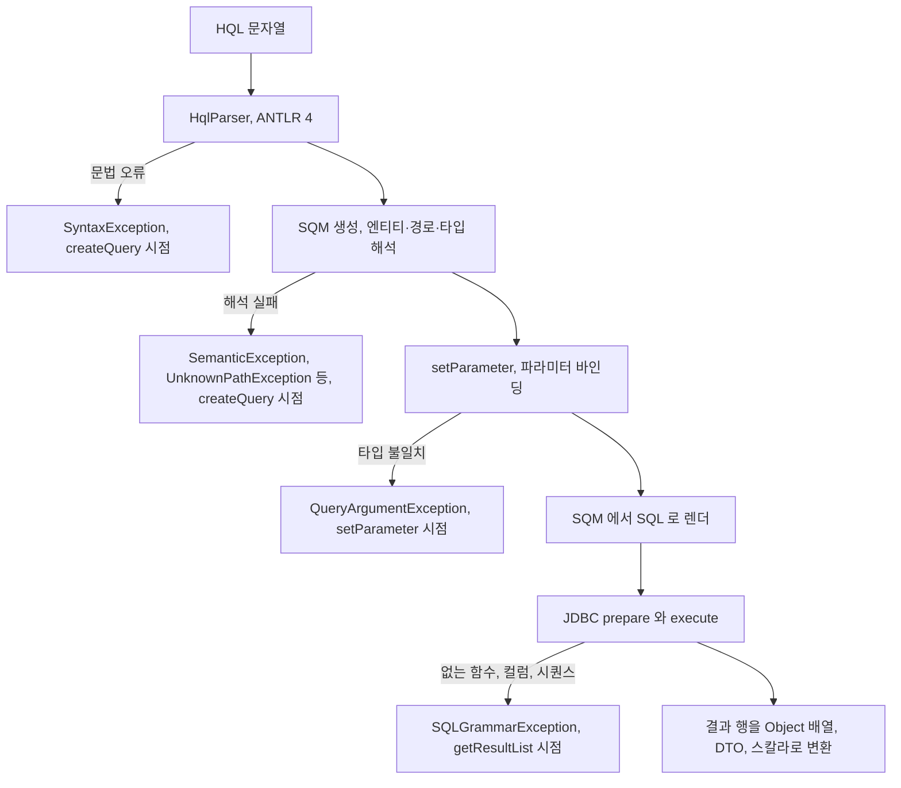
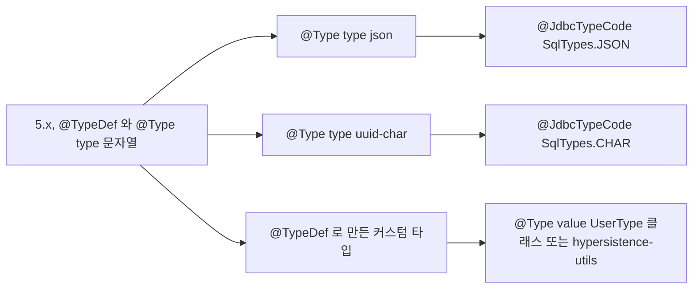
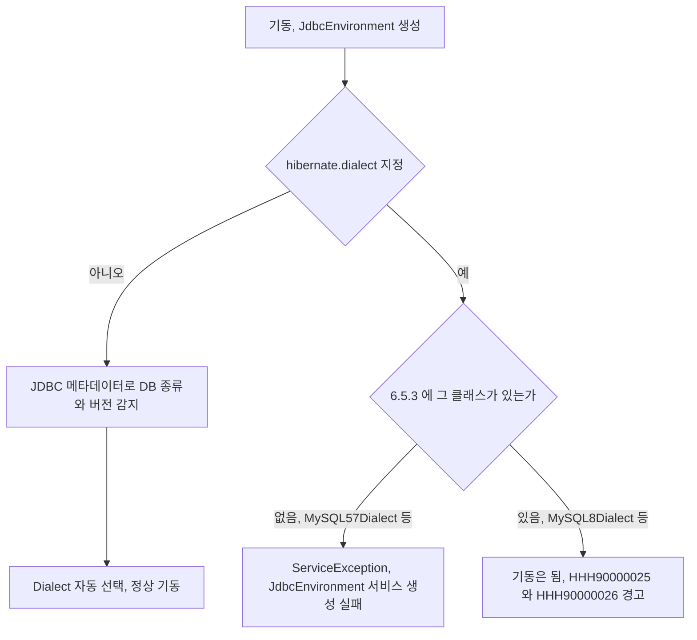
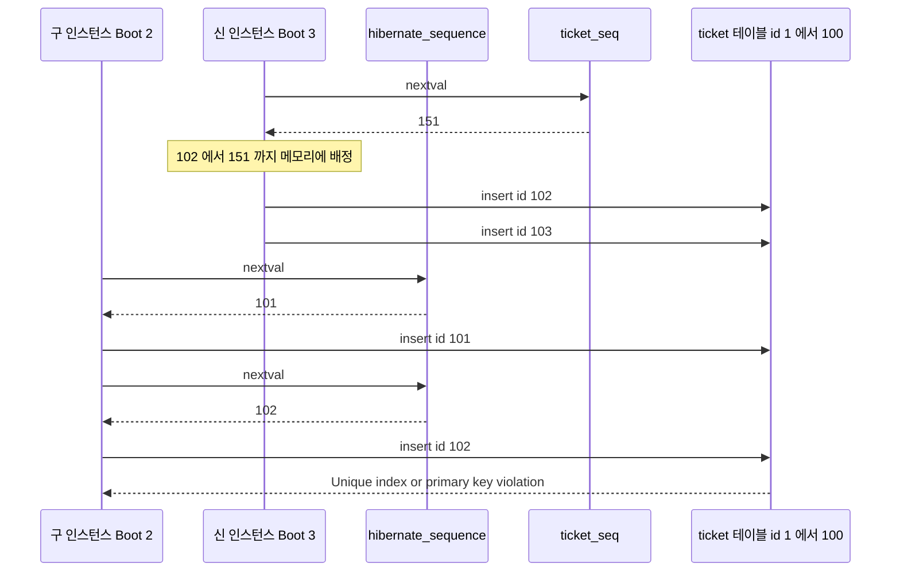
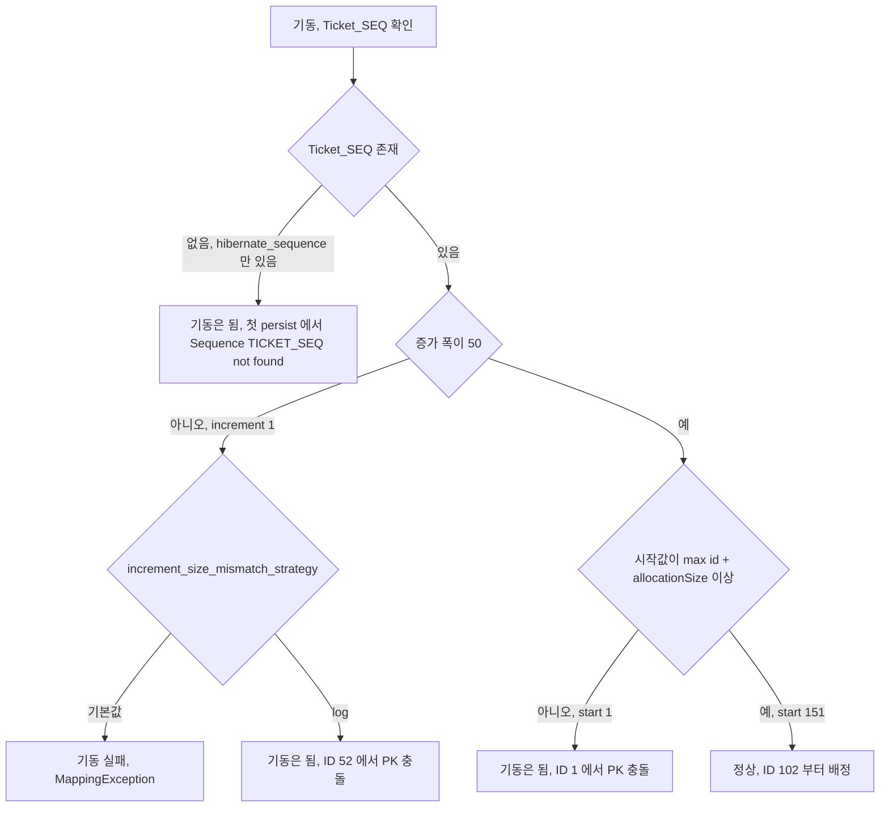
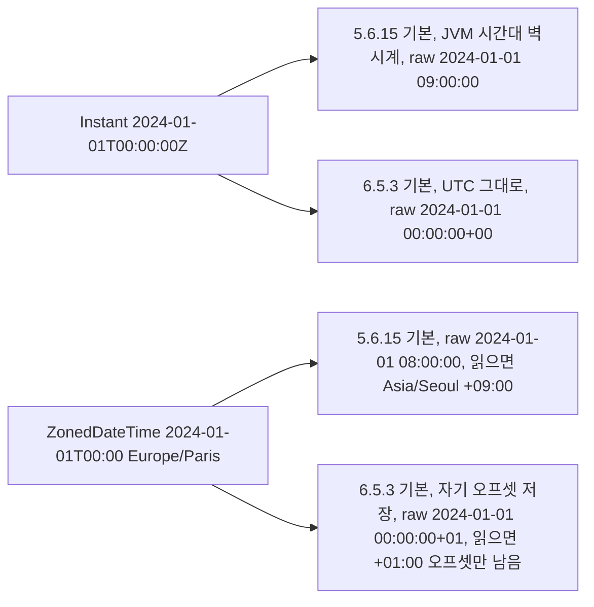
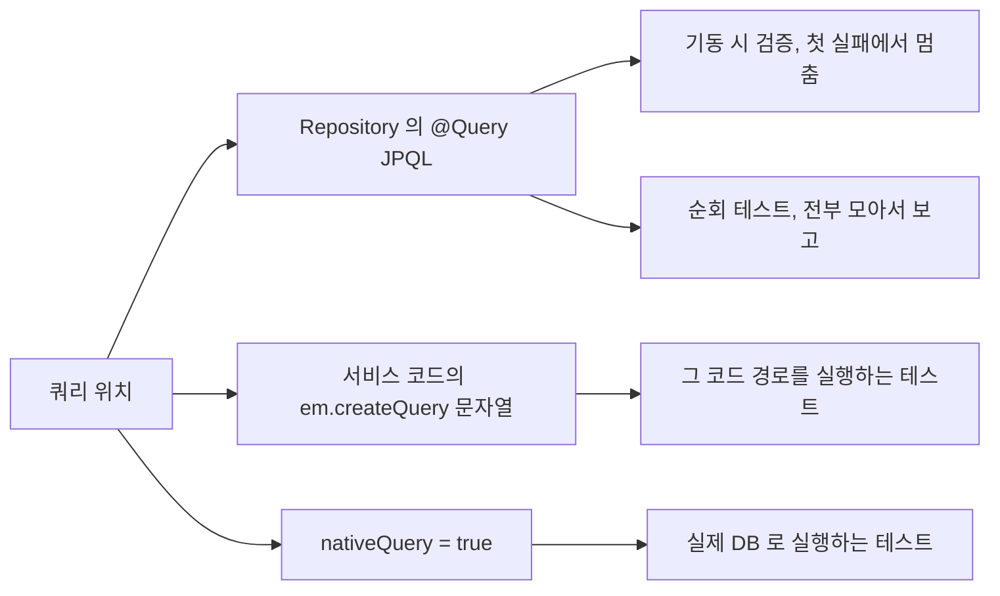

# Hibernate 6 업그레이드에서 깨지는 것들

Boot 3 으로 올리면 Hibernate 가 5.6 에서 6.x 로 같이 올라간다. 소스를 고칠 일은 `javax` → `jakarta` 치환으로 끝나지 않는다. 쿼리 파서가 통째로 바뀌었고, ID 생성 기본값과 시간·UUID·Duration 컬럼 타입이 바뀌었다. 컴파일은 통과하고 기동도 되는데 운영 DB 와 만나는 순간에 깨지는 변경이 대부분이다. 이 문서는 그런 변경만 모았다. `javax` 치환, 의존성 좌표, Security 6 같은 나머지는 [Spring Boot 2.x → 3.x 마이그레이션 심화](Spring_Boot_Migration_2_to_3.md) 와 [Jakarta 전환 도구와 이진 의존성 처리](Jakarta_Migration_Tooling.md) 에 있고 여기서는 다시 쓰지 않는다.

아래 출력은 전부 직접 돌려서 얻은 것이다.

| 구분 | 5.x 쪽 | 6.x 쪽 |
|---|---|---|
| Spring Boot | 2.7.18 | 3.3.4 |
| Hibernate | 5.6.15.Final | 6.5.3.Final |
| DB | H2 2.2.224 (인메모리) | H2 2.2.224 (인메모리) |
| JDK / 빌드 | 17 / Maven 3.6.3 | 17 / Maven 3.6.3 |

MySQL·PostgreSQL 컬럼 타입은 `hibernate.dialect` 를 지정하고 스키마 스크립트만 뽑아서 확인한 것이다. 실제 MySQL·PostgreSQL 서버에 붙여서 돌린 결과가 아니다. 해당 절에서 직접 확인하지 못한 부분은 그렇게 적었다.

---

## HQL 오류는 어느 단계에서 나는가

Hibernate 6 은 HQL 파서를 ANTLR 4 기반으로 새로 썼다. 문자열을 바로 SQL 로 바꾸던 5.x 와 달리, 파싱한 결과를 SQM(Semantic Query Model)이라는 중간 모델로 만들고 거기서 엔티티·경로·타입을 해석한 뒤에 SQL 을 렌더한다. 이 중간 단계가 생기면서 쿼리가 틀렸을 때 **어디서 예외가 나는지**가 달라졌다.

아래 flowchart 는 쿼리 하나가 실행되기까지 거치는 단계와 단계별 예외를 보여준다. 오른쪽 끝 단계(`getResultList`)에서만 터지는 오류는 기동 시점 검증으로 잡을 수 없다는 점을 보면 된다.



실제로 각 단계에서 나오는 에러 원문이다. `createQuery` 와 `setParameter` 를 따로 호출해서 어느 줄에서 던지는지 확인했다.

```text
문법 (createQuery)
  org.hibernate.query.SyntaxException: At 1:27 and token '<EOF>', no viable alternative
  at input 'select o from Order o where*' [select o from Order o where]

  org.hibernate.query.SyntaxException: At 1:0 and token 'selct', no viable alternative
  at input '*selct o from Order o' [selct o from Order o]

해석 (createQuery)
  org.hibernate.query.sqm.UnknownEntityException: Could not resolve root entity 'Ordr'
  org.hibernate.query.sqm.UnknownPathException: Could not resolve attribute 'stauts' of 't.Order'
  org.hibernate.query.SemanticException: Could not interpret path expression 'o'      <- select o from Order  (별칭 선언 없음)

바인딩 (setParameter)
  org.hibernate.query.QueryArgumentException: Argument [PAID] of type [java.lang.String]
  did not match parameter type [t.Status (n/a)]

SQL 단계 (getResultList)
  org.hibernate.exception.SQLGrammarException: could not prepare statement
  [Function "DATE_FORMAT" not found; SQL statement: select date_format(o1_0.createdAt,'%Y') from orders o1_0]
```

마지막 줄이 중요하다. 6 에서 HQL 은 모르는 함수 이름을 그대로 SQL 로 흘려보낸다. `date_format` 이 MySQL 에만 있는 함수여도 HQL 단계에서는 아무 검사도 없고, 그 함수가 없는 DB(여기서는 H2)에서는 SQL 단계에서 처음 터진다. 벤더 함수를 쓰는 쿼리는 파서가 바뀌어도 위험 수준이 그대로다.

SQL 로그에 찍히는 별칭 형식도 `order0_`(5.x)에서 `o1_0`(6.x)로 바뀌었다. 로그를 grep 해서 알람을 거는 곳이 있으면 이 패턴부터 확인해야 한다.

---

## 5.6 에서는 통과하고 6.5 에서 막히는 쿼리

타입이 안 맞는 비교를 5.x 는 SQL 로 그대로 내려보내고 DB 가 판단하게 뒀다. 6 은 SQM 단계에서 직접 판단한다. 같은 쿼리를 두 버전에서 돌린 결과다.

| 쿼리 / 호출 | 5.6.15 | 6.5.3 |
|---|---|---|
| `o.status = 1` (`EnumType.STRING` 컬럼) | 통과해서 DB 가 판단, H2 는 `Data conversion error converting "CHARACTER VARYING to DECFLOAT"` | `createQuery` 에서 `SemanticException` |
| `o.createdAt > '2024-01-01'` (LocalDateTime) | 통과 | `SemanticException` |
| `o.id = '1'` (Long) | 통과 | `SemanticException` |
| `o.id like '1%'` (Long) | 통과 | `SemanticException` |
| `setParameter("s", "PAID")` (enum 파라미터) | `ClassCastException` | `setParameter` 에서 `QueryArgumentException` |
| `setParameter("d", new java.util.Date())` (LocalDateTime 파라미터) | `ClassCastException` | `setParameter` 에서 `QueryArgumentException` |
| `setParameter("id", 1)` (Long 파라미터에 Integer) | `ClassCastException` | 통과 |
| `setParameter("t", 5)` (BigDecimal 파라미터에 Integer) | `ClassCastException` | 통과 |
| `setParameter("id", "1")` (Long 파라미터에 String) | `ClassCastException` | 통과 (`"abc"` 는 `NumberFormatException` 이 원인인 실패) |

방향이 일정하지 않다. HQL 문자열 안의 리터럴 비교는 6 이 엄격해졌고, 숫자 파라미터는 6 이 알아서 변환해 준다. enum 과 `java.util.Date` 는 양쪽 다 막힌다. 파라미터 쪽은 5.x 에서도 `ClassCastException` 이라서 이미 돌아가던 코드라면 건드릴 게 없다.

에러 메시지 원문은 이렇다.

```text
Cannot compare left expression of type 't.Status' with right expression of type 'java.lang.Integer'
Cannot compare left expression of type 'java.time.LocalDateTime' with right expression of type 'java.lang.String'
Cannot compare left expression of type 'java.lang.Long' with right expression of type 'java.lang.String'
Operand of 'like' is of type 'java.lang.Long' which is not a string (its JDBC type code is not string-like)
```

고치는 방식은 쿼리를 정확한 타입으로 쓰는 것이다. 날짜 문자열은 파라미터로 바꾸고, 숫자 컬럼의 `like` 는 `str()` 로 문자열로 바꾼다. `str(o.id) like '1%'` 는 6.5 에서 통과했다. 다만 숫자 컬럼에 `like` 를 거는 쿼리는 인덱스를 못 타는 경우가 많아서, 고치는 김에 쿼리 자체가 맞는지 확인하는 편이 낫다.

```java
// 5.x 에서 돌던 쿼리
@Query("select o from Order o where o.createdAt > '2024-01-01'")

// 6 에서는 파라미터로
@Query("select o from Order o where o.createdAt > :from")
List<Order> findAfter(@Param("from") LocalDateTime from);
```

### 6.5 에서 막히지만 5.6 에서도 막히던 것

6 으로 올리면서 처음 깨진다고 오해하기 쉬운 항목이 있다. 아래는 5.6.15 에서 이미 같은 이유로 실패한다. 메시지만 바뀌었다.

| 쿼리 | 5.6.15 메시지 | 6.5.3 메시지 |
|---|---|---|
| `where o.id = ?` (번호 없는 `?`) | `Legacy-style query parameters (`?`) are no longer supported; use JPA-style ordinal parameters (e.g., `?1`) instead` | `ParameterLabelException: Unlabeled ordinal parameter ('?' rather than ?1)` |
| `where o.items.quantity > 1` (컬렉션 경로를 바로 참조) | `illegal attempt to dereference collection [order0_.id.items] with element property reference [quantity]` | `PathException: Plural path 't.Order(o).items' refers to a collection and so element attribute 'quantity' may not be referenced directly (use element() function)` |
| `join fetch o.items i with i.quantity > 1` | `with-clause not allowed on fetched associations; use filters` | `SemanticException: Fetch join has a 'with' clause (use a filter instead)` |
| `select new OrderSummary(...)` (패키지 없는 클래스명) | `Unable to locate class [OrderSummary]` | `Could not resolve class 'OrderSummary' named for instantiation` |

Boot 2.7 에서 이미 돌고 있는 서비스라면 위 네 가지는 이미 고쳐져 있다. 번호 없는 `?` 는 Boot 2.0·2.1 시절의 Hibernate 5.2·5.3 에서 올라오는 경우에나 마주친다.

반대로 **6 에서 막힌다고 알려졌는데 실제로는 통과하는 것**도 있다. 아래는 6.5.3 에서 직접 돌려 정상 동작을 확인했다. 쿼리를 고치기 전에 먼저 돌려 봐야 한다.

- `select count(*) from Order o` 는 정상이다. `count(o)` 로 바꿀 필요가 없다.
- `select o.items from Order o` (select 절의 컬렉션 경로)도 통과한다.
- `where o.customer.city = 'seoul'`, `join o.customer.address` 같은 단일 값 연관 경로를 타는 암묵적 조인은 where·join 절 모두 통과한다.
- `from Order where id = 1` 처럼 별칭 없이 속성을 쓰는 형태도 통과한다.
- `select 1`, `select current_date` 처럼 `from` 이 없는 쿼리는 6.5 에서 **통과하고** 5.6 에서 실패한다 (`QuerySyntaxException: unexpected end of subtree`). `from` 없는 쿼리 때문에 6 에서 깨지는 경우는 못 찾았다. 반대로 5.x 에서 쓰지 못하던 문법이 열린 쪽이다.
- `select o from Order o where o.status = 'PAID'` (STRING enum 에 문자열 리터럴)는 양쪽 다 통과한다.

### select new

`select new` 는 6 에서 생성자 매칭이 SQM 단계로 올라왔다. 위에 있던 5.x 메시지와 비교하면, 5.x 는 `Expected arguments are: long, long` 이라고 기대 시그니처를 알려줬는데 6 은 `Missing constructor for type 'OrderSummary'` 로 끝나서 원인을 찾기 어렵다.

```java
public class OrderSummary {
    public OrderSummary(Long id, Integer cnt) {}
}
```

```text
select new t.OrderSummary(o.id, count(i)) from Order o join o.items i group by o.id

Missing constructor for type 'OrderSummary' [select new t.OrderSummary(o.id, count(i)) from ...]
```

`count()` 는 `Long` 을 돌려주는데 생성자는 `Integer` 를 받는다. 5.6 에서도 같은 이유로 실패했으니 새 문제는 아니지만, 6 은 인자 타입 목록을 안 보여 준다. 해결은 DTO 생성자를 `Long` 으로 바꾸거나 쿼리에서 `cast(count(i) as integer)` 를 쓰는 것이다. 후자는 6.5.3 에서 통과했다. 완전한 클래스명(`t.OrderSummary`)을 쓰는 것도 5.x 와 같다. 이 에러를 만나면 먼저 인자 타입을 하나씩 대조해야 한다. 집계 함수 반환 타입은 `count` → `Long`, `sum(int)` → `Long`, `avg(int)` → `Double` 이다(6.5.3 에서 확인).

---

## 반환 타입과 Criteria API

### 네이티브 쿼리의 스칼라 타입

`createNativeQuery("select count(*) ...").getSingleResult()` 가 돌려주는 타입이 바뀌었다.

| 쿼리 | 5.6.15 | 6.5.3 |
|---|---|---|
| `select count(*) from orders` | `java.math.BigInteger` | `java.lang.Long` |
| `select sum(quantity) from OrderItem` (int 컬럼) | `java.math.BigInteger` | `java.lang.Long` |

H2 기준 결과다. 5.x 에서 `(BigInteger) result` 로 캐스팅하거나 `.longValue()` 앞에 `BigInteger` 타입을 가정한 코드는 6 에서 `ClassCastException` 이 난다. 컴파일은 `Object` 로 받으니 통과한다.

```java
// 6 에서 ClassCastException
BigInteger n = (BigInteger) em.createNativeQuery("select count(*) from orders").getSingleResult();

// 어느 버전에서도 안전
long n = ((Number) em.createNativeQuery("select count(*) from orders").getSingleResult()).longValue();
```

HQL 쪽 집계 반환 타입은 두 버전이 같다. 네이티브 쿼리만 바뀐 것이다. 네이티브 `count` 를 쓰는 코드는 `grep -rn "BigInteger" src/` 로 먼저 찾는 게 빠르다.

### 없어진 API

6.5.3 에서 컴파일 오류로 확인한 것들이다. 5.6 에서는 deprecated 경고만 나던 것도 포함된다.

```text
Session.createSQLQuery("select 1")
  error: cannot find symbol  symbol: method createSQLQuery(String)
  (5.6.15 에서는 [deprecation] 경고만)

org.hibernate.Criteria                      ClassNotFoundException
org.hibernate.criterion.Restrictions        ClassNotFoundException
```

Hibernate 고유의 `Criteria`·`Restrictions` 쓰던 코드는 JPA `CriteriaBuilder` 로 다시 써야 한다. `createSQLQuery` 는 `createNativeQuery` 로 바꾼다. JPA Criteria 쪽은 값 변환 동작만 달라졌다.

| 호출 | 5.6.15 | 6.5.3 |
|---|---|---|
| `cb.equal(root.get("status"), "PAID")` (enum 에 문자열) | `ClassCastException: String cannot be cast to Enum` | 통과 |
| `cb.equal(root.get("id"), "abc")` (Long 에 숫자 아닌 문자열) | `NumberFormatException` | `CoercionException: Error coercing value` |
| `cb.like(root.get("id"), "1%")` (Long 에 like) | `ClassCastException` | `CoercionException: Error coercing value` (원인은 `NumberFormatException: For input string: "1%"`) |
| `cb.gt(root.get("total"), 5)` (BigDecimal 에 int) | 통과 | 통과 |

HQL 문자열과 달리 Criteria 는 6 이 오히려 느슨하다. Criteria 로 쓴 동적 쿼리가 6 에서 새로 막히는 경우는 이번 범위에서 찾지 못했다.

---

## @Type, @TypeDef 제거와 JdbcType

`@TypeDef` 는 6 에서 사라졌다. `@Type` 은 남았지만 속성이 `String type()` 에서 `Class<? extends UserType<?>> value()` 로 바뀌었다.

```text
@Type(type = "uuid-char") java.util.UUID uid;

error: cannot find symbol  symbol: method type()  location: @interface Type
error: annotation @Type is missing a default value for the element 'value'

import org.hibernate.annotations.TypeDef;
error: cannot find symbol  symbol: class TypeDef
```

이름으로 타입을 찾던 방식(`"json"`, `"uuid-char"`)이 없어졌다. 대체재는 컬럼의 JDBC 타입을 지정하는 `@JdbcTypeCode` 다. JSON 컬럼의 구체적인 매핑 방법과 Jackson 설정은 [JSON 컬럼 JPA 매핑](../../../DataBase/RDBMS/JSON_Column_JPA.md) 에 있고, 여기서는 업그레이드 때 바뀌는 지점만 다룬다.

아래 flowchart 는 5.x 에서 이름 문자열로 타입을 지정하던 방식이 6 에서 무엇으로 바뀌는지 대응시킨 것이다. 이름 기반 지정은 전부 `@JdbcTypeCode` 의 JDBC 타입 지정으로 모이고, 커스텀 타입이 남아 있을 때만 `@Type(value = ...)` 와 서드파티 라이브러리가 필요하다.



```java
@Entity
public class Doc {
    @Id @GeneratedValue(strategy = GenerationType.IDENTITY)
    Long id;

    @JdbcTypeCode(SqlTypes.JSON)
    Map<String, Object> attrs;

    @JdbcTypeCode(SqlTypes.JSON)
    List<String> tags;

    @Column(columnDefinition = "char(36)")
    @JdbcTypeCode(SqlTypes.CHAR)
    UUID uidChar;

    @JdbcTypeCode(SqlTypes.BINARY)
    UUID uidBin;

    UUID uid;
}
```

이 엔티티로 뽑은 DDL 이다.

```text
PostgreSQL:  attrs jsonb, tags jsonb, uid uuid, uidBin bytea, uidChar char(36)
MySQL:       attrs json,  tags json,  uid binary(16), uidBin binary(16), uidChar char(36)
H2:          attrs json,  tags json,  uid uuid, uidBin binary(16), uidChar char(36)
```

H2 에 실제로 저장하고 꺼낸 결과는 `{"color":"red"}`, `["a","b"]` 로 들어가 `{color=red}`, `[a, b]` 로 돌아왔고 UUID 세 컬럼 모두 원래 값과 `equals` 였다.

`SqlTypes.JSON` 은 Jackson 이나 JSON-B 가 클래스패스에 있어야 동작한다. 6.5.3 에서는 Jackson 을 직접 넣어서 확인했다.

### UUID 기본 매핑이 바뀐다

`@Type` 없이 `UUID` 필드만 쓰던 엔티티도 영향을 받는다. 기본 컬럼 타입이 5.x 와 6.x 에서 다르다.

| DB | 5.6.15 (`MySQL8Dialect`, `PostgreSQL10Dialect`, H2) | 6.5.3 |
|---|---|---|
| MySQL | `binary(255)` | `binary(16)` |
| PostgreSQL | `uuid` | `uuid` |
| H2 | `binary(255)` | `uuid` |

`ddl-auto=validate` 로 운영 스키마와 대조할 때 MySQL 의 `binary(255)` → `binary(16)` 차이가 어떻게 보고되는지는 확인하지 못했다. 이미 `char(36)` 로 저장하던 컬럼이라면 `@JdbcTypeCode(SqlTypes.CHAR)` 를 명시해야 한다. 안 쓰면 6 이 `binary(16)` 로 읽고 쓰려 한다. `binary(255)` 로 저장하던 데이터는 마이그레이션 전에 스테이징 DB 에서 한 건 읽어 보고 값이 맞는지 직접 확인해야 한다.

### 서드파티 JSON 타입 라이브러리

`@TypeDef` 로 `JsonType` 을 쓰던 프로젝트는 `hibernate-types-52` 를 쓰고 있다. 이 좌표는 Hibernate 5.2~5.6 용이다. 6.x 용은 이름이 바뀌었다.

| Hibernate | 좌표 |
|---|---|
| 5.x | `com.vladmihalcea:hibernate-types-52` (최종 2.21.1) |
| 6.2 | `io.hypersistence:hypersistence-utils-hibernate-62` (최종 3.9.4) |
| 6.3 이상 | `io.hypersistence:hypersistence-utils-hibernate-63` (3.16.0 확인) |

Boot 3.3.4 는 Hibernate 6.5.3 이라 `-63` 을 쓴다. 대부분의 JSON 컬럼은 라이브러리 없이 `@JdbcTypeCode(SqlTypes.JSON)` 으로 대체할 수 있어서, 이 라이브러리를 계속 끌고 갈지는 `@Type(JsonType.class)` 의 `jsonb` 매핑이나 `@TypeDef` 로 만든 커스텀 타입이 남아 있는지로 정한다.

---

## Dialect 를 지정하던 설정

6 은 JDBC 메타데이터로 DB 종류와 버전을 알아내서 Dialect 를 고른다. `hibernate.dialect` 를 명시하면 경고가 나오고, 5.x 에만 있던 클래스를 지정하면 기동이 실패한다.

```text
hibernate.dialect=org.hibernate.dialect.H2Dialect
  WARN: HHH90000025: H2Dialect does not need to be specified explicitly using 'hibernate.dialect'
        (remove the property setting and it will be selected by default)

hibernate.dialect=org.hibernate.dialect.MySQL8Dialect
  WARN: HHH90000025: MySQL8Dialect does not need to be specified explicitly using 'hibernate.dialect' ...
  WARN: HHH90000026: MySQL8Dialect has been deprecated; use org.hibernate.dialect.MySQLDialect instead

hibernate.dialect=org.hibernate.dialect.MySQL57Dialect
  ServiceException: Unable to create requested service [org.hibernate.engine.jdbc.env.spi.JdbcEnvironment]
  due to: Unable to resolve name [org.hibernate.dialect.MySQL57Dialect] as strategy [org.hibernate.dialect.Dialect]
```

아래 flowchart 는 `hibernate.dialect` 를 지정했을 때 기동이 어느 쪽으로 갈리는지 보여준다. 지정한 클래스가 6.5.3 에 남아 있느냐가 경고로 끝나느냐 기동 실패냐를 가른다.



6.5.3 에서 클래스 존재 여부를 `Class.forName` 으로 확인한 결과다.

| 클래스 | 5.6.15 | 6.5.3 |
|---|---|---|
| `MySQL57Dialect`, `MySQL5InnoDBDialect` | 있음 | 없음 |
| `PostgreSQL95Dialect`, `PostgreSQL10Dialect` | 있음 | 없음 |
| `MariaDB103Dialect` | 있음 | 없음 |
| `Oracle12cDialect` | 있음 | 없음 |
| `MySQL8Dialect` | 있음 | 있음 (deprecated, `MySQLDialect` 로 대체) |
| `PostgreSQLDialect` | 있음 | 있음 |

Boot 2 프로젝트의 `application.yml` 에 `spring.jpa.database-platform: org.hibernate.dialect.MySQL57Dialect` 나 `spring.jpa.properties.hibernate.dialect` 가 남아 있으면 기동 단계에서 위 `ServiceException` 이 난다. 에러 메시지가 Dialect 이름을 짚어 주긴 하지만 스택 맨 위는 `JdbcEnvironment` 서비스 생성 실패라서 처음 보면 DB 연결 문제로 착각한다. 설정에서 그 줄을 지우는 게 해결이다.

방언을 직접 지정해야 하는 경우도 있다. 메타데이터 조회가 막힌 환경(연결 시점에 DB 가 없는 이미지 빌드 등)이나 MariaDB 처럼 버전 감지가 어긋나는 경우다. 그때는 `MySQLDialect`·`PostgreSQLDialect` 같은 버전 없는 클래스를 쓴다.

---

## AUTO 시퀀스 이름과 allocationSize

`@GeneratedValue(strategy = GenerationType.AUTO)` 의 동작 설명은 [Spring Boot 2.x → 3.x 마이그레이션 심화](Spring_Boot_Migration_2_to_3.md) 에 있다. 여기서는 DB 에 실제로 만들어지는 객체가 어떻게 달라지는지 DDL 로 대조하고, 시퀀스가 안 맞을 때 어떤 증상이 나오는지 실행한 결과를 적는다. 엔티티는 `@Id @GeneratedValue Long id` 만 가진 `Ticket` 이다.

```text
5.6.15 + PostgreSQL10Dialect
  create sequence hibernate_sequence start 1 increment 1;

5.6.15 + MySQL8Dialect
  create table hibernate_sequence (next_val bigint) engine=InnoDB;

6.5.3 + PostgreSQLDialect
  create sequence Ticket_SEQ start with 1 increment by 50;

6.5.3 + MySQLDialect
  create table Ticket_SEQ (next_val bigint) engine=InnoDB;
```

세 가지가 바뀐다.

- 이름이 `hibernate_sequence` 하나를 모든 엔티티가 공유하던 구조에서 엔티티마다 `{엔티티명}_SEQ` 로 바뀐다. Boot 의 기본 네이밍(snake_case)을 거치면 `OrderLine` 엔티티는 `order_line_seq` 가 된다(Boot 3.3.4 + H2 로 확인).
- 증가 폭이 1 에서 50 으로 바뀐다. `allocationSize` 의 기본값이다.
- MySQL 은 시퀀스가 없어서 테이블로 흉내 낸다. 5.6 에서도 `AUTO` 는 `IDENTITY` 가 아니라 `hibernate_sequence` 테이블이었다. 6 에서는 그 테이블이 엔티티마다 하나씩 생긴다.

### 롤링 배포에서 PK 가 겹치는 흐름

`increment 50` 은 Hibernate 가 시퀀스를 한 번 호출해서 50 개 ID 를 메모리에 받아 두고 쓰는 방식(pooled optimizer)이다. 시퀀스가 돌려주는 값은 구간의 **끝**이다. 값이 151 이면 애플리케이션은 102~151 을 쓴다.

기존 테이블이 `hibernate_sequence` 로 만든 id 1~100 을 갖고 있고, 시퀀스는 101 부터 줄 차례다. DBA 가 새 `ticket_seq` 를 `start with 151 increment by 50` 으로 만들어 뒀다. 새 버전이 먼저 뜬 뒤 구 버전이 아직 남아 있는 구간에 일어나는 일이 아래 sequenceDiagram 이다. 구 인스턴스가 쓰는 시퀀스와 신 인스턴스가 쓰는 시퀀스가 **서로 다른 객체인데 같은 테이블에 id 를 넣는다**는 점을 보면 된다.



이 흐름을 H2 에서 실제로 재현했다. 신 버전이 `[102, 103, 104]` 를 받아 커밋한 뒤 구 버전이 `[101, 102, 103]` 을 받았고, 102 에서 이렇게 실패했다.

```text
Unique index or primary key violation: "PRIMARY KEY ON PUBLIC.TICKET(ID) ( /* key:102 */ CAST(102 AS BIGINT), 'x')"
```

롤링 배포 중 두 버전이 같은 테이블에 쓰는 동안은 계속 일어난다. 구 버전이 내려갈 때까지 일부 요청이 PK 충돌로 실패한다. 배포가 끝나서 구 버전이 없어지면 사라지기 때문에, 장애 시간이 짧고 재시도하면 성공해서 놓치기 쉽다.

### 시퀀스 상태별 증상

같은 `Ticket` 엔티티(기존 행 id 1~100)로 DB 쪽 시퀀스 상태만 바꿔서 돌렸다. `ddl-auto=none` 이다.

아래 flowchart 는 표의 다섯 상태를 기동 시 검사 순서대로 펼친 것이다. 존재 여부, 증가 폭, 시작값 순으로 걸러지고 마지막 검사만 기동 후 첫 insert 에서 드러난다는 점을 보면 된다.



| 시퀀스 상태 | 증상 |
|---|---|
| `Ticket_SEQ` 가 없고 `hibernate_sequence` 만 있음 | 기동은 되고 첫 persist 에서 `Sequence "TICKET_SEQ" not found` (`SQLGrammarException`) |
| `Ticket_SEQ` 를 옵션 없이 생성 (increment 1) | 기동 실패, `MappingException: The increment size of the [Ticket_SEQ] sequence is set to [50] in the entity mapping while the associated database sequence increment size is [1]` |
| 위와 같고 `hibernate.id.sequence.increment_size_mismatch_strategy=log` | 기동은 되고 ID 가 `[52, 53, 54]` 로 배정, 52 에서 PK 충돌 |
| `Ticket_SEQ start with 1 increment by 50` (dev 에서 `ddl-auto` 가 만든 것과 같은 모양) | 기동은 되고 ID 가 `[1, 2, 3]` 로 배정, 1 에서 PK 충돌 |
| `Ticket_SEQ start with 151 increment by 50` | 정상, ID `[102, 103, 104]` |

이 표에서 읽을 수 있는 건 네 가지다.

- 증가 폭이 DB 와 엔티티 사이에서 어긋나면 6.5 는 **기동을 막는다.** 6.5.3 에서 `ddl-auto=none` 이어도 막혔다. 이 검사는 JDBC 메타데이터를 읽어서 하는 것으로 보이는데, 메타데이터 조회를 끈 환경에서의 동작은 확인하지 못했다.
- 시퀀스는 증가 폭을 맞춰서 만들어도 **시작값**이 틀리면 첫 insert 에서 PK 충돌이 난다. 세 번째 행처럼 dev 환경에서 `ddl-auto` 로 만든 시퀀스(start 1)를 스크립트로 그대로 운영에 옮기면 이렇게 된다.
- 시작값은 `max(id) + allocationSize` 이상이어야 한다. id 최대값이 100 이면 150 이상이다. 150 이면 구간이 101~150 이다.
- `increment_size_mismatch_strategy` 를 `log` 로 낮추면 기동 검사가 사라진다. 에러 메시지가 귀찮아서 이 값을 바꾸면 충돌 위험이 그대로 운영으로 넘어간다.

### 맞추는 방법

롤링 배포 중 충돌을 피하려면 새 버전이 **구 버전과 같은 시퀀스**를 쓰게 만드는 방법이 가장 안전하다. 두 버전이 같은 DB 객체에서 값을 받으면 겹칠 수가 없다. 6.5.3 에서 두 가지를 확인했다.

```java
@Id
@GeneratedValue(strategy = GenerationType.SEQUENCE, generator = "g")
@SequenceGenerator(name = "g", sequenceName = "hibernate_sequence", allocationSize = 1)
Long id;
```

엔티티를 `hibernate_sequence`(101 시작, increment 1)에 묶으면 ID 가 `[101, 102, 103]` 으로 순차 배정되고 커밋된다. 엔티티가 많으면 전부 고치는 대신 설정 하나로 옛 동작을 되돌릴 수 있다.

```yaml
spring:
  jpa:
    properties:
      hibernate:
        id:
          db_structure_naming_strategy: legacy
```

`legacy` 로 DDL 을 만들어 보니 시퀀스가 `HIBERNATE_SEQUENCE`, 증가 폭이 1 이었다. 기본 설정에서는 `TICKET_SEQ`, 증가 폭이 50 이었다. 이름만 돌아오는 게 아니라 증가 폭도 같이 1 로 돌아온다. 다만 MySQL 에서 이 설정이 5.x 와 똑같은 `hibernate_sequence` 테이블을 쓰는지는 확인하지 못했다.

완전히 새 방식(`ticket_seq`, 증가 폭 50)으로 가려면 배포 전에 마이그레이션 스크립트로 시퀀스를 만든다.

```sql
-- id 최대값 100, allocationSize 50 인 경우
create sequence ticket_seq start with 150 increment by 50;
```

이 경우 구 버전이 `hibernate_sequence` 로 id 를 계속 발급하는 동안 신 버전이 같은 테이블에 쓰면 위 sequenceDiagram 의 충돌이 난다. 구 버전을 완전히 내린 시점에 `max(id)` 를 다시 재서 시작값을 정해야 한다. 롤링 중 공존하는 구간이 길면 앞의 두 방법을 택하는 것이 낫다.

---

## 시간 타입과 Duration 의 컬럼 매핑

`Instant`, `ZonedDateTime`, `OffsetDateTime`, `Duration` 필드는 컬럼 타입과 저장 값의 의미가 같이 바뀐다. 스키마 검증이 걸리는 건 `Duration` 하나다. 나머지는 검증을 통과해 버려서 값이 틀어진 채로 운영에 나간다.

### 컬럼 타입

`Event` 엔티티(`Instant occurredAt`, `ZonedDateTime zoned`, `OffsetDateTime offsetAt`, `LocalDateTime local`, `Duration lead`)로 뽑은 DDL 이다.

| 필드 | 5.6.15 (PostgreSQL10Dialect / MySQL8Dialect) | 6.5.3 (PostgreSQLDialect / MySQLDialect) |
|---|---|---|
| `Instant` | `timestamp` / `datetime(6)` | `timestamp(6) with time zone` / `datetime(6)` |
| `ZonedDateTime` | `timestamp` / `datetime(6)` | `timestamp(6) with time zone` / `datetime(6)` |
| `OffsetDateTime` | `timestamp` / `datetime(6)` | `timestamp(6) with time zone` / `datetime(6)` |
| `LocalDateTime` | `timestamp` / `datetime(6)` | `timestamp(6)` / `datetime(6)` |
| `Duration` | `int8` / `bigint` | `numeric(21,0)` / `decimal(21,0)` |

`LocalDateTime` 은 안 바뀌고, PostgreSQL 은 `Instant`·`ZonedDateTime`·`OffsetDateTime` 이 `timestamptz` 로 바뀐다. MySQL 은 `datetime(6)` 으로 그대로다. `Duration` 은 두 DB 모두 `bigint` 계열에서 `numeric(21,0)` 계열로 바뀐다. 이 타입은 6.0·6.1 에서 `interval second` 였다가 그 뒤로 바뀌었다는 이야기가 있어서 6.0·6.1 을 쓰는 경우 위 표와 달라질 수 있다. 이 문서에서는 6.5.3 만 확인했다.

### 검증이 걸리는 것과 안 걸리는 것

5.x 스키마(`lead bigint`)를 두고 6.5.3 으로 `ddl-auto=validate` 를 돌린 결과다.

```text
Schema-validation: wrong column type encountered in column [lead] in table [Event];
found [bigint (Types#BIGINT)], but expecting [numeric(21,0) (Types#NUMERIC)]
```

반면 `Instant` 컬럼이 `timestamp(6)`(tz 없음)인 5.x 스키마는 H2 에서 **검증을 통과했다.** PostgreSQL 에서 `timestamp` 와 `timestamptz` 의 차이가 같은 방식으로 통과하는지는 확인하지 못했다. 통과하는 DB 에서는 코드가 에러 없이 올라가서 값만 틀어진다.

### 같은 값이 다르게 저장된다

JVM 시간대를 `Asia/Seoul` 로 두고 같은 값을 5.6.15 와 6.5.3 에서 저장해서 H2 에 원본 컬럼 값을 읽었다.

```text
저장한 값
  Instant        2024-01-01T00:00:00Z
  ZonedDateTime  2024-01-01T00:00 Europe/Paris
  Duration       90분

5.6.15 (기본 설정)
  raw  occurredAt=2024-01-01 09:00:00   zoned=2024-01-01 08:00:00   lead=5400000000000
  back occurredAt=2024-01-01T00:00:00Z  zoned=2024-01-01T08:00+09:00[Asia/Seoul]  lead=PT1H30M

6.5.3 (기본 설정)
  raw  occurredAt=2024-01-01 00:00:00+00   zoned=2024-01-01 00:00:00+01   lead=5400000000000
  back occurredAt=2024-01-01T00:00:00Z     zoned=2024-01-01T00:00+01:00   lead=PT1H30M
```

5.x 는 `Instant` 와 `ZonedDateTime` 을 모두 JVM 시간대 기준의 벽시계 값으로 바꿔서 저장했다. 서울 JVM 이면 `09:00`, `08:00` 으로 들어간다. 6 은 `Instant` 를 UTC 로, `ZonedDateTime` 을 **자기 오프셋 그대로** 저장한다. 읽을 때도 `Europe/Paris` 지역 정보는 사라지고 `+01:00` 오프셋만 남는다. 원본과 `equals` 가 `false` 인 것은 두 버전 모두 같았다.

아래 flowchart 는 같은 값이 두 버전에서 어떤 raw 값으로 저장되고 어떤 값으로 돌아오는지 나란히 놓은 것이다. 5.x 는 JVM 시간대를 거쳐 가고 6 은 원래 오프셋을 유지한다는 점을 보면 된다.



`Duration` 의 H2 raw 값은 두 버전이 같았다(`5400000000000` 나노초). 컬럼 타입 이름만 바뀐다.

MySQL 에서 6 이 `Instant` 를 `datetime(6)` 에 정확히 어떤 시각으로 쓰는지는 이 환경에서 확인하지 못했다. 업그레이드 전 DB 에 이미 들어 있는 행의 해석이 어긋날 수 있으니, 스테이징에서 같은 `Instant` 를 5.x 와 6.x 로 각각 저장하고 raw 컬럼 값을 `select` 로 비교하는 게 먼저다. JVM 이 UTC 로 돌면 차이가 안 보이고, 개발 PC(KST)에서만 어긋나 보이는 일이 있다.

### 5.x 동작으로 되돌리는 설정

아래 세 속성을 주면 위 H2 검증에서 5.x 스키마(`timestamp`, `bigint`)가 통과했다.

```yaml
spring:
  jpa:
    properties:
      hibernate:
        type:
          preferred_duration_jdbc_type: BIGINT
          preferred_instant_jdbc_type: TIMESTAMP
        timezone:
          default_storage: NORMALIZE
```

`default_storage` 를 빼고 나머지 둘만 줘도 검증은 통과했다. 하지만 저장 값의 의미는 `default_storage` 가 정한다. `NORMALIZE` 를 주고 돌린 결과는 `occurredAt=2024-01-01 09:00:00`, `zoned=2024-01-01 08:00:00` 으로 5.x 와 같았고, `ZonedDateTime` 이 `Asia/Seoul` 로 돌아오는 것도 같았다. 기존 데이터가 많은 서비스라면 일단 이 설정으로 올리고, 컬럼 타입을 바꾸는 마이그레이션은 별도 배포로 나누는 것이 안전하다.

---

## jpamodelgen 좌표와 기동 오류

Querydsl 이나 Criteria 메타모델을 쓰는 프로젝트는 `hibernate-jpamodelgen` 을 annotation processor 로 쓰고 있다. 이 좌표의 `groupId` 가 바뀌었다.

| | 좌표 |
|---|---|
| Boot 2.7 (BOM 이 버전을 관리) | `org.hibernate:hibernate-jpamodelgen` |
| Boot 3.3.4 (BOM 이 버전을 관리) | `org.hibernate.orm:hibernate-jpamodelgen` |

`hibernate-core` 도 마찬가지로 `org.hibernate:hibernate-core` 에서 `org.hibernate.orm:hibernate-core` 로 바뀌었다. 옛 좌표를 그대로 두면 Boot 3 BOM 이 그 좌표의 버전을 관리하지 않는다.

```text
[ERROR] 'dependencies.dependency.version' for org.hibernate:hibernate-jpamodelgen:jar is missing.
```

버전을 직접 박아서 이 에러를 피하면 Hibernate 5 용 프로세서가 6 의 엔티티를 처리하게 되니 좌표를 바꾸는 것이 맞다. 좌표만 바꿔도 끝나지 않는다. `provided` 스코프로 두고 컴파일하면 이렇게 실패한다.

```text
[ERROR] Failed to execute goal org.apache.maven.plugins:maven-compiler-plugin:3.13.0:compile (default-compile)
on project d: Fatal error compiling: java.lang.NoClassDefFoundError: jakarta/xml/bind/JAXBException
```

6.5.3 프로세서는 `jakarta.xml.bind` 를 클래스패스에서 찾는다. 같은 스코프로 `jakarta.xml.bind-api` 를 추가하면 `Order_`, `Customer_`, `OrderItem_` 가 `target/generated-sources/annotations` 에 생성됐다.

```xml
<dependency>
    <groupId>org.hibernate.orm</groupId>
    <artifactId>hibernate-jpamodelgen</artifactId>
    <scope>provided</scope>
</dependency>
<dependency>
    <groupId>jakarta.xml.bind</groupId>
    <artifactId>jakarta.xml.bind-api</artifactId>
    <scope>provided</scope>
</dependency>
```

생성된 `Order_` 는 `jakarta.persistence.metamodel` 을 참조한다(Boot 3.3.4 + Maven 으로 확인). Gradle 의 `annotationProcessor` 설정에서도 같은 의존성이 필요한지는 이번에 돌려 보지 않았다. 6.6 이후로는 같은 모듈이 `hibernate-processor` 로 이름이 바뀌었으니, Boot 를 더 올릴 때 다시 확인해야 한다.

---

## 업그레이드 전에 쿼리를 한꺼번에 검증하기

위 오류의 상당수는 SQM 단계, 즉 `createQuery` 시점에 난다. 쿼리를 실행하지 않고 만들기만 해도 잡힌다는 뜻이다. 이걸 이용하면 DB 없이도 `@Query` 전체를 한 번에 검사할 수 있다.

아래 flowchart 는 쿼리 종류별로 어떤 검증이 어디까지 잡는지 정리한 것이다.



### 기동 시 검증

Spring Data JPA 는 Repository 를 만들 때 `@Query` JPQL 을 `createQuery` 로 한 번 파싱한다. Boot 3.3.4 에서 일부러 틀린 쿼리 하나를 넣고 `@DataJpaTest` 를 돌리면 컨텍스트 로드가 이렇게 실패한다.

```text
Caused by: org.springframework.data.repository.query.QueryCreationException:
Could not create query for public abstract java.util.List t.OrderRepository.enumVsInt();
Reason: Validation failed for query for method public abstract java.util.List t.OrderRepository.enumVsInt()
Caused by: org.hibernate.query.SemanticException:
Cannot compare left expression of type 't.Status' with right expression of type 'java.lang.Integer'
```

문제는 **첫 번째 실패에서 멈춘다**는 것이다. `OrderRepository` 에 틀린 쿼리가 6개 있었는데 이 메시지에는 `enumVsInt` 하나만 나왔다. 고치고 다시 올리면 다음 하나가 나온다. 쿼리가 수십 개인 프로젝트에서 이 방식으로 고치면 기동을 수십 번 반복하게 된다.

### 전부 모아서 보는 테스트

Repository 인터페이스를 직접 스캔해서 `@Query` 를 `em.createQuery` 에 넣고 예외를 모은다. Repository 빈을 아예 안 만들도록 `JpaRepositoriesAutoConfiguration` 을 제외해야 첫 실패에서 멈추지 않는다.

```java
@DataJpaTest(excludeAutoConfiguration = JpaRepositoriesAutoConfiguration.class)
class QueryValidationTest {

    @PersistenceContext
    EntityManager em;

    static List<Class<?>> repositoryInterfaces(String basePackage) throws Exception {
        var scanner = new ClassPathScanningCandidateComponentProvider(false) {
            @Override
            protected boolean isCandidateComponent(AnnotatedBeanDefinition d) {
                return d.getMetadata().isInterface();
            }
        };
        scanner.addIncludeFilter(new AssignableTypeFilter(Repository.class));
        List<Class<?>> found = new ArrayList<>();
        for (BeanDefinition bd : scanner.findCandidateComponents(basePackage)) {
            found.add(Class.forName(bd.getBeanClassName()));
        }
        return found;
    }

    @Test
    void allJpqlQueriesParse() throws Exception {
        List<String> errors = new ArrayList<>();
        for (Class<?> repo : repositoryInterfaces("com.example")) {
            for (Method m : repo.getDeclaredMethods()) {
                Query q = m.getAnnotation(Query.class);
                if (q == null || q.nativeQuery() || q.value().contains("#{")) continue;
                for (String jpql : new String[]{q.value(), q.countQuery()}) {
                    if (jpql.isBlank()) continue;
                    try {
                        em.createQuery(jpql);
                    } catch (Exception e) {
                        Throwable r = e;
                        while (r.getCause() != null) r = r.getCause();
                        errors.add(repo.getSimpleName() + "." + m.getName() + " -> " + r.getMessage());
                    }
                }
            }
        }
        errors.forEach(System.out::println);
        assertThat(errors).isEmpty();
    }
}
```

앞의 `OrderRepository` 에 이 테스트를 돌린 결과다. 6개가 한 번에 나왔고 정상 쿼리(`okQuery`)와 네이티브 쿼리(`nativeBroken`)는 목록에 없었다.

```text
OrderRepository.enumVsInt -> Cannot compare left expression of type 't.Status' with right expression of type 'java.lang.Integer'
OrderRepository.ctorMismatch -> Missing constructor for type 'OrderSummary' [select new t.OrderSummary(o.id, count(i)) from Order o join o.items i group by o.id]
OrderRepository.likeOnLong -> Operand of 'like' is of type 'java.lang.Long' which is not a string (its JDBC type code is not string-like)
OrderRepository.dateVsString -> Cannot compare left expression of type 'java.time.LocalDateTime' with right expression of type 'java.lang.String'
OrderRepository.pluralPath -> Plural path 't.Order(o).items' refers to a collection and so element attribute 'quantity' may not be referenced directly (use element() function)
OrderRepository.legacyParam -> Unlabeled ordinal parameter ('?' rather than ?1)
```

`#{` 가 들어간 SpEL 쿼리는 이 방식으로는 파싱할 수 없어서 건너뛴다. `@Query` 의 `nativeQuery = true` 는 SQM 을 거치지 않아 `no_such_column` 같은 오류도 이 테스트가 통과시킨다.

### 이 테스트가 못 잡는 것

- 서비스·커스텀 Repository 구현체 안의 `em.createQuery("...")` 문자열. 그 코드를 실행하는 테스트가 없으면 운영에서 처음 터진다. 이 문자열들은 `grep -rn "createQuery(" src/main` 으로 목록을 만들어 두고 각각 호출하는 통합 테스트를 붙인다.
- 네이티브 쿼리와, 모르는 함수가 그대로 SQL 로 나가는 HQL(`date_format` 등). 실제 운영과 같은 종류의 DB 로 실행해야 잡힌다. H2 로 돌리면 MySQL 전용 함수가 `Function "DATE_FORMAT" not found` 로 실패하는 게 오히려 정상 신호이니, 이런 쿼리는 Testcontainers 로 같은 DB 를 띄워서 확인한다.
- `setParameter` 시점의 `QueryArgumentException`. 파라미터 값을 실제로 넣어 보는 호출이 있어야 걸린다.
- 네이티브 쿼리가 돌려주는 스칼라의 `BigInteger` → `Long` 변화 같은 반환 타입 차이. 값을 꺼내서 캐스팅하는 코드를 실행해야 터진다.

그래서 순서는 이렇게 둔다. 순회 테스트로 SQM 단계 오류를 먼저 모두 걷어내고, 나머지는 DB 를 띄우는 통합 테스트에서 Repository 메서드마다 한 번씩 호출한다. `ddl-auto=validate` 는 시간 타입·UUID·시퀀스 증가 폭 같은 스키마 어긋남을 잡는 용도이고, 앞에서 본 것처럼 `Duration` 은 잡지만 `Instant` 의 시간대 의미는 못 잡는다. 시간·UUID 컬럼은 따로 저장 후 raw 값을 비교하는 테스트를 하나씩 만들어 둔다.
