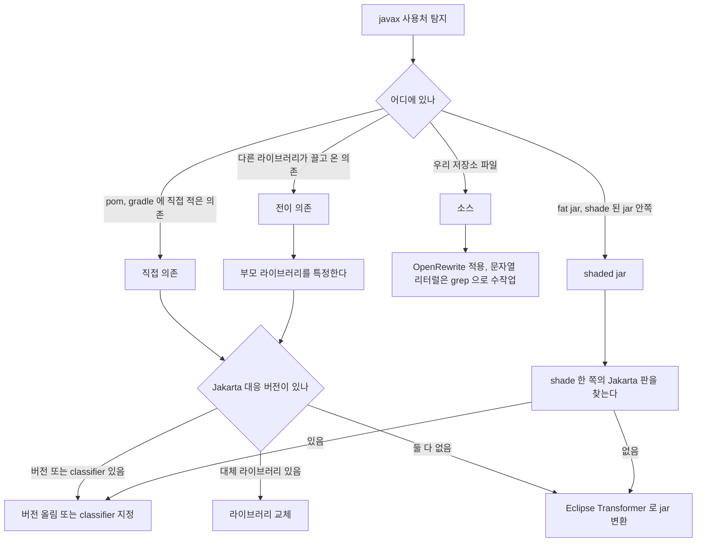
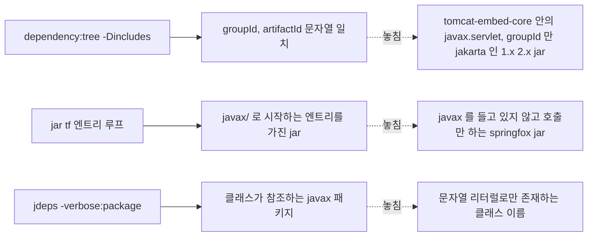
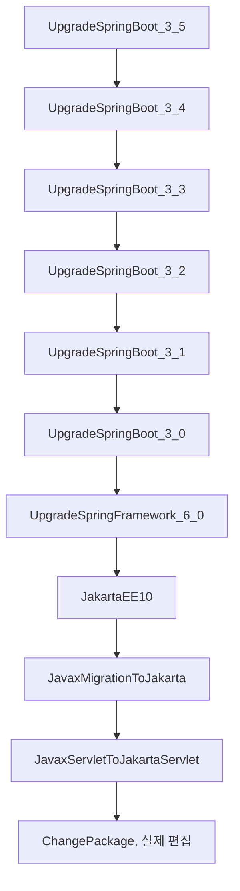
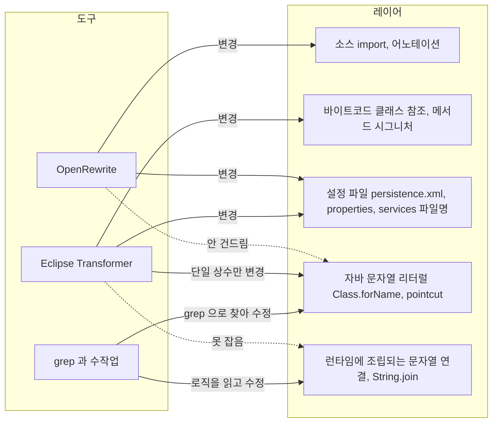
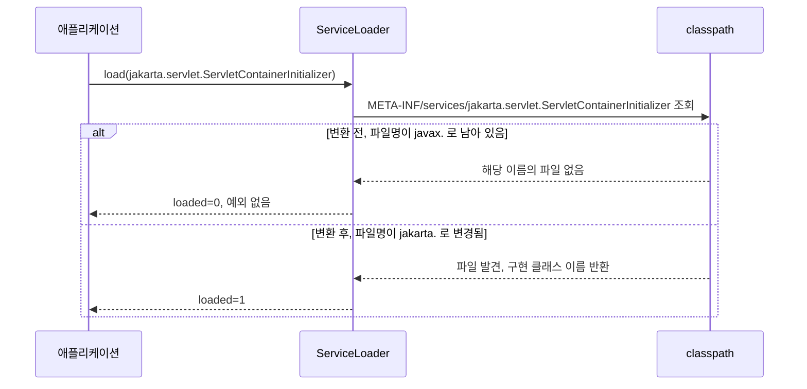
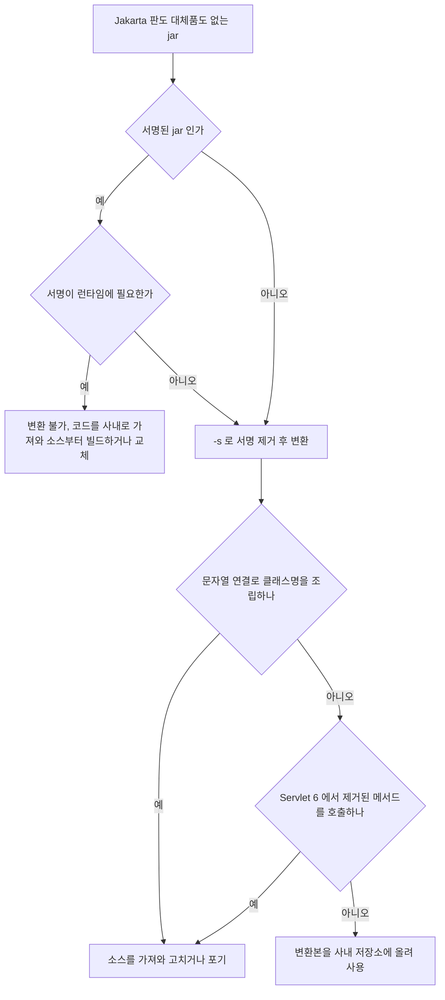
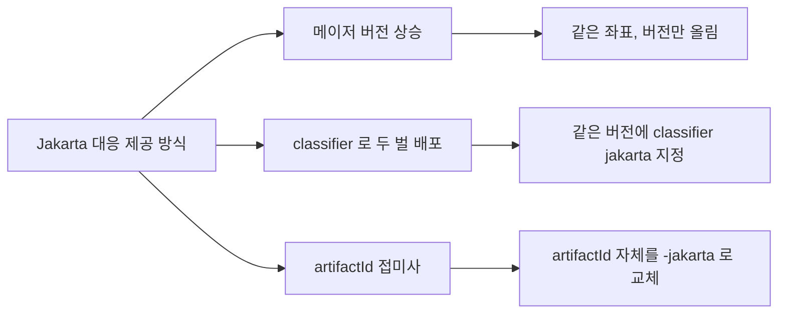
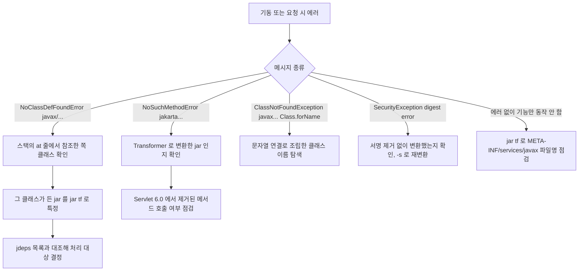

# Jakarta 전환 도구와 이진 의존성 처리

Boot 3.x 로 올릴 때 우리 소스의 `import javax.*` 는 한 시간이면 끝난다. 시간이 들어가는 쪽은 소스 바깥이다. 의존성 jar 안에 박힌 `javax/servlet/Filter` 참조, 문자열로만 존재하는 클래스 이름, 파일명 자체가 `javax.` 로 시작하는 `META-INF/services` 항목은 IDE 치환과 컴파일러 어느 쪽도 잡아 주지 않는다. 이 문서는 그런 자리를 찾아내는 방법과 도구별로 어디까지 고쳐 주는지를 정리한다. 패키지 치환 자체와 JDK 소속 `javax.*` 를 건드리지 않는 기준은 [Spring Boot 2.x → 3.x 마이그레이션 심화](Spring_Boot_Migration_2_to_3.md) 에 있고, 여기서는 반복하지 않는다.

아래 출력은 Boot 2.7.18 + Maven 3.6.3 + JDK 17 로 만든 작은 프로젝트(starter-web, data-jpa, validation, springfox 3.0.0)에서 실제로 돌려 얻은 것이다. Gradle 은 같은 개념의 명령만 적었고 출력은 Maven 쪽 기준이다.

---

## javax 가 남는 자리를 네 부류로 나눈다

탐지 결과를 한 덩어리로 보면 어떤 도구를 써야 할지 정할 수 없다. 사용처가 어디에 있느냐에 따라 쓰는 도구가 갈린다.



위 흐름에서 판단이 갈리는 지점은 "Jakarta 대응 버전이 있나" 하나다. 전이 의존이든 shaded jar 든 결국 이 질문으로 합쳐지고, 답이 없을 때만 jar 를 직접 변환한다. 변환은 마지막 수단이다.

### 좌표 검색은 javax 를 놓친다

기존에 흔히 쓰는 탐지 명령은 이렇다.

```bash
mvn dependency:tree -Dincludes=javax.servlet,javax.persistence,javax.validation,javax.annotation
```

Boot 2.7.18 프로젝트에서 이 명령을 돌리면 의존성이 하나도 나오지 않는다.

```text
[INFO] --- maven-dependency-plugin:3.3.0:tree (default-cli) @ shop ---
[INFO] ------------------------------------------------------------------------
[INFO] BUILD SUCCESS
```

`-Dincludes` 는 groupId 와 artifactId 로 거르기 때문이다. Boot 2.7 에서 `javax.servlet` 패키지는 `org.apache.tomcat.embed:tomcat-embed-core:9.0.83` 안에 들어 있고, JPA·Validation·Transaction·Annotation API 는 groupId 가 `javax.*` 가 아니라 `jakarta.*` 인 artifact 로 들어온다.

```text
+- org.springframework.boot:spring-boot-starter-data-jpa:jar:2.7.18:compile
|  +- jakarta.transaction:jakarta.transaction-api:jar:1.3.3:compile
|  +- jakarta.persistence:jakarta.persistence-api:jar:2.2.3:compile
...
\- org.springframework.boot:spring-boot-starter-validation:jar:2.7.18:compile
   \- org.hibernate.validator:hibernate-validator:jar:6.2.5.Final:compile
      \- jakarta.validation:jakarta.validation-api:jar:2.0.2:compile
```

groupId 는 `jakarta` 인데 안에 든 패키지는 `javax.persistence` 다. Jakarta EE 로 이관된 직후 버전(1.x, 2.x)은 groupId 만 바뀌고 패키지는 그대로였다. `jakarta` 라는 글자가 보인다고 전환이 끝난 것으로 판단하면 안 된다. `jakarta.*` 패키지는 EE 9 에 맞춘 3.0 계열부터다(Servlet 은 5.0).

그래서 좌표가 아니라 jar 내용을 본다. 의존성을 한 디렉터리로 복사해서 jar 마다 `javax/` 로 시작하는 엔트리를 센다.

```bash
mvn dependency:copy-dependencies -DoutputDirectory=/tmp/deps
cd /tmp/deps
for j in *.jar; do
  n=$(jar tf "$j" | grep -cE '^javax/(servlet|persistence|validation|annotation|transaction|xml/bind|ws|mail|jms)/')
  [ "$n" -gt 0 ] && echo "$n $j"
done | sort -rn
```

```text
219 jakarta.persistence-api-2.2.3.jar
152 jakarta.validation-api-2.0.2.jar
130 tomcat-embed-core-9.0.83.jar
119 jakarta.xml.bind-api-2.3.3.jar
21 jakarta.transaction-api-1.3.3.jar
18 jakarta.annotation-api-1.3.5.jar
```

이 목록은 전부 Boot BOM 이 관리하는 artifact 라서 Boot 3 로 올리면 BOM 이 3.x 대응 버전으로 알아서 바꾼다. 문제가 되는 것은 BOM 밖의 버전을 `<version>` 으로 고정해 둔 라이브러리다. 이 프로젝트에서는 `io.springfox:springfox-boot-starter:3.0.0` 이 그렇다.

### 번들하지 않고 참조만 하는 jar

위 루프는 jar 가 javax 클래스를 **들고 있는** 경우만 잡는다. springfox 처럼 javax 를 들고 있지는 않고 호출만 하는 jar 는 `javax/` 엔트리가 0개라 목록에 안 뜬다. 이런 jar 는 `jdeps` 로 참조 패키지를 본다.

```bash
jdeps --multi-release 17 -verbose:package -cp '*' springfox-bean-validators-3.0.0.jar \
  | grep -E -- '-> javax\.(servlet|persistence|validation|annotation|transaction|xml\.bind)'
```

`springfox-*` 와 `spring-*` jar 를 이 방식으로 훑으면 jar 마다 javax 참조 패키지 수가 나온다.

```text
60 spring-webmvc-5.3.31.jar
44 spring-web-5.3.31.jar
27 spring-data-jpa-2.7.18.jar
27 spring-boot-2.7.18.jar
...
3 springfox-bean-validators-3.0.0.jar
2 springfox-schema-3.0.0.jar
```

Spring 자체 jar 는 Boot 3 로 올리면 6.x 로 바뀌니 무시한다. 남는 것은 BOM 이 관리하지 않는 `springfox-*` 이고, 이쪽이 처리 대상이다. jar 를 `grep -c "javax/servlet" x.jar` 로 직접 grep 하면 0 이 나온다. 클래스 파일이 deflate 로 압축되어 있어 문자열이 그대로 보이지 않기 때문이다. `jar tf` 로 엔트리 이름을 보거나 풀어서 grep 해야 한다.

세 탐지 방법이 각각 무엇을 보고 무엇을 놓치는지 나란히 놓으면 이렇다. 오른쪽 점선 노드가 그 방법으로는 안 잡히는 대상이다.



### shade 된 jar 안의 javax

라이브러리가 의존성을 자기 jar 안에 합쳐 배포하는 경우(maven-shade-plugin, Gradle shadow)에는 `dependency:tree` 에 아무것도 안 나온다. 엔트리 이름으로 찾는다.

```bash
jar tf some-lib-all.jar | grep -E '^javax/' | head
jar tf some-lib-all.jar | grep -E 'javax/' | grep -vE '^javax/' | head
```

두 번째 줄이 relocation 된 경우를 잡는다. shade 가 패키지를 `com.acme.shaded.javax.servlet` 로 옮겨 놨으면 첫 줄 패턴(`^javax/`)에는 안 걸리고 두 번째 줄에서 걸린다. 서버에 올라간 fat jar(Spring Boot 실행 jar)는 `BOOT-INF/lib/` 아래에 jar 가 중첩되어 있으므로 먼저 풀어서 위 루프를 돌린다.

`javax.annotation` 이름이 들어 있다고 전부 Jakarta 대상은 아니다. `com.google.code.findbugs:jsr305` 의 `javax.annotation.Nonnull`, `javax.annotation.Nullable` 은 Jakarta Annotation 과 별개라 대응 패키지가 없다. `javax.annotation.PostConstruct`, `Resource`, `Generated` 가 Jakarta 로 넘어가는 쪽이다. 패턴을 `javax/annotation/` 로 넓게 잡으면 jsr305 가 오탐으로 나온다.

---

## OpenRewrite 로 소스와 설정을 변환한다

OpenRewrite 는 소스를 AST 로 읽어 import, 어노테이션, 의존성 좌표를 고친다. Spring Boot 마이그레이션 레시피는 `rewrite-spring` 모듈에 있고, `UpgradeSpringBoot_3_x` 레시피 하나가 버전을 올리면서 Jakarta 패키지 치환, 의존성 교체, 속성 키 이름 변경까지 연쇄로 호출한다.

Maven 은 플러그인을 pom 에 넣지 않고 명령줄에서 바로 돌릴 수 있다. 처음 실행하면 레시피 모듈과 Spring 의존성을 내려받느라 2~3분 걸린다.

```bash
mvn -B org.openrewrite.maven:rewrite-maven-plugin:6.46.1:dryRun \
  -Drewrite.recipeArtifactCoordinates=org.openrewrite.recipe:rewrite-spring:6.37.1 \
  -Drewrite.activeRecipes=org.openrewrite.java.spring.boot3.UpgradeSpringBoot_3_5
```

Gradle 은 플러그인 설정에 레시피와 모듈을 적는다. 목표 버전은 마이그레이션 문서의 단계 구분대로 3.0 이나 3.2 같은 중간 버전에서 멈출 수도 있어서 레시피 이름의 숫자를 바꿔 쓴다.

```groovy
plugins {
    id 'org.openrewrite.rewrite' version '7.41.0'
}

rewrite {
    activeRecipe('org.openrewrite.java.spring.boot3.UpgradeSpringBoot_3_5')
}

dependencies {
    rewrite('org.openrewrite.recipe:rewrite-spring:6.37.1')
}
```

```bash
./gradlew rewriteDryRun    # 파일은 안 바꾸고 패치만 만든다
./gradlew rewriteRun       # 실제 적용
```

`dryRun` 은 작업 트리를 수정하지 않고 `target/rewrite/rewrite.patch`(Gradle 은 `build/reports/rewrite/` 아래)에 diff 를 쓴다. 적용 전에 항상 이 단계를 먼저 거치고 패치를 읽는다.

### dry-run 출력 읽는 법

로그에는 파일마다 "이 레시피들이 이 파일을 바꾼다" 블록이 나온다. 들여쓰기는 레시피 호출 깊이다.

```text
[WARNING] These recipes would make changes to src/main/java/com/example/shop/AuditFilter.java:
[WARNING]     org.openrewrite.java.spring.boot3.UpgradeSpringBoot_3_4
[WARNING]         org.openrewrite.java.spring.boot3.UpgradeSpringBoot_3_3
[WARNING]             org.openrewrite.java.spring.boot3.UpgradeSpringBoot_3_2
[WARNING]                 org.openrewrite.java.spring.boot3.UpgradeSpringBoot_3_1
[WARNING]                     org.openrewrite.java.spring.boot3.UpgradeSpringBoot_3_0
[WARNING]                         org.openrewrite.java.spring.framework.UpgradeSpringFramework_6_0
[WARNING]                             org.openrewrite.java.migrate.jakarta.JakartaEE10
[WARNING]                                 org.openrewrite.java.migrate.jakarta.JavaxMigrationToJakarta
[WARNING]                                     org.openrewrite.java.migrate.jakarta.JavaxServletToJakartaServlet
[WARNING]                                         org.openrewrite.java.ChangePackage
```

맨 안쪽 줄(`ChangePackage`)이 실제 편집을 하는 레시피이고, 바깥은 그것을 호출한 묶음이다. `UpgradeSpringBoot_3_5` 를 지정했는데 3_4, 3_3 ... 3_0 이 줄줄이 보이는 것은 정상이다. 3.5 레시피가 3.4 를 부르고, 3.4 가 3.3 을 부르는 식으로 3.0 까지 내려간다. 2.7 에서 3.5 로 한 번에 올리면 Jakarta 치환은 3_0 단계 레시피에서 일어난다.

위 로그의 들여쓰기를 호출 관계로 펴면 아래와 같다. 위에서 아래로 따라 내려가면 어느 레시피가 어느 레시피를 부르는지, 실제 편집이 어디서 일어나는지 보인다.



patch 파일의 hunk 헤더 끝에도 레시피 이름이 붙는다(`@@ ... org.openrewrite.java.spring.boot3.UpgradeSpringBoot_3_5`). 이상한 변경을 발견하면 그 줄의 레시피 이름으로 어느 단계에서 나온 것인지 추적한다.

작은 프로젝트에서 나온 patch 중 의존성 쪽은 이렇다.

```diff
-    <version>2.7.18</version>
+    <version>3.5.16</version>
...
+    <dependency>
+      <groupId>jakarta.servlet</groupId>
+      <artifactId>jakarta.servlet-api</artifactId>
+    </dependency>
+    <dependency>
+      <groupId>org.springdoc</groupId>
+      <artifactId>springdoc-openapi-starter-webmvc-ui</artifactId>
+      <version>2.8.17</version>
+    </dependency>
...
-    <dependency><groupId>io.springfox</groupId><artifactId>springfox-boot-starter</artifactId><version>3.0.0</version></dependency>
```

세 가지가 눈에 띈다. springfox 는 springdoc 으로 교체됐다. 다만 springfox 어노테이션(`@Api`, `@ApiOperation`)을 쓰던 컨트롤러는 springdoc 의 `@Tag`, `@Operation` 으로 바뀌지 않는다. 의존성만 바뀌므로 컴파일 에러로 드러나고, 그 뒤는 수작업이다. `jakarta.servlet-api` 는 소스가 `jakarta.servlet` 을 직접 import 하게 되어 추가된 것이다. Boot 3 의 `starter-web` 은 Tomcat 10.1 을 통해 같은 API 를 이미 주고 있으므로 이 의존성이 정말 필요한지는 따로 확인한다.

### 파일별로 바뀐 것과 안 바뀐 것

소스 파일 외에 설정 파일에도 `javax` 를 일부러 심어 두고 돌렸다. 레시피가 건드린 파일과 건드리지 않은 파일은 다음과 같다.

| 파일 | 내용 | 결과 |
|---|---|---|
| `Order.java`, `AuditFilter.java` | `import javax.persistence.*`, `javax.servlet.*` | `jakarta.*` 로 변경 |
| `application.properties` | `spring.jpa.properties.javax.persistence.validation.mode`, `logging.level.javax.servlet` | 키 안의 `javax` 가 `jakarta` 로 변경 |
| `META-INF/persistence.xml` | xmlns, `version="2.2"`, `javax.persistence.jdbc.driver` | 네임스페이스·버전·속성 키 변경 |
| `META-INF/services/javax.servlet.ServletContainerInitializer` | 파일명이 javax | `jakarta.servlet.ServletContainerInitializer` 로 **파일명 변경**, 내용(`com.example.shop.Init`)은 그대로 |
| `Strings.java` | `Class.forName("javax.persistence.Entity")`, pointcut 문자열 `"execution(* javax.servlet.http.HttpServletRequest.*(..))"` | **변경 대상 목록에 없음** |
| `app.yml` | `filter: javax.servlet.Filter` | **변경 대상 목록에 없음** |

자바 문자열 리터럴 안의 `javax` 는 레시피가 건드리지 않는다. 문자열이 클래스 이름인지, 그냥 로그 메시지인지 AST 로는 구분할 수 없기 때문이다. 기존 문서에서 `"javax\.` 를 grep 하라고 한 이유가 이것이다. 파일 이름이 `application.yml` 이 아닌 임의 이름의 yml 도 대상에서 빠졌다. Spring 설정 파일로 인식되는 이름만 속성 키 변경 레시피가 본다.

한 가지 더, `persistence.xml` 변환 결과에 원본에 없던 줄이 들어 있었다.

```diff
+    <shared-cache-mode>NONE</shared-cache-mode>
```

왜 들어갔는지는 확인하지 못했다. `NONE` 은 JPA 스펙상 엔티티를 2차 캐시에 올리지 않는 값이라, 2차 캐시를 쓰던 서비스에서는 이 줄 하나로 캐시가 꺼진다. 의도를 확인해서 유지할지 지울지 정한다. 패치를 읽을 때는 삭제와 치환보다 추가된 줄을 더 신경 써서 본다. 삭제와 치환은 눈에 잘 들어오지만 추가는 놓치기 쉽다. 삭제와 치환은 눈에 잘 들어오지만 추가는 놓치기 쉽다.

### 어느 레이어를 어느 도구가 잡는가

OpenRewrite 가 소스 쪽을, Eclipse Transformer 가 바이트코드 쪽을 맡는다. 문자열은 어느 도구도 완전히 못 잡는다. 이 표를 머릿속에 두고 있어야 변환 후 남은 잔재를 어디서 찾을지 정해진다.



점선이 도구가 못 잡는 구간이다. `DYN` 은 어떤 도구도 못 잡으므로 코드를 읽어서 찾는 수밖에 없다. 라이브러리 내부에 이런 코드가 있으면 Transformer 로 변환해도 런타임에서야 드러난다.

---

## Eclipse Transformer 로 jar 를 직접 변환한다

Jakarta 대응 버전도 대체 라이브러리도 없는 사내 jar, 또는 유지보수가 끝난 오픈소스 jar 는 바이트코드째로 바꿔야 한다. Eclipse Transformer CLI 를 쓴다. Maven Central 의 `org.eclipse.transformer:org.eclipse.transformer.cli:1.0.0:distribution` jar 에 의존 라이브러리가 들어 있어 내려받은 jar 하나로 실행된다.

```bash
java -jar org.eclipse.transformer.cli-1.0.0.jar legacy-lib.jar legacy-lib-jakarta.jar
```

입력과 출력 두 인자만 주면 Jakarta 기본 규칙(`javax.servlet` → `jakarta.servlet` 등)이 적용된다. 출력 로그 끝에 처리 통계가 나온다.

```text
[main] INFO Transformer - [  All Resources ] [     10 ] Unaccepted [      0 ]   Accepted [     10 ]
[main] INFO Transformer - [  All Unchanged ] [      6 ]     Failed [      0 ] Duplicated [      0 ]
[main] INFO Transformer - [    All Changed ] [      4 ]    Renamed [      1 ]    Content [      3 ]
```

`Renamed` 는 `META-INF/services` 아래 파일명이 바뀐 수, `Content` 는 내용이 바뀐 수다. `Failed` 가 0 이어도 동작이 맞다는 보장은 없다. 아래 항목들은 변환이 성공으로 끝난 뒤에 깨진다.

### 변환이 처리하는 것과 못 하는 것

`javax.servlet.Filter` 를 구현한 클래스, 그 클래스의 `.properties` 에 적힌 `filter.class=javax.servlet.Filter`, `META-INF/services/javax.servlet.ServletContainerInitializer` 가 든 테스트 jar 를 만들어 변환했다.

| 대상 | 변환 결과 |
|---|---|
| 클래스 상수 풀의 타입 참조, 메서드 시그니처 | `jakarta.servlet.*` 로 변경 |
| `static final String REQ = "javax.servlet.http.HttpServletRequest"` 같은 단일 문자열 상수 | `jakarta.servlet.http.HttpServletRequest` 로 변경 (`javap -c` 의 `ldc` 로 확인) |
| `.properties` 값 | 내용 치환됨 |
| `META-INF/services/javax.servlet.ServletContainerInitializer` | 파일명이 `jakarta.servlet.ServletContainerInitializer` 로 변경, 내용(구현 클래스 이름)은 그대로 |
| `Class.forName("javax.servlet." + simple)` | 변경 안 됨 |
| `String.join(".", "javax", "servlet")` | 변경 안 됨 |
| 서명된 jar 의 `META-INF/*.SF`, `*.RSA` | 그대로 남아 서명과 내용이 어긋남 |

`"javax.servlet." + simple` 같은 문자열 연결은 Java 9 이상 컴파일러가 `invokedynamic`(`makeConcatWithConstants`)으로 내보내서 상수 풀에 완성된 문자열이 없다. 변환 후 실행하면 이렇다.

```text
java.lang.ClassNotFoundException: javax.servlet.Filter
```

클래스 참조는 전부 바뀌었는데 이 한 줄만 `javax` 로 남는다. 변환 통계에는 아무 흔적이 없다.

서비스 로더는 조용히 깨져서 더 곤란하다. javax 용 services 파일이 든 jar 를 변환 없이 Jakarta API 와 같이 올리면 `ServiceLoader.load(jakarta.servlet.ServletContainerInitializer.class)` 는 에러 없이 0 건을 돌려준다(`loaded=0`). 인터페이스 이름으로 파일을 찾기 때문에 파일명이 `javax.` 로 남아 있으면 존재 자체가 무시된다. 변환하면 파일명이 바뀌어 `loaded=1` 이 된다. 다만 services 파일 **안에** 적힌 구현 클래스 이름은 내용 변환 대상이 아니다. 이번 테스트의 구현 클래스는 `demo.Init` 이라 문제가 없었지만, 구현 클래스가 `javax.*` 패키지에 있는 jar 라면 파일 안의 이름을 따로 확인해야 한다.

변환 전과 후에 서비스 로더가 파일을 찾는 순서를 비교하면 왜 에러 없이 0 건이 나오는지 보인다. 핵심은 로더가 파일명을 인터페이스 이름으로 조립해서 찾는다는 점이다.



### 서명된 jar

서명된 jar 를 그냥 변환하면 `META-INF/T.SF`, `META-INF/T.RSA` 가 출력 jar 에 그대로 들어간다. 클래스 내용은 바뀌었는데 서명의 다이제스트는 원본 기준이라, 클래스를 로드하는 시점에 JVM 이 검증하다 실패한다.

```text
Exception in thread "main" java.lang.SecurityException: SHA-256 digest error for demo/AuditFilter.class
	at java.base/sun.security.util.ManifestEntryVerifier.verify(ManifestEntryVerifier.java:256)
```

`jarsigner -verify` 도 같은 메시지를 낸다. `-s`(`--stripSignatures`) 옵션을 주면 서명 파일을 지우고 변환한다.

```bash
java -jar org.eclipse.transformer.cli-1.0.0.jar -s signed.jar signed-jakarta.jar
```

서명을 지운 jar 는 로드된다(`demo.AuditFilter` 클래스 로드 확인). 서명 검증이 요구되는 환경이라면 이 경로로는 못 간다. 서명 키가 우리 것이 아니면 다시 서명할 수도 없다.

### 변환한 jar 를 Servlet 6 에 올리면 깨지는 경우

Transformer 는 패키지 이름만 바꾼다. Jakarta Servlet 6.0(Boot 3.x 의 Tomcat 10.1 이 구현)은 오래전에 deprecated 된 메서드를 제거했다. `HttpServletRequest.getRealPath(String)` 을 호출하는 javax 시절 jar 를 변환하면 이렇다.

| Servlet API | 변환한 jar 실행 결과 |
|---|---|
| `jakarta.servlet-api` 5.0.0 | 정상 동작 |
| `jakarta.servlet-api` 6.0.0 | `NoSuchMethodError` |

```text
Exception in thread "main" java.lang.NoSuchMethodError: 'java.lang.String jakarta.servlet.http.HttpServletRequest.getRealPath(java.lang.String)'
	at legacy.PathUtil.real(PathUtil.java:4)
```

패키지가 맞아도 메서드가 없으면 링크 시점에 실패한다. Boot 3.0~3.5 는 Tomcat 10.1 이라 Servlet 6.0 이 걸린다. Transformer 로 변환한 jar 는 변환 직후 컴파일도 통과하고 기동도 하다가, 해당 코드 경로가 처음 실행되는 요청에서야 터진다. 변환한 jar 는 원본 jar 의 Servlet API 호출을 `javap -c` 나 `jdeps` 로 훑어 6.0 에서 제거된 메서드를 쓰는지 확인해야 한다.

### 변환 여부 판단



소스가 있는 사내 jar 라면 변환보다 소스를 직접 Jakarta 로 바꿔 다시 빌드하는 쪽이 낫다. 변환본은 원본에 보안 패치가 나와도 우리가 다시 변환해야 하고, 변환본 jar 의 버전은 자체적으로 관리해야 한다. 파일명에 `-jakarta` 같은 접미사를 붙여 원본과 구분해 두면 나중에 정식 Jakarta 판이 나왔을 때 걷어내기 쉽다.

---

## 대응 버전이 있는 라이브러리와 교체해야 하는 라이브러리

Jakarta 대응을 제공하는 방식은 세 가지다. 같은 `groupId:artifactId` 에서 메이저 버전만 올리는 쪽이 가장 흔하고, classifier 로 같은 버전을 두 벌 배포하거나, artifactId 에 접미사를 붙이는 쪽도 있다. 방식에 따라 build 파일에 쓰는 형태가 다르다.

세 방식이 build 파일에서 어떻게 갈리는지 먼저 본다. 아래 표는 이 구분에 따라 각 라이브러리를 분류한 것이다.



| 라이브러리 | javax 판 | Jakarta 판 | 방식 |
|---|---|---|---|
| Jersey | 2.x | 3.x (Boot 3.5 BOM 3.1.11) | 메이저 버전 |
| Hibernate Validator | 6.x | 8.x (BOM 8.0.3.Final) | 메이저 버전 |
| Quartz | 2.3.x | 2.5.x (BOM 2.5.0) | 마이너 버전, BOM 관리 |
| Ehcache 3 | `ehcache` | `ehcache` + `jakarta` classifier (BOM 3.10.9) | classifier |
| QueryDSL | `querydsl-jpa:5.0.0` | `querydsl-jpa:5.0.0:jakarta` | classifier |
| swagger-core (springdoc 이 사용) | `swagger-annotations` | `swagger-annotations-jakarta` | artifactId 접미사 |
| Hibernate 5.6 | `hibernate-core` | `hibernate-core-jakarta` (5.6.15.Final 이 마지막) | artifactId 접미사, 임시 경로 |

Maven Central 에 `querydsl-jpa-5.0.0-jakarta.jar`, `ehcache-3.10.8-jakarta.jar`, `swagger-annotations-jakarta` 가 있는 것을 확인했다. Boot BOM 은 `ehcache` 를 classifier 있는 판과 없는 판 두 벌 관리하므로, classifier 판은 버전을 안 적고 classifier 만 쓴다.

```xml
<dependency>
    <groupId>org.ehcache</groupId>
    <artifactId>ehcache</artifactId>
    <classifier>jakarta</classifier>
</dependency>
```

```groovy
implementation 'org.ehcache:ehcache::jakarta'
implementation 'com.querydsl:querydsl-jpa:5.0.0:jakarta'
```

`ehcache-3.10.8.jar` 와 `-jakarta.jar` 를 `jdeps` 로 비교하면 차이는 JAXB 하나다. 기본 jar 는 `javax.xml.bind` 를 참조하고 jakarta 판은 `jakarta.xml.bind` 를 참조한다. 설정 XML 을 읽는 쪽이 이 JAXB 라서, Boot 3 에서 기본 jar 를 쓰면 이 부분이 남는다. 두 jar 모두 `javax.cache`(JCache, JSR-107)는 그대로 참조한다. JCache API 는 Jakarta EE 로 이관된 스펙이 아니라 `javax.cache` 가 정상이고, 위 탐지 루프에서 이 패키지는 대상이 아니다.

Quartz 2.3.2 의 pom 에는 OSGi `Import-Package` 로 `javax.servlet`, `javax.mail` 이 optional 로 적혀 있다. Boot 3.x BOM 이 2.5.0 을 관리하므로 `<version>` 을 고정해 둔 곳이 없다면 BOM 에 맡긴다. 고정해 둔 곳이 있으면 그 줄부터 지운다.

### 교체해야 하는 라이브러리

버전도 classifier 도 없는 라이브러리는 대체품이 필요하다.

| 기존 | 대체 | 비고 |
|---|---|---|
| `springfox-boot-starter` 3.0.0 | `springdoc-openapi-starter-webmvc-ui` 2.x | springfox 는 2020-07 의 3.0.0 이 마지막 릴리스. OpenRewrite 가 의존성은 교체하나 어노테이션(`@Api` → `@Tag`, `@ApiOperation` → `@Operation`)은 수작업 |
| `springdoc-openapi-ui` 1.x | `springdoc-openapi-starter-webmvc-ui` 2.x | artifactId 자체가 바뀌었다 |
| `javax.mail:mail`, `com.sun.mail:javax.mail` | `org.eclipse.angus:jakarta.mail` | Jakarta Mail 2.x 구현체는 Angus |
| `javax.xml.bind:jaxb-api` + `com.sun.xml.bind:jaxb-impl` | `jakarta.xml.bind:jakarta.xml.bind-api` 3.x/4.x + `org.glassfish.jaxb:jaxb-runtime` | 이미 BOM 관리 대상이면 BOM 에 맡긴다 |

springdoc 은 artifactId 가 바뀌어서 의존성 갱신 도구가 놓치기 쉽다. 1.x 의 `springdoc-openapi-ui` 는 javax 판이라 버전 숫자만 올려서는 해결되지 않고 artifactId 를 `springdoc-openapi-starter-webmvc-ui` 로 바꿔야 한다.

---

## 에러 메시지로 원인을 되짚는다

변환 후 첫 기동에서 나오는 에러와 의심할 자리를 정리했다. 아래 메시지는 위 실험에서 직접 재현한 것이다.

| 에러 | 직접 원인 | 흔한 뒤쪽 원인 |
|---|---|---|
| `NoClassDefFoundError: javax/servlet/http/HttpServletRequest` + `Caused by: ClassNotFoundException: javax.servlet.http.HttpServletRequest` | classpath 에 `javax.servlet` 패키지를 가진 jar 가 없는데, 어떤 jar 가 그 클래스를 참조한다 | BOM 밖 버전으로 고정된 라이브러리, 변환하지 않은 사내 jar |
| `NoSuchMethodError: 'java.lang.String jakarta.servlet.http.HttpServletRequest.getRealPath(java.lang.String)'` | 패키지는 `jakarta` 로 바뀌었는데 Servlet 6.0 에 해당 메서드가 없다 | Transformer 로 변환한 오래된 jar |
| `ClassNotFoundException: javax.servlet.Filter` (직접 `Class.forName` 에서) | 문자열 연결로 조립한 클래스 이름이 안 바뀌었다 | 라이브러리 내부의 리플렉션 코드 |
| `SecurityException: SHA-256 digest error for ...class` | 서명 jar 를 서명 제거 없이 변환했다 | `-s` 누락 |
| 에러 없이 해당 기능만 동작 안 함 | `META-INF/services/javax.*` 가 무시된다 | 변환하지 않은 jar 의 서비스 로더 파일명 |

첫 번째 메시지는 스택에 찍힌 클래스가 **어느 jar 소속인지**부터 확인한다.

```text
Exception in thread "main" java.lang.NoClassDefFoundError: javax/servlet/http/HttpServletRequest
	at legacy.PathUtil.uri(PathUtil.java:5)
	at Run5.main(Run5.java:3)
Caused by: java.lang.ClassNotFoundException: javax.servlet.http.HttpServletRequest
```

`at legacy.PathUtil.uri` 가 호출한 쪽이다. 그 클래스가 든 jar 를 `-verbose:class` 나 `jar tf` 로 찾고, 앞에서 만든 `jdeps` 목록과 대조하면 처리 대상이 정해진다. 에러 스택에 나오는 건 `javax` 를 **참조한** 쪽이지 `javax` 를 가진 쪽이 아니므로, classpath 에서 javax 를 찾는 것으로는 답이 안 나온다.

위 표를 증상 쪽에서 원인 쪽으로 따라가는 순서로 다시 그리면 이렇다. 먼저 메시지 종류로 가르고, 그다음 스택에 찍힌 호출한 쪽을 본다.



마지막 행(에러 없이 무시됨)은 가장 늦게 발견된다. 서블릿 컨테이너 초기화기가 안 불려서 Filter 등록이 빠진다든가, JAX-RS 리소스가 로드되지 않는다든가 하는 식이다. 의존성 jar 목록에서 `jar tf x.jar | grep META-INF/services/javax` 로 파일명을 한 번 훑으면 잡힌다.

---

## 변환 후 남은 javax 를 다시 찾는다

세 단계 도구를 다 돌린 뒤에도 마지막에 한 번 더 확인한다. 빌드 산출물 기준으로 보는 것이 소스 기준보다 정확하다.

```bash
# 우리 소스와 설정에서 문자열로 남은 javax (JDK 소속 패키지는 제외)
grep -rnE 'javax\.(servlet|persistence|validation|annotation|transaction|xml\.bind|mail|jms)' \
  src/ --include='*.java' --include='*.kt' --include='*.xml' --include='*.properties' \
  --include='*.yml' --include='*.yaml' --include='*.factories' --include='*.imports'

# 최종 실행 jar 안쪽
mkdir /tmp/fat && cd /tmp/fat && jar xf /path/to/app.jar
for j in BOOT-INF/lib/*.jar; do
  n=$(jar tf "$j" | grep -cE '^javax/(servlet|persistence|validation|transaction|xml/bind|mail|jms)/')
  [ "$n" -gt 0 ] && echo "$n $j"
done
find BOOT-INF/lib -name '*.jar' -exec sh -c 'jar tf "$1" | grep -q "^META-INF/services/javax\." && echo "$1"' _ {} \;
```

`BOOT-INF/lib` 에서 나오는 jar 가 있으면 Boot 3 에서 로드는 되지만 javax 클래스를 들고 있는 것이니 위 표의 어느 부류인지 가려 낸다. `javax.annotation` 은 `jsr305` 오탐이 있어 앞 루프에서 뺐다.

서비스 파일 훑기까지 끝났는데 기동 실패가 남는다면 이 문서 밖의 문제다. Hibernate 6 쿼리 변경, Spring Security 6 설정 변경 쪽을 먼저 의심하고, 메시지에 `javax` 가 안 보이는데 `jakarta` 만 보이는 `NoSuchMethodError` 는 API 버전 불일치다. Servlet API jar 를 두 벌 (`jakarta.servlet-api` 5.x 와 6.x) 끌고 오는 의존성이 있는지 `dependency:tree -Dincludes=jakarta.servlet` 로 확인한다.
