# Spring Batch 5 전환 (Boot 2 에서 3 으로)

Boot 3 로 올릴 때 Batch 쪽에서 컴파일이 깨지는 곳은 `ItemWriter` 시그니처와 `JobBuilderFactory` 사용처 정도라 반나절이면 끝난다. 시간이 드는 쪽은 컴파일이 통과한 뒤다. `@EnableBatchProcessing` 을 그대로 두면 Job 이 한 번도 돌지 않았는데 종료 코드 0 으로 끝난다. 메타 테이블 스키마가 바뀌는데 공식 마이그레이션 스크립트는 파라미터 값을 지운다. 4.x 에서 실패해 둔 Job 은 같은 파라미터로 재기동해도 이어서 돌지 않는다.

이 문서는 위 네 군데를 직접 재현한 출력과 함께 정리한다. Batch 자체 개념은 [Spring Batch](Spring_Batch.md), Boot 전체 전환 순서와 `javax` → `jakarta` 치환은 [Spring Boot 2.x → 3.x 마이그레이션 심화](Spring_Boot_Migration_2_to_3.md) 에 있고 여기서는 반복하지 않는다.

## 출력을 만든 환경

| 구분 | 버전 |
|---|---|
| 4.x 쪽 | Boot 2.7.18, Spring Batch 4.3.10 |
| 5.x 쪽 | Boot 3.3.4 (Batch 5.1.2, Flyway 10.10.0), Boot 3.0.13 (Batch 5.0.4, Flyway 9.5.1) |
| JDK, DB | OpenJDK 17.0.20, H2 2.2.224 파일 모드 |

4.x 앱이 쓰던 DB 파일을 5.x 앱이 그대로 열어야 해서 두 쪽 모두 H2 를 2.2.224 로 고정했다. 이 실습 환경에서는 MySQL, PostgreSQL 서버를 띄우지 못했다. 운영 DB 용 공식 스크립트는 jar 안에 DB 별로 들어 있지만 실행해 보지 못했고, 직접 쓴 SQL 은 H2 문법이다. 해당 부분에는 그렇게 표시했다.

테스트에 쓴 Job 은 정수 10개를 청크 3 으로 읽어 찍는다. 재시작 위치를 눈으로 보려고 읽은 위치(`pos`)를 `ExecutionContext` 에 저장하는 리더를 직접 만들었다. `fail.at` 시스템 속성을 주면 그 번호를 읽을 때 예외를 던지고, `hang` 을 주면 5번째 아이템을 읽기 전에 멈춘다.

```java
public class CountingReader implements ItemStreamReader<Integer> {
    private final int max;
    private final int failAt;
    private final boolean hang;
    private int pos;

    public CountingReader(int max, int failAt, boolean hang) {
        this.max = max;
        this.failAt = failAt;
        this.hang = hang;
    }

    @Override
    public void open(ExecutionContext ctx) {
        pos = ctx.getInt("pos", 0);
        System.out.println("READER open pos=" + pos);
    }

    @Override
    public void update(ExecutionContext ctx) {
        ctx.putInt("pos", pos);
    }

    @Override
    public void close() {}

    @Override
    public Integer read() throws Exception {
        if (hang && pos == 4) {
            System.out.println("READER hang at 4");
            Thread.sleep(600_000);
        }
        if (failAt > 0 && pos + 1 == failAt) {
            throw new IllegalStateException("boom at " + failAt);
        }
        return pos < max ? ++pos : null;
    }
}
```

## @EnableBatchProcessing 이 Boot 자동 구성을 끈다

Boot 2 에서 이 어노테이션은 필수였다. 2.7.18 에서 빼고 `JobBuilderFactory` 를 주입받으면 기동이 실패한다.

```text
Parameter 0 of method demoJob in lab.JobConfig required a bean of type
'org.springframework.batch.core.configuration.annotation.JobBuilderFactory' that could not be found.
```

Boot 3 는 반대다. 붙이는 순간 `BatchAutoConfiguration` 이 물러난다. 같은 Job, 같은 설정에서 프로파일 하나로 어노테이션만 켜고 끈 결과다. 둘 다 `--spring.batch.jdbc.initialize-schema=always` 를 줬다.

| 항목 | 어노테이션 없음 | `@EnableBatchProcessing` 있음 |
|---|---|---|
| `JobLauncherApplicationRunner` | 생성됨 (`Running default command line` 로그) | 없음 |
| Job 실행 | `COMPLETED` 1건 | 0건 |
| `BATCH_` 테이블 | 생성됨 | 0개 |
| 종료 코드 | 0 | 0 |

에러도 로그도 없고 종료 코드가 0 이라 스케줄러는 성공으로 처리한다. 정산 결과가 비어 있는 걸 며칠 뒤에 보고서 알게 되는 유형이다. `spring.batch.*` 속성도 이 상태에서는 전부 무시된다. 위 실험에서 `initialize-schema=always` 를 줬는데도 테이블이 0개였다.

어노테이션 유무에 따라 기동 경로가 어떻게 갈리는지를 보면 된다. 오른쪽 경로는 어디에서도 실패하지 않고 끝나서 알아채기 어렵다.

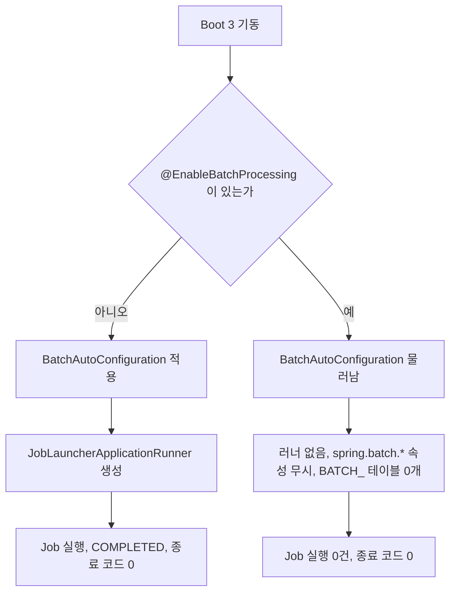

`ExecutionContext` 직렬화기처럼 설정을 바꾸려고 `DefaultBatchConfiguration` 을 상속해도 같은 일이 생긴다. Boot 3.0.13 에서 상속만 하고 띄우면 러너가 없다(`runner=0`). 이 경우 `JobLauncherApplicationRunner` 를 직접 빈으로 등록해야 Job 이 돈다. 코드는 아래 재시작 절에 있다.

## Step 에 JobRepository 와 TransactionManager 를 직접 넣는다

4.x 에서는 `BatchConfigurer` 가 `JobRepository` 와 트랜잭션 매니저를 만들어 `JobBuilderFactory`, `StepBuilderFactory` 안에 넣어 두었다. Boot 2.7.18 에서 확인하면 `BasicBatchConfigurer` 가 `DataSourceTransactionManager` 를 직접 만든다. 5.x 는 이걸 숨기지 않는다. 자동 구성이 `JobRepository` 빈을 만들고, 트랜잭션 매니저는 Boot 가 만든 빈(JDBC 면 `JdbcTransactionManager`)을 코드에서 받아 넘긴다. 도식에서 왼쪽은 의존성이 팩토리 안에 숨은 구조, 오른쪽은 코드가 두 빈을 직접 들고 있는 구조다.

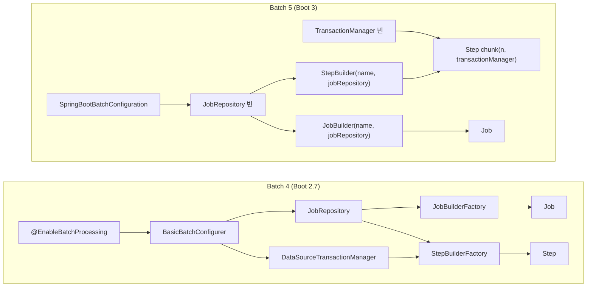

Boot 2.7.18 쪽 코드다.

```java
@Configuration
public class JobConfig {

    @Bean
    Job demoJob(JobBuilderFactory jobs, Step demoStep) {
        return jobs.get("demoJob").start(demoStep).build();
    }

    @Bean
    Step demoStep(StepBuilderFactory steps) {
        return steps.get("demoStep")
                .<Integer, Integer>chunk(3)
                .reader(new CountingReader(10, Integer.getInteger("fail.at", -1), Boolean.getBoolean("hang")))
                .writer(items -> System.out.println("WRITE " + items))
                .build();
    }
}
```

같은 Job 을 Boot 3.3.4 에서 돌린 코드다. 두 빈이 메서드 파라미터로 드러난다.

```java
@Configuration
public class JobConfig {

    @Bean
    Job demoJob(JobRepository jobRepository, Step demoStep) {
        return new JobBuilder("demoJob", jobRepository).start(demoStep).build();
    }

    @Bean
    Step demoStep(JobRepository jobRepository, PlatformTransactionManager transactionManager) {
        return new StepBuilder("demoStep", jobRepository)
                .<Integer, Integer>chunk(3, transactionManager)
                .reader(new CountingReader(10, Integer.getInteger("fail.at", -1), Boolean.getBoolean("hang")))
                .writer(items -> System.out.println("WRITE " + items))
                .build();
    }
}
```

몇 가지 걸리는 점이 있다.

`chunk(3)` 처럼 트랜잭션 매니저 없는 오버로드는 5.1.2 에도 남아 있어 컴파일이 된다. 그대로 두면 컴파일이 아니라 기동에서 죽는다.

```text
Failed to instantiate [org.springframework.batch.core.Job]: Factory method 'notmJob' threw exception
with message: java.lang.IllegalStateException: A transaction manager must be provided
```

`JobBuilderFactory` 클래스 자체는 5.1.2 jar 에 있고 `@Deprecated(since = "5.0.0")` 로 표시돼 있다. 그런데 `@EnableBatchProcessing` 을 붙여도 빈으로 등록되지 않는다. 프로파일로 `@EnableBatchProcessing` 과 `JobBuilderFactory` 주입을 함께 켜 봤더니 위와 같은 `required a bean of type ... JobBuilderFactory that could not be found` 로 기동이 실패했다. 컴파일 경고만 나고 지나가는 코드가 기동 시점에 터지는 구조라 CI 에서 컨텍스트를 한 번 띄워 보는 테스트가 있어야 잡힌다.

여러 DataSource 를 쓰는 앱에서는 어느 트랜잭션 매니저를 넘길지 코드에서 정해야 한다. 4.x 에서는 팩토리가 알아서 하나를 골라 줬기 때문에 이 선택을 의식한 적이 없는 경우가 많다.

## ItemWriter 의 write(Chunk)

`write(List)` 를 구현한 클래스는 컴파일이 깨진다. 에러 문구는 이렇다.

```text
OldWriter.java:3: error: OldWriter is not abstract and does not override abstract method write(Chunk<? extends String>) in ItemWriter
OldWriter.java:4: error: method does not override or implement a method from a supertype
```

5.x 용 구현은 `Chunk` 를 받는다. 리스트가 필요하면 `getItems()` 를 쓴다.

```java
public class NewWriter implements ItemWriter<String> {
    @Override
    public void write(Chunk<? extends String> chunk) throws Exception {
        System.out.println(chunk.getItems().get(0) + " size=" + chunk.size());
    }
}
```

람다로 쓴 Writer 는 `items -> System.out.println(items)` 처럼 리스트 메서드를 안 쓰면 소스 변경 없이 컴파일된다. 대신 `Chunk.toString()` 이 달라서 로그 포맷이 바뀐다. 4.x 에서는 `WRITE [1, 2, 3]` 으로 찍히던 것이 5.x 에서는 `WRITE [items=[1, 2, 3], skips=[]]` 가 된다. 로그를 파싱하거나 출력 문자열로 단언하는 테스트가 있으면 여기서 깨진다.

## 속성 이름

Boot 설정 메타데이터(`spring-configuration-metadata.json`)를 2.7.18 과 3.3.4 에서 뽑아 `spring.batch.*` 를 비교했다. 옛 이름이 에러 없이 무시된다는 점이 문제다.

| 2.7.18 | 3.3.4 | 옛 이름을 쓰면 |
|---|---|---|
| `spring.batch.initialize-schema` | `spring.batch.jdbc.initialize-schema` | 값이 무시된다 |
| `spring.batch.initializer.enabled` | `spring.batch.jdbc.initialize-schema` | 2.7.18 메타데이터에서 이미 error 수준 deprecated |
| `spring.batch.schema`, `spring.batch.table-prefix` | `spring.batch.jdbc.schema`, `spring.batch.jdbc.table-prefix` | 같음 |
| `spring.batch.job.names` | `spring.batch.job.name` | `names` 는 무시된다 |
| `spring.batch.job.enabled` | 같음 | 바뀌지 않았다 |

`spring.batch.job.enabled` 는 3.3.4 메타데이터에 그대로 있고 `false` 를 주면 Job 이 돌지 않는다(`completed=0`). 이름이 바뀐 것은 `initialize-schema` 계열과 `job.names` 다.

동작도 확인했다. 속성 파일 없이(`--spring.config.name=none`) 신규 파일 H2 로 띄운 결과다. 2.7.18 과 3.3.4 가 같았다.

| 실행 인자 | 결과 |
|---|---|
| 없음 | `Table "BATCH_JOB_INSTANCE" not found` |
| `--spring.batch.initialize-schema=always` | 같은 에러. 옛 이름은 무시됨 |
| `--spring.batch.jdbc.initialize-schema=always` | `COMPLETED` |

`job.names` 는 3.3.4 에서 `--spring.batch.job.names=nonexistent` 를 줘도 Job 이 그대로 `COMPLETED` 로 끝났다. 이름 필터가 걸리지 않은 것이다. `--spring.batch.job.name=nonexistent` 로 바꾸니 `No job found with name 'nonexistent'` 로 실패했다. Job 이 여러 개인 앱에서 `names` 로 하나만 돌리던 배치는 Boot 3 에서 전부 돌아 버린다.

옛 속성 이름이 어디서 조용히 무시되는지를 도식으로 놓았다. 어느 경로도 에러 로그를 남기지 않는다.

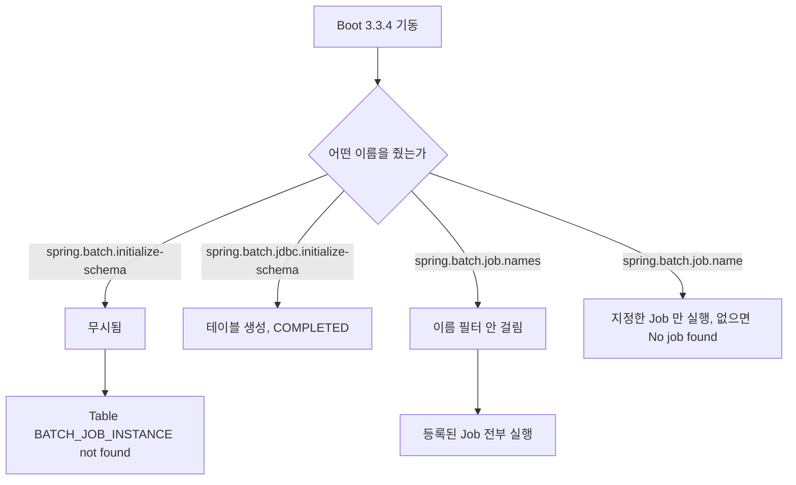

## 파라미터 타입과 메타 테이블 스키마

4.x 는 `BATCH_JOB_EXECUTION_PARAMS` 에 타입별 컬럼을 따로 두었다. 5.x 는 값을 문자열 하나로 저장하고 타입은 클래스 이름으로 적는다. 각 버전에서 H2 `information_schema` 로 뽑은 컬럼 목록이다.

| 4.3.10 | 5.1.2 |
|---|---|
| `TYPE_CD` (`STRING`, `LONG`, `DOUBLE`, `DATE`) | `PARAMETER_TYPE` (`java.lang.String`, `java.lang.Long` 등) |
| `KEY_NAME` | `PARAMETER_NAME` |
| `STRING_VAL`, `DATE_VAL`, `LONG_VAL`, `DOUBLE_VAL` | `PARAMETER_VALUE` 하나 |
| `IDENTIFYING` | `IDENTIFYING` |

`BATCH_STEP_EXECUTION` 에는 `CREATE_TIME` 이 `NOT NULL` 로 추가되고 `START_TIME` 은 `NULL` 을 허용하게 바뀐다.

위 표의 컬럼 대응을 한 장으로 보면 아래와 같다. 4.x 의 값 컬럼 네 개가 5.x 에서 하나로 합쳐진다.

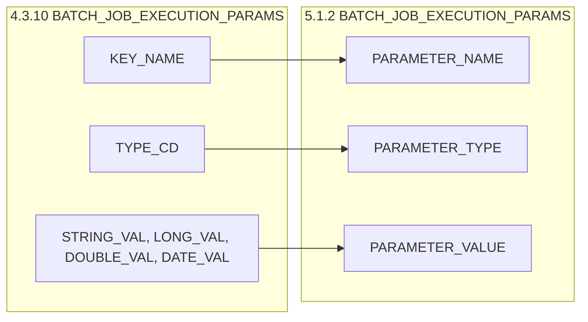

### 커맨드라인 파라미터 문법

러너에 넘기는 파라미터 문법도 바뀌었다. 4.x 의 `seq(long)=1` 은 에러 없이 이름이 `seq(long)` 인 `String` 파라미터가 된다. 5.x 로 `seq(long)=1` 을 그대로 줘 보고 DB 를 읽은 결과다.

```text
JOB_EXECUTION_ID | PARAMETER_NAME | PARAMETER_TYPE   | PARAMETER_VALUE | IDENTIFYING
1                | seq(long)      | java.lang.String | 1               | Y
1                | runDate        | java.lang.String | 2026-10-01      | Y
```

5.x 문법은 `이름=값,타입,identifying여부` 다. 세 번째 값을 생략하면 `true` 다.

```bash
java -jar app.jar runDate=2026-10-01 'seq=1,java.lang.Long' 'ratio=0.5,java.lang.Double,false'
```

날짜는 형식이 갈린다. 4.x 의 `asOf(date)=2026/10/01` 형식은 5.x 에서 `Unable to convert job parameter 2026/10/01 to type class java.util.Date` 로 실패하고, 반대로 4.x 에 ISO 형식(`2026-10-01T00:00:00Z`)을 주면 `Date format is invalid: [...], use yyyy/MM/dd` 로 실패한다. 5.x 에서 통과한 조합은 `java.util.Date` + ISO 문자열, `java.time.LocalDate`, `java.time.LocalDateTime` 이다. `java.time.Instant` 는 `No converter found capable of converting from type [java.lang.String] to type [java.time.Instant]` 로 실패했다.

### 공식 마이그레이션 스크립트가 지우는 것

스크립트는 `spring-batch-core-5.1.2.jar` 의 `org/springframework/batch/core/migration/5.0/migration-<db>.sql` 에 있다. H2 용은 이렇게 생겼다.

```sql
ALTER TABLE BATCH_JOB_EXECUTION_PARAMS DROP COLUMN DATE_VAL;
ALTER TABLE BATCH_JOB_EXECUTION_PARAMS DROP COLUMN LONG_VAL;
ALTER TABLE BATCH_JOB_EXECUTION_PARAMS DROP COLUMN DOUBLE_VAL;
ALTER TABLE BATCH_JOB_EXECUTION_PARAMS ALTER COLUMN TYPE_CD RENAME TO PARAMETER_TYPE;
ALTER TABLE BATCH_JOB_EXECUTION_PARAMS ALTER COLUMN KEY_NAME RENAME TO PARAMETER_NAME;
ALTER TABLE BATCH_JOB_EXECUTION_PARAMS ALTER COLUMN STRING_VAL RENAME TO PARAMETER_VALUE;
```

타입별 컬럼을 먼저 지우고 `STRING_VAL` 만 이름을 바꾼다. 값 복사도, `TYPE_CD` 값 변환도 없다. 4.x 에서 실패한 실행(`runDate` 문자열, `seq` 롱, `ratio` 더블, `asOf` 날짜)에 스크립트를 적용한 뒤 조회한 결과다.

```text
JOB_EXECUTION_ID | PARAMETER_TYPE | PARAMETER_NAME | PARAMETER_VALUE | IDENTIFYING
1                | STRING         | runDate        | 2026-10-01      | Y
1                | DOUBLE         | ratio          |                 | Y
1                | DATE           | asOf           |                 | Y
1                | LONG           | seq            |                 | Y
```

문자열 파라미터만 값이 남았다. 롱, 더블, 날짜는 값이 비었고 `PARAMETER_TYPE` 도 클래스 이름이 아니라 `LONG` 같은 옛 코드 그대로다. 이력 조회 화면이나 재시작 로직이 이 행을 읽으면 틀린 값을 보게 된다. 스크립트가 스키마만 맞추는 용도라는 점을 모르고 그대로 적용하는 경우가 많다.

공식 스크립트를 적용했을 때 타입별로 남는 것과 사라지는 것을 도식으로 정리했다. 값이 STRING_VAL 하나로 모이지 않고 문자열 쪽만 살아남는다.

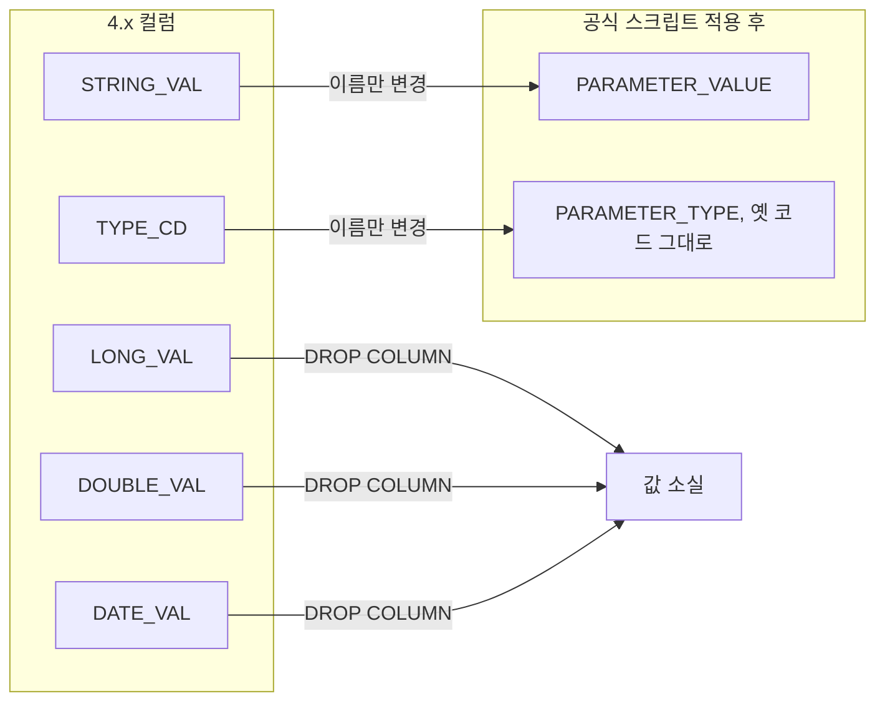

PostgreSQL, MySQL 용 공식 스크립트도 jar 에서 열어 봤다. 컬럼 삭제와 이름 변경만 하고 값은 건드리지 않는 점은 H2 용과 같다. 문법만 `RENAME TYPE_CD TO PARAMETER_TYPE`(PostgreSQL), `CHANGE COLUMN TYPE_CD PARAMETER_TYPE VARCHAR(100)`(MySQL) 로 다르다. 실행은 못 했다.

## 재시작이 막히는 세 곳

4.x 에서 `FAILED` 로 끝난 Job 을 5.x 에서 같은 파라미터로 재기동해 이어서 돌리려면 세 관문을 통과해야 한다. 순서대로 걸리고, 앞에서 막히면 뒤는 보이지 않는다. 도식에서 각 분기가 뒤에 나오는 소절 하나에 대응한다.

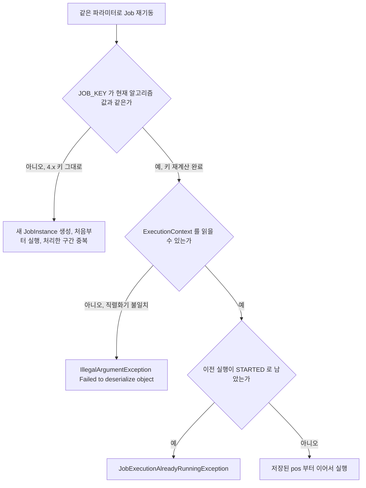

### JOB_KEY 알고리즘이 바뀌었다

Batch 는 파라미터로 `JOB_KEY` 를 만들어 같은 `JobInstance` 인지 판단한다. 4.x 와 5.x 는 키 문자열 형식이 달라서, 마이그레이션 스크립트를 적용해도 4.x 시절 인스턴스는 5.x 가 계산한 키와 안 맞는다. String 파라미터 하나(`runDate=2026-10-01`)만 쓴 인스턴스로 확인했다. 4.x 에서 `FAILED`, 스크립트 적용, 5.x 에서 같은 파라미터로 재기동한 결과다.

```text
READER open pos=0
WRITE [items=[1, 2, 3], skips=[]]
WRITE [items=[4, 5, 6], skips=[]]
...
JOB_INSTANCE_ID | JOB_KEY
2               | 3331b75458118646ed0dc39e7d91e36d
1               | dd802ddecb657d4e6370e6ca05101d5f
```

`pos=0` 부터 다시 읽었고 인스턴스가 하나 더 생겼다. 4.x 가 이미 처리한 1~6번이 두 번 처리된 것이다. 정산이나 알림 발송 Job 이면 중복 발송이다. 키를 직접 계산해 보면 이유가 보인다.

```bash
$ echo -n "runDate=2026-10-01;" | md5sum
dd802ddecb657d4e6370e6ca05101d5f  -
$ echo -n "runDate={value=2026-10-01, type=class java.lang.String, identifying=true};" | md5sum
3331b75458118646ed0dc39e7d91e36d  -
```

4.x 는 `이름=값;` 을 이어 붙여 MD5 를 구하고, 5.x 는 `JobParameter.toString()` 이 들어간 `이름={value=..., type=class ..., identifying=...};` 를 이어 붙여 MD5 를 구한다. 두 값 모두 DB 에 저장된 키와 정확히 일치했다. 파라미터 이름 순서로 정렬하는 것, `identifying` 인 파라미터만 포함하는 것은 두 버전이 같다(5.1.2 `DefaultJobKeyGenerator` 바이트코드에서 `Collections.sort` 와 `isIdentifying` 호출을 확인했다).

두 버전이 JOB_KEY 를 만드는 과정을 나란히 놓았다. 정렬과 identifying 필터는 같고 문자열 한 조각의 형식만 다르다.

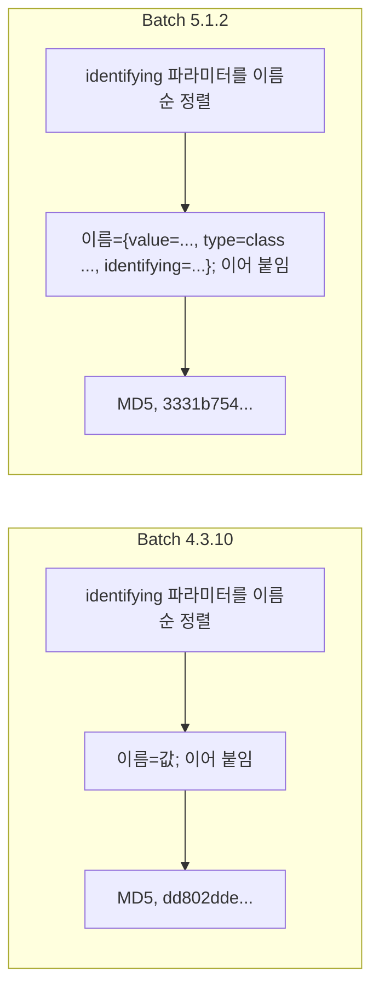

해결은 `BATCH_JOB_INSTANCE.JOB_KEY` 를 5.x 방식으로 다시 계산해 덮어쓰는 것이다. SQL 은 뒤의 Flyway 절에 있다.

### ExecutionContext 직렬화기가 다르다

키를 맞추고 재기동하면 이번에는 여기서 죽는다.

```text
java.lang.IllegalArgumentException: Failed to deserialize object
Caused by: java.io.IOException: Illegal base64 character 0x7b
    at ...DefaultExecutionContextSerializer.deserialize(DefaultExecutionContextSerializer.java:84)
    at ...JdbcExecutionContextDao.getExecutionContext(JdbcExecutionContextDao.java:157)
    at ...SimpleJobRepository.getLastJobExecution(SimpleJobRepository.java:306)
```

`0x7b` 는 `{` 다. 4.3 은 컨텍스트를 JSON 으로 저장한다(`BATCH_STEP_EXECUTION_CONTEXT.SHORT_CONTEXT` 에 `{"@class":"java.util.HashMap","batch.taskletType":...` 형태로 들어 있다). 5.1.2 기본 직렬화기는 `DefaultExecutionContextSerializer`(Java 직렬화 + Base64)라서 JSON 을 못 읽는다. 키 불일치 때문에 새 인스턴스로 흘러가던 앞 실험에서는 이 에러가 안 보였다. 키를 맞추고 나서야 드러나는 문제다.

Boot 3.3.4 에서는 `ExecutionContextSerializer` 빈을 등록하면 자동 구성이 가져다 쓴다.

```java
@Bean
ExecutionContextSerializer executionContextSerializer() {
    return new Jackson2ExecutionContextStringSerializer();
}
```

같은 코드를 Boot 3.0.13(Batch 5.0.4)에서 돌리면 소용이 없다. 위와 같은 `Illegal base64 character 0x7b` 가 그대로 나왔다. 3.0.13 자동 구성은 이 빈을 읽지 않는 것으로 보인다. 3.0.13 에서 통한 방법은 `DefaultBatchConfiguration` 을 상속해 `getExecutionContextSerializer()` 를 오버라이드하는 것이다. 앞에서 본 대로 이러면 자동 구성이 물러나서 러너도 직접 등록해야 한다. 상속만 하면 `runner=0` 으로 Job 이 안 돌고, 러너를 등록하자 `READER open pos=6` 으로 이어서 돌았다.

```java
@Configuration
public class CustomBatchConfig extends DefaultBatchConfiguration {

    @Override
    protected ExecutionContextSerializer getExecutionContextSerializer() {
        return new Jackson2ExecutionContextStringSerializer();
    }

    @Bean
    JobLauncherApplicationRunner jobLauncherApplicationRunner(
            JobLauncher jobLauncher, JobExplorer jobExplorer, JobRepository jobRepository) {
        return new JobLauncherApplicationRunner(jobLauncher, jobExplorer, jobRepository);
    }
}
```

3.0 과 3.3 사이 어느 버전부터 빈 방식이 되는지는 확인하지 못했다. 3.0.x 에 있다면 위 방법이, 3.3.4 이상이면 빈 한 개로 충분하다. 직렬화기를 Jackson 으로 둔 채 운영하면 새로 저장되는 컨텍스트도 JSON 이라 4.x 형식과 호환이 유지된다. 확인한 `ExecutionContext` 내용은 `String` 키와 `Integer` 값, 청크 처리 메타(`batch.taskletType` 등)까지다. 컨텍스트에 날짜나 사용자 정의 클래스를 넣는 Job 은 이 범위 밖이라 따로 확인해야 한다.

Boot 버전에 따라 직렬화기를 바꾸는 방법이 갈리는 모습이다. 3.0.13 쪽은 자동 구성이 물러나서 러너까지 직접 등록해야 한다는 점이 차이다.

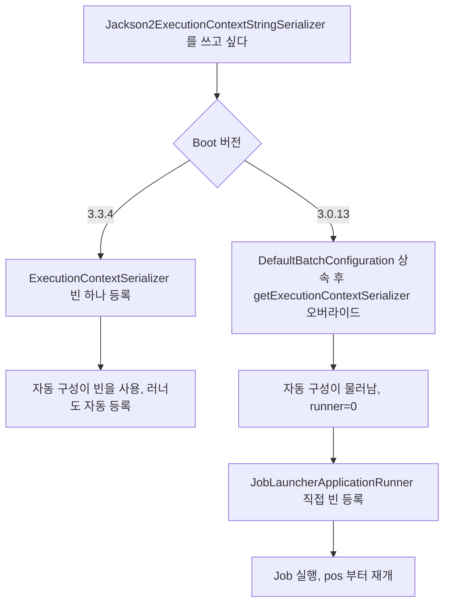

### 실행 중이던 Job 은 STARTED 로 남는다

배포 시점에 돌고 있던 Job 이 강제로 종료되면 `BATCH_JOB_EXECUTION`, `BATCH_STEP_EXECUTION` 의 상태가 `STARTED` 로 남는다. 키와 직렬화기를 모두 맞춘 5.x 에서 이 인스턴스를 재기동한 결과다.

```text
Caused by: org.springframework.batch.core.repository.JobExecutionAlreadyRunningException:
A job execution for this job is already running: JobExecution: id=35, ... status=STARTED, exitStatus=exitCode=UNKNOWN
```

죽은 프로세스의 실행이라 아무도 `FAILED` 로 바꿔 주지 않는다. 먼저 남아 있는 실행을 찾는다.

```sql
select job_execution_id, job_instance_id, status
  from BATCH_JOB_EXECUTION where status in ('STARTED','STARTING','STOPPING');
select job_execution_id, step_name, status
  from BATCH_STEP_EXECUTION where status in ('STARTED','STARTING','STOPPING');
```

실제 프로세스가 정말 죽었는지 확인한 뒤에만 상태를 고친다. 살아 있는 프로세스의 실행을 `FAILED` 로 바꾸면 같은 인스턴스가 동시에 두 번 돈다.

```sql
update BATCH_JOB_EXECUTION
   set status='FAILED', exit_code='FAILED', end_time=CURRENT_TIMESTAMP, last_updated=CURRENT_TIMESTAMP
 where job_execution_id=35 and status='STARTED';
update BATCH_STEP_EXECUTION
   set status='FAILED', exit_code='FAILED', end_time=CURRENT_TIMESTAMP, last_updated=CURRENT_TIMESTAMP
 where job_execution_id=35 and status='STARTED';
```

이렇게 고친 뒤 재기동하자 `READER open pos=3` 으로 마지막 커밋 지점(청크 1개 커밋)부터 이어서 4~10번을 처리하고 `COMPLETED` 가 됐다.

## Flyway 로 운영 DB 에 적용하기

운영에서는 `spring.batch.jdbc.initialize-schema` 를 `never` 로 두고 스키마를 Flyway 가 관리한다. 공식 스크립트 한 장으로는 앞에서 본 값 소실, 타입명 미변환, 키 불일치가 해결되지 않아서 마이그레이션을 세 개로 나눴다. V1 은 4.x 스키마가 아직 있을 때 값을 `STRING_VAL` 로 복사하고, V2 는 공식 스크립트이고, V3 는 타입명 변환과 `JOB_KEY` 재계산이다.

세 마이그레이션의 순서와 각자의 역할을 도식으로 놓았다. V1 이 V2 보다 먼저여야 하는 이유는 V2 가 타입별 컬럼을 지우기 때문이다.

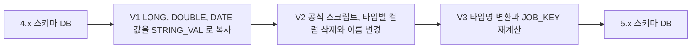

```properties
spring.batch.jdbc.initialize-schema=never
spring.flyway.baseline-on-migrate=true
spring.flyway.baseline-version=0
spring.flyway.locations=classpath:db/migration
```

`baseline-version=0` 이 중요하다. 이미 테이블이 있는 DB 에 Flyway 를 처음 붙이면 `baseline-on-migrate` 가 현재 상태를 baseline 버전으로 기록하고, 그 버전 이하 마이그레이션은 건너뛴다. 기본값 1 로 두고 돌렸더니 V1 이 조용히 빠졌다.

```text
Successfully baselined schema with version: 1
Migrating schema "PUBLIC" to version "2 - batch5 schema"
Migrating schema "PUBLIC" to version "3 - batch5 param types and job key"
Successfully applied 2 migrations to schema "PUBLIC", now at version v3
```

에러 없이 끝났고 결과는 `ratio`, `seq` 의 `PARAMETER_VALUE` 가 빈 값인 상태였다. 값 복사 단계만 사라져서 공식 스크립트만 적용한 것과 같아진 것이다.

### V1 값 복사 (H2 문법)

```sql
UPDATE BATCH_JOB_EXECUTION_PARAMS
   SET STRING_VAL = CAST(LONG_VAL AS VARCHAR(100))
 WHERE TYPE_CD = 'LONG';

UPDATE BATCH_JOB_EXECUTION_PARAMS
   SET STRING_VAL = CAST(DOUBLE_VAL AS VARCHAR(100))
 WHERE TYPE_CD = 'DOUBLE';

UPDATE BATCH_JOB_EXECUTION_PARAMS
   SET STRING_VAL = FORMATDATETIME(DATEADD('HOUR', -9, DATE_VAL),
                                   'yyyy-MM-dd''T''HH:mm:ss''Z''', 'en', 'UTC')
 WHERE TYPE_CD = 'DATE';
```

날짜 변환에서 한 번 틀렸다. 처음에는 `(DATE_VAL AT TIME ZONE 'Asia/Seoul') AT TIME ZONE 'UTC'` 로 썼는데, Flyway 를 JVM 타임존 UTC 로 돌렸더니 `2026-09-30 00:00:00` 으로 저장돼 있던 값이 `2026-09-30T00:00:00Z` 로 나왔다. 4.x 앱은 KST 로 썼으니 맞는 값은 `2026-09-29T15:00:00Z` 다. `DATE_VAL` 이 타임존 없는 `TIMESTAMP` 라서 `AT TIME ZONE` 이 세션 타임존으로 먼저 해석해 버린다. 4.x 앱이 쓰던 타임존의 오프셋을 상수로 빼는 방식(`DATEADD('HOUR', -9, ...)`)으로 바꾸자 JVM 타임존과 무관하게 `2026-09-29T15:00:00Z` 가 나왔다. 고정 오프셋 타임존(KST)일 때만 맞는 식이고, 서머타임이 있는 타임존이면 이 방식은 틀리는 행이 생긴다.

### V2 스키마 변경

`migration-h2.sql` 을 그대로 `V2__batch5_schema.sql` 로 쓴다. MySQL, PostgreSQL 은 jar 안의 해당 DB 파일을 쓴다(실행은 못 했다).

### V3 타입명 변환과 JOB_KEY 재계산 (H2 문법)

```sql
UPDATE BATCH_JOB_EXECUTION_PARAMS SET PARAMETER_TYPE = 'java.lang.String' WHERE PARAMETER_TYPE = 'STRING';
UPDATE BATCH_JOB_EXECUTION_PARAMS SET PARAMETER_TYPE = 'java.lang.Long'   WHERE PARAMETER_TYPE = 'LONG';
UPDATE BATCH_JOB_EXECUTION_PARAMS SET PARAMETER_TYPE = 'java.lang.Double' WHERE PARAMETER_TYPE = 'DOUBLE';
UPDATE BATCH_JOB_EXECUTION_PARAMS SET PARAMETER_TYPE = 'java.util.Date'   WHERE PARAMETER_TYPE = 'DATE';

UPDATE BATCH_JOB_INSTANCE ji
   SET JOB_KEY = (
       SELECT LOWER(RAWTOHEX(HASH('MD5', STRINGTOUTF8(
                  LISTAGG(p.PARAMETER_NAME || '={value=' || p.PARAMETER_VALUE
                          || ', type=class ' || p.PARAMETER_TYPE || ', identifying=true};', '')
                  WITHIN GROUP (ORDER BY p.PARAMETER_NAME)))))
         FROM BATCH_JOB_EXECUTION_PARAMS p
        WHERE p.JOB_EXECUTION_ID = (SELECT MIN(e.JOB_EXECUTION_ID)
                                      FROM BATCH_JOB_EXECUTION e
                                     WHERE e.JOB_INSTANCE_ID = ji.JOB_INSTANCE_ID)
          AND p.IDENTIFYING = 'Y')
 WHERE EXISTS (SELECT 1 FROM BATCH_JOB_EXECUTION_PARAMS p
                WHERE p.JOB_EXECUTION_ID = (SELECT MIN(e.JOB_EXECUTION_ID)
                                              FROM BATCH_JOB_EXECUTION e
                                             WHERE e.JOB_INSTANCE_ID = ji.JOB_INSTANCE_ID)
                  AND p.IDENTIFYING = 'Y')
   AND NOT EXISTS (SELECT 1 FROM BATCH_JOB_EXECUTION_PARAMS p
                    WHERE p.JOB_EXECUTION_ID = (SELECT MIN(e.JOB_EXECUTION_ID)
                                                  FROM BATCH_JOB_EXECUTION e
                                                 WHERE e.JOB_INSTANCE_ID = ji.JOB_INSTANCE_ID)
                      AND p.IDENTIFYING = 'Y'
                      AND p.PARAMETER_TYPE = 'java.util.Date');
```

인스턴스의 첫 실행(`MIN(JOB_EXECUTION_ID)`)에서 `identifying` 파라미터를 이름순으로 이어 붙여 5.x 형식 문자열을 만들고 MD5 를 구한다. 이 스크립트로 `runDate`(문자열), `seq`(롱), `ratio`(더블 3.0)가 있던 `FAILED` 인스턴스를 재기동하자 새 인스턴스가 생기지 않고 같은 인스턴스(1)에 실행 67 이 붙었고, `READER open pos=6` 에서 이어 7~10번만 처리됐다. 더블은 H2 의 `CAST(3.0 AS VARCHAR)` 가 `3.0` 이라 자바 `Double.toString` 과 일치했다. `1.0E7` 같은 지수 표기나 다른 DB 의 더블 캐스팅 결과는 확인하지 못했다.

식별 파라미터에 날짜가 있는 인스턴스는 일부러 갱신 대상에서 뺐다. 5.x 키 문자열에 `Date.toString()` 이 들어가는데(`value=Thu Oct 01 00:00:00 KST 2026`) 이 값이 JVM 타임존과 로케일에 의존해서 SQL 로 흉내 낼 수 없다. 실제로 날짜 파라미터를 가진 `COMPLETED` 인스턴스를 같은 파라미터로 재기동하니 `JobInstanceAlreadyCompleteException` 이 아니라 새 인스턴스가 만들어져 실행됐다. 날짜가 identifying 인 Job 은 업그레이드 전에 정상 종료시켜 두는 쪽이 현실적이다. 남겨 둬야 한다면 5.x 의 `DefaultJobKeyGenerator` 를 자바로 호출해서 키를 다시 계산하는 일회성 프로그램이 필요하다. 그 프로그램은 만들어 보지 않았다.

날짜 파라미터 유무로 갱신 대상이 갈리는 과정을 도식으로 정리했다. 날짜가 있는 쪽만 SQL 로 키를 못 만든다는 점을 보면 된다.

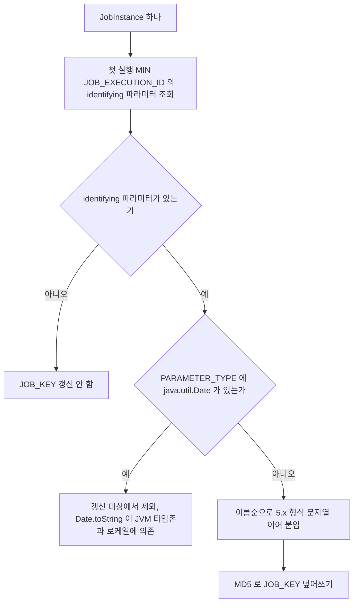

PostgreSQL, MySQL 로 옮길 때 `HASH`, `LISTAGG`, `FORMATDATETIME`, `RAWTOHEX`, `STRINGTOUTF8` 은 H2 함수라 DB 별 대응 함수(`md5()`, 문자열 집계 함수 등)로 바꿔야 한다. 바꾼 SQL 은 이 환경에서 실행하지 못했으니 스테이징 DB 에서 같은 방식으로 한 번 재기동해 `pos` 로 확인해야 한다.

## 배포 순서

4.x 와 5.x 는 같은 스키마를 같이 쓰지 못한다. 마이그레이션이 끝난 DB 에 4.x 앱을 붙이면 첫 쿼리에서 `Column "KEY_NAME" not found` 로 죽는다. 롤링 배포로 구 버전과 신 버전 인스턴스가 섞이는 구간을 두면 안 되고, 롤백은 스냅샷 복원뿐이다. 도식은 이 제약을 반영한 순서다.

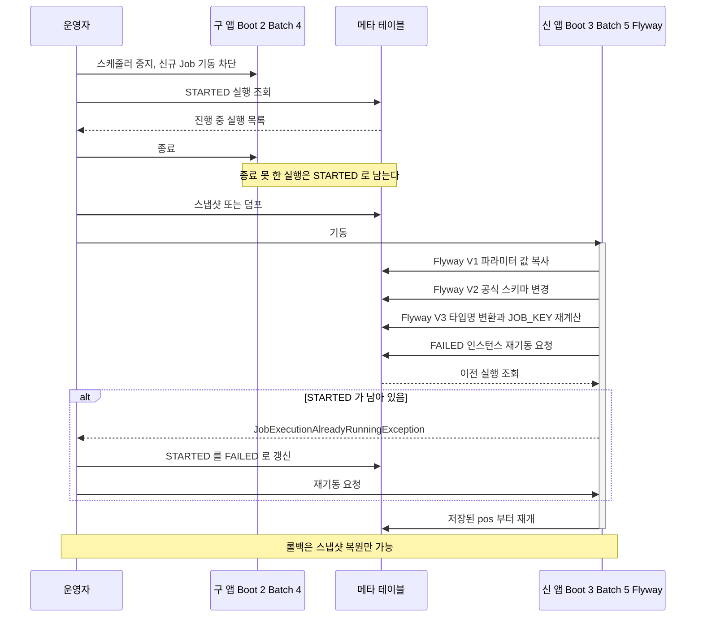

순서에서 놓치기 쉬운 곳은 둘이다. 구 앱을 내리기 전에 스케줄러부터 막아야 한다. 내려가는 사이 스케줄러가 Job 을 새로 기동하면 `STARTED` 가 또 하나 남는다. 그리고 `STARTED` 조회는 구 앱을 내린 뒤에도 한 번 더 한다. 프로세스를 정상 종료하지 못하고 강제 종료한 실행은 그 시점에야 확정된다.

## 확인하지 못한 범위

- MySQL, PostgreSQL 에서의 실행. 공식 스크립트 문법 차이는 파일을 열어 읽기만 했다.
- 날짜가 identifying 인 인스턴스의 키 재계산.
- Boot 3.0 과 3.3 사이 버전에서 `ExecutionContextSerializer` 빈이 언제부터 자동 구성에 반영되는지.
- `ExecutionContext` 에 날짜나 사용자 정의 클래스를 넣은 Job 의 Jackson 직렬화 호환.
- JPA 나 다중 DataSource 구성에서 `StepBuilder` 에 넘기는 트랜잭션 매니저 선택.
