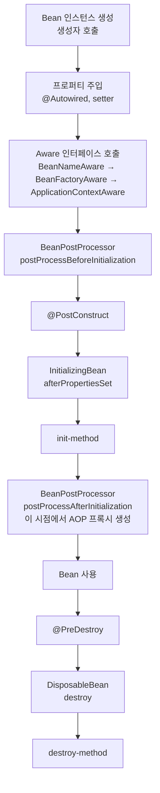

# Spring Bean 심화

## 들어가며

Spring을 처음 배울 때는 `@Component`, `@Autowired`만 알면 충분하다. 하지만 운영 환경에서 문제가 터지기 시작하면 그제야 Bean의 동작 원리가 발목을 잡는다. 순환 참조로 애플리케이션 자체가 안 뜨거나, prototype Bean이 singleton에 주입돼 한 번만 생성되거나, `@PostConstruct`가 호출되지 않거나, AOP 프록시가 final 메서드에서 동작하지 않는 식이다.

기본 등록·주입 방법은 [Bean.md](Bean.md)에서 다뤘다. 이 문서는 그 다음 단계, 즉 컨테이너가 Bean을 어떻게 만들고 후처리하며 어떤 순서로 콜백을 호출하는지, 그리고 실무에서 자주 부딪히는 문제를 어떻게 푸는지를 정리한다.

## BeanFactory vs ApplicationContext

Spring IoC 컨테이너의 두 핵심 인터페이스다. 둘의 관계를 모르면 라이브러리 코드에서 어느 쪽을 써야 할지 헷갈리기 시작한다.

`BeanFactory`가 최상위 인터페이스다. `getBean()`, `containsBean()`, `isSingleton()` 같은 Bean 조회의 기본 계약을 정의한다. `ApplicationContext`는 `BeanFactory`를 상속한 확장 인터페이스다. 메시지 소스, 이벤트 발행, 리소스 로딩, 환경 변수, AOP 자동 적용 같은 기능이 얹혀 있다.

```java
public interface ApplicationContext extends
    EnvironmentCapable,
    ListableBeanFactory,
    HierarchicalBeanFactory,
    MessageSource,
    ApplicationEventPublisher,
    ResourcePatternResolver {
    // ...
}
```

가장 큰 동작 차이는 Bean 초기화 시점이다. `BeanFactory`는 `getBean()`이 호출되는 순간 해당 Bean을 만든다(lazy initialization). `ApplicationContext`는 컨테이너가 시작될 때 모든 singleton Bean을 미리 생성한다(eager initialization). 그래서 잘못된 설정이 있으면 `ApplicationContext`는 시작 시점에 바로 터지고, `BeanFactory`는 실제로 그 Bean을 꺼낼 때까지 숨어 있다.

```java
// BeanFactory: getBean 호출 시 생성
BeanFactory beanFactory = new XmlBeanFactory(new ClassPathResource("beans.xml"));
MyService service = beanFactory.getBean("myService", MyService.class); // 이때 생성

// ApplicationContext: 컨테이너 시작 시 모두 생성
ApplicationContext ctx = new ClassPathXmlApplicationContext("beans.xml"); // 여기서 다 만듦
MyService service = ctx.getBean("myService", MyService.class); // 이미 만들어진 것 반환
```

실무에서는 거의 무조건 `ApplicationContext`를 쓴다. Spring Boot의 `SpringApplication.run()`이 반환하는 것도 `ConfigurableApplicationContext`다. `BeanFactory`를 직접 만질 일은 라이브러리 작성, 매우 가벼운 컨테이너가 필요한 경우, 또는 `BeanFactoryAware`로 동적 Bean 조회를 구현할 때 정도다.

```java
@Component
public class DynamicHandlerResolver implements BeanFactoryAware {

    private BeanFactory beanFactory;

    @Override
    public void setBeanFactory(BeanFactory beanFactory) {
        this.beanFactory = beanFactory;
    }

    public Handler resolve(String type) {
        return beanFactory.getBean(type + "Handler", Handler.class);
    }
}
```

`ApplicationContext`로 같은 일을 하려면 `ApplicationContextAware`나 `@Autowired ApplicationContext`를 쓰면 된다. 차이는 거의 없다.

## Bean 생명주기 콜백 호출 순서

Spring Bean이 만들어지는 과정은 의외로 단계가 많다. 한 번이라도 처음부터 끝까지 추적해 보면 `@PostConstruct`가 왜 호출 안 되는지, `afterPropertiesSet`이 언제 끼어드는지 명확해진다.



이 순서가 진짜로 그렇게 도는지 코드로 확인하면 다음과 같다.

```java
@Component
public class LifecycleBean implements
    BeanNameAware, BeanFactoryAware, ApplicationContextAware,
    InitializingBean, DisposableBean {

    public LifecycleBean() {
        System.out.println("1. 생성자");
    }

    @Autowired
    public void setDependency(SomeDependency dep) {
        System.out.println("2. 의존성 주입");
    }

    @Override
    public void setBeanName(String name) {
        System.out.println("3. BeanNameAware: " + name);
    }

    @Override
    public void setBeanFactory(BeanFactory factory) {
        System.out.println("4. BeanFactoryAware");
    }

    @Override
    public void setApplicationContext(ApplicationContext ctx) {
        System.out.println("5. ApplicationContextAware");
    }

    // BeanPostProcessor.postProcessBeforeInitialization 가 여기 끼어든다

    @PostConstruct
    public void postConstruct() {
        System.out.println("6. @PostConstruct");
    }

    @Override
    public void afterPropertiesSet() {
        System.out.println("7. afterPropertiesSet");
    }

    public void initMethod() {
        System.out.println("8. init-method");
    }

    // BeanPostProcessor.postProcessAfterInitialization 가 여기 끼어든다
    // 이 단계에서 AOP 프록시로 감싸진다

    @PreDestroy
    public void preDestroy() {
        System.out.println("9. @PreDestroy");
    }

    @Override
    public void destroy() {
        System.out.println("10. destroy");
    }

    public void destroyMethod() {
        System.out.println("11. destroy-method");
    }
}
```

기억해 둘 점이 몇 가지 있다.

생성자 주입은 1번 단계, 즉 인스턴스 생성과 동시에 일어난다. 그래서 생성자에서 의존성을 바로 쓸 수 있다. 반면 필드 주입(`@Autowired` 필드), Setter 주입은 2번 단계에서 처리된다. 그래서 생성자에서 필드를 참조하면 null이다.

`@PostConstruct`와 `afterPropertiesSet`은 거의 같은 시점에 도는데, 굳이 따지면 `@PostConstruct`가 먼저다. 둘 다 모든 의존성 주입이 끝난 뒤에 호출되므로 초기화 로직을 넣기에 안전하다. 하지만 이 시점에는 AOP 프록시가 아직 적용되지 않았다. 그래서 `@PostConstruct` 안에서 `this`로 자기 메서드를 호출하면 트랜잭션이 안 걸린다.

```java
@Service
public class OrderService {

    @PostConstruct
    public void init() {
        // 여기서 this.process()를 부르면 트랜잭션 적용 안 됨
        // 프록시가 아직 만들어지지 않은 상태
        process();
    }

    @Transactional
    public void process() { /* ... */ }
}
```

AOP 프록시는 `BeanPostProcessor.postProcessAfterInitialization`에서 만들어진다. 정확히는 `AbstractAutoProxyCreator`라는 `BeanPostProcessor`가 이 단계에서 원본 Bean을 프록시로 갈아치운다. 그래서 `@PostConstruct` 이후에는 프록시 객체가 컨테이너에 등록된다.

소멸 콜백은 정확히 역순이다. `@PreDestroy` → `destroy()` → `destroy-method` 순서다. 단, 컨테이너가 정상 종료될 때만 호출된다. JVM이 강제 종료되거나 prototype 스코프인 경우 호출되지 않는다.

## BeanPostProcessor

Spring 내부 동작의 절반은 `BeanPostProcessor`다. AOP, `@Autowired` 주입, `@PostConstruct` 처리, `@Async` 프록시 적용, `@Transactional` 트랜잭션 어드바이저 - 전부 `BeanPostProcessor` 구현체로 동작한다.

인터페이스는 매우 단순하다.

```java
public interface BeanPostProcessor {
    default Object postProcessBeforeInitialization(Object bean, String name) {
        return bean;
    }
    default Object postProcessAfterInitialization(Object bean, String name) {
        return bean;
    }
}
```

핵심은 반환값이다. 반환한 객체가 컨테이너에 등록되는 Bean이 된다. 원본을 그대로 반환하면 원본이 등록되고, 프록시로 감싸서 반환하면 프록시가 등록된다. AOP가 이렇게 동작한다.

직접 만들어 본다고 가정하자. 모든 Service Bean의 메서드 호출 시간을 로깅하는 프록시를 만든다면 이렇게 된다.

```java
@Component
public class MethodTimingPostProcessor implements BeanPostProcessor {

    @Override
    public Object postProcessAfterInitialization(Object bean, String beanName) {
        if (!bean.getClass().isAnnotationPresent(Service.class)) {
            return bean;
        }

        return Proxy.newProxyInstance(
            bean.getClass().getClassLoader(),
            bean.getClass().getInterfaces(),
            (proxy, method, args) -> {
                long start = System.nanoTime();
                try {
                    return method.invoke(bean, args);
                } finally {
                    long elapsed = System.nanoTime() - start;
                    log.debug("{}.{} took {}ns", beanName, method.getName(), elapsed);
                }
            }
        );
    }
}
```

실무에서 `BeanPostProcessor`를 직접 만질 일은 많지 않다. 하지만 동작 원리를 알면 디버깅이 훨씬 쉬워진다. 예를 들어 "왜 `@PostConstruct`가 호출 안 되지?"라는 의문이 생기면 `CommonAnnotationBeanPostProcessor`가 컨테이너에 등록돼 있는지 확인하면 된다(Spring Boot에서는 자동으로 등록된다).

### BeanFactoryPostProcessor와의 차이

이름이 비슷해서 헷갈리는데 둘은 완전히 다른 단계에서 동작한다.

`BeanFactoryPostProcessor`는 Bean이 만들어지기 *전*, 그러니까 `BeanDefinition` 단계에서 끼어든다. Bean의 설계도(클래스, 스코프, 의존성 정보)를 수정할 수 있지만 Bean 인스턴스 자체에는 접근할 수 없다. `PropertySourcesPlaceholderConfigurer`가 대표적이다. `${db.url}` 같은 placeholder를 실제 값으로 치환하는 일을 이 단계에서 한다.

`BeanPostProcessor`는 Bean 인스턴스가 *만들어진 후* 끼어든다. 인스턴스를 직접 수정하거나 프록시로 교체할 수 있다.


따라서 Bean 메타데이터를 바꾸려면 `BeanFactoryPostProcessor`, 실제 객체를 바꾸려면 `BeanPostProcessor`다. 동적으로 Bean을 등록하고 싶다면 더 구체적인 `BeanDefinitionRegistryPostProcessor`(BFPP의 하위 인터페이스)를 쓰면 된다.

## Bean 스코프 심화

기본 스코프는 6가지다: `singleton`, `prototype`, `request`, `session`, `application`, `websocket`. 실무에서 무게 있는 건 singleton과 prototype이다.

### prototype을 singleton에 주입할 때의 함정

`@Scope("prototype")` Bean을 `@Service`(기본 singleton)에 그냥 주입하면 매번 새 인스턴스가 만들어질 것 같지만 그렇지 않다.

```java
@Component
@Scope("prototype")
public class PrototypeWorker {
    public PrototypeWorker() {
        System.out.println("새 Worker 생성: " + this.hashCode());
    }
}

@Service
public class WorkerManager {

    @Autowired
    private PrototypeWorker worker; // 주입 시점에 한 번만 생성됨

    public void doWork() {
        System.out.println("사용 중인 Worker: " + worker.hashCode());
        // 항상 같은 hashCode 출력. prototype이 무색해짐
    }
}
```

`WorkerManager`는 singleton이라 한 번만 생성된다. 그 한 번의 주입 시점에 `PrototypeWorker`도 한 번 만들어지고, 그 인스턴스가 필드로 고정된다. 결과적으로 prototype이 의미가 없다.

해결 방법은 세 가지다.

#### 1. ObjectProvider (또는 Provider)

가장 깔끔하고 권장되는 방법이다. Spring 4.3부터 들어왔다.

```java
@Service
public class WorkerManager {

    private final ObjectProvider<PrototypeWorker> workerProvider;

    public WorkerManager(ObjectProvider<PrototypeWorker> workerProvider) {
        this.workerProvider = workerProvider;
    }

    public void doWork() {
        PrototypeWorker worker = workerProvider.getObject();
        // getObject 호출할 때마다 새 인스턴스
    }
}
```

`ObjectProvider`는 `getObject()`, `getIfAvailable()`, `getIfUnique()` 같은 메서드로 lazy하게 Bean을 가져온다. JSR-330의 `javax.inject.Provider`도 거의 같은 역할이다.

#### 2. 스코프 프록시

`@Scope`에 `proxyMode`를 지정하면 프록시 객체가 주입된다. 메서드 호출 시점에 프록시가 실제 Bean을 가져온다.

```java
@Component
@Scope(value = "prototype", proxyMode = ScopedProxyMode.TARGET_CLASS)
public class PrototypeWorker {
    // ...
}

@Service
public class WorkerManager {

    @Autowired
    private PrototypeWorker worker; // 사실은 프록시

    public void doWork() {
        worker.execute(); // 호출 시점에 프록시가 새 인스턴스 만들어서 위임
    }
}
```

`request`, `session` 스코프에서 자주 쓰는 패턴이다. 단점은 프록시 객체이므로 일부 동작(아래의 final 메서드 관련 문제)에 제약이 생긴다는 것이다.

#### 3. Lookup 메서드 주입

추상 메서드를 정의해 두고 Spring이 런타임에 구현체를 만들게 하는 방식이다. 옛날 스타일이라 신규 코드에서는 거의 안 쓴다.

```java
@Service
public abstract class WorkerManager {

    public void doWork() {
        PrototypeWorker worker = createWorker();
        worker.execute();
    }

    @Lookup
    protected abstract PrototypeWorker createWorker();
}
```

`@Lookup`이 붙은 메서드는 호출될 때마다 Spring이 컨테이너에서 새 prototype 인스턴스를 가져와 반환한다. CGLIB가 추상 클래스를 상속해서 구현해야 하므로 클래스가 final이면 안 되고, 메서드도 final이면 안 된다.

실무에서 선택은 거의 `ObjectProvider`다. 명시적이고, 테스트하기 쉽고, 추상 클래스 강제도 없다.

## 순환 참조 해결

Spring 2.6부터 순환 참조가 기본적으로 금지됐다. 그전까지는 경고만 나오고 동작은 했지만, 운영에서 문제를 너무 많이 일으켜서 막아 버렸다. `BeanCurrentlyInCreationException`이 뜨면 보통 순환 참조다.

```
The dependencies of some of the beans in the application context form a cycle:
   serviceA defined in file [...] 
      ↓
   serviceB defined in file [...] 
      ↓
   serviceA (the original beans)
```

해결 순서는 다음과 같다.

### 1순위: 설계를 고친다

순환 참조는 보통 책임 분리가 잘못된 신호다. ServiceA가 ServiceB를 부르고 ServiceB가 다시 ServiceA를 부른다면 두 서비스의 경계가 잘못 그어져 있다. 공통 기능을 ServiceC로 빼거나, 한쪽이 다른 쪽을 호출하지 않도록 이벤트(`ApplicationEventPublisher`)로 분리하는 게 정공법이다.

```java
// Before: 순환 참조
@Service
class OrderService {
    @Autowired UserService userService;
    void place(Long userId) { userService.notifyOrderPlaced(userId); }
}

@Service
class UserService {
    @Autowired OrderService orderService;
    void notifyOrderPlaced(Long userId) { orderService.markNotified(userId); }
}

// After: 이벤트로 분리
@Service
class OrderService {
    @Autowired ApplicationEventPublisher publisher;
    void place(Long userId) {
        publisher.publishEvent(new OrderPlacedEvent(userId));
    }
    @EventListener
    void onNotified(OrderNotifiedEvent e) { /* ... */ }
}

@Service
class UserService {
    @Autowired ApplicationEventPublisher publisher;
    @EventListener
    void onOrderPlaced(OrderPlacedEvent e) {
        publisher.publishEvent(new OrderNotifiedEvent(e.userId()));
    }
}
```

### 2순위: Setter 주입으로 푼다

설계를 당장 고칠 수 없을 때, 그리고 생성자 주입을 쓰고 있을 때 가장 흔한 해결책이다. 생성자 주입은 객체 생성 시점에 모든 의존성이 필요하므로 순환 참조를 풀 수 없다. Setter 주입은 생성 후 주입이므로 한쪽이 먼저 생성되고 나서 다른 쪽이 채워질 수 있다.

```java
@Service
class OrderService {
    private UserService userService;

    @Autowired
    public void setUserService(UserService userService) {
        this.userService = userService;
    }
}
```

단점은 `userService` 필드가 final이 될 수 없고, 객체 생성 직후 한 순간 null인 상태가 존재한다는 것이다.

### 3순위: @Lazy

주입받는 쪽에 `@Lazy`를 붙이면 실제 객체 대신 프록시가 주입된다. 첫 메서드 호출 시점에 프록시가 진짜 객체를 컨테이너에서 가져온다.

```java
@Service
class OrderService {
    private final UserService userService;

    public OrderService(@Lazy UserService userService) {
        this.userService = userService; // 프록시가 들어옴
    }
}
```

생성자 주입을 유지하면서 순환 참조를 풀 수 있는 유일한 방법이다. 다만 프록시 객체이므로 디버깅이 약간 까다로워지고, 첫 호출 시 약간의 오버헤드가 있다.

### 4순위: spring.main.allow-circular-references=true

Spring Boot 2.6+에서 다시 순환 참조를 허용하는 설정이다.

```yaml
spring:
  main:
    allow-circular-references: true
```

레거시 프로젝트를 급하게 마이그레이션할 때만 임시로 쓴다. 신규 코드에서 이 설정에 의존하는 건 기술 부채를 쌓는 일이다. 게다가 이 설정으로도 풀리지 않는 경우가 있다(생성자 주입 양쪽, `@Async` 같은 프록시 Bean이 끼는 경우 등).

### @PostConstruct로 우회

가장 마지막에 등장하는 꼼수다. 양쪽 다 의존성 주입 시점이 아니라 초기화 시점에 서로 찾아간다.

```java
@Service
class OrderService {
    private UserService userService;

    @Autowired ApplicationContext ctx;

    @PostConstruct
    void init() {
        this.userService = ctx.getBean(UserService.class);
    }
}
```

권장하지 않는다. ApplicationContext를 직접 만지는 순간 그 클래스는 Spring과 강하게 결합되고 테스트가 어려워진다.

## 의존성 주입 트러블슈팅

### NoUniqueBeanDefinitionException

같은 타입의 Bean이 두 개 이상일 때 발생한다.

```
No qualifying bean of type 'com.example.PaymentService' available:
expected single matching bean but found 2: stripePaymentService, paypalPaymentService
```

`@Autowired`는 기본적으로 타입으로 찾는다. 후보가 여럿이면 이름으로 다시 매칭을 시도하지만 그것도 실패하면 위 예외가 난다.

해결 방법은 세 가지다.

#### @Primary

기본 후보를 지정한다. 후보가 명확히 하나가 우위인 경우에 쓴다.

```java
@Service
@Primary
class StripePaymentService implements PaymentService { /* ... */ }

@Service
class PaypalPaymentService implements PaymentService { /* ... */ }

@Service
class OrderService {
    @Autowired PaymentService payment; // Stripe가 주입됨
}
```

#### @Qualifier

호출 측에서 어느 것을 쓸지 명시한다.

```java
@Service
class OrderService {
    private final PaymentService payment;

    public OrderService(@Qualifier("paypalPaymentService") PaymentService payment) {
        this.payment = payment;
    }
}
```

Bean 이름을 문자열로 적어야 해서 오타가 나면 컴파일은 통과해도 런타임에 터진다. 그래서 커스텀 어노테이션으로 감싸는 패턴을 자주 쓴다.

```java
@Target({ElementType.FIELD, ElementType.PARAMETER, ElementType.METHOD})
@Retention(RetentionPolicy.RUNTIME)
@Qualifier
public @interface Paypal {}

@Service @Paypal
class PaypalPaymentService implements PaymentService { /* ... */ }

@Service
class OrderService {
    public OrderService(@Paypal PaymentService payment) { /* ... */ }
}
```

#### Map / List 주입

모든 구현체를 받아서 코드에서 선택할 수도 있다.

```java
@Service
class PaymentRouter {
    private final Map<String, PaymentService> services; // key = Bean 이름

    public PaymentRouter(Map<String, PaymentService> services) {
        this.services = services;
    }

    public void process(String provider, Order order) {
        services.get(provider + "PaymentService").pay(order);
    }
}
```

전략 패턴 구현 시 자주 쓴다.

### AOP 프록시와 final 메서드 충돌

`@Transactional`, `@Async`, `@Cacheable` 같은 어노테이션은 AOP 프록시로 동작한다. 인터페이스가 있으면 JDK 동적 프록시, 없으면 CGLIB가 클래스를 상속해서 프록시를 만든다.

CGLIB 프록시는 클래스 상속 기반이므로 다음과 같은 코드는 동작하지 않는다.

```java
@Service
public class OrderService {

    @Transactional
    public final void place(Order order) { // final이라 CGLIB가 오버라이드 못 함
        // 트랜잭션이 적용되지 않음. 경고 로그만 뜸
    }
}
```

```
Method OrderService.place is final: cannot be proxied
```

해결책은 final을 떼는 것이다. final 클래스도 마찬가지 이유로 프록시될 수 없다. Kotlin에서는 클래스와 메서드가 기본 final이라 `kotlin-spring` 플러그인으로 `@Component` 계열 클래스를 자동으로 open으로 바꿔준다.

같은 이유로 프록시 객체에서는 self-invocation이 동작하지 않는다.

```java
@Service
public class OrderService {

    public void placeAll(List<Order> orders) {
        for (Order o : orders) {
            this.place(o); // this는 원본 객체. 프록시를 거치지 않음
        }
    }

    @Transactional
    public void place(Order order) { /* 트랜잭션 적용 안 됨 */ }
}
```

해결책은 자기 자신을 ApplicationContext에서 다시 가져오거나, 두 메서드를 다른 Bean으로 분리하는 것이다. 후자가 훨씬 깔끔하다.

### 생성자 주입 vs Setter 주입 vs 필드 주입

논쟁이 끝난 주제지만 다시 정리한다.

생성자 주입이 표준이다. 이유는 다음과 같다.

- 의존성을 final로 선언할 수 있어 불변이다
- 객체 생성 시점에 모든 의존성이 명시되어 누락이 컴파일에서 잡힌다
- 테스트에서 Mockito 없이 그냥 `new`로 인스턴스를 만들 수 있다
- 순환 참조가 컴파일 시점에 가까운 시점에 드러난다(생성자 주입은 순환 참조를 풀 수 없으므로 즉시 실패)

```java
@Service
public class OrderService {
    private final PaymentService payment;
    private final InventoryService inventory;

    // Spring 4.3+ 단일 생성자는 @Autowired 생략 가능
    public OrderService(PaymentService payment, InventoryService inventory) {
        this.payment = payment;
        this.inventory = inventory;
    }
}
```

Lombok을 쓴다면 `@RequiredArgsConstructor`로 같은 코드를 자동으로 만든다.

필드 주입(`@Autowired private XService x;`)은 다음과 같은 이유로 쓰지 않는 게 좋다.

- final로 만들 수 없다
- 테스트에서 리플렉션이 필요하다
- Spring 컨테이너 없이는 객체를 만들 수 없어 결합도가 높다
- 의존성이 늘어나도 생성자가 비대해지지 않아서 신호를 놓친다(이건 단점이다, 장점이 아니다)

Setter 주입은 순환 참조를 풀거나 정말로 선택적인 의존성을 받을 때만 쓴다.

## 디버깅 팁

Bean 등록과 주입 과정에서 무엇이 일어났는지 확인하고 싶을 때 쓸 수 있는 도구들이다.

```properties
# 모든 Bean의 정의를 로그로 출력
logging.level.org.springframework.beans.factory=DEBUG

# AutoConfiguration 보고서 (어떤 자동 설정이 적용됐는지)
debug=true
```

Spring Boot Actuator의 `/actuator/beans` 엔드포인트는 컨테이너에 등록된 모든 Bean과 의존성 그래프를 JSON으로 보여준다. 운영 환경에서는 보안 때문에 끄지만 로컬·스테이징에서 디버깅용으로 매우 유용하다.

```java
@RestController
class BeanInspectController {

    @Autowired ApplicationContext ctx;

    @GetMapping("/debug/beans")
    public List<String> beans() {
        return Arrays.asList(ctx.getBeanDefinitionNames());
    }
}
```

특정 Bean이 왜 그 타입으로 주입됐는지 추적하고 싶다면 IntelliJ의 "Show Bean Dependencies"가 가장 빠르다. 컨테이너가 너무 복잡하면 `ConfigurableListableBeanFactory.getBeansOfType()`을 디버거에서 호출해 보는 것도 방법이다.

## 정리

Spring Bean의 동작은 한 번에 외울 게 아니라 문제를 만날 때마다 다시 들여다보는 영역이다. 다만 다음 몇 가지는 머릿속에 박혀 있어야 한다.

생성자 주입을 기본으로 쓴다. 순환 참조가 생기면 설계를 먼저 의심하고, 어쩔 수 없으면 `@Lazy` 또는 Setter로 푼다. `allow-circular-references=true`는 정말 마지막이다.

`@PostConstruct` 시점에는 아직 AOP 프록시가 없다. self-invocation은 프록시를 거치지 않는다. final 메서드는 CGLIB가 오버라이드하지 못한다. 이 세 가지는 트랜잭션이 안 걸리는 가장 흔한 원인이다.

prototype Bean을 singleton에 직접 주입하면 prototype이 무력화된다. `ObjectProvider`가 정답이다.

같은 타입의 Bean이 여러 개일 때는 `@Primary`로 기본을 정하거나 `@Qualifier`로 명시한다. 전략 패턴이라면 Map 주입이 가장 깔끔하다.

`BeanPostProcessor`를 직접 만들 일은 거의 없지만, 동작 원리를 알면 트랜잭션·AOP·`@Async`가 왜 그렇게 동작하는지 이해된다.
