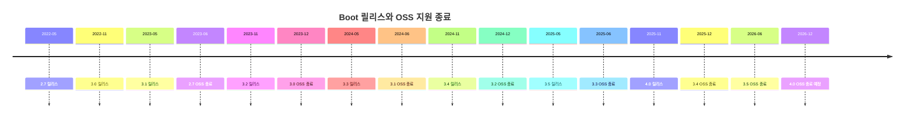
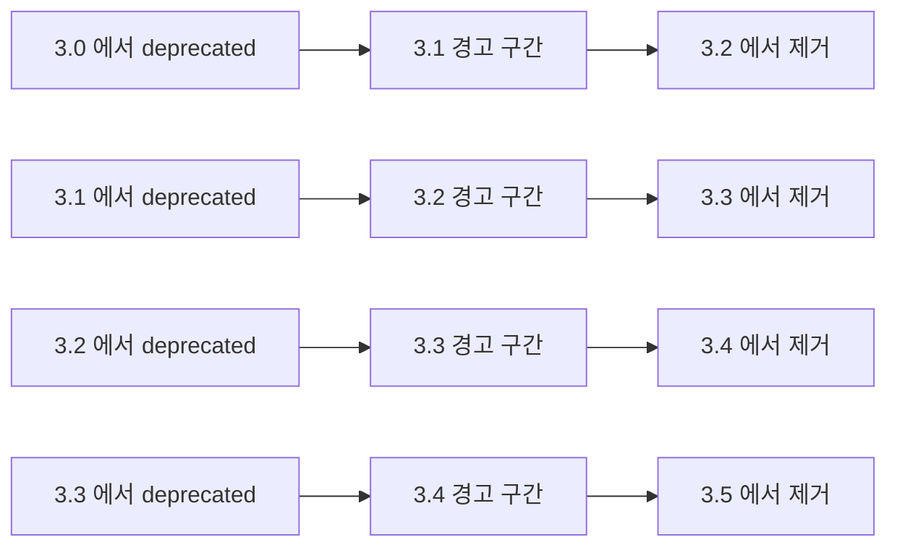
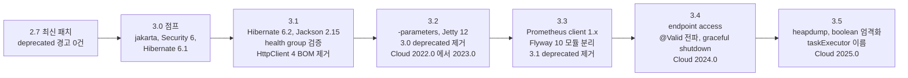
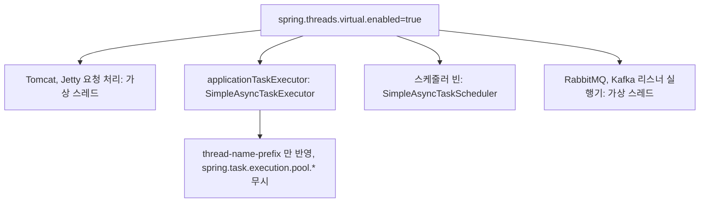
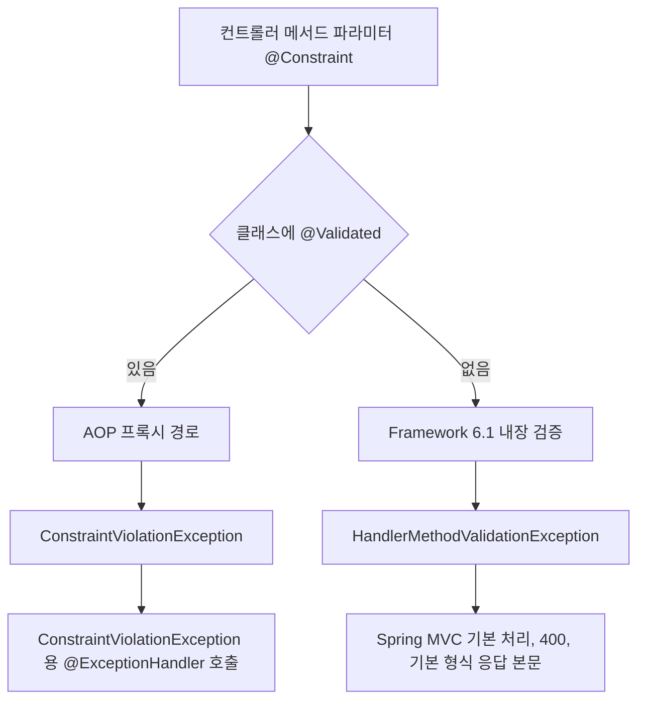
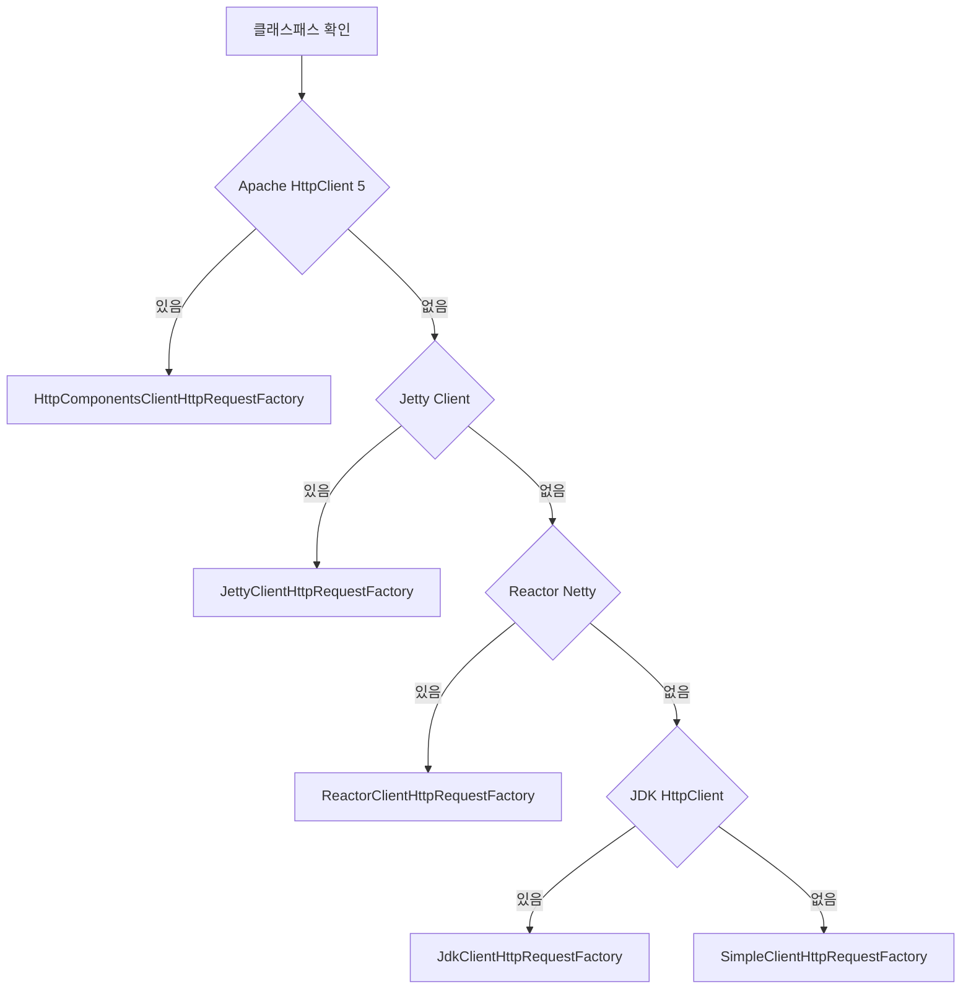
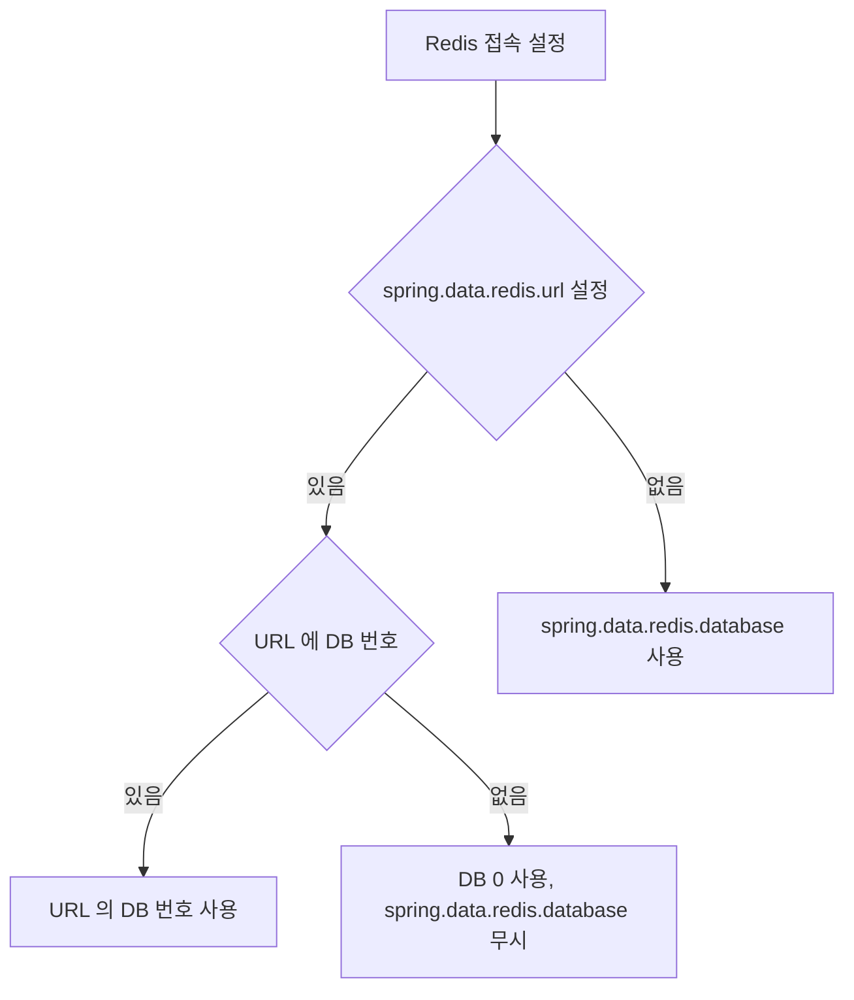
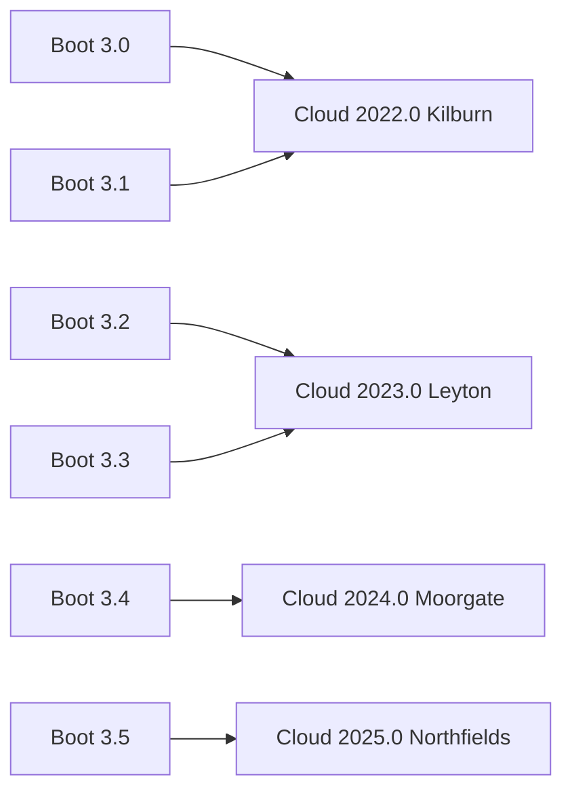
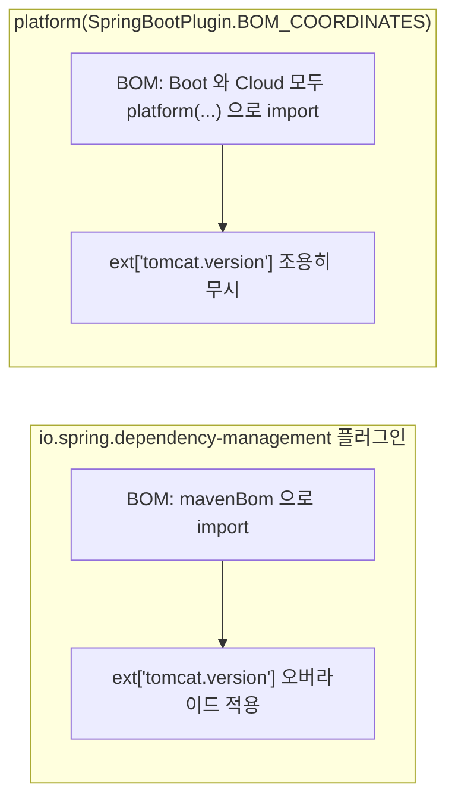

# Spring Boot 3.x 마이너 업그레이드 경로 (3.0 이후 3.5 까지)

2.7 에서 3.0 으로 점프하는 작업은 `javax` → `jakarta`, Security 6, Hibernate 6 때문에 큰 일처럼 보이고, 끝나면 다들 거기서 멈춘다. 빌드가 초록불이고 스테이징이 돌아가니 한동안은 문제가 없다. 문제는 날짜다. 3.0 의 OSS 지원은 2023-12-31 에 끝났고, 3.1 은 2024-06-30 에 끝났다. 3.0 에 멈춰 있는 서비스는 점프를 끝낸 시점부터 이미 패치를 못 받는 버전 위에 올라가 있는 셈이다.

이 문서는 점프 이후의 일을 다룬다. 3.0 → 3.1 → 3.2 → 3.3 → 3.4 → 3.5 로 올릴 때 마이너마다 실제로 깨지는 곳, deprecated 가 언제 제거되는지, Spring Cloud 릴리스 트레인과 Gradle 쪽에서 같이 움직여야 하는 것을 정리한다. 2→3 점프 자체는 [Spring Boot 2.x → 3.x 마이그레이션 심화](Spring_Boot_Migration_2_to_3.md), [Boot 2.x vs 3.x 의사결정](Boot2.0__vs__Boot3.0.md), [Jakarta 전환 도구](Jakarta_Migration_Tooling.md) 에 있으니 여기서 반복하지 않는다.

날짜와 속성 목록은 공식 자료에서 가져왔고, "어느 마이너에서 클래스가 사라졌는가" 는 각 마이너의 마지막 패치 jar 를 직접 열어 확인했다. 확인 방법은 뒤에 붙였다.

## 3.0 에 멈추면 안 되는 이유

Spring Boot 지원 정책은 [공식 위키](https://github.com/spring-projects/spring-boot/wiki/Supported-Versions)에 한 줄로 적혀 있다. 마이너 버전은 최소 12개월 지원하고, 메이저 버전은 최소 3년 지원하되 "지원되는 마이너를 돌려야 한다" 는 조건이 붙는다. 3년은 메이저 전체의 이야기이고 마이너 하나는 1년 남짓이다. 3.0 에 멈추면 1년 남짓의 창을 그대로 통과해 버린다.

구체적인 날짜는 [Spring Boot 지원 페이지](https://spring.io/projects/spring-boot#support)가 보여주는 값이고, 같은 값을 [공식 generations API](https://api.spring.io/projects/spring-boot/generations)에서 JSON 으로 받을 수 있다. 아래 표는 이 API 를 2026-10-04 에 호출한 결과다. 릴리스 일자는 이 API 가 월말로 적어 두므로(실제 릴리스 일은 다를 수 있다) 지원 종료일을 볼 때만 쓴다.

| Boot | Spring Framework | 릴리스(월말 표기) | OSS 지원 종료 | 상용 지원 종료 |
|---|---|---|---|---|
| 2.7 | 5.3 | 2022-05-31 | 2023-06-30 | 2029-06-30 |
| 3.0 | 6.0 | 2022-11-30 | 2023-12-31 | 2024-12-31 |
| 3.1 | 6.0 | 2023-05-31 | 2024-06-30 | 2025-06-30 |
| 3.2 | 6.1 | 2023-11-30 | 2024-12-31 | 2025-12-31 |
| 3.3 | 6.1 | 2024-05-31 | 2025-06-30 | 2026-06-30 |
| 3.4 | 6.2 | 2024-11-30 | 2025-12-31 | 2026-12-31 |
| 3.5 | 6.2 | 2025-05-31 | 2026-06-30 | 2032-06-30 |
| 4.0 | 7.0 | 2025-11-30 | 2026-12-31 | 2027-12-31 |

Framework 열은 각 Boot 릴리스 노트의 "Dependency Upgrades" 에 적힌 버전 계열이다([3.1](https://github.com/spring-projects/spring-boot/wiki/Spring-Boot-3.1-Release-Notes), [3.2](https://github.com/spring-projects/spring-boot/wiki/Spring-Boot-3.2-Release-Notes), [3.4](https://github.com/spring-projects/spring-boot/wiki/Spring-Boot-3.4-Release-Notes)).

2.7 과 3.5 의 상용 지원 종료일이 유난히 긴 것은 두 버전이 각 메이저의 마지막 마이너라서 상용 지원 기간이 길게 잡혀 있기 때문이다. OSS 로 돌리는 서비스에는 의미가 없는 숫자다.

타임라인으로 보면 3.0 에 머물렀을 때의 위치가 더 잘 보인다. 3.0 은 3.1 릴리스 7개월 뒤에 OSS 가 끝났고, 2.7 은 3.0 릴리스 7개월 뒤에 OSS 가 끝났다. 점프를 끝내고 한 분기만 지나도 다음 마이너가 나와 있다.



2026-10 현재 3.0 부터 3.5 까지 전부 OSS 지원이 끝났다. 3.x 에서 가장 늦게 끝난 3.5 도 2026-06-30 에 종료됐다. 그래서 이 문서가 말하는 "3.x 최신 마이너" 는 지원받는 버전이 아니라 4.x 로 넘어가기 전의 마지막 정거장이다. 3.0 에서 바로 4.0 으로 가지 않고 3.5 를 거치는 이유는 아래 deprecated 정책에 있다. 4.x 로 넘어가는 작업은 이 문서 범위 밖이다.

3.0 에 남았을 때 실제로 곤란해지는 지점은 두 가지다. Boot 패치 릴리스는 BOM 안의 Tomcat, Jackson, Logback 같은 라이브러리의 패치 버전을 끌어올리는 통로인데, 이 통로가 닫힌다. 속성(`tomcat.version` 등)으로 개별 버전을 덮어쓸 수는 있지만 그 순간부터 BOM 이 검증한 조합이 아니라 직접 책임지는 조합이 된다. 두 번째는 Spring Cloud 다. 3.0 과 3.1 을 지원하던 2022.0 트레인은 2024-06-30 에 끝났다(뒤의 대응표 참고). Boot 만 올려서는 해결되지 않고 Cloud 도 같이 올려야 한다.

## deprecated 에서 제거까지는 두 마이너

"3.1 에서 deprecated 된 건 3.2 에서 지워지겠지" 하고 마이너를 하나씩 넘으면서 경고를 미뤄 두는 경우가 있다. 공식 [Deprecations 위키](https://github.com/spring-projects/spring-boot/wiki/Deprecations)의 정책은 그렇지 않다. 가능한 한 deprecated 가 붙은 마이너에서 두 마이너가 지난 뒤에 제거한다. `@deprecated since 2.2.0` 은 2.4.0 에서 제거 대상이 된다는 예가 거기 적혀 있다. 제거 대상 표시(`forRemoval`)가 붙은 시점이 이미 다음 마이너가 나온 뒤라면 제거는 그만큼 밀린다.

실제로 각 마이너 릴리스 노트에 이 정책이 그대로 박혀 있다. 3.2 노트에는 "3.0 에서 deprecated 된 클래스·메서드·속성이 이 릴리스에서 제거됐다", 3.4 노트에는 "3.2 에서 deprecated 되고 3.4 에서 제거하기로 한 것이 제거됐다", 3.5 노트에는 3.3 분이 제거됐다고 적혀 있다.



각 줄의 가운데 칸이 경고만 나오는 구간이다. 이 구간을 건너뛰어 3.0 에서 3.2 로 바로 올리면 3.0 에서 deprecated 된 것은 이미 사라진 상태로 만난다. 컴파일 에러나 시작 실패로 만나는 셈이고, 경고로 미리 만날 기회는 없다. 마이너를 하나씩 올리라는 이야기가 아니라, 건너뛴다면 건너뛰는 구간의 deprecated 를 직접 훑어야 한다는 이야기다.

릴리스 노트의 목록 중에서 실제로 코드·설정에서 걸릴 만한 것을 골라, 제거 여부를 마이너별 마지막 패치 jar(3.1.12 / 3.2.12 / 3.3.13 / 3.4.13 / 3.5.16)를 열어 확인했다.

| 제거된 마이너 | deprecated | 대상 | 대체 |
|---|---|---|---|
| 3.2 | 3.0 | `org.springframework.boot.context.properties.ConstructorBinding` (구 패키지 위치) | `...properties.bind.ConstructorBinding` |
| 3.2 | 3.0 | `server.max-http-header-size` | `server.max-http-request-header-size` |
| 3.2 | 3.0 | `management.metrics.web.server.request.metric-name` | `management.observations.http.server.requests.name` |
| 3.3 | 3.1 | `spring.kafka.streams.cache-max-size-buffering` | `spring.kafka.streams.state-store-cache-max-size` |
| 3.3 | 3.1 | `spring.couchbase.env.ssl.key-store`, `key-store-password` | `spring.couchbase.env.ssl.bundle` |
| 3.3 | 3.1 | `MongoPropertiesClientSettingsBuilderCustomizer` | `StandardMongoClientSettingsBuilderCustomizer` |
| 3.3 | 3.1 | `OAuth2ClientPropertiesRegistrationAdapter` | `OAuth2ClientPropertiesMapper` |
| 3.3 | 3.1 | `org.springframework.boot.web.server.SslStoreProvider` | SSL bundle (`spring.ssl.bundle.*`) |
| 3.4 | 3.2 | `TaskExecutorBuilder`, `TaskSchedulerBuilder`, `TaskExecutorCustomizer` | `ThreadPoolTaskExecutorBuilder` 등 `ThreadPool*` 계열 |
| 3.4 | 3.2 | `PlatformTransactionManagerCustomizer` | `TransactionManagerCustomizer` |
| 3.4 | 3.2 | `spring.mvc.throw-exception-if-no-handler-found` | 대체 없음, DispatcherServlet 기본 동작으로 충분 |
| 3.4 | 3.2 | `spring.influx.url`, `user`, `password` | InfluxDB 공식 클라이언트의 Spring Boot 연동 |
| 3.5 | 3.3 | Prometheus simpleclient 자동 설정 | Prometheus client 1.x (`micrometer-registry-prometheus`) |
| 3.5 | 3.3 | `ZipkinRestTemplateBuilderCustomizer`, `ZipkinWebClientBuilderCustomizer` | `ZipkinHttpClientBuilderCustomizer` |
| 3.5 | 3.2 | `management.otlp.metrics.export.resource-attributes` | `management.opentelemetry.resource-attributes` |

속성 쪽 근거는 마이너별 Configuration Changelog([3.2](https://github.com/spring-projects/spring-boot/wiki/Spring-Boot-3.2-Configuration-Changelog), [3.3](https://github.com/spring-projects/spring-boot/wiki/Spring-Boot-3.3-Configuration-Changelog), [3.4](https://github.com/spring-projects/spring-boot/wiki/Spring-Boot-3.4-Configuration-Changelog), [3.5](https://github.com/spring-projects/spring-boot/wiki/Spring-Boot-3.5-Configuration-Changelog))의 "Removed in" 표이고, 클래스는 jar 확인 결과다. 마지막 줄 OTLP 속성은 3.2 에서 deprecated 됐는데 3.4 가 아니라 3.5 에서 제거됐다. 정책 문서가 말한 대로 항상 정확히 두 마이너 뒤는 아니다. 달력으로 계산해 두지 말고 해당 마이너의 Changelog 를 열어봐야 한다.

반대로 아직 남아 있는 것도 있다. `@MockBean`, `@SpyBean` 은 3.4 에서 deprecated 됐는데 3.5.16 jar 에도 그대로 있다. 3.x 안에서는 경고만 나오고 계속 컴파일된다.

jar 확인은 이런 식으로 했다. 클래스 경로를 마이너별 jar 에서 찾기만 하면 된다.

```python
import zipfile, glob

vers = ['3.1.12', '3.2.12', '3.3.13', '3.4.13', '3.5.16']
names = {v: set() for v in vers}
for j in glob.glob('spring-boot*-*.jar'):          # spring-boot, -autoconfigure, -actuator-autoconfigure, -test
    for v in vers:
        if j.endswith(v + '.jar'):
            names[v] |= set(zipfile.ZipFile(j).namelist())

target = 'boot/task/TaskExecutorBuilder.class'
print({v[:3]: any(target in n for n in names[v]) for v in vers})
# {'3.1': True, '3.2': True, '3.3': True, '3.4': False, '3.5': False}
```

`TaskExecutorBuilder` 는 3.3 까지 있고 3.4 에서 사라진다. 코드에서 이 클래스를 직접 주입받고 있으면 3.3 → 3.4 에서 컴파일이 깨진다.

속성 쪽은 도구가 있다. `spring-boot-properties-migrator` 를 런타임 의존성으로 넣으면 시작할 때 옛 이름의 속성을 찾아 경고하고, 실행 중에는 새 이름으로 임시 매핑해 준다. [공식 업그레이드 문서](https://docs.spring.io/spring-boot/upgrading.html)에 적힌 방법이고, 마이그레이션이 끝나면 의존성에서 빼라고 되어 있다. 나중에 읽을 때 이게 왜 들어 있는지 모를 정도로 방치되기 쉬운 의존성이라 PR 에 제거 시점을 같이 적어 두는 편이 낫다. `@PropertySource` 처럼 늦게 환경에 들어오는 값은 검사 대상이 아니다.

## 마이너를 한 칸씩 올릴 때의 점검 지점

2.7.18 에서 시작해 3.0 으로 점프한 뒤 3.5 까지 한 칸씩 올리는 경로다. 각 칸 아래 적은 것은 그 칸에서 실제로 깨졌거나 동작이 바뀐 곳이고, 항목마다 아래 절에 설명이 있다.



3.1 은 지원 종료가 지난 경유지다. 이 칸을 별도 배포로 나눌 필요는 없고, 3.0 에서 3.2 로 한 번에 올려도 된다. 다만 3.1 의 변경 사항(아래)은 그대로 만난다. 팀이 배포 단위를 작게 가져가고 싶으면 3.1 도 한 번 거치면 문제 위치가 훨씬 좁혀진다.

### 3.1 에서 걸리는 것

3.1 의 대표 기능은 개발 환경 쪽이다. `spring-boot-docker-compose` 모듈은 앱이 뜰 때 작업 디렉터리의 `compose.yaml` 을 찾아 `docker compose up` 을 실행하고, 서비스별 접속 정보(`ConnectionDetails` 빈)를 컨텍스트에 등록한다. 그래서 `spring.datasource.url` 을 안 적어도 붙는다. 앱이 내려갈 때는 `docker compose down` 이 실행된다.

```groovy
dependencies {
    developmentOnly 'org.springframework.boot:spring-boot-docker-compose'
}
```

기존에 로컬 DB 를 compose 로 따로 띄우고 `application-local.yml` 에 URL 을 박아 두었다면 두 쪽이 충돌한다. `ConnectionDetails` 가 있으면 접속 관련 속성보다 우선하기 때문에(풀 크기 같은 접속 외 속성은 계속 적용된다) 속성에 적힌 포트가 조용히 무시된다. 로컬 프로파일에서 속성을 지우거나 `spring.docker.compose.enabled=false` 로 끄는 쪽을 택해야 한다.

테스트 쪽은 `@ServiceConnection` 이다. Testcontainers 컨테이너를 정적 필드로 선언하고 어노테이션을 붙이면 `@DynamicPropertySource` 로 URL·계정을 하나씩 꽂던 코드가 필요 없어진다.

```java
@SpringBootTest
@Testcontainers
class OrderRepositoryTest {

    @Container
    @ServiceConnection
    static PostgreSQLContainer<?> postgres = new PostgreSQLContainer<>("postgres:16");

    @Autowired
    OrderRepository orderRepository;
    // ...
}
```

`org.springframework.boot:spring-boot-testcontainers` 와 `org.testcontainers:junit-jupiter`, `org.testcontainers:postgresql` 이 테스트 의존성으로 필요하다. 3.1 부터 Boot 의존성 관리에 Testcontainers 가 들어와서 버전을 직접 적을 필요가 없다. 다른 버전이 필요하면 `testcontainers.version` 속성으로 덮는다.

코드를 고쳐야 하는 변경은 따로 있다. 3.1 릴리스 노트의 "Upgrading" 절에서 실제로 문제가 되는 것은 이런 것들이다.

- Apache HttpClient 4 의존성 관리가 BOM 에서 빠졌다. `RestTemplate` 의 HttpClient 4 지원은 Spring Framework 6 에서 이미 사라졌으므로 `httpclient` 버전을 직접 적고 있었다면 `httpclient5` 로 옮겨야 한다.
- 헬스 그룹에 존재하지 않는 indicator 를 include/exclude 로 적어 두었으면 시작이 실패한다. `management.endpoint.health.validate-group-membership=false` 로 되돌릴 수 있지만, 이름이 틀린 채 방치된 설정이라 고치는 쪽이 낫다.
- `ServletRegistrationBean`, `FilterRegistrationBean` 의 등록 실패가 경고 로그에서 `IllegalStateException` 으로 바뀌었다. 같은 URL 패턴에 필터가 두 번 등록되어 있던 서비스는 이때 시작이 깨진다.
- Jackson 2.15 에 처리 한도(`StreamReadConstraints`)가 들어왔다. 중첩이 깊거나 문자열이 큰 JSON 을 받는 API 는 파싱에서 거절된다. 릴리스 노트가 제안하는 방식은 `Jackson2ObjectMapperBuilderCustomizer` 에서 `maxNestingDepth` 같은 값을 올리는 것이다.
- Spring Kafka 의 retry topic 자동 설정에서 지수 백오프에 `maxDelay` 를 걸어둔 경우, `maxDelay` 에 도달한 이후의 재시도가 모두 같은 토픽으로 간다. 이전에는 시도마다 토픽이 따로 만들어졌고, 그 토픽(`someTopic-retry-3` 같은 것)은 소비가 끝나면 지워도 된다고 노트에 적혀 있다.
- `spring-boot-starter-parent` 가 `maven.compiler.source/target` 대신 `maven.compiler.release` 를 쓴다. 자식 pom 에서 `source`, `target` 을 직접 읽던 플러그인 설정이 있으면 같이 고쳐야 한다.

Hibernate 가 6.2 로 올라가는 부분은 [Hibernate 6 업그레이드 함정](Hibernate_6_Migration_Pitfalls.md) 에서 따로 다룬다.

### 3.2 에서 걸리는 것

3.2 는 3.x 안에서 가장 큰 마이너다. Spring Framework 가 6.1 로 올라가고, 가상 스레드와 `RestClient`, `JdbcClient` 가 들어오며, 3.0 에서 deprecated 된 것들이 한꺼번에 사라진다.

기능부터 보면 가상 스레드는 속성 하나다. Java 21 이상에서만 의미가 있다.

```yaml
spring:
  threads:
    virtual:
      enabled: true
```

켜면 Tomcat·Jetty 가 요청 처리를 가상 스레드에서 하고, `applicationTaskExecutor` 는 가상 스레드를 쓰는 `SimpleAsyncTaskExecutor` 가 되고, 스케줄러 빈은 `SimpleAsyncTaskScheduler` 가 된다. RabbitMQ·Kafka 리스너 실행기도 가상 스레드로 바뀐다. 릴리스 노트가 명시한 부작용은 풀 기반 설정이 무시된다는 점이다. `SimpleAsyncTaskExecutor` 는 스레드 이름 접두사(`spring.task.execution.thread-name-prefix`)만 반영하고 `spring.task.execution.pool.*` 은 읽지 않는다. 풀 크기를 조절해 동시 실행 수를 제한하던 `@Async` 코드는 제한 없이 돌게 된다. 외부 API 호출 동시성을 풀 크기로 막고 있었다면 세마포어로 옮기고 켜야 한다. 가상 스레드 동작 원리와 운영상 주의는 이 문서의 범위가 아니다.

속성 하나가 바꾸는 범위와, 그 중 풀 설정이 무시되는 자리를 같이 본다.



`RestClient` 와 `JdbcClient` 는 각각 `RestTemplate`, `JdbcTemplate` 위에 얹힌 fluent API 다. 둘 다 Boot 가 빌더·빈을 자동 구성한다.

```java
@Service
class MemberQuery {

    private final JdbcClient jdbcClient;
    private final RestClient restClient;

    MemberQuery(JdbcClient jdbcClient, RestClient.Builder builder) {
        this.jdbcClient = jdbcClient;
        this.restClient = builder.baseUrl("https://api.example.com").build();
    }

    List<Member> active() {
        return jdbcClient.sql("select id, name from member where status = :status")
                .param("status", "ACTIVE")
                .query(Member.class)
                .list();
    }

    String profile(long id) {
        return restClient.get().uri("/profiles/{id}", id).retrieve().body(String.class);
    }
}
```

CRaC(Project CRaC 기반 체크포인트 복원)는 "initial support" 로 들어왔고, CRaC 를 지원하는 JDK 가 별도로 필요하다. 일반 Temurin·Corretto 로는 쓸 수 없다. 이 마이너에서 바로 쓸 거리라기보다 이름만 알고 있으면 된다.

가장 먼저 만나는 것은 `-parameters` 다. Spring Framework 6.1 은 `LocalVariableTableParameterNameDiscoverer` 를 제거했다. 바이트코드를 파싱해서 파라미터 이름을 추측하던 경로가 없어졌으므로, 컴파일할 때 `-parameters` 가 없으면 `@RequestParam` 이나 `@PathVariable` 에 이름을 안 적은 코드, 이름 기반 바인딩이 깨진다. Boot 의 Maven 부모 pom 과 Gradle 플러그인(`java` 플러그인이 적용된 경우 `JavaCompile` 에 `-parameters` 를 넣는다)을 쓰면 이미 들어가 있어 보통은 모른 채 지나간다. 걸리는 쪽은 사내 공통 부모 pom 을 쓰면서 `maven-compiler-plugin` 설정을 덮어쓰는 경우, Gradle 에서 컴파일 옵션을 직접 재설정한 경우다. IDE 로 실행하면 되는데 CI 빌드 산출물에서만 깨지는 식으로 나타난다.

```xml
<plugin>
    <groupId>org.apache.maven.plugins</groupId>
    <artifactId>maven-compiler-plugin</artifactId>
    <configuration>
        <parameters>true</parameters>
    </configuration>
</plugin>
```

Spring Framework 6.1 에는 컨트롤러 메서드 파라미터의 `@Constraint` 검증이 프레임워크 내장으로 들어왔다. 컨트롤러 클래스에 `@Validated` 가 붙어 있으면 이전처럼 AOP 프록시 경로를 타서 예외도 `ConstraintViolationException` 으로 그대로다. 클래스의 `@Validated` 를 빼야 내장 경로가 켜지고, 그때 예외가 `HandlerMethodValidationException` 으로 바뀐다. 6.1 노트의 설명이다([Spring Framework 6.1 Release Notes](https://github.com/spring-projects/spring-framework/wiki/Spring-Framework-6.1-Release-Notes)). `@ExceptionHandler` 가 `ConstraintViolationException` 만 잡고 있는 서비스에서 `@Validated` 를 지우면 그 핸들러가 더 이상 호출되지 않는다. 새 예외는 Spring MVC 기본 처리로 넘어가므로 상태 코드는 400 이어도 팀이 정한 에러 응답 본문이 기본 형식으로 바뀐다.

`@Validated` 유무에 따라 검증 경로와 예외 타입이 갈리는 모습이다. 오른쪽 가지로 가면 기존 `@ExceptionHandler` 가 빠진다.



Jetty 쪽은 Jetty 12 가 지원된다. Jetty 12 는 Servlet 6.0 API 를 지원하므로, 3.x 에서 Jetty 를 쓰려고 Servlet API 를 5.0 으로 내려두었던 오버라이드(`jakarta-servlet.version`)를 지워야 한다. Jetty 11 은 임베디드 서버로 더 이상 지원되지 않는다.

그리고 3.0 에서 deprecated 된 것이 제거된다. 앞 표의 `ConstructorBinding` 구 패키지, `server.max-http-header-size`, 요청 메트릭 이름 속성이 여기에 해당한다. `@ConstructorBinding` 은 import 줄 하나 문제라 컴파일에서 바로 드러나지만, 속성은 시작 시 에러 없이 무시되기 때문에 `server.max-http-header-size` 를 올려둔 서비스가 기본값 8KB 로 돌아가 쿠키가 큰 요청이 431 로 거절되는 식으로 나타난다. 이 칸에서 properties-migrator 를 켜 두는 것이 가장 가치가 크다.

Spring Cloud 도 이 칸에서 2022.0 에서 2023.0 으로 올라간다(뒤의 표 참고).

### 3.3 에서 걸리는 것

3.3 은 기능이 얌전하고 의존성 변화가 크다. Prometheus client 가 1.x 로 바뀌고 Flyway 가 10 으로 올라간다.

Prometheus client 1.x 는 내보내는 메트릭 이름이 바뀌는 breaking change 가 있고, 이 버전에서는 Push Gateway 를 지원하지 않는다는 점이 노트에 적혀 있다. 0.x 를 계속 쓰려면 `micrometer-registry-prometheus` 를 빼고 `micrometer-registry-prometheus-simpleclient` 를 넣는데, 이 자동 설정은 deprecated 형태로 3.3 에 남겨 둔 것이고 3.5 에서 제거된다. 앞 표에서 확인했듯 3.4 jar 에는 있고 3.5 jar 에는 없다. 대시보드가 메트릭 이름에 의존하는 서비스는 3.3 에서 이름이 바뀌고, 3.5 에서 simpleclient 라는 도피처가 사라진다. 이 두 번을 한 번에 몰아서 처리하는 것이 낫다.

Flyway 10 은 데이터베이스별 모듈이 분리된 버전이다. PostgreSQL 을 쓰는데 `flyway-core` 만 넣어 두었다면 `flyway-database-postgresql` 을 추가해야 한다. 노트에 DB2, Derby, HSQLDB, Informix, PostgreSQL, Redshift, SAP HANA, Snowflake, Sybase ASE 용 모듈 이름이 나열되어 있다. MySQL 은 이 목록에 없어 별도 모듈 없이 기존 방식으로 동작하는 것으로 보이지만, 노트에 명시된 것은 위 목록뿐이라 MySQL 서비스는 3.3 에서 마이그레이션 로그를 한 번 확인하는 편이 안전하다.

그 밖에 이 칸에서 알아 둘 것들이다.

- Dropwizard Metrics 의 의존성 관리가 빠졌다. 직접 의존하고 있으면 버전을 명시해야 한다.
- Jersey 메트릭 지원이 `jersey-micrometer` 모듈로 옮겨졌다. `JerseyTagsProvider` 로 태그를 커스터마이징하던 코드는 `JerseyObservationConvention` 빈으로 바꿔야 한다.
- Infinispan 15 는 `-jakarta` 접미사 모듈(`infinispan-core-jakarta` 등)이 없어졌다. 접미사 없는 모듈로 바꾼다.
- GraalVM Native Build Tools 는 0.10.x 이상이어야 한다.
- 3.1 에서 deprecated 된 것이 제거된다. 앞 표의 Kafka Streams 캐시 속성, Couchbase SSL 속성, `SslStoreProvider` 가 해당한다.

새 기능으로는 CDS 지원이 있다. fat jar 를 풀어서 CDS 에 맞는 배치를 만드는 `-Djarmode=tools` 가 들어왔고, 이것이 기존 `-Djarmode=layertools` 를 대체한다. Dockerfile 에서 layertools 로 레이어를 추출하던 서비스는 deprecated 경고가 뜬다.

```dockerfile
# 3.2 까지
RUN java -Djarmode=layertools -jar app.jar extract

# 3.3 부터
RUN java -Djarmode=tools -jar app.jar extract --layers
```

Gradle 의 `layers.includeLayerTools` 와 Maven 의 `<layers><enabled>` 도 같은 맥락에서 `includeTools` 로 바뀌었다. 레이어를 껐다고 jarmode 용 jar 까지 빠지지는 않으니 크기를 줄이려고 `layers.enabled=false` 를 쓰던 곳은 `includeTools` 로 옮겨야 한다.

### 3.4 에서 걸리는 것

3.4 는 이름 변경이 가장 많은 마이너다. 눈에 띄는 기능은 구조화 로깅이다. `ecs`, `gelf`, `logstash` 세 형식이 기본 제공되고, 속성 하나로 켠다.

```yaml
logging:
  structured:
    format:
      console: ecs
    ecs:
      service:
        name: order-api
```

ECS 로 켜면 로그 한 줄이 JSON 한 개가 되어 Logback 인코더를 따로 붙이지 않아도 된다. 다만 기존에 쓰던 `logstash-logback-encoder` 설정과 같이 두면 두 형식이 섞이므로 하나는 꺼야 한다.

가장 많이 걸리는 것은 RestClient/RestTemplate 의 HTTP 클라이언트 자동 선택이다. 3.4 부터 Boot 는 클래스패스에서 다음 순서로 클라이언트를 고른다.



바뀐 점은 두 가지다. HTTP 클라이언트 라이브러리가 클래스패스에 없을 때 예전에는 `SimpleClientHttpRequestFactory`(`HttpURLConnection`)가 쓰였는데 이제는 JDK `HttpClient` 가 선택된다. 그리고 다섯 클라이언트 모두 리다이렉트를 따라간다. `spring.http.client.factory`(`http-components`, `jetty`, `reactor`, `jdk`, `simple`)로 고정하고 `spring.http.client.redirects=dont-follow` 로 끌 수 있다. 외부 결제 API 처럼 리다이렉트를 따라가면 안 되는 호출이 있으면 이 값을 확인해야 한다.

Apache HttpClient 를 쓰는 경우는 하나 더 있다. HTTP/1.1 TLS 업그레이드 관련 기본값이 바뀌었는데 Envoy 나 Istio 뒤에서 문제가 생길 수 있다고 노트에 적혀 있다. 되돌리려면 `HttpComponentsClientHttpRequestFactoryBuilder` 빈에서 `setProtocolUpgradeEnabled(false)` 를 준다.

그 밖에 3.4 에서 동작이 바뀌는 것들이다.

- Actuator 엔드포인트의 on/off(`enabled`)가 접근 수준(`access`) 모델로 바뀌었다. `none`, `read-only`, `unrestricted` 세 단계이고, 상한을 거는 `management.endpoints.access.max-permitted` 가 생겼다. `management.endpoints.enabled-by-default` 와 `management.endpoint.<id>.enabled` 는 deprecated 이고 3.x 안에서는 계속 동작한다. 엔드포인트를 잃어버린 경우 `access` 를 `read-only` 나 `unrestricted` 로 주거나 옛 `enabled=true` 를 주면 된다.
- `@ConfigurationProperties` 검증이 Bean Validation 스펙대로 바뀌었다. 중첩 객체는 해당 필드에 `@Valid` 가 있을 때만 검증된다. 이전에는 `@Validated` 클래스의 중첩 속성이 `@Valid` 없이도 바인딩 중 검증됐다. `@Valid` 를 안 붙여 둔 설정 클래스는 검증이 조용히 사라진다. 잘못된 값이 들어와도 시작이 실패하지 않으므로 테스트로는 안 잡힌다.
- 임베디드 웹 서버의 graceful shutdown 이 기본 활성이다. 배포할 때 종료가 즉시 끝나는 것에 맞춘 헬스 체크·종료 타임아웃이 있으면 `server.shutdown=immediate` 로 되돌릴 수 있다. 쿠버네티스의 `terminationGracePeriodSeconds` 와 `spring.lifecycle.timeout-per-shutdown-phase`(기본 30초) 관계는 같이 봐야 한다.
- `@ConditionalOnBean`, `@ConditionalOnMissingBean` 을 `@Bean` 메서드에 쓰면서 `annotation` 속성을 지정한 경우, 반환 타입이 기본 대상 타입으로 쓰이지 않는다. 옛 동작이 필요하면 `value` 에 반환 타입을 명시한다.
- 빈 YAML 맵은 무시된다. `Environment` 의 값이 전부 스칼라가 되어 properties 파일과 같은 동작이 되는 대신, `foo: {}` 처럼 비어 있는 맵을 넣어 두던 설정은 더 이상 키로 남지 않는다.
- `@MockBean`, `@SpyBean` 이 deprecated 되고 Spring Framework 6.2 의 `@MockitoBean`, `@MockitoSpyBean` 이 대체한다. 노트에도 적혀 있듯 두 쪽의 기능이 완전히 같지는 않다. `@MockitoBean` 은 `@Configuration` 클래스에 붙일 수 없어서 설정 클래스에 선언하던 목은 테스트 클래스의 필드로 옮겨야 한다. 3.x 안에서는 경고만 나오므로 3.4 에서 서둘러 바꿀 필요는 없다.
- Gradle 7.5 ~ 8.3 지원이 끝났다. Gradle 7.6.4 이상 7.x 이거나 8.4 이상이어야 한다. CI 이미지의 Gradle wrapper 버전을 3.4 로 올리기 전에 확인해야 한다.

3.2 에서 deprecated 된 `TaskExecutorBuilder` 계열은 이 칸에서 제거된다. `ThreadPoolTaskExecutorBuilder` 로 바꾸는 것은 타입 이름 치환으로 끝난다.

### 3.5 에서 걸리는 것

3.5 는 3.x 의 마지막 마이너라 새 기능이 적고, 엄격해진 검증이 주로 걸린다.

- `heapdump` 엔드포인트의 기본 접근이 `none` 이다. `management.endpoints.web.exposure.include` 에 넣는 것만으로는 부족하고 `management.endpoint.heapdump.access=unrestricted` 를 줘야 한다. 장애 때 힙 덤프를 받으려고 노출만 해 둔 서비스는 그 시점에 404 를 만난다.
- `.enabled` 류 불리언 속성은 `true` 또는 `false` 만 허용한다. 이전에는 `false` 가 아니면 켜진 것으로 보는 조건이 있었다. `management.xxx.enabled=off` 같은 값을 써 둔 곳이 있으면 달라진다.
- 프로파일 이름 규칙이 엄격해졌다. 문자, 숫자, `-`, `_` 만 허용하고 앞뒤에 `-`, `_` 를 둘 수 없다. 3.5.1 부터는 `.`, `+`, `@` 도 허용하도록 완화됐고 `spring.profiles.validate=false` 로 검증을 끌 수 있다. `prod.eu` 같은 이름을 쓰는 서비스는 3.5.0 에서 시작이 깨지고 3.5.1 이후에서는 통과한다.
- 자동 구성된 `TaskExecutor` 의 빈 이름이 `applicationTaskExecutor` 하나만 남았다. `taskExecutor` 라는 이름으로 이 빈을 `@Qualifier` 나 `AsyncConfigurer` 에서 찾던 코드는 `NoSuchBeanDefinitionException` 을 만난다. 급하면 `BeanFactoryPostProcessor` 로 별칭을 등록한다.
- `spring.data.redis.url` 을 설정하면 DB 번호를 URL 이 결정한다. URL 에 DB 번호가 없으면 0 이고, `spring.data.redis.database` 는 무시된다. URL 로 접속하면서 `database=2` 를 따로 적어 둔 서비스는 조용히 0 번 DB 를 쓰게 된다. 캐시가 비어서 알아차리는 경우가 많다.
- 3.3 에서 deprecated 된 Prometheus simpleclient 자동 설정과 Zipkin 의 `RestTemplate`/`WebClient` 커스터마이저가 제거된다.
- `spring.mvc.converters.preferred-json-mapper`, `spring.codec.*`, `spring.graphql.path` 등이 deprecated 된다. 3.x 안에서는 경고다.

Redis 접속 설정이 어느 값을 따르는지는 분기로 보는 편이 빠르다. 판단은 `spring.data.redis.url` 이 있는지 하나로 갈린다.



`TestRestTemplate` 이 일반 `RestTemplate` 과 같은 리다이렉트 설정을 쓰게 되었다는 점도 노트에 있다. 리다이렉트 응답(302)을 검증하던 통합 테스트는 이제 최종 응답을 받는다. `withRedirects(...)` 로 기존 동작을 고를 수 있다.

## Spring Cloud 릴리스 트레인과 Boot 의 대응

Boot 를 올릴 때 Spring Cloud 는 같이 움직여야 한다. 트레인은 Boot 마이너와 일대일이 아니고, 한 트레인이 Boot 마이너 둘을 지원하는 경우도 있다. 아래 표는 [Spring Cloud 지원 버전 위키](https://github.com/spring-cloud/spring-cloud-release/wiki/Supported-Versions)와 [Spring Cloud generations API](https://api.spring.io/projects/spring-cloud/generations)의 값이다.

| 릴리스 트레인 | 코드명 | 지원 Boot | Gateway·Config·OpenFeign | OSS 지원 종료 |
|---|---|---|---|---|
| 2021.0.x | Jubilee | 2.6.x, 2.7.x | 위키 표에 없음 | 2023-06-30 |
| 2022.0.x | Kilburn | 3.0.x, 3.1.x | 4.0.x | 2024-06-30 |
| 2023.0.x | Leyton | 3.2.x, 3.3.x | 4.1.x | 2025-06-30 |
| 2024.0.x | Moorgate | 3.4.x | 4.2.x | 2025-12-31 |
| 2025.0.x | Northfields | 3.5.x | 4.3.x | 2026-06-30 |

2021.0.x 줄의 하위 프로젝트 버전은 위키 표에 없어 비웠다. 표에서 읽어야 할 것은 트레인이 바뀌는 시점이다. Boot 3.0 → 3.1 은 같은 2022.0 이고, 3.1 → 3.2 에서 2022.0 → 2023.0, 3.2 → 3.3 은 같은 2023.0, 3.3 → 3.4 에서 2023.0 → 2024.0, 3.4 → 3.5 에서 2024.0 → 2025.0 으로 바뀐다. 앞 절의 점검 지점 도식에서 3.2, 3.4, 3.5 칸에 Cloud 트레인이 같이 적혀 있는 이유다.

Boot 마이너가 어느 트레인에 묶이는지 선으로 보면 2022.0 과 2023.0 은 Boot 둘을 받고, 2024.0 과 2025.0 은 하나만 받는다. 화살표가 둘 모이는 트레인에서는 Boot 마이너만 올릴 때 Cloud 를 건드리지 않아도 된다.



위키는 트레인 자체에는 지원 기한이 없고, 트레인에 속한 프로젝트들의 누적 지원으로 보면 된다고 설명한다. 그 트레인이 지원하는 최신 Boot 가 아직 지원되면 트레인 안의 프로젝트도 지원되는 것으로 보면 된다. 2022.0 의 OSS 종료가 2024-06-30 인 것도 마지막 Boot 였던 3.1 의 종료일과 같다.

Cloud 쪽에서 코드나 설정을 건드리게 되는 변경은 트레인 릴리스 노트에 적혀 있다.

- 2022.0 은 Boot 3 에 맞춰 일부 프로젝트가 트레인에서 빠졌고, `AsyncRestTemplate` 이 Spring Framework 6 에서 제거돼 LoadBalancer 자동 구성도 같이 정리됐다. `spring.config.use-legacy-processing=true` 로는 더 이상 bootstrap 이 켜지지 않고 `spring.cloud.bootstrap.enabled=true` 를 써야 한다([2022.0 릴리스 노트](https://github.com/spring-cloud/spring-cloud-release/wiki/Spring-Cloud-2022.0-Release-Notes)). 2.7 에서 `bootstrap.yml` 로 Config Server 를 붙이던 서비스는 점프 때 이미 만났을 내용이다.
- 2025.0 은 Gateway 모듈과 스타터 이름이 바뀌었다. `spring-cloud-starter-gateway` 는 `spring-cloud-starter-gateway-server-webflux` 로, 속성 접두사는 `spring.cloud.gateway.*` 에서 `spring.cloud.gateway.server.webflux.*` 로 바뀐다. 옛 이름은 deprecated 이고 properties-migrator 가 매핑해 준다. 같은 릴리스 노트에 `X-Forwarded-*`, `Forwarded` 헤더 처리가 기본 비활성이 되고 `trusted-proxies` 를 지정해야 켜진다는 항목도 있다([2025.0 릴리스 노트](https://github.com/spring-cloud/spring-cloud-release/wiki/Spring-Cloud-2025.0-Release-Notes)). 로드밸런서 뒤에서 클라이언트 IP 를 헤더로 받던 게이트웨이는 3.5 로 올릴 때 이 속성을 줘야 한다.

3.4 에서 3.5 로의 변경은 Boot 쪽보다 Gateway 쪽이 더 크게 걸린다.

## Gradle 쪽에서 같이 바뀌는 것

Boot 3 의 Gradle 플러그인은 3.0 에서 태스크 설정이 Gradle 의 `Property` 방식으로 일관되게 바뀌었고, 메인 클래스 탐색도 단순해졌다([3.0 Migration Guide 위키](https://github.com/spring-projects/spring-boot/wiki/Spring-Boot-3.0-Migration-Guide)). 메인 소스셋 출력 바깥에서 메인 클래스를 찾던 빌드는 `springBoot` DSL 의 `mainClass` 로 명시해야 한다.

3.5 기준으로 Cloud 까지 포함한 빌드 스크립트는 이렇게 된다.

```groovy
plugins {
    id 'java'
    id 'org.springframework.boot' version '3.5.16'
    id 'io.spring.dependency-management' version '1.1.7'
}

java {
    toolchain { languageVersion = JavaLanguageVersion.of(17) }
}

ext {
    set('springCloudVersion', '2025.0.3')
}

dependencyManagement {
    imports {
        mavenBom "org.springframework.cloud:spring-cloud-dependencies:${springCloudVersion}"
    }
}

springBoot {
    mainClass = 'com.example.order.OrderApplication'
}

dependencies {
    implementation 'org.springframework.boot:spring-boot-starter-web'
    developmentOnly 'org.springframework.boot:spring-boot-docker-compose'
    testAndDevelopmentOnly 'org.springframework.boot:spring-boot-testcontainers'
}
```

`dependency-management` 플러그인 버전(1.1.7)과 Cloud 버전(2025.0.3)은 이 문서를 쓴 날짜에 쓸 수 있는 값을 적은 것이고, 올릴 때는 Maven Central 에서 해당 트레인의 최신 패치를 확인해야 한다. 트레인 안의 패치 번호는 Boot 마이너와 맞물려 있다. 3.4 에서 2024.0.0 을 쓰던 서비스가 3.5 에서 그대로 2024.0.x 에 머무를 수 없는 이유이기도 하다(2024.0 은 3.4 만 지원한다).

그레이들 쪽에서 3.x 동안 실제로 바뀐 것들이다.

- `testAndDevelopmentOnly` 구성이 3.2 에서 생겼다. `developmentOnly` 와 달리 테스트 컴파일·런타임 클래스패스에도 들어간다. 개발 시점에 Testcontainers 로 앱을 띄우는 구성(`SpringApplication.from(...).with(...)`)에서 쓴다.
- `developmentOnly` 에 `spring-boot-docker-compose` 를 넣는 구성은 3.1 부터다.
- 3.3 에서 `layers.includeLayerTools` 가 `includeTools` 로 바뀌었다.
- 3.4 부터 Gradle 7.6.4 미만 7.x, 8.4 미만 8.x 는 지원하지 않는다.
- 3.2 에서 `-parameters` 가 중요해졌지만 `java` 플러그인을 적용하면 Boot 플러그인이 `JavaCompile` 에 이 옵션을 자동으로 넣는다([Gradle 플러그인 문서](https://docs.spring.io/spring-boot/gradle-plugin/reacting.html)). Kotlin 은 `-java-parameters` 를 넣는다. 컴파일 옵션을 `options.compilerArgs = [...]` 로 대입하는 빌드 스크립트가 있으면 플러그인이 넣은 옵션이 사라질 수 있다. 이 경우에는 `+=` 로 바꾸거나 `-parameters` 를 직접 넣는다.

`io.spring.dependency-management` 플러그인을 쓰지 않고 `implementation platform(SpringBootPlugin.BOM_COORDINATES)` 로 BOM 만 가져오는 방식도 있다. 이 경우 Cloud BOM 도 `platform(...)` 으로 가져와야 하고, `ext['tomcat.version'] = '...'` 같은 버전 속성 오버라이드는 `dependency-management` 플러그인이 있을 때만 동작한다. 플러그인을 빼는 순간 버전 오버라이드가 조용히 무시되므로, 의존성 해결 결과(`./gradlew dependencyInsight --dependency tomcat-embed-core`)를 한 번 비교해야 한다.

두 BOM 방식에서 버전 속성 오버라이드가 어디까지 먹는지 비교하면 이렇다.



## 마이너별로 가장 먼저 확인할 것

| 올리는 칸 | 컴파일 전에 확인 | 시작 시 확인 | 운영에서만 드러나는 것 |
|---|---|---|---|
| 3.0 → 3.1 | `httpclient` 4 사용처 | 헬스 그룹 이름, 필터 등록 중복 | 큰 JSON 파싱 거절 |
| 3.1 → 3.2 | `-parameters`, 3.0 deprecated 제거분 | Jetty 서블릿 API 오버라이드 | `server.max-http-header-size` 소실, 가상 스레드 사용 시 풀 크기 제한 소실 |
| 3.2 → 3.3 | 3.1 deprecated 제거분(Kafka Streams·Couchbase 속성, `SslStoreProvider`) | Flyway DB 모듈 | Prometheus 메트릭 이름 변경 |
| 3.3 → 3.4 | `TaskExecutorBuilder`, `PlatformTransactionManagerCustomizer` | Gradle 버전, `@Valid` 누락 | RestClient 리다이렉트, graceful shutdown |
| 3.4 → 3.5 | simpleclient, Zipkin 커스터마이저 | 프로파일 이름, `taskExecutor` 빈 이름 | heapdump 404, Redis DB 번호, 게이트웨이 헤더 |

표의 3.2 → 3.3 줄은 3.3 에서 deprecated 인 것이 3.5 에서 제거되므로 컴파일 에러가 나는 칸이 아니다. 실제로 깨지는 것은 메트릭 이름과 Flyway 모듈이라 운영 쪽 열에 몰려 있다.

## 확인에 쓴 자료

- 지원 날짜: [Spring Boot 지원 페이지](https://spring.io/projects/spring-boot#support), [generations API](https://api.spring.io/projects/spring-boot/generations), [Supported Versions 위키](https://github.com/spring-projects/spring-boot/wiki/Supported-Versions)
- deprecated 정책: [Deprecations 위키](https://github.com/spring-projects/spring-boot/wiki/Deprecations)
- 마이너별 변경: [3.1](https://github.com/spring-projects/spring-boot/wiki/Spring-Boot-3.1-Release-Notes), [3.2](https://github.com/spring-projects/spring-boot/wiki/Spring-Boot-3.2-Release-Notes), [3.3](https://github.com/spring-projects/spring-boot/wiki/Spring-Boot-3.3-Release-Notes), [3.4](https://github.com/spring-projects/spring-boot/wiki/Spring-Boot-3.4-Release-Notes), [3.5](https://github.com/spring-projects/spring-boot/wiki/Spring-Boot-3.5-Release-Notes) 릴리스 노트와 같은 이름의 Configuration Changelog
- Cloud 대응: [Supported Versions 위키](https://github.com/spring-cloud/spring-cloud-release/wiki/Supported-Versions), [Spring Cloud generations API](https://api.spring.io/projects/spring-cloud/generations)
- 업그레이드 도구: [Upgrading Spring Boot](https://docs.spring.io/spring-boot/upgrading.html)

같은 흐름에서 이어 보면 좋은 문서는 [Spring Boot 3 웹 계층 변경점](Spring_Boot_3_Web_Layer_Changes.md), [Spring Batch 5 전환](Spring_Batch_5_Migration.md), [Spring Cloud](Spring_Cloud.md) 이다.
