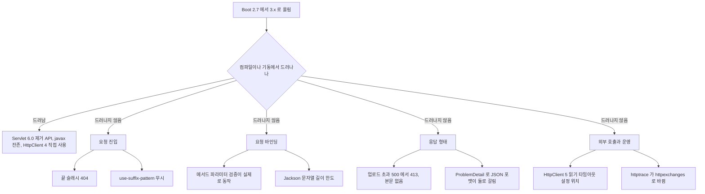
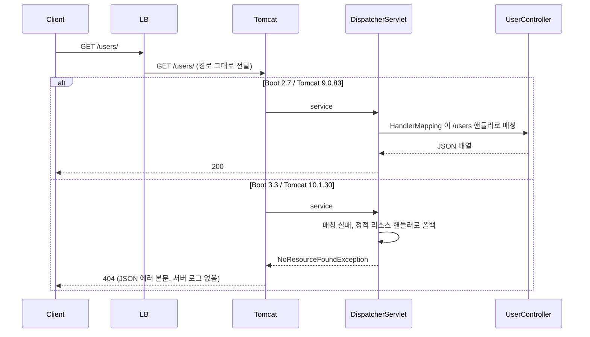
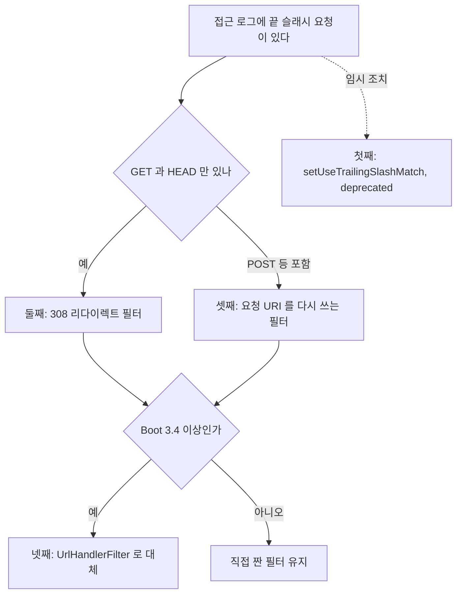
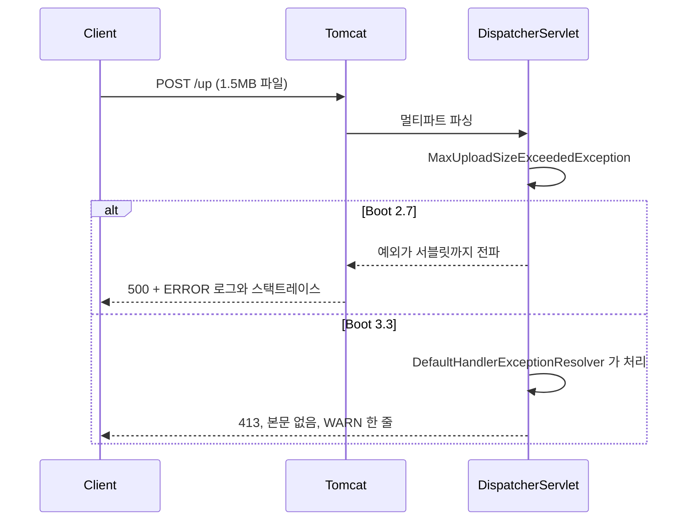
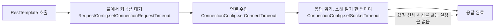
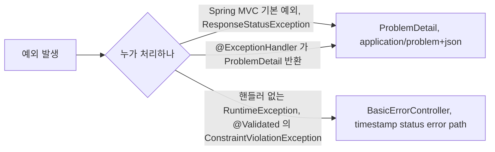
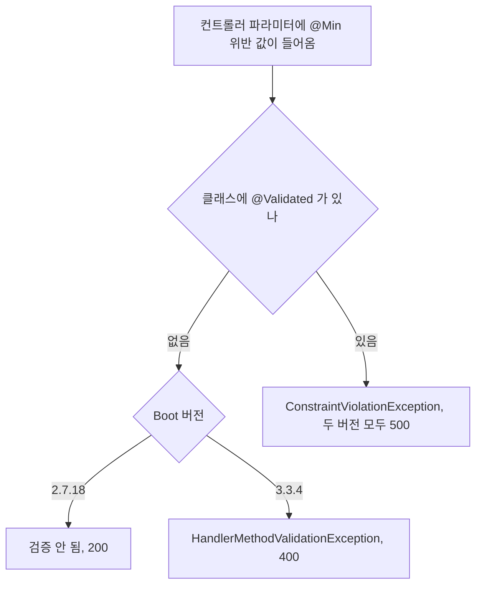
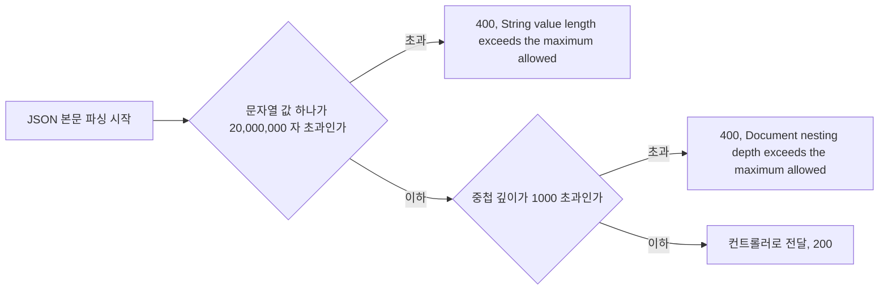

# Spring Boot 3 웹 계층에서 조용히 달라지는 동작

2.x 에서 3.x 로 올릴 때 `javax` 치환과 Security 6, Hibernate 6 은 빌드가 깨지거나 기동이 실패해서 바로 눈에 띈다. 웹 계층은 다르다. 빌드가 통과하고 서버도 뜨는데 `/users/` 가 404 가 되고, 업로드 초과가 500 에서 413 으로 바뀌고, 검증 어노테이션이 갑자기 동작하기 시작한다. 이 문서는 그런 자리만 모았다. 패키지 치환, Security, Hibernate, 관측성은 [Spring Boot 2.x → 3.x 마이그레이션 심화](Spring_Boot_Migration_2_to_3.md) 와 [Jakarta 전환 도구](Jakarta_Migration_Tooling.md) 에 있고 여기서는 반복하지 않는다.

모든 수치와 응답은 같은 소스를 두 버전으로 띄워서 직접 얻은 것이다. 비교 대상은 Boot 2.7.18(Spring Framework 5.3.31, Tomcat 9.0.83)과 Boot 3.3.4(Framework 6.1.13, Tomcat 10.1.30)이고 JDK 17, Maven 3.6.3 에서 돌렸다. `UrlHandlerFilter` 만 Boot 3.5.6(Framework 6.2.11)에서 확인했다. Boot 3.0, 3.1 은 측정하지 않았으므로 "3.x 는 이렇다" 라고 쓴 부분은 3.3.4 기준이다.

---

## 어디서 달라지는지 먼저 본다

변경은 컴파일 단계에서 드러나는 것과 런타임에서만 드러나는 것으로 갈린다. 앞쪽은 고치면 끝이고, 뒤쪽이 장애가 된다.



아래 절은 이 그림의 아래쪽 가지를 위에서부터 차례로 다룬다.

---

## 서블릿 컨테이너가 바뀌면서 달라지는 것

BOM 에 박힌 버전부터 비교한다. 장애 분석할 때 이 표를 가장 자주 다시 열었다.

| 구성요소 | Boot 2.7.18 | Boot 3.3.4 |
|---|---|---|
| Servlet API | 4.0.1 (javax) | 6.0.0 (jakarta) |
| Tomcat | 9.0.83 | 10.1.30 |
| Jetty | 9.4.53 | 12.0.13 |
| Undertow | 2.2.28.Final | 2.3.17.Final |
| Hibernate Validator | 6.2.5.Final | 8.0.1.Final |
| Jackson | 2.13.5 | 2.17.2 |
| HttpClient | 4.5.14 | 5.3.1 |

### Servlet 6.0 에서 사라진 메서드

Servlet 4 에서 deprecated 였던 API 가 6.0 에서 실제로 지워졌다. 오래된 필터나 세션 유틸에 남아 있는 경우가 많다. 같은 소스를 Tomcat 9(javax.servlet 4.0)와 Tomcat 10.1(jakarta.servlet 6.0)에 각각 컴파일한 결과다. 앞쪽은 deprecation 경고 9건, 뒤쪽은 에러 9건이 났다.

| 호출 | Servlet 6.0 컴파일 결과 |
|---|---|
| `res.setStatus(500, "reason")` | 인자 타입 불일치 에러 |
| `res.encodeUrl(url)`, `res.encodeRedirectUrl(url)` | cannot find symbol |
| `req.isRequestedSessionIdFromUrl()` | cannot find symbol |
| `req.getRealPath("/")` | cannot find symbol |
| `session.getValue(k)`, `session.putValue(k, v)` | cannot find symbol |
| `HttpSessionContext`, `session.getSessionContext()` | cannot find symbol |

`setStatus(int, String)` 은 reason phrase 를 직접 넣던 코드다. `sendError(int, String)` 은 6.0 에도 남아 있으니 그쪽으로 옮긴다. `getRealPath` 는 `ServletContext.getRealPath` 가 남아 있어서 `request.getServletContext().getRealPath(...)` 로 바꾸면 된다. 이 둘은 컴파일러가 잡아 주니 사고로 이어지지 않는다. 문제는 소스가 없는 jar 쪽인데, javax 로 컴파일된 jar 는 패키지부터 다르므로 이 표가 아니라 Jakarta 전환 도구 문서의 대상이다.

### Jetty 와 Undertow

`spring-boot-starter-tomcat` 을 제외하고 `spring-boot-starter-jetty`, `spring-boot-starter-undertow` 로 바꿔 3.3.4 를 띄워 봤다. 둘 다 기동했고(Jetty 12.0.13 의 ee10, Undertow 2.3.17) `/users` 는 200 이다. 컨테이너 지원 범위는 Boot 마이너 버전마다 움직이므로 목표 버전의 릴리스 노트를 확인해야 하지만, 3.3.4 에서 컨테이너를 바꾸는 것 자체가 막혀 있지는 않다.

다음 절에서 다루는 끝 슬래시 404 는 세 컨테이너 모두에서 똑같이 났다. 컨테이너 문제가 아니라 Spring MVC 의 매칭 기본값이 바뀐 결과라는 뜻이다. 컨테이너를 바꿔서 해결하려는 시도는 의미가 없다.

---

## 끝 슬래시 요청이 404 가 된다

2.x 에서는 `@GetMapping("/users")` 하나로 `/users` 와 `/users/` 가 모두 같은 핸들러에 붙었다. Framework 6.0 부터 이 매칭이 기본으로 꺼졌다. 같은 컨트롤러, 같은 요청을 두 버전에 보낸 결과가 아래 표다.

| 요청 | Boot 2.7.18 | Boot 3.3.4 (Tomcat, Jetty, Undertow 동일) |
|---|---|---|
| `GET /users` | 200 | 200 |
| `GET /users/` | 200 | 404 |
| `GET /users/1` | 200 | 200 |
| `GET /users/1/` | 200 | 404 |

LB 가 경로를 다시 쓰지 않는 구성이면 요청은 이렇게 흐른다.



두 버전의 갈림은 Tomcat 이 아니라 DispatcherServlet 안의 HandlerMapping 에서 생긴다. 3.x 쪽은 컨트롤러 매핑에서 못 찾은 요청이 `/**` 정적 리소스 핸들러까지 내려가고 거기서 404 가 된다. 응답 본문은 `{"timestamp":...,"status":404,"error":"Not Found","path":"/users/"}` 이고, 기본 로그 레벨에서는 서버 로그에 WARN 도 ERROR 도 한 줄 남지 않는다. 앱 로그만 보면 아무 일도 없었던 것처럼 보이고, LB 의 5xx 가 아니라 4xx 가 늘어나서 알림에도 안 걸린다. 이 점이 이 변경에서 가장 위험하다.

### 누가 끝 슬래시를 붙이고 있는지 찾는다

프론트에서 `/api/users/` 로 하드코딩한 호출, 파트너가 등록해 둔 콜백 URL, LB 헬스체크 경로가 보통 원인이다. 헬스체크 경로가 `/health/` 처럼 끝 슬래시를 포함하는 자체 컨트롤러면 3.x 에서 헬스체크가 404 로 실패한다. 올리기 전에 운영 접근 로그에서 끝 슬래시 요청을 센다. 아래 awk 는 combined 로그 포맷 기준이고 샘플 로그로 동작을 확인했다.

```bash
awk '{ p=$7; sub(/\?.*/,"",p); if (length(p)>1 && p ~ /\/$/) c[$6" "p]++ }
     END { for (k in c) print c[k], k }' access.log | sort -rn
```

```
2 "GET /api/users/
1 "POST /api/orders/
1 "GET /health/
```

메서드까지 같이 찍는 이유가 있다. 아래 대응책 중 리다이렉트는 GET 과 HEAD 에만 쓸 수 있다. POST 가 끝 슬래시로 들어오고 있다면 리다이렉트로는 해결되지 않는다.

### 대응은 네 가지다

세 컨테이너와 무관하게 Spring 쪽에서 처리한다. 네 방식 모두 3.3.4 에서(마지막은 3.5.6 에서) 실제로 띄워서 응답을 확인했다.

아래 그림은 앞에서 센 접근 로그의 메서드 분포로 방식을 고르는 흐름이다. POST 가 섞여 있는지가 첫 번째 갈림길이다.



첫째는 매칭을 다시 켜는 것이다. 동작은 확실하지만 `setUseTrailingSlashMatch` 에 deprecated 가 붙어 있어서 이후 버전에서 사라질 수 있다. 임시 조치로만 쓴다.

```java
@Configuration
class Legacy implements WebMvcConfigurer {
    @Override
    @SuppressWarnings("deprecation")
    public void configurePathMatch(PathMatchConfigurer configurer) {
        configurer.setUseTrailingSlashMatch(true);
    }
}
```

적용하면 `/users/`, `/users/1/` 가 모두 200 이 된다. 이 방식은 모든 매핑에 전역으로 걸린다는 점이 부담이다.

둘째는 308 리다이렉트 필터다. 끝 슬래시를 떼서 정식 URL 로 보낸다. 301 이나 302 는 일부 클라이언트가 메서드를 GET 으로 바꾸므로 메서드를 보존하는 308 을 쓴다.

```java
@Bean
OncePerRequestFilter redirectFilter() {
    return new OncePerRequestFilter() {
        @Override
        protected void doFilterInternal(HttpServletRequest req, HttpServletResponse res, FilterChain chain)
                throws ServletException, IOException {
            String uri = req.getRequestURI();
            boolean readOnly = "GET".equals(req.getMethod()) || "HEAD".equals(req.getMethod());
            if (uri.length() > 1 && uri.endsWith("/") && readOnly) {
                String target = uri.substring(0, uri.length() - 1);
                if (req.getQueryString() != null) target += "?" + req.getQueryString();
                res.setStatus(308);
                res.setHeader("Location", target);
                return;
            }
            chain.doFilter(req, res);
        }
    };
}
```

`GET /users/?page=2` 는 `Location: /users?page=2` 로 가고 `curl -L` 로 따라가면 200 이다. 쿼리스트링을 붙이지 않으면 페이지네이션 파라미터가 조용히 사라진다. 같은 필터에서 POST `/v3/` 는 건드리지 않아 404 로 남았다.

셋째는 요청 URI 를 다시 쓰는 필터다. 리다이렉트 없이 같은 요청 안에서 끝 슬래시를 지운다. POST 도 처리된다.

```java
@Bean
OncePerRequestFilter rewriteFilter() {
    return new OncePerRequestFilter() {
        @Override
        protected void doFilterInternal(HttpServletRequest req, HttpServletResponse res, FilterChain chain)
                throws ServletException, IOException {
            String uri = req.getRequestURI();
            if (uri.length() > 1 && uri.endsWith("/")) {
                String stripped = uri.substring(0, uri.length() - 1);
                chain.doFilter(new HttpServletRequestWrapper(req) {
                    @Override public String getRequestURI() { return stripped; }
                }, res);
                return;
            }
            chain.doFilter(req, res);
        }
    };
}
```

`/users/`, `/users/1/` 는 200, POST `/v3/` 도 본문이 처리됐다. 이 실험 앱에는 Security 가 없었다. Security 필터 체인을 쓰는 앱이면 이 필터가 체인보다 앞에 오는지 필터 순서를 직접 지정하고 확인해야 한다. 순서가 뒤에 있으면 인가 규칙은 끝 슬래시가 붙은 원래 경로로 평가된다.

넷째는 Framework 6.2(Boot 3.4 이상)의 `UrlHandlerFilter` 다. 위 두 필터를 직접 짤 필요가 없다. Boot 3.5.6 에서 경로 패턴별로 리다이렉트와 요청 래핑을 섞어 확인했다.

```java
@Bean
UrlHandlerFilter urlHandlerFilter() {
    return UrlHandlerFilter
        .trailingSlashHandler("/users/**").redirect(HttpStatus.PERMANENT_REDIRECT)
        .trailingSlashHandler("/api/**").wrapRequest()
        .build();
}
```

`GET /users/` 는 308 에 `Location: /users`, `/api/ping` 과 `/api/ping/` 는 둘 다 200 이었다. 3.3 이하라면 위의 둘째, 셋째 필터가 이것과 같은 일을 한다. 장기적으로는 클라이언트가 정식 URL 로 호출하도록 고치고, 리다이렉트는 고치는 동안의 안전망으로 둔다.

---

## spring.mvc.pathmatch 는 어디까지 남았나

3.3.4 의 설정 메타데이터에서 `spring.mvc.pathmatch.*` 로 남은 것은 `matching-strategy` 하나다. 2.7.18 에 있던 `use-suffix-pattern`, `use-registered-suffix-pattern`, `spring.mvc.contentnegotiation.favor-path-extension` 은 없어졌다.

경로 확장자 매칭을 켜 두었던 서비스에서 확인한 결과다. 2.7.18 에 `matching-strategy=ant_path_matcher` 와 `use-suffix-pattern=true` 를 같이 주면 `/users.json` 이 200 이다. 아무 설정도 안 준 2.x 는 `/users.json` 이 404 이므로 명시적으로 켠 서비스만 해당한다. 같은 두 프로퍼티를 3.3.4 에 주면 `/users.json` 은 404 이고, 알 수 없는 프로퍼티라는 경고 로그도 없다. 프로퍼티가 조용히 무시된다.

`matching-strategy=ant_path_matcher` 로 되돌리면 끝 슬래시가 살아날 것 같지만 그렇지 않다. 3.3.4 에서 ant_path_matcher 를 줘도 `/users/` 는 404 였다. 끝 슬래시는 매칭 방식이 아니라 위에서 본 별도 옵션의 문제다. 확장자로 포맷을 고르던 API 는 `Accept` 헤더나 `spring.mvc.contentnegotiation.favor-parameter` 로 옮겨야 한다.

---

## 멀티파트와 문자 인코딩

### 한글 파일명은 기본 상태에서 같다

`curl -F 'file=@a.txt;filename=한글보고서.txt' -F 'title=제목입니다'` 를 두 버전에 보냈다. 파일명과 title 이 모두 UTF-8 그대로 읽혔고 두 버전의 출력이 같았다. `x-www-form-urlencoded` 로 `%ED%95%9C%EA%B8%80` 을 보낸 경우도 같다. 마이그레이션 심화 문서에 "3.x 에서 한글 파일명이 깨진다" 는 서술이 있는데 이 조건에서는 재현되지 않았다. 재현 조건을 찾지 못한 상태라 해당 서술은 별도로 확인이 필요하다.

EUC-KR 로 보내는 레거시 클라이언트는 두 버전 모두 깨진다. `%C7%D1%B1%DB` 를 `charset=EUC-KR` 헤더와 함께 보내도 `�ѱ�` 가 나왔다. Boot 가 등록하는 인코딩 필터가 요청 인코딩을 UTF-8 로 강제하기 때문이다. 3.3.4 에 `server.servlet.encoding.force-request=false` 를 주고 같은 요청을 보내자 `한글` 로 읽혔다. 이 부분은 2.x 와 3.x 의 차이가 아니라 두 버전 공통 동작이다.

### 업로드 크기 초과의 응답이 바뀐다

기본 한도(파일 1MB)를 넘는 1.5MB 파일을 보냈다.

| | Boot 2.7.18 | Boot 3.3.4 |
|---|---|---|
| 상태 코드 | 500 | 413 |
| 응답 본문 | 기본 JSON 에러 본문 | 비어 있음 (`Content-Length: 0`) |
| 서버 로그 | ERROR + 스택트레이스 | WARN 한 줄 |
| ProblemDetail 활성화 시 | 해당 없음 | 413, `application/problem+json` |



413 이 올바른 응답이다. 문제는 이걸 500 으로 알고 있던 쪽이다. 5xx 비율 알림에서 업로드 실패가 사라지고, 프론트가 4xx 에서도 JSON 에러 본문을 파싱하려다 빈 본문에서 터지는 경우가 있다. 업로드 한도를 안내하는 메시지를 응답에서 읽던 클라이언트라면 `MaxUploadSizeExceededException` 용 `@ExceptionHandler` 를 하나 만들어 본문을 채운다.

---

## RestTemplate 타임아웃이 HttpClient 5 로 옮겨 가는 방식

HttpClient 4 가 클래스패스에 있어도 쓰이지 않고 JDK 기본 구현으로 떨어지는 문제, 커넥션 풀과 `ConnectionConfig` 를 쓰는 전체 빈 설정은 마이그레이션 심화 문서에 있다. 여기서는 그 문서에 없는 것, 즉 타임아웃을 어디서 거는지와 API 가 버전마다 다르다는 점을 정리한다.

### setReadTimeout 이 컴파일되지 않는다

2.x 에서 흔한 코드는 이렇다.

```java
var f = new HttpComponentsClientHttpRequestFactory();
f.setConnectTimeout(1000);
f.setReadTimeout(1000);
```

`HttpComponentsClientHttpRequestFactory` 의 메서드를 jar 에서 직접 확인했다. `setReadTimeout(int)` 은 Framework 6.0.23 에 있고, 6.1.13(Boot 3.3.4)에는 없고, 6.2.11 에 `int` 와 `Duration` 둘 다 다시 생겼다. 6.1 에서 이 메서드가 빠져 있어서 Boot 3.2, 3.3 으로 올리면 컴파일이 깨진다. 3.0 에서 먼저 넘어갔다가 3.2 로 올리면 이미 통과한 코드가 다시 깨지는 일이 생긴다. `setConnectTimeout` 과 `setConnectionRequestTimeout` 은 세 버전 모두에 있다.

읽기 타임아웃은 `RestTemplateBuilder` 로 건다. 3.3.4 에서 `HttpComponentsClientHttpRequestFactory` 가 선택됐고 읽기 타임아웃이 정확히 걸렸다.

```java
var rt = new RestTemplateBuilder()
    .setConnectTimeout(Duration.ofSeconds(1))
    .setReadTimeout(Duration.ofSeconds(1))
    .build();
```

3초 걸리는 응답에 1003ms 만에 `Read timed out`, 연결 불가 주소에는 1002ms 만에 `Connect timed out` 이 났다. 팩토리를 직접 만들 때 읽기 타임아웃은 HttpClient 5 의 `ConnectionConfig.setSocketTimeout` 으로 건다.

### 실측한 타임아웃 위치

아래 그림은 호출 한 번이 지나는 구간과 구간마다 타임아웃을 거는 곳이다. 마지막 구간에는 요청 전체를 묶는 타임아웃이 없다는 점을 보면 된다.



| 구간 | 거는 곳 | 측정 결과 |
|---|---|---|
| 연결 수립 | `ConnectionConfig.setConnectTimeout` 또는 factory 의 `setConnectTimeout` | 1003ms 에 Connect timed out |
| 풀에서 커넥션 대기 | `RequestConfig.setConnectionRequestTimeout` | 풀 크기 1, 500ms 설정에서 502ms 에 실패 |
| 응답 읽기 | `ConnectionConfig.setSocketTimeout` 또는 builder 의 `setReadTimeout` | 1003ms 에 Read timed out |
| 요청 전체 시간 | 없음 | 4초짜리 응답이 read=1s 로도 끝까지 받아짐 |

몇 가지는 설정 이름만 봐서는 알 수 없다. HttpClient 5 의 `RequestConfig.DEFAULT` 를 찍어 보면 `connectionRequestTimeout` 이 3분이고 `responseTimeout` 은 null 이다. 풀이 고갈됐을 때 3분 동안 호출 스레드가 붙잡힌다는 뜻이고, 읽기 타임아웃을 안 걸면 응답이 영원히 늦어져도 끝까지 기다린다. 읽기 타임아웃을 건 적 없는 호출에 3초짜리 느린 응답을 보냈더니 3.8초 만에 정상 완료됐다.

풀 대기가 실패하는 모양도 달라졌다. 4.x 의 `Timeout waiting for connection from pool` 문구를 찾는 알림 규칙은 5.x 에서 `Timeout deadline: 500 MILLISECONDS, actual: 501 MILLISECONDS` 로 나와서 매칭되지 않는다.

읽기 타임아웃은 소켓 읽기 한 번의 대기 시간이다. 헤더를 보내고 0.5초마다 1바이트씩 8번 흘려 보내는 4초짜리 응답을 read=1s 로 받았더니 두 버전(2.7.18 의 HttpClient 4, 3.3.4 의 HttpClient 5) 모두 3.5초 걸려 정상 완료됐다. 느리게 흘러오는 응답을 끊으려면 호출하는 쪽에서 별도의 데드라인을 걸어야 한다.

마지막으로 factory 의 `setConnectTimeout(1000)` 과 커넥션 매니저의 `ConnectionConfig`(연결 10초)를 같이 걸어 보았다. 이 조합에서는 1002ms 에 타임아웃이 났다. 두 곳에 값이 있으면 어느 쪽이 이기는지는 버전에 따라 달라질 수 있다. 한 곳에서만 설정한다.

---

## ProblemDetail 을 켜면 에러 응답이 두 갈래가 된다

`spring.mvc.problemdetails.enabled` 의 기본값은 false 다. Boot 2.7 에는 이 프로퍼티가 없다. 켜지 않으면 3.x 에서도 `BasicErrorController` 의 옛 포맷이 그대로 나가니 업그레이드 자체로는 달라지지 않는다. 문제는 켠 순간이다. 켜면 예외 종류에 따라 포맷이 갈린다.



같은 API 에서 실제로 나온 응답을 비교했다. 왼쪽이 플래그를 켜지 않은 3.3.4, 오른쪽이 켠 3.3.4 다.

| 요청 | 꺼짐 | 켜짐 |
|---|---|---|
| `GET /v1?n=0` (메서드 검증) | 400, `{"timestamp","status","error","path"}` | 400, `problem+json`, `detail: "Validation failure"` |
| `ResponseStatusException(409, "duplicated")` | 409, 기본 JSON | 409, `problem+json`, `detail: "duplicated"` |
| `GET /typed/abc` (int 변환 실패) | 400, 기본 JSON | `detail: "Failed to convert 'id' with value: 'abc'"` |
| `GET /nothing` (404) | 404, 기본 JSON | `detail: "No static resource nothing."` |
| `GET /users/` (끝 슬래시) | 404, 기본 JSON | `detail: "No static resource users."` |
| `DELETE /only-post` | 405, 기본 JSON | `detail: "Method 'DELETE' is not supported."` |
| `POST /v3` (`@Valid` 실패) | 400, 기본 JSON | `detail: "Invalid request content."` |
| `POST /v3` (깨진 JSON) | 400, 기본 JSON | `detail: "Failed to read request"` |
| `POST /v3` (`text/plain`) | 415, 기본 JSON | `detail: "Content-Type 'text/plain;charset=UTF-8' is not supported."` |
| `throw new IllegalStateException` | 500, 기본 JSON | 500, 기본 JSON (그대로) |
| `@Validated` 클래스의 `@Min` 위반 | 500, 기본 JSON | 500, 기본 JSON (그대로) |

네 가지가 눈에 띈다.

첫째, 같은 API 가 에러 포맷 두 가지를 낸다. 400, 404, 405 는 `type, title, status, detail, instance` 이고 500 은 `timestamp, status, error, path` 다. 에러 본문에서 `error` 나 `path` 를 읽던 클라이언트는 400 에서만 깨진다. 500 은 멀쩡하니 테스트가 부분적으로만 실패한다.

둘째, `ResponseStatusException` 의 reason 이 `detail` 로 응답에 노출된다. 꺼진 상태에서는 `server.error.include-message` 기본값 때문에 본문에 메시지가 없었다. 내부 사정을 reason 에 적어 둔 코드가 있으면 켜는 순간 밖으로 나간다.

셋째, 끝 슬래시 404 가 `No static resource users.` 로 나온다. API 호출에 "정적 리소스" 라는 문구가 붙으니 처음 보는 사람은 정적 파일 설정 문제로 오해해서 한참 헤맨다. 이 문구가 보이면 매핑이 안 붙었다는 신호이니 끝 슬래시와 오타부터 본다.

넷째, 처리되지 않은 예외는 옛 포맷으로 남는다. 두 포맷을 통일하려면 남은 예외를 직접 ProblemDetail 로 반환하는 `@RestControllerAdvice` 를 둔다. 플래그를 켠 3.3.4 에서 아래 두 핸들러를 확인했다.

```java
@RestControllerAdvice
class ProblemAdvice {
    @ExceptionHandler(ConstraintViolationException.class)
    ProblemDetail constraint(ConstraintViolationException e) {
        var pd = ProblemDetail.forStatusAndDetail(HttpStatus.BAD_REQUEST, "invalid parameter");
        pd.setProperty("violations", e.getConstraintViolations().stream()
            .map(v -> v.getPropertyPath() + ": " + v.getMessage()).toList());
        return pd;
    }

    @ExceptionHandler(IllegalStateException.class)
    ProblemDetail state(IllegalStateException e) {
        return ProblemDetail.forStatusAndDetail(HttpStatus.INTERNAL_SERVER_ERROR, "internal error");
    }
}
```

`/v2?n=0` 은 `400 application/problem+json` 에 `"violations":["v2.n: must be greater than or equal to 1"]` 이 붙어 나왔고, `/rte` 는 `500 problem+json` 에 `detail: "internal error"` 였다. 예외 메시지 원문을 `detail` 에 넣지 않는 것이 핵심이다. 에러 포맷을 바꾸는 작업은 클라이언트와 합의가 필요하므로 업그레이드와 같은 배포에 묶지 말고 따로 연다.

---

## @Validated 와 Bean Validation 3.0

패키지가 `javax.validation` 에서 `jakarta.validation` 으로, 구현이 Hibernate Validator 6.2.5 에서 8.0.1 로 바뀐다. 커스텀 `ConstraintValidator` 와 `@Constraint` 어노테이션의 import 는 컴파일 에러로 드러나므로 고치기만 하면 된다. 위험한 쪽은 에러가 안 나는 동작 변화다.

### 메서드 파라미터 검증이 갑자기 동작한다

컨트롤러 파라미터에 `@Min(1)` 만 붙이고 클래스에는 `@Validated` 를 안 붙인 코드가 있다. 2.x 에서는 이 제약이 검증되지 않았다.

```java
@GetMapping("/v1")
public String v1(@RequestParam @Min(1) int n) { return "ok" + n; }
```

| 요청 | Boot 2.7.18 | Boot 3.3.4 |
|---|---|---|
| `GET /v1?n=0` (클래스에 `@Validated` 없음) | 200 `ok0` | 400 |
| `GET /v2?n=0` (클래스에 `@Validated` 있음) | 500 | 500 |
| `POST /v3` `@Valid` 본문 위반 | 400 | 400 |

아래 그림은 위 표의 세 행을 `@Validated` 유무로 나눠 버전별 결과를 비교한 것이다. 클래스에 `@Validated` 가 없는 쪽만 결과가 바뀐다.



2.x 에서 아무 소용이 없던 어노테이션이 3.3.4 에서는 동작한다. Framework 6.1 에서 컨트롤러 메서드 검증이 내장돼서 `HandlerMethodValidationException` 이 400 으로 처리된다(이 클래스는 5.3.31 에는 없고 6.1.13 에 있다). 이 동작이 6.1 부터인지 Boot 3.0, 3.1 에서는 어떤지는 측정하지 않았다. 이전에 잘못된 값이 통과하던 요청이 올리고 나서 400 을 받기 시작하므로 클라이언트가 보내던 이상한 값이 이때 드러난다. 장애처럼 보이지만 원래 있던 오류가 이제야 걸러지는 것이다.

역설적인 건 `@Validated` 를 붙인 클래스다. 두 버전 모두 `ConstraintViolationException` 이 500 으로 나간다. 3.x 에서는 `@Validated` 를 빼는 쪽이 400 으로 처리돼 오히려 낫다. `@Validated` 가 필요한 서비스 계층 검증은 그대로 두고 컨트롤러에서만 빼거나, 앞 절의 `@ExceptionHandler(ConstraintViolationException.class)` 로 400 매핑을 넣는다. 아래는 매핑만 넣은 경우의 응답이다.

```java
@ExceptionHandler(ConstraintViolationException.class)
ResponseEntity<Map<String, String>> handle(ConstraintViolationException e) {
    return ResponseEntity.status(HttpStatus.BAD_REQUEST)
        .body(Map.of("error", "invalid", "detail", e.getMessage()));
}
```

`/v2?n=0` 이 `400 {"detail":"v2.n: must be greater than or equal to 1","error":"invalid"}` 로 나왔다. 단, `e.getMessage()` 는 파라미터 경로를 노출하므로 외부 API 라면 앞 절처럼 가공해서 내보낸다.

---

## Jackson 의 읽기 제한

Jackson 이 2.13.5 에서 2.17.2 로 올라가면서 2.15 에 들어온 `StreamReadConstraints` 가 기본으로 켜진다. 문자열 값 하나의 길이 한도는 20,000,000 자다. 5,000,000 자 값을 `Map` 으로 받는 `/echo` 에 보내면 두 버전 모두 200 이다. 21,000,000 자를 보내면 갈린다.

| 요청 | Boot 2.7.18 | Boot 3.3.4 |
|---|---|---|
| 문자열 5,000,000 자 | 200 | 200 |
| 문자열 21,000,000 자 | 200 | 400 |

아래 그림은 3.3.4 에서 JSON 본문이 파싱 단계에서 걸러지는 갈림길이다. 문자열 길이와 중첩 깊이가 각각 따로 한도를 가진다.



3.3.4 의 로그 한 줄이 원인을 알려 준다. 수치가 21,000,000 이 아니라 파싱을 멈춘 지점의 값으로 찍힌다.

```
JSON parse error: String value length (20051112) exceeds the maximum allowed (20000000, from `StreamReadConstraints.getMaxStringLength()`)
```

현실에서는 파일을 base64 로 JSON 필드에 넣어 올리는 API 가 걸린다. base64 는 원본의 4/3 배라 원본 15MB 정도에서 한도를 넘는다. 한도는 `Jackson2ObjectMapperBuilderCustomizer` 로 올린다. 60,000,000 으로 올린 3.3.4 에서 같은 21,000,000 자 요청이 200 이 됐다.

```java
@Bean
Jackson2ObjectMapperBuilderCustomizer jsonLimits() {
    return builder -> builder.postConfigurer(mapper -> mapper.getFactory().setStreamReadConstraints(
        StreamReadConstraints.builder().maxStringLength(60_000_000).build()));
}
```

Boot 3.5.6 의 설정 메타데이터에서 `spring.jackson` 아래 제약 관련 프로퍼티는 찾지 못했다. 3.5 에서도 코드로 건다. 한도를 올릴 때는 힙을 같이 본다. 이 값은 메모리 보호용 상한이기도 하다.

중첩 깊이는 차이가 없었다. `{"a":[[[...]]]}` 형태로 깊이 800 은 두 버전 모두 200, 1500 과 5000 은 두 버전 모두 400 이다. 메시지만 2.x 는 `JSON is too deeply nested`, 3.3.4 는 `Document nesting depth (1001) exceeds the maximum allowed (1000, ...)` 로 다르다.

---

## Actuator 응답과 엔드포인트

### httptrace 는 httpexchanges 가 된다

두 버전에 `HttpTraceRepository` / `HttpExchangeRepository` 빈을 각각 등록하고 `management.endpoints.web.exposure.include=*` 로 노출했다. 저장소 빈이 없으면 두 버전 모두 엔드포인트가 아예 등록되지 않는다.

```java
@Configuration
public class TraceConfig {
    @Bean
    HttpExchangeRepository httpExchangeRepository() {
        return new InMemoryHttpExchangeRepository();
    }
}
```

2.x 는 `org.springframework.boot.actuate.trace.http.HttpTraceRepository`, 3.x 는 `org.springframework.boot.actuate.web.exchanges.HttpExchangeRepository` 로 패키지도 이름도 다르다. 결과는 이렇다.

| | Boot 2.7.18 | Boot 3.3.4 |
|---|---|---|
| `/actuator/httptrace` | 200 | 404 |
| `/actuator/httpexchanges` | 404 | 200 |
| `/actuator` 링크 목록의 키 | `httptrace` | `httpexchanges` |
| 최상위 JSON 키 | `traces` | `exchanges` |
| null 필드 | `principal`, `session`, `request.remoteAddress` 가 `null` 로 출력 | 필드 자체가 없음 |
| 프로퍼티 접두어 | `management.trace.http.*` | `management.httpexchanges.recording.*` |
| `include` 기본값 | request-headers, response-headers, errors | 동일 |

이 엔드포인트를 폴링하는 외부 도구는 URL 이 404 가 되는 것에 더해, 응답 JSON 에서 `traces` 를 읽다가 터지거나 `principal` 키가 있다고 가정한 파서가 깨질 수 있다. 접두어가 바뀐 것도 조용히 넘어간다. 3.3.4 에 `management.trace.http.enabled=false` 를 주고 요청을 보내면 교환이 2건 기록되고, `management.httpexchanges.recording.enabled=false` 를 주면 0건이다. 옛 키로 기록을 끄던 설정은 3.x 에서 그대로 두면 적용되지 않는다.

### /actuator 컨텐츠 타입은 그대로다

`/actuator` 응답의 `Content-Type` 은 두 버전 모두 `application/vnd.spring-boot.actuator.v3+json` 이고, `Accept: application/json` 을 주면 두 버전 모두 `application/json` 으로 나온다. `/actuator/health` 도 같은 벤더 타입이다. 2.7 에서 3.3 으로 올라갈 때 바뀌는 것이 아니다. 모니터링 클라이언트가 `Accept` 에 `application/json` 만 보내고 있었다면 손댈 것이 없다.

---

## 스테이징에서 확인하는 순서

아래 그림은 아래 두 문단의 순서를 비용이 싼 단계부터 한 줄로 펼친 것이다. 왼쪽 단계일수록 싸고, 오른쪽으로 갈수록 스테이징 환경이 필요하다.


한 번에 전부 볼 필요는 없고, 비용이 싼 것부터 본다. 운영 접근 로그에서 끝 슬래시 요청을 세는 일이 가장 싸고 가장 효과가 크다. 이어서 `spring-boot-properties-migrator` 를 붙여 기동해서 이름이 바뀐 프로퍼티를 확인한다. 다만 위에서 확인했듯 `use-suffix-pattern` 처럼 제거된 프로퍼티는 3.3.4 가 경고도 없이 무시하므로, 2.x 설정 파일의 `spring.mvc.pathmatch`, `spring.mvc.contentnegotiation`, `management.trace` 항목은 따로 눈으로 찾는다.

그다음 스테이징에서 `spring.mvc.problemdetails.enabled` 를 켠 인스턴스와 끈 인스턴스에 같은 API 테스트를 돌려 응답 본문을 diff 한다. 이 diff 가 클라이언트 영향 범위를 가장 정확하게 보여 준다. 업로드 한도 초과와 큰 JSON 은 각각 한도보다 큰 파일과 20MB 가 넘는 본문으로 한 번씩 보내서 응답과 로그를 확인한다. 마지막으로 `RestTemplate` 쪽은 팩토리 클래스를 로그에 찍어 `HttpComponentsClientHttpRequestFactory` 인지 보고, 느린 응답을 흘려 보내는 목 서버로 읽기 타임아웃이 실제로 도는지 확인한다. 설정이 맞아 보이는 것과 타임아웃이 동작하는 것은 다른 문제였다.
