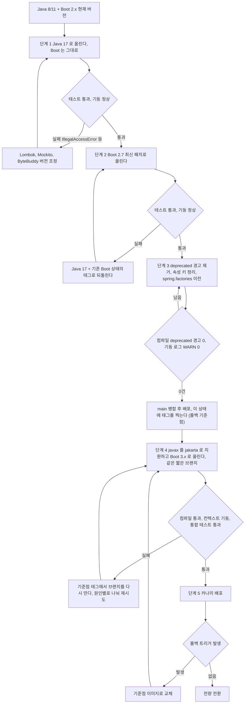
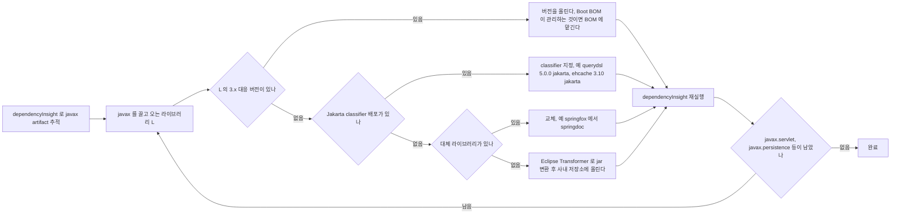
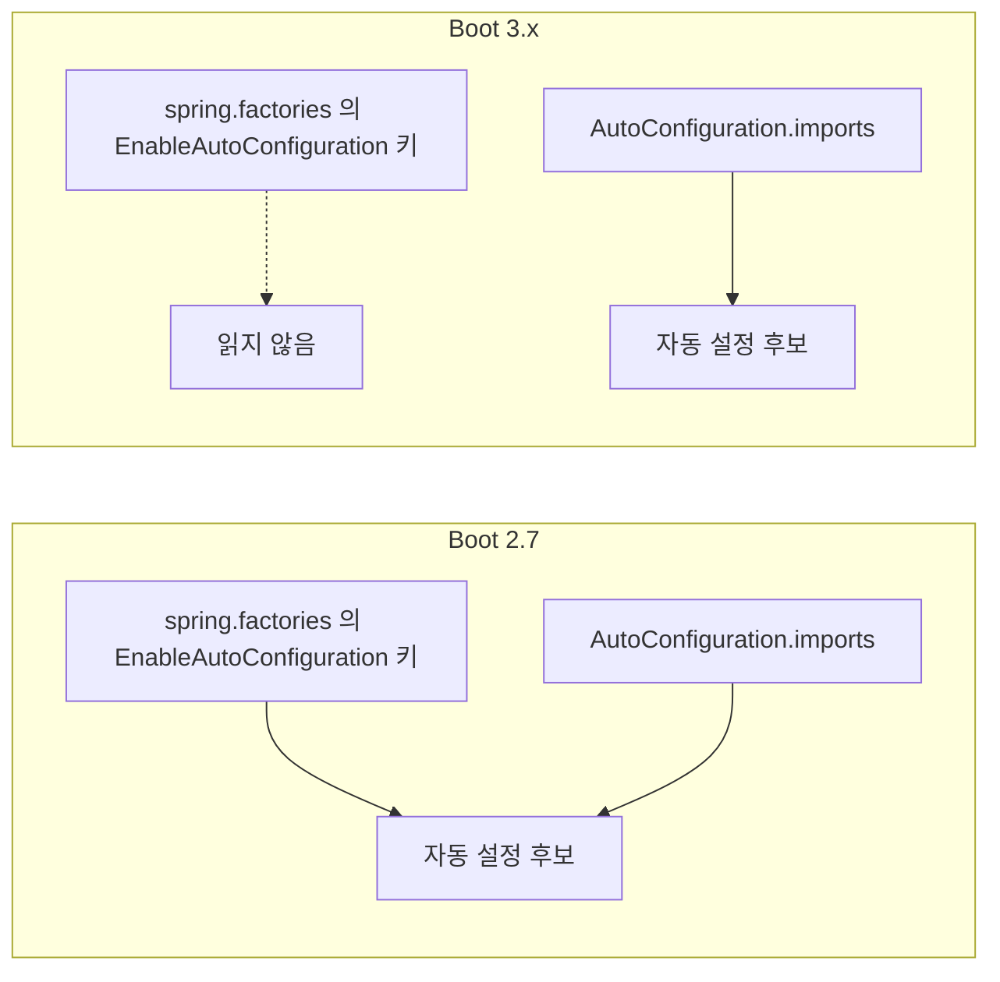
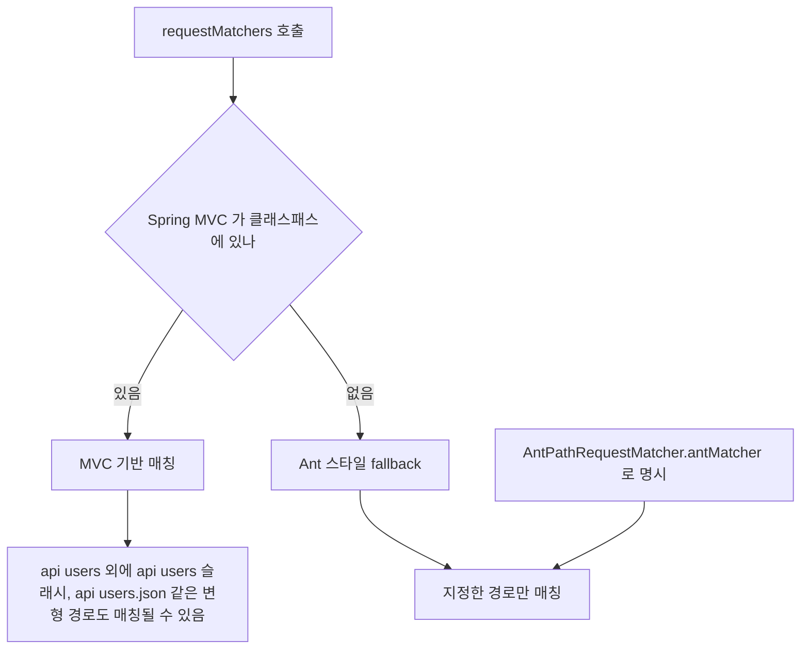
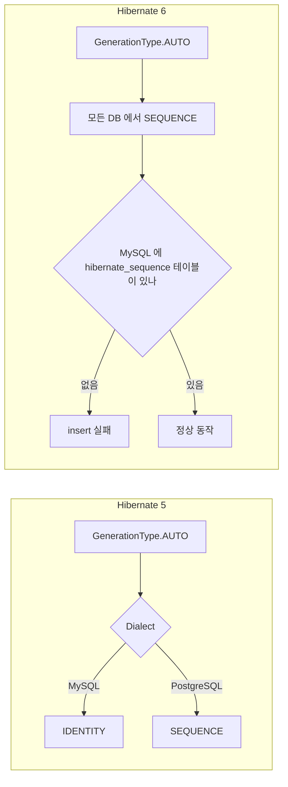
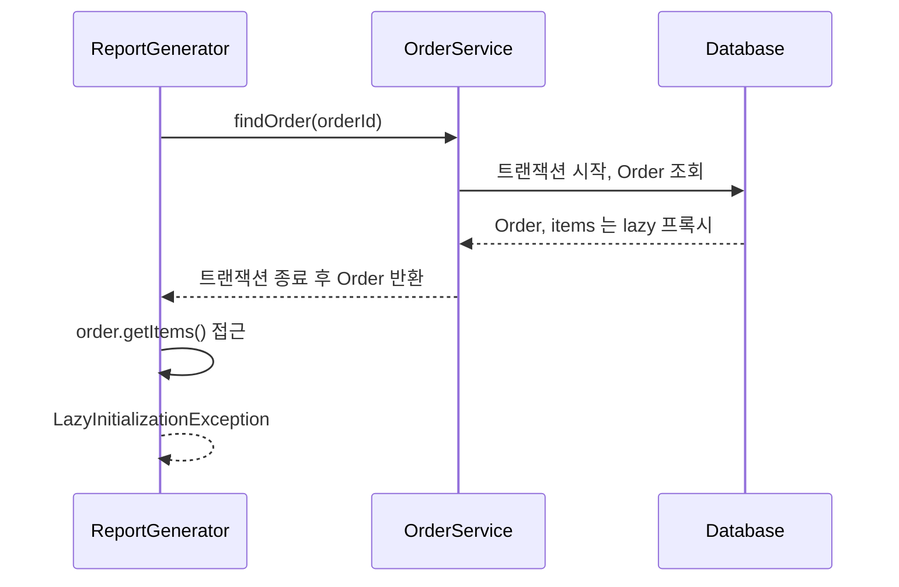
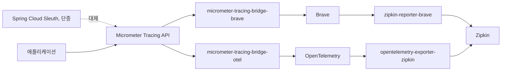
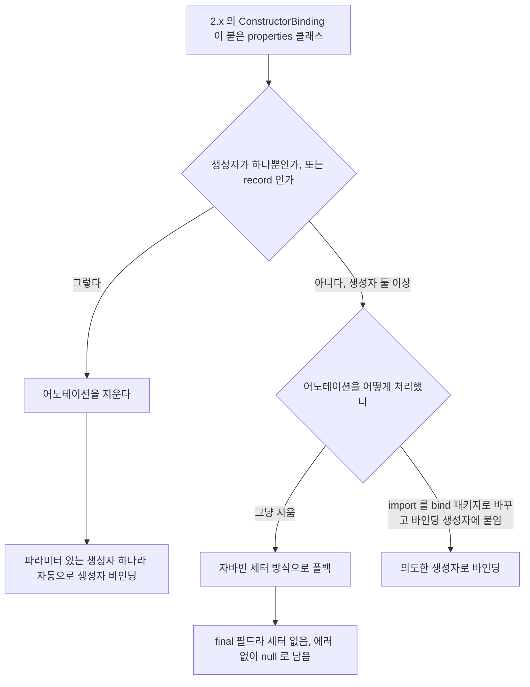
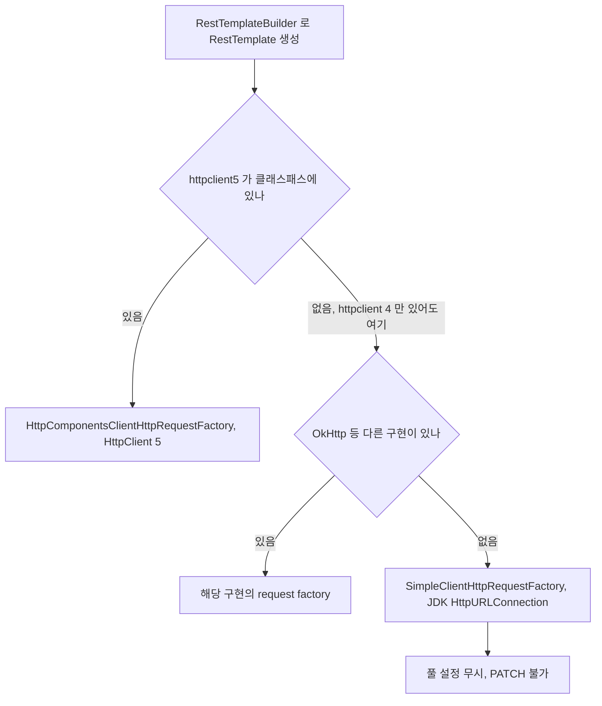
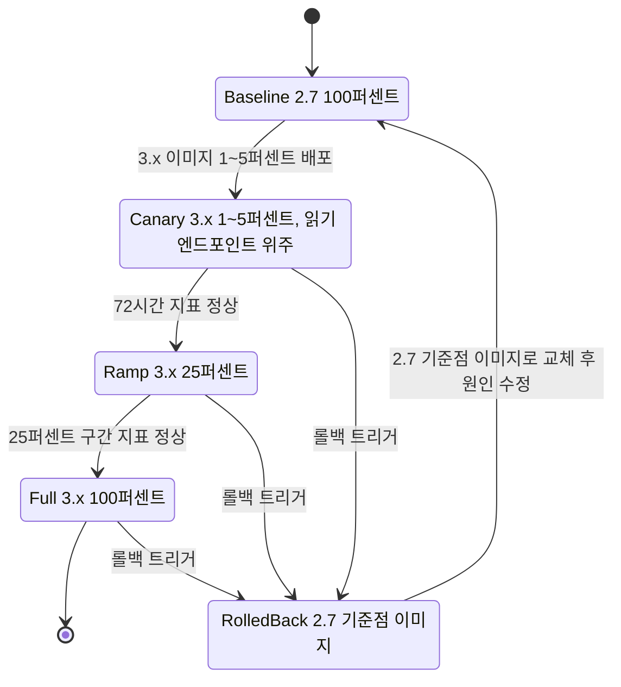

# Spring Boot 2.x → 3.x 마이그레이션 심화

Spring Boot 3.0이 정식 공개된 지 3년이 지났지만, 실무 프로젝트에서 2.x → 3.x 마이그레이션은 여전히 까다로운 작업으로 남아있다. 단순히 버전만 올리는 것이 아니라 Java 17 기반, Jakarta EE 전환, Spring Security 6, Hibernate 6, Micrometer Tracing까지 생태계 전반이 함께 움직이기 때문이다. 이 문서는 실제 프로덕션 환경에서 수천 개 클래스 규모의 모놀리식 서비스를 3.x로 끌어올리면서 마주한 이슈들을 정리한 것이다.

---

## 사전 업그레이드 순서

가장 먼저 결정해야 할 것은 업그레이드 순서다. 무리해서 한 번에 모든 것을 바꾸려 하면 빌드가 돌아가는 상태로 복구하는 데만 며칠이 날아간다. 실제로 쓴 순서는 세 단계다.

1. Java 8/11 → Java 17
2. Spring Boot 현재 버전 → Spring Boot 2.7.x
3. Spring Boot 2.7.x → Spring Boot 3.x

아래 flowchart는 이 세 단계를 deprecated 정리와 카나리까지 풀어서 그린 것이다. 각 판단 노드에서 실패했을 때 돌아가는 화살표를 보면 된다. 4단계에서 javax 치환과 Boot 3.x 상향을 한 노드로 묶은 이유는, javax를 jakarta로 바꾸면 Boot 2.7이 컴파일되지 않고 Boot 3.x를 올리면 javax 코드가 컴파일되지 않기 때문이다. 둘 사이에 배포할 수 있는 중간 상태가 없다.



단계 3까지는 main에서 끝낸다. 4단계 브랜치에서 막혀도 main은 2.7 기준점 그대로라 배포가 멈추지 않는다.

### Java 버전을 먼저 올려야 하는 이유

Spring Boot 3.x는 Java 17이 최소 요구사항이다. 빌드 툴 체인과 CI/CD, 런타임 JDK까지 모두 17 이상으로 맞춰야 하는데, Spring Boot를 먼저 올리면 Jakarta 전환과 Java 문법 이슈가 뒤섞여 원인 파악이 어렵다. Java만 17로 올려두면 기존 Spring Boot 2.x는 Java 17에서도 무리 없이 돌아가므로 이 상태에서 한 번 QA를 돌리고 다음 단계로 넘어가는 편이 안전하다.

Java 17로 올릴 때는 Lombok, Mockito, ByteBuddy 같은 바이트코드 조작 라이브러리 버전도 함께 올려야 한다. Lombok 1.18.22 이하는 Java 17에서 제대로 동작하지 않는다. `IllegalAccessError`가 뜨면 Lombok 버전부터 의심해야 한다.

```gradle
// 먼저 이 상태로 만들어 놓는다
java {
    toolchain {
        languageVersion = JavaLanguageVersion.of(17)
    }
}

dependencies {
    compileOnly 'org.projectlombok:lombok:1.18.30'
    annotationProcessor 'org.projectlombok:lombok:1.18.30'
}
```

### 2.7.x를 반드시 경유해야 하는 이유

Spring Boot 2.7은 3.x로 가기 위한 징검다리 역할을 한다. 2.7부터 `spring.config.import`, `@ConfigurationProperties` 바인딩, autoconfig 구조 등이 3.x와 유사한 형태로 미리 바뀌어 있고, deprecated 경고가 광범위하게 나오기 시작한다. 이 단계에서 경고를 모두 잡아야 다음 단계에서 컴파일 에러로 터지지 않는다.

2.7에서는 `spring.factories`에 있던 auto-configuration 등록이 `AutoConfiguration.imports` 파일로 옮겨 간다. 사내 starter가 있으면 이 시점에 미리 이전해 둬야 3.x에서 조용히 빠지지 않는다. 사례는 아래 별도 절에 적었다.

2.7 단계에서 모든 deprecated 경고를 해결하고 테스트가 전부 초록색일 때 3.x로 올린다. 경험상 2.7 안정화에만 전체 작업의 30~40%를 할애해야 한다.

---

## javax → jakarta 패키지 대규모 치환

Jakarta EE 전환은 Spring Boot 3.x 마이그레이션에서 물리적으로 가장 손이 많이 가는 작업이다. `javax.servlet`, `javax.persistence`, `javax.validation`, `javax.annotation` 등이 전부 `jakarta.*`로 바뀌는데, 단순 import 치환으로 끝나지 않는 케이스들이 있다.

### IDE 일괄 치환으로 누락되는 케이스

IntelliJ의 Find & Replace나 Structural Search로 import만 바꾸면 대부분 해결되지만, 다음 케이스는 반드시 수동으로 확인해야 한다.

**1. 문자열 내부에 FQCN이 하드코딩된 경우**

리플렉션, AOP pointcut, 로깅 설정 등에서 문자열로 클래스 이름이 박혀 있는 경우다.

```java
// 바꾸지 않으면 런타임에 ClassNotFoundException
@Around("execution(* javax.servlet.http.HttpServletRequest.*(..))")
public Object logRequest(ProceedingJoinPoint pjp) { ... }

// Class.forName으로 동적 로딩하는 코드
Class<?> clazz = Class.forName("javax.persistence.Entity");
```

이런 코드는 grep으로 `"javax\.` 패턴을 전체 검색해서 일일이 눈으로 확인해야 한다. 특히 Kotlin DSL이나 Groovy 설정 파일에도 박혀 있을 수 있다.

**2. XML bean 정의 파일**

`applicationContext.xml` 같은 XML 기반 설정이 남아있다면 `class` 속성의 FQCN을 전부 확인해야 한다.

```xml
<!-- 이런 형태가 남아있으면 치환 대상 -->
<bean id="entityManagerFactory"
      class="org.springframework.orm.jpa.LocalContainerEntityManagerFactoryBean">
    <property name="persistenceProviderClass"
              value="org.hibernate.jpa.HibernatePersistenceProvider"/>
</bean>
```

**3. persistence.xml**

JPA 설정을 `persistence.xml`로 쓰는 프로젝트는 파일 구조 자체가 바뀐다. 위치가 `META-INF/persistence.xml`에서 그대로 유지되지만, xsd 네임스페이스와 `provider` 요소가 바뀐다.

```xml
<!-- javax 시절 -->
<persistence xmlns="http://xmlns.jcp.org/xml/ns/persistence"
             version="2.2">
    <persistence-unit name="default">
        <provider>org.hibernate.jpa.HibernatePersistenceProvider</provider>
    </persistence-unit>
</persistence>

<!-- jakarta 전환 후 -->
<persistence xmlns="https://jakarta.ee/xml/ns/persistence"
             xmlns:xsi="http://www.w3.org/2001/XMLSchema-instance"
             xsi:schemaLocation="https://jakarta.ee/xml/ns/persistence
                 https://jakarta.ee/xml/ns/persistence/persistence_3_0.xsd"
             version="3.0">
    <persistence-unit name="default">
        <provider>org.hibernate.jpa.HibernatePersistenceProvider</provider>
    </persistence-unit>
</persistence>
```

xsd를 안 바꾸면 Hibernate 6가 파싱 단계에서 실패한다.

**4. MapStruct, Lombok, QueryDSL 등 생성 코드**

어노테이션 프로세서가 만들어내는 생성 소스에도 `javax.annotation.processing.Generated`가 들어간다. MapStruct의 경우 구버전은 `javax.annotation.Generated`를 import하는데, 이게 Java 17 + Jakarta 환경에서 `jakarta.annotation.Generated`와 충돌하거나 아예 빠져버린다. MapStruct 1.5.5 이상을 써야 `jakarta.annotation`을 인식한다.

```gradle
annotationProcessor 'org.mapstruct:mapstruct-processor:1.5.5.Final'
implementation 'org.mapstruct:mapstruct:1.5.5.Final'
```

QueryDSL도 마찬가지로 `jakarta` 변종을 써야 한다. `querydsl-jpa`가 아니라 `querydsl-jpa:5.0.0:jakarta` 클래시파이어를 지정해야 Jakarta 환경에서 동작한다.

```gradle
implementation 'com.querydsl:querydsl-jpa:5.0.0:jakarta'
annotationProcessor 'com.querydsl:querydsl-apt:5.0.0:jakarta'
annotationProcessor 'jakarta.annotation:jakarta.annotation-api'
annotationProcessor 'jakarta.persistence:jakarta.persistence-api'
```

### 의존성 트리에서 javax를 끌고 오는 라이브러리 찾기

소스의 import를 다 바꿔도 jar 안쪽에 `javax.servlet`을 참조하는 서드파티가 남아 있으면 기동 단계에서 `NoClassDefFoundError: javax/servlet/Filter` 같은 에러로 죽는다. 소스 grep으로는 안 보이므로 의존성 트리에서 찾는다.

```bash
# Gradle: 어떤 경로로 들어왔는지까지 나온다
./gradlew dependencyInsight --dependency javax.servlet --configuration runtimeClasspath
./gradlew dependencyInsight --dependency javax.persistence --configuration runtimeClasspath

# Maven
mvn dependency:tree -Dincludes=javax.servlet,javax.persistence,javax.validation,javax.annotation
```

찾은 라이브러리마다 아래 흐름으로 처리 방법을 정한다. 위에서 아래로 내려가며 먼저 걸리는 쪽을 쓴다.



`Eclipse Transformer`는 마지막 수단이다. 변환한 jar는 우리가 버전을 직접 책임져야 하고, 서명된 jar는 서명이 깨지며, 원본 라이브러리에 보안 패치가 나와도 자동으로 따라오지 않는다. 변환 옵션은 버전마다 달라서 `--help`로 확인하고, 변환본 파일명에는 원본과 구분되는 접미사를 붙여 둬야 나중에 걷어낼 때 헷갈리지 않는다.

치환 대상이 아닌 `javax.*`도 있다. `javax.sql`, `javax.crypto`, `javax.net`, `javax.naming`, `javax.security.auth`는 JDK 자체 패키지라 그대로 둔다. 이름만 보고 `javax\.` 전체를 sed로 바꿨다가 `javax.sql.DataSource` import가 깨진 적이 있다. 치환 대상은 Servlet, Persistence, Validation, Annotation(`javax.annotation.PostConstruct` 등), Transaction, Mail, JMS, XML Bind(JAXB) 쪽이다.

### OpenRewrite 레시피 활용

수작업이 불가능한 규모라면 OpenRewrite의 Spring Boot 마이그레이션 레시피를 쓰는 것이 현실적이다. 소스 변환을 AST 수준에서 해주기 때문에 단순 문자열 치환보다 안전하다.

```gradle
plugins {
    id 'org.openrewrite.rewrite' version '6.11.0'
}

rewrite {
    activeRecipe(
        'org.openrewrite.java.spring.boot3.UpgradeSpringBoot_3_2',
        'org.openrewrite.java.migrate.UpgradeToJava17'
    )
}

dependencies {
    rewrite('org.openrewrite.recipe:rewrite-spring:5.15.0')
    rewrite('org.openrewrite.recipe:rewrite-migrate-java:2.10.0')
}
```

`./gradlew rewriteRun`을 돌리면 javax → jakarta, deprecated API, Security 설정 등을 한 번에 고쳐준다. 단, 생성된 diff를 절대 그대로 커밋하면 안 된다. 잘못 고치거나 엉뚱하게 건드리는 파일이 반드시 나오므로 커밋 단위를 잘게 쪼개서 검증해야 한다. 특히 테스트 코드의 assertion을 이상하게 바꾸는 경우가 있으니 테스트 디렉토리는 따로 분리해서 적용하는 것을 권장한다.

---

## spring.factories에서 AutoConfiguration.imports로 이전

Boot 2.7이 `AutoConfiguration.imports`를 도입하면서 `spring.factories`의 `EnableAutoConfiguration` 키를 deprecated로 돌렸고, 3.0이 이 키를 읽지 않게 만들었다. 가장 위험한 점은 **에러가 나지 않는다**는 것이다. 자동 설정 클래스가 후보에서 빠질 뿐이라, 그 클래스가 만들던 빈을 주입받는 곳에서야 에러가 난다.



2.7은 두 파일을 모두 읽고 3.x는 오른쪽 `imports`만 읽는다. 그래서 이전은 2.7 단계에서 끝낼 수 있다.

### 사내 starter 사례

사내 공통 Redis 클라이언트 starter(`company-redis-spring-boot-starter`)가 아래 구조였다. 서비스 쪽에는 `spring.data.redis`가 아니라 `company.redis.*` 프로퍼티만 있었다.

```properties
# starter 의 src/main/resources/META-INF/spring.factories
org.springframework.boot.autoconfigure.EnableAutoConfiguration=\
  com.example.starter.CompanyRedisAutoConfiguration
```

서비스를 3.x로 올렸더니 기동이 이 메시지로 죽었다.

```
***************************
APPLICATION FAILED TO START
***************************

Description:

Parameter 0 of constructor in com.example.order.OrderCache required a bean of type
'com.example.starter.CompanyRedisClient' that could not be found.

Action:

Consider defining a bean of type 'com.example.starter.CompanyRedisClient' in your configuration.
```

starter 코드에도 서비스 코드에도 바뀐 게 없어서 처음에는 클래스패스를 의심했다. `--debug`로 띄워 `CONDITIONS EVALUATION REPORT`를 보면 `CompanyRedisAutoConfiguration`이 Positive에도 Negative에도 없다. 조건에서 탈락한 게 아니라 후보 목록에 오르지도 않은 것이다. 이 보고서에서 이름이 아예 안 보이면 등록 파일 문제다.

고치는 방법은 파일 하나를 새로 만들고 기존 키를 지우는 것이다.

```
# starter 의 src/main/resources/META-INF/spring/org.springframework.boot.autoconfigure.AutoConfiguration.imports
com.example.starter.CompanyRedisAutoConfiguration
```

한 줄에 클래스 하나씩 쓰고, `#`으로 시작하는 줄은 주석이다. 자동 설정 클래스에는 `@AutoConfiguration`(2.7부터)을 붙이면 `@Configuration(proxyBeanMethods = false)`와 순서 지정이 한 번에 된다.

```java
@AutoConfiguration(after = RedisAutoConfiguration.class)
@ConditionalOnClass(CompanyRedisClient.class)
@EnableConfigurationProperties(CompanyRedisProperties.class)
public class CompanyRedisAutoConfiguration {

    @Bean
    @ConditionalOnMissingBean
    CompanyRedisClient companyRedisClient(CompanyRedisProperties props) {
        return new CompanyRedisClient(props.getHost(), props.getPort());
    }
}
```

`spring.factories` 파일 전체를 지우면 안 된다. `ApplicationListener`, `EnvironmentPostProcessor`, `FailureAnalyzer` 같은 키는 3.x에서도 `spring.factories`를 쓴다. 지워야 하는 것은 `EnableAutoConfiguration` 키 하나다.

starter 자체도 javax를 쓰고 있었다면(`javax.servlet.Filter`를 등록하는 자동 설정 등) 한 jar로 2.x와 3.x를 같이 지원할 수 없다. 우리는 starter를 1.x(Boot 2.7용)와 2.x(Boot 3용) 두 라인으로 나눠 배포하고, 서비스가 올라가는 시점에 의존 버전을 바꿨다. 1.x 라인에도 `imports` 파일을 미리 넣어 둬서 서비스는 starter 버전만 바꾸면 됐다.

---

## Spring Security 6 주요 변경

Spring Security 5 → 6 전환이 Boot 3.x 마이그레이션에서 두 번째로 까다로운 작업이다. `WebSecurityConfigurerAdapter`가 사라지면서 기존 설정을 모두 새로 작성해야 한다.

### WebSecurityConfigurerAdapter 제거

기존에는 `WebSecurityConfigurerAdapter`를 상속받아 `configure(HttpSecurity http)`를 오버라이드하는 방식이었다. Security 6에서는 이 추상 클래스가 완전히 제거되고 `SecurityFilterChain` 빈을 등록하는 방식으로 바뀐다.

```java
// 이전 방식 (Spring Security 5.x)
@EnableWebSecurity
public class SecurityConfig extends WebSecurityConfigurerAdapter {

    @Override
    protected void configure(HttpSecurity http) throws Exception {
        http.authorizeRequests()
            .antMatchers("/api/public/**").permitAll()
            .antMatchers("/api/admin/**").hasRole("ADMIN")
            .anyRequest().authenticated()
            .and()
            .formLogin()
            .and()
            .csrf().disable();
    }
}

// 변경 후 (Spring Security 6.x)
@Configuration
@EnableWebSecurity
public class SecurityConfig {

    @Bean
    public SecurityFilterChain filterChain(HttpSecurity http) throws Exception {
        return http
            .authorizeHttpRequests(auth -> auth
                .requestMatchers("/api/public/**").permitAll()
                .requestMatchers("/api/admin/**").hasRole("ADMIN")
                .anyRequest().authenticated()
            )
            .formLogin(Customizer.withDefaults())
            .csrf(csrf -> csrf.disable())
            .build();
    }
}
```

바뀐 부분을 요약하면 다음과 같다.

- `authorizeRequests()` → `authorizeHttpRequests()`: 내부 구현이 `AuthorizationManager` 기반으로 바뀌었다. 성능과 확장성 면에서 개선됐지만 기존 커스텀 `AccessDecisionVoter`가 있으면 그대로 동작하지 않는다.
- `antMatchers()`, `mvcMatchers()`, `regexMatchers()` → `requestMatchers()`: 내부적으로 요청 경로 기반으로 자동 선택한다. Spring MVC가 클래스패스에 있으면 MVC 기반 매칭을 쓰고, 없으면 Ant 스타일로 fallback한다.
- 모든 설정이 Lambda DSL 강제: 체이닝 방식(`.and()`)은 deprecated를 넘어 제거됐다.

### requestMatchers의 함정

`requestMatchers()`로 바뀌면서 미묘하게 동작이 달라진 케이스가 있다. 기존 `antMatchers("/api/users")`는 정확히 이 경로만 매칭했지만, MVC 기반 매칭이 기본이 되면서 `/api/users/`, `/api/users.json` 같은 변형 경로도 함께 매칭될 수 있다. 보안이 민감한 엔드포인트라면 테스트로 반드시 확인해야 한다.

아래 flowchart는 `requestMatchers()`가 매칭 방식을 고르는 분기를 그린 것이다. Spring MVC가 클래스패스에 있으면 어느 쪽으로 가는지, 그리고 아래 코드처럼 명시하면 이 분기를 건너뛴다는 점을 보면 된다.



```java
// MVC 매칭이 필요 없으면 이렇게 명시적으로 고정
.requestMatchers(AntPathRequestMatcher.antMatcher("/api/users")).hasRole("USER")
```

actuator 엔드포인트를 허용할 때 자주 쓰던 패턴이 바뀐다.

```java
// 이전
.antMatchers(EndpointRequest.toAnyEndpoint()).permitAll()

// 변경 후 (그대로 써도 되지만 import가 바뀜)
.requestMatchers(EndpointRequest.toAnyEndpoint()).permitAll()
```

### 메서드 보안 어노테이션

`@EnableGlobalMethodSecurity`는 deprecated되고 `@EnableMethodSecurity`로 바뀐다. 기본값이 달라지는데, `prePostEnabled = true`가 기본이다. `@Secured`, JSR-250(`@RolesAllowed`)은 기본 비활성화되어 있어서 필요하면 명시적으로 켜야 한다.

```java
@EnableMethodSecurity(
    prePostEnabled = true,
    securedEnabled = true,
    jsr250Enabled = true
)
public class MethodSecurityConfig { }
```

---

## Spring Data JPA와 Hibernate 6

데이터 액세스 레이어는 3.x로 올리면서 표면적으로는 큰 변화가 없어 보이지만, 실제로는 동작이 미묘하게 달라지는 지점이 많다.

### Repository 인터페이스 계층 변화

`PagingAndSortingRepository`와 `CrudRepository`가 완전히 분리됐다. 기존에는 `PagingAndSortingRepository extends CrudRepository`였지만, Boot 3.x에서는 두 인터페이스가 독립적이다. 즉 `PagingAndSortingRepository`만 상속한 Repository에는 더 이상 `save()`, `findById()` 같은 CRUD 메서드가 없다.

```java
// 이전엔 이것만으로 CRUD + 페이징이 모두 됐다
public interface UserRepository
    extends PagingAndSortingRepository<User, Long> { }

// 3.x에선 둘 다 상속하거나 JpaRepository를 써야 한다
public interface UserRepository
    extends PagingAndSortingRepository<User, Long>,
            CrudRepository<User, Long> { }

// 또는 그냥
public interface UserRepository extends JpaRepository<User, Long> { }
```

기존 코드가 `PagingAndSortingRepository`만 상속하고 있었다면 컴파일 에러가 광범위하게 터진다. 대부분의 프로젝트는 `JpaRepository`를 쓰고 있어서 문제가 안 되지만, 레거시 코드에 남아있는 경우 주의해야 한다.

### Hibernate 6의 ID 생성 전략 변경

Hibernate 6에서 `@GeneratedValue(strategy = GenerationType.AUTO)`의 기본 동작이 바뀐 것이 마이그레이션 중 가장 많이 당하는 지점이다. Hibernate 5까지는 방언(Dialect)에 따라 MySQL은 `IDENTITY`, PostgreSQL은 `SEQUENCE`를 자동 선택했는데, Hibernate 6부터는 모든 DB에서 `SEQUENCE`가 기본이 된다.

```java
// Hibernate 5 시절에 MySQL에서 동작하던 코드
@Entity
public class Order {
    @Id
    @GeneratedValue(strategy = GenerationType.AUTO)
    private Long id;
}
```

이 코드가 Hibernate 6 + MySQL 조합에서는 `hibernate_sequence` 테이블을 찾으려 시도하고, 없으면 에러를 낸다. MySQL은 시퀀스를 네이티브로 지원하지 않기 때문에 Hibernate가 에뮬레이션용 테이블을 만드는데, 운영 DB에 이런 테이블이 없으면 insert가 모두 실패한다.

아래 flowchart는 `GenerationType.AUTO`가 Hibernate 5와 6에서 어떻게 다르게 풀리는지 비교한 것이다. 왼쪽은 방언에 따라 갈리고 오른쪽은 한 곳으로 모이는 차이를 보면 된다.



해결책은 두 가지다.

**1. 모든 엔티티의 전략을 명시적으로 `IDENTITY`로 바꾼다**

```java
@Id
@GeneratedValue(strategy = GenerationType.IDENTITY)
private Long id;
```

**2. application.yml에서 이전 동작으로 강제한다 (임시방편)**

```yaml
spring:
  jpa:
    properties:
      hibernate:
        id:
          db_structure_naming_strategy: legacy
```

마이그레이션 중에는 2번으로 일단 돌아가게 해두고, 엔티티별로 차근차근 명시적인 전략으로 바꾸는 것을 권한다. 신규 엔티티는 처음부터 전략을 명시해서 생성한다.

### Hibernate 6의 쿼리 변경

JPQL이 이제 표준에 더 엄격해졌다. 예전에는 좀 느슨하게 허용되던 문법이 컴파일 시점에 걸러진다.

- `COUNT(*)`를 JPQL에서 쓰면 `QuerySyntaxException`이 난다. `COUNT(e)`로 써야 한다.
- `LEFT JOIN FETCH` 뒤에 별칭 없이 바로 조건을 붙이는 쿼리가 파싱 에러로 바뀐다.
- 내장 함수 이름이 바뀐다. `FUNCTION('DATE_FORMAT', ...)` 같은 벤더 특화 함수 호출이 엄격하게 체크된다.

문자열로 쿼리를 많이 쓰는 프로젝트라면 이 부분이 가장 골치 아프다. Repository의 `@Query` 어노테이션 내용을 전부 돌려보는 스모크 테스트가 필요하다.

---

## 트랜잭션/엔티티 매니저 프록시 변경과 LazyInitializationException

Boot 3.x로 올리면 갑자기 `LazyInitializationException`이 터지는 경우가 있다. 코드 변경이 없는데도 발생하기 때문에 원인 파악이 어렵다.

원인은 `OpenEntityManagerInView`의 기본값 변경과 엔티티 매니저 프록시 동작 차이다. 특히 Spring Batch나 비동기 처리에서 `@Async` 메서드 내부에서 lazy 필드를 참조하는 케이스가 문제가 된다.

```java
@Service
public class OrderService {

    @Transactional(readOnly = true)
    public Order findOrder(Long id) {
        return orderRepository.findById(id).orElseThrow();
    }
}

@Component
public class ReportGenerator {

    @Async
    public void generate(Long orderId) {
        Order order = orderService.findOrder(orderId);
        // Boot 2.x에서는 OSIV가 열려있어 여기서 items에 접근 가능했다
        // Boot 3.x에서는 트랜잭션이 이미 닫혀 LazyInitializationException
        order.getItems().forEach(this::process);
    }
}
```

아래 sequenceDiagram은 위 코드에서 `items`에 접근하는 시점이 트랜잭션 밖이라는 것을 순서로 보여준다. `findOrder`가 반환된 뒤에 `getItems()`가 호출되는 위치를 보면 된다.



해결책은 Fetch Join, `@EntityGraph`, DTO projection 중 하나로 바꾸는 것이 정석이다. `spring.jpa.open-in-view=true`로 놓고 넘어가는 것은 근본적인 해결이 아니다. 이 시점에 걸러내지 못하면 성능 문제가 점점 쌓여 나중에 더 큰 비용이 된다.

Boot 3.x는 시작 시점에 OSIV가 기본 활성화되어 있으면 WARN 로그를 찍는다. 이 경고는 기본값을 유지한 상태에서 나오는 것이므로 반드시 살펴봐야 한다.

---

## Observability 마이그레이션

Boot 3.x는 분산 추적 구조를 완전히 새로 짰다. Spring Cloud Sleuth가 단종되고 Micrometer Tracing이 그 자리를 차지한다.

### Spring Cloud Sleuth 단종

Sleuth는 Spring Cloud 2021.0.x가 마지막이다. 2022.0.x(Boot 3.x 호환 버전)에는 Sleuth가 아예 포함되지 않는다. 따라서 Boot 3.x로 올리는 순간 Sleuth 의존성을 제거하고 대체 구성을 해야 한다.

### Micrometer Tracing으로 전환

Micrometer Tracing은 API 레이어만 제공하고, 실제 구현체로 Brave(기존 Sleuth가 쓰던 구현)나 OpenTelemetry를 선택하게 되어 있다. 기존 Zipkin을 그대로 쓸 거라면 Brave, OpenTelemetry Collector로 갈 거라면 OTel을 고르면 된다.

아래 flowchart는 Sleuth가 하던 일이 API와 구현체로 나뉘는 구조를 그린 것이다. 애플리케이션은 API만 바라보고, bridge 의존성이 어느 구현체로 이어지는지를 보면 된다.



```gradle
// Brave 기반 (기존 Sleuth와 호환성이 높음)
implementation 'io.micrometer:micrometer-tracing-bridge-brave'
implementation 'io.zipkin.reporter2:zipkin-reporter-brave'

// OpenTelemetry 기반
implementation 'io.micrometer:micrometer-tracing-bridge-otel'
implementation 'io.opentelemetry:opentelemetry-exporter-zipkin'
```

설정 프로퍼티도 대거 바뀐다.

```yaml
# Sleuth 시절
spring:
  sleuth:
    sampler:
      probability: 0.1
  zipkin:
    base-url: http://zipkin:9411

# Micrometer Tracing
management:
  tracing:
    sampling:
      probability: 0.1
  zipkin:
    tracing:
      endpoint: http://zipkin:9411/api/v2/spans
```

### Trace ID 포맷 주의

Sleuth는 기본적으로 64비트 Trace ID를, Micrometer Tracing은 128비트를 쓴다. 로그 수집 시스템이나 APM이 이전 포맷에 맞춰져 있으면 Trace ID 파싱이 깨진다. 필요하면 Brave 설정에서 강제로 64비트로 내릴 수 있다.

```java
@Bean
public Tracing tracing() {
    return Tracing.newBuilder()
        .traceId128Bit(false)
        .build();
}
```

로그 패턴도 바뀐다. MDC 키가 `traceId`, `spanId`로 바뀌어 logback-spring.xml에서 로깅 패턴을 같이 수정해야 한다.

```xml
<!-- 이전 -->
<pattern>%X{traceId:-} %X{spanId:-} %X{parentId:-} %msg%n</pattern>

<!-- 이후 (parentId는 기본 노출 안 됨) -->
<pattern>%X{traceId:-} %X{spanId:-} %msg%n</pattern>
```

---

## application.properties deprecated 속성 리네이밍

Boot 3.x는 긴 시간 누적된 deprecated 속성을 한꺼번에 털어냈다. 2.7 단계에서 경고로 보이다가 3.x에서는 아예 인식되지 않는다.

대표적인 변경 사항은 다음과 같다.

| Boot 2.x | Boot 3.x |
|----------|----------|
| `spring.redis.*` | `spring.data.redis.*` |
| `spring.mongodb.*` | `spring.data.mongodb.*` |
| `spring.elasticsearch.rest.*` | `spring.elasticsearch.*` |
| `server.servlet.session.cookie.*` | 동일 (일부 서브 속성 변경) |
| `management.metrics.export.*` | `management.<vendor>.metrics.export.*` |
| `logging.pattern.dateformat` | `logging.pattern.dateformat` (기본값 변경) |
| `spring.jpa.hibernate.use-new-id-generator-mappings` | 제거됨 |

특히 Redis는 데이터 액세스 레이어 묶음으로 옮겨져서 `spring.data.redis.host`, `spring.data.redis.port` 형태가 된다. 기존 `spring.redis.host`는 그냥 무시된다. 기본값(localhost:6379)으로 접속하다가 운영 Redis에 붙지 못하는 장애가 가장 흔하다. 이건 CI에서는 잘 안 잡힌다. 로컬/스테이징에서 Redis 기본값이 우연히 맞아서 넘어가는 경우가 많기 때문이다.

### spring-boot-properties-migrator

바뀐 키를 눈으로 찾지 말고 `spring-boot-properties-migrator`에게 시킨다. 기동할 때 환경에 들어 있는 키 중 이름이 바뀌었거나 제거된 것을 WARN으로 찍어준다.

```gradle
// Gradle
runtimeOnly 'org.springframework.boot:spring-boot-properties-migrator'
```

```xml
<!-- Maven -->
<dependency>
    <groupId>org.springframework.boot</groupId>
    <artifactId>spring-boot-properties-migrator</artifactId>
    <scope>runtime</scope>
</dependency>
```

Boot 3.x로 올린 브랜치에서 기동하면 이런 로그가 나온다. 출력 형식은 버전에 따라 조금 다르다.

```
WARN  o.s.b.c.p.m.PropertiesMigrationListener :
The use of configuration keys that have been renamed was found in the environment:

Property source 'Config resource 'class path resource [application.yml]' via location 'optional:classpath:/'':
	Key: spring.redis.host
		Line: 14
		Replacement: spring.data.redis.host

Each configuration key has been temporarily mapped to its replacement for your convenience.
To silence this warning, please update your configuration to use the new keys.
```

마지막 두 줄이 중요하다. migrator는 옛 키를 새 키로 **임시로 매핑해서 동작하게 만든다.** 즉 migrator가 붙어 있는 동안에는 `spring.redis.host`가 계속 먹히고, 경고만 뜬다. 안 고치고 migrator를 빼는 순간 Redis가 localhost로 붙는다. `The use of configuration keys that are no longer supported`로 시작하는 두 번째 블록은 매핑 없이 제거된 키라서 그대로 두면 값이 무시된다.

제거 시점은 두 번이다.

1. staging에서 운영과 같은 프로파일(`application-prod.yml` 포함)로 띄워 WARN이 하나도 안 나올 때. 로컬 기본 프로파일에서만 확인하면 `application-prod.yml`에 박힌 옛 키를 놓친다.
2. 카나리 이미지를 만들기 전에. migrator가 키를 가려 주기 때문에, 빼지 않고 카나리로 나가면 위에서 말한 "빼는 순간 터지는" 문제를 운영에서 만나게 된다.

k8s ConfigMap이나 Secret에서 환경변수(`SPRING_REDIS_HOST`)로 주입하는 키는 migrator 출력에 의존하지 말고 매니페스트를 따로 grep한다. 운영 배포 파일 쪽에 옛 이름이 남아 있는 경우가 많다.

---

## Logback vs Log4j2 이슈

Boot 3.x는 Logback과 Log4j2를 모두 지원하지만, 기본값이 Logback이다. Log4j2를 쓰는 프로젝트는 추가로 손봐야 할 것이 있다.

먼저 Log4j2 자체 버전을 2.20 이상으로 맞춰야 Java 17 + Jakarta 환경에서 깨끗하게 동작한다. 그리고 `spring-boot-starter-log4j2`를 쓰더라도 기본 Logback을 제외하는 설정이 여전히 필요하다.

```gradle
configurations {
    all {
        exclude group: 'org.springframework.boot', module: 'spring-boot-starter-logging'
    }
}

dependencies {
    implementation 'org.springframework.boot:spring-boot-starter-log4j2'
}
```

Log4j2의 비동기 로깅에 쓰이는 Disruptor가 Boot 3.x에서 기본 포함되지 않는다. 비동기 로거를 쓴다면 직접 의존성을 추가해야 한다.

```gradle
implementation 'com.lmax:disruptor:3.4.4'
```

로깅 패턴에서 MDC의 traceId/spanId 참조는 앞서 언급한 대로 Micrometer Tracing 기준으로 바꿔야 한다.

---

## 3rd party 라이브러리 호환성

외부 라이브러리가 Jakarta EE 전환을 마쳤는지 하나씩 확인해야 한다. 놓치면 런타임에 `NoClassDefFoundError: javax/servlet/...`이 뜨면서 앱이 올라오지 않는다.

### 주요 라이브러리 최소 버전

| 라이브러리 | Jakarta 지원 최소 버전 | 비고 |
|-----------|---------------------|------|
| QueryDSL | 5.0.0 (`:jakarta` 클래시파이어) | 별도 artifact |
| MapStruct | 1.5.3 이상 | 1.5.5 권장 |
| Lombok | 1.18.26 이상 | Java 17 + Jakarta 완전 지원 |
| Hibernate | 6.1.x 이상 | Boot 3.0 기본 6.1, 3.2 기본 6.3 |
| Flyway | 9.x 이상 | 8.x는 Java 17 문제 있음 |
| Spring Cloud | 2022.0.x 이상 | Sleuth 없음 |
| Swagger/OpenAPI | springdoc-openapi 2.x | 1.x는 Jakarta 미지원 |

### Swagger 마이그레이션

`springfox-swagger`를 쓰던 프로젝트는 사실상 폐기하고 `springdoc-openapi`로 옮겨가야 한다. Springfox는 마지막 릴리스가 2020년이고 Jakarta 지원 계획도 없다.

```gradle
// 제거
// implementation 'io.springfox:springfox-boot-starter:3.0.0'

// 추가
implementation 'org.springdoc:springdoc-openapi-starter-webmvc-ui:2.3.0'
```

설정 방식이 전혀 다르기 때문에 기존 `Docket` 빈 설정을 모두 버리고 새로 작성해야 한다. URL 경로도 기본값이 바뀌어서 `/swagger-ui/index.html`로 접근한다. 사내에 Swagger UI를 바라보는 자동화 도구가 있다면 경로 변경에 주의해야 한다.

```java
@Configuration
public class OpenApiConfig {
    @Bean
    public OpenAPI api() {
        return new OpenAPI()
            .info(new Info().title("API").version("v1"))
            .components(new Components()
                .addSecuritySchemes("bearerAuth", new SecurityScheme()
                    .type(SecurityScheme.Type.HTTP)
                    .scheme("bearer")
                    .bearerFormat("JWT")));
    }
}
```

---

## 실제 장애 사례

### multipart 처리 변경

Boot 3.x에서 multipart 요청의 기본 인코딩과 파일 크기 제한 처리가 바뀐다. 기존에는 `multipart/form-data`의 각 part 인코딩이 request 인코딩과 독립적이었는데, 3.x에서는 request 인코딩을 기본으로 따라간다. 이 때문에 파일명에 한글이 들어간 업로드가 깨지는 현상이 보고된다.

```yaml
# 명시적으로 UTF-8 강제
spring:
  servlet:
    multipart:
      file-size-threshold: 2KB
      max-file-size: 10MB
      max-request-size: 10MB
server:
  servlet:
    encoding:
      charset: UTF-8
      force: true
```

`multipart/mixed`를 파싱하는 로직이 엄격해져서 잘못된 boundary를 가진 요청은 즉시 400을 반환한다. 기존에는 관대하게 파싱하던 요청이 막히는 경우가 있다. 외부 시스템과 파일을 주고받는 API라면 통합 테스트로 반드시 확인해야 한다.

### @ConfigurationProperties 바인딩 변경

Boot 3.x의 Relaxed Binding 규칙이 조금 더 엄격해졌다. 프로퍼티 키에 점, 하이픈, 언더스코어가 혼재된 이름은 kebab-case로 일관되게 쓰는 것이 안전하다.

```java
@ConfigurationProperties(prefix = "app.cache")
public record CacheProperties(Duration defaultTtl, int maxSize) { }
```

```yaml
# 이전에는 이것도 됐다
app:
  cache:
    defaultTtl: 10m
    default_ttl: 10m
    default-ttl: 10m

# 3.x에서는 kebab-case 권장
app:
  cache:
    default-ttl: 10m
    max-size: 1000
```

Record 기반 `@ConfigurationProperties`는 값이 없으면 기본값으로 채워지지 않고 null(원시 타입은 0, false)이 들어간다. 기본값은 파라미터에 `@DefaultValue`로 지정한다.

```java
@ConfigurationProperties(prefix = "app.cache")
public record CacheProperties(
    @DefaultValue("10m") Duration defaultTtl,
    @DefaultValue("1000") int maxSize
) { }
```

`DefaultValue`는 `org.springframework.boot.context.properties.bind.DefaultValue`다.

### @ConstructorBinding 위치 변경

2.x에서 불변 properties 클래스를 만들 때 클래스 위에 `@ConstructorBinding`을 붙였다. 3.0은 이 어노테이션을 `bind` 패키지로 옮기고 대상을 생성자로 한정했다. 옛 패키지의 클래스는 남아 있지 않다.

```java
// Boot 2.x
import org.springframework.boot.context.properties.ConstructorBinding;

@ConfigurationProperties("app.cache")
@ConstructorBinding
public class CacheProperties {
    private final Duration defaultTtl;
    public CacheProperties(Duration defaultTtl) { this.defaultTtl = defaultTtl; }
}
```

3.x로 올리면 컴파일 에러가 난다.

```
error: cannot find symbol
  import org.springframework.boot.context.properties.ConstructorBinding;
```

생성자가 하나뿐인 클래스와 record는 어노테이션을 지우면 된다. 3.x는 파라미터 있는 생성자가 하나면 자동으로 생성자 바인딩을 쓴다. 조심할 곳은 생성자가 둘 이상인 클래스다. 이때는 import만 `...properties.bind.ConstructorBinding`으로 바꾸고 **바인딩에 쓸 생성자에** 붙여야 한다. 어노테이션을 그냥 지우면 자바빈(세터) 방식으로 폴백하는데, final 필드라 세터가 없으면 에러 없이 값이 null로 남는다. 우리는 이걸 기동은 되는데 타임아웃이 0으로 동작하는 형태로 만났다.

아래 flowchart는 `@ConstructorBinding`을 지울지 남길지 정하는 분기다. 생성자가 둘 이상일 때 어노테이션을 지우는 경로가 조용한 null로 끝나는 쪽을 보면 된다.



```java
@ConfigurationProperties("app.cache")
public class CacheProperties {
    private final Duration defaultTtl;

    @ConstructorBinding
    public CacheProperties(Duration defaultTtl) { this.defaultTtl = defaultTtl; }

    public CacheProperties() { this(Duration.ofMinutes(10)); }
}
```

생성자 바인딩을 쓰는 클래스에 `@Component`를 붙이면 안 된다. 일반 빈 주입으로 해석돼 `Duration` 타입 빈을 찾다가 기동이 실패한다. `@EnableConfigurationProperties`나 `@ConfigurationPropertiesScan`으로 등록한다.

### -parameters 누락으로 생기는 파라미터 이름 바인딩 실패

Spring Framework 6.1(Boot 3.2)부터 클래스 파일의 디버그 정보(`-g`의 로컬 변수 테이블)로 파라미터 이름을 읽던 폴백이 사라졌다. 6.0까지는 `-parameters` 없이도 돌아갔기 때문에 3.0, 3.1에서는 멀쩡하다가 3.2로 올릴 때 터진다. 코드가 안 바뀌었는데 터지니 원인 찾기가 오래 걸린다. 증상은 세 군데에서 나왔다.

```
// @PathVariable, @RequestParam 에 이름을 안 적은 컨트롤러
java.lang.IllegalArgumentException: Name for argument of type [java.lang.Long]
not specified, and parameter name information not found in class file either.

// @Query 에 :name 형태의 이름 파라미터를 쓰고 @Param 을 안 적은 Repository
For queries with named parameters you need to provide names for method parameters.
Use @Param for query method parameters, or when on Java 8+ use the javac flag -parameters.

// @Cacheable(key = "#userId") 처럼 SpEL 이 파라미터 이름을 참조하는 서비스
Null key returned for cache operation (maybe you are using named params
on classes without debug info?)
```

세 번째가 가장 늦게 발견된다. 예외가 아니라 캐시가 안 걸리는 형태라, 응답 시간 그래프에서 DB 쿼리 수가 늘어난 뒤에야 알아챘다.

원인은 컴파일 옵션이다. Boot Gradle 플러그인과 `spring-boot-starter-parent`는 `-parameters`를 자동으로 켜 주지만, 아래 경우에는 적용되지 않는다.

- 멀티 모듈에서 공통 모듈이 `java-library` 플러그인만 쓰고 Boot 플러그인이 없는 경우
- Maven에서 `spring-boot-starter-parent` 대신 BOM만 import하는 경우
- 사내 parent POM이 `maven-compiler-plugin`의 `compilerArgs`를 따로 지정하는 경우

```gradle
// 모든 모듈 공통 (루트 build.gradle)
subprojects {
    tasks.withType(JavaCompile).configureEach {
        options.compilerArgs << '-parameters'
    }
}
```

```xml
<!-- Maven: parent 가 없을 때 -->
<properties>
    <maven.compiler.parameters>true</maven.compiler.parameters>
</properties>
```

Kotlin 모듈은 `kotlinOptions { javaParameters = true }`(또는 컴파일러 옵션 `-java-parameters`)가 필요하다. 설정이 먹었는지는 컴파일된 클래스에서 직접 본다.

```bash
javap -v -p build/classes/java/main/com/example/UserController.class | grep -A3 MethodParameters
```

`MethodParameters:` 블록이 나오면 이름이 클래스 파일에 들어 있는 것이다. 공통 모듈의 클래스도 같은 방식으로 확인한다. 옵션 설정 후에는 증상 때문에 바꿔 둔 `@PathVariable("id")` 같은 명시 이름을 되돌리지 않아도 된다. 이름을 적어 두는 쪽이 어느 쪽 빌드에서도 안전하다.

### Apache HttpClient 5 전환

RestTemplate 자체는 3.x에도 있다. 바뀐 것은 내부 HTTP 클라이언트다. Spring Framework 6은 `HttpComponentsClientHttpRequestFactory`가 **HttpClient 5**(`org.apache.hc.client5`)만 지원하고, HttpClient 4(`org.apache.http`)는 인식하지 않는다. 클래스패스에 4가 남아 있어도 쓰이지 않는다. AWS SDK 1.x나 Elasticsearch 클라이언트가 4를 transitive로 끌고 와서 "httpclient가 있으니 괜찮다"고 착각하기 쉽다.



httpclient5가 없으면 조용히 맨 아래 JDK 기본 구현으로 떨어진다. 커넥션 풀 설정이 전부 무시되고, 가장 먼저 눈에 띄는 증상은 PATCH다.

```
org.springframework.web.client.ResourceAccessException:
I/O error on PATCH request for "https://api.example.com/orders/1":
Invalid HTTP method: PATCH
Caused by: java.net.ProtocolException: Invalid HTTP method: PATCH
```

빈을 직접 만들던 코드는 컴파일 단계에서 걸린다.

```
error: incompatible types: org.apache.http.client.HttpClient
cannot be converted to org.apache.hc.client5.http.classic.HttpClient
```

httpclient5를 명시하고(버전은 Boot가 관리), 4 쪽 import를 전부 5로 바꾼다. 타임아웃 API 위치가 달라진 것에 주의한다. 4에서 `RequestConfig`에 있던 connect, socket 타임아웃이 5에서는 `ConnectionConfig`로 옮겨 갔다. `RequestConfig`에는 풀에서 커넥션을 빌려 오는 대기 시간(`connectionRequestTimeout`)이 남는다. 이걸 설정하지 않으면 풀이 고갈됐을 때 요청이 오래 매달린다.

```gradle
implementation 'org.apache.httpcomponents.client5:httpclient5'
```

```java
@Bean
public RestTemplate restTemplate() {
    var connectionManager = PoolingHttpClientConnectionManagerBuilder.create()
        .setMaxConnTotal(200)
        .setMaxConnPerRoute(50)
        .setDefaultConnectionConfig(ConnectionConfig.custom()
            .setConnectTimeout(Timeout.ofSeconds(3))
            .setSocketTimeout(Timeout.ofSeconds(5))
            .build())
        .build();

    var httpClient = HttpClients.custom()
        .setConnectionManager(connectionManager)
        .setDefaultRequestConfig(RequestConfig.custom()
            .setConnectionRequestTimeout(Timeout.ofSeconds(2))
            .build())
        .evictExpiredConnections()
        .evictIdleConnections(TimeValue.ofSeconds(30))
        .build();

    return new RestTemplate(new HttpComponentsClientHttpRequestFactory(httpClient));
}
```

`evictIdleConnections`는 로드밸런서가 유휴 커넥션을 먼저 끊을 때를 위한 것이다. LB 유휴 타임아웃(예: 60초)보다 짧게 잡아 두지 않으면, 한동안 조용하던 호출이 `NoHttpResponseException: ... failed to respond`로 한 번씩 실패한다. 이 설정이 실제로 적용됐는지는 기동 후 `restTemplate.getRequestFactory().getClass()`를 로그로 찍어 `HttpComponentsClientHttpRequestFactory`인지 확인한다.

신규 코드는 `RestClient`(Boot 3.2+)를 쓰는 편이 낫다. RestTemplate은 유지만 되고 기능이 추가되지 않는다.

---

## 롤백 기준과 카나리 배포

데이터베이스 스키마 변경, 트레이싱 시스템 변경, 외부 연동이 걸린 마이그레이션이라 한 방에 밀어 올리는 것은 위험하다. 실제로 쓴 전개 방식을 적는다.

### 브랜치 운영

마이그레이션 브랜치를 장기간 유지하면 main과 diff가 폭발한다. 그래서 먼저 main에서 가능한 변경(Java 17 올리기, 2.7 경유, deprecated 속성 정리)을 모두 끝내고, 실제 Jakarta 전환과 Boot 3.x 올리기만 별도 브랜치에서 짧게 처리한다. 기간은 2~3주를 넘기지 않도록 범위를 쪼갠다.

### 카나리 배포

대규모 서비스라면 인스턴스 중 일부만 Boot 3.x로 올려 트래픽을 점진적으로 붙이는 방식이 안전하다. 카나리 대상은 다음 기준으로 고른다.

- 전체 트래픽의 1~5% 수준
- 읽기 위주 엔드포인트를 먼저 (쓰기 경로는 부작용 크다)
- 배치나 스케줄러는 카나리에서 제외
- Redis, DB 연결 풀 규모는 카나리 인스턴스 수에 비례해 축소

이 상태에서 최소 72시간 지표를 본다. 봐야 할 지표는 p99 latency, error rate, GC 시간, Heap 사용률, DB/Redis connection 사용량이다. 특히 JDK 17의 GC(ZGC, G1)가 기본값으로 바뀌면 GC 패턴이 달라지므로 알람 임계치를 미리 조정해 두지 않으면 새벽에 호출된다.

### 롤백 트리거

롤백 조건을 미리 합의해 두면 결정이 빠르다. 실전에서 썼던 기준이다.

- p99 latency가 기존 대비 30% 이상 증가하고 10분 이상 지속
- error rate 0.5% 초과
- GC pause가 500ms를 넘는 이벤트가 시간당 5회 이상
- DB connection pool acquire 실패 발생

아래 stateDiagram은 배포 단계와 롤백 경로를 함께 그린 것이다. 어느 단계에서든 트리거가 걸리면 한 방향(`RolledBack`)으로만 나가고, 원인을 고친 뒤에는 처음 단계부터 다시 시작한다. 단계를 건너뛰는 화살표가 없다는 점을 보면 된다.



Full 단계에서도 2.7 이미지를 바로 올릴 수 있게 기준점 이미지는 최소 한 릴리스 주기 동안 레지스트리에서 지우지 않는다.

롤백은 단순 이미지 교체로 끝낼 수 있도록 DB 스키마는 backward compatible로 유지해야 한다. Hibernate 6가 자동 생성하는 스키마(`ddl-auto=update`)가 있으면 롤백 시 충돌이 난다. 운영에서는 절대 `update`를 쓰지 말고 Flyway로 마이그레이션을 관리하는 것이 전제다.

### Feature Flag 병행

코드 레벨에서도 `if (SpringVersion.getVersion().startsWith("6"))` 같은 분기는 피해야 한다. 대신 문제가 될 만한 새 기능(예: RestClient, Problem Details)은 feature flag로 on/off 가능하게 빼둔다. 롤백 시에 코드는 두고 flag만 꺼도 되도록.

---

## 마이그레이션 후 유지관리

Boot 3.x로 올리고 나면 매 분기마다 새 마이너 버전이 나온다(3.0 → 3.1 → 3.2 → 3.3 → ...). 1년마다 한 번씩만 따라가도 다시 큰 작업이 되기 때문에, 최소 분기별로 minor 업그레이드를 자동화 PR 수준으로 돌릴 수 있게 Dependabot이나 Renovate를 걸어두는 편이 장기적으로 낫다. 3.x 내부의 minor 업그레이드는 2.x → 3.x 규모에 비하면 대부분 비파괴적이지만, deprecated 경고는 꾸준히 처리해야 다음 major 때 또 고생하지 않는다.
