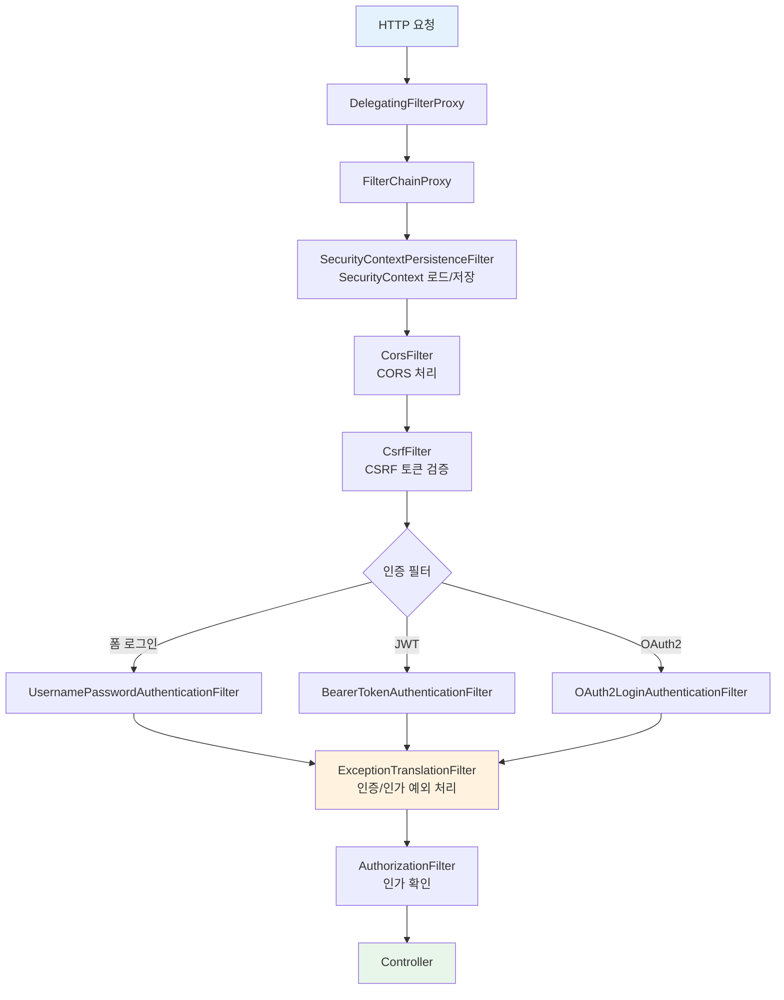
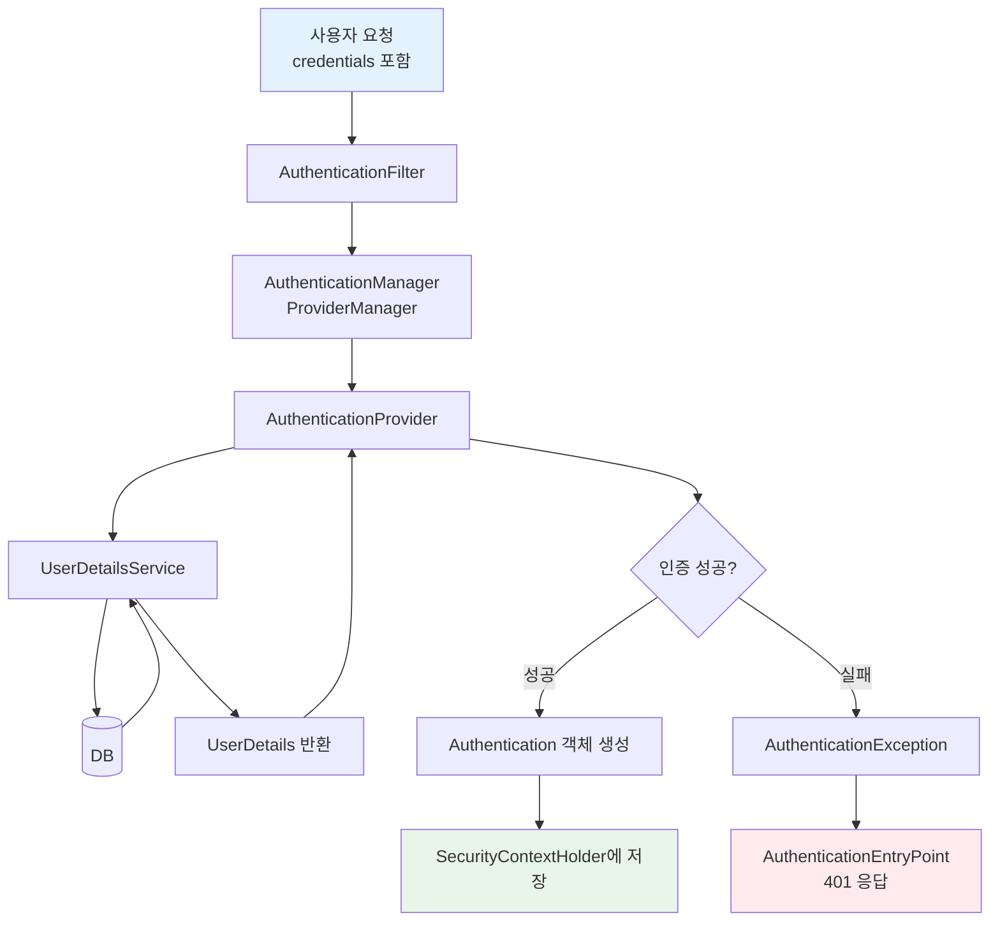
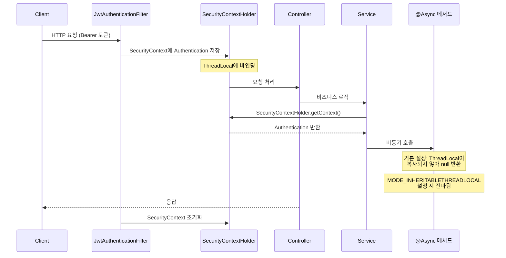
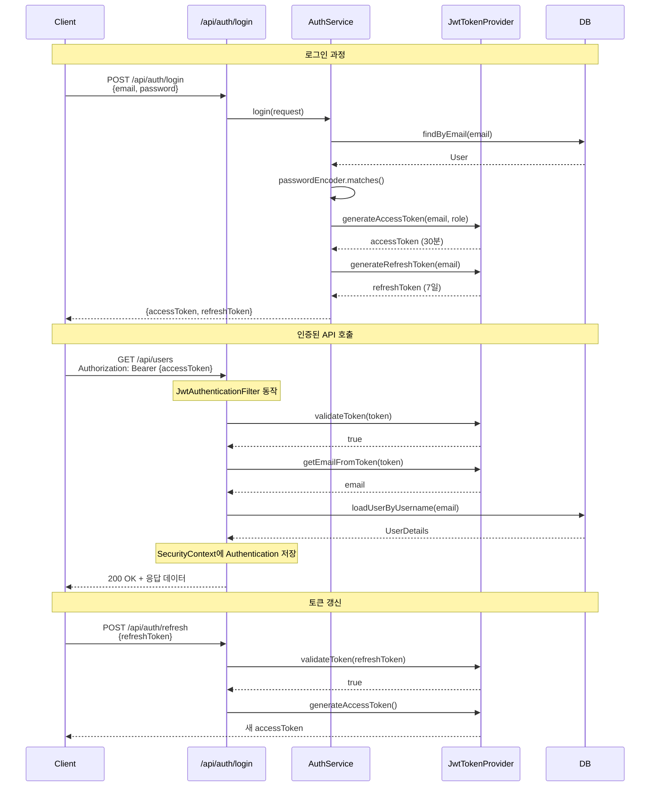
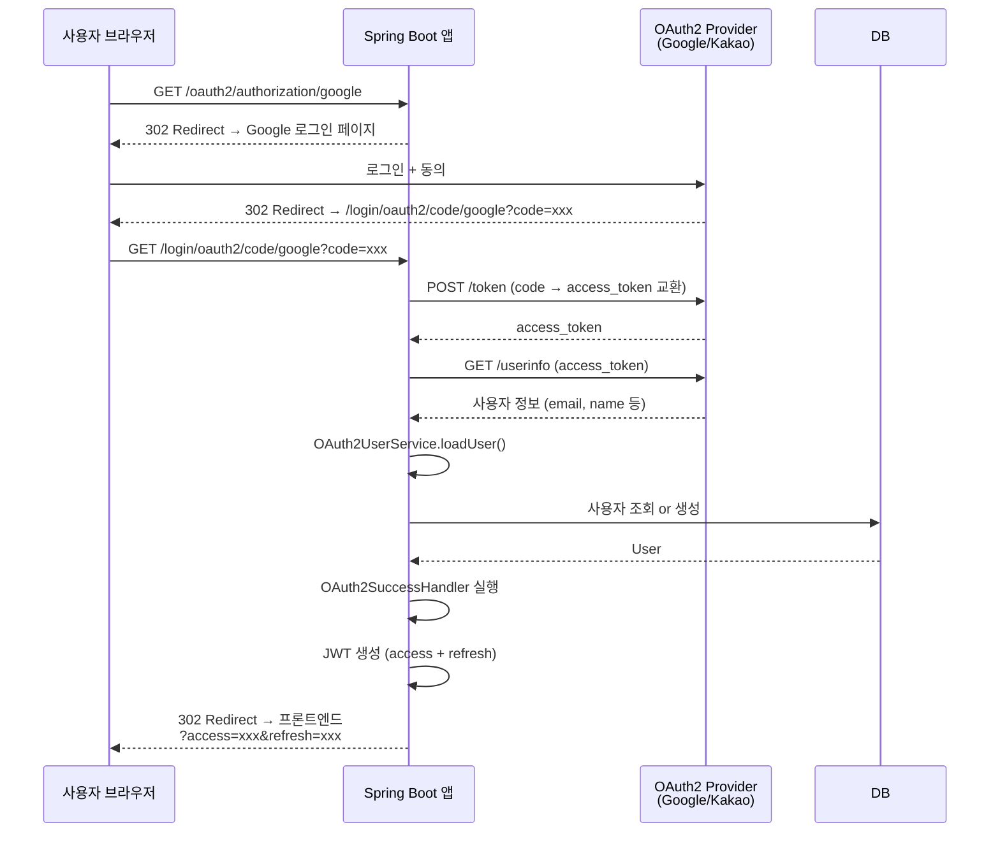

# Spring Security 핵심 개념과 실전 적용

## 배경

Spring Security는 Spring 기반 애플리케이션의 **인증(Authentication)**과 **인가(Authorization)**를 담당하는 보안 프레임워크이다. 서블릿 필터 체인 기반으로 동작하며, 선언적 보안 설정과 세밀한 접근 제어를 지원한다.

### 왜 Spring Security인가

- 직접 보안을 구현하면 CSRF, 세션 고정 공격 같은 항목을 빠뜨리는 경우가 많다. Spring Security는 이런 공격 방어를 기본으로 포함한다.
- 필터 체인 구조로 되어 있어서 요청마다 자동으로 보안 검증을 수행한다.
- 폼 로그인, JWT, OAuth2, LDAP 등 다양한 인증 방식을 지원한다.
- Spring Boot Auto Configuration으로 의존성 추가만 하면 기본 보안 설정이 적용된다.

### 핵심 용어

| 용어 | 설명 |
|------|------|
| **Authentication** | "누구인가" — 사용자 신원 확인 |
| **Authorization** | "무엇을 할 수 있는가" — 권한/역할 기반 접근 제어 |
| **Principal** | 현재 인증된 사용자 |
| **GrantedAuthority** | 사용자에게 부여된 권한 (ROLE_USER, ROLE_ADMIN 등) |
| **SecurityContext** | 현재 요청의 보안 정보를 저장하는 컨텍스트 |

## 핵심

### 1. 아키텍처

#### Security Filter Chain

Spring Security는 **서블릿 필터 체인**으로 동작한다. 모든 HTTP 요청은 필터를 순서대로 통과한다.



DelegatingFilterProxy가 서블릿 컨테이너의 필터를 Spring Bean으로 위임하고, FilterChainProxy가 URL 패턴에 맞는 SecurityFilterChain을 선택한다. 여러 SecurityFilterChain을 등록하면 URL 패턴별로 다른 보안 정책을 적용할 수 있다.

#### 인증 아키텍처



AuthenticationManager는 인터페이스이고, 실제 구현체는 ProviderManager이다. ProviderManager는 여러 AuthenticationProvider를 순회하면서 인증을 시도한다. DaoAuthenticationProvider가 가장 많이 사용되며, UserDetailsService로 DB에서 사용자를 조회한다.

#### SecurityContext 전파 흐름



SecurityContextHolder는 기본적으로 ThreadLocal에 SecurityContext를 저장한다. 같은 스레드 내에서는 어디서든 `SecurityContextHolder.getContext().getAuthentication()`으로 현재 사용자 정보를 가져올 수 있다.

비동기 처리(@Async)나 새로운 스레드에서는 SecurityContext가 전파되지 않는다. 이 문제가 발생하면 다음 설정을 추가한다:

```java
@PostConstruct
public void init() {
    SecurityContextHolder.setStrategyName(
        SecurityContextHolder.MODE_INHERITABLETHREADLOCAL);
}
```

단, `MODE_INHERITABLETHREADLOCAL`은 스레드풀 환경에서 이전 요청의 SecurityContext가 남아있는 문제가 생길 수 있다. Spring의 `DelegatingSecurityContextExecutor`를 사용하는 것이 더 안전하다:

```java
@Bean
public Executor taskExecutor() {
    ThreadPoolTaskExecutor executor = new ThreadPoolTaskExecutor();
    executor.setCorePoolSize(10);
    executor.initialize();
    return new DelegatingSecurityContextAsyncTaskExecutor(executor);
}
```

### 2. 기본 설정 (Spring Boot 3.x)

#### SecurityConfig

```java
@Configuration
@EnableWebSecurity
@RequiredArgsConstructor
public class SecurityConfig {

    private final JwtAuthenticationFilter jwtFilter;
    private final CustomUserDetailsService userDetailsService;

    @Bean
    public SecurityFilterChain filterChain(HttpSecurity http) throws Exception {
        return http
            .csrf(csrf -> csrf.disable())          // REST API는 CSRF 비활성화
            .sessionManagement(session ->
                session.sessionCreationPolicy(SessionCreationPolicy.STATELESS))
            .authorizeHttpRequests(auth -> auth
                .requestMatchers("/api/auth/**").permitAll()        // 인증 없이 접근
                .requestMatchers("/api/admin/**").hasRole("ADMIN")  // ADMIN만 접근
                .requestMatchers("/api/**").authenticated()         // 인증 필요
                .anyRequest().permitAll()
            )
            .addFilterBefore(jwtFilter, UsernamePasswordAuthenticationFilter.class)
            .build();
    }

    @Bean
    public PasswordEncoder passwordEncoder() {
        return new BCryptPasswordEncoder();
    }

    @Bean
    public AuthenticationManager authenticationManager(
            AuthenticationConfiguration config) throws Exception {
        return config.getAuthenticationManager();
    }
}
```

#### UserDetailsService 구현

```java
@Service
@RequiredArgsConstructor
public class CustomUserDetailsService implements UserDetailsService {

    private final UserRepository userRepository;

    @Override
    public UserDetails loadUserByUsername(String email) throws UsernameNotFoundException {
        User user = userRepository.findByEmail(email)
            .orElseThrow(() -> new UsernameNotFoundException("사용자를 찾을 수 없습니다: " + email));

        return org.springframework.security.core.userdetails.User.builder()
            .username(user.getEmail())
            .password(user.getPassword())            // BCrypt 해시값
            .roles(user.getRole().name())             // ROLE_ 접두사 자동 추가
            .build();
    }
}
```

### 3. JWT 인증

REST API에서 가장 일반적인 인증 방식이다. 세션을 사용하지 않고 토큰으로 상태를 관리한다.

#### JWT 인증 시퀀스



#### JWT 토큰 유틸리티

```java
@Component
public class JwtTokenProvider {

    @Value("${jwt.secret}")
    private String secretKey;

    @Value("${jwt.access-token-expiry}")
    private long accessTokenExpiry;     // 30분

    @Value("${jwt.refresh-token-expiry}")
    private long refreshTokenExpiry;    // 7일

    private SecretKey getSigningKey() {
        return Keys.hmacShaKeyFor(secretKey.getBytes(StandardCharsets.UTF_8));
    }

    // Access Token 생성
    public String generateAccessToken(String email, String role) {
        return Jwts.builder()
            .subject(email)
            .claim("role", role)
            .issuedAt(new Date())
            .expiration(new Date(System.currentTimeMillis() + accessTokenExpiry))
            .signWith(getSigningKey())
            .compact();
    }

    // Refresh Token 생성
    public String generateRefreshToken(String email) {
        return Jwts.builder()
            .subject(email)
            .issuedAt(new Date())
            .expiration(new Date(System.currentTimeMillis() + refreshTokenExpiry))
            .signWith(getSigningKey())
            .compact();
    }

    // 토큰에서 이메일 추출
    public String getEmailFromToken(String token) {
        return getClaims(token).getSubject();
    }

    // 토큰 유효성 검증
    public boolean validateToken(String token) {
        try {
            getClaims(token);
            return true;
        } catch (JwtException | IllegalArgumentException e) {
            return false;
        }
    }

    private Claims getClaims(String token) {
        return Jwts.parser()
            .verifyWith(getSigningKey())
            .build()
            .parseSignedClaims(token)
            .getPayload();
    }
}
```

#### JWT 인증 필터

```java
@Component
@RequiredArgsConstructor
public class JwtAuthenticationFilter extends OncePerRequestFilter {

    private final JwtTokenProvider tokenProvider;
    private final CustomUserDetailsService userDetailsService;

    @Override
    protected void doFilterInternal(HttpServletRequest request,
                                    HttpServletResponse response,
                                    FilterChain filterChain) throws ServletException, IOException {

        String token = extractToken(request);

        if (token != null && tokenProvider.validateToken(token)) {
            String email = tokenProvider.getEmailFromToken(token);
            UserDetails userDetails = userDetailsService.loadUserByUsername(email);

            UsernamePasswordAuthenticationToken authentication =
                new UsernamePasswordAuthenticationToken(
                    userDetails, null, userDetails.getAuthorities());
            authentication.setDetails(
                new WebAuthenticationDetailsSource().buildDetails(request));

            SecurityContextHolder.getContext().setAuthentication(authentication);
        }

        filterChain.doFilter(request, response);
    }

    private String extractToken(HttpServletRequest request) {
        String header = request.getHeader("Authorization");
        if (header != null && header.startsWith("Bearer ")) {
            return header.substring(7);
        }
        return null;
    }
}
```

### 4. OAuth2 로그인

소셜 로그인(Google, GitHub, Kakao 등)을 지원하는 OAuth2 설정이다.

#### OAuth2 로그인 시퀀스



#### application.yml

```yaml
spring:
  security:
    oauth2:
      client:
        registration:
          google:
            client-id: ${GOOGLE_CLIENT_ID}
            client-secret: ${GOOGLE_CLIENT_SECRET}
            scope: profile, email
          kakao:
            client-id: ${KAKAO_CLIENT_ID}
            client-secret: ${KAKAO_CLIENT_SECRET}
            authorization-grant-type: authorization_code
            redirect-uri: "{baseUrl}/login/oauth2/code/{registrationId}"
            scope: profile_nickname, account_email
        provider:
          kakao:
            authorization-uri: https://kauth.kakao.com/oauth/authorize
            token-uri: https://kauth.kakao.com/oauth/token
            user-info-uri: https://kapi.kakao.com/v2/user/me
            user-name-attribute: id
```

#### OAuth2 성공 핸들러

```java
@Component
@RequiredArgsConstructor
public class OAuth2SuccessHandler extends SimpleUrlAuthenticationSuccessHandler {

    private final JwtTokenProvider tokenProvider;

    @Override
    public void onAuthenticationSuccess(HttpServletRequest request,
                                        HttpServletResponse response,
                                        Authentication authentication) throws IOException {
        OAuth2User oAuth2User = (OAuth2User) authentication.getPrincipal();
        String email = oAuth2User.getAttribute("email");

        String accessToken = tokenProvider.generateAccessToken(email, "USER");
        String refreshToken = tokenProvider.generateRefreshToken(email);

        // 프론트엔드로 토큰 전달
        String redirectUrl = String.format(
            "https://frontend.com/oauth/callback?access=%s&refresh=%s",
            accessToken, refreshToken);

        getRedirectStrategy().sendRedirect(request, response, redirectUrl);
    }
}
```

### 5. 예외 처리 커스터마이징

Spring Security에서 인증/인가 실패 시 기본 응답은 HTML 형태이다. REST API에서는 JSON 응답을 내려줘야 하므로 커스터마이징이 필요하다.

#### AuthenticationEntryPoint (인증 실패 — 401)

인증되지 않은 사용자가 보호된 리소스에 접근할 때 호출된다.

```java
@Component
public class CustomAuthenticationEntryPoint implements AuthenticationEntryPoint {

    private final ObjectMapper objectMapper = new ObjectMapper();

    @Override
    public void commence(HttpServletRequest request,
                         HttpServletResponse response,
                         AuthenticationException authException) throws IOException {

        response.setStatus(HttpServletResponse.SC_UNAUTHORIZED);
        response.setContentType(MediaType.APPLICATION_JSON_VALUE);
        response.setCharacterEncoding("UTF-8");

        ErrorResponse errorResponse = new ErrorResponse(
            "UNAUTHORIZED",
            "인증이 필요합니다. 토큰을 확인해주세요."
        );

        response.getWriter().write(objectMapper.writeValueAsString(errorResponse));
    }
}
```

#### AccessDeniedHandler (인가 실패 — 403)

인증은 됐지만 권한이 없는 리소스에 접근할 때 호출된다. 예를 들어 USER 권한으로 ADMIN 전용 API를 호출하는 경우이다.

```java
@Component
public class CustomAccessDeniedHandler implements AccessDeniedHandler {

    private final ObjectMapper objectMapper = new ObjectMapper();

    @Override
    public void handle(HttpServletRequest request,
                       HttpServletResponse response,
                       AccessDeniedException accessDeniedException) throws IOException {

        response.setStatus(HttpServletResponse.SC_FORBIDDEN);
        response.setContentType(MediaType.APPLICATION_JSON_VALUE);
        response.setCharacterEncoding("UTF-8");

        ErrorResponse errorResponse = new ErrorResponse(
            "FORBIDDEN",
            "접근 권한이 없습니다."
        );

        response.getWriter().write(objectMapper.writeValueAsString(errorResponse));
    }
}
```

#### SecurityConfig에 등록

```java
@Bean
public SecurityFilterChain filterChain(HttpSecurity http) throws Exception {
    return http
        // ... 기존 설정 ...
        .exceptionHandling(exception -> exception
            .authenticationEntryPoint(customAuthenticationEntryPoint)
            .accessDeniedHandler(customAccessDeniedHandler)
        )
        .build();
}
```

실무에서 자주 발생하는 상황: JwtAuthenticationFilter에서 토큰 파싱 실패 시 예외를 던지면 ExceptionTranslationFilter까지 도달하지 못하고 서블릿 에러 페이지가 뜬다. 필터에서는 직접 response에 에러를 작성하거나, 예외를 삼키고 인증 없이 다음 필터로 넘겨서 AuthorizationFilter에서 걸리게 해야 한다.

### 6. 메서드 레벨 보안

Controller나 Service 메서드에 직접 권한을 지정할 수 있다.

```java
@Configuration
@EnableMethodSecurity   // Spring Boot 3.x
public class MethodSecurityConfig { }
```

```java
@RestController
@RequestMapping("/api/users")
public class UserController {

    // ADMIN 역할만 접근
    @PreAuthorize("hasRole('ADMIN')")
    @GetMapping
    public List<UserResponse> getAllUsers() { ... }

    // 본인 또는 ADMIN만 접근
    @PreAuthorize("#id == authentication.principal.id or hasRole('ADMIN')")
    @GetMapping("/{id}")
    public UserResponse getUser(@PathVariable Long id) { ... }

    // 인증된 사용자만 접근
    @PreAuthorize("isAuthenticated()")
    @PutMapping("/profile")
    public UserResponse updateProfile(@RequestBody UpdateRequest request) { ... }
}
```

### 7. CORS 설정

프론트엔드와 백엔드가 다른 도메인일 때 필수적인 설정이다.

```java
@Configuration
public class CorsConfig {

    @Bean
    public CorsConfigurationSource corsConfigurationSource() {
        CorsConfiguration config = new CorsConfiguration();
        config.setAllowedOrigins(List.of(
            "https://frontend.com",
            "http://localhost:3000"
        ));
        config.setAllowedMethods(List.of("GET", "POST", "PUT", "DELETE", "PATCH"));
        config.setAllowedHeaders(List.of("*"));
        config.setAllowCredentials(true);
        config.setMaxAge(3600L);

        UrlBasedCorsConfigurationSource source = new UrlBasedCorsConfigurationSource();
        source.registerCorsConfiguration("/api/**", config);
        return source;
    }
}
```

### 8. 세션 관리

JWT 기반 API 서버에서는 `SessionCreationPolicy.STATELESS`를 사용하지만, 전통적인 웹 애플리케이션에서는 세션 관리가 중요하다.

#### 동시 세션 제한

같은 계정으로 여러 기기에서 동시 로그인하는 것을 제한한다.

```java
@Bean
public SecurityFilterChain filterChain(HttpSecurity http) throws Exception {
    return http
        .sessionManagement(session -> session
            .maximumSessions(1)                    // 최대 동시 세션 1개
            .maxSessionsPreventsLogin(false)        // false: 기존 세션 만료, true: 새 로그인 차단
            .expiredSessionStrategy(event -> {
                HttpServletResponse response = event.getResponse();
                response.setStatus(HttpServletResponse.SC_UNAUTHORIZED);
                response.setContentType(MediaType.APPLICATION_JSON_VALUE);
                response.getWriter().write(
                    "{\"error\":\"SESSION_EXPIRED\",\"message\":\"다른 기기에서 로그인하여 세션이 만료되었습니다.\"}");
            })
        )
        .build();
}
```

`maxSessionsPreventsLogin(false)`가 기본값이다. 이 경우 새 로그인이 성공하면 기존 세션이 만료된다. `true`로 설정하면 기존 세션이 살아있는 동안 새 로그인이 거부된다.

동시 세션 제한을 사용하려면 `HttpSessionEventPublisher`를 등록해야 한다. 이걸 빠뜨리면 세션이 만료돼도 Spring Security가 인식하지 못한다:

```java
@Bean
public HttpSessionEventPublisher httpSessionEventPublisher() {
    return new HttpSessionEventPublisher();
}
```

#### 세션 고정 공격 방어

세션 고정 공격(Session Fixation)은 공격자가 미리 생성한 세션 ID를 피해자에게 사용하게 하는 방식이다. Spring Security는 기본적으로 인증 성공 시 세션 ID를 변경하여 이 공격을 방어한다.

```java
@Bean
public SecurityFilterChain filterChain(HttpSecurity http) throws Exception {
    return http
        .sessionManagement(session -> session
            .sessionFixation(fixation -> fixation.changeSessionId())  // 기본값
            // .sessionFixation(fixation -> fixation.migrateSession())  // 세션 속성 복사
            // .sessionFixation(fixation -> fixation.newSession())       // 새 세션 생성 (속성 미복사)
            // .sessionFixation(fixation -> fixation.none())             // 방어 비활성화 (비권장)
        )
        .build();
}
```

`changeSessionId()`가 Spring Security 기본값이며 서블릿 3.1+에서 동작한다. 세션의 속성은 유지하면서 ID만 변경한다. `none()`으로 설정하면 세션 고정 공격에 노출되므로 사용하면 안 된다.

### 9. 보안 테스트

Spring Security가 적용된 API를 테스트할 때 인증/인가 처리를 모킹해야 한다. `spring-security-test` 의존성이 필요하다.

```xml
<dependency>
    <groupId>org.springframework.security</groupId>
    <artifactId>spring-security-test</artifactId>
    <scope>test</scope>
</dependency>
```

#### @WithMockUser

테스트 메서드 실행 시 SecurityContext에 가짜 인증 정보를 넣어준다.

```java
@WebMvcTest(UserController.class)
class UserControllerTest {

    @Autowired
    private MockMvc mockMvc;

    // 기본값: username="user", roles={"USER"}
    @Test
    @WithMockUser
    void 인증된_사용자는_프로필을_조회할_수_있다() throws Exception {
        mockMvc.perform(get("/api/users/profile"))
            .andExpect(status().isOk());
    }

    // 특정 역할 지정
    @Test
    @WithMockUser(username = "admin@test.com", roles = {"ADMIN"})
    void ADMIN은_전체_사용자를_조회할_수_있다() throws Exception {
        mockMvc.perform(get("/api/users"))
            .andExpect(status().isOk());
    }

    // 인증 없이 접근
    @Test
    void 미인증_사용자는_401을_받는다() throws Exception {
        mockMvc.perform(get("/api/users/profile"))
            .andExpect(status().isUnauthorized());
    }

    // 권한 부족
    @Test
    @WithMockUser(roles = {"USER"})
    void USER는_관리자_API에_접근할_수_없다() throws Exception {
        mockMvc.perform(get("/api/admin/settings"))
            .andExpect(status().isForbidden());
    }
}
```

주의할 점: `@WithMockUser`는 실제 DB에서 사용자를 조회하지 않는다. UserDetailsService를 거치지 않기 때문에 커스텀 UserDetails 객체가 필요한 테스트에서는 사용할 수 없다.

#### @WithUserDetails

실제 UserDetailsService를 호출해서 인증 정보를 구성한다. 커스텀 UserDetails를 사용하는 경우에 적합하다.

```java
@Test
@WithUserDetails(value = "admin@test.com", userDetailsServiceBeanName = "customUserDetailsService")
void 커스텀_UserDetails가_필요한_테스트() throws Exception {
    mockMvc.perform(get("/api/users/me"))
        .andExpect(status().isOk())
        .andExpect(jsonPath("$.email").value("admin@test.com"));
}
```

#### SecurityMockMvcRequestPostProcessors

요청 단위로 인증 정보를 설정한다. 하나의 테스트 메서드에서 여러 역할을 테스트할 때 유용하다.

```java
import static org.springframework.security.test.web.servlet.request.SecurityMockMvcRequestPostProcessors.*;

@WebMvcTest(UserController.class)
class UserControllerSecurityTest {

    @Autowired
    private MockMvc mockMvc;

    @Test
    void user_요청과_admin_요청을_같은_테스트에서_검증한다() throws Exception {
        // USER 권한으로 요청
        mockMvc.perform(get("/api/users")
                .with(user("user@test.com").roles("USER")))
            .andExpect(status().isForbidden());

        // ADMIN 권한으로 요청
        mockMvc.perform(get("/api/users")
                .with(user("admin@test.com").roles("ADMIN")))
            .andExpect(status().isOk());
    }

    // CSRF 토큰 포함 (CSRF가 활성화된 경우)
    @Test
    void CSRF가_필요한_POST_요청() throws Exception {
        mockMvc.perform(post("/api/users")
                .with(csrf())
                .with(user("admin@test.com").roles("ADMIN"))
                .contentType(MediaType.APPLICATION_JSON)
                .content("{\"name\":\"홍길동\"}"))
            .andExpect(status().isCreated());
    }

    // JWT 토큰 테스트 (OAuth2 Resource Server 사용 시)
    @Test
    void JWT_토큰으로_인증하는_요청() throws Exception {
        mockMvc.perform(get("/api/users/me")
                .with(jwt().authorities(new SimpleGrantedAuthority("ROLE_USER"))))
            .andExpect(status().isOk());
    }
}
```

`@WithMockUser`는 클래스/메서드 단위, `with(user(...))`는 요청 단위이다. 하나의 테스트에서 여러 사용자를 번갈아 테스트해야 하면 `with(user(...))`가 적합하다.

## 예시

### 1. 회원가입 + 로그인 API 전체 구현

```java
@RestController
@RequestMapping("/api/auth")
@RequiredArgsConstructor
public class AuthController {

    private final AuthService authService;

    @PostMapping("/signup")
    public ResponseEntity<AuthResponse> signup(@Valid @RequestBody SignupRequest request) {
        AuthResponse response = authService.signup(request);
        return ResponseEntity.status(HttpStatus.CREATED).body(response);
    }

    @PostMapping("/login")
    public ResponseEntity<AuthResponse> login(@Valid @RequestBody LoginRequest request) {
        AuthResponse response = authService.login(request);
        return ResponseEntity.ok(response);
    }

    @PostMapping("/refresh")
    public ResponseEntity<AuthResponse> refresh(@RequestBody RefreshRequest request) {
        AuthResponse response = authService.refresh(request.getRefreshToken());
        return ResponseEntity.ok(response);
    }
}
```

```java
@Service
@RequiredArgsConstructor
public class AuthService {

    private final UserRepository userRepository;
    private final PasswordEncoder passwordEncoder;
    private final JwtTokenProvider tokenProvider;
    private final AuthenticationManager authenticationManager;

    @Transactional
    public AuthResponse signup(SignupRequest request) {
        if (userRepository.existsByEmail(request.getEmail())) {
            throw new DuplicateEmailException(request.getEmail());
        }

        User user = User.builder()
            .email(request.getEmail())
            .password(passwordEncoder.encode(request.getPassword()))
            .name(request.getName())
            .role(Role.USER)
            .build();

        userRepository.save(user);

        String accessToken = tokenProvider.generateAccessToken(user.getEmail(), "USER");
        String refreshToken = tokenProvider.generateRefreshToken(user.getEmail());

        return new AuthResponse(accessToken, refreshToken);
    }

    public AuthResponse login(LoginRequest request) {
        authenticationManager.authenticate(
            new UsernamePasswordAuthenticationToken(
                request.getEmail(), request.getPassword()));

        String accessToken = tokenProvider.generateAccessToken(request.getEmail(), "USER");
        String refreshToken = tokenProvider.generateRefreshToken(request.getEmail());

        return new AuthResponse(accessToken, refreshToken);
    }
}
```

### 2. 현재 사용자 정보 조회

```java
// 커스텀 어노테이션
@Target(ElementType.PARAMETER)
@Retention(RetentionPolicy.RUNTIME)
public @interface CurrentUser { }

// ArgumentResolver
@Component
public class CurrentUserResolver implements HandlerMethodArgumentResolver {

    @Override
    public boolean supportsParameter(MethodParameter parameter) {
        return parameter.hasParameterAnnotation(CurrentUser.class)
            && parameter.getParameterType().equals(UserDetails.class);
    }

    @Override
    public Object resolveArgument(MethodParameter parameter, ...) {
        Authentication auth = SecurityContextHolder.getContext().getAuthentication();
        return auth.getPrincipal();
    }
}

// Controller에서 사용
@GetMapping("/me")
public UserResponse getCurrentUser(@CurrentUser UserDetails userDetails) {
    return userService.findByEmail(userDetails.getUsername());
}
```

## 운영 팁

### 주의사항

**비밀번호 해싱**: BCrypt를 사용하되, cost factor는 10 이상으로 설정한다. 기본값이 10이므로 별도 설정 없이 `new BCryptPasswordEncoder()`를 쓰면 된다.

**JWT 시크릿 관리**: 환경변수나 Vault로 관리한다. 최소 256비트(32자) 이상이어야 HS256 서명이 동작한다. 코드에 하드코딩하면 소스가 유출될 때 토큰 위조가 가능하다.

**토큰 만료 시간**: Access Token은 15~30분, Refresh Token은 7~14일이 일반적이다. Access Token을 너무 길게 잡으면 탈취 시 피해가 커지고, 너무 짧으면 사용자 경험이 나빠진다.

**HTTPS 필수**: 프로덕션에서 HTTP를 사용하면 Bearer 토큰이 평문으로 전송된다. 개발 환경에서도 가능하면 HTTPS를 사용한다.

**CORS 도메인 지정**: `setAllowedOrigins(List.of("*"))`는 개발 환경에서만 사용한다. 프로덕션에서는 반드시 허용할 도메인을 명시해야 한다.

**Refresh Token Rotation**: Refresh Token을 사용할 때마다 새 Refresh Token을 발급하고 기존 것은 폐기한다. 탈취된 Refresh Token의 재사용을 감지할 수 있다.

### 흔한 실수

| 실수 | 결과 | 해결 |
|------|------|------|
| CSRF 비활성화 없이 REST API 구축 | POST/PUT/DELETE 요청 403 | `csrf.disable()` (REST API 한정) |
| SecurityContext를 비동기에서 접근 | null 반환 | `DelegatingSecurityContextAsyncTaskExecutor` 사용 |
| 패스워드 평문 저장 | 데이터 유출 시 전체 계정 노출 | BCryptPasswordEncoder 필수 사용 |
| JWT 시크릿을 코드에 하드코딩 | 소스 유출 시 토큰 위조 가능 | 환경변수 또는 Vault 사용 |
| ExceptionTranslationFilter 도달 전에 예외 발생 | HTML 에러 페이지 반환 | 필터에서 직접 response 작성 |
| HttpSessionEventPublisher 미등록 | 동시 세션 제한이 동작하지 않음 | Bean 등록 필수 |

## Spring Security 5 → 6 마이그레이션

Spring Boot 2.x에서 3.x로 올리면 Spring Security도 5에서 6으로 올라간다. 호환성이 깨지는 변경이 많아서 주의가 필요하다.

### WebSecurityConfigurerAdapter 제거

Spring Security 5.7에서 deprecated, 6.0에서 완전히 제거되었다. `SecurityFilterChain` Bean 방식으로 변경해야 한다.

```java
// Spring Security 5 (deprecated)
@Configuration
public class SecurityConfig extends WebSecurityConfigurerAdapter {
    @Override
    protected void configure(HttpSecurity http) throws Exception {
        http.authorizeRequests()
            .antMatchers("/api/admin/**").hasRole("ADMIN")
            .anyRequest().authenticated();
    }

    @Override
    protected void configure(AuthenticationManagerBuilder auth) throws Exception {
        auth.userDetailsService(userDetailsService)
            .passwordEncoder(passwordEncoder());
    }
}

// Spring Security 6
@Configuration
@EnableWebSecurity
public class SecurityConfig {
    @Bean
    public SecurityFilterChain filterChain(HttpSecurity http) throws Exception {
        return http
            .authorizeHttpRequests(auth -> auth
                .requestMatchers("/api/admin/**").hasRole("ADMIN")
                .anyRequest().authenticated()
            )
            .build();
    }

    @Bean
    public AuthenticationManager authenticationManager(
            AuthenticationConfiguration config) throws Exception {
        return config.getAuthenticationManager();
    }
}
```

### 주요 API 변경

| Spring Security 5 | Spring Security 6 | 비고 |
|---|---|---|
| `authorizeRequests()` | `authorizeHttpRequests()` | 메서드명 변경 |
| `antMatchers()` | `requestMatchers()` | 메서드명 변경 |
| `mvcMatchers()` | `requestMatchers()` | 통합됨 |
| `access("hasRole('ADMIN')")` | `hasRole("ADMIN")` | SpEL 대신 직접 호출 |
| `@EnableGlobalMethodSecurity` | `@EnableMethodSecurity` | 어노테이션 변경 |
| `csrf().disable()` | `csrf(csrf -> csrf.disable())` | Lambda DSL 필수 |
| `cors().and()` | `cors(Customizer.withDefaults())` | Lambda DSL 필수 |

### Lambda DSL 필수화

Spring Security 6에서는 Lambda DSL이 필수이다. 기존 체이닝 방식은 deprecated되었다.

```java
// Spring Security 5 (체이닝)
http.csrf().disable()
    .cors().and()
    .sessionManagement().sessionCreationPolicy(SessionCreationPolicy.STATELESS).and()
    .authorizeRequests()
        .antMatchers("/api/auth/**").permitAll()
        .anyRequest().authenticated();

// Spring Security 6 (Lambda DSL)
http
    .csrf(csrf -> csrf.disable())
    .cors(Customizer.withDefaults())
    .sessionManagement(session ->
        session.sessionCreationPolicy(SessionCreationPolicy.STATELESS))
    .authorizeHttpRequests(auth -> auth
        .requestMatchers("/api/auth/**").permitAll()
        .anyRequest().authenticated()
    );
```

### SecurityContextHolder 기본 동작 변경

Spring Security 5에서는 `SecurityContextPersistenceFilter`가 SecurityContext를 세션에 자동 저장했다. Spring Security 6에서는 `SecurityContextHolderFilter`로 변경되었고, SecurityContext를 명시적으로 저장해야 한다.

```java
// Spring Security 6에서 SecurityContext 명시적 저장
SecurityContext context = SecurityContextHolder.createEmptyContext();
context.setAuthentication(authentication);
SecurityContextHolder.setContext(context);
securityContextRepository.saveContext(context, request, response);
```

이 변경 때문에 커스텀 인증 필터에서 SecurityContext를 저장하는 코드를 추가해야 할 수 있다. JWT 기반으로 STATELESS 세션을 사용하는 경우에는 이 변경의 영향이 거의 없다.

### 마이그레이션 순서

1. Spring Boot 2.7로 먼저 올린다 (Spring Security 5.7). deprecated 경고가 나오는 부분을 모두 수정한다.
2. `WebSecurityConfigurerAdapter`를 `SecurityFilterChain` Bean으로 변경한다.
3. `antMatchers()`를 `requestMatchers()`로, `authorizeRequests()`를 `authorizeHttpRequests()`로 바꾼다.
4. 체이닝 방식을 Lambda DSL로 변경한다.
5. Spring Boot 3.x로 올린다 (Spring Security 6).
6. 테스트를 전부 돌려본다. 특히 인가 테스트에서 실패하는 경우가 많다.

한 번에 3.x로 올리면 컴파일 에러가 한꺼번에 쏟아진다. 2.7에서 deprecated 경고를 먼저 해결하면 마이그레이션 범위를 줄일 수 있다.

## 참고

- [Spring Security 공식 문서](https://docs.spring.io/spring-security/reference/)
- [Spring Security Architecture](https://spring.io/guides/topicals/spring-security-architecture)
- [JJWT GitHub](https://github.com/jwtk/jjwt)
- [OAuth 2.0 개요](../../Security/OAuth.md)
- [Spring Security 6.x Migration Guide](https://docs.spring.io/spring-security/reference/migration/index.html)
