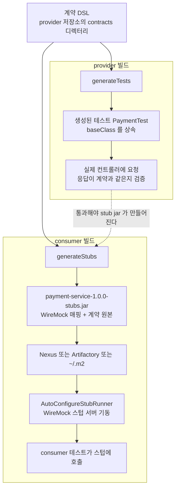
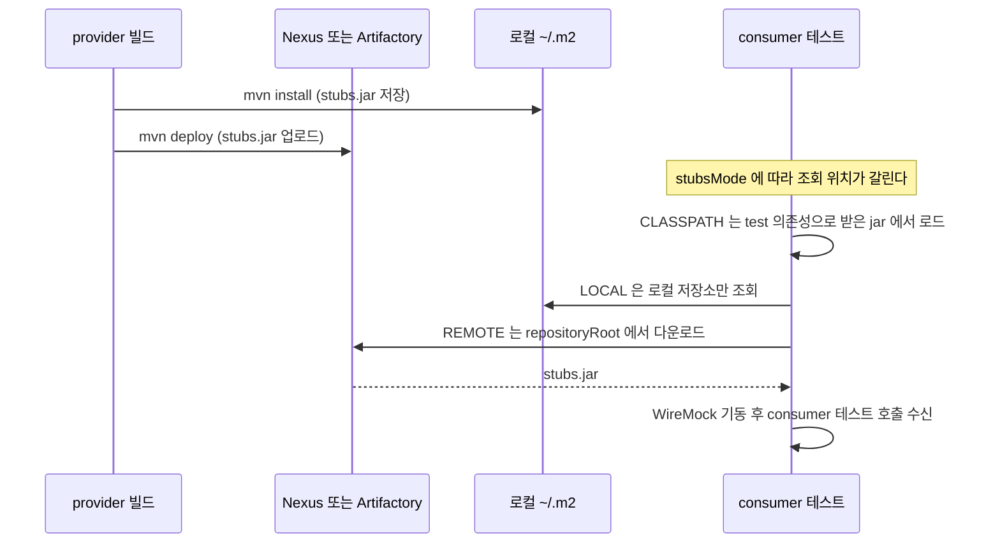
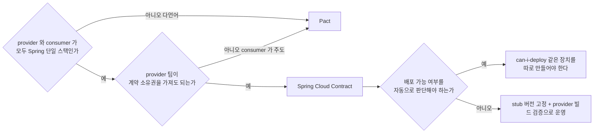

# Spring Cloud Contract

Spring Cloud Contract(이하 SCC)는 계약 파일을 provider 저장소에 둔다. Pact는 consumer 테스트를 돌리다 보면 계약 파일이 부산물로 나오는 구조인데, SCC는 provider 팀이 DSL 파일을 먼저 쓰고 그 파일 하나에서 provider 검증 테스트와 consumer용 stub jar가 둘 다 만들어진다. 계약의 주인이 누구냐가 다르다 보니 설정, CI 배치, 팀 간 협업 방식이 전부 Pact와 달라진다.

계약 테스트가 왜 필요한지, 도입 여부를 어떻게 판단하는지는 [Service Contract Testing](../../../Architecture/MSA/Service_Contract_Testing.md)에 있고 Pact Java 코드는 [MSA 테스트](../../../Architecture/MSA/MSA_테스트_전략.md)에 있다. 이 문서는 SCC를 실제로 붙일 때 설정이 어디서 막히고, 어디서 조용히 통과해 버리는지를 다룬다. 일반적인 Spring 테스트 구성은 [Spring 테스트](../Spring/Spring_Test.md), 서비스 간 통신 쪽 배경은 [Spring Cloud MSA](../Spring/Spring_Cloud.md)에서 이어진다.

예제는 Spring Boot 3.5.6, Spring Cloud 2025.0.3(SCC 4.3.4), Java 17, Maven 3.6.3 위에 provider(`payment-service`), consumer(`order-service`), 메시징 provider/consumer 두 쌍을 만들어 실제로 돌린 결과다. provider는 Gradle 8.14.3으로도 한 번 돌렸다. 본문의 에러 메시지와 로그는 그 실행에서 나온 것이다.

## 계약 하나에서 두 갈래가 나온다

SCC의 빌드 흐름은 계약 DSL 한 벌이 provider 쪽과 consumer 쪽으로 갈라지는 모양이다. provider 쪽은 계약을 읽어 JUnit 테스트 클래스를 생성하고, 그 테스트가 실제 컨트롤러에 요청을 쏴서 계약대로 응답하는지 검증한다. consumer 쪽은 같은 계약을 WireMock 매핑 JSON으로 바꿔 stub jar에 담고, consumer 테스트가 그 jar를 받아 가짜 서버를 띄운다.



점선이 중요하다. Maven 라이프사이클에서 `generateStubs`는 `test` 단계 뒤에 붙어 있어서, 생성된 테스트가 깨지면 stub jar가 만들어지지 않는다. provider가 지키지 못하는 계약이 consumer에게 stub으로 배포되는 일을 막는 장치인데, 뒤에서 보겠지만 테스트가 0건 실행되고도 빌드가 성공하면 이 장치가 통째로 무력해진다.

stub jar 안을 열어 보면 `META-INF/com.example/payment-service/1.0.0/` 아래에 `mappings/payment/get_payment.json` 같은 WireMock 매핑과 `contracts/payment/get_payment.groovy` 같은 계약 원본이 같이 들어 있다. 매핑은 WireMock 형식 JSON이라 consumer가 Java가 아니어도 HTTP로 붙기는 한다. 다만 jar를 받아 스텁 서버를 띄우는 Stub Runner는 JVM 도구라서, 비JVM consumer는 Stub Runner Boot 같은 독립 실행 형태를 따로 써야 한다. 이 부분은 직접 돌려보지 않았다.

## 계약 DSL

Groovy와 YAML 둘 다 쓴다. Groovy는 `$(...)` 문법으로 요청과 응답에 따로 값을 지정할 수 있고, YAML은 `matchers` 블록으로 같은 일을 한다. 한 저장소에 섞어 써도 되지만 팀 안에서는 하나로 정해 두는 편이 리뷰하기 편하다. Groovy는 IDE 자동완성이 되지만 Groovy 문법 에러가 빌드 단계에서야 드러나고, YAML은 문법은 단순한데 중첩 matchers가 길어진다.

### Groovy

```groovy
// src/test/resources/contracts/payment/get_payment.groovy
import org.springframework.cloud.contract.spec.Contract

Contract.make {
    description "결제 단건 조회 성공"
    request {
        method GET()
        url '/payments/1'
    }
    response {
        status OK()
        headers {
            contentType applicationJson()
        }
        body(
            id: 1,
            status: 'COMPLETED',
            amount: 10000,
            orderNo: $(producer(regex('ORD-[0-9]{8}-[0-9]{4}')), consumer('ORD-20261007-0001')),
            paidAt: $(producer(regex(iso8601WithOffset())), consumer('2026-10-07T01:23:45Z'))
        )
    }
}
```

`$(producer(...), consumer(...))`의 규칙은 하나다. 정규식은 값을 검증하는 쪽에, 구체 값은 값을 만들어 내는 쪽에 둔다. 응답은 provider 생성 테스트가 검증하고 stub이 만들어 돌려주니, 정규식이 `producer`, 구체 값이 `consumer`다. 요청은 반대로 stub이 받아서 매칭하고 생성 테스트가 만들어 보내니, 정규식이 `consumer`, 구체 값이 `producer`다.

POST 계약에서 요청 쪽이 그렇게 쓰인다. 응답에서 요청 값을 그대로 돌려주는 경우는 `fromRequest()`를 쓴다.

```groovy
// src/test/resources/contracts/payment/create_payment.groovy
Contract.make {
    description "결제 생성"
    request {
        method POST()
        url '/payments'
        headers { contentType applicationJson() }
        body(
            orderNo: $(consumer(regex('ORD-[0-9]{8}-[0-9]{4}')), producer('ORD-20261007-0001')),
            amount: $(consumer(regex('[0-9]+')), producer(10000))
        )
    }
    response {
        status CREATED()
        headers { contentType applicationJson() }
        body(
            id: 2,
            status: 'READY',
            amount: 10000,
            orderNo: fromRequest().body('$.orderNo')
        )
    }
}
```

consumer가 `ORD-20261007-0777`을 보내면 스텁은 요청 패턴에 매칭된 뒤 그 값을 응답에 되돌려 준다. 생성된 stub 매핑을 열어 보면 응답 body에 `{{{jsonPath request.body '$.orderNo'}}}`가 들어 있고 `transformers`에 `response-template`이 붙는다. provider 쪽 생성 테스트는 같은 필드를 `ORD-20261007-0001`과 `isEqualTo`로 비교한다.

### YAML

```yaml
# src/test/resources/contracts/payment/get_payment_yaml.yml
description: 결제 단건 조회 (YAML)
request:
  method: GET
  url: /payments/1
response:
  status: 200
  headers:
    Content-Type: application/json
  body:
    id: 1
    status: COMPLETED
    amount: 10000
    orderNo: ORD-20261007-0001
  matchers:
    body:
      - path: $.orderNo
        type: by_regex
        value: "ORD-[0-9]{8}-[0-9]{4}"
```

YAML에서 `body`의 값은 stub이 돌려줄 구체 값이고, `matchers`의 정규식은 provider 생성 테스트가 검증할 패턴이다. 돌려 보면 생성된 테스트에 `matches("ORD-[0-9]{8}-[0-9]{4}")`가 들어가고, stub 매핑에는 구체 값이 그대로 들어간다. 정규식을 `body`에 쓰면 그 문자열이 그대로 값으로 취급되니 `matchers`로 분리해야 한다.

### 정규식에서 실제로 틀린 것들

**방향을 거꾸로 쓴 경우.** 응답에 `$(consumer(regex(...)), producer('...'))`를 쓰면 생성 단계에서 바로 죽는다.

```text
java.lang.IllegalStateException: You can't have a regular expression for the response on the client side
```

메시지는 명확한데, 이 에러는 `generateTests` 골 안에서 난다. 로그 꼬리만 보면 Maven 플러그인 스택트레이스가 길게 나와서 계약 파일 문제라는 걸 알아채기까지 시간이 걸린다. 이 에러가 났을 때 이어지는 함정은 뒤의 "테스트가 0건인데 성공하는 경우"에 있다.

**Groovy 문자열의 `\d`.** 정규식에 `\d`를 쓰면 작은따옴표 문자열 안에서 Groovy 이스케이프로 해석된다.

```groovy
orderNo: $(producer(regex('ORD-\d{8}-\d{4}')), consumer('ORD-20261007-0001'))
```

이건 `MultipleCompilationErrorsException: startup failed`로 계약 파일 컴파일 단계에서 실패한다. `[0-9]`로 쓰거나 `\\d`로 이스케이프한다. 소리 내서 실패하는 쪽이라 그나마 낫다.

**provider 직렬화가 정규식과 다른 경우.** 정규식이 맞아도 provider가 내려주는 값의 모양이 다르면 생성 테스트가 깨진다. 처음에 `paidAt`에 `iso8601WithOffset()`을 썼는데 이런 에러가 났다.

```text
Parsed JSON [{"id":1,"status":"COMPLETED","amount":10000,"orderNo":"ORD-20261007-0001","paidAt":1791336225.000000000}]
doesn't match the JSON path [$[?(@.['paidAt'] =~ /([0-9]{4})-(1[0-2]|0[1-9])-...(Z|[+-][01]\d:[0-5]\d)/)]]
```

`Instant`가 `1791336225.000000000`이라는 숫자로 나왔다. 원인은 계약이 아니라 base class다. 이 문제는 다음 절에서 다룬다.

## 빌드 설정

### Maven

```xml
<properties>
  <java.version>17</java.version>
  <spring-cloud.version>2025.0.3</spring-cloud.version>
  <spring-cloud-contract.version>4.3.4</spring-cloud-contract.version>
</properties>

<dependencyManagement>
  <dependencies>
    <dependency>
      <groupId>org.springframework.cloud</groupId>
      <artifactId>spring-cloud-dependencies</artifactId>
      <version>${spring-cloud.version}</version>
      <type>pom</type>
      <scope>import</scope>
    </dependency>
  </dependencies>
</dependencyManagement>

<dependencies>
  <dependency>
    <groupId>org.springframework.cloud</groupId>
    <artifactId>spring-cloud-starter-contract-verifier</artifactId>
    <scope>test</scope>
  </dependency>
</dependencies>

<build>
  <plugins>
    <plugin>
      <groupId>org.springframework.cloud</groupId>
      <artifactId>spring-cloud-contract-maven-plugin</artifactId>
      <version>${spring-cloud-contract.version}</version>
      <extensions>true</extensions>
      <configuration>
        <baseClassForTests>com.example.payment.contract.BaseContractTest</baseClassForTests>
        <testFramework>JUNIT5</testFramework>
        <testMode>MOCKMVC</testMode>
      </configuration>
    </plugin>
  </plugins>
</build>
```

플러그인의 `<version>`을 빼먹으면 안 된다. `spring-cloud-dependencies` BOM을 import해도 Maven 플러그인 버전은 따라오지 않고, Boot parent도 이 플러그인은 관리하지 않는다. 버전을 안 쓴 채로 돌렸더니 Maven이 `spring-cloud-contract-maven-plugin:5.0.0-M2`를 골라서 실행했다. Boot 3.5 프로젝트에 마일스톤 버전이 끼어든 것이다. 의존성과 플러그인이 각자 다른 버전을 쓰면 DSL 클래스와 생성기가 어긋나 원인 모를 에러가 나므로 같은 속성 하나로 묶어 둔다.

계약 디렉터리 기본값은 `src/test/resources/contracts`다. 이 아래 하위 디렉터리 이름이 생성되는 테스트 클래스 이름이 된다. `contracts/payment/`는 `PaymentTest`, `contracts/messaging/`은 `MessagingTest`가 됐다.

### Gradle

```groovy
plugins {
    id 'java'
    id 'org.springframework.boot' version '3.5.6'
    id 'io.spring.dependency-management' version '1.1.7'
    id 'org.springframework.cloud.contract' version '4.3.4'
    id 'maven-publish'
}

dependencyManagement {
    imports {
        mavenBom "org.springframework.cloud:spring-cloud-dependencies:2025.0.3"
    }
}

dependencies {
    testImplementation 'org.springframework.boot:spring-boot-starter-test'
    testImplementation 'org.springframework.cloud:spring-cloud-starter-contract-verifier'
}

contracts {
    baseClassForTests = 'com.example.payment.contract.BaseContractTest'
    testFramework = org.springframework.cloud.contract.verifier.config.TestFramework.JUNIT5
    testMode = org.springframework.cloud.contract.verifier.config.TestMode.MOCKMVC
}
```

Gradle은 Maven과 디렉터리 규칙이 다르다. 4.3.4 플러그인은 `src/contractTest/resources/contracts`에서 계약을 찾고, `src/test/resources/contracts`에 두면 이런 경고를 낸다.

```text
Locating contracts in <src/test/resources/contracts> has been removed. Please move them to <src/contractTest/resources/contracts>.
```

경고만 나오고 이어서 `copyContracts` 태스크가 `src/contractTest/resources/contracts`가 없다며 실패한다. base class도 `src/contractTest/java`로 옮기니 통과했다. 생성된 테스트는 `build/generated-test-sources/contractTest/java` 아래에 만들어지고, `contractTest`라는 별도 태스크로 실행된다.

여기서 CI 누락이 생긴다. `./gradlew test`만 돌리는 파이프라인이면 계약 테스트는 실행되지 않는다. 실제로 `gradle test`를 돌렸을 때 `generateContractTests`는 아예 실행 목록에 없었고, `gradle check --dry-run`에는 `contractTest`가 `check` 앞에 들어 있었다. `check`나 `build`를 쓰거나 `contractTest`를 파이프라인에 직접 넣어야 한다.

## base class에서 무엇을 목킹하는가

생성된 테스트는 `baseClassForTests`로 지정한 클래스를 상속한다. 이 클래스가 하는 일은 두 가지다. 요청을 받을 MockMvc(혹은 RestAssured) 대상을 지정하고, 계약이 기대하는 응답이 나오도록 서비스 레이어를 목킹한다. 계약 테스트는 컨트롤러와 직렬화, 상태코드, 헤더를 검증하는 자리라서 서비스 아래는 목으로 막는다. DB까지 붙이면 계약 하나 추가할 때마다 시드 데이터를 맞춰야 한다.

```java
@SpringBootTest
public abstract class BaseContractTest {

    @Autowired
    WebApplicationContext context;

    @MockitoBean
    PaymentService service;

    @BeforeEach
    void setup() {
        given(service.find(1L)).willReturn(Optional.of(
            new Payment(1L, "COMPLETED", 10000L, "ORD-20261007-0001",
                Instant.parse("2026-10-07T01:23:45Z"))));
        given(service.find(999L)).willReturn(Optional.empty());
        given(service.create(anyString(), anyLong())).willReturn(
            new Payment(2L, "READY", 10000L, "ORD-20261007-0001", null));
        RestAssuredMockMvc.webAppContextSetup(context);
    }
}
```

처음에는 이 클래스를 `RestAssuredMockMvc.standaloneSetup(new PaymentController(service))`로 썼다. 컨텍스트를 안 띄우니 빠르고, 서비스를 `Mockito.mock`으로 직접 넣을 수 있어서 간단하다. 그런데 standalone은 Boot의 `ObjectMapper` 설정을 타지 않는다. 앞에서 본 `paidAt`이 숫자로 나온 이유가 그것이다. 운영에서는 Boot가 `WRITE_DATES_AS_TIMESTAMPS`를 꺼 둬서 ISO 문자열이 나가는데, standalone MockMvc는 기본 컨버터를 그대로 써서 `Instant`가 epoch 초로 직렬화됐다. 계약이 검증한 것이 운영 응답이 아니라 테스트용 직렬화 결과였던 셈이다.

`@SpringBootTest`와 `@MockitoBean`으로 바꾸고 `webAppContextSetup`을 쓰면 운영과 같은 `ObjectMapper`, 같은 컨버터, 같은 예외 핸들러를 탄다. 계약 테스트 3개가 컨텍스트 기동 포함 16~18초 걸렸다. standalone이 더 빠르긴 하지만, 직렬화를 검증하려고 만든 테스트가 직렬화를 건너뛰면 의미가 없다.

### 도메인마다 base class를 나누는 경우

한 서비스에 결제와 환불 컨트롤러가 같이 있으면 base class 하나에 목이 계속 쌓인다. `baseClassMappings`로 계약 디렉터리 이름에 따라 base class를 나눈다.

```xml
<configuration>
  <baseClassForTests>com.example.payment.contract.BaseContractTest</baseClassForTests>
  <baseClassMappings>
    <baseClassMapping>
      <contractPackageRegex>.*refund.*</contractPackageRegex>
      <baseClassFQN>com.example.payment.contract.RefundBase</baseClassFQN>
    </baseClassMapping>
  </baseClassMappings>
</configuration>
```

`contracts/refund/`에 계약을 넣고 돌리면 `RefundTest extends RefundBase`가, 나머지는 `PaymentTest extends BaseContractTest`가 생성된다. 매핑에 걸리지 않는 계약이 `baseClassForTests`로 떨어지니 이 값은 남겨 둬야 한다.

## 생성된 테스트가 CI에서 빠지는 경우

생성된 테스트는 이런 모양이다.

```java
public class PaymentTest extends BaseContractTest {

    @Test
    public void validate_get_payment() throws Exception {
        MockMvcRequestSpecification request = given();
        ResponseOptions response = given().spec(request).get("/payments/1");

        assertThat(response.statusCode()).isEqualTo(200);
        assertThat(response.header("Content-Type")).matches("application/json.*");

        DocumentContext parsedJson = JsonPath.parse(response.getBody().asString());
        assertThatJson(parsedJson).field("['id']").isEqualTo(1);
        assertThatJson(parsedJson).field("['orderNo']").matches("ORD-[0-9]{8}-[0-9]{4}");
        ...
    }
}
```

클래스 이름은 `<디렉터리 이름><nameSuffix>`다. 기본 접미사가 `Test`이고 surefire의 기본 include 패턴(`**/*Test.java` 등)에 걸린다. 문제는 프로젝트가 surefire `includes`를 직접 지정해 둔 경우다. Spring 프로젝트는 `*Tests` 접미사를 쓰는 관습이 있어서 이런 설정이 흔하다.

```xml
<plugin>
  <artifactId>maven-surefire-plugin</artifactId>
  <configuration>
    <includes>
      <include>**/*Tests.java</include>
    </includes>
  </configuration>
</plugin>
```

이 상태로 `mvn clean install`을 돌리면 `PaymentTest.java`는 생성되는데 surefire가 줍지 않는다. 출력에 `Tests run` 줄이 아예 없고 `BUILD SUCCESS`가 뜬다. 그리고 `-stubs.jar`는 정상적으로 만들어진다. 검증된 적 없는 계약이 stub으로 배포되는 것이다. 여기에는 에러도 경고도 없다.

해결은 생성 접미사를 맞추는 것이다. 플러그인 옵션 이름은 `nameSuffixForTests`다.

```xml
<configuration>
  <nameSuffixForTests>Tests</nameSuffixForTests>
</configuration>
```

`PaymentTests`로 생성되고 `Tests run: 3`이 찍힌다. 이 옵션이 있다는 걸 모르면 surefire 쪽 패턴을 바꾸려 들기 쉬운데, 그러면 다른 테스트가 같이 딸려 들어온다.

### 테스트가 0건인데 성공하는 경우

두 번째 누락은 로컬에서 겪었다. 계약에 정규식 방향 실수를 넣어 `generateTests`가 실패했고, 계약을 고친 뒤 `clean` 없이 `mvn install`을 다시 돌렸다.

```text
[INFO] Tests run: 0, Failures: 0, Errors: 0, Skipped: 0
[INFO] BUILD SUCCESS
```

생성된 테스트가 하나도 없었고 stub jar는 정상 생성됐다. `mvn clean install`로 다시 돌리면 `Tests run: 3`이 나왔다. 플러그인에는 `incrementalContractTests`(기본 true, 계약이 바뀐 경우만 테스트를 다시 생성)라는 옵션이 있는데, 실패한 실행 직후의 상태를 이 옵션이 어떻게 기록하는지까지는 확인하지 못했다. 관찰한 사실은 실패 → 수정 → clean 없이 재실행에서 테스트가 0건이었다는 것이다. 로컬에서 계약을 고칠 때는 `clean`을 붙여서 돌린다. CI는 대개 깨끗한 체크아웃이라 덜하지만 `target`을 캐시하는 파이프라인이면 같은 일이 생길 수 있다.

두 경우 모두 `Tests run: N`의 N이 0이면 실패로 취급하는 확인이 없으면 못 잡는다. 빌드 로그에서 `PaymentTest`가 실제로 실행됐는지 한 번은 눈으로 봐야 한다.

## stub jar 배포와 consumer의 가져오기

provider가 `mvn install`을 하면 `~/.m2`에, `mvn deploy`를 하면 배포 저장소에 `-stubs.jar`가 classifier `stubs`로 올라간다. 사내 Nexus나 Artifactory를 쓰는 환경이라면 일반 아티팩트와 같은 경로로 올라가니 따로 설정할 것이 없다. 테스트에서는 `/tmp` 아래 파일 저장소를 Nexus 대신 써서 같은 흐름을 확인했다.

```bash
mvn deploy -DaltDeploymentRepository=local::file:///tmp/scc/repo
```

consumer 쪽 의존성은 `spring-cloud-starter-contract-stub-runner` 하나다.

```java
@SpringBootTest
@AutoConfigureStubRunner(
    ids = "com.example:payment-service:1.0.0:stubs:8090",
    stubsMode = StubsMode.LOCAL)
class PaymentClientLocalTest {

    @Autowired
    PaymentClient client;

    @Test
    void find() {
        var p = client.find(1L);
        assertThat(p.status()).isEqualTo("COMPLETED");
        assertThat(p.orderNo()).isEqualTo("ORD-20261007-0001");
    }

    @Test
    void notFound() {
        assertThatThrownBy(() -> client.find(999L))
            .isInstanceOf(PaymentClient.PaymentNotFound.class);
    }
}
```

`ids`는 `groupId:artifactId:version:classifier:port` 순서다. 어디서 stub jar를 찾느냐가 `stubsMode`다.



| 모드 | 어디서 찾는가 | 실제로 확인한 동작 | 쓰는 자리 |
|---|---|---|---|
| `CLASSPATH` | 테스트 클래스패스에 올라온 stub jar | jar가 의존성에 없으면 `No stubs were found on classpath for [com.example:payment-service]` | 버전을 `pom.xml`에 박아 두고 싶을 때, 오프라인 빌드 |
| `LOCAL` | `~/.m2`만 | `Remote repos not passed but the switch to work offline was set. Stubs will be used from your local Maven repository.` | 개발 중에 provider를 `install`해 두고 바로 붙여 볼 때 |
| `REMOTE` | `repositoryRoot`로 지정한 저장소 | `/tmp/aether-local…` 임시 디렉터리로 내려받는다 | CI. 배포된 stub을 받아서 검증 |

`CLASSPATH`는 stub jar를 일반 test 의존성으로 선언한다. 전이 의존성이 딸려 오면 provider의 Spring Boot 앱이 통째로 클래스패스에 올라오니 exclusions를 모두 막는다.

```xml
<dependency>
  <groupId>com.example</groupId>
  <artifactId>payment-service</artifactId>
  <version>1.0.0</version>
  <classifier>stubs</classifier>
  <scope>test</scope>
  <exclusions>
    <exclusion>
      <groupId>*</groupId>
      <artifactId>*</artifactId>
    </exclusion>
  </exclusions>
</dependency>
```

세 모드의 차이는 개발 흐름에서 갈린다. `LOCAL`은 provider 개발자가 로컬에서 `install` 해 둔 것에 의존하므로 CI에서는 못 쓴다. CI에는 `REMOTE`나 `CLASSPATH`를 쓰고, `LOCAL`은 개발자 로컬에서 새 계약을 시험하는 용도로 둔다. CI가 어느 모드로 도는지 모르는 채로 초록불이면, 러너에 남은 `~/.m2`의 옛 stub으로 통과했을 수 있다.

### 포트 고정과 컨텍스트 재생성

예제의 `8090`처럼 포트를 고정하면 로그에 이런 경고가 남는다.

```text
You've used fixed ports for WireMock setup - will mark context as dirty. Please use random ports, as much as possible.
```

고정 포트를 쓴 테스트는 컨텍스트를 dirty로 표시해서 캐시에 남기지 않는다. 클래스마다 컨텍스트를 새로 띄우니 consumer 테스트가 늘어날수록 느려진다. `ids`에서 포트를 빼고 SCC가 할당한 포트를 프로퍼티로 받는다.

```java
@SpringBootTest(properties =
    "payment.base-url=http://localhost:${stubrunner.runningstubs.payment-service.port}")
@AutoConfigureStubRunner(
    ids = "com.example:payment-service:1.0.0:stubs",
    stubsMode = StubsMode.LOCAL)
class PaymentClientRandomPortTest { ... }
```

로그에는 `Started stub server for project [com.example:payment-service:1.0.0:stubs] on port 14783`처럼 무작위 포트가 찍힌다. 프로퍼티 키의 `payment-service` 자리는 artifactId다.

### 버전을 고정하지 않으면 consumer 빌드가 흔들린다

`ids`에 버전 자리를 `+`로 두면 저장소에서 가장 높은 버전을 가져온다. 편해 보이지만 consumer 코드가 그대로인데 빌드가 깨지는 일이 생긴다. provider가 1.1.0에서 응답 필드 `status`를 `state`로 바꾼 상황을 만들어 봤다. provider는 자기 계약도 같이 바꿨으니 자기 빌드는 통과하고 1.1.0 stub jar가 올라간다. consumer 테스트는 `+`를 쓰고 있었다.

```java
@AutoConfigureStubRunner(
    ids = "com.example:payment-service:+:stubs:8090",
    repositoryRoot = "file:///tmp/scc/repo",
    stubsMode = StubsMode.REMOTE)
```

```text
AetherStubDownloader  : Resolved version is [1.1.0]
PaymentClientRemoteTest.find:23
expected: "COMPLETED"
 but was: null
```

consumer는 건드린 게 없는데 빌드가 깨졌다. 호환이 깨졌다는 신호 자체는 맞지만 깨지는 시점이 consumer의 다음 빌드라서, 상관없는 PR이 빨간불을 맞는다. 같은 커밋을 다시 빌드해도 그 사이 provider가 배포했는지에 따라 결과가 달라지니 재현도 안 된다.

consumer가 쓰는 provider stub 버전은 명시해서 고정한다. 버전을 올리는 건 consumer 개발자가 PR로 하는 별도 작업이고, 그 PR에서 새 stub으로 테스트가 통과하는지를 본다. 호환을 깨는 변경을 provider가 배포하기 전에 consumer 쪽 준비가 끝났는지 확인해 주는 장치는 SCC에 없다. 뒤의 선택 기준에서 다시 다룬다.

## consumer가 계약을 PR로 올려야 하는 운영 부담

SCC에서 계약은 provider 저장소에 있다. consumer가 새 필드를 원하면 두 가지 일이 생긴다. consumer 개발자가 provider 저장소를 열고, 계약 DSL을 쓰고, PR을 올려야 한다. provider 팀은 그 계약을 만족하도록 구현하고 base class에 필요한 목을 추가한다.


이 흐름에서 마찰이 나오는 곳은 세 군데다.

첫째, provider 저장소에 대한 접근과 규칙이다. consumer 팀원이 다른 팀 저장소에 PR을 올리는 권한부터 정해야 하고, 계약 디렉터리만 consumer 팀이 리뷰할 수 있게 CODEOWNERS를 나눌지도 같이 정해야 한다.

둘째, base class가 provider 팀 소유라는 점이다. 계약 DSL은 consumer가 써도 `given(service.find(...))` 같은 목 세팅은 provider 코드를 알아야 쓸 수 있다. consumer가 계약만 올리면 생성 테스트가 빨간불인 채로 PR이 걸리고, provider 팀이 base class를 채워서 초록으로 만들어 줘야 머지된다. 여기서 계약 하나당 provider 팀의 작업이 하나씩 생기니 consumer가 많은 서비스(결제, 사용자 같은)는 PR이 쌓인다.

셋째, 계약이 provider 저장소에 있으니 consumer가 실제로 쓰는 필드와 계약에 쓴 필드가 달라져도 아무도 모른다. Pact는 consumer 테스트 코드가 실제로 호출한 요청에서 계약이 나오니 consumer 코드와 계약이 어긋날 수 없다. SCC에서는 consumer가 계약에 안 적은 필드를 몰래 쓰고 있어도 provider는 그 필드를 지울 수 있다. 계약에 적힌 필드만 보호된다는 걸 팀이 알고 있어야 한다.

## 메시징 계약

HTTP 대신 메시지를 주고받는 경우에도 계약 DSL은 `input`/`outputMessage`로 쓴다. provider는 어떤 트리거가 메시지를 내보내는지, 어떤 모양의 메시지가 나가는지를 적는다.

```groovy
// src/test/resources/contracts/messaging/payment_completed.groovy
Contract.make {
    label 'payment_completed'
    input {
        triggeredBy('publishPaymentCompleted()')
    }
    outputMessage {
        sentTo 'payment-events'
        body(
            paymentId: 1,
            orderNo: 'ORD-20261007-0001',
            amount: 10000,
            status: 'COMPLETED'
        )
        headers {
            messagingContentType(applicationJson())
        }
    }
}
```

`triggeredBy`에 적은 메서드는 base class에 있어야 한다. 생성된 테스트가 이 메서드를 부르고, `sentTo`의 목적지에서 메시지가 나왔는지 확인한다.

Kafka 계약을 처음 붙일 때 시간이 간 곳이 여기였다. `spring-kafka`와 `@EmbeddedKafka`만으로 구성했더니 생성된 테스트가 Kafka를 보지 않았다.

```text
SpringIntegrationStubMessages : Exception occurred while trying to read a message from a channel with name [payment-events]
NoSuchBeanDefinitionException: No bean named 'payment-events' available
```

SCC가 메시징 구현체를 클래스패스에서 고르는데, `spring-cloud-contract-verifier`가 Spring Integration을 같이 끌고 오니 Spring Integration 구현이 선택되고, 거기서 `payment-events`라는 이름의 채널 빈을 찾다가 실패한다. 4.3.4에서 Kafka 계약을 실제로 검증하는 길은 Spring Cloud Stream 바인더를 거치는 쪽이었다. provider는 `StreamBridge`로 보내고, 운영에서는 Kafka 바인더, 테스트에서는 test binder가 받는다.

```xml
<dependency>
  <groupId>org.springframework.cloud</groupId>
  <artifactId>spring-cloud-stream-binder-kafka</artifactId>
</dependency>
<dependency>
  <groupId>org.springframework.cloud</groupId>
  <artifactId>spring-cloud-stream-test-binder</artifactId>
  <scope>test</scope>
</dependency>
```

`spring-cloud-stream`의 `test-binder` classifier로 받던 예전 방식은 4.3.3에는 없다. 별도 아티팩트 `spring-cloud-stream-test-binder`를 쓴다. Kafka 바인더와 test binder가 클래스패스에 같이 있어도 충돌 없이 provider 검증이 통과했다.

```java
@Component
public class PaymentEventPublisher {
    private final StreamBridge bridge;

    public PaymentEventPublisher(StreamBridge bridge) {
        this.bridge = bridge;
    }

    public void publishCompleted(long paymentId, String orderNo, long amount) {
        bridge.send("payment-events", Map.of(
            "paymentId", paymentId, "orderNo", orderNo,
            "amount", amount, "status", "COMPLETED"));
    }
}
```

```java
@SpringBootTest
@AutoConfigureMessageVerifier
@Import(TestChannelBinderConfiguration.class)
public abstract class MessagingBase {

    @Autowired
    PaymentEventPublisher publisher;

    public void publishPaymentCompleted() {
        publisher.publishCompleted(1L, "ORD-20261007-0001", 10000L);
    }
}
```

생성된 `MessagingTest`는 `publishPaymentCompleted()`를 호출한 뒤 `payment-events`에서 메시지를 받아 `paymentId`, `orderNo`, `amount`, `status`와 `contentType` 헤더를 검사한다.

consumer는 stub jar의 계약을 `StubTrigger`로 발화시킨다. HTTP처럼 WireMock이 뜨는 게 아니라, `label`에 적은 이름으로 계약에 정의된 메시지를 consumer의 입력 바인딩에 밀어 넣는다.

```java
@SpringBootTest
@Import(TestChannelBinderConfiguration.class)
@AutoConfigureStubRunner(ids = "com.example:payment-events:1.0.0", stubsMode = StubsMode.LOCAL)
class PaymentEventConsumerTest {

    @Autowired
    StubTrigger trigger;

    @Test
    void paymentCompleted() {
        trigger.trigger("payment_completed");

        assertThat(ShippingApplication.RECEIVED).hasSize(1);
        assertThat(ShippingApplication.RECEIVED.get(0).orderNo()).isEqualTo("ORD-20261007-0001");
    }
}
```

consumer 쪽 `Consumer<PaymentCompleted> paymentCompleted` 빈이 `payment-events` 목적지에 바인딩돼 있으면(`spring.cloud.stream.bindings.paymentCompleted-in-0.destination=payment-events`), 트리거로 들어온 메시지가 그 빈까지 도달하고 역직렬화된 값이 검증된다. 이 로그에 `Started stub server ... on port -1 with [0] mappings`가 찍히는데, 메시징 stub은 HTTP 매핑이 0개인 게 정상이다.

RabbitMQ는 돌려 보지 않았다. verifier jar에 AMQP 쪽 모듈이 들어 있는 것만 확인했고, 직접 확인한 건 Kafka 바인더와 test binder 조합뿐이다. 실제 Kafka 브로커를 거치는 검증은 이 구성에서 하지 않는다. test binder는 브로커 없이 메모리에서 메시지를 전달하므로 토픽 설정, 파티션 키, 직렬화 설정은 계약 테스트의 범위 밖이다.

## Pact와 SCC 중 무엇을 쓰는가

| 항목 | Pact | Spring Cloud Contract |
|---|---|---|
| 계약 소유 주체 | consumer. consumer 테스트가 실제로 호출한 요청과 기대 응답이 계약 파일이 된다 | provider. provider 저장소의 DSL 파일이 원본이다. consumer는 PR로 요청한다 |
| 지원 언어 | JVM, JS, Go, Python, .NET, Ruby 등 언어별 구현이 있고 pact 파일 형식이 공통 | provider 검증은 JVM(Gradle/Maven 플러그인). stub은 WireMock 매핑이라 HTTP로는 어느 언어든 붙지만 Stub Runner는 JVM |
| 브로커 유무 | Pact Broker(PactFlow 포함)가 계약과 검증 결과를 보관 | 브로커 없음. stub jar를 Nexus/Artifactory에 올려 아티팩트로 배포 |
| 버전 호환 확인 | 브로커의 `can-i-deploy`가 consumer/provider 버전 조합의 검증 결과를 보고 배포 가능 여부를 답한다 | 전용 도구 없음. provider 빌드의 생성 테스트가 통과하는지, consumer가 어떤 stub 버전을 쓰는지를 직접 관리 |
| 계약과 consumer 코드의 일치 | consumer 테스트 코드에서 나오므로 어긋나지 않는다 | 사람이 DSL을 쓰므로 consumer가 실제 쓰는 필드와 어긋날 수 있다 |
| consumer 요구사항 반영 | 계약 파일이 브로커에 올라가고 provider가 pull | consumer가 provider 저장소에 PR |

consumer가 provider에게 요구를 던지는 방향과, provider가 consumer들을 모아서 관리하는 방향 중 어느 쪽이 조직 구조에 맞느냐가 갈림길이다.



Spring 단일 스택이고 provider 팀이 API 설계를 주도하는 조직이면 SCC가 맞는다. 계약이 provider 저장소에 있으니 provider 개발자가 빌드 한 번으로 모든 consumer 계약을 확인하고, 별도 브로커 인프라가 없다. consumer 팀이 여럿이고 언어가 섞여 있거나, consumer가 필요한 것을 증명해서 provider에게 압박을 주는 구조여야 하면 Pact가 낫다. 브로커의 `can-i-deploy`가 필요한 규모(서비스가 많고 배포 순서가 얽힌 경우)에서는 SCC로 같은 효과를 내려면 stub 버전 관리와 배포 게이트를 직접 짜야 한다.

둘을 같이 쓰는 경우도 있다. 내부 Spring 서비스 사이는 SCC로, 외부 언어 consumer(모바일 백엔드, Node BFF)와는 Pact로 두는 식이다. 이때 같은 엔드포인트에 계약이 두 벌 생기니, 어느 쪽이 기준인지를 정해 둬야 한다.

## 참고

- [Spring Cloud Contract 공식 문서](https://docs.spring.io/spring-cloud-contract/reference/)
- [Spring Cloud Contract Stub Runner](https://docs.spring.io/spring-cloud-contract/reference/project-features-stubrunner.html)
- [Service Contract Testing](../../../Architecture/MSA/Service_Contract_Testing.md) — 계약 테스트 도입 판단과 Pact 비교
- [MSA 테스트 전략](../../../Architecture/MSA/MSA_테스트_전략.md) — Pact Java 코드
- [Spring 테스트](../Spring/Spring_Test.md) — 슬라이스 테스트, `@MockitoBean`
- [Spring Cloud MSA](../Spring/Spring_Cloud.md) — OpenFeign, Spring Cloud Stream
