# 🎨 API 설계 원칙 및 고급 패턴

## 📌 개요

> **API 설계**는 클라이언트와 서버 간의 계약을 정의하는 중요한 작업입니다. 잘 설계된 API는 사용하기 쉽고, 확장 가능하며, 유지보수가 용이합니다.

### 🎯 API 설계의 핵심 원칙

```mermaid
mindmap
  root((API 설계))
    일관성
      명명 규칙
      응답 형식
      에러 처리
    단순성
      직관적인 구조
      명확한 의도
      최소한의 복잡도
    확장성
      버저닝 전략
      하위 호환성
      진화 가능성
    보안
      인증/인가
      입력 검증
      Rate Limiting
```

### 📊 API 설계 계층

```mermaid
graph TD
    A[API 설계] --> B[리소스 설계]
    A --> C[HTTP 메서드]
    A --> D[상태 코드]
    A --> E[에러 처리]
    A --> F[버저닝]
    A --> G[문서화]
    
    B --> H[RESTful 원칙]
    C --> I[CRUD 매핑]
    D --> J[표준 코드]
    E --> K[일관된 형식]
    F --> L[하위 호환성]
    G --> M[OpenAPI/Swagger]
    
    style A fill:#4fc3f7
    style B fill:#66bb6a
    style F fill:#ff9800
    style G fill:#9c27b0
```

## 🏗️ RESTful API 고급 패턴

### 리소스 중심 설계

```mermaid
graph LR
    A[리소스] --> B[명사 사용]
    A --> C[계층 구조]
    A --> D[복수형]
    
    B --> E[/users]
    C --> F[/users/123/posts]
    D --> G[/users, /posts]
    
    style A fill:#4fc3f7
    style B fill:#66bb6a
    style C fill:#ff9800
    style D fill:#9c27b0
```

#### 좋은 리소스 설계

```javascript
// ✅ 좋은 예시
GET    /users              // 사용자 목록
GET    /users/:id          // 특정 사용자
POST   /users              // 사용자 생성
PUT    /users/:id          // 사용자 전체 업데이트
PATCH  /users/:id          // 사용자 부분 업데이트
DELETE /users/:id          // 사용자 삭제

GET    /users/:id/posts    // 사용자의 게시글 목록
POST   /users/:id/posts    // 사용자의 게시글 생성

// ❌ 나쁜 예시
GET    /getUsers           // 동사 사용
POST   /createUser         // 동사 사용
GET    /user/:id/posts     // 단수형 사용
POST   /users/:id/createPost // 동사 사용
```

### HTTP 메서드 활용

| 메서드 | 의미 | 멱등성 | 안전성 | 사용 예시 |
|--------|------|--------|--------|----------|
| **GET** | 조회 | ✅ | ✅ | 리소스 조회 |
| **POST** | 생성 | ❌ | ❌ | 새 리소스 생성 |
| **PUT** | 전체 업데이트 | ✅ | ❌ | 리소스 전체 교체 |
| **PATCH** | 부분 업데이트 | ❌ | ❌ | 리소스 일부 수정 |
| **DELETE** | 삭제 | ✅ | ❌ | 리소스 삭제 |

### 상태 코드 활용

```mermaid
graph TD
    A[HTTP 상태 코드] --> B[2xx 성공]
    A --> C[3xx 리다이렉션]
    A --> D[4xx 클라이언트 에러]
    A --> E[5xx 서버 에러]
    
    B --> F[200 OK]
    B --> G[201 Created]
    B --> H[204 No Content]
    
    D --> I[400 Bad Request]
    D --> J[401 Unauthorized]
    D --> K[404 Not Found]
    D --> L[409 Conflict]
    
    style A fill:#4fc3f7
    style B fill:#66bb6a
    style D fill:#ff9800
    style E fill:#ef5350,color:#fff
```

#### 상태 코드 사용 가이드

```javascript
// 성공 응답
app.get('/users/:id', async (req, res) => {
  const user = await db.users.findById(req.params.id);
  
  if (!user) {
    return res.status(404).json({
      error: {
        code: 'USER_NOT_FOUND',
        message: 'User not found'
      }
    });
  }
  
  res.status(200).json(user);
});

app.post('/users', async (req, res) => {
  const user = await db.users.create(req.body);
  res.status(201).json({
    data: user,
    message: 'User created successfully'
  });
});

app.put('/users/:id', async (req, res) => {
  const user = await db.users.update(req.params.id, req.body);
  res.status(200).json(user);
});

app.delete('/users/:id', async (req, res) => {
  await db.users.delete(req.params.id);
  res.status(204).send(); // No Content
});

// 에러 응답
app.post('/users', async (req, res) => {
  try {
    const existingUser = await db.users.findByEmail(req.body.email);
    if (existingUser) {
      return res.status(409).json({
        error: {
          code: 'EMAIL_ALREADY_EXISTS',
          message: 'Email already registered'
        }
      });
    }
    
    const user = await db.users.create(req.body);
    res.status(201).json(user);
  } catch (error) {
    if (error.name === 'ValidationError') {
      return res.status(400).json({
        error: {
          code: 'VALIDATION_ERROR',
          message: 'Invalid input',
          details: error.details
        }
      });
    }
    
    res.status(500).json({
      error: {
        code: 'INTERNAL_ERROR',
        message: 'Internal server error'
      }
    });
  }
});
```

## 🔢 API 버저닝 전략

### 버저닝 방법 비교

API 버저닝은 여러 방법으로 구현할 수 있으며, 각 방법은 장단점이 있습니다. 다음 다이어그램은 주요 버저닝 방법을 비교합니다.

```mermaid
graph TB
    subgraph "버저닝 방법"
        URL[URL 버저닝]
        HEADER[Header 버저닝]
        CONTENT[Content Negotiation]
    end
    
    subgraph "URL 버저닝"
        U1[/api/v1/users]
        U2[/api/v2/users]
        U3[명확하고 직관적]
        U4[캐싱 용이]
        U5[URL 변경 필요]
    end
    
    subgraph "Header 버저닝"
        H1[API-Version: 1]
        H2[api-version 헤더]
        H3[URL 유지]
        H4[클라이언트 설정 필요]
    end
    
    subgraph "Content Negotiation"
        C1[Accept: application/vnd.api.v1+json]
        C2[표준 방식]
        C3[복잡도 증가]
    end
    
    URL --> U1
    URL --> U2
    URL --> U3
    URL --> U4
    URL --> U5
    
    HEADER --> H1
    HEADER --> H2
    HEADER --> H3
    HEADER --> H4
    
    CONTENT --> C1
    CONTENT --> C2
    CONTENT --> C3
    
    style URL fill:#4fc3f7
    style HEADER fill:#66bb6a
    style CONTENT fill:#ff9800
```

### 버저닝 전략 선택 가이드

각 버저닝 방법의 특징을 비교하여 적절한 방법을 선택할 수 있도록 가이드를 제공합니다:

```mermaid
flowchart TD
    START([버저닝 필요?]) --> DECIDE{변경 규모}
    
    DECIDE -->|대규모 변경| URL[URL 버저닝]
    DECIDE -->|점진적 변경| HEADER[Header 버저닝]
    DECIDE -->|미디어 타입 변경| CONTENT[Content Negotiation]
    
    URL --> CHECK1{캐싱 중요?}
    CHECK1 -->|예| URL_OK[URL 버저닝 선택]
    CHECK1 -->|아니오| HEADER
    
    HEADER --> CHECK2{URL 유지 필요?}
    CHECK2 -->|예| HEADER_OK[Header 버저닝 선택]
    CHECK2 -->|아니오| URL
    
    CONTENT --> CHECK3{표준 준수 중요?}
    CHECK3 -->|예| CONTENT_OK[Content Negotiation 선택]
    CHECK3 -->|아니오| HEADER
    
    style URL_OK fill:#66bb6a
    style HEADER_OK fill:#66bb6a
    style CONTENT_OK fill:#66bb6a
```

### 버저닝 전략 비교표

| 기준 | URL 버저닝 | Header 버저닝 | Content Negotiation |
|------|-----------|--------------|-------------------|
| **명확성** | ⭐⭐⭐⭐⭐ | ⭐⭐⭐ | ⭐⭐⭐⭐ |
| **캐싱** | ⭐⭐⭐⭐⭐ | ⭐⭐⭐ | ⭐⭐⭐ |
| **구현 복잡도** | ⭐⭐⭐⭐ | ⭐⭐⭐⭐ | ⭐⭐ |
| **표준 준수** | ⭐⭐⭐ | ⭐⭐⭐ | ⭐⭐⭐⭐⭐ |
| **클라이언트 호환성** | ⭐⭐⭐⭐⭐ | ⭐⭐⭐ | ⭐⭐⭐ |
| **URL 유지** | ❌ | ✅ | ✅ |
| **적용 시나리오** | 대규모 변경 | 점진적 변경 | 미디어 타입 변경 |

#### 비교표

| 방법 | 장점 | 단점 | 사용 사례 |
|------|------|------|----------|
| **URL 버저닝** | 명확함, 캐싱 용이 | URL 변경 필요 | 대규모 변경 |
| **Header 버저닝** | URL 유지 | 클라이언트 설정 필요 | 점진적 변경 |
| **Content Negotiation** | 표준 방식 | 복잡도 증가 | 미디어 타입 변경 |

### URL 버저닝 구현

```javascript
// Express 라우터 버저닝
const express = require('express');
const v1Router = require('./routes/v1');
const v2Router = require('./routes/v2');

const app = express();

// 버전별 라우터
app.use('/api/v1', v1Router);
app.use('/api/v2', v2Router);

// 기본 버전 (최신)
app.use('/api', v2Router);

// v1 라우터
// routes/v1/users.js
const express = require('express');
const router = express.Router();

router.get('/users', async (req, res) => {
  const users = await db.users.findAll();
  // v1 응답 형식
  res.json({
    users: users,
    count: users.length
  });
});

module.exports = router;

// v2 라우터
// routes/v2/users.js
const express = require('express');
const router = express.Router();

router.get('/users', async (req, res) => {
  const users = await db.users.findAll();
  // v2 응답 형식 (개선됨)
  res.json({
    data: users,
    meta: {
      count: users.length,
      page: 1,
      totalPages: 1
    }
  });
});

module.exports = router;
```

### Header 버저닝 구현

```javascript
// 버전 미들웨어
function versionMiddleware(req, res, next) {
  const version = req.headers['api-version'] || 'latest';
  req.apiVersion = version;
  next();
}

app.use(versionMiddleware);

app.get('/api/users', async (req, res) => {
  const users = await db.users.findAll();
  
  if (req.apiVersion === 'v1') {
    return res.json({
      users: users,
      count: users.length
    });
  }
  
  // 최신 버전 (v2)
  res.json({
    data: users,
    meta: {
      count: users.length,
      page: 1,
      totalPages: 1
    }
  });
});
```

### Content Negotiation 버저닝

```javascript
// Accept 헤더 기반 버저닝
function contentNegotiationMiddleware(req, res, next) {
  const accept = req.headers.accept || 'application/json';
  
  // application/vnd.api.v1+json 형식 파싱
  const versionMatch = accept.match(/vnd\.api\.v(\d+)/);
  if (versionMatch) {
    req.apiVersion = `v${versionMatch[1]}`;
  } else {
    req.apiVersion = 'latest';
  }
  
  next();
}

app.use(contentNegotiationMiddleware);

app.get('/api/users', async (req, res) => {
  const users = await db.users.findAll();
  
  if (req.apiVersion === 'v1') {
    res.setHeader('Content-Type', 'application/vnd.api.v1+json');
    return res.json({
      users: users,
      count: users.length
    });
  }
  
  res.setHeader('Content-Type', 'application/vnd.api.v2+json');
  res.json({
    data: users,
    meta: {
      count: users.length
    }
  });
});
```

## 📚 API 문서화 (OpenAPI/Swagger)

### Swagger 설정

```javascript
const swaggerJsdoc = require('swagger-jsdoc');
const swaggerUi = require('swagger-ui-express');

const swaggerOptions = {
  definition: {
    openapi: '3.0.0',
    info: {
      title: 'API Documentation',
      version: '1.0.0',
      description: 'API Documentation with Swagger',
      contact: {
        name: 'API Support',
        email: 'support@example.com'
      }
    },
    servers: [
      {
        url: 'http://localhost:3000',
        description: 'Development server'
      },
      {
        url: 'https://api.example.com',
        description: 'Production server'
      }
    ],
    components: {
      securitySchemes: {
        bearerAuth: {
          type: 'http',
          scheme: 'bearer',
          bearerFormat: 'JWT'
        }
      }
    }
  },
  apis: ['./routes/**/*.js'] // API 경로
};

const swaggerSpec = swaggerJsdoc(swaggerOptions);

app.use('/api-docs', swaggerUi.serve, swaggerUi.setup(swaggerSpec));
```

### API 엔드포인트 문서화

```javascript
/**
 * @swagger
 * /users:
 *   get:
 *     summary: 사용자 목록 조회
 *     tags: [Users]
 *     parameters:
 *       - in: query
 *         name: page
 *         schema:
 *           type: integer
 *           default: 1
 *         description: 페이지 번호
 *       - in: query
 *         name: limit
 *         schema:
 *           type: integer
 *           default: 10
 *         description: 페이지당 항목 수
 *     responses:
 *       200:
 *         description: 성공
 *         content:
 *           application/json:
 *             schema:
 *               type: object
 *               properties:
 *                 data:
 *                   type: array
 *                   items:
 *                     $ref: '#/components/schemas/User'
 *                 meta:
 *                   type: object
 *                   properties:
 *                     page:
 *                       type: integer
 *                     totalPages:
 *                       type: integer
 */
router.get('/users', async (req, res) => {
  const { page = 1, limit = 10 } = req.query;
  const users = await db.users.findAll({
    limit: parseInt(limit),
    offset: (parseInt(page) - 1) * parseInt(limit)
  });
  
  res.json({
    data: users,
    meta: {
      page: parseInt(page),
      limit: parseInt(limit),
      totalPages: Math.ceil(users.length / limit)
    }
  });
});

/**
 * @swagger
 * /users:
 *   post:
 *     summary: 사용자 생성
 *     tags: [Users]
 *     security:
 *       - bearerAuth: []
 *     requestBody:
 *       required: true
 *       content:
 *         application/json:
 *           schema:
 *             $ref: '#/components/schemas/CreateUser'
 *     responses:
 *       201:
 *         description: 사용자 생성 성공
 *         content:
 *           application/json:
 *             schema:
 *               $ref: '#/components/schemas/User'
 *       400:
 *         description: 잘못된 요청
 *       409:
 *         description: 이메일 중복
 */
router.post('/users', authenticateToken, async (req, res) => {
  // ...
});

/**
 * @swagger
 * components:
 *   schemas:
 *     User:
 *       type: object
 *       required:
 *         - id
 *         - name
 *         - email
 *       properties:
 *         id:
 *           type: string
 *           format: uuid
 *         name:
 *           type: string
 *         email:
 *           type: string
 *           format: email
 *         createdAt:
 *           type: string
 *           format: date-time
 *     CreateUser:
 *       type: object
 *       required:
 *         - name
 *         - email
 *         - password
 *       properties:
 *         name:
 *           type: string
 *         email:
 *           type: string
 *           format: email
 *         password:
 *           type: string
 *           format: password
 */
```

## 🔄 하위 호환성 유지 전략

### 하위 호환성 원칙

```mermaid
graph TD
    A[API 변경] --> B{변경 타입}
    B -->|필드 추가| C[하위 호환]
    B -->|필드 제거| D[비호환]
    B -->|필드 타입 변경| E[비호환]
    B -->|필수 필드 추가| F[비호환]
    
    C --> G[기존 클라이언트 동작]
    D --> H[기존 클라이언트 실패]
    E --> H
    F --> H
    
    style C fill:#66bb6a
    style D fill:#ef5350,color:#fff
    style E fill:#ef5350,color:#fff
    style F fill:#ef5350,color:#fff
```

### 하위 호환성 유지 방법

하위 호환성을 유지하는 것은 기존 클라이언트가 계속 작동하도록 보장하는 핵심 원칙입니다.

**하위 호환성 유지 전략:**

```mermaid
graph TD
    subgraph "호환 가능한 변경"
        COMP1[선택적 필드 추가]
        COMP2[새 엔드포인트 추가]
        COMP3[선택적 쿼리 파라미터 추가]
        COMP4[응답 필드 순서 변경]
    end
    
    subgraph "비호환 변경"
        INCOMP1[필수 필드 추가]
        INCOMP2[필드 제거]
        INCOMP3[필드 타입 변경]
        INCOMP4[엔드포인트 제거]
    end
    
    COMP1 --> SAFE[기존 클라이언트 안전]
    COMP2 --> SAFE
    COMP3 --> SAFE
    COMP4 --> SAFE
    
    INCOMP1 --> BREAK[기존 클라이언트 실패]
    INCOMP2 --> BREAK
    INCOMP3 --> BREAK
    INCOMP4 --> BREAK
    
    style COMP1 fill:#66bb6a
    style INCOMP1 fill:#ef5350,color:#fff
```

**하위 호환성 유지 원칙:**

**✅ 호환 가능한 변경:**
- **선택적 필드 추가**: 기존 클라이언트는 무시하고 새 클라이언트만 사용
- **새 엔드포인트 추가**: 기존 엔드포인트에 영향 없음
- **선택적 쿼리 파라미터**: 기본값을 제공하여 생략 가능
- **응답 필드 순서**: JSON은 순서에 무관하므로 변경 가능

**❌ 비호환 변경 (새 버전 필요):**
- **필수 필드 추가**: 기존 클라이언트가 필드를 제공하지 않으면 실패
- **필드 제거**: 기존 클라이언트가 의존하는 필드 제거 불가
- **필드 타입 변경**: 기존 클라이언트의 파싱 로직이 깨짐
- **엔드포인트 제거**: 기존 클라이언트가 사용 중이면 제거 불가

**응답 버전별 구성 전략:**

버전별로 응답을 구성할 때는 기본 응답에 버전에 따라 추가 필드를 포함하는 방식이 효과적입니다:

- **v1 응답**: 기본 필드만 포함 (id, name, email)
- **v2 응답**: 기본 필드 + 선택적 필드 (phone, profile)
- **v3 응답**: 기본 필드 + 선택적 필드 + 추가 필드 (preferences)

이렇게 하면 각 버전의 클라이언트가 필요한 정보만 받을 수 있으며, 하위 호환성이 유지됩니다.

**Deprecation 전략:**

API 버전을 단계적으로 폐기할 때는 다음 HTTP 헤더를 사용합니다:

- **Deprecation**: `true`로 설정하여 해당 버전이 폐기 예정임을 알림
- **Sunset**: 폐기 예정 날짜를 명시 (RFC 8594 표준, 예: `Sat, 31 Dec 2025 23:59:59 GMT`)
- **Link**: 새 버전으로의 마이그레이션 가이드 제공 (예: `</api/v2/users>; rel="successor-version"`)

**실무 운영 전략:**
- 최소 6개월 이상의 Deprecation 기간을 제공합니다
- 클라이언트 사용 현황을 모니터링하여 마이그레이션을 추진합니다
- 문서와 알림을 통해 클라이언트에게 충분히 공지합니다
- Deprecation 기간 동안 두 버전을 모두 유지하여 점진적 마이그레이션을 지원합니다

## 🌐 API 게이트웨이 패턴

### API 게이트웨이 아키텍처

API 게이트웨이는 클라이언트와 백엔드 서비스 사이의 단일 진입점 역할을 합니다. 다음 다이어그램은 API 게이트웨이의 전체 아키텍처를 보여줍니다.

```mermaid
graph TB
    subgraph "클라이언트 계층"
        WEB[웹 클라이언트]
        MOBILE[모바일 앱]
        THIRD[서드파티]
    end
    
    subgraph "API 게이트웨이 계층"
        GATEWAY[API Gateway]
        AUTH[인증/인가]
        RATE[Rate Limiting]
        LOG[로깅/모니터링]
        TRANS[트랜스포메이션]
        CACHE[캐싱]
        ROUTE[라우팅]
    end
    
    subgraph "백엔드 서비스 계층"
        USER[User Service]
        ORDER[Order Service]
        PAYMENT[Payment Service]
        NOTIFICATION[Notification Service]
    end
    
    subgraph "인프라 서비스"
        DB[(데이터베이스)]
        QUEUE[메시지 큐]
        CACHE_STORE[(캐시 저장소)]
    end
    
    WEB --> GATEWAY
    MOBILE --> GATEWAY
    THIRD --> GATEWAY
    
    GATEWAY --> AUTH
    AUTH --> RATE
    RATE --> LOG
    LOG --> CACHE
    CACHE --> TRANS
    TRANS --> ROUTE
    
    ROUTE --> USER
    ROUTE --> ORDER
    ROUTE --> PAYMENT
    ROUTE --> NOTIFICATION
    
    USER --> DB
    ORDER --> DB
    PAYMENT --> DB
    NOTIFICATION --> QUEUE
    
    CACHE --> CACHE_STORE
    
    style GATEWAY fill:#4fc3f7
    style AUTH fill:#66bb6a
    style RATE fill:#ff9800
    style ROUTE fill:#9c27b0
```

### API 게이트웨이 요청 처리 흐름

클라이언트 요청이 API 게이트웨이를 거쳐 백엔드 서비스까지 도달하는 전체 흐름:

```mermaid
sequenceDiagram
    participant C as 클라이언트
    participant GW as API Gateway
    participant AUTH as 인증 서비스
    participant RATE as Rate Limiter
    participant CACHE as 캐시
    participant SVC as 백엔드 서비스
    
    C->>GW: 요청
    activate GW
    
    GW->>AUTH: 인증 확인
    AUTH-->>GW: 인증 결과
    
    alt 인증 실패
        GW-->>C: 401 Unauthorized
        deactivate GW
    else 인증 성공
        GW->>RATE: Rate Limit 체크
        RATE-->>GW: 허용/거부
        
        alt Rate Limit 초과
            GW-->>C: 429 Too Many Requests
            deactivate GW
        else Rate Limit 통과
            GW->>CACHE: 캐시 확인
            
            alt 캐시 히트
                CACHE-->>GW: 캐시된 응답
                GW-->>C: 응답 반환
                deactivate GW
            else 캐시 미스
                GW->>SVC: 백엔드 요청
                SVC-->>GW: 응답
                GW->>CACHE: 응답 캐싱
                GW-->>C: 응답 반환
                deactivate GW
            end
        end
    end
```

### API 게이트웨이 기능 계층

API 게이트웨이는 여러 계층의 기능을 제공합니다:

```mermaid
graph TD
    subgraph "보안 계층"
        SEC1[인증 Authentication]
        SEC2[인가 Authorization]
        SEC3[암호화]
        SEC4[보안 헤더]
    end
    
    subgraph "제어 계층"
        CTRL1[Rate Limiting]
        CTRL2[Throttling]
        CTRL3[Circuit Breaker]
        CTRL4[Load Balancing]
    end
    
    subgraph "변환 계층"
        TRANS1[요청 변환]
        TRANS2[응답 변환]
        TRANS3[프로토콜 변환]
        TRANS4[데이터 포맷 변환]
    end
    
    subgraph "관찰 계층"
        OBS1[로깅]
        OBS2[메트릭 수집]
        OBS3[트레이싱]
        OBS4[모니터링]
    end
    
    subgraph "최적화 계층"
        OPT1[캐싱]
        OPT2[응답 압축]
        OPT3[요청 배치]
        OPT4[스트리밍]
    end
    
    SEC1 --> CTRL1
    SEC2 --> CTRL1
    CTRL1 --> TRANS1
    TRANS1 --> OBS1
    OBS1 --> OPT1
    
    style SEC1 fill:#ef5350,color:#fff
    style CTRL1 fill:#ff9800
    style TRANS1 fill:#4fc3f7
    style OBS1 fill:#66bb6a
    style OPT1 fill:#9c27b0
```

### API 게이트웨이 구현 전략

API 게이트웨이를 구현할 때는 여러 계층의 기능을 체계적으로 구성해야 합니다.

**게이트웨이 기능 계층 구조:**

```mermaid
flowchart TD
    REQ[요청 수신] --> L1[1. 보안 계층]
    L1 --> L2[2. 제어 계층]
    L2 --> L3[3. 변환 계층]
    L3 --> L4[4. 관찰 계층]
    L4 --> L5[5. 최적화 계층]
    L5 --> L6[6. 라우팅 계층]
    L6 --> SVC[백엔드 서비스]
    
    L1 --> AUTH[인증/인가]
    L1 --> VALID[입력 검증]
    
    L2 --> RATE[Rate Limiting]
    L2 --> THROTTLE[Throttling]
    L2 --> CIRCUIT[Circuit Breaker]
    
    L3 --> REQ_TRANS[요청 변환]
    L3 --> RES_TRANS[응답 변환]
    
    L4 --> LOG[로깅]
    L4 --> METRIC[메트릭]
    
    L5 --> CACHE[캐싱]
    L5 --> COMPRESS[압축]
    
    style L1 fill:#ef5350,color:#fff
    style L2 fill:#ff9800
    style L3 fill:#4fc3f7
    style L4 fill:#66bb6a
    style L5 fill:#9c27b0
```

**구현 전략:**

**1. 보안 계층 (최우선):**
- 인증/인가를 가장 먼저 수행하여 무단 접근을 차단합니다
- JWT 토큰 검증, API 키 확인 등을 수행합니다
- 입력 검증을 통해 악의적인 요청을 필터링합니다

**2. 제어 계층:**
- Rate Limiting으로 API 남용을 방지합니다
- Throttling으로 리소스 사용을 제한합니다
- Circuit Breaker로 장애 서비스로의 요청을 차단합니다

**3. 변환 계층:**
- 요청을 백엔드 서비스 형식에 맞게 변환합니다
- 응답을 클라이언트 형식에 맞게 변환합니다
- 프로토콜 변환 (HTTP → gRPC 등)을 수행합니다

**4. 관찰 계층:**
- 모든 요청을 로깅하여 감사 추적을 가능하게 합니다
- 메트릭을 수집하여 성능을 모니터링합니다
- 분산 추적을 통해 요청 흐름을 추적합니다

**5. 최적화 계층:**
- 캐싱을 통해 응답 시간을 단축합니다
- 응답 압축을 통해 대역폭을 절약합니다
- 요청 배치 처리를 통해 효율성을 높입니다

**6. 라우팅 계층:**
- 요청을 적절한 백엔드 서비스로 라우팅합니다
- 로드 밸런싱을 통해 부하를 분산합니다
- 서비스 장애 시 자동으로 다른 인스턴스로 라우팅합니다

**실무 운영 고려사항:**
- 각 계층의 실행 순서가 성능에 영향을 미치므로 최적화가 필요합니다
- 게이트웨이 자체가 단일 장애점이 되지 않도록 고가용성 구성을 합니다
- 게이트웨이의 성능 병목을 모니터링하고 최적화합니다

## 📝 API 계약 설계

### API 계약 정의

```mermaid
graph TD
    A[API 계약] --> B[요청 계약]
    A --> C[응답 계약]
    A --> D[에러 계약]
    
    B --> E[엔드포인트]
    B --> F[HTTP 메서드]
    B --> G[요청 본문]
    B --> H[쿼리 파라미터]
    
    C --> I[성공 응답]
    C --> J[데이터 구조]
    
    D --> K[에러 코드]
    D --> L[에러 메시지]
    
    style A fill:#4fc3f7
    style B fill:#66bb6a
    style C fill:#ff9800
    style D fill:#ef5350,color:#fff
```

### 계약 검증 전략

API 계약 검증은 요청과 응답이 정의된 스키마를 준수하는지 확인하는 과정입니다. 이를 통해 클라이언트와 서버 간의 불일치를 조기에 발견할 수 있습니다.

**계약 검증 프로세스:**

```mermaid
flowchart TD
    REQ[요청 수신] --> REQ_VALID{요청 검증}
    REQ_VALID -->|성공| PROCESS[요청 처리]
    REQ_VALID -->|실패| REQ_ERROR[400 Bad Request]
    
    PROCESS --> RES[응답 생성]
    RES --> RES_VALID{응답 검증<br/>개발 환경만}
    RES_VALID -->|성공| SEND[응답 전송]
    RES_VALID -->|실패| RES_WARN[경고 로깅]
    RES_WARN --> SEND
    
    style REQ_VALID fill:#4fc3f7
    style RES_VALID fill:#66bb6a
    style REQ_ERROR fill:#ef5350,color:#fff
```

**요청 계약 검증:**

**검증 항목:**
- **필수 필드 존재 여부**: 필수 필드가 모두 포함되었는지 확인
- **데이터 타입**: 각 필드의 타입이 스키마와 일치하는지 확인
- **데이터 형식**: 이메일, URL, UUID 등 형식 검증
- **값 범위**: 숫자의 최소/최대값, 문자열의 길이 등 확인

**에러 응답 형식:**
- **에러 코드**: `VALIDATION_ERROR`와 같은 명확한 코드
- **에러 메시지**: 사용자 친화적인 메시지
- **상세 정보**: 각 필드별 검증 실패 이유

**응답 계약 검증:**

**검증 시점:**
- 개발 환경에서만 활성화하여 성능 오버헤드를 방지합니다
- 프로덕션에서는 비활성화하거나 샘플링 방식으로 검증합니다

**검증 목적:**
- API 변경 시 응답 형식이 깨졌는지 조기에 발견
- 문서와 실제 구현의 일치 여부 확인
- 클라이언트 개발자에게 정확한 응답 형식 제공

**실무 활용 팁:**
- Joi, Yup, Zod 등의 스키마 검증 라이브러리를 활용합니다
- 검증 실패 시 명확한 에러 메시지를 제공합니다
- 프로덕션에서는 요청 검증만 수행하고 응답 검증은 개발 환경에서만 사용합니다

## 🎯 실전 예제: 완전한 API 설계

실무에서 API를 설계할 때는 여러 개념을 통합하여 구성합니다. 다음은 주요 구성 요소를 통합한 아키텍처입니다.

**통합 API 아키텍처:**

```mermaid
graph TB
    subgraph "클라이언트"
        CLIENT[클라이언트]
    end
    
    subgraph "API 서버"
        DOCS[API 문서<br/>Swagger/OpenAPI]
        VERSION[버전 관리]
        AUTH[인증/인가]
        RATE[Rate Limiting]
        VALID[계약 검증]
        ROUTE[라우팅]
        ERROR[에러 핸들링]
    end
    
    subgraph "백엔드"
        SERVICE[비즈니스 로직]
        DB[(데이터베이스)]
    end
    
    CLIENT --> DOCS
    CLIENT --> VERSION
    VERSION --> AUTH
    AUTH --> RATE
    RATE --> VALID
    VALID --> ROUTE
    ROUTE --> SERVICE
    SERVICE --> DB
    SERVICE --> ERROR
    ERROR --> CLIENT
    
    style DOCS fill:#4fc3f7
    style AUTH fill:#66bb6a
    style RATE fill:#ff9800
    style ERROR fill:#ef5350,color:#fff
```

**주요 구성 요소 통합 전략:**

**1. API 문서화 (Swagger/OpenAPI):**
- OpenAPI 3.0 스펙을 사용하여 표준화된 문서를 작성합니다
- 코드에서 자동으로 문서를 생성하도록 설정합니다
- `/api-docs` 엔드포인트를 통해 접근 가능하도록 구성합니다

**2. 버전 관리:**
- URL 기반 버전 관리 (`/api/v1`, `/api/v2`)를 구현합니다
- 기본 경로(`/api`)는 최신 버전으로 라우팅합니다
- 각 버전별로 독립적인 라우터를 구성합니다

**3. 인증/인가:**
- JWT 토큰 기반 인증을 구현합니다
- 토큰 검증 실패 시 401 Unauthorized를 반환합니다
- 인증된 사용자 정보를 요청 객체에 추가합니다

**4. Rate Limiting:**
- IP 기반과 사용자 기반 Rate Limiting을 모두 구현합니다
- Redis를 사용하여 분산 환경에서도 동작하도록 구성합니다
- Rate Limit 초과 시 429 Too Many Requests를 반환합니다

**5. 계약 검증:**
- 요청 스키마 검증을 통해 잘못된 요청을 조기에 차단합니다
- 개발 환경에서만 응답 검증을 수행하여 성능 오버헤드를 방지합니다

**6. 에러 핸들링:**
- 일관된 에러 응답 형식을 사용합니다
- 에러 코드와 메시지를 명확히 제공합니다
- 개발 환경에서만 스택 트레이스를 포함합니다

**실무 운영 고려사항:**
- 각 미들웨어의 실행 순서가 중요하므로 신중하게 구성합니다
- 프로덕션 환경에서는 성능 오버헤드를 최소화합니다
- 모니터링과 로깅을 통해 API 사용 패턴을 분석합니다

## 📝 결론

잘 설계된 API는 개발 생산성과 사용자 경험을 크게 향상시킵니다.

### 핵심 포인트

- ✅ **RESTful 원칙**: 리소스 중심 설계, HTTP 메서드 활용
- ✅ **버저닝 전략**: URL, Header, Content Negotiation
- ✅ **API 문서화**: OpenAPI/Swagger로 자동 문서 생성
- ✅ **하위 호환성**: 기존 클라이언트 보호
- ✅ **API 게이트웨이**: 통합 인증, 라우팅, 모니터링

### 모범 사례

1. **일관성 유지**: 명명 규칙, 응답 형식 통일
2. **버저닝**: 주요 변경 시 버전 관리
3. **문서화**: 항상 최신 상태 유지
4. **에러 처리**: 일관된 에러 응답 형식
5. **성능 고려**: 적절한 페이징, 필터링, 정렬

### 관련 문서

- [GraphQL](./GraphQL.md) - GraphQL과 RESTful API 비교
- [Rate Limiting](./Rate_Limiting.md) - API 보호 및 제한
- [JWT 구현 및 보안](../인증/JWT_구현_및_보안.md) - API 인증 구현
- [에러 핸들링](../에러_핸들링/에러_핸들링_전략.md) - API 에러 처리
- [캐싱 전략](../캐싱/캐싱_전략.md) - API 응답 캐싱

