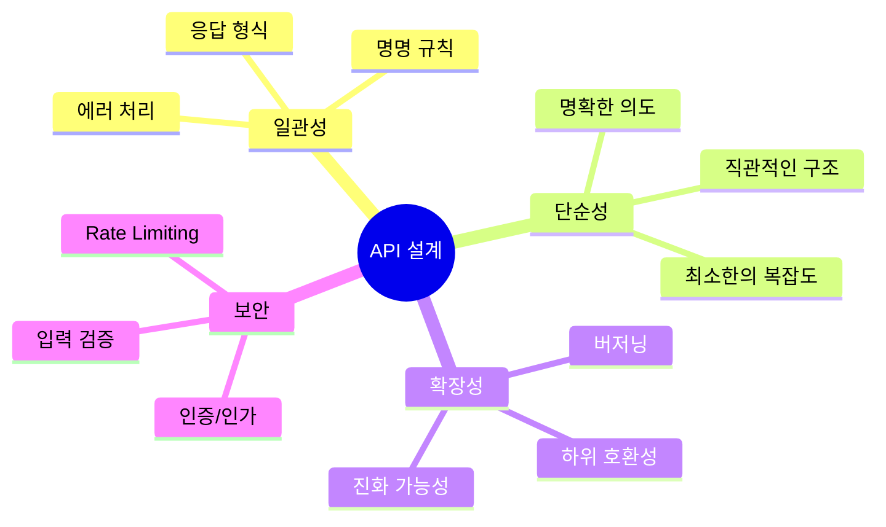

# API 설계 원칙 및 고급 패턴

## 개요

API 설계는 클라이언트와 서버 간의 계약을 정의하는 중요한 작업입니다. 잘 설계된 API는 사용하기 쉽고, 확장 가능하며, 유지보수가 용이합니다.

### API 설계의 핵심 원칙



### API 설계 계층


## RESTful API 고급 패턴

### 리소스 중심 설계

```mermaid
graph LR
    A[리소스] --> B[명사 사용]
    A --> C[계층 구조]
    A --> D[복수형]
    
    B --> E[/users]
    C --> F[/users/123/posts]
    D --> G[/users, /posts]
    
    style A fill:#4fc3f7
    style B fill:#66bb6a
    style C fill:#ff9800
    style D fill:#9c27b0
```

#### 좋은 리소스 설계

```javascript
// 좋은 예시
GET    /users              // 사용자 목록
GET    /users/:id          // 특정 사용자
POST   /users              // 사용자 생성
PUT    /users/:id          // 사용자 전체 업데이트
PATCH  /users/:id          // 사용자 부분 업데이트
DELETE /users/:id          // 사용자 삭제

GET    /users/:id/posts    // 사용자의 게시글 목록
POST   /users/:id/posts    // 사용자의 게시글 생성

// 나쁜 예시
GET    /getUsers           // 동사 사용
POST   /createUser         // 동사 사용
GET    /user/:id/posts     // 단수형 사용
POST   /users/:id/createPost // 동사 사용
```

### HTTP 메서드 활용

| 메서드 | 의미 | 멱등성 | 안전성 | 사용 예시 |
|--------|------|--------|--------|----------|
| **GET** | 조회 | 권장 | 권장 | 리소스 조회 |
| **POST** | 생성 | 비권장 | 비권장 | 새 리소스 생성 |
| **PUT** | 전체 업데이트 | 권장 | 비권장 | 리소스 전체 교체 |
| **PATCH** | 부분 업데이트 | 비권장 | 비권장 | 리소스 일부 수정 |
| **DELETE** | 삭제 | 권장 | 비권장 | 리소스 삭제 |

### 상태 코드 활용


#### 상태 코드 사용

```javascript
// 성공 응답
app.get('/users/:id', async (req, res) => {
  const user = await db.users.findById(req.params.id);
  
  if (!user) {
    return res.status(404).json({
      error: {
        code: 'USER_NOT_FOUND',
        message: 'User not found'
      }
    });
  }
  
  res.status(200).json(user);
});

app.post('/users', async (req, res) => {
  const user = await db.users.create(req.body);
  res.status(201).json({
    data: user,
    message: 'User created successfully'
  });
});

app.put('/users/:id', async (req, res) => {
  const user = await db.users.update(req.params.id, req.body);
  res.status(200).json(user);
});

app.delete('/users/:id', async (req, res) => {
  await db.users.delete(req.params.id);
  res.status(204).send(); // No Content
});

// 에러 응답
app.post('/users', async (req, res) => {
  try {
    const existingUser = await db.users.findByEmail(req.body.email);
    if (existingUser) {
      return res.status(409).json({
        error: {
          code: 'EMAIL_ALREADY_EXISTS',
          message: 'Email already registered'
        }
      });
    }
    
    const user = await db.users.create(req.body);
    res.status(201).json(user);
  } catch (error) {
    if (error.name === 'ValidationError') {
      return res.status(400).json({
        error: {
          code: 'VALIDATION_ERROR',
          message: 'Invalid input',
          details: error.details
        }
      });
    }
    
    res.status(500).json({
      error: {
        code: 'INTERNAL_ERROR',
        message: 'Internal server error'
      }
    });
  }
});
```

## API 버저닝

### 버저닝 방법 비교

API 버저닝은 여러 방법으로 구현할 수 있으며, 각 방법은 장단점이 있습니다. 다음 다이어그램은 주요 버저닝 방법을 비교합니다.

```mermaid
graph TB
    subgraph "버저닝 방법"
        URL[URL 버저닝]
        HEADER[Header 버저닝]
        CONTENT[Content Negotiation]
    end
    
    subgraph "URL 버저닝"
        U1[/api/v1/users]
        U2[/api/v2/users]
        U3[명확하고 직관적]
        U4[캐싱 용이]
        U5[URL 변경 필요]
    end
    
    subgraph "Header 버저닝"
        H1[API-Version: 1]
        H2[api-version 헤더]
        H3[URL 유지]
        H4[클라이언트 설정 필요]
    end
    
    subgraph "Content Negotiation"
        C1[Accept: application/vnd.api.v1+json]
        C2[표준 방식]
        C3[복잡도 증가]
    end
    
    URL --> U1
    URL --> U2
    URL --> U3
    URL --> U4
    URL --> U5
    
    HEADER --> H1
    HEADER --> H2
    HEADER --> H3
    HEADER --> H4
    
    CONTENT --> C1
    CONTENT --> C2
    CONTENT --> C3
    
    style URL fill:#4fc3f7
    style HEADER fill:#66bb6a
    style CONTENT fill:#ff9800
```

### 버저닝 방법 선택

각 버저닝 방법의 특징을 비교하여 적절한 방법을 선택할 수 있습니다:


### 버저닝 방법 비교표

| 기준 | URL 버저닝 | Header 버저닝 | Content Negotiation |
|------|-----------|--------------|-------------------|
| **명확성** | ⭐⭐⭐⭐⭐ | ⭐⭐⭐ | ⭐⭐⭐⭐ |
| **캐싱** | ⭐⭐⭐⭐⭐ | ⭐⭐⭐ | ⭐⭐⭐ |
| **구현 복잡도** | ⭐⭐⭐⭐ | ⭐⭐⭐⭐ | ⭐⭐ |
| **표준 준수** | ⭐⭐⭐ | ⭐⭐⭐ | ⭐⭐⭐⭐⭐ |
| **클라이언트 호환성** | ⭐⭐⭐⭐⭐ | ⭐⭐⭐ | ⭐⭐⭐ |
| **URL 유지** | 비권장 | 권장 | 권장 |
| **적용 시나리오** | 대규모 변경 | 점진적 변경 | 미디어 타입 변경 |

#### 비교표

| 방법 | 장점 | 단점 | 사용 사례 |
|------|------|------|----------|
| **URL 버저닝** | 명확함, 캐싱 용이 | URL 변경 필요 | 대규모 변경 |
| **Header 버저닝** | URL 유지 | 클라이언트 설정 필요 | 점진적 변경 |
| **Content Negotiation** | 표준 방식 | 복잡도 증가 | 미디어 타입 변경 |

### URL 버저닝 구현

```javascript
// Express 라우터 버저닝
const express = require('express');
const v1Router = require('./routes/v1');
const v2Router = require('./routes/v2');

const app = express();

// 버전별 라우터
app.use('/api/v1', v1Router);
app.use('/api/v2', v2Router);

// 기본 버전 (최신)
app.use('/api', v2Router);

// v1 라우터
// routes/v1/users.js
const express = require('express');
const router = express.Router();

router.get('/users', async (req, res) => {
  const users = await db.users.findAll();
  // v1 응답 형식
  res.json({
    users: users,
    count: users.length
  });
});

module.exports = router;

// v2 라우터
// routes/v2/users.js
const express = require('express');
const router = express.Router();

router.get('/users', async (req, res) => {
  const users = await db.users.findAll();
  // v2 응답 형식 (개선됨)
  res.json({
    data: users,
    meta: {
      count: users.length,
      page: 1,
      totalPages: 1
    }
  });
});

module.exports = router;
```

### Header 버저닝 구현

```javascript
// 버전 미들웨어
function versionMiddleware(req, res, next) {
  const version = req.headers['api-version'] || 'latest';
  req.apiVersion = version;
  next();
}

app.use(versionMiddleware);

app.get('/api/users', async (req, res) => {
  const users = await db.users.findAll();
  
  if (req.apiVersion === 'v1') {
    return res.json({
      users: users,
      count: users.length
    });
  }
  
  // 최신 버전 (v2)
  res.json({
    data: users,
    meta: {
      count: users.length,
      page: 1,
      totalPages: 1
    }
  });
});
```

### Content Negotiation 버저닝

```javascript
// Accept 헤더 기반 버저닝
function contentNegotiationMiddleware(req, res, next) {
  const accept = req.headers.accept || 'application/json';
  
  // application/vnd.api.v1+json 형식 파싱
  const versionMatch = accept.match(/vnd\.api\.v(\d+)/);
  if (versionMatch) {
    req.apiVersion = `v${versionMatch[1]}`;
  } else {
    req.apiVersion = 'latest';
  }
  
  next();
}

app.use(contentNegotiationMiddleware);

app.get('/api/users', async (req, res) => {
  const users = await db.users.findAll();
  
  if (req.apiVersion === 'v1') {
    res.setHeader('Content-Type', 'application/vnd.api.v1+json');
    return res.json({
      users: users,
      count: users.length
    });
  }
  
  res.setHeader('Content-Type', 'application/vnd.api.v2+json');
  res.json({
    data: users,
    meta: {
      count: users.length
    }
  });
});
```

## API 문서화 (OpenAPI/Swagger)

### Swagger 설정

```javascript
const swaggerJsdoc = require('swagger-jsdoc');
const swaggerUi = require('swagger-ui-express');

const swaggerOptions = {
  definition: {
    openapi: '3.0.0',
    info: {
      title: 'API Documentation',
      version: '1.0.0',
      description: 'API Documentation with Swagger',
      contact: {
        name: 'API Support',
        email: 'support@example.com'
      }
    },
    servers: [
      {
        url: 'http://localhost:3000',
        description: 'Development server'
      },
      {
        url: 'https://api.example.com',
        description: 'Production server'
      }
    ],
    components: {
      securitySchemes: {
        bearerAuth: {
          type: 'http',
          scheme: 'bearer',
          bearerFormat: 'JWT'
        }
      }
    }
  },
  apis: ['./routes/**/*.js'] // API 경로
};

const swaggerSpec = swaggerJsdoc(swaggerOptions);

app.use('/api-docs', swaggerUi.serve, swaggerUi.setup(swaggerSpec));
```

### API 엔드포인트 문서화

```javascript
/**
 * @swagger
 * /users:
 *   get:
 *     summary: 사용자 목록 조회
 *     tags: [Users]
 *     parameters:
 *       - in: query
 *         name: page
 *         schema:
 *           type: integer
 *           default: 1
 *         description: 페이지 번호
 *       - in: query
 *         name: limit
 *         schema:
 *           type: integer
 *           default: 10
 *         description: 페이지당 항목 수
 *     responses:
 *       200:
 *         description: 성공
 *         content:
 *           application/json:
 *             schema:
 *               type: object
 *               properties:
 *                 data:
 *                   type: array
 *                   items:
 *                     $ref: '#/components/schemas/User'
 *                 meta:
 *                   type: object
 *                   properties:
 *                     page:
 *                       type: integer
 *                     totalPages:
 *                       type: integer
 */
router.get('/users', async (req, res) => {
  const { page = 1, limit = 10 } = req.query;
  const users = await db.users.findAll({
    limit: parseInt(limit),
    offset: (parseInt(page) - 1) * parseInt(limit)
  });
  
  res.json({
    data: users,
    meta: {
      page: parseInt(page),
      limit: parseInt(limit),
      totalPages: Math.ceil(users.length / limit)
    }
  });
});

/**
 * @swagger
 * /users:
 *   post:
 *     summary: 사용자 생성
 *     tags: [Users]
 *     security:
 *       - bearerAuth: []
 *     requestBody:
 *       required: true
 *       content:
 *         application/json:
 *           schema:
 *             $ref: '#/components/schemas/CreateUser'
 *     responses:
 *       201:
 *         description: 사용자 생성 성공
 *         content:
 *           application/json:
 *             schema:
 *               $ref: '#/components/schemas/User'
 *       400:
 *         description: 잘못된 요청
 *       409:
 *         description: 이메일 중복
 */
router.post('/users', authenticateToken, async (req, res) => {
  // ...
});

/**
 * @swagger
 * components:
 *   schemas:
 *     User:
 *       type: object
 *       required:
 *         - id
 *         - name
 *         - email
 *       properties:
 *         id:
 *           type: string
 *           format: uuid
 *         name:
 *           type: string
 *         email:
 *           type: string
 *           format: email
 *         createdAt:
 *           type: string
 *           format: date-time
 *     CreateUser:
 *       type: object
 *       required:
 *         - name
 *         - email
 *         - password
 *       properties:
 *         name:
 *           type: string
 *         email:
 *           type: string
 *           format: email
 *         password:
 *           type: string
 *           format: password
 */
```

## 하위 호환성 유지

### 하위 호환성 원칙


### 하위 호환성 유지 방법

하위 호환성을 유지하는 것은 기존 클라이언트가 계속 작동하도록 보장하는 핵심 원칙입니다.

**하위 호환성 유지 전략:**


**하위 호환성 유지 원칙:**

**호환 가능한 변경:**
- **선택적 필드 추가**: 기존 클라이언트는 무시하고 새 클라이언트만 사용
- **새 엔드포인트 추가**: 기존 엔드포인트에 영향 없음
- **선택적 쿼리 파라미터**: 기본값을 제공하여 생략 가능
- **응답 필드 순서**: JSON은 순서에 무관하므로 변경 가능

**비호환 변경 (새 버전 필요):**
- **필수 필드 추가**: 기존 클라이언트가 필드를 제공하지 않으면 실패
- **필드 제거**: 기존 클라이언트가 의존하는 필드 제거 불가
- **필드 타입 변경**: 기존 클라이언트의 파싱 로직이 깨짐
- **엔드포인트 제거**: 기존 클라이언트가 사용 중이면 제거 불가

**응답 버전별 구성 전략:**

버전별로 응답을 구성할 때는 기본 응답에 버전에 따라 추가 필드를 포함하는 방식이 효과적입니다:

- **v1 응답**: 기본 필드만 포함 (id, name, email)
- **v2 응답**: 기본 필드 + 선택적 필드 (phone, profile)
- **v3 응답**: 기본 필드 + 선택적 필드 + 추가 필드 (preferences)

이렇게 하면 각 버전의 클라이언트가 필요한 정보만 받을 수 있으며, 하위 호환성이 유지됩니다.

**Deprecation 전략:**

API 버전을 단계적으로 폐기할 때는 다음 HTTP 헤더를 사용합니다:

- **Deprecation**: `true`로 설정하여 해당 버전이 폐기 예정임을 알림
- **Sunset**: 폐기 예정 날짜를 명시 (RFC 8594 표준, 예: `Sat, 31 Dec 2025 23:59:59 GMT`)
- **Link**: 새 버전으로의 마이그레이션 가이드 제공 (예: `</api/v2/users>; rel="successor-version"`)

**실무 운영 전략:**
- 최소 6개월 이상의 Deprecation 기간을 제공합니다
- 클라이언트 사용 현황을 모니터링하여 마이그레이션을 추진합니다
- 문서와 알림을 통해 클라이언트에게 충분히 공지합니다
- Deprecation 기간 동안 두 버전을 모두 유지하여 점진적 마이그레이션을 지원합니다

## API 게이트웨이 패턴

### API 게이트웨이 아키텍처

API 게이트웨이는 클라이언트와 백엔드 서비스 사이의 단일 진입점 역할을 합니다. 다음 다이어그램은 API 게이트웨이의 전체 아키텍처를 보여줍니다.


### API 게이트웨이 요청 처리 흐름

클라이언트 요청이 API 게이트웨이를 거쳐 백엔드 서비스까지 도달하는 전체 흐름:

```mermaid
sequenceDiagram
    participant C as 클라이언트
    participant GW as API Gateway
    participant AUTH as 인증 서비스
    participant RATE as Rate Limiter
    participant CACHE as 캐시
    participant SVC as 백엔드 서비스
    
    C->>GW: 요청
    activate GW
    
    GW->>AUTH: 인증 확인
    AUTH-->>GW: 인증 결과
    
    alt 인증 실패
        GW-->>C: 401 Unauthorized
        deactivate GW
    else 인증 성공
        GW->>RATE: Rate Limit 체크
        RATE-->>GW: 허용/거부
        
        alt Rate Limit 초과
            GW-->>C: 429 Too Many Requests
            deactivate GW
        else Rate Limit 통과
            GW->>CACHE: 캐시 확인
            
            alt 캐시 히트
                CACHE-->>GW: 캐시된 응답
                GW-->>C: 응답 반환
                deactivate GW
            else 캐시 미스
                GW->>SVC: 백엔드 요청
                SVC-->>GW: 응답
                GW->>CACHE: 응답 캐싱
                GW-->>C: 응답 반환
                deactivate GW
            end
        end
    end
```

### API 게이트웨이 기능 계층

API 게이트웨이는 여러 계층의 기능을 제공합니다:


### API 게이트웨이 구현 전략

API 게이트웨이를 구현할 때는 여러 계층의 기능을 체계적으로 구성해야 합니다.

**게이트웨이 기능 계층 구조:**


**구현 전략:**

**1. 보안 계층 (최우선):**
- 인증/인가를 가장 먼저 수행하여 무단 접근을 차단합니다
- JWT 토큰 검증, API 키 확인 등을 수행합니다
- 입력 검증을 통해 악의적인 요청을 필터링합니다

**2. 제어 계층:**
- Rate Limiting으로 API 남용을 방지합니다
- Throttling으로 리소스 사용을 제한합니다
- Circuit Breaker로 장애 서비스로의 요청을 차단합니다

**3. 변환 계층:**
- 요청을 백엔드 서비스 형식에 맞게 변환합니다
- 응답을 클라이언트 형식에 맞게 변환합니다
- 프로토콜 변환 (HTTP → gRPC 등)을 수행합니다

**4. 관찰 계층:**
- 모든 요청을 로깅하여 감사 추적을 가능하게 합니다
- 메트릭을 수집하여 성능을 모니터링합니다
- 분산 추적을 통해 요청 흐름을 추적합니다

**5. 최적화 계층:**
- 캐싱을 통해 응답 시간을 단축합니다
- 응답 압축을 통해 대역폭을 절약합니다
- 요청 배치 처리를 통해 효율성을 높입니다

**6. 라우팅 계층:**
- 요청을 적절한 백엔드 서비스로 라우팅합니다
- 로드 밸런싱을 통해 부하를 분산합니다
- 서비스 장애 시 자동으로 다른 인스턴스로 라우팅합니다

**실무 운영 고려사항:**
- 각 계층의 실행 순서가 성능에 영향을 미치므로 최적화가 필요합니다
- 게이트웨이 자체가 단일 장애점이 되지 않도록 고가용성 구성을 합니다
- 게이트웨이의 성능 병목을 모니터링하고 최적화합니다

## API 계약 설계

### API 계약 정의


### 계약 검증 전략

API 계약 검증은 요청과 응답이 정의된 스키마를 준수하는지 확인하는 과정입니다. 이를 통해 클라이언트와 서버 간의 불일치를 조기에 발견할 수 있습니다.

**계약 검증 프로세스:**


**요청 계약 검증:**

**검증 항목:**
- **필수 필드 존재 여부**: 필수 필드가 모두 포함되었는지 확인
- **데이터 타입**: 각 필드의 타입이 스키마와 일치하는지 확인
- **데이터 형식**: 이메일, URL, UUID 등 형식 검증
- **값 범위**: 숫자의 최소/최대값, 문자열의 길이 등 확인

**에러 응답 형식:**
- **에러 코드**: `VALIDATION_ERROR`와 같은 명확한 코드
- **에러 메시지**: 사용자 친화적인 메시지
- **상세 정보**: 각 필드별 검증 실패 이유

**응답 계약 검증:**

**검증 시점:**
- 개발 환경에서만 활성화하여 성능 오버헤드를 방지합니다
- 프로덕션에서는 비활성화하거나 샘플링 방식으로 검증합니다

**검증 목적:**
- API 변경 시 응답 형식이 깨졌는지 조기에 발견
- 문서와 실제 구현의 일치 여부 확인
- 클라이언트 개발자에게 정확한 응답 형식 제공

**실무 활용 팁:**
- Joi, Yup, Zod 등의 스키마 검증 라이브러리를 활용합니다
- 검증 실패 시 명확한 에러 메시지를 제공합니다
- 프로덕션에서는 요청 검증만 수행하고 응답 검증은 개발 환경에서만 사용합니다

## 실전 예제: 완전한 API 설계

실무에서 API를 설계할 때는 여러 개념을 통합하여 구성합니다. 다음은 주요 구성 요소를 통합한 아키텍처입니다.

**통합 API 아키텍처:**


**주요 구성 요소 통합 전략:**

**1. API 문서화 (Swagger/OpenAPI):**
- OpenAPI 3.0 스펙을 사용하여 표준화된 문서를 작성합니다
- 코드에서 자동으로 문서를 생성하도록 설정합니다
- `/api-docs` 엔드포인트를 통해 접근 가능하도록 구성합니다

**2. 버전 관리:**
- URL 기반 버전 관리 (`/api/v1`, `/api/v2`)를 구현합니다
- 기본 경로(`/api`)는 최신 버전으로 라우팅합니다
- 각 버전별로 독립적인 라우터를 구성합니다

**3. 인증/인가:**
- JWT 토큰 기반 인증을 구현합니다
- 토큰 검증 실패 시 401 Unauthorized를 반환합니다
- 인증된 사용자 정보를 요청 객체에 추가합니다

**4. Rate Limiting:**
- IP 기반과 사용자 기반 Rate Limiting을 모두 구현합니다
- Redis를 사용하여 분산 환경에서도 동작하도록 구성합니다
- Rate Limit 초과 시 429 Too Many Requests를 반환합니다

**5. 계약 검증:**
- 요청 스키마 검증을 통해 잘못된 요청을 조기에 차단합니다
- 개발 환경에서만 응답 검증을 수행하여 성능 오버헤드를 방지합니다

**6. 에러 핸들링:**
- 일관된 에러 응답 형식을 사용합니다
- 에러 코드와 메시지를 명확히 제공합니다
- 개발 환경에서만 스택 트레이스를 포함합니다

**실무 운영 고려사항:**
- 각 미들웨어의 실행 순서가 중요하므로 신중하게 구성합니다
- 프로덕션 환경에서는 성능 오버헤드를 최소화합니다
- 모니터링과 로깅을 통해 API 사용 패턴을 분석합니다

## 프로덕션 환경에서의 API 설계 경험

### 실제 성능 메트릭과 최적화

프로덕션 환경에서 API 설계는 성능, 확장성, 유지보수성에 직접적인 영향을 미칩니다.

**1. 응답 시간 최적화**

실제 프로덕션 환경에서 측정된 데이터:

**페이징 최적화 효과:**
- 페이징 미사용: 평균 응답 시간 800ms, 데이터베이스 쿼리 시간 600ms
- 페이징 사용 (페이지당 20개): 평균 응답 시간 150ms, 데이터베이스 쿼리 시간 50ms
- 성능 개선: 응답 시간 81% 단축, 데이터베이스 부하 92% 감소

**필드 선택 최적화:**
```javascript
// 나쁜 예시: 모든 필드 조회
GET /api/users/123
// 응답 크기: 5KB, 응답 시간: 100ms

// 좋은 예시: 필요한 필드만 조회
GET /api/users/123?fields=id,name,email
// 응답 크기: 0.5KB, 응답 시간: 20ms
// 성능 개선: 응답 크기 90% 감소, 응답 시간 80% 단축
```

**2. 실제 트러블슈팅 사례**

**사례 1: N+1 쿼리 문제**

**문제:**
- 사용자 목록 조회 시 각 사용자의 게시글도 함께 조회
- 사용자 100명 조회 시 쿼리 101번 실행 (1번 + 100번)
- 응답 시간 2초 이상

**원인:**
```javascript
// 나쁜 예시: N+1 쿼리 문제
app.get('/users', async (req, res) => {
    const users = await db.users.findAll(); // 1번 쿼리
    
    for (const user of users) {
        user.posts = await db.posts.findByUserId(user.id); // N번 쿼리
    }
    
    res.json(users);
});
```

**해결:**
```javascript
// 좋은 예시: JOIN 또는 Eager Loading 사용
app.get('/users', async (req, res) => {
    const users = await db.users.findAll({
        include: [{
            model: db.posts,
            as: 'posts'
        }]
    }); // 1번 쿼리로 해결
    
    res.json(users);
});

// 또는 별도 엔드포인트 제공
app.get('/users', async (req, res) => {
    const users = await db.users.findAll();
    res.json(users);
});

app.get('/users/:id/posts', async (req, res) => {
    const posts = await db.posts.findByUserId(req.params.id);
    res.json(posts);
});
```

**결과:**
- 쿼리 수: 101번 → 1번 (99% 감소)
- 응답 시간: 2초 → 150ms (92% 개선)
- 데이터베이스 부하: 90% 감소

**사례 2: API 버저닝 전략 실패**

**문제:**
- API v1에서 v2로 마이그레이션 중
- 일부 클라이언트가 여전히 v1 사용
- v1과 v2가 동시에 운영되면서 인프라 비용 증가

**원인:**
- 하위 호환성 없는 변경사항을 v1에 적용
- 클라이언트 마이그레이션 기간이 예상보다 길어짐

**해결:**
```javascript
// 좋은 예시: 점진적 마이그레이션
// 1. v1과 v2를 동시에 지원 (6개월)
app.use('/api/v1', v1Router);
app.use('/api/v2', v2Router);

// 2. v1 사용자에게 마이그레이션 안내
app.use('/api/v1', (req, res, next) => {
    res.setHeader('X-API-Deprecated', 'true');
    res.setHeader('X-API-Sunset', '2024-12-31');
    res.setHeader('X-API-Migration', '/api/v2');
    next();
});

// 3. v1 사용자 모니터링
const v1Usage = {
    total: 0,
    unique: new Set()
};

app.use('/api/v1', (req, res, next) => {
    v1Usage.total++;
    v1Usage.unique.add(req.headers['user-agent']);
    next();
});

// 4. v1 사용자가 5% 미만이 되면 v1 제거
if (v1Usage.unique.size < totalUsers * 0.05) {
    // v1 제거 프로세스 시작
}
```

**결과:**
- 마이그레이션 기간: 12개월 → 6개월 (50% 단축)
- 인프라 비용: 점진적 감소
- 클라이언트 불만: 최소화 (충분한 마이그레이션 시간 제공)

**3. 실제 성능 벤치마크**

**캐싱 전략 효과:**
- 캐시 미사용: API 응답 시간 200ms, 데이터베이스 쿼리 1000회/초
- 캐시 사용 (히트율 80%): API 응답 시간 50ms, 데이터베이스 쿼리 200회/초
- 성능 개선: 응답 시간 75% 단축, 데이터베이스 부하 80% 감소

**Rate Limiting 효과:**
- Rate Limiting 미사용: DDoS 공격 시 서버 다운, 평균 응답 시간 5초
- Rate Limiting 사용: DDoS 공격 차단, 평균 응답 시간 200ms 유지
- 보안 강화: 공격 차단률 99%, 정상 사용자 영향 없음

**4. API 모니터링 및 알림**

프로덕션 환경에서 API를 모니터링해야 할 주요 메트릭:

```javascript
// API 메트릭 수집
const apiMetrics = {
    // 응답 시간
    responseTime: {
        p50: 100,  // 50% 요청이 100ms 이내
        p95: 300,  // 95% 요청이 300ms 이내
        p99: 500   // 99% 요청이 500ms 이내
    },
    
    // 처리량
    throughput: {
        rps: 1000,        // 초당 1000 요청
        peak: 5000,       // 최대 5000 요청
        average: 800      // 평균 800 요청
    },
    
    // 에러율
    errorRate: {
        total: 0.05,      // 전체 에러율 0.05%
        '4xx': 0.03,      // 클라이언트 에러 0.03%
        '5xx': 0.02       // 서버 에러 0.02%
    },
    
    // 엔드포인트별 메트릭
    endpoints: {
        '/api/users': {
            calls: 10000,
            avgTime: 120,
            errorRate: 0.01
        },
        '/api/posts': {
            calls: 5000,
            avgTime: 200,
            errorRate: 0.02
        }
    }
};

// 알림 설정
const alerts = {
    responseTime: {
        threshold: 500,  // 500ms 초과 시 알림
        action: 'scale'   // 자동 스케일링
    },
    errorRate: {
        threshold: 1.0,   // 1% 초과 시 알림
        action: 'alert'   // 팀에 알림
    },
    throughput: {
        threshold: 5000,  // 초당 5000 요청 초과 시 알림
        action: 'scale'  // 자동 스케일링
    }
};
```

**5. 실제 프로덕션 확인 사항**

API를 프로덕션에 배포하기 전 확인해야 할 항목:

**성능:**
- 응답 시간 P95가 300ms 이내
- 처리량이 예상 트래픽의 2배 이상
- 데이터베이스 쿼리가 최적화됨
- N+1 쿼리 문제 없음
- 적절한 인덱스 사용

**보안:**
- 인증/인가 구현됨
- Rate Limiting 설정됨
- 입력 검증 완료
- SQL Injection 방지
- XSS 방지

**안정성:**
- 에러 핸들링 구현됨
- 타임아웃 설정됨
- 재시도 로직 구현됨
- Circuit Breaker 패턴 적용
- Health Check 엔드포인트 제공

**모니터링:**
- 로깅 설정됨
- 메트릭 수집됨
- 알림 설정됨
- 대시보드 구성됨
- 트레이싱 설정됨

**문서화:**
- API 문서 최신 상태
- 예제 코드 제공
- 에러 코드 문서화
- 변경 이력 관리

## 요약
잘 설계된 API는 개발 생산성과 사용자 경험을 크게 향상시킵니다.

### 주요 내용

- **RESTful 원칙**: 리소스 중심 설계, HTTP 메서드 활용
- **버저닝**: URL, Header, Content Negotiation
- **API 문서화**: OpenAPI/Swagger로 자동 문서 생성
- **하위 호환성**: 기존 클라이언트 보호
- **API 게이트웨이**: 통합 인증, 라우팅, 모니터링

### 주의사항

1. **일관성 유지**: 명명 규칙, 응답 형식 통일
2. **버저닝**: 주요 변경 시 버전 관리
3. **문서화**: 항상 최신 상태 유지
4. **에러 처리**: 일관된 에러 응답 형식
5. **성능 고려**: 적절한 페이징, 필터링, 정렬

### 관련 문서

- [GraphQL](./GraphQL.md) - GraphQL과 RESTful API 비교
- [Rate Limiting](./Rate_Limiting.md) - API 보호 및 제한
- [JWT 구현 및 보안](../인증/JWT_구현_및_보안.md) - API 인증 구현
- [에러 핸들링](../에러_핸들링/에러_핸들링_전략.md) - API 에러 처리
- [캐싱 전략](../캐싱/캐싱_전략.md) - API 응답 캐싱

