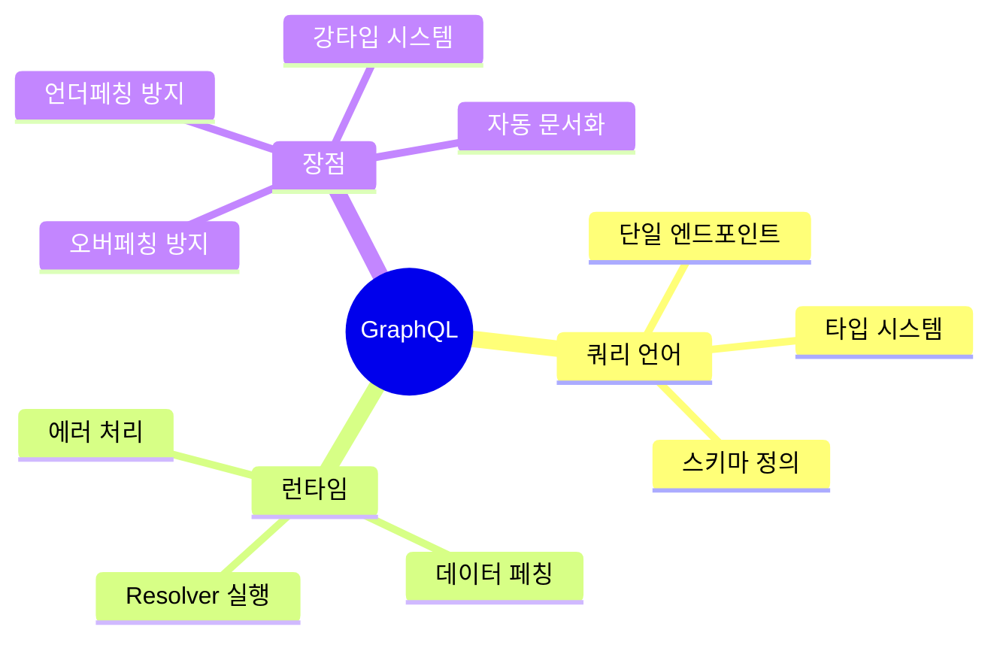
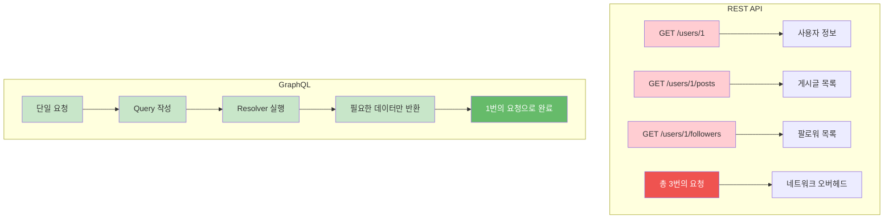
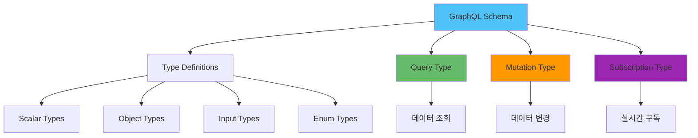
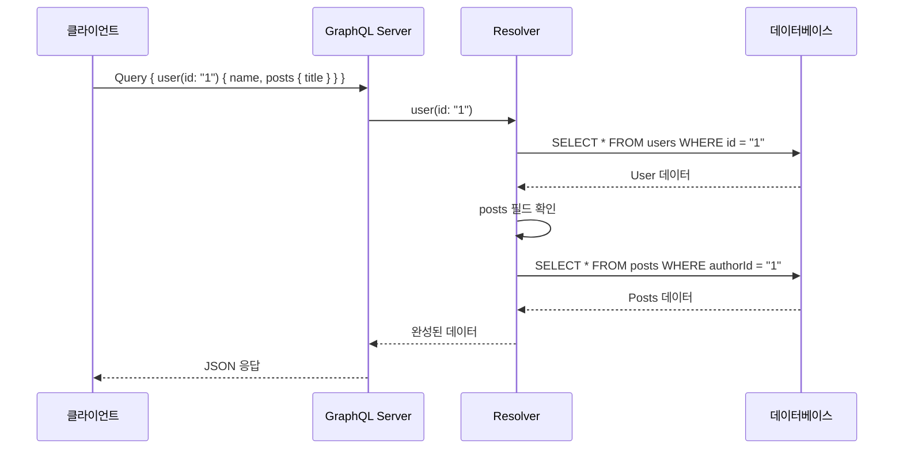
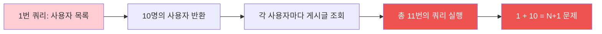
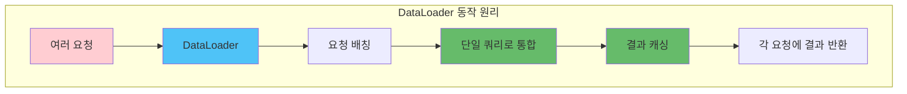
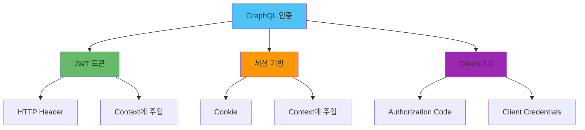
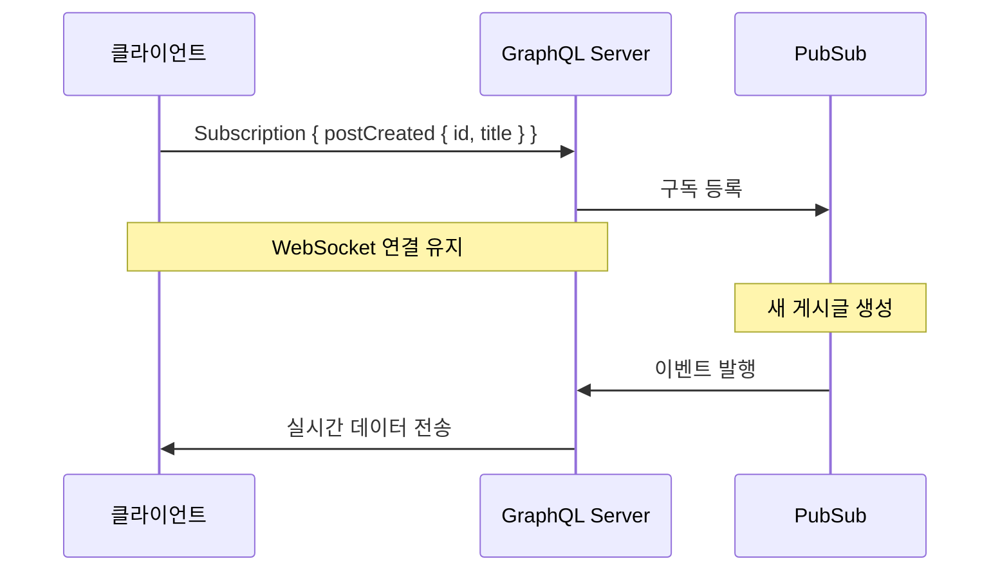
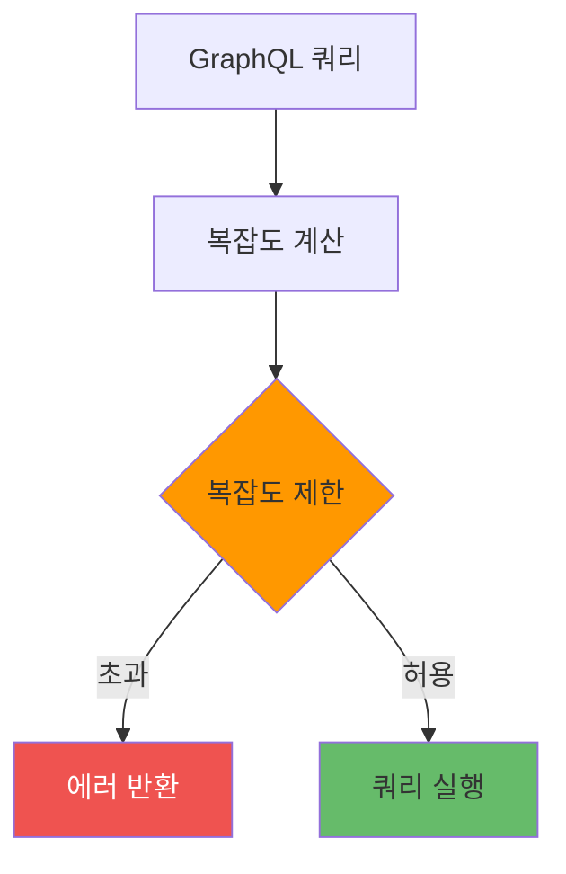

# GraphQL 상세

## 개요

GraphQL은 Facebook에서 개발한 쿼리 언어이자 런타임으로, 클라이언트가 필요한 데이터를 정확히 요청할 수 있게 해주는 API 아키텍처입니다.

### GraphQL의 핵심 개념



### GraphQL vs REST 비교



#### 상세 비교표

| 항목 | REST | GraphQL |
|------|------|---------|
| **엔드포인트** | 여러 개 (리소스별) | 단일 엔드포인트 |
| **데이터 페칭** | 고정된 응답 구조 | 클라이언트가 필드 선택 |
| **오버페칭** | 발생 가능 | 방지 가능 |
| **언더페칭** | 발생 가능 | 방지 가능 |
| **타입 시스템** | 없음 | 강력한 타입 시스템 |
| **문서화** | 별도 필요 (Swagger) | 자동 생성 (Introspection) |
| **캐싱** | HTTP 캐싱 활용 | 복잡함 |
| **에러 처리** | HTTP 상태 코드 | GraphQL 에러 형식 |

## GraphQL 구조

### Schema 정의

Schema는 GraphQL의 핵심으로, API에서 사용 가능한 모든 타입과 작업을 정의합니다.



#### 기본 Schema 예제

```graphql
# Scalar Types
type User {
  id: ID!
  name: String!
  email: String!
  age: Int
  posts: [Post!]!
  createdAt: DateTime!
}

type Post {
  id: ID!
  title: String!
  content: String!
  author: User!
  comments: [Comment!]!
  publishedAt: DateTime
}

# Query Type
type Query {
  user(id: ID!): User
  users(limit: Int, offset: Int): [User!]!
  post(id: ID!): Post
  posts(authorId: ID): [Post!]!
}

# Mutation Type
type Mutation {
  createUser(input: CreateUserInput!): User!
  updateUser(id: ID!, input: UpdateUserInput!): User!
  deleteUser(id: ID!): Boolean!
  createPost(input: CreatePostInput!): Post!
}

# Subscription Type
type Subscription {
  postCreated: Post!
  userUpdated(userId: ID!): User!
}

# Input Types
input CreateUserInput {
  name: String!
  email: String!
  age: Int
}

input UpdateUserInput {
  name: String
  email: String
  age: Int
}
```

### 2⃣ Type 시스템

#### Scalar Types

GraphQL의 기본 타입들:

| 타입 | 설명 | 예시 |
|------|------|------|
| `String` | 문자열 | `"Hello World"` |
| `Int` | 32비트 정수 | `42` |
| `Float` | 부동소수점 | `3.14` |
| `Boolean` | 불린 값 | `true`, `false` |
| `ID` | 고유 식별자 | `"user-123"` |

#### Custom Scalar Types

```graphql
scalar DateTime
scalar Email
scalar URL
scalar JSON

type User {
  id: ID!
  email: Email!
  website: URL
  metadata: JSON
  createdAt: DateTime!
}
```

#### Object Types

```graphql
type User {
  id: ID!
  name: String!
  email: String!
  profile: UserProfile
  posts: [Post!]!
}

type UserProfile {
  bio: String
  avatar: String
  location: String
}

type Post {
  id: ID!
  title: String!
  author: User!
}
```

### 3⃣ Resolver 패턴

Resolver는 GraphQL 쿼리를 실제 데이터로 변환하는 함수입니다.



#### Resolver 구현 예제 (Node.js)

```javascript
const resolvers = {
  Query: {
    user: async (parent, args, context) => {
      const { id } = args;
      return await context.db.users.findById(id);
    },
    users: async (parent, args, context) => {
      const { limit = 10, offset = 0 } = args;
      return await context.db.users.findAll({
        limit,
        offset
      });
    }
  },
  
  User: {
    posts: async (parent, args, context) => {
      // parent는 User 객체
      return await context.db.posts.findByAuthorId(parent.id);
    }
  },
  
  Mutation: {
    createUser: async (parent, args, context) => {
      const { input } = args;
      return await context.db.users.create(input);
    }
  }
};
```

## N+1 문제와 DataLoader

### N+1 문제란?



#### N+1 문제 예시

```javascript
// 나쁜 예시: 문제가 있는 Resolver
const resolvers = {
  Query: {
    users: async () => {
      // 1번의 쿼리
      return await db.users.findAll();
    }
  },
  
  User: {
    posts: async (parent) => {
      // 각 사용자마다 실행 (N번의 쿼리)
      return await db.posts.findByAuthorId(parent.id);
    }
  }
};

// 쿼리 실행 시:
// 1. SELECT * FROM users (1번)
// 2. SELECT * FROM posts WHERE authorId = 1 (1번)
// 3. SELECT * FROM posts WHERE authorId = 2 (1번)
// ... 총 11번의 쿼리!
```

### DataLoader로 해결

DataLoader는 배칭과 캐싱을 통해 N+1 문제를 해결합니다.



#### DataLoader 구현

```javascript
const DataLoader = require('dataloader');

// DataLoader 생성
const postLoader = new DataLoader(async (authorIds) => {
  // 배칭: 모든 authorId를 한 번에 조회
  const posts = await db.posts.findByAuthorIds(authorIds);
  
  // 결과를 authorId별로 그룹화
  const postsByAuthor = {};
  posts.forEach(post => {
    if (!postsByAuthor[post.authorId]) {
      postsByAuthor[post.authorId] = [];
    }
    postsByAuthor[post.authorId].push(post);
  });
  
  // 요청 순서대로 결과 반환
  return authorIds.map(id => postsByAuthor[id] || []);
});

// Resolver에서 사용
const resolvers = {
  User: {
    posts: async (parent, args, context) => {
      // DataLoader를 통해 배칭된 쿼리 실행
      return await context.loaders.posts.load(parent.id);
    }
  }
};
```

#### DataLoader의 장점

| 기능 | 설명 | 효과 |
|------|------|------|
| **배칭** | 여러 요청을 하나로 묶어 실행 | 쿼리 수 감소 |
| **캐싱** | 요청 결과를 메모리에 저장 | 중복 쿼리 방지 |
| **요청 순서 보장** | 입력 순서대로 결과 반환 | 데이터 일관성 |

## 인증/인가

### 인증 방법



#### JWT 기반 인증 구현

```javascript
// Context 생성
const createContext = async ({ req }) => {
  const token = req.headers.authorization?.replace('Bearer ', '');
  
  let user = null;
  if (token) {
    try {
      const decoded = jwt.verify(token, process.env.JWT_SECRET);
      user = await db.users.findById(decoded.userId);
    } catch (error) {
      // 토큰이 유효하지 않음
    }
  }
  
  return {
    db,
    user,
    loaders: {
      posts: postLoader
    }
  };
};

// 인증 미들웨어
const authenticated = (resolver) => {
  return async (parent, args, context) => {
    if (!context.user) {
      throw new AuthenticationError('인증이 필요합니다.');
    }
    return resolver(parent, args, context);
  };
};

// 사용 예시
const resolvers = {
  Query: {
    me: authenticated(async (parent, args, context) => {
      return context.user;
    })
  }
};
```

### 인가 (Authorization)

```javascript
// 역할 기반 인가
const requireRole = (roles) => {
  return (resolver) => {
    return async (parent, args, context) => {
      if (!context.user) {
        throw new AuthenticationError('인증이 필요합니다.');
      }
      
      if (!roles.includes(context.user.role)) {
        throw new ForbiddenError('권한이 없습니다.');
      }
      
      return resolver(parent, args, context);
    };
  };
};

// 사용 예시
const resolvers = {
  Mutation: {
    deleteUser: requireRole(['ADMIN'])(async (parent, args, context) => {
      return await context.db.users.delete(args.id);
    })
  }
};
```

## Subscriptions (실시간 구독)

### Subscriptions 개요



#### Subscriptions 구현

```javascript
const { PubSub } = require('graphql-subscriptions');
const pubsub = new PubSub();

const resolvers = {
  Subscription: {
    postCreated: {
      subscribe: () => pubsub.asyncIterator(['POST_CREATED'])
    },
    userUpdated: {
      subscribe: (parent, args) => {
        return pubsub.asyncIterator([`USER_UPDATED_${args.userId}`]);
      }
    }
  },
  
  Mutation: {
    createPost: async (parent, args, context) => {
      const post = await context.db.posts.create(args.input);
      
      // 이벤트 발행
      await pubsub.publish('POST_CREATED', {
        postCreated: post
      });
      
      return post;
    }
  }
};
```

### WebSocket 설정 (Apollo Server)

```javascript
const { ApolloServer } = require('apollo-server-express');
const { createServer } = require('http');
const express = require('express');

const app = express();
const httpServer = createServer(app);

const server = new ApolloServer({
  typeDefs,
  resolvers,
  subscriptions: {
    onConnect: (connectionParams) => {
      // WebSocket 연결 시 인증
      if (connectionParams.authToken) {
        return authenticate(connectionParams.authToken);
      }
      throw new Error('인증 토큰이 필요합니다.');
    }
  }
});

server.installSubscriptionHandlers(httpServer);
```

## 성능 최적화

### 1. 쿼리 복잡도 분석



#### 복잡도 제한 구현

```javascript
const { createComplexityLimitRule } = require('graphql-query-complexity');

const complexityLimit = createComplexityLimitRule(1000, {
  scalarCost: 1,
  objectCost: 2,
  listFactor: 10
});

const server = new ApolloServer({
  typeDefs,
  resolvers,
  validationRules: [complexityLimit]
});
```

### 2. 쿼리 깊이 제한

```javascript
const depthLimit = require('graphql-depth-limit');

const server = new ApolloServer({
  typeDefs,
  resolvers,
  validationRules: [depthLimit(5)] // 최대 깊이 5
});
```

### 3. 캐싱

```javascript
// HTTP 캐싱
const resolvers = {
  Query: {
    posts: async (parent, args, context) => {
      const posts = await context.db.posts.findAll();
      
      // Cache-Control 헤더 설정
      context.response.setHeader('Cache-Control', 'public, max-age=3600');
      
      return posts;
    }
  }
};

// DataLoader 캐싱 (자동)
const postLoader = new DataLoader(
  async (ids) => { /* ... */ },
  { cache: true } // 기본값
);
```

### 4. 페이징 최적화

```graphql
type Query {
  posts(
    first: Int
    after: String
    last: Int
    before: String
  ): PostConnection!
}

type PostConnection {
  edges: [PostEdge!]!
  pageInfo: PageInfo!
}

type PostEdge {
  node: Post!
  cursor: String!
}

type PageInfo {
  hasNextPage: Boolean!
  hasPreviousPage: Boolean!
  startCursor: String
  endCursor: String
}
```

## 보안 고려사항

### 1. Introspection 비활성화 (프로덕션)

```javascript
const server = new ApolloServer({
  typeDefs,
  resolvers,
  introspection: process.env.NODE_ENV !== 'production',
  playground: process.env.NODE_ENV !== 'production'
});
```

### 2. 쿼리 크기 제한

```javascript
const server = new ApolloServer({
  typeDefs,
  resolvers,
  context: ({ req }) => {
    // 쿼리 크기 제한 (예: 100KB)
    if (req.body.query && req.body.query.length > 100000) {
      throw new Error('쿼리가 너무 큽니다.');
    }
    return createContext({ req });
  }
});
```

### 3. Rate Limiting

```javascript
const rateLimit = require('express-rate-limit');

const limiter = rateLimit({
  windowMs: 15 * 60 * 1000, // 15분
  max: 100 // 최대 100회 요청
});

app.use('/graphql', limiter);
```

## 📚 실전 예제: 완전한 GraphQL 서버

```javascript
const { ApolloServer, gql } = require('apollo-server-express');
const express = require('express');
const DataLoader = require('dataloader');

// Schema 정의
const typeDefs = gql`
  type User {
    id: ID!
    name: String!
    email: String!
    posts: [Post!]!
  }
  
  type Post {
    id: ID!
    title: String!
    content: String!
    author: User!
  }
  
  type Query {
    user(id: ID!): User
    users: [User!]!
    post(id: ID!): Post
    posts: [Post!]!
  }
  
  type Mutation {
    createUser(input: CreateUserInput!): User!
    createPost(input: CreatePostInput!): Post!
  }
  
  input CreateUserInput {
    name: String!
    email: String!
  }
  
  input CreatePostInput {
    title: String!
    content: String!
    authorId: ID!
  }
`;

// DataLoader 생성
const createLoaders = (db) => ({
  posts: new DataLoader(async (authorIds) => {
    const posts = await db.posts.findByAuthorIds(authorIds);
    const postsByAuthor = {};
    posts.forEach(post => {
      if (!postsByAuthor[post.authorId]) {
        postsByAuthor[post.authorId] = [];
      }
      postsByAuthor[post.authorId].push(post);
    });
    return authorIds.map(id => postsByAuthor[id] || []);
  })
});

// Resolvers
const resolvers = {
  Query: {
    user: async (parent, args, context) => {
      return await context.db.users.findById(args.id);
    },
    users: async (parent, args, context) => {
      return await context.db.users.findAll();
    },
    post: async (parent, args, context) => {
      return await context.db.posts.findById(args.id);
    },
    posts: async (parent, args, context) => {
      return await context.db.posts.findAll();
    }
  },
  
  User: {
    posts: async (parent, args, context) => {
      return await context.loaders.posts.load(parent.id);
    }
  },
  
  Post: {
    author: async (parent, args, context) => {
      return await context.db.users.findById(parent.authorId);
    }
  },
  
  Mutation: {
    createUser: async (parent, args, context) => {
      return await context.db.users.create(args.input);
    },
    createPost: async (parent, args, context) => {
      return await context.db.posts.create(args.input);
    }
  }
};

// Context 생성
const createContext = async ({ req }) => {
  const db = getDatabase(); // 데이터베이스 연결
  const loaders = createLoaders(db);
  
  return {
    db,
    loaders
  };
};

// Apollo Server 생성
const server = new ApolloServer({
  typeDefs,
  resolvers,
  context: createContext,
  introspection: process.env.NODE_ENV !== 'production'
});

// Express 앱 설정
const app = express();
server.applyMiddleware({ app });

const PORT = process.env.PORT || 4000;
app.listen(PORT, () => {
  console.log(`🚀 GraphQL 서버가 http://localhost:${PORT}/graphql 에서 실행 중입니다.`);
});
```

## GraphQL 사용 시나리오

### GraphQL을 사용해야 하는 경우

- 클라이언트가 다양한 데이터 구조를 필요로 할 때
- 모바일 앱처럼 네트워크 사용량을 최소화해야 할 때
- 여러 백엔드 서비스를 통합해야 할 때
- 실시간 기능이 필요한 경우

### GraphQL을 사용하지 않는 것이 좋은 경우

- 단순한 CRUD API만 필요한 경우
- HTTP 캐싱이 중요한 경우
- 파일 업로드가 주된 기능인 경우
- 팀이 GraphQL에 익숙하지 않은 경우

## 요약
GraphQL은 현대적인 API 아키텍처로, 클라이언트의 요구사항에 맞춘 유연한 데이터 페칭을 제공합니다. N+1 문제 해결, 인증/인가, 실시간 구독 등의 기능을 올바르게 구현하면 강력하고 확장 가능한 API를 구축할 수 있습니다.

### 주요 내용

- **Schema First**: 명확한 타입 정의로 API 문서화
- **DataLoader 활용**: N+1 문제 해결 및 성능 최적화
- **보안 강화**: 인증/인가, 쿼리 복잡도 제한
- **실시간 기능**: Subscriptions으로 실시간 데이터 제공
- **성능 최적화**: 캐싱, 페이징, 쿼리 최적화

### 관련 문서

- [API 설계 원칙](./API_설계_원칙.md) - RESTful API와 GraphQL 비교, API 설계 원칙
- [JWT 구현 및 보안](../인증/JWT_구현_및_보안.md) - GraphQL 인증/인가 구현
- [Rate Limiting](./Rate_Limiting.md) - GraphQL 쿼리 제한 및 보호
- [캐싱](../캐싱/캐싱_전략.md) - GraphQL 응답 캐싱
- [WebSocket/Socket.io](../통신/WebSocket_SocketIO.md) - 실시간 통신 비교

