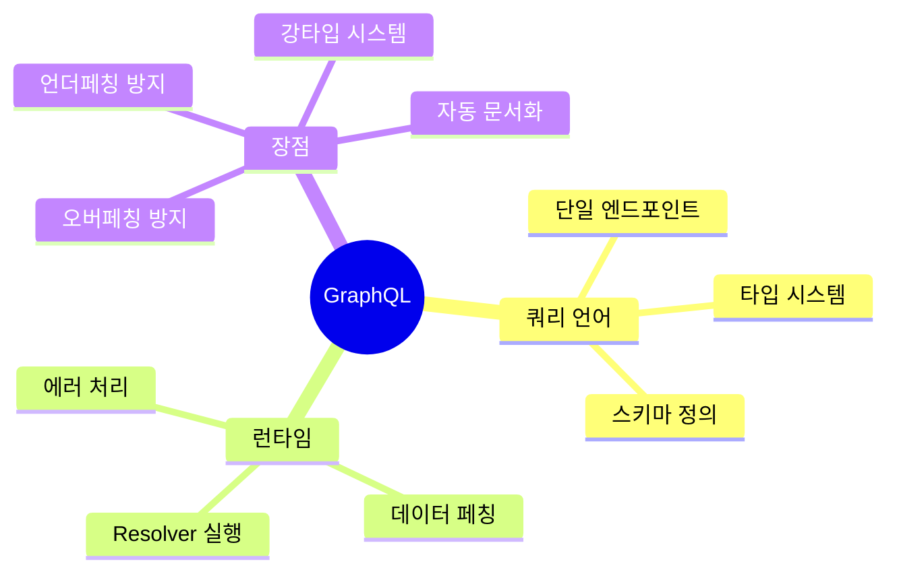
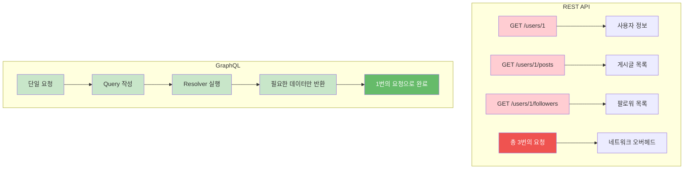
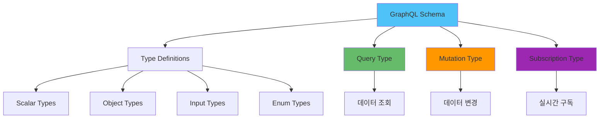
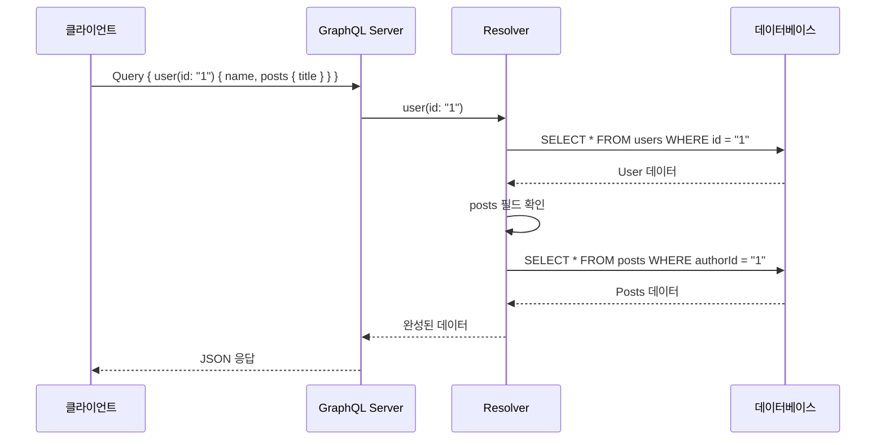
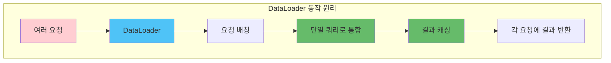
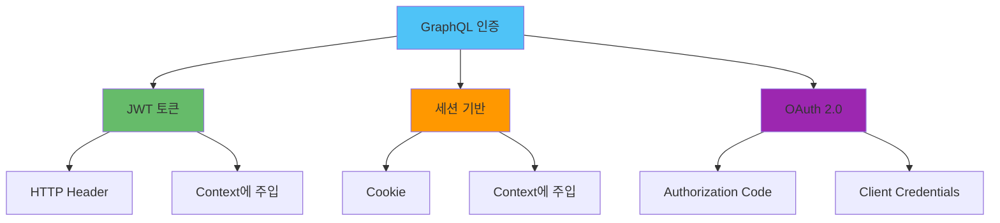
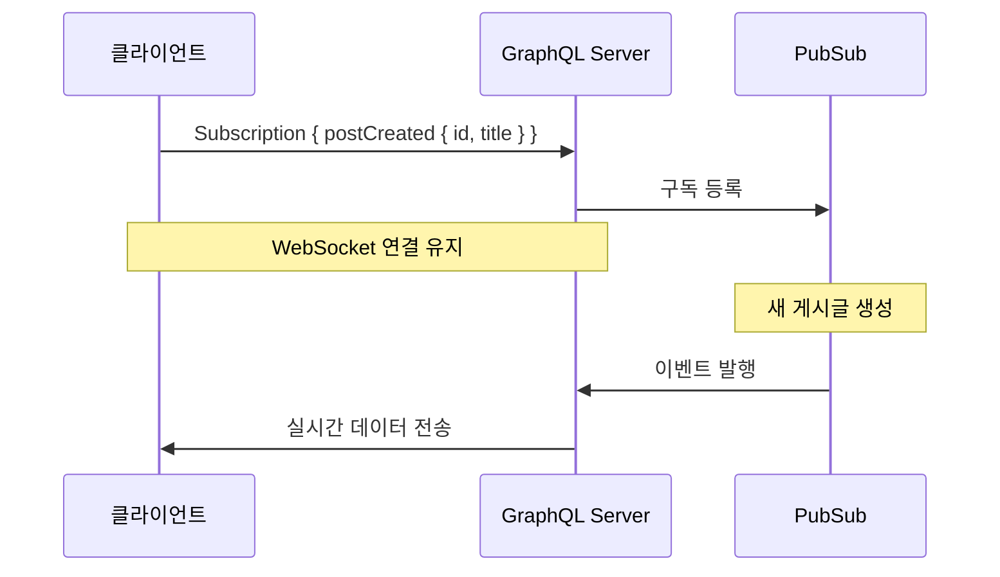
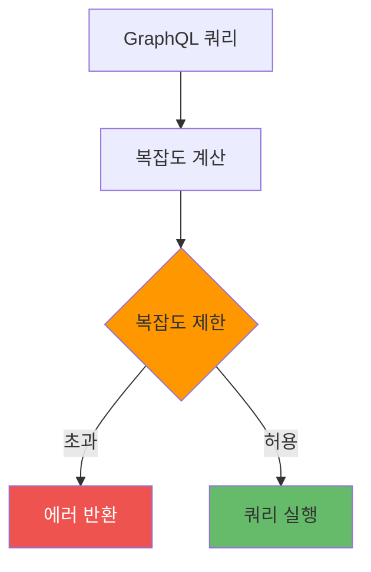

# GraphQL 상세

## 개요

GraphQL은 Facebook이 만든 쿼리 언어이자 런타임이다. 클라이언트가 필요한 데이터를 정확히 요청하는 API 아키텍처다.

### GraphQL의 핵심 개념


```mermaid
mindmap
  root((GraphQL))
    쿼리 언어
      단일 엔드포인트
      타입 시스템
      스키마 정의
    런타임
      Resolver 실행
      데이터 페칭
      에러 처리
    장점
      오버페칭 방지
      언더페칭 방지
      강타입 시스템
      자동 문서화
```

### GraphQL vs REST 비교


```mermaid
graph TB
    subgraph "REST API"
        R1[GET /users/1] --> R2[사용자 정보]
        R3[GET /users/1/posts] --> R4[게시글 목록]
        R5[GET /users/1/followers] --> R6[팔로워 목록]
        R7[총 3번의 요청] --> R8[네트워크 오버헤드]
    end
    
    subgraph "GraphQL"
        G1[단일 요청] --> G2[Query 작성]
        G2 --> G3[Resolver 실행]
        G3 --> G4[필요한 데이터만 반환]
        G4 --> G5[1번의 요청으로 완료]
    end
    
    style R1 fill:#ffcdd2
    style R3 fill:#ffcdd2
    style R5 fill:#ffcdd2
    style R7 fill:#ef5350,color:#fff
    
    style G1 fill:#c8e6c9
    style G2 fill:#c8e6c9
    style G3 fill:#c8e6c9
    style G4 fill:#c8e6c9
    style G5 fill:#66bb6a,color:#fff
```

#### 상세 비교표

| 항목 | REST | GraphQL |
|------|------|---------|
| **엔드포인트** | 여러 개 (리소스별) | 단일 엔드포인트 |
| **데이터 페칭** | 고정된 응답 구조 | 클라이언트가 필드 선택 |
| **오버페칭** | 발생 가능 | 방지 가능 |
| **언더페칭** | 발생 가능 | 방지 가능 |
| **타입 시스템** | 없음 | 강력한 타입 시스템 |
| **문서화** | 별도 필요 (Swagger) | 자동 생성 (Introspection) |
| **캐싱** | HTTP 캐싱 활용 | 복잡함 |
| **에러 처리** | HTTP 상태 코드 | GraphQL 에러 형식 |

## GraphQL 구조

### 1. Schema 정의

Schema는 GraphQL의 핵심이다. API에서 쓸 수 있는 모든 타입과 작업을 여기서 정의한다.


```mermaid
graph TD
    A[GraphQL Schema] --> B[Type Definitions]
    A --> C[Query Type]
    A --> D[Mutation Type]
    A --> E[Subscription Type]
    
    B --> F[Scalar Types]
    B --> G[Object Types]
    B --> H[Input Types]
    B --> I[Enum Types]
    
    C --> J[데이터 조회]
    D --> K[데이터 변경]
    E --> L[실시간 구독]
    
    style A fill:#4fc3f7
    style C fill:#66bb6a
    style D fill:#ff9800
    style E fill:#9c27b0
```

#### 기본 Schema 예제

```graphql
# Scalar Types
type User {
  id: ID!
  name: String!
  email: String!
  age: Int
  posts: [Post!]!
  createdAt: DateTime!
}

type Post {
  id: ID!
  title: String!
  content: String!
  author: User!
  comments: [Comment!]!
  publishedAt: DateTime
}

# Query Type
type Query {
  user(id: ID!): User
  users(limit: Int, offset: Int): [User!]!
  post(id: ID!): Post
  posts(authorId: ID): [Post!]!
}

# Mutation Type
type Mutation {
  createUser(input: CreateUserInput!): User!
  updateUser(id: ID!, input: UpdateUserInput!): User!
  deleteUser(id: ID!): Boolean!
  createPost(input: CreatePostInput!): Post!
}

# Subscription Type
type Subscription {
  postCreated: Post!
  userUpdated(userId: ID!): User!
}

# Input Types
input CreateUserInput {
  name: String!
  email: String!
  age: Int
}

input UpdateUserInput {
  name: String
  email: String
  age: Int
}
```

### 2. Type 시스템

#### Scalar Types

GraphQL의 기본 타입은 다음과 같다.

| 타입 | 설명 | 예시 |
|------|------|------|
| `String` | 문자열 | `"Hello World"` |
| `Int` | 32비트 정수 | `42` |
| `Float` | 부동소수점 | `3.14` |
| `Boolean` | 불린 값 | `true`, `false` |
| `ID` | 고유 식별자 | `"user-123"` |

#### Custom Scalar Types

```graphql
scalar DateTime
scalar Email
scalar URL
scalar JSON

type User {
  id: ID!
  email: Email!
  website: URL
  metadata: JSON
  createdAt: DateTime!
}
```

#### Object Types

```graphql
type User {
  id: ID!
  name: String!
  email: String!
  profile: UserProfile
  posts: [Post!]!
}

type UserProfile {
  bio: String
  avatar: String
  location: String
}

type Post {
  id: ID!
  title: String!
  author: User!
}
```

### 3. Resolver 패턴

Resolver는 GraphQL 쿼리를 실제 데이터로 바꾸는 함수다.


```mermaid
sequenceDiagram
    participant C as 클라이언트
    participant S as GraphQL Server
    participant R as Resolver
    participant DB as 데이터베이스
    
    C->>S: Query { user(id: "1") { name, posts { title } } }
    S->>R: user(id: "1")
    R->>DB: SELECT * FROM users WHERE id = "1"
    DB-->>R: User 데이터
    R->>R: posts 필드 확인
    R->>DB: SELECT * FROM posts WHERE authorId = "1"
    DB-->>R: Posts 데이터
    R-->>S: 완성된 데이터
    S-->>C: JSON 응답
```

#### Resolver 구현 예제 (Node.js)

```javascript
const resolvers = {
  Query: {
    user: async (parent, args, context) => {
      const { id } = args;
      return await context.db.users.findById(id);
    },
    users: async (parent, args, context) => {
      const { limit = 10, offset = 0 } = args;
      return await context.db.users.findAll({
        limit,
        offset
      });
    }
  },
  
  User: {
    posts: async (parent, args, context) => {
      // parent는 User 객체
      return await context.db.posts.findByAuthorId(parent.id);
    }
  },
  
  Mutation: {
    createUser: async (parent, args, context) => {
      const { input } = args;
      return await context.db.users.create(input);
    }
  }
};
```

## N+1 문제와 DataLoader

### N+1 문제란?


```mermaid
graph LR
    A[1번 쿼리: 사용자 목록] --> B[10명의 사용자 반환]
    B --> C[각 사용자마다 게시글 조회]
    C --> D[총 11번의 쿼리 실행]
    D --> E[1 + 10 = N+1 문제]
    
    style A fill:#ffcdd2
    style D fill:#ef5350,color:#fff
    style E fill:#ef5350,color:#fff
```

#### N+1 문제 예시

```javascript
// 나쁜 예시: 문제가 있는 Resolver
const resolvers = {
  Query: {
    users: async () => {
      // 1번의 쿼리
      return await db.users.findAll();
    }
  },
  
  User: {
    posts: async (parent) => {
      // 각 사용자마다 실행 (N번의 쿼리)
      return await db.posts.findByAuthorId(parent.id);
    }
  }
};

// 쿼리 실행 시:
// 1. SELECT * FROM users (1번)
// 2. SELECT * FROM posts WHERE authorId = 1 (1번)
// 3. SELECT * FROM posts WHERE authorId = 2 (1번)
// ... 총 11번의 쿼리!
```

### DataLoader로 해결

DataLoader는 배칭과 캐싱으로 N+1 문제를 해결한다.


```mermaid
graph TB
    subgraph "DataLoader 동작 원리"
        A[여러 요청] --> B[DataLoader]
        B --> C[요청 배칭]
        C --> D[단일 쿼리로 통합]
        D --> E[결과 캐싱]
        E --> F[각 요청에 결과 반환]
    end
    
    style A fill:#ffcdd2
    style B fill:#4fc3f7
    style D fill:#66bb6a
    style E fill:#66bb6a
```

#### DataLoader 구현

```javascript
const DataLoader = require('dataloader');

// DataLoader 생성
const postLoader = new DataLoader(async (authorIds) => {
  // 배칭: 모든 authorId를 한 번에 조회
  const posts = await db.posts.findByAuthorIds(authorIds);
  
  // 결과를 authorId별로 그룹화
  const postsByAuthor = {};
  posts.forEach(post => {
    if (!postsByAuthor[post.authorId]) {
      postsByAuthor[post.authorId] = [];
    }
    postsByAuthor[post.authorId].push(post);
  });
  
  // 요청 순서대로 결과 반환
  return authorIds.map(id => postsByAuthor[id] || []);
});

// Resolver에서 사용
const resolvers = {
  User: {
    posts: async (parent, args, context) => {
      // DataLoader를 통해 배칭된 쿼리 실행
      return await context.loaders.posts.load(parent.id);
    }
  }
};
```

#### DataLoader 는 요청마다 새로 만든다 — 위 코드처럼 모듈 최상위에 두면 안 된다

바로 위 예제는 `postLoader` 를 모듈 최상위에서 한 번 만든다. 그러면 프로세스가 살아 있는 동안 **캐시가 절대 비워지지 않는다.**

```javascript
const loader = new DataLoader(async keys => { calls++; return keys.map(k => db[k]); });

console.log(await loader.load(1));   // 요청 A
db[1] = '이름이 바뀜';                 // 그 사이 DB 가 바뀐다
console.log(await loader.load(1));   // 요청 B
```

```
요청 A: 홍길동
요청 B: 홍길동   (배치 함수 호출 횟수: 1)
clearAll 후: 이름이 바뀜 (호출: 2)
```

(dataloader 2.2.3)

**다른 사용자의 요청에도 같은 캐시가 쓰인다.** 데이터가 바뀌어도 반영되지 않는 건 물론이고, 권한별로 다른 결과를 내야 하는 조회라면 **A 사용자가 받은 데이터를 B 사용자가 그대로 받는다.** 성능 최적화가 정보 유출로 바뀌는 지점이다.

DataLoader 의 캐시는 "요청 한 번을 처리하는 동안 같은 키를 여러 번 조회하지 않기" 위한 것이지, 애플리케이션 캐시가 아니다. 그래서 **컨텍스트를 만들 때마다 새로 생성**해야 한다. 이 문서 아래쪽 "실전 예제"의 `createLoaders(db)` 가 그 형태다 — 그쪽이 맞고, 위쪽 `createContext` 가 모듈 최상위 `postLoader` 를 참조하는 게 틀렸다.

```javascript
const createContext = async ({ req }) => ({
  db,
  user,
  loaders: createLoaders(db),   // ✓ 요청마다 새 인스턴스
});
```

#### DataLoader의 장점

| 기능 | 설명 | 효과 |
|------|------|------|
| **배칭** | 여러 요청을 하나로 묶어 실행 | 쿼리 수 감소 |
| **캐싱** | 요청 결과를 메모리에 저장 | 중복 쿼리 방지 |
| **요청 순서 보장** | 입력 순서대로 결과 반환 | 데이터 일관성 |

"요청 순서 보장"은 DataLoader 가 알아서 해주는 게 아니라 **배치 함수가 지켜야 하는 계약**이다. 반환 배열의 길이와 순서가 입력 키 배열과 정확히 일치해야 한다. 위 구현의 마지막 줄이 그 계약을 지키는 부분이다.

```javascript
return authorIds.map(id => postsByAuthor[id] || []);   // 길이·순서를 키에 맞춘다
```

여기서 `.map` 대신 `Object.values(postsByAuthor)` 같은 걸 쓰면 **게시글이 남의 사용자에게 붙는다.** 결과가 있는 키만 담기면서 순서가 밀리기 때문이다. 에러도 안 나고, 데이터가 조용히 뒤섞인다. `SELECT ... WHERE id IN (...)` 의 반환 순서는 보장되지 않으므로 이 재정렬은 반드시 필요하다.

## 인증/인가

### 인증 방법


```mermaid
graph TD
    A[GraphQL 인증] --> B[JWT 토큰]
    A --> C[세션 기반]
    A --> D[OAuth 2.0]
    
    B --> E[HTTP Header]
    B --> F[Context에 주입]
    
    C --> G[Cookie]
    C --> H[Context에 주입]
    
    D --> I[Authorization Code]
    D --> J[Client Credentials]
    
    style A fill:#4fc3f7
    style B fill:#66bb6a
    style C fill:#ff9800
    style D fill:#9c27b0
```

#### JWT 기반 인증 구현

```javascript
// Context 생성
const createContext = async ({ req }) => {
  const token = req.headers.authorization?.replace('Bearer ', '');
  
  let user = null;
  if (token) {
    try {
      const decoded = jwt.verify(token, process.env.JWT_SECRET);
      user = await db.users.findById(decoded.userId);
    } catch (error) {
      // 토큰이 유효하지 않음
    }
  }
  
  return {
    db,
    user,
    loaders: {
      posts: postLoader
    }
  };
};

// 인증 미들웨어
const authenticated = (resolver) => {
  return async (parent, args, context) => {
    if (!context.user) {
      throw new AuthenticationError('인증이 필요합니다.');
    }
    return resolver(parent, args, context);
  };
};

// 사용 예시
const resolvers = {
  Query: {
    me: authenticated(async (parent, args, context) => {
      return context.user;
    })
  }
};
```

### 인가 (Authorization)

```javascript
// 역할 기반 인가
const requireRole = (roles) => {
  return (resolver) => {
    return async (parent, args, context) => {
      if (!context.user) {
        throw new AuthenticationError('인증이 필요합니다.');
      }
      
      if (!roles.includes(context.user.role)) {
        throw new ForbiddenError('권한이 없습니다.');
      }
      
      return resolver(parent, args, context);
    };
  };
};

// 사용 예시
const resolvers = {
  Mutation: {
    deleteUser: requireRole(['ADMIN'])(async (parent, args, context) => {
      return await context.db.users.delete(args.id);
    })
  }
};
```

## Subscriptions (실시간 구독)

### Subscriptions 개요


```mermaid
sequenceDiagram
    participant C as 클라이언트
    participant S as GraphQL Server
    participant P as PubSub
    
    C->>S: Subscription { postCreated { id, title } }
    S->>P: 구독 등록
    Note over C,S: WebSocket 연결 유지
    
    Note over P: 새 게시글 생성
    P->>S: 이벤트 발행
    S->>C: 실시간 데이터 전송
```

#### Subscriptions 구현

```javascript
const { PubSub } = require('graphql-subscriptions');
const pubsub = new PubSub();

const resolvers = {
  Subscription: {
    postCreated: {
      subscribe: () => pubsub.asyncIterator(['POST_CREATED'])
    },
    userUpdated: {
      subscribe: (parent, args) => {
        return pubsub.asyncIterator([`USER_UPDATED_${args.userId}`]);
      }
    }
  },
  
  Mutation: {
    createPost: async (parent, args, context) => {
      const post = await context.db.posts.create(args.input);
      
      // 이벤트 발행
      await pubsub.publish('POST_CREATED', {
        postCreated: post
      });
      
      return post;
    }
  }
};
```

### WebSocket 설정 (Apollo Server)

> 이 문서의 Apollo Server 코드는 **v2/v3 API 이고, 두 버전 모두 지원이 끝났다.** npm 레지스트리에서 확인된다.
>
> ```
> $ curl -s https://registry.npmjs.org/apollo-server-express | ...
> latest: 3.13.0   (2023-11-14)
> deprecated: The `apollo-server-express` package is part of Apollo Server v2 and v3,
>             which are now end-of-life (as of October 22nd 2023 and October 22nd 2024,
>             respectively). This package's functionality is now found in the
>             `@apollo/server` package.
> ```
>
> 새로 만든다면 `@apollo/server` 를 쓴다. 이 문서의 `subscriptions` 옵션·`installSubscriptionHandlers()`·`applyMiddleware({ app })`·`playground` 는 전부 v2/v3 시절 형태라 최신 버전에 그대로 옮겨지지 않는다. **GraphQL 서버 예제를 검색으로 찾을 때는 어느 메이저 버전 것인지부터 확인**해야 하는 이유가 이것이다 — 이름이 같은 옵션이 버전마다 다른 자리에 있거나 아예 없다.

```javascript
const { ApolloServer } = require('apollo-server-express');
const { createServer } = require('http');
const express = require('express');

const app = express();
const httpServer = createServer(app);

const server = new ApolloServer({
  typeDefs,
  resolvers,
  subscriptions: {
    onConnect: (connectionParams) => {
      // WebSocket 연결 시 인증
      if (connectionParams.authToken) {
        return authenticate(connectionParams.authToken);
      }
      throw new Error('인증 토큰이 필요합니다.');
    }
  }
});

server.installSubscriptionHandlers(httpServer);
```

## 성능 최적화

### 1. 쿼리 복잡도 분석


```mermaid
graph TD
    A[GraphQL 쿼리] --> B[복잡도 계산]
    B --> C{복잡도 제한}
    C -->|초과| D[에러 반환]
    C -->|허용| E[쿼리 실행]
    
    style C fill:#ff9800
    style D fill:#ef5350,color:#fff
    style E fill:#66bb6a
```

#### 복잡도 제한 구현

```javascript
const { createComplexityLimitRule } = require('graphql-query-complexity');

const complexityLimit = createComplexityLimitRule(1000, {
  scalarCost: 1,
  objectCost: 2,
  listFactor: 10
});

const server = new ApolloServer({
  typeDefs,
  resolvers,
  validationRules: [complexityLimit]
});
```

### 2. 쿼리 깊이 제한

```javascript
const depthLimit = require('graphql-depth-limit');

const server = new ApolloServer({
  typeDefs,
  resolvers,
  validationRules: [depthLimit(5)] // 최대 깊이 5
});
```

깊이 제한과 복잡도 제한은 **DataLoader 로 못 막는 종류의 공격**을 막는다. 배칭이 잘 돼 있어도 이런 쿼리는 막지 못한다.

```graphql
query {
  users { posts { author { posts { author { posts { title } } } } } }
}
```

스키마에 순환 참조(`User.posts` ↔ `Post.author`)가 있으면 클라이언트는 **깊이를 원하는 만큼 늘릴 수 있다.** 각 단계마다 결과 개수가 곱해지므로 쿼리 문자열 몇 줄로 서버를 재울 수 있다. 요청은 딱 한 번이라 Rate Limiting 에도 안 걸린다.

**공개 GraphQL 엔드포인트라면 깊이 제한은 선택이 아니다.** 다만 `graphql-depth-limit` 은 마지막 발행이 2017-08-09 이라 새 프로젝트에서 채택하기 전에 대안을 살펴보는 편이 낫다(패키지 자체에 deprecated 표시는 없다).

내부용이라 인증된 클라이언트만 붙는다면 우선순위는 낮다. **누가 쿼리를 쓰는지**가 이 방어의 필요성을 결정한다.

### 3. 캐싱

```javascript
// HTTP 캐싱
const resolvers = {
  Query: {
    posts: async (parent, args, context) => {
      const posts = await context.db.posts.findAll();
      
      // Cache-Control 헤더 설정
      context.response.setHeader('Cache-Control', 'public, max-age=3600');
      
      return posts;
    }
  }
};

// DataLoader 캐싱 (자동)
const postLoader = new DataLoader(
  async (ids) => { /* ... */ },
  { cache: true } // 기본값
);
```

#### 이 `Cache-Control` 헤더는 아무 일도 하지 않는다

GraphQL 은 기본 전송이 `POST /graphql` 이다. **공유 캐시(CDN·리버스 프록시)는 POST 응답을 저장하지 않는다.** 리졸버에서 `Cache-Control: public, max-age=3600` 을 붙여도 저장하는 쪽이 없으니 헤더만 왕복한다.

응답 하나에 리졸버가 여러 개 관여한다는 것도 문제다. `posts` 는 한 시간 캐싱해도 되지만 같은 응답에 들어간 `me { unreadCount }` 는 캐싱하면 안 된다. **한 HTTP 응답에 서로 다른 캐시 정책을 담을 방법이 없다.** 그래서 위처럼 리졸버마다 헤더를 쓰면 마지막에 실행된 리졸버가 이기고, 그게 어느 것인지는 쿼리에 달렸다.

이게 REST 를 GraphQL 로 바꿀 때 **가장 먼저 잃는 것**이다. REST 는 URL 이 캐시 키라서 CDN·브라우저·프록시가 공짜로 붙지만, GraphQL 은 그 계층을 통째로 포기하고 캐싱을 애플리케이션 안으로 가져온다.

| 잃는 것 | 대신 해야 하는 것 |
|---|---|
| CDN·브라우저 HTTP 캐시 | 서버 안에서 리졸버·데이터 단위로 캐싱 |
| URL 기반 캐시 무효화 | 엔티티 단위 무효화 설계 |
| `304 Not Modified` | 클라이언트 정규화 캐시(Apollo Client·Relay)에 의존 |

되찾는 방법이 없지는 않다. 읽기 전용 쿼리를 `GET` 으로 보내면 URL 이 생겨 HTTP 캐시가 다시 붙는다. 다만 쿼리 문자열이 URL 에 들어가 길이 한계에 걸리므로, 쿼리를 해시로 대체하는 방식(persisted query)과 함께 써야 실용적이다. **그 설정을 안 할 거라면 캐싱은 서버 안에서 직접 만든다고 생각하는 편이 맞다.**

#### HTTP 상태 코드도 함께 잃는다

GraphQL 응답은 리졸버가 실패해도 대개 `200 OK` 로 나가고, 실패는 본문의 `errors` 배열에 담긴다. 부분 성공(일부 필드만 실패)을 표현하려면 그럴 수밖에 없는 구조다. 문제는 **HTTP 계층에 붙어 있던 것들이 전부 눈이 먼다**는 점이다.

- 모니터링의 5xx 비율이 항상 0 이다. 대시보드는 초록불인데 사용자는 아무것도 못 한다.
- 로드밸런서·서비스 메시의 재시도와 서킷 브레이커가 실패를 인식하지 못한다.
- 클라이언트의 `fetch` 는 `response.ok === true` 를 보고 성공으로 처리한다.

그래서 GraphQL 서버를 운영에 올릴 때는 **`errors` 배열을 읽어서 지표로 바꾸는 계층**을 따로 만들어야 한다. 응답 본문을 파싱해 에러 코드별로 카운트를 올리는 미들웨어가 최소 요구사항이고, 없으면 장애를 사용자 문의로 알게 된다.

### 4. 페이징 최적화

```graphql
type Query {
  posts(
    first: Int
    after: String
    last: Int
    before: String
  ): PostConnection!
}

type PostConnection {
  edges: [PostEdge!]!
  pageInfo: PageInfo!
}

type PostEdge {
  node: Post!
  cursor: String!
}

type PageInfo {
  hasNextPage: Boolean!
  hasPreviousPage: Boolean!
  startCursor: String
  endCursor: String
}
```

## 보안 고려사항

### 1. Introspection 비활성화 (프로덕션)

```javascript
const server = new ApolloServer({
  typeDefs,
  resolvers,
  introspection: process.env.NODE_ENV !== 'production',
  playground: process.env.NODE_ENV !== 'production'
});
```

Introspection 을 끄는 것은 **방어가 아니라 가림막**이다. 스키마를 감춰도 아래 경로로 상당 부분이 드러난다.

- 필드 이름을 틀리면 GraphQL 이 `Did you mean "email"?` 처럼 **비슷한 이름을 제안**한다. 이 응답을 반복해서 스키마를 복원할 수 있다.
- 프런트엔드 번들에 쿼리 문자열이 그대로 들어 있다.
- 에러 메시지에 타입 이름이 실린다.

그리고 끄는 대가가 있다. 편집기 자동완성, 코드 생성, 스키마 검증 도구가 전부 introspection 을 쓴다. 운영 환경에서 재현되는 문제를 조사할 때 도구를 못 쓰게 된다는 뜻이다.

**진짜 방어는 필드 단위 인가다.** REST 는 엔드포인트마다 가드를 하나 붙이면 되지만, GraphQL 은 그래프라서 **같은 필드에 여러 경로로 도달할 수 있다.**

```graphql
query { user(id: "1") { email } }              # 여기는 막았는데
query { posts { author { email } } }            # 이 경로는?
query { post(id:"9") { comments { author { email } } } }   # 이 경로는?
```

`Query.user` 리졸버에서만 권한을 검사하면 나머지 두 경로가 열린다. 스키마에 관계를 하나 추가할 때마다 새 경로가 생기고, 그 경로를 검토했는지는 아무도 자동으로 확인해 주지 않는다. 그래서 인가는 **진입점이 아니라 필드(또는 타입)에** 붙여야 한다.

```javascript
const resolvers = {
  User: {
    // 어느 경로로 왔든 여기를 지난다
    email: (user, args, ctx) => {
      if (ctx.userId !== user.id && !ctx.isAdmin) return null;
      return user.email;
    }
  }
};
```

민감한 필드를 목록으로 관리하고 스키마 변경 시 그 목록을 점검하는 절차가 함께 있어야 한다. **"어느 쿼리를 허용할지"가 아니라 "어느 필드를 누가 볼 수 있는지"로 생각을 바꾸는 것**이 GraphQL 보안의 출발점이다.

### 2. 쿼리 크기 제한

```javascript
const server = new ApolloServer({
  typeDefs,
  resolvers,
  context: ({ req }) => {
    // 쿼리 크기 제한 (예: 100KB)
    if (req.body.query && req.body.query.length > 100000) {
      throw new Error('쿼리가 너무 큽니다.');
    }
    return createContext({ req });
  }
});
```

### 3. Rate Limiting

```javascript
const rateLimit = require('express-rate-limit');

const limiter = rateLimit({
  windowMs: 15 * 60 * 1000, // 15분
  max: 100 // 최대 100회 요청
});

app.use('/graphql', limiter);
```

## 실전 예제: 완전한 GraphQL 서버

```javascript
const { ApolloServer, gql } = require('apollo-server-express');
const express = require('express');
const DataLoader = require('dataloader');

// Schema 정의
const typeDefs = gql`
  type User {
    id: ID!
    name: String!
    email: String!
    posts: [Post!]!
  }
  
  type Post {
    id: ID!
    title: String!
    content: String!
    author: User!
  }
  
  type Query {
    user(id: ID!): User
    users: [User!]!
    post(id: ID!): Post
    posts: [Post!]!
  }
  
  type Mutation {
    createUser(input: CreateUserInput!): User!
    createPost(input: CreatePostInput!): Post!
  }
  
  input CreateUserInput {
    name: String!
    email: String!
  }
  
  input CreatePostInput {
    title: String!
    content: String!
    authorId: ID!
  }
`;

// DataLoader 생성
const createLoaders = (db) => ({
  posts: new DataLoader(async (authorIds) => {
    const posts = await db.posts.findByAuthorIds(authorIds);
    const postsByAuthor = {};
    posts.forEach(post => {
      if (!postsByAuthor[post.authorId]) {
        postsByAuthor[post.authorId] = [];
      }
      postsByAuthor[post.authorId].push(post);
    });
    return authorIds.map(id => postsByAuthor[id] || []);
  })
});

// Resolvers
const resolvers = {
  Query: {
    user: async (parent, args, context) => {
      return await context.db.users.findById(args.id);
    },
    users: async (parent, args, context) => {
      return await context.db.users.findAll();
    },
    post: async (parent, args, context) => {
      return await context.db.posts.findById(args.id);
    },
    posts: async (parent, args, context) => {
      return await context.db.posts.findAll();
    }
  },
  
  User: {
    posts: async (parent, args, context) => {
      return await context.loaders.posts.load(parent.id);
    }
  },
  
  Post: {
    author: async (parent, args, context) => {
      return await context.db.users.findById(parent.authorId);
    }
  },
  
  Mutation: {
    createUser: async (parent, args, context) => {
      return await context.db.users.create(args.input);
    },
    createPost: async (parent, args, context) => {
      return await context.db.posts.create(args.input);
    }
  }
};

// Context 생성
const createContext = async ({ req }) => {
  const db = getDatabase(); // 데이터베이스 연결
  const loaders = createLoaders(db);
  
  return {
    db,
    loaders
  };
};

// Apollo Server 생성
const server = new ApolloServer({
  typeDefs,
  resolvers,
  context: createContext,
  introspection: process.env.NODE_ENV !== 'production'
});

// Express 앱 설정
const app = express();
server.applyMiddleware({ app });

const PORT = process.env.PORT || 4000;
app.listen(PORT, () => {
  console.log(`GraphQL 서버가 http://localhost:${PORT}/graphql 에서 실행 중입니다.`);
});
```

"완전한" 예제인데 **N+1 이 그대로 하나 남아 있다.** `Post.author` 를 보자.

```javascript
Post: {
  author: async (parent, args, context) => {
    return await context.db.users.findById(parent.authorId);   // ← 로더를 안 쓴다
  }
}
```

`createLoaders` 는 `posts` 로더만 만든다. 그래서 `{ posts { author { name } } }` 를 요청하면 게시글 수만큼 사용자 조회가 나간다. **로더를 하나 만들었다고 N+1 이 사라지는 게 아니라, 로더를 안 쓴 필드마다 남아 있다.**

여기에 더해 `User.posts` → `Post.author` 로 왕복하면 이미 가져온 사용자를 다시 조회한다. `users` 로더를 추가하면 두 문제가 함께 해결된다.

```javascript
const createLoaders = (db) => ({
  posts: new DataLoader(/* ... */),
  users: new DataLoader(async (ids) => {
    const rows = await db.users.findByIds(ids);
    const byId = new Map(rows.map(u => [String(u.id), u]));
    return ids.map(id => byId.get(String(id)) || null);   // 없는 키는 null 로 자리를 채운다
  }),
});
```

`byId.get(String(id))` 로 키를 문자열로 맞추는 이유가 있다. GraphQL 의 `ID` 는 문자열로 직렬화되는데 DB 는 보통 숫자를 돌려준다. **DataLoader 의 캐시 키 비교는 `===` 라서 `1` 과 `'1'` 을 다른 키로 본다.** 타입이 섞이면 배칭이 절반만 먹거나 조회가 통째로 빗나간다.

## GraphQL 사용 시나리오

### GraphQL을 사용해야 하는 경우

- 클라이언트가 다양한 데이터 구조를 필요로 할 때
- 모바일 앱처럼 네트워크 사용량을 최소화해야 할 때
- 여러 백엔드 서비스를 통합해야 할 때
- 실시간 기능이 필요한 경우

### GraphQL을 사용하지 않는 것이 좋은 경우

- 단순한 CRUD API만 필요한 경우
- HTTP 캐싱이 중요한 경우
- 파일 업로드가 주된 기능인 경우
- 팀이 GraphQL에 익숙하지 않은 경우

## 요약
GraphQL은 클라이언트의 요구사항에 맞춘 유연한 데이터 페칭을 제공하는 API 아키텍처다. N+1 문제 해결, 인증/인가, 실시간 구독을 제대로 구현하면 확장 가능한 API를 만들 수 있다.

### 주요 내용

- **Schema First**: 명확한 타입 정의로 API 문서화
- **DataLoader 활용**: N+1 문제 해결 및 성능 최적화
- **보안 강화**: 인증/인가, 쿼리 복잡도 제한
- **실시간 기능**: Subscriptions으로 실시간 데이터 제공
- **성능 최적화**: 캐싱, 페이징, 쿼리 최적화

### 관련 문서

- [API 설계 원칙](./API_설계_원칙.md) - RESTful API와 GraphQL 비교, API 설계 원칙
- [JWT 구현 및 보안](../인증/JWT_구현_및_보안.md) - GraphQL 인증/인가 구현
- [Rate Limiting](./Rate_Limiting.md) - GraphQL 쿼리 제한 및 보호
- [캐싱](../캐싱/캐싱_전략.md) - GraphQL 응답 캐싱
- [WebSocket](../../../Network/Protocol/WebSocket.md) - 실시간 통신 비교

