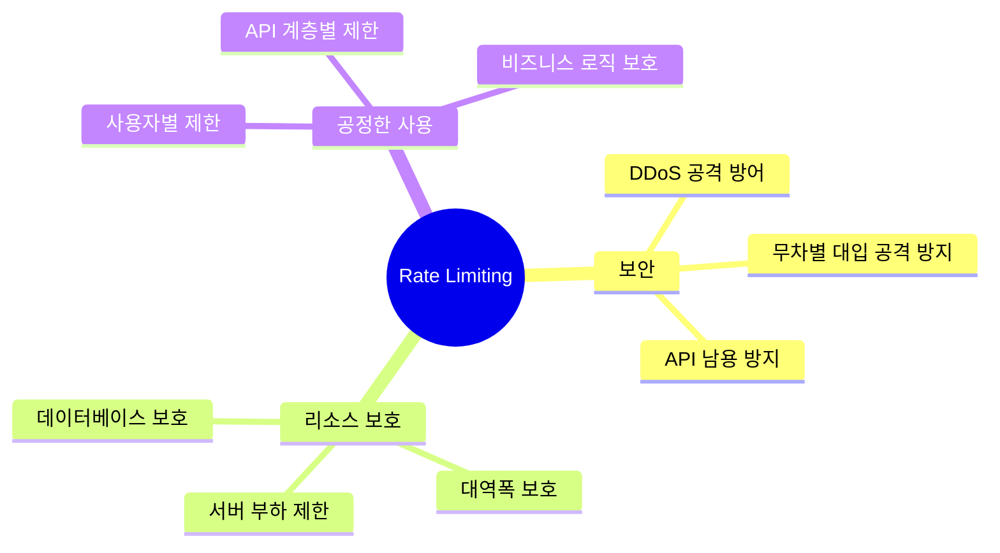
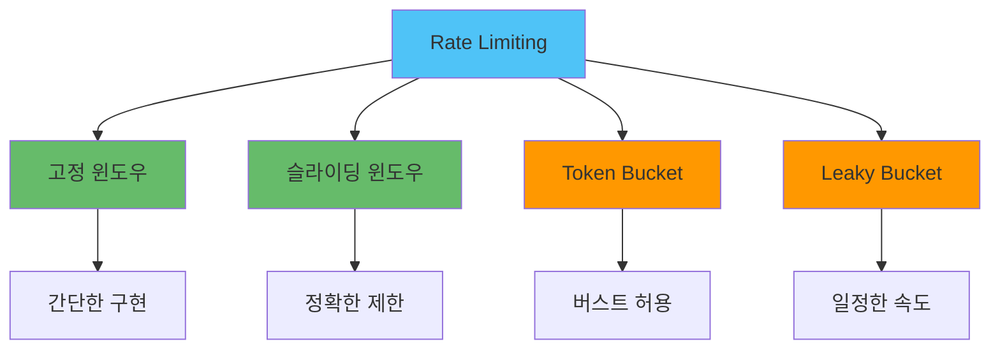
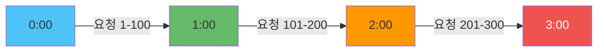
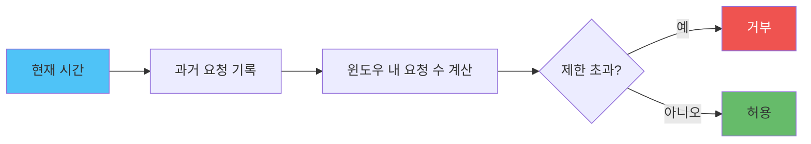
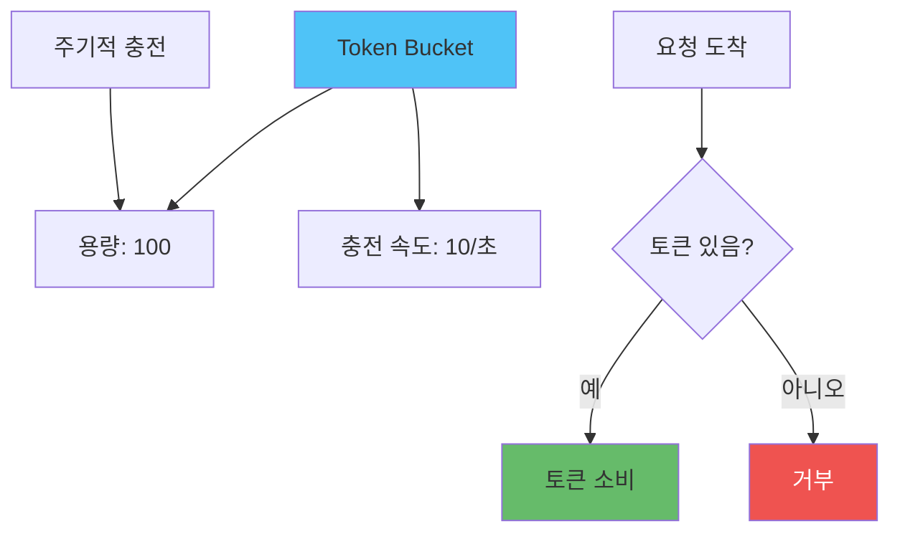
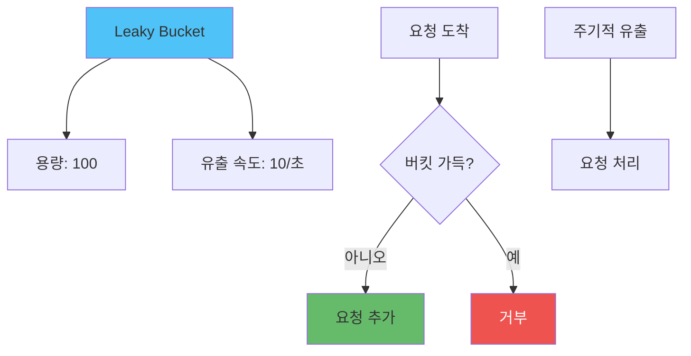
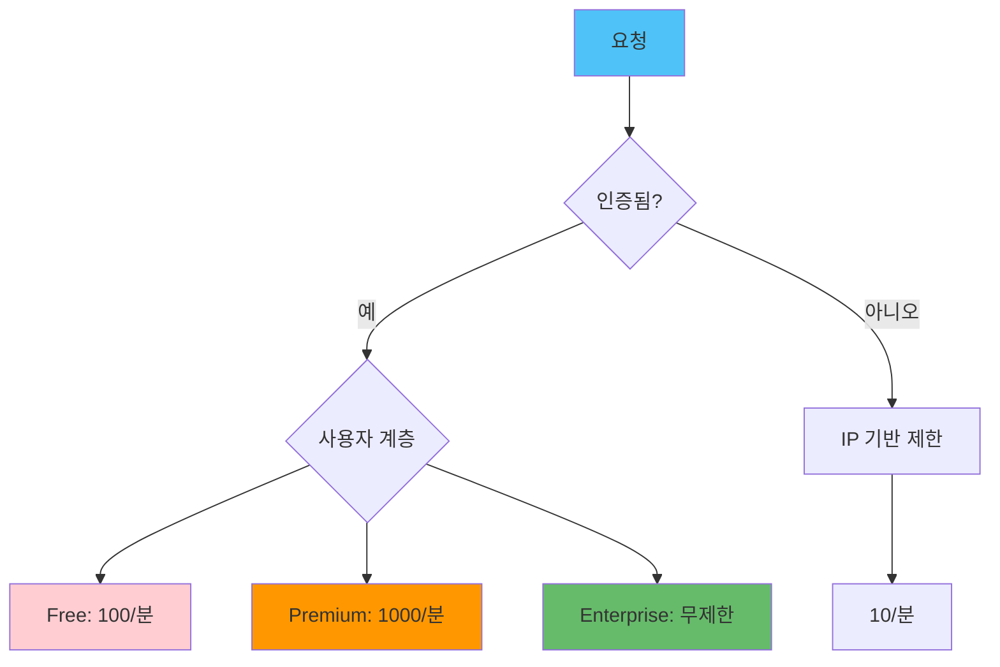
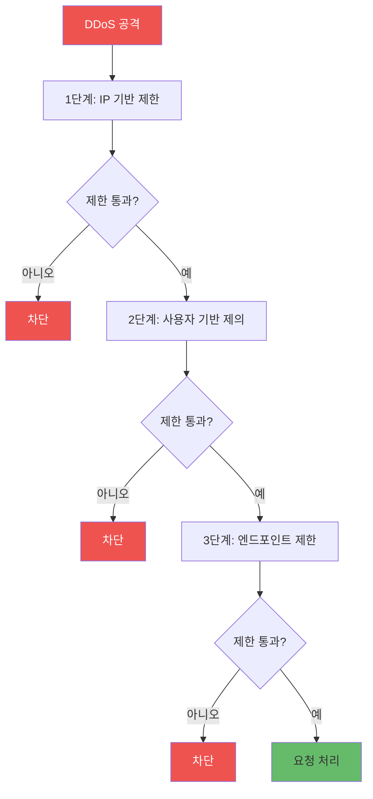

# 🚦 API Rate Limiting 구현 전략

## 📌 개요

> **Rate Limiting**은 API의 남용을 방지하고, 서버 리소스를 보호하며, 공정한 사용을 보장하는 보안 메커니즘입니다.

### 🎯 Rate Limiting의 목적



### 📊 Rate Limiting 전략



## 🔢 알고리즘 비교

### 1. 고정 윈도우 (Fixed Window)



#### 특징

- **장점**: 구현이 간단, 메모리 효율적
- **단점**: 윈도우 경계에서 버스트 발생 가능

#### 구현

```javascript
const redis = require('redis');

class FixedWindowRateLimiter {
  constructor(redisClient) {
    this.redis = redisClient;
  }
  
  async checkLimit(key, limit, windowSeconds) {
    const current = await this.redis.incr(key);
    
    if (current === 1) {
      // 첫 요청 시 만료 시간 설정
      await this.redis.expire(key, windowSeconds);
    }
    
    return {
      allowed: current <= limit,
      remaining: Math.max(0, limit - current),
      reset: await this.redis.ttl(key)
    };
  }
}

// 사용 예시
const limiter = new FixedWindowRateLimiter(redisClient);

app.get('/api/data', async (req, res) => {
  const key = `ratelimit:${req.ip}`;
  const result = await limiter.checkLimit(key, 100, 60); // 1분에 100회
  
  res.setHeader('X-RateLimit-Limit', '100');
  res.setHeader('X-RateLimit-Remaining', result.remaining);
  res.setHeader('X-RateLimit-Reset', Date.now() + result.reset * 1000);
  
  if (!result.allowed) {
    return res.status(429).json({
      error: 'Too many requests',
      retryAfter: result.reset
    });
  }
  
  res.json({ data: 'response' });
});
```

### 2. 슬라이딩 윈도우 (Sliding Window)



#### 특징

- **장점**: 정확한 제한, 버스트 방지
- **단점**: 메모리 사용량 증가

#### 구현 (Redis Sorted Set)

```javascript
class SlidingWindowRateLimiter {
  constructor(redisClient) {
    this.redis = redisClient;
  }
  
  async checkLimit(key, limit, windowSeconds) {
    const now = Date.now();
    const windowStart = now - windowSeconds * 1000;
    
    // 윈도우 밖의 오래된 요청 제거
    await this.redis.zRemRangeByScore(key, 0, windowStart);
    
    // 현재 요청 수
    const current = await this.redis.zCard(key);
    
    if (current >= limit) {
      // 가장 오래된 요청의 타임스탬프 확인
      const oldest = await this.redis.zRange(key, 0, 0, { WITHSCORES: true });
      const resetTime = oldest.length > 0 
        ? Math.ceil((oldest[1] + windowSeconds * 1000 - now) / 1000)
        : windowSeconds;
      
      return {
        allowed: false,
        remaining: 0,
        reset: resetTime
      };
    }
    
    // 현재 요청 추가
    await this.redis.zAdd(key, { score: now, value: `${now}-${Math.random()}` });
    await this.redis.expire(key, windowSeconds);
    
    return {
      allowed: true,
      remaining: limit - current - 1,
      reset: windowSeconds
    };
  }
}
```

### 3. Token Bucket



#### 특징

- **장점**: 버스트 허용, 일정한 속도 보장
- **단점**: 구현 복잡도 증가

#### 구현

```javascript
class TokenBucketRateLimiter {
  constructor(redisClient) {
    this.redis = redisClient;
  }
  
  async checkLimit(key, capacity, refillRate, refillPeriod) {
    const now = Date.now();
    const bucketKey = `bucket:${key}`;
    const lastRefillKey = `lastrefill:${key}`;
    
    // 마지막 충전 시간 가져오기
    const lastRefill = await this.redis.get(lastRefillKey);
    const lastRefillTime = lastRefill ? parseInt(lastRefill) : now;
    
    // 경과 시간 계산
    const elapsed = (now - lastRefillTime) / 1000; // 초 단위
    const tokensToAdd = Math.floor(elapsed / refillPeriod) * refillRate;
    
    // 현재 토큰 수 가져오기
    let currentTokens = await this.redis.get(bucketKey);
    currentTokens = currentTokens ? parseInt(currentTokens) : capacity;
    
    // 토큰 충전 (용량 초과 불가)
    if (tokensToAdd > 0) {
      currentTokens = Math.min(capacity, currentTokens + tokensToAdd);
      await this.redis.set(bucketKey, currentTokens);
      await this.redis.set(lastRefillKey, now);
    }
    
    // 토큰 소비
    if (currentTokens > 0) {
      currentTokens--;
      await this.redis.set(bucketKey, currentTokens);
      
      return {
        allowed: true,
        remaining: currentTokens,
        reset: refillPeriod
      };
    }
    
    return {
      allowed: false,
      remaining: 0,
      reset: refillPeriod - (elapsed % refillPeriod)
    };
  }
}

// 사용 예시
const limiter = new TokenBucketRateLimiter(redisClient);

app.get('/api/data', async (req, res) => {
  const key = `ratelimit:${req.ip}`;
  // 용량 100, 초당 10개 충전, 1초마다 충전
  const result = await limiter.checkLimit(key, 100, 10, 1);
  
  if (!result.allowed) {
    return res.status(429).json({
      error: 'Too many requests',
      retryAfter: result.reset
    });
  }
  
  res.json({ data: 'response' });
});
```

### 4. Leaky Bucket



#### 특징

- **장점**: 일정한 처리 속도, 버스트 제어
- **단점**: 구현 복잡도 높음

## 🔧 Redis 기반 Rate Limiting

### 통합 Rate Limiter 클래스

```javascript
const redis = require('redis');

class RateLimiter {
  constructor(redisClient, options = {}) {
    this.redis = redisClient;
    this.algorithm = options.algorithm || 'sliding-window';
  }
  
  // 슬라이딩 윈도우 (권장)
  async slidingWindow(key, limit, windowSeconds) {
    const now = Date.now();
    const windowStart = now - windowSeconds * 1000;
    
    const pipeline = this.redis.pipeline();
    
    // 오래된 요청 제거
    pipeline.zRemRangeByScore(key, 0, windowStart);
    
    // 현재 요청 수
    pipeline.zCard(key);
    
    // 현재 요청 추가
    pipeline.zAdd(key, { score: now, value: `${now}-${Math.random()}` });
    pipeline.expire(key, windowSeconds);
    
    const results = await pipeline.exec();
    const current = results[1][1];
    
    if (current >= limit) {
      const oldest = await this.redis.zRange(key, 0, 0, { WITHSCORES: true });
      const resetTime = oldest.length > 0
        ? Math.ceil((oldest[1] + windowSeconds * 1000 - now) / 1000)
        : windowSeconds;
      
      return {
        allowed: false,
        remaining: 0,
        reset: resetTime
      };
    }
    
    return {
      allowed: true,
      remaining: limit - current - 1,
      reset: windowSeconds
    };
  }
  
  // 고정 윈도우
  async fixedWindow(key, limit, windowSeconds) {
    const current = await this.redis.incr(key);
    
    if (current === 1) {
      await this.redis.expire(key, windowSeconds);
    }
    
    return {
      allowed: current <= limit,
      remaining: Math.max(0, limit - current),
      reset: await this.redis.ttl(key)
    };
  }
  
  // 통합 인터페이스
  async checkLimit(key, limit, windowSeconds) {
    switch (this.algorithm) {
      case 'sliding-window':
        return await this.slidingWindow(key, limit, windowSeconds);
      case 'fixed-window':
        return await this.fixedWindow(key, limit, windowSeconds);
      default:
        return await this.slidingWindow(key, limit, windowSeconds);
    }
  }
}
```

### Express 미들웨어

```javascript
const rateLimitMiddleware = (limiter, getKey, getLimit, getWindow) => {
  return async (req, res, next) => {
    const key = getKey(req);
    const limit = getLimit(req);
    const window = getWindow(req);
    
    try {
      const result = await limiter.checkLimit(key, limit, window);
      
      // Rate Limit 헤더 설정
      res.setHeader('X-RateLimit-Limit', limit);
      res.setHeader('X-RateLimit-Remaining', result.remaining);
      res.setHeader('X-RateLimit-Reset', Date.now() + result.reset * 1000);
      
      if (!result.allowed) {
        return res.status(429).json({
          error: 'Too many requests',
          message: `Rate limit exceeded. Try again in ${result.reset} seconds.`,
          retryAfter: result.reset
        });
      }
      
      next();
    } catch (error) {
      // Rate Limiting 실패 시 로깅하고 계속 진행
      console.error('Rate limiting error:', error);
      next();
    }
  };
};

// 사용 예시
const redisClient = redis.createClient({ url: process.env.REDIS_URL });
await redisClient.connect();

const limiter = new RateLimiter(redisClient, { algorithm: 'sliding-window' });

// IP 기반 제한
app.use('/api/', rateLimitMiddleware(
  limiter,
  (req) => `ratelimit:ip:${req.ip}`,
  () => 100, // 100회
  () => 60   // 1분
));

// 사용자 기반 제한
app.use('/api/protected', authenticateToken, rateLimitMiddleware(
  limiter,
  (req) => `ratelimit:user:${req.user.id}`,
  (req) => req.user.plan === 'premium' ? 1000 : 100,
  () => 60
));
```

## 🎯 사용자별/API별 제한 전략

### 계층별 Rate Limiting



#### 구현

```javascript
function getRateLimitConfig(req) {
  // 인증되지 않은 사용자
  if (!req.user) {
    return {
      key: `ratelimit:ip:${req.ip}`,
      limit: 10,
      window: 60
    };
  }
  
  // 사용자 계층별 제한
  const limits = {
    free: { limit: 100, window: 60 },
    premium: { limit: 1000, window: 60 },
    enterprise: { limit: Infinity, window: 60 }
  };
  
  const userLimit = limits[req.user.plan] || limits.free;
  
  return {
    key: `ratelimit:user:${req.user.id}`,
    limit: userLimit.limit,
    window: userLimit.window
  };
}

app.use('/api/', async (req, res, next) => {
  const config = getRateLimitConfig(req);
  
  // 무제한 계층은 스킵
  if (config.limit === Infinity) {
    return next();
  }
  
  const result = await limiter.checkLimit(
    config.key,
    config.limit,
    config.window
  );
  
  res.setHeader('X-RateLimit-Limit', config.limit);
  res.setHeader('X-RateLimit-Remaining', result.remaining);
  res.setHeader('X-RateLimit-Reset', Date.now() + result.reset * 1000);
  
  if (!result.allowed) {
    return res.status(429).json({
      error: 'Too many requests',
      retryAfter: result.reset
    });
  }
  
  next();
});
```

### 엔드포인트별 제한

```javascript
const endpointLimits = {
  '/api/login': { limit: 5, window: 15 },      // 15분에 5회
  '/api/register': { limit: 3, window: 60 },    // 1시간에 3회
  '/api/password-reset': { limit: 3, window: 3600 }, // 1시간에 3회
  '/api/data': { limit: 100, window: 60 }      // 1분에 100회
};

app.use((req, res, next) => {
  const endpoint = req.path;
  const limitConfig = endpointLimits[endpoint];
  
  if (!limitConfig) {
    return next();
  }
  
  const key = `ratelimit:endpoint:${endpoint}:${req.ip}`;
  
  limiter.checkLimit(key, limitConfig.limit, limitConfig.window)
    .then(result => {
      if (!result.allowed) {
        return res.status(429).json({
          error: 'Too many requests',
          retryAfter: result.reset
        });
      }
      next();
    })
    .catch(next);
});
```

## 🛡️ DDoS 방어 전략

### 다층 방어



### IP 화이트리스트/블랙리스트

```javascript
class IPFilter {
  constructor(redisClient) {
    this.redis = redisClient;
  }
  
  async isBlacklisted(ip) {
    return await this.redis.sIsMember('blacklist:ips', ip);
  }
  
  async isWhitelisted(ip) {
    return await this.redis.sIsMember('whitelist:ips', ip);
  }
  
  async addToBlacklist(ip, ttl = null) {
    await this.redis.sAdd('blacklist:ips', ip);
    if (ttl) {
      await this.redis.expire(`blacklist:ip:${ip}`, ttl);
    }
  }
  
  async checkIP(ip) {
    if (await this.isWhitelisted(ip)) {
      return { allowed: true, reason: 'whitelisted' };
    }
    
    if (await this.isBlacklisted(ip)) {
      return { allowed: false, reason: 'blacklisted' };
    }
    
    return { allowed: true, reason: 'normal' };
  }
}

// 자동 블랙리스트 추가
async function autoBlacklist(ip, limiter) {
  const key = `ratelimit:ip:${ip}`;
  const violations = await redisClient.get(`violations:${ip}`);
  
  if (violations && parseInt(violations) >= 5) {
    const ipFilter = new IPFilter(redisClient);
    await ipFilter.addToBlacklist(ip, 3600); // 1시간 차단
    return true;
  }
  
  return false;
}
```

### Rate Limit 헤더 표준

```javascript
function setRateLimitHeaders(res, limit, remaining, reset) {
  res.setHeader('X-RateLimit-Limit', limit);
  res.setHeader('X-RateLimit-Remaining', remaining);
  res.setHeader('X-RateLimit-Reset', reset);
  
  // Retry-After 헤더 (429 응답 시)
  if (remaining === 0) {
    const retryAfter = Math.ceil((reset - Date.now()) / 1000);
    res.setHeader('Retry-After', retryAfter);
  }
}
```

## 🎯 실전 예제: 완전한 Rate Limiting 시스템

```javascript
const express = require('express');
const redis = require('redis');

// Redis 연결
const redisClient = redis.createClient({ url: process.env.REDIS_URL });
await redisClient.connect();

// Rate Limiter 클래스 (위에서 정의한 것)
// ...

// IP 필터
class IPFilter {
  // ... (위에서 정의한 것)
}

// 통합 Rate Limiting 미들웨어
function createRateLimitMiddleware(limiter, ipFilter) {
  return async (req, res, next) => {
    // 1. IP 필터링
    const ipCheck = await ipFilter.checkIP(req.ip);
    if (!ipCheck.allowed) {
      return res.status(403).json({
        error: 'Access denied',
        reason: ipCheck.reason
      });
    }
    
    // 2. IP 기반 기본 제한
    const ipKey = `ratelimit:ip:${req.ip}`;
    const ipResult = await limiter.checkLimit(ipKey, 100, 60);
    
    if (!ipResult.allowed) {
      // 위반 횟수 증가
      await redisClient.incr(`violations:${req.ip}`);
      await redisClient.expire(`violations:${req.ip}`, 3600);
      
      // 5회 이상 위반 시 자동 블랙리스트
      const violations = await redisClient.get(`violations:${req.ip}`);
      if (violations && parseInt(violations) >= 5) {
        await ipFilter.addToBlacklist(req.ip, 3600);
      }
      
      setRateLimitHeaders(res, 100, 0, Date.now() + ipResult.reset * 1000);
      return res.status(429).json({
        error: 'Too many requests',
        retryAfter: ipResult.reset
      });
    }
    
    // 3. 사용자 기반 제한 (인증된 경우)
    if (req.user) {
      const userKey = `ratelimit:user:${req.user.id}`;
      const userLimit = req.user.plan === 'premium' ? 1000 : 100;
      const userResult = await limiter.checkLimit(userKey, userLimit, 60);
      
      if (!userResult.allowed) {
        setRateLimitHeaders(res, userLimit, 0, Date.now() + userResult.reset * 1000);
        return res.status(429).json({
          error: 'Too many requests',
          retryAfter: userResult.reset
        });
      }
      
      setRateLimitHeaders(res, userLimit, userResult.remaining, Date.now() + userResult.reset * 1000);
    } else {
      setRateLimitHeaders(res, 100, ipResult.remaining, Date.now() + ipResult.reset * 1000);
    }
    
    next();
  };
}

// Express 앱 설정
const app = express();

const limiter = new RateLimiter(redisClient, { algorithm: 'sliding-window' });
const ipFilter = new IPFilter(redisClient);

app.use('/api/', createRateLimitMiddleware(limiter, ipFilter));

// 관리자 엔드포인트: IP 블랙리스트 관리
app.post('/admin/blacklist', authenticateAdmin, async (req, res) => {
  const { ip, ttl } = req.body;
  await ipFilter.addToBlacklist(ip, ttl);
  res.json({ message: 'IP added to blacklist' });
});

app.delete('/admin/blacklist/:ip', authenticateAdmin, async (req, res) => {
  await redisClient.sRem('blacklist:ips', req.params.ip);
  res.json({ message: 'IP removed from blacklist' });
});

const PORT = process.env.PORT || 3000;
app.listen(PORT, () => {
  console.log(`서버 실행 중: http://localhost:${PORT}`);
});
```

## 📝 결론

Rate Limiting은 API 보안과 안정성을 보장하는 필수 메커니즘입니다.

### 핵심 포인트

- ✅ **알고리즘 선택**: 슬라이딩 윈도우 (정확성) vs 고정 윈도우 (간단함)
- ✅ **Redis 활용**: 분산 환경에서 일관된 제한
- ✅ **다층 방어**: IP → 사용자 → 엔드포인트
- ✅ **표준 헤더**: X-RateLimit-* 헤더 사용
- ✅ **자동 블랙리스트**: 반복 위반 IP 차단

### 모범 사례

1. **슬라이딩 윈도우 사용**: 정확한 제한을 위해
2. **Redis 활용**: 분산 환경 지원
3. **다층 방어**: 여러 레벨에서 제한
4. **표준 헤더**: 클라이언트에게 정보 제공
5. **자동화**: 위반 IP 자동 차단
6. **모니터링**: Rate Limit 위반 추적 및 알림

### 관련 문서

- [API 설계 원칙](./API_설계_원칙.md) - Rate Limiting이 포함된 API 설계
- [보안 모범 사례](../보안/Node.js_보안_모범사례.md) - DDoS 방어 전략
- [캐싱 전략](../캐싱/캐싱_전략.md) - Rate Limiting과 캐싱 통합
- [Observability 전략](../모니터링/Observability_전략.md) - Rate Limiting 메트릭 모니터링

