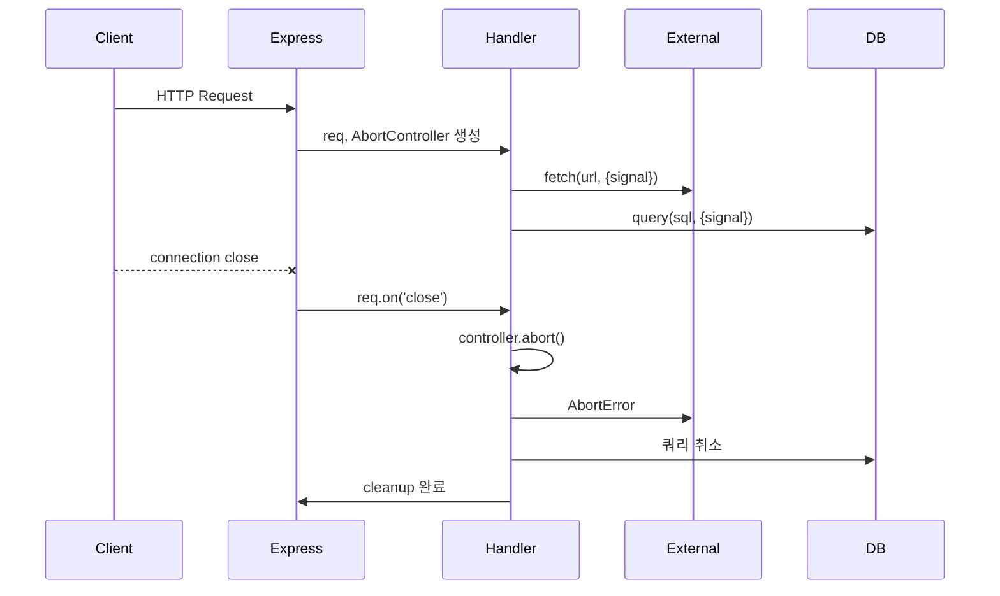

# AbortController로 비동기 작업 취소하기

Node.js에서 비동기 작업을 중단하는 문제는 오래 골치를 썩였다. 한참 돌고 있는 HTTP 요청을 중간에 멈출 방법이 없어서 응답을 받고도 버리거나, 타임아웃이 지난 쿼리가 백엔드에서 계속 돌면서 커넥션을 점유하는 상황을 자주 봤다. 클라이언트가 페이지를 떠났는데도 서버는 모르고 무거운 작업을 마무리하는 일도 흔하다.

AbortController는 이 문제를 풀려고 표준화된 취소 메커니즘이다. DOM 명세에서 출발해서 Node.js 15부터 정식 지원되고, 이제는 fetch, fs/promises, child_process, worker_threads, 타이머까지 거의 모든 곳에서 받아들인다.

## AbortController와 AbortSignal의 기본 구조

AbortController는 두 부분으로 나뉜다. 컨트롤러 본체는 취소 권한을 가진 쪽이 들고 있고, signal은 취소를 받아야 하는 쪽에 넘긴다. 권한 분리가 되니까 라이브러리에 signal만 넘기면 라이브러리가 함부로 자기 작업을 취소하는 짓을 못 한다.

```javascript
const controller = new AbortController();
const signal = controller.signal;

// 취소 직전
console.log(signal.aborted); // false
console.log(signal.reason);  // undefined

controller.abort(new Error('사용자 취소'));

console.log(signal.aborted); // true
console.log(signal.reason);  // Error: 사용자 취소
```

여기서 중요한 게 `reason` 속성이다. `abort()`에 인자를 안 넘기면 기본적으로 `AbortError`가 들어가는데, 명시적으로 Error 객체를 넘기면 그게 그대로 reason이 된다. 취소 사유를 구분해서 로깅하거나 재시도 여부를 결정할 때 유용하다. 예를 들어 사용자가 직접 취소한 건지, 타임아웃 때문에 끊긴 건지, 상위 요청이 죽어서 같이 죽은 건지 reason을 보고 판단한다.

이벤트 기반으로도 동작한다. signal에 `abort` 이벤트 리스너를 달면 취소가 일어났을 때 호출된다. 정리 작업을 묶을 때 자주 쓴다.

```javascript
signal.addEventListener('abort', () => {
  // 진행 중인 작업 정리
  cleanup();
}, { once: true });
```

`{ once: true }` 옵션을 빼먹으면 곤란한 상황이 생긴다. signal이 오래 살아남으면 리스너가 쌓이면서 메모리 누수가 일어나는데, 뒤에 다시 다루겠다.

## fetch와 타임아웃 통합

Node.js 18부터 기본 fetch가 들어왔고, undici를 기반으로 한다. fetch는 signal을 두 번째 인자의 옵션으로 받는다.

```javascript
async function fetchWithTimeout(url, timeoutMs = 5000) {
  const controller = new AbortController();
  const timer = setTimeout(() => controller.abort(), timeoutMs);

  try {
    const res = await fetch(url, { signal: controller.signal });
    return await res.json();
  } finally {
    clearTimeout(timer);
  }
}
```

이 패턴은 5년 전부터 쓰던 방식인데, 이제는 더 간단해졌다. Node 17.3부터 정적 메서드 `AbortSignal.timeout(ms)`가 들어와서 위 코드를 다음처럼 줄인다.

```javascript
async function fetchWithTimeout(url, timeoutMs = 5000) {
  const res = await fetch(url, { signal: AbortSignal.timeout(timeoutMs) });
  return res.json();
}
```

타이머 정리를 신경 쓸 필요가 없다. 다만 `AbortSignal.timeout`이 만든 signal은 외부에서 수동으로 취소할 수 없다. 타임아웃 외에 사용자 취소도 같이 받아야 하는 경우라면 `AbortSignal.any()`로 두 신호를 합친다.

```javascript
async function fetchWithCancel(url, userSignal, timeoutMs = 5000) {
  const signal = AbortSignal.any([
    userSignal,
    AbortSignal.timeout(timeoutMs),
  ]);
  const res = await fetch(url, { signal });
  return res.json();
}
```

`AbortSignal.any()`는 Node 20부터 지원한다. 합친 signal 중 하나라도 취소되면 결과 signal이 취소된다. 이전에는 직접 두 컨트롤러를 연결하는 헬퍼를 짜야 했는데, 이게 의외로 메모리 누수 원인이 많이 됐다. 이제 표준 API로 깔끔해졌다.

axios의 경우 0.22 이상부터 `signal` 옵션을 받는다. 그 전 버전은 CancelToken을 썼는데 deprecated 됐으니 가능하면 옮겨라.

```javascript
const res = await axios.get(url, { signal: controller.signal });
```

undici를 직접 쓰는 경우도 fetch와 동일하게 `signal` 옵션을 받는다. fetch보다 성능이 중요한 영역에서는 undici의 `request`나 `Pool`을 직접 쓰는데, 인터페이스가 통일돼 있어서 옮기기 쉽다.

## 타임아웃을 어디서 잡을 것인가

타임아웃 설계에서 자주 헷갈리는 게 어느 레이어에서 잡을지다. fetch에 5초 타임아웃을 걸어도, 내부적으로 DNS 조회, TCP 연결, TLS 핸드셰이크, 헤더 전송, 응답 본문 수신까지 전부 합쳐서 5초다. 본문이 큰 응답이면 헤더는 100ms에 받았는데 본문 다운로드에서 시간을 다 쓴다.

이런 세분화된 타임아웃이 필요하면 undici의 Dispatcher 옵션을 직접 건드린다.

```javascript
import { Agent, request } from 'undici';

const agent = new Agent({
  connect: { timeout: 2000 },     // 연결 단계만 2초
  bodyTimeout: 10000,             // 본문 수신 10초
  headersTimeout: 3000,           // 헤더 수신 3초
});

const { body } = await request(url, { dispatcher: agent, signal });
```

레이어가 다르니 동작도 다르다. signal로 취소하면 즉시 소켓이 닫히지만, undici 내부 타임아웃은 단계별로 끊긴다. 운영하면서 한 번은 외부 API가 헤더는 빨리 보내고 본문에서 일부러 천천히 흘려보내는 케이스가 있었는데, signal 타임아웃만 걸어두면 5초 안에 헤더 받았다고 안심하다가 본문에서 발목 잡혔다. 결국 헤더 따로, 본문 따로 잡았다.

## setTimeout/setInterval 취소

`node:timers/promises`의 타이머 함수들도 signal을 받는다.

```javascript
import { setTimeout, setInterval } from 'node:timers/promises';

const controller = new AbortController();

// 5초 대기 중간에 취소 가능
try {
  await setTimeout(5000, undefined, { signal: controller.signal });
} catch (err) {
  if (err.name === 'AbortError') {
    // 정상적인 취소
  }
}
```

기존 콜백 기반 `setTimeout`은 signal 옵션이 없다. Promise 버전으로 옮겨야 한다. setInterval도 마찬가지로 비동기 이터레이터 형태로 받는데, signal로 루프를 끝낼 수 있다.

```javascript
import { setInterval } from 'node:timers/promises';

async function poll(signal) {
  try {
    for await (const _ of setInterval(1000, null, { signal })) {
      await checkStatus();
    }
  } catch (err) {
    if (err.name !== 'AbortError') throw err;
  }
}
```

폴링 루프를 짤 때 이 패턴이 깔끔하다. 예전에는 `while (true)` 안에 플래그를 확인하면서 break 하는 코드를 짰는데, signal 하나로 일관되게 처리되니까 코드 흐름이 단순해진다.

## 스트림 파이프라인 취소

`stream.pipeline`의 Promise 버전이 signal을 받는다. 큰 파일을 받아서 변환하고 저장하는 파이프라인에서 중간 취소가 필요하면 이걸로 처리한다.

```javascript
import { pipeline } from 'node:stream/promises';
import { createReadStream, createWriteStream } from 'node:fs';
import { createGzip } from 'node:zlib';

const controller = new AbortController();

setTimeout(() => controller.abort(), 10000); // 10초 후 강제 종료

await pipeline(
  createReadStream('input.log'),
  createGzip(),
  createWriteStream('input.log.gz'),
  { signal: controller.signal },
);
```

취소가 발생하면 파이프라인 전체가 destroy되면서 모든 스트림에서 `error` 이벤트가 발생한다. 부분적으로 쓰인 파일이 남을 수 있으니까 finally에서 정리 로직을 둬야 한다. 한 번은 gz 파일이 절반만 만들어진 채로 디스크에 남아서, 다음 처리 단계에서 깨진 파일이라고 죽는 일이 있었다.

fs/promises의 `readFile`도 signal을 받는데, 큰 파일 읽기 중간에 취소가 가능하다는 점이 중요하다.

```javascript
const data = await fs.readFile('large.json', { signal: controller.signal });
```

## 데이터베이스 쿼리 취소

여기서부터 현실이 빡빡해진다. ORM마다 signal 지원이 천차만별이다.

Prisma는 5.x 초중반부터 일부 메서드에 timeout 옵션이 들어왔고, 트랜잭션에서 signal을 받는 형태로 확장되고 있다. 다만 단일 쿼리에 signal을 그대로 던지는 인터페이스는 아직 표준화되지 않았다. 대신 트랜잭션 수준에서 maxWait, timeout 옵션으로 잡는다.

```javascript
await prisma.$transaction(
  async (tx) => {
    await tx.user.findMany();
    await tx.order.update({ where: { id }, data: { status: 'PAID' } });
  },
  { maxWait: 2000, timeout: 5000 }
);
```

쿼리 단위 취소가 꼭 필요하면 PostgreSQL의 경우 `pg_cancel_backend(pid)`를 호출하는 식으로 직접 처리해야 한다. 운영 중에 무거운 분석 쿼리가 걸려서 커넥션 풀을 다 잡아먹는 일이 있었는데, signal 기반 취소가 없으니까 결국 별도 관리자 커넥션으로 pg_cancel_backend를 쏘는 헬퍼를 만들었다.

TypeORM은 EntityManager에 직접 signal을 받는 API가 없다. QueryRunner를 잡고 raw SQL을 던지면서 외부에서 connection.release()를 호출하는 우회 방식이 흔하다. 다만 TypeORM 0.3 이후 일부 driver에서 statement_timeout 같은 세션 변수 설정으로 우회한다.

```javascript
await dataSource.query('SET LOCAL statement_timeout = 5000');
const result = await dataSource.query('SELECT ...');
```

pg 드라이버를 직접 쓰는 경우 client.query에 timeout이 없어서 직접 짜야 한다. 가장 안정적인 방법은 connection-level statement_timeout을 거는 것이다.

```javascript
const client = await pool.connect();
try {
  await client.query('SET statement_timeout = 5000');
  const res = await client.query('SELECT slow_function()');
  return res.rows;
} finally {
  client.release();
}
```

Mongoose는 6.x 후반부터 일부 메서드가 signal을 받는다. 다만 driver 레벨에서 어떻게 동작하는지 명확히 정리되지 않아서, 실제로 MongoDB 서버에서 작업이 끊기는지 클라이언트만 신호를 받고 끝나는지 확인해봐야 한다. 클라이언트 측에서만 끊기면 서버 부하는 그대로다.

요약하면, ORM의 signal 지원은 받는다고 다 끝이 아니다. 실제로 데이터베이스 서버 측 쿼리가 멈추는지가 핵심이고, 이건 driver와 DB 종류마다 다르다.

## 요청 컨텍스트 전파

서버 측 분산 시스템에서 가장 중요한 활용이 요청 컨텍스트로서의 signal이다. 사용자가 페이지를 떠나면 들어온 요청의 signal이 abort되고, 그 signal이 하위 작업(외부 API 호출, DB 쿼리, 캐시 조회) 전체에 전파돼야 한다.

Express 4.x에는 `req.signal`이 없다. 5.x 베타에 들어왔고, 그 전에는 `req.on('close', ...)` 이벤트로 직접 컨트롤러를 만들어 전파해야 한다.

```javascript
app.get('/heavy', (req, res) => {
  const controller = new AbortController();
  req.on('close', () => controller.abort());

  doHeavyWork(controller.signal)
    .then((data) => res.json(data))
    .catch((err) => {
      if (err.name === 'AbortError') return; // 응답 못 보냄
      next(err);
    });
});
```

NestJS는 핸들러에서 `@Req() req`로 받아서 동일한 방식으로 컨트롤러를 만들거나, Fastify 어댑터에서는 `req.raw`의 close 이벤트를 듣는다. 5년 동안 NestJS를 쓰면서 느낀 건, 이 부분이 명시적으로 신경 쓰지 않으면 그냥 누락된다는 점이다. 사용자가 페이지를 닫아도 백엔드는 계속 일하고, 결과를 보낼 응답 객체는 이미 닫혔으니 에러도 안 나고, 무거운 작업이 백그라운드에서 조용히 돌다가 DB 커넥션만 점유한다.

Fastify는 4.x부터 `request.raw`의 close 이벤트를 통한 처리가 잘 정리돼 있고, 5.x에 와서는 `request.aborted` 같은 속성도 제공한다.

```javascript
fastify.get('/heavy', async (request, reply) => {
  const controller = new AbortController();
  request.raw.on('close', () => {
    if (!reply.sent) controller.abort();
  });
  return await doHeavyWork(controller.signal);
});
```

여기서 `reply.sent`를 확인하는 이유가 있다. 정상 응답 직후에도 close 이벤트가 발생하는데, 이 때 abort를 호출하면 이미 완료된 작업의 정리 로직이 잘못 발동할 수 있다.

## 자식 프로세스와 Worker Threads 종료

`child_process.spawn`, `exec`, `execFile`, `fork` 모두 signal 옵션을 받는다. 신호가 abort되면 자식 프로세스에 SIGTERM(기본값)을 보낸다.

```javascript
import { spawn } from 'node:child_process';

const controller = new AbortController();
setTimeout(() => controller.abort(), 5000);

const child = spawn('ffmpeg', ['-i', 'input.mp4', 'output.mp4'], {
  signal: controller.signal,
});

child.on('error', (err) => {
  if (err.name === 'AbortError') {
    // 5초 후 SIGTERM으로 종료됨
  }
});
```

종료 신호를 바꾸려면 `killSignal: 'SIGKILL'` 같은 옵션을 추가한다. ffmpeg처럼 SIGTERM 무시하는 외부 도구는 SIGKILL이 필요할 때가 있다.

Worker Threads도 비슷하다. Worker 생성 시 signal을 받지는 않지만, signal 이벤트로 worker.terminate()를 호출하면 된다.

```javascript
import { Worker } from 'node:worker_threads';

function runWorker(scriptPath, signal) {
  const worker = new Worker(scriptPath);
  const abortHandler = () => worker.terminate();

  if (signal.aborted) {
    worker.terminate();
  } else {
    signal.addEventListener('abort', abortHandler, { once: true });
  }

  return new Promise((resolve, reject) => {
    worker.on('message', resolve);
    worker.on('error', reject);
    worker.on('exit', (code) => {
      signal.removeEventListener('abort', abortHandler);
      if (code !== 0) reject(new Error(`Worker exited: ${code}`));
    });
  });
}
```

`signal.aborted`를 먼저 확인하는 게 핵심이다. 함수 진입 시점에 이미 abort된 signal을 받을 수 있다. 이걸 빼먹으면 abort된 signal에 리스너를 달지만 이벤트가 이미 발생한 후라 호출되지 않고, Worker는 끝까지 돌아간다.

## 메모리 누수와 리스너 정리

`signal.addEventListener('abort', ...)`는 가장 흔한 메모리 누수 원인 중 하나다. 요청 단위 signal이라면 요청이 끝나면서 같이 GC되니까 큰 문제가 안 되지만, 글로벌 signal(예: 앱 종료 시 abort되는 signal)에 리스너를 계속 추가하면서 제거하지 않으면 리스너가 무한히 쌓인다.

```javascript
// 위험한 패턴
async function someTask(signal) {
  signal.addEventListener('abort', () => cleanup());
  await doWork();
}

// 매 호출마다 리스너 추가, 작업 끝나도 제거 안 됨
for (let i = 0; i < 10000; i++) {
  await someTask(globalShutdownSignal);
}
```

위 코드는 10000개의 리스너가 globalShutdownSignal에 쌓인다. 작업이 끝나면 리스너를 떼야 한다.

```javascript
async function someTask(signal) {
  const onAbort = () => cleanup();
  signal.addEventListener('abort', onAbort, { once: true });
  try {
    await doWork();
  } finally {
    signal.removeEventListener('abort', onAbort);
  }
}
```

`{ once: true }`만 붙여도 abort가 한 번 발생하면 자동으로 떼지지만, abort가 발생하지 않은 채로 작업이 정상 종료된 경우는 리스너가 그대로 남는다. 그래서 finally에서 removeEventListener를 호출하는 게 안전하다.

Node 19 이상에서는 `EventTarget`의 `addEventListener`에 signal 옵션이 들어와서 다음처럼 자동 해제할 수도 있다.

```javascript
const localController = new AbortController();
parentSignal.addEventListener('abort', onAbort, {
  signal: localController.signal,
});

// 작업이 끝나면 localController.abort()로 리스너 제거
localController.abort();
```

직관적이진 않은데, signal로 또 다른 signal 리스너를 제어하는 방식이라 익숙해지면 편하다.

EventEmitter의 maxListeners를 넘어가면 경고가 뜬다. AbortSignal도 내부적으로 EventTarget이지만, Node 16부터는 별도의 카운터로 관리해서 비슷한 경고를 띄운다. `node:events`의 `getEventListeners(signal, 'abort').length`로 리스너 수를 확인할 수 있다. 디버깅할 때 한 번씩 찍어보면 어디서 새는지 보인다.

## AbortError 처리와 재시도 로직

AbortError를 일반 에러와 똑같이 처리하면 재시도 로직에서 무한 루프에 빠진다. 사용자가 의도적으로 취소했는데 재시도가 계속 일어나는 어이없는 상황이다.

```javascript
async function fetchWithRetry(url, signal, maxRetries = 3) {
  for (let attempt = 0; attempt < maxRetries; attempt++) {
    try {
      return await fetch(url, { signal });
    } catch (err) {
      if (err.name === 'AbortError') throw err; // 재시도 X
      if (attempt === maxRetries - 1) throw err;
      await wait(2 ** attempt * 1000);
    }
  }
}
```

`err.name === 'AbortError'`로 구분하는 게 표준이다. fetch가 던지는 에러도 이 형태고, fs/promises, timers/promises 등 대부분 표준 API가 동일하다. 단, undici는 AbortError와 별개로 `UND_ERR_ABORTED` 같은 자체 에러 코드를 쓰기도 해서 라이브러리 문서를 확인해야 한다.

타임아웃과 사용자 취소를 구분하고 싶다면 reason을 활용한다.

```javascript
try {
  await fetch(url, { signal });
} catch (err) {
  if (err.name === 'AbortError') {
    if (signal.reason?.code === 'TIMEOUT') {
      // 타임아웃이면 재시도
    } else {
      // 사용자 취소면 그대로 종료
      throw err;
    }
  }
}
```

`AbortSignal.timeout()`이 던지는 reason은 `DOMException`인데 name이 `TimeoutError`다. 그래서 다음처럼 구분한다.

```javascript
if (err.name === 'TimeoutError') {
  // 타임아웃
} else if (err.name === 'AbortError') {
  // 외부 취소
}
```

이 차이가 실무에서 의외로 중요하다. 타임아웃은 서버가 느린 거니까 재시도하면서 백오프하는 게 맞고, 사용자 취소는 그대로 정리하고 끝내야 한다. 둘을 똑같이 처리하면 사용자가 페이지를 떠났는데 백엔드가 같은 외부 API에 3번씩 재시도를 때리는 황당한 상황이 만들어진다.

## 컨텍스트 전파 흐름

요청부터 하위 작업까지 signal이 어떻게 흐르는지 정리하면 다음과 같다.



여기서 핵심은 클라이언트 연결이 끊긴 시점에 controller.abort()가 발동하고, 그 신호가 동시에 진행 중이던 모든 하위 작업에 일관되게 전파된다는 점이다. 트리 구조의 작업을 한 신호로 정리할 수 있어서 중간 단계에서 작업별로 정리 로직을 신경 쓸 필요가 줄어든다.

## signal.throwIfAborted()의 활용

긴 루프 안에서 중간중간 취소 확인이 필요할 때 `signal.throwIfAborted()`가 깔끔하다. 호출 시점에 abort 상태면 reason을 던지고, 아니면 그냥 통과한다.

```javascript
async function processItems(items, signal) {
  for (const item of items) {
    signal.throwIfAborted();
    await process(item);
  }
}
```

`if (signal.aborted) throw signal.reason`을 매번 쓰는 대신 한 줄로 끝난다. CPU 바운드 작업을 여러 단계로 쪼개 처리할 때 단계 사이에 한 번씩 끼워 넣으면 응답성이 좋아진다.

## 정리하면서 자주 보이는 실수

운영하면서 자주 만난 패턴 몇 가지다.

첫째, abort 후 응답을 보내려고 시도하는 경우. signal.aborted 상태에서 `res.json()`을 호출하면 이미 닫힌 소켓에 쓰는 거라 에러가 난다. catch 안에서 응답 보낼 수 있는지 먼저 확인해야 한다.

둘째, abort 시점에 진행 중인 트랜잭션을 그대로 두는 경우. signal로 쿼리는 끊었는데 트랜잭션은 idle 상태로 남는다. finally에서 rollback을 명시적으로 호출하지 않으면 커넥션이 idle in transaction 상태로 잠긴다. PostgreSQL이면 idle_in_transaction_session_timeout으로 보호망을 두기도 한다.

셋째, 여러 signal을 손으로 합치다가 누수가 나는 경우. `parent.addEventListener('abort', () => child.abort())` 같은 패턴을 직접 짜면 parent가 길게 살 때 리스너가 안 떨어진다. AbortSignal.any()가 있으면 그걸 쓰고, 아니면 자체 정리 로직을 반드시 넣어야 한다.

넷째, 라이브러리에 signal을 넘겼다고 끝났다고 생각하는 경우. 라이브러리가 signal을 받기는 받는데 내부적으로 적용 안 하거나 부분적으로만 적용하는 경우가 흔하다. 실제로 외부 통신이 끊기는지 패킷 캡처로 확인해본 적 있는데, signal을 받지만 무시하는 라이브러리도 있었다. 신뢰하지 말고 검증하라.

다섯째, AbortError가 안 잡혀서 unhandledRejection으로 올라가는 경우. signal 기반 취소가 일반적으로 일어나는 코드라면 AbortError를 항상 잡거나, 최상위에서 분기 처리해야 한다. 안 그러면 로그가 AbortError로 가득 찬다. 가짜 에러로 알람이 울리는 상황이 생긴다.

## 마이그레이션 관점

기존 코드에 AbortController를 끼워 넣을 때는 가장 바깥쪽 입구부터 시작하는 게 좋다. HTTP 요청 핸들러에서 컨트롤러를 만들고, 거기서 호출하는 함수마다 signal 파라미터를 추가하는 식으로 점진적으로 내려간다. 가운데 함수에서 signal이 끊어지면 거기 아래 작업은 취소 불가 상태가 된다.

함수 시그니처에 signal을 추가하는 게 번거롭다면 AsyncLocalStorage로 컨텍스트를 전달하는 방법도 있다. 다만 명시적으로 signal을 받는 게 코드 가독성에는 더 낫다고 느꼈다. 어떤 함수가 취소 가능한지 시그니처만 보고 알 수 있으니까.

레거시 콜백 기반 API는 signal을 직접 받지 못한다. 콜백 시작 전 signal.aborted를 확인하고, 콜백 실행 중에는 어쩔 수 없는 경우가 많다. promisify로 감싸면서 중간에 abort 체크를 끼워 넣는 어댑터를 만들기도 하는데, 진짜로 작업이 멈추는 건 아니고 결과만 버리는 셈이다. 실제 작업 취소를 원한다면 라이브러리를 signal 지원 버전으로 옮기거나 직접 driver를 건드리는 수밖에 없다.
