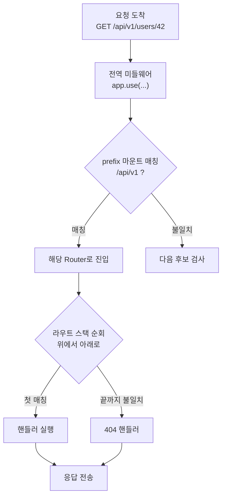

# 애플리케이션 라우팅 (Express / NestJS)

여기서 말하는 라우팅은 패킷이 어느 게이트웨이로 나가느냐가 아니다. 그건 네트워크 계층 이야기고, 이 문서는 HTTP 요청이 프레임워크 안으로 들어온 뒤 **어떤 핸들러 함수에 도달하느냐**만 다룬다. `GET /users/42`가 들어왔을 때 어느 컨트롤러 메서드가 실행되는지, 왜 가끔 엉뚱한 핸들러가 잡아먹는지, 그 해석 과정을 본다.

ALB나 API Gateway, Caddy 같은 앞단 라우팅은 다루지 않는다. 그 계층은 이미 "이 요청은 이 Node 프로세스로" 까지 결정을 끝낸 상태고, 그 뒤 프로세스 내부에서 일어나는 일이 여기 주제다.

## 라우트는 등록 순서대로 매칭된다

Express에서 가장 먼저 알아야 할 사실 하나. 라우트는 **등록된 순서대로 위에서 아래로** 검사되고, 처음 매칭되는 것이 이긴다. 더 구체적인 경로가 자동으로 우선하지 않는다. 먼저 쓴 게 우선이다.

```js
const express = require('express');
const app = express();

app.get('/users/:id', (req, res) => {
  res.send(`user ${req.params.id}`);
});

app.get('/users/me', (req, res) => {
  res.send('current user');
});
```

`GET /users/me`를 호출하면 `current user`가 나올 것 같지만, 실제로는 `user me`가 나온다. `/users/:id`가 먼저 등록됐고, `:id`가 `me`라는 문자열을 그대로 잡아버리기 때문이다. 두 번째 핸들러는 영원히 실행되지 않는다.

이게 실무에서 가장 자주 보는 shadowing 버그다. 고정 경로(`/users/me`, `/users/export`)와 파라미터 경로(`/users/:id`)가 섞여 있으면, 고정 경로를 **반드시 먼저** 등록해야 한다.

```js
// 고정 경로를 위로
app.get('/users/me', handler);
app.get('/users/export', handler);
app.get('/users/:id', handler);
```

라우트가 수십 개 넘어가면 이 순서를 사람이 일일이 지키기 어렵다. 그래서 팀에서 쓰는 방법은 두 가지로 갈린다. 하나는 파라미터 라우트를 파일 맨 아래로 모는 컨벤션을 정하는 것, 다른 하나는 `:id`에 제약을 거는 것이다. 후자는 뒤에서 다룬다.

## path 파라미터, 와일드카드, 정규식

### 파라미터

`:` 으로 시작하는 세그먼트는 파라미터다. `req.params`에 들어온다.

```js
app.get('/posts/:postId/comments/:commentId', (req, res) => {
  // GET /posts/10/comments/3  ->  { postId: '10', commentId: '3' }
  res.json(req.params);
});
```

값은 전부 문자열이다. `postId`가 숫자처럼 생겼어도 `'10'`이지 `10`이 아니다. 숫자로 다룰 거면 직접 변환하고, 변환 실패를 검증해야 한다. NestJS는 `ParseIntPipe`가 이 변환과 검증을 한 번에 해준다.

### 와일드카드 (Express 4 → 5 변경점)

와일드카드는 Express 4와 5에서 문법이 달라졌다. 이걸 모르고 버전 올리면 라우트가 통째로 안 잡힌다.

Express 4에서는 익명 `*`를 썼다.

```js
// Express 4
app.get('/files/*', (req, res) => {
  res.send(req.params[0]); // 매칭된 나머지 경로가 인덱스 0에
});
```

Express 5는 내부 path-to-regexp가 메이저 업그레이드되면서 **와일드카드에 이름을 붙여야 한다**. 익명 `*`는 더 이상 동작하지 않고 에러를 던진다.

```js
// Express 5
app.get('/files/*splat', (req, res) => {
  res.send(req.params.splat); // 이름으로 접근
});
```

`/files/a/b/c.png` 를 호출하면 `splat`에 `a/b/c.png`가 들어온다. 옵셔널 파라미터도 `:id?`에서 `{:id}` 문법으로 바뀌었다. Express 4 코드를 5로 올릴 때 라우트 정의가 안 잡히면 거의 이 문제다.

### 정규식 라우트

문자열 패턴으로 안 되는 매칭은 정규식을 직접 넘긴다. `:id`가 숫자만 받게 만드는 흔한 예다.

```js
// 숫자만 :id로 받는다. /users/me 같은 문자열은 안 잡힌다
app.get(/^\/users\/(\d+)$/, (req, res) => {
  res.send(`user ${req.params[0]}`);
});
```

이렇게 하면 앞에서 본 shadowing 문제가 줄어든다. `/users/:id`가 숫자만 받으면 `/users/me`는 이 라우트를 통과해서 다음 핸들러로 넘어간다. 다만 정규식 라우트는 가독성이 떨어지고, 정규식 매칭 비용이 라우트마다 붙는다. 라우트가 많은 서버에서 전부 정규식으로 쓰면 매칭이 느려진다. 꼭 필요한 곳에만 쓴다.

### 인라인 정규식 제약과 옵셔널 세그먼트

전체 라우트를 정규식으로 쓰지 않고도 path-to-regexp 문법으로 파라미터에 제약을 걸 수 있다. Express 4 기준 문법이다.

```js
// :id 자리에 한 자 이상 숫자만 허용. 그 외 요청은 이 라우트에 안 잡힌다
app.get('/users/:id(\\d+)', getUserById);

// :slug에 알파벳·하이픈만 허용
app.get('/articles/:slug([a-z][a-z0-9-]*)', getArticle);
```

`/users/me`가 `/users/:id(\d+)`를 통과하면 다음에 등록된 라우트가 잡는다. 정규식 라우트 전체를 쓰는 것보다 가독성이 낫고, 라우트별로 들어오는 값의 형태를 명세에 가깝게 표현한다.

Express 5에서는 옵셔널 세그먼트 문법이 바뀌었다. v4의 `:param?`은 v5에서 동작하지 않고 중괄호로 옵셔널을 표현한다.

```js
// Express 4
app.get('/posts/:year/:month?', archiveHandler);

// Express 5: 중괄호로 옵셔널 세그먼트 표현
app.get('/posts/:year{/:month}', archiveHandler);
```

`/posts/2026`과 `/posts/2026/06` 둘 다 잡는다. 옵셔널이 빠지면 `req.params.month`는 `undefined`다. 핸들러에서 `undefined`를 안 거르고 그대로 DB 쿼리 변수로 넘기면 결과가 텅 비는 식으로 조용히 실패한다.

복수 세그먼트 묶음도 가능하다.

```js
// /files/2026/06/report.pdf 와 /files/report.pdf 둘 다 매칭
app.get('/files{/:year/:month}/:name', getFile);
```

옵셔널을 남발하면 매칭 자체는 되지만 핸들러 안에서 분기가 많아진다. 옵셔널 한 개당 if 분기 두 갈래가 생긴다고 보면 된다. 두 개 이상 옵셔널이 있으면 차라리 라우트를 두 개로 나눠 핸들러에서 공통 로직만 함수로 뽑는 편이 디버깅이 쉽다.

### 한 경로에 다중 파라미터 둘 때

`/projects/:projectId/tasks/:taskId/comments/:commentId` 처럼 파라미터를 여러 개 두면 매칭 자체는 문제없다. 그런데 두 가지 함정이 따라온다.

첫째, 인접한 파라미터 사이에 구분자가 없으면 path-to-regexp가 거부하거나 의도와 다르게 잡는다.

```js
// 이건 안 됨: 두 파라미터가 붙어 있고 사이에 정적 구분자가 없다
app.get('/:year:month', handler);

// 사이에 - 을 넣으면 정상 매칭
app.get('/:year-:month', handler);   // /2026-06
```

둘째, 같은 이름의 파라미터가 한 경로에 두 번 나오면 뒤에 매칭된 값이 앞을 덮어쓴다.

```js
// 의도: 출발지/도착지를 둘 다 받기. 같은 :code를 두 번 쓰면 도착지 값만 남는다
app.get('/route/:code/:code', handler);  // 위험. fromCode/toCode 처럼 이름을 분리해야 한다
app.get('/route/:fromCode/:toCode', handler);
```

라우트 안에 같은 파라미터를 의도적으로 두 번 쓸 일은 거의 없다. 보통 리팩터 중에 이름을 잘못 통일하면서 사고가 난다. 라우트 정의 단계에서 잡지 못하고 핸들러에서 `req.params.code`를 꺼내 쓸 때 값이 한 쪽만 나와 디버깅이 늦어진다.

## 미들웨어 체인 실행 순서와 next()의 네 가지 형태

라우트 매칭 다음으로 자주 발이 걸리는 곳이 미들웨어 체인이다. Express에서 미들웨어는 등록 순서대로 줄을 서고, 앞 미들웨어가 `next()`를 부르지 않으면 뒤는 영원히 안 탄다. 응답도 안 가고, 그렇다고 에러가 나는 것도 아니라 그냥 멈춘다. 클라이언트는 timeout으로만 알게 된다.

`next()`의 인자에 따라 흐름이 네 갈래로 갈린다. 이걸 구분 못 하면 디버깅이 어렵다.

```js
// 1. next()  - 같은 라우트의 다음 핸들러/미들웨어로
app.use((req, res, next) => {
  req.startedAt = Date.now();
  next();
});

// 2. next('route') - 이 라우트의 남은 핸들러를 건너뛰고 다음 라우트 매칭으로
app.get('/items/:id', (req, res, next) => {
  if (req.params.id === 'special') return next('route'); // 아래 핸들러 건너뜀
  res.json({ generic: true });
}, (req, res) => {
  res.json({ second: true });
});

app.get('/items/:id', (req, res) => {
  // next('route') 가 호출되면 여기로 온다
  res.json({ fallback: true });
});

// 3. next('router') - 현재 라우터 전체를 빠져나가 부모 라우터의 다음 핸들러로
const router = express.Router();
router.use((req, res, next) => {
  if (!req.headers['x-tenant']) return next('router'); // 이 라우터 통째로 스킵
  next();
});
router.get('/items', listItems);
app.use('/api', router);
app.use('/api', (req, res) => res.status(400).json({ error: 'tenant required' }));

// 4. next(err) - 에러 미들웨어로 점프
app.get('/things/:id', async (req, res, next) => {
  const thing = await db.find(req.params.id);
  if (!thing) return next(new NotFoundError());
  res.json(thing);
});
```

`next('route')`는 같은 path에 라우트가 두 번 등록돼 있어야 의미가 있다. 첫 라우트가 권한·조건을 보고 자기 차례가 아니라고 판단하면 같은 path의 다음 라우트로 넘긴다. `next('router')`는 마운트된 서브 라우터 안에서만 의미가 있다. 라우터 전체를 통째로 빠져나가서 부모 쪽 다음 후보로 간다.

`next(err)`는 인자가 들어 있으면 무조건 에러로 본다. `next('skip')`처럼 문자열을 잘못 넘기면 Express 5 미만 일부 버전에서는 에러로 해석돼 500이 뜬다. `'route'`와 `'router'`만 특수 키워드이고, 그 외 문자열·객체는 에러로 분류된다.

### 비동기 미들웨어와 async 자동 캐치

Express 4까지는 async 핸들러 안에서 throw가 나면 Express가 그걸 잡지 못했다. 에러 미들웨어로 가지 않고 Node의 unhandled rejection으로 떨어졌다. 그래서 v4 코드에서는 async 핸들러를 직접 try/catch로 감싸 `next(err)`로 넘기거나 `express-async-handler` 같은 래퍼를 썼다.

```js
// Express 4: throw하면 unhandled rejection. 직접 잡아야 한다
app.get('/things/:id', async (req, res, next) => {
  try {
    const thing = await db.find(req.params.id);
    res.json(thing);
  } catch (err) {
    next(err);
  }
});
```

Express 5는 async 핸들러의 reject·throw를 프레임워크가 자동으로 캐치해서 `next(err)`로 넘긴다. 그래서 v5에서는 try/catch가 없어도 에러 미들웨어로 흐른다.

```js
// Express 5: throw가 그대로 에러 미들웨어로 흐른다
app.get('/things/:id', async (req, res) => {
  const thing = await db.find(req.params.id);  // reject되면 자동 캐치
  if (!thing) throw new NotFoundError();
  res.json(thing);
});
```

v4 → v5 마이그레이션 중에 자주 보는 사고. `next(err)` 호출과 throw가 둘 다 살아 있으면 같은 에러가 두 번 처리된다. 한쪽은 throw로 자동 캐치되고, 한쪽은 직접 next 호출이라 핸들러 안에서 두 번 응답을 보내려다 `Cannot set headers after they are sent` 에러가 난다. 5로 올릴 때는 try/catch + next(err) 패턴을 일괄 정리하고 throw로 통일하는 게 안전하다.

동기 미들웨어에서 throw하는 건 v4·v5 둘 다 자동으로 잡혔다. 차이가 나는 건 async 함수의 reject뿐이다.

## 예외 핸들러 위임

에러 미들웨어는 함수 시그니처로 구분된다. 인자 4개 `(err, req, res, next)`면 Express가 에러 핸들러로 인식한다. 인자가 3개면 일반 미들웨어다. 함수 이름이나 데코레이터가 아니라 인자 수가 분기 기준이다.

```js
// 일반 미들웨어 스택
app.use(logger);
app.use(authenticate);
app.use('/api', apiRouter);

// 에러가 나면 위 일반 미들웨어들은 전부 건너뛰고, 인자 4개인 핸들러만 호출됨
app.use((err, req, res, next) => {
  if (err instanceof ValidationError) {
    return res.status(400).json({ message: err.message, fields: err.fields });
  }
  next(err); // 다음 에러 핸들러로
});

app.use((err, req, res, next) => {
  console.error(err);
  res.status(500).json({ message: 'Internal Server Error' });
});
```

흐름의 핵심은 두 가지다. 첫째, `next(err)`가 호출되거나 미들웨어가 throw하면 Express는 그 시점 이후의 일반 미들웨어를 건너뛴다. 일반 미들웨어 인자는 3개라 에러 흐름에서는 안 잡힌다. 둘째, 4-인자 에러 미들웨어가 여러 개면 위에서 아래로 차례로 검사한다. `next(err)`를 안 부르면 거기서 끝나고, 부르면 다음 에러 미들웨어로 넘어간다.

이 성질을 이용한 패턴이 분류·마무리 분리다.

```js
// 1단계: 알려진 에러를 도메인별로 분류해 응답을 만든다
app.use((err, req, res, next) => {
  if (err instanceof AuthError) return res.status(401).json({ message: err.message });
  if (err instanceof ValidationError) return res.status(400).json({ message: err.message });
  next(err); // 모르는 에러는 다음으로
});

// 2단계: 로깅·메트릭. 응답을 만들지 않고 다음으로 흘린다
app.use((err, req, res, next) => {
  logger.error({ err, path: req.originalUrl, userId: req.user?.id });
  metrics.increment('http.error', { code: err.code ?? 'UNKNOWN' });
  next(err);
});

// 3단계: 최종 응답. 아무도 응답을 만들지 않았으면 500
app.use((err, req, res, next) => {
  if (res.headersSent) return next(err); // 이미 응답 갔으면 Express 기본 처리로 위임
  res.status(500).json({ message: 'Internal Server Error' });
});
```

응답은 한 곳에서만 마무리하고, 분류와 로깅은 흐름을 끊지 않게 분리한다. 두 개 이상의 에러 미들웨어가 `res.json()`을 호출하면 두 번째에서 `Cannot set headers after they are sent`가 난다. 그래서 응답을 보낼 핸들러는 보통 맨 마지막에 하나만 두고, 그 위는 next(err)로 흘려보낸다.

`res.headersSent` 체크가 중요한 이유는, 응답이 이미 시작된 뒤 에러가 터지는 경우(스트리밍 도중 백엔드 끊김 등) 헤더를 다시 못 보낸다. 이때는 `next(err)`로 Express 기본 에러 처리에 위임하면 Express가 커넥션을 끊어준다.

### NestJS의 ExceptionFilter 위계

NestJS는 예외 처리를 데코레이터 단위 위계로 본다. 적용 범위가 좁은 게 우선이다. 적용 범위가 좁은 메서드 레벨이 가장 먼저 잡고, 잡지 못하면 컨트롤러 레벨, 마지막으로 전역 레벨로 흘러간다.

```ts
// 전역 필터
const app = await NestFactory.create(AppModule);
app.useGlobalFilters(new AllExceptionsFilter());

// 컨트롤러 레벨
@Controller('orders')
@UseFilters(OrderDomainExceptionFilter)
export class OrdersController {

  // 메서드 레벨
  @Post()
  @UseFilters(CreateOrderExceptionFilter)
  create(@Body() dto: CreateOrderDto) {}
}
```

`CreateOrderExceptionFilter`가 잡는 예외 클래스에 매칭되면 그게 처리한다. 매칭 안 되면 `OrderDomainExceptionFilter`로, 거기서도 안 되면 `AllExceptionsFilter`로 흘러간다. 필터의 `@Catch(SomeException)` 데코레이터가 잡을 클래스를 지정한다. `@Catch()`만 쓰면 모든 예외를 잡는다.

```ts
@Catch(HttpException)
export class HttpExceptionFilter implements ExceptionFilter {
  catch(exception: HttpException, host: ArgumentsHost) {
    const ctx = host.switchToHttp();
    const response = ctx.getResponse();
    const status = exception.getStatus();
    response.status(status).json({
      statusCode: status,
      message: exception.message,
      timestamp: new Date().toISOString(),
    });
  }
}
```

여기서 자주 놓치는 건 **HttpException이 아닌 예외**의 흐름이다. NestJS는 기본 예외 핸들러가 `HttpException` 계열만 자동으로 적절한 상태 코드로 매핑한다. 그 외 예외(일반 `Error`, DB 라이브러리가 던지는 `QueryFailedError` 같은 것)는 전부 `500 Internal Server Error`로 떨어진다. 메시지도 노출 안 된다.

이걸 방지하려면 도메인 예외를 잡는 필터를 따로 만들거나, 전역 `AllExceptionsFilter`를 두고 분기한다.

```ts
@Catch()
export class AllExceptionsFilter extends BaseExceptionFilter {
  catch(exception: unknown, host: ArgumentsHost) {
    if (exception instanceof QueryFailedError) {
      // DB 예외는 도메인 의미에 맞게 변환
      return super.catch(new BadRequestException('데이터 제약 위반'), host);
    }
    if (exception instanceof DomainConflictError) {
      return super.catch(new ConflictException(exception.message), host);
    }
    super.catch(exception, host); // 나머지는 BaseExceptionFilter에 위임
  }
}
```

`BaseExceptionFilter.catch()`로 위임하는 패턴이 핵심이다. 내가 직접 응답 객체를 다루지 않고 부모에게 넘기면, NestJS 기본 응답 포맷·로깅이 그대로 적용된다. 모든 예외를 잡되 직접 응답을 만드는 부분은 최소로 두는 게 응답 포맷 일관성 유지에 좋다.

미들웨어가 던지는 에러에 대해 한 가지 더. NestJS의 미들웨어(예: `LoggerMiddleware`)는 Express 미들웨어와 같은 스택에서 돈다. 미들웨어 안에서 throw하거나 `next(err)`를 부르면 ExceptionFilter가 아니라 Express의 에러 미들웨어 흐름으로 빠질 수 있다. 미들웨어에서 던진 예외는 ExceptionFilter가 못 잡는 경우가 있어서, 미들웨어에는 throw 대신 가드(Guard)로 옮기는 게 일관성 있다. Guard는 ExceptionFilter 위계 안에 있다.

## 라우터 분리와 마운트

라우트를 전부 `app`에 직접 붙이면 파일 하나가 수천 줄이 된다. `express.Router()`로 기능 단위로 쪼개고 마운트한다.

```js
// routes/users.js
const router = require('express').Router();

router.get('/', listUsers);       // 실제 경로는 마운트 지점에 따라 결정됨
router.get('/:id', getUser);
router.post('/', createUser);

module.exports = router;
```

```js
// app.js
const usersRouter = require('./routes/users');
app.use('/api/v1/users', usersRouter);
```

핵심은 라우터 내부의 경로가 **마운트 지점 기준 상대 경로**라는 것이다. `router.get('/:id')`는 `/api/v1/users/:id`가 된다. 라우터 파일만 보면 최종 경로를 알 수 없다. 마운트 위치를 바꾸면 그 아래 모든 경로가 한꺼번에 바뀐다.

마운트 자체도 순서가 있다. `app.use('/api', a)`와 `app.use('/api/v1', b)`를 등록했는데 `a`가 먼저면, `/api/v1/...` 요청도 `a`가 먼저 검사한다. prefix 마운트는 정확히 그 prefix로 시작하는 모든 요청을 후보로 잡기 때문이다.

### 버저닝

`/api/v1`, `/api/v2`를 가르는 가장 단순한 방법은 라우터를 버전별로 만들고 prefix로 마운트하는 것이다.

```js
app.use('/api/v1', require('./routes/v1'));
app.use('/api/v2', require('./routes/v2'));
```

v1과 v2가 대부분 같고 일부만 다르면, 공통 라우터를 v2가 import해서 바뀐 핸들러만 덮어쓰는 식으로 중복을 줄인다. 다만 이때도 라우트 등록 순서가 그대로 우선순위라서, 덮어쓰려는 라우트를 공통 라우트보다 먼저 등록해야 한다.

### mergeParams: 부모 prefix의 파라미터 받기

서브 라우터는 기본적으로 자기 위 마운트 경로의 파라미터를 못 본다. 멀티테넌트 구조에서 자주 부딪힌다.

```js
// app.js
app.use('/tenants/:tenantId/projects', projectsRouter);

// projects.js
const router = express.Router(); // mergeParams 없음
router.get('/:projectId', (req, res) => {
  console.log(req.params); // { projectId: '...' } 만 있고 tenantId 없음
});
```

부모 마운트의 `:tenantId`는 자식 라우터의 `req.params`에 안 보인다. `mergeParams: true`를 켜야 한다.

```js
const router = express.Router({ mergeParams: true });
router.get('/:projectId', (req, res) => {
  // { tenantId: 'acme', projectId: '42' }
  res.json(req.params);
});
```

이걸 모르고 자식 라우터에서 `req.params.tenantId`를 꺼냈는데 `undefined`로 나오면, 라우트가 안 잡힌 게 아니라 mergeParams가 꺼져 있는 경우다. 라우터를 만들 때부터 옵션으로 켜야 하지, 나중에 토글이 안 된다.

이름 충돌도 주의해야 한다. 부모와 자식이 같은 이름의 파라미터를 쓰면 자식이 부모를 덮어쓴다.

```js
app.use('/users/:id', userRouter);

const userRouter = express.Router({ mergeParams: true });
userRouter.get('/posts/:id', (req, res) => {
  res.json(req.params); // { id: 자식의 :id 값 } - 부모의 user id가 사라짐
});
```

이런 구조에서는 부모를 `:userId`, 자식을 `:postId`처럼 이름을 다르게 가져가야 한다. 같은 `:id`를 둘 다 쓰면 디버깅이 어렵다.

### router.param() 후크: 파라미터 단위 사전 처리

같은 파라미터를 받는 핸들러가 여러 개일 때, 핸들러마다 똑같은 조회 코드를 반복하지 않게 `router.param()`으로 파라미터 사전 처리를 건다.

```js
const router = express.Router();

router.param('userId', async (req, res, next, userId) => {
  try {
    const user = await db.users.findById(userId);
    if (!user) return res.status(404).json({ message: 'user not found' });
    req.user = user; // 이후 핸들러는 req.user를 그대로 쓴다
    next();
  } catch (err) {
    next(err);
  }
});

router.get('/users/:userId', (req, res) => res.json(req.user));
router.put('/users/:userId', (req, res) => updateUser(req.user, req.body));
router.delete('/users/:userId', (req, res) => removeUser(req.user));
```

이 라우터가 처리하는 모든 `:userId` 라우트에서 `req.user`가 미리 채워진다. DB 조회·존재 확인이 핸들러 밖으로 빠진다. 인증·인가가 끝난 뒤 자원 로딩을 일관되게 하고 싶을 때 유용하다.

다만 `router.param()`은 이름이 같은 파라미터에 모두 걸린다. 라우터 안에서 `:userId`가 사용자 ID가 아닌 다른 의미로 또 쓰이면(예: 친구의 userId) 의도와 다른 처리가 일어난다. 그래서 param 후크를 쓸 때는 파라미터 이름을 그 의미에 맞게 좁혀 쓰는 게 좋다.

NestJS에서는 동등한 기능을 `Guard`나 `Interceptor`, 혹은 `Param` 데코레이터의 커스텀 파이프로 구현한다. `ParseUUIDPipe` 같은 빌트인 파이프나 직접 만든 `UserByIdPipe`가 같은 역할을 한다.

```ts
@Controller('users')
export class UsersController {
  @Get(':userId')
  findOne(@Param('userId', UserByIdPipe) user: User) {
    return user; // 파이프가 ID로 DB 조회 후 User 인스턴스를 주입
  }
}
```

### 마운트 prefix와 라우터 내부 경로의 결합

서브 라우터의 라우트 정의는 마운트된 prefix를 기준으로 합쳐진다. 그래서 다음 두 가지는 동일하다.

```js
// 방식 A
app.use('/api/v1/users', usersRouter);
// usersRouter: router.get('/:id', ...)
// -> /api/v1/users/:id

// 방식 B
app.use('/api/v1', apiRouter);
// apiRouter: apiRouter.use('/users', usersRouter)
// -> /api/v1/users/:id
```

결합 자체는 단순한 문자열 이어붙이기지만, 와일드카드·옵셔널과 섞이면 미묘해진다.

```js
// app.js
app.use('/files/*splat', filesRouter); // Express 5 와일드카드

// filesRouter
filesRouter.get('/', (req, res) => res.json(req.params)); // 매칭 안 됨
```

마운트 시점에 `*splat`로 와일드카드를 잡으면 라우터 내부의 `/`는 실제 경로상 `/files/a/b/c` 같은 형태와 합쳐져야 한다. 마운트 자체에 와일드카드를 쓰면 그 아래 라우터 경로 정의가 의도와 다르게 동작하기 쉽다. 와일드카드는 라우터 내부의 마지막 핸들러로 두는 게 안전하다.

```js
// 마운트는 정적 prefix로
app.use('/files', filesRouter);

// 와일드카드는 라우터 안에서 처리
filesRouter.get('/*splat', (req, res) => {
  res.send(req.params.splat); // 'a/b/c.png'
});
```

마운트 prefix에 옵셔널이나 정규식을 넣는 것도 가능은 하지만, 라우터 분리의 의미가 흐려진다. 마운트는 단순 정적 prefix로 두고, 동적인 부분은 라우터 내부에서 다루는 게 운영하기 쉽다.

### 미들웨어를 어디에 붙이느냐

모듈식 라우터 트리에서 미들웨어 부착 위치는 셋 중 하나다.

```js
// 1) 전역. 모든 요청에 적용된다
app.use(requestLogger);
app.use(express.json());

// 2) 라우터 별. 특정 prefix 이하만
app.use('/admin', adminAuth, adminRouter);
app.use('/public', publicRouter); // 인증 없음

// 3) 라우트 별. 특정 핸들러 호출 전에만
router.post('/orders', validateOrderBody, requireRole('user'), createOrder);
```

성능과 관심사 분리 둘 다 고려해서 위치를 정한다. 정적 자산 서빙(`express.static`)을 전역으로 두면 모든 요청이 정적 파일 디렉터리 조회를 거친다. 이건 무거워서 path를 명시한 라우터별 부착이 낫다.

```js
// 모든 요청에 디렉터리 조회 비용이 붙는다
app.use(express.static('public'));

// 명시적인 prefix 아래에서만 정적 자산을 본다
app.use('/static', express.static('public'));
```

인증은 보통 라우터별이 낫다. 전역으로 두면 로그인·헬스체크처럼 인증이 필요 없는 라우트까지 검사를 거친다. 라우터별로 두면 prefix가 안 맞는 요청은 아예 미들웨어를 통과하지 않는다.

body 파서(`express.json()`, `express.urlencoded()`)는 보통 전역으로 둔다. 라우트별로 두면 같은 파서를 곳곳에서 등록하게 되고, 같은 요청에 두 번 파싱되는 사고가 난다. 다만 webhook처럼 raw body가 필요한 경로는 라우터별 raw 파서를 따로 둬야 한다.

```js
// 일반 API는 전역 JSON 파서
app.use(express.json());

// 단, Stripe webhook은 서명 검증을 위해 raw body가 필요. 별도 파서를 위에 등록
app.post('/webhooks/stripe',
  express.raw({ type: 'application/json' }),
  verifyStripeSignature,
  handleStripeWebhook
);
```

전역 파서가 위에 있으면 raw 라우터까지 도달 전에 이미 JSON으로 파싱된다. 그래서 raw가 필요한 라우트는 전역 파서보다 **위에** 등록한다. 등록 순서가 곧 미들웨어 실행 순서다.

## 라우트 그룹화

같은 path에 메서드만 다른 핸들러를 줄줄이 등록하는 코드가 흔하다. Express는 `router.route()` 체이닝으로 같은 path를 한 번만 쓴다.

```js
// 메서드별로 따로 등록
router.get('/orders', listOrders);
router.post('/orders', createOrder);
router.put('/orders/:id', updateOrder);
router.delete('/orders/:id', removeOrder);

// 동일하지만 path 중복 제거
router.route('/orders')
  .get(listOrders)
  .post(createOrder);

router.route('/orders/:id')
  .put(updateOrder)
  .delete(removeOrder);
```

path를 한 곳에서만 보게 되니까 라우트 정의를 옮기거나 prefix를 바꿀 때 실수가 줄어든다. 미들웨어도 path 단위로 한 번만 적는다.

```js
router.route('/orders/:id')
  .all(requireAuth, loadOrder)   // GET·PUT·DELETE 공통 미들웨어
  .get(getOrder)
  .put(updateOrder)
  .delete(removeOrder);
```

`.all()`은 메서드 무관하게 그 path의 모든 요청에 적용된다. 인증·자원 로딩처럼 모든 메서드에 공통으로 거는 미들웨어를 둘 자리다.

같은 prefix와 미들웨어를 공유하는 라우트 묶음이 커지면 `Router`를 별도 파일로 빼는 게 낫다. 그룹화의 다음 단계가 라우터 분리다.

```js
// orders.js
const router = express.Router();
router.use(requireAuth);              // 이 라우터 전체에 인증
router.use(rateLimit({ max: 100 }));  // 이 라우터 전체에 레이트 리밋

router.route('/').get(list).post(create);
router.route('/:id').get(get).put(update).delete(remove);

module.exports = router;

// app.js
app.use('/api/v1/orders', require('./routes/orders'));
```

이게 Express에서의 라우트 그룹화의 자연스러운 형태다. 별도 추상화 없이 라우터의 마운트 자체가 그룹 경계가 된다.

### NestJS의 그룹화: 컨트롤러와 RouterModule

NestJS는 `@Controller('path')` 데코레이터가 그룹의 1차 단위다. 같은 prefix와 미들웨어·Guard·Pipe를 공유하는 핸들러를 하나의 클래스에 묶는다.

```ts
@Controller('orders')
@UseGuards(AuthGuard)
@UseInterceptors(LoggingInterceptor)
export class OrdersController {
  @Get()            list() {}            // GET /orders
  @Post()           create() {}          // POST /orders
  @Get(':id')       get() {}             // GET /orders/:id
  @Put(':id')       update() {}          // PUT /orders/:id
  @Delete(':id')    remove() {}          // DELETE /orders/:id
}
```

여러 모듈을 묶어 큰 트리를 만들 때는 `RouterModule`로 모듈별 prefix를 한 곳에서 선언한다.

```ts
@Module({
  imports: [
    UsersModule,
    OrdersModule,
    AdminModule,
    RouterModule.register([
      {
        path: 'api/v1',
        children: [
          { path: 'users', module: UsersModule },
          { path: 'orders', module: OrdersModule },
          {
            path: 'admin',
            module: AdminModule,
            children: [
              { path: 'reports', module: ReportsModule },
            ],
          },
        ],
      },
    ]),
  ],
})
export class AppModule {}
```

`UsersModule` 안의 `UsersController`가 `@Controller('users')`로 선언돼 있으면 최종 경로는 `/api/v1/users/...`다. 모듈 트리와 URL 트리가 일치하니까 도메인 분리가 깔끔하다. 다만 자식 모듈의 컨트롤러가 자기 데코레이터에서 다시 prefix를 박으면(`@Controller('users')`처럼) 결합 결과를 한 번 더 확인해야 한다. 부팅 로그의 `Mapped {...}`가 실제 경로니까 그걸 기준으로 본다.

`RouterModule`은 동적으로 모듈을 묶기 좋아서, 도메인을 여러 팀이 분리해 개발할 때 각 모듈은 자기 컨트롤러 path만 신경 쓰고, 최상위에서 prefix를 하나로 모아 마운트하는 식으로 책임을 분리할 수 있다.

## NestJS 라우팅

NestJS는 Express(기본) 또는 Fastify 위에서 동작하지만, 라우트를 등록 순서로 다루지 않고 **데코레이터 메타데이터**로 다룬다. 그래서 Express에서 손으로 신경 쓰던 순서 문제가 상당 부분 사라진다. 대신 다른 함정이 있다.

```ts
@Controller('users')           // prefix: /users
export class UsersController {
  @Get()                       // GET /users
  findAll() {}

  @Get('me')                   // GET /users/me
  me() {}

  @Get(':id')                  // GET /users/:id
  findOne(@Param('id') id: string) {}
}
```

NestJS 컨트롤러 안에서는 정적 경로(`me`)가 파라미터 경로(`:id`)보다 먼저 매칭되도록 라우트를 정렬해준다. 그래서 같은 컨트롤러 안에 `me`와 `:id`를 같이 둬도 Express에서처럼 가려지지 않는다. 하지만 이 정렬은 **한 컨트롤러 내부**에서만 보장된다. 서로 다른 컨트롤러에 흩어져 있으면 모듈 등록 순서를 탄다. 특히 `@Controller('*')`나 catch-all 컨트롤러를 만들면 등록 위치에 따라 다른 컨트롤러를 가릴 수 있다.

### 버전 prefix

전역 prefix와 버저닝은 코드로 건다.

```ts
const app = await NestFactory.create(AppModule);
app.setGlobalPrefix('api');           // 모든 라우트 앞에 /api
app.enableVersioning({                // /api/v1, /api/v2
  type: VersioningType.URI,
  defaultVersion: '1',
});
```

```ts
@Controller({ path: 'users', version: '2' })  // GET /api/v2/users
export class UsersV2Controller {}
```

`setGlobalPrefix`에 예외를 두고 싶으면(헬스체크 `/health`는 prefix 없이) `exclude` 옵션으로 뺀다. 이걸 모르고 모니터링 헬스체크가 `/api/health`로 바뀌어서 로드밸런서가 인스턴스를 죽은 걸로 판단하는 사고가 종종 난다.

### 라우트별 Guard / Pipe / Middleware 바인딩

NestJS의 실무적 강점은 라우트 단위로 횡단 관심사를 붙이는 지점이 명확하다는 것이다. 적용 범위가 넓은 순서대로 전역 → 컨트롤러 → 메서드다.

```ts
@Controller('orders')
@UseGuards(AuthGuard)                // 컨트롤러 전체에 인증
export class OrdersController {

  @Get()
  findAll() {}                       // AuthGuard 적용

  @Delete(':id')
  @UseGuards(AdminGuard)             // 이 메서드만 추가로 관리자 권한
  @UsePipes(new ParseIntPipe())      // 이 메서드 파라미터 변환/검증
  remove(@Param('id') id: number) {}
}
```

Guard는 핸들러 실행 여부를 결정하고(인증·인가), Pipe는 들어온 인자를 변환·검증하고, Interceptor는 핸들러 앞뒤를 감싼다. 실행 순서는 미들웨어 → Guard → Interceptor(전) → Pipe → 핸들러 → Interceptor(후) 다. 인증이 안 됐는데 Pipe에서 검증 에러가 먼저 터지는 게 싫으면, 이 순서를 기억해야 한다. Guard가 Pipe보다 먼저 도니까 인증 실패는 검증보다 먼저 차단된다.

미들웨어만은 데코레이터가 아니라 모듈의 `configure`에서 경로를 지정해 바인딩한다.

```ts
export class AppModule implements NestModule {
  configure(consumer: MiddlewareConsumer) {
    consumer
      .apply(LoggerMiddleware)
      .forRoutes({ path: 'users/*', method: RequestMethod.GET });
  }
}
```

여기서 `users/*` 경로 매칭은 내부적으로 Express의 path 매칭을 쓰기 때문에, Express 5 기반이면 앞서 본 와일드카드 문법 변경이 그대로 영향을 준다.

## trailing slash, 대소문자, 404

### trailing slash

`/users`와 `/users/`는 같은가 다른가. Express는 기본적으로 `strict routing`이 꺼져 있어서 둘을 같게 취급한다. 켜면 다르게 본다.

```js
const app = express();
app.set('strict routing', true);   // /users 와 /users/ 를 구분
```

켜는 순간 `/users`로 등록한 라우트는 `/users/`를 안 잡는다. 클라이언트가 trailing slash를 붙여 보내면 404가 난다. 끄든 켜든 상관없지만, **앞단(ALB, Nginx)이 슬래시를 정규화하는지**와 합쳐서 봐야 한다. 앞단이 슬래시를 떼고 보내는데 strict routing이 켜져 있으면, 캐시되거나 북마크된 슬래시 URL이 환경마다 다르게 동작한다.

### 대소문자

기본적으로 라우트는 대소문자를 가리지 않는다. `/Users`도 `/users` 라우트에 매칭된다. `case sensitive routing`을 켜면 구분한다.

```js
app.set('case sensitive routing', true);  // /Users 와 /users 를 구분
```

대부분 끈 채로 두는데, REST 경로를 소문자로 강제하는 정책이 있으면 켜고 대문자 요청을 404로 떨군다.

### 404 fallthrough

매칭되는 라우트가 하나도 없으면 어떻게 되는가. Express는 등록된 라우트를 끝까지 검사하고 아무것도 안 잡히면, 마지막에 등록된 핸들러로 흘러간다(fall through). 그래서 404 핸들러는 **모든 라우트 등록이 끝난 뒤 맨 마지막에** 둔다.

```js
// 모든 라우트 등록 후 맨 아래
app.use((req, res) => {
  res.status(404).json({ message: 'Not Found', path: req.originalUrl });
});

// 에러 핸들러는 그보다 더 아래 (인자 4개)
app.use((err, req, res, next) => {
  res.status(500).json({ message: 'Internal Server Error' });
});
```

이 404 핸들러를 라우트 등록 중간에 두면, 그 아래 라우트는 전부 죽는다. 모든 요청이 404 핸들러에서 멈추기 때문이다. 이것도 shadowing의 한 형태다.

NestJS에서는 매칭 실패 시 프레임워크가 자동으로 `404 Not Found`를 내려준다. 응답 형식을 바꾸려면 catch-all 라우트 대신 글로벌 `ExceptionFilter`에서 `NotFoundException`을 가공한다. catch-all 컨트롤러로 404를 처리하려 들면 다른 정상 라우트를 가리는 사고가 나기 쉽다.

## 라우트 충돌과 shadowing 디버깅

"분명 핸들러를 만들었는데 안 탄다"는 상황의 원인은 거의 정해져 있다.

**먼저 어떤 라우트가 실제로 등록됐는지 본다.** Express는 등록된 라우트 스택을 들고 있어서 직접 찍어볼 수 있다.

```js
// Express 4 기준. 등록 순서대로 라우트가 나온다
app._router.stack
  .filter((layer) => layer.route)
  .forEach((layer) => {
    const methods = Object.keys(layer.route.methods).join(',').toUpperCase();
    console.log(`${methods} ${layer.route.path}`);
  });
```

출력 순서가 곧 매칭 우선순위다. 찾는 라우트보다 위에 그걸 가리는 라우트가 있는지 본다. (Express 5는 내부 구조가 바뀌어 `app._router` 대신 `app.router`를 쓴다. 버전에 따라 경로가 다르니 실제 객체를 한 번 찍어 구조를 확인하고 접근한다.)

**그 다음 의심 순서는 이렇다.**

파라미터 라우트가 고정 라우트를 먼저 잡는가. `/users/:id`가 `/users/me` 위에 있으면 이 경우다. 순서를 바꾸거나 `:id`에 정규식 제약을 건다.

prefix 마운트가 겹치는가. `app.use('/api', ...)`가 더 구체적인 `app.use('/api/v1', ...)`보다 먼저 등록돼서 요청을 가로채는 경우다.

미들웨어가 `next()`를 안 부르는가. 라우트는 맞게 매칭됐는데 그 앞 미들웨어가 응답을 끝내버리거나 `next()`를 호출하지 않으면 핸들러까지 도달하지 못한다. 이건 라우트 문제처럼 보이지만 미들웨어 흐름 문제다.

HTTP 메서드가 다른가. `GET /users`는 등록했는데 `POST /users`를 안 했으면, POST 요청은 매칭 실패로 404가 아니라 405가 기대되지만 Express 기본은 그냥 404로 떨군다. 메서드까지 같이 봐야 한다.

NestJS에서 라우트가 안 잡히면 부팅 로그를 본다. NestJS는 시작할 때 매핑된 라우트를 전부 로그로 찍는다.

```
[RouterExplorer] Mapped {/api/v1/users, GET} route
[RouterExplorer] Mapped {/api/v1/users/:id, GET} route
```

여기에 안 보이면 컨트롤러가 모듈에 등록 안 됐거나, prefix/version 설정이 예상과 다른 것이다. 로그에 찍힌 경로가 곧 실제 경로다. 머릿속 경로와 로그가 다르면 로그가 맞다.

## 요청 하나가 핸들러까지 가는 흐름

Express 기준으로 요청이 들어와서 핸들러에 도달하기까지를 그리면 이렇다.



매칭은 위에서 아래로 한 번 훑고 처음 걸리는 데서 멈춘다. 이 단순한 규칙 하나가 이 문서에 나온 거의 모든 버그의 뿌리다. 등록 순서를 의식하고, 안 잡힐 땐 등록된 라우트 목록부터 찍어보는 습관이 디버깅 시간을 가장 많이 줄여준다.
