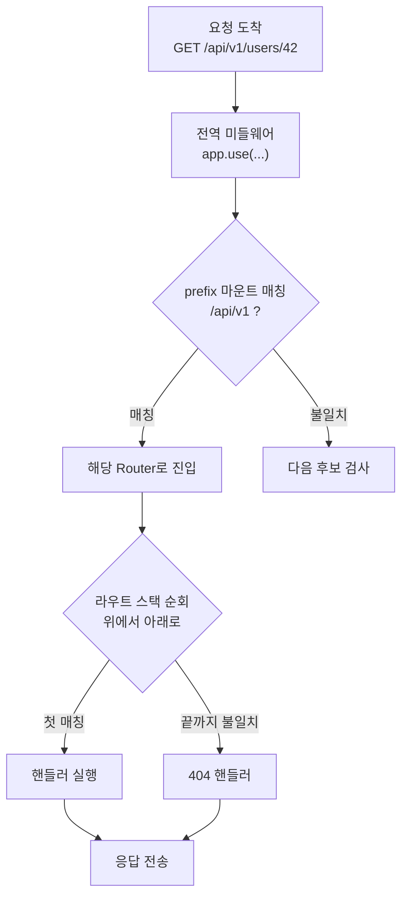

# 애플리케이션 라우팅 (Express / NestJS)

여기서 말하는 라우팅은 패킷이 어느 게이트웨이로 나가느냐가 아니다. 그건 네트워크 계층 이야기고, 이 문서는 HTTP 요청이 프레임워크 안으로 들어온 뒤 **어떤 핸들러 함수에 도달하느냐**만 다룬다. `GET /users/42`가 들어왔을 때 어느 컨트롤러 메서드가 실행되는지, 왜 가끔 엉뚱한 핸들러가 잡아먹는지, 그 해석 과정을 본다.

ALB나 API Gateway, Caddy 같은 앞단 라우팅은 다루지 않는다. 그 계층은 이미 "이 요청은 이 Node 프로세스로" 까지 결정을 끝낸 상태고, 그 뒤 프로세스 내부에서 일어나는 일이 여기 주제다.

## 라우트는 등록 순서대로 매칭된다

Express에서 가장 먼저 알아야 할 사실 하나. 라우트는 **등록된 순서대로 위에서 아래로** 검사되고, 처음 매칭되는 것이 이긴다. 더 구체적인 경로가 자동으로 우선하지 않는다. 먼저 쓴 게 우선이다.

```js
const express = require('express');
const app = express();

app.get('/users/:id', (req, res) => {
  res.send(`user ${req.params.id}`);
});

app.get('/users/me', (req, res) => {
  res.send('current user');
});
```

`GET /users/me`를 호출하면 `current user`가 나올 것 같지만, 실제로는 `user me`가 나온다. `/users/:id`가 먼저 등록됐고, `:id`가 `me`라는 문자열을 그대로 잡아버리기 때문이다. 두 번째 핸들러는 영원히 실행되지 않는다.

이게 실무에서 가장 자주 보는 shadowing 버그다. 고정 경로(`/users/me`, `/users/export`)와 파라미터 경로(`/users/:id`)가 섞여 있으면, 고정 경로를 **반드시 먼저** 등록해야 한다.

```js
// 고정 경로를 위로
app.get('/users/me', handler);
app.get('/users/export', handler);
app.get('/users/:id', handler);
```

라우트가 수십 개 넘어가면 이 순서를 사람이 일일이 지키기 어렵다. 그래서 팀에서 쓰는 방법은 두 가지로 갈린다. 하나는 파라미터 라우트를 파일 맨 아래로 모는 컨벤션을 정하는 것, 다른 하나는 `:id`에 제약을 거는 것이다. 후자는 뒤에서 다룬다.

## path 파라미터, 와일드카드, 정규식

### 파라미터

`:` 으로 시작하는 세그먼트는 파라미터다. `req.params`에 들어온다.

```js
app.get('/posts/:postId/comments/:commentId', (req, res) => {
  // GET /posts/10/comments/3  ->  { postId: '10', commentId: '3' }
  res.json(req.params);
});
```

값은 전부 문자열이다. `postId`가 숫자처럼 생겼어도 `'10'`이지 `10`이 아니다. 숫자로 다룰 거면 직접 변환하고, 변환 실패를 검증해야 한다. NestJS는 `ParseIntPipe`가 이 변환과 검증을 한 번에 해준다.

### 와일드카드 (Express 4 → 5 변경점)

와일드카드는 Express 4와 5에서 문법이 달라졌다. 이걸 모르고 버전 올리면 라우트가 통째로 안 잡힌다.

Express 4에서는 익명 `*`를 썼다.

```js
// Express 4
app.get('/files/*', (req, res) => {
  res.send(req.params[0]); // 매칭된 나머지 경로가 인덱스 0에
});
```

Express 5는 내부 path-to-regexp가 메이저 업그레이드되면서 **와일드카드에 이름을 붙여야 한다**. 익명 `*`는 더 이상 동작하지 않고 에러를 던진다.

```js
// Express 5
app.get('/files/*splat', (req, res) => {
  res.send(req.params.splat); // 이름으로 접근
});
```

`/files/a/b/c.png` 를 호출하면 `splat`에 `a/b/c.png`가 들어온다. 옵셔널 파라미터도 `:id?`에서 `{:id}` 문법으로 바뀌었다. Express 4 코드를 5로 올릴 때 라우트 정의가 안 잡히면 거의 이 문제다.

### 정규식 라우트

문자열 패턴으로 안 되는 매칭은 정규식을 직접 넘긴다. `:id`가 숫자만 받게 만드는 흔한 예다.

```js
// 숫자만 :id로 받는다. /users/me 같은 문자열은 안 잡힌다
app.get(/^\/users\/(\d+)$/, (req, res) => {
  res.send(`user ${req.params[0]}`);
});
```

이렇게 하면 앞에서 본 shadowing 문제가 줄어든다. `/users/:id`가 숫자만 받으면 `/users/me`는 이 라우트를 통과해서 다음 핸들러로 넘어간다. 다만 정규식 라우트는 가독성이 떨어지고, 정규식 매칭 비용이 라우트마다 붙는다. 라우트가 많은 서버에서 전부 정규식으로 쓰면 매칭이 느려진다. 꼭 필요한 곳에만 쓴다.

## 라우터 분리와 마운트

라우트를 전부 `app`에 직접 붙이면 파일 하나가 수천 줄이 된다. `express.Router()`로 기능 단위로 쪼개고 마운트한다.

```js
// routes/users.js
const router = require('express').Router();

router.get('/', listUsers);       // 실제 경로는 마운트 지점에 따라 결정됨
router.get('/:id', getUser);
router.post('/', createUser);

module.exports = router;
```

```js
// app.js
const usersRouter = require('./routes/users');
app.use('/api/v1/users', usersRouter);
```

핵심은 라우터 내부의 경로가 **마운트 지점 기준 상대 경로**라는 것이다. `router.get('/:id')`는 `/api/v1/users/:id`가 된다. 라우터 파일만 보면 최종 경로를 알 수 없다. 마운트 위치를 바꾸면 그 아래 모든 경로가 한꺼번에 바뀐다.

마운트 자체도 순서가 있다. `app.use('/api', a)`와 `app.use('/api/v1', b)`를 등록했는데 `a`가 먼저면, `/api/v1/...` 요청도 `a`가 먼저 검사한다. prefix 마운트는 정확히 그 prefix로 시작하는 모든 요청을 후보로 잡기 때문이다.

### 버저닝

`/api/v1`, `/api/v2`를 가르는 가장 단순한 방법은 라우터를 버전별로 만들고 prefix로 마운트하는 것이다.

```js
app.use('/api/v1', require('./routes/v1'));
app.use('/api/v2', require('./routes/v2'));
```

v1과 v2가 대부분 같고 일부만 다르면, 공통 라우터를 v2가 import해서 바뀐 핸들러만 덮어쓰는 식으로 중복을 줄인다. 다만 이때도 라우트 등록 순서가 그대로 우선순위라서, 덮어쓰려는 라우트를 공통 라우트보다 먼저 등록해야 한다.

## NestJS 라우팅

NestJS는 Express(기본) 또는 Fastify 위에서 동작하지만, 라우트를 등록 순서로 다루지 않고 **데코레이터 메타데이터**로 다룬다. 그래서 Express에서 손으로 신경 쓰던 순서 문제가 상당 부분 사라진다. 대신 다른 함정이 있다.

```ts
@Controller('users')           // prefix: /users
export class UsersController {
  @Get()                       // GET /users
  findAll() {}

  @Get('me')                   // GET /users/me
  me() {}

  @Get(':id')                  // GET /users/:id
  findOne(@Param('id') id: string) {}
}
```

NestJS 컨트롤러 안에서는 정적 경로(`me`)가 파라미터 경로(`:id`)보다 먼저 매칭되도록 라우트를 정렬해준다. 그래서 같은 컨트롤러 안에 `me`와 `:id`를 같이 둬도 Express에서처럼 가려지지 않는다. 하지만 이 정렬은 **한 컨트롤러 내부**에서만 보장된다. 서로 다른 컨트롤러에 흩어져 있으면 모듈 등록 순서를 탄다. 특히 `@Controller('*')`나 catch-all 컨트롤러를 만들면 등록 위치에 따라 다른 컨트롤러를 가릴 수 있다.

### 버전 prefix

전역 prefix와 버저닝은 코드로 건다.

```ts
const app = await NestFactory.create(AppModule);
app.setGlobalPrefix('api');           // 모든 라우트 앞에 /api
app.enableVersioning({                // /api/v1, /api/v2
  type: VersioningType.URI,
  defaultVersion: '1',
});
```

```ts
@Controller({ path: 'users', version: '2' })  // GET /api/v2/users
export class UsersV2Controller {}
```

`setGlobalPrefix`에 예외를 두고 싶으면(헬스체크 `/health`는 prefix 없이) `exclude` 옵션으로 뺀다. 이걸 모르고 모니터링 헬스체크가 `/api/health`로 바뀌어서 로드밸런서가 인스턴스를 죽은 걸로 판단하는 사고가 종종 난다.

### 라우트별 Guard / Pipe / Middleware 바인딩

NestJS의 실무적 강점은 라우트 단위로 횡단 관심사를 붙이는 지점이 명확하다는 것이다. 적용 범위가 넓은 순서대로 전역 → 컨트롤러 → 메서드다.

```ts
@Controller('orders')
@UseGuards(AuthGuard)                // 컨트롤러 전체에 인증
export class OrdersController {

  @Get()
  findAll() {}                       // AuthGuard 적용

  @Delete(':id')
  @UseGuards(AdminGuard)             // 이 메서드만 추가로 관리자 권한
  @UsePipes(new ParseIntPipe())      // 이 메서드 파라미터 변환/검증
  remove(@Param('id') id: number) {}
}
```

Guard는 핸들러 실행 여부를 결정하고(인증·인가), Pipe는 들어온 인자를 변환·검증하고, Interceptor는 핸들러 앞뒤를 감싼다. 실행 순서는 미들웨어 → Guard → Interceptor(전) → Pipe → 핸들러 → Interceptor(후) 다. 인증이 안 됐는데 Pipe에서 검증 에러가 먼저 터지는 게 싫으면, 이 순서를 기억해야 한다. Guard가 Pipe보다 먼저 도니까 인증 실패는 검증보다 먼저 차단된다.

미들웨어만은 데코레이터가 아니라 모듈의 `configure`에서 경로를 지정해 바인딩한다.

```ts
export class AppModule implements NestModule {
  configure(consumer: MiddlewareConsumer) {
    consumer
      .apply(LoggerMiddleware)
      .forRoutes({ path: 'users/*', method: RequestMethod.GET });
  }
}
```

여기서 `users/*` 경로 매칭은 내부적으로 Express의 path 매칭을 쓰기 때문에, Express 5 기반이면 앞서 본 와일드카드 문법 변경이 그대로 영향을 준다.

## trailing slash, 대소문자, 404

### trailing slash

`/users`와 `/users/`는 같은가 다른가. Express는 기본적으로 `strict routing`이 꺼져 있어서 둘을 같게 취급한다. 켜면 다르게 본다.

```js
const app = express();
app.set('strict routing', true);   // /users 와 /users/ 를 구분
```

켜는 순간 `/users`로 등록한 라우트는 `/users/`를 안 잡는다. 클라이언트가 trailing slash를 붙여 보내면 404가 난다. 끄든 켜든 상관없지만, **앞단(ALB, Nginx)이 슬래시를 정규화하는지**와 합쳐서 봐야 한다. 앞단이 슬래시를 떼고 보내는데 strict routing이 켜져 있으면, 캐시되거나 북마크된 슬래시 URL이 환경마다 다르게 동작한다.

### 대소문자

기본적으로 라우트는 대소문자를 가리지 않는다. `/Users`도 `/users` 라우트에 매칭된다. `case sensitive routing`을 켜면 구분한다.

```js
app.set('case sensitive routing', true);  // /Users 와 /users 를 구분
```

대부분 끈 채로 두는데, REST 경로를 소문자로 강제하는 정책이 있으면 켜고 대문자 요청을 404로 떨군다.

### 404 fallthrough

매칭되는 라우트가 하나도 없으면 어떻게 되는가. Express는 등록된 라우트를 끝까지 검사하고 아무것도 안 잡히면, 마지막에 등록된 핸들러로 흘러간다(fall through). 그래서 404 핸들러는 **모든 라우트 등록이 끝난 뒤 맨 마지막에** 둔다.

```js
// 모든 라우트 등록 후 맨 아래
app.use((req, res) => {
  res.status(404).json({ message: 'Not Found', path: req.originalUrl });
});

// 에러 핸들러는 그보다 더 아래 (인자 4개)
app.use((err, req, res, next) => {
  res.status(500).json({ message: 'Internal Server Error' });
});
```

이 404 핸들러를 라우트 등록 중간에 두면, 그 아래 라우트는 전부 죽는다. 모든 요청이 404 핸들러에서 멈추기 때문이다. 이것도 shadowing의 한 형태다.

NestJS에서는 매칭 실패 시 프레임워크가 자동으로 `404 Not Found`를 내려준다. 응답 형식을 바꾸려면 catch-all 라우트 대신 글로벌 `ExceptionFilter`에서 `NotFoundException`을 가공한다. catch-all 컨트롤러로 404를 처리하려 들면 다른 정상 라우트를 가리는 사고가 나기 쉽다.

## 라우트 충돌과 shadowing 디버깅

"분명 핸들러를 만들었는데 안 탄다"는 상황의 원인은 거의 정해져 있다.

**먼저 어떤 라우트가 실제로 등록됐는지 본다.** Express는 등록된 라우트 스택을 들고 있어서 직접 찍어볼 수 있다.

```js
// Express 4 기준. 등록 순서대로 라우트가 나온다
app._router.stack
  .filter((layer) => layer.route)
  .forEach((layer) => {
    const methods = Object.keys(layer.route.methods).join(',').toUpperCase();
    console.log(`${methods} ${layer.route.path}`);
  });
```

출력 순서가 곧 매칭 우선순위다. 찾는 라우트보다 위에 그걸 가리는 라우트가 있는지 본다. (Express 5는 내부 구조가 바뀌어 `app._router` 대신 `app.router`를 쓴다. 버전에 따라 경로가 다르니 실제 객체를 한 번 찍어 구조를 확인하고 접근한다.)

**그 다음 의심 순서는 이렇다.**

파라미터 라우트가 고정 라우트를 먼저 잡는가. `/users/:id`가 `/users/me` 위에 있으면 이 경우다. 순서를 바꾸거나 `:id`에 정규식 제약을 건다.

prefix 마운트가 겹치는가. `app.use('/api', ...)`가 더 구체적인 `app.use('/api/v1', ...)`보다 먼저 등록돼서 요청을 가로채는 경우다.

미들웨어가 `next()`를 안 부르는가. 라우트는 맞게 매칭됐는데 그 앞 미들웨어가 응답을 끝내버리거나 `next()`를 호출하지 않으면 핸들러까지 도달하지 못한다. 이건 라우트 문제처럼 보이지만 미들웨어 흐름 문제다.

HTTP 메서드가 다른가. `GET /users`는 등록했는데 `POST /users`를 안 했으면, POST 요청은 매칭 실패로 404가 아니라 405가 기대되지만 Express 기본은 그냥 404로 떨군다. 메서드까지 같이 봐야 한다.

NestJS에서 라우트가 안 잡히면 부팅 로그를 본다. NestJS는 시작할 때 매핑된 라우트를 전부 로그로 찍는다.

```
[RouterExplorer] Mapped {/api/v1/users, GET} route
[RouterExplorer] Mapped {/api/v1/users/:id, GET} route
```

여기에 안 보이면 컨트롤러가 모듈에 등록 안 됐거나, prefix/version 설정이 예상과 다른 것이다. 로그에 찍힌 경로가 곧 실제 경로다. 머릿속 경로와 로그가 다르면 로그가 맞다.

## 요청 하나가 핸들러까지 가는 흐름

Express 기준으로 요청이 들어와서 핸들러에 도달하기까지를 그리면 이렇다.



매칭은 위에서 아래로 한 번 훑고 처음 걸리는 데서 멈춘다. 이 단순한 규칙 하나가 이 문서에 나온 거의 모든 버그의 뿌리다. 등록 순서를 의식하고, 안 잡힐 땐 등록된 라우트 목록부터 찍어보는 습관이 디버깅 시간을 가장 많이 줄여준다.
