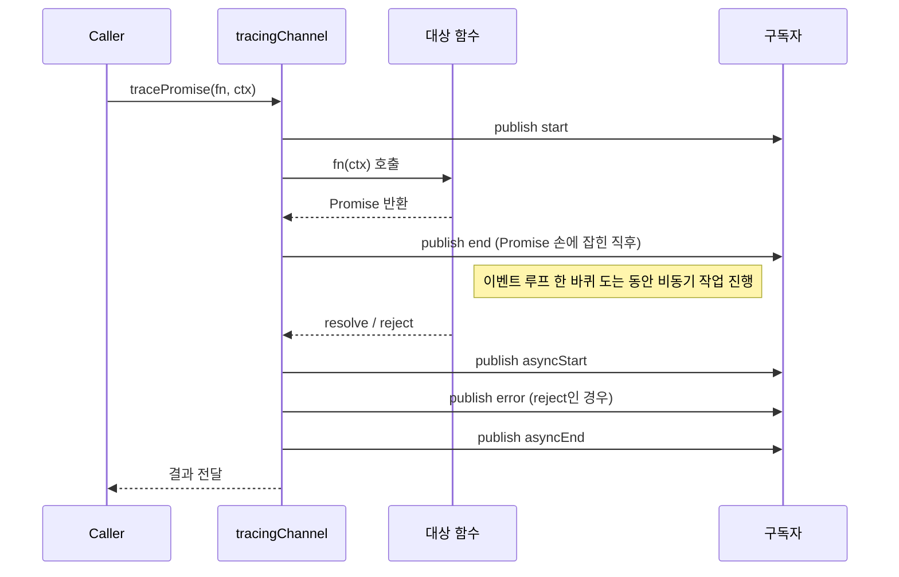
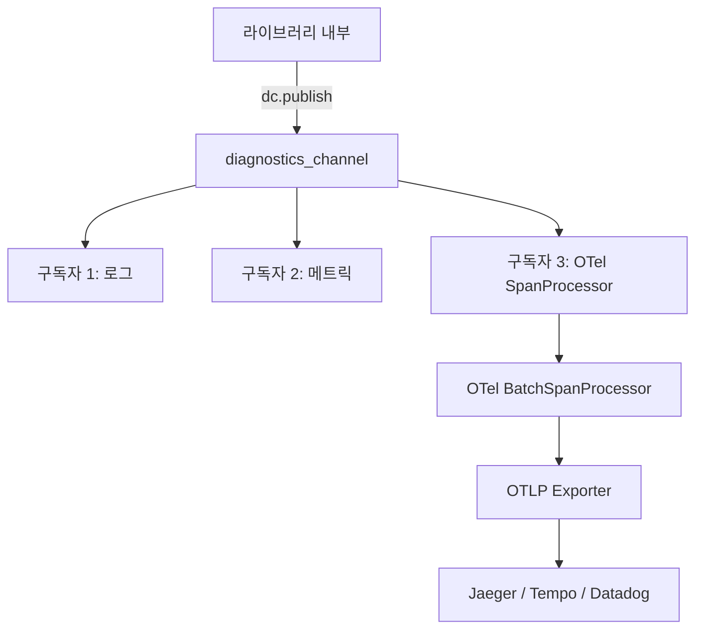

# Node.js diagnostics_channel 모듈 심화

`diagnostics_channel`은 Node 14.17부터 들어온 코어 모듈이다. 이름 그대로 "프로세스 내부 이벤트를 채널로 흘려보내는 통로"다. 라이브러리는 자기 내부 상태(요청 시작·DB 쿼리 시작·에러 발생)를 채널에 publish만 하고, 관찰자는 같은 채널을 subscribe만 한다. 둘은 서로를 모른다.

비슷한 일을 하는 모듈이 이미 여러 개 있다. `EventEmitter`도 있고, `async_hooks`도 있고, OpenTelemetry SDK도 있다. 그런데 다 한자리에서 안 된다.

- `EventEmitter`: 인스턴스 단위라 라이브러리 외부에서 후킹하기가 번거롭다. http 모듈에 직접 listener 박기는 어렵다.
- `async_hooks`: 너무 저수준이라 모든 비동기 자원에 콜백이 붙는다. 운영에서 켜두면 무겁다.
- OpenTelemetry: 강력하지만 SDK·계측 라이브러리·익스포터까지 의존성이 길다. 그냥 "쿼리 하나 찍히는 거 보고 싶다" 수준에는 과하다.

`diagnostics_channel`은 이 사이를 메운다. 명명된 채널에 메시지를 흘리고, 외부에서 누가 듣든 말든 발행자는 모른다. 구독자가 0명일 때는 `publish` 호출 자체가 거의 공짜다(`hasSubscribers`로 가드). 라이브러리가 부담 없이 계측 포인트를 박을 수 있다는 점이 핵심이다.

이 문서는 5년차쯤 된 백엔드 개발자가 운영 코드에 이걸 박아본 경험을 정리한 것이다. API 나열보다는 "왜 이걸 쓰는가, 어디서 함정에 빠지는가"를 중심에 둔다.

---

## 1. 채널이라는 추상화

`diagnostics_channel`의 모델은 단순하다.

```javascript
const dc = require('node:diagnostics_channel');

// 발행자
const channel = dc.channel('my-app:user-login');

if (channel.hasSubscribers) {
  channel.publish({ userId: 42, ts: Date.now() });
}

// 구독자(완전히 다른 파일)
const dc2 = require('node:diagnostics_channel');
dc2.subscribe('my-app:user-login', (message, name) => {
  console.log(name, message);
});
```

여기서 채널 객체는 같은 이름이면 같은 인스턴스다. `dc.channel('x')`를 두 번 호출하면 동일한 객체가 돌아온다. 이 점이 중요하다. 라이브러리가 모듈 로딩 시점에 채널을 만들고, 사용자가 나중에 같은 이름으로 채널을 잡아도 둘은 자동으로 연결된다.

**`hasSubscribers` 가드를 빼먹지 마라.** publish는 객체 리터럴을 만들어 넘기는 일이 잦은데, 구독자가 없는 상태에서 매 요청마다 객체 할당하면 GC 압박이 의외로 크다.

```javascript
// 안 좋은 패턴
channel.publish({ req, res, route, startTime: process.hrtime.bigint() });

// 좋은 패턴
if (channel.hasSubscribers) {
  channel.publish({ req, res, route, startTime: process.hrtime.bigint() });
}
```

운영에서 한번 RPS 5만짜리 서비스에 가드 없이 박았다가 응답시간 p99가 3ms 오른 적이 있다. 구독자가 0명이어도 페이로드 객체는 매번 만들어지기 때문이다.

### 채널 이름 규칙

표준은 콜론 구분 네임스페이스를 쓴다. Node 코어가 쓰는 채널은 모두 점·콜론 표기다.

- `http.client.request.start`
- `http.server.request.start`
- `net.client.socket`
- `dns.lookup.start`

사내 라이브러리를 만든다면 `회사명:모듈명:이벤트` 같은 형태로 잡는 게 충돌이 없다. 예: `acme:userservice:login.start`.

---

## 2. publish / subscribe / unsubscribe

기본 API는 셋이다.

```javascript
const dc = require('node:diagnostics_channel');

const onMessage = (message, name) => {
  // message: 발행자가 넘긴 페이로드
  // name: 채널 이름. 한 콜백을 여러 채널에 붙일 때 식별용.
};

dc.subscribe('http.client.request.start', onMessage);

// 해제할 때는 같은 함수 참조가 필요하다
dc.unsubscribe('http.client.request.start', onMessage);
```

화살표 함수를 인라인으로 넘기면 절대 해제 못 한다. 이건 `EventEmitter`와 똑같은 함정인데, 이 모듈은 메모리 누수 검출이 따로 없어서 더 조용히 새어 나간다. 테스트 코드에서 `beforeEach`로 구독하고 `afterEach`로 해제하는 패턴을 만들 때 특히 조심해야 한다.

### 구독자가 publish 도중 throw하면

이게 함정이다. 구독자 콜백 안에서 예외가 던져지면 그 예외는 **발행자 측으로 전파된다**. 즉, 관찰 코드 한 줄이 비즈니스 코드를 죽일 수 있다.

```javascript
dc.subscribe('http.client.request.start', (msg) => {
  msg.req.path.toLowerCase(); // path가 undefined면 TypeError
});

// 다른 어딘가에서
http.get('http://example.com'); // 이 호출이 위 TypeError로 죽는다
```

구독자 코드는 항상 try/catch로 감싸는 게 안전하다. 라이브러리를 만든다면 더 그렇다.

```javascript
dc.subscribe('http.client.request.start', (msg, name) => {
  try {
    instrumentRequest(msg);
  } catch (err) {
    // 절대 다시 throw하지 마라
    logger.warn({ err, channel: name }, 'instrumentation failed');
  }
});
```

---

## 3. TracingChannel — 분산 추적의 표준 진입점

Node 19.9 / 20에서 `dc.tracingChannel`이 추가됐다. 단일 이벤트가 아니라 "스팬 하나의 라이프사이클"을 한 묶음으로 다루기 위한 추상화다.

`tracingChannel('namespace')`를 호출하면 다음 5개 서브채널이 자동으로 만들어진다.

| 서브채널 | 시점 |
|---|---|
| `tracing:namespace:start` | 작업 시작 직전 |
| `tracing:namespace:end` | 동기 본문 종료(Promise 반환 시점 포함) |
| `tracing:namespace:asyncStart` | 비동기 작업 resolve/reject 직후 |
| `tracing:namespace:asyncEnd` | 비동기 작업 완료 후 후처리 끝 |
| `tracing:namespace:error` | 예외 또는 reject 발생 시 |

수동으로 5개 채널을 publish하지 않고, `traceSync`·`tracePromise`·`traceCallback` 헬퍼가 알아서 발행해준다.

```javascript
const dc = require('node:diagnostics_channel');

const channels = dc.tracingChannel('acme:db:query');

async function runQuery(sql, params) {
  return channels.tracePromise(
    async (ctx) => {
      // ctx는 start에서 채운 컨텍스트 객체. end/asyncEnd에도 같은 객체가 전달된다.
      return await pool.query(sql, params);
    },
    { sql, params }, // 초기 컨텍스트
  );
}
```

구독자 입장에선 한 작업의 시작·끝·에러를 같은 컨텍스트 객체로 받는다.

```javascript
channels.subscribe({
  start(message) {
    message.startTime = process.hrtime.bigint();
  },
  end(message) {
    // 동기 종료. tracePromise를 쓰면 Promise 반환 시점에 호출된다.
  },
  asyncStart(message) {
    // resolve 직후
  },
  asyncEnd(message) {
    const elapsedNs = process.hrtime.bigint() - message.startTime;
    metrics.histogram('db.query.duration', Number(elapsedNs) / 1e6);
  },
  error(message) {
    // message.error에 예외 객체가 들어있다
    logger.error({ err: message.error, sql: message.sql }, 'query failed');
  },
});
```

### 왜 start와 asyncStart가 분리되어 있나

처음 보면 헷갈리는 부분이다. 비동기 함수에서 start와 end는 같은 마이크로태스크에서 일어난다.



스팬 측정의 실제 종료 시점은 `asyncEnd`다. `end`는 동기 본문이 끝났다는 신호일 뿐이고, 진짜 작업은 아직 안 끝났을 수 있다. 그러니 OpenTelemetry 같은 백엔드에 스팬을 닫을 때는 `asyncEnd`에서 닫아야 한다.

### tracingChannel과 컨텍스트 객체

`tracePromise(fn, context)`에 넘긴 두 번째 인자는 모든 서브채널에 같은 객체로 전달된다. **이걸 활용해서 스팬 ID 같은 걸 start에서 박고 asyncEnd에서 꺼내 쓰면 된다.**

```javascript
channels.subscribe({
  start(ctx) {
    ctx.span = tracer.startSpan('db.query');
    ctx.span.setAttribute('db.statement', ctx.sql);
  },
  error(ctx) {
    ctx.span?.recordException(ctx.error);
    ctx.span?.setStatus({ code: SpanStatusCode.ERROR });
  },
  asyncEnd(ctx) {
    ctx.span?.end();
  },
});
```

이 패턴이 OpenTelemetry 공식 인스트루멘테이션이 내부적으로 쓰는 방식이다.

---

## 4. AsyncLocalStorage와의 결합 — 요청 단위 추적

`diagnostics_channel`만으로는 "지금 들어온 이 publish가 어느 요청의 것인지" 식별할 수 없다. 요청 ID를 페이로드에 박아 보내는 라이브러리가 거의 없기 때문이다. 그래서 `AsyncLocalStorage`(ALS)와 결합한다.

ALS는 비동기 작업 사슬을 따라가며 동일한 컨텍스트를 유지해주는 코어 API다. 구조는 단순하다.

```javascript
const { AsyncLocalStorage } = require('node:async_hooks');

const requestContext = new AsyncLocalStorage();

// HTTP 진입점
app.use((req, res, next) => {
  const store = {
    requestId: req.headers['x-request-id'] ?? crypto.randomUUID(),
    userId: req.user?.id,
    startTime: process.hrtime.bigint(),
  };
  requestContext.run(store, () => next());
});

// 어디서든 꺼내 쓸 수 있다
function getCurrentRequest() {
  return requestContext.getStore();
}
```

여기에 `diagnostics_channel` 구독자를 붙이면, 라이브러리가 publish할 때마다 "현재 처리 중인 요청" 정보를 자동으로 끌어올 수 있다.

```javascript
const channels = dc.tracingChannel('http.client');

channels.subscribe({
  start(ctx) {
    const reqCtx = requestContext.getStore();
    if (!reqCtx) return; // 요청 컨텍스트 밖에서 호출된 경우
    ctx.parentRequestId = reqCtx.requestId;
    ctx.span = tracer.startSpan('outbound.http', {
      attributes: { 'http.url': ctx.request.url },
    });
  },
  asyncEnd(ctx) {
    ctx.span?.end();
  },
});
```

### ALS의 비용

운영에서 ALS는 `async_hooks` 기반이라 비용이 있긴 하다. 그래도 v14 이후로 V8 내부 최적화(`AsyncContextFrame`)가 들어가서 옛날만큼 무겁지는 않다. Node 21부터는 `--experimental-async-context-frame` 플래그로 더 가벼운 구현을 쓸 수 있다.

체감상 RPS 1만짜리 서비스에 ALS 하나 깔아도 p99 영향은 1ms 미만이다. 다중 ALS를 박는 건 피해야 한다.

### 컨텍스트 분실 패턴

ALS를 쓰면서 가장 흔히 겪는 문제는 컨텍스트가 어느 순간 비어버리는 것이다. 원인은 보통 둘이다.

1. **이벤트 리스너 등록 시점 문제**: `EventEmitter`에 리스너를 등록한 시점의 컨텍스트가 아니라, 리스너가 호출되는 시점의 컨텍스트가 보인다. 컨텍스트가 있던 시점에 등록했더라도 실제 실행은 다른 비동기 흐름에서 일어나면 컨텍스트는 비어 있다.
2. **외부 큐를 거치는 작업**: Redis BLPOP, Kafka consumer처럼 이벤트 루프 밖에서 깨어나는 흐름은 ALS 사슬이 끊긴다. 메시지 헤더에 requestId를 박아서 재진입 시점에 다시 `run`으로 감싸야 한다.

```javascript
// Kafka consumer 예시
consumer.run({
  eachMessage: async ({ message }) => {
    const ctx = {
      requestId: message.headers['x-request-id']?.toString() ?? crypto.randomUUID(),
    };
    await requestContext.run(ctx, () => handleMessage(message));
  },
});
```

---

## 5. Node 코어가 이미 발행하는 채널들

직접 publish할 필요 없이 Node가 알아서 발행해주는 채널이 있다. 이걸 알면 외부 패키지 없이도 HTTP·DNS·net 동작을 모니터링할 수 있다.

| 채널 | 발행 시점 |
|---|---|
| `http.client.request.start` | http 클라이언트 요청 만들기 시작 |
| `http.client.request.created` | 요청 객체 생성 직후 |
| `http.client.response.finish` | 응답 받고 종료 |
| `http.server.request.start` | 서버가 요청 받기 시작 |
| `http.server.response.created` | 응답 객체 만들고 |
| `http.server.response.finish` | 응답 전송 완료 |
| `net.client.socket` | TCP 클라이언트 소켓 생성 |
| `net.server.socket` | TCP 서버가 새 연결 받음 |
| `dns.lookup.start` / `dns.lookup.end` | DNS 조회 |

간단한 액세스 로그를 이걸로 구현하면 다음과 같다.

```javascript
const dc = require('node:diagnostics_channel');

dc.subscribe('http.server.request.start', ({ request }) => {
  request._startTime = process.hrtime.bigint();
});

dc.subscribe('http.server.response.finish', ({ request, response }) => {
  const elapsed = Number(process.hrtime.bigint() - request._startTime) / 1e6;
  logger.info({
    method: request.method,
    url: request.url,
    status: response.statusCode,
    elapsedMs: elapsed,
  });
});
```

미들웨어를 안 거치므로 Express·Fastify를 안 쓰는 코어 http 서버에서도 동작한다. 라우팅 라이브러리가 응답을 가로채는 경우에도 빠짐없이 잡힌다는 장점이 있다.

---

## 6. HTTP / DB 드라이버 인스트루멘테이션 패턴

라이브러리 만드는 사람 입장에서, 이걸 어떻게 코어 코드에 박는지를 알아야 한다. 패턴은 거의 같다.

```javascript
// my-db-driver/lib/connection.js
const dc = require('node:diagnostics_channel');

const channels = dc.tracingChannel('acme-db:query');

class Connection {
  async query(sql, params) {
    return channels.tracePromise(
      async (ctx) => {
        const result = await this._rawQuery(ctx.sql, ctx.params);
        ctx.rowCount = result.rowCount;
        return result;
      },
      { sql, params, connection: this },
    );
  }
}
```

구독자는 외부 사용자가 자기 코드에서 붙이면 된다.

```javascript
// 사용자 측 코드
require('acme-db'); // 모듈 로드 → tracingChannel 등록됨

const channels = dc.tracingChannel('acme-db:query');
channels.subscribe({
  start(ctx) {
    ctx.span = tracer.startSpan('db.query');
    ctx.span.setAttribute('db.statement', ctx.sql);
  },
  error(ctx) {
    ctx.span?.recordException(ctx.error);
  },
  asyncEnd(ctx) {
    ctx.span?.setAttribute('db.rows', ctx.rowCount ?? 0);
    ctx.span?.end();
  },
});
```

라이브러리에서 신경 쓸 점이 몇 가지 있다.

- **민감 데이터를 페이로드에 넣지 마라.** SQL의 바인드 파라미터에 비밀번호·토큰이 있을 수 있다. `sql` 본문은 넘기되 `params`는 환경변수로 켜졌을 때만 포함하는 식이 안전하다.
- **컨텍스트 객체에 큰 객체를 넣지 마라.** start에 connection 인스턴스를 통째로 넣으면 구독자가 무심코 직렬화했다가 메모리 폭발이 난다. 필요한 필드만 추려라.
- **버전 문서화.** 채널 이름과 페이로드 형태는 사실상 공개 API다. 깨면 사용자 인스트루멘테이션이 다 깨진다. semver 영향권으로 다뤄야 한다.

### 모듈 패치(monkey-patch) 대비 장점

기존 APM이 하는 일을 보면, `require('pg')`를 가로채서 `Client.prototype.query`를 직접 감싸는 식이다. 동작은 하지만 매번 라이브러리 버전마다 패치를 다시 맞춰야 한다.

`diagnostics_channel`을 라이브러리가 직접 박으면 그럴 필요가 없다. 라이브러리 내부 구현이 바뀌어도 채널 이름과 페이로드만 유지하면 외부 관찰자는 그대로 동작한다.

---

## 7. OpenTelemetry와의 차이

자주 받는 질문이다. "이거 있으면 OpenTelemetry 안 써도 되나?"

답은 "추적 코드의 진입점은 같지만, 백엔드까지의 파이프라인은 완전히 다르다"이다.



- `diagnostics_channel`은 **이벤트가 발생했다**는 신호만 흘린다. 어디로 보낼지, 어떻게 묶을지는 모른다.
- OpenTelemetry는 **스팬 모델 + 컨텍스트 전파 + 배치 + 익스포터**까지 다 포함하는 사양·SDK다.

OTel을 쓰는 환경에서 `diagnostics_channel`은 보통 **계측 라이브러리의 진입점** 역할을 한다. `@opentelemetry/instrumentation-undici`가 내부적으로 undici의 `tracingChannel`을 구독해서 스팬을 만든다. 즉 둘은 경쟁자가 아니라 계층이 다른 도구다.

### 언제 dc만으로 충분한가

다음 정도라면 OTel 없이 dc만으로도 운영 가능하다.

- 외부로 추적 데이터를 보낼 백엔드(Jaeger·Datadog 등)가 없고 단순히 로그·메트릭만 필요할 때
- 자사 메트릭 시스템(Prometheus·StatsD)에 직접 보내는 게 더 간단할 때
- "느린 쿼리만 잡아내고 싶다" 같은 단일 목적

다음 경우에는 OTel을 쓰는 게 맞다.

- 마이크로서비스 간 트레이스 전파(`traceparent` 헤더)가 필요할 때
- 표준 시맨틱 컨벤션(`http.method`, `db.statement` 등)을 따라 외부 도구와 호환되어야 할 때
- 샘플링·배치·재시도 같은 운영 기능이 필요할 때

---

## 8. 실전 함정 모음

### 8.1 구독자가 안 붙는 것처럼 보일 때

라이브러리 모듈이 채널을 만드는 시점이 사용자가 subscribe 호출하는 시점보다 늦으면 첫 publish를 놓친다. 같은 이름이면 객체가 같다는 규칙 때문에 보통은 문제가 없지만, 라이브러리 측에서 `dc.channel(...)` 호출 자체가 지연 로딩이라면 가장 안전한 패턴은 **사용자가 먼저 subscribe**하는 것이다.

```javascript
// 진입점 맨 위에서
const dc = require('node:diagnostics_channel');
dc.subscribe('acme-db:query:start', myListener);

// 이후에 라이브러리 import
const db = require('acme-db');
```

### 8.2 unsubscribe 누락

테스트 격리에서 가장 자주 겪는다. test runner가 워커를 재사용하면 구독자가 계속 누적된다.

```javascript
describe('user service', () => {
  let listener;
  beforeEach(() => {
    listener = jest.fn();
    dc.subscribe('user:login', listener);
  });
  afterEach(() => {
    dc.unsubscribe('user:login', listener);
  });
});
```

`afterEach`를 빼먹으면 다른 테스트 케이스가 같은 listener에 의해 jest mock 카운트가 누적된다. 한참 디버깅하다 보면 listener가 100개씩 붙어 있는 걸 발견한다.

### 8.3 페이로드 객체 재사용

성능을 위해 페이로드 객체를 재사용하고 싶을 수 있다. 절대 그러지 마라. 구독자가 비동기로 페이로드를 잡고 있을 수 있다.

```javascript
// 잘못된 예
const payload = {};
function publishStart(req) {
  payload.req = req;
  payload.ts = Date.now();
  channel.publish(payload); // 구독자가 payload를 큐에 넣어두면 다음 publish에서 덮어쓴다
}
```

매번 새 객체를 만들어라. `tracingChannel`은 이걸 자동으로 해준다.

### 8.4 동기 vs 비동기 함수와 trace 헬퍼

`traceSync`는 callback이 동기 값을 반환할 때 쓴다. `tracePromise`는 Promise를 반환할 때다. 동기 함수에 `tracePromise`를 쓰면 `asyncStart`/`asyncEnd`가 호출되지 않거나 이상한 타이밍에 호출된다.

내가 짠 함수가 Promise를 반환하는지 헷갈리면 `async` 키워드를 붙여서 강제로 Promise로 만든 다음 `tracePromise`를 쓰는 게 안전하다.

---

## 9. 정리

`diagnostics_channel`은 운영 환경에서 라이브러리가 "내가 이거 했어"라고 알리는 표준 통로다. EventEmitter처럼 직관적이면서, async_hooks처럼 강력한 컨텍스트 전파(`tracingChannel`)를 갖고 있다. APM이나 OTel을 쓰더라도 그 밑에서 어떻게 데이터가 모이는지 이해해두면 인스트루멘테이션이 안 먹을 때 원인 파악이 빠르다.

직접 라이브러리를 만든다면 `tracingChannel`로 시작하라. 회사 코드라면 ALS와 결합해 요청 ID 기반 로그/메트릭을 먼저 깔고, 외부 트레이스 백엔드를 도입할 때 OTel SpanProcessor를 같은 채널에 붙이면 된다. 이미 박아둔 publish는 그대로 두고 구독자만 새로 붙이면 그만이다. 이게 `diagnostics_channel`을 쓰는 진짜 이유다.
