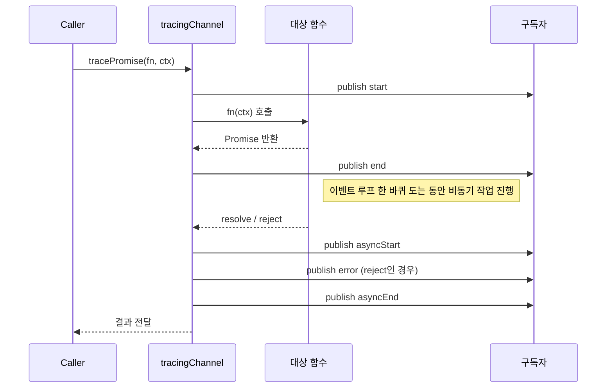
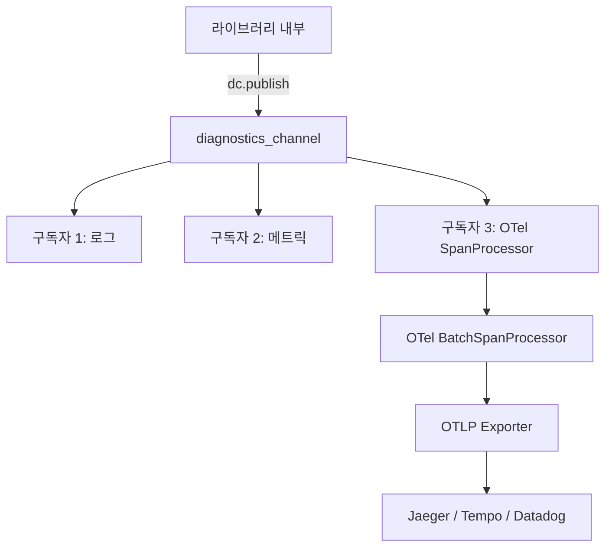

# Node.js diagnostics_channel 모듈 심화

`diagnostics_channel`은 Node 14.17부터 들어온 코어 모듈이다. 이름 그대로 "프로세스 내부 이벤트를 채널로 흘려보내는 통로"다. 라이브러리는 자기 내부 상태(요청 시작·DB 쿼리 시작·에러 발생)를 채널에 publish만 하고, 관찰자는 같은 채널을 subscribe만 한다. 둘은 서로를 모른다.

비슷한 일을 하는 모듈이 이미 여러 개 있다. `EventEmitter`도 있고, `async_hooks`도 있고, OpenTelemetry SDK도 있다. 그런데 다 한자리에서 안 된다.

- `EventEmitter`: 인스턴스 단위라 라이브러리 외부에서 후킹하기가 번거롭다. http 모듈에 직접 listener 박기는 어렵다.
- `async_hooks`: 너무 저수준이라 모든 비동기 자원에 콜백이 붙는다. 운영에서 켜두면 무겁다.
- OpenTelemetry: SDK·계측 라이브러리·익스포터까지 의존성이 길다. 그냥 "쿼리 하나 찍히는 거 보고 싶다" 수준에는 과하다.

`diagnostics_channel`은 이 사이를 메운다. 명명된 채널에 메시지를 흘리고, 외부에서 누가 듣든 말든 발행자는 모른다. 구독자가 0명일 때는 `publish` 호출 자체가 거의 공짜다(`hasSubscribers`로 가드). 라이브러리가 부담 없이 계측 포인트를 박을 수 있다는 점이 핵심이다.

---

## 1. 채널이라는 추상화

`diagnostics_channel`의 모델은 단순하다.

```javascript
const dc = require('node:diagnostics_channel');

// 발행자
const channel = dc.channel('my-app:user-login');

if (channel.hasSubscribers) {
  channel.publish({ userId: 42, ts: Date.now() });
}

// 구독자(완전히 다른 파일)
const dc2 = require('node:diagnostics_channel');
dc2.subscribe('my-app:user-login', (message, name) => {
  console.log(name, message);
});
```

채널 객체는 같은 이름이면 같은 인스턴스다. `dc.channel('x')`를 두 번 호출하면 동일한 객체가 돌아온다. 라이브러리가 모듈 로딩 시점에 채널을 만들고, 사용자가 나중에 같은 이름으로 채널을 잡아도 둘은 자동으로 연결된다.

**`hasSubscribers` 가드를 빼먹지 마라.** publish는 객체 리터럴을 만들어 넘기는 일이 잦은데, 구독자가 없는 상태에서 매 요청마다 객체를 할당하면 GC 압박이 의외로 크다.

```javascript
// 안 좋은 패턴
channel.publish({ req, res, route, startTime: process.hrtime.bigint() });

// 좋은 패턴
if (channel.hasSubscribers) {
  channel.publish({ req, res, route, startTime: process.hrtime.bigint() });
}
```

운영에서 한번 RPS 5만짜리 서비스에 가드 없이 박았다가 응답시간 p99가 3ms 오른 적이 있다. 구독자가 0명이어도 페이로드 객체는 매번 만들어지기 때문이다.

### 채널 이름 규칙

표준은 콜론 구분 네임스페이스를 쓴다. Node 코어가 쓰는 채널은 모두 점·콜론 표기다.

- `http.client.request.start`
- `http.server.request.start`
- `net.client.socket`
- `dns.lookup.start`

사내 라이브러리를 만든다면 `회사명:모듈명:이벤트` 형태로 잡는 게 충돌이 없다. 예: `acme:userservice:login.start`.

---

## 2. publish / subscribe / unsubscribe

기본 API는 셋이다.

```javascript
const dc = require('node:diagnostics_channel');

const onMessage = (message, name) => {
  // message: 발행자가 넘긴 페이로드
  // name: 채널 이름. 한 콜백을 여러 채널에 붙일 때 식별용.
};

dc.subscribe('http.client.request.start', onMessage);

// 해제할 때는 같은 함수 참조가 필요하다
dc.unsubscribe('http.client.request.start', onMessage);
```

화살표 함수를 인라인으로 넘기면 절대 해제 못 한다. `EventEmitter`와 똑같은 함정인데, 이 모듈은 메모리 누수 검출이 따로 없어서 더 조용히 새어 나간다. 테스트 코드에서 `beforeEach`로 구독하고 `afterEach`로 해제하는 패턴을 만들 때 특히 조심해야 한다.

### 구독자가 publish 도중 throw하면

구독자 콜백 안에서 예외가 던져지면 그 예외는 **발행자 측으로 전파된다**. 관찰 코드 한 줄이 비즈니스 코드를 죽일 수 있다.

```javascript
dc.subscribe('http.client.request.start', (msg) => {
  msg.req.path.toLowerCase(); // path가 undefined면 TypeError
});

// 다른 어딘가에서
http.get('http://example.com'); // 이 호출이 위 TypeError로 죽는다
```

구독자 코드는 항상 try/catch로 감싸야 한다.

```javascript
dc.subscribe('http.client.request.start', (msg, name) => {
  try {
    instrumentRequest(msg);
  } catch (err) {
    // 절대 다시 throw하지 마라
    logger.warn({ err, channel: name }, 'instrumentation failed');
  }
});
```

---

## 3. TracingChannel — 분산 추적의 표준 진입점

Node 19.9 / 20에서 `dc.tracingChannel`이 추가됐다. 단일 이벤트가 아니라 "스팬 하나의 라이프사이클"을 한 묶음으로 다루기 위한 추상화다.

`tracingChannel('namespace')`를 호출하면 5개 서브채널이 자동으로 만들어진다.

| 서브채널 | 시점 |
|---|---|
| `tracing:namespace:start` | 작업 시작 직전 |
| `tracing:namespace:end` | 동기 본문 종료(Promise 반환 시점 포함) |
| `tracing:namespace:asyncStart` | 비동기 작업 resolve/reject 직후 |
| `tracing:namespace:asyncEnd` | 비동기 작업 완료 후 후처리 끝 |
| `tracing:namespace:error` | 예외 또는 reject 발생 시 |

수동으로 5개 채널을 publish하지 않고, `traceSync`·`tracePromise`·`traceCallback` 헬퍼가 알아서 발행해준다.

```javascript
const dc = require('node:diagnostics_channel');

const channels = dc.tracingChannel('acme:db:query');

async function runQuery(sql, params) {
  return channels.tracePromise(
    async (ctx) => {
      const result = await pool.query(ctx.sql, ctx.params);
      ctx.rowCount = result.rowCount;
      return result;
    },
    { sql, params },
  );
}
```

구독자 입장에선 한 작업의 시작·끝·에러를 같은 컨텍스트 객체로 받는다.

```javascript
channels.subscribe({
  start(message) {
    message.startTime = process.hrtime.bigint();
  },
  asyncEnd(message) {
    const elapsedNs = process.hrtime.bigint() - message.startTime;
    metrics.histogram('db.query.duration', Number(elapsedNs) / 1e6);
  },
  error(message) {
    logger.error({ err: message.error, sql: message.sql }, 'query failed');
  },
});
```

### 왜 start와 asyncStart가 분리되어 있나

비동기 함수에서 start와 end는 같은 마이크로태스크에서 일어난다.


```mermaid
sequenceDiagram
    participant Caller
    participant Tracing as tracingChannel
    participant Fn as 대상 함수
    participant Sub as 구독자

    Caller->>Tracing: tracePromise(fn, ctx)
    Tracing->>Sub: publish start
    Tracing->>Fn: fn(ctx) 호출
    Fn-->>Tracing: Promise 반환
    Tracing->>Sub: publish end
    Note right of Fn: 이벤트 루프 한 바퀴 도는 동안 비동기 작업 진행
    Fn-->>Tracing: resolve / reject
    Tracing->>Sub: publish asyncStart
    Tracing->>Sub: publish error (reject인 경우)
    Tracing->>Sub: publish asyncEnd
    Tracing-->>Caller: 결과 전달
```

스팬 측정의 실제 종료 시점은 `asyncEnd`다. `end`는 동기 본문이 끝났다는 신호일 뿐이고, 진짜 작업은 아직 안 끝났을 수 있다. OpenTelemetry 백엔드에 스팬을 닫을 때는 `asyncEnd`에서 닫아야 한다.

### 컨텍스트 객체 활용

`tracePromise(fn, context)`에 넘긴 두 번째 인자는 모든 서브채널에 같은 객체로 전달된다. start에서 스팬을 박고 asyncEnd에서 꺼내 쓰면 된다.

```javascript
channels.subscribe({
  start(ctx) {
    ctx.span = tracer.startSpan('db.query');
    ctx.span.setAttribute('db.statement', ctx.sql);
  },
  error(ctx) {
    ctx.span?.recordException(ctx.error);
    ctx.span?.setStatus({ code: SpanStatusCode.ERROR });
  },
  asyncEnd(ctx) {
    ctx.span?.end();
  },
});
```

---

## 4. Node 코어 채널 — HTTP 서버·클라이언트 계측

직접 publish할 필요 없이 Node가 알아서 발행해주는 채널이 있다. 외부 패키지 없이도 HTTP 동작을 모니터링할 수 있다.

### http 모듈 채널

| 채널 | 발행 시점 | 페이로드 |
|---|---|---|
| `http.client.request.start` | 클라이언트 요청 시작 | `{ request }` |
| `http.client.request.created` | 요청 객체 생성 직후 | `{ request }` |
| `http.client.response.finish` | 응답 받고 종료 | `{ request, response }` |
| `http.server.request.start` | 서버가 요청 받기 시작 | `{ request, response }` |
| `http.server.response.created` | 응답 객체 생성 | `{ request, response }` |
| `http.server.response.finish` | 응답 전송 완료 | `{ request, response }` |
| `net.client.socket` | TCP 클라이언트 소켓 생성 | `{ socket }` |
| `dns.lookup.start` / `dns.lookup.end` | DNS 조회 | `{ hostname, ... }` |

서버 사이드 액세스 로그 구현:

```javascript
const dc = require('node:diagnostics_channel');

const startTimes = new WeakMap();

dc.subscribe('http.server.request.start', ({ request }) => {
  startTimes.set(request, process.hrtime.bigint());
});

dc.subscribe('http.server.response.finish', ({ request, response }) => {
  const startTime = startTimes.get(request);
  if (!startTime) return;
  startTimes.delete(request);
  const elapsed = Number(process.hrtime.bigint() - startTime) / 1e6;
  logger.info({
    method: request.method,
    url: request.url,
    status: response.statusCode,
    elapsedMs: elapsed.toFixed(2),
  });
});
```

WeakMap으로 request 객체를 키로 쓰면 GC가 알아서 정리한다. request에 직접 프로퍼티를 붙이는 방식(`request._startTime = ...`)은 외부 코드와 충돌 가능성이 있어서 피하는 편이다.

미들웨어를 안 거치므로 Express·Fastify를 안 쓰는 코어 http 서버에서도 동작하고, 라우팅 라이브러리가 응답을 가로채는 경우에도 빠짐없이 잡힌다.

### undici 채널 — fetch와 Node.js 내장 HTTP 클라이언트

Node 18부터 내장된 `fetch()`와 `undici`는 별도 채널 집합을 쓴다. `http.client.*` 채널과 겹치지 않는다.

| 채널 | 시점 |
|---|---|
| `undici:request:create` | 요청 객체 생성 |
| `undici:request:headers` | 요청 헤더 전송 완료 |
| `undici:request:bodySent` | 요청 바디 전송 완료 |
| `undici:request:trailers` | 응답 수신 완료 |
| `undici:request:error` | 요청 에러 |

```javascript
const dc = require('node:diagnostics_channel');

const pendingRequests = new WeakMap();

dc.subscribe('undici:request:create', ({ request }) => {
  pendingRequests.set(request, {
    startTime: process.hrtime.bigint(),
    url: request.origin + request.path,
    method: request.method,
  });
});

dc.subscribe('undici:request:trailers', ({ request, response }) => {
  const meta = pendingRequests.get(request);
  if (!meta) return;
  pendingRequests.delete(request);
  const elapsed = Number(process.hrtime.bigint() - meta.startTime) / 1e6;
  logger.info({
    outbound: true,
    method: meta.method,
    url: meta.url,
    status: response.statusCode,
    elapsedMs: elapsed.toFixed(2),
  });
});

dc.subscribe('undici:request:error', ({ request, error }) => {
  const meta = pendingRequests.get(request);
  if (!meta) return;
  pendingRequests.delete(request);
  logger.error({ err: error, url: meta.url }, 'outbound request failed');
});
```

`@opentelemetry/instrumentation-undici`가 정확히 이 채널들을 구독해서 스팬을 만든다.

---

## 5. DB 쿼리 계측 — pg 드라이버 래핑

`pg`(node-postgres)는 현재 diagnostics_channel을 내장하지 않는다. 직접 `tracingChannel`로 감싸야 한다.

```javascript
// instrumentation/pg-channel.js
const dc = require('node:diagnostics_channel');
const { Pool } = require('pg');

const queryChannels = dc.tracingChannel('acme:pg:query');

function createInstrumentedPool(config) {
  const pool = new Pool(config);
  const originalQuery = pool.query.bind(pool);

  pool.query = async function(text, values) {
    const sql = typeof text === 'string' ? text : text.text;
    const params = typeof text === 'string' ? values : text.values;

    return queryChannels.tracePromise(
      async (ctx) => {
        const result = await originalQuery(ctx.sql, ctx.params);
        ctx.rowCount = result.rowCount;
        return result;
      },
      { sql, params },
    );
  };

  return pool;
}

module.exports = { createInstrumentedPool };
```

구독자:

```javascript
const queryChannels = dc.tracingChannel('acme:pg:query');

queryChannels.subscribe({
  start(ctx) {
    ctx.startTime = process.hrtime.bigint();
  },
  asyncEnd(ctx) {
    const elapsed = Number(process.hrtime.bigint() - ctx.startTime) / 1e6;
    if (elapsed > 100) {
      logger.warn({ sql: ctx.sql, elapsedMs: elapsed }, 'slow query');
    }
    metrics.histogram('pg.query.duration_ms', elapsed, {
      query: normalizeQuery(ctx.sql),
    });
  },
  error(ctx) {
    logger.error({ err: ctx.error, sql: ctx.sql }, 'pg query error');
    metrics.increment('pg.query.error');
  },
});

function normalizeQuery(sql) {
  // 파라미터 값 제거해서 메트릭 카디널리티를 줄인다
  return sql.replace(/\$\d+/g, '?').replace(/\s+/g, ' ').trim().slice(0, 100);
}
```

`normalizeQuery`를 빼먹으면 파라미터 값이 포함된 SQL 문자열이 그대로 메트릭 레이블로 들어가서 카디널리티가 폭발한다. Prometheus에 이렇게 심으면 일주일 만에 timeseries가 수십만 개가 된다.

---

## 6. Redis 호출 계측

`ioredis`와 `node-redis`(v4+) 모두 현재 diagnostics_channel을 내장하지 않는다. pg와 마찬가지로 직접 감싸야 한다.

### ioredis 래핑

ioredis의 모든 커맨드는 내부적으로 `Command` 객체를 `sendCommand`로 보낸다. 이 지점을 잡으면 GET·SET·HGET 전부 한 곳에서 계측할 수 있다.

```javascript
// instrumentation/redis-channel.js
const dc = require('node:diagnostics_channel');
const Redis = require('ioredis');

const redisChannels = dc.tracingChannel('acme:redis:command');

function createInstrumentedRedis(config) {
  const client = new Redis(config);
  const originalSendCommand = client.sendCommand.bind(client);

  client.sendCommand = function(command) {
    const commandName = command.name?.toUpperCase() ?? 'UNKNOWN';
    const args = command.args ?? [];

    return redisChannels.tracePromise(
      async (ctx) => {
        const result = await originalSendCommand(command);
        ctx.result = result;
        return result;
      },
      { command: commandName, args: sanitizeArgs(commandName, args) },
    );
  };

  return client;
}

// 민감 커맨드는 args를 가린다
function sanitizeArgs(command, args) {
  const sensitiveCommands = new Set(['AUTH', 'HELLO']);
  if (sensitiveCommands.has(command)) return ['[REDACTED]'];
  // SET key value에서 value는 마스킹
  if (command === 'SET' && args.length >= 2) return [args[0], '[REDACTED]'];
  return args.slice(0, 3);
}

module.exports = { createInstrumentedRedis };
```

구독자:

```javascript
const redisChannels = dc.tracingChannel('acme:redis:command');

redisChannels.subscribe({
  start(ctx) {
    ctx.startTime = process.hrtime.bigint();
  },
  asyncEnd(ctx) {
    const elapsed = Number(process.hrtime.bigint() - ctx.startTime) / 1e6;
    metrics.histogram('redis.command.duration_ms', elapsed, {
      command: ctx.command,
    });
    if (elapsed > 50) {
      logger.warn({ command: ctx.command, elapsedMs: elapsed }, 'slow redis command');
    }
  },
  error(ctx) {
    logger.error({ err: ctx.error, command: ctx.command }, 'redis command error');
    metrics.increment('redis.command.error', { command: ctx.command });
  },
});
```

### node-redis(v4)는 wrapping 지점이 다르다

`node-redis`는 내부 커맨드 큐가 버전마다 위치가 달라서 안정적인 intercept 지점을 잡기가 까다롭다. 이게 버전마다 달라지기 때문에, `node-redis`를 써야 한다면 OTel의 `@opentelemetry/instrumentation-redis-4` 패키지가 내부 차이를 흡수해준다. 직접 감싸는 것보다 패키지 쓰는 게 낫다.

---

## 7. AsyncLocalStorage와의 결합 — 요청 단위 추적

`diagnostics_channel`만으로는 "지금 들어온 이 publish가 어느 요청의 것인지" 식별할 수 없다. 요청 ID를 페이로드에 박아 보내는 라이브러리가 거의 없기 때문이다. `AsyncLocalStorage`(ALS)와 결합해서 해결한다.

ALS는 비동기 작업 사슬을 따라가며 동일한 컨텍스트를 유지해주는 코어 API다.

```javascript
const { AsyncLocalStorage } = require('node:async_hooks');

const requestContext = new AsyncLocalStorage();

// HTTP 진입점
app.use((req, res, next) => {
  const store = {
    requestId: req.headers['x-request-id'] ?? crypto.randomUUID(),
    userId: req.user?.id,
    startTime: process.hrtime.bigint(),
  };
  requestContext.run(store, () => next());
});

function getCurrentRequest() {
  return requestContext.getStore();
}
```

여기에 `diagnostics_channel` 구독자를 붙이면 라이브러리가 publish할 때마다 "현재 처리 중인 요청" 정보를 자동으로 끌어올 수 있다.

```javascript
const channels = dc.tracingChannel('http.client');

channels.subscribe({
  start(ctx) {
    const reqCtx = requestContext.getStore();
    if (!reqCtx) return; // 요청 컨텍스트 밖에서 호출된 경우
    ctx.parentRequestId = reqCtx.requestId;
    ctx.span = tracer.startSpan('outbound.http', {
      attributes: { 'http.url': ctx.request.url },
    });
  },
  asyncEnd(ctx) {
    ctx.span?.end();
  },
});
```

### ALS의 비용

ALS는 `async_hooks` 기반이라 비용이 있긴 하다. Node 21부터는 `--experimental-async-context-frame` 플래그로 더 가벼운 구현을 쓸 수 있다. 체감상 RPS 1만짜리 서비스에 ALS 하나 깔아도 p99 영향은 1ms 미만이다. 다중 ALS를 여러 개 박는 건 피해야 한다.

### 컨텍스트 분실 패턴

ALS에서 가장 흔히 겪는 문제는 컨텍스트가 어느 순간 비어버리는 것이다. 원인은 보통 둘이다.

1. **이벤트 리스너 등록 시점 문제**: 리스너가 등록된 시점이 아니라 호출되는 시점의 컨텍스트가 보인다. 컨텍스트가 있던 시점에 등록했더라도 실제 실행이 다른 비동기 흐름에서 일어나면 컨텍스트는 비어 있다.
2. **외부 큐를 거치는 작업**: Redis BLPOP, Kafka consumer처럼 이벤트 루프 밖에서 깨어나는 흐름은 ALS 사슬이 끊긴다. 메시지 헤더에 requestId를 박아서 재진입 시점에 다시 `run`으로 감싸야 한다.

```javascript
// Kafka consumer
consumer.run({
  eachMessage: async ({ message }) => {
    const ctx = {
      requestId: message.headers['x-request-id']?.toString() ?? crypto.randomUUID(),
    };
    await requestContext.run(ctx, () => handleMessage(message));
  },
});
```

---

## 8. OpenTelemetry auto-instrumentation 연동 지점

`diagnostics_channel`과 OTel은 경쟁 관계가 아니다. OTel 인스트루멘테이션 패키지들이 내부적으로 `diagnostics_channel`을 구독해서 스팬을 만드는 구조다.


```mermaid
flowchart TB
    A[라이브러리 내부] -->|"dc.publish"| B[diagnostics_channel]
    B --> C[구독자 1: 로그]
    B --> D[구독자 2: 메트릭]
    B --> E[구독자 3: OTel SpanProcessor]
    E --> F[OTel BatchSpanProcessor]
    F --> G[OTLP Exporter]
    G --> H[Jaeger / Tempo / Datadog]
```

- `diagnostics_channel`은 이벤트가 발생했다는 신호만 흘린다.
- OpenTelemetry는 스팬 모델·컨텍스트 전파·배치·익스포터까지 다 포함하는 사양·SDK다.

### 인스트루멘테이션 패키지 내부 구조

`@opentelemetry/instrumentation-undici`를 예시로 보면 구조가 단순하다. undici가 발행하는 채널을 구독해서 스팬을 열고 닫는다.

```javascript
// @opentelemetry/instrumentation-undici 내부 단순화 버전
class UndiciInstrumentation extends InstrumentationBase {
  enable() {
    const dc = require('diagnostics_channel');

    this._listeners = {
      create: this._onRequestCreate.bind(this),
      trailers: this._onRequestTrailers.bind(this),
      error: this._onRequestError.bind(this),
    };

    dc.subscribe('undici:request:create', this._listeners.create);
    dc.subscribe('undici:request:trailers', this._listeners.trailers);
    dc.subscribe('undici:request:error', this._listeners.error);
  }

  disable() {
    const dc = require('diagnostics_channel');
    dc.unsubscribe('undici:request:create', this._listeners.create);
    dc.unsubscribe('undici:request:trailers', this._listeners.trailers);
    dc.unsubscribe('undici:request:error', this._listeners.error);
  }

  _onRequestCreate({ request }) {
    const span = this.tracer.startSpan(`HTTP ${request.method}`, {
      kind: SpanKind.CLIENT,
      attributes: {
        [SemanticAttributes.HTTP_METHOD]: request.method,
        [SemanticAttributes.HTTP_URL]: request.origin + request.path,
      },
    });
    request.__otelSpan = span;
  }

  _onRequestTrailers({ request, response }) {
    const span = request.__otelSpan;
    if (!span) return;
    span.setAttribute(SemanticAttributes.HTTP_STATUS_CODE, response.statusCode);
    span.end();
  }

  _onRequestError({ request, error }) {
    const span = request.__otelSpan;
    if (!span) return;
    span.recordException(error);
    span.setStatus({ code: SpanStatusCode.ERROR });
    span.end();
  }
}
```

`diagnostics_channel`이 없었다면 이 인스트루멘테이션은 undici 내부 메서드를 monkey-patch해야 했다. undici 버전이 바뀔 때마다 패치를 다시 맞춰야 한다는 뜻이다. undici가 직접 채널을 박아둔 덕에 인스트루멘테이션 패키지는 구독만 하면 된다.

### pg와 ioredis는 여전히 monkey-patch

`pg`는 diagnostics_channel을 내장하지 않으므로 `@opentelemetry/instrumentation-pg`는 `Client.prototype.query`를 직접 감싼다. `ioredis`도 마찬가지로 `@opentelemetry/instrumentation-ioredis`가 `sendCommand`를 패치한다. 이 때문에 pg·ioredis 버전을 올릴 때 OTel instrumentation 버전도 함께 확인해야 한다.

### 직접 만든 채널에 OTel 브릿지 붙이기

자체 라이브러리에 tracingChannel을 박아뒀다면, OTel 연동 구독자를 별도 파일로 분리해두는 게 낫다. 라이브러리 코드에 OTel 의존성이 들어오지 않는다.

```javascript
// instrumentation/otel-bridge.js
const dc = require('node:diagnostics_channel');
const { trace, SpanKind, SpanStatusCode } = require('@opentelemetry/api');

const tracer = trace.getTracer('acme-instrumentation', '1.0.0');

function bridgeChannel(channelName, spanName, spanKind = SpanKind.INTERNAL) {
  const channels = dc.tracingChannel(channelName);

  channels.subscribe({
    start(ctx) {
      ctx.__span = tracer.startSpan(spanName, { kind: spanKind });
    },
    error(ctx) {
      ctx.__span?.recordException(ctx.error);
      ctx.__span?.setStatus({ code: SpanStatusCode.ERROR });
    },
    asyncEnd(ctx) {
      ctx.__span?.end();
    },
  });
}

// 한 번 호출하면 이후 발행되는 모든 이벤트에 OTel 스팬이 붙는다
bridgeChannel('acme:pg:query', 'db.query', SpanKind.CLIENT);
bridgeChannel('acme:redis:command', 'redis.command', SpanKind.CLIENT);
```

OTel을 쓰지 않는 환경에서는 이 파일을 임포트하지 않으면 그만이다. 이미 박아둔 publish는 그대로 두고 구독자만 붙이거나 떼면 된다.

### OTel이 필요한 경우와 dc만으로 충분한 경우

dc만으로 충분한 경우:
- 외부로 추적 데이터를 보낼 백엔드(Jaeger·Datadog 등)가 없고 단순히 로그·메트릭만 필요할 때
- 자사 메트릭 시스템(Prometheus·StatsD)에 직접 보내는 게 더 단순할 때
- "느린 쿼리만 잡아내고 싶다" 같은 단일 목적

OTel을 써야 하는 경우:
- 마이크로서비스 간 트레이스 전파(`traceparent` 헤더)가 필요할 때
- 표준 시맨틱 컨벤션(`http.method`, `db.statement` 등)을 따라 외부 도구와 호환되어야 할 때
- 샘플링·배치·재시도 같은 운영 기능이 필요할 때

---

## 9. 실전 함정 모음

### 9.1 구독자가 안 붙는 것처럼 보일 때

라이브러리 모듈이 채널을 만드는 시점이 사용자가 subscribe 호출하는 시점보다 늦으면 첫 publish를 놓친다. 라이브러리 측에서 `dc.channel(...)` 호출이 지연 로딩이라면 사용자가 먼저 subscribe하는 게 안전하다.

```javascript
// 진입점 맨 위에서
const dc = require('node:diagnostics_channel');
dc.subscribe('acme-db:query:start', myListener);

// 이후에 라이브러리 import
const db = require('acme-db');
```

### 9.2 unsubscribe 누락

테스트 격리에서 가장 자주 겪는다. test runner가 워커를 재사용하면 구독자가 계속 누적된다.

```javascript
describe('user service', () => {
  let listener;
  beforeEach(() => {
    listener = jest.fn();
    dc.subscribe('user:login', listener);
  });
  afterEach(() => {
    dc.unsubscribe('user:login', listener);
  });
});
```

`afterEach`를 빼먹으면 다른 테스트 케이스의 jest mock 카운트가 누적된다. listener가 100개씩 붙어 있는 걸 발견하게 된다.

### 9.3 페이로드 객체 재사용

성능을 위해 페이로드 객체를 재사용하면 안 된다. 구독자가 비동기로 페이로드를 잡고 있을 수 있다.

```javascript
// 잘못된 예
const payload = {};
function publishStart(req) {
  payload.req = req;
  payload.ts = Date.now();
  channel.publish(payload); // 구독자가 payload를 큐에 넣어두면 다음 publish에서 덮어쓴다
}
```

매번 새 객체를 만들어야 한다. `tracingChannel`은 이걸 자동으로 해준다.

### 9.4 민감 데이터 페이로드 노출

DB·Redis 계측에서 흔히 저지르는 실수다. SQL 바인드 파라미터나 Redis SET 값에 비밀번호·토큰이 들어있을 수 있다. 구독자가 이를 로그로 내보내거나 외부 추적 백엔드로 보내면 정보가 유출된다.

규칙을 정한다:

- SQL 문 자체는 넘기되 바인드 파라미터는 디버그 모드가 켜졌을 때만 포함한다
- Redis SET·HSET 등 값 쓰기 커맨드는 값 부분을 `[REDACTED]`로 마스킹한다
- 컨텍스트 객체에 connection 인스턴스 전체를 넣지 않는다. 구독자가 직렬화 시도 시 메모리가 폭발한다.

### 9.5 동기 vs 비동기 함수와 trace 헬퍼 불일치

`traceSync`는 동기 값을 반환할 때, `tracePromise`는 Promise를 반환할 때 쓴다. 동기 함수에 `tracePromise`를 쓰면 `asyncStart`/`asyncEnd`가 호출되지 않거나 이상한 타이밍에 호출된다.

내가 짠 함수가 Promise를 반환하는지 헷갈리면 `async` 키워드를 붙여서 강제로 Promise로 만든 다음 `tracePromise`를 쓰는 게 안전하다.

---

## 마무리

`diagnostics_channel`은 운영 환경에서 라이브러리가 "내가 이거 했어"라고 알리는 표준 통로다. EventEmitter처럼 직관적이면서, `tracingChannel`로 스팬 라이프사이클을 한 묶음으로 다룰 수 있다. APM이나 OTel을 쓰더라도 그 밑에서 어떻게 데이터가 모이는지 알아두면 인스트루멘테이션이 안 먹을 때 원인 파악이 빠르다.

직접 라이브러리를 만든다면 `tracingChannel`로 시작해라. 회사 코드라면 ALS와 결합해 요청 ID 기반 로그/메트릭을 먼저 깔고, 외부 트레이스 백엔드를 도입할 때 OTel SpanProcessor를 같은 채널에 붙이면 된다. 이미 박아둔 publish는 그대로 두고 구독자만 새로 붙이면 그만이다.
