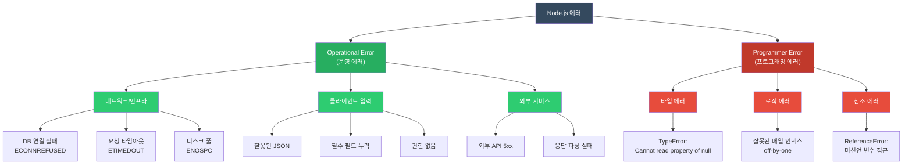
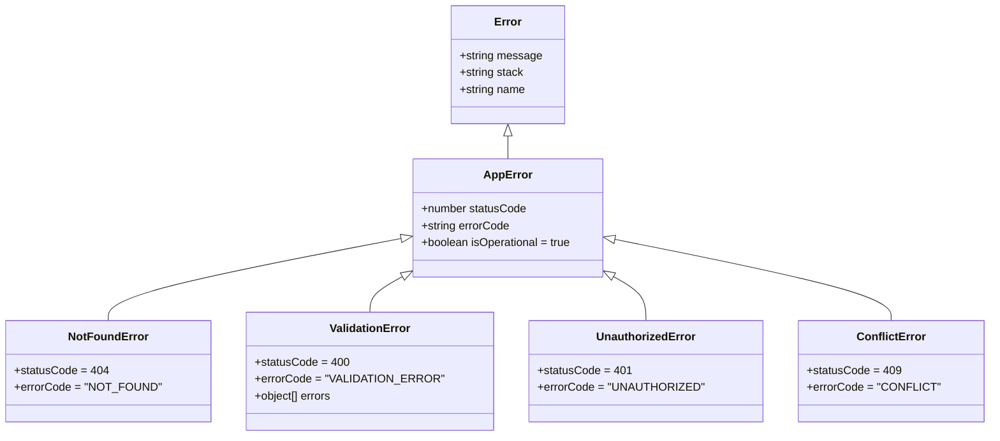
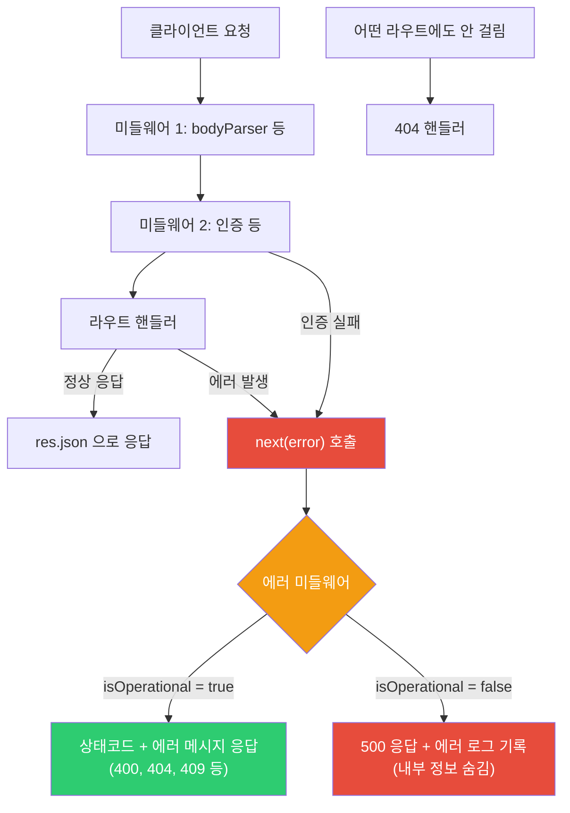
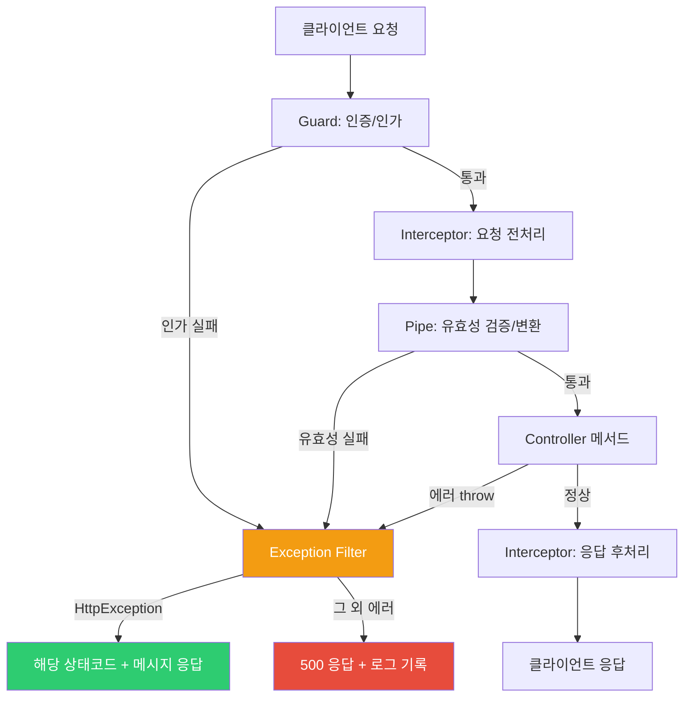
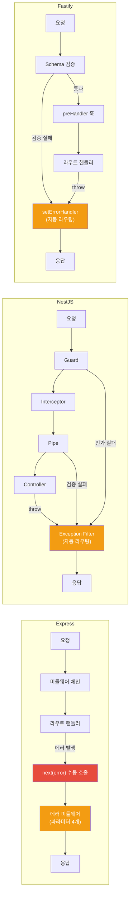

# Node.js 에러 처리

## 개요

Node.js에서 에러 처리를 제대로 안 하면 프로세스가 죽는다. 잡히지 않은 에러 하나가 서버 전체를 내리고, 잘못된 에러 핸들링은 내부 정보를 클라이언트에 노출시킨다.

에러 처리에서 신경 써야 하는 것:

- 프로세스가 죽지 않게 한다
- 클라이언트에 적절한 응답을 돌려준다
- 디버깅할 수 있는 로그를 남긴다
- 민감한 정보를 응답에 포함하지 않는다

## 에러 분류

Node.js 에러는 크게 두 종류다.

| 유형 | 예시 | 복구 가능 | 처리 방법 |
|------|------|---------|---------|
| **Operational** (운영 에러) | DB 연결 실패, 타임아웃, 400 에러 | O | try/catch, 재시도 |
| **Programmer** (프로그래밍 에러) | TypeError, null 참조, 잘못된 인자 | X | 코드 수정 |

아래 다이어그램으로 보면 구조가 잡힌다.



이 둘을 구분하는 게 중요하다. Operational 에러는 catch해서 처리하면 되지만, Programmer 에러를 catch로 무시하면 버그가 숨어버린다.

```javascript
// Operational Error: 예상 가능, 복구 가능
try {
    await db.query('SELECT * FROM users');
} catch (error) {
    if (error.code === 'ECONNREFUSED') {
        // DB 연결 실패 → 재시도 또는 폴백
        return getCachedData();
    }
    throw error;
}

// Programmer Error: 예상 불가, 코드 수정 필요
const user = null;
user.name;  // TypeError: Cannot read property 'name' of null
// → 이건 catch로 잡을 게 아니라 코드를 고쳐야 한다
```

## 커스텀 에러 클래스

운영 에러와 프로그래밍 에러를 구분하려면 `isOperational` 플래그를 쓴다. 이걸 기준으로 글로벌 핸들러에서 처리 방식을 나눈다. 커스텀 에러 클래스의 상속 구조는 다음과 같다.



```javascript
class AppError extends Error {
    constructor(message, statusCode, errorCode) {
        super(message);
        this.name = this.constructor.name;
        this.statusCode = statusCode;
        this.errorCode = errorCode;
        this.isOperational = true;
        Error.captureStackTrace(this, this.constructor);
    }
}

class NotFoundError extends AppError {
    constructor(resource, id) {
        super(`${resource} with id ${id} not found`, 404, 'NOT_FOUND');
    }
}

class ValidationError extends AppError {
    constructor(errors) {
        super('Validation failed', 400, 'VALIDATION_ERROR');
        this.errors = errors;
    }
}

class UnauthorizedError extends AppError {
    constructor(message = 'Authentication required') {
        super(message, 401, 'UNAUTHORIZED');
    }
}

class ConflictError extends AppError {
    constructor(message) {
        super(message, 409, 'CONFLICT');
    }
}
```

## Express 에러 처리

### 에러 전파 흐름

Express에서 에러가 어떻게 흘러가는지 이해하는 게 먼저다. `next(error)`를 호출하면 일반 미들웨어를 전부 건너뛰고, 파라미터 4개짜리 에러 미들웨어로 직접 넘어간다.



핵심은 `next(error)`다. Express에서 async 함수의 에러는 자동으로 `next`에 전달되지 않는다. 직접 `try/catch`로 잡아서 `next(error)`를 호출하거나, 래퍼 함수를 써야 한다.

### 라우트 에러 처리

```javascript
// 문제: 에러 발생 시 응답 없이 행(hang)
app.get('/users/:id', async (req, res) => {
    const user = await userService.findById(req.params.id);
    res.json(user);
});

// try/catch로 직접 잡기
app.get('/users/:id', async (req, res, next) => {
    try {
        const user = await userService.findById(req.params.id);
        if (!user) throw new NotFoundError('User', req.params.id);
        res.json(user);
    } catch (error) {
        next(error);  // 에러 미들웨어로 전달
    }
});

// 래퍼 함수로 자동화 — 매번 try/catch 안 써도 된다
const asyncHandler = (fn) => (req, res, next) => {
    Promise.resolve(fn(req, res, next)).catch(next);
};

app.get('/users/:id', asyncHandler(async (req, res) => {
    const user = await userService.findById(req.params.id);
    if (!user) throw new NotFoundError('User', req.params.id);
    res.json(user);
}));
```

Express 5부터는 async 함수에서 throw한 에러가 자동으로 `next`에 전달된다. Express 4를 쓰고 있다면 `asyncHandler`는 필수다.

### 글로벌 에러 미들웨어

파라미터가 4개여야 Express가 에러 미들웨어로 인식한다. 3개면 일반 미들웨어로 취급되므로 주의해야 한다.

```javascript
app.use((err, req, res, next) => {
    // 운영 에러 (예상된 에러)
    if (err.isOperational) {
        return res.status(err.statusCode).json({
            status: 'error',
            code: err.errorCode,
            message: err.message,
            ...(err.errors && { errors: err.errors }),
        });
    }

    // 프로그래밍 에러 (예상치 못한 에러)
    console.error('UNEXPECTED ERROR:', err);
    res.status(500).json({
        status: 'error',
        code: 'INTERNAL_ERROR',
        message: 'Something went wrong',
        // 프로덕션에서 스택 트레이스 노출하면 안 된다
        ...(process.env.NODE_ENV === 'development' && { stack: err.stack }),
    });
});
```

### 404 핸들러

모든 라우트 정의 이후, 에러 미들웨어 이전에 등록한다.

```javascript
app.use((req, res) => {
    res.status(404).json({
        status: 'error',
        code: 'NOT_FOUND',
        message: `Route ${req.method} ${req.path} not found`,
    });
});
```

## NestJS 에러 처리

### 에러 전파 흐름

NestJS는 Express와 구조가 다르다. Guard, Interceptor, Pipe를 거치면서 에러가 발생할 수 있고, 최종적으로 Exception Filter가 모든 에러를 잡는다.



Express와 달리 `next(error)` 같은 걸 직접 호출할 필요 없다. 컨트롤러에서 throw하면 NestJS가 알아서 Exception Filter로 라우팅한다. Pipe에서 유효성 검증 실패하면 자동으로 `BadRequestException`이 발생한다.

### 글로벌 예외 필터

```typescript
@Catch()
export class GlobalExceptionFilter implements ExceptionFilter {
    private readonly logger = new Logger(GlobalExceptionFilter.name);

    catch(exception: unknown, host: ArgumentsHost) {
        const ctx = host.switchToHttp();
        const response = ctx.getResponse();
        const request = ctx.getRequest();

        let status = 500;
        let message = 'Internal server error';
        let code = 'INTERNAL_ERROR';

        if (exception instanceof HttpException) {
            status = exception.getStatus();
            const res = exception.getResponse();
            message = typeof res === 'string' ? res : (res as any).message;
            code = (res as any).code || 'HTTP_ERROR';
        }

        // 500 에러만 상세 로그를 남긴다
        if (status >= 500) {
            this.logger.error(`${request.method} ${request.url}`, exception);
        }

        response.status(status).json({
            status: 'error',
            code,
            message,
            timestamp: new Date().toISOString(),
            path: request.url,
        });
    }
}

// main.ts에서 등록
app.useGlobalFilters(new GlobalExceptionFilter());
```

### 내장 예외 클래스

NestJS는 HTTP 상태코드별 예외 클래스를 제공한다. 커스텀 에러 클래스를 만들 필요 없이 바로 쓸 수 있다.

```typescript
throw new NotFoundException('User not found');
throw new BadRequestException('Invalid input');
throw new UnauthorizedException('Token expired');
throw new ForbiddenException('Access denied');
throw new ConflictException('Email already exists');
```

## Fastify 에러 처리

Fastify는 Express, NestJS와 에러 처리 방식이 다르다. 자체 에러 핸들링 메커니즘이 있고, JSON Schema 기반 유효성 검증이 내장되어 있다.

### setErrorHandler

Fastify의 글로벌 에러 핸들러는 `setErrorHandler`로 등록한다. Express처럼 미들웨어 순서에 의존하지 않는다.

```javascript
const fastify = require('fastify')({ logger: true });

fastify.setErrorHandler((error, request, reply) => {
    // Fastify 유효성 검증 에러
    if (error.validation) {
        return reply.status(400).send({
            status: 'error',
            code: 'VALIDATION_ERROR',
            message: 'Request validation failed',
            errors: error.validation.map(v => ({
                field: v.instancePath || v.params?.missingProperty,
                message: v.message,
            })),
        });
    }

    // 커스텀 운영 에러
    if (error.isOperational) {
        return reply.status(error.statusCode).send({
            status: 'error',
            code: error.errorCode,
            message: error.message,
        });
    }

    // 예상치 못한 에러
    request.log.error(error);
    reply.status(500).send({
        status: 'error',
        code: 'INTERNAL_ERROR',
        message: 'Something went wrong',
    });
});
```

Express와 비교하면:

- Express: `app.use((err, req, res, next) => {})` — 파라미터 4개 미들웨어
- Fastify: `fastify.setErrorHandler((error, request, reply) => {})` — 명시적 메서드

Fastify는 `next`가 없다. 에러 핸들러 안에서 `reply.send()`로 바로 응답한다.

### Schema Validation Error

Fastify는 라우트 정의 시 JSON Schema로 요청/응답을 검증한다. 스키마에 맞지 않으면 라우트 핸들러가 실행되기 전에 자동으로 400 에러가 발생한다.

```javascript
fastify.post('/users', {
    schema: {
        body: {
            type: 'object',
            required: ['email', 'name'],
            properties: {
                email: { type: 'string', format: 'email' },
                name: { type: 'string', minLength: 2 },
                age: { type: 'integer', minimum: 0 },
            },
            additionalProperties: false,
        },
    },
}, async (request, reply) => {
    // 여기 도달했으면 body 유효성 검증은 이미 통과한 상태
    const user = await createUser(request.body);
    reply.status(201).send(user);
});
```

스키마 검증 실패 시 Fastify가 자동으로 보내는 기본 응답:

```json
{
    "statusCode": 400,
    "error": "Bad Request",
    "message": "body must have required property 'email'"
}
```

이 기본 응답 형식을 바꾸려면 `setErrorHandler`에서 `error.validation`을 체크해서 커스텀 응답을 만든다 (위 `setErrorHandler` 예제 참고).

### schemaErrorFormatter

에러 메시지 형식만 바꾸고 싶으면 `schemaErrorFormatter`를 쓴다.

```javascript
const fastify = require('fastify')({
    schemaErrorFormatter: (errors, dataVar) => {
        const message = errors.map(e => {
            const field = e.instancePath
                ? e.instancePath.replace('/', '')
                : e.params?.missingProperty;
            return `${field}: ${e.message}`;
        }).join(', ');

        const error = new Error(message);
        error.statusCode = 400;
        return error;
    },
});
```

### 플러그인 스코프별 에러 핸들러

Fastify는 플러그인 단위로 에러 핸들러를 분리할 수 있다. 특정 라우트 그룹에만 다른 에러 처리 로직을 적용할 때 쓴다.

```javascript
// /api/v1 하위 라우트에만 적용되는 에러 핸들러
fastify.register(async (instance) => {
    instance.setErrorHandler((error, request, reply) => {
        // v1 API 전용 에러 형식
        reply.status(error.statusCode || 500).send({
            api_version: 'v1',
            error: error.message,
        });
    });

    instance.get('/users', async () => { /* ... */ });
    instance.get('/orders', async () => { /* ... */ });
}, { prefix: '/api/v1' });
```

Express에서 이걸 하려면 Router 단위로 에러 미들웨어를 분리해야 하는데, 미들웨어 순서를 잘못 잡으면 에러가 글로벌 핸들러로 빠지는 경우가 있다. Fastify는 플러그인 캡슐화 덕분에 이런 문제가 없다.

## 세 프레임워크 에러 처리 비교

에러가 발생했을 때 각 프레임워크가 어떤 경로로 에러를 처리하는지 한눈에 비교한 다이어그램이다.



세 프레임워크의 핵심 차이:

- **Express**: `next(error)`를 직접 호출해야 에러가 전파된다. 호출 안 하면 요청이 행(hang) 걸린다.
- **NestJS**: Guard, Interceptor, Pipe, Controller 어디서든 throw하면 Exception Filter가 자동으로 잡는다.
- **Fastify**: Schema 검증이 핸들러 실행 전에 자동으로 돌아간다. throw하면 `setErrorHandler`가 바로 받는다.

| 항목 | Express | NestJS | Fastify |
|------|---------|--------|---------|
| 에러 핸들러 등록 | `app.use((err, req, res, next) => {})` | `@Catch()` 데코레이터 + Exception Filter | `setErrorHandler()` |
| async 에러 자동 전파 | v4: X (래퍼 필요), v5: O | O (기본 지원) | O (기본 지원) |
| 유효성 검증 | 별도 라이브러리 필요 (joi, zod 등) | class-validator + Pipe | JSON Schema 내장 |
| 스코프별 에러 핸들링 | Router 단위 (순서 주의) | 컨트롤러/메서드 단위 필터 | 플러그인 스코프 (캡슐화) |
| 에러 전파 방식 | `next(error)` 수동 호출 | throw → Exception Filter 자동 라우팅 | throw → setErrorHandler 자동 라우팅 |

## 프로세스 레벨 에러

프레임워크와 무관하게, Node.js 프로세스 자체에서 잡아야 하는 에러들이 있다.

```javascript
// 잡히지 않은 Promise 거부
process.on('unhandledRejection', (reason, promise) => {
    console.error('Unhandled Rejection:', reason);
    // 로그 기록 후 프로세스 종료 (PM2가 재시작)
    process.exit(1);
});

// 잡히지 않은 예외
process.on('uncaughtException', (error) => {
    console.error('Uncaught Exception:', error);
    // 진행 중인 요청 완료 후 종료 (graceful shutdown)
    server.close(() => {
        process.exit(1);
    });
    // 10초 내 종료 안 되면 강제 종료
    setTimeout(() => process.exit(1), 10000);
});

// SIGTERM (컨테이너 종료 시그널)
process.on('SIGTERM', () => {
    console.log('SIGTERM received. Graceful shutdown...');
    server.close(() => {
        db.disconnect();
        process.exit(0);
    });
});
```

`unhandledRejection`과 `uncaughtException`은 다르다. `unhandledRejection`은 `.catch()` 없는 Promise에서 발생하고, `uncaughtException`은 동기 코드에서 throw된 에러가 아무 try/catch에도 안 잡혔을 때 발생한다. Node.js 15부터 `unhandledRejection`도 기본적으로 프로세스를 종료시킨다.

## 에러 응답 표준 형식

```json
{
    "status": "error",
    "code": "VALIDATION_ERROR",
    "message": "Validation failed",
    "errors": [
        {
            "field": "email",
            "message": "Invalid email format"
        },
        {
            "field": "age",
            "message": "Must be at least 18"
        }
    ],
    "timestamp": "2026-03-01T10:15:30.000Z",
    "path": "/api/users",
    "requestId": "req-abc123"
}
```

## 에러 로깅

```javascript
const logger = require('pino')();

app.use((err, req, res, next) => {
    logger.error({
        err: {
            message: err.message,
            code: err.errorCode,
            stack: err.stack,
        },
        request: {
            method: req.method,
            url: req.url,
            headers: {
                'user-agent': req.headers['user-agent'],
            },
            body: req.body,
            userId: req.user?.id,
        },
        responseTime: Date.now() - req.startTime,
    }, 'Request error');

    // ... 응답 처리
});
```

## 외부 서비스 에러 처리

외부 API를 호출할 때는 타임아웃과 재시도를 반드시 넣어야 한다. 외부 서비스가 느려지면 내 서버의 커넥션이 쌓여서 같이 죽는다.

```javascript
class ExternalServiceClient {
    constructor(baseUrl, options = {}) {
        this.baseUrl = baseUrl;
        this.maxRetries = options.maxRetries || 3;
        this.timeout = options.timeout || 5000;
    }

    async request(path, options = {}) {
        let lastError;

        for (let attempt = 1; attempt <= this.maxRetries; attempt++) {
            try {
                const controller = new AbortController();
                const timeoutId = setTimeout(
                    () => controller.abort(),
                    this.timeout
                );

                const response = await fetch(`${this.baseUrl}${path}`, {
                    ...options,
                    signal: controller.signal,
                });
                clearTimeout(timeoutId);

                if (!response.ok) {
                    throw new AppError(
                        `External service error: ${response.status}`,
                        502,
                        'EXTERNAL_SERVICE_ERROR'
                    );
                }
                return response.json();
            } catch (error) {
                lastError = error;
                if (attempt < this.maxRetries) {
                    // exponential backoff
                    await new Promise(r =>
                        setTimeout(r, 1000 * Math.pow(2, attempt - 1))
                    );
                }
            }
        }
        throw lastError;
    }
}
```

## 참고

- [Express Error Handling](https://expressjs.com/en/guide/error-handling.html)
- [NestJS Exception Filters](https://docs.nestjs.com/exception-filters)
- [Fastify Error Handling](https://fastify.dev/docs/latest/Reference/Errors/)
- [Node.js Best Practices](https://github.com/goldbergyoni/nodebestpractices)
