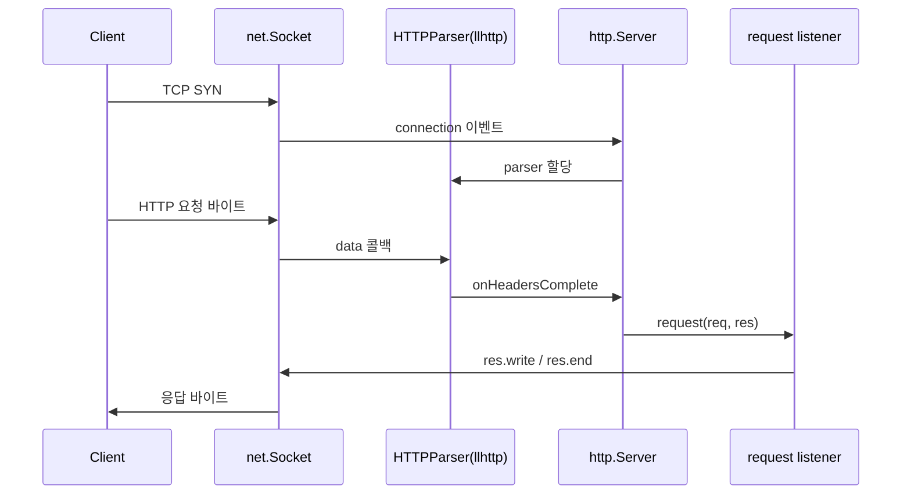
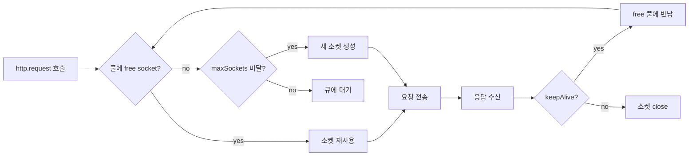

# Node.js HTTP / HTTPS 코어 모듈 심화

Express, Fastify, NestJS 같은 프레임워크를 한 꺼풀 벗기면 결국 `http` 코어 모듈이 있다. 평소엔 신경 쓸 일이 없다가 트래픽이 몰리거나 외부 API 호출이 늘어나면 `ECONNRESET`, `EMFILE`, `socket hang up` 같은 에러를 만나면서 그때서야 내부 구조를 들여다보게 된다. 이 문서는 5년 정도 운영하면서 실제로 부딪힌 사례 중심으로 코어 모듈 동작을 정리한다.

## http.Server 내부 동작

`http.createServer(handler)` 호출 한 줄 뒤에 숨어 있는 흐름은 단순하지 않다. 내부적으로는 `net.Server`를 상속받아 TCP 연결을 받고, 새 소켓이 들어올 때마다 C++ 레이어의 `HTTPParser`(llhttp)가 붙어 바이트 스트림을 파싱한다.

```js
const http = require('node:http')

const server = http.createServer((req, res) => {
  res.writeHead(200, { 'Content-Type': 'text/plain' })
  res.end('ok')
})

server.listen(3000)
```

이 코드 한 덩어리가 만드는 객체 흐름은 다음과 같다.



여기서 한 가지 잘 안 보이는 디테일이 있다. `request` 이벤트가 발생할 때 `req`는 `IncomingMessage`(Readable 스트림), `res`는 `ServerResponse`(Writable 스트림)다. 즉 핸들러 안에서 동기 코드처럼 보여도 두 객체는 본질이 스트림이라 백프레셔, `drain`, `close` 같은 이벤트가 그대로 적용된다.

또 하나, `server.timeout`은 기본값이 0(무제한)으로 바뀐 지 오래라 별도로 잡지 않으면 비정상 연결이 누적된다. 보통은 `server.requestTimeout`, `server.headersTimeout`, `server.keepAliveTimeout`을 같이 잡는다.

```js
server.headersTimeout = 60_000      // 헤더 다 받는 데까지 60초
server.requestTimeout = 120_000     // 요청 바디 다 받는 데까지 120초
server.keepAliveTimeout = 5_000     // 응답 후 idle 5초 유지
server.timeout = 0                  // 소켓 전체 타임아웃은 따로 끄거나 짧게
```

`headersTimeout`이 `keepAliveTimeout`보다 작거나 같으면 Node가 경고를 띄운다. ALB/ELB 같은 LB 뒤에 둘 땐 `keepAliveTimeout`을 LB의 idle timeout보다 길게 잡아야 LB가 먼저 끊으면서 `502`가 튀는 사고를 막을 수 있다. AWS ALB가 기본 60초라 Node는 `61_000` 정도로 두는 게 안전하다.

## http.Agent와 keep-alive 커넥션 풀

서버 쪽보다 까다로운 게 클라이언트 쪽이다. `http.request`나 `axios`, `node-fetch`로 외부 API를 부를 때 매번 TCP 핸드셰이크가 일어나면 RTT가 그대로 응답시간으로 박힌다. `http.Agent`는 이걸 풀로 관리하는 객체다.

Node 19부터 글로벌 agent의 `keepAlive` 기본값이 `true`로 바뀌었지만, 18 LTS 이하나 명시적으로 agent를 새로 만드는 코드에서는 여전히 `false`다. 한 번 데인 적 있다.

```js
const http = require('node:http')

const agent = new http.Agent({
  keepAlive: true,
  keepAliveMsecs: 1_000,
  maxSockets: 50,
  maxFreeSockets: 10,
  timeout: 60_000,
  scheduling: 'lifo'
})

const req = http.request({
  hostname: 'internal-api',
  port: 8080,
  path: '/v1/users',
  agent
}, (res) => { /* ... */ })
```

옵션 하나하나가 운영 중 의미가 다르다.

- `keepAlive`: `false`면 응답이 끝나는 즉시 소켓을 끊는다. 외부 호출 빈도가 초당 수십 건만 넘어도 TIME_WAIT 소켓이 쌓여 `EADDRNOTAVAIL`이 난다.
- `keepAliveMsecs`: 첫 keep-alive probe까지의 간격이다. TCP keepalive를 의미하지 않는다(이건 `socket.setKeepAlive(true, delay)`다). HTTP 응답 직후 소켓을 풀에 돌려놓고 idle 상태로 두는 시간과 헷갈리지 말 것.
- `maxSockets`: host:port 조합당 동시에 띄울 최대 소켓 수. 기본 `Infinity`라 부주의하면 상대 서버의 커넥션 한도를 단번에 초과한다.
- `maxFreeSockets`: 유휴 상태로 풀에 남겨둘 최대 소켓 수. 너무 크면 메모리 차지, 너무 작으면 빈번한 재연결.
- `scheduling`: `'fifo'`와 `'lifo'`가 있는데 `'lifo'`가 기본이다. 마지막에 반납된 소켓을 먼저 꺼내 쓰면 idle한 소켓이 일찍 만료돼 풀 크기가 작아지는 효과가 있다.

`maxSockets`를 무한으로 둔 상태로 외부 API에 burst를 날리면 어떤 일이 벌어지나. 호출 측은 멀쩡한데 상대 서버 입장에선 수천 개 커넥션이 한 번에 들이친다. 보통 상대가 먼저 죽거나 LB가 차단한다. 한 번은 결제 게이트웨이를 호출하는 배치가 `maxSockets`를 안 잡아서 게이트웨이 SRE 측에서 IP 차단을 한 적이 있다. 그 뒤로는 외부 호출용 agent는 무조건 `maxSockets`를 명시한다.

`maxFreeSockets` 튜닝은 트래픽 패턴을 보고 정한다. 평균 동시 호출이 20개라면 `maxFreeSockets`를 20~30 정도로 잡고 `maxSockets`는 그 2~3배 여유를 둔다. 너무 크게 잡으면 풀 안의 소켓이 상대 서버 쪽에서 idle timeout으로 끊겨서 다음 요청이 `ECONNRESET`을 맞는다. 상대 서버의 `keepAliveTimeout`보다 내 `timeout`을 짧게 잡는 게 안전하다.



## ServerResponse 스트림 백프레셔

`res.write()`가 `false`를 돌려준다는 사실을 모르는 사람이 의외로 많다. 큰 파일을 응답으로 흘려보낼 때 다음 코드는 메모리 폭주를 만든다.

```js
// 잘못된 예
app.get('/big', (req, res) => {
  const data = readVeryBigBuffer()
  res.write(data)
  res.end()
})
```

`res.write`가 `false`를 반환하면 내부 버퍼가 `highWaterMark`(기본 16KB)를 넘었다는 뜻이다. 이 신호를 무시하고 계속 쓰면 메모리에 쌓이다가 OOM이 난다. 정석은 `pipeline`을 쓰는 거다.

```js
const { pipeline } = require('node:stream/promises')
const fs = require('node:fs')

app.get('/big', async (req, res) => {
  res.setHeader('Content-Type', 'application/octet-stream')
  try {
    await pipeline(fs.createReadStream('/data/big.bin'), res)
  } catch (err) {
    if (!res.headersSent) res.status(500).end()
    req.log.error(err)
  }
})
```

`pipeline`이 좋은 이유는 백프레셔를 알아서 처리해주는 동시에 소스나 대상이 에러로 죽었을 때 양쪽을 다 정리해준다는 점이다. 예전엔 `source.pipe(res)` 패턴을 많이 썼는데, 클라이언트가 중간에 끊으면 `res`는 닫혀도 `source`(파일 핸들이나 DB 커서)가 남아서 fd 누수가 나곤 했다.

클라이언트가 중간에 끊는 케이스는 `req.on('close', ...)` 또는 `res.on('close', ...)`로 잡는다. 큰 응답을 흘리는 도중 클라이언트가 나가면 DB 쿼리나 외부 호출을 중단해야 한다.

```js
app.get('/stream', async (req, res) => {
  const abort = new AbortController()
  req.on('close', () => abort.abort())

  const cursor = db.find({ active: true }).cursor({ signal: abort.signal })
  for await (const doc of cursor) {
    if (abort.signal.aborted) break
    if (!res.write(JSON.stringify(doc) + '\n')) {
      await new Promise(r => res.once('drain', r))
    }
  }
  res.end()
})
```

`drain` 이벤트를 await로 묶는 패턴은 꼭 알아둬야 한다. 이게 빠지면 클라이언트 회선이 느릴 때 서버 메모리만 부풀어 오른다.

## http.request 외부 호출 트러블슈팅

외부 호출 코드에서 가장 흔하게 깨지는 부분이 타임아웃과 소켓 정리다. 흔히 보는 잘못된 패턴.

```js
// 안전하지 않다
const req = http.request(options, (res) => {
  let body = ''
  res.on('data', chunk => body += chunk)
  res.on('end', () => resolve(JSON.parse(body)))
})
req.end()
```

문제는 세 가지다.

첫째, 타임아웃이 없다. 상대 서버가 응답을 영영 안 주면 `req`는 살아 있는 채로 워커 풀과 소켓을 점유한다. `req.setTimeout(5_000)` 또는 `options.timeout`을 잡아도 그것만으론 자동으로 abort되지 않는다. `'timeout'` 이벤트를 받아서 직접 `req.destroy()`를 호출해야 한다.

둘째, 에러 핸들러가 없다. `'error'`를 안 잡으면 그대로 `uncaughtException`으로 튄다.

셋째, 응답 바디가 너무 크면 메모리에 다 쌓인다. 일정 크기 넘으면 끊어야 한다.

정리하면 이렇게 된다.

```js
function get(url, { timeout = 5_000, maxBytes = 5 * 1024 * 1024 } = {}) {
  return new Promise((resolve, reject) => {
    const req = http.request(url, { agent: sharedAgent, timeout }, (res) => {
      if (res.statusCode >= 400) {
        res.resume()
        reject(new Error(`HTTP ${res.statusCode}`))
        return
      }
      const chunks = []
      let size = 0
      res.on('data', (chunk) => {
        size += chunk.length
        if (size > maxBytes) {
          req.destroy(new Error('response too large'))
          return
        }
        chunks.push(chunk)
      })
      res.on('end', () => resolve(Buffer.concat(chunks)))
      res.on('error', reject)
    })
    req.on('timeout', () => req.destroy(new Error('request timeout')))
    req.on('error', reject)
    req.end()
  })
}
```

`req.destroy()`를 호출하면 진행 중인 소켓은 끊어지지만 keep-alive 풀에 들어 있던 다른 소켓에는 영향이 없다. 다만 `socket hang up` 같은 에러가 풀 안 다른 소켓에서 튀어나오면 상대 서버가 먼저 idle timeout으로 끊었을 가능성이 높다. 이 경우 agent의 `timeout`을 상대 서버 idle timeout보다 짧게 잡아 풀의 죽은 소켓이 먼저 정리되도록 해야 한다.

운영 중 소켓 누수를 확인하는 가장 빠른 방법은 풀의 상태를 직접 들여다보는 것이다.

```js
setInterval(() => {
  const { sockets, freeSockets, requests } = sharedAgent
  console.log({
    sockets: countNested(sockets),       // 사용 중
    free: countNested(freeSockets),      // idle 풀
    waiting: countNested(requests)       // maxSockets에 막혀 대기
  })
}, 10_000)

function countNested(obj) {
  return Object.fromEntries(
    Object.entries(obj).map(([k, v]) => [k, v.length])
  )
}
```

`requests`가 계속 쌓이면 `maxSockets`가 부족하다는 신호다. `sockets`는 늘어나는데 `free`가 안 늘면 응답이 안 끝나고 있다는 뜻이고, 그건 대부분 타임아웃 누락이다.

## HTTP/2 모듈 사용 시 주의점

`http2` 모듈은 HTTP/1.1과 API가 비슷해 보이지만 다른 모듈이라 봐야 한다. `http` 코드가 그대로 동작하지 않는다.

```js
const http2 = require('node:http2')

const server = http2.createSecureServer({
  key: fs.readFileSync('key.pem'),
  cert: fs.readFileSync('cert.pem')
})

server.on('stream', (stream, headers) => {
  stream.respond({ ':status': 200, 'content-type': 'text/plain' })
  stream.end('hello')
})

server.listen(8443)
```

`request`/`response` 이벤트 대신 `stream` 이벤트를 쓴다. 헤더에 `:status`, `:method` 같은 pseudo-header가 들어가는 것도 익숙해져야 한다.

운영에서 부딪힌 점 몇 가지.

- 클라이언트가 HTTP/1.1로 붙는 경우(특히 사내 모니터링 도구)를 위해 `createSecureServer({ allowHTTP1: true })`로 두는 게 안전하다. 안 그러면 헬스체크가 깨지기 시작한다.
- 스트림 단위로 동작하다 보니 한 커넥션에 수십 개 스트림이 떠 있을 수 있다. `maxSessionMemory`, `maxConcurrentStreams`를 적절히 잡지 않으면 한 클라이언트가 메모리를 다 먹는다.
- HPACK 헤더 압축 테이블이 세션 단위라 헤더가 들쭉날쭉하면 압축률이 떨어진다. 동적 헤더 너무 많이 박지 말 것.
- 핑/타임아웃 처리가 `http`와 별개다. `http2.connect`로 만든 client session은 명시적으로 `session.close()`를 부르지 않으면 keep-alive로 살아 있는다.
- 클라이언트 측에서 `http2.connect`를 매 요청마다 부르면 HTTP/2의 장점이 다 사라진다. 세션을 재사용해야 멀티플렉싱 이득이 있다.

내 경험상, 서버를 직접 HTTP/2로 운영하는 케이스는 많지 않다. 보통 ALB/Nginx가 HTTP/2를 받고 백엔드에는 HTTP/1.1로 보낸다. gRPC를 직접 쓰는 경우가 아니면 굳이 `http2`를 안 써도 되는 경우가 더 많다.

## TLS 세션 재사용

HTTPS 호출이 잦은 서비스에서 의외로 큰 비용이 TLS 핸드셰이크다. RSA 키 교환은 풀 핸드셰이크에서 수십 ms를 먹는다. `tls.connect`는 세션 티켓이나 세션 ID 기반 재사용을 지원하는데, `https.Agent`가 이걸 자동으로 관리해주진 않는다.

```js
const https = require('node:https')

const agent = new https.Agent({
  keepAlive: true,
  maxSockets: 50,
  maxCachedSessions: 100   // 기본 100
})
```

`maxCachedSessions`는 호스트별 TLS 세션을 몇 개나 캐시할지 결정한다. 0으로 두면 매번 풀 핸드셰이크다. keep-alive 풀이 있어도 풀이 비는 시점이 있으면 TLS 비용이 다시 발생하니, 이 값을 명시적으로 두는 게 좋다.

TLS 1.3에선 0-RTT(early data)가 가능하지만 Node에선 멱등하지 않은 요청에 위험할 수 있어 기본적으로 꺼져 있다. 직접 켜려면 `tls.connect({ allowHalfOpen: false, ... })` 옵션을 만져야 하는데, 운영 환경에서 굳이 켜본 적은 없다. 풀 핸드셰이크와 TLS 재개의 차이가 그렇게 결정적이지 않은 경우가 많아서다.

세션 재사용 여부는 `socket.isSessionReused()`로 확인할 수 있다.

```js
const req = https.request(options, (res) => {
  console.log('reused:', res.socket.isSessionReused())
  res.resume()
})
req.end()
```

서버 측에선 `tls.createServer({ sessionTimeout: 300 })`로 세션 캐시 유효시간을 정한다. 너무 길게 잡으면 키 회전이 미뤄져 보안상 좋지 않고, 너무 짧으면 재사용 효과가 없다. 5분 정도가 무난하다.

## undici와의 비교

`undici`는 Node.js 코어 팀이 직접 만든 HTTP/1.1 클라이언트 라이브러리이고, Node 18부터 글로벌 `fetch`의 백엔드도 undici다. 기존 `http.Agent` 기반 코드와 차이가 꽤 크다.

| 항목 | http/https | undici |
|---|---|---|
| 파서 | llhttp(C++) | llhttp(C++) |
| 풀 관리 | `Agent` (per host:port, free/sockets 분리) | `Pool` / `Client` (per origin, 파이프라인) |
| HTTP/1.1 파이프라이닝 | 미지원 | 지원(`pipelining` 옵션) |
| HTTP/2 | 별도 `http2` 모듈 | 미지원(2026 기준) |
| 백프레셔 | 스트림 표준 | 명시적 `Readable` 인터페이스 |
| 글로벌 fetch | n/a | Node 내장 fetch가 내부적으로 사용 |
| 성능 | 기본은 무난 | 파이프라이닝 켜면 2~3배 빠른 사례 있음 |

언제 어떤 걸 쓰나. 사내 마이크로서비스 간 호출처럼 같은 origin에 호출이 많고 latency가 중요한 경우 undici의 `Pool`이 명확히 빠르다.

```js
const { Pool } = require('undici')

const pool = new Pool('http://internal-api:8080', {
  connections: 50,
  pipelining: 1
})

const { statusCode, body } = await pool.request({
  path: '/v1/users',
  method: 'GET'
})
const json = await body.json()
```

`connections`가 `http.Agent`의 `maxSockets`에 해당한다. `pipelining`을 1보다 크게 두면 한 소켓에 여러 요청을 줄 세워 보내는데, 상대 서버가 파이프라이닝을 정확히 지원해야 한다. 한 요청이 늦어지면 뒤가 다 막히는 head-of-line blocking이 있어서, 응답 시간이 들쭉날쭉한 API엔 안 맞는다. 대부분의 경우 1로 두는 게 안전하다.

반면 외부 SaaS API 호출처럼 origin이 다양하고, 라이브러리 호환성이 더 중요한 케이스는 axios나 그냥 `http.request` 쪽이 디버깅이 쉽다. undici의 풀 누수는 추적이 까다롭다.

글로벌 `fetch`를 쓸 때 한 가지 잘 모르는 디테일이 있다. Node의 `fetch`는 내부적으로 undici의 글로벌 dispatcher를 쓰고, 이 dispatcher에는 자체적인 keep-alive 풀이 있다. 즉 `fetch`를 단순히 부른다고 매번 새 커넥션이 뜨지 않는다. 하지만 풀 설정을 바꾸려면 `setGlobalDispatcher(new Agent({ ... }))`로 명시적으로 갈아 끼워야 한다.

```js
const { setGlobalDispatcher, Agent } = require('undici')

setGlobalDispatcher(new Agent({
  connections: 100,
  keepAliveTimeout: 10_000,
  keepAliveMaxTimeout: 600_000
}))

const res = await fetch('http://internal-api/users')
```

`keepAliveTimeout`은 클라이언트가 idle 유지를 시도할 시간, `keepAliveMaxTimeout`은 상한이다. 서버가 보낸 `Keep-Alive: timeout=N` 헤더를 존중하려면 `keepAliveTimeoutThreshold`도 같이 살핀다.

## 마무리로 묶어두는 운영 팁

- 서버 측엔 `keepAliveTimeout`을 LB보다 길게, `headersTimeout`/`requestTimeout`을 명시적으로 잡는다.
- 외부 호출용 `Agent`는 무조건 `keepAlive: true`, `maxSockets` 명시. 풀 통계를 메트릭으로 뽑아두면 장애 분석이 절반은 끝난다.
- 응답 스트림은 `pipeline`, 요청 스트림은 `req.on('close')`로 abort를 잇는다.
- 외부 호출은 타임아웃 + abort + 응답 크기 제한 세 가지를 한 세트로 묶어둔다.
- HTTP/2를 굳이 직접 구현하지 말고, 가능하면 LB에서 끊어준다.
- HTTPS 호출이 잦으면 `maxCachedSessions`로 TLS 재사용 확보.
- 같은 origin 호출이 핫 패스라면 undici `Pool` 도입 검토. 다양한 origin이면 굳이 안 갈아도 된다.
