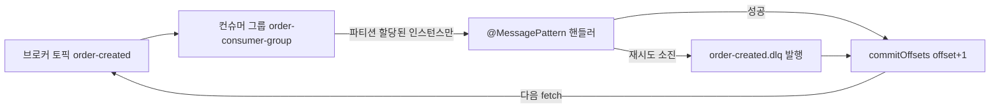
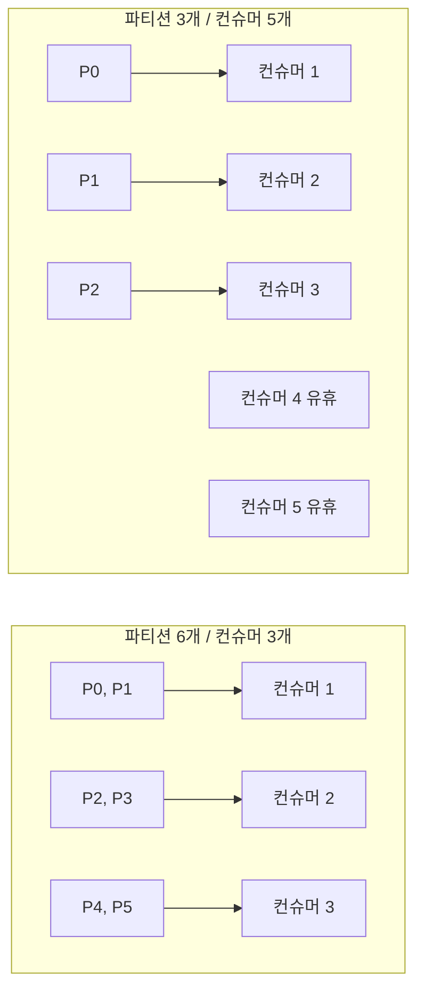
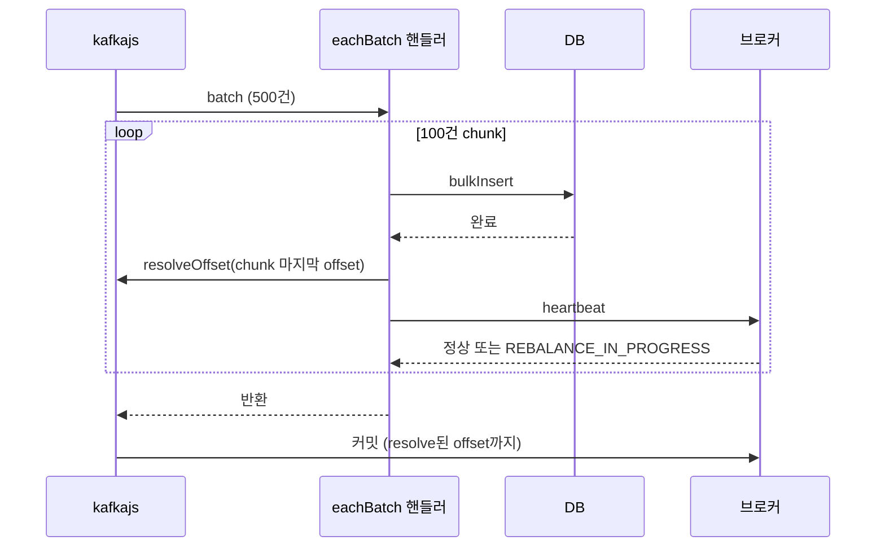
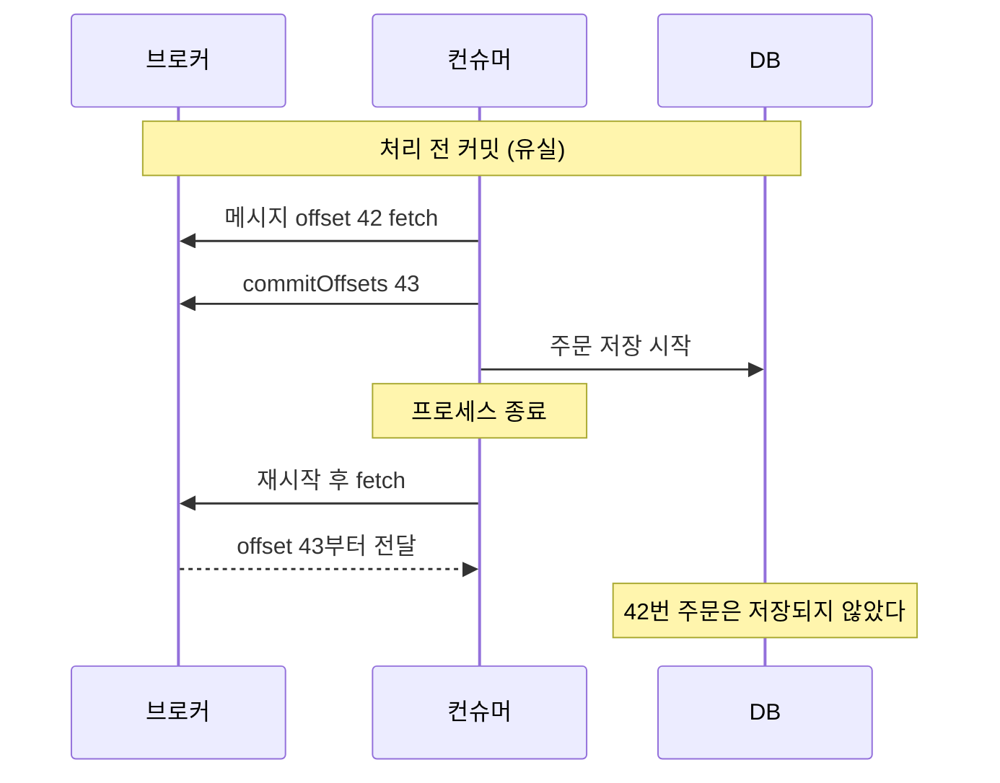
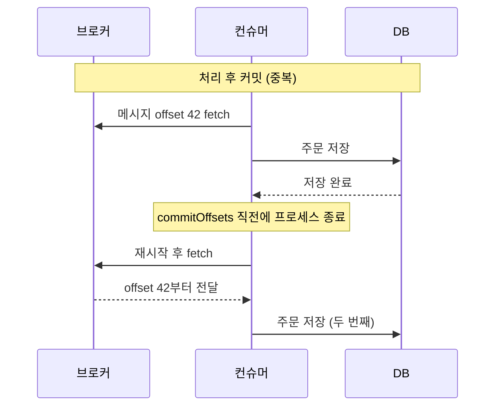
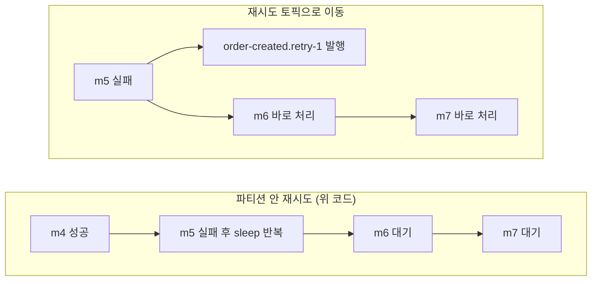
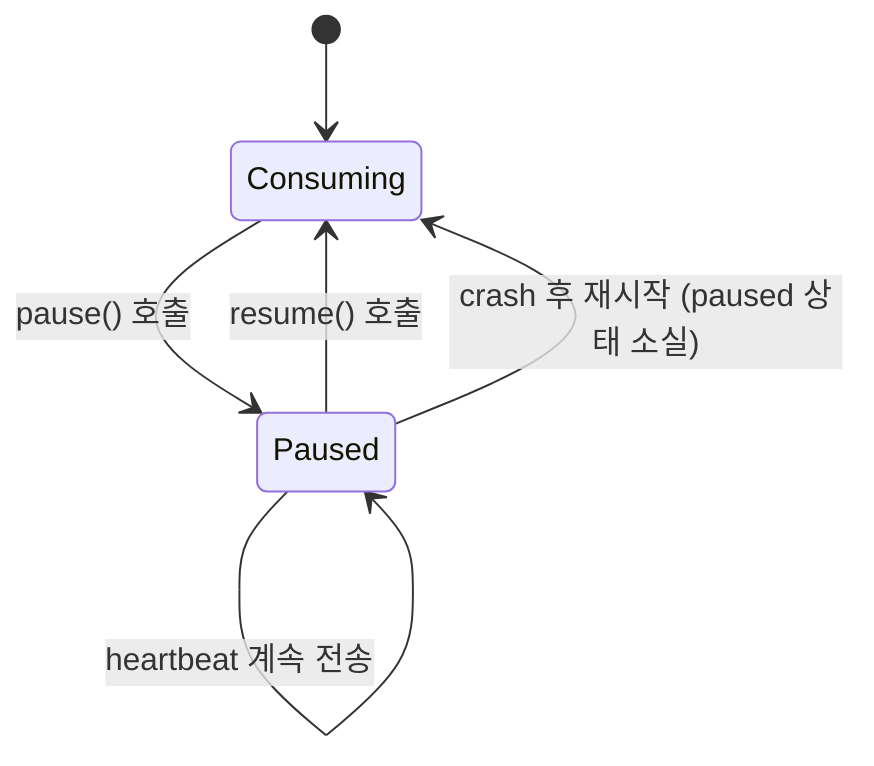

## NestJS에서 Kafka를 붙이는 방법

NestJS에서 Kafka를 쓰는 경로는 둘이다. `@nestjs/microservices`의 `Transport.KAFKA` 추상화를 쓰거나, kafkajs를 직접 DI 컨테이너에 등록해서 쓰거나.

추상화 쪽은 설정이 간단하고 `@MessagePattern`/`@EventPattern` 데코레이터로 핸들러를 선언한다. 직접 kafkajs를 쓰면 Consumer Group 설정, offset 커밋, DLQ 전부 코드로 제어할 수 있다. `eachBatch`로 배치 처리를 해야 하거나 수동 커밋이 필요한 상황에서는 직접 kafkajs를 쓰는 게 낫다.

## Transport.KAFKA로 마이크로서비스 올리기

Kafka 컨슈머를 NestJS 마이크로서비스로 올리는 기본 방법이다. `main.ts`에서 `createMicroservice`로 등록한다.

```ts
// main.ts
import { NestFactory } from '@nestjs/core';
import { Transport, MicroserviceOptions } from '@nestjs/microservices';
import { AppModule } from './app.module';

async function bootstrap() {
  const app = await NestFactory.createMicroservice<MicroserviceOptions>(
    AppModule,
    {
      transport: Transport.KAFKA,
      options: {
        client: {
          brokers: ['localhost:9092'],
        },
        consumer: {
          groupId: 'order-consumer-group',
          sessionTimeout: 30000,
          heartbeatInterval: 3000,
        },
      },
    },
  );

  await app.listen();
}
bootstrap();
```

컨슈머 핸들러는 컨트롤러에 `@MessagePattern`으로 선언한다.

```ts
import { Controller } from '@nestjs/common';
import { MessagePattern, Payload, Ctx, KafkaContext } from '@nestjs/microservices';

@Controller()
export class OrderConsumerController {
  @MessagePattern('order-created')
  async handleOrderCreated(
    @Payload() data: OrderCreatedDto,
    @Ctx() context: KafkaContext,
  ) {
    const originalMessage = context.getMessage();
    const partition = context.getPartition();
    // data는 이미 역직렬화된 상태다
    await this.orderService.process(data);
  }
}
```

`@Payload()`가 메시지 value를 받는다. 헤더나 파티션 정보가 필요하면 `@Ctx()`로 `KafkaContext`를 받아서 접근한다.

### 메시지가 핸들러에 닿기까지

`Transport.KAFKA`는 kafkajs의 `eachMessage` 하나로 모든 메시지를 받고, 토픽 이름으로 `@MessagePattern`/`@EventPattern` 핸들러를 찾아 넘긴다. 아래 도식은 `run: { autoCommit: false }`로 수동 커밋을 켰을 때 메시지 한 건이 지나가는 경로다. 성공하든 DLQ로 빠지든 마지막에는 `commitOffsets`를 지나야 다음 메시지로 넘어간다는 점을 보면 된다.



DLQ 발행이 실패했는데 커밋까지 진행하면 메시지가 어디에도 남지 않는다. DLQ `send()`가 성공한 뒤에만 커밋하도록 순서를 지켜야 한다.

`Transport.KAFKA`에서 수동 커밋, 파티션 pause, heartbeat가 필요하면 `KafkaContext`가 kafkajs 객체를 그대로 내준다(`@nestjs/microservices` 10.x 기준).

```ts
// main.ts 옵션
{
  transport: Transport.KAFKA,
  options: {
    client: { brokers: ['localhost:9092'] },
    consumer: { groupId: 'order-consumer-group' },
    run: { autoCommit: false },   // eachMessage/eachBatch 는 넣을 수 없다
  },
}

// 핸들러
@EventPattern('order-created')
async handle(@Payload() data: OrderCreatedDto, @Ctx() ctx: KafkaContext) {
  const { offset } = ctx.getMessage();
  await this.orderService.process(data);

  await ctx.getConsumer().commitOffsets([{
    topic: ctx.getTopic(),
    partition: ctx.getPartition(),
    offset: (BigInt(offset) + 1n).toString(),
  }]);
}
```

`ctx.getHeartbeat()`는 긴 처리 중에 세션을 유지하는 콜백이고, `ctx.getConsumer().pause()`는 뒤의 배압 절에서 쓴다. `run` 옵션에는 `eachBatch`를 넣을 수 없어서, 배치 단위 처리가 필요하면 결국 kafkajs를 직접 쓰는 쪽으로 넘어가야 한다.

## ClientKafka로 프로듀서 쓰기

메시지를 보내는 쪽에서는 `ClientKafka`를 쓴다. `ClientsModule`에 등록해서 DI로 주입받는다.

```ts
// order.module.ts
import { Module } from '@nestjs/common';
import { ClientsModule, Transport } from '@nestjs/microservices';

@Module({
  imports: [
    ClientsModule.register([
      {
        name: 'KAFKA_CLIENT',
        transport: Transport.KAFKA,
        options: {
          client: {
            brokers: ['localhost:9092'],
          },
          consumer: {
            groupId: 'order-producer-group',
          },
        },
      },
    ]),
  ],
})
export class OrderModule {}
```

서비스에서는 `onModuleInit`에서 반드시 `connect()`를 호출해야 한다. 응답을 받아야 하는 토픽은 `subscribeToResponseOf()`도 `connect()` 전에 호출한다.

```ts
import { Inject, Injectable, OnModuleInit } from '@nestjs/common';
import { ClientKafka } from '@nestjs/microservices';

@Injectable()
export class OrderService implements OnModuleInit {
  constructor(
    @Inject('KAFKA_CLIENT') private readonly kafkaClient: ClientKafka,
  ) {}

  async onModuleInit() {
    this.kafkaClient.subscribeToResponseOf('order-created');
    await this.kafkaClient.connect();
  }

  async createOrder(order: CreateOrderDto) {
    // request-response 패턴: 응답을 기다린다
    return this.kafkaClient.send('order-created', order).toPromise();
  }

  async emitEvent(event: OrderEventDto) {
    // fire-and-forget: 응답 없이 발행만 한다
    return this.kafkaClient.emit('order-event', event).toPromise();
  }
}
```

`send()`는 응답을 기다리는 request-response 패턴이고, `emit()`은 fire-and-forget이다. `send()`를 쓸 때 `subscribeToResponseOf()`가 없으면 응답 토픽을 구독하지 않아서 타임아웃이 발생한다.

`connect()`를 `onModuleInit` 밖에서 호출하면 DI 컨테이너가 완전히 준비되기 전에 브로커 연결을 시도하다 에러가 나는 경우가 있다. `onModuleInit` 안에서 호출하는 게 안전하다.

## NestJS 추상화를 벗어나야 할 때

`Transport.KAFKA`는 내부적으로 kafkajs를 감싼다. `eachBatch`, 수동 offset 커밋, DLQ 구현 같은 세밀한 제어가 필요하면 kafkajs를 직접 DI에 등록해서 쓴다.

```ts
// kafka.provider.ts
import { Kafka } from 'kafkajs';

export const kafkaProvider = {
  provide: 'KAFKA_INSTANCE',
  useFactory: () =>
    new Kafka({
      clientId: 'order-service',
      brokers: ['localhost:9092'],
    }),
};
```

이 프로바이더를 모듈에 등록하고 서비스에서 `@Inject('KAFKA_INSTANCE')`로 받아서 아래처럼 직접 consumer를 생성해 쓴다.

---

아래부터는 kafkajs를 직접 쓸 때 실제 운영에서 마주치는 내용이다.

## Consumer Group이 실제로 하는 일

kafkajs로 Consumer Group을 구성하면 내부에서 파티션 할당 협상(rebalance)이 일어난다. 인스턴스가 3개고 파티션이 6개면 각 인스턴스가 2개씩 가져간다. 인스턴스를 하나 내리면 나머지 둘이 3개씩 재할당받는다. 이 재할당 중에 소비가 멈추는 시간이 있다 — 기본 `sessionTimeout`(30초)과 `heartbeatInterval`(3초)이 그 길이를 결정한다.

문제는 `sessionTimeout`을 짧게 잡으면 배포나 GC pause 때 쓸데없이 rebalance가 터진다는 것이다. 운영하다 보면 배포할 때마다 컨슈머가 30초씩 멈추는 상황을 겪는다. kafkajs 기본값은 이미 타이트하다.

```ts
const consumer = kafka.consumer({
  groupId: 'order-service',
  sessionTimeout: 30000,
  heartbeatInterval: 3000,
  maxWaitTimeInMs: 5000,   // poll 한 번에 최대 대기
  minBytes: 1,
  maxBytes: 1048576,       // 1MB per fetch
});
```

`maxWaitTimeInMs`는 브로커가 minBytes를 채울 때까지 기다리는 시간이다. 낮추면 폴링 빈도가 올라가고 CPU가 올라간다. 메시지 유입이 드문 토픽은 50~200ms로 잡는 게 맞다.

## 파티션 수와 처리량 계산

파티션 수가 처리량 한계를 결정한다. Consumer Group 내에서 파티션 하나는 인스턴스 하나에만 붙는다. 파티션 3개면 인스턴스를 10개 띄워도 3개만 일한다.

할당 결과는 파티션 수와 컨슈머 수의 대소로 갈린다. 왼쪽은 파티션이 더 많아 인스턴스가 나눠 갖는 경우고, 오른쪽은 인스턴스가 더 많아 남는 쪽이 아무 메시지도 못 받는 경우다.



유휴 컨슈머는 그룹 멤버로 heartbeat를 보내며 살아 있지만 fetch할 파티션이 없다. 오토스케일러가 CPU 기준으로 인스턴스를 늘리는데 파티션 수가 그대로면, 비용만 늘고 lag은 그대로다. 대신 이 유휴 인스턴스는 살아 있는 컨슈머가 죽을 때 파티션을 바로 넘겨받는 대기조 역할은 한다. 스케일 아웃 상한은 파티션 수로 잡아 두는 게 맞다.

목표 처리량에서 파티션 수를 역산하는 공식이다.

```
파티션 수 = 목표 TPS / (인스턴스당 처리 TPS)

예:
- 목표: 초당 1,000 메시지
- 인스턴스 1개가 처리할 수 있는 TPS: 200 (DB write 포함 기준)
- 필요 파티션: 1000 / 200 = 5 → 여유분 포함 6~8
```

여기서 자주 틀리는 부분이 있다. 인스턴스당 TPS를 "순수 kafkajs poll 속도"로 잡으면 틀린다. 메시지 한 건 처리하는 데 DB write, 외부 API 호출, 캐시 조회가 포함된다면 그 지연이 처리량을 결정한다. `eachMessage` 안에서 await 하나에 50ms가 걸리면 인스턴스 하나가 20 TPS밖에 못 낸다.

배치 처리로 이 한계를 넘길 수 있다.

```ts
await consumer.run({
  eachBatchAutoResolve: false,
  eachBatch: async ({ batch, resolveOffset, heartbeat, isRunning, isStale }) => {
    const messages = batch.messages;

    // 100건씩 묶어서 DB bulk insert
    for (let i = 0; i < messages.length; i += 100) {
      if (!isRunning() || isStale()) break;

      const chunk = messages.slice(i, i + 100);
      await bulkInsert(chunk.map(m => JSON.parse(m.value.toString())));

      resolveOffset(chunk[chunk.length - 1].offset);
      await heartbeat(); // 긴 배치 처리 중 세션 유지
    }
  },
});
```

`eachBatchAutoResolve: false`로 두고 직접 `resolveOffset`을 호출한다. 중간에 실패하면 마지막으로 커밋한 offset 이후부터 재처리된다.

`resolveOffset`과 `heartbeat`의 위치가 중요하다. 순서는 "chunk 처리 완료 → `resolveOffset` → `heartbeat`"다. `resolveOffset`을 처리보다 먼저 부르면 실패한 chunk가 처리된 것으로 기록된다. `heartbeat`는 kafkajs 2.2.4 소스 기준으로 `eachMessage`에서는 메시지 사이마다 자동으로 나가지만, `eachBatch` 안에서는 직접 부르지 않으면 배치가 끝날 때까지 한 번도 안 나간다. 배치 하나가 `sessionTimeout`보다 오래 걸리면 브로커가 이 인스턴스를 죽은 것으로 보고 그룹에서 내보낸다. 그 뒤에도 배치 처리는 계속 돌아서, 파티션이 이미 다른 인스턴스로 넘어간 상태에서 같은 메시지를 중복 처리한다.



`heartbeat()`는 리밸런스 중이면 예외를 던진다. 이걸 `try/catch`로 삼키면 이미 다른 인스턴스에 넘어간 파티션을 계속 처리해 중복이 생긴다. 그대로 위로 던져서 핸들러를 빠져나오게 두고, 루프 조건의 `isStale()`도 같은 이유로 확인한다.

## commit 시점 선택

kafkajs의 `autoCommit`은 기본 true고, `autoCommitInterval`마다 resolve된 offset을 커밋한다. `eachMessage`가 정상 반환하면 그 메시지가 resolve되므로, 처리 도중 죽은 메시지는 커밋 대상이 아니고 재시작 후 다시 온다. 대신 이미 resolve됐지만 아직 커밋 주기가 안 온 메시지가 중복으로 온다.

autoCommit에서 유실이 생기는 자리는 핸들러다. `try/catch`로 에러를 삼키고 로그만 남기고 반환하거나, `await` 없이 `processOrder(message)`를 던져 놓고 반환하면 kafkajs는 처리가 끝난 줄 알고 resolve한다. 그 뒤 프로세스가 죽거나 Promise가 reject되면 메시지는 사라진다. 수동으로 `commitOffsets`를 처리 앞에 두는 경우도 같다.

커밋을 처리 앞에 두느냐 뒤에 두느냐에 따라 장애 때 잃는 것이 달라진다. 첫 번째 도식은 처리 전에 커밋한 경우, 두 번째는 처리 후에 커밋한 경우다. 두 도식 모두 컨슈머가 처리 도중에 죽는 같은 지점을 잡았다.





유실은 조용히 생기고 lag에도 안 잡힌다. 주문·결제처럼 잃으면 안 되는 토픽은 두 번째 방식에 멱등성을 붙인다.

```ts
// autoCommit 기본 설정. await 가 있으면 두 번째 도식처럼 중복 쪽으로 기운다
const consumer = kafka.consumer({ groupId: 'order-service' });
await consumer.run({
  autoCommit: true,
  autoCommitInterval: 5000,
  eachMessage: async ({ message }) => {
    await processOrder(message);   // await 를 빼면 처리 전에 resolve 되어 유실된다
  },
});
```

적어도 한 번 처리(at-least-once)가 필요하면 `autoCommit: false`로 끄고 처리 완료 후 직접 커밋한다.

```ts
await consumer.run({
  autoCommit: false,
  eachMessage: async ({ topic, partition, message }) => {
    await processOrder(message);

    await consumer.commitOffsets([{
      topic,
      partition,
      offset: (BigInt(message.offset) + 1n).toString(),
    }]);
  },
});
```

offset은 "다음에 읽을 위치"다. 현재 offset이 42면 43을 커밋해야 43부터 읽는다. 이걸 빠뜨리고 42를 커밋하면 42를 무한히 재처리한다.

`eachBatch`에서 `eachBatchAutoResolve: false`를 쓸 때도 마찬가지다. `resolveOffset`은 내부 상태만 바꾸고 실제 커밋은 `commitOffsets`로 별도 호출해야 한다. 아니면 `eachBatchAutoResolve: true`로 두고 배치 전체가 끝난 뒤 자동으로 커밋되도록 두는 것도 방법이다. 단, 배치 중간에 죽으면 배치 전체를 다시 받는다.

### 멱등성이 없으면 at-least-once는 의미가 없다

수동 커밋으로 at-least-once를 보장해도 처리 로직이 멱등하지 않으면 중복 처리가 그대로 생긴다. 결제 요청 메시지를 두 번 처리하면 결제가 두 번 나간다. DB에 `message_id`를 unique key로 잡거나, Redis에 처리 여부를 기록하는 방식으로 멱등성을 따로 구현해야 한다.

## DLQ 패턴과 재처리

메시지 처리가 실패했을 때 그냥 에러를 던지면 kafkajs가 같은 메시지를 계속 재시도한다. `retry` 옵션이 소진되면 컨슈머가 crash하고 재시작된다 — 처리 못 하는 메시지 하나가 전체 파티션 소비를 멈춘다.

DLQ(Dead Letter Queue)는 실패한 메시지를 별도 토픽으로 빼내는 패턴이다. 원본 파티션 소비는 계속 진행하고, 실패 메시지는 나중에 따로 처리한다.

```ts
const producer = kafka.producer();

await consumer.run({
  autoCommit: false,
  eachMessage: async ({ topic, partition, message }) => {
    let attempt = 0;
    const maxAttempts = 3;

    while (attempt < maxAttempts) {
      try {
        await processOrder(message);
        break;
      } catch (err) {
        attempt++;
        if (attempt >= maxAttempts) {
          // DLQ로 이동
          await producer.send({
            topic: `${topic}.dlq`,
            messages: [{
              key: message.key,
              value: message.value,
              headers: {
                ...message.headers,
                'x-original-topic': topic,
                'x-original-partition': String(partition),
                'x-original-offset': message.offset,
                'x-failure-reason': err.message,
                'x-retry-count': String(attempt),
              },
            }],
          });
        } else {
          // 지수 백오프
          await new Promise(r => setTimeout(r, 100 * 2 ** attempt));
        }
      }
    }

    await consumer.commitOffsets([{
      topic,
      partition,
      offset: (BigInt(message.offset) + 1n).toString(),
    }]);
  },
});
```

DLQ 토픽에 원본 위치 정보(`x-original-topic`, `x-original-partition`, `x-original-offset`)를 헤더로 남기는 게 중요하다. 나중에 원인을 파악하고 재처리할 때 어디서 왔는지 추적할 수 있다.

DLQ 소비자는 별도로 구성한다. 수동으로 트리거하거나, 알림을 받고 수정 후 재발행하는 흐름으로 운영한다.

### 파티션 안에서 재시도하는 방식의 한계

위 코드는 `eachMessage` 안에서 `await new Promise(r => setTimeout(...))`로 기다렸다가 다시 시도한다. 이 방식은 재시도하는 동안 그 파티션의 뒷 메시지를 전부 세운다. kafkajs는 한 파티션의 메시지를 순서대로 하나씩 `eachMessage`에 넘기기 때문에, 핸들러가 돌아오지 않으면 다음 메시지를 꺼내지 않는다. 다른 파티션은 계속 흐르지만, 실패한 메시지가 걸린 파티션 하나는 멈춘다.



위 코드의 백오프는 200ms, 400ms로 합쳐서 0.6초라 실제로 티가 안 난다. 문제는 재시도 대상이 외부 결제 API처럼 장애가 수십 초 가는 의존성일 때다. 이때 백오프를 초 단위로 늘리고 횟수도 올리면 아래 일이 순서대로 벌어진다.

파티션당 초당 200건이 들어오는 토픽에서 한 메시지를 30초 재시도하면 그 파티션에 6,000건이 쌓인다. 재시도가 끝나 DLQ로 보낸 뒤에도 이 6,000건은 처리량 한도까지만 빠지기 때문에 lag이 한동안 남는다. 장애가 의존성 쪽이면 뒤 메시지도 같은 API를 호출하다 똑같이 실패해서 재시도를 시작하고, 파티션이 계속 막힌 채로 굴러간다.

세션 문제도 붙는다. kafkajs는 `eachMessage`가 반환한 뒤에야 heartbeat를 보내고, 핸들러 안에서는 넘겨받은 `heartbeat()`를 직접 불러야 나간다. 위 코드처럼 sleep만 하면 `sessionTimeout`(예제 설정 30초)을 넘기는 순간 브로커가 이 컨슈머를 그룹에서 빼고 리밸런스를 일으킨다. 이때 처리 중이던 메시지는 커밋 전이라 다른 인스턴스가 다시 받아서 같은 재시도를 처음부터 시작한다. Java 클라이언트는 백그라운드 스레드가 heartbeat를 보내서 세션 타임아웃은 안 걸리지만, 대신 `poll()` 호출 간격이 `max.poll.interval.ms`(기본 5분)를 넘으면 같은 결과가 된다. 어느 쪽이든 "핸들러 안에서 오래 기다린다"가 리밸런스로 이어진다.

핸들러 안에서 `heartbeat()`를 주기적으로 부르면 세션 만료는 막지만 파티션이 막히는 문제는 그대로다. 재시도 간격이 초 단위를 넘으면 재시도용 토픽을 따로 두고 지연 후 소비하는 방식으로 옮겨야 한다. 재시도 토픽 단계 설계, 지연 구현, 순서 보장이 깨지는 조건은 [Kafka 논블로킹 재시도 토픽 패턴](../../Backend/Messaging/Kafka_Retry_Topic_Pattern.md)에 로그와 함께 정리했다. 재시도 없이 즉시 DLQ로 보내도 되는 에러(역직렬화 실패, 검증 실패)는 파티션 안에서 재시도할 이유가 없다.

## pause()와 resume()으로 배압 걸기

컨슈머가 처리하는 속도보다 다운스트림(DB 커넥션 풀, 외부 API)이 받아주는 속도가 느리면, 그대로 계속 fetch해서 메모리에 메시지를 쌓거나 실패를 양산하게 된다. kafkajs는 파티션 단위로 fetch를 멈추는 `pause()`와 다시 여는 `resume()`을 준다. sleep과 다른 점은 핸들러가 바로 반환하거나 던진다는 것이라 heartbeat가 정상적으로 나간다. 파티션은 멈추지만 컨슈머는 그룹에 살아 있다.



`eachMessage`에 넘어오는 `pause()`는 지금 처리 중인 토픽·파티션만 멈추고, 호출하면 `resume` 함수를 돌려준다. 실패한 메시지를 나중에 다시 받으려면 `pause()` 뒤에 에러를 던진다. 던지면 그 메시지의 offset이 resolve되지 않아서 resume한 뒤 같은 메시지부터 다시 온다. 정상 반환하면 현재 메시지는 처리된 것으로 기록된다. 여기까지는 kafkajs 2.2.4 소스를 읽고 정리한 동작이다. 던진 에러는 `retry` 옵션의 재시도 루프를 타는데, 그동안 해당 파티션은 paused라 fetch 대상에서 빠진다.

```ts
const RESUME_AFTER_MS = 10_000;

await consumer.run({
  autoCommit: false,
  eachMessage: async ({ topic, partition, message, pause }) => {
    try {
      await callPaymentApi(message);
    } catch (err) {
      if (isDownstreamUnavailable(err)) {
        // 이 파티션만 멈춘다. 다른 파티션은 계속 처리한다
        const resume = pause();
        setTimeout(resume, RESUME_AFTER_MS);
        throw err;   // offset 을 resolve 하지 않아 resume 후 같은 메시지부터 다시 온다
      }
      throw err;
    }

    await consumer.commitOffsets([{
      topic,
      partition,
      offset: (BigInt(message.offset) + 1n).toString(),
    }]);
  },
});
```

세 가지를 주의해야 한다. 첫째, 위 코드에서 `throw err`가 그대로 나가면 kafkajs가 에러 로그를 남기고 `retry` 설정에 따라 재시작을 시도한다. 로그가 시끄러워서 `pause()`용 에러 클래스를 따로 두고 로그 레벨을 낮추는 경우가 많다. 둘째, paused 상태는 컨슈머 객체 메모리에만 있다. `retry`가 소진돼서 kafkajs가 crash 후 재시작하면 새 상태로 시작하기 때문에, 다운스트림이 아직 죽어 있어도 파티션이 열린 채로 fetch를 재개한다. 그래서 다운스트림 상태는 파티션별 pause가 아니라 프로세스 전역 상태(서킷 브레이커)로 들고, `resume` 시점과 재시작 직후에 그 상태를 다시 확인한다. 셋째, `pause()`를 호출하면 이미 fetch해 온 배치의 남은 메시지는 처리하지 않고 넘어간다. 남은 메시지는 resume 뒤에 resolve된 offset 다음부터 다시 fetch된다.

핸들러 밖에서 걸 수도 있다. 큐 깊이나 메모리 사용량 같은 지표를 보고 컨슈머 전체를 멈출 때는 `consumer.pause()`에 토픽(과 파티션)을 지정한다.

```ts
const HIGH = 2000;
const LOW = 500;
let paused = false;

setInterval(() => {
  const depth = workQueue.size();
  if (!paused && depth >= HIGH) {
    consumer.pause([{ topic: 'order-created' }]);   // 파티션을 생략하면 토픽 전체
    paused = true;
  } else if (paused && depth <= LOW) {
    consumer.resume([{ topic: 'order-created' }]);
    paused = false;
  }
}, 200);
```

HIGH와 LOW를 다르게 두는 이유는 경계값 주변에서 pause와 resume이 초당 수십 번 번갈아 도는 걸 막기 위해서다. 같은 값을 쓰면 fetch가 끊겼다 이어졌다 하면서 오히려 처리량이 떨어진다. `Transport.KAFKA`에서는 `ctx.getConsumer().pause([{ topic: ctx.getTopic(), partitions: [ctx.getPartition()] }])` 형태로 같은 일을 한다.

### 재처리 시 주의

DLQ에서 원본 토픽으로 메시지를 다시 보낼 때 파티션 지정에 주의해야 한다. key 기반 파티셔닝을 쓰는 토픽이면 같은 key로 재발행하면 같은 파티션으로 간다. 파티션 수가 바뀌었으면 다른 파티션으로 갈 수 있다 — 순서 보장이 필요한 경우 문제가 된다.

## Consumer Group 운영 중 흔히 겪는 것들

**rebalance가 너무 자주 일어난다.** kafkajs에는 `max.poll.interval.ms`에 해당하는 옵션이 없다(이건 Java 클라이언트 설정이고 브로커 설정도 아니다). 대신 `eachMessage`/`eachBatch` 안에서 heartbeat가 `sessionTimeout` 동안 안 나가면 세션이 끊긴다. 처리 하나가 10초 걸리는데 `sessionTimeout`이 6초면 매번 rebalance가 터진다. `sessionTimeout`을 처리 시간보다 크게 잡거나, 핸들러 안에서 `heartbeat()`를 주기적으로 부른다. 리밸런스 때 멤버가 다시 합류하는 최대 대기 시간은 `rebalanceTimeout`(기본 60초)이 정한다.

```ts
const consumer = kafka.consumer({
  groupId: 'order-service',
  sessionTimeout: 45000,
  rebalanceTimeout: 60000,
  maxWaitTimeInMs: 5000,
});
```

**lag이 계속 쌓인다.** `kafka-consumer-groups.sh --describe` 또는 Kafka UI로 lag을 모니터링한다. lag이 줄지 않으면 파티션을 늘리거나 인스턴스를 추가해야 한다. 단, 파티션 추가는 브로커에서 해야 하고, key 기반 라우팅을 쓰면 기존 메시지 분포가 깨진다.

**특정 파티션에서만 처리가 느리다.** key 설계 문제다. 주문 ID를 key로 쓰면 균등하게 분산되지만, 특정 userId를 key로 쓰면 그 유저의 주문이 다 같은 파티션으로 간다. hot partition이 생기면 파티션 수를 늘려도 해당 파티션의 처리량은 안 늘어난다. key 설계를 바꾸는 것 외에 방법이 없다.
