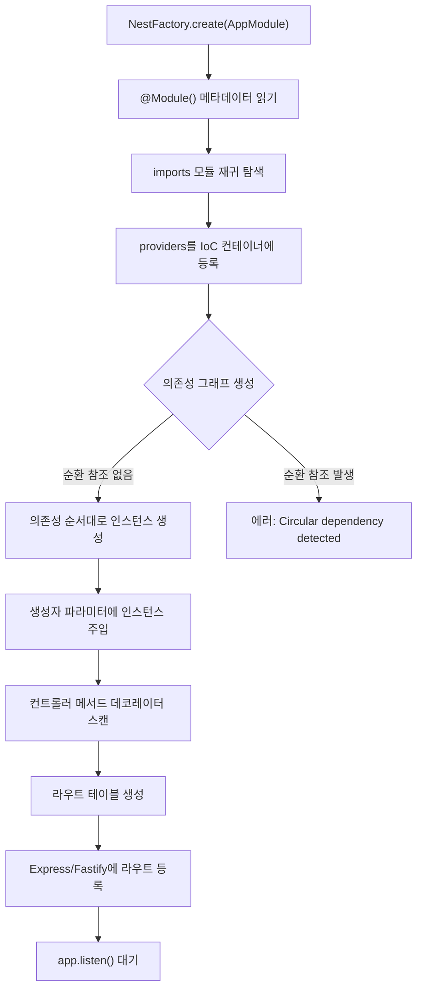
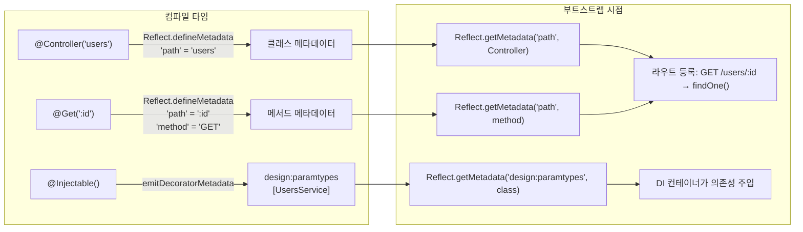
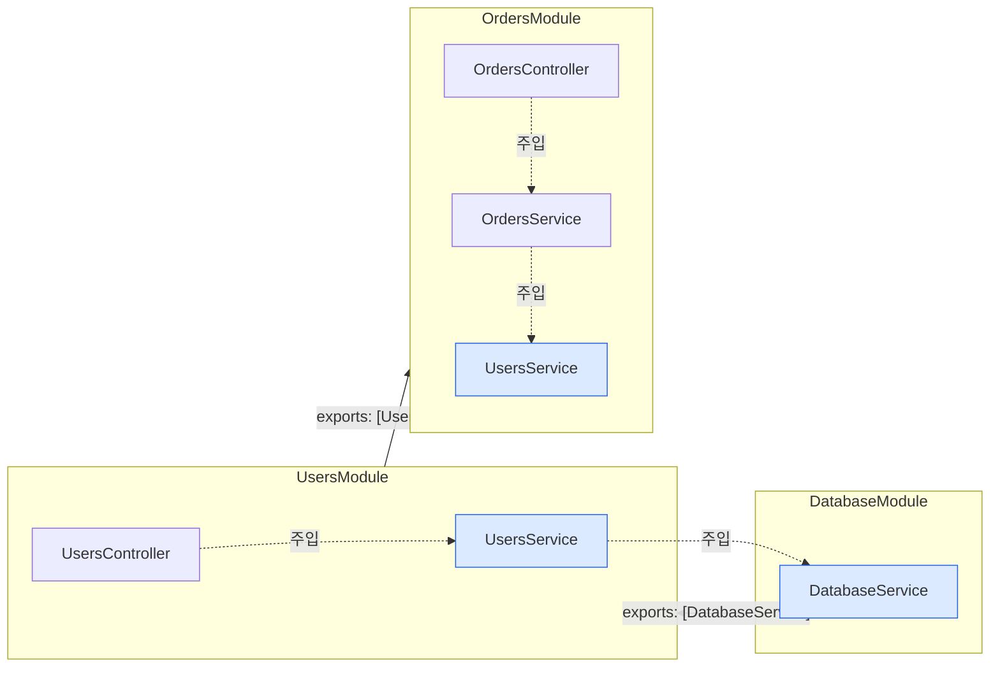
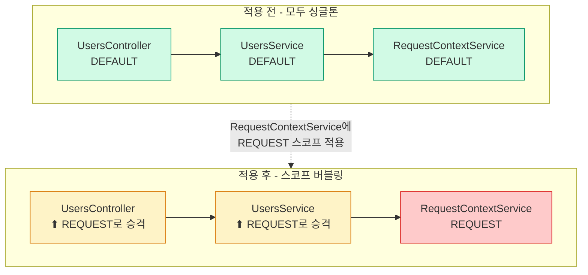
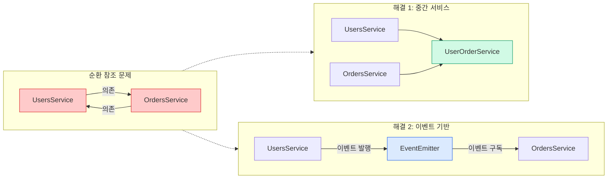
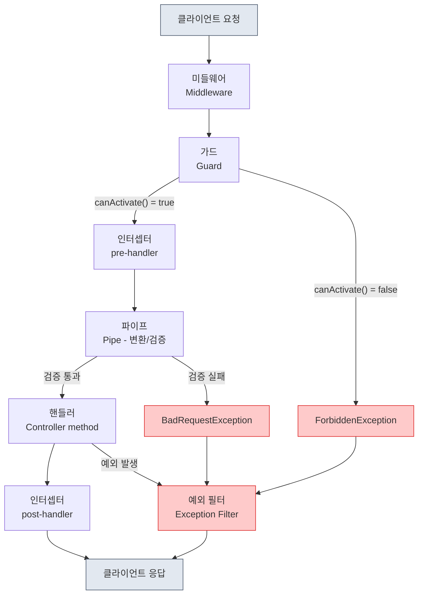

# NestJS 시작하기와 핵심 문법

프로젝트 초기 세팅부터 모듈/컨트롤러/서비스 작성, CLI 명령어, 실제 디렉토리 구조까지 실무 기준으로 정리한다. 그 다음 NestJS가 내부적으로 어떻게 동작하는지, 실무에서 자주 부딪히는 문제까지 다룬다.

---

## 프로젝트 초기 세팅

### Node.js 버전 확인

NestJS 10.x 이상은 Node.js 18.x 또는 20.x를 권장한다. 16.x는 더이상 지원하지 않는다.

```bash
node -v   # v20.11.0
npm -v    # 10.2.4
```

회사에서 여러 프로젝트를 관리한다면 `nvm`이나 `volta`로 버전을 고정해두는 게 낫다. 프로젝트 루트에 `.nvmrc` 파일을 두면 팀원 간 버전 차이로 생기는 문제를 줄인다.

```bash
echo "20.11.0" > .nvmrc
nvm use
```

### Nest CLI 설치

전역에 한 번만 설치해두면 어디서든 `nest` 명령을 쓸 수 있다.

```bash
npm install -g @nestjs/cli

nest --version   # 10.3.2
```

CI 환경처럼 전역 설치가 불가한 곳에서는 `npx @nestjs/cli new my-app` 식으로 직접 실행한다.

### 새 프로젝트 생성

```bash
nest new my-app

# 패키지 매니저 선택 프롬프트가 뜬다
# npm / yarn / pnpm
```

내부에서 다음 작업이 한 번에 일어난다.

- 디렉토리 생성과 기본 파일 스캐폴딩 (`src/`, `test/`, `tsconfig.json`, `nest-cli.json`)
- 선택한 패키지 매니저로 의존성 설치
- `git init`까지 자동 실행

PromptQL 같이 인터랙티브 선택을 피하고 싶다면 `nest new my-app --package-manager npm` 식으로 플래그를 넘긴다. 모노레포로 시작하려면 `nest new my-app --strict --collection @nestjs/schematics`를 쓰지 말고, 차라리 단일 앱으로 만든 뒤 `nest g app another-app`으로 워크스페이스로 변환하는 편이 안정적이다.

### 기존 프로젝트에 NestJS 추가

이미 있는 Express 프로젝트에 NestJS를 얹는 건 권장하지 않는다. 부트스트랩 자체가 다르기 때문에 사실상 처음부터 다시 짜는 셈이 된다. 빈 디렉토리에 `nest new`로 시작한 다음, 기존 비즈니스 로직만 옮기는 게 빠르다.

### 의존성 한눈에 보기

`nest new`로 만든 프로젝트의 `package.json` 핵심 의존성이다.

```json
{
  "dependencies": {
    "@nestjs/common": "^10.3.0",
    "@nestjs/core": "^10.3.0",
    "@nestjs/platform-express": "^10.3.0",
    "reflect-metadata": "^0.2.0",
    "rxjs": "^7.8.1"
  },
  "devDependencies": {
    "@nestjs/cli": "^10.3.0",
    "@nestjs/schematics": "^10.1.0",
    "@nestjs/testing": "^10.3.0",
    "typescript": "^5.3.0",
    "ts-node": "^10.9.2"
  }
}
```

`@nestjs/platform-express`를 `@nestjs/platform-fastify`로 바꾸면 Fastify 위에서 돌아간다. 단순 교체로 끝나는 게 아니라 일부 미들웨어와 응답 처리가 달라지므로, 초기 선택에서 결정해두는 게 좋다.

### 개발 서버 실행

```bash
npm run start:dev
```

`nest-cli.json`의 watch 옵션을 보고 파일 변경 시 자동 재시작한다. 내부적으로 `tsc --watch`와 `node`를 연결한 것이라서 큰 프로젝트에서는 시작 시간이 늘어진다. 그럴 때는 SWC 빌더를 켠다.

```json
// nest-cli.json
{
  "compilerOptions": {
    "builder": "swc",
    "typeCheck": true
  }
}
```

SWC는 타입 체크를 하지 않으므로 `typeCheck: true`를 같이 켜야 한다. 그래도 `tsc`보다 3~10배 빠르다.

---

## Nest CLI 명령어

Nest CLI는 `@nestjs/schematics`를 호출해서 파일을 생성하는 도구다. 손으로 파일을 만드는 것과 결과는 같지만, 매번 `@Module()`, `@Controller()` 같은 보일러플레이트를 쓰는 게 귀찮으니 CLI를 쓴다.

### 생성 명령어

```bash
nest g module users
nest g controller users
nest g service users
nest g resource posts  # 모듈 + 컨트롤러 + 서비스 + DTO + 엔티티 한 번에
```

축약형도 있다.

```bash
nest g mo users   # module
nest g co users   # controller
nest g s users    # service
nest g r posts    # resource
```

`nest g resource`가 가장 자주 쓰는 명령이다. CRUD 스캐폴딩까지 생성할지 묻고, REST/GraphQL/Microservice/WebSocket 중 어떤 전송 방식으로 만들지도 묻는다.

### 자주 쓰는 플래그

```bash
# 디렉토리 지정
nest g controller users --flat                 # users.controller.ts만 생성 (디렉토리 없이)
nest g service users --no-spec                 # 테스트 파일 생성 안 함
nest g module users --dry-run                  # 실제 생성하지 않고 결과만 미리 보기
nest g controller modules/auth/users           # 중첩 경로

# 옵션 조합
nest g resource users --no-spec --type rest
```

`--dry-run`은 CI에서 코드 생성을 자동화하기 전에 결과를 확인할 때 자주 쓴다.

### 빌드와 실행

```bash
npm run build         # dist/ 에 컴파일된 JS 출력
npm run start         # dist/main.js 실행
npm run start:dev     # 와치 모드 (개발용)
npm run start:debug   # --inspect로 디버거 연결
npm run start:prod    # 빌드된 코드로 프로덕션 실행
```

`start:dev`와 `start:debug` 차이가 헷갈리는데, 디버거 포트(`9229`)를 여는지 아닌지의 차이다. VSCode나 Chrome DevTools로 디버깅하려면 `start:debug`로 실행한다.

### 테스트

```bash
npm run test            # 단위 테스트
npm run test:watch      # 와치 모드
npm run test:cov        # 커버리지 리포트
npm run test:e2e        # 통합 테스트 (test/ 디렉토리)
```

E2E 테스트는 `jest-e2e.json` 설정 파일을 따로 쓰고, 실제로는 슈퍼테스트(supertest)로 HTTP 요청을 던지는 방식이다. 단위 테스트와 분리해서 실행해야 CI 시간이 짧아진다.

### 모노레포 명령어

워크스페이스로 변환하면 여러 앱을 한 저장소에서 관리할 수 있다.

```bash
nest g app admin-api         # 새 앱 추가
nest g lib shared            # 공통 라이브러리 추가
nest start admin-api         # 특정 앱 실행
nest build admin-api         # 특정 앱 빌드
```

생성된 `nest-cli.json`에 `projects` 항목이 추가되고, `apps/`와 `libs/` 디렉토리가 만들어진다.

---

## 실제 프로젝트 디렉토리 구조

NestJS가 강제하는 구조는 없다. 다만 실무에서 자리 잡은 두 가지 패턴이 있다.

### 기능별 모듈 분리 (가장 흔한 구조)

```
src/
├── main.ts                    # 부트스트랩 진입점
├── app.module.ts              # 루트 모듈
├── app.controller.ts          # 헬스체크 정도만
├── app.service.ts
│
├── common/                    # 전역으로 쓰는 것들
│   ├── decorators/
│   │   ├── current-user.decorator.ts
│   │   └── roles.decorator.ts
│   ├── filters/
│   │   └── http-exception.filter.ts
│   ├── guards/
│   │   ├── jwt-auth.guard.ts
│   │   └── roles.guard.ts
│   ├── interceptors/
│   │   ├── logging.interceptor.ts
│   │   └── transform.interceptor.ts
│   ├── pipes/
│   │   └── parse-object-id.pipe.ts
│   └── middleware/
│       └── request-id.middleware.ts
│
├── config/                    # 설정
│   ├── configuration.ts
│   ├── database.config.ts
│   └── validation.schema.ts
│
├── modules/                   # 도메인 모듈
│   ├── auth/
│   │   ├── auth.module.ts
│   │   ├── auth.controller.ts
│   │   ├── auth.service.ts
│   │   ├── strategies/
│   │   │   └── jwt.strategy.ts
│   │   └── dto/
│   │       └── login.dto.ts
│   │
│   ├── users/
│   │   ├── users.module.ts
│   │   ├── users.controller.ts
│   │   ├── users.service.ts
│   │   ├── users.repository.ts
│   │   ├── entities/
│   │   │   └── user.entity.ts
│   │   ├── dto/
│   │   │   ├── create-user.dto.ts
│   │   │   └── update-user.dto.ts
│   │   └── tests/
│   │       └── users.service.spec.ts
│   │
│   └── orders/
│       ├── orders.module.ts
│       ├── orders.controller.ts
│       ├── orders.service.ts
│       ├── entities/
│       └── dto/
│
└── shared/                    # 인프라성 모듈
    ├── database/
    │   └── database.module.ts
    ├── redis/
    │   └── redis.module.ts
    └── queue/
        └── queue.module.ts

test/                          # E2E 테스트
├── app.e2e-spec.ts
└── jest-e2e.json

dist/                          # 빌드 결과물 (gitignore)
```

`modules/` 아래에 도메인 단위로 묶고, 공통 코드는 `common/`에 두는 게 표준에 가깝다. 도메인 모듈 안에서 `entities/`, `dto/`, `tests/`를 다시 분리하면 파일이 많아져도 찾기 쉽다.

`shared/`와 `common/`을 헷갈려 하는 경우가 많은데, 구분이 명확하다.

- `common/`: NestJS 기능(가드, 인터셉터, 데코레이터) — 보통 import 없이 어디서나 쓴다
- `shared/`: 다른 모듈이 import해서 쓰는 모듈 (DB, 캐시, 큐 등)

### 레이어 기반 구조 (대안)

도메인별이 아니라 역할별로 묶는 방식이다. 작은 프로젝트나 CRUD 위주 앱에서는 이게 더 단순할 수 있다.

```
src/
├── controllers/
├── services/
├── repositories/
├── entities/
├── dto/
└── modules/
```

다만 모듈이 늘어나면 한 도메인의 코드가 여러 디렉토리에 흩어져서 추적이 힘들어진다. 5개 이상 모듈이 생긴다면 기능별 구조로 가는 게 낫다.

### 모노레포 구조

```
project-root/
├── apps/
│   ├── api/                   # 메인 API 서버
│   │   ├── src/
│   │   └── tsconfig.app.json
│   ├── admin/                 # 어드민 백오피스
│   │   └── src/
│   └── worker/                # 배치 워커
│       └── src/
│
├── libs/
│   ├── common/                # 공통 유틸
│   ├── database/              # DB 엔티티/리포지토리
│   └── auth/                  # 인증 로직
│
├── nest-cli.json
├── package.json
└── tsconfig.json
```

`apps/`는 독립 실행 단위, `libs/`는 여러 앱이 공유하는 코드를 담는다. tsconfig의 `paths`가 자동으로 잡혀서 `@app/common`처럼 import할 수 있다.

### main.ts 예시

부트스트랩 파일에 들어가는 표준 설정이다. 매번 같은 코드를 쓰게 되므로 한 번 정리해두면 새 프로젝트에 복사해서 쓰기 좋다.

```typescript
// src/main.ts
import { NestFactory } from '@nestjs/core';
import { ValidationPipe, Logger } from '@nestjs/common';
import { ConfigService } from '@nestjs/config';
import helmet from 'helmet';
import { AppModule } from './app.module';
import { HttpExceptionFilter } from './common/filters/http-exception.filter';
import { LoggingInterceptor } from './common/interceptors/logging.interceptor';

async function bootstrap() {
  const app = await NestFactory.create(AppModule, {
    logger: ['error', 'warn', 'log'],
  });

  const config = app.get(ConfigService);

  app.use(helmet());
  app.enableCors({
    origin: config.get('CORS_ORIGIN'),
    credentials: true,
  });

  app.setGlobalPrefix('api/v1');

  app.useGlobalPipes(
    new ValidationPipe({
      whitelist: true,
      forbidNonWhitelisted: true,
      transform: true,
      transformOptions: { enableImplicitConversion: true },
    }),
  );

  app.useGlobalFilters(new HttpExceptionFilter());
  app.useGlobalInterceptors(new LoggingInterceptor());

  app.enableShutdownHooks();

  const port = config.get<number>('PORT') ?? 3000;
  await app.listen(port);

  Logger.log(`Server running on http://localhost:${port}`, 'Bootstrap');
}

bootstrap();
```

`enableShutdownHooks()`를 빠뜨리면 컨테이너 환경에서 SIGTERM이 와도 그레이스풀 종료가 안 된다. K8s 배포할 때 `OnModuleDestroy`로 DB 연결 끊는 로직이 동작하지 않으니 꼭 켜둔다.

---

## NestJS가 하는 일

NestJS는 결국 Express(또는 Fastify) 위에 올라가는 래퍼다. 직접 하는 일은 크게 세 가지다.

1. **데코레이터로 메타데이터를 수집**해서 라우팅, DI, 미들웨어 체인을 자동으로 구성한다
2. **IoC 컨테이너**가 클래스 인스턴스의 생성과 주입을 관리한다
3. **요청 파이프라인**(미들웨어 → 가드 → 인터셉터 → 파이프 → 핸들러 → 인터셉터 → 예외 필터)을 실행한다

Express만 쓸 때는 이 세 가지를 개발자가 직접 구성해야 한다. NestJS는 이 구성을 데코레이터와 모듈 시스템으로 자동화한 것이다.

---

## 부트스트랩 과정

`NestFactory.create(AppModule)`을 호출하면 내부에서 어떤 일이 벌어지는지 알아야 디버깅이 편하다.

```typescript
// main.ts
async function bootstrap() {
  const app = await NestFactory.create(AppModule);
  await app.listen(3000);
}
```

`create()` 내부 동작 순서:

1. `AppModule`의 `@Module()` 데코레이터에서 메타데이터를 읽는다
2. `imports`에 선언된 모듈을 재귀적으로 탐색한다
3. 각 모듈의 `providers`를 IoC 컨테이너에 등록한다
4. 의존성 그래프를 만들고, 순서대로 인스턴스를 생성한다
5. `controllers`에 선언된 클래스의 메서드 데코레이터를 읽어 라우트 테이블을 만든다
6. Express(또는 Fastify) 인스턴스에 라우트를 등록한다

여기서 중요한 건 **4번**이다. 의존성 그래프에 순환이 있으면 부트스트랩 자체가 실패한다. 이 문제는 뒤에서 다룬다.

### DI 컨테이너 동작 흐름

부트스트랩에서 DI 컨테이너가 인스턴스를 생성하는 과정을 흐름으로 보면 이렇다:



예를 들어 `UsersController → UsersService → UsersRepository` 의존 관계가 있으면, 컨테이너는 `UsersRepository`부터 만들고, 그 인스턴스를 `UsersService` 생성자에 넣고, 다시 `UsersService` 인스턴스를 `UsersController` 생성자에 넣는다. 잎(leaf) 노드부터 루트 방향으로 올라가는 것이다.

---

## 데코레이터가 실제로 하는 일

NestJS 데코레이터는 마법이 아니다. 내부적으로 `reflect-metadata` 라이브러리를 써서 클래스에 메타데이터를 붙이는 게 전부다.

### reflect-metadata 동작 방식

`@Controller('users')`가 실행되면 내부에서 이런 코드가 돌아간다:

```typescript
// NestJS 내부 구현을 단순화한 것
function Controller(prefix?: string): ClassDecorator {
  return (target: Function) => {
    Reflect.defineMetadata('path', prefix || '', target);
    Reflect.defineMetadata('__isController__', true, target);
  };
}
```

`@Get(':id')`도 마찬가지다:

```typescript
function Get(path?: string): MethodDecorator {
  return (target, propertyKey, descriptor) => {
    Reflect.defineMetadata('path', path || '', descriptor.value);
    Reflect.defineMetadata('method', 'GET', descriptor.value);
  };
}
```

NestJS는 부트스트랩 시점에 `Reflect.getMetadata()`로 이 정보를 꺼내서 라우트를 등록한다.

### @Injectable()의 진짜 역할

`@Injectable()`은 클래스에 "이 클래스는 DI 대상이다"라는 표시를 남기는 것 외에, TypeScript의 `emitDecoratorMetadata` 옵션과 결합해서 **생성자 파라미터의 타입 정보**를 메타데이터로 저장한다.

```typescript
@Injectable()
export class UsersService {
  constructor(private readonly usersRepo: UsersRepository) {}
}
```

컴파일 후 TypeScript가 자동으로 이런 메타데이터를 생성한다:

```typescript
Reflect.defineMetadata('design:paramtypes', [UsersRepository], UsersService);
```

IoC 컨테이너는 이 `design:paramtypes`를 읽어서 `UsersService`를 만들 때 `UsersRepository` 인스턴스를 주입해야 한다는 걸 안다.

**주의**: `@Injectable()`을 빼먹으면 `design:paramtypes` 메타데이터가 생성되지 않아서 DI가 실패한다. "왜 주입이 안 되지?" 할 때 가장 먼저 확인할 것이다.

### 데코레이터 → 메타데이터 → 라우트 매핑

데코레이터가 어떤 경로로 최종 라우트가 되는지 전체 흐름을 그림으로 보면 이렇다:



결국 데코레이터는 메타데이터를 붙이는 것이고, 부트스트랩 시점에 NestJS가 그 메타데이터를 읽어서 라우트와 DI를 구성한다. 이 두 단계가 분리되어 있다는 걸 알면 디버깅할 때 어디를 봐야 하는지 감이 온다.

### tsconfig.json 필수 설정

```json
{
  "compilerOptions": {
    "emitDecoratorMetadata": true,
    "experimentalDecorators": true
  }
}
```

이 두 옵션이 빠지면 데코레이터 기반 DI 자체가 작동하지 않는다.

---

## 모듈 시스템

### 모듈의 역할

모듈은 관련된 컨트롤러와 프로바이더를 묶는 단위다. 중요한 건 **스코프**다.

```typescript
@Module({
  imports: [DatabaseModule],
  controllers: [UsersController],
  providers: [UsersService],
  exports: [UsersService],
})
export class UsersModule {}
```

- `providers`에 등록한 것은 **이 모듈 안에서만** 사용 가능하다
- 다른 모듈에서 쓰게 하려면 반드시 `exports`에 넣어야 한다
- `imports`에 다른 모듈을 넣으면, 그 모듈이 `exports`한 프로바이더를 사용할 수 있다

모듈 간 의존성이 어떻게 흐르는지 그림으로 보면 이렇다:



`exports`에 넣지 않은 프로바이더는 해당 모듈 외부에서 접근할 수 없다. `UsersModule`에서 `UsersService`를 exports하지 않고 `OrdersModule`에서 주입하려고 하면 "Nest can't resolve dependencies" 에러가 난다. exports를 빠뜨린 경우가 대부분이다.

### 글로벌 모듈

매번 imports하기 귀찮은 모듈은 `@Global()`로 선언한다:

```typescript
@Global()
@Module({
  providers: [ConfigService],
  exports: [ConfigService],
})
export class ConfigModule {}
```

`AppModule`에 한 번만 import하면 모든 모듈에서 `ConfigService`를 주입받을 수 있다. 다만 남용하면 의존성 추적이 어려워진다. 정말 전역으로 필요한 것(설정, 로거 정도)만 글로벌로 만든다.

### 동적 모듈

설정값을 받아서 모듈을 구성해야 할 때 쓴다. `@nestjs/config`의 `ConfigModule.forRoot()`가 대표적인 예다.

```typescript
@Module({})
export class DatabaseModule {
  static forRoot(options: { host: string; port: number }): DynamicModule {
    return {
      module: DatabaseModule,
      providers: [
        {
          provide: 'DB_OPTIONS',
          useValue: options,
        },
        DatabaseService,
      ],
      exports: [DatabaseService],
    };
  }
}

// 사용
@Module({
  imports: [DatabaseModule.forRoot({ host: 'localhost', port: 5432 })],
})
export class AppModule {}
```

`forRoot`과 `forRootAsync`의 차이: `forRoot`은 동기적으로 설정값을 받고, `forRootAsync`는 다른 프로바이더에 의존하는 비동기 설정이 필요할 때 쓴다.

---

## 프로바이더와 의존성 주입

### 기본 주입 방식

생성자 주입이 표준이다:

```typescript
@Controller('users')
export class UsersController {
  constructor(private readonly usersService: UsersService) {}
}
```

TypeScript의 `private readonly` 축약 문법을 쓰면 필드 선언과 할당을 한 줄로 할 수 있다. NestJS 코드에서 이 패턴이 거의 관례다.

### 커스텀 프로바이더

`providers` 배열에 클래스를 직접 넣는 건 사실 축약 표현이다:

```typescript
// 이 두 줄은 같은 의미다
providers: [UsersService]
providers: [{ provide: UsersService, useClass: UsersService }]
```

실무에서 커스텀 프로바이더가 필요한 상황:

#### useClass — 환경별 구현체 교체

```typescript
@Module({
  providers: [
    {
      provide: PaymentService,
      useClass:
        process.env.NODE_ENV === 'production'
          ? StripePaymentService
          : MockPaymentService,
    },
  ],
})
export class PaymentModule {}
```

테스트 환경에서 외부 API를 호출하지 않으려고 할 때 자주 쓴다. 인터페이스를 기준으로 주입하는 것이라서 사용하는 쪽 코드는 변경할 필요가 없다.

#### useValue — 고정값, 설정 객체

```typescript
@Module({
  providers: [
    {
      provide: 'API_KEY',
      useValue: process.env.API_KEY,
    },
  ],
})
export class AppModule {}

// 주입받을 때는 @Inject() 데코레이터 필요
@Injectable()
export class ExternalApiService {
  constructor(@Inject('API_KEY') private apiKey: string) {}
}
```

문자열 토큰 대신 Symbol이나 클래스를 쓸 수도 있다. 문자열 토큰은 오타가 나면 런타임에서야 잡히기 때문에, 프로젝트가 커지면 상수로 관리하는 게 낫다.

#### useFactory — 비동기 초기화, 다른 프로바이더 의존

```typescript
@Module({
  providers: [
    {
      provide: 'DATABASE_CONNECTION',
      useFactory: async (configService: ConfigService) => {
        const connection = await createConnection({
          host: configService.get('DB_HOST'),
          port: configService.get<number>('DB_PORT'),
        });
        return connection;
      },
      inject: [ConfigService], // useFactory에 주입할 프로바이더
    },
  ],
})
export class DatabaseModule {}
```

`inject` 배열의 순서가 factory 함수 파라미터 순서와 일치해야 한다. 순서가 어긋나면 타입 에러 없이 잘못된 객체가 주입되어서 디버깅이 힘들다.

#### useExisting — 별칭(alias)

```typescript
@Module({
  providers: [
    UsersService,
    {
      provide: 'AliasedUsersService',
      useExisting: UsersService,
    },
  ],
})
export class UsersModule {}
```

같은 인스턴스를 다른 토큰으로 참조할 때 쓴다. 레거시 코드와 새 코드가 공존하는 상황에서 가끔 필요하다. 새 인스턴스를 만드는 게 아니라 기존 인스턴스에 대한 참조를 하나 더 만드는 것이다.

### 프로바이더 스코프

기본적으로 NestJS의 모든 프로바이더는 **싱글톤**이다. 애플리케이션 시작 시 한 번 생성되고, 모든 요청에서 같은 인스턴스를 공유한다.

#### DEFAULT (싱글톤)

```typescript
@Injectable() // scope 지정 안 하면 DEFAULT
export class UsersService {}
```

대부분의 서비스는 이걸로 충분하다. 상태를 갖지 않는 서비스라면 싱글톤이 맞다.

#### REQUEST 스코프

```typescript
@Injectable({ scope: Scope.REQUEST })
export class RequestContextService {
  private tenantId: string;

  setTenantId(id: string) {
    this.tenantId = id;
  }

  getTenantId() {
    return this.tenantId;
  }
}
```

요청마다 새 인스턴스가 생성된다. 멀티테넌트 환경에서 요청별로 다른 DB 연결을 써야 할 때 같은 경우에 필요하다.

**주의할 점**: REQUEST 스코프 프로바이더를 주입받는 프로바이더도 자동으로 REQUEST 스코프가 된다. 이게 **버블링**이다. `UsersService`(DEFAULT) → `RequestContextService`(REQUEST) 의존 관계면, `UsersService`도 REQUEST 스코프로 승격된다.

이게 성능에 미치는 영향이 크다. 싱글톤이었던 서비스가 요청마다 새로 생성되니까 GC 부담이 늘어난다. REQUEST 스코프가 전파되는 범위를 꼭 확인해야 한다.



하나의 프로바이더에 REQUEST 스코프를 적용했을 뿐인데, 그걸 직간접적으로 의존하는 모든 프로바이더가 REQUEST 스코프로 승격된다. 요청마다 컨트롤러, 서비스 전부 새로 생성하게 되는 것이다.

#### TRANSIENT 스코프

```typescript
@Injectable({ scope: Scope.TRANSIENT })
export class LoggerService {
  private context: string;

  setContext(context: string) {
    this.context = context;
  }

  log(message: string) {
    console.log(`[${this.context}] ${message}`);
  }
}
```

주입받는 곳마다 별도의 인스턴스가 생성된다. `UsersService`와 `OrdersService`가 각각 `LoggerService`를 주입받으면, 서로 다른 인스턴스를 가진다.

REQUEST와 TRANSIENT의 차이:
- REQUEST: 같은 요청 안에서는 같은 인스턴스를 공유
- TRANSIENT: 주입받는 곳마다 항상 다른 인스턴스

---

## 순환 참조와 forwardRef

실무에서 꽤 자주 마주치는 문제다. `UsersModule`이 `OrdersModule`을 import하고, `OrdersModule`도 `UsersModule`을 import하면 순환 참조가 발생한다.

### 모듈 간 순환 참조

```typescript
// users.module.ts
@Module({
  imports: [forwardRef(() => OrdersModule)],
  providers: [UsersService],
  exports: [UsersService],
})
export class UsersModule {}

// orders.module.ts
@Module({
  imports: [forwardRef(() => UsersModule)],
  providers: [OrdersService],
  exports: [OrdersService],
})
export class OrdersModule {}
```

`forwardRef(() => OrdersModule)`는 "아직 정의되지 않았을 수 있지만, 나중에 이 모듈을 참조하겠다"는 의미다. 양쪽 모듈 모두에 `forwardRef`를 적용해야 한다.

### 프로바이더 간 순환 참조

```typescript
@Injectable()
export class UsersService {
  constructor(
    @Inject(forwardRef(() => OrdersService))
    private ordersService: OrdersService,
  ) {}
}

@Injectable()
export class OrdersService {
  constructor(
    @Inject(forwardRef(() => UsersService))
    private usersService: UsersService,
  ) {}
}
```

### 순환 참조를 피하는 방법

`forwardRef`는 임시 해결책이다. 가능하면 설계를 바꾸는 게 맞다.



1. **중간 서비스 도입**: `UsersService`와 `OrdersService`가 서로를 직접 호출하는 대신, `UserOrderService` 같은 조합 서비스를 만든다
2. **이벤트 기반 통신**: 한쪽이 이벤트를 발행하고 다른 쪽이 구독하는 방식. `@nestjs/event-emitter`를 쓰면 된다
3. **의존성 방향 재설계**: 대부분의 순환 참조는 책임 분리가 잘못된 신호다

---

## 컨트롤러와 라우팅

### 기본 구조

```typescript
@Controller('users')
export class UsersController {
  constructor(private readonly usersService: UsersService) {}

  @Post()
  create(@Body() dto: CreateUserDto) {
    return this.usersService.create(dto);
  }

  @Get(':id')
  findOne(@Param('id', ParseIntPipe) id: number) {
    return this.usersService.findOne(id);
  }

  @Patch(':id')
  update(
    @Param('id', ParseIntPipe) id: number,
    @Body() dto: UpdateUserDto,
  ) {
    return this.usersService.update(id, dto);
  }

  @Delete(':id')
  @HttpCode(HttpStatus.NO_CONTENT)
  remove(@Param('id', ParseIntPipe) id: number) {
    return this.usersService.remove(id);
  }
}
```

### 파라미터 데코레이터

`@Body()`, `@Param()`, `@Query()`, `@Headers()` 등이 있다. 내부적으로 `ExecutionContext`에서 Express의 `req` 객체를 꺼낸 뒤, 지정된 키의 값을 추출한다.

```typescript
// @Body('name')이 하는 일을 단순화하면
const name = req.body['name'];

// @Query()가 하는 일
const query = req.query;

// @Param('id')가 하는 일
const id = req.params['id'];
```

`@Req()`와 `@Res()`로 Express 객체에 직접 접근할 수 있지만, 그렇게 하면 Fastify로 전환할 때 코드를 다 고쳐야 한다. 가능하면 NestJS 파라미터 데코레이터만 쓴다.

### 커스텀 파라미터 데코레이터

```typescript
export const CurrentUser = createParamDecorator(
  (data: string | undefined, ctx: ExecutionContext) => {
    const request = ctx.switchToHttp().getRequest();
    const user = request.user;
    return data ? user?.[data] : user;
  },
);

// 사용
@Get('me')
getProfile(@CurrentUser() user: UserPayload) {
  return user;
}

@Get('me/email')
getEmail(@CurrentUser('email') email: string) {
  return { email };
}
```

---

## 요청 파이프라인

요청이 들어오면 거치는 순서:



각 단계의 역할:

- **미들웨어**: Express 미들웨어와 같다. 요청/응답 객체를 변경할 수 있다. CORS, 로깅 같은 범용 처리에 쓴다
- **가드**: `canActivate()` 메서드가 true를 반환하면 요청을 통과시킨다. 인증/인가에 쓴다
- **인터셉터**: 핸들러 실행 전후에 로직을 끼워 넣는다. 응답 변환, 로깅, 캐싱에 쓴다
- **파이프**: 핸들러에 전달되는 인자를 변환하거나 검증한다
- **예외 필터**: 파이프라인 어디서든 발생한 예외를 잡아서 응답 형식을 통일한다

### 가드 구현

```typescript
@Injectable()
export class JwtAuthGuard implements CanActivate {
  constructor(private jwtService: JwtService) {}

  canActivate(context: ExecutionContext): boolean {
    const request = context.switchToHttp().getRequest();
    const token = request.headers.authorization?.replace('Bearer ', '');

    if (!token) {
      throw new UnauthorizedException();
    }

    try {
      const payload = this.jwtService.verify(token);
      request.user = payload;
      return true;
    } catch {
      throw new UnauthorizedException();
    }
  }
}
```

### 역할 기반 접근 제어

가드와 커스텀 데코레이터를 조합한다:

```typescript
// 데코레이터 정의
export const Roles = (...roles: string[]) => SetMetadata('roles', roles);

// 가드 구현
@Injectable()
export class RolesGuard implements CanActivate {
  constructor(private reflector: Reflector) {}

  canActivate(context: ExecutionContext): boolean {
    const roles = this.reflector.get<string[]>('roles', context.getHandler());
    if (!roles) return true;

    const request = context.switchToHttp().getRequest();
    return roles.some((role) => request.user.roles?.includes(role));
  }
}

// 적용
@Get('admin')
@Roles('admin')
@UseGuards(JwtAuthGuard, RolesGuard)
adminEndpoint() {
  return { message: 'admin only' };
}
```

`Reflector`가 `SetMetadata`로 붙인 메타데이터를 읽는 역할을 한다. 결국 내부적으로는 `Reflect.getMetadata()`를 호출한다.

### 인터셉터 구현

```typescript
@Injectable()
export class LoggingInterceptor implements NestInterceptor {
  intercept(context: ExecutionContext, next: CallHandler): Observable<any> {
    const request = context.switchToHttp().getRequest();
    const now = Date.now();

    return next.handle().pipe(
      tap(() => {
        console.log(
          `${request.method} ${request.url} - ${Date.now() - now}ms`,
        );
      }),
    );
  }
}
```

`next.handle()`이 실제 핸들러를 실행한다. RxJS Observable을 반환하기 때문에 `pipe()`로 후처리를 할 수 있다.

### 예외 필터

```typescript
@Catch(HttpException)
export class HttpExceptionFilter implements ExceptionFilter {
  catch(exception: HttpException, host: ArgumentsHost) {
    const ctx = host.switchToHttp();
    const response = ctx.getResponse<Response>();
    const status = exception.getStatus();

    response.status(status).json({
      statusCode: status,
      message: exception.message,
      timestamp: new Date().toISOString(),
    });
  }
}
```

`@Catch()` 데코레이터에 인자를 넣지 않으면 모든 예외를 잡는다. 특정 예외만 잡으려면 `@Catch(NotFoundException)` 식으로 지정한다.

---

## DTO와 유효성 검증

### ValidationPipe 설정

```typescript
// main.ts
async function bootstrap() {
  const app = await NestFactory.create(AppModule);

  app.useGlobalPipes(
    new ValidationPipe({
      whitelist: true,           // DTO에 정의되지 않은 프로퍼티 제거
      forbidNonWhitelisted: true, // 정의되지 않은 프로퍼티가 있으면 400 에러
      transform: true,           // 쿼리 파라미터 등을 DTO 타입으로 자동 변환
    }),
  );

  await app.listen(3000);
}
```

`whitelist: true`는 꼭 켜야 한다. 클라이언트가 `isAdmin: true` 같은 필드를 몰래 보내는 걸 방지한다.

### DTO 정의

```typescript
import { IsString, IsEmail, IsInt, Min, Max, IsOptional, MinLength } from 'class-validator';

export class CreateUserDto {
  @IsString()
  @MinLength(2)
  name: string;

  @IsEmail()
  email: string;

  @IsInt()
  @Min(1)
  @Max(120)
  age: number;

  @IsOptional()
  @IsString()
  @MinLength(8)
  password?: string;
}
```

```typescript
import { PartialType } from '@nestjs/mapped-types';
import { CreateUserDto } from './create-user.dto';

export class UpdateUserDto extends PartialType(CreateUserDto) {}
```

`PartialType`은 모든 필드를 optional로 만든다. 내부적으로 class-validator 데코레이터의 메타데이터를 복사하면서 `@IsOptional()`을 추가한다.

### 커스텀 Pipe

```typescript
@Injectable()
export class ParseIntPipe implements PipeTransform<string, number> {
  transform(value: string, metadata: ArgumentMetadata): number {
    const parsed = parseInt(value, 10);
    if (isNaN(parsed)) {
      throw new BadRequestException(`"${value}"는 정수가 아니다`);
    }
    return parsed;
  }
}
```

NestJS가 내장 `ParseIntPipe`를 제공하지만, 에러 메시지를 커스터마이징하려면 직접 만들어야 하는 경우가 있다.

---

## 실무에서 자주 겪는 문제

### "Nest can't resolve dependencies" 에러

가장 흔한 에러다. 원인은 대부분 셋 중 하나:

1. **모듈에서 exports를 빠뜨렸다** — 프로바이더를 다른 모듈에서 쓰려면 exports 배열에 넣어야 한다
2. **@Injectable()을 빠뜨렸다** — DI 대상 클래스에 데코레이터가 없으면 메타데이터가 생성되지 않는다
3. **순환 참조** — A가 B를 필요로 하고 B가 A를 필요로 하는 상황. forwardRef로 임시 해결 가능

에러 메시지에 `?` 표시가 나오면 해당 위치의 파라미터 타입을 NestJS가 식별하지 못한 것이다. 인터페이스로 타입을 지정한 경우에 이런 문제가 생긴다. TypeScript 인터페이스는 런타임에 존재하지 않기 때문이다.

```typescript
// 이렇게 하면 안 된다
constructor(private usersService: IUsersService) {} // 인터페이스 = 런타임에 없음

// 이렇게 해야 한다
constructor(
  @Inject('USERS_SERVICE') private usersService: IUsersService,
) {}
```

### REQUEST 스코프의 성능 문제

REQUEST 스코프 프로바이더를 하나 도입했더니 응답 시간이 눈에 띄게 늘어나는 경우가 있다. 스코프 버블링 때문에 연쇄적으로 싱글톤이 REQUEST 스코프로 승격되면, 요청마다 수십 개의 인스턴스를 새로 만들 수 있다.

대안으로 `@nestjs/core`의 `REQUEST` 토큰과 `ModuleRef`를 써서, REQUEST 스코프 없이 요청 컨텍스트를 처리하는 방법이 있다:

```typescript
import { REQUEST } from '@nestjs/core';

@Injectable()
export class TenantService {
  constructor(@Inject(REQUEST) private request: Request) {}

  getTenantId(): string {
    return this.request.headers['x-tenant-id'] as string;
  }
}
```

Node.js 14.8+ 환경이면 `AsyncLocalStorage`를 써서 REQUEST 스코프 없이도 요청 컨텍스트를 전파할 수 있다. NestJS에서도 `cls-hooked`나 `@nestjs-cls/core` 같은 라이브러리로 지원한다.

### 테스트에서 DI 활용

```typescript
describe('UsersService', () => {
  let service: UsersService;
  let mockRepo: jest.Mocked<Repository<User>>;

  beforeEach(async () => {
    const module = await Test.createTestingModule({
      providers: [
        UsersService,
        {
          provide: getRepositoryToken(User),
          useValue: {
            find: jest.fn(),
            findOne: jest.fn(),
            save: jest.fn(),
          },
        },
      ],
    }).compile();

    service = module.get(UsersService);
    mockRepo = module.get(getRepositoryToken(User));
  });

  it('findAll은 유저 배열을 반환한다', async () => {
    const users = [{ id: 1, name: 'test' }] as User[];
    mockRepo.find.mockResolvedValue(users);

    const result = await service.findAll();
    expect(result).toEqual(users);
  });
});
```

`Test.createTestingModule()`이 실제 앱과 동일한 DI 시스템을 사용한다. 커스텀 프로바이더를 쓰면 외부 의존성을 쉽게 모킹할 수 있다.

### `nest g resource` 후 import를 깜빡한 경우

CLI로 모듈을 만들면 파일은 자동으로 생성되지만, 루트 모듈(`app.module.ts`)에 import를 자동으로 추가하지 않는 경우가 있다. 정확히는 `nest g module`로 만든 경우는 자동으로 `app.module.ts`에 import를 추가하지만, `nest g resource`로 만들 때는 위치에 따라 추가되지 않을 수 있다.

생성 후 서버를 띄웠는데 라우트가 동작하지 않으면 가장 먼저 `app.module.ts`의 `imports` 배열을 확인한다.

```typescript
@Module({
  imports: [
    UsersModule,   // 누락된 경우가 흔하다
    OrdersModule,
  ],
})
export class AppModule {}
```

### TypeScript 컴파일은 되는데 런타임에 DI 실패

`tsconfig.json`의 옵션을 확인한다. `emitDecoratorMetadata`나 `experimentalDecorators`가 꺼져있으면 클래스 메타데이터가 생성되지 않는다.

```json
{
  "compilerOptions": {
    "emitDecoratorMetadata": true,
    "experimentalDecorators": true,
    "target": "ES2021",
    "module": "commonjs"
  }
}
```

SWC를 빌더로 쓰는 경우에도 `.swcrc`에서 같은 옵션을 켜야 한다.

```json
{
  "jsc": {
    "parser": {
      "syntax": "typescript",
      "decorators": true
    },
    "transform": {
      "legacyDecorator": true,
      "decoratorMetadata": true
    }
  }
}
```

### main.ts에서 환경변수가 undefined로 나오는 경우

`ConfigModule.forRoot()`는 비동기로 `.env` 파일을 읽는다. `main.ts`에서 `process.env.PORT`를 직접 읽으면 안 되고, `app.get(ConfigService)`로 꺼내야 한다. ConfigModule이 글로벌이 아닌 경우에도 빈번하게 생기는 문제다.

```typescript
// 안 됨 — .env 로드 시점 보장 안 됨
const port = process.env.PORT;

// 됨 — ConfigService가 .env 로드를 보장
const config = app.get(ConfigService);
const port = config.get<number>('PORT');
```

### `cannot find module` 에러 (SWC 사용 시)

SWC로 빌드한 경우 `dist/` 디렉토리 구조가 `tsc`와 다를 수 있다. `nest-cli.json`의 `sourceRoot`와 `entryFile` 설정을 확인하고, `npm run build` 후 `dist/main.js`가 실제로 존재하는지 본다.

---

## CRUD 예제: 전체 흐름

모듈 → 서비스 → 컨트롤러가 어떻게 연결되는지 전체를 한 번에 본다.

### Entity

```typescript
// users/entities/user.entity.ts
export class User {
  id: number;
  name: string;
  email: string;
  age: number;
  isActive: boolean;
  createdAt: Date;
  updatedAt: Date;
}
```

### Service

```typescript
// users/users.service.ts
@Injectable()
export class UsersService {
  private users: User[] = [];
  private nextId = 1;

  create(dto: CreateUserDto): User {
    const user: User = {
      id: this.nextId++,
      ...dto,
      isActive: true,
      createdAt: new Date(),
      updatedAt: new Date(),
    };
    this.users.push(user);
    return user;
  }

  findAll(): User[] {
    return this.users;
  }

  findOne(id: number): User {
    const user = this.users.find((u) => u.id === id);
    if (!user) {
      throw new NotFoundException(`User #${id} not found`);
    }
    return user;
  }

  update(id: number, dto: UpdateUserDto): User {
    const user = this.findOne(id);
    Object.assign(user, dto, { updatedAt: new Date() });
    return user;
  }

  remove(id: number): void {
    const index = this.users.findIndex((u) => u.id === id);
    if (index === -1) {
      throw new NotFoundException(`User #${id} not found`);
    }
    this.users.splice(index, 1);
  }
}
```

### Controller

```typescript
// users/users.controller.ts
@Controller('users')
export class UsersController {
  constructor(private readonly usersService: UsersService) {}

  @Post()
  @HttpCode(HttpStatus.CREATED)
  create(@Body() dto: CreateUserDto) {
    return this.usersService.create(dto);
  }

  @Get()
  findAll() {
    return this.usersService.findAll();
  }

  @Get(':id')
  findOne(@Param('id', ParseIntPipe) id: number) {
    return this.usersService.findOne(id);
  }

  @Patch(':id')
  update(
    @Param('id', ParseIntPipe) id: number,
    @Body() dto: UpdateUserDto,
  ) {
    return this.usersService.update(id, dto);
  }

  @Delete(':id')
  @HttpCode(HttpStatus.NO_CONTENT)
  remove(@Param('id', ParseIntPipe) id: number) {
    return this.usersService.remove(id);
  }
}
```

### Module

```typescript
// users/users.module.ts
@Module({
  controllers: [UsersController],
  providers: [UsersService],
  exports: [UsersService],
})
export class UsersModule {}

// app.module.ts
@Module({
  imports: [UsersModule],
})
export class AppModule {}
```

---

## 참고

- [NestJS 공식 문서](https://docs.nestjs.com/)
- [NestJS GitHub](https://github.com/nestjs/nest)
- [NestJS CLI 옵션](https://docs.nestjs.com/cli/usages)
- [reflect-metadata](https://github.com/rbuckton/reflect-metadata)
- [class-validator](https://github.com/typestack/class-validator)
- [class-transformer](https://github.com/typestack/class-transformer)
- [@nestjs/config](https://docs.nestjs.com/techniques/configuration)
- [SWC 빌더 설정](https://docs.nestjs.com/recipes/swc)
