# NestJS vs Express.js: 심층 비교 분석

## 소개

### Express.js
Express.js는 Node.js의 가장 인기 있는 웹 프레임워크 중 하나로, 2010년에 출시되었습니다. 미니멀리즘과 유연성을 강조하는 경량 프레임워크입니다.

### NestJS
NestJS는 2017년에 출시된 비교적 새로운 프레임워크로, Angular의 영향을 받아 TypeScript를 기반으로 구축되었습니다. 엔터프라이즈급 애플리케이션을 위한 구조화된 아키텍처를 제공합니다.

---

## 아키텍처 비교

### Express.js 아키텍처
- **미들웨어 기반**: 요청-응답 사이클을 처리하는 미들웨어 함수 체인
- **유연한 구조**: 개발자가 원하는 대로 구조화 가능
- **라우팅**: 간단한 라우팅 시스템
- **미니멀리즘**: 핵심 기능만 제공하고 나머지는 개발자가 구현

### NestJS 아키텍처
- **모듈 기반**: 기능별로 모듈화된 구조
- **의존성 주입**: DI 컨테이너가 인스턴스 생성과 주입을 관리
- **데코레이터**: TypeScript 데코레이터를 활용한 선언적 프로그래밍
- **계층 구조**: Controller, Service, Module 등 명확한 계층 분리

### 아키텍처 구조 다이어그램

Express.js는 app 객체 하나에 미들웨어와 라우터를 직접 등록하는 평면 구조다. 프로젝트가 커지면 파일을 어떻게 나눌지 전적으로 개발자 몫이 된다.

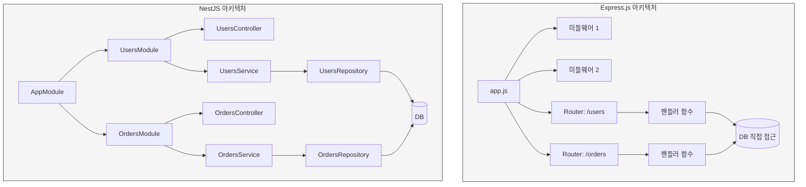

Express.js는 라우터 핸들러에서 바로 DB에 접근하는 경우가 많다. 규모가 작을 땐 빠르지만, 비즈니스 로직이 복잡해지면 핸들러 함수가 비대해진다.

NestJS는 Module → Controller → Service → Repository 계층이 강제된다. 처음엔 파일이 많다고 느끼지만, 팀에 새로 합류한 사람이 코드 위치를 예측할 수 있다는 점에서 유지보수에 유리하다.

### 프로젝트 디렉토리 구조 비교

실제로 두 프레임워크로 같은 기능(users, orders CRUD)을 만들었을 때 디렉토리가 어떻게 달라지는지 보면 차이가 확실하다.

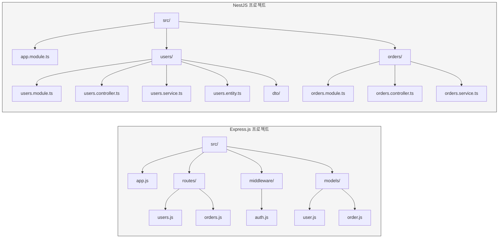

Express.js는 역할별(routes, middleware, models)로 폴더를 나눈다. 파일 수가 적어서 초반에는 깔끔하지만, 기능이 20개 넘어가면 `routes/` 안에 파일이 쌓이고 관련 코드가 여러 폴더에 흩어진다.

NestJS는 기능별(users, orders)로 폴더를 나눈다. users 관련 코드는 전부 `users/` 안에 있다. 파일 수는 많지만 "orders 관련 코드 어디 있어?"라는 질문에 바로 답할 수 있다.

### 의존성 주입(DI) 비교

Express.js에서는 의존성을 직접 import하고 인스턴스를 만들어야 한다. NestJS는 DI 컨테이너가 이 작업을 대신한다.

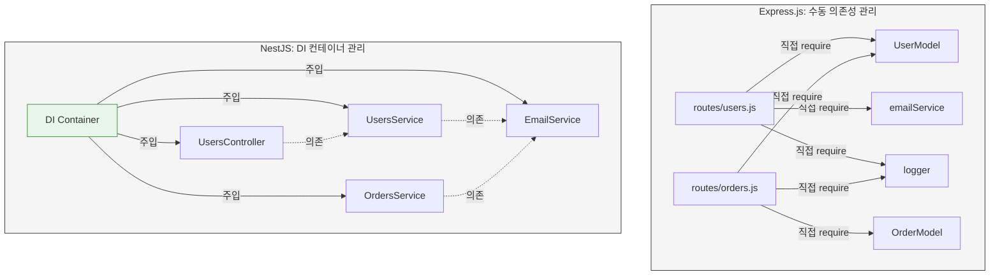

Express.js 방식은 간단하지만, 테스트할 때 문제가 생긴다. `routes/users.js`를 테스트하려면 `require`한 모듈을 전부 mock해야 하고, `proxyquire`나 `jest.mock` 같은 도구가 필요하다. NestJS는 DI 컨테이너가 있어서 테스트 시 가짜 구현체를 바로 끼워넣을 수 있다.

---

## 요청 처리 흐름 비교

HTTP 요청이 들어왔을 때 각 프레임워크가 어떤 순서로 처리하는지 비교한다. 실제로 디버깅할 때 "내 코드가 어느 시점에 실행되는가"를 파악하는 데 이 흐름을 알아두면 시간을 줄일 수 있다.

### Express.js 요청 흐름

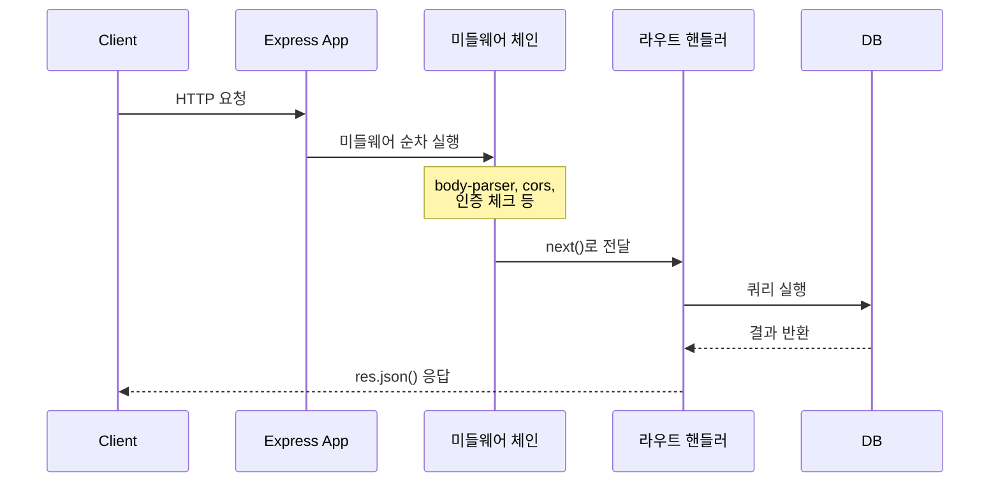

Express.js는 `app.use()`로 등록한 순서대로 미들웨어가 실행된다. `next()`를 호출하지 않으면 요청이 거기서 멈추는데, 이걸 빠뜨려서 요청이 hanging되는 실수가 흔하다.

### NestJS 요청 흐름

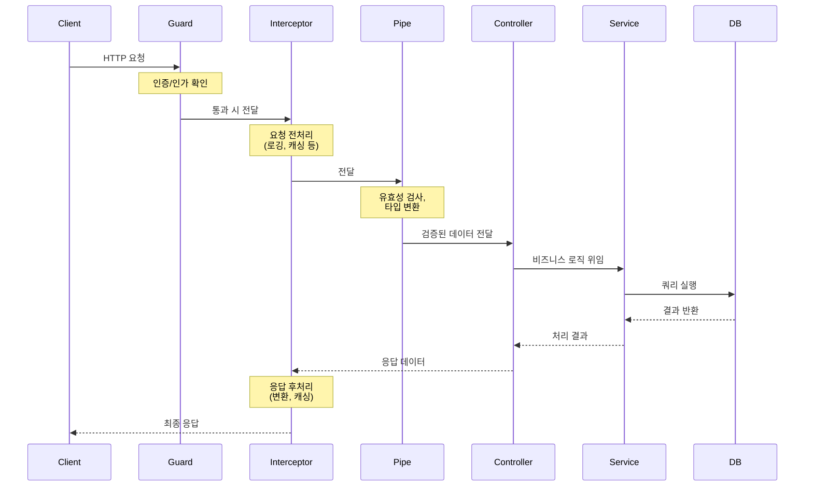

NestJS는 Guard → Interceptor → Pipe → Controller → Service 순서로 요청을 처리한다. 각 단계가 역할이 명확하게 분리되어 있어서, 인증 로직은 Guard에, 유효성 검사는 Pipe에 넣으면 된다. Express.js에서는 이런 구분 없이 미들웨어에 다 넣거나 핸들러 안에서 직접 처리하게 된다.

실무에서 차이가 드러나는 부분은 에러 처리다. Express.js는 에러 미들웨어를 마지막에 등록해야 하고, 비동기 에러는 `next(err)`로 직접 넘겨야 한다. NestJS는 Exception Filter가 알아서 잡아주기 때문에 비동기 에러 누락이 거의 없다.

### 에러 처리 흐름 비교

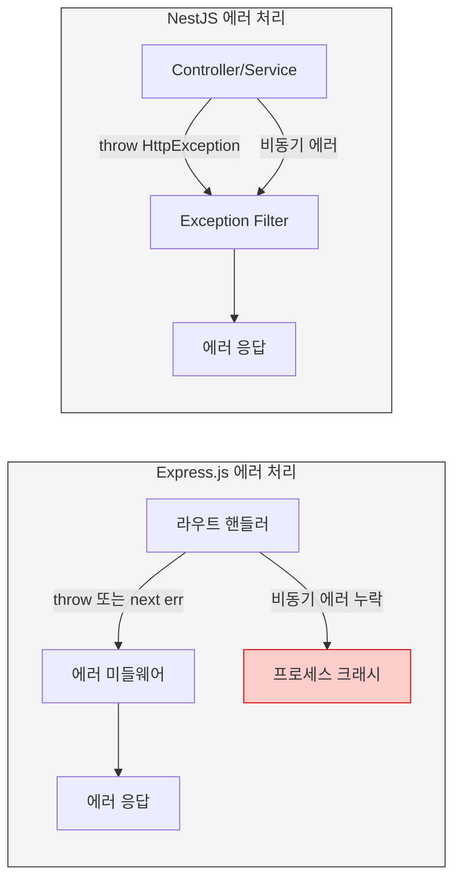

Express.js에서 `async` 핸들러의 에러를 `try-catch` 없이 던지면 에러 미들웨어까지 도달하지 못하고 프로세스가 죽는 경우가 있다. Express 5부터는 이 문제가 개선되었지만, Express 4를 쓰고 있다면 `express-async-errors` 같은 패키지가 필요하다.

### 미들웨어 파이프라인 상세 비교

같은 기능(인증, 로깅, 유효성 검사)을 구현할 때 각 프레임워크에서 어느 레이어에 넣게 되는지 비교한다.

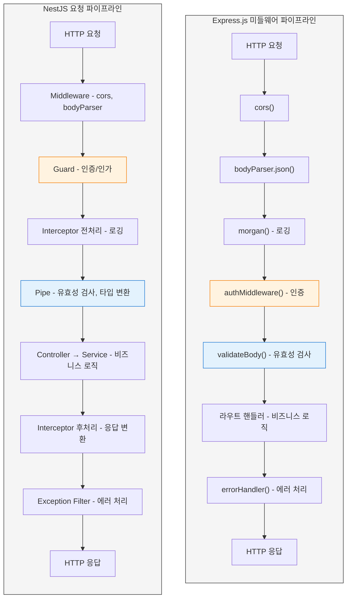

Express.js는 전부 "미들웨어"라는 하나의 개념으로 처리한다. 인증이든 로깅이든 유효성 검사든 `(req, res, next)` 시그니처를 가진 함수일 뿐이다. 단순하지만, 미들웨어가 20개 넘어가면 어떤 미들웨어가 어떤 역할인지 파악하기 어렵다.

NestJS는 역할별로 구분된 레이어가 있다. Guard는 인증/인가, Pipe는 유효성 검사, Interceptor는 요청/응답 변환을 담당한다. 처음 배울 때는 "Guard와 Middleware 차이가 뭐지?"라는 혼란이 생기지만, 프로젝트 규모가 커지면 각 레이어의 역할이 분명해서 코드를 찾기 쉽다.

---

## 주요 기능 비교

### 주요 기능 비교 개요

두 프레임워크가 같은 기능을 어떤 방식으로 제공하는지 한눈에 보면 차이가 분명하다.

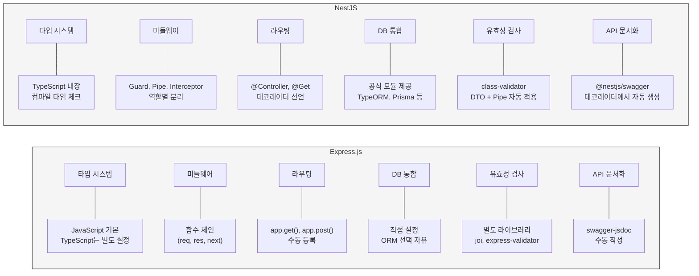

Express.js는 각 기능마다 라이브러리를 골라서 직접 조합해야 한다. 자유도가 높지만, 프로젝트마다 조합이 달라서 팀 간 이동 시 적응 비용이 생긴다. NestJS는 공식 모듈이 있어서 대부분의 프로젝트가 비슷한 구조를 가진다.

### 1. 타입 시스템

#### Express.js
- JavaScript 기반
- 타입 안정성을 위해 JSDoc이나 TypeScript를 별도로 설정해야 함
- 런타임 에러 발생 가능성 높음

#### NestJS
- TypeScript 기반
- 컴파일 타임에 타입 체크
- 더 안정적인 코드 작성 가능, IDE 지원 우수

### 2. 미들웨어 처리

#### Express.js
```javascript
app.use((req, res, next) => {
  // 미들웨어 로직
  next();
});
```

#### NestJS
```typescript
@Injectable()
export class LoggerMiddleware implements NestMiddleware {
  use(req: Request, res: Response, next: Function) {
    // 미들웨어 로직
    next();
  }
}
```

### 3. 라우팅

#### Express.js
```javascript
app.get('/users', (req, res) => {
  // 라우트 핸들러
});
```

#### NestJS
```typescript
@Controller('users')
export class UsersController {
  @Get()
  findAll(): User[] {
    // 컨트롤러 메서드
  }
}
```
- 데코레이터 기반 라우팅, 자동 OpenAPI 문서화 지원

### 4. 데이터베이스 통합

#### Express.js
- 직접 데이터베이스 드라이버 사용
- Mongoose, Sequelize 등 ORM/ODM을 별도로 설정
- 유연한 데이터베이스 통합

#### NestJS
- TypeORM, Mongoose 등과의 통합 공식 지원
- Repository 패턴 구현 용이
- 데이터베이스 마이그레이션 도구 내장

---

## 성능 및 확장성

### 앱 부트스트랩과 확장 방식 비교

프로젝트가 커질 때 각 프레임워크가 어떻게 확장되는지 비교한다. Express.js는 수평으로 미들웨어와 라우터가 늘어나고, NestJS는 모듈 트리가 깊어진다.

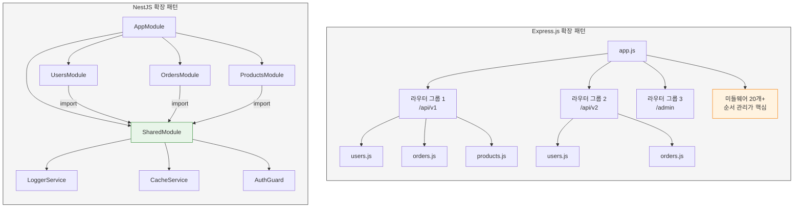

Express.js는 라우터 파일이 늘어날수록 `app.js`가 비대해진다. 미들웨어 등록 순서를 실수하면 인증이 안 된 요청이 통과하거나 CORS가 안 먹는 문제가 생긴다. NestJS는 SharedModule로 공통 기능을 묶고, 필요한 모듈에서 import하는 방식이라 중복 코드가 줄어든다.

### 테스트 구조 비교

확장성에서 빠질 수 없는 부분이 테스트다. 프로젝트가 커질수록 테스트 작성과 유지보수 비용이 달라진다.

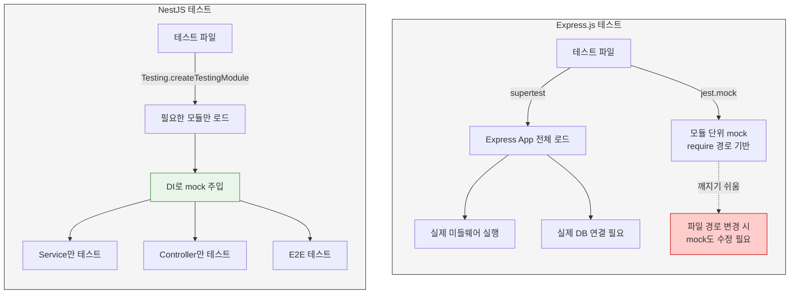

Express.js에서 단위 테스트를 작성하려면 `jest.mock()`으로 의존 모듈을 하나하나 교체해야 한다. 파일 경로가 바뀌면 mock 설정도 같이 깨진다. NestJS는 `Test.createTestingModule()`로 테스트용 모듈을 만들고, DI 컨테이너를 통해 가짜 구현체를 주입한다. Service 하나만 테스트하고 싶으면 그 Service와 의존성만 등록하면 된다.

### Express.js
- **장점**: 가벼운 오버헤드, 빠른 시작 시간, 낮은 메모리 사용량
- **단점**: 대규모 애플리케이션에서 구조화 어려움

### NestJS
- **장점**: 구조화된 확장성, 모듈 재사용 용이, 테스트 용이성
- **단점**: 상대적으로 높은 초기 오버헤드, 더 많은 보일러플레이트 코드

---

## 학습 곡선

### Express.js
- **장점**: 낮은 진입 장벽, 직관적인 API, 풍부한 학습 자료
- **단점**: 대규모 프로젝트에서 일관된 패턴 유지 어려움

### NestJS
- **장점**: 명확한 아키텍처 가이드라인, Angular 개발자에게 친숙
- **단점**: TypeScript·데코레이터 학습 필요, 초기 설정 복잡

---

## 사용 사례

### 프로젝트 규모별 선택 흐름

어떤 프레임워크를 고를지 고민될 때 참고할 수 있는 판단 흐름이다.

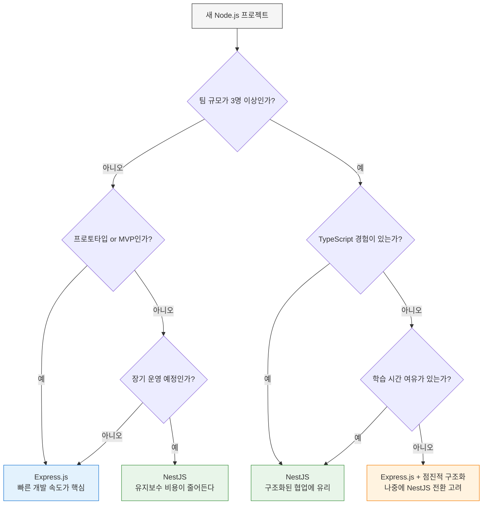

### Express.js 적합한 경우
1. 소규모 프로젝트, 빠른 프로토타이핑
2. 마이크로서비스 (단일 책임 서비스)
3. REST API, 실시간 애플리케이션
4. Node.js 초보자

### NestJS 적합한 경우
1. 대규모 엔터프라이즈 애플리케이션
2. TypeScript 기반 프로젝트
3. 복잡한 비즈니스 로직, 마이크로서비스 아키텍처
4. Angular와 통합된 풀스택 애플리케이션

---

## 생태계 및 커뮤니티

### Express.js
- **장점**: 큰 커뮤니티, 수많은 미들웨어, 오랜 기간 검증
- **단점**: 일부 패키지 유지보수 부족, 품질 불균형

### NestJS
- **장점**: 활발한 개발, 공식 모듈 지원, 체계적인 문서
- **단점**: 상대적으로 작은 커뮤니티, 제한된 서드파티 패키지

---

## 프레임워크 전환 시 대응 관계

Express.js에서 NestJS로 전환하거나, 반대로 NestJS 개념을 Express.js에서 구현할 때 각 개념이 어떻게 매핑되는지 정리한다.

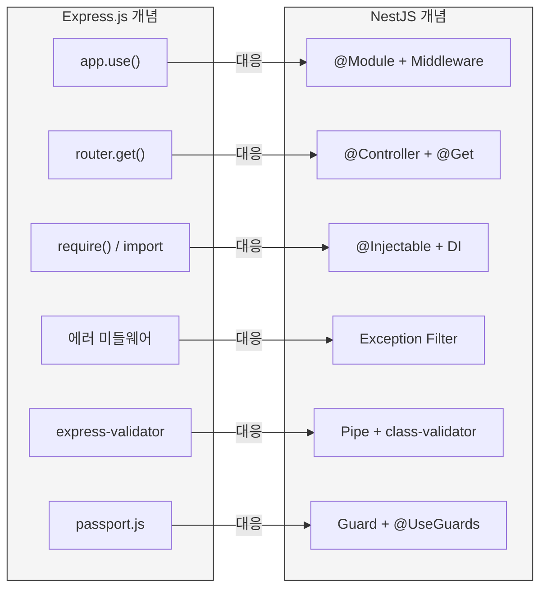

Express.js 경험이 있다면 NestJS로 넘어갈 때 이 매핑을 머릿속에 두면 학습 속도가 빨라진다. `app.use()`로 하던 것의 대부분이 NestJS에서는 Module, Guard, Interceptor, Pipe 중 하나로 분류된다. 기존 Express.js 미들웨어를 NestJS에서 그대로 쓸 수도 있지만, NestJS 방식으로 재구현하는 편이 테스트와 유지보수에 유리하다.

---

## 결론

| 상황 | 권장 |
|------|------|
| 소규모 프로젝트 / 빠른 개발 | Express.js |
| 대규모 엔터프라이즈 | NestJS |
| TypeScript 기반 팀 | NestJS |
| Node.js 입문 | Express.js |
| 마이크로서비스 | 팀 경험에 따라 선택 |

각 프레임워크는 고유한 장단점이 있다. Express.js는 유연성과 간단함을, NestJS는 구조화와 확장성을 제공한다. 프로젝트 규모와 팀 역량에 맞게 선택하는 것이 중요하다.
