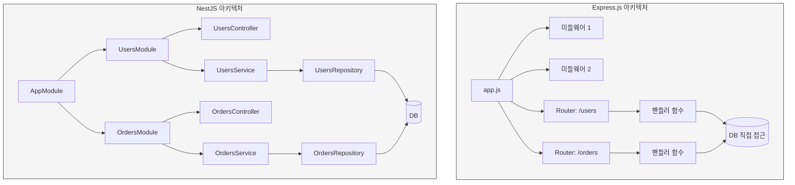
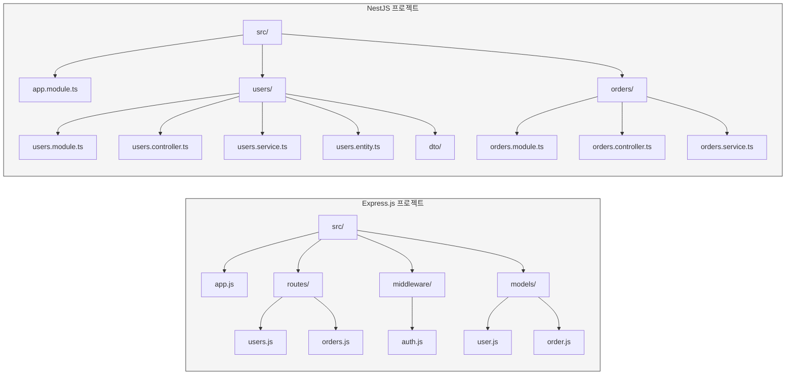
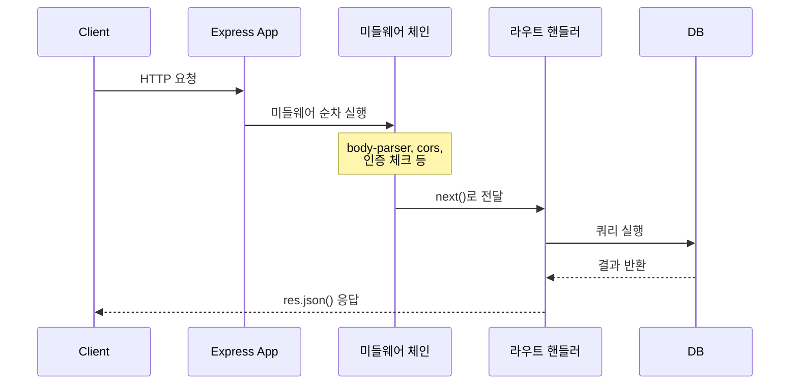
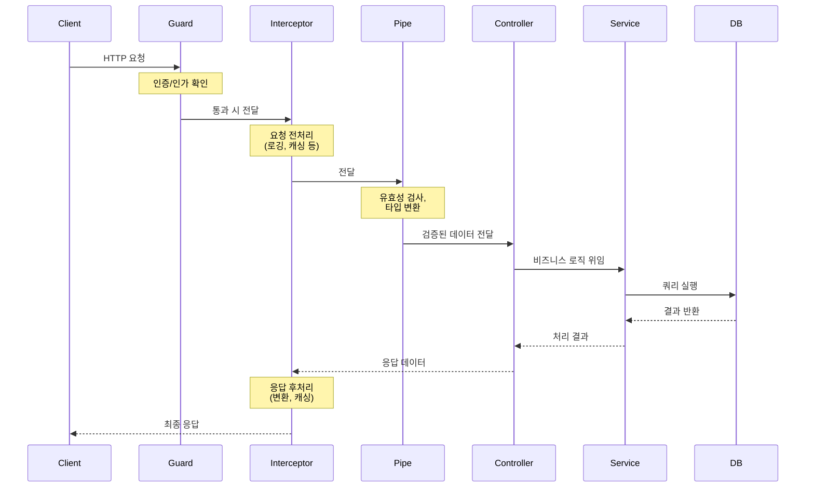
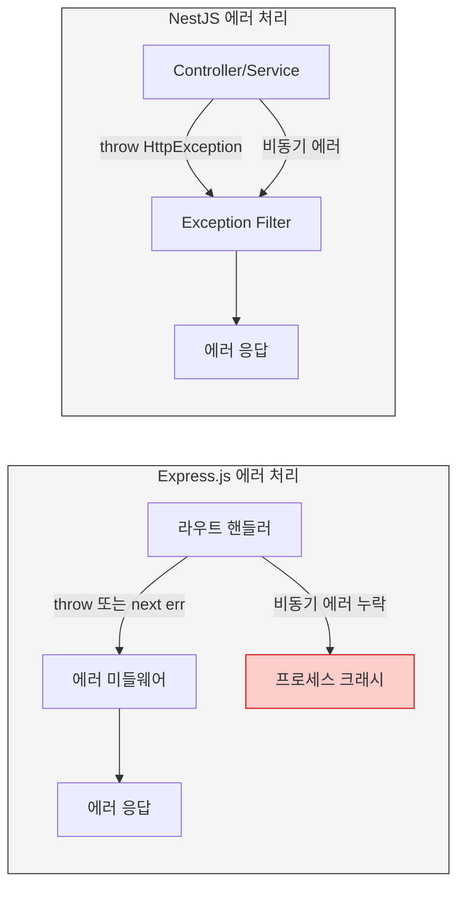
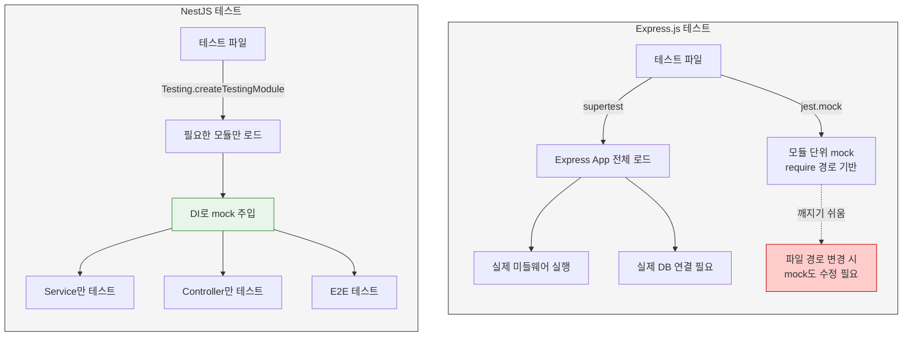
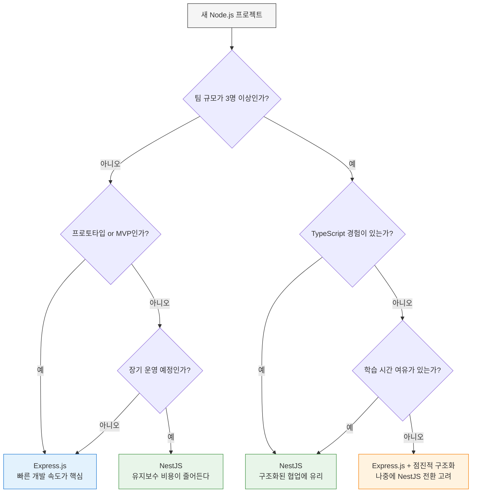

# NestJS vs Express.js: 심층 비교 분석

## 들어가며

### Express.js
2010년에 나온 Node.js 웹 프레임워크다. `(req, res, next)` 미들웨어 체인이 거의 전부라고 보면 된다. 핵심 기능만 제공하고 나머지는 개발자가 직접 조합한다.

### NestJS
2017년에 나왔다. Angular의 DI 컨테이너·데코레이터·모듈 시스템을 Node 서버에 옮겨왔다. 내부적으로는 기본값으로 Express를 HTTP 어댑터로 쓴다(Fastify로 바꿀 수도 있다). 즉, NestJS를 쓴다고 Express를 안 쓰는 게 아니라, Express 위에 구조와 컨벤션을 얹는 셈이다.

이 문서는 두 프레임워크가 같은 기능을 어떻게 다르게 표현하는지, 어느 시점에 차이가 비용으로 돌아오는지를 비교한다. 강점·약점을 나열하기보다 실제로 코드가 어떻게 달라지는지에 집중한다.

---

## 아키텍처 비교

### Express.js 아키텍처
- 미들웨어 기반: 요청-응답 사이클을 처리하는 미들웨어 함수 체인
- 평면 구조: 폴더 구조는 컨벤션이 없고 팀이 정한다
- 라우팅: `app.get()`, `router.post()` 같은 함수 호출로 등록
- 미니멀: 인증, ORM, 검증, 문서화 전부 별도 라이브러리

### NestJS 아키텍처
- 모듈 기반: 기능별로 `@Module()`이 트리를 이룬다
- 의존성 주입: DI 컨테이너가 인스턴스 생성과 주입을 관리
- 데코레이터: `@Controller`, `@Get`, `@Injectable` 같은 데코레이터로 메타데이터 선언
- 계층 구조: Controller, Service, Repository 계층이 컨벤션으로 강제된다

### 아키텍처 구조 다이어그램

Express.js는 app 객체 하나에 미들웨어와 라우터를 직접 등록하는 평면 구조다. 프로젝트가 커지면 파일을 어떻게 나눌지 전적으로 개발자 몫이 된다.



Express.js는 라우터 핸들러에서 바로 DB에 접근하는 경우가 많다. 규모가 작을 땐 빠르지만, 비즈니스 로직이 복잡해지면 핸들러 함수가 비대해진다.

NestJS는 Module → Controller → Service → Repository 계층이 강제된다. 처음엔 파일이 많다고 느끼지만, 팀에 새로 합류한 사람이 코드 위치를 예측하기 쉽다.

### 프로젝트 디렉토리 구조 비교

같은 기능(users, orders CRUD)을 두 프레임워크로 만들면 디렉토리가 다르게 잡힌다.



Express.js는 역할별(routes, middleware, models)로 폴더를 나누는 게 흔한 패턴이다. 파일 수가 적어서 초반에는 깔끔하지만, 기능이 20개 넘어가면 `routes/` 안에 파일이 쌓이고 관련 코드가 여러 폴더에 흩어진다.

NestJS는 기능별(users, orders)로 폴더를 나눈다. users 관련 코드는 전부 `users/` 안에 있다. 파일 수는 많지만 "orders 관련 코드 어디 있어?"라는 질문에 바로 답이 나온다.

---

## DI 컨테이너 비교

문서에서 NestJS와 Express의 가장 큰 차이 하나만 꼽으라면 DI 컨테이너다. 데코레이터·모듈·테스트 용이성이 전부 여기서 파생된다.

### Express.js: 직접 인스턴스화

Express에는 DI 컨테이너가 없다. 의존성이 필요하면 `require` 또는 `import`로 가져와서 새로 만들거나 싱글톤을 공유한다.

```javascript
// src/services/email.service.js
class EmailService {
  constructor(apiKey) {
    this.apiKey = apiKey;
  }

  async send(to, subject, body) {
    // 실제 메일 발송
  }
}

module.exports = new EmailService(process.env.SENDGRID_KEY);
```

```javascript
// src/services/users.service.js
const emailService = require('./email.service');
const userRepository = require('../repositories/user.repository');

async function signup(dto) {
  const user = await userRepository.create(dto);
  await emailService.send(user.email, '환영합니다', '...');
  return user;
}

module.exports = { signup };
```

```javascript
// src/routes/users.js
const express = require('express');
const usersService = require('../services/users.service');

const router = express.Router();

router.post('/signup', async (req, res, next) => {
  try {
    const user = await usersService.signup(req.body);
    res.status(201).json(user);
  } catch (err) {
    next(err);
  }
});

module.exports = router;
```

이 구조의 문제는 두 가지다. 첫째, `users.service.js`를 테스트할 때 `email.service`와 `user.repository`를 같이 끌어들이게 된다. `jest.mock('./email.service')`로 우회할 수 있지만, 경로가 바뀌면 mock 설정도 같이 깨진다. 둘째, 환경별로 다른 구현체를 주입하기가 번거롭다. 개발 환경에서는 메일을 콘솔에 찍고 운영에서는 실제로 보내려면 분기문이 코드에 박힌다.

이걸 해결하려고 `awilix`, `inversify`, `tsyringe` 같은 DI 라이브러리를 쓰기도 한다. 다음은 `awilix`로 보완한 모습이다.

```javascript
// src/container.js
const awilix = require('awilix');
const EmailService = require('./services/email.service');
const UsersService = require('./services/users.service');
const UserRepository = require('./repositories/user.repository');

const container = awilix.createContainer({
  injectionMode: awilix.InjectionMode.PROXY,
});

container.register({
  emailService: awilix.asClass(EmailService).singleton(),
  userRepository: awilix.asClass(UserRepository).singleton(),
  usersService: awilix.asClass(UsersService).singleton(),
});

module.exports = container;
```

```javascript
// src/services/users.service.js
class UsersService {
  constructor({ emailService, userRepository }) {
    this.emailService = emailService;
    this.userRepository = userRepository;
  }

  async signup(dto) {
    const user = await this.userRepository.create(dto);
    await this.emailService.send(user.email, '환영합니다', '...');
    return user;
  }
}

module.exports = UsersService;
```

문제는 이 컨테이너 설정 자체가 또 다른 보일러플레이트가 된다는 점이다. 외부 라이브러리에 의존하는 데다, 컨테이너에 등록하는 걸 깜빡하면 런타임에서야 에러가 난다.

### NestJS: DI 컨테이너가 표준

같은 기능을 NestJS로 옮기면 컨테이너 설정이 사라진다. `@Injectable()`이 붙은 클래스는 자동으로 등록 대상이고, 생성자 파라미터의 타입을 보고 의존성을 주입한다.

```typescript
// users/email.service.ts
import { Injectable } from '@nestjs/common';
import { ConfigService } from '@nestjs/config';

@Injectable()
export class EmailService {
  constructor(private readonly config: ConfigService) {}

  async send(to: string, subject: string, body: string) {
    const apiKey = this.config.get<string>('SENDGRID_KEY');
    // 실제 메일 발송
  }
}
```

```typescript
// users/users.service.ts
import { Injectable } from '@nestjs/common';
import { EmailService } from './email.service';
import { UserRepository } from './user.repository';
import { SignupDto } from './dto/signup.dto';

@Injectable()
export class UsersService {
  constructor(
    private readonly emailService: EmailService,
    private readonly userRepository: UserRepository,
  ) {}

  async signup(dto: SignupDto) {
    const user = await this.userRepository.create(dto);
    await this.emailService.send(user.email, '환영합니다', '...');
    return user;
  }
}
```

```typescript
// users/users.module.ts
import { Module } from '@nestjs/common';
import { UsersController } from './users.controller';
import { UsersService } from './users.service';
import { EmailService } from './email.service';
import { UserRepository } from './user.repository';

@Module({
  controllers: [UsersController],
  providers: [UsersService, EmailService, UserRepository],
})
export class UsersModule {}
```

`providers` 배열에 등록만 하면 컨테이너가 의존성 그래프를 분석해 인스턴스를 만들고 주입한다. 환경별로 다른 구현체를 주입하려면 토큰을 사용한다.

```typescript
// app.module.ts
@Module({
  providers: [
    {
      provide: EmailService,
      useClass: process.env.NODE_ENV === 'production'
        ? RealEmailService
        : ConsoleEmailService,
    },
  ],
})
export class AppModule {}
```

### Scope: 싱글톤이 기본, 요청별 인스턴스도 가능

Express에서 `module.exports = new Service()`로 export하면 싱글톤이다. 요청마다 다른 인스턴스가 필요하면(예: 요청 컨텍스트를 담는 객체) 핸들러에서 직접 만들어야 한다.

NestJS는 기본이 싱글톤이지만, `@Injectable({ scope: Scope.REQUEST })`를 붙이면 요청마다 새 인스턴스를 만든다. 트랜잭션 컨텍스트, 사용자별 캐시 같은 곳에서 쓴다.

```typescript
@Injectable({ scope: Scope.REQUEST })
export class RequestContext {
  constructor(@Inject(REQUEST) private readonly req: Request) {}

  get userId(): string {
    return this.req.headers['x-user-id'] as string;
  }
}
```

요청 스코프 의존성은 부모로 전파된다. `UsersService`가 `RequestContext`를 주입받으면 `UsersService`도 요청 스코프가 된다. 성능에 영향이 있어서 진짜 필요한 곳에만 써야 한다.

### 순환 의존성

Express에서 두 모듈이 서로를 `require`하면 한쪽이 `undefined`로 import되는 경우가 생긴다. 디버깅이 어렵다.

NestJS는 순환 의존성을 `forwardRef`로 명시적으로 처리한다.

```typescript
@Injectable()
export class UsersService {
  constructor(
    @Inject(forwardRef(() => OrdersService))
    private readonly ordersService: OrdersService,
  ) {}
}
```

명시적이라 발견은 빠르지만, 자주 등장하면 설계가 잘못된 신호다. 공통 로직을 별도 Service로 빼는 게 정답이다.

---

## 모듈 시스템 비교

### Express.js: Router로 그룹화

Express에는 모듈이라는 개념 자체가 없다. `express.Router()`로 라우트를 그룹화하고, `app.use('/users', usersRouter)`로 마운트한다.

```javascript
// src/users/index.js
const express = require('express');
const router = express.Router();

router.get('/', listUsers);
router.post('/', createUser);
router.get('/:id', getUser);

module.exports = router;
```

```javascript
// src/app.js
const express = require('express');
const usersRouter = require('./users');
const ordersRouter = require('./orders');

const app = express();
app.use('/users', usersRouter);
app.use('/orders', ordersRouter);
```

라우터 단위로 미들웨어를 분리할 수는 있지만, "이 라우터가 어떤 서비스에 의존하는가"를 코드 수준에서 선언할 방법이 없다. 의존성은 각 핸들러 안에서 `require`로 가져온다.

### NestJS: @Module()이 의존성 경계

NestJS의 `@Module()`은 단순한 폴더 묶음이 아니라 DI 컨테이너의 경계다. 모듈이 무엇을 제공하고(`providers`), 무엇을 외부에 노출하고(`exports`), 어떤 모듈을 사용하는지(`imports`)를 선언한다.

```typescript
// users/users.module.ts
@Module({
  imports: [TypeOrmModule.forFeature([User])],
  controllers: [UsersController],
  providers: [UsersService, UserRepository],
  exports: [UsersService],
})
export class UsersModule {}
```

```typescript
// orders/orders.module.ts
@Module({
  imports: [UsersModule],
  controllers: [OrdersController],
  providers: [OrdersService],
})
export class OrdersModule {}
```

`OrdersModule`은 `UsersModule`을 import했고, `UsersModule`은 `UsersService`를 export했다. 따라서 `OrdersService`는 생성자에 `UsersService`를 주입받는다. `UserRepository`는 export되지 않았으니 `OrdersService`에서 주입받지 못한다. 의존성이 모듈 경계를 넘는 부분이 코드에 명시된다.

### DynamicModule: 설정 기반 모듈 구성

같은 모듈을 다른 설정으로 여러 번 쓰고 싶을 때 `forRoot()`, `forFeature()` 같은 정적 메서드를 쓴다. NestJS 진입 직후 가장 헷갈리는 부분이다.

```typescript
// config/config.module.ts
@Module({})
export class ConfigModule {
  static forRoot(options: ConfigOptions): DynamicModule {
    return {
      module: ConfigModule,
      providers: [
        {
          provide: 'CONFIG_OPTIONS',
          useValue: options,
        },
        ConfigService,
      ],
      exports: [ConfigService],
      global: options.isGlobal ?? false,
    };
  }
}
```

```typescript
// app.module.ts
@Module({
  imports: [
    ConfigModule.forRoot({ isGlobal: true, path: '.env' }),
    TypeOrmModule.forRoot({ /* ... */ }),
  ],
})
export class AppModule {}
```

`global: true`로 하면 한 번만 import해도 모든 모듈에서 사용 가능하다. 전역으로 풀면 의존성 추적이 어려워지니 정말 어디서나 쓰는 것(Config, Logger)에만 적용한다.

### 같은 기능, 다른 표현

Express의 `app.use('/users', usersRouter)`와 NestJS의 `imports: [UsersModule]`은 비슷해 보이지만 작동 방식이 다르다. Express는 URL prefix를 붙여서 라우터를 마운트하는 것뿐이고, NestJS는 의존성 그래프에 모듈을 등록한다. URL 경로는 `@Controller('users')` 데코레이터로 따로 정한다. 라우팅과 모듈 구성을 분리한 셈이다.

---

## 데코레이터 기반 라우팅 비교

### Express.js: 함수 호출로 라우트 등록

```javascript
const express = require('express');
const router = express.Router();
const authMiddleware = require('../middleware/auth');
const { validateBody } = require('../middleware/validate');
const { createUserSchema } = require('../schemas/user');

router.get('/', authMiddleware, async (req, res, next) => {
  try {
    const { page = 1, limit = 10 } = req.query;
    const users = await usersService.list({ page, limit });
    res.json(users);
  } catch (err) {
    next(err);
  }
});

router.post(
  '/',
  authMiddleware,
  validateBody(createUserSchema),
  async (req, res, next) => {
    try {
      const user = await usersService.create(req.body);
      res.status(201).json(user);
    } catch (err) {
      next(err);
    }
  },
);

module.exports = router;
```

장점은 명시적이라는 점이다. 라우트 정의에서 어떤 미들웨어가 어떤 순서로 실행될지 한눈에 보인다. 단점은 `try-catch`와 `next(err)`가 반복되고, 쿼리 파라미터 변환(`page = '1'`을 숫자로)을 직접 해야 한다.

### NestJS: 데코레이터로 메타데이터 선언

```typescript
import {
  Controller, Get, Post, Body, Query, UseGuards,
} from '@nestjs/common';
import { AuthGuard } from './auth.guard';
import { CreateUserDto } from './dto/create-user.dto';
import { ListUsersDto } from './dto/list-users.dto';
import { UsersService } from './users.service';

@Controller('users')
@UseGuards(AuthGuard)
export class UsersController {
  constructor(private readonly usersService: UsersService) {}

  @Get()
  async list(@Query() query: ListUsersDto) {
    return this.usersService.list(query);
  }

  @Post()
  async create(@Body() dto: CreateUserDto) {
    return this.usersService.create(dto);
  }
}
```

`@Controller('users')`가 URL prefix를 잡고, `@Get()`, `@Post()`가 HTTP 메서드를 잡는다. `@Query()`, `@Body()`, `@Param()`이 요청에서 데이터를 추출한다. `try-catch`가 없는 이유는 NestJS가 메서드에서 던진 예외를 자동으로 Exception Filter로 보내기 때문이다.

쿼리 파라미터 변환은 `ListUsersDto`에서 처리한다.

```typescript
import { IsOptional, IsInt, Min } from 'class-validator';
import { Type } from 'class-transformer';

export class ListUsersDto {
  @IsOptional()
  @IsInt()
  @Min(1)
  @Type(() => Number)
  page?: number = 1;

  @IsOptional()
  @IsInt()
  @Min(1)
  @Type(() => Number)
  limit?: number = 10;
}
```

`main.ts`에서 `app.useGlobalPipes(new ValidationPipe({ transform: true }))`를 켜면 쿼리스트링이 자동으로 숫자로 변환되고, 검증 실패 시 400 응답이 나간다.

### 메타데이터 기반의 활용

데코레이터 라우팅의 진짜 이점은 메타데이터를 다른 곳에서 활용한다는 점이다. `@nestjs/swagger`는 컨트롤러를 스캔해서 OpenAPI 스펙을 자동 생성한다. Express에서 `swagger-jsdoc`으로 JSDoc 주석에 스펙을 직접 적는 것과 비교하면 동기화가 깨질 일이 없다.

```typescript
@Post()
@ApiOperation({ summary: '사용자 생성' })
@ApiResponse({ status: 201, type: UserResponseDto })
async create(@Body() dto: CreateUserDto) {
  return this.usersService.create(dto);
}
```

DTO 클래스의 `class-validator` 데코레이터를 보고 요청 스키마도 자동으로 만든다. Express에서 같은 걸 하려면 검증 스키마와 Swagger 스키마를 따로 유지해야 한다.

### 가드·인터셉터·파이프

Express에서는 모든 게 미들웨어다. 인증, 로깅, 검증을 전부 `(req, res, next)` 함수로 작성한다. NestJS는 역할별로 데코레이터가 다르다.

```typescript
@Controller('orders')
@UseGuards(JwtAuthGuard)
@UseInterceptors(LoggingInterceptor)
export class OrdersController {
  @Post()
  @UseGuards(RoleGuard('admin'))
  @UsePipes(new ValidationPipe({ transform: true }))
  async create(@Body() dto: CreateOrderDto, @CurrentUser() user: User) {
    return this.ordersService.create(user, dto);
  }
}
```

- `@UseGuards(JwtAuthGuard)`: 인증/인가, 통과 못 하면 핸들러 진입 안 함
- `@UseInterceptors(LoggingInterceptor)`: 요청 전후 처리(로깅, 캐싱, 응답 변환)
- `@UsePipes(ValidationPipe)`: 입력 검증·변환
- `@CurrentUser()`: 커스텀 파라미터 데코레이터, 가드가 검증한 사용자 객체를 주입

Express에서 똑같이 하려면 미들웨어 함수가 4~5개 쌓이고, 각자 어떤 역할인지 이름으로만 구분된다. NestJS는 컨벤션 자체가 역할을 나눠놓아서 코드를 읽을 때 헷갈릴 일이 적다.

---

## 요청 처리 흐름 비교

### Express.js 요청 흐름



Express.js는 `app.use()`로 등록한 순서대로 미들웨어가 실행된다. `next()`를 호출하지 않으면 요청이 거기서 멈춘다. `next()` 누락으로 요청이 hanging되는 실수가 흔하다.

### NestJS 요청 흐름



NestJS는 Guard → Interceptor → Pipe → Controller → Service 순서로 요청을 처리한다. 각 단계의 역할이 명확히 분리되어 있어, 인증 로직은 Guard에, 검증은 Pipe에 넣는다. Express.js에서는 이런 구분 없이 미들웨어에 다 넣거나 핸들러 안에서 직접 처리한다.

실무에서 차이가 드러나는 부분은 에러 처리다. Express.js는 에러 미들웨어를 마지막에 등록해야 하고, 비동기 에러는 `next(err)`로 직접 넘겨야 한다. NestJS는 Exception Filter가 알아서 잡아주므로 비동기 에러 누락이 거의 없다.

### 에러 처리 흐름 비교



Express.js에서 `async` 핸들러의 에러를 `try-catch` 없이 던지면 에러 미들웨어까지 도달하지 못하고 프로세스가 죽는 경우가 있다. Express 5부터는 개선되었지만, Express 4를 쓰고 있다면 `express-async-errors` 같은 패키지가 필요하다.

---

## 테스트 용이성 비교

DI 컨테이너의 효과가 가장 크게 드러나는 영역이다. 같은 비즈니스 로직(사용자 가입 시 메일 발송)을 단위 테스트한다고 가정하고 비교한다.

### Express.js 단위 테스트

```javascript
// __tests__/users.service.test.js
jest.mock('../src/services/email.service');
jest.mock('../src/repositories/user.repository');

const emailService = require('../src/services/email.service');
const userRepository = require('../src/repositories/user.repository');
const { signup } = require('../src/services/users.service');

describe('UsersService.signup', () => {
  beforeEach(() => {
    jest.clearAllMocks();
  });

  it('가입 후 환영 메일을 보낸다', async () => {
    userRepository.create.mockResolvedValue({
      id: 1,
      email: 'a@b.com',
    });

    await signup({ email: 'a@b.com', password: 'pw' });

    expect(emailService.send).toHaveBeenCalledWith(
      'a@b.com',
      '환영합니다',
      expect.any(String),
    );
  });
});
```

겉보기엔 간단하지만 함정이 있다.

첫째, `jest.mock`은 모듈 경로 문자열에 의존한다. `email.service.js`를 `email/index.js`로 옮기면 mock 경로도 같이 바꿔야 한다. 둘째, `email.service`가 `module.exports = new EmailService()`로 싱글톤을 export한다면 mock은 인스턴스를 통째로 교체한다. 클래스 자체를 테스트하고 싶을 땐 export 패턴을 바꿔야 한다. 셋째, 의존성이 늘어날수록 `jest.mock` 호출이 파일 상단에 줄줄이 쌓인다.

### NestJS 단위 테스트

```typescript
// users.service.spec.ts
import { Test, TestingModule } from '@nestjs/testing';
import { UsersService } from './users.service';
import { EmailService } from './email.service';
import { UserRepository } from './user.repository';

describe('UsersService.signup', () => {
  let service: UsersService;
  let emailService: jest.Mocked<EmailService>;
  let userRepository: jest.Mocked<UserRepository>;

  beforeEach(async () => {
    const module: TestingModule = await Test.createTestingModule({
      providers: [
        UsersService,
        {
          provide: EmailService,
          useValue: { send: jest.fn() },
        },
        {
          provide: UserRepository,
          useValue: { create: jest.fn() },
        },
      ],
    }).compile();

    service = module.get(UsersService);
    emailService = module.get(EmailService);
    userRepository = module.get(UserRepository);
  });

  it('가입 후 환영 메일을 보낸다', async () => {
    userRepository.create.mockResolvedValue({
      id: 1,
      email: 'a@b.com',
    } as any);

    await service.signup({ email: 'a@b.com', password: 'pw' });

    expect(emailService.send).toHaveBeenCalledWith(
      'a@b.com',
      '환영합니다',
      expect.any(String),
    );
  });
});
```

코드량은 더 많지만 차이는 명확하다. 파일 경로 의존성이 없다. `EmailService`를 다른 폴더로 옮겨도 import 경로만 바뀌면 끝이다. mock 객체를 명시적으로 만들기 때문에 무엇을 가짜로 만들었는지 한눈에 보인다. 같은 패턴이 모든 테스트에서 반복되므로 팀원이 작성한 테스트를 읽기도 쉽다.

### 통합 테스트(E2E)

NestJS는 `Test.createTestingModule()`에 실제 모듈을 통째로 import해서 HTTP 레이어까지 테스트할 수 있다.

```typescript
// users.e2e-spec.ts
import { Test } from '@nestjs/testing';
import { INestApplication } from '@nestjs/common';
import * as request from 'supertest';
import { AppModule } from '../src/app.module';
import { EmailService } from '../src/users/email.service';

describe('Users (e2e)', () => {
  let app: INestApplication;
  let emailService: { send: jest.Mock };

  beforeAll(async () => {
    emailService = { send: jest.fn() };

    const moduleRef = await Test.createTestingModule({
      imports: [AppModule],
    })
      .overrideProvider(EmailService)
      .useValue(emailService)
      .compile();

    app = moduleRef.createNestApplication();
    await app.init();
  });

  it('POST /users → 201', async () => {
    const res = await request(app.getHttpServer())
      .post('/users')
      .send({ email: 'a@b.com', password: 'password123' })
      .expect(201);

    expect(res.body.email).toBe('a@b.com');
    expect(emailService.send).toHaveBeenCalled();
  });

  afterAll(async () => {
    await app.close();
  });
});
```

`overrideProvider`로 특정 의존성만 가짜로 바꾸고 나머지는 실제 구현을 사용한다. Express에서 비슷한 걸 하려면 `supertest`로 앱 전체를 띄운 다음, mock 라이브러리로 특정 모듈만 가로채야 한다. 깨끗하게 분리하기가 어렵다.

### mock 주입 비교 요약



Express에서도 awilix 같은 DI 컨테이너를 쓰면 NestJS와 비슷한 테스트 패턴을 만들 수 있다. 다만 컨테이너 설정, 테스트 헬퍼, 컨벤션을 전부 팀에서 직접 정해야 한다. NestJS는 이걸 프레임워크 기본값으로 제공한다.

---

## 마이그레이션 경험

Express 프로젝트가 일정 규모를 넘어 NestJS로 옮기는 결정을 했다고 가정하고, 실제로 발생하는 작업을 정리한다.

### 점진적 이주 전략

빅뱅 방식으로 전부 갈아엎는 건 거의 실패한다. NestJS가 내부적으로 Express를 어댑터로 쓴다는 점을 이용해 점진적으로 옮긴다.

```typescript
// src/main.ts
import { NestFactory } from '@nestjs/core';
import { ExpressAdapter } from '@nestjs/platform-express';
import * as express from 'express';
import { AppModule } from './app.module';
import { legacyRouter } from './legacy';

async function bootstrap() {
  const server = express();
  server.use('/legacy', legacyRouter);

  const app = await NestFactory.create(AppModule, new ExpressAdapter(server));
  await app.listen(3000);
}
bootstrap();
```

같은 Express 인스턴스를 NestJS와 공유한다. 기존 라우트는 `/legacy` 아래에서 그대로 돌고, 새로 작성하는 컨트롤러는 NestJS로 만든다. 한 모듈씩 NestJS로 옮기면서 `/legacy`에서 빼는 식으로 진행한다.

### 기존 미들웨어 그대로 사용

직접 만든 Express 미들웨어는 `app.use()`로 그대로 등록한다.

```typescript
// src/main.ts
async function bootstrap() {
  const app = await NestFactory.create(AppModule);

  // 기존 Express 미들웨어
  app.use(legacyRequestLogger);
  app.use(legacyCorrelationId);

  await app.listen(3000);
}
```

조건부로 적용하고 싶으면 NestJS의 Middleware로 감싸서 모듈에 등록한다.

```typescript
@Module({})
export class HttpModule implements NestModule {
  configure(consumer: MiddlewareConsumer) {
    consumer
      .apply(legacyCorrelationId)
      .exclude({ path: 'health', method: RequestMethod.GET })
      .forRoutes('*');
  }
}
```

### 라우터를 컨트롤러로 옮기는 패턴

가장 흔한 마이그레이션 단위는 라우터 파일 하나를 컨트롤러로 옮기는 작업이다.

옮기기 전 Express 라우터를 보자.

```javascript
// legacy/routes/orders.js
const router = require('express').Router();
const auth = require('../middleware/auth');
const ordersService = require('../services/orders.service');

router.get('/:id', auth, async (req, res, next) => {
  try {
    const order = await ordersService.findById(req.params.id);
    if (!order) {
      return res.status(404).json({ message: 'Not found' });
    }
    if (order.userId !== req.user.id) {
      return res.status(403).json({ message: 'Forbidden' });
    }
    res.json(order);
  } catch (err) {
    next(err);
  }
});

module.exports = router;
```

NestJS로 옮긴 결과는 다음과 같다.

```typescript
// orders/orders.controller.ts
@Controller('orders')
@UseGuards(JwtAuthGuard)
export class OrdersController {
  constructor(private readonly ordersService: OrdersService) {}

  @Get(':id')
  async findOne(
    @Param('id') id: string,
    @CurrentUser() user: User,
  ): Promise<Order> {
    const order = await this.ordersService.findById(id);
    if (!order) {
      throw new NotFoundException();
    }
    if (order.userId !== user.id) {
      throw new ForbiddenException();
    }
    return order;
  }
}
```

옮기는 과정에서 일어나는 변화는 세 가지다.

1. 인증 로직이 미들웨어에서 Guard로 옮겨진다. `req.user`는 Guard가 `request`에 심어둔 객체를 `@CurrentUser()` 커스텀 데코레이터로 꺼낸다.
2. `try-catch`가 사라진다. 예외는 던지기만 하면 Exception Filter가 처리한다.
3. `res.status(...).json(...)`이 `throw new NotFoundException()`이나 반환값으로 바뀐다. HTTP 상태 코드와 비즈니스 로직이 분리된다.

### 실제로 부딪히는 문제

- **세션·passport 처리**: 기존이 `express-session`과 `passport`라면 NestJS에서도 그대로 쓸 수 있다. `passport`를 `@nestjs/passport`로 감싸 Guard로 만든다. 큰 재작성은 없다.
- **에러 응답 포맷**: 기존 Express가 자체 에러 포맷을 가진 경우 NestJS의 기본 `HttpException` 응답과 다르다. `ExceptionFilter`를 전역으로 등록해서 기존 포맷에 맞춘다.
- **DB 트랜잭션**: 기존 코드가 `req`에 트랜잭션을 매달아 미들웨어 체인에서 공유했다면, NestJS에서는 요청 스코프 Provider나 `cls-hooked` 기반 라이브러리(`@nestjs-cls`)로 옮긴다.
- **순환 의존성 발견**: Express에서는 `require` 순서 문제로 숨어 있던 순환 의존성이 NestJS의 DI 단계에서 명시적인 에러로 드러난다. 모듈 경계를 다시 설계하는 계기가 되는 경우가 많다.
- **테스트 재작성**: `jest.mock` 기반 단위 테스트는 NestJS의 `Testing.createTestingModule()` 패턴으로 거의 다 다시 짠다. 한꺼번에 옮기지 말고 컨트롤러를 옮길 때마다 같이 옮긴다.

### 마이그레이션 비용 추정

100개 미만 엔드포인트, 비즈니스 로직이 분리되어 있다면 전담 인원 1명이 1~2개월 정도 잡으면 된다. 비즈니스 로직이 라우터 핸들러 안에 박혀 있고 테스트가 없는 코드라면 그 두 배 이상으로 잡아야 한다. NestJS로 옮기는 작업의 대부분은 사실 "Service 계층 분리"와 "테스트 코드 작성"이다.

---

## 선택 기준

### 프로젝트 규모별 판단 흐름



### Express를 골라야 하는 상황

- 1~2주 안에 결과를 봐야 하는 프로토타입
- 엔드포인트 10개 미만의 작은 서비스
- 팀에 TypeScript 경험자가 없거나 학습 시간이 없을 때
- 미들웨어 체인 하나로 끝나는 단순 BFF
- 함수형 스타일을 선호하는 팀

### NestJS를 골라야 하는 상황

- 팀 규모 3명 이상, 18개월 이상 운영할 서비스
- DI·테스트·OpenAPI 같은 기능을 처음부터 표준화하고 싶을 때
- Angular 경험자가 많은 팀
- 마이크로서비스(NestJS는 TCP, gRPC, Kafka 등 트랜스포트 추상화를 기본 제공)
- 비즈니스 도메인이 복잡해서 계층 분리가 필수일 때

### 성능 차이

순수 HTTP 처리 성능은 큰 차이가 없다. NestJS는 Express 위에서 도는 데다 데코레이터·DI 컨테이너 오버헤드가 있지만, 일반적인 비즈니스 로직에서는 무시할 만한 수준이다. 정말 마이크로초 단위가 중요한 곳이라면 NestJS의 HTTP 어댑터를 Fastify로 바꿔 쓰는 게 일반적이다(`@nestjs/platform-fastify`).

벤치마크 숫자를 보고 결정하지 말고 비즈니스 로직과 DB 쿼리가 진짜 병목인지 먼저 측정하는 게 우선이다. 프레임워크 오버헤드보다 N+1 쿼리 한 번이 100배 더 비싸다.

---

## 마무리

두 프레임워크의 차이는 기능이 아니라 "기본값"에 있다. Express는 거의 모든 결정을 개발자에게 맡긴다. NestJS는 DI, 모듈, 테스트, OpenAPI 같은 결정을 미리 내려놓고 그 위에서 코드를 짜게 한다.

작은 팀에서 빠르게 만들고 싶다면 Express의 자유가 도움이 된다. 팀이 커지고 사람이 바뀌고 같은 서비스를 몇 년 운영해야 한다면 NestJS의 컨벤션이 시간을 절약해준다. 둘 다 써본 입장에서, 선택의 기준은 "지금 이 코드를 6개월 뒤 내가 다시 봤을 때, 또는 새로 합류한 사람이 봤을 때 얼마나 빨리 파악할 수 있는가"다.
