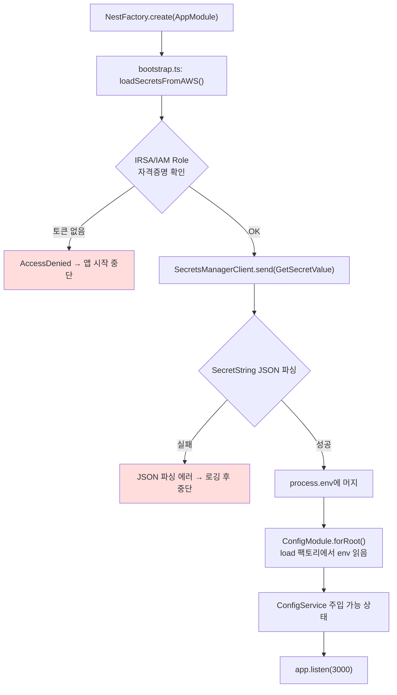
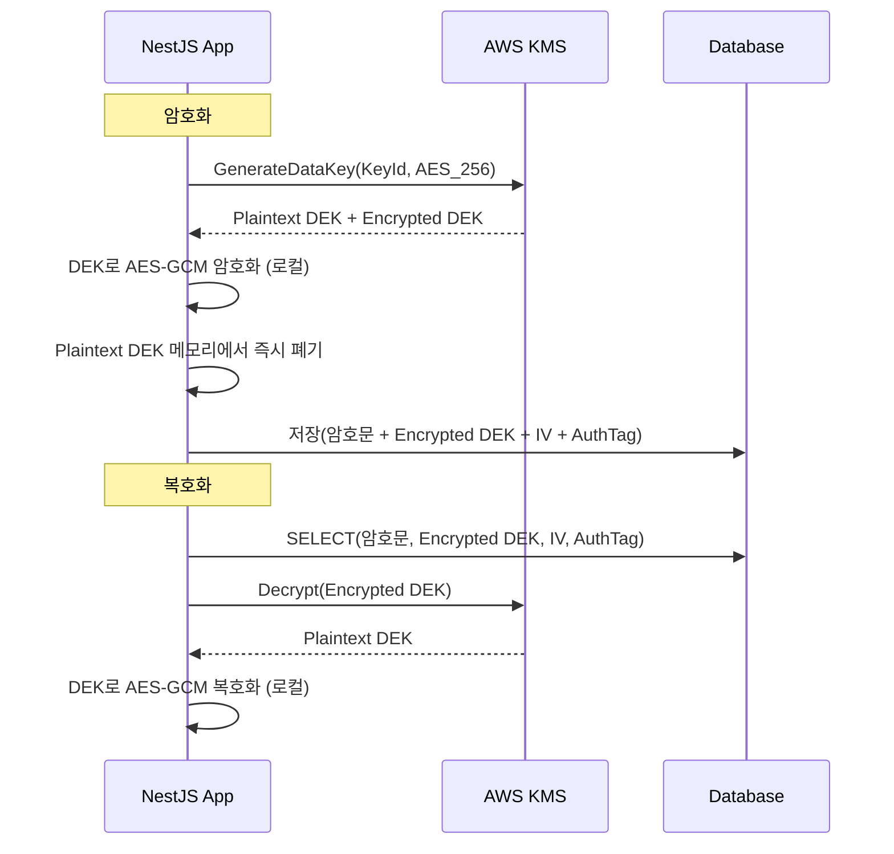

# NestJS에서 AWS Secrets Manager와 KMS 사용하기

운영 환경에서 DB 비밀번호나 API 키를 `.env` 파일에 넣고 ECR에 빌드해 올리던 시절은 끝났다. 컨테이너 이미지가 유출되면 그 안의 환경변수가 그대로 노출되고, GitHub Actions secret만 믿다가 fork PR에서 secret이 새는 사고도 종종 본다. AWS 환경에서 NestJS를 돌린다면 Secrets Manager로 시크릿을 보관하고, KMS로 직접 암복호화하는 패턴이 가장 무난하다. 이 문서는 5년차쯤 NestJS + EKS 환경에서 실제로 굴려보면서 정리한 내용이다.


## Secrets Manager와 KMS는 뭐가 다른가

처음 AWS 보안 서비스를 보면 헷갈린다. Secrets Manager, Parameter Store, KMS, AppConfig가 다 시크릿 관련처럼 보인다. 정리하면 이렇다.

| 서비스 | 역할 | NestJS에서 쓰는 시점 |
|---|---|---|
| Secrets Manager | 값을 통째로 보관·회전 | DB 비밀번호, 외부 API 키 등 "이미 완성된 시크릿" |
| KMS | 키만 관리, 암복호화 API 제공 | 내가 직접 데이터를 암호화하고 싶을 때 (envelope 암호화) |
| Parameter Store | 설정값 보관 (SecureString이면 KMS로 암호화됨) | 시크릿 아니지만 환경별로 다른 설정값 |
| AppConfig | 설정 배포·롤백·feature flag | 런타임에 동적으로 바뀌어야 하는 설정 |

내가 보통 쓰는 조합은 "DB 자격증명·외부 API 키는 Secrets Manager에, 환경별 설정값(엔드포인트, 타임아웃)은 Parameter Store에, 사용자 PII 같은 애플리케이션 데이터 암호화에는 KMS"다. AppConfig는 feature flag 도구로 따로 쓰는 편이다.


## 전체 부트스트랩 흐름

NestJS 앱이 뜨면서 Secrets Manager에서 시크릿을 꺼내 ConfigModule에 합치는 흐름은 이렇게 잡는다.



핵심은 `app.listen()` 이전에 시크릿을 다 끌어와서 `process.env`에 박아두는 것이다. 그래야 ConfigModule이 정상적으로 값을 읽고, ConfigService를 주입받는 모든 서비스가 똑같이 동작한다. 런타임 중에 시크릿을 가져오게 만들면 의존 그래프가 꼬이고 테스트도 어려워진다.


## 패키지 설치

AWS SDK는 v3 모듈식이라 필요한 클라이언트만 골라서 설치한다. v2(`aws-sdk`)는 2024년에 maintenance 모드로 들어갔으니 신규 프로젝트면 무조건 v3를 쓴다.

```bash
npm install @aws-sdk/client-secrets-manager @aws-sdk/client-kms
npm install @nestjs/config
```

`@aws-sdk/credential-providers`는 보통 따로 안 깔아도 SDK가 기본 credential chain을 알아서 잡아준다. EKS의 IRSA, EC2 instance profile, ECS task role, 로컬 `~/.aws/credentials`까지 자동 인식한다.


## Secrets Manager에서 시크릿 꺼내기

가장 단순한 형태부터 보자. `bootstrap.ts`에서 앱이 뜨기 전에 시크릿을 한 번 끌어온다.

```typescript
// src/config/secrets.loader.ts
import {
  SecretsManagerClient,
  GetSecretValueCommand,
} from '@aws-sdk/client-secrets-manager';

const client = new SecretsManagerClient({
  region: process.env.AWS_REGION ?? 'ap-northeast-2',
});

export async function loadSecret(secretId: string): Promise<Record<string, string>> {
  const command = new GetSecretValueCommand({ SecretId: secretId });
  const response = await client.send(command);

  if (!response.SecretString) {
    throw new Error(`Secret ${secretId} is binary, not supported`);
  }

  return JSON.parse(response.SecretString);
}
```

Secrets Manager에 시크릿을 만들 때 JSON 형식으로 넣는 게 표준이다. 콘솔에서 "Other type of secret"으로 만들면서 key/value 쌍을 입력하면 내부적으로 JSON으로 저장된다. 예를 들어 RDS 시크릿은 `{"username":"admin","password":"xxx","host":"...","port":5432,"dbname":"app"}` 형태다.

`main.ts`에서 NestFactory 호출 전에 시크릿을 가져온다.

```typescript
// src/main.ts
import { NestFactory } from '@nestjs/core';
import { AppModule } from './app.module';
import { loadSecret } from './config/secrets.loader';

async function bootstrap() {
  if (process.env.NODE_ENV === 'production' || process.env.NODE_ENV === 'staging') {
    const secrets = await loadSecret(`/myapp/${process.env.NODE_ENV}/db`);
    Object.assign(process.env, {
      DB_HOST: secrets.host,
      DB_PORT: String(secrets.port),
      DB_USERNAME: secrets.username,
      DB_PASSWORD: secrets.password,
      DB_NAME: secrets.dbname,
    });
  }

  const app = await NestFactory.create(AppModule);
  await app.listen(3000);
}

bootstrap();
```

`NODE_ENV` 분기를 두는 이유는 로컬 개발에서 매번 AWS에 붙으면 느리고, 개발자마다 AWS 권한이 다를 수 있어서다. 로컬은 `.env`를 그대로 쓰게 두고, 배포 환경에서만 Secrets Manager를 탄다.


## ConfigModule과 합치기

`process.env`에 박아넣는 방식은 단순하지만 타입이 다 string이 되고, IDE 자동완성도 안 된다. ConfigModule의 `load` 옵션으로 네임스페이스를 잡아주면 ConfigService에서 타입을 살릴 수 있다.

```typescript
// src/config/database.config.ts
import { registerAs } from '@nestjs/config';

export default registerAs('database', () => ({
  host: process.env.DB_HOST,
  port: parseInt(process.env.DB_PORT ?? '5432', 10),
  username: process.env.DB_USERNAME,
  password: process.env.DB_PASSWORD,
  database: process.env.DB_NAME,
}));
```

```typescript
// src/app.module.ts
import { Module } from '@nestjs/common';
import { ConfigModule } from '@nestjs/config';
import databaseConfig from './config/database.config';

@Module({
  imports: [
    ConfigModule.forRoot({
      isGlobal: true,
      load: [databaseConfig],
    }),
  ],
})
export class AppModule {}
```

```typescript
// 사용 측
@Injectable()
export class SomeService {
  constructor(private readonly configService: ConfigService) {}

  someMethod() {
    const dbHost = this.configService.get<string>('database.host');
  }
}
```


## DynamicModule로 AWS 클라이언트 주입하기

AWS 클라이언트를 매번 `new SecretsManagerClient()`로 만드는 건 비효율이다. SDK 클라이언트는 HTTP keep-alive 커넥션을 유지하므로 싱글톤으로 재사용해야 한다. NestJS의 DynamicModule 패턴으로 묶는다.

```typescript
// src/aws/aws.module.ts
import { Module, DynamicModule, Global } from '@nestjs/common';
import { SecretsManagerClient } from '@aws-sdk/client-secrets-manager';
import { KMSClient } from '@aws-sdk/client-kms';

export interface AwsModuleOptions {
  region: string;
}

@Global()
@Module({})
export class AwsModule {
  static forRoot(options: AwsModuleOptions): DynamicModule {
    const secretsClient = new SecretsManagerClient({ region: options.region });
    const kmsClient = new KMSClient({ region: options.region });

    return {
      module: AwsModule,
      providers: [
        { provide: SecretsManagerClient, useValue: secretsClient },
        { provide: KMSClient, useValue: kmsClient },
      ],
      exports: [SecretsManagerClient, KMSClient],
    };
  }
}
```

```typescript
// 사용하는 서비스
@Injectable()
export class TokenService {
  constructor(
    private readonly kmsClient: KMSClient,
    private readonly secretsClient: SecretsManagerClient,
  ) {}
}
```

`@Global()`을 붙이면 다른 모듈에서 import 없이도 주입받을 수 있다. AWS 클라이언트처럼 거의 모든 모듈에서 쓰일 만한 건 global로 두는 게 편하다.


## KMS로 직접 암복호화하기

Secrets Manager는 "값을 통째로 보관"하는 용도다. 사용자가 입력한 데이터(주민번호, 카드번호, 토큰)를 DB에 암호화해서 저장하려면 KMS Encrypt/Decrypt API를 써야 한다.

가장 단순한 형태는 KMS에 평문을 보내서 암호문을 받는 방식이다. 데이터가 4KB 이하일 때만 가능하다.

```typescript
// src/crypto/kms.service.ts
import { Injectable } from '@nestjs/common';
import {
  KMSClient,
  EncryptCommand,
  DecryptCommand,
} from '@aws-sdk/client-kms';
import { ConfigService } from '@nestjs/config';

@Injectable()
export class KmsService {
  private readonly keyId: string;

  constructor(
    private readonly kmsClient: KMSClient,
    private readonly configService: ConfigService,
  ) {
    this.keyId = this.configService.getOrThrow<string>('KMS_KEY_ID');
  }

  async encrypt(plaintext: string): Promise<string> {
    const command = new EncryptCommand({
      KeyId: this.keyId,
      Plaintext: Buffer.from(plaintext, 'utf-8'),
    });
    const response = await this.kmsClient.send(command);
    return Buffer.from(response.CiphertextBlob!).toString('base64');
  }

  async decrypt(ciphertextBase64: string): Promise<string> {
    const command = new DecryptCommand({
      CiphertextBlob: Buffer.from(ciphertextBase64, 'base64'),
    });
    const response = await this.kmsClient.send(command);
    return Buffer.from(response.Plaintext!).toString('utf-8');
  }
}
```

`Decrypt`에는 `KeyId`를 안 넘겨도 된다. 암호문 자체에 어떤 키로 암호화됐는지 정보가 들어있다. 다만 보안상 `KeyId`를 명시해서 의도하지 않은 키로 복호화되는 걸 막는 게 권장된다.


## Envelope 암호화 패턴

KMS Encrypt API는 호출당 과금이고, 데이터 4KB 제한이 있다. 사용자 데이터를 대량으로 암호화해야 한다면 envelope 암호화 패턴을 쓴다.

흐름은 이렇다.



KMS는 데이터 키(DEK)를 만들어서 평문 DEK와 암호화된 DEK를 같이 돌려준다. 평문 DEK로 실제 데이터를 암호화하고, 암호화된 DEK는 데이터와 함께 DB에 보관한다. 복호화 시점에 KMS Decrypt로 DEK만 풀어서 그걸로 데이터를 풀면 된다.

KMS API 호출은 DEK 생성·복호화 시점에만 일어나니까 비용과 레이턴시가 훨씬 낫다. DEK 하나로 여러 레코드를 암호화하면 더 절약되지만, DEK 노출 시 영향 범위가 커지므로 보통은 레코드당 또는 사용자당 하나의 DEK를 쓴다.

```typescript
// src/crypto/envelope-crypto.service.ts
import { Injectable } from '@nestjs/common';
import {
  KMSClient,
  GenerateDataKeyCommand,
  DecryptCommand,
} from '@aws-sdk/client-kms';
import { ConfigService } from '@nestjs/config';
import { createCipheriv, createDecipheriv, randomBytes } from 'crypto';

interface EncryptedPayload {
  ciphertext: string;
  encryptedDek: string;
  iv: string;
  authTag: string;
}

@Injectable()
export class EnvelopeCryptoService {
  private readonly keyId: string;

  constructor(
    private readonly kmsClient: KMSClient,
    config: ConfigService,
  ) {
    this.keyId = config.getOrThrow<string>('KMS_KEY_ID');
  }

  async encrypt(plaintext: string): Promise<EncryptedPayload> {
    const { Plaintext, CiphertextBlob } = await this.kmsClient.send(
      new GenerateDataKeyCommand({ KeyId: this.keyId, KeySpec: 'AES_256' }),
    );

    const dek = Buffer.from(Plaintext!);
    const iv = randomBytes(12);
    const cipher = createCipheriv('aes-256-gcm', dek, iv);
    const encrypted = Buffer.concat([
      cipher.update(plaintext, 'utf-8'),
      cipher.final(),
    ]);
    const authTag = cipher.getAuthTag();

    // 평문 DEK는 GC 대상이 되도록 참조 해제
    dek.fill(0);

    return {
      ciphertext: encrypted.toString('base64'),
      encryptedDek: Buffer.from(CiphertextBlob!).toString('base64'),
      iv: iv.toString('base64'),
      authTag: authTag.toString('base64'),
    };
  }

  async decrypt(payload: EncryptedPayload): Promise<string> {
    const { Plaintext } = await this.kmsClient.send(
      new DecryptCommand({
        CiphertextBlob: Buffer.from(payload.encryptedDek, 'base64'),
      }),
    );

    const dek = Buffer.from(Plaintext!);
    const decipher = createDecipheriv(
      'aes-256-gcm',
      dek,
      Buffer.from(payload.iv, 'base64'),
    );
    decipher.setAuthTag(Buffer.from(payload.authTag, 'base64'));

    const decrypted = Buffer.concat([
      decipher.update(Buffer.from(payload.ciphertext, 'base64')),
      decipher.final(),
    ]);

    dek.fill(0);
    return decrypted.toString('utf-8');
  }
}
```

`dek.fill(0)`은 평문 DEK가 메모리 덤프에 남는 시간을 줄이려는 방어책이다. Node.js Buffer가 V8 힙 밖에 있으니 GC 타이밍을 직접 제어할 수 있다. 완벽한 해결은 아니지만 안 하는 것보다 낫다.


## IAM Role과 IRSA로 자격증명 받기

운영 환경에서 절대 하면 안 되는 것이 IAM 사용자 access key를 환경변수에 넣는 것이다. 키가 유출되면 회전이 까다롭고, CloudTrail로 누가 썼는지 추적하기 어렵다.

EC2면 instance profile, ECS면 task role, EKS면 IRSA(IAM Roles for Service Accounts)를 쓴다. AWS SDK는 자동으로 credential chain을 따라가서 토큰을 받는다.

EKS IRSA 설정 예시.

```yaml
# k8s/serviceaccount.yaml
apiVersion: v1
kind: ServiceAccount
metadata:
  name: myapp-sa
  namespace: production
  annotations:
    eks.amazonaws.com/role-arn: arn:aws:iam::123456789012:role/myapp-secrets-role
---
apiVersion: apps/v1
kind: Deployment
metadata:
  name: myapp
spec:
  template:
    spec:
      serviceAccountName: myapp-sa
      containers:
        - name: app
          image: myapp:v1.0.0
```

IAM Role의 신뢰 정책에 OIDC provider를 등록하고, 정책에는 필요한 시크릿과 KMS 키만 허용한다.

```json
{
  "Version": "2012-10-17",
  "Statement": [
    {
      "Effect": "Allow",
      "Action": ["secretsmanager:GetSecretValue"],
      "Resource": "arn:aws:secretsmanager:ap-northeast-2:123456789012:secret:/myapp/prod/*"
    },
    {
      "Effect": "Allow",
      "Action": ["kms:Decrypt", "kms:GenerateDataKey"],
      "Resource": "arn:aws:kms:ap-northeast-2:123456789012:key/abcd1234-..."
    }
  ]
}
```

리소스 ARN에 와일드카드를 쓸 때는 prefix를 꼭 환경별로 분리해야 한다. `/myapp/*`처럼 잡으면 dev 파드가 prod 시크릿에 접근하는 사고가 난다. `/myapp/prod/*`, `/myapp/dev/*`로 나눠라.

NestJS 코드에서는 자격증명을 신경 쓸 필요가 없다. `new SecretsManagerClient({ region })`만 하면 SDK가 알아서 IRSA 토큰을 찾아 STS AssumeRoleWithWebIdentity를 호출한다.


## 시크릿 캐싱

부트스트랩 시점에 한 번 끌어오는 패턴이라면 캐싱이 별로 안 중요하다. 그런데 런타임 중에 시크릿을 자주 조회해야 한다면(예: 멀티 테넌트에서 테넌트별 외부 API 키를 보관하는 경우) 캐싱이 필수다.

AWS는 공식 캐싱 라이브러리 `@aws-sdk/secrets-manager-cache`를 안 만든다(v2 시절 `aws-secretsmanager-cache`가 있었지만 v3 대응이 늦다). 직접 만드는 게 빠르다.

```typescript
// src/aws/secrets-cache.service.ts
import { Injectable, Logger } from '@nestjs/common';
import {
  SecretsManagerClient,
  GetSecretValueCommand,
} from '@aws-sdk/client-secrets-manager';

interface CachedSecret {
  value: Record<string, string>;
  fetchedAt: number;
}

@Injectable()
export class SecretsCacheService {
  private readonly logger = new Logger(SecretsCacheService.name);
  private readonly cache = new Map<string, CachedSecret>();
  private readonly ttlMs = 5 * 60 * 1000; // 5분

  constructor(private readonly client: SecretsManagerClient) {}

  async get(secretId: string): Promise<Record<string, string>> {
    const cached = this.cache.get(secretId);
    const now = Date.now();

    if (cached && now - cached.fetchedAt < this.ttlMs) {
      return cached.value;
    }

    try {
      const response = await this.client.send(
        new GetSecretValueCommand({ SecretId: secretId }),
      );
      const value = JSON.parse(response.SecretString!);
      this.cache.set(secretId, { value, fetchedAt: now });
      return value;
    } catch (err) {
      if (cached) {
        this.logger.warn(
          `Failed to refresh secret ${secretId}, returning stale cache`,
          err,
        );
        return cached.value;
      }
      throw err;
    }
  }

  invalidate(secretId: string): void {
    this.cache.delete(secretId);
  }
}
```

TTL이 만료됐을 때 AWS 호출이 실패하면 stale cache라도 반환하는 패턴이 중요하다. Secrets Manager가 잠깐 throttle되거나 네트워크가 끊겼다고 앱이 죽으면 안 된다.


## 시크릿 회전 대응

Secrets Manager의 자동 회전 기능을 쓰면 Lambda가 주기적으로 시크릿을 새 값으로 바꾼다. RDS, DocumentDB, Redshift는 AWS가 제공하는 회전 Lambda 템플릿이 있다.

회전이 일어나면 캐시 안에 있는 옛 비밀번호로 DB에 붙으려다 인증 실패가 난다. 두 가지 대응이 있다.

첫째, TTL을 짧게 잡는다(1~5분). 회전 직후 짧은 시간 동안만 인증 실패가 발생하고 자동 복구된다. 가장 단순한 방법이다.

둘째, `AWSCURRENT`와 `AWSPREVIOUS` 두 버전을 모두 시도한다. Secrets Manager는 회전 후에도 이전 버전을 한동안 유지한다.

```typescript
async getCurrentOrPrevious(secretId: string): Promise<Record<string, string>> {
  for (const stage of ['AWSCURRENT', 'AWSPREVIOUS']) {
    try {
      const response = await this.client.send(
        new GetSecretValueCommand({ SecretId: secretId, VersionStage: stage }),
      );
      return JSON.parse(response.SecretString!);
    } catch (err) {
      this.logger.warn(`Failed to get ${stage} version`, err);
    }
  }
  throw new Error(`No valid version found for ${secretId}`);
}
```

DB 비밀번호 회전의 경우 TypeORM처럼 connection pool을 쓰는 라이브러리는 pool 안의 기존 커넥션이 살아있다. 회전 직후 새 커넥션이 만들어지면서 새 비밀번호로 인증을 시도한다. 회전 Lambda가 user2 → user1 → user2 식으로 두 계정을 번갈아 쓰는 방식(`MULTIUSER` rotation)을 쓰면 다운타임 없이 회전이 된다.


## 로컬 개발 환경

로컬에서 AWS를 매번 붙기는 귀찮다. 두 가지 패턴이 있다.

첫째, `.env`로 대체한다. 가장 단순하다. `NODE_ENV=development`일 때는 Secrets Manager를 안 타고 `.env`만 읽게 분기한다. 개발자 머신에 AWS 자격증명을 따로 설정 안 해도 되니까 신입 온보딩이 쉽다.

```typescript
// src/main.ts
async function bootstrap() {
  if (process.env.NODE_ENV !== 'development') {
    await loadSecretsFromAWS();
  }
  // ...
}
```

둘째, LocalStack을 띄운다. AWS API를 로컬에서 흉내내는 도구다. CI나 통합 테스트에서 실제 SDK 호출 경로를 검증하고 싶을 때 쓴다.

```yaml
# docker-compose.yml
services:
  localstack:
    image: localstack/localstack:latest
    ports:
      - '4566:4566'
    environment:
      - SERVICES=secretsmanager,kms
      - DEBUG=0
```

SDK 클라이언트에 `endpoint`를 넘기면 LocalStack으로 라우팅된다.

```typescript
const client = new SecretsManagerClient({
  region: 'us-east-1',
  endpoint: process.env.AWS_ENDPOINT_URL ?? undefined,
  credentials: process.env.AWS_ENDPOINT_URL
    ? { accessKeyId: 'test', secretAccessKey: 'test' }
    : undefined,
});
```

`endpoint` 옵션이 없으면 진짜 AWS로 가고, 있으면 LocalStack으로 간다. 로컬에서는 `AWS_ENDPOINT_URL=http://localhost:4566`을 export하면 된다.

LocalStack에 시크릿을 미리 넣는 건 awslocal CLI로 한다.

```bash
awslocal secretsmanager create-secret \
  --name /myapp/dev/db \
  --secret-string '{"username":"app","password":"local-pass","host":"db","port":5432,"dbname":"myapp"}'
```


## 비용과 레이턴시

운영하다 보면 의외로 AWS 비용에서 KMS와 Secrets Manager 청구서가 눈에 띈다. 대략적인 감각.

Secrets Manager는 시크릿당 월 0.4 USD, API 호출당 0.05 USD/10k calls다. 시크릿 100개를 두고 매번 캐시 없이 부르면 한 달에 수십~수백 달러가 우습게 나온다. 캐싱이 필수인 이유다.

KMS는 키당 월 1 USD, API 호출당 0.03 USD/10k calls다. envelope 암호화를 안 쓰고 모든 데이터를 KMS Encrypt로 처리하면 호출 수가 폭증한다. 데이터 키 캐싱(같은 DEK로 여러 레코드 암호화)을 활용해서 호출을 줄여야 한다.

레이턴시는 보통 첫 호출 50~100ms(SDK 초기화 + STS 토큰 발급), 이후 호출 10~30ms 정도. Lambda 환경에서는 cold start에 SDK 초기화가 더해져서 200ms 넘게 걸릴 때도 있다. ECS Fargate나 EKS 파드면 부트스트랩 한 번 끝나면 문제 없다.


## 자주 겪는 트러블슈팅

### AccessDeniedException: User is not authorized to perform secretsmanager:GetSecretValue

대부분 IAM 정책의 Resource ARN이 잘못됐다. 시크릿 이름이 `/myapp/prod/db`인데 정책에 `arn:aws:secretsmanager:region:account:secret:myapp/prod/db`라고 슬래시 없이 적은 경우가 흔하다. Secrets Manager는 시크릿 이름 끝에 6자리 랜덤 suffix가 붙으므로 `*`을 꼭 붙여야 한다.

```
arn:aws:secretsmanager:ap-northeast-2:123456789012:secret:/myapp/prod/db-*
```

IRSA를 쓴다면 서비스 어카운트의 어노테이션에 적은 role ARN과 실제 신뢰 정책의 OIDC subject가 맞는지도 확인한다. `system:serviceaccount:production:myapp-sa` 형식이다.

### KMSAccessDeniedException: User is not authorized to perform kms:Decrypt

KMS 정책은 IAM 정책과 KMS 키 정책 두 군데에서 모두 허용돼야 한다. IAM 정책만 고치고 키 정책을 안 건드린 경우가 가장 흔하다. 콘솔에서 키를 선택하고 "Key policy" 탭에서 principal에 role ARN이 들어있는지 본다.

EnvelopeCrypto에서 다른 region의 키로 암호화한 데이터를 다른 region에서 복호화하려는 경우도 있다. KMS는 region-scoped라서 multi-region key를 만들지 않으면 안 된다.

### ThrottlingException

Secrets Manager는 계정당 초당 1500 GetSecretValue 호출 제한이 있다. 캐싱 없이 매 요청마다 시크릿을 부르면 트래픽이 늘 때 throttle된다. 캐시 TTL을 늘리거나, 부트스트랩 시점에만 부르도록 구조를 바꾼다.

KMS는 region·키·API 종류별 제한이 다르다. Decrypt는 보통 초당 수만 호출까지 가능하지만, GenerateDataKey는 좀 더 보수적이다. AWS Service Quotas 콘솔에서 한도 상향 요청을 할 수 있다.

### Cold start 시 부트스트랩 지연

Lambda나 ECS task가 새로 뜰 때 Secrets Manager + KMS 호출이 직렬로 일어나면 1~2초가 그냥 날아간다. `Promise.all`로 병렬 호출을 묶는다.

```typescript
const [dbSecret, redisSecret, apiKeys] = await Promise.all([
  loadSecret('/myapp/prod/db'),
  loadSecret('/myapp/prod/redis'),
  loadSecret('/myapp/prod/api-keys'),
]);
```

### JSON 파싱 실패

콘솔에서 시크릿을 수동 편집하다가 따옴표가 깨지거나, 줄바꿈이 들어가서 JSON.parse가 실패하는 경우가 종종 있다. 부트스트랩 시점에 명확한 에러 메시지로 던지게 해놓고, alarm을 걸어두면 배포 직후 바로 잡힌다.

```typescript
let parsed;
try {
  parsed = JSON.parse(response.SecretString!);
} catch (err) {
  throw new Error(
    `Secret ${secretId} is not valid JSON: ${(err as Error).message}`,
  );
}
```

### CloudFormation/Terraform으로 시크릿 만들면 값이 비어있다

IaC로 시크릿 리소스만 만들고 값은 콘솔에서 따로 넣는 패턴이 있다. 값까지 IaC에 박으면 state 파일에 평문이 남는다. 이때 신규 환경 배포 직후에 앱이 뜨다가 `SecretString is undefined`로 죽는 사고가 난다. 배포 파이프라인에 "시크릿 값 존재 확인" 단계를 추가하거나, AWS Parameter Store의 SecureString을 같이 써서 IaC가 값을 안전하게 다루게 한다.


## 정리

NestJS에서 AWS 시크릿을 다루는 핵심은 부트스트랩 시점에 끌어와 ConfigModule에 합치는 패턴, DynamicModule로 AWS 클라이언트를 싱글톤 주입하는 패턴, envelope 암호화로 KMS 호출 비용 줄이기 세 가지다. IAM 권한은 환경별로 prefix를 나눠서 와일드카드의 사고를 막고, 로컬은 `.env`나 LocalStack으로 분리해서 개발자 경험을 해치지 않게 한다. 시크릿 회전이 들어오면 캐시 TTL과 connection pool 동작을 같이 봐야 한다.
