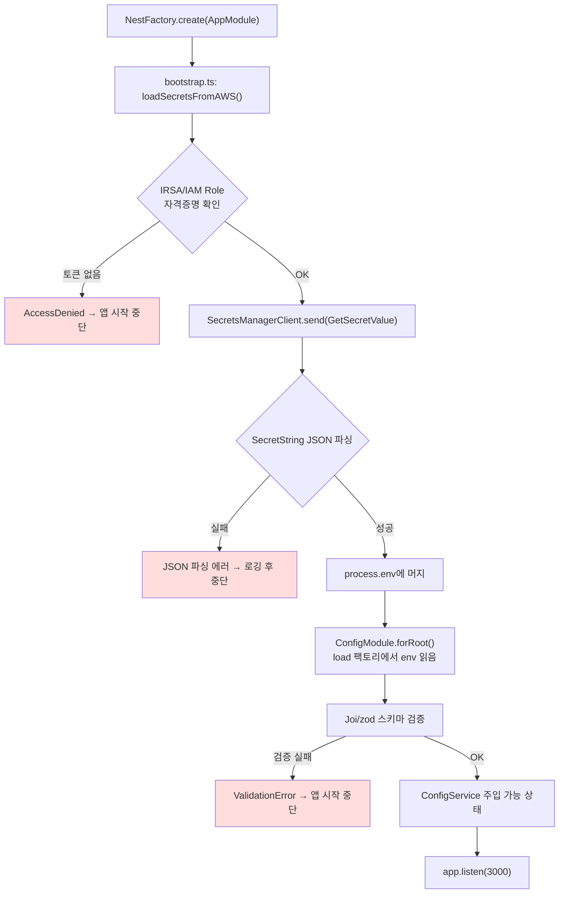
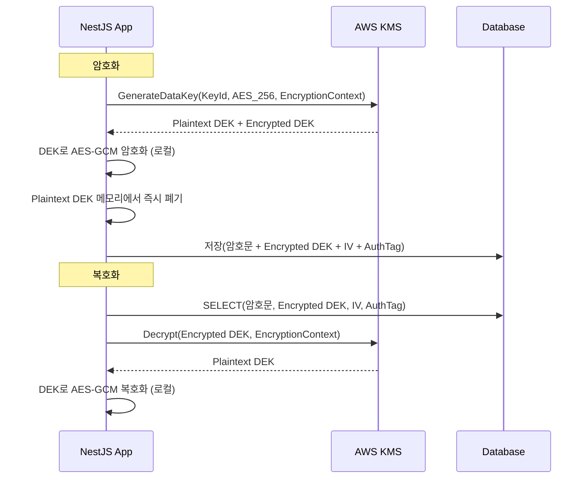

# NestJS에서 AWS Secrets Manager와 KMS 사용하기

운영 환경에서 DB 비밀번호나 API 키를 `.env` 파일에 넣고 ECR에 빌드해 올리던 시절은 끝났다. 컨테이너 이미지가 유출되면 그 안의 환경변수가 그대로 노출되고, GitHub Actions secret만 믿다가 fork PR에서 secret이 새는 사고도 종종 본다. AWS 환경에서 NestJS를 돌린다면 Secrets Manager로 시크릿을 보관하고, KMS로 직접 암복호화하는 패턴이 가장 무난하다. 이 문서는 5년차쯤 NestJS + EKS 환경에서 실제로 굴려보면서 정리한 내용이다.


## Secrets Manager와 KMS는 뭐가 다른가

처음 AWS 보안 서비스를 보면 헷갈린다. Secrets Manager, Parameter Store, KMS, AppConfig가 다 시크릿 관련처럼 보인다. 정리하면 이렇다.

| 서비스 | 역할 | NestJS에서 쓰는 시점 |
|---|---|---|
| Secrets Manager | 값을 통째로 보관·회전 | DB 비밀번호, 외부 API 키 등 "이미 완성된 시크릿" |
| KMS | 키만 관리, 암복호화 API 제공 | 내가 직접 데이터를 암호화하고 싶을 때 (envelope 암호화) |
| Parameter Store | 설정값 보관 (SecureString이면 KMS로 암호화됨) | 시크릿 아니지만 환경별로 다른 설정값 |
| AppConfig | 설정 배포·롤백·feature flag | 런타임에 동적으로 바뀌어야 하는 설정 |

내가 보통 쓰는 조합은 "DB 자격증명·외부 API 키는 Secrets Manager에, 환경별 설정값(엔드포인트, 타임아웃)은 Parameter Store에, 사용자 PII 같은 애플리케이션 데이터 암호화에는 KMS"다. AppConfig는 feature flag 도구로 따로 쓰는 편이다.

Parameter Store SecureString이 더 싸서 시크릿 용도로도 충분하지 않냐는 질문을 종종 받는다. 가격만 보면 그렇다. 다만 자동 회전이 안 되고, 시크릿당 메타데이터(설명, 태그, 정책)가 약해서 시크릿 100개 넘게 다루는 시점이면 Secrets Manager로 가는 게 운영이 훨씬 깔끔하다. 양이 적고 회전이 필요 없으면 SecureString도 괜찮다.


## 전체 부트스트랩 흐름

NestJS 앱이 뜨면서 Secrets Manager에서 시크릿을 꺼내 ConfigModule에 합치는 흐름은 이렇게 잡는다.



핵심은 `app.listen()` 이전에 시크릿을 다 끌어와서 `process.env`에 박아두는 것이다. 그래야 ConfigModule이 정상적으로 값을 읽고, ConfigService를 주입받는 모든 서비스가 똑같이 동작한다. 런타임 중에 시크릿을 가져오게 만들면 의존 그래프가 꼬이고 테스트도 어려워진다.

검증 단계가 중요하다. 시크릿이 없거나 형식이 잘못된 상태로 앱이 일단 떠버리면, 첫 요청이 들어왔을 때 의문의 500 에러로 죽는다. 부트스트랩 시점에 스키마 검증으로 빨리 죽는 쪽이 디버깅이 백배 쉽다.


## 패키지 설치

AWS SDK는 v3 모듈식이라 필요한 클라이언트만 골라서 설치한다. v2(`aws-sdk`)는 2024년에 maintenance 모드로 들어갔으니 신규 프로젝트면 무조건 v3를 쓴다.

```bash
npm install @aws-sdk/client-secrets-manager @aws-sdk/client-kms
npm install @nestjs/config joi
```

`@aws-sdk/credential-providers`는 보통 따로 안 깔아도 SDK가 기본 credential chain을 알아서 잡아준다. EKS의 IRSA, EC2 instance profile, ECS task role, 로컬 `~/.aws/credentials`까지 자동 인식한다. SSO 프로필을 명시적으로 쓰고 싶을 때만 `@aws-sdk/credential-provider-sso`를 추가한다.


## Secrets Manager에서 시크릿 꺼내기

가장 단순한 형태부터 보자. `bootstrap.ts`에서 앱이 뜨기 전에 시크릿을 한 번 끌어온다.

```typescript
// src/config/secrets.loader.ts
import {
  SecretsManagerClient,
  GetSecretValueCommand,
} from '@aws-sdk/client-secrets-manager';

const client = new SecretsManagerClient({
  region: process.env.AWS_REGION ?? 'ap-northeast-2',
  maxAttempts: 3,
});

export async function loadSecret(secretId: string): Promise<Record<string, string>> {
  const command = new GetSecretValueCommand({ SecretId: secretId });
  const response = await client.send(command);

  if (!response.SecretString) {
    throw new Error(`Secret ${secretId} is binary, not supported`);
  }

  try {
    return JSON.parse(response.SecretString);
  } catch (err) {
    throw new Error(
      `Secret ${secretId} is not valid JSON: ${(err as Error).message}`,
    );
  }
}
```

Secrets Manager에 시크릿을 만들 때 JSON 형식으로 넣는 게 표준이다. 콘솔에서 "Other type of secret"으로 만들면서 key/value 쌍을 입력하면 내부적으로 JSON으로 저장된다. RDS 시크릿은 `{"username":"admin","password":"xxx","host":"...","port":5432,"dbname":"app"}` 형태다.

`maxAttempts: 3`은 SDK가 자체 재시도를 어디까지 할지 정한다. 기본값도 3이라 사실상 명시적 선언에 가깝지만, 시크릿 로딩은 부트스트랩 한 번이라 좀 더 공격적으로 잡아도 된다.

`main.ts`에서 NestFactory 호출 전에 시크릿을 가져온다.

```typescript
// src/main.ts
import { NestFactory } from '@nestjs/core';
import { AppModule } from './app.module';
import { loadSecret } from './config/secrets.loader';

async function loadSecretsFromAWS(): Promise<void> {
  const env = process.env.NODE_ENV ?? 'development';
  if (env === 'development' || env === 'test') return;

  const [db, redis, external] = await Promise.all([
    loadSecret(`/myapp/${env}/db`),
    loadSecret(`/myapp/${env}/redis`),
    loadSecret(`/myapp/${env}/external-api`),
  ]);

  Object.assign(process.env, {
    DB_HOST: db.host,
    DB_PORT: String(db.port),
    DB_USERNAME: db.username,
    DB_PASSWORD: db.password,
    DB_NAME: db.dbname,
    REDIS_URL: redis.url,
    REDIS_PASSWORD: redis.password,
    STRIPE_SECRET_KEY: external.stripe,
    SENDGRID_API_KEY: external.sendgrid,
  });
}

async function bootstrap() {
  await loadSecretsFromAWS();
  const app = await NestFactory.create(AppModule);
  await app.listen(3000);
}

bootstrap();
```

`NODE_ENV` 분기를 두는 이유는 로컬 개발에서 매번 AWS에 붙으면 느리고, 개발자마다 AWS 권한이 다를 수 있어서다. 로컬은 `.env`를 그대로 쓰게 두고, 배포 환경에서만 Secrets Manager를 탄다.

`Promise.all`로 묶는 것이 핵심이다. 시크릿 4개를 직렬로 부르면 cold start에서 400ms가 그냥 날아간다. 병렬로 묶으면 가장 느린 호출 한 번만 기다린다.


## ConfigModule과 합치기 (스키마 검증과 타입 안전성)

`process.env`에 박아넣는 방식은 단순하지만 타입이 다 string이 되고, IDE 자동완성도 안 된다. 그리고 부트스트랩 직후 한 번 검증해두지 않으면 잘못된 값이 런타임에 터진다. ConfigModule의 `load`와 `validationSchema`를 같이 잡는 것을 추천한다.

```typescript
// src/config/database.config.ts
import { registerAs } from '@nestjs/config';

export default registerAs('database', () => ({
  host: process.env.DB_HOST,
  port: parseInt(process.env.DB_PORT ?? '5432', 10),
  username: process.env.DB_USERNAME,
  password: process.env.DB_PASSWORD,
  database: process.env.DB_NAME,
  ssl: process.env.NODE_ENV === 'production',
}));
```

```typescript
// src/config/config.schema.ts
import * as Joi from 'joi';

export const configSchema = Joi.object({
  NODE_ENV: Joi.string()
    .valid('development', 'test', 'staging', 'production')
    .required(),
  DB_HOST: Joi.string().hostname().required(),
  DB_PORT: Joi.number().port().default(5432),
  DB_USERNAME: Joi.string().required(),
  DB_PASSWORD: Joi.string().min(8).required(),
  DB_NAME: Joi.string().required(),
  REDIS_URL: Joi.string().uri().required(),
  STRIPE_SECRET_KEY: Joi.string().pattern(/^sk_(test|live)_/).required(),
  KMS_KEY_ID: Joi.string().required(),
});
```

```typescript
// src/app.module.ts
import { Module } from '@nestjs/common';
import { ConfigModule } from '@nestjs/config';
import databaseConfig from './config/database.config';
import { configSchema } from './config/config.schema';

@Module({
  imports: [
    ConfigModule.forRoot({
      isGlobal: true,
      load: [databaseConfig],
      validationSchema: configSchema,
      validationOptions: {
        abortEarly: false,
        allowUnknown: true,
      },
    }),
  ],
})
export class AppModule {}
```

`abortEarly: false`로 잡아두면 검증 실패 시 에러를 한 번에 모아서 보여준다. 첫 번째 에러만 보고 고쳤더니 두 번째에서 또 죽는 핑퐁이 없어진다.

ConfigService를 그대로 쓰면 `configService.get<string>('database.host')`처럼 매번 문자열 키와 제네릭을 적어야 한다. 큰 프로젝트에서는 typed wrapper를 만든다.

```typescript
// src/config/typed-config.service.ts
import { Injectable } from '@nestjs/common';
import { ConfigService } from '@nestjs/config';

export interface DatabaseConfig {
  host: string;
  port: number;
  username: string;
  password: string;
  database: string;
  ssl: boolean;
}

@Injectable()
export class TypedConfigService {
  constructor(private readonly configService: ConfigService) {}

  get database(): DatabaseConfig {
    return this.configService.getOrThrow<DatabaseConfig>('database');
  }

  get kmsKeyId(): string {
    return this.configService.getOrThrow<string>('KMS_KEY_ID');
  }

  get nodeEnv(): 'development' | 'test' | 'staging' | 'production' {
    return this.configService.getOrThrow('NODE_ENV');
  }
}
```

이렇게 묶어두면 `typedConfig.database.host`처럼 자동완성이 살고, 키 오타를 컴파일 타임에 잡는다. ConfigModule을 한 번 감싸서 쓰는 방식은 [Type Safe Config Service](Type_Safe_Config_Service.md)에 더 자세히 정리되어 있다.

### Async 팩토리로 시크릿을 직접 로드하기

`process.env` 우회 없이 ConfigModule이 직접 Secrets Manager를 호출하게 만들 수도 있다. `ConfigModule.forRoot({ load: [...] })`의 load 팩토리는 비동기를 지원한다.

```typescript
// src/config/secrets.config.ts
import { loadSecret } from './secrets.loader';

export default async () => {
  const env = process.env.NODE_ENV ?? 'development';
  if (env === 'development' || env === 'test') {
    return {
      database: {
        host: process.env.DB_HOST,
        port: parseInt(process.env.DB_PORT ?? '5432', 10),
        username: process.env.DB_USERNAME,
        password: process.env.DB_PASSWORD,
        database: process.env.DB_NAME,
      },
    };
  }

  const db = await loadSecret(`/myapp/${env}/db`);
  return {
    database: {
      host: db.host,
      port: db.port,
      username: db.username,
      password: db.password,
      database: db.dbname,
    },
  };
};
```

```typescript
// src/app.module.ts
ConfigModule.forRoot({
  isGlobal: true,
  load: [secretsConfig],
});
```

이 방식은 `main.ts`를 안 건드려도 되고, 테스트에서 mock load 팩토리를 쉽게 끼울 수 있다. 단점은 ConfigModule 초기화가 비동기 호출에 묶여서 부트스트랩 에러 메시지가 조금 더 알아보기 어려워진다는 정도다. 둘 다 자주 쓰이는데 나는 큰 프로젝트면 첫 번째(`main.ts`에서 명시적 호출), 작은 프로젝트면 두 번째(load 팩토리)를 선호한다.


## DynamicModule로 AWS 클라이언트 주입하기

AWS 클라이언트를 매번 `new SecretsManagerClient()`로 만드는 건 비효율이다. SDK 클라이언트는 HTTP keep-alive 커넥션을 유지하므로 싱글톤으로 재사용해야 한다. NestJS의 DynamicModule 패턴으로 묶는다.

```typescript
// src/aws/aws.module.ts
import { Module, DynamicModule, Global } from '@nestjs/common';
import { SecretsManagerClient } from '@aws-sdk/client-secrets-manager';
import { KMSClient } from '@aws-sdk/client-kms';
import { ConfigService } from '@nestjs/config';

@Global()
@Module({})
export class AwsModule {
  static forRootAsync(): DynamicModule {
    return {
      module: AwsModule,
      providers: [
        {
          provide: SecretsManagerClient,
          inject: [ConfigService],
          useFactory: (config: ConfigService) =>
            new SecretsManagerClient({
              region: config.getOrThrow<string>('AWS_REGION'),
              endpoint: config.get<string>('AWS_ENDPOINT_URL'),
              maxAttempts: 3,
            }),
        },
        {
          provide: KMSClient,
          inject: [ConfigService],
          useFactory: (config: ConfigService) =>
            new KMSClient({
              region: config.getOrThrow<string>('AWS_REGION'),
              endpoint: config.get<string>('AWS_ENDPOINT_URL'),
            }),
        },
      ],
      exports: [SecretsManagerClient, KMSClient],
    };
  }
}
```

```typescript
// 사용하는 서비스
@Injectable()
export class TokenService {
  constructor(
    private readonly kmsClient: KMSClient,
    private readonly secretsClient: SecretsManagerClient,
  ) {}
}
```

`@Global()`을 붙이면 다른 모듈에서 import 없이도 주입받을 수 있다. AWS 클라이언트처럼 거의 모든 모듈에서 쓰일 만한 건 global로 두는 게 편하다.

`useFactory`에 ConfigService를 inject하면 LocalStack 분기(endpoint 옵션)를 환경변수로만 제어할 수 있다. 클래스 자체를 바꾸지 않아도 된다.


## KMS로 직접 암복호화하기

Secrets Manager는 "값을 통째로 보관"하는 용도다. 사용자가 입력한 데이터(주민번호, 카드번호, 토큰)를 DB에 암호화해서 저장하려면 KMS Encrypt/Decrypt API를 써야 한다.

가장 단순한 형태는 KMS에 평문을 보내서 암호문을 받는 방식이다. 데이터가 4KB 이하일 때만 가능하다.

```typescript
// src/crypto/kms.service.ts
import { Injectable } from '@nestjs/common';
import {
  KMSClient,
  EncryptCommand,
  DecryptCommand,
} from '@aws-sdk/client-kms';
import { TypedConfigService } from '../config/typed-config.service';

@Injectable()
export class KmsService {
  private readonly keyId: string;

  constructor(
    private readonly kmsClient: KMSClient,
    config: TypedConfigService,
  ) {
    this.keyId = config.kmsKeyId;
  }

  async encrypt(plaintext: string, context?: Record<string, string>): Promise<string> {
    const response = await this.kmsClient.send(
      new EncryptCommand({
        KeyId: this.keyId,
        Plaintext: Buffer.from(plaintext, 'utf-8'),
        EncryptionContext: context,
      }),
    );
    return Buffer.from(response.CiphertextBlob!).toString('base64');
  }

  async decrypt(ciphertextBase64: string, context?: Record<string, string>): Promise<string> {
    const response = await this.kmsClient.send(
      new DecryptCommand({
        KeyId: this.keyId,
        CiphertextBlob: Buffer.from(ciphertextBase64, 'base64'),
        EncryptionContext: context,
      }),
    );
    return Buffer.from(response.Plaintext!).toString('utf-8');
  }
}
```

`Decrypt`에는 `KeyId`를 안 넘겨도 된다. 암호문 자체에 어떤 키로 암호화됐는지 정보가 들어있다. 다만 보안상 `KeyId`를 명시해서 의도하지 않은 키로 복호화되는 걸 막는 게 권장된다.


## EncryptionContext로 권한 범위 좁히기

`EncryptionContext`는 KMS가 제공하는 추가 인증 데이터(AAD)다. 암호화할 때 넘긴 컨텍스트와 복호화할 때 넘긴 컨텍스트가 정확히 일치해야 복호화가 성공한다. CloudTrail 로그에도 컨텍스트가 그대로 남기 때문에 감사 추적이 깔끔해진다.

```typescript
// 사용자 ID 1234의 토큰 암호화
const ciphertext = await kmsService.encrypt(rawToken, {
  userId: '1234',
  purpose: 'oauth-refresh-token',
});

// 복호화 시 같은 컨텍스트 필요
const plaintext = await kmsService.decrypt(ciphertext, {
  userId: '1234',
  purpose: 'oauth-refresh-token',
});
```

이게 왜 중요하냐면, IAM 정책에서 `kms:EncryptionContext:userId`를 조건으로 걸 수 있다. 예를 들어 "API 서버 role은 자신의 요청에 들어있는 userId로만 복호화할 수 있다"라는 정책이 가능해진다.

```json
{
  "Effect": "Allow",
  "Action": "kms:Decrypt",
  "Resource": "arn:aws:kms:ap-northeast-2:123456789012:key/...",
  "Condition": {
    "StringEquals": {
      "kms:EncryptionContextKeys": ["userId", "purpose"]
    }
  }
}
```

암호화 컨텍스트는 평문으로 전송된다는 점은 주의한다. 민감 정보를 컨텍스트에 넣으면 안 된다. 식별자나 분류 라벨 같은 메타데이터 용도다.


## Envelope 암호화 패턴

KMS Encrypt API는 호출당 과금이고, 데이터 4KB 제한이 있다. 사용자 데이터를 대량으로 암호화해야 한다면 envelope 암호화 패턴을 쓴다.

흐름은 이렇다.



KMS는 데이터 키(DEK)를 만들어서 평문 DEK와 암호화된 DEK를 같이 돌려준다. 평문 DEK로 실제 데이터를 암호화하고, 암호화된 DEK는 데이터와 함께 DB에 보관한다. 복호화 시점에 KMS Decrypt로 DEK만 풀어서 그걸로 데이터를 풀면 된다.

KMS API 호출은 DEK 생성·복호화 시점에만 일어나니까 비용과 레이턴시가 훨씬 낫다. DEK 하나로 여러 레코드를 암호화하면 더 절약되지만, DEK 노출 시 영향 범위가 커지므로 보통은 레코드당 또는 사용자당 하나의 DEK를 쓴다.

```typescript
// src/crypto/envelope-crypto.service.ts
import { Injectable } from '@nestjs/common';
import {
  KMSClient,
  GenerateDataKeyCommand,
  DecryptCommand,
} from '@aws-sdk/client-kms';
import { TypedConfigService } from '../config/typed-config.service';
import { createCipheriv, createDecipheriv, randomBytes } from 'crypto';

interface EncryptedPayload {
  ciphertext: string;
  encryptedDek: string;
  iv: string;
  authTag: string;
}

@Injectable()
export class EnvelopeCryptoService {
  private readonly keyId: string;

  constructor(
    private readonly kmsClient: KMSClient,
    config: TypedConfigService,
  ) {
    this.keyId = config.kmsKeyId;
  }

  async encrypt(
    plaintext: string,
    context: Record<string, string>,
  ): Promise<EncryptedPayload> {
    const { Plaintext, CiphertextBlob } = await this.kmsClient.send(
      new GenerateDataKeyCommand({
        KeyId: this.keyId,
        KeySpec: 'AES_256',
        EncryptionContext: context,
      }),
    );

    const dek = Buffer.from(Plaintext!);
    const iv = randomBytes(12);
    const cipher = createCipheriv('aes-256-gcm', dek, iv);
    const encrypted = Buffer.concat([
      cipher.update(plaintext, 'utf-8'),
      cipher.final(),
    ]);
    const authTag = cipher.getAuthTag();

    dek.fill(0);

    return {
      ciphertext: encrypted.toString('base64'),
      encryptedDek: Buffer.from(CiphertextBlob!).toString('base64'),
      iv: iv.toString('base64'),
      authTag: authTag.toString('base64'),
    };
  }

  async decrypt(
    payload: EncryptedPayload,
    context: Record<string, string>,
  ): Promise<string> {
    const { Plaintext } = await this.kmsClient.send(
      new DecryptCommand({
        KeyId: this.keyId,
        CiphertextBlob: Buffer.from(payload.encryptedDek, 'base64'),
        EncryptionContext: context,
      }),
    );

    const dek = Buffer.from(Plaintext!);
    const decipher = createDecipheriv(
      'aes-256-gcm',
      dek,
      Buffer.from(payload.iv, 'base64'),
    );
    decipher.setAuthTag(Buffer.from(payload.authTag, 'base64'));

    const decrypted = Buffer.concat([
      decipher.update(Buffer.from(payload.ciphertext, 'base64')),
      decipher.final(),
    ]);

    dek.fill(0);
    return decrypted.toString('utf-8');
  }
}
```

`dek.fill(0)`은 평문 DEK가 메모리 덤프에 남는 시간을 줄이려는 방어책이다. Node.js Buffer가 V8 힙 밖에 있으니 GC 타이밍을 직접 제어할 수 있다. 완벽한 해결은 아니지만 안 하는 것보다 낫다.

DEK 캐싱이 필요하면 AWS Encryption SDK의 `LocalCryptographicMaterialsCache`를 쓰는 게 안전하다. 직접 구현하면 만료 처리, 동시 접근 처리에서 실수하기 쉽다.


## IAM 권한 설정

운영 환경에서 절대 하면 안 되는 것이 IAM 사용자 access key를 환경변수에 넣는 것이다. 키가 유출되면 회전이 까다롭고, CloudTrail로 누가 썼는지 추적하기 어렵다.

EC2면 instance profile, ECS면 task role, EKS면 IRSA(IAM Roles for Service Accounts)를 쓴다. AWS SDK는 자동으로 credential chain을 따라가서 토큰을 받는다.

### EKS IRSA 설정

```yaml
# k8s/serviceaccount.yaml
apiVersion: v1
kind: ServiceAccount
metadata:
  name: myapp-sa
  namespace: production
  annotations:
    eks.amazonaws.com/role-arn: arn:aws:iam::123456789012:role/myapp-secrets-role
---
apiVersion: apps/v1
kind: Deployment
metadata:
  name: myapp
spec:
  template:
    spec:
      serviceAccountName: myapp-sa
      containers:
        - name: app
          image: myapp:v1.0.0
```

IAM Role의 신뢰 정책에 OIDC provider를 등록한다.

```json
{
  "Version": "2012-10-17",
  "Statement": [
    {
      "Effect": "Allow",
      "Principal": {
        "Federated": "arn:aws:iam::123456789012:oidc-provider/oidc.eks.ap-northeast-2.amazonaws.com/id/ABCDEF..."
      },
      "Action": "sts:AssumeRoleWithWebIdentity",
      "Condition": {
        "StringEquals": {
          "oidc.eks.ap-northeast-2.amazonaws.com/id/ABCDEF...:sub": "system:serviceaccount:production:myapp-sa",
          "oidc.eks.ap-northeast-2.amazonaws.com/id/ABCDEF...:aud": "sts.amazonaws.com"
        }
      }
    }
  ]
}
```

`sub` 조건에 네임스페이스와 서비스 어카운트를 같이 박는 것이 핵심이다. 빼면 같은 클러스터의 어느 파드든 이 role을 가져올 수 있다. dev 네임스페이스 파드가 prod role을 assume하는 사고가 여기서 난다.

### 최소 권한 IAM 정책

정책에는 필요한 시크릿과 KMS 키만 허용한다.

```json
{
  "Version": "2012-10-17",
  "Statement": [
    {
      "Sid": "ReadProdSecrets",
      "Effect": "Allow",
      "Action": ["secretsmanager:GetSecretValue"],
      "Resource": "arn:aws:secretsmanager:ap-northeast-2:123456789012:secret:/myapp/prod/*",
      "Condition": {
        "StringEquals": {
          "aws:RequestedRegion": "ap-northeast-2"
        }
      }
    },
    {
      "Sid": "KmsCryptoOps",
      "Effect": "Allow",
      "Action": ["kms:Decrypt", "kms:GenerateDataKey"],
      "Resource": "arn:aws:kms:ap-northeast-2:123456789012:key/abcd1234-...",
      "Condition": {
        "StringEquals": {
          "kms:EncryptionContextKeys": ["userId", "purpose"]
        }
      }
    }
  ]
}
```

리소스 ARN에 와일드카드를 쓸 때는 prefix를 꼭 환경별로 분리해야 한다. `/myapp/*`처럼 잡으면 dev 파드가 prod 시크릿에 접근하는 사고가 난다. `/myapp/prod/*`, `/myapp/dev/*`로 나눠라.

Condition에 `aws:RequestedRegion`을 넣어두면 잘못 설정한 region으로 호출이 새는 것을 막을 수 있다. multi-region 인프라가 아니라면 거의 항상 걸어두는 게 좋다.

`aws:SourceVpce`(VPC 엔드포인트 ID) 조건을 더 거는 패턴도 자주 쓴다. 시크릿 접근을 특정 VPC 엔드포인트로 들어온 호출로만 한정하면, 자격증명이 유출되어도 외부에서 직접 호출하는 경로가 막힌다.

```json
"Condition": {
  "StringEquals": {
    "aws:SourceVpce": "vpce-0abc1234"
  }
}
```

### KMS 키 정책 vs IAM 정책

KMS는 다른 서비스와 다르게 키 자체에도 정책(Key Policy)이 붙는다. IAM 정책으로 `kms:Decrypt`를 허용해도, 키 정책이 해당 principal을 허용하지 않으면 실패한다. 두 곳 모두 허용이 필요하다.

기본 키 정책은 "키를 만든 계정의 root 사용자에게 모든 권한"을 주는 형태다. 거기에 사용 principal을 추가해야 한다.

```json
{
  "Version": "2012-10-17",
  "Statement": [
    {
      "Sid": "EnableIAMUserPermissions",
      "Effect": "Allow",
      "Principal": { "AWS": "arn:aws:iam::123456789012:root" },
      "Action": "kms:*",
      "Resource": "*"
    },
    {
      "Sid": "AllowAppRoleToUseKey",
      "Effect": "Allow",
      "Principal": {
        "AWS": "arn:aws:iam::123456789012:role/myapp-secrets-role"
      },
      "Action": ["kms:Decrypt", "kms:GenerateDataKey", "kms:DescribeKey"],
      "Resource": "*"
    }
  ]
}
```

`KMSAccessDeniedException`이 나면 IAM 정책과 키 정책을 둘 다 확인한다. 둘 중 하나만 빼먹는 사고가 가장 흔하다.

### KMS Grant

키 정책이나 IAM 정책을 매번 바꾸기 어려운 상황에서 임시 권한을 줘야 할 때 KMS Grant를 쓴다. Grant는 키에 붙는 토큰 기반 위임이고, AWS 서비스(예: RDS, S3)가 자동 회전이나 일회성 작업을 할 때 내부적으로 만들어진다.

직접 만들 일은 많지 않지만, 람다 함수가 일시적으로 다른 계정의 KMS 키를 쓰게 해야 한다거나, 사용자별로 임시 권한을 줘야 하는 경우에는 유용하다. `CreateGrant`로 만들고 `RetireGrant`로 회수한다.

대부분의 NestJS 앱은 Grant 없이 키 정책 + IAM 정책 조합으로 충분하다.

### 자격증명 적용 확인

NestJS 코드에서는 자격증명을 신경 쓸 필요가 없다. `new SecretsManagerClient({ region })`만 하면 SDK가 알아서 IRSA 토큰을 찾아 STS AssumeRoleWithWebIdentity를 호출한다.

문제가 의심되면 STS Caller Identity를 한 번 찍어보면 어떤 role로 호출되는지 바로 안다.

```typescript
import { STSClient, GetCallerIdentityCommand } from '@aws-sdk/client-sts';

const sts = new STSClient({ region: 'ap-northeast-2' });
const identity = await sts.send(new GetCallerIdentityCommand({}));
console.log(identity.Arn);
// → arn:aws:sts::123456789012:assumed-role/myapp-secrets-role/myapp-sa
```

부트스트랩 직후 한 번만 찍어두는 진단 로그로 충분하다. 잘못된 role을 잡으면 즉시 알아챌 수 있다.


## 시크릿 캐싱

부트스트랩 시점에 한 번 끌어오는 패턴이라면 캐싱이 별로 안 중요하다. 그런데 런타임 중에 시크릿을 자주 조회해야 한다면(예: 멀티 테넌트에서 테넌트별 외부 API 키를 보관하는 경우) 캐싱이 필수다.

### 기본 메모리 캐시

```typescript
// src/aws/secrets-cache.service.ts
import { Injectable, Logger } from '@nestjs/common';
import {
  SecretsManagerClient,
  GetSecretValueCommand,
} from '@aws-sdk/client-secrets-manager';

interface CachedSecret {
  value: Record<string, string>;
  fetchedAt: number;
}

@Injectable()
export class SecretsCacheService {
  private readonly logger = new Logger(SecretsCacheService.name);
  private readonly cache = new Map<string, CachedSecret>();
  private readonly inflight = new Map<string, Promise<Record<string, string>>>();
  private readonly ttlMs = 5 * 60 * 1000;

  constructor(private readonly client: SecretsManagerClient) {}

  async get(secretId: string): Promise<Record<string, string>> {
    const cached = this.cache.get(secretId);
    const now = Date.now();

    if (cached && now - cached.fetchedAt < this.ttlMs) {
      return cached.value;
    }

    const existing = this.inflight.get(secretId);
    if (existing) return existing;

    const promise = this.fetchAndStore(secretId, cached).finally(() => {
      this.inflight.delete(secretId);
    });
    this.inflight.set(secretId, promise);
    return promise;
  }

  private async fetchAndStore(
    secretId: string,
    stale?: CachedSecret,
  ): Promise<Record<string, string>> {
    try {
      const response = await this.client.send(
        new GetSecretValueCommand({ SecretId: secretId }),
      );
      const value = JSON.parse(response.SecretString!);
      this.cache.set(secretId, { value, fetchedAt: Date.now() });
      return value;
    } catch (err) {
      if (stale) {
        this.logger.warn(
          `Failed to refresh secret ${secretId}, returning stale cache`,
          err,
        );
        return stale.value;
      }
      throw err;
    }
  }

  invalidate(secretId: string): void {
    this.cache.delete(secretId);
  }
}
```

두 가지 포인트가 들어있다.

첫째, **stale-on-failure**. TTL이 만료됐을 때 AWS 호출이 실패하면 캐시에 남은 옛 값이라도 돌려준다. Secrets Manager가 잠깐 throttle되거나 네트워크가 끊겼다고 앱이 죽으면 안 된다.

둘째, **inflight 중복 제거(single flight)**. TTL 만료 직후 동시에 100개 요청이 들어오면 100번 GetSecretValue를 호출하게 된다(cache stampede). `inflight` 맵으로 첫 번째 호출만 실제로 가게 하고 나머지는 같은 Promise를 기다리게 한다. 운영하다가 throttle 폭증으로 한 번 데이고 나면 이걸 빼먹지 않게 된다.

### Refresh-ahead 패턴

TTL이 만료된 다음에 갱신하는 게 아니라, 만료 직전에 백그라운드로 미리 갱신해두는 패턴이다. 사용자 요청 경로에서 KMS 호출 레이턴시가 사라진다.

```typescript
async get(secretId: string): Promise<Record<string, string>> {
  const cached = this.cache.get(secretId);
  const now = Date.now();

  if (!cached) {
    return this.fetchAndStore(secretId);
  }

  const age = now - cached.fetchedAt;
  if (age >= this.ttlMs) {
    return this.fetchAndStore(secretId, cached);
  }

  // 만료 30% 전이면 백그라운드 갱신
  if (age >= this.ttlMs * 0.7 && !this.inflight.has(secretId)) {
    const promise = this.fetchAndStore(secretId, cached).finally(() => {
      this.inflight.delete(secretId);
    });
    this.inflight.set(secretId, promise);
  }

  return cached.value;
}
```

만료의 70% 시점에 백그라운드 갱신을 트리거하고, 사용자에게는 캐시된 값을 즉시 돌려준다. 갱신 실패도 stale-on-failure로 흡수된다.

### 분산 캐시가 필요한가

NestJS 인스턴스가 100개라면 각자 메모리 캐시를 들고 있어서 같은 시크릿을 100번 가져온다. Redis로 통합하면 호출 수가 줄지만, 시크릿을 Redis에 평문으로 넣는 게 보안상 부담이다.

내가 보통 택하는 절충은 "인스턴스 메모리 캐시 + 긴 TTL". TTL을 5~10분으로 잡으면 인스턴스 100개라도 분당 호출 수가 100/5 = 20회 수준이라 throttle 한계인 1500/s를 넘기 어렵다. Redis까지 추가하면 Redis 자체가 또 다른 SPOF가 된다.

정말 짧은 TTL(수십 초)이 필요하거나 시크릿 종류가 수백 개라면 Redis 캐시를 고려해볼 만하다. 그땐 Redis에는 KMS Encrypt로 한 번 더 감싼 값을 넣는다.

### 메트릭

캐시 hit/miss는 항상 메트릭으로 노출해두는 게 좋다.

```typescript
async get(secretId: string): Promise<Record<string, string>> {
  const cached = this.cache.get(secretId);
  if (cached && Date.now() - cached.fetchedAt < this.ttlMs) {
    this.metrics.increment('secrets.cache.hit', { secretId });
    return cached.value;
  }
  this.metrics.increment('secrets.cache.miss', { secretId });
  // ...
}
```

운영 중에 갑자기 miss 비율이 치솟으면 캐시 무효화 코드가 잘못 호출되거나, TTL이 너무 짧게 잡혔다는 신호다. Datadog이나 CloudWatch에 게이지로 띄워두면 그래프만 봐도 알 수 있다.


## 시크릿 회전 대응

Secrets Manager의 자동 회전 기능을 쓰면 Lambda가 주기적으로 시크릿을 새 값으로 바꾼다. RDS, DocumentDB, Redshift는 AWS가 제공하는 회전 Lambda 템플릿이 있다.

회전이 일어나면 캐시 안에 있는 옛 비밀번호로 DB에 붙으려다 인증 실패가 난다. 두 가지 대응이 있다.

첫째, TTL을 짧게 잡는다(1~5분). 회전 직후 짧은 시간 동안만 인증 실패가 발생하고 자동 복구된다. 가장 단순한 방법이다.

둘째, `AWSCURRENT`와 `AWSPREVIOUS` 두 버전을 모두 시도한다. Secrets Manager는 회전 후에도 이전 버전을 한동안 유지한다.

```typescript
async getCurrentOrPrevious(secretId: string): Promise<Record<string, string>> {
  for (const stage of ['AWSCURRENT', 'AWSPREVIOUS']) {
    try {
      const response = await this.client.send(
        new GetSecretValueCommand({ SecretId: secretId, VersionStage: stage }),
      );
      return JSON.parse(response.SecretString!);
    } catch (err) {
      this.logger.warn(`Failed to get ${stage} version`, err);
    }
  }
  throw new Error(`No valid version found for ${secretId}`);
}
```

DB 비밀번호 회전의 경우 TypeORM처럼 connection pool을 쓰는 라이브러리는 pool 안의 기존 커넥션이 살아있다. 회전 직후 새 커넥션이 만들어지면서 새 비밀번호로 인증을 시도한다. 회전 Lambda가 user2 → user1 → user2 식으로 두 계정을 번갈아 쓰는 방식(`MULTIUSER` rotation)을 쓰면 다운타임 없이 회전이 된다.

EventBridge로 회전 이벤트를 받아서 캐시를 적극적으로 무효화하는 방법도 있다. Secrets Manager가 회전을 마치면 CloudWatch Events에 이벤트가 떨어지는데, 이걸 SNS → HTTP endpoint로 NestJS 앱에 통보하면 즉시 캐시를 비울 수 있다. 다만 인스턴스가 많으면 이 방식 자체가 복잡해서, 보통은 그냥 짧은 TTL로 처리한다.


## 로컬 개발 환경

로컬에서 AWS를 매번 붙기는 귀찮다. 세 가지 패턴이 있다.

### 패턴 1: `.env` 대체

가장 단순하다. `NODE_ENV=development`일 때는 Secrets Manager를 안 타고 `.env`만 읽게 분기한다. 개발자 머신에 AWS 자격증명을 따로 설정 안 해도 되니까 신입 온보딩이 쉽다.

```typescript
// src/main.ts
async function bootstrap() {
  if (process.env.NODE_ENV !== 'development') {
    await loadSecretsFromAWS();
  }
  // ...
}
```

`.env.example`을 git에 두고, 실제 값이 들어간 `.env`는 `.gitignore`에 추가한다. 1Password CLI나 doppler로 팀 시크릿을 관리하면 개발자가 `.env`를 직접 안 만들어도 된다.

```bash
# 1Password CLI 예시
op run --env-file=.env.template -- npm run start:dev
```

### 패턴 2: AWS SSO 프로필로 dev 계정 직접 사용

dev 환경의 Secrets Manager에 그대로 붙는 방식이다. 실제 운영 코드 경로를 그대로 검증할 수 있다. 회사가 SSO를 쓴다면 거의 무료로 세팅된다.

```bash
aws configure sso
# SSO start URL, region, role 입력
aws sso login --profile myapp-dev

AWS_PROFILE=myapp-dev npm run start:dev
```

SDK는 `AWS_PROFILE` 환경변수를 보고 `~/.aws/config`의 SSO 프로필을 자동으로 잡는다. 토큰이 만료되면 콘솔에서 `aws sso login --profile myapp-dev`를 한 번 더 치면 된다(보통 8~12시간 유효).

```typescript
// 코드 변경 불필요. 기본 credential chain이 알아서 처리한다
const client = new SecretsManagerClient({ region: 'ap-northeast-2' });
```

dev 계정 시크릿에 prod 데이터가 들어있으면 안 된다는 점만 주의한다. dev/prod 계정 분리가 안 된 회사라면 이 방식은 위험하다.

### 패턴 3: LocalStack

AWS API를 로컬에서 흉내내는 도구다. CI나 통합 테스트에서 실제 SDK 호출 경로를 검증하고 싶을 때 쓴다. 인터넷 없이도 돌아간다.

```yaml
# docker-compose.yml
services:
  localstack:
    image: localstack/localstack:latest
    ports:
      - '4566:4566'
    environment:
      - SERVICES=secretsmanager,kms
      - DEBUG=0
```

SDK 클라이언트에 `endpoint`를 넘기면 LocalStack으로 라우팅된다.

```typescript
const client = new SecretsManagerClient({
  region: 'us-east-1',
  endpoint: process.env.AWS_ENDPOINT_URL ?? undefined,
  credentials: process.env.AWS_ENDPOINT_URL
    ? { accessKeyId: 'test', secretAccessKey: 'test' }
    : undefined,
});
```

`endpoint` 옵션이 없으면 진짜 AWS로 가고, 있으면 LocalStack으로 간다. 로컬에서는 `AWS_ENDPOINT_URL=http://localhost:4566`을 export하면 된다.

LocalStack에 시크릿을 미리 넣는 건 awslocal CLI로 한다.

```bash
awslocal secretsmanager create-secret \
  --name /myapp/dev/db \
  --secret-string '{"username":"app","password":"local-pass","host":"db","port":5432,"dbname":"myapp"}'

awslocal kms create-key --description "myapp dev key"
awslocal kms create-alias --alias-name alias/myapp-dev --target-key-id <key-id>
```

LocalStack의 KMS는 실제 KMS와 동작이 미묘하게 다르다(EncryptionContext 검증이 느슨하거나, 일부 condition key가 무시되거나). 정책 검증이 목적이라면 dev 계정에 직접 붙는 게 낫다.

### 어떤 걸 선택할까

- 단순 CRUD 개발만 한다: `.env` 패턴이 충분하다
- AWS 인프라까지 만지고 권한 검증을 자주 한다: SSO 프로필
- CI 통합 테스트에서 SDK 호출 경로를 검증한다: LocalStack
- 셋 다 섞어 쓰는 것도 흔하다. 로컬은 `.env`, CI는 LocalStack, dev 환경 디버깅은 SSO


## 테스트에서 AWS 호출 모킹

유닛 테스트에서 진짜 AWS를 부를 일은 없다. `aws-sdk-client-mock`을 쓰는 게 표준이다.

```bash
npm install --save-dev aws-sdk-client-mock
```

```typescript
// kms.service.spec.ts
import { mockClient } from 'aws-sdk-client-mock';
import { KMSClient, EncryptCommand, DecryptCommand } from '@aws-sdk/client-kms';
import { Test } from '@nestjs/testing';
import { KmsService } from './kms.service';
import { TypedConfigService } from '../config/typed-config.service';

describe('KmsService', () => {
  const kmsMock = mockClient(KMSClient);
  let service: KmsService;

  beforeEach(async () => {
    kmsMock.reset();
    const module = await Test.createTestingModule({
      providers: [
        KmsService,
        { provide: KMSClient, useValue: new KMSClient({}) },
        {
          provide: TypedConfigService,
          useValue: { kmsKeyId: 'arn:aws:kms:...:key/test' },
        },
      ],
    }).compile();
    service = module.get(KmsService);
  });

  it('암호화한 값을 복호화하면 원문이 나온다', async () => {
    kmsMock.on(EncryptCommand).resolves({
      CiphertextBlob: Buffer.from('encrypted-bytes'),
    });
    kmsMock.on(DecryptCommand).resolves({
      Plaintext: Buffer.from('hello'),
    });

    const ciphertext = await service.encrypt('hello');
    const plaintext = await service.decrypt(ciphertext);
    expect(plaintext).toBe('hello');
  });

  it('KMS가 throttle을 던지면 그대로 전파한다', async () => {
    kmsMock.on(EncryptCommand).rejects(new Error('ThrottlingException'));
    await expect(service.encrypt('hello')).rejects.toThrow('ThrottlingException');
  });
});
```

`aws-sdk-client-mock`은 SDK 클라이언트의 `send` 메서드를 가로채는 방식이라 NestJS DI에 자연스럽게 들어맞는다. Jest의 `jest.mock()`으로 SDK 모듈 전체를 모킹하면 v3에서는 모듈 구조가 복잡해서 깨지기 쉽다. 전용 라이브러리를 쓰는 게 편하다.

통합 테스트(e2e)에서는 LocalStack을 띄워서 실제 SDK 호출 경로를 검증한다. CI에서는 docker-compose로 LocalStack을 띄우고 테스트가 끝나면 내린다.


## 비용과 레이턴시

운영하다 보면 의외로 AWS 비용에서 KMS와 Secrets Manager 청구서가 눈에 띈다. 대략적인 감각.

Secrets Manager는 시크릿당 월 0.4 USD, API 호출당 0.05 USD/10k calls다. 시크릿 100개를 두고 매번 캐시 없이 부르면 한 달에 수십~수백 달러가 우습게 나온다. 캐싱이 필수인 이유다.

KMS는 키당 월 1 USD, API 호출당 0.03 USD/10k calls다. envelope 암호화를 안 쓰고 모든 데이터를 KMS Encrypt로 처리하면 호출 수가 폭증한다. 데이터 키 캐싱(같은 DEK로 여러 레코드 암호화)을 활용해서 호출을 줄여야 한다.

레이턴시는 보통 첫 호출 50~100ms(SDK 초기화 + STS 토큰 발급), 이후 호출 10~30ms 정도. Lambda 환경에서는 cold start에 SDK 초기화가 더해져서 200ms 넘게 걸릴 때도 있다. ECS Fargate나 EKS 파드면 부트스트랩 한 번 끝나면 문제 없다.

가벼운 모니터링 팁: CloudWatch에 `Secrets Manager 호출 수`와 `KMS 호출 수` 메트릭이 자동 수집된다. 두 그래프를 대시보드에 띄워두고, 평소 패턴 대비 갑자기 튀면 알람을 건다. 캐시 무효화 버그가 배포된 직후 호출 수가 100배 튀는 사고를 이 방식으로 한 번 잡았다.


## 자주 겪는 트러블슈팅

### AccessDeniedException: User is not authorized to perform secretsmanager:GetSecretValue

대부분 IAM 정책의 Resource ARN이 잘못됐다. 시크릿 이름이 `/myapp/prod/db`인데 정책에 `arn:aws:secretsmanager:region:account:secret:myapp/prod/db`라고 슬래시 없이 적은 경우가 흔하다. Secrets Manager는 시크릿 이름 끝에 6자리 랜덤 suffix가 붙으므로 `*`을 꼭 붙여야 한다.

```
arn:aws:secretsmanager:ap-northeast-2:123456789012:secret:/myapp/prod/db-*
```

IRSA를 쓴다면 서비스 어카운트의 어노테이션에 적은 role ARN과 실제 신뢰 정책의 OIDC subject가 맞는지도 확인한다. `system:serviceaccount:production:myapp-sa` 형식이다. 네임스페이스나 SA 이름을 오타내면 STS AssumeRole부터 실패하는데, 에러 메시지가 `AccessDeniedException`으로 똑같이 나와서 헷갈리기 쉽다.

### KMSAccessDeniedException: User is not authorized to perform kms:Decrypt

KMS 정책은 IAM 정책과 KMS 키 정책 두 군데에서 모두 허용돼야 한다. IAM 정책만 고치고 키 정책을 안 건드린 경우가 가장 흔하다. 콘솔에서 키를 선택하고 "Key policy" 탭에서 principal에 role ARN이 들어있는지 본다.

EnvelopeCrypto에서 다른 region의 키로 암호화한 데이터를 다른 region에서 복호화하려는 경우도 있다. KMS는 region-scoped라서 multi-region key를 만들지 않으면 안 된다.

EncryptionContext를 걸어둔 키라면 복호화 시 컨텍스트가 정확히 일치하지 않을 때 같은 에러가 난다. CloudTrail의 `errorMessage`를 보면 "context mismatch"가 명시되어 있다.

### InvalidCiphertextException

복호화 시점에 가장 답답한 에러다. 메시지가 친절하지 않다. 원인은 보통 셋 중 하나.

첫째, EncryptionContext 불일치. 암호화는 `{ userId: '1234' }`로 했는데 복호화는 `{ userId: 1234 }`(숫자)로 호출한 경우. 직렬화하면 다른 키-값 쌍으로 인식된다.

둘째, base64 인코딩/디코딩 실수. CiphertextBlob을 Buffer로 다루다가 toString()을 빠뜨리거나 두 번 인코딩한 경우.

셋째, 다른 키로 암호화된 데이터를 잘못된 키 ID로 복호화. 키 ID 명시 옵션을 켜두면 더 빨리 잡힌다.

### ThrottlingException

Secrets Manager는 계정당 초당 1500 GetSecretValue 호출 제한이 있다. 캐싱 없이 매 요청마다 시크릿을 부르면 트래픽이 늘 때 throttle된다. 캐시 TTL을 늘리거나, 부트스트랩 시점에만 부르도록 구조를 바꾼다.

KMS는 region·키·API 종류별 제한이 다르다. Decrypt는 보통 초당 수만 호출까지 가능하지만, GenerateDataKey는 좀 더 보수적이다. AWS Service Quotas 콘솔에서 한도 상향 요청을 할 수 있다.

캐시에 single-flight를 안 걸어두면 TTL 만료 직후 단일 시크릿에 대해 동시에 수백 호출이 발사돼서 throttle을 한 방에 칠 수 있다. 위 캐시 예제처럼 `inflight` 맵을 두는 것이 안전하다.

### Cold start 시 부트스트랩 지연

Lambda나 ECS task가 새로 뜰 때 Secrets Manager + KMS 호출이 직렬로 일어나면 1~2초가 그냥 날아간다. `Promise.all`로 병렬 호출을 묶는다.

```typescript
const [dbSecret, redisSecret, apiKeys] = await Promise.all([
  loadSecret('/myapp/prod/db'),
  loadSecret('/myapp/prod/redis'),
  loadSecret('/myapp/prod/api-keys'),
]);
```

Lambda에서는 시크릿 로딩을 핸들러 밖(모듈 스코프)에서 한 번만 하도록 빼두면 warm invocation 때 재호출이 없어진다. Lambda Extension인 `secrets-manager-extension`을 쓰면 람다 환경 내 localhost에서 캐시된 시크릿을 받을 수도 있다.

### JSON 파싱 실패

콘솔에서 시크릿을 수동 편집하다가 따옴표가 깨지거나, 줄바꿈이 들어가서 JSON.parse가 실패하는 경우가 종종 있다. 부트스트랩 시점에 명확한 에러 메시지로 던지게 해놓고, alarm을 걸어두면 배포 직후 바로 잡힌다.

```typescript
let parsed;
try {
  parsed = JSON.parse(response.SecretString!);
} catch (err) {
  throw new Error(
    `Secret ${secretId} is not valid JSON: ${(err as Error).message}`,
  );
}
```

### CloudFormation/Terraform으로 시크릿 만들면 값이 비어있다

IaC로 시크릿 리소스만 만들고 값은 콘솔에서 따로 넣는 패턴이 있다. 값까지 IaC에 박으면 state 파일에 평문이 남는다. 이때 신규 환경 배포 직후에 앱이 뜨다가 `SecretString is undefined`로 죽는 사고가 난다. 배포 파이프라인에 "시크릿 값 존재 확인" 단계를 추가하거나, AWS Parameter Store의 SecureString을 같이 써서 IaC가 값을 안전하게 다루게 한다.

Terraform이라면 `aws_secretsmanager_secret_version` 리소스에서 `lifecycle { ignore_changes = [secret_string] }`로 잡아두면 콘솔/CLI에서 값을 바꿔도 Terraform이 덮어쓰지 않는다.

### IRSA 토큰이 없거나 만료됐다는 에러

`Could not load credentials from any providers`나 `WebIdentityErr: failed to retrieve credentials`가 뜨면 IRSA 토큰 파일이 마운트가 안 됐거나, OIDC provider 등록을 빼먹은 상태다.

파드 안에서 토큰 파일을 직접 확인한다.

```bash
kubectl exec -it myapp-pod -- env | grep AWS
# AWS_ROLE_ARN=arn:aws:iam::...
# AWS_WEB_IDENTITY_TOKEN_FILE=/var/run/secrets/eks.amazonaws.com/serviceaccount/token

kubectl exec -it myapp-pod -- cat /var/run/secrets/eks.amazonaws.com/serviceaccount/token
# (JWT 토큰이 보여야 함)
```

토큰 파일이 비어있거나 환경변수가 안 잡혔다면 ServiceAccount 어노테이션이 빠졌거나, EKS Pod Identity Webhook이 동작하지 않은 것이다. 파드를 재시작해도 안 되면 EKS 클러스터의 OIDC provider 등록부터 다시 본다(`aws eks describe-cluster --query 'cluster.identity'`로 확인).


## 정리

NestJS에서 AWS 시크릿을 다루는 핵심은 부트스트랩 시점에 끌어와 ConfigModule + Joi 스키마로 검증한 다음 합치는 패턴, DynamicModule로 AWS 클라이언트를 싱글톤 주입하는 패턴, envelope 암호화 + EncryptionContext로 KMS 호출 비용을 줄이면서 감사 추적을 살리는 패턴 세 가지다.

IAM 권한은 환경별로 prefix를 나누고, `aws:RequestedRegion`, `aws:SourceVpce`, `kms:EncryptionContextKeys` 같은 조건 키로 한 번 더 좁힌다. KMS는 키 정책과 IAM 정책 두 군데 모두 허용이 필요하다는 점을 잊지 않는다.

캐싱은 in-memory + single-flight + stale-on-failure 조합이 운영 기본이다. 회전이 들어오면 짧은 TTL이나 MULTIUSER rotation으로 대응한다. 로컬은 `.env`나 SSO 프로필로 분리해서 개발자 경험을 해치지 않게 한다. 테스트에서는 `aws-sdk-client-mock`으로 SDK 호출을 가로채고, e2e는 LocalStack으로 검증한다.
