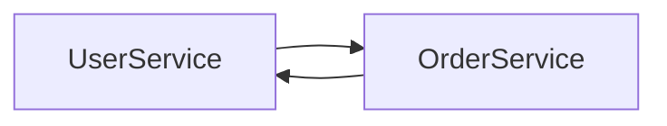
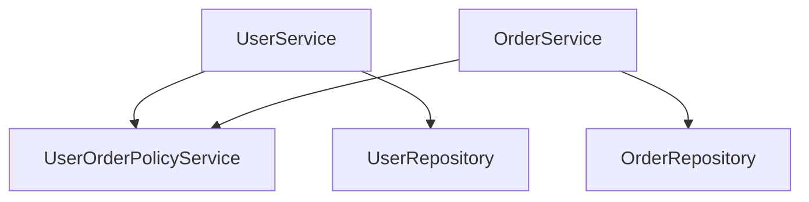
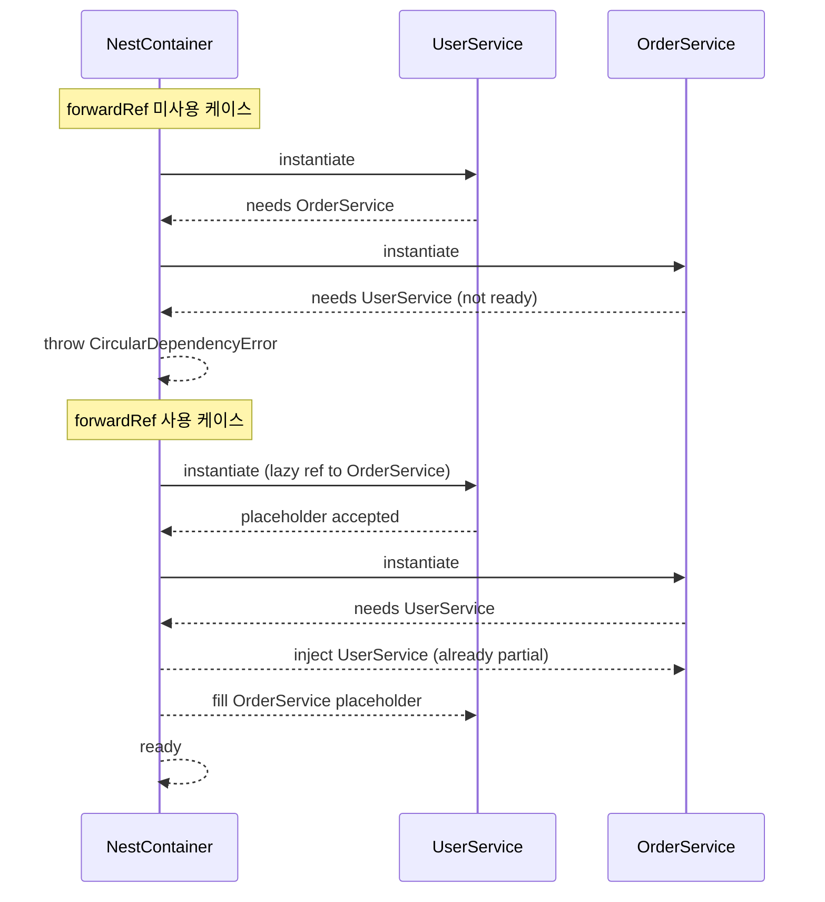

# NestJS 순환 의존성 해결 심화

NestJS에서 가장 흔하게 겪는 설계 문제가 순환 의존성(Circular Dependency)이다. 처음에는 깔끔하게 분리했던 모듈인데 시간이 지나면서 `UserService`가 `OrderService`를 부르고, `OrderService`가 다시 `UserService`를 부르는 식의 구조가 자연스럽게 만들어진다. 코드 리뷰에서 누가 잡아주지 않으면 한참 뒤에 `Nest can't resolve dependencies of the X` 같은 에러를 만나고서야 알아챈다.

순환 의존성은 단순히 에러를 회피하려고 `forwardRef`를 끼워 넣는 문제가 아니다. 대부분의 경우 도메인 경계가 잘못 그어진 신호다. `forwardRef`는 응급 처치이고, 진짜 해결은 의존성 방향을 다시 잡는 일이다. 이 글은 NestJS가 순환 의존성을 어떻게 인식하는지, `forwardRef`/`ModuleRef`/EventEmitter 같은 우회 수단의 동작 원리와 한계, 그리고 결국 리팩토링으로 가야 하는 이유를 정리한다.

---

## 1. 순환 의존성이 왜 NestJS에서 문제가 되는가

### 1.1 NestJS의 의존성 해결 순서

NestJS는 앱 부트스트랩 시점에 `IoC Container`를 만들고, 모든 프로바이더 인스턴스를 위상 정렬(topological sort) 순서로 생성한다. `UserService`가 `OrderService`를 생성자에서 받으려면, NestJS는 먼저 `OrderService` 인스턴스를 만들어야 한다. 반대도 마찬가지다.

```typescript
@Injectable()
export class UserService {
  constructor(private readonly orderService: OrderService) {}
}

@Injectable()
export class OrderService {
  constructor(private readonly userService: UserService) {}
}
```

위 코드는 부트스트랩 시점에 다음 에러를 던진다.

```
Nest cannot create the module instance. Often, this is because of a circular dependency
between modules. Use forwardRef() to avoid it.
```

`UserService`를 만들려면 `OrderService`가 있어야 하고, `OrderService`를 만들려면 `UserService`가 있어야 하니 둘 다 만들 수 없다. JavaScript 모듈 시스템의 순환 import와 다른 차원의 문제다. import는 hoisting과 lazy evaluation으로 어떻게든 굴러가지만, 생성자 주입은 인스턴스가 실제로 필요하기 때문에 회피가 불가능하다.

### 1.2 두 가지 순환 의존성 — 모듈 vs 프로바이더

NestJS에서 순환 의존성은 두 층위에서 발생한다.

| 구분 | 발생 위치 | 증상 |
|------|-----------|------|
| 모듈 순환 | `@Module({ imports: [...] })` | 모듈 자체가 서로 import |
| 프로바이더 순환 | 생성자 주입 | 클래스가 서로를 주입 |

모듈 순환은 `UserModule`이 `OrderModule`을 import하고, `OrderModule`이 다시 `UserModule`을 import할 때 발생한다. 이 경우 `forwardRef`로 양쪽 모두 감싸야 한다. 프로바이더 순환은 모듈은 분리돼 있어도 서비스끼리 서로를 주입할 때 생긴다. 둘 다 같은 에러 메시지가 나오기 때문에 어느 층위에서 터졌는지 먼저 구분해야 한다.

```typescript
// 모듈 순환
@Module({
  imports: [forwardRef(() => OrderModule)],
  providers: [UserService],
  exports: [UserService],
})
export class UserModule {}

@Module({
  imports: [forwardRef(() => UserModule)],
  providers: [OrderService],
  exports: [OrderService],
})
export class OrderModule {}
```

```typescript
// 프로바이더 순환
@Injectable()
export class UserService {
  constructor(
    @Inject(forwardRef(() => OrderService))
    private readonly orderService: OrderService,
  ) {}
}
```

---

## 2. forwardRef() — 동작 원리와 한계

### 2.1 forwardRef는 평가 시점을 늦춘다

`forwardRef`는 클래스 참조를 즉시 평가하지 않고 함수로 감싸 평가를 지연시키는 장치다. JavaScript는 클래스 선언이 hoisting되지 않기 때문에, 아직 선언되지 않은 클래스를 데코레이터 인자로 직접 쓰면 `undefined`가 들어간다. `forwardRef(() => OrderService)`는 `OrderService`가 선언될 때까지 평가를 미루기 때문에 컴파일 시점의 참조 문제는 해결된다.

핵심은 NestJS가 `forwardRef`로 표시된 의존성을 `LazyToken` 비슷한 형태로 컨테이너에 등록한다는 점이다. 컨테이너는 의존성 트리를 만들 때 이 토큰을 만나면 인스턴스 생성을 한 번 뒤로 미루고, 다른 의존성을 먼저 해결한 뒤 돌아와서 처리한다.

### 2.2 그럼에도 인스턴스는 어떻게 만드나

순환 의존성에서 가장 헷갈리는 부분이 "그래서 누가 먼저 만들어지는가"다. NestJS는 다음 순서를 따른다.

1. `UserService` 인스턴스를 만들기 시작한다. 의존성 `OrderService`는 `forwardRef`로 감싸져 있으므로 일단 빈 객체(proxy 비슷한 placeholder)를 주입한다.
2. `OrderService` 인스턴스를 만든다. 이때 `UserService`는 이미 만들어지고 있는 중이므로 실제 인스턴스를 주입한다.
3. 다시 `UserService`로 돌아와서, 1번 단계에서 placeholder를 채워 넣었던 `orderService` 프로퍼티에 실제 `OrderService` 인스턴스를 연결한다.

여기서 중요한 함정이 나온다. **`forwardRef`로 받은 서비스는 생성자 내부에서 즉시 사용할 수 없다**. 생성자가 실행되는 시점에는 아직 placeholder만 있을 수 있기 때문이다.

```typescript
@Injectable()
export class UserService {
  constructor(
    @Inject(forwardRef(() => OrderService))
    private readonly orderService: OrderService,
  ) {
    // 이 시점에 orderService.someMethod() 호출하면 TypeError
    // this.orderService.preloadCache(); // 위험
  }

  async findUserOrders(userId: string) {
    // 메서드 호출 시점에는 안전하다
    return this.orderService.findByUserId(userId);
  }
}
```

생성자에서 즉시 호출이 필요하다면 `OnModuleInit` 라이프사이클 훅으로 옮겨야 한다. 이 시점에는 의존성 그래프가 모두 해결된 상태다.

```typescript
@Injectable()
export class UserService implements OnModuleInit {
  constructor(
    @Inject(forwardRef(() => OrderService))
    private readonly orderService: OrderService,
  ) {}

  onModuleInit() {
    this.orderService.preloadCache();
  }
}
```

### 2.3 forwardRef의 진짜 한계

`forwardRef`로 에러는 사라지지만 설계 문제는 그대로 남는다. 실무에서 경험한 한계는 이런 것들이다.

**테스트가 복잡해진다.** `UserService` 단위 테스트를 짜려는데 `OrderService`를 mock으로 주입해야 한다. 그런데 `forwardRef`로 묶여 있어서 `Test.createTestingModule`에서 둘 다 등록하거나 한쪽을 stub으로 대체하는 보일러플레이트가 늘어난다. 의존성 그래프가 깊어질수록 테스트 셋업이 기하급수적으로 무거워진다.

**IDE의 타입 추적이 약해진다.** `@Inject(forwardRef(...))` 토큰은 정적 분석 도구가 추적하기 어렵다. "이 서비스를 누가 쓰고 있나"를 찾을 때 일반 주입보다 한 단계 더 살펴봐야 한다.

**런타임 오류 가능성이 남는다.** 위에서 설명한 생성자 즉시 호출 문제처럼, `forwardRef`는 "지연된 참조"라는 사실을 개발자가 계속 의식해야 한다. 코드를 작성하는 사람이 바뀌면 잊어버리고 생성자에서 호출하는 코드가 들어간다.

**모듈 경계의 의미가 흐려진다.** 모듈은 도메인 경계를 표현하는 단위인데, `forwardRef`가 끼면 "이 두 모듈은 사실 한 덩어리다"라는 신호다. 그런데도 분리된 채로 두면 새로 합류하는 개발자가 경계를 잘못 읽는다.

결론은 `forwardRef`는 리팩토링까지의 임시 다리로만 써야 한다는 것이다. 한 코드베이스에서 `forwardRef`가 다섯 군데를 넘어가면 도메인 설계를 의심해야 한다.

---

## 3. ModuleRef — 런타임 lazy lookup

### 3.1 ModuleRef.get()과 resolve()의 차이

`ModuleRef`는 NestJS가 제공하는 컨테이너 직접 접근 API다. 생성자 주입 대신 런타임에 필요할 때 인스턴스를 꺼내는 방식이라 순환 의존성을 우회하는 수단으로 자주 쓰인다.

```typescript
@Injectable()
export class UserService {
  constructor(private readonly moduleRef: ModuleRef) {}

  async findUserOrders(userId: string) {
    const orderService = this.moduleRef.get(OrderService, { strict: false });
    return orderService.findByUserId(userId);
  }
}
```

`get()`은 싱글톤 스코프 프로바이더만 가져올 수 있다. `strict: false` 옵션을 주면 현재 모듈 외부에서도 탐색한다. 기본값은 `strict: true`라서 같은 모듈에 등록된 프로바이더만 찾는다.

`resolve()`는 `REQUEST`/`TRANSIENT` 스코프 프로바이더를 가져올 때 쓴다. 새 인스턴스를 만들거나 요청 컨텍스트에 맞는 인스턴스를 반환한다.

```typescript
async createScopedHandler(contextId: ContextId) {
  const handler = await this.moduleRef.resolve(RequestHandler, contextId);
  return handler.handle();
}
```

| API | 반환 | 사용 시점 |
|-----|------|-----------|
| `get(token)` | 싱글톤 인스턴스 | 부트 이후 어느 시점이든 |
| `resolve(token)` | TRANSIENT/REQUEST 새 인스턴스 | 요청 처리 중 |
| `resolve(token, contextId)` | 특정 ContextId에 묶인 인스턴스 | 요청 컨텍스트 공유 |

### 3.2 ModuleRef 패턴이 깔끔한 경우

`ModuleRef`가 정당한 선택인 경우는 정해져 있다.

**플러그인/전략 패턴.** 런타임에 어떤 구현체를 쓸지 결정해야 하는 경우다. 예를 들어 결제 처리에서 카드사별로 다른 핸들러를 쓴다면, 카드 번호를 보고 핸들러를 골라 `moduleRef.get(handlerToken)`으로 꺼낸다. 이 경우 생성자에서 모든 핸들러를 주입받는 것보다 명확하다.

**Dynamic Module의 내부 위임.** 동적으로 등록된 프로바이더를 부르는 경우다.

**조건부로 드물게 호출되는 의존성.** 거의 안 쓰는데 생성자에 박혀 있으면 부담스러운 의존성을 lazy하게 부를 때.

### 3.3 ModuleRef 남용의 함정

순환 의존성 회피를 위한 `ModuleRef`는 대부분 안티패턴이다.

**암시적 의존성이 된다.** 생성자에 명시된 의존성은 클래스 정의만 봐도 무엇을 쓰는지 안다. `moduleRef.get()`은 메서드 본문에 숨어 있어서 grep해야 보인다. 의존성 그래프 분석이 어려워진다.

**타입 안전성이 약해진다.** `get<T>()`의 제네릭은 토큰이 문자열일 때 강제할 수 없다. 잘못된 토큰을 넣으면 런타임에서 `Nest cannot find element` 에러를 만난다.

**테스트가 더 어려워진다.** 단위 테스트에서 `ModuleRef`를 mock해야 하는데, `get()`이 호출될 때마다 정확히 어떤 토큰이 들어오는지 알고 stub해야 한다. 호출 누락은 런타임에서만 잡힌다.

순환 의존성 때문에 `ModuleRef`를 쓰고 있다면, 그 코드는 "도메인 분리가 안 되어 있다"라는 신호로 봐야 한다.

---

## 4. EventEmitter — 역방향 의존성 제거

### 4.1 의존성 방향을 끊는 발상

순환 의존성의 본질은 "양쪽이 서로를 직접 호출해야 한다"라는 가정이다. 이 가정을 깨면 의존성 자체가 사라진다. 이벤트 기반 통신은 한쪽이 발행하고 다른 쪽이 구독하는 구조라 호출자와 호출 대상이 컴파일 타임에 서로를 알 필요가 없다.

`User-Order` 케이스를 예로 본다. `UserService`가 사용자를 삭제할 때 그 사용자의 주문도 정리해야 한다고 하자. `OrderService`가 사용자 정보를 조회하기 위해 `UserService`를 주입하고 있다. 순환이 생긴다.

```typescript
// Before — 순환
@Injectable()
export class UserService {
  constructor(private readonly orderService: OrderService) {}

  async deleteUser(userId: string) {
    await this.orderService.archiveByUserId(userId);
    await this.userRepository.delete(userId);
  }
}

@Injectable()
export class OrderService {
  constructor(private readonly userService: UserService) {}

  async createOrder(userId: string, items: Item[]) {
    const user = await this.userService.findById(userId);
    if (!user.active) throw new Error('inactive user');
    return this.orderRepository.create({ userId, items });
  }
}
```

이걸 EventEmitter로 풀면 `UserService` → `OrderService` 방향만 남는다.

```typescript
// After — 한 방향만 남는다
@Injectable()
export class UserService {
  constructor(
    private readonly eventEmitter: EventEmitter2,
    private readonly userRepository: UserRepository,
  ) {}

  async deleteUser(userId: string) {
    await this.userRepository.delete(userId);
    this.eventEmitter.emit('user.deleted', { userId });
  }
}

@Injectable()
export class OrderService {
  constructor(private readonly userService: UserService) {}

  async createOrder(userId: string, items: Item[]) {
    const user = await this.userService.findById(userId);
    if (!user.active) throw new Error('inactive user');
    return this.orderRepository.create({ userId, items });
  }

  @OnEvent('user.deleted')
  async handleUserDeleted(payload: { userId: string }) {
    await this.orderRepository.archiveByUserId(payload.userId);
  }
}
```

`UserService`는 더 이상 `OrderService`를 모르고, 이벤트만 발행한다. `OrderService`는 자기 도메인 일을 하면서 사용자 삭제 이벤트가 오면 처리한다. 의존성은 한 방향이고, 다른 모듈도 같은 이벤트를 구독할 수 있다.

### 4.2 트랜잭션 경계가 깨지는 문제

EventEmitter가 만능은 아니다. 가장 큰 함정은 트랜잭션이다. 위 예제에서 `userRepository.delete()`는 성공했는데 `orderRepository.archiveByUserId()`가 실패하면 데이터가 어긋난다. 동기 메서드 호출이었다면 같은 트랜잭션 안에서 묶을 수 있었지만, 이벤트로 분리하면 별개 트랜잭션이 된다.

`@nestjs/event-emitter`의 기본 이벤트는 동기로 실행되긴 하지만, 이벤트 핸들러 내부에서 별도 DB 커넥션을 쓰면 같은 트랜잭션이 아니다. 트랜잭션 일관성이 중요한 경우는 두 가지 선택지가 있다.

**Outbox 패턴.** 사용자 삭제와 함께 같은 트랜잭션 안에서 `outbox` 테이블에 이벤트를 INSERT한다. 별도 워커가 outbox를 읽어서 처리한다. 메인 트랜잭션은 보장되고, 후속 처리는 결국 처리된다(eventually consistent).

**이벤트 emit을 commit 이후로 미루기.** TypeORM의 `@AfterTransactionCommit` 훅이나 별도 트랜잭션 wrapper로 commit이 끝난 뒤에 emit한다. 핸들러 실패는 별도로 복구 처리한다.

### 4.3 비동기 이벤트와 에러 처리

`@OnEvent('user.deleted', { async: true })` 같은 옵션이나 `emitAsync`를 쓰면 핸들러를 await할 수 있다. 그러나 핸들러에서 던진 예외가 emitter 호출자로 전파되는지 여부는 옵션에 따라 다르다. 운영에서 흔하게 겪는 문제가 "이벤트 핸들러에서 조용히 에러가 묻혀서 데이터가 어긋났는데 한참 뒤에 알게 되는" 케이스다. 핸들러 안에서는 반드시 try/catch + 로깅을 명시적으로 넣고, 가능하면 재시도 큐(BullMQ 등)로 위임하는 편이 안전하다.

```typescript
@OnEvent('user.deleted', { async: true })
async handleUserDeleted(payload: { userId: string }) {
  try {
    await this.orderRepository.archiveByUserId(payload.userId);
  } catch (e) {
    this.logger.error({ userId: payload.userId, err: e }, 'archive failed');
    await this.deadLetterQueue.add('archive-retry', payload);
  }
}
```

---

## 5. 모듈 분리 리팩토링 — 진짜 해결

### 5.1 공통 의존성을 별도 모듈로 분리

`UserService`와 `OrderService`가 서로 호출해야 하는 메서드가 사실은 둘 다 필요한 공통 유틸일 때가 많다. 예를 들어 "주문 가능한 사용자인지 확인"하는 로직은 `UserService`에 있고, "주문 통계"는 `OrderService`에 있다. 이걸 양쪽이 서로 주입해서 부르고 있다.



공통 로직을 별도 모듈로 빼면 의존성이 한 방향이 된다.



```typescript
// shared/user-order-policy.service.ts
@Injectable()
export class UserOrderPolicyService {
  constructor(
    private readonly userRepository: UserRepository,
    private readonly orderRepository: OrderRepository,
  ) {}

  async canPlaceOrder(userId: string): Promise<boolean> {
    const user = await this.userRepository.findById(userId);
    if (!user.active) return false;
    const recent = await this.orderRepository.countRecent(userId, '24h');
    return recent < 10;
  }
}
```

`UserService`와 `OrderService`는 이제 서로를 모르고, 둘 다 `UserOrderPolicyService`를 주입받아 쓴다. Repository 레이어에 직접 접근하는 점이 마음에 걸릴 수 있지만, 도메인 정책이 두 엔티티를 모두 알아야 한다면 그게 자연스럽다.

### 5.2 인터페이스 분리 — DIP 적용

`Auth-User` 케이스가 대표적이다. `AuthService`는 로그인을 처리하면서 `UserService`로 사용자 정보를 조회한다. `UserService`는 회원가입 시 비밀번호 해싱을 위해 `AuthService`를 부른다. 양방향 의존성이 생긴다.

```typescript
// 순환
@Injectable()
export class AuthService {
  constructor(private readonly userService: UserService) {}
}

@Injectable()
export class UserService {
  constructor(private readonly authService: AuthService) {}
}
```

이걸 인터페이스 분리(ISP/DIP)로 풀면, `UserService`는 `AuthService` 전체가 아니라 자기가 진짜 필요한 부분만 추상화한 인터페이스에 의존한다.

```typescript
// 도메인 인터페이스
export interface PasswordHasher {
  hash(plain: string): Promise<string>;
  verify(plain: string, hashed: string): Promise<boolean>;
}

export const PASSWORD_HASHER = Symbol('PasswordHasher');

// 구현체 (auth 모듈 안에 있어도 됨)
@Injectable()
export class BcryptPasswordHasher implements PasswordHasher {
  async hash(plain: string) { return bcrypt.hash(plain, 10); }
  async verify(plain: string, hashed: string) { return bcrypt.compare(plain, hashed); }
}

// UserService는 인터페이스에만 의존
@Injectable()
export class UserService {
  constructor(
    @Inject(PASSWORD_HASHER)
    private readonly hasher: PasswordHasher,
  ) {}

  async register(email: string, password: string) {
    const hashed = await this.hasher.hash(password);
    return this.userRepository.create({ email, password: hashed });
  }
}
```

`AuthService`는 `UserService`를 주입받아 사용자 조회만 한다. 한 방향 의존성이 된다. `BcryptPasswordHasher`는 `AuthModule`에서 `PASSWORD_HASHER` 토큰으로 등록하고 export하면 `UserModule`이 import해서 쓴다. 의존성 방향이 명확해진다.

### 5.3 도메인 이벤트로 약결합

대규모 도메인에서는 각 모듈이 자기 일만 처리하고, 다른 모듈에 영향을 주는 작업은 도메인 이벤트로 알리는 패턴이 자주 쓰인다. CQRS의 사이드 카처럼 동작한다.

```typescript
// 주문 생성 시 사용자 통계 업데이트
@Injectable()
export class OrderService {
  constructor(
    private readonly orderRepo: OrderRepository,
    private readonly eventBus: EventBus,
  ) {}

  async createOrder(userId: string, items: Item[]) {
    const order = await this.orderRepo.create({ userId, items });
    this.eventBus.publish(new OrderCreatedEvent(order));
    return order;
  }
}

// 사용자 모듈은 이벤트만 구독
@EventsHandler(OrderCreatedEvent)
export class UpdateUserOrderStatsHandler implements IEventHandler<OrderCreatedEvent> {
  constructor(private readonly userStatsService: UserStatsService) {}

  async handle(event: OrderCreatedEvent) {
    await this.userStatsService.incrementOrderCount(event.order.userId);
  }
}
```

이 구조에서는 `OrderModule`이 `UserModule`을 import할 필요가 없다. 도메인 이벤트는 양쪽 모두 알고 있는 공통 모듈에 정의된 인터페이스다. NestJS의 `@nestjs/cqrs` 패키지가 이 패턴을 표준화해서 제공한다.

---

## 6. 실전 케이스 진단 가이드

### 6.1 User ↔ Order

가장 흔한 순환이다. 표면적 증상으로는 "사용자 정보가 주문에 필요하고, 주문 정보가 사용자 화면에 필요하다"이다. 진단 질문은 이렇다.

- `OrderService.findByUserId()`는 `UserService`가 호출하는가, 아니면 컨트롤러가 호출하는가
- `UserService.findById()`를 `OrderService`가 정말 호출해야 하는가, 아니면 Repository 단에서 user_id만 알면 충분한가

대부분 컨트롤러가 두 서비스를 각각 부르면 끝난다. 한쪽 서비스가 다른 서비스의 메서드를 직접 부르는 건, 그 호출이 도메인 정책일 때만 정당하다. 그렇지 않으면 컨트롤러나 별도 facade 레이어로 옮긴다.

### 6.2 Auth ↔ User

`AuthService`가 사용자 조회를 위해 `UserService`를 부르는 건 자연스럽다. 문제는 반대 방향이다. `UserService`가 `AuthService.hashPassword()`를 부르고 있다면, 비밀번호 해싱은 사실 인증 도메인이 아니라 사용자 도메인의 일이다. 인증은 토큰 발급/검증/세션 관리에 집중해야 한다.

해결책은 `PasswordHasher` 같은 인터페이스를 도메인에 두고, 구현체가 어느 모듈에 있든 의존성 방향만 통일하는 것이다. 위 5.2 절의 패턴을 적용한다.

### 6.3 Notification ↔ 도메인 모듈

`OrderService`가 주문 완료 시 알림을 보내려고 `NotificationService`를 부르고, `NotificationService`가 사용자 설정 조회를 위해 `OrderService`나 `UserService`를 부르는 패턴이다. 이건 거의 항상 이벤트로 풀어야 한다. 알림은 비즈니스 로직의 본류가 아니라 부수 효과(side effect)이므로 비동기 이벤트로 분리해도 정합성에 문제가 없다.

### 6.4 진단 절차

순환 의존성이 감지되면 이 순서로 본다.

1. **호출 빈도와 방향을 그린다.** A → B 호출 메서드 목록과 B → A 호출 메서드 목록을 적어본다.
2. **부수 효과인지 본류인지 구분한다.** 부수 효과(알림/로깅/통계)는 이벤트로, 본류 로직은 도메인 재설계로.
3. **공통 의존성을 찾는다.** 두 서비스가 모두 쓰는 정책 로직이 있다면 분리한다.
4. **인터페이스 분리 가능성을 본다.** 한쪽이 다른 쪽의 작은 부분만 쓴다면 인터페이스 추출.
5. **그래도 풀리지 않으면 forwardRef.** 단, 회피책임을 코드 주석에 남기고 리팩토링 티켓을 같이 만든다.

---

## 7. 시퀀스로 보는 의존성 해결



`forwardRef`는 컨테이너가 인스턴스 생성을 "한 사이클 뒤로 미루는" 메커니즘이다. 양쪽이 모두 `forwardRef`로 표시되어 있어야 컨테이너가 placeholder 단계를 인식한다. 한쪽만 표시하면 여전히 에러가 난다.

---

## 8. 실무에서 정착시킨 규칙

운영 중인 NestJS 코드베이스에서 순환 의존성을 관리하기 위해 정착시킨 규칙들이다.

**ESLint로 forwardRef 사용을 추적한다.** `forwardRef` 사용 위치를 lint warn 수준으로 잡고, 새로 추가될 때마다 코드 리뷰에서 정당성을 따진다. 무분별한 확산을 막는다.

**모듈 의존성 그래프를 시각화한다.** `madge` 같은 도구로 import 순환을 빌드 단계에서 잡는다. NestJS 모듈 데코레이터까지 분석하는 도구는 부족하지만, import 레벨의 순환만 잡아도 80%는 잡힌다.

**도메인 이벤트를 우선 검토한다.** 두 서비스 사이에 새 호출이 생길 때 "이게 정말 동기 호출이어야 하는가, 이벤트로 풀 수 있는가"를 먼저 묻는다. 트랜잭션 일관성이 필요한 경우만 동기 호출, 나머지는 이벤트로.

**`forwardRef`는 코드 주석에 만료일을 적는다.** `// FIXME(2026-Q2): forwardRef removal — split policy into shared module` 같이. 시간이 지나면서 자연스럽게 정리되도록 한다.

순환 의존성은 NestJS의 결함이 아니라 도메인 설계의 시그널이다. `forwardRef`/`ModuleRef`/EventEmitter는 모두 정당한 도구지만, 본질적 해결은 모듈 경계를 다시 그리고 의존성 방향을 한쪽으로 통일하는 일이다. 코드베이스에서 우회 수단이 늘어나기 시작하면, 그게 리팩토링 타이밍이다.
