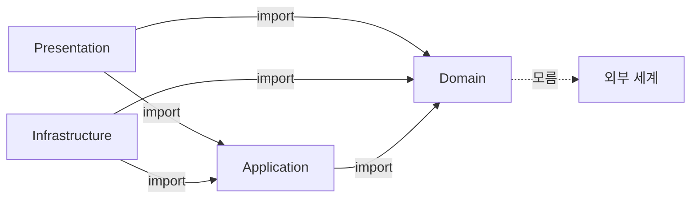

# NestJS에 Clean Architecture 입히기

NestJS는 Module/Controller/Service/Repository 4단을 기본으로 가정한다. 작은 서비스에서는 이대로 충분하다. 그런데 도메인 로직이 한 화면에서 시작해 다른 화면, 큐 컨슈머, 배치, gRPC, 어드민 API로 번지기 시작하면 표준 3계층은 빠르게 휘어진다. Service 안에 HTTP가 흘러들고, TypeORM Entity가 비즈니스 규칙을 책임지고, 트랜잭션이 Controller까지 올라오는 식이다.

Clean Architecture는 그 시점을 늦추거나, 적어도 늦출 수 있는 단단한 선을 그어 준다. 이 문서는 표준 3계층([Nest_JS_Standard_Architecture.md](./Nest_JS_Standard_Architecture.md))과 언어 중립적 이론([Clean_Architecture.md](../../../Architecture/Clean_Architecture.md))을 이미 읽었다는 전제로, NestJS의 모듈·DI·데코레이터를 Clean Architecture 동심원에 어떻게 끼워 맞추는지를 다룬다. 예제는 처음부터 끝까지 주문/결제 도메인 하나로 간다.

---

## 1. 무엇을 풀려고 하는가

표준 NestJS 구조에서 자주 마주치는 신호 몇 가지를 먼저 본다. 이게 보이기 시작하면 Clean Architecture를 검토할 시점이다.

- Service 메서드 하나에 `@nestjs/common`, `@nestjs/typeorm`, `axios`, `bullmq`, `aws-sdk`가 동시에 import 되어 있다.
- 같은 도메인 규칙이 Controller, Cron, BullMQ Consumer 세 군데에 비슷한 모양으로 박혀 있다.
- TypeORM Entity 안에 `if (this.status === 'paid' && this.amount > ...)` 같은 규칙이 들어가 있고, Service에서 또 같은 검증을 반복한다.
- 단위 테스트가 사실상 통합 테스트다. Service 하나를 켜려면 데이터베이스, Redis, 외부 API 더블이 다 떠 있어야 한다.
- 트랜잭션을 어디서 시작해야 하는지 매번 헷갈린다. `@Transactional()` 데코레이터를 만들어 봤지만 비동기 흐름에서 깨진다.

Clean Architecture가 직접 풀어주는 건 두 가지다. **도메인 규칙을 한 곳에 모은다.** **외부 세계와의 접점(Adapter)을 갈아끼울 수 있는 구멍(Port)으로 만든다.** 나머지(폴더 구조, 네이밍, 추상 클래스 vs Symbol)는 부산물이다.

---

## 2. NestJS 모듈 시스템과 동심원 매핑

Clean Architecture의 동심원은 안쪽부터 Entity → Use Case → Interface Adapter → Framework & Driver 순으로 그려진다. NestJS의 모듈 시스템은 이 원과 정확히 일치하지는 않는다. 어떻게 대응시킬지 먼저 정해야 폴더 구조와 DI 토큰 설계가 흔들리지 않는다.

### 2.1 동심원과 NestJS 요소의 대응

| 동심원 레이어 | NestJS에서 차지하는 자리 | 데코레이터 사용 |
|---|---|---|
| Entity (Enterprise Business Rules) | 순수 TS 클래스, `class-validator`도 안 쓴다 | 일절 없음 |
| Use Case (Application Business Rules) | `@Injectable()` Service로 노출하지만 NestJS 외 다른 데코레이터는 쓰지 않는다 | `@Injectable()` 한 줄만 |
| Interface Adapter | Controller, Repository 어댑터, Mapper, Presenter | 자유롭게 사용 |
| Framework & Driver | Module, main.ts, TypeORM 설정, Bull 큐 등록 | 자유롭게 사용 |

NestJS Module은 어디에 속하느냐. 결론부터 말하면 가장 바깥 원이다. Module은 "어떤 클래스를 어떤 토큰으로 묶어 컨테이너에 등록할 것인가"를 선언하는 곳이지 비즈니스 규칙과 무관하다. Module 파일은 항상 `infrastructure/` 또는 별도 진입점에 둔다. Domain과 UseCase 폴더에는 Module 파일이 없어야 한다.

### 2.2 의존성 규칙을 NestJS에서 강제하는 법

Clean Architecture의 핵심 규칙은 "안쪽이 바깥쪽을 모른다"이다. TypeScript와 NestJS에서는 두 가지 방법으로 강제한다.

**ESLint `no-restricted-imports`**로 도메인 폴더에서 `@nestjs/*`, `typeorm`, `axios` 등을 import 못 하게 막는다.

```javascript
// .eslintrc.js
module.exports = {
  overrides: [
    {
      files: ['src/**/domain/**/*.ts', 'src/**/application/**/*.ts'],
      rules: {
        'no-restricted-imports': ['error', {
          patterns: [
            { group: ['@nestjs/*'], message: 'Domain/UseCase는 NestJS에 의존하지 않는다' },
            { group: ['typeorm', '@nestjs/typeorm'], message: 'ORM은 infrastructure에서만' },
            { group: ['axios', 'node-fetch'], message: 'HTTP 클라이언트는 adapter에서만' },
          ],
        }],
      },
    },
    {
      files: ['src/**/domain/**/*.ts'],
      rules: {
        'no-restricted-imports': ['error', {
          patterns: [
            { group: ['../application/*', '../infrastructure/*', '../presentation/*'] },
          ],
        }],
      },
    },
  ],
};
```

이 한 줄이 없으면 6개월 뒤 누군가가 도메인 Entity에 `@Entity()` 데코레이터를 슬쩍 붙여 놓을 가능성이 100%다. 사람이 막을 수 있는 수준이 아니다.

**Use Case는 `@Injectable()`만 허용**한다. `@Controller()`, `@UseGuards()`, `@UseInterceptors()`가 Use Case에 붙어 있다면 그건 Use Case가 아니라 Controller에 살짝 분장한 Adapter다. PR 리뷰에서 잡거나 ESLint custom rule로 막는다.

### 2.3 4계층 의존성 방향을 한 장으로

이론을 글로 풀면 머리에서 안 잡힌다. 화살표 하나로 본다. 화살표는 "컴파일 타임 import 방향"이다.



다섯 가지만 기억하면 된다.

- Domain은 누구도 import 하지 않는다. `node_modules`도 안 본다. `crypto`, `axios`, `typeorm` 모두 금지.
- Application은 Domain만 import 한다. NestJS는 `@nestjs/common`의 `Injectable`, `Inject`만 허용한다.
- Infrastructure는 Application의 Port를 `implements` 한다. Application → Infrastructure가 아니라 Infrastructure → Application 방향이다. 이게 의존성 역전(Dependency Inversion)의 실체다.
- Presentation은 Application의 UseCase를 직접 부른다. Domain 객체를 응답으로 노출하지 않는다.
- Domain ↔ Infrastructure는 직접 화살표가 없다. Mapper가 둘을 연결하되 Mapper 자체는 Infrastructure에 산다.

런타임에서는 Infrastructure가 Application의 Port 구현체로 주입되므로 호출 흐름은 Presentation → Application → Infrastructure로 흐른다. 컴파일 의존과 런타임 호출 방향이 반대인 게 의존성 역전이다. 이 한 줄이 안 들어오면 Clean Architecture 전체가 이론으로만 보인다.

---

## 3. 폴더 구조 — feature/layer/동심원 셋의 절충

폴더 구조는 정답이 없다. 세 가지를 비교한 다음 실무에서 잘 굳는 모양을 보여준다.

### 3.1 Layer-first (NestJS 표준 변형)

```
src/
├── controllers/
├── services/
├── repositories/
└── entities/
```

장점: 진입 장벽이 낮다. 단점: 도메인이 늘어나면 한 도메인을 수정할 때 네 폴더를 오간다. Clean Architecture와는 가장 거리가 멀다. 권장하지 않는다.

### 3.2 Feature-first (도메인 모듈 기반)

```
src/
├── orders/
│   ├── orders.module.ts
│   ├── orders.controller.ts
│   ├── orders.service.ts
│   └── orders.repository.ts
├── payments/
└── users/
```

NestJS 공식 문서가 권장하는 형태다. 단순 CRUD 위주 서비스에서는 이게 가장 빠르고 깔끔하다. Clean Architecture 흉내는 안 내고 그냥 모듈 안에서 책임을 나눈다.

### 3.3 동심원(Concentric) 구조

본격 Clean Architecture는 도메인 모듈 안을 다시 동심원으로 나눈다.

```
src/
├── orders/
│   ├── domain/
│   │   ├── entities/
│   │   │   └── order.ts                # 순수 TS, 데코레이터 없음
│   │   ├── value-objects/
│   │   │   ├── money.ts
│   │   │   └── order-status.ts
│   │   ├── events/
│   │   │   └── order-placed.event.ts
│   │   └── errors/
│   │       └── insufficient-stock.error.ts
│   ├── application/
│   │   ├── use-cases/
│   │   │   ├── place-order.use-case.ts
│   │   │   └── cancel-order.use-case.ts
│   │   ├── ports/
│   │   │   ├── inbound/
│   │   │   │   └── place-order.port.ts
│   │   │   └── outbound/
│   │   │       ├── order-repository.port.ts
│   │   │       ├── payment-gateway.port.ts
│   │   │       └── event-publisher.port.ts
│   │   └── dto/
│   │       └── place-order.command.ts
│   ├── infrastructure/
│   │   ├── persistence/
│   │   │   ├── orm/
│   │   │   │   └── order.orm-entity.ts # TypeORM @Entity
│   │   │   ├── mappers/
│   │   │   │   └── order.mapper.ts
│   │   │   └── repositories/
│   │   │       └── order-typeorm.repository.ts
│   │   ├── http/
│   │   │   └── stripe-payment-gateway.adapter.ts
│   │   └── messaging/
│   │       └── bullmq-event-publisher.adapter.ts
│   ├── presentation/
│   │   ├── controllers/
│   │   │   └── orders.controller.ts
│   │   ├── dto/
│   │   │   └── place-order.request.dto.ts
│   │   └── presenters/
│   │       └── order.presenter.ts
│   └── orders.module.ts                # 가장 바깥, 와이어링 전담
└── shared/
    └── kernel/                         # 도메인 공통 (Money, Id 등)
```

이 구조의 장점은 PR 리뷰가 쉬워진다는 점이다. `domain/`에 들어간 diff가 NestJS를 import 하면 즉시 의심한다. `infrastructure/`만 변경된 PR은 비즈니스 규칙 변경이 아니라는 신호다.

각 폴더가 가지는 의존성을 표로 정리하면 PR 리뷰가 더 빨라진다.

| 폴더 | 허용 의존성 | 금지 의존성 | 빌드 시점 검증 방법 |
|---|---|---|---|
| `domain/` | 같은 도메인의 `domain/`, `shared/kernel/` | NestJS, ORM, HTTP 클라이언트, 다른 도메인 폴더 전체 | ESLint `no-restricted-imports` 패턴 |
| `application/` | 자기 도메인 `domain/`, `@nestjs/common`(Injectable, Inject만), 다른 도메인의 `application/ports/inbound/` | `@nestjs/typeorm`, `axios`, `bullmq`, ORM Entity | ESLint + 모듈 단위 정적 분석 |
| `infrastructure/` | 자기 도메인 `application/ports/outbound/`, ORM/큐/HTTP 라이브러리 | 다른 도메인의 `domain/` 또는 `infrastructure/` | 패키지 경계(monorepo)로 보강 |
| `presentation/` | 자기 도메인 `application/use-cases/`, `application/dto/`, `class-validator` | ORM Entity, Repository 구현체 직접 import | ESLint custom rule |

`presentation/`이 ORM Entity를 직접 import 하는 PR이 가장 흔한 사고다. "DTO 만들기 귀찮다, Entity 그대로 반환하자"의 유혹이 매번 온다. 사용자 비밀번호 해시가 응답에 섞여 나간 사고는 거의 다 여기서 시작한다.

### 3.4 Monorepo에서의 절충

Nx, Turborepo 같은 monorepo로 갈 때는 동심원을 패키지 경계로 끌어올린다.

```
apps/
└── api/
    └── src/
        └── main.ts
libs/
├── orders/
│   ├── domain/        # @ygstudy/orders-domain (의존: 없음)
│   ├── application/   # @ygstudy/orders-application (의존: domain)
│   ├── infrastructure/# @ygstudy/orders-infrastructure (의존: application, domain)
│   └── presentation/  # @ygstudy/orders-presentation (의존: application)
└── shared/
    └── kernel/        # @ygstudy/kernel
```

`package.json` 또는 `tsconfig.json`의 `paths`로 의존 방향을 막을 수 있다. ESLint `boundaries` 플러그인이 더 강력하다. 다만 모듈 4개씩 도메인마다 만들면 도메인 5개에 패키지 20개가 된다. 도메인이 10개 미만이면 단일 패키지 안에서 폴더 동심원만 쓰는 게 더 가볍다. 패키지 분리는 정말로 다른 팀이 다른 도메인을 소유하기 시작할 때 한다.

---

## 4. Domain 레이어 — 데코레이터 없는 순수 TS

Domain 레이어는 NestJS와 무관하게 돌아간다. `npm test domain/` 하나로 NestJS 부트스트랩 없이 ms 단위로 테스트가 끝나야 한다. 그러려면 데코레이터, DI, 외부 라이브러리를 다 끊는다.

### 4.1 Value Object

Value Object는 ID도 없고, 같은 값이면 같은 객체다. 생성자에서 불변식을 검증하고 한번 만들어지면 못 바꾼다.

```typescript
// src/orders/domain/value-objects/money.ts
export class Money {
  private constructor(
    public readonly amount: number,
    public readonly currency: string,
  ) {}

  static of(amount: number, currency: string): Money {
    if (!Number.isFinite(amount)) {
      throw new Error('Money amount must be finite');
    }
    if (amount < 0) {
      throw new Error('Money amount must be non-negative');
    }
    if (!/^[A-Z]{3}$/.test(currency)) {
      throw new Error(`Invalid currency code: ${currency}`);
    }
    return new Money(Math.round(amount * 100) / 100, currency);
  }

  add(other: Money): Money {
    this.assertSameCurrency(other);
    return Money.of(this.amount + other.amount, this.currency);
  }

  multiply(factor: number): Money {
    return Money.of(this.amount * factor, this.currency);
  }

  equals(other: Money): boolean {
    return this.amount === other.amount && this.currency === other.currency;
  }

  private assertSameCurrency(other: Money): void {
    if (this.currency !== other.currency) {
      throw new Error(`Currency mismatch: ${this.currency} vs ${other.currency}`);
    }
  }
}
```

생성자를 `private`로 막고 `static of`로 받는 이유는 단 하나, 유효하지 않은 Money 객체가 시스템 안에 못 들어오게 하기 위해서다. `new Money(-1, 'KRW')`가 가능하면 검증 책임이 호출자에게 흩어진다.

### 4.2 Entity

Entity는 식별자가 있고, 같은 ID면 다른 상태여도 같은 객체로 본다. 도메인 규칙은 여기 들어간다.

```typescript
// src/orders/domain/entities/order.ts
import { Money } from '../value-objects/money';
import { OrderStatus } from '../value-objects/order-status';
import { OrderLine } from '../value-objects/order-line';
import { InsufficientStockError } from '../errors/insufficient-stock.error';
import { InvalidOrderStateError } from '../errors/invalid-order-state.error';

export class Order {
  private constructor(
    public readonly id: string,
    public readonly customerId: string,
    private _lines: OrderLine[],
    private _status: OrderStatus,
    private _placedAt: Date | null,
  ) {}

  static place(params: {
    id: string;
    customerId: string;
    lines: OrderLine[];
    now: Date;
  }): Order {
    if (params.lines.length === 0) {
      throw new InvalidOrderStateError('주문 라인이 하나 이상 필요하다');
    }
    return new Order(
      params.id,
      params.customerId,
      params.lines,
      OrderStatus.PLACED,
      params.now,
    );
  }

  static restore(snapshot: {
    id: string;
    customerId: string;
    lines: OrderLine[];
    status: OrderStatus;
    placedAt: Date | null;
  }): Order {
    return new Order(
      snapshot.id,
      snapshot.customerId,
      snapshot.lines,
      snapshot.status,
      snapshot.placedAt,
    );
  }

  pay(): void {
    if (this._status !== OrderStatus.PLACED) {
      throw new InvalidOrderStateError(
        `결제 가능한 상태가 아니다: ${this._status.value}`,
      );
    }
    this._status = OrderStatus.PAID;
  }

  cancel(reason: string): void {
    if (this._status === OrderStatus.CANCELLED) {
      throw new InvalidOrderStateError('이미 취소된 주문이다');
    }
    if (this._status === OrderStatus.SHIPPED) {
      throw new InvalidOrderStateError('배송 시작된 주문은 취소할 수 없다');
    }
    this._status = OrderStatus.CANCELLED;
  }

  total(): Money {
    return this._lines.reduce(
      (sum, line) => sum.add(line.subtotal()),
      Money.of(0, this._lines[0].unitPrice.currency),
    );
  }

  get status(): OrderStatus {
    return this._status;
  }

  get lines(): readonly OrderLine[] {
    return this._lines;
  }

  get placedAt(): Date | null {
    return this._placedAt;
  }
}
```

핵심은 세 가지다.

- `place()`와 `restore()`를 분리한다. `place()`는 새 주문을 만들 때, `restore()`는 DB에서 읽어 객체를 복원할 때 쓴다. 이 분리가 없으면 DB 복원 과정에서 `place()`의 검증 로직(주문 라인 1개 이상)이 또 돌아 무의미한 오버헤드가 생긴다.
- 상태 전이는 메서드로만 가능하다. `_status`는 `private`이고 외부에서 직접 못 바꾼다. `pay()`, `cancel()` 같은 메서드 안에서만 바뀐다.
- `_lines`를 외부로 노출할 때 `readonly OrderLine[]`로 내보낸다. 호출자가 `lines.push(...)` 같은 짓을 못 하게 막는다.

### 4.3 Domain Error

도메인 에러는 `Error`를 상속한 일반 클래스로 둔다. `HttpException`을 상속하지 않는다. HTTP는 도메인이 알 일이 아니다.

```typescript
// src/orders/domain/errors/insufficient-stock.error.ts
export class InsufficientStockError extends Error {
  readonly code = 'INSUFFICIENT_STOCK';

  constructor(productId: string, requested: number, available: number) {
    super(
      `재고 부족: productId=${productId}, requested=${requested}, available=${available}`,
    );
  }
}
```

HTTP로 변환하는 책임은 NestJS Exception Filter가 진다([Nest_JS_Exception_Filters.md](./Nest_JS_Exception_Filters.md) 참고). 같은 에러를 큐 컨슈머에서 받으면 DLQ로, gRPC에서 받으면 status code로 매핑된다.

---

## 5. UseCase — Injectable Service로 노출하되 도메인 규칙은 Entity에

UseCase는 한 가지 시나리오를 끝까지 책임진다. "주문하기", "주문 취소하기", "결제 완료 처리하기"가 각각 하나의 UseCase다. NestJS에서는 `@Injectable()`을 붙여 DI 컨테이너에 등록한다.

```typescript
// src/orders/application/use-cases/place-order.use-case.ts
import { Inject, Injectable } from '@nestjs/common';
import { Order } from '../../domain/entities/order';
import { OrderLine } from '../../domain/value-objects/order-line';
import { Money } from '../../domain/value-objects/money';
import { PlaceOrderCommand } from '../dto/place-order.command';
import {
  ORDER_REPOSITORY,
  OrderRepositoryPort,
} from '../ports/outbound/order-repository.port';
import {
  PRODUCT_INVENTORY,
  ProductInventoryPort,
} from '../ports/outbound/product-inventory.port';
import {
  EVENT_PUBLISHER,
  EventPublisherPort,
} from '../ports/outbound/event-publisher.port';
import {
  ID_GENERATOR,
  IdGeneratorPort,
} from '../ports/outbound/id-generator.port';
import {
  CLOCK,
  ClockPort,
} from '../ports/outbound/clock.port';
import { OrderPlacedEvent } from '../../domain/events/order-placed.event';

@Injectable()
export class PlaceOrderUseCase {
  constructor(
    @Inject(ORDER_REPOSITORY) private readonly orders: OrderRepositoryPort,
    @Inject(PRODUCT_INVENTORY) private readonly inventory: ProductInventoryPort,
    @Inject(EVENT_PUBLISHER) private readonly publisher: EventPublisherPort,
    @Inject(ID_GENERATOR) private readonly idGen: IdGeneratorPort,
    @Inject(CLOCK) private readonly clock: ClockPort,
  ) {}

  async execute(command: PlaceOrderCommand): Promise<{ orderId: string }> {
    const reservations = await this.inventory.reserve(
      command.items.map((i) => ({ productId: i.productId, quantity: i.quantity })),
    );

    const lines = reservations.map((r) =>
      OrderLine.of({
        productId: r.productId,
        quantity: r.quantity,
        unitPrice: Money.of(r.unitPrice, r.currency),
      }),
    );

    const order = Order.place({
      id: this.idGen.next(),
      customerId: command.customerId,
      lines,
      now: this.clock.now(),
    });

    await this.orders.save(order);

    await this.publisher.publish(
      new OrderPlacedEvent({
        orderId: order.id,
        customerId: order.customerId,
        total: order.total(),
        occurredAt: this.clock.now(),
      }),
    );

    return { orderId: order.id };
  }
}
```

여기서 자주 헷갈리는 지점.

**UseCase에 비즈니스 규칙을 넣지 않는다.** 위 코드에서 "주문 라인이 1개 이상이어야 한다"라는 규칙은 UseCase가 아니라 `Order.place()` 안에 있다. UseCase는 그냥 도메인 객체를 만들고 저장하는 흐름 조립만 한다. 같은 도메인 규칙을 다른 UseCase(예: 어드민이 강제 주문 생성)에서도 똑같이 적용하려면 규칙이 Entity 안에 있어야 재사용된다.

**시계와 ID 생성기도 Port로 뺀다.** `new Date()`와 `crypto.randomUUID()`를 UseCase에서 직접 부르면 테스트할 때 시간을 고정할 수 없다. 작은 인터페이스지만 테스트 가능성이 완전히 달라진다.

**`@Injectable()` 외에 NestJS 데코레이터는 일절 없다.** UseCase를 큐 컨슈머나 스케줄러에서 그대로 쓸 수 있어야 한다. `@UseGuards()`, `@Roles()`가 붙어 있으면 그건 HTTP에서만 쓸 수 있는 코드다.

---

## 6. Port — DI 토큰으로 정의하기

NestJS의 DI는 TypeScript 인터페이스를 직접 토큰으로 못 쓴다. 인터페이스는 런타임에 사라지기 때문이다. 두 가지 선택지가 있다.

### 6.1 Symbol + interface

```typescript
// src/orders/application/ports/outbound/order-repository.port.ts
import { Order } from '../../../domain/entities/order';

export const ORDER_REPOSITORY = Symbol('OrderRepositoryPort');

export interface OrderRepositoryPort {
  save(order: Order): Promise<void>;
  findById(id: string): Promise<Order | null>;
  findByCustomer(customerId: string): Promise<Order[]>;
}
```

가볍다. 인터페이스라 타입만 남고 런타임 코드가 없다. 다만 `@Inject(ORDER_REPOSITORY)`를 항상 명시해야 한다.

### 6.2 abstract class

```typescript
export abstract class OrderRepositoryPort {
  abstract save(order: Order): Promise<void>;
  abstract findById(id: string): Promise<Order | null>;
  abstract findByCustomer(customerId: string): Promise<Order[]>;
}
```

abstract class를 토큰으로 그대로 쓸 수 있다. `@Inject` 없이 `constructor(private orders: OrderRepositoryPort)`만으로 주입된다. 깔끔하지만 런타임에 클래스가 남아 트리쉐이킹이 살짝 나빠지고, 인터페이스만 노출하고 싶을 때 강제로 클래스 모양이 된다.

실무에서는 둘 다 본다. 팀에서 하나로 통일하면 된다. 개인적으로는 Symbol을 선호한다. Port의 의미가 "런타임 객체 없이 그냥 계약"이라는 게 더 명확해진다.

### 6.3 Module에서 useClass로 바인딩

```typescript
// src/orders/orders.module.ts
import { Module } from '@nestjs/common';
import { TypeOrmModule } from '@nestjs/typeorm';
import { PlaceOrderUseCase } from './application/use-cases/place-order.use-case';
import { ORDER_REPOSITORY } from './application/ports/outbound/order-repository.port';
import { EVENT_PUBLISHER } from './application/ports/outbound/event-publisher.port';
import { CLOCK } from './application/ports/outbound/clock.port';
import { ID_GENERATOR } from './application/ports/outbound/id-generator.port';
import { OrderTypeOrmRepository } from './infrastructure/persistence/repositories/order-typeorm.repository';
import { OrderOrmEntity } from './infrastructure/persistence/orm/order.orm-entity';
import { BullMqEventPublisher } from './infrastructure/messaging/bullmq-event-publisher.adapter';
import { SystemClock } from './infrastructure/system-clock';
import { UuidGenerator } from './infrastructure/uuid-generator';
import { OrdersController } from './presentation/controllers/orders.controller';

@Module({
  imports: [TypeOrmModule.forFeature([OrderOrmEntity])],
  controllers: [OrdersController],
  providers: [
    PlaceOrderUseCase,
    { provide: ORDER_REPOSITORY, useClass: OrderTypeOrmRepository },
    { provide: EVENT_PUBLISHER, useClass: BullMqEventPublisher },
    { provide: CLOCK, useClass: SystemClock },
    { provide: ID_GENERATOR, useClass: UuidGenerator },
  ],
  exports: [PlaceOrderUseCase],
})
export class OrdersModule {}
```

Module 파일이 사실상 "이 도메인의 모든 Adapter 바인딩표"가 된다. 테스트에서는 같은 모듈을 `overrideProvider`로 갈아끼우거나, 별도의 TestModule을 만들어 in-memory 구현을 끼운다.

Inbound Port(예: `PlaceOrderPort`)도 같은 방식으로 만들 수 있다. Controller가 UseCase 클래스를 직접 의존하면 안 되는 강한 규율을 유지하고 싶을 때 쓴다. 다만 실무에서 Inbound Port는 거의 안 만든다. UseCase 클래스 자체가 곧 Inbound 계약 역할을 하고, 한 UseCase에 구현체가 둘 이상 붙는 경우가 드물기 때문이다. 정말 필요한 곳(예: 결제 처리에 sandbox/production 분기)에만 만든다.

---

## 7. TypeORM Entity vs Domain Entity, 그리고 Mapper

이 분리가 Clean Architecture를 NestJS에 입힐 때 가장 큰 인지 부담이다. "왜 Entity가 두 개나 있어야 하지?"라는 질문이 PR 리뷰에서 매번 나온다. 답은 단순하다. 두 Entity의 책임이 다르기 때문이다.

| 구분 | Domain Entity (`Order`) | ORM Entity (`OrderOrmEntity`) |
|---|---|---|
| 책임 | 비즈니스 규칙, 상태 전이, 불변식 | 테이블 매핑, 컬럼 타입, 인덱스 |
| 의존 | 없음 (순수 TS) | `typeorm`, 데이터베이스 스키마 |
| 변경 이유 | 도메인 규칙이 바뀔 때 | 테이블 구조나 인덱스가 바뀔 때 |

### 7.1 ORM Entity

```typescript
// src/orders/infrastructure/persistence/orm/order.orm-entity.ts
import {
  Column,
  Entity,
  Index,
  OneToMany,
  PrimaryColumn,
} from 'typeorm';
import { OrderLineOrmEntity } from './order-line.orm-entity';

@Entity({ name: 'orders' })
@Index(['customerId', 'placedAt'])
export class OrderOrmEntity {
  @PrimaryColumn({ type: 'uuid' })
  id!: string;

  @Column({ type: 'uuid' })
  customerId!: string;

  @Column({ type: 'varchar', length: 20 })
  status!: string;

  @Column({ type: 'timestamptz', nullable: true })
  placedAt!: Date | null;

  @OneToMany(() => OrderLineOrmEntity, (line) => line.order, {
    cascade: true,
    eager: true,
  })
  lines!: OrderLineOrmEntity[];
}
```

상태를 그냥 `string`으로 둔다. Domain의 `OrderStatus` Value Object와 DB의 `varchar`는 분리되어 있다. 컬럼 인덱스, cascade 설정, lazy/eager 같은 영속성 관심사가 여기 들어간다.

### 7.2 Mapper

```typescript
// src/orders/infrastructure/persistence/mappers/order.mapper.ts
import { Order } from '../../../domain/entities/order';
import { OrderStatus } from '../../../domain/value-objects/order-status';
import { OrderLine } from '../../../domain/value-objects/order-line';
import { Money } from '../../../domain/value-objects/money';
import { OrderOrmEntity } from '../orm/order.orm-entity';
import { OrderLineOrmEntity } from '../orm/order-line.orm-entity';

export class OrderMapper {
  static toDomain(orm: OrderOrmEntity): Order {
    return Order.restore({
      id: orm.id,
      customerId: orm.customerId,
      status: OrderStatus.of(orm.status),
      placedAt: orm.placedAt,
      lines: orm.lines.map((l) =>
        OrderLine.of({
          productId: l.productId,
          quantity: l.quantity,
          unitPrice: Money.of(Number(l.unitPriceAmount), l.unitPriceCurrency),
        }),
      ),
    });
  }

  static toOrm(order: Order): OrderOrmEntity {
    const orm = new OrderOrmEntity();
    orm.id = order.id;
    orm.customerId = order.customerId;
    orm.status = order.status.value;
    orm.placedAt = order.placedAt;
    orm.lines = order.lines.map((line) => {
      const lineOrm = new OrderLineOrmEntity();
      lineOrm.productId = line.productId;
      lineOrm.quantity = line.quantity;
      lineOrm.unitPriceAmount = line.unitPrice.amount;
      lineOrm.unitPriceCurrency = line.unitPrice.currency;
      return lineOrm;
    });
    return orm;
  }
}
```

이 Mapper가 거추장스럽게 느껴진다면 그 감각은 정확하다. 작은 도메인에서는 이게 비용이다. 그런데 도메인 규칙이 50개를 넘어가는 시점부터 손익분기를 넘는다. ORM Entity에 직접 `pay()`, `cancel()`을 박아두면 DB 컬럼 추가 한 번이 비즈니스 규칙 테스트 100개를 다시 돌리게 만든다.

### 7.3 Repository Adapter

```typescript
// src/orders/infrastructure/persistence/repositories/order-typeorm.repository.ts
import { Injectable } from '@nestjs/common';
import { InjectRepository } from '@nestjs/typeorm';
import { Repository } from 'typeorm';
import { Order } from '../../../domain/entities/order';
import { OrderRepositoryPort } from '../../../application/ports/outbound/order-repository.port';
import { OrderOrmEntity } from '../orm/order.orm-entity';
import { OrderMapper } from '../mappers/order.mapper';

@Injectable()
export class OrderTypeOrmRepository implements OrderRepositoryPort {
  constructor(
    @InjectRepository(OrderOrmEntity)
    private readonly repo: Repository<OrderOrmEntity>,
  ) {}

  async save(order: Order): Promise<void> {
    const orm = OrderMapper.toOrm(order);
    await this.repo.save(orm);
  }

  async findById(id: string): Promise<Order | null> {
    const orm = await this.repo.findOne({ where: { id } });
    return orm ? OrderMapper.toDomain(orm) : null;
  }

  async findByCustomer(customerId: string): Promise<Order[]> {
    const orms = await this.repo.find({ where: { customerId } });
    return orms.map((o) => OrderMapper.toDomain(o));
  }
}
```

Repository Adapter의 일은 단순하다. Port 인터페이스를 구현하고, 안에서 ORM Entity와 Domain Entity를 Mapper로 변환한다. UseCase는 이 Adapter의 존재를 모른다.

### 7.4 Repository 메서드 폭증을 막는 Specification 패턴

처음에는 `findById`, `findByCustomer` 두 개로 시작한다. 그러다가 어드민 페이지에서 "상태가 PAID이고 2026-01-01 이후에 생성된 특정 고객의 주문 목록"이 필요해진다. 그러면 `findByCustomerAndStatusAndPlacedAfter`가 생긴다. 다음 화면에서 같은 조건에 정렬 기준이 하나 더 붙으면 또 메서드가 생긴다. 반년 뒤 Port에 메서드가 23개다. 인터페이스 자체가 누더기가 된다.

해법은 조회 조건을 값 객체로 옮기는 것이다.

```typescript
// src/orders/application/ports/outbound/order-repository.port.ts
import { Order } from '../../../domain/entities/order';
import { OrderStatus } from '../../../domain/value-objects/order-status';

export const ORDER_REPOSITORY = Symbol('OrderRepositoryPort');

export interface OrderQuery {
  customerId?: string;
  status?: OrderStatus;
  placedAfter?: Date;
  placedBefore?: Date;
  limit?: number;
  offset?: number;
  sort?: { field: 'placedAt' | 'total'; direction: 'asc' | 'desc' };
}

export interface OrderRepositoryPort {
  save(order: Order): Promise<void>;
  findById(id: string): Promise<Order | null>;
  find(query: OrderQuery): Promise<Order[]>;
  count(query: OrderQuery): Promise<number>;
}
```

UseCase는 이렇게 부른다.

```typescript
const recent = await this.orders.find({
  customerId: command.customerId,
  status: OrderStatus.PAID,
  placedAfter: this.clock.daysAgo(30),
  sort: { field: 'placedAt', direction: 'desc' },
  limit: 20,
});
```

Adapter는 `OrderQuery`를 TypeORM `FindOptionsWhere`나 QueryBuilder로 번역한다.

```typescript
async find(query: OrderQuery): Promise<Order[]> {
  const qb = this.repo.createQueryBuilder('o');
  if (query.customerId) qb.andWhere('o.customerId = :cid', { cid: query.customerId });
  if (query.status) qb.andWhere('o.status = :st', { st: query.status.value });
  if (query.placedAfter) qb.andWhere('o.placedAt >= :pa', { pa: query.placedAfter });
  if (query.placedBefore) qb.andWhere('o.placedAt <= :pb', { pb: query.placedBefore });
  if (query.sort) qb.orderBy(`o.${query.sort.field}`, query.sort.direction === 'asc' ? 'ASC' : 'DESC');
  if (query.limit) qb.limit(query.limit);
  if (query.offset) qb.offset(query.offset);
  const orms = await qb.getMany();
  return orms.map((o) => OrderMapper.toDomain(o));
}
```

주의할 점이 있다. `OrderQuery`에 `rawSql: string` 같은 필드를 두면 즉시 추상화가 깨진다. SQL은 Adapter 안에서만 만들어진다. `OrderQuery`는 도메인 용어로만 표현한다.

너무 자유로운 검색이 필요한 어드민 페이지라면 별도의 ReadModel/CQRS 분리를 검토한다. Repository는 쓰기와 단순 조회용으로 두고, 복잡한 검색은 별도 Query 서비스가 ORM이나 ElasticSearch를 직접 두드린다. UseCase 안에서 Repository와 Query 서비스가 동시에 주입되는 형태가 된다.

### 7.5 Aggregate 단위로 Repository를 둔다

Repository는 Aggregate Root 단위로 둔다. Entity마다 하나씩 만들지 않는다. 위 예제에서 `Order`는 Aggregate Root이고 `OrderLine`은 그 안에 사는 Entity다. `OrderLineRepository`는 만들지 않는다.

이유는 두 가지다.

- `OrderLine`은 `Order` 없이는 의미가 없다. `Order` 없이 `OrderLine` 하나만 저장/조회하는 일이 비즈니스에 등장한 적이 있는가. 거의 없다.
- 둘을 따로 저장 가능하게 만들면 트랜잭션 경계가 모호해진다. `Order.cancel()` 후에 `OrderLine.delete()`를 깜빡할 수 있다. Aggregate Root 하나만 저장하는 규칙이면 이런 누락이 없다.

```typescript
// 잘못된 예
await this.orders.save(order);
await this.orderLines.save(order.lines); // 깜빡하면 정합성 깨짐

// 올바른 예
await this.orders.save(order); // 내부에서 lines까지 한 번에 저장
```

ORM 단의 cascade 설정은 Adapter가 책임진다. UseCase는 Aggregate Root 하나만 본다.

이 규칙이 깨지는 흔한 신호는 "Aggregate Root가 너무 크다"라고 느낄 때다. `Order`가 100개의 `OrderLine`을 들고 있으면 매번 다 로드된다. 이때 답은 `OrderLineRepository`를 만드는 게 아니라 **Aggregate 경계를 다시 그리는 일**이다. `OrderLine`을 별도 Aggregate로 승격하고 `Order`는 `OrderLineId`만 참조하는 식. 어느 쪽이 맞는지는 도메인 변경의 묶음을 보고 정한다. "주문 라인 하나만 환불"이 정말로 자주 일어나면 별도 Aggregate가 맞다.

### 7.6 일반 Repository 베이스 클래스의 함정

```typescript
// 흔한 안티패턴
export abstract class BaseRepository<T> {
  abstract save(entity: T): Promise<void>;
  abstract findById(id: string): Promise<T | null>;
  abstract findAll(): Promise<T[]>;
  abstract delete(id: string): Promise<void>;
}

export class OrderRepository extends BaseRepository<Order> {}
export class UserRepository extends BaseRepository<User> {}
```

Java Spring 출신 개발자가 자주 가져오는 모양이다. NestJS에서는 의미가 거의 없다.

- `findAll()`을 정말 부르는 곳이 있는가. 대부분 페이지네이션과 조건이 필요하다.
- `delete(id)`는 Aggregate마다 다르다. Order는 soft delete, User는 GDPR 응답으로 hard delete. 같은 베이스로 묶이지 않는다.
- 베이스 클래스에 메서드를 추가하면 모든 Repository가 영향을 받는다. 의존하지도 않는데 깨진다.

Repository는 도메인별로 다른 모양이 자연스럽다. 공통 베이스 대신 각 Port를 직접 정의한다. 코드 중복이 보이면 그건 중복이 아니라 비슷하게 생긴 다른 도메인이다.

---

## 8. Controller — driving adapter로서의 자리

Controller는 가장 바깥쪽 어댑터다. HTTP라는 외부 세계가 들어오는 입구. 책임은 셋이다.

1. HTTP DTO를 UseCase Command로 변환한다.
2. UseCase를 호출한다.
3. 결과를 HTTP 응답으로 변환한다(Presenter).

```typescript
// src/orders/presentation/controllers/orders.controller.ts
import { Body, Controller, Post, Req } from '@nestjs/common';
import { PlaceOrderUseCase } from '../../application/use-cases/place-order.use-case';
import { PlaceOrderRequestDto } from '../dto/place-order.request.dto';
import { PlaceOrderResponseDto } from '../dto/place-order.response.dto';
import { OrderPresenter } from '../presenters/order.presenter';
import { AuthenticatedRequest } from '../../../shared/auth/authenticated-request';

@Controller('orders')
export class OrdersController {
  constructor(private readonly placeOrder: PlaceOrderUseCase) {}

  @Post()
  async create(
    @Req() req: AuthenticatedRequest,
    @Body() body: PlaceOrderRequestDto,
  ): Promise<PlaceOrderResponseDto> {
    const command = {
      customerId: req.user.id,
      items: body.items.map((i) => ({
        productId: i.productId,
        quantity: i.quantity,
      })),
    };
    const result = await this.placeOrder.execute(command);
    return OrderPresenter.toResponse(result);
  }
}
```

`PlaceOrderRequestDto`는 `class-validator` 데코레이터가 잔뜩 붙은 그냥 NestJS DTO다. UseCase는 이 DTO 타입을 모른다. Controller 안에서 Command로 변환한다.

이 변환을 "쓸데없는 매핑"이라고 생각하기 쉬운데, 실제로는 큰 의미가 있다. 한 가지 예. 인증된 사용자 ID는 `req.user.id`에서 온다. 클라이언트가 보낸 `customerId`가 아니다. DTO에 `customerId` 필드를 두면 누군가 남의 주문을 만들 수 있다. Command로 변환할 때 `req.user.id`로 채우면 이런 실수가 구조적으로 막힌다.

Presenter도 같다. Domain Entity나 UseCase 결과를 그대로 `return` 하면 내부 필드가 다 노출된다. 응답 형태는 Presenter에서 명시적으로 만든다.

---

## 9. 트랜잭션 경계 — QueryRunner를 Port 뒤로 숨기는 법

가장 까다로운 부분이다. Clean Architecture는 "UseCase가 인프라를 모른다"고 말하는데, 트랜잭션은 본질적으로 인프라다. UseCase에 `queryRunner.startTransaction()`이 들어오는 순간 TypeORM과 결합되어 버린다.

해법은 두 가지가 흔히 쓰인다.

### 9.1 Unit of Work Port

```typescript
// src/orders/application/ports/outbound/transaction-manager.port.ts
export const TRANSACTION_MANAGER = Symbol('TransactionManagerPort');

export interface TransactionManagerPort {
  runInTransaction<T>(work: () => Promise<T>): Promise<T>;
}
```

UseCase는 이 Port만 본다.

```typescript
async execute(command: PlaceOrderCommand): Promise<{ orderId: string }> {
  return this.tx.runInTransaction(async () => {
    const reservations = await this.inventory.reserve(...);
    const order = Order.place(...);
    await this.orders.save(order);
    await this.publisher.publish(new OrderPlacedEvent(...));
    return { orderId: order.id };
  });
}
```

구현은 TypeORM의 `DataSource.transaction()`을 쓰되, **AsyncLocalStorage로 QueryRunner를 흘려보낸다.** 이게 핵심이다. Repository Adapter 안에서 ALS에 들어 있는 QueryRunner를 꺼내 쓰면, UseCase가 트랜잭션을 명시적으로 전달하지 않아도 자동으로 같은 트랜잭션 안에서 동작한다.

```typescript
// src/orders/infrastructure/transaction/typeorm-transaction-manager.ts
import { Injectable } from '@nestjs/common';
import { DataSource, EntityManager } from 'typeorm';
import { AsyncLocalStorage } from 'node:async_hooks';
import { TransactionManagerPort } from '../../application/ports/outbound/transaction-manager.port';

export const TRANSACTION_CONTEXT = new AsyncLocalStorage<EntityManager>();

@Injectable()
export class TypeOrmTransactionManager implements TransactionManagerPort {
  constructor(private readonly dataSource: DataSource) {}

  async runInTransaction<T>(work: () => Promise<T>): Promise<T> {
    return this.dataSource.transaction(async (manager) => {
      return TRANSACTION_CONTEXT.run(manager, work);
    });
  }
}
```

Repository Adapter는 이렇게 바뀐다.

```typescript
@Injectable()
export class OrderTypeOrmRepository implements OrderRepositoryPort {
  constructor(
    @InjectRepository(OrderOrmEntity)
    private readonly defaultRepo: Repository<OrderOrmEntity>,
  ) {}

  private get repo(): Repository<OrderOrmEntity> {
    const manager = TRANSACTION_CONTEXT.getStore();
    return manager
      ? manager.getRepository(OrderOrmEntity)
      : this.defaultRepo;
  }

  async save(order: Order): Promise<void> {
    await this.repo.save(OrderMapper.toOrm(order));
  }
}
```

ALS가 트랜잭션 컨텍스트를 들고 있으면 그걸 쓰고, 없으면 기본 Repository를 쓴다. UseCase 코드에는 ORM의 그림자도 안 비친다.

### 9.2 트랜잭션이 명시적으로 필요한 경우

위 패턴은 "한 UseCase = 한 트랜잭션"일 때 잘 맞는다. 트랜잭션 안에서 격리 수준을 바꾸거나, 중첩 트랜잭션을 다뤄야 하면 `runInTransaction`에 옵션을 더 받는 식으로 확장한다. 단, UseCase가 격리 수준을 알게 되는 순간 추상화가 얇아진다. 정말 필요한 곳에서만 노출하고, 대부분 UseCase는 기본 격리 수준을 쓴다.

### 9.3 `@Transactional` 데코레이터 패턴

`typeorm-transactional-cls-hooked` 류 라이브러리는 `@Transactional()` 데코레이터로 메서드 단위 트랜잭션을 건다. 편하지만 UseCase에 데코레이터가 붙어 NestJS와 결합된다. 동심원 규칙을 엄격하게 지키고 싶으면 위의 Port 방식을 쓰는 게 일관된다.

---

## 10. 도메인 이벤트 — EventEmitter2와 BullMQ 아웃박스

UseCase가 끝날 때 도메인 이벤트를 발행한다. "주문 생성됨" 이벤트가 발행되면 결제 처리, 알림 발송, 통계 적재 같은 후속 작업이 비동기로 돈다.

### 10.1 단순한 경우 — EventEmitter2

같은 프로세스 안에서 비동기로 처리하면 충분한 경우 `@nestjs/event-emitter`로 끝낸다.

```typescript
// src/orders/infrastructure/messaging/event-emitter-publisher.adapter.ts
import { Injectable } from '@nestjs/common';
import { EventEmitter2 } from '@nestjs/event-emitter';
import { EventPublisherPort } from '../../application/ports/outbound/event-publisher.port';
import { DomainEvent } from '../../../shared/kernel/domain-event';

@Injectable()
export class EventEmitterPublisher implements EventPublisherPort {
  constructor(private readonly emitter: EventEmitter2) {}

  async publish(event: DomainEvent): Promise<void> {
    this.emitter.emit(event.name, event);
  }
}
```

핸들러 쪽은 NestJS 표준대로 `@OnEvent`를 단다. UseCase가 도메인 이벤트만 발행하므로, 이벤트 처리기를 추가하거나 제거할 때 UseCase는 손대지 않는다.

문제는 트랜잭션이다. `orders.save()`가 커밋되기 전에 이벤트를 발행하면, 트랜잭션이 롤백됐을 때 이벤트만 살아남는다. EventEmitter2는 동기 함수 안에서 호출되면 트랜잭션과 같은 흐름에 묶이지만, 비동기 환경에서는 보장이 약하다.

### 10.2 강한 보장이 필요할 때 — 아웃박스 패턴

이벤트 발행과 데이터 변경이 같은 트랜잭션에서 커밋되어야 하면 **트랜잭셔널 아웃박스** 패턴을 쓴다. 이벤트를 DB의 `outbox` 테이블에 같은 트랜잭션으로 INSERT 하고, 별도 워커가 그걸 꺼내 BullMQ로 옮긴다.

```typescript
// src/orders/infrastructure/messaging/outbox-event-publisher.adapter.ts
import { Injectable } from '@nestjs/common';
import { EntityManager } from 'typeorm';
import { TRANSACTION_CONTEXT } from '../transaction/typeorm-transaction-manager';
import { EventPublisherPort } from '../../application/ports/outbound/event-publisher.port';
import { OutboxOrmEntity } from '../persistence/orm/outbox.orm-entity';
import { DomainEvent } from '../../../shared/kernel/domain-event';

@Injectable()
export class OutboxEventPublisher implements EventPublisherPort {
  async publish(event: DomainEvent): Promise<void> {
    const manager = TRANSACTION_CONTEXT.getStore();
    if (!manager) {
      throw new Error('OutboxEventPublisher must run inside a transaction');
    }

    const row = new OutboxOrmEntity();
    row.id = crypto.randomUUID();
    row.eventName = event.name;
    row.payload = JSON.stringify(event);
    row.occurredAt = event.occurredAt;
    row.processedAt = null;

    await manager.getRepository(OutboxOrmEntity).save(row);
  }
}
```

별도 워커(스케줄러 또는 CDC)가 `processed_at IS NULL`인 행을 읽어 BullMQ에 넣는다([Nest_JS_작업_큐_Bull_MQ.md](./Nest_JS_작업_큐_Bull_MQ.md) 참고). UseCase는 이 모든 과정을 모른다. 그냥 `publisher.publish()`만 부른다. 단순 EventEmitter에서 아웃박스로 바꾸려면 Module의 바인딩 한 줄만 바꾸면 된다.

```typescript
{ provide: EVENT_PUBLISHER, useClass: OutboxEventPublisher },
```

이게 Port 분리의 실제 이득이다.

---

## 11. 레이어별 테스트 방식

레이어별로 테스트 방식이 다르다.

### 11.1 Domain 단위 테스트 — NestJS 없이 vitest

```typescript
// src/orders/domain/entities/order.spec.ts
import { describe, it, expect } from 'vitest';
import { Order } from './order';
import { OrderLine } from '../value-objects/order-line';
import { Money } from '../value-objects/money';
import { InvalidOrderStateError } from '../errors/invalid-order-state.error';

describe('Order', () => {
  const line = OrderLine.of({
    productId: 'p1',
    quantity: 2,
    unitPrice: Money.of(1000, 'KRW'),
  });

  it('주문 라인이 없으면 생성할 수 없다', () => {
    expect(() =>
      Order.place({ id: 'o1', customerId: 'c1', lines: [], now: new Date() }),
    ).toThrow(InvalidOrderStateError);
  });

  it('PLACED 상태에서만 결제할 수 있다', () => {
    const order = Order.place({
      id: 'o1',
      customerId: 'c1',
      lines: [line],
      now: new Date(),
    });
    order.cancel('reason');
    expect(() => order.pay()).toThrow(InvalidOrderStateError);
  });

  it('총액을 계산한다', () => {
    const order = Order.place({
      id: 'o1',
      customerId: 'c1',
      lines: [line],
      now: new Date(),
    });
    expect(order.total().equals(Money.of(2000, 'KRW'))).toBe(true);
  });
});
```

NestJS `Test.createTestingModule`이 안 보인다. 데이터베이스도 안 띄운다. 한 파일 실행에 100ms도 안 걸린다. 도메인 규칙 100개의 테스트가 1초 안에 끝나는 게 정상이다. 이 속도가 안 나오면 도메인 레이어에 인프라가 새어 들어가 있다.

### 11.2 UseCase 테스트 — Port 모킹

```typescript
// src/orders/application/use-cases/place-order.use-case.spec.ts
import { describe, it, expect, vi } from 'vitest';
import { PlaceOrderUseCase } from './place-order.use-case';

describe('PlaceOrderUseCase', () => {
  it('재고 예약 후 주문을 저장하고 이벤트를 발행한다', async () => {
    const orders = { save: vi.fn(), findById: vi.fn(), findByCustomer: vi.fn() };
    const inventory = {
      reserve: vi.fn().mockResolvedValue([
        { productId: 'p1', quantity: 2, unitPrice: 1000, currency: 'KRW' },
      ]),
    };
    const publisher = { publish: vi.fn() };
    const idGen = { next: vi.fn().mockReturnValue('o1') };
    const clock = { now: vi.fn().mockReturnValue(new Date('2026-01-01')) };

    const useCase = new PlaceOrderUseCase(
      orders as any,
      inventory as any,
      publisher as any,
      idGen as any,
      clock as any,
    );

    const result = await useCase.execute({
      customerId: 'c1',
      items: [{ productId: 'p1', quantity: 2 }],
    });

    expect(result.orderId).toBe('o1');
    expect(orders.save).toHaveBeenCalledTimes(1);
    expect(publisher.publish).toHaveBeenCalledTimes(1);
  });
});
```

UseCase 테스트도 NestJS 부트스트랩 없이 그냥 클래스를 `new` 한다. Port가 단순 인터페이스라 mock도 단순하다. `Test.createTestingModule`을 굳이 쓸 이유가 없다. 모듈 와이어링은 그 자체로 테스트가 아니다.

### 11.3 Adapter 통합 테스트 — 실제 인프라

Adapter 테스트는 실제 DB를 띄운다. testcontainers로 PostgreSQL을 올려서 Repository Adapter가 정말로 SQL을 잘 만들고, Mapper가 round-trip 되는지를 본다.

```typescript
// src/orders/infrastructure/persistence/repositories/order-typeorm.repository.spec.ts
import { DataSource } from 'typeorm';
import { PostgreSqlContainer } from '@testcontainers/postgresql';
// ...
describe('OrderTypeOrmRepository', () => {
  let dataSource: DataSource;

  beforeAll(async () => {
    const container = await new PostgreSqlContainer().start();
    dataSource = new DataSource({
      type: 'postgres',
      url: container.getConnectionUri(),
      entities: [OrderOrmEntity, OrderLineOrmEntity],
      synchronize: true,
    });
    await dataSource.initialize();
  });

  it('저장하고 조회하면 같은 도메인 객체가 나온다', async () => {
    const repo = new OrderTypeOrmRepository(dataSource.getRepository(OrderOrmEntity));
    const order = Order.place({ /* ... */ });
    await repo.save(order);
    const found = await repo.findById(order.id);
    expect(found?.total().equals(order.total())).toBe(true);
  });
});
```

이 테스트는 느리다. 컨테이너 부트가 몇 초씩 걸린다. 그래서 CI에서만 돌리거나, 도메인 모듈당 한 번만 부트하고 트랜잭션 롤백으로 격리한다.

### 11.4 E2E

E2E는 Controller부터 DB까지 전부 띄운다. `supertest`로 HTTP를 때리고, 응답 형태와 사이드 이펙트를 확인한다. 갯수는 적게 가져간다. 도메인 단위 테스트가 잘 깔려 있으면 E2E는 "주요 시나리오가 끊기지 않는지" 정도만 본다.

피라미드 비율을 굳이 적으면 단위(80%) / 통합(15%) / E2E(5%) 정도가 무난하다.

---

## 12. 잘못 도입했을 때의 비대화 — 안티패턴

Clean Architecture는 도구다. 도메인 복잡도가 낮은데 형식만 끌어다 쓰면 비용만 늘고 이득이 없다. 실무에서 자주 보이는 안티패턴 몇 가지.

### 12.1 단순 CRUD에 Port 4개

회원 정보 조회 API 하나에 `UserRepositoryPort`, `UserMapperPort`, `UserPresenterPort`, `IdGeneratorPort`를 만들고 UseCase에 5개 의존성을 주입한다. 단순 SELECT 한 줄을 위해 파일 7개를 오간다. 이건 형식주의다. 비즈니스 규칙이 사실상 없는 데이터 통로 API는 표준 3계층(`Controller → Service → Repository`)로 충분하다.

판단 기준은 단순하다. **그 도메인 객체가 자기 메서드(`pay()`, `cancel()`, `refund()`)를 가지는가.** 가지면 Clean Architecture가 값을 한다. 그냥 `findOne`/`save`만 하는 객체라면 형식을 강제할 이유가 없다.

### 12.2 인터페이스 하나에 구현 하나

```typescript
export interface UserRepositoryPort {
  findById(id: string): Promise<User | null>;
}

export class UserTypeOrmRepository implements UserRepositoryPort {}
```

구현체가 영원히 하나일 거라면 인터페이스는 비용이다. 사용처가 NestJS DI 컨테이너 단 하나라면 Symbol과 abstract class를 동원해 가며 추상화할 필요가 없다. 정말로 갈아끼울 가능성이 있을 때(예: 결제 게이트웨이 sandbox/production, 메일 발송 SMTP/SES, in-memory 테스트 더블), 그때 추상화한다. YAGNI는 Clean Architecture에도 적용된다.

### 12.3 도메인 이벤트를 만들고 한 곳에서만 받기

`OrderPlacedEvent`를 발행하지만 받는 곳이 단 한 군데, 그것도 같은 모듈 안의 핸들러 하나라면 이벤트가 아니다. 그냥 함수 호출이다. 이벤트는 "받는 쪽이 여럿이고 발행하는 쪽은 누가 듣는지 신경 쓰지 않는다"가 성립할 때 값이 있다. 그렇지 않으면 UseCase 안에서 다른 UseCase를 부르는 게 더 단순하고 디버깅도 쉽다.

### 12.4 Mapper의 Mapper의 Mapper

`HttpDto → Command → Domain → OrmEntity → DbRow` 4단 매핑을 만들고 각 사이에 Mapper를 둔다. 그러다 보면 `OrderDtoMapper`, `OrderCommandMapper`, `OrderOrmMapper`, `OrderRowMapper`가 다 다른 곳에 있고, 필드 하나 추가에 5분이 걸린다. Mapper는 두 군데(HTTP↔Command, Domain↔Orm)에서 멈춰야 한다. 그 이상은 거의 항상 과설계다.

### 12.5 모듈 4개로 한 도메인 쪼개기

`OrdersDomainModule`, `OrdersApplicationModule`, `OrdersInfrastructureModule`, `OrdersPresentationModule`을 만들고 서로 import 한다. NestJS Module을 동심원과 1:1로 맞추는 시도다. 이러면 한 도메인의 와이어링을 보려고 4개 파일을 열어야 한다. 동심원은 폴더로 표현하고 NestJS Module은 도메인 단위 하나(`OrdersModule`)로 둔다. Module은 와이어링 단위이지 격리 단위가 아니다.

### 12.6 언제 표준 3계층으로 충분한가

다음 중 하나라도 해당하면 Clean Architecture는 일단 보류한다.

- 도메인 규칙보다 데이터 변환과 외부 API 호출이 90%인 BFF나 게이트웨이.
- 팀이 NestJS를 처음 쓰는 단계. 표준 패턴부터 익힌다.
- 6개월 안에 다른 언어/프레임워크로 갈아탈 예정이 명시되어 있다.
- 코드 규모가 작아 한 사람이 한 시간이면 전체를 읽는다.

반대로 이런 신호가 보이면 Clean Architecture가 값을 한다.

- 같은 도메인 규칙이 HTTP, 큐, 배치, 스케줄러 등 4개 진입점에서 호출된다.
- 도메인 객체가 자기 메서드를 가지고 상태 전이가 복잡하다(주문, 결제, 정산, 권한 등).
- 외부 어댑터를 교체해야 할 일이 실제로 생긴다(결제 PG 추가, ORM 마이그레이션 등).
- 도메인 단위 테스트를 1초 안에 1,000개 돌리고 싶다.

---

## 13. 점진적 마이그레이션 — 한 도메인씩, 한 UseCase씩

기존 NestJS 모놀리스를 한 번에 Clean Architecture로 갈아엎으면 거의 실패한다. 도메인을 한 개씩, 그 안에서도 한 UseCase씩 옮긴다.

### 13.1 0단계 — 측정

먼저 어디부터 옮길지 정한다. 후보는 보통 둘이다.

- **가장 자주 바뀌는 도메인.** 변경 빈도가 높으면 추상화의 이득을 빨리 회수한다.
- **가장 자주 깨지는 도메인.** 트랜잭션 오류, 동시성 버그, 데이터 정합성 사고가 잦은 쪽을 먼저 손본다.

회계, 주문, 결제, 정산 같은 규칙이 많은 도메인이 1순위다. CRUD 위주의 게시판, 알림은 마지막.

### 13.2 1단계 — Domain 분리

기존 Service 코드에서 "비즈니스 규칙처럼 보이는 부분"을 골라 별도 클래스로 뺀다. 첫 단계에서는 Port를 만들지 않는다. 그냥 순수 클래스 한두 개로 시작한다.

```typescript
// before: orders.service.ts에 다 박혀 있음
async createOrder(dto: CreateOrderDto) {
  if (dto.items.length === 0) throw new BadRequestException(...);
  // 50줄의 비즈니스 로직
}

// after: domain/order.ts로 분리
export class Order {
  static place(items: OrderLine[]): Order {
    if (items.length === 0) throw new InvalidOrderStateError(...);
    // 50줄의 비즈니스 로직
  }
}

// orders.service.ts는 호출만
async createOrder(dto: CreateOrderDto) {
  const order = Order.place(this.toLines(dto.items));
  await this.orderRepo.save(this.toOrm(order));
}
```

이 단계만 해도 도메인 단위 테스트가 가능해진다. NestJS와 무관한 클래스가 하나 생겼기 때문이다.

### 13.3 2단계 — Port 도입

새 기능에서만 Port를 도입한다. 기존 코드는 그대로 둔다. 새 UseCase가 외부 API를 호출해야 한다면, 그때 처음으로 `PaymentGatewayPort`를 만든다.

이때 자주 보이는 실수는 "기존 Repository에도 Port를 다 만들자"는 욕심이다. 시간 낭비다. 기존 Repository는 인터페이스 추출의 동기가 명확해질 때까지 그대로 둔다(테스트가 어렵다, 두 번째 구현이 필요하다 등).

### 13.4 3단계 — UseCase 추출

Service의 메서드를 하나씩 UseCase로 옮긴다. `OrdersService` 전체를 한 번에 옮기지 않는다. `OrdersService.placeOrder` 하나만 떼서 `PlaceOrderUseCase`로 만든다. Controller는 두 가지를 동시에 의존한다.

```typescript
@Controller('orders')
export class OrdersController {
  constructor(
    private readonly placeOrder: PlaceOrderUseCase,    // 새 길
    private readonly ordersService: OrdersService,     // 기존 길
  ) {}

  @Post()
  create(@Body() body: CreateOrderDto) {
    return this.placeOrder.execute(...);              // 옮긴 것만
  }

  @Patch(':id/cancel')
  cancel(@Param('id') id: string) {
    return this.ordersService.cancel(id);             // 아직 안 옮긴 것
  }
}
```

한 PR에 한 UseCase. 작게 자주 옮기는 게 안전하다. 큰 PR로 도메인 전체를 옮기면 리뷰가 안 되고, 회귀도 잡기 어렵다.

### 13.5 4단계 — Mapper와 ORM Entity 분리

이 단계가 가장 비용이 크다. TypeORM Entity를 그대로 도메인에서 쓰던 코드를 분리하는 일이다. 도메인 객체가 안정화되고, ORM Entity와 도메인 객체가 자주 어긋나기 시작할 때 이 분리를 한다.

요령은 "한 도메인씩, 한 Aggregate씩"이다. `Order`를 분리하면서 `OrderLine`도 같이 옮긴다. `Product`는 다음 차례. 다 한 번에 하지 않는다.

### 13.6 5단계 — 도메인 이벤트와 아웃박스

마지막 단계에서 도메인 이벤트를 도입한다. 이전 단계가 다 끝나기 전에 이벤트부터 도입하면 트랜잭션 경계가 흐려지고 디버깅이 어려워진다. UseCase가 안정화된 후, "이 UseCase가 끝났을 때 다른 곳에서 후속 처리를 해야 한다"라는 명확한 요구가 생긴 시점에 이벤트를 꺼낸다.

### 13.7 마이그레이션 중 자주 보이는 함정

- **두 개의 Truth.** 기존 Service와 새 UseCase가 같은 비즈니스 규칙을 둘 다 가지면 둘이 어긋난다. 한 곳으로 호출을 모은 다음 다른 한 곳은 즉시 지운다.
- **Coexistence가 너무 길어진다.** "임시 공존"이 6개월을 넘으면 그건 영구 공존이다. 한 도메인의 마이그레이션은 분기 안에 끝낸다.
- **테스트 부재 상태에서 옮기기.** 도메인 분리 전에 최소한 통합 테스트라도 깔아 둔다. 안전망 없이 구조를 바꾸면 회귀를 잡지 못한다.
- **인프라 변경과 동시 진행.** "Clean Architecture 도입하면서 ORM도 Prisma로 바꾸고 PostgreSQL로 마이그레이션"은 한 번에 하지 않는다. 변수를 하나씩 줄인다.

---

## 14. 정리

Clean Architecture를 NestJS에 끼우는 일은 데코레이터를 어디서 어디까지 쓸지 결정하는 일과 거의 같다. Domain은 `@Injectable()`도 안 쓴다. UseCase는 `@Injectable()` 한 줄만. 어댑터부터는 자유. 이 규칙 하나만 굳혀도 코드가 알아서 자리를 찾는다.

4계층 분리의 본질은 폴더 이름이 아니라 import 방향이다. Domain은 아무도 import 하지 않고, Application은 Domain만 보고, Infrastructure가 Application의 Port를 `implements` 한다. 호출은 위에서 아래로 흐르지만 의존성은 아래에서 위를 모른다. 이 비대칭이 바로 의존성 역전이고, 갈아끼울 수 있는 코드가 가지는 유일한 공통점이다.

Repository 패턴은 Aggregate Root 하나에 Port 하나로 시작한다. 메서드가 6개를 넘으면 Specification 패턴을 검토한다. 베이스 클래스로 묶고 싶어지면 그건 묶일 이유가 없는 것을 묶으려는 신호로 본다.

남은 작업은 도메인 규칙이 어디까지 자기 자리를 지키느냐의 싸움이다. PR 리뷰에서 도메인 폴더의 import를 매번 확인한다. ESLint로 막을 수 있는 건 다 막는다. 새 팀원이 들어왔을 때 "이 폴더는 NestJS를 import 하지 않는다"라는 한 문장만 전달하면 된다.

작은 도메인은 표준 3계층([Nest_JS_Standard_Architecture.md](./Nest_JS_Standard_Architecture.md))으로 가고, 규칙이 모이는 도메인만 Clean Architecture로 끌어올린다. 한 프로젝트 안에 두 구조가 공존해도 괜찮다. 모든 도메인을 같은 깊이로 만들 필요는 없다.
