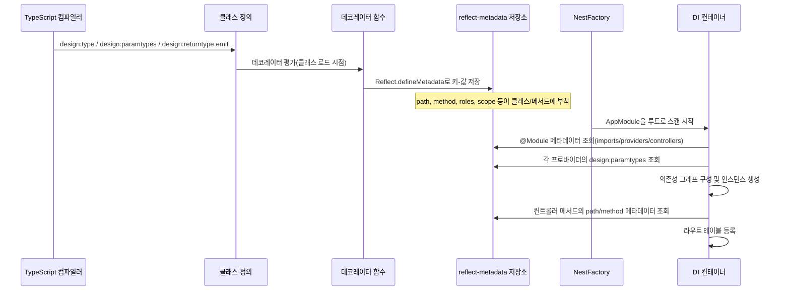

# NestJS 데코레이터(Decorator) 완전 정리

NestJS 코드를 처음 보면 클래스와 메서드 위에 `@Controller`, `@Get`, `@Injectable` 같은 기호가 잔뜩 붙어 있다. 자바 Spring을 만져본 사람이라면 어노테이션과 비슷한 인상을 받는다. 동작 원리도 비슷하다. 컴파일 타임에 메타데이터를 클래스/메서드에 붙여놓고, 런타임에 NestJS 컨테이너가 그 메타데이터를 읽어서 라우팅, 의존성 주입, 가드/인터셉터 적용을 결정한다.

이 문서는 자주 쓰는 데코레이터를 카테고리별로 정리하고, 실제로 운영하다가 부딪힌 문제들을 함께 다룬다.

## 데코레이터가 동작하는 원리

NestJS 데코레이터는 TypeScript의 실험적 데코레이터 문법과 `reflect-metadata` 라이브러리를 기반으로 한다. `tsconfig.json`에 두 옵션이 켜져 있어야 한다.

```json
{
  "compilerOptions": {
    "experimentalDecorators": true,
    "emitDecoratorMetadata": true
  }
}
```

`experimentalDecorators`는 데코레이터 문법을 허용한다. `emitDecoratorMetadata`는 컴파일 시점에 타입 정보를 메타데이터로 함께 내보낸다. 후자가 없으면 NestJS가 생성자 파라미터 타입을 읽지 못해서 의존성 주입이 깨진다.

그리고 프로젝트 진입점에서 `reflect-metadata`를 한 번 import해야 한다. NestJS CLI로 만든 프로젝트는 `main.ts` 최상단에 자동으로 들어가 있지만, 직접 구성한 프로젝트라면 빠뜨리는 경우가 있다.

```typescript
import 'reflect-metadata';
import { NestFactory } from '@nestjs/core';
```

`reflect-metadata`가 없으면 `Reflect.getMetadata()`가 undefined를 반환하고, 그 결과 컨테이너가 토큰을 찾지 못해 `Nest can't resolve dependencies` 에러가 발생한다.

### 정의 시점과 런타임의 분리

데코레이터를 처음 다루면 가장 헷갈리는 지점이 "데코레이터 함수는 언제 실행되는가"다. 결론부터 말하면 데코레이터는 클래스 정의가 평가되는 시점, 즉 모듈 로드 시점에 한 번 호출된다. 라우트 요청마다 호출되지 않는다.

```typescript
function LogDecorator(label: string): MethodDecorator {
  console.log(`[정의 시점] ${label} 평가됨`);
  return (target, propertyKey) => {
    console.log(`[정의 시점] ${label} 적용됨`);
  };
}

class Demo {
  @LogDecorator('A')
  @LogDecorator('B')
  hello() {}
}
```

위 코드를 실행하면 콘솔에는 다음 순서로 찍힌다.

```
[정의 시점] A 평가됨
[정의 시점] B 평가됨
[정의 시점] B 적용됨
[정의 시점] A 적용됨
```

데코레이터 factory 호출(`LogDecorator('A')`)은 위에서 아래로, 실제 적용(반환된 함수가 호출되는 시점)은 아래에서 위로 일어난다. 메서드에 가장 가까이 붙은 데코레이터가 먼저 적용되고, 그 결과를 위쪽 데코레이터가 다시 감싼다. `@UseGuards`와 `@Get`을 함께 붙일 때 어느 쪽이 먼저 메타데이터를 쓰는지 추적할 때 이 순서를 알아야 한다. NestJS의 기본 데코레이터들은 서로 충돌하지 않게 다른 키를 쓰므로 평소엔 문제가 없지만, 같은 키를 두 곳에서 쓰는 커스텀 데코레이터를 만들면 아래쪽이 위쪽을 덮어쓴다.

런타임 처리(가드 실행, 파라미터 추출, 핸들러 호출)는 정의 시점에 붙어 있던 메타데이터를 NestJS 컨테이너가 매 요청마다 읽어서 처리한다. 데코레이터 자체는 한 번 실행되고 끝이지만, 그것이 남긴 메타데이터는 매 요청에서 다시 읽힌다.

### 메타데이터 기반 부트스트랩 흐름

NestJS가 메타데이터를 어떻게 모아서 라우팅과 DI 그래프를 만드는지 흐름으로 정리하면 다음과 같다.



데코레이터가 남긴 메타데이터를 NestFactory가 읽어 의존성 그래프와 라우트 테이블을 만든다. 부트스트랩이 끝나면 그래프는 고정되고, 이후 요청은 이 그래프 위에서 흘러간다. 그래서 `forwardRef`가 필요한 순환 의존이 풀리지 않으면 그래프 자체가 만들어지지 않아 애플리케이션이 기동되지 않는다.

## 컨트롤러 데코레이터

### @Controller

`@Controller`는 클래스를 HTTP 요청을 받는 라우트 처리자로 등록한다. 인자로 경로 prefix를 받는다.

```typescript
import { Controller, Get } from '@nestjs/common';

@Controller('users')
export class UsersController {
  @Get()
  findAll() {
    return [];
  }
}
```

이 컨트롤러는 `GET /users`에 매핑된다. prefix를 배열로 넘기면 여러 경로에서 같은 컨트롤러를 매핑할 수 있다. 버전 분리할 때 가끔 쓴다.

```typescript
@Controller(['users', 'v1/users'])
export class UsersController {}
```

옵션 객체로 host 기반 라우팅이나 버전을 지정할 수도 있다.

```typescript
@Controller({ path: 'users', version: '2' })
export class UsersV2Controller {}
```

버전을 쓰려면 `app.enableVersioning({ type: VersioningType.URI })` 같은 설정이 별도로 필요하다. 설정 없이 데코레이터만 붙이면 무시된다.

### @Get, @Post, @Put, @Patch, @Delete

HTTP 메서드별 라우트 데코레이터다. 인자로 sub-path를 받는다.

```typescript
@Controller('users')
export class UsersController {
  @Get()                     // GET /users
  findAll() {}

  @Get(':id')                // GET /users/:id
  findOne() {}

  @Post()                    // POST /users
  create() {}

  @Put(':id')                // PUT /users/:id
  update() {}

  @Patch(':id')              // PATCH /users/:id
  partialUpdate() {}

  @Delete(':id')             // DELETE /users/:id
  remove() {}
}
```

라우트 매칭 순서에서 한 번 데인 적이 있다. `@Get(':id')`를 먼저 선언하고 `@Get('me')`를 나중에 선언하면 `/users/me` 요청이 `id = 'me'`로 매칭된다. NestJS는 데코레이터 선언 순서대로 라우트를 등록하므로 정적 경로를 동적 경로보다 위에 둬야 한다.

```typescript
@Controller('users')
export class UsersController {
  @Get('me')                 // 정적 경로 먼저
  getMe() {}

  @Get(':id')                // 동적 경로는 나중에
  findOne() {}
}
```

### @All

모든 HTTP 메서드를 처리한다. 헬스체크나 OPTIONS 처리할 때 가끔 쓴다. 단, CORS preflight는 `@nestjs/platform-express`가 자동으로 처리하므로 일부러 `@All`을 쓸 일은 드물다.

## 파라미터 데코레이터

### @Param

URL 경로의 동적 세그먼트를 추출한다.

```typescript
@Get(':id')
findOne(@Param('id') id: string) {
  return { id };
}
```

`@Param()`만 쓰면 전체 params 객체가 들어온다. 여러 파라미터를 한 번에 받고 싶을 때 쓴다.

```typescript
@Get(':userId/posts/:postId')
findPost(@Param() params: { userId: string; postId: string }) {
  return params;
}
```

주의할 점은 `@Param('id')`로 받은 값은 항상 문자열이라는 것이다. 숫자로 다루려면 `ParseIntPipe`를 붙여야 한다.

```typescript
@Get(':id')
findOne(@Param('id', ParseIntPipe) id: number) {
  return { id };
}
```

### @Query

쿼리스트링을 추출한다. 사용법은 `@Param`과 동일하다.

```typescript
@Get()
search(@Query('keyword') keyword: string, @Query('page') page: string) {}
```

페이지네이션처럼 여러 쿼리를 묶어서 받을 때는 DTO로 받는 게 깔끔하다.

```typescript
class SearchDto {
  keyword: string;
  page: number;
  size: number;
}

@Get()
search(@Query() dto: SearchDto) {}
```

DTO로 받을 때 자동 타입 변환을 원한다면 `ValidationPipe`의 `transform: true` 옵션을 켜야 한다. 그렇지 않으면 `page`가 숫자처럼 보여도 실제로는 문자열이다.

### @Body

요청 본문을 추출한다. POST/PUT/PATCH에서 주로 쓴다.

```typescript
@Post()
create(@Body() dto: CreateUserDto) {}
```

특정 필드만 추출할 수도 있지만 보통은 DTO 전체를 받는다. 필드만 추출하면 `class-validator` 검증을 못 받는다.

```typescript
@Post()
create(@Body('email') email: string) {}  // 검증 우회됨, 비추천
```

### @Headers

요청 헤더를 추출한다. 인증 토큰이나 trace ID를 받을 때 쓴다.

```typescript
@Get()
findAll(@Headers('authorization') auth: string) {}
```

헤더 이름은 대소문자를 구분하지 않는다. Express는 소문자로 정규화하므로 `Authorization`이든 `authorization`이든 같은 결과다.

### @Req, @Res

Express의 원본 Request/Response 객체를 받는다. 어지간하면 쓰지 말아야 한다. NestJS의 라우팅 시스템이 응답 객체를 직접 제어하기 때문에 `@Res`를 사용하면 인터셉터나 ExceptionFilter가 정상 동작하지 않을 수 있다.

```typescript
import { Request, Response } from 'express';

@Get()
findAll(@Req() req: Request, @Res() res: Response) {
  res.status(200).json({ ok: true });
}
```

`@Res()`로 응답을 직접 보내면 NestJS는 핸들러의 반환값을 무시한다. 그래서 인터셉터의 후처리 로직(`map`, `tap`)이 동작하지 않는다. 꼭 써야 한다면 `passthrough: true` 옵션을 줘서 NestJS가 응답을 마저 처리하도록 해야 한다.

```typescript
@Get()
findAll(@Res({ passthrough: true }) res: Response) {
  res.setHeader('X-Custom', 'value');
  return { ok: true };  // 이 값으로 응답 본문 전송됨
}
```

쿠키 설정이나 특정 헤더 추가 정도에서만 `passthrough` 패턴을 쓰고, 응답 본문 자체는 return으로 보내는 게 안전하다.

### @HostParam, @Ip, @Session

`@HostParam`은 서브도메인 라우팅에서 호스트의 동적 세그먼트를 추출한다. `@Ip`는 클라이언트 IP를, `@Session`은 express-session 미들웨어가 설정한 세션 객체를 받는다. 자주 쓰는 건 아니지만 알아두면 가끔 유용하다.

## DI 관련 데코레이터

### @Injectable

클래스를 NestJS 컨테이너에 등록해서 의존성 주입 대상으로 만든다. 서비스, 리포지토리, 프로바이더에 거의 무조건 붙는다.

```typescript
@Injectable()
export class UsersService {
  findAll() {}
}
```

`@Injectable()`이 빠지면 컨테이너가 토큰을 등록하지 않아서, 이 클래스를 주입받으려는 다른 클래스가 `Nest can't resolve dependencies` 에러를 낸다.

옵션으로 스코프를 지정할 수 있다.

```typescript
@Injectable({ scope: Scope.REQUEST })
export class RequestScopedService {}
```

기본은 싱글톤(`Scope.DEFAULT`). 요청마다 새 인스턴스가 필요하면 `Scope.REQUEST`, 매번 새로 생성하려면 `Scope.TRANSIENT`를 쓴다. 단, 한 번이라도 request scope 프로바이더를 쓰면 그것에 의존하는 모든 프로바이더가 request scope로 끌려간다. 성능에 민감한 서비스라면 함부로 쓰지 말아야 한다.

### @Module

여러 프로바이더, 컨트롤러, import/export를 묶는 단위다.

```typescript
@Module({
  imports: [TypeOrmModule.forFeature([User])],
  controllers: [UsersController],
  providers: [UsersService],
  exports: [UsersService],
})
export class UsersModule {}
```

`exports`에 명시하지 않은 프로바이더는 다른 모듈에서 import해도 주입받을 수 없다. 같은 모듈 안에서만 쓸 거면 export 안 해도 된다.

순환 의존 모듈은 `forwardRef`로 풀어야 한다.

```typescript
@Module({
  imports: [forwardRef(() => UsersModule)],
})
export class AuthModule {}
```

가능하면 순환 의존 자체를 만들지 않는 게 좋다. forwardRef는 NestJS의 의존성 그래프 분석을 어렵게 만들고, 한 쪽이 lazy하게 초기화되면서 의도치 않은 undefined 참조가 생길 수 있다.

### @Inject

기본적으로 NestJS는 생성자 파라미터의 타입을 보고 자동으로 주입할 토큰을 찾는다. 하지만 토큰이 인터페이스이거나 문자열/심볼이면 수동으로 지정해야 한다.

```typescript
@Injectable()
export class UsersService {
  constructor(
    @Inject('CONFIG_OPTIONS') private options: ConfigOptions,
    @Inject(CACHE_MANAGER) private cache: Cache,
  ) {}
}
```

TypeScript는 인터페이스가 컴파일 후에 사라지므로 인터페이스 타입을 토큰으로 쓸 수 없다. 인터페이스를 주입하고 싶으면 문자열 토큰이나 심볼을 별도로 정의해야 한다.

```typescript
export const USER_REPOSITORY = Symbol('USER_REPOSITORY');

@Module({
  providers: [
    { provide: USER_REPOSITORY, useClass: TypeOrmUserRepository },
  ],
})
export class UsersModule {}

@Injectable()
export class UsersService {
  constructor(@Inject(USER_REPOSITORY) private repo: UserRepository) {}
}
```

문자열 토큰보다 심볼이 안전하다. 문자열은 오타가 나도 컴파일 에러가 안 나지만, 심볼은 import해야 하므로 누락이 빨리 드러난다.

### @Optional

주입 대상이 없어도 에러를 내지 않도록 한다. 기본값이 있거나 선택적 의존성일 때 쓴다.

```typescript
@Injectable()
export class LoggerService {
  constructor(@Optional() @Inject('LOG_LEVEL') private level: string = 'info') {}
}
```

## 적용 데코레이터

### @UseGuards

가드를 클래스 또는 메서드에 적용한다. 요청을 허용할지 거부할지 결정하는 단계다.

```typescript
@UseGuards(AuthGuard, RolesGuard)
@Controller('admin')
export class AdminController {
  @Get()
  @UseGuards(SuperAdminGuard)
  findAll() {}
}
```

여러 개를 나열하면 선언된 순서대로 실행된다. 하나라도 `false`를 반환하거나 예외를 던지면 요청이 거부된다. 컨트롤러와 메서드에 모두 붙으면 둘 다 실행된다(컨트롤러 가드 먼저).

### @UseInterceptors

요청 전후로 부가 로직을 끼워넣는다. 응답 변환, 로깅, 캐싱, 트레이싱 같은 횡단 관심사를 처리한다.

```typescript
@UseInterceptors(LoggingInterceptor, TransformInterceptor)
@Get()
findAll() {}
```

인터셉터는 RxJS Observable 기반이므로 비동기 흐름 제어가 자연스럽게 가능하다.

### @UsePipes

파라미터 변환과 검증을 담당하는 파이프를 적용한다. 보통은 글로벌 ValidationPipe를 main.ts에 등록해두고 메서드별로 특별한 파이프가 필요할 때만 쓴다.

```typescript
@Post()
@UsePipes(new ValidationPipe({ transform: true, whitelist: true }))
create(@Body() dto: CreateUserDto) {}
```

파이프는 파라미터 데코레이터에 직접 붙일 수도 있다.

```typescript
@Get(':id')
findOne(@Param('id', ParseUUIDPipe) id: string) {}
```

### @UseFilters

ExceptionFilter를 적용한다. 특정 예외를 잡아서 응답을 가공할 때 쓴다.

```typescript
@UseFilters(new HttpExceptionFilter())
@Controller('users')
export class UsersController {}
```

ExceptionFilter는 컨트롤러나 메서드뿐 아니라 글로벌로도 등록 가능하다. 글로벌 필터를 의존성 주입과 함께 쓰려면 `APP_FILTER` 토큰으로 모듈에 등록해야 한다.

```typescript
@Module({
  providers: [
    { provide: APP_FILTER, useClass: AllExceptionsFilter },
  ],
})
export class AppModule {}
```

### @HttpCode, @Header, @Redirect

응답 상세를 제어한다.

```typescript
@Post()
@HttpCode(204)
create() {}

@Get('download')
@Header('Content-Type', 'application/pdf')
download() {}

@Get('legacy')
@Redirect('https://example.com', 302)
legacy() {}
```

POST의 기본 응답 코드는 201이고 나머지는 200이다. 204(No Content)를 명시적으로 쓰고 싶을 때 `@HttpCode`를 붙인다.

## 메타데이터 관련 데코레이터

### @SetMetadata

핸들러나 클래스에 임의의 메타데이터를 붙인다. 가드나 인터셉터에서 `Reflector`로 꺼내 쓸 수 있다.

```typescript
@SetMetadata('roles', ['admin'])
@Get('admin')
adminOnly() {}
```

`@SetMetadata`를 직접 쓰는 건 권장하지 않는다. 키를 문자열로 관리하면 오타 위험이 있고 재사용도 어렵다. 보통은 커스텀 데코레이터로 감싸서 쓴다.

```typescript
export const Roles = (...roles: string[]) => SetMetadata('roles', roles);

@Roles('admin', 'editor')
@Get()
findAll() {}
```

### Reflector

`@SetMetadata`로 붙인 메타데이터를 읽는 헬퍼다. 가드에서 자주 쓴다.

```typescript
@Injectable()
export class RolesGuard implements CanActivate {
  constructor(private reflector: Reflector) {}

  canActivate(context: ExecutionContext): boolean {
    const roles = this.reflector.get<string[]>('roles', context.getHandler());
    if (!roles) return true;

    const user = context.switchToHttp().getRequest().user;
    return roles.some(role => user?.roles?.includes(role));
  }
}
```

핸들러뿐 아니라 컨트롤러 클래스에도 메타데이터를 붙일 수 있다. 두 곳에 모두 붙어 있을 때 어느 쪽을 우선할지 결정하려면 `getAllAndOverride` 또는 `getAllAndMerge`를 쓴다.

```typescript
const roles = this.reflector.getAllAndOverride<string[]>('roles', [
  context.getHandler(),
  context.getClass(),
]);
```

`getAllAndOverride`는 메서드 메타데이터가 있으면 그것을 쓰고, 없으면 클래스 것을 쓴다. `getAllAndMerge`는 둘을 합친다.

## Reflect Metadata 직접 다루기

NestJS의 데코레이터는 결국 `Reflect.defineMetadata`와 `Reflect.getMetadata`로 키-값 데이터를 클래스나 메서드에 붙이고 빼는 것이다. `@SetMetadata`나 `Reflector`도 내부적으로는 이걸 호출한다. 한 단계 더 내려가서 직접 다루면 어떤 일이 가능한지 알아두면 NestJS가 가려놓은 영역까지 손댈 수 있다.

`reflect-metadata` 라이브러리는 컴파일러가 자동으로 emit하는 세 가지 기본 키를 인식한다. `design:type`은 프로퍼티의 타입, `design:paramtypes`는 메서드/생성자 파라미터 타입 배열, `design:returntype`은 메서드 반환 타입을 담는다. `tsconfig.json`의 `emitDecoratorMetadata: true` 옵션을 켜야 컴파일러가 데코레이터가 붙은 멤버 옆에 이 메타데이터를 자동으로 내보낸다.

```typescript
import 'reflect-metadata';
import { Injectable } from '@nestjs/common';

@Injectable()
class UsersService {
  findOne(id: number, options: { include: string }): Promise<User> {
    return null as any;
  }
}

const paramTypes = Reflect.getMetadata('design:paramtypes', UsersService.prototype, 'findOne');
console.log(paramTypes);  // [Number, Object]
```

여기서 NestJS의 DI 컨테이너가 생성자 파라미터의 클래스 토큰을 어떻게 자동으로 알아내는지 짐작이 간다. `design:paramtypes`를 읽어서 각 위치에 어떤 클래스가 와야 하는지 파악한 뒤, 자기 컨테이너에서 그 토큰으로 등록된 인스턴스를 꺼내 주입한다. 인터페이스가 컴파일 후 사라져서 `Object`로 잡히는 것도 이 메커니즘에서 비롯된 한계다. 그래서 인터페이스 토큰은 `@Inject('TOKEN')` 식으로 따로 지정해야 한다.

직접 메타데이터를 정의할 때는 키 충돌을 막기 위해 상수나 심볼로 키를 관리한다.

```typescript
const AUDIT_LOG = 'audit:log';

function AuditLog(action: string): MethodDecorator {
  return (target, propertyKey) => {
    Reflect.defineMetadata(AUDIT_LOG, { action, timestamp: false }, target, propertyKey);
  };
}

@Controller('orders')
export class OrdersController {
  @AuditLog('order.create')
  @Post()
  create() {}
}

const meta = Reflect.getMetadata(
  AUDIT_LOG,
  OrdersController.prototype,
  'create',
);
// { action: 'order.create', timestamp: false }
```

`@SetMetadata`는 이 코드를 한 줄로 줄인 헬퍼고, NestJS의 `Reflector.get()`도 `Reflect.getMetadata`의 얇은 래퍼다. 그래서 NestJS가 제공하지 않는 영역(예: 서비스 클래스 메서드에 메타데이터를 붙이고 외부 라이브러리에서 읽는 경우, OpenAPI 스펙 생성기를 직접 만드는 경우)에서는 Reflect API를 직접 다루는 게 자연스럽다.

주의할 점은 `Reflect.defineMetadata`의 인자 순서다. 클래스에 붙일 때는 `(key, value, target)`, 메서드나 프로퍼티에 붙일 때는 `(key, value, target, propertyKey)`다. propertyKey 위치를 빼먹으면 클래스에 메타데이터가 붙어서 모든 메서드가 같은 값을 공유한다. 디버깅이 까다로우니 처음부터 정확히 써야 한다.

메타데이터는 프로토타입 체인을 따라 상속된다. 부모 클래스 메서드에 붙은 메타데이터는 자식 클래스에서도 읽힌다. NestJS의 `getAllAndOverride`가 메서드/클래스 두 위치에서 메타데이터를 찾는 것도 이런 상속 동작과 잘 맞물려 있다.

## 커스텀 파라미터 데코레이터

`createParamDecorator`로 컨트롤러 메서드 파라미터를 위한 데코레이터를 직접 만들 수 있다. 가장 흔한 예시는 인증된 사용자 객체를 꺼내는 `@CurrentUser`다.

```typescript
import { createParamDecorator, ExecutionContext } from '@nestjs/common';

export const CurrentUser = createParamDecorator(
  (data: string | undefined, ctx: ExecutionContext) => {
    const request = ctx.switchToHttp().getRequest();
    const user = request.user;
    return data ? user?.[data] : user;
  },
);

@Get('me')
getMe(@CurrentUser() user: User) {
  return user;
}

@Get('email')
getEmail(@CurrentUser('email') email: string) {
  return email;
}
```

첫 번째 인자 `data`는 데코레이터 호출 시 전달한 값이다. `@CurrentUser('email')`처럼 키를 넘기면 그 키에 해당하는 값을 추출하도록 만들 수 있다.

커스텀 데코레이터는 가드/인터셉터 다음에 실행된다. 즉, `request.user`에 값을 채워주는 가드가 먼저 동작해야 한다. 가드를 안 붙이고 커스텀 데코레이터만 쓰면 undefined가 들어온다.

여러 데코레이터를 합쳐서 하나로 만들고 싶으면 `applyDecorators`를 쓴다.

```typescript
import { applyDecorators, UseGuards, SetMetadata } from '@nestjs/common';

export function Auth(...roles: string[]) {
  return applyDecorators(
    UseGuards(AuthGuard, RolesGuard),
    SetMetadata('roles', roles),
  );
}

@Auth('admin')
@Get('admin')
adminOnly() {}
```

`Auth` 하나로 가드 적용과 역할 메타데이터 설정을 동시에 처리한다. 데코레이터를 여러 개 붙이는 게 반복되면 합쳐서 의미 단위로 묶는다.

`applyDecorators`는 인자로 받은 데코레이터를 위에서 아래 순서로 평가해 차례로 적용한다. 즉 `applyDecorators(A, B, C)`는 `@A @B @C handler`를 직접 쓴 것과 같다. 적용 시점에는 평소 데코레이터 평가 순서대로 C → B → A 순으로 동작한다. Swagger 데코레이터와 가드를 묶을 때 이 순서가 가끔 중요해진다.

```typescript
export function CreateApi(summary: string, ...roles: string[]) {
  return applyDecorators(
    ApiOperation({ summary }),
    ApiResponse({ status: 201, description: 'Created' }),
    UseGuards(AuthGuard, RolesGuard),
    SetMetadata('roles', roles),
    HttpCode(201),
  );
}

@Controller('orders')
export class OrdersController {
  @CreateApi('주문 생성', 'user')
  @Post()
  create(@Body() dto: CreateOrderDto) {}
}
```

주의할 점은 `applyDecorators`로 묶은 데코레이터가 `@SetMetadata`와 `@UseGuards`처럼 서로 다른 종류면 문제가 없지만, 같은 키로 `@SetMetadata`를 두 번 부르면 뒤에 적은 쪽이 앞을 덮어쓴다는 것이다. 합성 데코레이터 안에 또 합성 데코레이터를 중첩할 때 같은 메타데이터 키가 겹치지 않는지 확인한다.

핸들러 시그니처에 영향을 주는 파라미터 데코레이터(`@Body`, `@Param` 등)는 `applyDecorators`로 묶을 수 없다. 파라미터 데코레이터는 메서드 데코레이터와 다른 위치(파라미터 인덱스)에 적용되기 때문이다. 합성은 메서드/클래스 데코레이터 한정이라고 기억하면 된다.

### 파이프와 조합

커스텀 파라미터 데코레이터에 파이프를 붙일 수도 있다. `createParamDecorator`로 값을 꺼낸 직후 NestJS가 파이프 체인에 그 값을 넘긴다.

```typescript
export const UserId = createParamDecorator(
  (_, ctx: ExecutionContext) => {
    return ctx.switchToHttp().getRequest().user?.id;
  },
);

@Get('orders')
listOrders(@UserId(ParseIntPipe) userId: number) {}
```

`@UserId(ParseIntPipe)`로 넘기면 데코레이터가 추출한 값이 ParseIntPipe를 거쳐 핸들러 파라미터로 들어온다. 인증 가드가 채워준 user.id가 문자열이라면 핸들러에서 매번 `Number()`로 변환할 필요 없이 데코레이터 시그니처 옆에서 해결된다.

### 헤더 정규화가 필요한 케이스

ELB나 nginx 뒤에 있는 서비스에서 클라이언트 IP를 정확히 가져오려면 `X-Forwarded-For`를 파싱해야 한다. 매번 컨트롤러에서 처리하지 말고 데코레이터로 빼둔다.

```typescript
export const ClientIp = createParamDecorator(
  (_, ctx: ExecutionContext): string => {
    const req = ctx.switchToHttp().getRequest();
    const forwarded = req.headers['x-forwarded-for'] as string | undefined;
    if (forwarded) {
      return forwarded.split(',')[0].trim();
    }
    return req.socket.remoteAddress ?? '';
  },
);

@Get()
list(@ClientIp() ip: string) {}
```

`X-Forwarded-For`는 프록시를 거칠 때마다 IP가 콤마로 이어붙는다. 가장 앞쪽 값이 원본 클라이언트다. Express의 `trust proxy` 옵션을 켜면 `req.ip`가 이 동작을 해주지만, 옵션을 켜지 않은 환경이거나 직접 통제하고 싶을 때 위 같은 데코레이터로 명시한다.

### 요청 컨텍스트 묶음 추출

트레이스 ID, 사용자 ID, 요청 시각 같은 메타정보를 한꺼번에 받고 싶을 때도 유용하다.

```typescript
interface RequestContext {
  traceId: string;
  userId: string | null;
  receivedAt: Date;
}

export const Ctx = createParamDecorator(
  (_, ctx: ExecutionContext): RequestContext => {
    const req = ctx.switchToHttp().getRequest();
    return {
      traceId: req.headers['x-trace-id'] ?? randomUUID(),
      userId: req.user?.id ?? null,
      receivedAt: new Date(),
    };
  },
);

@Post()
create(@Body() dto: CreateOrderDto, @Ctx() context: RequestContext) {}
```

이런 식으로 묶어두면 핸들러 시그니처가 깔끔해지고, 로깅 미들웨어와 핸들러가 같은 컨텍스트 객체를 공유하기 쉬워진다.

## 커스텀 메서드 데코레이터

`@SetMetadata`는 메타데이터만 붙일 뿐 메서드 동작은 바꾸지 않는다. 메서드 자체의 동작을 가로채려면 데코레이터 안에서 `descriptor.value`를 직접 교체해야 한다. 캐싱, 재시도, 감사 로그, 락 같은 횡단 관심사를 데코레이터로 묶을 때 쓴다.

가장 단순한 형태는 메서드 호출 전후에 로깅을 끼우는 것이다.

```typescript
export function LogExecution(): MethodDecorator {
  return (target, propertyKey, descriptor: PropertyDescriptor) => {
    const original = descriptor.value;

    descriptor.value = async function (...args: any[]) {
      const start = Date.now();
      const className = target.constructor.name;
      try {
        const result = await original.apply(this, args);
        console.log(`${className}.${String(propertyKey)} ok in ${Date.now() - start}ms`);
        return result;
      } catch (err) {
        console.error(`${className}.${String(propertyKey)} failed in ${Date.now() - start}ms`, err);
        throw err;
      }
    };

    return descriptor;
  };
}

@Injectable()
export class PaymentsService {
  @LogExecution()
  async charge(orderId: string) {
    // 실제 결제 로직
  }
}
```

핵심은 `descriptor.value = function() {...}`로 교체할 때 화살표 함수를 쓰지 않는 것이다. 화살표 함수는 자체 `this`가 없어서 서비스 인스턴스 컨텍스트가 깨진다. 그리고 `original.apply(this, args)`로 호출해야 원래 메서드가 호출 시점의 인스턴스를 그대로 받는다.

재시도 데코레이터도 비슷한 구조다.

```typescript
export function Retry(attempts = 3, delayMs = 100): MethodDecorator {
  return (target, propertyKey, descriptor: PropertyDescriptor) => {
    const original = descriptor.value;

    descriptor.value = async function (...args: any[]) {
      let lastError: unknown;
      for (let i = 0; i < attempts; i++) {
        try {
          return await original.apply(this, args);
        } catch (err) {
          lastError = err;
          if (i < attempts - 1) {
            await new Promise(r => setTimeout(r, delayMs * 2 ** i));
          }
        }
      }
      throw lastError;
    };

    return descriptor;
  };
}

@Injectable()
export class ExternalApiService {
  @Retry(5, 200)
  async fetchUser(id: string) {
    return fetch(`https://api.example.com/users/${id}`).then(r => r.json());
  }
}
```

이런 데코레이터는 NestJS의 인터셉터로도 만들 수 있다. 둘의 차이는 적용 범위와 DI 접근성이다. 인터셉터는 DI 컨테이너에서 주입받기 때문에 `Logger`, `ConfigService`, `Cache` 같은 다른 프로바이더를 가져다 쓸 수 있다. 반면 메서드 데코레이터는 클래스 정의 시점에 한 번만 평가되므로 외부 의존성을 받기 어렵다. 다른 프로바이더에 의존하면 인터셉터, 순수한 동작 래핑(시간 측정, 단순 재시도)이면 메서드 데코레이터, 메타데이터만 붙이고 가드나 인터셉터가 읽어 처리하는 형태라면 `@SetMetadata` 기반 데코레이터로 가는 게 자연스러운 기준이다.

캐싱 데코레이터에서 외부 캐시 매니저가 필요한 경우는 인터셉터로 가는 게 맞다. 메서드 데코레이터 안에서 `Container.get(Cache)` 같은 식으로 꺼내려고 하면 DI 그래프가 끊긴다.

한 가지 더 흔히 빠지는 함정이 있다. 메서드 데코레이터 안에서 `original.apply(this, args)`의 결과가 Promise가 아닐 수도 있는데 `await`를 거는 경우다. 동기 메서드를 감싸도 동작하긴 하지만, 데코레이터가 반환하는 함수가 async가 되면서 호출 측에서 `then`을 붙여야 결과를 받을 수 있다. 동기/비동기를 함께 지원하려면 결과가 thenable인지 확인하고 분기하거나, 데코레이터를 동기 전용/비동기 전용으로 분리한다.

## 커스텀 클래스 데코레이터

클래스 데코레이터는 클래스 자체에 메타데이터를 붙이거나 생성자를 변형한다. NestJS의 `@Controller`, `@Injectable`, `@Module`이 모두 클래스 데코레이터다.

직접 만드는 가장 흔한 패턴은 모듈 단위 메타데이터 부착이다. 예를 들어 컨트롤러가 어떤 feature flag와 연관되어 있는지 표시하고, 가드에서 해당 플래그가 켜져 있을 때만 요청을 허용하는 구조다.

```typescript
const FEATURE_FLAG = 'feature.flag';

export function Feature(flag: string): ClassDecorator {
  return target => {
    Reflect.defineMetadata(FEATURE_FLAG, flag, target);
  };
}

@Feature('beta-checkout')
@Controller('checkout')
export class CheckoutController {}

@Injectable()
export class FeatureGuard implements CanActivate {
  constructor(private flags: FeatureFlagService) {}

  canActivate(ctx: ExecutionContext): boolean {
    const flag = Reflect.getMetadata(FEATURE_FLAG, ctx.getClass());
    if (!flag) return true;
    return this.flags.isEnabled(flag);
  }
}
```

생성자를 직접 교체하는 클래스 데코레이터도 가능하지만 NestJS DI와 충돌하기 쉽다. NestJS는 컨테이너가 직접 생성자를 호출해서 인스턴스를 만들기 때문에, 클래스 데코레이터에서 반환한 새 클래스가 `design:paramtypes` 메타데이터를 그대로 들고 있지 않으면 의존성 해결이 깨진다. 생성자를 변형해야 한다면 새 클래스가 원본의 prototype과 메타데이터를 모두 복사하도록 신경 써야 한다. 가급적 클래스 데코레이터는 메타데이터 부착 용도로만 쓰는 게 안전하다.

## SetMetadata + Reflector 실무 패턴

이 패턴은 NestJS에서 가장 많이 쓰이는 데코레이터 작성 방식이다. 핵심은 "데코레이터는 메타데이터만 붙이고, 실제 동작은 가드/인터셉터/필터가 메타데이터를 읽어 결정한다"는 분리다. 핸들러는 어떤 정책이 적용되는지 선언만 하고, 정책 실행은 한 곳에서 통제된다.

### @Public - 인증 우회 표시

전역 가드로 JWT 인증을 적용한 상태에서 로그인 엔드포인트나 헬스체크는 인증을 건너뛰고 싶다. `@Public`로 표시해두고 가드가 그 표식을 읽어 우회한다.

```typescript
import { SetMetadata } from '@nestjs/common';

export const IS_PUBLIC_KEY = 'isPublic';
export const Public = () => SetMetadata(IS_PUBLIC_KEY, true);

@Injectable()
export class JwtAuthGuard implements CanActivate {
  constructor(private reflector: Reflector) {}

  canActivate(ctx: ExecutionContext): boolean {
    const isPublic = this.reflector.getAllAndOverride<boolean>(IS_PUBLIC_KEY, [
      ctx.getHandler(),
      ctx.getClass(),
    ]);
    if (isPublic) return true;

    return this.validateToken(ctx);
  }

  private validateToken(ctx: ExecutionContext): boolean {
    // 토큰 검증 로직
    return true;
  }
}

@Controller('auth')
export class AuthController {
  @Public()
  @Post('login')
  login() {}
}
```

`getAllAndOverride`를 쓰는 이유는 컨트롤러 전체를 public으로 표시하고 일부 메서드만 비공개로 만들거나, 그 반대 케이스를 한 줄로 처리하기 위해서다. 메서드 메타데이터가 있으면 그것을 쓰고 없으면 클래스 메타데이터를 본다.

### @Roles - 역할 기반 접근 제어

`@Roles`는 인증된 사용자의 역할을 확인해 권한이 부족하면 거부한다. 컨트롤러 단위로 기본 역할을 잡아두고, 특정 메서드에서 더 강한 권한이 필요할 때 메서드 단에서 덧붙이는 식으로 쓴다.

```typescript
export const ROLES_KEY = 'roles';
export const Roles = (...roles: Role[]) => SetMetadata(ROLES_KEY, roles);

@Injectable()
export class RolesGuard implements CanActivate {
  constructor(private reflector: Reflector) {}

  canActivate(ctx: ExecutionContext): boolean {
    const required = this.reflector.getAllAndOverride<Role[]>(ROLES_KEY, [
      ctx.getHandler(),
      ctx.getClass(),
    ]);
    if (!required?.length) return true;

    const { user } = ctx.switchToHttp().getRequest();
    return required.some(role => user?.roles?.includes(role));
  }
}

@Controller('admin')
@Roles(Role.Admin)
export class AdminController {
  @Get('users')
  list() {}

  @Roles(Role.SuperAdmin)
  @Delete('users/:id')
  remove() {}
}
```

`getAllAndOverride` 대신 `getAllAndMerge`를 쓰면 클래스와 메서드 메타데이터를 합친다. 가령 컨트롤러에 `[Role.Admin]`이 붙어 있고 메서드에 `[Role.Auditor]`가 붙어 있으면 둘 다 허용된다. 정책 누적이 필요한지, 메서드가 클래스 정책을 덮어쓰는지에 따라 둘 중 하나를 고른다.

### @RateLimit - 핸들러별 속도 제한

```typescript
export const RATE_LIMIT = 'rateLimit';

interface RateLimitOptions {
  ttl: number;       // 초 단위
  limit: number;     // ttl 동안 허용 횟수
}

export const RateLimit = (options: RateLimitOptions) =>
  SetMetadata(RATE_LIMIT, options);

@Injectable()
export class RateLimitGuard implements CanActivate {
  constructor(
    private reflector: Reflector,
    @Inject(CACHE_MANAGER) private cache: Cache,
  ) {}

  async canActivate(ctx: ExecutionContext): Promise<boolean> {
    const opts = this.reflector.get<RateLimitOptions>(RATE_LIMIT, ctx.getHandler());
    if (!opts) return true;

    const req = ctx.switchToHttp().getRequest();
    const key = `rl:${req.ip}:${ctx.getHandler().name}`;
    const current = (await this.cache.get<number>(key)) ?? 0;

    if (current >= opts.limit) {
      throw new HttpException('Too Many Requests', 429);
    }

    await this.cache.set(key, current + 1, opts.ttl * 1000);
    return true;
  }
}

@Controller('search')
export class SearchController {
  @RateLimit({ ttl: 60, limit: 30 })
  @Get()
  search() {}
}
```

데코레이터는 옵션 객체를 메타데이터로 붙이는 게 전부다. 카운팅이나 차단은 가드가 처리한다. 이 분리 덕분에 데코레이터 자체는 어떤 캐시 구현체를 쓰는지 알 필요가 없다. 나중에 Redis로 바꾸든 메모리 캐시를 쓰든 가드만 수정하면 된다.

### @CacheKey - 응답 캐싱 키 지정

NestJS의 내장 `CacheInterceptor`는 기본적으로 URL을 키로 쓴다. 키 생성 로직을 핸들러마다 다르게 가져가고 싶으면 메타데이터로 키 패턴을 넘기는 인터셉터를 직접 만든다.

```typescript
export const CACHE_KEY = 'cacheKey';
export const CacheKey = (key: string) => SetMetadata(CACHE_KEY, key);

@Injectable()
export class CustomCacheInterceptor implements NestInterceptor {
  constructor(
    private reflector: Reflector,
    @Inject(CACHE_MANAGER) private cache: Cache,
  ) {}

  async intercept(ctx: ExecutionContext, next: CallHandler): Promise<Observable<any>> {
    const keyTemplate = this.reflector.get<string>(CACHE_KEY, ctx.getHandler());
    if (!keyTemplate) return next.handle();

    const req = ctx.switchToHttp().getRequest();
    const key = keyTemplate.replace(/:(\w+)/g, (_, name) => req.params[name] ?? '');

    const cached = await this.cache.get(key);
    if (cached !== undefined) return of(cached);

    return next.handle().pipe(
      tap(async data => {
        await this.cache.set(key, data, 60_000);
      }),
    );
  }
}

@Controller('products')
export class ProductsController {
  @CacheKey('product:detail:id')
  @Get(':id')
  findOne(@Param('id') id: string) {}
}
```

### @Transactional - DB 트랜잭션 자동 감싸기

인터셉터와 메타데이터 패턴으로 트랜잭션 경계를 메서드 단위로 선언할 수 있다. 실제 구현은 사용하는 ORM(TypeORM, Prisma, Drizzle)에 따라 다르지만 구조는 동일하다.

```typescript
export const TRANSACTIONAL = 'transactional';
export const Transactional = () => SetMetadata(TRANSACTIONAL, true);

@Injectable()
export class TransactionInterceptor implements NestInterceptor {
  constructor(
    private reflector: Reflector,
    private dataSource: DataSource,
  ) {}

  intercept(ctx: ExecutionContext, next: CallHandler): Observable<any> {
    const enabled = this.reflector.get<boolean>(TRANSACTIONAL, ctx.getHandler());
    if (!enabled) return next.handle();

    return from(
      this.dataSource.transaction(async manager => {
        const req = ctx.switchToHttp().getRequest();
        req.txManager = manager;
        return firstValueFrom(next.handle());
      }),
    );
  }
}

@Controller('orders')
export class OrdersController {
  @Transactional()
  @Post()
  create() {}
}
```

이 패턴의 한계는 트랜잭션 매니저를 핸들러나 서비스 안에서 어떻게 받을지다. 위 예시에서는 `request.txManager`에 매니저를 꽂아두고 서비스에서 request를 통해 꺼내 쓰는 식으로 풀었지만, AsyncLocalStorage를 쓰는 방법이 더 깔끔하다. NestJS에는 `cls-hooked`나 `@nestjs/cls` 같은 라이브러리로 비동기 컨텍스트를 끌고 다니는 패턴이 많이 쓰인다. 트랜잭션 매니저, 트레이스 ID, 사용자 ID를 한 곳에 넣어두면 서비스에서 파라미터로 받지 않고도 접근할 수 있다.

### 메타데이터 키 관리

`@SetMetadata`의 첫 번째 인자는 키다. 여러 데코레이터를 만들다 보면 키가 충돌할 위험이 있다. 키를 상수로 export해서 데코레이터와 가드/인터셉터가 같은 상수를 참조하도록 만든다. 키를 양쪽에서 문자열 리터럴로 따로 쓰면 오타가 났을 때 컴파일러가 잡아주지 못한다. 라이브러리 형태로 배포할 거라면 키에 네임스페이스를 붙인다. `auth:roles`, `cache:ttl`, `feature:flag` 같은 식으로 prefix를 두면 외부 라이브러리와 키가 겹치지 않는다.

심볼을 키로 쓸 수도 있지만, NestJS의 `Reflector.get`은 문자열 키 가정으로 작성된 코드와 잘 맞물려서 표준적으로는 문자열을 쓴다. Reflect API를 직접 호출하는 경우라면 심볼이 더 안전하다.

## 데코레이터 실행 순서

같은 핸들러에 데코레이터가 여러 개 붙으면 실행 순서가 헷갈린다. 아래 다이어그램으로 정리한다.


스코프 적용 순서도 중요하다. 글로벌 → 컨트롤러 → 메서드 순으로 적용된다. 가드를 예로 들면 글로벌 가드가 먼저, 그 다음 컨트롤러 가드, 마지막으로 메서드 가드가 실행된다. 어느 한 단계에서 거부되면 다음 단계는 실행되지 않는다.

인터셉터의 after 처리와 ExceptionFilter는 반대로 메서드 → 컨트롤러 → 글로벌 순이다. 스택처럼 동작한다고 생각하면 된다.

## 트러블슈팅 사례

### Nest can't resolve dependencies

가장 흔한 에러다. 원인은 거의 정해져 있다.

첫째, `@Injectable()`을 빠뜨린 경우. 서비스 클래스에 데코레이터를 안 붙이면 컨테이너가 토큰을 등록하지 않는다.

둘째, 해당 프로바이더가 모듈의 `providers` 배열에 없거나, 다른 모듈에서 import했는데 그 모듈이 `exports`에 안 넣은 경우.

셋째, `emitDecoratorMetadata`가 꺼져 있는 경우. 이 옵션이 없으면 생성자 파라미터 타입을 컴파일러가 메타데이터로 내보내지 않아서, 컨테이너가 무엇을 주입해야 할지 모른다.

넷째, 순환 의존이 풀리지 않은 경우. 에러 메시지에 `Make sure that the argument ... is available in the ... context`라고 뜨면 import는 됐지만 export가 빠졌거나, 양방향 의존이 forwardRef 없이 걸려 있다는 신호다.

문제를 빨리 찾으려면 `NestFactory.create()` 호출 시 `logger`를 `verbose`로 켜고 의존성 트리를 살펴보면 된다.

### Reflect-metadata 관련 에러

`Reflect.getMetadata is not a function` 또는 `Cannot read property 'design:paramtypes' of undefined` 같은 에러가 나면 `reflect-metadata`가 main 진입점에 import되지 않은 것이다. `import 'reflect-metadata';`를 가장 위에 추가한다.

테스트 코드에서도 동일하다. Jest로 단위 테스트 돌릴 때 setup 파일에 `reflect-metadata`를 import해줘야 NestJS 컨테이너가 정상 동작한다.

### @Res 사용 시 인터셉터 미동작

`@Res()`로 응답을 직접 보내면 핸들러 반환값이 무시된다. 결과적으로 RxJS 기반 인터셉터의 후처리, ExceptionFilter의 응답 변환이 모두 우회된다. 응답 가공 로직이 갑자기 안 먹는다면 `@Res()`를 쓰고 있는지 먼저 확인한다.

해결책은 `@Res({ passthrough: true })`를 쓰거나, 아예 `@Res`를 빼고 return으로 응답하는 것이다. 헤더 설정만 필요하면 `@Header()` 데코레이터로도 충분하다.

### 커스텀 데코레이터에서 user가 undefined

`@CurrentUser` 같은 커스텀 데코레이터가 undefined를 반환하면 가드 적용 순서를 확인해야 한다. 인증 가드가 `request.user`를 채워야 커스텀 데코레이터가 값을 읽을 수 있다.

```typescript
@UseGuards(JwtAuthGuard)        // user 채우는 가드
@Get('me')
getMe(@CurrentUser() user: User) {}
```

전역 가드로 `JwtAuthGuard`를 등록했다면 컨트롤러마다 따로 안 붙여도 된다. 단, 글로벌 가드는 DI를 받으려면 `APP_GUARD` 토큰을 통해 모듈에 등록해야 한다.

```typescript
@Module({
  providers: [
    { provide: APP_GUARD, useClass: JwtAuthGuard },
  ],
})
export class AppModule {}
```

### 순환 의존

A 서비스가 B 서비스를 쓰고, B 서비스가 A 서비스를 쓰면 NestJS가 의존성 그래프를 만들지 못한다. `forwardRef`로 우회할 수는 있다.

```typescript
@Injectable()
export class AService {
  constructor(@Inject(forwardRef(() => BService)) private b: BService) {}
}

@Injectable()
export class BService {
  constructor(@Inject(forwardRef(() => AService)) private a: AService) {}
}
```

다만 forwardRef는 임시방편이다. 한 쪽 서비스가 초기화 시점에 다른 쪽 메서드를 호출하면 undefined 참조 에러가 난다. 근본 해결은 두 서비스가 공통으로 쓰는 로직을 제3의 서비스로 분리하거나, 이벤트 기반(EventEmitter, 메시지 큐)으로 결합을 끊는 것이다.

모듈 간 순환도 마찬가지로 `forwardRef(() => OtherModule)`로 풀 수 있지만, 모듈 구조 자체를 다시 검토하는 게 장기적으로 낫다.

### @Body가 빈 객체로 들어옴

POST 요청을 보냈는데 `@Body()`로 받은 dto가 `{}`로 들어온다면 body-parser 설정을 확인한다. NestJS는 기본적으로 JSON parser를 켜두지만, Fastify 어댑터로 바꾼 경우나 raw body가 필요해서 별도 설정한 경우 누락될 수 있다.

`main.ts`에서 다음 설정이 있는지 본다.

```typescript
app.use(express.json({ limit: '10mb' }));
```

클라이언트가 `Content-Type: application/json` 헤더를 보냈는지도 확인한다. 헤더가 다르면 parser가 동작하지 않아 빈 객체가 들어온다.

### ValidationPipe의 transform이 안 먹음

`@Query()`로 받은 객체의 숫자 필드가 여전히 문자열이면 ValidationPipe가 `transform: true`로 설정되지 않았거나, DTO에 타입이 명시되지 않은 것이다.

```typescript
class PaginationDto {
  @IsInt()
  @Type(() => Number)        // 명시적 변환
  page: number;
}

app.useGlobalPipes(new ValidationPipe({ transform: true }));
```

`@Type` 데코레이터는 `class-transformer`의 것이다. 클래스 검증과 변환은 NestJS 자체가 아니라 `class-validator`/`class-transformer` 라이브러리에 의존하므로 두 라이브러리의 데코레이터를 잘 이해해야 한다.

## 자주 쓰는 데코레이터 요약

실제 프로젝트에서 사용 빈도가 높은 데코레이터를 한 번에 정리한다.

| 데코레이터 | 위치 | 용도 |
|---|---|---|
| `@Controller(prefix)` | 클래스 | 라우트 처리자로 등록 |
| `@Get/@Post/@Put/@Patch/@Delete` | 메서드 | HTTP 메서드 매핑 |
| `@Param/@Query/@Body/@Headers` | 파라미터 | 요청 데이터 추출 |
| `@Req/@Res` | 파라미터 | 원본 객체 접근(주의해서 사용) |
| `@Injectable` | 클래스 | DI 컨테이너 등록 |
| `@Module` | 클래스 | 모듈 정의 |
| `@Inject(token)` | 파라미터 | 수동 토큰 지정 |
| `@UseGuards/UseInterceptors/UsePipes/UseFilters` | 클래스·메서드 | 미들레이어 적용 |
| `@SetMetadata` | 클래스·메서드 | 임의 메타데이터 부착 |
| `@HttpCode/@Header/@Redirect` | 메서드 | 응답 세부 제어 |
| `createParamDecorator` | 헬퍼 | 커스텀 파라미터 데코레이터 생성 |
| `applyDecorators` | 헬퍼 | 여러 데코레이터를 하나로 묶음 |
| `Reflect.defineMetadata` | API | 임의 위치에 메타데이터 부착 |
| `Reflect.getMetadata` | API | 부착된 메타데이터 조회 |

데코레이터 자체는 단순한 표식이고, 실제 동작은 NestJS 런타임이 메타데이터를 읽어서 처리한다. 그래서 데코레이터를 잘 쓰려면 `reflect-metadata`와 NestJS의 요청 라이프사이클을 함께 이해해야 한다. 어디서 메타데이터가 붙고, 누가 그것을 읽는지 흐름을 머릿속에 그릴 수 있으면 대부분의 트러블슈팅이 빠르게 해결된다.

커스텀 데코레이터를 만들 때 헷갈리는 지점은 "이걸 어떤 형태로 만들지"다. 응답이나 요청 데이터를 핸들러 파라미터로 꺼내는 거면 `createParamDecorator`, 메서드 동작 자체를 가로채는 거면 `descriptor.value` 교체 방식의 메서드 데코레이터, 정책 선언만 하고 실제 처리는 가드/인터셉터에 맡길 거면 `SetMetadata` 기반이다. 이 세 가지를 구분해서 쓰면 데코레이터 코드가 단순해지고 유지보수도 쉬워진다.
