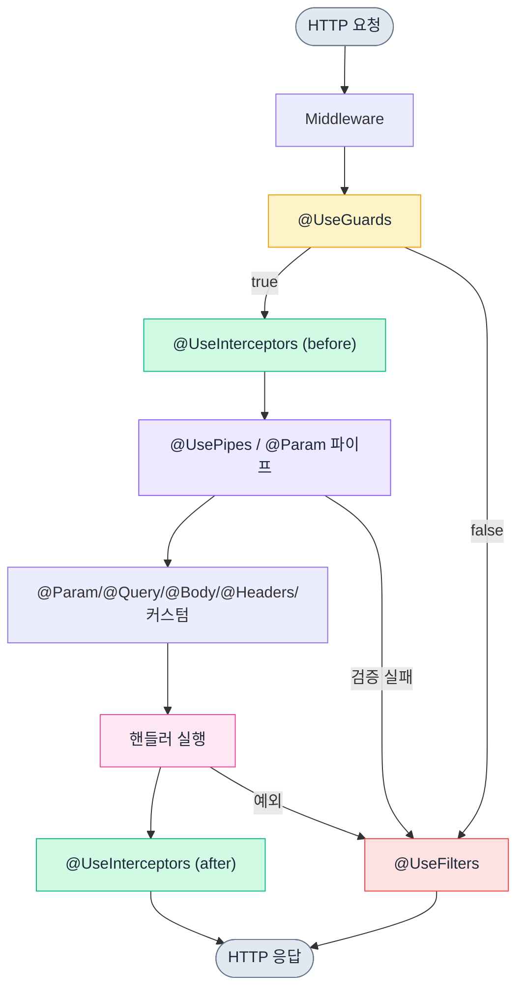

# NestJS 데코레이터(Decorator) 완전 정리

NestJS 코드를 처음 보면 클래스와 메서드 위에 `@Controller`, `@Get`, `@Injectable` 같은 기호가 잔뜩 붙어 있다. 자바 Spring을 만져본 사람이라면 어노테이션과 비슷한 인상을 받는다. 동작 원리도 비슷하다. 컴파일 타임에 메타데이터를 클래스/메서드에 붙여놓고, 런타임에 NestJS 컨테이너가 그 메타데이터를 읽어서 라우팅, 의존성 주입, 가드/인터셉터 적용을 결정한다.

이 문서는 자주 쓰는 데코레이터를 카테고리별로 정리하고, 실제로 운영하다가 부딪힌 문제들을 함께 다룬다.

## 데코레이터가 동작하는 원리

NestJS 데코레이터는 TypeScript의 실험적 데코레이터 문법과 `reflect-metadata` 라이브러리를 기반으로 한다. `tsconfig.json`에 두 옵션이 켜져 있어야 한다.

```json
{
  "compilerOptions": {
    "experimentalDecorators": true,
    "emitDecoratorMetadata": true
  }
}
```

`experimentalDecorators`는 데코레이터 문법을 허용한다. `emitDecoratorMetadata`는 컴파일 시점에 타입 정보를 메타데이터로 함께 내보낸다. 후자가 없으면 NestJS가 생성자 파라미터 타입을 읽지 못해서 의존성 주입이 깨진다.

그리고 프로젝트 진입점에서 `reflect-metadata`를 한 번 import해야 한다. NestJS CLI로 만든 프로젝트는 `main.ts` 최상단에 자동으로 들어가 있지만, 직접 구성한 프로젝트라면 빠뜨리는 경우가 있다.

```typescript
import 'reflect-metadata';
import { NestFactory } from '@nestjs/core';
```

`reflect-metadata`가 없으면 `Reflect.getMetadata()`가 undefined를 반환하고, 그 결과 컨테이너가 토큰을 찾지 못해 `Nest can't resolve dependencies` 에러가 발생한다.

## 컨트롤러 데코레이터

### @Controller

`@Controller`는 클래스를 HTTP 요청을 받는 라우트 처리자로 등록한다. 인자로 경로 prefix를 받는다.

```typescript
import { Controller, Get } from '@nestjs/common';

@Controller('users')
export class UsersController {
  @Get()
  findAll() {
    return [];
  }
}
```

이 컨트롤러는 `GET /users`에 매핑된다. prefix를 배열로 넘기면 여러 경로에서 같은 컨트롤러를 매핑할 수 있다. 버전 분리할 때 가끔 쓴다.

```typescript
@Controller(['users', 'v1/users'])
export class UsersController {}
```

옵션 객체로 host 기반 라우팅이나 버전을 지정할 수도 있다.

```typescript
@Controller({ path: 'users', version: '2' })
export class UsersV2Controller {}
```

버전을 쓰려면 `app.enableVersioning({ type: VersioningType.URI })` 같은 설정이 별도로 필요하다. 설정 없이 데코레이터만 붙이면 무시된다.

### @Get, @Post, @Put, @Patch, @Delete

HTTP 메서드별 라우트 데코레이터다. 인자로 sub-path를 받는다.

```typescript
@Controller('users')
export class UsersController {
  @Get()                     // GET /users
  findAll() {}

  @Get(':id')                // GET /users/:id
  findOne() {}

  @Post()                    // POST /users
  create() {}

  @Put(':id')                // PUT /users/:id
  update() {}

  @Patch(':id')              // PATCH /users/:id
  partialUpdate() {}

  @Delete(':id')             // DELETE /users/:id
  remove() {}
}
```

라우트 매칭 순서에서 한 번 데인 적이 있다. `@Get(':id')`를 먼저 선언하고 `@Get('me')`를 나중에 선언하면 `/users/me` 요청이 `id = 'me'`로 매칭된다. NestJS는 데코레이터 선언 순서대로 라우트를 등록하므로 정적 경로를 동적 경로보다 위에 둬야 한다.

```typescript
@Controller('users')
export class UsersController {
  @Get('me')                 // 정적 경로 먼저
  getMe() {}

  @Get(':id')                // 동적 경로는 나중에
  findOne() {}
}
```

### @All

모든 HTTP 메서드를 처리한다. 헬스체크나 OPTIONS 처리할 때 가끔 쓴다. 단, CORS preflight는 `@nestjs/platform-express`가 자동으로 처리하므로 일부러 `@All`을 쓸 일은 드물다.

## 파라미터 데코레이터

### @Param

URL 경로의 동적 세그먼트를 추출한다.

```typescript
@Get(':id')
findOne(@Param('id') id: string) {
  return { id };
}
```

`@Param()`만 쓰면 전체 params 객체가 들어온다. 여러 파라미터를 한 번에 받고 싶을 때 쓴다.

```typescript
@Get(':userId/posts/:postId')
findPost(@Param() params: { userId: string; postId: string }) {
  return params;
}
```

주의할 점은 `@Param('id')`로 받은 값은 항상 문자열이라는 것이다. 숫자로 다루려면 `ParseIntPipe`를 붙여야 한다.

```typescript
@Get(':id')
findOne(@Param('id', ParseIntPipe) id: number) {
  return { id };
}
```

### @Query

쿼리스트링을 추출한다. 사용법은 `@Param`과 동일하다.

```typescript
@Get()
search(@Query('keyword') keyword: string, @Query('page') page: string) {}
```

페이지네이션처럼 여러 쿼리를 묶어서 받을 때는 DTO로 받는 게 깔끔하다.

```typescript
class SearchDto {
  keyword: string;
  page: number;
  size: number;
}

@Get()
search(@Query() dto: SearchDto) {}
```

DTO로 받을 때 자동 타입 변환을 원한다면 `ValidationPipe`의 `transform: true` 옵션을 켜야 한다. 그렇지 않으면 `page`가 숫자처럼 보여도 실제로는 문자열이다.

### @Body

요청 본문을 추출한다. POST/PUT/PATCH에서 주로 쓴다.

```typescript
@Post()
create(@Body() dto: CreateUserDto) {}
```

특정 필드만 추출할 수도 있지만 보통은 DTO 전체를 받는다. 필드만 추출하면 `class-validator` 검증을 못 받는다.

```typescript
@Post()
create(@Body('email') email: string) {}  // 검증 우회됨, 비추천
```

### @Headers

요청 헤더를 추출한다. 인증 토큰이나 trace ID를 받을 때 쓴다.

```typescript
@Get()
findAll(@Headers('authorization') auth: string) {}
```

헤더 이름은 대소문자를 구분하지 않는다. Express는 소문자로 정규화하므로 `Authorization`이든 `authorization`이든 같은 결과다.

### @Req, @Res

Express의 원본 Request/Response 객체를 받는다. 어지간하면 쓰지 말아야 한다. NestJS의 라우팅 시스템이 응답 객체를 직접 제어하기 때문에 `@Res`를 사용하면 인터셉터나 ExceptionFilter가 정상 동작하지 않을 수 있다.

```typescript
import { Request, Response } from 'express';

@Get()
findAll(@Req() req: Request, @Res() res: Response) {
  res.status(200).json({ ok: true });
}
```

`@Res()`로 응답을 직접 보내면 NestJS는 핸들러의 반환값을 무시한다. 그래서 인터셉터의 후처리 로직(`map`, `tap`)이 동작하지 않는다. 꼭 써야 한다면 `passthrough: true` 옵션을 줘서 NestJS가 응답을 마저 처리하도록 해야 한다.

```typescript
@Get()
findAll(@Res({ passthrough: true }) res: Response) {
  res.setHeader('X-Custom', 'value');
  return { ok: true };  // 이 값으로 응답 본문 전송됨
}
```

쿠키 설정이나 특정 헤더 추가 정도에서만 `passthrough` 패턴을 쓰고, 응답 본문 자체는 return으로 보내는 게 안전하다.

### @HostParam, @Ip, @Session

`@HostParam`은 서브도메인 라우팅에서 호스트의 동적 세그먼트를 추출한다. `@Ip`는 클라이언트 IP를, `@Session`은 express-session 미들웨어가 설정한 세션 객체를 받는다. 자주 쓰는 건 아니지만 알아두면 가끔 유용하다.

## DI 관련 데코레이터

### @Injectable

클래스를 NestJS 컨테이너에 등록해서 의존성 주입 대상으로 만든다. 서비스, 리포지토리, 프로바이더에 거의 무조건 붙는다.

```typescript
@Injectable()
export class UsersService {
  findAll() {}
}
```

`@Injectable()`이 빠지면 컨테이너가 토큰을 등록하지 않아서, 이 클래스를 주입받으려는 다른 클래스가 `Nest can't resolve dependencies` 에러를 낸다.

옵션으로 스코프를 지정할 수 있다.

```typescript
@Injectable({ scope: Scope.REQUEST })
export class RequestScopedService {}
```

기본은 싱글톤(`Scope.DEFAULT`). 요청마다 새 인스턴스가 필요하면 `Scope.REQUEST`, 매번 새로 생성하려면 `Scope.TRANSIENT`를 쓴다. 단, 한 번이라도 request scope 프로바이더를 쓰면 그것에 의존하는 모든 프로바이더가 request scope로 끌려간다. 성능에 민감한 서비스라면 함부로 쓰지 말아야 한다.

### @Module

여러 프로바이더, 컨트롤러, import/export를 묶는 단위다.

```typescript
@Module({
  imports: [TypeOrmModule.forFeature([User])],
  controllers: [UsersController],
  providers: [UsersService],
  exports: [UsersService],
})
export class UsersModule {}
```

`exports`에 명시하지 않은 프로바이더는 다른 모듈에서 import해도 주입받을 수 없다. 같은 모듈 안에서만 쓸 거면 export 안 해도 된다.

순환 의존 모듈은 `forwardRef`로 풀어야 한다.

```typescript
@Module({
  imports: [forwardRef(() => UsersModule)],
})
export class AuthModule {}
```

가능하면 순환 의존 자체를 만들지 않는 게 좋다. forwardRef는 NestJS의 의존성 그래프 분석을 어렵게 만들고, 한 쪽이 lazy하게 초기화되면서 의도치 않은 undefined 참조가 생길 수 있다.

### @Inject

기본적으로 NestJS는 생성자 파라미터의 타입을 보고 자동으로 주입할 토큰을 찾는다. 하지만 토큰이 인터페이스이거나 문자열/심볼이면 수동으로 지정해야 한다.

```typescript
@Injectable()
export class UsersService {
  constructor(
    @Inject('CONFIG_OPTIONS') private options: ConfigOptions,
    @Inject(CACHE_MANAGER) private cache: Cache,
  ) {}
}
```

TypeScript는 인터페이스가 컴파일 후에 사라지므로 인터페이스 타입을 토큰으로 쓸 수 없다. 인터페이스를 주입하고 싶으면 문자열 토큰이나 심볼을 별도로 정의해야 한다.

```typescript
export const USER_REPOSITORY = Symbol('USER_REPOSITORY');

@Module({
  providers: [
    { provide: USER_REPOSITORY, useClass: TypeOrmUserRepository },
  ],
})
export class UsersModule {}

@Injectable()
export class UsersService {
  constructor(@Inject(USER_REPOSITORY) private repo: UserRepository) {}
}
```

문자열 토큰보다 심볼이 안전하다. 문자열은 오타가 나도 컴파일 에러가 안 나지만, 심볼은 import해야 하므로 누락이 빨리 드러난다.

### @Optional

주입 대상이 없어도 에러를 내지 않도록 한다. 기본값이 있거나 선택적 의존성일 때 쓴다.

```typescript
@Injectable()
export class LoggerService {
  constructor(@Optional() @Inject('LOG_LEVEL') private level: string = 'info') {}
}
```

## 적용 데코레이터

### @UseGuards

가드를 클래스 또는 메서드에 적용한다. 요청을 허용할지 거부할지 결정하는 단계다.

```typescript
@UseGuards(AuthGuard, RolesGuard)
@Controller('admin')
export class AdminController {
  @Get()
  @UseGuards(SuperAdminGuard)
  findAll() {}
}
```

여러 개를 나열하면 선언된 순서대로 실행된다. 하나라도 `false`를 반환하거나 예외를 던지면 요청이 거부된다. 컨트롤러와 메서드에 모두 붙으면 둘 다 실행된다(컨트롤러 가드 먼저).

### @UseInterceptors

요청 전후로 부가 로직을 끼워넣는다. 응답 변환, 로깅, 캐싱, 트레이싱 같은 횡단 관심사를 처리한다.

```typescript
@UseInterceptors(LoggingInterceptor, TransformInterceptor)
@Get()
findAll() {}
```

인터셉터는 RxJS Observable 기반이므로 비동기 흐름 제어가 자연스럽게 가능하다.

### @UsePipes

파라미터 변환과 검증을 담당하는 파이프를 적용한다. 보통은 글로벌 ValidationPipe를 main.ts에 등록해두고 메서드별로 특별한 파이프가 필요할 때만 쓴다.

```typescript
@Post()
@UsePipes(new ValidationPipe({ transform: true, whitelist: true }))
create(@Body() dto: CreateUserDto) {}
```

파이프는 파라미터 데코레이터에 직접 붙일 수도 있다.

```typescript
@Get(':id')
findOne(@Param('id', ParseUUIDPipe) id: string) {}
```

### @UseFilters

ExceptionFilter를 적용한다. 특정 예외를 잡아서 응답을 가공할 때 쓴다.

```typescript
@UseFilters(new HttpExceptionFilter())
@Controller('users')
export class UsersController {}
```

ExceptionFilter는 컨트롤러나 메서드뿐 아니라 글로벌로도 등록 가능하다. 글로벌 필터를 의존성 주입과 함께 쓰려면 `APP_FILTER` 토큰으로 모듈에 등록해야 한다.

```typescript
@Module({
  providers: [
    { provide: APP_FILTER, useClass: AllExceptionsFilter },
  ],
})
export class AppModule {}
```

### @HttpCode, @Header, @Redirect

응답 상세를 제어한다.

```typescript
@Post()
@HttpCode(204)
create() {}

@Get('download')
@Header('Content-Type', 'application/pdf')
download() {}

@Get('legacy')
@Redirect('https://example.com', 302)
legacy() {}
```

POST의 기본 응답 코드는 201이고 나머지는 200이다. 204(No Content)를 명시적으로 쓰고 싶을 때 `@HttpCode`를 붙인다.

## 메타데이터 관련 데코레이터

### @SetMetadata

핸들러나 클래스에 임의의 메타데이터를 붙인다. 가드나 인터셉터에서 `Reflector`로 꺼내 쓸 수 있다.

```typescript
@SetMetadata('roles', ['admin'])
@Get('admin')
adminOnly() {}
```

`@SetMetadata`를 직접 쓰는 건 권장하지 않는다. 키를 문자열로 관리하면 오타 위험이 있고 재사용도 어렵다. 보통은 커스텀 데코레이터로 감싸서 쓴다.

```typescript
export const Roles = (...roles: string[]) => SetMetadata('roles', roles);

@Roles('admin', 'editor')
@Get()
findAll() {}
```

### Reflector

`@SetMetadata`로 붙인 메타데이터를 읽는 헬퍼다. 가드에서 자주 쓴다.

```typescript
@Injectable()
export class RolesGuard implements CanActivate {
  constructor(private reflector: Reflector) {}

  canActivate(context: ExecutionContext): boolean {
    const roles = this.reflector.get<string[]>('roles', context.getHandler());
    if (!roles) return true;

    const user = context.switchToHttp().getRequest().user;
    return roles.some(role => user?.roles?.includes(role));
  }
}
```

핸들러뿐 아니라 컨트롤러 클래스에도 메타데이터를 붙일 수 있다. 두 곳에 모두 붙어 있을 때 어느 쪽을 우선할지 결정하려면 `getAllAndOverride` 또는 `getAllAndMerge`를 쓴다.

```typescript
const roles = this.reflector.getAllAndOverride<string[]>('roles', [
  context.getHandler(),
  context.getClass(),
]);
```

`getAllAndOverride`는 메서드 메타데이터가 있으면 그것을 쓰고, 없으면 클래스 것을 쓴다. `getAllAndMerge`는 둘을 합친다.

## 커스텀 파라미터 데코레이터

`createParamDecorator`로 컨트롤러 메서드 파라미터를 위한 데코레이터를 직접 만들 수 있다. 가장 흔한 예시는 인증된 사용자 객체를 꺼내는 `@CurrentUser`다.

```typescript
import { createParamDecorator, ExecutionContext } from '@nestjs/common';

export const CurrentUser = createParamDecorator(
  (data: string | undefined, ctx: ExecutionContext) => {
    const request = ctx.switchToHttp().getRequest();
    const user = request.user;
    return data ? user?.[data] : user;
  },
);

@Get('me')
getMe(@CurrentUser() user: User) {
  return user;
}

@Get('email')
getEmail(@CurrentUser('email') email: string) {
  return email;
}
```

첫 번째 인자 `data`는 데코레이터 호출 시 전달한 값이다. `@CurrentUser('email')`처럼 키를 넘기면 그 키에 해당하는 값을 추출하도록 만들 수 있다.

커스텀 데코레이터는 가드/인터셉터 다음에 실행된다. 즉, `request.user`에 값을 채워주는 가드가 먼저 동작해야 한다. 가드를 안 붙이고 커스텀 데코레이터만 쓰면 undefined가 들어온다.

여러 데코레이터를 합쳐서 하나로 만들고 싶으면 `applyDecorators`를 쓴다.

```typescript
import { applyDecorators, UseGuards, SetMetadata } from '@nestjs/common';

export function Auth(...roles: string[]) {
  return applyDecorators(
    UseGuards(AuthGuard, RolesGuard),
    SetMetadata('roles', roles),
  );
}

@Auth('admin')
@Get('admin')
adminOnly() {}
```

`Auth` 하나로 가드 적용과 역할 메타데이터 설정을 동시에 처리한다. 데코레이터를 여러 개 붙이는 게 반복되면 합쳐서 의미 단위로 묶는다.

## 데코레이터 실행 순서

같은 핸들러에 데코레이터가 여러 개 붙으면 실행 순서가 헷갈린다. 아래 다이어그램으로 정리한다.



스코프 적용 순서도 중요하다. 글로벌 → 컨트롤러 → 메서드 순으로 적용된다. 가드를 예로 들면 글로벌 가드가 먼저, 그 다음 컨트롤러 가드, 마지막으로 메서드 가드가 실행된다. 어느 한 단계에서 거부되면 다음 단계는 실행되지 않는다.

인터셉터의 after 처리와 ExceptionFilter는 반대로 메서드 → 컨트롤러 → 글로벌 순이다. 스택처럼 동작한다고 생각하면 된다.

## 트러블슈팅 사례

### Nest can't resolve dependencies

가장 흔한 에러다. 원인은 거의 정해져 있다.

첫째, `@Injectable()`을 빠뜨린 경우. 서비스 클래스에 데코레이터를 안 붙이면 컨테이너가 토큰을 등록하지 않는다.

둘째, 해당 프로바이더가 모듈의 `providers` 배열에 없거나, 다른 모듈에서 import했는데 그 모듈이 `exports`에 안 넣은 경우.

셋째, `emitDecoratorMetadata`가 꺼져 있는 경우. 이 옵션이 없으면 생성자 파라미터 타입을 컴파일러가 메타데이터로 내보내지 않아서, 컨테이너가 무엇을 주입해야 할지 모른다.

넷째, 순환 의존이 풀리지 않은 경우. 에러 메시지에 `Make sure that the argument ... is available in the ... context`라고 뜨면 import는 됐지만 export가 빠졌거나, 양방향 의존이 forwardRef 없이 걸려 있다는 신호다.

문제를 빨리 찾으려면 `NestFactory.create()` 호출 시 `logger`를 `verbose`로 켜고 의존성 트리를 살펴보면 된다.

### Reflect-metadata 관련 에러

`Reflect.getMetadata is not a function` 또는 `Cannot read property 'design:paramtypes' of undefined` 같은 에러가 나면 `reflect-metadata`가 main 진입점에 import되지 않은 것이다. `import 'reflect-metadata';`를 가장 위에 추가한다.

테스트 코드에서도 동일하다. Jest로 단위 테스트 돌릴 때 setup 파일에 `reflect-metadata`를 import해줘야 NestJS 컨테이너가 정상 동작한다.

### @Res 사용 시 인터셉터 미동작

`@Res()`로 응답을 직접 보내면 핸들러 반환값이 무시된다. 결과적으로 RxJS 기반 인터셉터의 후처리, ExceptionFilter의 응답 변환이 모두 우회된다. 응답 가공 로직이 갑자기 안 먹는다면 `@Res()`를 쓰고 있는지 먼저 확인한다.

해결책은 `@Res({ passthrough: true })`를 쓰거나, 아예 `@Res`를 빼고 return으로 응답하는 것이다. 헤더 설정만 필요하면 `@Header()` 데코레이터로도 충분하다.

### 커스텀 데코레이터에서 user가 undefined

`@CurrentUser` 같은 커스텀 데코레이터가 undefined를 반환하면 가드 적용 순서를 확인해야 한다. 인증 가드가 `request.user`를 채워야 커스텀 데코레이터가 값을 읽을 수 있다.

```typescript
@UseGuards(JwtAuthGuard)        // user 채우는 가드
@Get('me')
getMe(@CurrentUser() user: User) {}
```

전역 가드로 `JwtAuthGuard`를 등록했다면 컨트롤러마다 따로 안 붙여도 된다. 단, 글로벌 가드는 DI를 받으려면 `APP_GUARD` 토큰을 통해 모듈에 등록해야 한다.

```typescript
@Module({
  providers: [
    { provide: APP_GUARD, useClass: JwtAuthGuard },
  ],
})
export class AppModule {}
```

### 순환 의존

A 서비스가 B 서비스를 쓰고, B 서비스가 A 서비스를 쓰면 NestJS가 의존성 그래프를 만들지 못한다. `forwardRef`로 우회할 수는 있다.

```typescript
@Injectable()
export class AService {
  constructor(@Inject(forwardRef(() => BService)) private b: BService) {}
}

@Injectable()
export class BService {
  constructor(@Inject(forwardRef(() => AService)) private a: AService) {}
}
```

다만 forwardRef는 임시방편이다. 한 쪽 서비스가 초기화 시점에 다른 쪽 메서드를 호출하면 undefined 참조 에러가 난다. 근본 해결은 두 서비스가 공통으로 쓰는 로직을 제3의 서비스로 분리하거나, 이벤트 기반(EventEmitter, 메시지 큐)으로 결합을 끊는 것이다.

모듈 간 순환도 마찬가지로 `forwardRef(() => OtherModule)`로 풀 수 있지만, 모듈 구조 자체를 다시 검토하는 게 장기적으로 낫다.

### @Body가 빈 객체로 들어옴

POST 요청을 보냈는데 `@Body()`로 받은 dto가 `{}`로 들어온다면 body-parser 설정을 확인한다. NestJS는 기본적으로 JSON parser를 켜두지만, Fastify 어댑터로 바꾼 경우나 raw body가 필요해서 별도 설정한 경우 누락될 수 있다.

`main.ts`에서 다음 설정이 있는지 본다.

```typescript
app.use(express.json({ limit: '10mb' }));
```

또한 클라이언트가 `Content-Type: application/json` 헤더를 보냈는지 확인한다. 헤더가 다르면 parser가 동작하지 않아 빈 객체가 들어온다.

### ValidationPipe의 transform이 안 먹음

`@Query()`로 받은 객체의 숫자 필드가 여전히 문자열이면 ValidationPipe가 `transform: true`로 설정되지 않았거나, DTO에 타입이 명시되지 않은 것이다.

```typescript
class PaginationDto {
  @IsInt()
  @Type(() => Number)        // 명시적 변환
  page: number;
}

app.useGlobalPipes(new ValidationPipe({ transform: true }));
```

`@Type` 데코레이터는 `class-transformer`의 것이다. 클래스 검증과 변환은 NestJS 자체가 아니라 `class-validator`/`class-transformer` 라이브러리에 의존하므로 두 라이브러리의 데코레이터를 잘 이해해야 한다.

## 자주 쓰는 데코레이터 요약

실제 프로젝트에서 사용 빈도가 높은 데코레이터를 한 번에 정리한다.

| 데코레이터 | 위치 | 용도 |
|---|---|---|
| `@Controller(prefix)` | 클래스 | 라우트 처리자로 등록 |
| `@Get/@Post/@Put/@Patch/@Delete` | 메서드 | HTTP 메서드 매핑 |
| `@Param/@Query/@Body/@Headers` | 파라미터 | 요청 데이터 추출 |
| `@Req/@Res` | 파라미터 | 원본 객체 접근(주의해서 사용) |
| `@Injectable` | 클래스 | DI 컨테이너 등록 |
| `@Module` | 클래스 | 모듈 정의 |
| `@Inject(token)` | 파라미터 | 수동 토큰 지정 |
| `@UseGuards/UseInterceptors/UsePipes/UseFilters` | 클래스·메서드 | 미들레이어 적용 |
| `@SetMetadata` | 클래스·메서드 | 임의 메타데이터 부착 |
| `@HttpCode/@Header/@Redirect` | 메서드 | 응답 세부 제어 |
| `createParamDecorator` | 헬퍼 | 커스텀 파라미터 데코레이터 생성 |
| `applyDecorators` | 헬퍼 | 여러 데코레이터를 하나로 묶음 |

데코레이터 자체는 단순한 표식이고, 실제 동작은 NestJS 런타임이 메타데이터를 읽어서 처리한다. 그래서 데코레이터를 잘 쓰려면 `reflect-metadata`와 NestJS의 요청 라이프사이클을 함께 이해해야 한다. 어디서 메타데이터가 붙고, 누가 그것을 읽는지 흐름을 머릿속에 그릴 수 있으면 대부분의 트러블슈팅이 빠르게 해결된다.
