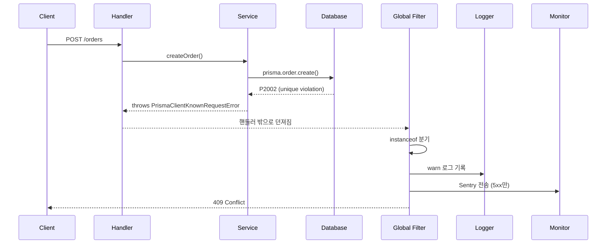

# NestJS Exception Filters

Exception Filter는 핸들러 내부에서 던져진 예외를 가로채서 HTTP 응답으로 변환하는 자리다. NestJS는 기본 필터(`BaseExceptionFilter`)를 가지고 있어서 아무것도 안 해도 어느 정도는 동작한다. `throw new BadRequestException()` 같은 걸 던지면 400 응답이 나가고, 그냥 `throw new Error()`를 던지면 500이 나간다. 여기까지는 누구나 안다.

문제는 운영 환경으로 넘어가면서 시작된다. Prisma가 던지는 `PrismaClientKnownRequestError`는 기본 필터에서 그대로 500이 된다. 유니크 제약 위반인지, 외래키 위반인지, 레코드 없음인지 모두 똑같이 500이다. 클라이언트는 자세한 이유를 받지 못하고, 백엔드 로그에는 스택 트레이스만 잔뜩 쌓인다. 비동기 핸들러에서 던진 예외가 어디로 흘러가는지, `setImmediate` 안에서 던진 예외가 왜 프로세스를 죽이는지도 헷갈리기 시작한다.

이 문서는 HttpException 계층의 구조부터 시작해서, 전역 필터를 어떻게 짜야 운영에서 흔히 만나는 케이스를 모두 잡을 수 있는지, ORM 에러를 HTTP 응답으로 어떻게 매핑하는지, Sentry 같은 외부 모니터링과 붙일 때 무엇이 어긋나는지, 응답 포맷을 어떻게 표준화해야 클라이언트와 모니터링이 같이 행복한지, AsyncLocalStorage로 요청 컨텍스트를 어떻게 흘려야 분산 추적이 끊기지 않는지, GraphQL과 WebSocket에서는 무엇이 달라지는지, 필터를 어떻게 테스트해야 회귀를 잡을 수 있는지까지 정리한다.

## HttpException 계층 구조

NestJS의 모든 HTTP 예외는 `HttpException`을 상속한다. 이게 출발점이다.

```typescript
export class HttpException extends Error {
  constructor(
    response: string | Record<string, any>,
    status: number,
    options?: HttpExceptionOptions,
  );

  getResponse(): string | object;
  getStatus(): number;
  cause?: unknown;
}
```

`response`는 클라이언트에게 보낼 응답 본문이고, `status`는 HTTP 상태 코드다. `response`로 문자열을 주면 NestJS가 자동으로 `{ statusCode, message }` 형태로 감싸서 응답한다. 객체를 주면 그 객체를 그대로 응답으로 쓴다. 이 차이를 모르면 응답 포맷이 라우트마다 제각각이 되는 일이 생긴다.

`HttpException`을 직접 던지는 경우는 드물고, 보통은 NestJS가 미리 만들어둔 서브클래스를 쓴다. 자주 쓰는 것만 정리하면 다음과 같다.

| 클래스 | 상태 코드 | 의미 |
|---|---|---|
| `BadRequestException` | 400 | 요청이 잘못됨. ValidationPipe가 던지는 기본 예외 |
| `UnauthorizedException` | 401 | 인증 실패. JWT 만료, 토큰 없음 |
| `ForbiddenException` | 403 | 권한 없음. 인증은 됐지만 접근 권한 없음 |
| `NotFoundException` | 404 | 리소스 없음 |
| `ConflictException` | 409 | 충돌. 유니크 제약 위반에 자주 쓴다 |
| `UnprocessableEntityException` | 422 | 요청 형식은 맞지만 의미상 처리 불가 |
| `InternalServerErrorException` | 500 | 서버 내부 오류. 기본 fallback |
| `ServiceUnavailableException` | 503 | 서비스 일시 중단. 헬스체크 실패 등 |

401과 403의 구분을 잘못 쓰는 경우가 의외로 많다. 401은 "당신이 누구인지 모르겠다"이고, 403은 "당신이 누구인지는 아는데 이건 못 본다"다. JWT 토큰이 없으면 401, 토큰은 유효한데 admin 권한이 없으면 403이다. 이걸 헷갈리면 프론트엔드의 인증 흐름(토큰 재발급, 로그인 페이지 리다이렉트)이 꼬인다.

`UnprocessableEntityException`(422)도 자주 오용된다. 422는 요청 본문의 형식(JSON 파싱, 타입)은 맞는데 비즈니스 규칙상 처리할 수 없는 경우에 쓴다. 예를 들면 "이미 결제 완료된 주문을 다시 결제 요청"한 경우다. 형식 자체가 잘못된 경우(필수 필드 누락, 타입 불일치)는 400이다.

### 커스텀 예외 만들기

도메인 예외를 만들고 싶을 때 두 가지 선택지가 있다.

첫째, `HttpException`을 바로 상속한다.

```typescript
export class OrderAlreadyPaidException extends HttpException {
  constructor(orderId: string) {
    super(
      {
        errorCode: 'ORDER_ALREADY_PAID',
        message: '이미 결제 완료된 주문입니다',
        orderId,
      },
      HttpStatus.CONFLICT,
    );
  }
}
```

응답 본문에 `errorCode`를 박아두면 프론트에서 에러 분기가 깔끔해진다. 메시지 문자열로 분기하는 건 위험하다. 메시지가 바뀌는 순간 프론트의 분기 로직이 깨진다.

둘째, 도메인 계층에서는 NestJS와 무관한 순수 에러를 던지고, 인프라 경계(컨트롤러나 전역 필터)에서 HTTP로 변환한다.

```typescript
// 도메인 계층 - NestJS와 무관
export class DomainError extends Error {
  constructor(public readonly code: string, message: string) {
    super(message);
  }
}

export class OrderAlreadyPaidError extends DomainError {
  constructor(public readonly orderId: string) {
    super('ORDER_ALREADY_PAID', '이미 결제 완료된 주문입니다');
  }
}
```

도메인 로직이 HTTP 프로토콜에 의존하지 않게 된다. 같은 도메인 코드를 gRPC나 큐 컨슈머에서 재사용할 때 HTTP 상태 코드가 끼어 있으면 어색하다. 단점은 어딘가에서 도메인 에러를 HTTP 상태로 매핑하는 코드가 한 번 더 필요하다는 점이다. 마이크로서비스나 멀티 프로토콜 환경이 아니라면 첫 번째 방식이 빠르다.

## 기본 필터의 동작과 한계

NestJS는 `BaseExceptionFilter`라는 전역 fallback을 기본으로 가진다. 이 필터의 동작은 단순하다.

- 던져진 게 `HttpException`이면 `getStatus()`와 `getResponse()`를 그대로 응답으로 내보낸다.
- 그렇지 않으면 500을 내보낸다. `process.env.NODE_ENV === 'production'`이면 "Internal server error" 같은 일반 메시지로, 개발 환경이면 스택 트레이스를 포함해서 응답에 박는다.

문제는 ORM 에러, validation 라이브러리 에러, 외부 SDK 에러가 모두 `HttpException`을 상속하지 않는다는 점이다. 그래서 기본 필터에 맡기면 전부 500이 된다. Prisma가 `P2002`(유니크 위반)을 던지든, `P2025`(레코드 없음)을 던지든, 클라이언트는 똑같은 500을 받는다.

또 하나 빠뜨리기 쉬운 점은 응답 포맷이 일관적이지 않다는 것이다. 기본 필터는 `HttpException`의 응답 본문을 가공 없이 그대로 넘긴다. 그래서 어떤 라우트는 `{ statusCode, message }` 형태이고, 어떤 라우트는 커스텀 객체가 그대로 내려간다. 클라이언트 입장에서 응답 스키마가 라우트마다 다른 셈이다. 운영 들어가서 모니터링 대시보드를 짜려고 보면 이게 발목을 잡는다.

## 전역 예외 필터 구현

전역 필터는 모든 예외를 한 곳에서 받아서 응답 포맷을 통일하고, 로깅하고, 필요하면 외부 시스템으로 보내는 단일 진입점 역할을 한다. 기본 형태는 다음과 같다.

```typescript
import {
  ArgumentsHost,
  Catch,
  ExceptionFilter,
  HttpException,
  HttpStatus,
  Logger,
} from '@nestjs/common';
import { Request, Response } from 'express';

@Catch()
export class GlobalExceptionFilter implements ExceptionFilter {
  private readonly logger = new Logger(GlobalExceptionFilter.name);

  catch(exception: unknown, host: ArgumentsHost): void {
    const ctx = host.switchToHttp();
    const response = ctx.getResponse<Response>();
    const request = ctx.getRequest<Request>();

    const { status, body } = this.toHttpResponse(exception);

    this.log(exception, request, status);

    response.status(status).json({
      ...body,
      path: request.url,
      timestamp: new Date().toISOString(),
      requestId: request.headers['x-request-id'],
    });
  }

  private toHttpResponse(exception: unknown): {
    status: number;
    body: Record<string, any>;
  } {
    if (exception instanceof HttpException) {
      const res = exception.getResponse();
      const body =
        typeof res === 'string'
          ? { message: res }
          : (res as Record<string, any>);

      return {
        status: exception.getStatus(),
        body: {
          errorCode: body.errorCode ?? 'HTTP_EXCEPTION',
          message: body.message ?? exception.message,
        },
      };
    }

    return {
      status: HttpStatus.INTERNAL_SERVER_ERROR,
      body: {
        errorCode: 'INTERNAL_SERVER_ERROR',
        message: '서버 내부 오류가 발생했습니다',
      },
    };
  }

  private log(exception: unknown, request: Request, status: number): void {
    const message = `${request.method} ${request.url} -> ${status}`;

    if (status >= 500) {
      this.logger.error(
        message,
        exception instanceof Error ? exception.stack : exception,
      );
    } else if (status >= 400) {
      this.logger.warn(message);
    }
  }
}
```

`@Catch()`를 인자 없이 쓰면 모든 예외를 잡는다. 특정 예외만 잡고 싶으면 `@Catch(PrismaClientKnownRequestError)`처럼 지정할 수 있다. 필터 여러 개를 등록하면 더 좁은 타입의 필터가 먼저 매칭된다.

`ArgumentsHost`를 거쳐서 Express의 `Request`/`Response` 객체를 꺼낸다. Fastify를 쓰는 경우 객체 타입만 다르고 흐름은 같다. WebSocket이나 gRPC에서도 같은 필터가 호출될 수 있어서, HTTP 컨텍스트가 아닌 경우의 처리도 필요하면 분기해야 한다.

```typescript
catch(exception: unknown, host: ArgumentsHost): void {
  if (host.getType() !== 'http') {
    // WebSocket이나 RPC 컨텍스트는 별도 처리
    return;
  }
  // ...
}
```

### 등록 방법

전역 필터를 등록하는 방법이 두 가지인데, 결과가 다르다.

```typescript
// 방법 1: main.ts
const app = await NestFactory.create(AppModule);
app.useGlobalFilters(new GlobalExceptionFilter());
```

```typescript
// 방법 2: 모듈 provider
@Module({
  providers: [
    {
      provide: APP_FILTER,
      useClass: GlobalExceptionFilter,
    },
  ],
})
export class AppModule {}
```

방법 1은 인스턴스를 직접 만들어서 등록하기 때문에 DI 컨테이너 밖에 있다. 그래서 필터 안에서 다른 서비스(예: Logger, ConfigService)를 주입받을 수 없다. 방법 2는 DI 컨테이너 안에서 인스턴스화되어 주입이 가능하다. 외부 모니터링 SDK나 ConfigService를 쓸 거면 무조건 방법 2를 써야 한다.

이걸 모르고 main.ts에서 `new`로 만들면, 필터 안에서 `this.configService`가 undefined이고 디버깅에 한참 헤맨다.

## ORM 에러 매핑

Prisma와 TypeORM이 던지는 에러를 HTTP 응답으로 매핑하는 게 실무에서 가장 자주 만나는 케이스다.

### Prisma 에러 매핑

Prisma는 알려진 에러를 `PrismaClientKnownRequestError`로 감싸서 던지고, 에러 코드(`P2002`, `P2025` 등)로 종류를 구분한다. 자주 만나는 코드는 다음과 같다.

| 코드 | 의미 | 매핑할 HTTP 상태 |
|---|---|---|
| `P2002` | 유니크 제약 위반 | 409 Conflict |
| `P2003` | 외래키 제약 위반 | 400 Bad Request |
| `P2025` | 작업 대상 레코드 없음 (update, delete) | 404 Not Found |
| `P2000` | 컬럼 길이 초과 | 400 Bad Request |
| `P2014` | 관계 위반 | 400 Bad Request |

전역 필터에 매핑 로직을 추가하면 된다.

```typescript
import { Prisma } from '@prisma/client';

private mapPrismaError(
  exception: Prisma.PrismaClientKnownRequestError,
): { status: number; body: Record<string, any> } {
  switch (exception.code) {
    case 'P2002': {
      const target = (exception.meta?.target as string[])?.join(', ');
      return {
        status: HttpStatus.CONFLICT,
        body: {
          errorCode: 'UNIQUE_CONSTRAINT_VIOLATION',
          message: `중복된 값이 존재합니다: ${target}`,
          field: target,
        },
      };
    }
    case 'P2025':
      return {
        status: HttpStatus.NOT_FOUND,
        body: {
          errorCode: 'RECORD_NOT_FOUND',
          message: '대상 레코드를 찾을 수 없습니다',
        },
      };
    case 'P2003':
      return {
        status: HttpStatus.BAD_REQUEST,
        body: {
          errorCode: 'FOREIGN_KEY_VIOLATION',
          message: '참조하는 레코드가 존재하지 않습니다',
        },
      };
    default:
      return {
        status: HttpStatus.INTERNAL_SERVER_ERROR,
        body: {
          errorCode: `PRISMA_${exception.code}`,
          message: '데이터베이스 처리 중 오류가 발생했습니다',
        },
      };
  }
}
```

Prisma 에러 메시지를 그대로 클라이언트에 노출하는 건 위험하다. 메시지에 테이블명, 컬럼명, 제약 조건 이름이 그대로 들어 있다. 운영 DB의 스키마 정보가 외부로 새어 나가는 셈이다. 위 예처럼 `meta.target`은 가공해서 필요한 필드명만 노출하고, 메시지는 사람이 읽기 좋은 한국어로 다시 쓰는 게 맞다.

`PrismaClientValidationError`(타입 불일치)와 `PrismaClientInitializationError`(연결 실패)도 따로 처리해야 한다. 후자는 500보다는 503(`ServiceUnavailableException`)이 맞다. 헬스체크 로직과 묶여서 모니터링되는 경우가 많다.

### TypeORM 에러 매핑

TypeORM은 Prisma보다 에러 분류가 덜 체계적이다. 드라이버가 던지는 에러를 그대로 노출하거나, `QueryFailedError`로 감싸서 던진다. DB 종류(MySQL, PostgreSQL)에 따라 에러 코드가 다르다.

```typescript
import { QueryFailedError } from 'typeorm';

private mapTypeOrmError(
  exception: QueryFailedError,
): { status: number; body: Record<string, any> } {
  const driverError = (exception as any).driverError;
  const code = driverError?.code;

  // PostgreSQL 에러 코드
  if (code === '23505') {
    return {
      status: HttpStatus.CONFLICT,
      body: {
        errorCode: 'UNIQUE_CONSTRAINT_VIOLATION',
        message: '중복된 값이 존재합니다',
      },
    };
  }
  if (code === '23503') {
    return {
      status: HttpStatus.BAD_REQUEST,
      body: {
        errorCode: 'FOREIGN_KEY_VIOLATION',
        message: '참조하는 레코드가 존재하지 않습니다',
      },
    };
  }

  // MySQL 에러 코드 (ER_DUP_ENTRY, ER_NO_REFERENCED_ROW_2)
  if (code === 'ER_DUP_ENTRY') {
    return {
      status: HttpStatus.CONFLICT,
      body: { errorCode: 'UNIQUE_CONSTRAINT_VIOLATION', message: '중복' },
    };
  }

  return {
    status: HttpStatus.INTERNAL_SERVER_ERROR,
    body: {
      errorCode: 'DATABASE_ERROR',
      message: '데이터베이스 처리 중 오류가 발생했습니다',
    },
  };
}
```

`(exception as any).driverError`로 캐스팅하는 부분이 거슬리지만 TypeORM의 타입 정의가 driver별로 정확하지 않아서 어쩔 수 없다. DB 종류가 정해져 있다면 인터페이스를 좁혀서 타입을 정의해두면 깔끔해진다.

TypeORM의 `EntityNotFoundError`는 `findOneOrFail`이 던진다. 이걸 잡아서 404로 변환하면 컨트롤러 코드가 단순해진다.

```typescript
import { EntityNotFoundError } from 'typeorm';

if (exception instanceof EntityNotFoundError) {
  return {
    status: HttpStatus.NOT_FOUND,
    body: {
      errorCode: 'RECORD_NOT_FOUND',
      message: '대상 레코드를 찾을 수 없습니다',
    },
  };
}
```

### 전체 매핑을 합친 필터

전역 필터의 `toHttpResponse` 메서드를 다음처럼 확장한다.

```typescript
private toHttpResponse(exception: unknown) {
  if (exception instanceof HttpException) {
    return this.mapHttpException(exception);
  }
  if (exception instanceof Prisma.PrismaClientKnownRequestError) {
    return this.mapPrismaError(exception);
  }
  if (exception instanceof Prisma.PrismaClientValidationError) {
    return {
      status: HttpStatus.BAD_REQUEST,
      body: {
        errorCode: 'PRISMA_VALIDATION_ERROR',
        message: '요청 파라미터가 올바르지 않습니다',
      },
    };
  }
  if (exception instanceof EntityNotFoundError) {
    return {
      status: HttpStatus.NOT_FOUND,
      body: { errorCode: 'RECORD_NOT_FOUND', message: '대상 없음' },
    };
  }
  if (exception instanceof QueryFailedError) {
    return this.mapTypeOrmError(exception);
  }
  return {
    status: HttpStatus.INTERNAL_SERVER_ERROR,
    body: {
      errorCode: 'INTERNAL_SERVER_ERROR',
      message: '서버 내부 오류가 발생했습니다',
    },
  };
}
```

`instanceof` 체크 순서가 중요하다. 좁은 타입을 먼저 체크해야 한다. `HttpException`을 상속한 커스텀 예외를 먼저 잡고, 그 다음 ORM 에러, 마지막에 fallback이다.

## 로깅 통합

운영 환경에서 예외 필터의 로깅은 두 가지를 만족해야 한다. 첫째, 4xx와 5xx를 구분해서 로그 레벨을 다르게 가져간다. 둘째, 로그에 요청 컨텍스트(URL, requestId, userId)가 포함되어야 추적이 가능하다.

```typescript
private log(
  exception: unknown,
  request: Request,
  status: number,
): void {
  const requestId = request.headers['x-request-id'] as string;
  const userId = (request as any).user?.id;

  const context = {
    method: request.method,
    url: request.url,
    requestId,
    userId,
    status,
  };

  if (status >= 500) {
    this.logger.error(
      `Unhandled exception: ${this.getErrorMessage(exception)}`,
      exception instanceof Error ? exception.stack : undefined,
      JSON.stringify(context),
    );
  } else if (status >= 400 && status !== 404) {
    // 404는 너무 시끄러워서 보통 제외
    this.logger.warn(this.getErrorMessage(exception), JSON.stringify(context));
  }
}

private getErrorMessage(exception: unknown): string {
  if (exception instanceof HttpException) {
    const res = exception.getResponse();
    return typeof res === 'string'
      ? res
      : (res as any).message ?? exception.message;
  }
  if (exception instanceof Error) {
    return exception.message;
  }
  return 'Unknown exception';
}
```

4xx를 전부 ERROR 레벨로 찍으면 로그가 폭발한다. ValidationPipe가 던지는 400이 정상 사용자 흐름에서도 자주 나오는데 이게 다 ERROR로 쌓이면 진짜 에러가 묻힌다. 보통 4xx는 WARN, 5xx는 ERROR로 가져간다. 404는 사람이 의도적으로 찔러보는 경우가 많아서 WARN조차 빼는 곳도 많다.

`request.headers['x-request-id']`는 인입 게이트웨이나 ALB에서 박아주는 헤더다. 없으면 미들웨어에서 `uuid`로 만들어서 박는다. 마이크로서비스로 갈수록 이게 없으면 분산 트레이싱이 불가능해진다.

### 로그 포맷

운영에서는 JSON 로그 포맷이 거의 표준이다. CloudWatch Logs Insights, Datadog, Loki 같은 도구가 모두 JSON 필드 기반으로 검색한다. NestJS 기본 Logger를 그대로 쓰면 사람 읽기 좋은 텍스트 포맷이라 운영에서 곤란해진다. Winston이나 Pino로 갈아끼우는 게 보통이다.

```typescript
// pino 기반 로거를 주입받는 예
constructor(
  @Inject(PINO_LOGGER) private readonly pinoLogger: Logger,
) {}

// 필터 안에서
this.pinoLogger.error(
  {
    err: exception,
    method: request.method,
    url: request.url,
    requestId,
    userId,
    status,
  },
  'Unhandled exception',
);
```

pino는 `err` 필드에 에러 객체를 넣으면 자동으로 직렬화한다. 스택 트레이스를 JSON 필드로 떨궈주기 때문에 검색이 편하다. NestJS의 `Logger`를 직접 쓰면 스택 트레이스가 메시지에 박혀서 검색이 안 된다.

## 응답 포맷 표준화

에러 응답 포맷은 한 번 정해두면 나중에 바꾸기가 매우 어렵다. 클라이언트가 이미 그 포맷을 파싱하는 코드를 가지고 있고, 모바일 앱은 강제 업데이트 없이는 갱신이 안 되기 때문이다. 그래서 초기에 포맷을 잘 정해두는 게 중요하다.

운영에서 자주 쓰는 패턴은 세 가지 정도가 있다.

첫째, NestJS 기본 포맷을 그대로 쓴다. `{ statusCode, message, error }` 형태인데, 이 포맷의 문제는 `message` 필드가 문자열일 때도 있고 배열일 때도 있다는 점이다. `ValidationPipe`가 던지는 400 응답은 `message: string[]`이고, 다른 예외는 `message: string`이다. 클라이언트에서 분기 코드가 더러워진다.

둘째, 직접 정의한 표준 포맷을 쓴다. 위 전역 필터 예제처럼 `{ errorCode, message, path, timestamp, requestId }` 같은 형태다. 가장 흔한 선택이고 자유도가 높다.

셋째, RFC 7807 Problem Details를 따른다. HTTP API 에러 응답에 대한 IETF 표준이다.

```typescript
interface ProblemDetails {
  type: string;        // 에러 종류를 식별하는 URI (문서 링크로 자주 씀)
  title: string;       // 사람이 읽는 짧은 요약
  status: number;      // HTTP 상태 코드
  detail?: string;     // 이번 발생 사례의 구체적 설명
  instance?: string;   // 이번 요청을 가리키는 URI (보통 request path)
  // 그 외 도메인별 확장 필드는 자유롭게 추가
}
```

응답 예시는 다음 형태가 된다.

```json
{
  "type": "https://api.example.com/errors/unique-constraint-violation",
  "title": "Unique constraint violation",
  "status": 409,
  "detail": "이미 등록된 이메일입니다",
  "instance": "/users",
  "field": "email",
  "requestId": "abc-123"
}
```

`Content-Type`을 `application/problem+json`으로 내려주면 표준 준수가 된다. 외부 파트너에게 공개하는 API라면 RFC 7807을 따르는 게 좋다. 사내 API라면 굳이 따르지 않아도 된다.

### 응답 포맷 버전 관리

응답 포맷을 바꾸고 싶을 때가 온다. 한 번 배포된 API의 응답을 바꾸면 기존 클라이언트가 깨진다. 두 가지 방법이 있다.

`Accept` 헤더로 협상하는 방식이 깔끔하다.

```typescript
@Catch()
export class GlobalExceptionFilter implements ExceptionFilter {
  catch(exception: unknown, host: ArgumentsHost): void {
    const ctx = host.switchToHttp();
    const request = ctx.getRequest<Request>();
    const response = ctx.getResponse<Response>();

    const accept = request.headers.accept ?? '';
    const useV2 = accept.includes('application/vnd.example.v2+json');

    const { status, body } = useV2
      ? this.buildV2Response(exception, request)
      : this.buildV1Response(exception, request);

    response.status(status).json(body);
  }
}
```

URL prefix로 버전을 나누는 방식(`/v1/...`, `/v2/...`)도 흔하다. NestJS의 `app.enableVersioning()`과 잘 어울린다. 다만 에러 응답의 버전 협상은 정상 응답보다 한 단계 어려운데, 에러는 라우팅이 끝나기 전에도 나올 수 있기 때문이다(404, 401). 그래서 전역 필터에서 헤더로 분기하는 게 보통 더 안정적이다.

### 개발 환경과 운영 환경 분리

500 응답에 스택 트레이스를 노출하는 건 운영에서 절대 안 된다. 내부 파일 경로, 라이브러리 버전, 데이터베이스 구조가 다 드러난다. 환경별로 다르게 처리한다.

```typescript
constructor(private readonly configService: ConfigService) {}

private buildErrorBody(
  exception: unknown,
  status: number,
): Record<string, any> {
  const isProd = this.configService.get('NODE_ENV') === 'production';
  const base = this.normalize(exception);

  if (!isProd && status >= 500) {
    return {
      ...base,
      stack: exception instanceof Error ? exception.stack : undefined,
      cause: (exception as any)?.cause,
    };
  }

  return base;
}
```

스테이징 환경에서는 stack을 노출하고 운영에서는 빼는 식으로 분기한다. 운영에서도 내부 직원만 접근하는 admin API는 다른 정책을 쓰는 경우가 있다.

## 요청 컨텍스트 전파 (AsyncLocalStorage)

전역 필터에서 `requestId`, `userId` 같은 컨텍스트를 로그에 박으려면 `request` 객체를 거쳐야 한다. 그런데 서비스 계층에서 던진 예외도 같은 컨텍스트가 필요할 때가 있고, 비동기 콜백 안의 로그에도 같은 트레이스 ID가 박혀야 한다. 매번 `request`를 함수 인자로 흘리는 건 깡통 의존성이 된다.

Node.js의 `AsyncLocalStorage`를 쓰면 비동기 경계를 넘나들면서 컨텍스트가 따라간다.

```typescript
import { AsyncLocalStorage } from 'node:async_hooks';

export interface RequestContext {
  requestId: string;
  userId?: string;
  startTime: number;
}

export const requestContext = new AsyncLocalStorage<RequestContext>();
```

미들웨어에서 컨텍스트를 시작한다.

```typescript
@Injectable()
export class RequestContextMiddleware implements NestMiddleware {
  use(req: Request, res: Response, next: NextFunction): void {
    const requestId =
      (req.headers['x-request-id'] as string) ?? randomUUID();

    requestContext.run(
      {
        requestId,
        userId: (req as any).user?.id,
        startTime: Date.now(),
      },
      () => next(),
    );
  }
}
```

이제 전역 필터, 서비스, 로거 어디서든 `requestContext.getStore()`로 꺼낼 수 있다.

```typescript
private log(exception: unknown, status: number): void {
  const store = requestContext.getStore();
  const requestId = store?.requestId ?? 'unknown';
  const duration = store ? Date.now() - store.startTime : undefined;

  this.logger.error({
    err: exception,
    requestId,
    userId: store?.userId,
    duration,
    status,
  });
}
```

`AsyncLocalStorage`는 `async/await`, `Promise`, 그리고 NestJS의 RxJS 흐름을 따라간다. 단, `setTimeout`이나 워커 스레드 같은 일부 경계는 자동으로 안 따라가는 경우가 있어서, 백그라운드 작업에 컨텍스트가 필요하면 명시적으로 `requestContext.run(currentContext, () => ...)`으로 다시 시작해야 한다.

OpenTelemetry를 함께 쓴다면 trace context는 OTel SDK가 자체 ALS로 관리한다. 둘을 따로 두지 말고, 필터에서 `trace.getActiveSpan()?.spanContext().traceId`를 로그에 같이 박아주면 로그-트레이스 연결이 깔끔해진다.

## 비동기 에러 처리 패턴

NestJS 핸들러는 async 함수다. 핸들러 안에서 `throw`하거나 reject된 Promise를 반환하면 필터가 자동으로 잡는다. 여기까지는 자연스럽다.

문제는 핸들러 바깥의 비동기 경로다.

### setImmediate, setTimeout 안에서 던진 예외

```typescript
@Get()
async problematic() {
  setImmediate(() => {
    throw new Error('이건 어디로 갈까');
  });
  return { ok: true };
}
```

이 예외는 NestJS의 필터로 가지 않는다. Node.js의 이벤트 루프 콜백 안에서 던져진 예외는 핸들러의 컨텍스트를 이미 벗어났기 때문에 try/catch도 못 잡고, 결국 `process.on('uncaughtException')`으로 흘러간다. 기본 동작은 프로세스가 죽는다.

콜백 안에서 작업이 필요하면 다음처럼 감싸야 한다.

```typescript
setImmediate(async () => {
  try {
    await someAsyncWork();
  } catch (err) {
    this.logger.error('Background work failed', err);
  }
});
```

더 나은 방법은 백그라운드 작업을 큐(BullMQ 같은)로 보내는 것이다. 응답 라이프사이클이 끝난 뒤에 돌아야 하는 작업을 핸들러 안에서 fire-and-forget으로 띄우면 에러 처리, 재시도, 모니터링이 전부 빠진다.

### Promise를 await 안 하기

```typescript
@Post()
async create(@Body() dto: CreateDto) {
  const result = await this.service.create(dto);
  this.service.sendNotification(result.id); // await 안 함
  return result;
}
```

`sendNotification`에서 던진 에러는 unhandled promise rejection이 된다. Node.js 15부터는 기본 동작이 프로세스 종료다. await을 빼먹지 않는 게 가장 단순한 답이지만, 응답 시간 때문에 정말로 fire-and-forget이 필요한 경우엔 명시적으로 처리한다.

```typescript
this.service
  .sendNotification(result.id)
  .catch((err) => this.logger.error('Notification failed', err));
```

### 핸들러가 Observable을 반환할 때

NestJS는 Observable 반환도 지원한다. RxJS 스트림 안에서 에러가 던져지면 NestJS가 잡아서 필터로 보낸다.

```typescript
@Get()
findAll(): Observable<User[]> {
  return this.userService.findAll().pipe(
    map(users => users.filter(u => u.active)),
    catchError(err => throwError(() => new InternalServerErrorException())),
  );
}
```

`catchError`로 변환하지 않고 그대로 흘려보내도 NestJS가 잡는다. 다만 RxJS 에러는 스택 트레이스가 얕아서 디버깅이 어렵다. 가능하면 비즈니스 로직에서 명확한 HttpException으로 바꿔주는 게 낫다.

### 프로세스 레벨 핸들러

전역 필터가 아무리 잘 짜여 있어도 닿지 않는 영역이 있다. `uncaughtException`과 `unhandledRejection`이다. Node.js 15부터 `unhandledRejection`의 기본 동작은 프로세스 종료다. 운영 중인 컨테이너가 갑자기 죽는 가장 흔한 원인이 이거다.

부트스트랩 시점에 둘 다 등록한다.

```typescript
async function bootstrap() {
  const app = await NestFactory.create(AppModule);
  const logger = app.get(Logger);

  process.on('unhandledRejection', (reason, promise) => {
    logger.error('Unhandled promise rejection', {
      reason: reason instanceof Error ? reason.stack : reason,
    });
    Sentry.captureException(reason);
  });

  process.on('uncaughtException', (err) => {
    logger.error('Uncaught exception', err.stack);
    Sentry.captureException(err);
    // 프로세스 상태가 손상됐을 가능성이 있으므로 정상 종료를 시도하고 죽는다
    void Sentry.flush(2000).then(() => process.exit(1));
  });

  await app.listen(3000);
}
```

`uncaughtException`을 잡았다고 해서 프로세스를 계속 살려두면 안 된다. 에러가 어디서 났는지 모르는 상태에서 메모리, DB 커넥션, 파일 디스크립터가 어떤 상태인지 알 수 없다. 로그와 모니터링 알림만 보내고 종료하는 게 안전하다. Kubernetes 같은 오케스트레이터가 컨테이너를 다시 띄워준다.

`unhandledRejection`은 케이스 바이 케이스다. 라이브러리 한쪽에서 fire-and-forget으로 던진 거라면 로그만 남기고 살려두는 게 낫고, 메인 흐름에서 빠진 거라면 종료하는 게 안전하다. 보통은 로그를 남기고 살려둔 뒤, Sentry에서 패턴이 보이면 그때 코드를 고친다.

graceful shutdown도 함께 짜둔다. 컨테이너가 SIGTERM을 받으면 새 요청은 안 받고, 진행 중인 요청은 끝내고, 모니터링은 flush한 뒤 종료한다.

```typescript
app.enableShutdownHooks();

process.on('SIGTERM', async () => {
  logger.log('SIGTERM received, shutting down');
  await Sentry.flush(5000);
  await app.close();
  process.exit(0);
});
```

`app.enableShutdownHooks()`는 NestJS의 `OnModuleDestroy`, `OnApplicationShutdown` 라이프사이클을 활성화한다. Prisma 클라이언트나 BullMQ 워커 같은 게 깔끔하게 종료된다.

## 전체 흐름

요청부터 응답까지의 에러 처리 흐름을 정리하면 다음과 같다.



5xx만 Sentry로 보내는 분기에 주목해라. 4xx는 클라이언트 잘못이거나 정상적인 비즈니스 흐름인 경우가 많아서 전부 외부 모니터링으로 보내면 노이즈가 폭발한다.

## Sentry 연동 시 주의점

Sentry 같은 에러 트래커를 붙일 때 흔히 놓치는 게 있다.

### 4xx까지 전부 보내면 안 된다

기본적으로 5xx만 Sentry로 보내야 한다. 4xx는 클라이언트의 잘못된 요청, validation 실패, 인증 실패 같은 정상 흐름이 대부분이다. 이걸 전부 Sentry로 보내면 한 달 안에 Sentry 요금이 폭발한다. 게다가 진짜 봐야 할 5xx가 4xx 노이즈에 묻혀서 안 보인다.

```typescript
private async reportToSentry(
  exception: unknown,
  request: Request,
  status: number,
): Promise<void> {
  if (status < 500) return;
  // 예외 중에서도 의도적으로 던진 5xx는 제외할 수 있음
  if (exception instanceof ServiceUnavailableException) return;

  Sentry.withScope((scope) => {
    scope.setTag('method', request.method);
    scope.setTag('url', request.url);
    scope.setUser({ id: (request as any).user?.id });
    scope.setContext('request', {
      headers: this.sanitizeHeaders(request.headers),
      query: request.query,
    });
    Sentry.captureException(exception);
  });
}
```

### PII와 시크릿 마스킹

요청 헤더와 본문에 인증 토큰, 비밀번호, 개인정보가 들어있다. Sentry로 그대로 보내면 외부 서비스에 민감 정보가 쌓인다. GDPR이나 개인정보보호법 이슈로 번질 수 있다.

```typescript
private sanitizeHeaders(headers: Record<string, any>): Record<string, any> {
  const sensitive = ['authorization', 'cookie', 'x-api-key'];
  const cleaned = { ...headers };
  for (const key of sensitive) {
    if (cleaned[key]) cleaned[key] = '[REDACTED]';
  }
  return cleaned;
}
```

요청 본문도 마찬가지다. `password`, `pin`, `ssn`, `card_number` 같은 키는 무조건 마스킹한다. Sentry SDK 자체에 `beforeSend` 훅이 있어서 거기서 일괄 처리하는 게 더 안전하다. 필터에서 누락해도 SDK 레벨에서 한 번 더 거른다.

```typescript
Sentry.init({
  dsn: process.env.SENTRY_DSN,
  beforeSend(event) {
    if (event.request?.headers) {
      delete event.request.headers['authorization'];
      delete event.request.headers['cookie'];
    }
    return event;
  },
});
```

### 같은 에러 그룹화

Sentry는 스택 트레이스와 메시지로 에러를 그룹화한다. 그런데 메시지에 동적인 값(주문 ID, 사용자 ID)이 들어가면 같은 종류의 에러가 매번 다른 그룹으로 잡힌다. 그룹이 폭발하면 알림이 무용지물이 된다.

```typescript
// 안 좋은 예: 매번 다른 그룹
throw new InternalServerErrorException(
  `결제 처리 실패: orderId=${orderId}, amount=${amount}`,
);

// 좋은 예: 메시지는 고정, 동적 값은 extra로
Sentry.withScope((scope) => {
  scope.setExtras({ orderId, amount });
  Sentry.captureException(new PaymentProcessingError());
});
```

전역 필터에서 메시지를 정규화하거나, `fingerprint`를 명시적으로 지정해서 그룹화 키를 통제하는 방법도 있다.

```typescript
scope.setFingerprint(['payment-error', exception.code ?? 'unknown']);
```

### 비동기 전송이 응답을 늦추면 안 된다

`Sentry.captureException`은 동기 호출처럼 보이지만 내부적으로 큐에 쌓이고 비동기 전송된다. 응답을 보내기 전에 `await Sentry.flush(2000)`를 하면 응답이 그만큼 지연된다. 짧은 핸들러일수록 체감이 크다.

Sentry 전송은 fire-and-forget으로 두고, 프로세스가 종료되기 전에만 flush한다. AWS Lambda 같은 환경이라면 handler 종료 직전에 flush가 필요할 수 있다. 일반 컨테이너라면 SIGTERM 핸들러에 flush를 걸어두면 된다.

```typescript
process.on('SIGTERM', async () => {
  await Sentry.flush(5000);
  process.exit(0);
});
```

### 운영 환경만 켜기

로컬 개발 환경에서 Sentry로 에러가 가면 노이즈도 노이즈고, 개발 중인 에러가 외부 시스템에 쌓이는 게 보안상 좋지 않다. `enabled` 옵션으로 환경별 분기를 명확히 한다.

```typescript
Sentry.init({
  dsn: process.env.SENTRY_DSN,
  enabled: process.env.NODE_ENV === 'production',
  environment: process.env.NODE_ENV,
  release: process.env.APP_VERSION,
});
```

`release`는 배포 버전과 묶이는 키다. Sentry에서 "이 에러가 어떤 버전부터 등장했나"를 볼 때 쓰는데, 이게 없으면 회귀 추적이 안 된다. CI에서 빌드할 때 git SHA나 태그를 박아주는 게 흔하다.

### 샘플링과 레이트 리밋

5xx만 보내도 트래픽이 큰 서비스에서는 분당 수천 건의 에러가 쌓일 수 있다. DB가 통째로 죽는 순간 같은 에러가 초당 수백 건씩 폭주한다. Sentry 쿼터를 한 시간 안에 소진하고 정작 다음날 발생한 다른 에러는 못 받는 상황이 생긴다.

Sentry SDK에 `tracesSampleRate`와 `sampleRate`가 있다.

```typescript
Sentry.init({
  dsn: process.env.SENTRY_DSN,
  // 에러 이벤트의 100%를 전송할지, 일부만 샘플링할지
  sampleRate: 1.0,
  // 같은 에러가 폭주할 때 동적으로 줄이려면 beforeSend에서 직접 처리
});
```

`sampleRate`는 모든 에러에 일괄 적용되기 때문에 한 가지 에러가 폭주해도 다른 에러까지 같이 누락된다. 더 정교하게 가려면 필터 안에서 같은 에러 키별로 카운팅하고, 임계치를 넘으면 일정 시간 동안 안 보낸다.

```typescript
private errorWindow = new Map<string, { count: number; resetAt: number }>();

private shouldReportToSentry(exception: unknown): boolean {
  const key = this.fingerprintOf(exception);
  const now = Date.now();
  const entry = this.errorWindow.get(key);

  if (!entry || entry.resetAt < now) {
    this.errorWindow.set(key, { count: 1, resetAt: now + 60_000 });
    return true;
  }

  entry.count++;
  // 분당 같은 에러 10건까지만 전송, 그 이후는 드랍
  return entry.count <= 10;
}
```

전역 상태라 인스턴스 스케일아웃하면 인스턴스 수만큼 곱해져서 통과한다는 한계는 있다. 정확한 글로벌 레이트 리밋이 필요하면 Redis로 옮기되, Sentry 보고 때문에 Redis 부하를 늘리는 건 본말전도다. 보통 인스턴스 단위로 충분하다.

## 컨트롤러/메서드 단위 필터

전역 필터로 대부분 해결되지만 특정 컨트롤러나 메서드에만 다른 처리가 필요한 경우가 있다.

```typescript
@Controller('webhooks')
@UseFilters(WebhookExceptionFilter)
export class WebhookController {
  // 웹훅은 200을 반환하지 않으면 외부에서 재시도하므로
  // 실패해도 200을 주고 내부적으로 알림만 보내는 등의 처리
}
```

웹훅 컨트롤러가 대표적이다. Stripe나 GitHub 웹훅은 200이 아니면 재시도하는데, 처리 중 에러가 났다고 500을 보내면 무한 재시도가 돌아간다. 그래서 웹훅 전용 필터로 200을 강제하고 내부 로깅만 하는 패턴이 흔하다.

`@UseFilters`로 메서드에 붙이면 그 메서드만 다른 필터를 탄다. 우선순위는 메서드 → 컨트롤러 → 전역 순서다.

## GraphQL과 WebSocket 컨텍스트

HTTP 외의 트랜스포트는 `ArgumentsHost`에서 꺼내는 객체가 다르다. 같은 전역 필터가 호출되더라도 분기를 안 하면 죽는다.

```typescript
catch(exception: unknown, host: ArgumentsHost): void {
  const type = host.getType<'http' | 'ws' | 'rpc' | 'graphql'>();

  switch (type) {
    case 'http':
      return this.handleHttp(exception, host);
    case 'graphql':
      return this.handleGraphQL(exception, host);
    case 'ws':
      return this.handleWebSocket(exception, host);
    default:
      this.logger.error('Unknown context type', { type });
  }
}
```

GraphQL은 `@nestjs/graphql`을 쓰면 `host.getType()`이 `'graphql'`로 나온다. Apollo Server가 자체 에러 포맷(`errors: [{message, extensions}]`)을 가지고 있어서, HTTP 응답처럼 status를 직접 쓰는 게 의미가 없다. GraphQL에서는 보통 `GraphQLException`을 던지거나, 일반 예외를 `formatError` 훅에서 한 번 더 가공한다.

```typescript
import { GqlArgumentsHost, GqlExceptionFilter } from '@nestjs/graphql';

@Catch()
export class GraphQLExceptionFilter implements GqlExceptionFilter {
  catch(exception: unknown, host: ArgumentsHost) {
    const gqlHost = GqlArgumentsHost.create(host);
    const ctx = gqlHost.getContext();

    if (exception instanceof HttpException) {
      return new GraphQLError(exception.message, {
        extensions: {
          code: this.mapStatusToGqlCode(exception.getStatus()),
          statusCode: exception.getStatus(),
          requestId: ctx.req?.headers['x-request-id'],
        },
      });
    }

    return new GraphQLError('Internal server error', {
      extensions: { code: 'INTERNAL_SERVER_ERROR' },
    });
  }

  private mapStatusToGqlCode(status: number): string {
    if (status === 400) return 'BAD_USER_INPUT';
    if (status === 401) return 'UNAUTHENTICATED';
    if (status === 403) return 'FORBIDDEN';
    if (status === 404) return 'NOT_FOUND';
    return 'INTERNAL_SERVER_ERROR';
  }
}
```

GraphQL 에러를 그대로 클라이언트에 노출하면 스키마 내부 구조가 새어 나간다. Apollo의 `formatError`에서 운영 환경에서는 `extensions.exception.stacktrace`를 제거하는 처리가 필수다.

WebSocket은 또 다르다. WebSocket Gateway에서 던진 예외는 `WsException`으로 감싸야 클라이언트에 메시지가 간다. 일반 `Error`를 그대로 던지면 서버 측에서는 잡히지만 클라이언트는 아무것도 못 받는다.

```typescript
import { BaseWsExceptionFilter } from '@nestjs/websockets';

@Catch()
export class GlobalWsExceptionFilter extends BaseWsExceptionFilter {
  catch(exception: unknown, host: ArgumentsHost) {
    const client = host.switchToWs().getClient();
    const data = this.normalize(exception);

    client.emit('error', {
      errorCode: data.errorCode,
      message: data.message,
    });

    if (data.status >= 500) {
      this.logger.error('WS exception', { err: exception });
    }
  }
}
```

WebSocket에서는 HTTP 상태 코드가 없고, 클라이언트가 어떤 채널로 에러를 받을지 합의해 둬야 한다. 보통 `error` 이벤트로 받는다. 인증 실패처럼 연결 자체를 끊어야 하는 경우는 `client.disconnect(true)`를 호출한다.

마이크로서비스(RPC)도 같은 구조다. `RpcException`으로 감싸지 않으면 클라이언트로 안 간다. 트랜스포트(NATS, Redis, gRPC)에 따라 메시지 포맷이 또 달라서 트랜스포트별 필터를 따로 두는 경우가 많다.

## 필터 단위 테스트

전역 필터는 한 번 잘못 짜면 모든 라우트의 에러 응답이 망가진다. 단위 테스트로 회귀를 잡아두는 게 중요하다.

```typescript
import { Test } from '@nestjs/testing';
import { ArgumentsHost, HttpStatus } from '@nestjs/common';

describe('GlobalExceptionFilter', () => {
  let filter: GlobalExceptionFilter;
  let mockResponse: { status: jest.Mock; json: jest.Mock };
  let mockHost: ArgumentsHost;

  beforeEach(async () => {
    const moduleRef = await Test.createTestingModule({
      providers: [GlobalExceptionFilter],
    }).compile();

    filter = moduleRef.get(GlobalExceptionFilter);

    mockResponse = {
      status: jest.fn().mockReturnThis(),
      json: jest.fn().mockReturnThis(),
    };

    mockHost = {
      switchToHttp: () => ({
        getResponse: () => mockResponse,
        getRequest: () => ({
          method: 'POST',
          url: '/orders',
          headers: { 'x-request-id': 'test-req-1' },
        }),
      }),
      getType: () => 'http',
    } as unknown as ArgumentsHost;
  });

  it('HttpException은 상태 코드와 본문을 그대로 응답한다', () => {
    const exception = new BadRequestException('잘못된 요청');

    filter.catch(exception, mockHost);

    expect(mockResponse.status).toHaveBeenCalledWith(HttpStatus.BAD_REQUEST);
    expect(mockResponse.json).toHaveBeenCalledWith(
      expect.objectContaining({
        message: '잘못된 요청',
        requestId: 'test-req-1',
      }),
    );
  });

  it('Prisma P2002는 409 Conflict로 매핑한다', () => {
    const exception = new Prisma.PrismaClientKnownRequestError(
      'Unique constraint failed',
      { code: 'P2002', clientVersion: '5.0.0', meta: { target: ['email'] } },
    );

    filter.catch(exception, mockHost);

    expect(mockResponse.status).toHaveBeenCalledWith(HttpStatus.CONFLICT);
    expect(mockResponse.json).toHaveBeenCalledWith(
      expect.objectContaining({
        errorCode: 'UNIQUE_CONSTRAINT_VIOLATION',
        field: 'email',
      }),
    );
  });

  it('알 수 없는 에러는 500과 일반 메시지로 응답한다', () => {
    const exception = new Error('DB connection lost');

    filter.catch(exception, mockHost);

    expect(mockResponse.status).toHaveBeenCalledWith(
      HttpStatus.INTERNAL_SERVER_ERROR,
    );
    expect(mockResponse.json).toHaveBeenCalledWith(
      expect.objectContaining({
        errorCode: 'INTERNAL_SERVER_ERROR',
      }),
    );
    // 내부 메시지가 노출되지 않는지 확인
    expect(mockResponse.json.mock.calls[0][0].message).not.toContain(
      'DB connection lost',
    );
  });
});
```

단위 테스트에서 가장 중요한 케이스는 500 응답에 내부 에러 메시지가 누출되지 않는지다. Sentry에 보낼 정보와 클라이언트에 응답할 정보를 명확히 분리하는 게 운영 보안의 기본이다.

e2e 테스트로 실제 라우트를 호출해서 응답 포맷이 일관적인지도 확인한다. `supertest`로 일부러 에러를 유발하는 요청을 보내고, 응답 스키마를 `expect(body).toMatchSchema(errorSchema)` 같은 방식으로 검증한다.

## 운영에서 실제로 부딪히는 문제들

전역 필터를 처음 짜서 운영에 올리면 클라이언트 팀에서 가장 먼저 들어오는 컴플레인은 응답 포맷이 라우트마다 다르다는 것이다. 어떤 라우트는 `{ statusCode, message }`, 어떤 라우트는 커스텀 객체가 그대로 내려간다. 전역 필터에서 한 번 더 가공해서 단일 스키마로 강제하지 않으면 클라이언트의 에러 분기 코드가 라우트 수만큼 늘어난다.

500 응답에 스택 트레이스가 노출되는 일은 의외로 자주 일어난다. 개발 빌드 설정을 그대로 운영에 올리거나, NestJS 기본 동작이 `NODE_ENV`를 안 보고 그대로 노출하는 경우가 있다. 운영 빌드는 무조건 일반 메시지로 마스킹하고, 스택은 로그에만 남긴다. 같은 맥락에서 ValidationPipe의 400 응답에 내부 DTO 필드명이 그대로 박혀 나가는 것도 점검 대상이다. 외부 공개 API라면 필드명만 남기고 객체 구조는 가리는 게 안전하다.

ORM 에러가 500으로 잡히는 문제도 흔하다. Prisma의 P2002, P2025를 매핑하지 않으면 클라이언트는 재시도해야 할 에러와 재시도하면 안 되는 에러를 구분할 수 없다. 매핑 테이블이 작을 때는 필터 안에 두지만, 도메인 예외 종류가 10개를 넘어가면 별도 서비스로 빼는 게 낫다. `ExceptionMappingService`를 주입받게 만들면 단위 테스트가 쉬워지고, 새 예외가 추가될 때 필터를 건드리지 않아도 된다.

Sentry 쪽에서는 4xx까지 다 보내서 쿼터를 일주일 만에 소진하는 사고가 흔하다. 5xx만 보내고, 그 안에서도 의도된 `ServiceUnavailableException`이나 정기 점검 응답은 제외한다. 같은 에러 폭주 시 인스턴스 단위로 분당 N건 제한을 거는 패턴도 같이 둔다.

비동기 콜백 안의 에러가 프로세스를 죽이는 사고는 트래픽 피크 시점에 자주 터진다. `uncaughtException`, `unhandledRejection`을 부트스트랩에 반드시 등록하고, fire-and-forget 코드는 `.catch`를 빼먹지 않는다는 코드 리뷰 룰을 세운다. 가능하면 fire-and-forget을 BullMQ 같은 큐로 옮긴다.

마지막으로 전역 필터는 한 번 잘 짜두면 오래 간다. 다만 도메인 예외 → HTTP 매핑이 늘어날수록 필터 자체가 비대해진다. 매핑 로직을 별도 서비스로 빼서 주입받게 만들고, 필터는 라우팅과 응답 형식 통일만 담당하게 책임을 좁히는 게 유지보수에 유리하다.
