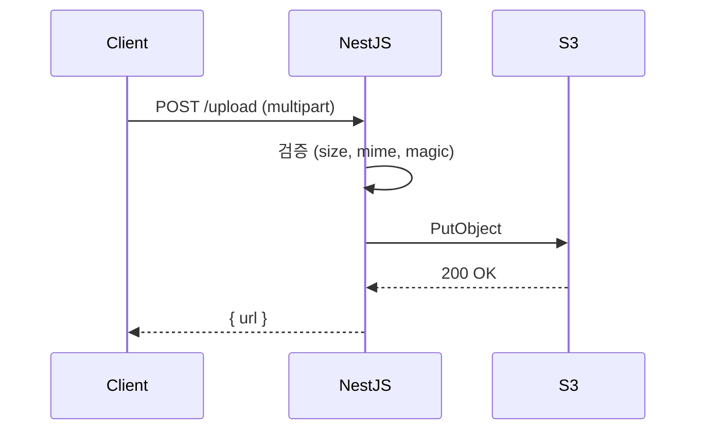
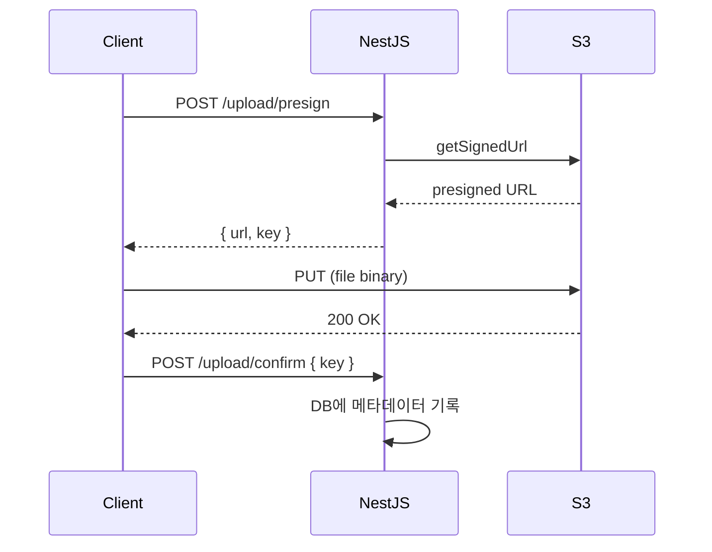
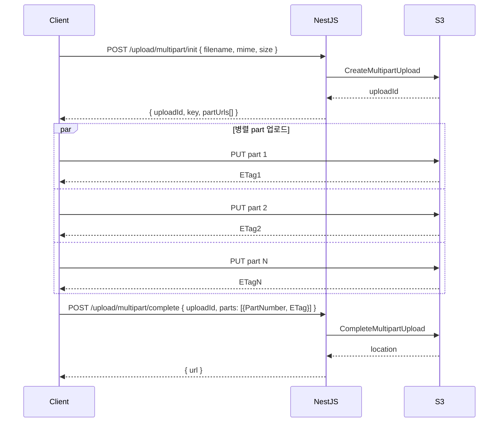

# NestJS File Upload

파일 업로드는 처음 보면 `@UploadedFile()` 데코레이터 한 줄로 끝나는 것 같지만, 실제 운영에 올리면 메모리 폭주, 디스크 가득 참, MIME 스푸핑, 대용량 타임아웃, S3 비용 폭증 같은 문제가 줄줄이 따라온다. NestJS는 내부적으로 Express + Multer 조합(또는 Fastify의 `@fastify/multipart`)을 그대로 쓰기 때문에, Multer의 동작을 이해하지 못한 채 NestJS 데코레이터만 외워서 쓰면 어디서 메모리가 새는지 추적이 안 된다.

이 문서는 인터셉터 3종의 차이, storage 전략, S3 직접/경유 업로드, ParseFilePipe 검증, 스트리밍 처리, multipart presigned URL 분할 업로드까지 다룬다.

## 인터셉터 3종 — FileInterceptor / FilesInterceptor / FileFieldsInterceptor

NestJS가 제공하는 파일 인터셉터는 `@nestjs/platform-express` 패키지에 들어있다. Fastify를 쓰면 `@nestjs/platform-fastify`의 `@fastify/multipart` 기반 헬퍼를 따로 깔아야 한다. 이름이 비슷해서 헷갈리기 쉬운데, 받는 필드 구조가 다르다.

### FileInterceptor — 단일 파일, 단일 필드

가장 단순한 경우. multipart/form-data로 들어오는 한 필드의 파일 하나만 받는다.

```ts
import {
  Controller,
  Post,
  UploadedFile,
  UseInterceptors,
} from '@nestjs/common';
import { FileInterceptor } from '@nestjs/platform-express';

@Controller('upload')
export class UploadController {
  @Post('avatar')
  @UseInterceptors(FileInterceptor('avatar'))
  uploadAvatar(@UploadedFile() file: Express.Multer.File) {
    return {
      original: file.originalname,
      mime: file.mimetype,
      size: file.size,
    };
  }
}
```

첫 인자 `'avatar'`가 form 필드 이름이다. 프론트에서 `formData.append('avatar', file)`로 보낸 것과 정확히 일치해야 한다. 필드 이름이 다르면 `file`이 `undefined`로 들어온다. 디버깅하다가 한참 헤매는 흔한 실수다.

### FilesInterceptor — 단일 필드에 여러 파일

같은 필드 이름으로 여러 파일이 들어올 때 쓴다. `<input type="file" multiple>`로 보낸 경우다.

```ts
import { FilesInterceptor } from '@nestjs/platform-express';

@Post('photos')
@UseInterceptors(FilesInterceptor('photos', 10))
uploadPhotos(@UploadedFiles() files: Express.Multer.File[]) {
  return files.map((f) => f.originalname);
}
```

두 번째 인자가 최대 개수다. 안 주면 무제한처럼 보이지만 실제로는 Multer의 `limits.files` 디폴트(`Infinity`)가 적용된다. 무제한으로 두면 누가 1000개짜리 form을 보내는 순간 서버가 곤란해진다. 운영에서는 무조건 상한을 잡아야 한다.

`@UploadedFiles()`는 배열로 받는다. 단수형 `@UploadedFile()`을 쓰면 안 들어온다.

### FileFieldsInterceptor — 여러 필드에 여러 파일

폼이 복합 구조일 때 쓴다. 예를 들어 상품 등록 폼에서 대표 이미지 1장과 상세 이미지 5장을 따로 받는 경우다.

```ts
import { FileFieldsInterceptor } from '@nestjs/platform-express';

@Post('product')
@UseInterceptors(
  FileFieldsInterceptor([
    { name: 'thumbnail', maxCount: 1 },
    { name: 'gallery', maxCount: 5 },
  ]),
)
uploadProduct(
  @UploadedFiles()
  files: {
    thumbnail?: Express.Multer.File[];
    gallery?: Express.Multer.File[];
  },
) {
  const thumb = files.thumbnail?.[0];
  const gallery = files.gallery ?? [];
  return { thumb: thumb?.originalname, gallery: gallery.length };
}
```

여기서 주의할 점이 두 가지 있다. 첫째, `thumbnail` 필드도 `maxCount: 1`로 줘도 `Express.Multer.File`이 아니라 `Express.Multer.File[]` 배열로 들어온다. 둘째, 필드가 누락되면 키 자체가 없을 수 있으니 `?.` 옵셔널 체이닝이 안전하다.

`AnyFilesInterceptor`라는 4번째도 있는데, 필드 이름을 미리 알 수 없는 동적 폼에서만 쓴다. 어지간하면 위 3개로 끝낸다.

### 인터셉터 선택 가이드

| 상황 | 인터셉터 | 핵심 옵션 |
|---|---|---|
| 단일 파일 단일 필드 | `FileInterceptor('field')` | - |
| 같은 필드에 여러 파일 | `FilesInterceptor('field', max)` | 최대 개수 필수 |
| 여러 필드 각기 다른 파일 | `FileFieldsInterceptor([...])` | maxCount 명시 |
| 필드 이름이 동적 | `AnyFilesInterceptor()` | 거의 안 씀 |

## Multer storage — diskStorage vs memoryStorage

NestJS 파일 인터셉터의 두 번째 인자로 Multer 옵션을 넘길 수 있다. 여기서 storage 전략을 정한다. 기본값이 `memoryStorage`라는 점이 가장 큰 함정이다.

### memoryStorage — 메모리에 Buffer로 적재

별도 설정 없이 인터셉터를 쓰면 파일이 통째로 RAM에 올라온다. `file.buffer`로 접근 가능하다.

```ts
import { memoryStorage } from 'multer';

@Post('image')
@UseInterceptors(
  FileInterceptor('image', {
    storage: memoryStorage(),
    limits: { fileSize: 5 * 1024 * 1024 }, // 5MB
  }),
)
uploadImage(@UploadedFile() file: Express.Multer.File) {
  // file.buffer 로 바로 S3.putObject 가능
  return this.s3.upload(file.buffer, file.originalname);
}
```

장점은 명확하다. 디스크 I/O 없이 메모리에서 바로 S3로 던질 수 있다. 단점도 명확하다. 동시에 100MB 파일 50개가 들어오면 5GB가 RAM에 올라간다. K8s pod limit에 걸려서 OOMKilled가 나거나, Node.js heap이 터진다.

memoryStorage는 작은 파일(이미지 썸네일, 프로필 사진 정도)에서만 쓰는 게 안전하다. `limits.fileSize`를 무조건 박아두고, 그 값이 RAM 여유와 동시 요청 수를 곱한 값보다 작은지 확인해야 한다.

### diskStorage — 임시 디렉토리에 저장

대용량 파일은 디스크에 임시로 쓴 다음 후처리하는 게 안전하다.

```ts
import { diskStorage } from 'multer';
import { extname } from 'path';
import { randomUUID } from 'crypto';

@Post('video')
@UseInterceptors(
  FileInterceptor('video', {
    storage: diskStorage({
      destination: '/tmp/uploads',
      filename: (req, file, cb) => {
        const ext = extname(file.originalname);
        cb(null, `${randomUUID()}${ext}`);
      },
    }),
    limits: { fileSize: 1024 * 1024 * 1024 }, // 1GB
  }),
)
async uploadVideo(@UploadedFile() file: Express.Multer.File) {
  // file.path 에 임시 파일 경로가 있다
  // 처리 후 반드시 unlink 해줘야 한다
  try {
    await this.transcoder.process(file.path);
  } finally {
    await fs.promises.unlink(file.path).catch(() => {});
  }
}
```

`filename` 콜백에서 원본 이름을 그대로 쓰면 디렉토리 트래버설(`../../../etc/passwd`) 공격에 노출된다. 반드시 UUID나 해시로 새 이름을 만들어야 한다. 확장자도 신뢰하면 안 되고, 후처리에서 실제 매직 넘버를 검사하는 게 안전하다.

처리 후 `unlink`를 빼먹으면 `/tmp`이 가득 차서 다음 업로드가 전부 실패한다. `finally` 블록에 반드시 넣어야 하고, 실패해도 무시(`catch(() => {})`)하는 게 안전하다. 이미 파일이 없는 상태에서 unlink가 또 던지면 본 처리 결과가 묻힌다.

### custom storage — S3에 바로 스트리밍

Multer는 storage 엔진을 직접 구현할 수 있다. `multer-s3` 패키지가 대표적인데, 디스크 경유 없이 들어오는 스트림을 S3 multipart로 바로 흘려보낸다.

```ts
import multerS3 from 'multer-s3';
import { S3Client } from '@aws-sdk/client-s3';

const s3 = new S3Client({ region: 'ap-northeast-2' });

@Post('attachment')
@UseInterceptors(
  FileInterceptor('file', {
    storage: multerS3({
      s3,
      bucket: 'my-uploads',
      key: (req, file, cb) => {
        cb(null, `attachments/${randomUUID()}-${file.originalname}`);
      },
      contentType: multerS3.AUTO_CONTENT_TYPE,
    }),
    limits: { fileSize: 100 * 1024 * 1024 },
  }),
)
uploadAttachment(@UploadedFile() file: Express.MulterS3.File) {
  return { url: file.location, key: file.key };
}
```

서버 디스크와 메모리를 거의 안 쓰면서 S3에 올린다. 다만 업로드 도중 검증을 통과 못 하면 이미 부분 업로드된 객체가 S3에 남는다. multerS3는 fileFilter에서 거부해도 부분 객체를 정리해주지 않는 버전이 있어서, S3 라이프사이클 규칙으로 incomplete multipart upload를 자동 정리하는 설정을 별도로 걸어둬야 한다.

## ParseFilePipe + FileTypeValidator — 검증 파이프

업로드된 파일을 컨트롤러에서 if문으로 검증하면 코드가 지저분해진다. NestJS 9부터 `ParseFilePipe`가 들어왔다. 검증기를 조합해서 데코레이터 레벨에서 막아준다.

### MaxFileSizeValidator, FileTypeValidator

```ts
import {
  FileTypeValidator,
  MaxFileSizeValidator,
  ParseFilePipe,
} from '@nestjs/common';

@Post('avatar')
@UseInterceptors(FileInterceptor('avatar'))
uploadAvatar(
  @UploadedFile(
    new ParseFilePipe({
      validators: [
        new MaxFileSizeValidator({ maxSize: 2 * 1024 * 1024 }),
        new FileTypeValidator({ fileType: /^image\/(jpeg|png|webp)$/ }),
      ],
    }),
  )
  file: Express.Multer.File,
) {
  return this.userService.updateAvatar(file);
}
```

검증 실패 시 자동으로 `400 Bad Request`가 떨어진다. 에러 메시지를 커스텀하려면 `ParseFilePipe`의 `errorHttpStatusCode`와 `exceptionFactory`를 조정한다.

### FileTypeValidator의 함정 — MIME 스푸핑

`FileTypeValidator`가 기본적으로 검사하는 건 클라이언트가 보낸 `Content-Type` 헤더와 파일명 확장자 둘 다 신뢰한다는 점이다. 즉 공격자가 `.png`로 이름만 바꾸고 안에 PHP 코드가 있는 파일을 올려도 통과한다.

실제 운영에서는 magic number 기반 검사기를 따로 깔아야 한다. `file-type` 라이브러리가 표준에 가깝다.

```ts
import { FileValidator } from '@nestjs/common';
import { fileTypeFromBuffer } from 'file-type';

export class MagicNumberValidator extends FileValidator<{
  allowed: string[];
}> {
  constructor(options: { allowed: string[] }) {
    super(options);
  }

  async isValid(file: Express.Multer.File): Promise<boolean> {
    if (!file?.buffer) return false;
    const detected = await fileTypeFromBuffer(file.buffer);
    if (!detected) return false;
    return this.validationOptions.allowed.includes(detected.mime);
  }

  buildErrorMessage(file: Express.Multer.File): string {
    return `허용되지 않은 파일 형식. allowed=${this.validationOptions.allowed.join(',')}`;
  }
}
```

이걸 `ParseFilePipe`에 끼우면 매직 넘버 기준으로 막힌다.

```ts
@UploadedFile(
  new ParseFilePipe({
    validators: [
      new MaxFileSizeValidator({ maxSize: 5 * 1024 * 1024 }),
      new MagicNumberValidator({ allowed: ['image/jpeg', 'image/png'] }),
    ],
  }),
)
file: Express.Multer.File,
```

다만 매직 넘버 검사는 `file.buffer`가 필요하다. `diskStorage`나 `multerS3`를 쓰면 buffer가 없어서 검사 자체가 안 된다. 그땐 fileFilter에서 일부만 읽거나, 일단 받은 뒤 파일 첫 4KB를 다시 읽어 검사하는 방식으로 처리한다.

### fileIsRequired 옵션

폼에서 파일이 선택사항인 경우 `fileIsRequired: false`를 줘야 한다. 안 주면 파일 안 보냈을 때 검증이 실패 처리된다.

```ts
@UploadedFile(
  new ParseFilePipe({
    fileIsRequired: false,
    validators: [
      new MaxFileSizeValidator({ maxSize: 1024 * 1024 }),
    ],
  }),
)
file?: Express.Multer.File,
```

## S3 직접 업로드 vs 서버 경유 업로드

업로드 아키텍처는 크게 두 갈래다. 어느 쪽을 택하느냐가 비용, 보안, 사용자 경험을 다 바꾼다.

### 서버 경유 — 가장 흔한 방식

클라이언트가 NestJS 서버에 multipart로 보내고, 서버가 받아서 S3에 다시 올린다.



장점은 서버가 모든 트래픽을 보기 때문에 검증, 로깅, 인증, 후처리(썸네일 생성, OCR, 바이러스 스캔)를 한 곳에서 묶을 수 있다는 것이다. 단점은 명확하다. 트래픽이 서버를 두 번 통과한다(클라이언트→서버, 서버→S3). 100MB 영상을 100명이 동시에 올리면 서버 네트워크 대역폭이 10Gbps를 먹는다. EC2 t3.medium 같은 인스턴스로는 못 버틴다.

작은 파일(이미지, 문서)에는 서버 경유가 깔끔하다. 100MB 이상 파일은 다른 방식을 고려해야 한다.

### 직접 업로드 — presigned URL

S3가 presigned URL을 발급해주면 클라이언트가 그 URL로 직접 PUT 요청을 보낸다. NestJS 서버는 URL만 발급하고 빠진다.

```ts
import {
  S3Client,
  PutObjectCommand,
} from '@aws-sdk/client-s3';
import { getSignedUrl } from '@aws-sdk/s3-request-presigner';

@Injectable()
export class UploadService {
  private readonly s3 = new S3Client({ region: 'ap-northeast-2' });

  async createPresignedUrl(userId: string, filename: string, mime: string) {
    const key = `users/${userId}/${randomUUID()}-${filename}`;
    const command = new PutObjectCommand({
      Bucket: 'my-uploads',
      Key: key,
      ContentType: mime,
      // 클라이언트가 임의로 큰 파일을 못 올리도록 정책에 size 제한 박아두기
    });
    const url = await getSignedUrl(this.s3, command, { expiresIn: 300 });
    return { url, key };
  }
}
```

```ts
@Controller('upload')
export class UploadController {
  @Post('presign')
  presign(@CurrentUser() user: User, @Body() body: PresignDto) {
    return this.uploadService.createPresignedUrl(
      user.id,
      body.filename,
      body.mime,
    );
  }
}
```



장점은 서버가 파일 트래픽에서 완전히 빠진다는 점이다. 단점은 검증을 서버에서 못 한다는 점이다. 그래서 보통 두 가지 보강을 한다.

첫째, presigned URL을 발급할 때 `Content-Length-Range`나 `ContentType`을 정책에 박아 넣어서 S3가 거부하게 만든다. presigned POST(`createPresignedPost`)를 쓰면 정책 안에 size 범위, 메타데이터 조건을 강제할 수 있다.

둘째, 업로드가 끝나면 클라이언트가 `/upload/confirm`을 호출하고, 서버가 S3 ObjectMetadata를 다시 읽어 검증한다. 또는 S3 이벤트 → SQS/Lambda 파이프라인을 걸어두고, 거기서 매직 넘버 검사, 바이러스 스캔을 비동기로 돌린다.

### 어느 쪽을 택할까

| 기준 | 서버 경유 | presigned 직접 |
|---|---|---|
| 파일 크기 | < 50MB 권장 | 50MB 이상 |
| 검증 시점 | 업로드 중 동기 | 업로드 후 비동기 |
| 서버 트래픽 비용 | 높음 | 거의 0 |
| 구현 난이도 | 낮음 | 중간 |
| 사용자 경험 | 진행률 단순 | 진행률 + 재시도 직접 구현 |

운영에서는 종종 둘을 섞는다. 작은 첨부는 서버 경유로 받고, 동영상이나 백업 같은 큰 파일은 presigned로 보낸다.

## 스트리밍 업로드와 백프레셔

대용량 파일을 받아서 다른 어딘가로 흘려보내야 할 때(예: NestJS에서 받아서 외부 스토리지에 프록시하거나, 받으면서 동시에 압축 해제) 스트리밍 처리가 필요하다. Multer의 기본 동작은 메모리든 디스크든 일단 다 받은 뒤에 컨트롤러로 넘기지만, 진짜 스트리밍을 하려면 raw multipart 파싱이나 fastify-multipart의 stream 모드를 써야 한다.

### Fastify multipart로 스트리밍

NestJS를 Fastify 어댑터로 띄운 경우 `@fastify/multipart`가 stream 인터페이스를 그대로 노출한다.

```ts
import { FastifyRequest } from 'fastify';

@Post('stream')
async streamUpload(@Req() req: FastifyRequest) {
  const data = await req.file();
  if (!data) throw new BadRequestException('파일 없음');

  // data.file 이 Readable stream
  const passthrough = data.file;

  await pipeline(
    passthrough,
    createGzip(),
    createWriteStream('/tmp/out.gz'),
  );
  return { ok: true };
}
```

`pipeline`(node:stream/promises)이 백프레셔를 자동으로 처리한다. 절대 `for await...of`로 chunk를 받아서 따로 처리하지 말고 pipeline에 맡겨야 한다. 직접 받으면 다운스트림이 느릴 때 메모리가 쌓인다.

### Express에서 raw 스트림 받기

Express에서는 인터셉터를 안 쓰고 `req`를 직접 stream으로 받는다. body parser가 먼저 소비하지 않도록 해당 라우트에서 body parser를 끄는 설정이 필요하다.

```ts
import { Request } from 'express';

@Post('raw')
async rawUpload(@Req() req: Request) {
  // multipart 파싱은 busboy로 직접
  const busboy = Busboy({ headers: req.headers });

  return new Promise((resolve, reject) => {
    busboy.on('file', (fieldname, file, info) => {
      const upload = this.s3.uploadStream({
        Bucket: 'my-uploads',
        Key: `raw/${randomUUID()}-${info.filename}`,
        Body: file,
      });
      upload.done().then(resolve).catch(reject);
    });
    busboy.on('error', reject);
    req.pipe(busboy);
  });
}
```

`@aws-sdk/lib-storage`의 `Upload` 클래스가 내부적으로 multipart upload를 자동으로 쪼개주기 때문에, 스트림을 그대로 넘기면 S3가 5MB씩 알아서 받는다. 백프레셔도 처리해준다.

### 백프레셔를 무시하면 생기는 일

스트림 처리에서 가장 흔한 사고가 백프레셔 무시다. 업로드 속도가 디스크 쓰기 속도보다 빠르면, drain 이벤트를 기다리지 않은 chunk들이 내부 버퍼에 쌓인다. 메모리가 무한히 올라가다가 결국 OOM이 난다.

`pipeline()`이나 `pipe()`는 내부적으로 backpressure를 처리하지만, `data` 이벤트를 직접 받아서 다른 스트림에 `write`하면 직접 처리해줘야 한다.

```ts
// 잘못된 예
upstream.on('data', (chunk) => {
  downstream.write(chunk); // write 반환값 무시 = 백프레셔 무시
});

// 올바른 예 — pipeline에 맡기기
await pipeline(upstream, downstream);
```

## 대용량 파일 분할 업로드 — Multipart Presigned URL

수GB 단위 파일을 한 번에 PUT으로 올리면 네트워크가 한 번이라도 끊겼을 때 처음부터 다시 올려야 한다. S3 multipart upload는 파일을 여러 part로 쪼개서 각 part를 독립적으로 올리고, 마지막에 complete API로 합치는 방식이다. 각 part에 presigned URL을 발급하면 클라이언트가 직접 병렬 업로드할 수 있다.

### 흐름



### init 단계

```ts
import {
  CreateMultipartUploadCommand,
  UploadPartCommand,
} from '@aws-sdk/client-s3';
import { getSignedUrl } from '@aws-sdk/s3-request-presigner';

@Injectable()
export class MultipartUploadService {
  constructor(private readonly s3: S3Client) {}

  async initiate(filename: string, mime: string, totalSize: number) {
    const partSize = 10 * 1024 * 1024; // 10MB
    const partCount = Math.ceil(totalSize / partSize);

    if (partCount > 10_000) {
      throw new BadRequestException('S3 multipart part 한도 10000 초과');
    }

    const key = `large/${randomUUID()}-${filename}`;
    const created = await this.s3.send(
      new CreateMultipartUploadCommand({
        Bucket: 'my-uploads',
        Key: key,
        ContentType: mime,
      }),
    );
    const uploadId = created.UploadId!;

    const partUrls = await Promise.all(
      Array.from({ length: partCount }, (_, i) => {
        const command = new UploadPartCommand({
          Bucket: 'my-uploads',
          Key: key,
          UploadId: uploadId,
          PartNumber: i + 1,
        });
        return getSignedUrl(this.s3, command, { expiresIn: 3600 });
      }),
    );

    return { uploadId, key, partUrls, partSize };
  }
}
```

part 크기는 S3 제약상 최소 5MB, 마지막 part만 5MB 미만 허용이다. part 개수는 최대 10000개다. 100MB 파일을 5MB로 쪼개면 20개, 1GB는 100개로 충분하지만, 50GB짜리를 5MB로 쪼개면 10000을 넘으니 part 크기를 키워야 한다. 클라이언트가 size를 보내면 서버가 적절한 partSize를 역산해서 응답하는 게 안전하다.

### complete 단계

```ts
import {
  CompleteMultipartUploadCommand,
  AbortMultipartUploadCommand,
} from '@aws-sdk/client-s3';

async complete(
  key: string,
  uploadId: string,
  parts: { PartNumber: number; ETag: string }[],
) {
  try {
    const result = await this.s3.send(
      new CompleteMultipartUploadCommand({
        Bucket: 'my-uploads',
        Key: key,
        UploadId: uploadId,
        MultipartUpload: { Parts: parts },
      }),
    );
    return { location: result.Location };
  } catch (e) {
    // complete 실패 시 abort 해서 incomplete 정리
    await this.s3
      .send(
        new AbortMultipartUploadCommand({
          Bucket: 'my-uploads',
          Key: key,
          UploadId: uploadId,
        }),
      )
      .catch(() => {});
    throw e;
  }
}
```

part는 반드시 `PartNumber` 오름차순으로 정렬해서 보내야 한다. ETag는 S3가 응답 헤더로 준 값을 그대로 써야 하고, 클라이언트가 따옴표(`"abc123"`)를 벗기는 실수를 하면 complete가 실패한다.

### incomplete multipart 정리

가장 흔하게 빠뜨리는 게 incomplete multipart upload 정리다. 클라이언트가 절반 올리다가 도망가면 S3에 미완성 부분이 남아서 스토리지 요금만 나간다. 보이지도 않는다(`ListObjects`로 안 보임). `ListMultipartUploads`로만 보인다.

S3 버킷 라이프사이클 규칙에 다음을 무조건 박아둬야 한다.

```json
{
  "Rules": [
    {
      "ID": "abort-incomplete-multipart",
      "Status": "Enabled",
      "AbortIncompleteMultipartUpload": {
        "DaysAfterInitiation": 7
      }
    }
  ]
}
```

7일 지난 incomplete를 자동 abort해서 청소한다. 운영 들어가기 전에 무조건 설정해야 한다. 안 걸어두면 6개월 지나서 S3 청구서가 이상하게 늘어난 걸 보고서야 안다.

### 재시도와 무결성

각 part 업로드는 독립적이라 실패한 part만 다시 올리면 된다. 클라이언트 측에서 part별 ETag와 PartNumber를 로컬에 저장해두면 새로고침해도 이어 올리기가 가능하다. 일부 SaaS 업로더(uppy, react-uploady)가 이미 이 패턴을 구현해 둔다.

전체 무결성은 마지막 complete 시 S3가 part들의 MD5를 합쳐서 검증한다. 추가로 ETag와 별개로 `x-amz-checksum-sha256`을 part별로 보내면 더 엄격하게 검증한다(SDK v3에서 지원).

## 운영에서 자주 만나는 함정

memoryStorage 디폴트가 가장 큰 함정이다. 별 생각 없이 인터셉터 달았다가 어느 날 OOM으로 pod이 죽는다. 인터셉터를 쓸 때마다 storage와 limits를 명시적으로 박는 습관을 들여야 한다.

`Content-Type` 헤더와 파일 확장자는 클라이언트가 마음대로 조작 가능하다. `FileTypeValidator` 하나만 믿으면 안 된다. 매직 넘버 기반 검사기를 직접 만들거나, 업로드 후 비동기로 ClamAV 같은 백엔드 스캐너를 돌리는 게 안전하다.

presigned URL은 발급한 순간부터 누구든 그 URL을 가진 사람이 쓸 수 있다. expiresIn을 짧게(5~10분) 잡아야 하고, 한 번 쓴 URL은 다시 못 쓰게 confirm API에서 DB에 사용 여부를 기록해두는 게 좋다.

대용량 업로드는 nginx, ALB, CloudFront 같은 앞단 프록시의 `client_max_body_size`나 idle timeout에 걸려서 실패하는 경우가 많다. 서버 경유 업로드를 쓰면 프록시 설정도 같이 손봐야 한다.

업로드 후 DB에 파일 메타데이터(key, size, mime, owner)를 반드시 기록해야 한다. S3에만 의존하면 orphan 객체(DB에 없는데 S3에는 남은 파일)가 쌓인다. 반대로 DB에는 있는데 S3에 없는 경우도 생기는데, 이건 confirm API에서 S3 HeadObject로 존재 확인을 한 뒤 commit하는 식으로 막는다.
