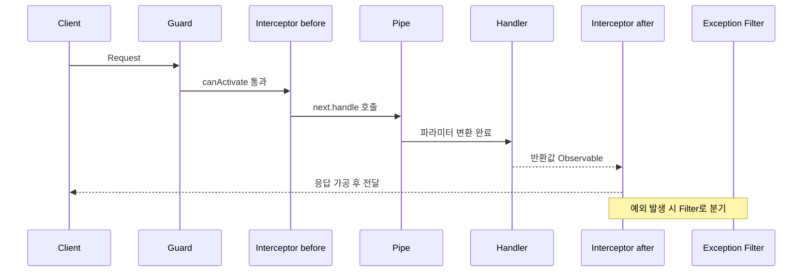

# NestJS Interceptor 동작 원리와 실무 활용

NestJS에서 Interceptor는 핸들러의 앞뒤를 감싸는 레이어다. 자바 Spring의 AOP나 Express의 미들웨어를 다뤄봤다면 비슷한 인상을 받을 텐데, 결정적인 차이가 하나 있다. NestJS Interceptor는 RxJS Observable 위에서 동작한다. 핸들러의 반환값이 Observable 스트림으로 흘러나오고, Interceptor는 그 스트림을 가로채서 변환한다. 이 메커니즘이 익숙하지 않으면 응답 가공, 타임아웃, 캐싱 같은 패턴을 짤 때 매번 막힌다.

이 문서는 Interceptor가 실제로 어떻게 호출되는지, RxJS 파이프라인이 응답을 어떻게 흘려보내는지부터 짚고, 운영하면서 부딪힌 케이스 위주로 정리한다.

## Interceptor의 구조

모든 Interceptor는 `NestInterceptor` 인터페이스를 구현한다. 메서드는 `intercept` 하나뿐이다.

```typescript
import { CallHandler, ExecutionContext, Injectable, NestInterceptor } from '@nestjs/common';
import { Observable } from 'rxjs';

@Injectable()
export class SampleInterceptor implements NestInterceptor {
  intercept(context: ExecutionContext, next: CallHandler): Observable<any> {
    // next.handle() 호출 전: before 로직
    return next.handle().pipe(
      // next.handle() 호출 후: after 로직
    );
  }
}
```

`context`는 ExecutionContext로 HTTP, WebSocket, gRPC 어떤 트랜스포트인지 추상화된 정보를 들고 있다. `next`는 CallHandler인데 여기서 `handle()`을 호출해야 실제 핸들러 체인이 실행된다. `handle()`을 부르지 않으면 컨트롤러는 영원히 실행되지 않는다.

핵심은 `handle()`이 반환하는 값이 Observable이라는 점이다. 컨트롤러가 `return user;` 처럼 평범한 객체를 반환하더라도 NestJS 내부에서 자동으로 Observable로 감싼다. Promise를 반환해도 마찬가지다. 그래서 Interceptor에서는 `.pipe()` 안에 RxJS 연산자를 연결해서 응답을 가공하면 된다.

## 실행 순서: 가드, 파이프와의 관계

요청이 들어오면 Middleware → Guard → Interceptor(before) → Pipe → Handler → Interceptor(after) → Exception Filter 순으로 흐른다. 헷갈리는 부분이 둘 있다.

첫째, Interceptor의 before 단계는 Pipe보다 먼저 실행된다. 즉 파라미터 검증/변환이 끝나기 전에 Interceptor가 동작한다. 그래서 Interceptor에서 `request.body`를 읽을 때는 DTO 변환이 안 된 raw 값이다. ValidationPipe 통과 후의 값을 다루려면 메서드 데코레이터로 감는 게 아니라 응답 단계에서 처리해야 한다.

둘째, Interceptor의 after 단계는 등록 순서의 역순으로 풀린다. 스택처럼 쌓였다가 빠진다. 글로벌 → 컨트롤러 → 메서드 순으로 들어왔다면, 응답은 메서드 → 컨트롤러 → 글로벌 순으로 빠져나간다. 응답에 메타데이터를 덮어쓰는 경우 누가 마지막에 덮어쓰는지 헷갈리면 디버깅이 길어진다.



## RxJS 파이프라인이 응답을 다루는 방식

Interceptor가 RxJS 기반이라는 건 단순한 트리비아가 아니다. 응답 변환 코드 작성 방식 자체가 달라진다. 자주 쓰는 연산자는 `tap`, `map`, `catchError`, `timeout`이다.

### tap: 부수 효과만 일으킬 때

`tap`은 스트림을 통과시키면서 부수 효과만 일으킨다. 응답 값을 바꾸지 않고 로깅만 하고 싶을 때 쓴다.

```typescript
import { tap } from 'rxjs/operators';

intercept(context: ExecutionContext, next: CallHandler) {
  const startedAt = Date.now();
  return next.handle().pipe(
    tap(() => {
      const elapsed = Date.now() - startedAt;
      console.log(`elapsed=${elapsed}ms`);
    }),
  );
}
```

`map`을 잘못 쓰면 응답을 통째로 덮어버리는 사고가 난다. 로깅 의도라면 반드시 `tap`을 쓴다.

### map: 응답을 가공할 때

응답 구조를 표준화할 때 쓴다. 예를 들어 모든 응답을 `{ data, timestamp }` 형태로 감싸고 싶을 때다.

```typescript
import { map } from 'rxjs/operators';

intercept(context: ExecutionContext, next: CallHandler) {
  return next.handle().pipe(
    map((data) => ({
      data,
      timestamp: new Date().toISOString(),
    })),
  );
}
```

여기서 주의할 점이 있다. 컨트롤러가 `void`를 반환하거나 `res.json()`을 직접 호출해서 응답을 처리하는 경우 `map`이 동작하지 않는다. NestJS는 핸들러 반환값이 `undefined`이거나 사용자가 직접 응답을 보낸 경우 Interceptor의 변환 결과를 무시한다.

### catchError: 예외를 가로챌 때

핸들러나 다른 Interceptor에서 던진 예외를 잡을 수 있다. 단, 여기서 잡은 예외를 처리하는 방식이 Exception Filter와 충돌하는 게 실무에서 가장 자주 만나는 함정이다.

```typescript
import { catchError, throwError } from 'rxjs';
import { BadRequestException } from '@nestjs/common';

intercept(context: ExecutionContext, next: CallHandler) {
  return next.handle().pipe(
    catchError((err) => {
      if (err.code === 'ER_DUP_ENTRY') {
        return throwError(() => new BadRequestException('중복된 항목'));
      }
      return throwError(() => err);
    }),
  );
}
```

`throwError(() => err)`로 다시 던지면 Exception Filter가 받아서 처리한다. 그냥 `throw`로 던지면 Observable 컨텍스트를 벗어나서 unhandled rejection으로 흐를 수 있다. 반드시 `throwError`로 감싼다.

### timeout: 응답 시간 제한

```typescript
import { timeout, catchError, throwError } from 'rxjs';
import { RequestTimeoutException } from '@nestjs/common';

intercept(context: ExecutionContext, next: CallHandler) {
  return next.handle().pipe(
    timeout(5000),
    catchError((err) => {
      if (err.name === 'TimeoutError') {
        return throwError(() => new RequestTimeoutException());
      }
      return throwError(() => err);
    }),
  );
}
```

`timeout`만 걸면 RxJS의 `TimeoutError`가 그대로 전파된다. 클라이언트에 의미 있는 HTTP 응답을 주려면 `catchError`로 잡아서 `RequestTimeoutException`으로 변환해야 한다.

## 자주 쓰는 Interceptor 구현

### 로깅 인터셉터

요청/응답을 한 줄씩 남기는 가장 기본적인 패턴이다. 운영 중 디버깅에서 가장 자주 쓴다.

```typescript
import {
  CallHandler,
  ExecutionContext,
  Injectable,
  Logger,
  NestInterceptor,
} from '@nestjs/common';
import { Observable, tap, catchError, throwError } from 'rxjs';

@Injectable()
export class LoggingInterceptor implements NestInterceptor {
  private readonly logger = new Logger(LoggingInterceptor.name);

  intercept(context: ExecutionContext, next: CallHandler): Observable<any> {
    const req = context.switchToHttp().getRequest();
    const { method, url } = req;
    const startedAt = Date.now();

    this.logger.log(`→ ${method} ${url}`);

    return next.handle().pipe(
      tap(() => {
        const elapsed = Date.now() - startedAt;
        this.logger.log(`← ${method} ${url} ${elapsed}ms`);
      }),
      catchError((err) => {
        const elapsed = Date.now() - startedAt;
        this.logger.error(`✗ ${method} ${url} ${elapsed}ms ${err.message}`);
        return throwError(() => err);
      }),
    );
  }
}
```

요청 시작 시각을 클로저에 잡아두고 응답이 흘러나올 때 차이를 잰다. 예외가 발생해도 시간 기록을 남기려고 `catchError`까지 붙였다. 실패한 요청의 응답 시간은 정상 응답보다 더 신경 써서 봐야 한다.

### 응답 직렬화 인터셉터

API 응답 포맷을 통일하는 용도다. 예를 들어 모든 응답을 `{ success, data, error }` 구조로 감싼다.

```typescript
import {
  CallHandler,
  ExecutionContext,
  Injectable,
  NestInterceptor,
} from '@nestjs/common';
import { Observable, map } from 'rxjs';

export interface ApiResponse<T> {
  success: boolean;
  data: T;
  timestamp: string;
}

@Injectable()
export class ResponseSerializeInterceptor<T>
  implements NestInterceptor<T, ApiResponse<T>>
{
  intercept(
    context: ExecutionContext,
    next: CallHandler,
  ): Observable<ApiResponse<T>> {
    return next.handle().pipe(
      map((data) => ({
        success: true,
        data,
        timestamp: new Date().toISOString(),
      })),
    );
  }
}
```

이 패턴을 쓸 때 자주 부딪히는 함정이 두 가지다.

첫째, Swagger 응답 스키마가 깨진다. 컨트롤러의 `@ApiResponse({ type: UserDto })`는 Interceptor 적용 전 타입을 가리키므로 실제 응답과 스키마가 어긋난다. 공통 응답 DTO를 만들어서 `@ApiExtraModels`와 `getSchemaPath`로 명시적으로 합성해야 정확해진다.

둘째, 예외 응답은 이 Interceptor를 거치지 않는다. 예외는 Exception Filter가 처리하므로 `{ success: false, error: ... }` 형식도 별도로 맞춰야 한다. Interceptor에서만 처리하면 정상 응답과 예외 응답의 포맷이 어긋난다.

### 캐싱 인터셉터

GET 요청에 한해서 응답을 메모리에 캐싱한다. 단순한 인메모리 캐시지만 실제로 Redis로 바꿔도 구조는 같다.

```typescript
import {
  CallHandler,
  ExecutionContext,
  Injectable,
  NestInterceptor,
} from '@nestjs/common';
import { Observable, of, tap } from 'rxjs';

@Injectable()
export class CacheInterceptor implements NestInterceptor {
  private readonly store = new Map<string, { value: any; expiresAt: number }>();
  private readonly ttlMs = 30_000;

  intercept(context: ExecutionContext, next: CallHandler): Observable<any> {
    const req = context.switchToHttp().getRequest();
    if (req.method !== 'GET') {
      return next.handle();
    }

    const key = req.originalUrl;
    const cached = this.store.get(key);
    const now = Date.now();

    if (cached && cached.expiresAt > now) {
      return of(cached.value);
    }

    return next.handle().pipe(
      tap((value) => {
        this.store.set(key, { value, expiresAt: now + this.ttlMs });
      }),
    );
  }
}
```

`of(cached.value)`로 새 Observable을 만들어 반환하면 핸들러를 호출하지 않고 캐시된 값으로 응답한다. 핵심은 `next.handle()`을 부르지 않는 것이다. 이 분기에 들어가면 컨트롤러는 실행되지 않는다.

운영에서 이 패턴을 그대로 쓰면 위험하다. Map에 무한히 쌓이므로 메모리 누수가 일어난다. TTL이 지난 항목을 주기적으로 정리하거나, LRU 캐시 라이브러리 (`lru-cache`)를 쓰거나, Redis로 빼야 한다. NestJS 공식 패키지 `@nestjs/cache-manager`를 쓰는 것도 방법이다.

### 타임아웃 인터셉터

전역으로 거는 경우가 많다. 외부 API 호출, DB 쿼리가 느려질 때 클라이언트를 무한히 기다리게 두지 않으려는 용도다.

```typescript
import {
  CallHandler,
  ExecutionContext,
  Injectable,
  NestInterceptor,
  RequestTimeoutException,
} from '@nestjs/common';
import { Observable, TimeoutError, timeout, catchError, throwError } from 'rxjs';

@Injectable()
export class TimeoutInterceptor implements NestInterceptor {
  constructor(private readonly ms: number = 10_000) {}

  intercept(context: ExecutionContext, next: CallHandler): Observable<any> {
    return next.handle().pipe(
      timeout(this.ms),
      catchError((err) => {
        if (err instanceof TimeoutError) {
          return throwError(() => new RequestTimeoutException());
        }
        return throwError(() => err);
      }),
    );
  }
}
```

여기서 흔히 놓치는 부분이 있다. `timeout`은 Observable 스트림이 끊긴 것이지 실제 비동기 작업이 취소된 게 아니다. 예를 들어 DB 쿼리가 10초 안에 안 끝나서 타임아웃이 떴어도, 그 쿼리는 백엔드에서 계속 돌고 있다. 진짜로 작업을 끊으려면 AbortController나 DB 드라이버 레벨의 쿼리 타임아웃을 따로 걸어야 한다. 이 사실을 모르면 "타임아웃 잘 동작하는데 DB 커넥션 풀이 왜 자꾸 고갈되지?"로 헤매게 된다.

## 스코프: 어디에 적용하느냐

Interceptor는 네 위치에 등록할 수 있다. 같은 인터페이스를 구현하지만 등록 위치에 따라 동작 범위와 DI 동작이 다르다.

### 메서드 스코프

특정 핸들러에만 적용한다. `@UseInterceptors`를 메서드에 단다.

```typescript
@Get(':id')
@UseInterceptors(CacheInterceptor)
findOne(@Param('id') id: string) {
  return this.userService.findOne(id);
}
```

해당 라우트만 통과한다. 캐싱처럼 라우트별로 특성이 다른 기능은 메서드 단위로 거는 게 명확하다.

### 컨트롤러 스코프

컨트롤러 전체에 적용한다. 클래스에 `@UseInterceptors`를 단다.

```typescript
@Controller('users')
@UseInterceptors(ResponseSerializeInterceptor)
export class UserController {}
```

해당 컨트롤러의 모든 핸들러에 동일하게 걸린다. 도메인 단위로 응답 포맷을 다르게 가져갈 때 유용하다.

### 모듈 스코프

모듈의 providers에 `APP_INTERCEPTOR` 토큰으로 등록한다. 이 방식은 의존성 주입을 정상적으로 받을 수 있다는 게 핵심이다.

```typescript
import { APP_INTERCEPTOR } from '@nestjs/core';

@Module({
  providers: [
    {
      provide: APP_INTERCEPTOR,
      useClass: LoggingInterceptor,
    },
  ],
})
export class AppModule {}
```

이름은 `APP_INTERCEPTOR`라서 전역처럼 보이지만, 실제로는 등록한 모듈의 DI 컨텍스트를 따른다. 같은 토큰을 여러 모듈에서 등록하면 각각 다른 인스턴스로 동작한다.

### 전역 스코프 (bootstrap)

`main.ts`에서 `app.useGlobalInterceptors()`로 등록하면 진짜 전역이 된다. 단점이 명확하다. DI 컨테이너 바깥에서 인스턴스를 만들기 때문에 다른 Injectable을 주입받을 수 없다.

```typescript
async function bootstrap() {
  const app = await NestFactory.create(AppModule);
  app.useGlobalInterceptors(new TimeoutInterceptor(5000));
  await app.listen(3000);
}
```

`TimeoutInterceptor`처럼 외부 의존성이 없는 단순한 Interceptor라면 이 방식이 깔끔하다. 하지만 Repository나 ConfigService 같은 걸 주입받아야 한다면 무조건 `APP_INTERCEPTOR` 토큰 방식을 써야 한다.

## 가드, 파이프와 비교

세 가지가 비슷해 보이는데 책임이 다르다.

Guard는 요청을 통과시킬지 말지를 결정한다. boolean 또는 boolean Promise/Observable을 반환한다. 응답을 가공하는 책임이 없다.

Pipe는 파라미터를 변환하거나 검증한다. 메서드 파라미터 단위로 동작하며 변환된 값을 반환한다. 응답에는 손대지 않는다.

Interceptor는 핸들러 앞뒤를 감싸면서 응답을 변형하거나 부가 동작을 한다. RxJS Observable 위에서 동작한다는 게 결정적 차이다.

실무에서 헷갈리는 케이스는 "권한 검사 결과에 따라 응답을 다르게 주고 싶다"같은 경우다. 권한 자체는 Guard가, 응답 가공은 Interceptor가 한다. Guard에서 응답을 직접 만지려고 들면 Filter나 Interceptor와 충돌한다.

## 실무 트러블슈팅

### 응답이 변환되지 않는 경우

`map`을 걸었는데 응답이 그대로 나가는 경우가 있다. 대부분 컨트롤러에서 `@Res() res: Response`로 Express 응답 객체를 직접 받아서 `res.json()`을 호출한 경우다. 이러면 NestJS의 응답 파이프라인을 우회하므로 Interceptor의 변환이 적용되지 않는다.

해결책은 둘 중 하나다. `@Res({ passthrough: true })`로 응답 객체를 받되 NestJS 파이프라인은 그대로 두든지, 아예 `@Res()`를 빼고 반환값으로 응답을 만들든지. 라이브러리 모드와 표준 모드를 섞으면 Interceptor 동작을 신뢰할 수 없게 된다.

### 메모리 누수

가장 흔한 케이스가 캐싱 Interceptor를 직접 짜면서 만료 처리를 안 넣은 경우다. 위 예제에서 본 `Map`에 무한히 쌓이는 패턴이다. 운영 환경에서는 반드시 LRU 캐시나 외부 캐시 (Redis, Memcached)를 쓴다.

또 다른 케이스는 Interceptor 내부에서 subscribe를 직접 호출하는 경우다.

```typescript
intercept(context: ExecutionContext, next: CallHandler) {
  next.handle().subscribe((value) => {
    // 이렇게 하면 안 된다
  });
  return next.handle();
}
```

`next.handle()`을 두 번 호출하면 핸들러가 두 번 실행된다. 게다가 직접 `subscribe`한 Observable은 자동 해제되지 않아서 메모리 누수가 일어난다. Interceptor에서는 항상 `next.handle()`을 한 번만 호출하고 `.pipe()`로 변환을 연결하는 것이 원칙이다.

### Exception Filter와의 충돌

Interceptor에서 `catchError`로 예외를 잡으면 Exception Filter가 실행되지 않는 경우가 생긴다. 다음 코드를 보자.

```typescript
return next.handle().pipe(
  catchError((err) => {
    return of({ error: err.message });
  }),
);
```

`throwError`가 아니라 `of`로 빠져나오면 정상 응답으로 처리된다. Exception Filter가 받지 못하고, 클라이언트는 HTTP 200으로 에러를 받는다. 의도한 동작이 아니라면 반드시 `throwError(() => err)`로 다시 던져야 한다.

반대로 Interceptor에서 예외를 변환해서 다시 던졌는데, 컨트롤러에 붙은 다른 Exception Filter가 원본 예외 클래스를 잡으려고 한다면 변환 후 클래스로는 매칭되지 않는다. Filter 등록 위치(글로벌/컨트롤러/메서드)와 Interceptor의 변환 순서를 함께 봐야 한다.

### 동기 핸들러와 Observable의 혼동

Interceptor의 `intercept`가 Observable을 반환해야 한다. Promise를 반환하면 컴파일 에러는 안 나도 런타임에 응답이 안 나가거나, NestJS가 Promise를 한 번 resolve해서 Observable로 감싸는 식으로 예기치 못한 동작을 한다.

비동기 작업이 필요하다면 `from(promise)`로 Observable로 변환해서 합성한다.

```typescript
import { from, switchMap } from 'rxjs';

intercept(context: ExecutionContext, next: CallHandler) {
  return from(this.someAsyncCheck()).pipe(
    switchMap(() => next.handle()),
  );
}
```

### 전역 Interceptor에서 DI가 안 될 때

`app.useGlobalInterceptors(new MyInterceptor())`로 등록한 Interceptor가 다른 서비스를 주입받지 못한다. 콘솔에는 `Cannot read property 'xxx' of undefined`만 뜬다. 위에서 언급한 대로, `APP_INTERCEPTOR` 토큰 방식으로 전환하면 해결된다.

```typescript
@Module({
  providers: [
    {
      provide: APP_INTERCEPTOR,
      useClass: MyInterceptor,
    },
  ],
})
export class AppModule {}
```

이 차이를 모르고 `app.useGlobalInterceptors`를 쓰다가 `new Interceptor(someService)`처럼 수동 주입을 시도하면 모듈 초기화 순서에 따라 깨진다. DI가 필요하면 무조건 토큰 방식이다.

## 정리해서 보자

Interceptor는 RxJS 기반 응답 파이프라인 위에서 동작한다는 점이 다른 NestJS 요소와 결정적으로 다르다. `tap`, `map`, `catchError`, `timeout` 정도만 익숙해져도 실무에서 마주치는 대부분의 케이스를 처리할 수 있다. 등록 스코프에 따라 DI 동작이 달라진다는 점, 예외 처리는 반드시 `throwError`로 다시 던져야 한다는 점, `next.handle()`은 한 번만 호출한다는 점, 이 세 가지가 가장 자주 발이 걸리는 곳이다.
