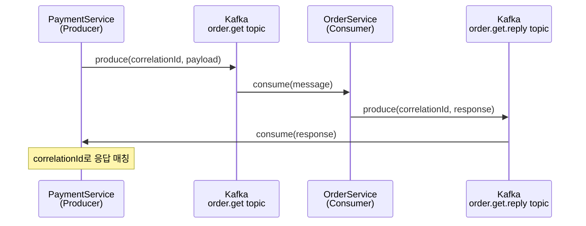

# NestJS Kafka 연동

`@nestjs/microservices`의 `Transport.KAFKA`는 내부적으로 KafkaJS를 감싸고 있다. KafkaJS를 직접 쓸 때와 코드 구조가 완전히 다르고, NestJS가 자동 처리해 주는 부분과 개발자가 직접 신경 써야 하는 부분의 경계가 명확하지 않아서 처음 연동할 때 막히는 부분이 꽤 있다.


## 설치와 기본 설정

```bash
npm install @nestjs/microservices kafkajs
```

마이크로서비스 전용 앱이라면 `NestFactory.createMicroservice()`로 만든다.

```typescript
import { NestFactory } from '@nestjs/core';
import { Transport, MicroserviceOptions } from '@nestjs/microservices';
import { AppModule } from './app.module';

async function bootstrap() {
  const app = await NestFactory.createMicroservice<MicroserviceOptions>(
    AppModule,
    {
      transport: Transport.KAFKA,
      options: {
        client: {
          clientId: 'order-service',
          brokers: ['kafka:9092'],
        },
        consumer: {
          groupId: 'order-service-consumer',
        },
      },
    },
  );
  await app.listen();
}
bootstrap();
```

`clientId`는 Kafka 브로커에서 로그를 볼 때 클라이언트를 식별하는 이름이다. `groupId`는 Consumer Group이다. 같은 `groupId`를 가진 인스턴스들은 파티션을 나눠서 처리하므로, 수평 확장 시 `groupId`를 동일하게 맞춰야 한다.


## ClientKafka 등록과 subscribeToResponseOf() 순서

`@MessagePattern`으로 응답이 필요한 패턴을 사용할 때, 호출 측에서는 `ClientKafka`를 쓴다. 여기서 순서를 틀리면 응답을 못 받는다.

```typescript
// payment.module.ts
@Module({
  imports: [
    ClientsModule.register([
      {
        name: 'ORDER_SERVICE',
        transport: Transport.KAFKA,
        options: {
          client: {
            clientId: 'payment-service',
            brokers: ['kafka:9092'],
          },
          consumer: {
            groupId: 'payment-service-consumer',
          },
        },
      },
    ]),
  ],
})
export class PaymentModule {}
```

```typescript
// payment.service.ts
import { ClientKafka } from '@nestjs/microservices';
import { OnModuleInit, OnModuleDestroy } from '@nestjs/common';
import { lastValueFrom } from 'rxjs';

@Injectable()
export class PaymentService implements OnModuleInit, OnModuleDestroy {
  constructor(
    @Inject('ORDER_SERVICE') private readonly orderClient: ClientKafka,
  ) {}

  async onModuleInit() {
    // subscribeToResponseOf()를 반드시 connect() 전에 호출해야 한다.
    // 이 메서드를 호출하지 않으면 응답 topic을 구독하지 않아서
    // send()를 호출해도 응답을 영원히 기다린다.
    this.orderClient.subscribeToResponseOf('order.get');
    this.orderClient.subscribeToResponseOf('order.create');

    await this.orderClient.connect();
  }

  async onModuleDestroy() {
    await this.orderClient.close();
  }

  async getOrder(orderId: string) {
    return lastValueFrom(
      this.orderClient.send('order.get', { orderId }),
    );
  }
}
```

`subscribeToResponseOf('order.get')`을 호출하면 내부적으로 `order.get.reply` topic을 구독할 Consumer를 등록한다. 이 등록이 `connect()` 전에 이루어져야 Kafka 브로커에 연결할 때 해당 topic을 구독할 수 있다.

`connect()` 이후에 `subscribeToResponseOf()`를 호출하면 이미 Kafka 브로커에 연결된 후라 구독이 제대로 설정되지 않는다. 응답을 기다리는 Promise가 타임아웃 없이 걸려있는 상태가 된다.


## Reply Topic 동작 방식

Kafka는 기본적으로 단방향 메시징이다. TCP나 gRPC처럼 요청-응답이 내장된 프로토콜이 아니다. NestJS는 Kafka에서 요청-응답 패턴을 구현하기 위해 별도의 reply topic을 사용한다.

```
요청 흐름:
PaymentService → [order.get topic] → OrderService

응답 흐름:
OrderService → [order.get.reply topic] → PaymentService
```



요청 메시지 헤더에 `correlationId`와 `replyTopic`이 자동으로 포함된다. OrderService는 이 헤더를 보고 응답을 어디로 보낼지 결정한다.

`order.get.reply` topic은 Kafka 브로커에 실제로 존재해야 한다. 브로커 설정에서 `auto.create.topics.enable=true`이면 자동 생성되지만, 프로덕션 환경에서는 보통 비활성화되어 있다. 이 경우 reply topic을 직접 생성해 줘야 한다.

```bash
# reply topic 수동 생성
kafka-topics.sh --create \
  --topic order.get.reply \
  --partitions 1 \
  --replication-factor 1 \
  --bootstrap-server kafka:9092
```

reply topic의 파티션 수는 요청 topic의 파티션 수와 같거나 크게 맞추는 게 좋다. 파티션이 부족하면 응답이 병목이 생긴다.


## @MessagePattern과 @EventPattern

서버(OrderService) 쪽에서는 `@MessagePattern`으로 요청-응답을, `@EventPattern`으로 단방향 이벤트를 처리한다.

```typescript
// order.controller.ts
import { Controller } from '@nestjs/common';
import { MessagePattern, EventPattern, Payload, Ctx, KafkaContext } from '@nestjs/microservices';

@Controller()
export class OrderController {
  constructor(private readonly orderService: OrderService) {}

  // 요청-응답 패턴
  @MessagePattern('order.get')
  async getOrder(
    @Payload() data: { orderId: string },
    @Ctx() context: KafkaContext,
  ) {
    const originalMessage = context.getMessage();
    const partition = context.getPartition();
    const topic = context.getTopic();

    return this.orderService.findById(data.orderId);
  }

  // 단방향 이벤트
  @EventPattern('order.created')
  async handleOrderCreated(
    @Payload() data: { orderId: string; userId: string },
    @Ctx() context: KafkaContext,
  ) {
    const headers = context.getMessage().headers;
    // 헤더에서 추가 메타데이터 접근
    const traceId = headers['x-trace-id']?.toString();

    await this.orderService.processCreatedEvent(data, traceId);
  }
}
```

### Kafka 헤더 접근

`@Ctx()`로 받는 `KafkaContext`에서 원본 Kafka 메시지에 접근할 수 있다.

```typescript
@MessagePattern('order.get')
async getOrder(@Ctx() context: KafkaContext) {
  const message = context.getMessage();

  // 헤더는 Buffer 또는 string으로 온다
  const correlationId = message.headers?.['kafka_correlationId'];
  const replyTopic = message.headers?.['kafka_replyTopic'];

  // Buffer로 왔을 때
  const traceId = message.headers?.['x-trace-id'];
  const traceIdStr = Buffer.isBuffer(traceId)
    ? traceId.toString()
    : traceId;

  // offset과 partition 정보
  console.log(`partition: ${context.getPartition()}, offset: ${message.offset}`);
}
```

헤더 값은 Kafka 스펙상 `Buffer | string | null`이다. `toString()`을 호출하기 전에 타입을 확인해야 한다. NestJS가 자동 변환해 주지 않는다.

프로듀서 쪽에서 커스텀 헤더를 보내려면 `KafkaRecordBuilder`를 써야 한다. `send()`의 두 번째 인자로 직접 페이로드를 넣으면 헤더를 추가할 방법이 없다.

```typescript
import { KafkaRecordBuilder } from '@nestjs/microservices';

// ClientKafka로 직접 produce 시 헤더 추가
const record = new KafkaRecordBuilder(payload)
  .setHeaders({ 'x-trace-id': traceId })
  .build();

this.orderClient.send('order.get', record);
```


## 직렬화 설정

NestJS Kafka 트랜스포트는 기본으로 `JsonSerializer`와 `JsonDeserializer`를 쓴다. 페이로드를 JSON으로 직렬화해서 `value` 필드에 넣고, 역직렬화 시에는 `value`를 파싱한다.

기본 동작만으로 충분한 경우가 많지만, 커스텀 직렬화가 필요하면 직접 구현할 수 있다.

```typescript
// 커스텀 직렬화가 필요한 경우
import { Serializer, Deserializer, IncomingEvent } from '@nestjs/microservices';
import { KafkaMessage } from 'kafkajs';

export class CustomKafkaSerializer implements Serializer {
  serialize(value: any) {
    // value를 Buffer나 string으로 변환
    return JSON.stringify({
      data: value,
      timestamp: Date.now(),
      version: '1.0',
    });
  }
}

export class CustomKafkaDeserializer implements Deserializer {
  deserialize(value: KafkaMessage, options?: Record<string, any>): IncomingEvent {
    const parsed = JSON.parse(value.value?.toString() ?? '{}');
    return {
      pattern: options?.channel,
      data: parsed.data,
    };
  }
}
```

```typescript
// 마이크로서비스 설정에 serializer/deserializer 적용
const app = await NestFactory.createMicroservice<MicroserviceOptions>(
  AppModule,
  {
    transport: Transport.KAFKA,
    options: {
      client: {
        clientId: 'order-service',
        brokers: ['kafka:9092'],
      },
      consumer: {
        groupId: 'order-service-consumer',
      },
      run: {
        autoCommit: false, // 수동 커밋이 필요한 경우
      },
      serializer: new CustomKafkaSerializer(),
      deserializer: new CustomKafkaDeserializer(),
    },
  },
);
```

**주의**: 커스텀 직렬화를 쓰면 Consumer 쪽과 Producer 쪽 직렬화 형식을 반드시 맞춰야 한다. 형식이 달라도 JSON 파싱 오류 없이 빈 객체나 undefined가 들어오는 경우가 있어서 디버깅하기 까다롭다.

Confluent Schema Registry와 연동해야 하면 NestJS 내장 직렬화로는 한계가 있다. 이 경우 KafkaJS를 직접 사용하는 커스텀 트랜스포터를 구현하는 게 현실적이다.


## 하이브리드 앱에서 Kafka 연동

HTTP API와 Kafka Consumer를 같이 운영할 때는 `connectMicroservice()`를 사용한다.

```typescript
async function bootstrap() {
  const app = await NestFactory.create(AppModule);

  app.connectMicroservice<MicroserviceOptions>({
    transport: Transport.KAFKA,
    options: {
      client: {
        clientId: 'order-service',
        brokers: ['kafka:9092'],
      },
      consumer: {
        groupId: 'order-service-consumer',
        // Consumer 설정
        sessionTimeout: 30000,
        heartbeatInterval: 3000,
      },
    },
  });

  // Kafka 리스닝 먼저 시작
  await app.startAllMicroservices();

  // HTTP 서버 시작
  await app.listen(3000);
}
```

하이브리드 앱에서 Kafka Consumer를 HTTP 모듈에서도 주입해서 쓰고 싶은 경우, `ClientsModule`을 `AppModule`에 import하면 된다. Consumer로도 쓰고 Producer로도 쓰는 건 독립적이다. `connectMicroservice()`의 Kafka 설정은 Consumer만 담당하고, `ClientsModule`의 `ClientKafka`는 Producer 역할을 한다.

```typescript
// app.module.ts
@Module({
  imports: [
    ClientsModule.register([
      {
        name: 'NOTIFICATION_SERVICE',
        transport: Transport.KAFKA,
        options: {
          client: {
            clientId: 'order-service-producer',
            brokers: ['kafka:9092'],
          },
          consumer: {
            groupId: 'order-service-notification-consumer',
          },
        },
      },
    ]),
  ],
})
export class AppModule {}
```

같은 `groupId`를 Consumer와 Producer 양쪽에 쓰지 않도록 주의한다. groupId가 겹치면 Consumer Group Rebalancing이 예상치 못한 시점에 발생할 수 있다.


## Graceful Shutdown

Kafka Consumer는 종료 시 Consumer Group에서 명시적으로 떠나는 과정(Leave Group)이 있어야 다른 인스턴스가 즉시 파티션을 재할당받는다. 이 과정이 없으면 `sessionTimeout`(기본 30초) 동안 해당 파티션이 미처리 상태로 남는다.

```typescript
async function bootstrap() {
  const app = await NestFactory.create(AppModule);

  // enableShutdownHooks()를 반드시 호출해야 한다.
  // SIGTERM 수신 시 NestJS가 OnModuleDestroy 훅을 실행한다.
  app.enableShutdownHooks();

  app.connectMicroservice<MicroserviceOptions>({
    transport: Transport.KAFKA,
    options: {
      client: {
        clientId: 'order-service',
        brokers: ['kafka:9092'],
      },
      consumer: {
        groupId: 'order-service-consumer',
      },
    },
  });

  await app.startAllMicroservices();
  await app.listen(3000);
}
```

`enableShutdownHooks()`를 호출하면 `SIGTERM` / `SIGINT` 시 NestJS가 모듈 종료 훅을 실행한다. Kafka 트랜스포트는 `onApplicationShutdown()`에서 내부적으로 `consumer.disconnect()`와 `producer.disconnect()`를 순서대로 호출한다.

직접 종료 순서를 제어해야 하는 경우:

```typescript
@Injectable()
export class AppService implements OnModuleDestroy {
  constructor(
    @Inject('ORDER_SERVICE') private readonly orderClient: ClientKafka,
  ) {}

  async onModuleDestroy() {
    // 현재 처리 중인 메시지가 완료될 때까지 기다려야 한다면
    // 별도 카운터나 Promise 큐를 관리해야 한다.
    // NestJS는 이 부분을 자동으로 처리하지 않는다.
    await this.orderClient.close();
  }
}
```

**종료 시 주의할 점**: Kafka의 `auto.offset.commit`(autoCommit)이 활성화된 상태(기본값)에서는 Consumer가 종료될 때 현재까지 처리한 offset을 커밋한다. 처리 중이던 메시지가 완료되기 전에 Consumer가 종료되면 해당 메시지는 재처리된다. at-least-once 처리가 필요한 이유다.

Kubernetes 환경에서는 `terminationGracePeriodSeconds`를 `sessionTimeout`보다 길게 설정해야 한다. 기본 `terminationGracePeriodSeconds`가 30초고 `sessionTimeout`도 30초면, NestJS가 graceful shutdown을 완료하기 전에 Kubernetes가 강제 종료할 수 있다.


## NestJS가 자동 처리하는 것과 직접 해야 하는 것

NestJS Kafka 트랜스포트가 내부에서 처리하는 것들이 있고, 개발자가 직접 신경 써야 하는 것들이 있다. 이 경계를 모르면 KafkaJS 문서를 보면서 "왜 NestJS에서는 이 API가 없지?"라고 헤매게 된다.

### NestJS가 자동으로 처리하는 것

**Consumer Group 관리**: `groupId`를 설정하면 KafkaJS의 Consumer Group 연결, 파티션 할당, Rebalancing을 자동으로 처리한다. `consumer.subscribe()`, `consumer.run()`을 직접 호출하지 않아도 된다.

**Topic 구독**: `@MessagePattern('order.get')`과 `@EventPattern('order.created')`를 선언하면 앱 시작 시 해당 topic들을 자동으로 subscribe한다.

**직렬화/역직렬화**: 기본 `JsonSerializer`/`JsonDeserializer`가 메시지를 자동으로 변환한다.

**correlationId 처리**: `send()`의 요청-응답 매칭에 필요한 `correlationId` 생성과 응답 라우팅을 자동으로 처리한다.

**Producer 초기화**: `ClientKafka.connect()` 시 내부 KafkaJS Producer를 초기화한다.

### 직접 해야 하는 것

**Topic 생성**: Kafka 브로커에 실제로 topic이 존재해야 한다. `auto.create.topics.enable`이 비활성화된 브로커에서는 topic을 미리 만들어야 한다. reply topic도 마찬가지다.

**subscribeToResponseOf() 호출**: `send()`로 응답을 받으려면 반드시 직접 호출해야 한다. NestJS가 `@MessagePattern` 선언을 보고 자동으로 처리하지 않는다.

**offset 관리**: `autoCommit: false`로 설정한 경우 `context.getMessage().offset`을 보고 수동으로 커밋해야 한다. NestJS가 자동으로 해주지 않는다.

```typescript
@MessagePattern('order.get')
async getOrder(@Ctx() context: KafkaContext) {
  const { offset } = context.getMessage();
  const partition = context.getPartition();
  const topic = context.getTopic();

  try {
    const result = await this.orderService.process();

    // 수동 커밋
    const consumer = context.getConsumer();
    await consumer.commitOffsets([
      { topic, partition, offset: String(Number(offset) + 1) },
    ]);

    return result;
  } catch (error) {
    // 실패 시 커밋하지 않으면 메시지가 재처리된다.
    throw error;
  }
}
```

**DLQ(Dead Letter Queue) 처리**: 처리 실패한 메시지를 DLQ topic으로 보내는 로직은 직접 구현해야 한다. NestJS는 예외가 발생하면 에러 로그만 남기고 offset을 그냥 커밋한다(`autoCommit: true` 기준).

**파티션 수, 복제 계수**: Topic 설계는 NestJS와 무관하게 Kafka 운영 차원에서 결정해야 한다.

**스키마 검증**: KafkaJS standalone으로 Confluent Schema Registry를 쓰는 경우에는 직렬화/역직렬화 시 스키마 검증이 자동으로 된다. 하지만 NestJS 트랜스포트에서는 커스텀 Serializer/Deserializer를 구현해서 직접 넣어야 한다.


## 실무에서 자주 막히는 부분

### send()가 응답을 받지 못하고 멈추는 경우

`subscribeToResponseOf()`를 `connect()` 전에 호출했는지 확인한다. reply topic이 Kafka에 존재하는지도 확인한다. `kafka-topics.sh --list`로 topic 목록을 보거나 Kafka UI(Conduktor, Kafdrop 등)를 쓰면 빠르게 확인된다.

### Consumer Group Rebalancing이 잦은 경우

`sessionTimeout`과 `heartbeatInterval` 기본값이 환경에 안 맞는 경우가 있다. 메시지 처리 시간이 길면 Kafka 브로커가 Consumer가 죽었다고 판단하고 Rebalancing을 시작한다. `maxInFlightRequests`와 처리 시간을 고려해서 `sessionTimeout`을 조정해야 한다.

```typescript
consumer: {
  groupId: 'order-service-consumer',
  sessionTimeout: 60000,    // 기본 30000
  heartbeatInterval: 5000,  // 기본 3000
  maxWaitTimeInMs: 5000,
}
```

### 같은 메시지가 중복 처리되는 경우

Kafka는 at-least-once가 기본이다. Consumer가 메시지를 처리하고 커밋하기 전에 죽으면 재시작 후 같은 메시지를 다시 받는다. 멱등성(idempotency)을 DB 레벨에서 보장해야 한다. unique constraint나 처리 기록 테이블을 써서 중복 처리를 막는다.

### 파티션이 1개인 topic에서 순서 보장이 안 되는 경우

Kafka에서 메시지 순서는 파티션 내에서만 보장된다. Consumer Group의 인스턴스가 여러 개면 파티션을 나눠 갖기 때문에, 파티션이 1개면 인스턴스 하나만 처리한다. 파티션이 여러 개면 파티션별로 순서가 보장되지만 파티션 간 순서는 보장되지 않는다. 특정 key를 기준으로 같은 파티션으로 라우팅되도록 Producer에서 partition key를 설정해야 한다.

```typescript
// ClientKafka로 partition key 지정
const record = new KafkaRecordBuilder(payload)
  .setKey(orderId)  // orderId가 같으면 같은 파티션으로
  .build();

this.orderClient.send('order.events', record);
```
