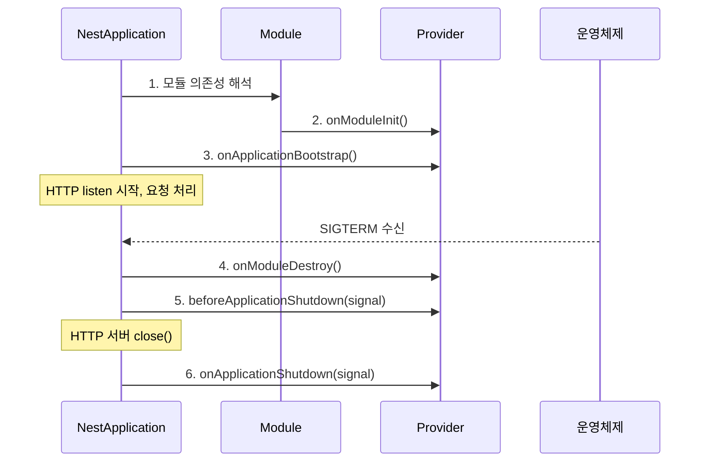

# NestJS 라이프사이클 훅

NestJS는 모듈 초기화부터 애플리케이션 종료까지 단계별로 콜백을 끼워 넣을 수 있다. 컨트롤러·서비스·게이트웨이·프로바이더 같은 클래스에 인터페이스만 구현하면 Nest 컨테이너가 정해진 시점에 호출해 준다.

훅을 다루는 이유는 단순하다. 객체가 만들어졌다고 해서 곧장 외부 자원을 잡을 준비가 끝난 게 아니고, 프로세스가 죽을 때 커넥션 풀이나 큐 워커를 그냥 끊으면 인플라이트(in-flight) 요청이 사라진다. 그래서 "언제 무엇을 잡고, 언제 무엇을 풀지"를 명확히 분리해야 한다.

## 훅의 종류와 호출 시점

NestJS가 공개하는 훅은 5개다. 호출 순서는 다음과 같다.



### OnModuleInit

해당 모듈의 의존성 주입이 끝난 직후 호출된다. 같은 모듈 안에서만 의존성 해석이 끝났음을 보장하기 때문에 다른 모듈의 프로바이더가 준비됐다는 보장은 없다.

```typescript
import { Injectable, OnModuleInit } from '@nestjs/common';
import { DataSource } from 'typeorm';

@Injectable()
export class UserRepository implements OnModuleInit {
  constructor(private readonly dataSource: DataSource) {}

  async onModuleInit(): Promise<void> {
    // 모듈 단위 초기화. 캐시 워밍업, 인덱스 확인 등.
    const queryRunner = this.dataSource.createQueryRunner();
    await queryRunner.connect();
    await queryRunner.query('SELECT 1');
    await queryRunner.release();
  }
}
```

여기서 헷갈리지 말아야 할 점이 하나 있다. `OnModuleInit`은 "이 모듈이 로드됐을 때"가 아니라 "이 모듈의 컨테이너 그래프가 만들어진 뒤"에 호출된다. 그래서 `forRootAsync()`로 비동기 설정을 받는 모듈이 다른 모듈을 의존한다면, 그 의존 모듈의 `OnModuleInit`이 먼저 끝났다는 보장은 없다. 모듈 간 초기화 순서가 필요한 경우는 `OnApplicationBootstrap`을 쓴다.

### OnApplicationBootstrap

모든 모듈의 초기화가 끝나고 `app.listen()` 직전에 호출된다. 다른 모듈의 프로바이더가 다 준비됐다는 보장이 있다.

```typescript
import { Injectable, OnApplicationBootstrap } from '@nestjs/common';
import { SchedulerRegistry } from '@nestjs/schedule';

@Injectable()
export class WarmupService implements OnApplicationBootstrap {
  constructor(
    private readonly cacheService: CacheService,
    private readonly schedulerRegistry: SchedulerRegistry,
  ) {}

  async onApplicationBootstrap(): Promise<void> {
    // 전체 컨테이너가 준비된 뒤 실행.
    // 다른 모듈 프로바이더 호출이 안전하다.
    await this.cacheService.warmup(['products', 'categories']);

    const job = this.schedulerRegistry.getCronJob('cleanup');
    job.start();
  }
}
```

캐시 프리워밍, 스케줄러 등록, 외부 시스템 헬스체크는 여기에서 한다. `OnModuleInit`에 두면 의존 모듈이 아직 준비되지 않은 상태에서 호출돼 `undefined` 에러를 본다.

### OnModuleDestroy

종료 단계의 첫 번째 훅이다. 시그널을 받은 직후, HTTP 서버가 새 연결을 거부하기 전에 호출된다. 모듈 내부 자원 정리 용도다.

### BeforeApplicationShutdown

`OnModuleDestroy`가 모두 끝난 뒤 호출된다. 인자로 시그널(`SIGTERM`, `SIGINT` 등)이 전달된다. 이 훅이 끝나면 HTTP 서버의 `close()`가 호출돼 새 연결을 받지 않게 된다.

```typescript
import { Injectable, BeforeApplicationShutdown } from '@nestjs/common';

@Injectable()
export class QueueDrainService implements BeforeApplicationShutdown {
  constructor(private readonly queue: Queue) {}

  async beforeApplicationShutdown(signal?: string): Promise<void> {
    console.log(`shutdown signal received: ${signal}`);
    // 새 잡 수신 중단, 진행 중 잡 완료 대기.
    await this.queue.pause(true);
    await this.queue.whenCurrentJobsFinished();
  }
}
```

### OnApplicationShutdown

마지막 훅. HTTP 서버가 닫힌 뒤 호출된다. 이 시점이면 외부에서 새 요청이 들어올 수 없으므로 DB 커넥션, Redis 클라이언트 같은 무거운 자원을 안전하게 끊을 수 있다.

```typescript
import { Injectable, OnApplicationShutdown } from '@nestjs/common';
import { DataSource } from 'typeorm';

@Injectable()
export class DatabaseShutdownService implements OnApplicationShutdown {
  constructor(private readonly dataSource: DataSource) {}

  async onApplicationShutdown(signal?: string): Promise<void> {
    if (this.dataSource.isInitialized) {
      await this.dataSource.destroy();
    }
  }
}
```

## enableShutdownHooks를 부르지 않으면 종료 훅이 안 돈다

가장 자주 마주치는 함정이다. NestJS는 기본값으로 `SIGTERM`·`SIGINT`를 듣지 않는다. `main.ts`에서 명시적으로 켜야 한다.

```typescript
import { NestFactory } from '@nestjs/core';
import { AppModule } from './app.module';

async function bootstrap() {
  const app = await NestFactory.create(AppModule);

  // 이 줄이 없으면 OnModuleDestroy, BeforeApplicationShutdown,
  // OnApplicationShutdown 셋 다 절대 호출되지 않는다.
  app.enableShutdownHooks();

  await app.listen(3000);
}
bootstrap();
```

`enableShutdownHooks()`는 내부에서 `process.on('SIGTERM', ...)`, `process.on('SIGINT', ...)` 등을 등록한다. 기본 동작이 아닌 이유는 라이브러리 모드(다른 프로세스에 임베딩되는 경우)에서 시그널 핸들러를 임의로 잡으면 호스트 프로세스와 충돌하기 때문이다. 일반적인 서버 애플리케이션이면 거의 항상 켜야 한다.

켜졌는지 빠르게 확인하는 법은 단순하다. 모든 훅에 `console.log`를 박고 로컬에서 `Ctrl+C`를 눌렀을 때 출력이 찍히는지 본다. 안 찍히면 100% 이 줄을 빠뜨린 상태다.

## 비동기 훅은 반드시 await 한다

훅이 `Promise`를 반환하면 Nest 컨테이너는 그 Promise가 resolve 될 때까지 다음 단계로 넘어가지 않는다. 반대로 말하면, `await` 없이 비동기 작업을 던지면 Nest는 끝났다고 판단하고 다음 단계로 넘어간다.

```typescript
// 잘못된 예. 큐가 다 비기 전에 프로세스가 죽는다.
async beforeApplicationShutdown() {
  this.queue.whenCurrentJobsFinished();  // await 누락
}

// 올바른 예.
async beforeApplicationShutdown() {
  await this.queue.whenCurrentJobsFinished();
}
```

같은 훅을 구현한 프로바이더가 여러 개 있으면 Nest는 그것들을 병렬로 실행하고 `Promise.all`로 기다린다. 그래서 훅 하나에서 실수로 무한 대기가 걸리면 전체 셧다운이 멈춘다. 외부 호출에는 타임아웃을 두는 게 안전하다.

```typescript
async onApplicationShutdown(signal?: string): Promise<void> {
  const cleanup = this.externalApi.unregister();
  const timeout = new Promise((_, reject) =>
    setTimeout(() => reject(new Error('shutdown timeout')), 5000),
  );

  try {
    await Promise.race([cleanup, timeout]);
  } catch (err) {
    console.error('forced shutdown:', err.message);
  }
}
```

## 호출 순서, 다시 정리

훅이 5개라 헷갈리니까 한 번에 정리한다.

**시작 단계**

1. 모든 모듈의 의존성 그래프 해석
2. `OnModuleInit` (각 모듈 내부 그래프 완성 직후)
3. `OnApplicationBootstrap` (전체 컨테이너 준비 완료 후, `listen()` 직전)

**종료 단계** (`enableShutdownHooks()` 활성화 시)

4. `OnModuleDestroy` (시그널 수신, 아직 HTTP 서버 열려 있음)
5. `BeforeApplicationShutdown(signal)` (HTTP 서버 close 직전)
6. HTTP 서버 close (새 연결 차단, 기존 연결은 유지)
7. `OnApplicationShutdown(signal)` (마지막 정리)

같은 훅을 구현한 프로바이더끼리는 등록 순서대로 호출되지 않는다. 의존성 순서로 자동 정렬된다. 즉 A가 B에 의존하면 종료 시에는 A의 `OnApplicationShutdown`이 B보다 먼저 호출된다(역의존 순서).

## 실무 패턴

### DB 커넥션 풀 안전 종료

TypeORM의 `DataSource.destroy()`는 풀의 모든 커넥션을 닫는다. 그런데 이걸 `OnModuleDestroy`에서 호출하면 아직 처리 중인 요청이 쿼리를 날렸을 때 "Connection terminated" 에러가 터진다. 반드시 `OnApplicationShutdown`(HTTP 서버 close 이후)에 둔다.

```typescript
@Injectable()
export class DatabaseLifecycle implements OnApplicationShutdown {
  constructor(private readonly dataSource: DataSource) {}

  async onApplicationShutdown(): Promise<void> {
    if (!this.dataSource.isInitialized) return;

    // 진행 중 쿼리가 끝나길 잠시 기다린 후 풀 종료.
    // 풀에 idle 커넥션만 남아 있어야 한다.
    await this.dataSource.destroy();
  }
}
```

### BullMQ 워커 그레이스풀 셧다운

큐 워커는 잡을 처리하는 도중에 죽으면 안 된다. 처리 중인 잡은 `stalled` 상태가 돼 다른 워커가 다시 잡거나, 워커가 재시작될 때 중복 처리되는 경우가 생긴다.

```typescript
import { Injectable, BeforeApplicationShutdown, OnApplicationShutdown } from '@nestjs/common';
import { Worker } from 'bullmq';

@Injectable()
export class EmailWorkerLifecycle
  implements BeforeApplicationShutdown, OnApplicationShutdown
{
  private worker: Worker;

  async beforeApplicationShutdown(): Promise<void> {
    // 새 잡 폴링 중단. 진행 중 잡은 계속 처리.
    await this.worker.pause(false);
  }

  async onApplicationShutdown(): Promise<void> {
    // 처리 중 잡 완료까지 대기, 그 후 종료.
    await this.worker.close();
  }
}
```

`pause(false)`의 두 번째 인자는 "현재 처리 중인 잡을 강제로 중단하지 않는다"는 의미다. 첫 번째 인자 `false`는 "글로벌 일시중지가 아니라 이 워커만 일시중지"라는 뜻. `close()`는 진행 중 잡이 끝날 때까지 블로킹된다.

### Redis 클라이언트 종료

`ioredis` 기준으로 `quit()`은 큐에 쌓인 명령이 다 처리된 후 연결을 닫고, `disconnect()`는 즉시 끊는다. 셧다운에는 `quit()`을 쓴다.

```typescript
@Injectable()
export class RedisLifecycle implements OnApplicationShutdown {
  constructor(@Inject('REDIS_CLIENT') private readonly redis: Redis) {}

  async onApplicationShutdown(): Promise<void> {
    if (this.redis.status === 'ready') {
      await this.redis.quit();
    }
  }
}
```

`status` 체크를 빼먹으면 이미 끊긴 클라이언트에 `quit()`을 보내 `ClientClosedError`가 발생한다.

### 외부 서비스 디스커버리 디레지스터

Consul, Eureka 같은 디스커버리에 등록된 인스턴스라면 종료 직전에 디레지스터해야 다른 서비스가 죽은 인스턴스로 요청을 보내지 않는다. HTTP 서버 close 전에 빼야 트래픽이 자연스럽게 흘러간다.

```typescript
@Injectable()
export class DiscoveryLifecycle implements BeforeApplicationShutdown {
  constructor(private readonly consul: ConsulClient) {}

  async beforeApplicationShutdown(): Promise<void> {
    await this.consul.deregister();
    // 디스커버리 갱신 주기 고려해서 잠시 대기.
    await new Promise(resolve => setTimeout(resolve, 3000));
  }
}
```

## 컨테이너 환경에서 SIGTERM 처리

쿠버네티스나 ECS 같은 환경에서는 종료 시 컨테이너로 `SIGTERM`이 먼저 날아오고, `terminationGracePeriodSeconds`(기본 30초) 이후 `SIGKILL`이 날아온다. `SIGKILL`은 잡을 수 없다. 즉 30초 안에 모든 정리가 끝나야 한다.

### PID 1 문제

Docker 컨테이너에서 `node dist/main.js`로 실행하면 Node 프로세스가 PID 1이 된다. PID 1은 시그널 핸들러를 명시적으로 등록하지 않으면 `SIGTERM`을 무시한다. 다행히 Node.js는 자체적으로 핸들러를 등록해 두기 때문에 동작은 한다. 그래도 `npm start`로 실행하면 npm이 PID 1이 되고 npm은 자식 프로세스에 시그널을 전달하지 않는다. 그래서 `Dockerfile`은 다음처럼 작성한다.

```dockerfile
# 잘못된 방식. npm이 SIGTERM을 잡고 전파하지 않는다.
# CMD ["npm", "start"]

# 올바른 방식. node가 직접 PID 1이 된다.
CMD ["node", "dist/main.js"]
```

또는 `tini` 같은 init 시스템을 깔아서 PID 1 문제를 우회한다.

```dockerfile
RUN apk add --no-cache tini
ENTRYPOINT ["/sbin/tini", "--"]
CMD ["node", "dist/main.js"]
```

### 쿠버네티스 종료 흐름과 맞물리는 시점

쿠버네티스가 파드를 종료하는 순서는 다음과 같다.

1. 파드 상태를 `Terminating`으로 변경
2. 엔드포인트 컨트롤러가 서비스의 엔드포인트에서 파드 제거 (비동기, 보통 수백 ms~수 초)
3. `preStop` 훅 실행 (있으면)
4. 컨테이너에 `SIGTERM` 전송
5. `terminationGracePeriodSeconds` 대기
6. `SIGKILL` 전송

여기서 문제는 2번과 4번이 거의 동시에 일어난다는 점이다. 즉 엔드포인트에서 빠지기 전에 `SIGTERM`이 도착할 수 있고, 그 사이에 새 요청이 들어와도 받아야 한다. 그래서 `preStop` 훅으로 몇 초 대기를 넣거나, 애플리케이션 측에서 `SIGTERM` 받은 직후 즉시 서버를 닫지 말고 짧은 유예시간을 둔다.

```yaml
# Pod spec 일부
spec:
  terminationGracePeriodSeconds: 60
  containers:
    - name: api
      lifecycle:
        preStop:
          exec:
            command: ["sh", "-c", "sleep 5"]
```

`preStop`에서 5초 대기하면 그 사이 엔드포인트 갱신이 끝나 새 트래픽이 안 들어온다. NestJS 입장에서는 `beforeApplicationShutdown`에서 같은 효과를 낼 수 있다.

```typescript
async beforeApplicationShutdown(signal?: string): Promise<void> {
  // 엔드포인트 갱신 대기. 헬스체크를 unhealthy로 돌리는 방법도 같이 쓴다.
  this.healthService.markUnhealthy();
  await new Promise(resolve => setTimeout(resolve, 5000));
}
```

### terminationGracePeriodSeconds 산정

`terminationGracePeriodSeconds`는 다음 합보다 커야 한다.

- 엔드포인트 갱신 대기 (~5초)
- 인플라이트 요청 처리 시간 (가장 긴 요청 기준)
- 큐 워커 잡 완료 시간
- DB·Redis 풀 정리 시간

API 서버라면 30초로 충분하지만, 무거운 배치 잡을 처리하는 워커면 5분 이상이 필요할 수도 있다. 헬스체크와 라이브니스 프로브 타임아웃도 같이 조정한다.

## 동적 모듈 환경에서의 주의

`forRootAsync()`, `forFeatureAsync()` 같은 동적 모듈로 만든 프로바이더에서도 훅은 동일하게 동작한다. 다만 의존성 그래프가 런타임에 결정되기 때문에 어떤 프로바이더가 어떤 순서로 destroy되는지 추적이 어려워진다. 종료 로그에 클래스명을 박아 두는 게 디버깅에 도움이 된다.

```typescript
async onApplicationShutdown(signal?: string): Promise<void> {
  console.log(`[${this.constructor.name}] shutdown: ${signal}`);
  await this.cleanup();
}
```

## 테스트에서의 라이프사이클

`Test.createTestingModule()`로 만든 테스트 컨테이너는 `app.init()`을 호출해야 `OnModuleInit`과 `OnApplicationBootstrap`이 돈다. 단순히 `compile()`만 하면 의존성 주입까지만 끝나고 훅은 호출되지 않는다.

```typescript
const moduleRef = await Test.createTestingModule({
  providers: [WarmupService],
}).compile();

const app = moduleRef.createNestApplication();
await app.init();  // 이 시점에 OnModuleInit, OnApplicationBootstrap 호출

// 테스트 끝나면 close()를 호출해 종료 훅도 실행시킨다.
await app.close();  // OnModuleDestroy → BeforeApplicationShutdown → OnApplicationShutdown
```

종료 훅이 외부 자원을 건드린다면 테스트에서 모킹해 두지 않으면 close 단계에서 실제 DB·Redis에 영향을 준다. 이 부분이 통합 테스트에서 트러블슈팅이 가장 까다로운 지점 중 하나다.
