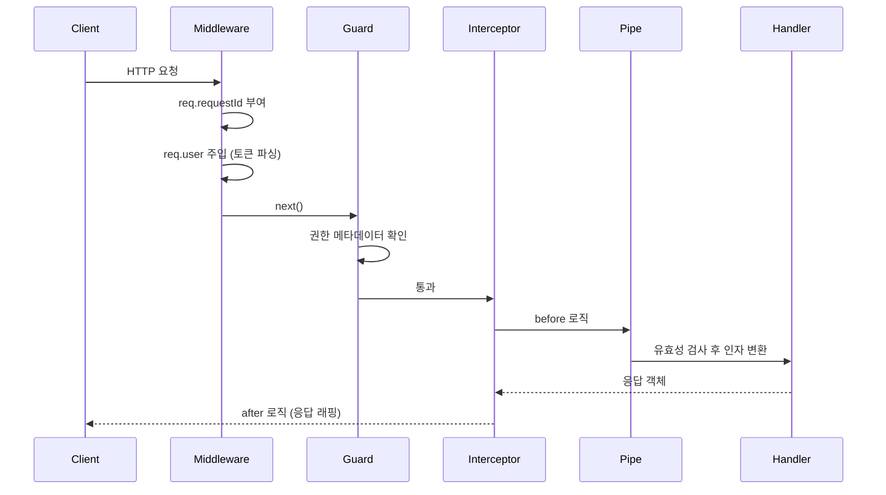

# NestJS Middleware

미들웨어는 요청이 라우트 핸들러에 닿기 직전에 끼어드는 함수다. 요청 객체에 무언가를 붙이거나, 응답 헤더를 손대거나, 어떤 조건이면 더 진행시키지 않고 끊어버리는 자리다. Express나 Koa를 써본 사람이라면 익숙한 개념인데, NestJS에 와서는 가드·인터셉터·파이프 같은 형제 컴포넌트가 함께 줄을 서면서 어디까지가 미들웨어 책임인지 자주 헷갈린다.

5년쯤 NestJS로 서비스를 운영하다 보면 미들웨어가 만능 도구처럼 쓰이다 망가지는 사례를 자주 본다. 인가 처리를 미들웨어에 박아두고는 라우트별 권한 데코레이터를 못 읽어서 결국 if문으로 우회하거나, 응답 변환을 미들웨어에서 하려다 NestJS의 직렬화 단계와 충돌하는 식이다. 미들웨어가 어디에 위치하고 어떤 정보에 접근할 수 있는지를 명확히 알아야 이런 사고를 피한다.

## 미들웨어의 자리

NestJS 요청 처리 순서에서 미들웨어는 가장 앞에 있다.

```
Request
  └─ Middleware           ← 가장 먼저
       └─ Guard
            └─ Interceptor (before)
                 └─ Pipe
                      └─ Handler
                 └─ Interceptor (after)
                      └─ Exception Filter
                           └─ Response
```

미들웨어는 라우터가 매칭한 뒤, 가드보다 먼저 실행된다. 정확히는 Express(또는 Fastify) 미들웨어 체인 위에 NestJS가 자기 컴포넌트를 얹은 구조라서, NestJS 미들웨어는 그 Express 미들웨어 자리에 그대로 꽂힌다. 그 결과 미들웨어 안에서는 `ExecutionContext`를 받을 수 없다. 어떤 컨트롤러의 어떤 메서드가 호출될지, 클래스에 어떤 데코레이터가 붙어 있는지 모른다.

이 한계가 결정적이다. "관리자만 접근 가능" 같은 라우트별 권한 규칙을 미들웨어에서 처리하려면, 결국 path 문자열을 비교하거나 별도 메타 테이블을 두는 수밖에 없다. 그건 가드 자리다. 미들웨어는 라우트 정보가 필요 없는 일에만 쓴다.

미들웨어가 잘 맞는 자리는 이런 종류다.

- 요청에 ID를 부여하고 응답 헤더에 실어 보내기
- 토큰을 파싱해서 `req.user`에 사용자 객체 주입 (권한 검사는 안 함)
- 액세스 로그 남기기, 응답 시간 측정
- CORS, 압축, body parsing 같은 Express 생태계 표준 미들웨어 재사용
- 헤더 정규화, 멀티 테넌트 라우팅 정보 파싱

핵심은 "어떤 핸들러가 호출되는지 몰라도 되는 일"이다. 그 선을 넘으면 가드나 인터셉터로 옮겨야 한다.

## 함수형 미들웨어

가장 단순한 형태는 그냥 함수다. Express 미들웨어와 시그니처가 같다.

```typescript
import { Request, Response, NextFunction } from 'express';
import { randomUUID } from 'crypto';

export function requestIdMiddleware(
  req: Request,
  res: Response,
  next: NextFunction,
) {
  const id = (req.headers['x-request-id'] as string) ?? randomUUID();
  req['requestId'] = id;
  res.setHeader('x-request-id', id);
  next();
}
```

함수형은 의존성 주입이 필요 없을 때 쓴다. 다른 서비스를 호출하지 않고, 환경변수 하나 정도만 참조해서 끝나는 단순한 작업이 여기 해당한다. 요청 ID 부여, 응답 헤더 추가, 단순 로깅 정도가 함수형으로 깔끔하다.

함수형은 NestJS 모듈 시스템 바깥에 있다는 점만 기억하면 된다. `@Injectable()`이 안 붙으므로 `ConfigService` 같은 걸 주입받지 못한다. 환경 의존이 필요한 순간 클래스형으로 넘어가야 한다.

한 가지 더, 함수형 미들웨어는 `MiddlewareConsumer.apply()`에 함수 참조 그대로 넘기면 된다. 클래스가 아니므로 모듈의 `providers`에 등록할 필요도 없다. 등록 비용이 0에 가깝다는 점은 함수형의 진짜 장점이다.

```typescript
// 모듈에 provider 등록 불필요
consumer.apply(requestIdMiddleware).forRoutes('*');
```

## 클래스형 미들웨어

DI가 필요하면 `NestMiddleware` 인터페이스를 구현한 클래스로 만든다.

```typescript
import { Injectable, NestMiddleware, Logger } from '@nestjs/common';
import { Request, Response, NextFunction } from 'express';
import { ConfigService } from '@nestjs/config';

@Injectable()
export class AccessLogMiddleware implements NestMiddleware {
  private readonly logger = new Logger('AccessLog');

  constructor(private readonly config: ConfigService) {}

  use(req: Request, res: Response, next: NextFunction) {
    const startedAt = Date.now();
    const env = this.config.get<string>('NODE_ENV');

    res.on('finish', () => {
      const elapsed = Date.now() - startedAt;
      this.logger.log(
        `[${env}] ${req.method} ${req.originalUrl} ${res.statusCode} ${elapsed}ms`,
      );
    });

    next();
  }
}
```

클래스형의 장점은 둘이다. 첫째, 서비스 주입이 자유롭다. 둘째, 단위 테스트가 쉽다. `AccessLogMiddleware`를 인스턴스로 만들어서 `use`를 호출하기만 하면 된다.

함수형과 클래스형 중 어느 쪽을 쓸지 고민될 때는 "이 미들웨어가 다른 서비스를 호출하거나 설정값을 읽어야 하나?"만 따지면 된다. 그렇다면 클래스형, 아니면 함수형이다.

한 가지 자주 놓치는 점은 클래스형 미들웨어의 스코프다. 기본 스코프는 싱글턴이라서 인스턴스 하나가 모든 요청을 처리한다. `use` 안에서 인스턴스 필드에 요청별 상태를 저장하면 다른 요청과 섞인다. 요청 단위 상태는 `req` 객체나 `AsyncLocalStorage`에 담아야지, 미들웨어 인스턴스에 담으면 안 된다.

```typescript
// 잘못된 패턴 — 인스턴스 필드에 요청 상태
@Injectable()
export class BadMiddleware implements NestMiddleware {
  private currentUser: User; // 모든 요청이 이 필드 공유

  use(req: Request, res: Response, next: NextFunction) {
    this.currentUser = parseUser(req); // 동시 요청이 서로 덮어씀
    next();
  }
}
```

요청 스코프(`Scope.REQUEST`)로 바꾸면 요청마다 인스턴스가 새로 생기지만, 비용이 크다. 모든 의존성 트리가 매 요청 재생성되어 처리량이 떨어진다. 미들웨어를 요청 스코프로 만드는 일은 거의 없다.

## MiddlewareConsumer로 등록

NestJS 미들웨어는 `@Module()` 데코레이터에 붙이는 게 아니라, 모듈 클래스가 `NestModule`을 구현하면서 `configure` 메서드 안에서 등록한다.

```typescript
import { MiddlewareConsumer, Module, NestModule } from '@nestjs/common';
import { AccessLogMiddleware } from './access-log.middleware';

@Module({
  controllers: [UsersController],
  providers: [UsersService, AccessLogMiddleware],
})
export class UsersModule implements NestModule {
  configure(consumer: MiddlewareConsumer) {
    consumer.apply(AccessLogMiddleware).forRoutes('users');
  }
}
```

클래스형 미들웨어는 `providers`에 한 번 더 등록해야 DI가 동작한다. 빼먹으면 `Nest can't resolve dependencies of the ...` 에러가 뜬다. 함수형은 이 단계가 필요 없다.

`apply()`에는 미들웨어를 여러 개 넘길 수 있다. 등록 순서가 곧 실행 순서다.

```typescript
consumer
  .apply(requestIdMiddleware, AccessLogMiddleware, AuthTokenMiddleware)
  .forRoutes('*');
```

위 코드에서 요청이 들어오면 `requestIdMiddleware` → `AccessLogMiddleware` → `AuthTokenMiddleware` 순으로 거친다. 요청 ID가 먼저 박혀야 로그에 그 ID가 찍히고, 토큰 파싱은 가장 마지막에 와도 무방하니까 이런 순서가 자연스럽다.

`configure` 메서드는 모듈 인스턴스가 만들어진 뒤 한 번만 호출된다. 동적으로 등록을 바꿀 수 없다는 뜻이다. 어떤 미들웨어를 끌지 말지를 런타임에 결정하고 싶다면 `configure` 안에서 환경변수를 보고 조건부 등록을 해야 한다.

```typescript
configure(consumer: MiddlewareConsumer) {
  if (this.config.get('ENABLE_ACCESS_LOG') === 'true') {
    consumer.apply(AccessLogMiddleware).forRoutes('*');
  }
}
```

## forRoutes와 exclude

`forRoutes`는 어느 경로에 미들웨어를 붙일지 결정한다. 세 가지 형태로 줄 수 있다.

```typescript
// 1) path 문자열
consumer.apply(AuthTokenMiddleware).forRoutes('users');

// 2) RouteInfo 객체 (method까지 지정)
consumer.apply(AuthTokenMiddleware).forRoutes({
  path: 'users/*',
  method: RequestMethod.GET,
});

// 3) 컨트롤러 클래스
consumer.apply(AuthTokenMiddleware).forRoutes(UsersController);
```

세 형태 모두 쓸 만한데, 컨트롤러 클래스로 지정하는 쪽이 가장 안전하다. 라우트 경로를 바꿔도 미들웨어 매핑이 깨지지 않는다. 반대로 path 문자열은 라우트가 리팩토링되는 순간 조용히 어긋나기 쉽다. 어디서 막혔는지 추적하기도 까다롭다.

path 와일드카드의 동작도 몇 가지 짚어둘 만하다. `users/*`는 `users/`로 시작하는 모든 하위 경로에 매칭되지만, `users` 자체에는 매칭되지 않는다. 정확히 `users` 단일 경로까지 잡으려면 `users` 또는 `users/*`를 따로 등록해야 한다. 그리고 `*`만 단독으로 쓰면 모든 경로지만, 글로벌 prefix가 걸리면 그 prefix 아래에만 적용된다.

`exclude`는 특정 경로만 빼고 싶을 때 쓴다.

```typescript
consumer
  .apply(AuthTokenMiddleware)
  .exclude(
    { path: 'users/health', method: RequestMethod.GET },
    { path: 'users/login', method: RequestMethod.POST },
  )
  .forRoutes(UsersController);
```

`exclude`에는 함정이 있다. path 문자열만 넘기면 모든 메서드가 제외된다. RouteInfo 객체로 method까지 명시해야 의도대로 동작한다. `users/login`만 적으면 GET, POST 양쪽 다 제외된다.

또 자주 빠지는 함정은 `forRoutes('*')`와 글로벌 prefix의 조합이다. `app.setGlobalPrefix('api')`를 걸어둔 상태에서 `forRoutes('*')`는 prefix가 붙은 `/api/...` 경로에 적용된다. health check 라우트를 prefix 바깥에 두었다면 미들웨어가 안 걸린다. 이걸 모르고 인증 미들웨어가 빠진 게이트웨이 엔드포인트를 한참 못 찾는 사고가 흔하다.

`MiddlewareConsumer`의 `apply().forRoutes(...).apply(...).forRoutes(...)` 체이닝도 가능하다. 한 모듈에서 미들웨어 묶음을 라우트별로 다르게 걸 때 쓴다.

```typescript
configure(consumer: MiddlewareConsumer) {
  consumer
    .apply(PublicMiddleware).forRoutes('public/*')
    .apply(AuthTokenMiddleware, RateLimitMiddleware).forRoutes('api/*');
}
```

## main.ts vs AppModule, 두 등록 지점

글로벌 미들웨어를 등록할 자리가 두 군데다. 두 자리는 동작 시점도 다르고, 무엇을 넣어야 하는지도 다르다.

**`main.ts`의 `app.use()`**는 NestFactory가 만든 HTTP 인스턴스 위에 직접 미들웨어를 박는다. 본질적으로 Express(또는 Fastify)에 직접 `app.use()`를 호출하는 것과 같다. NestJS 모듈 시스템 바깥이라 DI가 안 된다. 라우트 구성보다 먼저 실행된다는 보장이 있다.

```typescript
async function bootstrap() {
  const app = await NestFactory.create(AppModule);
  app.use(helmet());
  app.use(compression());
  app.use(cookieParser());
  app.use(express.json({ limit: '10mb' }));
  await app.listen(3000);
}
```

이 자리에 들어가는 것은 사실상 Express 미들웨어다. `helmet`, `compression`, `cookie-parser`, `body-parser` 같은 표준 미들웨어가 여기 들어간다.

**`AppModule`의 `MiddlewareConsumer`**는 NestJS 컨테이너 안쪽에서 동작한다. DI가 살아 있어서 서비스를 주입받을 수 있다. 모듈 초기화가 끝난 뒤에야 라우트별 매핑이 결정된다.

```typescript
export class AppModule implements NestModule {
  configure(consumer: MiddlewareConsumer) {
    consumer.apply(AccessLogMiddleware).forRoutes('*');
  }
}
```

실행 순서가 어떻게 되느냐 — `main.ts`에 박은 미들웨어가 `AppModule`에 등록한 미들웨어보다 먼저 실행된다. 정확히는 `app.use()`가 HTTP 인스턴스의 미들웨어 체인에 가장 먼저 끼어들고, 그 다음에 NestJS 라우터가 위치하며, 라우터 안에서 `MiddlewareConsumer`로 등록한 미들웨어가 라우트 매칭 직전에 동작한다.

이 순서가 중요한 경우가 있다. `cookie-parser`는 `main.ts`에 박혀야 한다. 그래야 `MiddlewareConsumer`로 등록한 인증 미들웨어가 `req.cookies`를 읽을 수 있다. 반대로 NestJS DI가 필요한 미들웨어는 `MiddlewareConsumer`에 등록해야 `ConfigService`나 `JwtService` 같은 걸 주입받을 수 있다.

| 자리 | 적합한 미들웨어 | DI | 실행 시점 |
|------|----------------|------|-----------|
| `main.ts`의 `app.use()` | Express/Fastify 표준 미들웨어 | 안 됨 | 가장 먼저 |
| `AppModule`의 `MiddlewareConsumer` | NestJS DI가 필요한 미들웨어 | 됨 | `app.use()` 다음 |

차이를 한 줄로 정리하면 `main.ts`의 `app.use()`는 Express/Fastify 생태계 미들웨어용, `AppModule`의 `forRoutes('*')`는 NestJS 컴포넌트용이다.

운영하면서 한 가지 주의할 점이 더 있다. `main.ts`에 박힌 미들웨어는 단위 테스트에서 모듈만 인스턴스화하는 시나리오에서 빠진다. 인증 같은 보안 미들웨어를 `main.ts`에만 두면 통합 테스트에서 우회되어 운영에서만 동작한다. 가능한 한 NestJS DI 가능한 형태로 옮기고 `AppModule`에서 등록하는 편이 안전하다.

## Express 어댑터와 Fastify 어댑터의 차이

NestJS는 기본적으로 Express 어댑터로 시작하지만, Fastify 어댑터로 바꿔 끼울 수 있다. 미들웨어 처리 방식이 다르기 때문에 어댑터 변경은 미들웨어 코드를 가장 먼저 깨뜨린다.

### Express 어댑터

Express의 미들웨어 모델은 `(req, res, next) => void` 시그니처가 표준이다. NestJS Express 어댑터는 이 시그니처를 그대로 받아서 `app.use()`와 `MiddlewareConsumer` 양쪽에서 동작시킨다. `passport`의 `initialize()`, `express-rate-limit`, `morgan` 같은 거의 모든 Express 미들웨어가 그대로 들어간다.

```typescript
import * as morgan from 'morgan';
import rateLimit from 'express-rate-limit';

async function bootstrap() {
  const app = await NestFactory.create(AppModule);
  app.use(morgan('combined'));
  app.use(
    rateLimit({
      windowMs: 60_000,
      max: 100,
    }),
  );
  await app.listen(3000);
}
```

`req`, `res` 타입도 Express의 것이다. `Request from 'express'`, `Response from 'express'`를 import해서 쓴다.

### Fastify 어댑터

Fastify는 미들웨어 체인 모델 자체가 다르다. 미들웨어 대신 hooks 기반이다(`onRequest`, `preHandler`, `onResponse` 등). Express 스타일 `(req, res, next)` 미들웨어를 그대로 쓰려면 추가 패키지를 깔아야 한다.

```bash
npm i @fastify/middie
# 또는 Express 미들웨어 호환을 더 폭넓게 하려면
npm i @fastify/express
```

설치 후 부트스트랩에서 등록한다.

```typescript
import { NestFactory } from '@nestjs/core';
import {
  FastifyAdapter,
  NestFastifyApplication,
} from '@nestjs/platform-fastify';
import middie from '@fastify/middie';

async function bootstrap() {
  const app = await NestFactory.create<NestFastifyApplication>(
    AppModule,
    new FastifyAdapter(),
  );
  await app.register(middie); // Express 스타일 미들웨어 활성화
  app.use(someExpressMiddleware());
  await app.listen(3000, '0.0.0.0');
}
```

`@fastify/middie`는 가벼운 호환층이라 어지간한 Express 미들웨어가 동작하지만, 모든 게 다 되는 건 아니다. `req`, `res` 내부 구현에 깊이 손대는 미들웨어(예: `res.write()`를 monkey patch하는 것)는 실패한다. 더 폭넓은 호환이 필요하면 `@fastify/express`를 쓰면 되지만 Fastify를 도입한 의미가 약해진다. Fastify의 성능 이점은 자기 hook 시스템에서 나오기 때문이다.

### req/res 타입의 차이

Express와 Fastify는 요청·응답 객체 API가 다르다. 운영 코드에서 자주 마주치는 차이는 이 정도다.

| 동작 | Express | Fastify |
|------|---------|---------|
| 헤더 설정 | `res.setHeader('x', 'y')` | `res.header('x', 'y')` 또는 `res.raw.setHeader(...)` |
| 헤더 읽기 | `req.headers['x']` | `req.headers['x']` (동일) |
| 상태 코드 | `res.status(200).send(...)` | `res.code(200).send(...)` |
| 응답 종료 | `res.end()` | `res.raw.end()` |
| URL | `req.originalUrl`, `req.url` | `req.url` (raw 원본은 `req.raw.url`) |
| body | `req.body` (body-parser 필요) | `req.body` (내장) |

NestJS 미들웨어를 어댑터 양쪽에서 같이 쓰려면 어댑터 종속적인 API를 피하든가, `req.raw`/`res.raw`로 Node.js 기본 객체에 내려가서 조작해야 한다. `res.raw.setHeader('x-request-id', id)`는 어댑터에 상관없이 동작한다. 단, 이건 NestJS의 응답 처리 추상화를 우회하는 셈이라 가능하면 어댑터별로 미들웨어를 나누는 편이 깔끔하다.

### 어댑터 변경 시 가장 먼저 깨지는 부분

운영하다 Express에서 Fastify로 어댑터를 바꿔야 할 때 가장 먼저 망가지는 게 다음 세 가지다.

1. `app.use()`에 박아둔 Express 미들웨어 — `@fastify/middie` 등록 전에는 그냥 동작하지 않는다.
2. `res.setHeader`, `res.status().send()` 같은 어댑터 종속 호출 — 컴파일 에러는 안 나고 런타임에 조용히 깨진다.
3. `passport.initialize()`처럼 Express에 깊이 결합된 미들웨어 — `@fastify/passport`로 교체해야 한다.

대형 서비스에서 어댑터 변경은 단순히 한 줄 바꾸는 일이 아니다. 미들웨어 전체를 검토할 일이라는 점을 미리 깔고 가야 한다.

## req/res 객체 직접 조작 시 주의사항

미들웨어 코드에서 가장 사고가 잦은 영역이다. raw `req`/`res`에 직접 손대다 보면 NestJS 추상화와 어긋나는 일이 생긴다.

### req에 속성 붙이기는 타입 안전성을 무너뜨린다

`req['user']`, `req['requestId']` 같은 식으로 임의 속성을 붙이는 패턴이 흔한데, TypeScript 타입 시스템에서는 이게 잡히지 않는다. 다음처럼 declaration merging으로 타입을 확장해두는 편이 사고를 줄인다.

```typescript
// types/express.d.ts
declare global {
  namespace Express {
    interface Request {
      requestId?: string;
      user?: { id: string; roles: string[] };
    }
  }
}
export {};
```

이렇게 두면 컨트롤러에서 `req.user.id`를 칠 때 자동완성도 되고, 옵셔널 체이닝 누락도 잡힌다.

### 응답 헤더는 first chunk 전에만 설정 가능하다

`res.setHeader`는 응답 본문의 첫 번째 청크가 나가기 전에만 동작한다. 한 번이라도 `res.write` 또는 `res.end`가 호출되면 그 뒤에 `setHeader`를 호출해도 `ERR_HTTP_HEADERS_SENT` 에러가 난다. 미들웨어가 `res.on('finish')` 안에서 헤더를 추가하려는 시도가 종종 보이는데, 그 시점에는 이미 헤더가 다 나간 상태라 효과가 없다.

```typescript
// 동작하지 않음
res.on('finish', () => {
  res.setHeader('x-response-time', `${elapsed}ms`); // 이미 늦음
});

// 옳은 방식 — 응답 시작 전에 등록
const startedAt = Date.now();
const original = res.end.bind(res);
res.end = function (...args: any[]) {
  res.setHeader('x-response-time', `${Date.now() - startedAt}ms`);
  return original(...args);
} as any;
```

`res.end`를 monkey patch하는 방식은 Express 어댑터에서는 통하지만 Fastify의 `res.raw.end`에서는 시그니처가 미묘하게 다르다. 가능하면 NestJS 인터셉터의 `tap()` 안에서 헤더를 조작하는 편이 표준 경로다.

### 응답 본문을 미들웨어에서 가공하지 마라

미들웨어에서 응답 본문을 가로채 변형하려는 시도(예: 모든 응답을 `{ data: ... }`로 감싸기)는 NestJS의 응답 직렬화 단계와 충돌한다. NestJS는 핸들러가 리턴한 객체를 받아 직렬화하는데, 미들웨어 단에서 `res.write`/`res.end`를 monkey patch하면 직렬화 전 데이터와 후 데이터가 섞이거나, content-length가 맞지 않아 청크 인코딩이 깨진다.

응답 변환은 인터셉터의 자리다. `map()` 연산자로 핸들러 리턴값을 변형하면 직렬화 전에 정확한 데이터에 손댈 수 있다.

### 미들웨어에서 응답을 종료시키는 코드는 피한다

```typescript
// 권장하지 않음
use(req: Request, res: Response, next: NextFunction) {
  if (!req.headers['x-api-key']) {
    res.status(401).send('unauthorized');
    return; // next 호출 안 함
  }
  next();
}
```

이렇게 쓰면 NestJS 예외 필터를 거치지 않는다. 응답 포맷이 다른 라우트와 어긋난다. 같은 일을 한다면 가드에서 `throw new UnauthorizedException()`을 던지는 쪽이 깔끔하다. 예외 필터가 표준 응답 형식으로 감싸준다.

부득이하게 미들웨어에서 응답을 종료해야 한다면(예: CORS preflight 직접 처리), 적어도 다른 라우트의 에러 응답 포맷과 통일된 JSON을 직접 만들어 보내야 한다. 그래야 클라이언트가 에러 처리 로직을 갈라 쓰지 않는다.

### 스트리밍 응답에서 미들웨어 후처리는 조심해야 한다

`res.on('finish')`는 응답 본문이 다 나간 시점에 호출되고, `res.on('close')`는 연결이 끊어진 시점(중간 끊김 포함)에 호출된다. 스트리밍 응답(SSE, 큰 파일 다운로드)에서는 finish가 늦게 오거나 안 올 수 있다.

```typescript
res.on('finish', () => {
  // 정상 종료. 짧은 응답이면 항상 여기로 옴
});
res.on('close', () => {
  // 클라이언트가 끊거나 비정상 종료
});
```

운영에서는 두 이벤트를 모두 잡아 한 번만 로그를 남기는 패턴을 쓴다.

```typescript
let logged = false;
const logOnce = () => {
  if (logged) return;
  logged = true;
  // 로그 한 번
};
res.on('finish', logOnce);
res.on('close', logOnce);
```

### 비동기 미들웨어에서 next 누락

```typescript
// 잘못된 코드
use(req: Request, res: Response, next: NextFunction) {
  this.someService.fetch().then((data) => {
    req['data'] = data;
  });
  next(); // fetch가 끝나기 전에 next가 호출됨
}
```

`async/await`로 명확히 풀어야 한다.

```typescript
async use(req: Request, res: Response, next: NextFunction) {
  req['data'] = await this.someService.fetch();
  next();
}
```

비동기 미들웨어에서 예외가 던져지면 처리가 까다롭다. Express 미들웨어 계층에서 던진 동기 예외는 Express 기본 에러 핸들러로 떨어지지, NestJS 예외 필터로 가지 않는다. 비동기 예외는 더 까다로워서 `try/catch`로 감싸 `next(err)`로 넘기든가, 검증 로직 자체를 가드로 이동시키는 편이 낫다.

```typescript
async use(req: Request, res: Response, next: NextFunction) {
  try {
    req['data'] = await this.someService.fetch();
    next();
  } catch (err) {
    next(err); // Express 에러 핸들러 체인으로 전달
  }
}
```

## 미들웨어, 가드, 인터셉터 비교

같은 일을 세 군데서 할 수 있어 보이지만 자리마다 받는 정보가 다르다.

| 구분 | 실행 시점 | ExecutionContext | DI | 주요 용도 |
|------|-----------|------------------|------|-----------|
| 미들웨어 | 가장 앞 | 없음 | 클래스형만 | 요청 변형, 로깅, 헤더 처리 |
| 가드 | 미들웨어 다음 | 있음 | 가능 | 인증·인가 판단 |
| 인터셉터 | 가드 다음, 핸들러 전후 | 있음 | 가능 | 응답 변환, 캐싱, 타임아웃 |

자주 보이는 잘못된 배치는 이런 식이다.

- 미들웨어에서 권한 검사 → 라우트별 분기 못 함. 가드로 옮긴다.
- 인터셉터에서 토큰 검증 → 핸들러보다 늦다. 검증 실패 시 응답 변환 도중 예외라 핸들링이 어색해진다. 가드로 옮긴다.
- 미들웨어에서 응답 본문 가공 → NestJS 직렬화와 충돌. 인터셉터로 옮긴다.

좋은 분담은 이렇다. 토큰 디코딩과 `req.user` 주입은 미들웨어, 권한 검사는 가드, 응답 표준 포맷 래핑은 인터셉터. 한 책임에 한 자리.

## 실행 순서 다이어그램



각 자리에서 닿는 정보의 폭이 다르다. 미들웨어는 raw request·response, 가드부터는 NestJS의 ExecutionContext, 인터셉터는 RxJS 스트림으로 핸들러 결과를 다룬다.

## 실무 예제: 요청 ID

분산 환경에서 요청 추적은 ID 하나로 시작한다. 게이트웨이가 ID를 만들어주면 그걸 받아 쓰고, 없으면 직접 생성한다.

```typescript
import { Injectable, NestMiddleware } from '@nestjs/common';
import { Request, Response, NextFunction } from 'express';
import { randomUUID } from 'crypto';
import { AsyncLocalStorage } from 'async_hooks';

export const requestContext = new AsyncLocalStorage<{ requestId: string }>();

@Injectable()
export class RequestIdMiddleware implements NestMiddleware {
  use(req: Request, res: Response, next: NextFunction) {
    const incoming = req.headers['x-request-id'];
    const requestId =
      typeof incoming === 'string' && incoming.length > 0
        ? incoming
        : randomUUID();

    req['requestId'] = requestId;
    res.setHeader('x-request-id', requestId);

    requestContext.run({ requestId }, () => next());
  }
}
```

`AsyncLocalStorage`에 ID를 묶어두면 어디서든 꺼내 쓸 수 있다. 로거에서 자동으로 ID를 찍게 만드는 흔한 패턴이다.

```typescript
import { Injectable, LoggerService } from '@nestjs/common';
import { requestContext } from './request-id.middleware';

@Injectable()
export class ContextualLogger implements LoggerService {
  log(message: string) {
    const ctx = requestContext.getStore();
    const id = ctx?.requestId ?? '-';
    console.log(`[${id}] ${message}`);
  }
  error(message: string) {
    const ctx = requestContext.getStore();
    console.error(`[${ctx?.requestId ?? '-'}] ${message}`);
  }
  warn(message: string) {
    /* ... */
  }
}
```

ID 미들웨어는 가장 먼저 등록해야 한다. 다른 미들웨어·가드·핸들러가 로그를 찍을 때 ID가 박혀 있어야 의미가 있다.

## 실무 예제: 토큰 파싱

인증 책임을 둘로 쪼개는 방식이다. 미들웨어는 토큰을 디코딩해서 `req.user`만 만들어두고, 가드가 그 사용자를 보고 통과/차단을 결정한다.

```typescript
import { Injectable, NestMiddleware } from '@nestjs/common';
import { Request, Response, NextFunction } from 'express';
import { JwtService } from '@nestjs/jwt';

@Injectable()
export class JwtUserMiddleware implements NestMiddleware {
  constructor(private readonly jwt: JwtService) {}

  use(req: Request, _res: Response, next: NextFunction) {
    const header = req.headers.authorization;
    if (!header?.startsWith('Bearer ')) {
      return next();
    }

    const token = header.slice('Bearer '.length);
    try {
      const payload = this.jwt.verify(token);
      req['user'] = { id: payload.sub, roles: payload.roles ?? [] };
    } catch {
      // 토큰이 깨졌으면 그냥 user 없이 진행. 401은 가드에서 결정한다.
    }

    next();
  }
}
```

여기서 토큰이 깨졌다고 곧장 401을 던지지 않는 점이 중요하다. 어떤 라우트는 인증이 선택적일 수도 있어서다. "비로그인이면 게스트 응답" 같은 분기를 가드 안에서 처리하려면 미들웨어는 정보 주입만 하고 빠져야 한다. 던지고 막는 건 가드의 일이다.

## 실무 예제: 액세스 로그

`res.on('finish')` 이벤트로 응답이 끝난 시점을 잡아 로그를 남긴다. 응답 시간, 상태 코드, 메서드, 경로, 사용자 ID 정도면 운영에 필요한 정보가 거의 모인다.

```typescript
import { Injectable, NestMiddleware, Logger } from '@nestjs/common';
import { Request, Response, NextFunction } from 'express';

@Injectable()
export class AccessLogMiddleware implements NestMiddleware {
  private readonly logger = new Logger('AccessLog');

  use(req: Request, res: Response, next: NextFunction) {
    const startedAt = process.hrtime.bigint();
    let logged = false;

    const writeLog = () => {
      if (logged) return;
      logged = true;
      const elapsedNs = process.hrtime.bigint() - startedAt;
      const elapsedMs = Number(elapsedNs) / 1_000_000;
      const userId = req['user']?.id ?? '-';
      const requestId = req['requestId'] ?? '-';

      this.logger.log(
        `${requestId} ${req.method} ${req.originalUrl} ${res.statusCode} ${elapsedMs.toFixed(2)}ms user=${userId}`,
      );
    };

    res.on('finish', writeLog);
    res.on('close', writeLog);

    next();
  }
}
```

`finish`와 `close`를 모두 잡되 한 번만 로그를 찍는다. 클라이언트가 타임아웃으로 끊는 케이스가 종종 보고되는데, finish만 보고 있으면 그 호출이 로그에서 사라진다.

## 등록을 한 군데로 모으기

미들웨어를 모듈마다 흩어두면 등록 순서를 추적하기 어렵다. 글로벌로 다 깔리는 미들웨어(요청 ID, 액세스 로그, 토큰 파싱)는 `AppModule`에 모아두는 편이 운영하기 좋다.

```typescript
@Module({
  imports: [ConfigModule.forRoot(), AuthModule, UsersModule],
  providers: [AccessLogMiddleware, JwtUserMiddleware, RequestIdMiddleware],
})
export class AppModule implements NestModule {
  configure(consumer: MiddlewareConsumer) {
    consumer
      .apply(RequestIdMiddleware, AccessLogMiddleware, JwtUserMiddleware)
      .forRoutes('*');
  }
}
```

모듈별로 필요한 도메인 특화 미들웨어(예: 멀티 테넌트 ID 파싱)만 각 모듈에 둔다. 글로벌과 도메인을 섞어 두면 어디서 무엇이 동작하는지 한눈에 안 들어온다.

## 정리

미들웨어는 NestJS에서 가장 낮은 계층이고, 그 자리에 맞는 일만 시켜야 한다. 라우트가 누구인지 몰라도 되는 일 — 요청 ID 부여, 토큰 디코딩과 사용자 주입, 액세스 로그, Express 생태계 미들웨어 재사용 — 이 미들웨어가 가장 잘하는 일이다. 권한 결정과 응답 변환은 가드와 인터셉터로 넘기고, 미들웨어는 데이터를 준비하고 흐름을 흘려보내는 데 집중하면 된다. 어댑터(Express vs Fastify)와 등록 시점(`main.ts` vs `AppModule`)의 차이까지 머릿속에 깔아두면 사고를 한 단계 줄일 수 있다.
