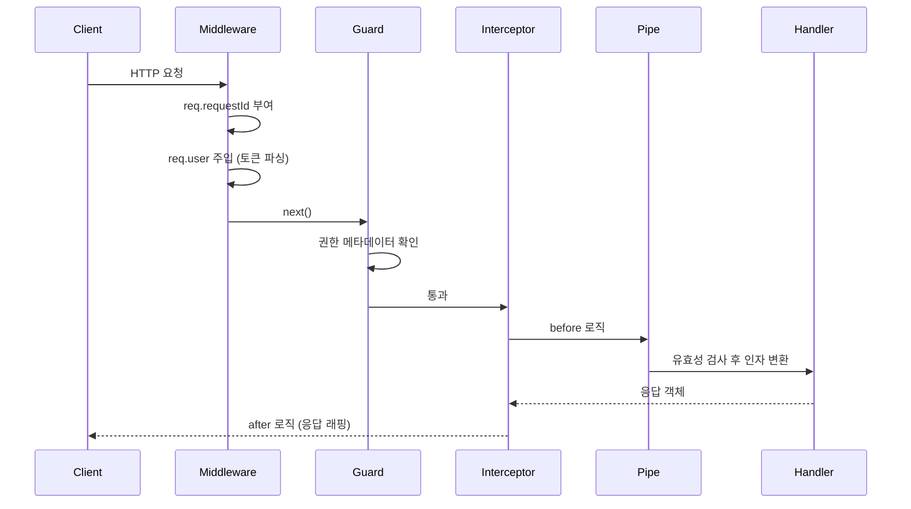

# NestJS Middleware

미들웨어는 요청이 라우트 핸들러에 도달하기 직전에 끼어드는 함수다. 요청 객체에 무언가를 붙이거나, 응답 헤더를 손대거나, 어떤 조건이면 더 진행시키지 않고 끊어버리는 자리다. Express나 Koa를 써본 사람이라면 익숙한 개념이지만, NestJS에 와서는 가드·인터셉터·파이프 같은 형제 컴포넌트가 늘어서 어디까지가 미들웨어의 책임인지 자주 헷갈린다.

5년 정도 NestJS로 서비스를 운영하다 보면, 미들웨어가 만능 도구처럼 쓰이다 망가지는 사례를 자주 본다. 인가 처리를 미들웨어에 넣어두고는 라우트별 권한 데코레이터를 못 읽어 분기를 if문으로 우회하거나, 응답 변환을 미들웨어에서 하려다 NestJS의 응답 직렬화 단계와 충돌하는 식이다. 미들웨어가 어디에 위치하고 어떤 정보에 접근할 수 있는지를 명확히 알아야 이런 사고를 피한다.

## 미들웨어의 자리

NestJS 요청 처리 순서에서 미들웨어는 가장 앞에 있다.

```
Request
  └─ Middleware           ← 가장 먼저
       └─ Guard
            └─ Interceptor (before)
                 └─ Pipe
                      └─ Handler
                 └─ Interceptor (after)
                      └─ Exception Filter
                           └─ Response
```

미들웨어는 라우터가 매칭한 뒤, 그러나 가드보다 먼저 실행된다. 정확히는 Express(또는 Fastify) 미들웨어 체인 위에 NestJS가 자기 컴포넌트들을 얹은 구조라서, NestJS 미들웨어는 그 Express 미들웨어 자리에 그대로 꽂힌다. 그 결과 미들웨어 안에서는 `ExecutionContext`를 받을 수 없다. 어떤 컨트롤러의 어떤 메서드가 호출될지, 클래스에 어떤 데코레이터가 붙어 있는지 모른다.

이 한계가 결정적이다. "관리자만 접근 가능" 같은 라우트별 권한 규칙을 미들웨어에서 처리하려면, 결국 path 문자열을 비교하거나 별도 메타 테이블을 두는 수밖에 없다. 그건 가드의 자리다. 미들웨어는 라우트 정보가 필요 없는 일에만 쓴다.

미들웨어가 잘 맞는 자리는 이런 종류다.

- 요청에 ID를 부여하고 응답 헤더에 실어 보내기
- 토큰을 파싱해서 `req.user`에 사용자 객체 주입 (권한 검사는 안 함)
- 액세스 로그 남기기, 응답 시간 측정
- CORS, 압축, body parsing 같은 Express 생태계의 표준 미들웨어 재사용
- 헤더 정규화, 멀티 테넌트 라우팅 정보 파싱

핵심은 "어떤 핸들러가 호출되는지 몰라도 되는 일"이다. 그 선을 넘으면 가드나 인터셉터로 옮겨야 한다.

## 함수형 미들웨어

가장 단순한 형태는 그냥 함수다. Express 미들웨어와 시그니처가 같다.

```typescript
import { Request, Response, NextFunction } from 'express';

export function requestIdMiddleware(
  req: Request,
  res: Response,
  next: NextFunction,
) {
  const id = req.headers['x-request-id'] ?? crypto.randomUUID();
  req['requestId'] = id;
  res.setHeader('x-request-id', id as string);
  next();
}
```

함수형은 의존성 주입이 필요 없을 때 쓴다. 다른 서비스를 호출하지 않고, 환경변수 하나 정도만 참조해서 끝나는 단순한 작업이 여기 해당한다. 요청 ID 부여, 응답 헤더 추가, 단순 로깅 정도가 함수형으로 깔끔하다.

함수형은 NestJS 모듈 시스템 바깥에 있다는 점만 기억하면 된다. `@Injectable()`이 안 붙으므로 `ConfigService` 같은 걸 주입받지 못한다. 환경 의존이 필요한 순간 클래스형으로 넘어가야 한다.

## 클래스형 미들웨어

DI가 필요하면 `NestMiddleware` 인터페이스를 구현한 클래스로 만든다.

```typescript
import { Injectable, NestMiddleware, Logger } from '@nestjs/common';
import { Request, Response, NextFunction } from 'express';
import { ConfigService } from '@nestjs/config';

@Injectable()
export class AccessLogMiddleware implements NestMiddleware {
  private readonly logger = new Logger('AccessLog');

  constructor(private readonly config: ConfigService) {}

  use(req: Request, res: Response, next: NextFunction) {
    const startedAt = Date.now();
    const env = this.config.get<string>('NODE_ENV');

    res.on('finish', () => {
      const elapsed = Date.now() - startedAt;
      this.logger.log(
        `[${env}] ${req.method} ${req.originalUrl} ${res.statusCode} ${elapsed}ms`,
      );
    });

    next();
  }
}
```

클래스형의 장점은 둘이다. 첫째, 서비스 주입이 자유롭다. 둘째, 단위 테스트가 쉽다. `AccessLogMiddleware`를 인스턴스로 만들어서 `use`를 호출하기만 하면 된다.

함수형과 클래스형 중 어느 쪽을 쓸지 고민될 때는, "이 미들웨어가 다른 서비스를 호출하거나 설정값을 읽어야 하나?"만 따지면 된다. 그렇다면 클래스형, 아니면 함수형이다.

## MiddlewareConsumer로 등록

NestJS 미들웨어는 `@Module()`에 데코레이터로 붙이는 게 아니라, 모듈 클래스가 `NestModule`을 구현하면서 `configure` 메서드 안에서 등록한다.

```typescript
import { MiddlewareConsumer, Module, NestModule } from '@nestjs/common';
import { AccessLogMiddleware } from './access-log.middleware';

@Module({
  controllers: [UsersController],
  providers: [UsersService],
})
export class UsersModule implements NestModule {
  configure(consumer: MiddlewareConsumer) {
    consumer.apply(AccessLogMiddleware).forRoutes('users');
  }
}
```

`apply()`에는 미들웨어를 여러 개 넘길 수 있다. 등록 순서가 곧 실행 순서다.

```typescript
consumer
  .apply(requestIdMiddleware, AccessLogMiddleware, AuthTokenMiddleware)
  .forRoutes('*');
```

위 코드에서는 요청이 들어오면 `requestIdMiddleware` → `AccessLogMiddleware` → `AuthTokenMiddleware` 순으로 거친다. 요청 ID가 먼저 박혀야 로그에 그 ID가 찍히고, 토큰 파싱은 가장 마지막에 와도 무방하니까 이런 순서가 자연스럽다.

## forRoutes와 exclude

`forRoutes`는 어느 경로에 미들웨어를 붙일지 결정한다. 세 가지 형태로 줄 수 있다.

```typescript
// 1) path 문자열
consumer.apply(AuthTokenMiddleware).forRoutes('users');

// 2) RouteInfo 객체 (method까지 지정)
consumer.apply(AuthTokenMiddleware).forRoutes({
  path: 'users/*',
  method: RequestMethod.GET,
});

// 3) 컨트롤러 클래스
consumer.apply(AuthTokenMiddleware).forRoutes(UsersController);
```

세 형태 모두 쓸 만하지만, 컨트롤러 클래스로 지정하는 쪽이 가장 안전하다. 라우트 경로를 바꿔도 미들웨어 매핑이 깨지지 않는다. 반대로 path 문자열은 라우트가 리팩토링되는 순간 조용히 어긋나기 쉽다. 어디서 막혔는지 추적하기도 까다롭다.

`exclude`는 특정 경로만 빼고 싶을 때 쓴다.

```typescript
consumer
  .apply(AuthTokenMiddleware)
  .exclude(
    { path: 'users/health', method: RequestMethod.GET },
    { path: 'users/login', method: RequestMethod.POST },
  )
  .forRoutes(UsersController);
```

`exclude`는 path 문자열만 받는다는 점에서 함정이 있다. RouteInfo 객체로 method까지 명시해야 의도대로 동작한다. `users/login`만 적으면 GET, POST 양쪽 다 제외된다.

또 한 가지 자주 빠지는 함정은 `forRoutes('*')`와 글로벌 prefix의 조합이다. `app.setGlobalPrefix('api')`를 걸어둔 상태에서 `forRoutes('*')`는 prefix가 붙은 `/api/...` 경로에 적용된다. health check 라우트를 prefix 바깥에 두었다면 미들웨어가 안 걸린다. 이걸 모르고 인증 미들웨어가 빠진 게이트웨이 엔드포인트를 한참 못 찾는 사고가 흔하다.

## 글로벌 미들웨어와 모듈 미들웨어

미들웨어를 등록하는 길은 두 갈래다.

**모듈 단위 등록**은 위에서 본 `MiddlewareConsumer` 방식이다. 모듈 안의 라우트에만 붙는다. DI 컨테이너가 동작하므로 서비스를 주입받을 수 있다.

**글로벌 등록**은 `main.ts`에서 `app.use()`로 직접 박는 방식이다.

```typescript
async function bootstrap() {
  const app = await NestFactory.create(AppModule);
  app.use(helmet());
  app.use(compression());
  app.use(cookieParser());
  await app.listen(3000);
}
```

이 자리에 들어가는 것은 사실상 Express 미들웨어다. NestJS 모듈 시스템 바깥이라 DI가 안 된다. `helmet`, `compression`, `cookie-parser`, `body-parser` 같은 표준 미들웨어가 여기 들어간다.

NestJS 클래스 미들웨어를 글로벌로 걸고 싶으면 다음 패턴을 쓴다.

```typescript
// AppModule
export class AppModule implements NestModule {
  configure(consumer: MiddlewareConsumer) {
    consumer.apply(AccessLogMiddleware).forRoutes('*');
  }
}
```

`AppModule`에서 `forRoutes('*')`를 걸면 모든 라우트에 적용된다. `main.ts`의 `app.use()`와 외형은 비슷해 보이지만, 이쪽은 DI가 살아 있다. 운영 환경에서는 거의 항상 이 방식을 택한다.

차이를 한 줄로 정리하면 이렇다. `main.ts`의 `app.use()`는 Express 생태계 미들웨어용, `AppModule`의 `forRoutes('*')`는 NestJS 컴포넌트용.

## Express 미들웨어 그대로 사용하기

Express 생태계의 미들웨어는 거의 그대로 들어간다. `passport`의 `initialize()`도, `express-rate-limit`도, `morgan`도 다 쓸 수 있다.

```typescript
import * as morgan from 'morgan';
import rateLimit from 'express-rate-limit';

async function bootstrap() {
  const app = await NestFactory.create(AppModule);
  app.use(morgan('combined'));
  app.use(
    rateLimit({
      windowMs: 60_000,
      max: 100,
    }),
  );
  await app.listen(3000);
}
```

Fastify 어댑터를 쓰는 경우는 얘기가 다르다. Fastify는 미들웨어 체인 모델이 살짝 달라서 `@fastify/middie`나 `@fastify/express` 패키지를 추가로 깔아야 Express 스타일 미들웨어가 동작한다. 운영하다 Express에서 Fastify로 어댑터를 바꿔야 할 때 가장 먼저 망가지는 게 이 부분이다. 대형 서비스에서 어댑터 변경은 신중하게 검토할 일이다.

또 하나, 글로벌 인증·라이프사이클 처리는 Express 미들웨어로 넣지 말고 NestJS 컴포넌트로 옮기는 편이 낫다. `main.ts`에 박힌 미들웨어는 단위 테스트에서 빠지기 쉽고, 모듈 캡슐화도 무너진다.

## 미들웨어, 가드, 인터셉터 비교

같은 일을 세 군데서 할 수 있어 보이지만, 자리마다 받는 정보가 다르다.

| 구분 | 실행 시점 | ExecutionContext | DI | 주요 용도 |
|------|-----------|------------------|------|-----------|
| 미들웨어 | 가장 앞 | 없음 | 클래스형만 | 요청 변형, 로깅, 헤더 처리 |
| 가드 | 미들웨어 다음 | 있음 | 가능 | 인증·인가 판단 |
| 인터셉터 | 가드 다음, 핸들러 전후 | 있음 | 가능 | 응답 변환, 캐싱, 타임아웃 |

자주 보이는 잘못된 배치는 이런 식이다.

- 미들웨어에서 권한 검사 → 라우트별 분기 못 함. 가드로 옮겨야 한다.
- 인터셉터에서 토큰 검증 → 핸들러보다 늦다. 검증 실패 시 응답 변환 도중 예외라 핸들링이 어색해진다. 가드로 옮긴다.
- 미들웨어에서 응답 본문 가공 → NestJS 직렬화와 충돌. 인터셉터로 옮긴다.

좋은 분담은 이렇다. 토큰 디코딩과 `req.user` 주입은 미들웨어, 권한 검사는 가드, 응답 표준 포맷 래핑은 인터셉터. 한 책임에 한 자리.

## 실행 순서 다이어그램



각 자리에서 닿는 정보의 폭이 다르다. 미들웨어는 raw request·response, 가드부터는 NestJS의 ExecutionContext, 인터셉터는 RxJS 스트림으로 핸들러 결과를 다룬다.

## 실무 예제: 요청 ID

분산 환경에서 요청 추적은 ID 하나로 시작한다. 게이트웨이가 ID를 만들어주면 그걸 받아 쓰고, 없으면 직접 생성한다.

```typescript
import { Injectable, NestMiddleware } from '@nestjs/common';
import { Request, Response, NextFunction } from 'express';
import { randomUUID } from 'crypto';
import { AsyncLocalStorage } from 'async_hooks';

export const requestContext = new AsyncLocalStorage<{ requestId: string }>();

@Injectable()
export class RequestIdMiddleware implements NestMiddleware {
  use(req: Request, res: Response, next: NextFunction) {
    const incoming = req.headers['x-request-id'];
    const requestId =
      typeof incoming === 'string' && incoming.length > 0
        ? incoming
        : randomUUID();

    req['requestId'] = requestId;
    res.setHeader('x-request-id', requestId);

    requestContext.run({ requestId }, () => next());
  }
}
```

`AsyncLocalStorage`에 ID를 묶어두면 어디서든 꺼내 쓸 수 있다. 로거에서 자동으로 ID를 찍게 만드는 흔한 패턴이다.

```typescript
import { Injectable, LoggerService } from '@nestjs/common';
import { requestContext } from './request-id.middleware';

@Injectable()
export class ContextualLogger implements LoggerService {
  log(message: string) {
    const ctx = requestContext.getStore();
    const id = ctx?.requestId ?? '-';
    console.log(`[${id}] ${message}`);
  }
  error(message: string) {
    const ctx = requestContext.getStore();
    console.error(`[${ctx?.requestId ?? '-'}] ${message}`);
  }
  warn(message: string) {
    /* ... */
  }
}
```

ID 미들웨어는 가장 먼저 등록해야 한다. 다른 미들웨어·가드·핸들러가 로그를 찍을 때 ID가 박혀 있어야 의미가 있다.

## 실무 예제: 토큰 파싱

인증 책임을 둘로 쪼개는 방식이다. 미들웨어는 토큰을 디코딩해서 `req.user`만 만들어두고, 가드가 그 사용자를 보고 통과/차단을 결정한다.

```typescript
import { Injectable, NestMiddleware } from '@nestjs/common';
import { Request, Response, NextFunction } from 'express';
import { JwtService } from '@nestjs/jwt';

@Injectable()
export class JwtUserMiddleware implements NestMiddleware {
  constructor(private readonly jwt: JwtService) {}

  use(req: Request, _res: Response, next: NextFunction) {
    const header = req.headers.authorization;
    if (!header?.startsWith('Bearer ')) {
      return next();
    }

    const token = header.slice('Bearer '.length);
    try {
      const payload = this.jwt.verify(token);
      req['user'] = { id: payload.sub, roles: payload.roles ?? [] };
    } catch {
      // 토큰이 깨졌으면 그냥 user 없이 진행. 401은 가드에서 결정한다.
    }

    next();
  }
}
```

여기서 토큰이 깨졌다고 곧장 401을 던지지 않는 점이 중요하다. 어떤 라우트는 인증이 선택적일 수도 있어서다. "비로그인이면 게스트 응답" 같은 분기를 가드 안에서 처리하려면 미들웨어는 정보 주입만 하고 빠져야 한다. 던지고 막는 건 가드의 일이다.

## 실무 예제: 액세스 로그

`res.on('finish')` 이벤트로 응답이 끝난 시점을 잡아 로그를 남긴다. 응답 시간, 상태 코드, 메서드, 경로, 사용자 ID 정도면 운영에 필요한 정보가 거의 모인다.

```typescript
import { Injectable, NestMiddleware, Logger } from '@nestjs/common';
import { Request, Response, NextFunction } from 'express';

@Injectable()
export class AccessLogMiddleware implements NestMiddleware {
  private readonly logger = new Logger('AccessLog');

  use(req: Request, res: Response, next: NextFunction) {
    const startedAt = process.hrtime.bigint();

    res.on('finish', () => {
      const elapsedNs = process.hrtime.bigint() - startedAt;
      const elapsedMs = Number(elapsedNs) / 1_000_000;
      const userId = req['user']?.id ?? '-';
      const requestId = req['requestId'] ?? '-';

      this.logger.log(
        `${requestId} ${req.method} ${req.originalUrl} ${res.statusCode} ${elapsedMs.toFixed(2)}ms user=${userId}`,
      );
    });

    next();
  }
}
```

`res.on('close')` 이벤트도 같이 보면 연결이 중간에 끊긴 경우를 잡을 수 있다. 클라이언트가 타임아웃으로 끊는 케이스가 종종 보고되는데, `finish`만 보고 있으면 그 호출이 로그에서 사라진다.

## 등록을 한 군데로 모으기

미들웨어를 모듈마다 흩어두면 등록 순서를 추적하기 어렵다. 글로벌로 다 깔리는 미들웨어(요청 ID, 액세스 로그, 토큰 파싱)는 `AppModule`에 모아두는 편이 운영하기 좋다.

```typescript
@Module({
  imports: [ConfigModule.forRoot(), AuthModule, UsersModule],
})
export class AppModule implements NestModule {
  configure(consumer: MiddlewareConsumer) {
    consumer
      .apply(RequestIdMiddleware, AccessLogMiddleware, JwtUserMiddleware)
      .forRoutes('*');
  }
}
```

모듈별로 필요한 도메인 특화 미들웨어(예: 멀티 테넌트 ID 파싱)만 각 모듈에 둔다. 글로벌과 도메인을 섞어 두면 어디서 무엇이 동작하는지 한눈에 안 들어온다.

## 자주 마주치는 함정

미들웨어가 비동기인데 `next()`를 빼먹는 사고가 가장 흔하다.

```typescript
// 잘못된 코드
use(req: Request, res: Response, next: NextFunction) {
  this.someService.fetch().then((data) => {
    req['data'] = data;
  });
  next(); // fetch가 끝나기 전에 next가 호출됨
}
```

`async/await`로 명확히 풀어야 한다.

```typescript
async use(req: Request, res: Response, next: NextFunction) {
  req['data'] = await this.someService.fetch();
  next();
}
```

다른 함정 하나는 미들웨어에서 응답을 종료시키는 경우다.

```typescript
use(req: Request, res: Response, next: NextFunction) {
  if (!req.headers['x-api-key']) {
    res.status(401).send('unauthorized');
    return; // next 호출 안 함
  }
  next();
}
```

이렇게 쓰면 NestJS의 예외 필터를 안 거친다. 응답 포맷이 다른 라우트와 어긋난다. 같은 일을 한다면 가드에서 `throw new UnauthorizedException()`을 던지는 쪽이 깔끔하다. 예외 필터가 표준 응답 형식으로 감싸준다.

또 한 가지, 미들웨어에서 던진 예외는 NestJS 예외 필터로 곧장 안 잡힐 수 있다. Express 미들웨어 계층에서 던진 동기 예외는 Express의 기본 에러 핸들러로 떨어진다. 비동기 예외는 더 까다롭다. `try/catch`로 감싸서 `next(err)`로 넘기든가, 가드로 이동시키는 게 낫다.

마지막으로 `forRoutes('*')`와 `app.useGlobalGuards()`의 실행 순서다. 미들웨어가 먼저, 글로벌 가드가 그 다음이다. 글로벌 가드에서 `req.user`를 참조하려면 미들웨어에서 그 값이 먼저 채워져 있어야 한다. 등록 순서가 아니라 컴포넌트 종류 순서로 흐른다는 점을 잊으면 디버깅이 어려워진다.

## 정리

미들웨어는 NestJS에서 가장 "낮은" 계층이고, 그 자리에 맞는 일만 시켜야 한다. 라우트가 누구인지 몰라도 되는 일 — 요청 ID 부여, 토큰 디코딩과 사용자 주입, 액세스 로그, Express 생태계 미들웨어 재사용 — 이 미들웨어가 가장 잘하는 일이다. 권한 결정과 응답 변환은 가드와 인터셉터로 넘기고, 미들웨어는 데이터를 준비하고 흐름을 흘려보내는 데 집중하면 된다.
