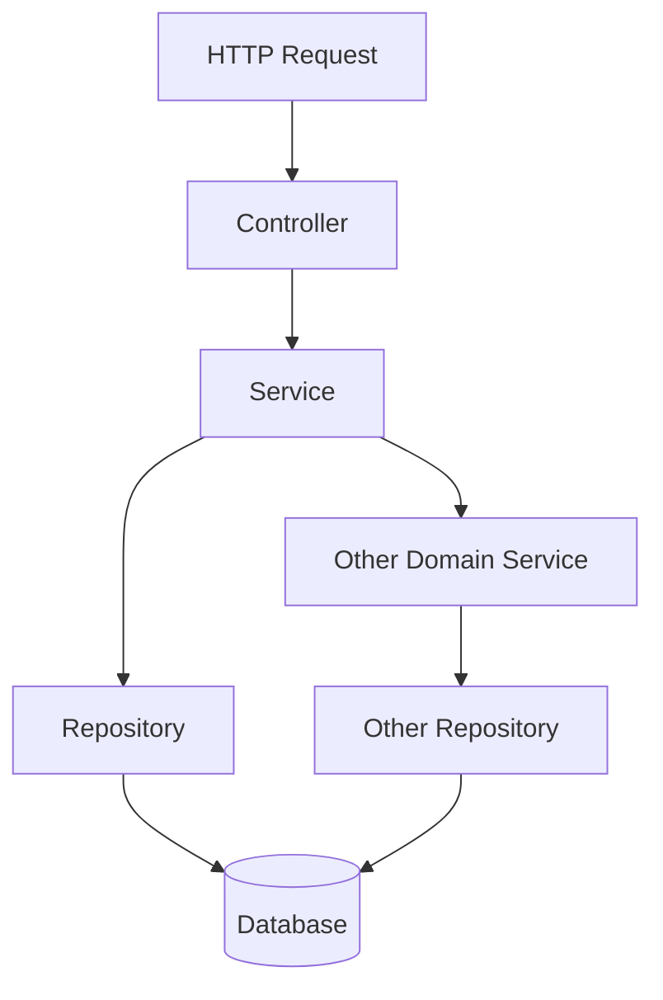

# NestJS 표준 계층 아키텍처

NestJS로 어느 정도 규모가 있는 서버를 만들어 본 사람이라면 한 번은 겪는다. 처음에는 Controller에서 다 처리하다가, 어느 순간 Controller 하나가 800줄이 되고, 같은 DB 쿼리가 세 군데에 흩어지고, 트랜잭션을 어디서 시작해야 할지 모르겠고, 테스트가 안 돌아간다. 이 글은 그 지점을 지나기 전에 잡아 두는 표준 패턴을 다룬다.

NestJS 공식 문서는 Module/Controller/Service까지만 명확하게 가이드한다. Repository 레이어는 TypeORM 가이드 한 페이지에서 잠깐 언급될 뿐 "어떻게 잘라야 한다"를 알려주지 않는다. 그래서 팀마다, 사람마다 다른 구조가 나온다. 실무에서 굳어진 패턴 한 가지를 잡고 간다.

---

## 1. 왜 계층을 나누는가

먼저 잘못된 길로 가는 경우부터 본다. 신입 시절 누구나 한 번은 써 본 코드다.

```typescript
@Controller('orders')
export class OrderController {
  constructor(
    @InjectRepository(Order) private orderRepo: Repository<Order>,
    @InjectRepository(User) private userRepo: Repository<User>,
    @InjectRepository(Product) private productRepo: Repository<Product>,
    private mailer: MailerService,
  ) {}

  @Post()
  async createOrder(@Body() body: CreateOrderDto) {
    const user = await this.userRepo.findOne({ where: { id: body.userId } });
    if (!user) throw new NotFoundException('User not found');

    const product = await this.productRepo.findOne({ where: { id: body.productId } });
    if (!product) throw new NotFoundException('Product not found');

    if (product.stock < body.quantity) {
      throw new BadRequestException('재고 부족');
    }

    product.stock -= body.quantity;
    await this.productRepo.save(product);

    const order = this.orderRepo.create({
      user,
      product,
      quantity: body.quantity,
      totalPrice: product.price * body.quantity,
    });
    await this.orderRepo.save(order);

    await this.mailer.sendOrderConfirmation(user.email, order.id);

    return order;
  }
}
```

문제가 한두 개가 아니다.

- Controller가 DB 모델을 직접 다룬다. HTTP 외의 진입점(스케줄러, 큐 컨슈머, gRPC)에서 같은 로직을 쓰려면 복붙해야 한다.
- 트랜잭션이 빠져 있다. `productRepo.save`가 성공한 뒤 `orderRepo.save`가 실패하면 재고만 줄어든다.
- 단위 테스트가 어렵다. Controller를 테스트하려면 세 개의 Repository, MailerService를 다 mock 해야 한다.
- 같은 흐름을 어드민 화면에서도 만들면 같은 검증 로직이 두 군데에 생긴다.

계층 분리는 추상적인 미학이 아니라 위 문제들을 끄려고 한다.

### 책임의 한 줄 정의

| 레이어 | 한 줄 정의 | 알면 안 되는 것 |
|---|---|---|
| Controller | HTTP 요청을 받아서 Service를 호출하고 응답 형태로 변환한다 | DB, ORM, 트랜잭션, 비즈니스 규칙 |
| Service | 비즈니스 규칙을 적용하고 트랜잭션 경계를 잡는다 | HTTP, Request/Response 객체, ORM의 구체 타입 |
| Repository | 영속성 저장소에서 데이터를 읽고 쓴다 | 비즈니스 규칙, HTTP, 다른 도메인의 Service |

"알면 안 되는 것"이 더 중요하다. 이 경계가 깨지는 순간 코드가 굳기 시작한다.

---

## 2. 폴더 구조 컨벤션

실무에서 자주 보는 두 가지 구조를 비교한다.

### 2.1 타입 기반 (Type-first) — 권장하지 않음

```
src/
├── controllers/
│   ├── order.controller.ts
│   ├── user.controller.ts
│   └── product.controller.ts
├── services/
│   ├── order.service.ts
│   ├── user.service.ts
│   └── product.service.ts
├── repositories/
│   ├── order.repository.ts
│   ├── user.repository.ts
│   └── product.repository.ts
└── entities/
    ├── order.entity.ts
    ├── user.entity.ts
    └── product.entity.ts
```

작은 프로젝트에서는 직관적이다. 문제는 도메인 하나를 수정할 때 네 개의 폴더를 왔다 갔다 해야 한다는 점이다. 파일 수가 100개를 넘기 시작하면 IDE 트리에서 길을 잃는다.

### 2.2 도메인 기반 (Domain-first) — 권장

```
src/
├── app.module.ts
├── main.ts
├── common/
│   ├── decorators/
│   ├── filters/
│   ├── guards/
│   ├── interceptors/
│   └── pipes/
├── config/
│   └── database.config.ts
└── modules/
    ├── orders/
    │   ├── orders.module.ts
    │   ├── orders.controller.ts
    │   ├── orders.service.ts
    │   ├── orders.repository.ts
    │   ├── dto/
    │   │   ├── create-order.dto.ts
    │   │   └── update-order.dto.ts
    │   ├── entities/
    │   │   └── order.entity.ts
    │   └── tests/
    │       ├── orders.service.spec.ts
    │       └── orders.controller.spec.ts
    ├── users/
    └── products/
```

도메인을 옮길 때 폴더 하나만 옮기면 된다. 마이크로서비스로 떼어낼 때도 같은 단위로 분리할 수 있다. 도메인이 커지면 `orders/` 안에 `application/`, `domain/`, `infrastructure/` 하위 폴더를 더 두는 식으로 확장한다.

도메인 간 의존이 생길 때는 항상 한쪽 방향만 허용한다. `orders` 모듈이 `products` 모듈의 Service를 가져다 쓰는 것은 OK, `products`가 `orders`를 다시 의존하면 순환 의존이 된다. 순환이 보이기 시작하면 공통 도메인을 별도 모듈로 추출하거나 이벤트 기반으로 끊는다.

---

## 3. Module — 의존성의 경계선

Module은 NestJS에서 가장 과소평가되는 개념이다. "그냥 데코레이터로 묶어 두는 곳" 정도로 쓰는데, 사실은 캡슐화 단위다.

```typescript
@Module({
  imports: [
    TypeOrmModule.forFeature([Order]),
    UsersModule,
    ProductsModule,
  ],
  controllers: [OrdersController],
  providers: [OrdersService, OrdersRepository],
  exports: [OrdersService],
})
export class OrdersModule {}
```

여기서 봐야 할 두 가지.

**`providers`에 등록했다고 외부에서 쓸 수 있는 게 아니다.** `exports`에 명시한 것만 다른 모듈에서 주입받을 수 있다. `OrdersRepository`는 `exports`에 없으므로 외부 모듈에서 직접 못 끌어 쓴다. 이게 캡슐화다. Repository는 자기 모듈 안에서만 산다.

**`UsersModule`을 import 했다면, `UsersModule`이 `exports`한 것만 쓸 수 있다.** `UsersService`가 `exports` 되어 있으면 `OrdersService`에서 `UsersService`를 주입받는다. `UsersRepository`를 직접 못 쓰는 게 정상이다. 다른 도메인의 Repository를 직접 건드리는 순간 도메인 경계가 무너진다.

실무에서 가장 흔한 실수는 이렇게 짠다.

```typescript
@Module({
  imports: [
    TypeOrmModule.forFeature([Order, User, Product]),
  ],
  ...
})
export class OrdersModule {}
```

`User`와 `Product` Entity를 `OrdersModule`이 직접 import한다. 이러면 `UsersModule`이 없어도 `OrdersService`에서 `@InjectRepository(User)`로 User Repository를 끌어 쓸 수 있다. 편하지만 모듈 경계가 사라진다. 같은 User 테이블에 두 군데에서 쓰기가 일어나면 어디서 무엇이 바뀌는지 추적이 안 된다.

원칙은 단순하다. **자기 모듈의 Entity만 `TypeOrmModule.forFeature`에 등록한다.** 다른 도메인의 데이터는 그 도메인의 Service를 거쳐서만 접근한다.

---

## 4. Controller — 얇게 유지하는 법

Controller가 해야 하는 일은 셋이다.

1. HTTP 요청에서 데이터를 꺼낸다 (`@Body`, `@Param`, `@Query`).
2. Service를 호출한다.
3. 결과를 응답 형태로 변환한다.

그 외의 모든 일(검증, 권한 체크, 변환, 비즈니스 규칙)은 Pipe/Guard/Interceptor 또는 Service로 보낸다.

```typescript
@Controller('orders')
@UseGuards(AuthGuard)
export class OrdersController {
  constructor(private readonly ordersService: OrdersService) {}

  @Post()
  async create(
    @CurrentUser() user: AuthUser,
    @Body() dto: CreateOrderDto,
  ): Promise<OrderResponseDto> {
    const order = await this.ordersService.create(user.id, dto);
    return OrderResponseDto.from(order);
  }

  @Get(':id')
  async findOne(
    @CurrentUser() user: AuthUser,
    @Param('id', ParseUUIDPipe) id: string,
  ): Promise<OrderResponseDto> {
    const order = await this.ordersService.findOne(user.id, id);
    return OrderResponseDto.from(order);
  }
}
```

Controller에 `if` 문이 보이면 의심해라. 권한 체크면 Guard로, 입력 검증이면 Pipe(class-validator)로, 비즈니스 분기면 Service로 빼야 한다.

응답 변환을 Interceptor로 처리하는 팀도 많지만, Interceptor는 디버깅이 까다롭고 응답 타입이 IDE에서 안 잡힌다. 명시적으로 `XxxResponseDto.from(entity)` 형태로 변환하는 쪽이 추적이 쉽다.

### Controller에서 자주 새는 책임들

실제로 코드 리뷰에서 자주 잡아내는 패턴이다.

```typescript
@Post()
async create(@Body() dto: CreateOrderDto) {
  if (dto.quantity > 100) {
    throw new BadRequestException('한 번에 100개 초과 주문 불가');
  }
  return this.ordersService.create(dto);
}
```

`100개 초과 불가`가 입력 형식 검증인지 비즈니스 규칙인지 애매하다. 답: 비즈니스 규칙이다. 100을 200으로 바꾸자는 결정은 도메인 결정이지 HTTP 결정이 아니다. Service로 보낸다. class-validator의 `@Max(100)`로 처리하고 싶으면 그것도 가능하지만, 규칙이 다른 곳에서도 적용된다면(스케줄러, 배치) Service에 두는 게 안전하다.

```typescript
@Post()
async create(@Body() dto: CreateOrderDto, @Req() req) {
  return this.ordersService.create({
    ...dto,
    userId: req.user.id,
    ip: req.ip,
    userAgent: req.headers['user-agent'],
  });
}
```

Request 객체에서 뽑은 정보를 DTO에 합쳐서 Service로 넘긴다. 이러면 Service가 HTTP 정보(IP, User-Agent)에 의존하게 된다. 큐 컨슈머에서 같은 Service를 부를 때 가짜 IP를 넣어줘야 한다. IP/UA는 별도 인자로 명시적으로 받거나, 정말 필요하면 Audit 전용 객체로 분리한다.

---

## 5. DTO와 Entity의 경계

이 부분이 가장 자주 혼란이 온다. DTO 하나로 끝내려는 시도가 반복된다.

### DTO 세 종류

| 이름 | 위치 | 역할 |
|---|---|---|
| Request DTO | Controller 입력 | HTTP 요청 본문 검증. class-validator 데코레이터 사용 |
| Response DTO | Controller 출력 | 응답 직렬화. 민감 필드 제외, 명시적 변환 |
| (내부) Command/Query | Service 입력 | Service 시그니처. Request DTO와 같을 수도 다를 수도 있다 |

```typescript
// dto/create-order.dto.ts
export class CreateOrderDto {
  @IsUUID()
  productId: string;

  @IsInt()
  @Min(1)
  @Max(1000)
  quantity: number;

  @IsOptional()
  @IsString()
  memo?: string;
}

// dto/order-response.dto.ts
export class OrderResponseDto {
  id: string;
  productId: string;
  quantity: number;
  totalPrice: number;
  status: OrderStatus;
  createdAt: Date;

  static from(order: Order): OrderResponseDto {
    return {
      id: order.id,
      productId: order.product.id,
      quantity: order.quantity,
      totalPrice: order.totalPrice,
      status: order.status,
      createdAt: order.createdAt,
    };
  }
}
```

### Entity를 Controller로 그대로 반환하면 안 되는 이유

Entity를 그냥 `return`하면 ORM 내부 필드(`__entity__`, lazy-loading proxy, hidden 컬럼)가 응답에 노출될 수 있다. TypeORM `@Column({ select: false })`로 가린 비밀번호 해시가 실수로 빠져나가는 일이 실무에서 종종 일어난다.

또 다른 문제. Entity 구조를 바꾸면 API 응답이 바뀐다. DB 컬럼명을 `created_at`에서 `created_dt`로 바꾸는 마이그레이션을 하면 API 클라이언트가 깨진다. Response DTO를 거치면 이 두 변경이 분리된다.

`class-transformer`의 `@Exclude`/`@Expose`도 가능하다. 다만 IDE에서 응답 타입이 안 잡히고, 직렬화 시점이 implicit해서 디버깅이 어렵다. 명시적 변환 함수(`.from()`)를 두는 쪽이 5년 후의 자신에게 친절하다.

---

## 6. Service — 비즈니스 규칙의 집

Service는 두 가지를 한다.

1. 비즈니스 규칙을 적용한다.
2. 트랜잭션 경계를 정한다.

```typescript
@Injectable()
export class OrdersService {
  constructor(
    private readonly ordersRepository: OrdersRepository,
    private readonly productsService: ProductsService,
    private readonly usersService: UsersService,
    private readonly mailer: MailerService,
    private readonly dataSource: DataSource,
  ) {}

  async create(userId: string, dto: CreateOrderDto): Promise<Order> {
    const user = await this.usersService.findByIdOrThrow(userId);

    return await this.dataSource.transaction(async (manager) => {
      const product = await this.productsService.lockAndFindById(
        manager,
        dto.productId,
      );

      if (product.stock < dto.quantity) {
        throw new InsufficientStockException(product.id, product.stock);
      }

      await this.productsService.decreaseStock(
        manager,
        product.id,
        dto.quantity,
      );

      const order = await this.ordersRepository.create(manager, {
        userId: user.id,
        productId: product.id,
        quantity: dto.quantity,
        totalPrice: product.price * dto.quantity,
      });

      return order;
    }).then(async (order) => {
      await this.mailer.sendOrderConfirmation(user.email, order.id);
      return order;
    });
  }
}
```

여기서 챙길 점.

- `usersService`를 Repository 대신 호출한다. User는 다른 도메인이라 직접 Repository에 닿지 않는다.
- 트랜잭션을 `dataSource.transaction`으로 명시적으로 시작한다. 위치는 항상 Service다.
- 메일 발송은 트랜잭션 밖이다. 트랜잭션 안에서 메일을 보내면 롤백되어도 메일이 나간다. 반대로 메일 실패가 DB 롤백을 일으키면 안 된다.
- 도메인 예외(`InsufficientStockException`)는 HttpException이 아니다. 어느 진입점에서 부르든 같은 예외다. HTTP 변환은 ExceptionFilter에서 한다.

### Service에 들어가면 안 되는 것

```typescript
async create(dto: CreateOrderDto, @Req() req) {
  // ...
}
```

`@Req()`가 Service에 보이면 잘못된 거다. Service는 Express/Fastify를 모른다. 이걸 허용하면 Service를 CLI나 워커에서 부를 때 가짜 req를 만들어야 한다.

```typescript
async create(dto: CreateOrderDto) {
  const result = await this.ordersRepository.create(dto);
  return {
    statusCode: 201,
    body: result,
  };
}
```

`statusCode`는 HTTP의 일이다. Service는 도메인 객체만 반환한다.

---

## 7. Repository — 영속성 격리

Repository 패턴의 핵심 한 줄. **저장소를 갈아 끼울 수 있어야 한다.**

물론 실제로 PostgreSQL을 MongoDB로 갈아 끼우는 일은 1년에 한 번 있을까 말까다. 진짜 이득은 다른 데 있다.

- 테스트에서 Repository를 mock하면 Service 단위 테스트가 DB 없이 돌아간다.
- 캐시 레이어를 Repository 내부에 숨길 수 있다.
- 같은 도메인 객체를 두 저장소(예: 운영 DB + Elasticsearch)에 동기화하는 로직을 Service가 모르게 한다.

NestJS에서 Repository를 만드는 방식은 ORM마다 다르다. 두 가지 주류 방식을 본다.

### 7.1 TypeORM 기반 Repository

TypeORM은 기본 Repository 클래스를 제공한다. 두 가지 패턴이 있다.

**패턴 A: TypeORM Repository를 그대로 주입**

```typescript
@Injectable()
export class OrdersService {
  constructor(
    @InjectRepository(Order)
    private readonly ordersRepository: Repository<Order>,
  ) {}

  async findOne(id: string) {
    return this.ordersRepository.findOne({ where: { id } });
  }
}
```

작은 프로젝트라면 이걸로 충분하다. 다만 Service가 `Repository<Order>`라는 TypeORM 타입에 직접 의존한다. ORM을 바꾸기 어렵고, mock하기도 까다롭다(`createQueryBuilder` 체인을 mock하려면 코드가 길어진다).

**패턴 B: Custom Repository 클래스로 감싸기 (권장)**

```typescript
// orders.repository.ts
@Injectable()
export class OrdersRepository {
  constructor(
    @InjectRepository(Order)
    private readonly repository: Repository<Order>,
  ) {}

  async findById(id: string): Promise<Order | null> {
    return this.repository.findOne({
      where: { id },
      relations: ['product'],
    });
  }

  async findByUserId(userId: string, options: PaginationOptions): Promise<Order[]> {
    return this.repository.find({
      where: { userId },
      skip: options.offset,
      take: options.limit,
      order: { createdAt: 'DESC' },
    });
  }

  async create(manager: EntityManager, data: CreateOrderData): Promise<Order> {
    const repo = manager.getRepository(Order);
    const order = repo.create(data);
    return repo.save(order);
  }

  async updateStatus(id: string, status: OrderStatus): Promise<void> {
    await this.repository.update(id, { status });
  }
}
```

Service는 `OrdersRepository`라는 자기 도메인의 추상화에 의존한다. mock할 때 메서드 시그니처만 흉내내면 된다.

`create` 메서드가 `EntityManager`를 인자로 받는다. 트랜잭션 컨텍스트를 외부에서 주입하기 위함이다. 트랜잭션 없이 부르고 싶으면 메서드를 두 개 만들거나 기본값을 처리한다.

```typescript
async create(
  data: CreateOrderData,
  manager?: EntityManager,
): Promise<Order> {
  const repo = manager ? manager.getRepository(Order) : this.repository;
  const order = repo.create(data);
  return repo.save(order);
}
```

### 7.2 Prisma 기반 Repository

Prisma는 자체적으로 Repository 같은 추상화를 제공한다(`prisma.order.findMany()`). 그래서 한 번 더 감싸는 게 과한가 싶지만, 같은 이유로 감싼다.

```typescript
// prisma.service.ts
@Injectable()
export class PrismaService extends PrismaClient implements OnModuleInit {
  async onModuleInit() {
    await this.$connect();
  }
}

// orders.repository.ts
@Injectable()
export class OrdersRepository {
  constructor(private readonly prisma: PrismaService) {}

  async findById(id: string): Promise<Order | null> {
    return this.prisma.order.findUnique({
      where: { id },
      include: { product: true },
    });
  }

  async create(
    tx: Prisma.TransactionClient,
    data: Prisma.OrderCreateInput,
  ): Promise<Order> {
    return tx.order.create({ data });
  }
}

// orders.service.ts
async createOrder(userId: string, dto: CreateOrderDto) {
  return this.prisma.$transaction(async (tx) => {
    const product = await this.productsRepository.lockAndFindById(tx, dto.productId);
    // ...
    return this.ordersRepository.create(tx, { /* ... */ });
  });
}
```

Prisma는 `Prisma.TransactionClient` 타입으로 트랜잭션 컨텍스트를 표현한다. TypeORM의 `EntityManager`와 같은 자리다.

### 7.3 두 방식의 실무 차이

| 항목 | TypeORM | Prisma |
|---|---|---|
| Entity 정의 | 클래스 + 데코레이터 | schema.prisma 파일 |
| 마이그레이션 | CLI로 SQL 생성, 직접 수정 가능 | schema 기반 자동, 직접 수정은 raw migration |
| 트랜잭션 | `dataSource.transaction(manager => ...)` | `prisma.$transaction(tx => ...)` |
| Lock | `pessimistic_write`, `pessimistic_read` 옵션 | raw SQL의 `SELECT ... FOR UPDATE` |
| 타입 안정성 | Entity 클래스 기반, 일부 쿼리에서 any 반환 | 생성된 타입, 거의 완벽 |
| 학습 곡선 | SQL 지식이 그대로 통함 | Prisma 문법 따로 학습 |

선택 기준은 단순하다. SQL을 직접 쓰는 빈도가 높고 복잡한 쿼리가 많으면 TypeORM, 타입 안정성과 빠른 마이그레이션 사이클이 중요하면 Prisma. 마이크로서비스 단위로 다르게 골라도 무방하다.

---

## 8. DI 흐름 정리



흐름은 항상 한쪽이다. Repository가 Service를 부르면 안 된다. Repository가 다른 도메인의 Repository를 부르는 것도 위험하다. 도메인 간 결합은 Service 레이어에서만 일어난다.

```typescript
// orders.module.ts
@Module({
  imports: [
    TypeOrmModule.forFeature([Order]),
    UsersModule,
    ProductsModule,
  ],
  controllers: [OrdersController],
  providers: [OrdersService, OrdersRepository],
  exports: [OrdersService],
})
export class OrdersModule {}
```

`UsersModule`은 `UsersService`만 export한다. `OrdersService`는 `UsersService`를 주입받아 사용자 정보를 가져온다. `OrdersService`가 User 테이블을 직접 건드릴 일은 없다.

### 순환 의존이 생길 때

도메인이 자라면 순환 참조가 보이기 시작한다. `OrdersService`가 `UsersService`를 쓰고, `UsersService`가 `OrdersService`를 쓰는 식이다.

NestJS는 `forwardRef`로 해결할 수 있지만, 그건 응급처치다. 순환이 생기는 건 도메인 경계가 잘못 그려졌다는 신호다. 두 가지 해결책이 있다.

**1) 제 3 모듈로 분리.** 두 도메인이 공유하는 로직이라면 별도 모듈로 추출한다. `OrderHistoryService`처럼.

**2) 이벤트로 끊기.** `OrdersService`가 끝나고 `UsersService`가 무언가 해야 한다면, 이벤트를 발행하고 `UsersModule`이 구독한다. NestJS의 `EventEmitter2`로 간단하게 처리할 수 있다.

```typescript
// orders.service.ts
async create(userId: string, dto: CreateOrderDto) {
  const order = await this.dataSource.transaction(async (manager) => {
    // ...
    return savedOrder;
  });

  this.eventEmitter.emit('order.created', new OrderCreatedEvent(order));
  return order;
}

// users/handlers/order-created.handler.ts
@Injectable()
export class OrderCreatedHandler {
  @OnEvent('order.created')
  async handle(event: OrderCreatedEvent) {
    await this.usersService.increaseOrderCount(event.userId);
  }
}
```

이벤트가 도메인 간 의존을 단방향으로 만든다. 단, 이벤트는 메모리 안에서만 동작한다. 프로세스가 죽으면 이벤트도 사라진다. 보장이 필요한 흐름이라면 Outbox 패턴이나 메시지 큐를 검토한다.

---

## 9. 트랜잭션 위치 정하기

트랜잭션은 항상 **Service**에서 시작한다. Repository에서 시작하면 안 된다. Controller에서 시작하면 더 안 된다.

이유는 단순하다. 트랜잭션 경계는 비즈니스 단위(unit of work)다. "주문을 생성한다"가 트랜잭션 단위지, "Order를 INSERT한다"가 트랜잭션 단위가 아니다. 그래서 비즈니스 단위를 아는 Service가 트랜잭션을 잡아야 한다.

### 일반적인 함정

**1) Repository에서 매 호출마다 트랜잭션을 연다**

```typescript
// 잘못된 예
async create(data: CreateOrderData) {
  return this.dataSource.transaction(async (manager) => {
    const repo = manager.getRepository(Order);
    return repo.save(data);
  });
}
```

이러면 Service가 여러 Repository를 부를 때 각각이 독립 트랜잭션이 된다. Service에서 한 번에 묶어야 할 작업이 쪼개진다.

**2) `@Transactional` 데코레이터를 잘못 쓴다**

`typeorm-transactional` 같은 라이브러리는 메서드 데코레이터로 트랜잭션을 자동 적용해 준다. 편하지만 함정이 있다. 같은 클래스 내부 메서드 호출에서는 동작하지 않는다(프록시 한계). 또 비동기 컨텍스트를 cls-hooked로 추적하는데, 어떤 async 라이브러리와 충돌이 날 수 있다.

명시적으로 `dataSource.transaction(manager => ...)` 또는 `prisma.$transaction(tx => ...)`을 쓰는 쪽이 흐름을 따라가기 쉽다.

### 트랜잭션 안에서 하면 안 되는 것

- 외부 API 호출 (HTTP, 메일, SMS)
- 메시지 큐 발행 (Kafka, RabbitMQ)
- 파일 시스템 쓰기
- 다른 DB 트랜잭션 시작

전부 트랜잭션이 길어지거나, 롤백돼도 외부 효과가 남는 문제를 일으킨다.

```typescript
async create(userId: string, dto: CreateOrderDto) {
  const order = await this.dataSource.transaction(async (manager) => {
    // DB 작업만
    const savedOrder = await this.ordersRepository.create(manager, ...);
    await this.productsService.decreaseStock(manager, ...);
    return savedOrder;
  });

  // 트랜잭션 밖
  await this.mailer.sendOrderConfirmation(order);
  await this.queue.publish('order.created', order);

  return order;
}
```

메일이나 큐 발행이 실패하면? 그게 진짜 어려운 문제다. Outbox 패턴으로 푼다. DB 트랜잭션 안에서 `outbox_events` 테이블에 이벤트를 같이 기록하고, 별도 워커가 이벤트를 읽어 외부로 발송한다. 발송 후 outbox 레코드를 마크한다. 이게 보장된 발송의 표준 패턴이다.

### Lock과 동시성

재고 차감 같은 동시성 시나리오는 락이 필수다.

```typescript
async lockAndFindById(manager: EntityManager, id: string): Promise<Product> {
  const product = await manager
    .createQueryBuilder(Product, 'p')
    .setLock('pessimistic_write')
    .where('p.id = :id', { id })
    .getOne();

  if (!product) throw new NotFoundException();
  return product;
}
```

이걸 Service에서 트랜잭션 안에서 부른다. 트랜잭션 밖에서 락을 걸면 락이 즉시 풀린다.

낙관적 락(`@VersionColumn`)을 쓰는 방법도 있다. 동시 업데이트가 드물고 충돌 시 재시도가 가능한 경우에 쓴다. 충돌이 잦으면 비관적 락이 낫다.

---

## 10. 안티패턴 모음

5년 동안 코드 리뷰에서 가장 자주 잡은 패턴들이다.

### 10.1 Controller가 Repository를 직접 주입

```typescript
@Controller('users')
export class UsersController {
  constructor(
    @InjectRepository(User) private repo: Repository<User>,
  ) {}

  @Get(':id')
  async findOne(@Param('id') id: string) {
    return this.repo.findOne({ where: { id } });
  }
}
```

"이렇게 단순한 거 Service까지 가야 하나?" 싶지만, 한 번 이렇게 짜기 시작하면 Service 레이어를 건너뛰는 게 습관이 된다. Controller-Service-Repository 흐름은 단순한 경우에도 지킨다. 단순하면 Service도 한 줄이다. 한 줄짜리 Service가 추한 게 아니라, Controller가 Repository를 아는 게 추한 거다.

### 10.2 Repository에 비즈니스 로직

```typescript
@Injectable()
export class OrdersRepository {
  async createWithStockCheck(data: CreateOrderData): Promise<Order> {
    const product = await this.productRepo.findOne({ where: { id: data.productId } });
    if (product.stock < data.quantity) {
      throw new BadRequestException('재고 부족');
    }
    // ...
  }
}
```

"DB에 가까운 곳에서 검증하면 안전하지 않냐"는 논리. 안전한 게 아니라 응집도가 깨진다. 같은 검증을 다른 진입점(어드민, 배치)에서 또 만들어야 할 때 Repository를 우회하면 검증이 빠진다. 비즈니스 규칙은 Service에 모은다.

또 Repository에 다른 도메인의 Repository를 주입하기 시작하면 도메인 경계가 무너진다. Repository는 자기 한 종류의 Entity만 다룬다.

### 10.3 Service에서 HTTP 예외 던지기

```typescript
@Injectable()
export class OrdersService {
  async findOne(id: string) {
    const order = await this.repo.findOne({ where: { id } });
    if (!order) throw new NotFoundException('주문을 찾을 수 없습니다');
    return order;
  }
}
```

흔하다. NestJS 가이드에서도 이렇게 쓴다. 작은 프로젝트면 무방하지만, 진입점이 늘어나면 문제가 된다. CLI에서 같은 Service를 부르면 `NotFoundException`(HTTP 404)이 던져진다. CLI는 HTTP를 모르는데 HTTP 예외가 나온다.

규모가 커지면 도메인 예외 계층을 별도로 만든다.

```typescript
export class OrderNotFoundException extends Error {
  constructor(public readonly id: string) {
    super(`Order ${id} not found`);
  }
}

// service
if (!order) throw new OrderNotFoundException(id);

// http exception filter
@Catch(OrderNotFoundException)
export class OrderNotFoundFilter implements ExceptionFilter {
  catch(exception: OrderNotFoundException, host: ArgumentsHost) {
    const response = host.switchToHttp().getResponse();
    response.status(404).json({
      code: 'ORDER_NOT_FOUND',
      message: exception.message,
      orderId: exception.id,
    });
  }
}
```

작은 프로젝트면 첫 번째 방식으로 시작하고, 진입점이 둘 이상 생기면 후자로 옮긴다.

### 10.4 DTO 재사용 욕심

```typescript
export class OrderDto {
  id?: string;
  userId?: string;
  productId: string;
  quantity: number;
  totalPrice?: number;
  status?: OrderStatus;
  createdAt?: Date;
}
```

생성, 수정, 조회, 응답에 다 쓰겠다고 전부 `?`로 만든 DTO. 클라이언트가 `id`를 보내고 싶어 보내는지, 안 보내는지 알 길이 없다. 검증 규칙도 제각각 흩어진다.

DTO는 용도별로 따로 만든다. `CreateOrderDto`, `UpdateOrderDto`, `OrderResponseDto`. `PartialType`, `OmitType`, `PickType` 같은 mapped type을 쓰면 중복을 줄일 수 있다.

```typescript
export class CreateOrderDto {
  @IsUUID()
  productId: string;

  @IsInt() @Min(1)
  quantity: number;
}

export class UpdateOrderDto extends PartialType(
  PickType(CreateOrderDto, ['quantity']),
) {}
```

### 10.5 Service가 Express 객체를 받는다

```typescript
@Injectable()
export class OrdersService {
  async create(req: Request, dto: CreateOrderDto) {
    const userId = req.user.id;
    // ...
  }
}
```

`req`를 통째로 넘기면 Service가 HTTP 프레임워크에 종속된다. 필요한 값(userId, ip)만 인자로 명시한다.

### 10.6 한 Service에 모든 도메인 로직

```typescript
@Injectable()
export class AppService {
  async createUser() { /* ... */ }
  async createOrder() { /* ... */ }
  async sendEmail() { /* ... */ }
  async generateReport() { /* ... */ }
}
```

NestJS CLI가 만들어주는 `AppService`를 그대로 키우면 이렇게 된다. 도메인이 생기면 그 즉시 모듈을 만든다. `nest g resource orders` 한 줄이면 Controller/Service/Module/DTO가 만들어진다.

---

## 11. 도메인이 자란 후의 진화

위 구조는 도메인이 적당히 자랄 때까지 잘 버틴다. Service 파일 하나가 1000줄을 넘기 시작하면 다음 단계로 간다.

### 11.1 Service 쪼개기

```
orders/
├── orders.module.ts
├── orders.controller.ts
├── application/
│   ├── create-order.service.ts
│   ├── cancel-order.service.ts
│   ├── refund-order.service.ts
│   └── query-orders.service.ts
└── infrastructure/
    └── orders.repository.ts
```

기능(usecase) 단위로 Service를 쪼갠다. `CreateOrderService`, `CancelOrderService`처럼. Command/Query를 명시적으로 나누기 시작하면 CQRS의 입구다.

### 11.2 Domain Layer 추가

도메인 규칙이 복잡해지면 별도 도메인 객체를 만든다. Entity와는 다른, 순수한 도메인 모델이다.

```typescript
// orders/domain/order.ts
export class Order {
  private constructor(
    public readonly id: string,
    private status: OrderStatus,
    private items: OrderItem[],
  ) {}

  static create(items: OrderItem[]): Order {
    if (items.length === 0) throw new EmptyOrderException();
    return new Order(uuid(), OrderStatus.PENDING, items);
  }

  cancel(reason: string): void {
    if (this.status === OrderStatus.SHIPPED) {
      throw new CannotCancelShippedOrderException();
    }
    this.status = OrderStatus.CANCELLED;
  }

  get totalPrice(): number {
    return this.items.reduce((sum, item) => sum + item.subtotal, 0);
  }
}
```

Entity는 DB 스키마, 도메인 모델은 비즈니스 규칙이다. Repository에서 변환한다.

```typescript
async findById(id: string): Promise<Order> {
  const entity = await this.repo.findOne({ where: { id }, relations: ['items'] });
  return OrderMapper.toDomain(entity);
}

async save(order: Order): Promise<void> {
  const entity = OrderMapper.toEntity(order);
  await this.repo.save(entity);
}
```

이 단계는 진짜 필요할 때만 간다. 작은 프로젝트에서 도메인 모델까지 분리하면 코드량이 두 배가 된다. 비즈니스 규칙이 ORM 모델에 다 못 들어가기 시작할 때 추가한다.

### 11.3 Application Service와 Domain Service

비즈니스 규칙 중 일부는 여러 도메인 객체에 걸쳐 일어난다(예: 두 계좌 사이의 이체). 한 객체에 메서드로 두기 애매한 경우다. 이걸 Domain Service에 둔다.

Application Service는 트랜잭션과 외부 시스템 호출을 다루고, Domain Service는 도메인 규칙만 다룬다. 이 단계는 헥사고날 아키텍처나 클린 아키텍처로 넘어가는 길목이다.

---

## 12. 실무 체크포인트

지금까지 다룬 것을 5년차 백엔드의 시선으로 다시 모은다.

**Module 단위로 도메인을 자른다.** 폴더 구조는 도메인 기준. `controllers/`, `services/` 같은 타입 기반 폴더는 작은 프로젝트가 아니면 피한다.

**Controller는 얇게.** HTTP 입력을 받아 Service를 부르고 응답으로 변환한다. 검증은 Pipe/class-validator, 권한은 Guard, 응답 변환은 명시적 DTO 함수.

**Service에 비즈니스 규칙을 모은다.** Service가 HTTP 객체를 알면 안 된다. 도메인 예외는 HttpException이 아니라 도메인 예외 클래스를 따로 만들고, ExceptionFilter에서 변환한다.

**Repository는 자기 Entity만 다룬다.** 다른 도메인의 Repository를 주입하지 않는다. 외부 도메인 데이터가 필요하면 Service를 거친다.

**트랜잭션은 Service에서 명시적으로 시작한다.** Repository에서 트랜잭션을 열지 않는다. `dataSource.transaction(manager => ...)` 형태로 manager를 Repository에 넘긴다. 외부 호출(메일, 큐)은 트랜잭션 밖.

**DTO는 용도별로 따로.** Request, Response, 그리고 Service 내부 Command/Query를 구분한다. Entity를 Controller로 그대로 반환하지 않는다.

**모듈 간 의존은 단방향.** 순환이 생기면 `forwardRef`로 덮지 말고 도메인을 재설계하거나 이벤트로 끊는다.

**도메인이 자라면 단계적으로 쪼갠다.** Service가 너무 커지면 usecase 단위로 분리하고, 그래도 부족하면 도메인 모델을 따로 둔다. 처음부터 클린 아키텍처를 들이면 오버엔지니어링이 된다.

이 정도가 NestJS 한 프로젝트가 5년을 버티는 구조다. 더 정교한 패턴(CQRS, Event Sourcing, Hexagonal)은 도메인의 복잡도가 정말 필요로 할 때 들인다. 표준 계층 구조만 단단하게 잡혀 있어도 대부분의 백엔드 서비스는 충분하다.
