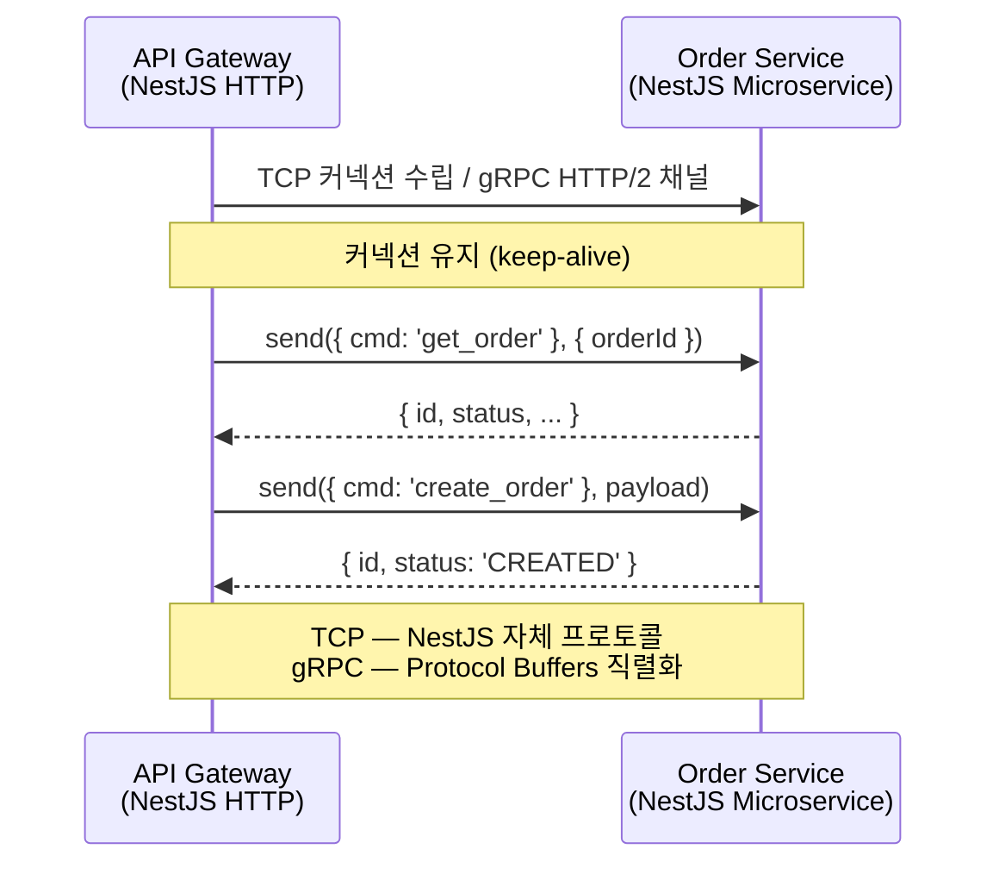
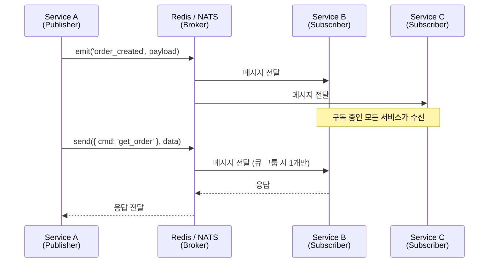
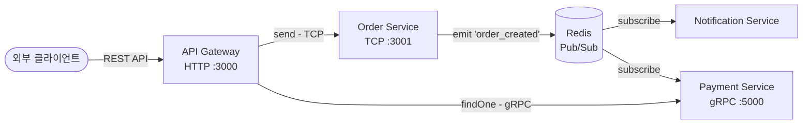
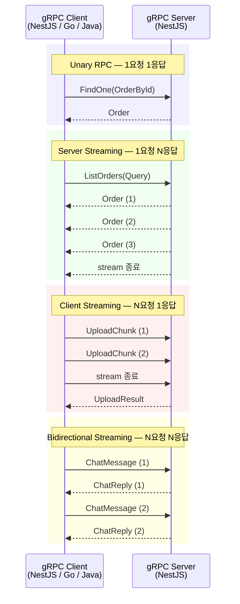
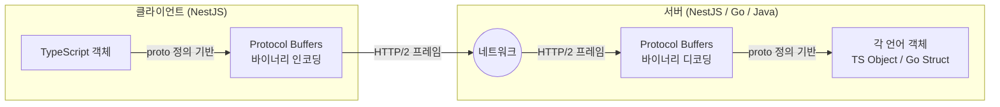

# NestJS 마이크로서비스

NestJS는 HTTP 서버 프레임워크로 시작했지만, 내장 마이크로서비스 모듈을 가지고 있다. 별도 프레임워크 없이 `@nestjs/microservices` 하나로 TCP, Redis, gRPC, NATS, RabbitMQ, Kafka 등 여러 트랜스포트를 지원한다. 모놀리스에서 마이크로서비스로 전환할 때 기존 NestJS 코드를 거의 그대로 쓸 수 있다는 점이 실무에서 선택하는 이유다.

다만 "NestJS 마이크로서비스 = 완전한 마이크로서비스 프레임워크"라고 보면 안 된다. NestJS가 해주는 건 서비스 간 메시지 송수신의 추상화일 뿐이고, 서비스 디스커버리, 분산 트레이싱, 서킷 브레이커 같은 건 직접 구성해야 한다.


## 트랜스포트별 통신 흐름

NestJS 마이크로서비스에서 각 트랜스포트가 메시지를 주고받는 방식은 근본적으로 다르다. TCP는 직접 연결, Redis/NATS는 브로커 경유, gRPC는 HTTP/2 스트림 기반이다.

### TCP / gRPC — 직접 연결 방식



TCP와 gRPC는 클라이언트가 서버에 직접 연결한다. 중간 브로커가 없어서 레이턴시가 낮다. 차이점은 TCP가 NestJS 전용 프로토콜을 쓰는 반면, gRPC는 표준 프로토콜이라 다른 언어 서비스와 통신이 가능하다는 점이다.

### Redis / NATS — 브로커 경유 방식



브로커 기반은 서비스 간 직접 연결이 없다. 발행자는 수신자가 누구인지 모르고, 수신자는 발행자가 누구인지 모른다. 서비스 추가/제거가 자유롭다는 장점이 있지만, 브로커가 단일 장애점이 될 수 있다.

Redis Pub/Sub은 구독자가 없으면 메시지가 사라진다. NATS도 기본은 at-most-once다. 메시지 유실이 문제가 되면 Kafka나 RabbitMQ를 써야 한다.

### 하이브리드 구성 — HTTP + 마이크로서비스 동시 운영 흐름



실무에서 자주 보는 구조다. 외부에는 REST API를 노출하고, 내부 서비스 간에는 트랜스포트를 혼합해서 쓴다. 동기 호출이 필요한 곳은 TCP나 gRPC, 이벤트 전파가 필요한 곳은 Redis나 NATS를 쓴다.


## 트랜스포트 종류와 선택 기준

### TCP (기본 트랜스포트)

별도 인프라 없이 바로 쓸 수 있다. 개발 환경이나 내부 서비스 간 단순한 요청-응답에 적합하다.

```typescript
// 서버 (마이크로서비스)
import { NestFactory } from '@nestjs/core';
import { Transport, MicroserviceOptions } from '@nestjs/microservices';
import { AppModule } from './app.module';

async function bootstrap() {
  const app = await NestFactory.createMicroservice<MicroserviceOptions>(
    AppModule,
    {
      transport: Transport.TCP,
      options: {
        host: '0.0.0.0',
        port: 3001,
      },
    },
  );
  await app.listen();
}
bootstrap();
```

```typescript
// 클라이언트 (다른 서비스에서 호출)
@Module({
  imports: [
    ClientsModule.register([
      {
        name: 'ORDER_SERVICE',
        transport: Transport.TCP,
        options: {
          host: 'order-service', // Docker Compose 서비스명이나 IP
          port: 3001,
        },
      },
    ]),
  ],
})
export class PaymentModule {}
```

TCP 트랜스포트는 NestJS 자체 프로토콜을 쓰기 때문에, NestJS가 아닌 서비스와는 통신이 안 된다. 이게 가장 큰 제약이다. 다른 언어로 작성된 서비스가 있다면 TCP는 쓸 수 없다.

### Redis

Pub/Sub 기반이라 이벤트 브로드캐스팅에 적합하다. 이미 캐시용으로 Redis를 쓰고 있다면 추가 인프라 없이 바로 사용할 수 있다.

```bash
npm install @nestjs/microservices redis
```

```typescript
const app = await NestFactory.createMicroservice<MicroserviceOptions>(
  AppModule,
  {
    transport: Transport.REDIS,
    options: {
      host: 'localhost',
      port: 6379,
      retryAttempts: 5,
      retryDelay: 1000,
    },
  },
);
```

Redis Pub/Sub의 특성상 메시지 영속성이 없다. 구독자가 연결되어 있지 않은 시점에 발행된 메시지는 유실된다. 메시지 유실이 문제가 되는 경우에는 Redis Streams를 직접 구현하거나 RabbitMQ/Kafka를 써야 한다.

### gRPC

서비스 간 통신에서 성능이 중요하거나, 다른 언어(Go, Java 등)로 작성된 서비스와 통신해야 할 때 쓴다. Protocol Buffers 기반이라 직렬화/역직렬화 성능이 JSON 대비 수배 빠르다.

```bash
npm install @grpc/grpc-js @grpc/proto-loader @nestjs/microservices
```

```typescript
const app = await NestFactory.createMicroservice<MicroserviceOptions>(
  AppModule,
  {
    transport: Transport.GRPC,
    options: {
      package: 'order',
      protoPath: join(__dirname, './proto/order.proto'),
      url: '0.0.0.0:5000',
    },
  },
);
```

### NATS

경량 메시징 시스템이다. Redis보다 메시징에 특화되어 있고, 큐 그룹을 지원해서 로드 밸런싱이 가능하다.

```typescript
const app = await NestFactory.createMicroservice<MicroserviceOptions>(
  AppModule,
  {
    transport: Transport.NATS,
    options: {
      servers: ['nats://localhost:4222'],
      queue: 'order-service-group', // 큐 그룹 — 같은 그룹 내 하나의 인스턴스만 메시지 수신
    },
  },
);
```

NATS는 기본적으로 at-most-once 전달이다. JetStream을 활성화하면 at-least-once까지 지원하지만, NestJS 내장 트랜스포트에서 JetStream을 쓰려면 커스텀 트랜스포터를 구현해야 한다.

### 어떤 트랜스포트를 고를지

| 상황 | 트랜스포트 |
|------|-----------|
| NestJS끼리만 통신, 별도 인프라 없음 | TCP |
| 이미 Redis가 있고, 이벤트 브로드캐스팅 위주 | Redis |
| 다른 언어 서비스와 통신, 높은 성능 필요 | gRPC |
| 경량 메시징, 로드 밸런싱 필요 | NATS |
| 메시지 영속성, 순서 보장 필요 | Kafka, RabbitMQ |


## @MessagePattern vs @EventPattern

이 둘의 차이를 모르고 쓰면 디버깅 시간이 엄청 늘어난다.

### @MessagePattern — 요청-응답

클라이언트가 메시지를 보내고 응답을 기다린다. HTTP의 Request-Response와 같은 개념이다.

```typescript
@Controller()
export class OrderController {
  @MessagePattern({ cmd: 'get_order' })
  getOrder(data: { orderId: string }) {
    // 반드시 값을 리턴해야 한다.
    // Observable이나 Promise를 리턴해도 된다.
    return this.orderService.findById(data.orderId);
  }
}
```

클라이언트 쪽에서는 `send()`를 쓴다.

```typescript
@Injectable()
export class PaymentService {
  constructor(
    @Inject('ORDER_SERVICE') private readonly orderClient: ClientProxy,
  ) {}

  async processPayment(orderId: string) {
    // send()는 Observable을 리턴한다.
    // subscribe 하거나 lastValueFrom으로 감싸야 실제로 메시지가 전송된다.
    const order = await lastValueFrom(
      this.orderClient.send({ cmd: 'get_order' }, { orderId }),
    );
    // order를 가지고 결제 처리
  }
}
```

`send()`가 리턴하는 Observable을 subscribe하지 않으면 메시지가 전송되지 않는다. `await this.orderClient.send(...)` 이렇게만 쓰면 아무 일도 일어나지 않는다. Observable이라 `lastValueFrom()`이나 `.subscribe()`를 써야 한다. 실수하기 쉬운 부분이다.

### @EventPattern — 이벤트 발행

응답을 기다리지 않는다. Fire-and-forget이다. 주문 생성 이벤트를 여러 서비스에 알리는 식으로 쓴다.

```typescript
@Controller()
export class NotificationController {
  @EventPattern('order_created')
  handleOrderCreated(data: { orderId: string; userId: string }) {
    // 리턴값은 무시된다. 클라이언트는 응답을 기다리지 않는다.
    this.notificationService.sendOrderConfirmation(data.userId, data.orderId);
  }
}
```

클라이언트 쪽에서는 `emit()`을 쓴다.

```typescript
async createOrder(dto: CreateOrderDto) {
  const order = await this.orderRepository.save(dto);

  // emit()도 Observable을 리턴하지만, subscribe 안 해도 메시지는 전송된다.
  // ...라고 문서에는 적혀있지만, 실제로는 subscribe를 해야 전송된다.
  this.orderClient.emit('order_created', {
    orderId: order.id,
    userId: order.userId,
  });

  return order;
}
```

`emit()`도 내부적으로 Observable이라 subscribe를 해야 메시지가 날아간다. NestJS 문서에서는 이 부분이 명확하지 않아서 "이벤트를 emit했는데 핸들러가 안 탄다"는 이슈를 자주 본다.

안전하게 쓰려면 이렇게 한다.

```typescript
// send — 응답이 필요한 경우
const result = await lastValueFrom(
  this.client.send({ cmd: 'get_order' }, payload),
);

// emit — 응답이 필요 없는 경우
await lastValueFrom(this.client.emit('order_created', payload));
```

### 정리

| | @MessagePattern | @EventPattern |
|---|----------------|--------------|
| 클라이언트 메서드 | `send()` | `emit()` |
| 응답 | 있음 | 없음 |
| 용도 | 데이터 조회, 명령 실행 후 결과 확인 | 이벤트 알림, 비동기 처리 |
| 리턴값 | 클라이언트에 전달됨 | 무시됨 |
| 패턴 형태 | 주로 객체 `{ cmd: '...' }` | 주로 문자열 `'event_name'` |


## 하이브리드 애플리케이션 — HTTP + 마이크로서비스 동시 운영

실무에서는 HTTP API를 완전히 버리고 마이크로서비스로 전환하는 경우가 드물다. 외부 클라이언트에는 REST API를 제공하면서, 내부 서비스 간에는 마이크로서비스 통신을 하는 구조가 일반적이다.

```typescript
async function bootstrap() {
  // HTTP 서버 생성
  const app = await NestFactory.create(AppModule);

  // 마이크로서비스 연결 추가 (여러 개 가능)
  app.connectMicroservice<MicroserviceOptions>({
    transport: Transport.TCP,
    options: { port: 3001 },
  });

  app.connectMicroservice<MicroserviceOptions>({
    transport: Transport.REDIS,
    options: { host: 'localhost', port: 6379 },
  });

  // 모든 마이크로서비스 리스닝 시작
  await app.startAllMicroservices();

  // HTTP 서버 리스닝 시작
  await app.listen(3000);
}
```

같은 컨트롤러에 HTTP 엔드포인트와 메시지 핸들러를 같이 둘 수 있다.

```typescript
@Controller('orders')
export class OrderController {
  constructor(private readonly orderService: OrderService) {}

  // HTTP 엔드포인트 — 외부 클라이언트용
  @Get(':id')
  getOrderHttp(@Param('id') id: string) {
    return this.orderService.findById(id);
  }

  // 마이크로서비스 메시지 핸들러 — 내부 서비스 간 통신용
  @MessagePattern({ cmd: 'get_order' })
  getOrderMicroservice(data: { orderId: string }) {
    return this.orderService.findById(data.orderId);
  }
}
```

하이브리드 구성에서 주의할 점이 몇 가지 있다.

**예외 필터가 분리되어야 한다.** HTTP 예외 필터(`HttpExceptionFilter`)와 RPC 예외 필터(`RpcExceptionFilter`)는 다르다. `@Catch()` 데코레이터에서 `HttpException`을 잡는 필터는 마이크로서비스 핸들러의 예외를 처리하지 못한다. 마이크로서비스에서는 `RpcException`을 던져야 한다.

```typescript
// HTTP용
throw new HttpException('Order not found', HttpStatus.NOT_FOUND);

// 마이크로서비스용
import { RpcException } from '@nestjs/microservices';
throw new RpcException('Order not found');
```

**가드, 인터셉터도 컨텍스트가 다르다.** `ExecutionContext`에서 `getType()`이 `'http'`인지 `'rpc'`인지에 따라 다르게 처리해야 한다.

```typescript
@Injectable()
export class AuthGuard implements CanActivate {
  canActivate(context: ExecutionContext): boolean {
    if (context.getType() === 'http') {
      const request = context.switchToHttp().getRequest();
      return this.validateHttpToken(request.headers.authorization);
    } else if (context.getType() === 'rpc') {
      const data = context.switchToRpc().getData();
      return this.validateServiceToken(data.serviceToken);
    }
    return false;
  }
}
```

**종료 순서도 중요하다.** `app.close()`를 호출하면 HTTP 서버와 마이크로서비스가 동시에 종료된다. Graceful shutdown을 구현할 때 마이크로서비스 커넥션이 먼저 끊어져야 새 메시지 수신을 막을 수 있다. `enableShutdownHooks()`를 활성화하고 `OnModuleDestroy` 인터페이스를 구현하면 된다.

```typescript
async function bootstrap() {
  const app = await NestFactory.create(AppModule);
  app.enableShutdownHooks(); // SIGTERM, SIGINT 시 onModuleDestroy 호출

  app.connectMicroservice<MicroserviceOptions>({
    transport: Transport.TCP,
    options: { port: 3001 },
  });

  await app.startAllMicroservices();
  await app.listen(3000);
}
```


## gRPC 프로토 파일 관리

gRPC를 쓰면 `.proto` 파일 관리가 프로젝트 규모에 따라 꽤 골치 아파진다.

### gRPC Unary vs Streaming 메시지 교환

gRPC는 네 가지 통신 패턴을 지원한다. NestJS에서는 Unary와 Server Streaming을 주로 쓴다.



Unary RPC는 `@GrpcMethod()`로 구현한다. Server Streaming은 `@GrpcStreamMethod()`를 써야 하는데, NestJS에서는 Observable을 리턴하면 자동으로 스트림 응답으로 변환된다.

```typescript
// Unary — 단건 조회
@GrpcMethod('OrderService', 'FindOne')
findOne(data: OrderById): Order {
  return this.orderService.findById(data.id);
}

// Server Streaming — 여러 건 스트리밍
@GrpcStreamMethod('OrderService', 'ListOrders')
listOrders(data$: Observable<ListOrdersRequest>): Observable<Order> {
  // 클라이언트 스트림을 받아서 서버 스트림으로 응답
  return data$.pipe(
    switchMap(query =>
      from(this.orderService.findByCondition(query)),
    ),
  );
}
```

Client Streaming과 Bidirectional Streaming은 NestJS에서 `@GrpcStreamMethod()`로 구현하는데, 핸들러가 `Observable`을 파라미터로 받고 `Observable`을 리턴하는 형태다. 단, NestJS의 gRPC 스트리밍 지원은 아직 제약이 있어서, 복잡한 스트리밍 로직이 필요하면 `@grpc/grpc-js`를 직접 쓰는 게 나을 수 있다.

### gRPC 메시지 직렬화 과정



gRPC 통신에서 `.proto` 파일이 양쪽에 동일해야 하는 이유가 여기에 있다. 바이너리 인코딩은 필드 번호 기반이라, proto 파일의 필드 번호가 맞지 않으면 데이터가 엉뚱한 필드에 들어간다. 필드 이름이 아니라 번호가 중요하다.

### 기본 프로토 파일 구조

```protobuf
// proto/order.proto
syntax = "proto3";

package order;

service OrderService {
  rpc FindOne (OrderById) returns (Order);
  rpc CreateOrder (CreateOrderRequest) returns (Order);
}

message OrderById {
  string id = 1;
}

message CreateOrderRequest {
  string product_id = 1;
  int32 quantity = 2;
  string user_id = 3;
}

message Order {
  string id = 1;
  string product_id = 2;
  int32 quantity = 3;
  string status = 4;
  int64 created_at = 5; // timestamp는 int64로 보내는 게 안전하다
}
```

### NestJS에서 gRPC 서비스 구현

```typescript
@Controller()
export class OrderController {
  @GrpcMethod('OrderService', 'FindOne')
  findOne(data: OrderById, metadata: Metadata): Order {
    // 메서드명과 proto 파일의 rpc 이름을 매칭한다.
    // GrpcMethod의 두 번째 인자를 생략하면 메서드 이름을 PascalCase로 변환해서 매칭한다.
    return this.orderService.findById(data.id);
  }

  @GrpcMethod('OrderService', 'CreateOrder')
  createOrder(data: CreateOrderRequest): Order {
    return this.orderService.create(data);
  }
}
```

### gRPC 클라이언트

```typescript
@Module({
  imports: [
    ClientsModule.register([
      {
        name: 'ORDER_PACKAGE',
        transport: Transport.GRPC,
        options: {
          package: 'order',
          protoPath: join(__dirname, './proto/order.proto'),
          url: 'order-service:5000',
        },
      },
    ]),
  ],
})
export class PaymentModule {}
```

```typescript
@Injectable()
export class PaymentService implements OnModuleInit {
  private orderService: OrderServiceClient;

  constructor(
    @Inject('ORDER_PACKAGE') private readonly client: ClientGrpc,
  ) {}

  onModuleInit() {
    // getService로 proto에 정의된 서비스의 클라이언트를 가져온다.
    this.orderService = this.client.getService<OrderServiceClient>('OrderService');
  }

  async getOrder(orderId: string) {
    // gRPC 클라이언트 메서드도 Observable을 리턴한다.
    return lastValueFrom(this.orderService.findOne({ id: orderId }));
  }
}
```

### 프로토 파일 관리에서 흔히 겪는 문제

**프로토 파일 공유 방식.** 서비스가 2~3개일 때는 각 레포에 proto 파일을 복사해서 쓰는 경우가 많다. 서비스가 늘어나면 proto 파일 전용 Git 레포를 만들고 서브모듈이나 npm 패키지로 배포하는 방식이 관리하기 편하다.

```
# 디렉토리 구조 예시
proto-definitions/     ← 별도 Git 레포
├── order/
│   └── order.proto
├── payment/
│   └── payment.proto
└── user/
    └── user.proto
```

**proto 파일 경로 문제.** 빌드 후 `dist/` 디렉토리에 proto 파일이 포함되지 않아서 프로덕션에서 gRPC 서비스가 안 뜨는 경우가 있다. `nest-cli.json`에서 assets 설정을 해야 한다.

```json
{
  "compilerOptions": {
    "assets": [
      {
        "include": "**/*.proto",
        "watchAssets": true
      }
    ]
  }
}
```

**proto 파일 버전 불일치.** 서버 쪽 proto에 필드를 추가했는데 클라이언트 쪽 proto를 업데이트하지 않으면, 새 필드가 무시된다. proto3에서 누락된 필드는 기본값(빈 문자열, 0 등)으로 채워지기 때문에 에러가 나지 않고 조용히 데이터가 빠진다. 이게 디버깅하기 제일 어렵다.


## 직렬화 문제

서비스 간 통신에서 직렬화 관련 문제는 생각보다 자주 발생한다.

### Date 객체 직렬화

JavaScript의 `Date` 객체는 JSON 직렬화 시 ISO 문자열로 변환되는데, 수신 측에서는 문자열 그대로 받는다. 자동으로 `Date` 객체로 복원되지 않는다.

```typescript
// 송신
this.client.send({ cmd: 'process' }, {
  createdAt: new Date(), // Date 객체
});

// 수신
@MessagePattern({ cmd: 'process' })
handle(data: { createdAt: string }) {
  // data.createdAt은 "2026-04-01T09:00:00.000Z" 같은 문자열이다.
  // new Date(data.createdAt)으로 변환해야 한다.
}
```

gRPC에서는 `google.protobuf.Timestamp`를 쓰거나, Unix timestamp(int64)로 보내는 게 언어 간 호환성이 좋다. NestJS끼리만 통신하면 ISO 문자열로 보내도 문제없지만, Go나 Java 서비스가 섞이면 Timestamp 타입을 쓰는 게 낫다.

### class-transformer와의 충돌

마이크로서비스 핸들러에서 받는 데이터는 순수 객체(plain object)다. `ValidationPipe`를 전역으로 설정해도 마이크로서비스 핸들러에서는 `class-transformer`의 `plainToInstance` 변환이 자동으로 일어나지 않는다.

```typescript
@MessagePattern({ cmd: 'create_order' })
async createOrder(@Payload() data: CreateOrderDto) {
  // data는 plain object다. CreateOrderDto 클래스의 메서드를 호출할 수 없다.
  // ValidationPipe를 마이크로서비스에도 적용하려면 별도 설정이 필요하다.
}
```

마이크로서비스에 ValidationPipe를 적용하려면 하이브리드 앱에서 파이프를 각각 설정해야 한다.

```typescript
async function bootstrap() {
  const app = await NestFactory.create(AppModule);

  // HTTP 전역 파이프
  app.useGlobalPipes(new ValidationPipe({ transform: true }));

  const microservice = app.connectMicroservice<MicroserviceOptions>({
    transport: Transport.TCP,
    options: { port: 3001 },
  });

  // 마이크로서비스 전역 파이프 — 별도로 설정해야 한다
  microservice.useGlobalPipes(new ValidationPipe({ transform: true }));

  await app.startAllMicroservices();
  await app.listen(3000);
}
```

### 큰 페이로드 주의

TCP 트랜스포트는 기본 메시지 크기 제한이 없지만, gRPC는 기본 4MB 제한이 있다. 파일이나 큰 데이터를 gRPC로 보내려면 옵션을 변경해야 한다.

```typescript
app.connectMicroservice<MicroserviceOptions>({
  transport: Transport.GRPC,
  options: {
    package: 'order',
    protoPath: join(__dirname, './proto/order.proto'),
    url: '0.0.0.0:5000',
    maxReceiveMessageLength: 1024 * 1024 * 20, // 20MB
    maxSendMessageLength: 1024 * 1024 * 20,
  },
});
```

다만 큰 데이터를 gRPC 단일 메시지로 보내는 것 자체가 설계 문제일 수 있다. gRPC streaming을 쓰거나, 파일은 S3 같은 오브젝트 스토리지에 올리고 URL만 전달하는 방식이 맞다.


## 커넥션 풀 관리

마이크로서비스 클라이언트의 커넥션 관리를 신경 쓰지 않으면 프로덕션에서 문제가 된다.

### ClientProxy 라이프사이클

`ClientProxy`는 첫 메시지 전송 시 자동으로 연결을 맺는다. 명시적으로 연결하려면 `connect()`를 호출한다.

```typescript
@Injectable()
export class OrderService implements OnModuleInit, OnModuleDestroy {
  constructor(
    @Inject('ORDER_SERVICE') private readonly client: ClientProxy,
  ) {}

  async onModuleInit() {
    // 애플리케이션 시작 시 연결을 미리 맺는다.
    // 첫 요청의 레이턴시를 줄일 수 있다.
    await this.client.connect();
  }

  async onModuleDestroy() {
    // 애플리케이션 종료 시 연결을 정리한다.
    await this.client.close();
  }
}
```

`connect()`를 호출하지 않으면 첫 메시지 전송 시 커넥션을 맺는데, 이 때 타임아웃이 발생하면 메시지가 유실될 수 있다. 프로덕션에서는 `onModuleInit`에서 미리 연결하고, 연결 실패 시 앱 시작 자체를 막는 게 안전하다.

### Redis 커넥션 풀

Redis 트랜스포트는 내부적으로 단일 커넥션을 사용한다. 요청이 많아지면 병목이 될 수 있는데, NestJS 내장 Redis 트랜스포트에서는 커넥션 풀 설정을 직접 지원하지 않는다. 커넥션 풀이 필요하면 `ioredis`의 클러스터 모드를 쓰거나 커스텀 트랜스포터를 구현해야 한다.

### gRPC 커넥션

gRPC는 HTTP/2 기반이라 하나의 커넥션에서 여러 스트림을 동시에 처리한다. 일반적으로 커넥션 풀이 필요하지 않다. 다만 단일 커넥션의 동시 스트림 수에 제한이 있기 때문에(기본 100), 트래픽이 많으면 여러 채널을 만들어야 할 수 있다.

```typescript
// 여러 gRPC 클라이언트를 등록해서 로드 밸런싱하는 방법
ClientsModule.register([
  {
    name: 'ORDER_PACKAGE_1',
    transport: Transport.GRPC,
    options: {
      package: 'order',
      protoPath: join(__dirname, './proto/order.proto'),
      url: 'order-service-1:5000',
    },
  },
  {
    name: 'ORDER_PACKAGE_2',
    transport: Transport.GRPC,
    options: {
      package: 'order',
      protoPath: join(__dirname, './proto/order.proto'),
      url: 'order-service-2:5000',
    },
  },
]);
```

실제로는 Kubernetes 서비스나 Envoy 같은 사이드카 프록시를 앞에 두고 로드 밸런싱하는 경우가 많다. gRPC는 HTTP/2의 커넥션 재사용 때문에 클라이언트 사이드 로드 밸런싱이 제대로 동작하지 않는 경우가 있어서, L7 프록시를 거치는 게 안정적이다.

### 재연결 처리

네트워크 장애로 커넥션이 끊어졌을 때 자동 재연결이 중요하다. TCP, Redis 트랜스포트는 `retryAttempts`와 `retryDelay` 옵션을 제공한다.

```typescript
app.connectMicroservice<MicroserviceOptions>({
  transport: Transport.TCP,
  options: {
    port: 3001,
    retryAttempts: 10,    // 재연결 시도 횟수
    retryDelay: 3000,     // 재연결 시도 간격 (ms)
  },
});
```

문제는 `retryAttempts`를 다 소진하면 더 이상 재연결을 시도하지 않는다는 점이다. 프로덕션에서는 프로세스 매니저(PM2, Kubernetes)가 컨테이너를 재시작하도록 헬스체크를 설정하는 게 맞다. NestJS 자체의 재연결 로직에만 의존하면 안 된다.


## 실무에서 마주치는 문제들

### 타임아웃 설정

`send()`로 요청을 보냈는데 상대 서비스가 응답하지 않으면, 기본적으로 무한 대기한다. RxJS의 `timeout` 연산자를 써서 타임아웃을 걸어야 한다.

```typescript
import { timeout, catchError } from 'rxjs';

async getOrder(orderId: string) {
  return lastValueFrom(
    this.client.send({ cmd: 'get_order' }, { orderId }).pipe(
      timeout(5000), // 5초 타임아웃
      catchError(err => {
        // TimeoutError 처리
        throw new RpcException(`Order service timeout: ${err.message}`);
      }),
    ),
  );
}
```

### 에러 전파

마이크로서비스 핸들러에서 일반 Error를 던지면 클라이언트 쪽에서 제대로 된 에러 정보를 받을 수 없다. `RpcException`을 던져야 에러 메시지가 클라이언트까지 전달된다.

```typescript
@MessagePattern({ cmd: 'get_order' })
async getOrder(data: { orderId: string }) {
  const order = await this.orderService.findById(data.orderId);
  if (!order) {
    // 이렇게 하면 클라이언트에서 에러 메시지를 받을 수 있다.
    throw new RpcException({
      status: 'NOT_FOUND',
      message: `Order ${data.orderId} not found`,
    });
  }
  return order;
}
```

### ClientProxy 주입 시 순환 참조

서비스 A가 서비스 B를 호출하고, 서비스 B가 서비스 A를 호출하는 구조에서 `ClientsModule.register()`를 양쪽에 모두 설정하면 모듈 순환 참조가 발생할 수 있다. `forwardRef()`로 해결하거나, 이벤트 기반으로 구조를 바꾸는 게 맞다. 양방향 동기 호출 자체가 설계 문제인 경우가 많다.
