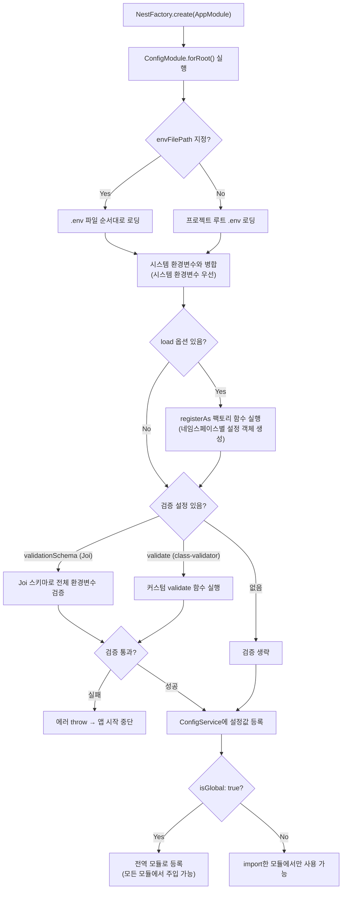
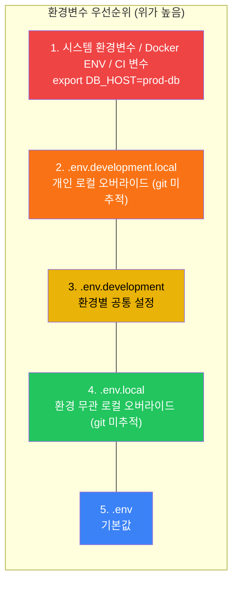
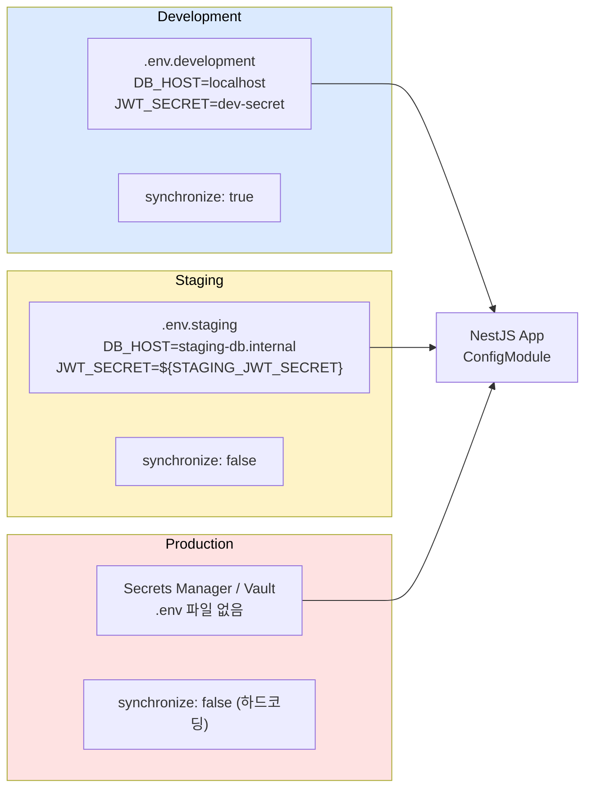
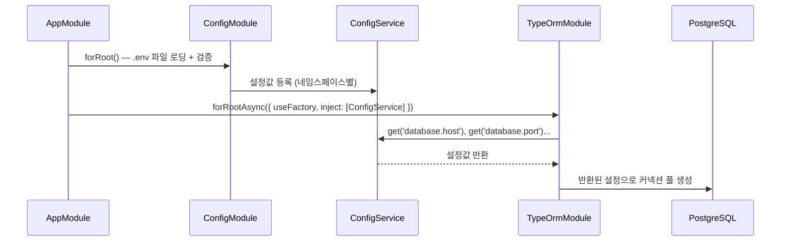

# NestJS 설정 관리

NestJS에서 환경변수를 다루는 건 단순해 보이지만, 설정 하나 잘못 넣어서 프로덕션 DB가 날아가는 일이 실제로 일어난다. `synchronize: true`가 프로덕션 TypeORM 설정에 들어가 있었는데 아무도 몰랐다가, 엔티티 수정 후 배포하면서 테이블 컬럼이 드랍된 사례는 한 번쯤 들어봤을 것이다. ConfigModule을 제대로 설정하고, 환경변수를 검증하고, 환경별로 분리하는 방법을 정리한다.


## ConfigModule 초기화 흐름

NestJS 앱이 시작되면 ConfigModule은 다음 순서로 동작한다.



앱이 시작되는 시점에 환경변수 로딩 → 설정 객체 생성 → 검증이 순서대로 일어난다. 검증에 실패하면 앱 자체가 뜨지 않기 때문에, 잘못된 설정으로 런타임에 장애가 나는 걸 막을 수 있다.


## ConfigModule 기본 설정

`@nestjs/config` 패키지가 NestJS 공식 설정 모듈이다. 내부적으로 `dotenv`를 사용한다.

```bash
npm install @nestjs/config
```

```typescript
@Module({
  imports: [
    ConfigModule.forRoot({
      isGlobal: true, // 모든 모듈에서 ConfigService 주입 가능
    }),
  ],
})
export class AppModule {}
```

`isGlobal: true`를 안 쓰면 ConfigService가 필요한 모든 모듈에서 ConfigModule을 import해야 한다. 거의 모든 모듈에서 설정값을 읽으니 전역으로 등록하는 게 맞다.


## .env 파일 로딩 순서

ConfigModule은 기본적으로 프로젝트 루트의 `.env` 파일을 읽는다. 여러 환경 파일을 사용하려면 `envFilePath` 옵션을 쓴다.

다음은 `NODE_ENV=development`일 때 환경변수 값이 결정되는 우선순위다. 위에 있을수록 우선순위가 높다.



같은 키가 여러 파일에 있으면 우선순위가 높은 쪽이 이긴다. 시스템 환경변수가 항상 `.env` 파일보다 우선한다는 점이 핵심이다.

```typescript
ConfigModule.forRoot({
  isGlobal: true,
  envFilePath: [
    `.env.${process.env.NODE_ENV}.local`, // 1순위: 로컬 오버라이드
    `.env.${process.env.NODE_ENV}`,        // 2순위: 환경별 파일
    '.env.local',                          // 3순위: 공통 로컬 오버라이드
    '.env',                                // 4순위: 기본값
  ],
})
```

배열로 넘기면 **앞에 있는 파일이 우선**이다. `.env.development.local`과 `.env`에 같은 키가 있으면 `.env.development.local`의 값이 쓰인다. 주의할 점이 하나 있다. 이미 시스템 환경변수로 설정된 값은 `.env` 파일보다 우선한다. Docker나 CI에서 환경변수를 주입하면 `.env` 파일의 값이 무시된다. 이걸 모르면 "분명 .env에 바꿨는데 왜 안 바뀌지?"라고 삽질하게 된다.

### .gitignore 설정

`.env` 파일을 git에 올리면 안 된다. 특히 `.env.local`이나 `.env.*.local` 파일은 개인 개발 환경용이니 반드시 .gitignore에 추가한다.

```
.env
.env.local
.env.*.local
```

`.env.example` 파일은 올려서 팀원들이 어떤 환경변수가 필요한지 알 수 있게 한다. 실제 값은 비우고 키만 적어둔다.


## 환경변수 검증 - Joi

환경변수 검증은 반드시 해야 한다. 검증 없이 앱을 띄우면 필수 환경변수가 빠져 있어도 런타임에 에러가 나기 전까지 모른다. 앱 시작 시점에 검증해서 빠진 값이 있으면 바로 죽는 게 낫다.

```bash
npm install joi
```

```typescript
import * as Joi from 'joi';

ConfigModule.forRoot({
  isGlobal: true,
  validationSchema: Joi.object({
    NODE_ENV: Joi.string()
      .valid('development', 'staging', 'production')
      .default('development'),

    PORT: Joi.number().default(3000),

    // DB
    DB_HOST: Joi.string().required(),
    DB_PORT: Joi.number().default(5432),
    DB_USERNAME: Joi.string().required(),
    DB_PASSWORD: Joi.string().required(),
    DB_DATABASE: Joi.string().required(),

    // JWT
    JWT_SECRET: Joi.string().min(32).required(),
    JWT_EXPIRES_IN: Joi.string().default('1h'),

    // Redis
    REDIS_HOST: Joi.string().default('localhost'),
    REDIS_PORT: Joi.number().default(6379),
  }),
  validationOptions: {
    abortEarly: false, // 모든 검증 에러를 한꺼번에 표시
  },
})
```

`abortEarly: false`를 설정하면 빠진 환경변수를 한꺼번에 알려준다. 기본값은 `true`라서 첫 번째 에러에서 멈추는데, 환경변수 5개가 빠져 있으면 한 번에 다 알려주는 게 시간 낭비를 줄인다.


## 환경변수 검증 - class-validator

Joi 대신 class-validator를 쓸 수도 있다. DTO 검증에 이미 class-validator를 쓰고 있으면 통일하는 편이 낫다.

```typescript
import { plainToInstance } from 'class-transformer';
import { IsEnum, IsNumber, IsString, Min, validateSync } from 'class-validator';

enum Environment {
  Development = 'development',
  Staging = 'staging',
  Production = 'production',
}

class EnvironmentVariables {
  @IsEnum(Environment)
  NODE_ENV: Environment;

  @IsNumber()
  @Min(1)
  PORT: number;

  @IsString()
  DB_HOST: string;

  @IsNumber()
  DB_PORT: number;

  @IsString()
  DB_USERNAME: string;

  @IsString()
  DB_PASSWORD: string;

  @IsString()
  DB_DATABASE: string;

  @IsString()
  JWT_SECRET: string;
}

export function validate(config: Record<string, unknown>) {
  const validatedConfig = plainToInstance(EnvironmentVariables, config, {
    enableImplicitConversion: true,
  });

  const errors = validateSync(validatedConfig, {
    skipMissingProperties: false,
  });

  if (errors.length > 0) {
    throw new Error(
      `환경변수 검증 실패:\n${errors.map((e) => Object.values(e.constraints).join(', ')).join('\n')}`,
    );
  }

  return validatedConfig;
}
```

```typescript
ConfigModule.forRoot({
  isGlobal: true,
  validate,
})
```

class-validator 방식의 장점은 타입 변환이 자동으로 된다는 것이다. 환경변수는 전부 문자열인데, `enableImplicitConversion: true`로 `PORT=3000`을 숫자 3000으로 바꿔준다. Joi에서는 이걸 `Joi.number()`가 해주는데, 결과적으로 같다.


## 커스텀 설정 파일

환경변수가 많아지면 `ConfigService.get('DB_HOST')`처럼 문자열 키로 접근하는 게 불편해진다. 오타가 나도 컴파일 타임에 잡히지 않는다. 커스텀 설정 파일을 만들어 구조화하는 게 좋다.

```typescript
// config/database.config.ts
import { registerAs } from '@nestjs/config';

export default registerAs('database', () => ({
  host: process.env.DB_HOST,
  port: parseInt(process.env.DB_PORT, 10) || 5432,
  username: process.env.DB_USERNAME,
  password: process.env.DB_PASSWORD,
  database: process.env.DB_DATABASE,
  synchronize: process.env.NODE_ENV !== 'production', // 프로덕션에서는 절대 true가 되면 안 된다
}));
```

```typescript
// config/jwt.config.ts
import { registerAs } from '@nestjs/config';

export default registerAs('jwt', () => ({
  secret: process.env.JWT_SECRET,
  expiresIn: process.env.JWT_EXPIRES_IN || '1h',
  refreshExpiresIn: process.env.JWT_REFRESH_EXPIRES_IN || '7d',
}));
```

```typescript
// config/redis.config.ts
import { registerAs } from '@nestjs/config';

export default registerAs('redis', () => ({
  host: process.env.REDIS_HOST || 'localhost',
  port: parseInt(process.env.REDIS_PORT, 10) || 6379,
  password: process.env.REDIS_PASSWORD || undefined,
}));
```

```typescript
// app.module.ts
import databaseConfig from './config/database.config';
import jwtConfig from './config/jwt.config';
import redisConfig from './config/redis.config';

@Module({
  imports: [
    ConfigModule.forRoot({
      isGlobal: true,
      load: [databaseConfig, jwtConfig, redisConfig],
    }),
  ],
})
export class AppModule {}
```


## ConfigService 타입 안전하게 사용하기

`ConfigService.get()`은 기본적으로 `any`를 반환한다. 타입 안전성이 없으니 인터페이스를 정의해서 사용한다.

### 네임스페이스 접근

`registerAs`로 등록한 설정은 네임스페이스로 접근한다.

```typescript
@Injectable()
export class DatabaseService {
  constructor(private configService: ConfigService) {}

  getConnectionOptions() {
    // 네임스페이스.키 형태로 접근
    const host = this.configService.get<string>('database.host');
    const port = this.configService.get<number>('database.port');

    // 네임스페이스 전체를 가져올 수도 있다
    const dbConfig = this.configService.get('database');
    // dbConfig.host, dbConfig.port, ...
  }
}
```

### 타입 안전한 인터페이스 정의

```typescript
// config/config.interface.ts
export interface DatabaseConfig {
  host: string;
  port: number;
  username: string;
  password: string;
  database: string;
  synchronize: boolean;
}

export interface JwtConfig {
  secret: string;
  expiresIn: string;
  refreshExpiresIn: string;
}

export interface AppConfig {
  database: DatabaseConfig;
  jwt: JwtConfig;
}
```

```typescript
@Injectable()
export class AuthService {
  constructor(private configService: ConfigService<AppConfig, true>) {}

  generateToken(payload: any) {
    const secret = this.configService.get('jwt.secret', { infer: true });
    // secret의 타입이 string으로 추론된다
    const expiresIn = this.configService.get('jwt.expiresIn', { infer: true });

    return this.jwtService.sign(payload, { secret, expiresIn });
  }
}
```

`ConfigService<AppConfig, true>`에서 두 번째 제네릭 `true`는 `strictNullChecks`를 의미한다. `true`로 설정하면 `get()` 반환값이 `undefined`가 될 수 없다고 타입이 보장된다. Joi나 class-validator로 필수값 검증을 해뒀으니 런타임에도 안전하다.

`{ infer: true }` 옵션을 넘기면 인터페이스에서 타입을 추론한다. 이걸 안 쓰면 제네릭을 줘도 타입이 안 잡힌다.


## 환경별 설정 분리

### 디렉토리 구조

```
src/
  config/
    database.config.ts
    jwt.config.ts
    redis.config.ts
    config.interface.ts
env/
  .env.development
  .env.staging
  .env.production
  .env.example
```

환경별로 설정이 어떻게 흘러가는지 그림으로 보면 이렇다.



개발 환경에서는 `.env` 파일에 값을 직접 넣고, 스테이징에서는 일부 값을 CI/CD에서 주입하며, 프로덕션에서는 `.env` 파일 자체를 쓰지 않고 시크릿 관리 서비스에서 가져온다.

### 환경별 .env 파일

```ini
# .env.development
NODE_ENV=development
PORT=3000
DB_HOST=localhost
DB_PORT=5432
DB_USERNAME=dev_user
DB_PASSWORD=dev_pass
DB_DATABASE=myapp_dev
JWT_SECRET=local-dev-secret-key-at-least-32-chars!!
```

```ini
# .env.staging
NODE_ENV=staging
PORT=3000
DB_HOST=staging-db.internal
DB_PORT=5432
DB_USERNAME=staging_user
DB_PASSWORD=${STAGING_DB_PASSWORD}
DB_DATABASE=myapp_staging
JWT_SECRET=${STAGING_JWT_SECRET}
```

프로덕션 환경에서는 `.env` 파일에 비밀값을 직접 넣지 않는다. AWS Secrets Manager, Vault 같은 시크릿 관리 서비스에서 주입하거나, CI/CD 파이프라인에서 환경변수를 설정한다.

### package.json 스크립트

```json
{
  "scripts": {
    "start:dev": "NODE_ENV=development nest start --watch",
    "start:staging": "NODE_ENV=staging node dist/main",
    "start:prod": "NODE_ENV=production node dist/main"
  }
}
```


## 동적 모듈에서 설정 주입

NestJS의 동적 모듈은 `forRoot()`, `forRootAsync()`로 설정을 받는다. `forRootAsync()`에서 ConfigService를 주입해 환경변수 기반으로 설정하는 패턴이 가장 많이 쓰인다.

`forRootAsync` + ConfigService 조합이 어떻게 동작하는지 흐름을 보면 이렇다.



ConfigModule이 먼저 초기화되고, 그 다음에 다른 동적 모듈의 `useFactory`가 실행된다. ConfigModule에 `isGlobal: true`가 있으면 별도 import 없이 어떤 모듈에서든 ConfigService를 주입받을 수 있다.

### TypeORM 설정

```typescript
@Module({
  imports: [
    TypeOrmModule.forRootAsync({
      inject: [ConfigService],
      useFactory: (configService: ConfigService<AppConfig, true>) => ({
        type: 'postgres',
        host: configService.get('database.host', { infer: true }),
        port: configService.get('database.port', { infer: true }),
        username: configService.get('database.username', { infer: true }),
        password: configService.get('database.password', { infer: true }),
        database: configService.get('database.database', { infer: true }),
        synchronize: configService.get('database.synchronize', { infer: true }),
        autoLoadEntities: true,
        logging: configService.get('database.host', { infer: true }) === 'localhost',
      }),
    }),
  ],
})
export class DatabaseModule {}
```

### JWT 모듈 설정

```typescript
@Module({
  imports: [
    JwtModule.registerAsync({
      inject: [ConfigService],
      useFactory: (configService: ConfigService<AppConfig, true>) => ({
        secret: configService.get('jwt.secret', { infer: true }),
        signOptions: {
          expiresIn: configService.get('jwt.expiresIn', { infer: true }),
        },
      }),
    }),
  ],
})
export class AuthModule {}
```

### 커스텀 동적 모듈 만들기

직접 만든 모듈에서도 같은 패턴을 쓸 수 있다.

```typescript
@Module({})
export class MailModule {
  static forRootAsync(options: {
    inject: any[];
    useFactory: (...args: any[]) => MailModuleOptions;
  }): DynamicModule {
    return {
      module: MailModule,
      providers: [
        {
          provide: 'MAIL_OPTIONS',
          inject: options.inject,
          useFactory: options.useFactory,
        },
        MailService,
      ],
      exports: [MailService],
    };
  }
}
```

```typescript
// 사용
MailModule.forRootAsync({
  inject: [ConfigService],
  useFactory: (config: ConfigService) => ({
    host: config.get('SMTP_HOST'),
    port: config.get('SMTP_PORT'),
    auth: {
      user: config.get('SMTP_USER'),
      pass: config.get('SMTP_PASSWORD'),
    },
  }),
})
```


## 설정 실수로 터지는 사례들

### 사례 1: synchronize: true 프로덕션 사고

TypeORM의 `synchronize: true`는 엔티티 클래스의 변경사항을 DB 스키마에 자동 반영한다. 개발할 때는 편하지만, 프로덕션에서는 절대 쓰면 안 된다.

실제 사고 시나리오는 이렇다.

1. 엔티티에서 컬럼명을 변경한다. (`userName` → `username`)
2. TypeORM은 기존 `userName` 컬럼을 DROP하고 `username` 컬럼을 CREATE한다.
3. 기존 데이터가 전부 사라진다.

```typescript
// 이렇게 하면 안 된다
{
  synchronize: process.env.SYNCHRONIZE === 'true', // .env에 SYNCHRONIZE=true가 들어가면?
}

// 이렇게 해야 한다
{
  synchronize: process.env.NODE_ENV === 'development', // 환경 기반으로 제어
}
```

더 안전한 방법은 아예 환경변수로 `synchronize`를 제어하지 않는 것이다. 프로덕션 설정 파일에 하드코딩으로 `false`를 박아놓는다.

```typescript
// config/database.config.ts
export default registerAs('database', () => {
  const isProduction = process.env.NODE_ENV === 'production';

  return {
    // ...
    synchronize: isProduction ? false : (process.env.DB_SYNCHRONIZE === 'true'),
    // 프로덕션은 무조건 false, 나머지는 환경변수로 제어
  };
});
```

프로덕션 DB 스키마 변경은 마이그레이션 파일로 관리해야 한다. TypeORM의 `migration:generate`와 `migration:run`을 쓴다.

### 사례 2: JWT_SECRET이 환경별로 같은 값

개발 환경에서 쓰던 JWT_SECRET을 프로덕션에도 그대로 가져간 경우다. 개발 환경에서 발급한 토큰이 프로덕션에서도 유효하게 된다. 스테이징에서 발급받은 토큰으로 프로덕션 API를 호출할 수 있다면 보안 문제가 심각하다.

```typescript
// Joi 검증에서 프로덕션 시크릿 길이 제한을 걸어둔다
JWT_SECRET: Joi.string()
  .min(process.env.NODE_ENV === 'production' ? 64 : 32)
  .required(),
```

### 사례 3: 환경변수 타입 변환 누락

```typescript
// 환경변수는 전부 문자열이다
// process.env.DB_PORT는 "5432"이지 5432가 아니다
const port = process.env.DB_PORT; // "5432" (string)

// TypeORM에 문자열로 넘기면 연결이 안 되거나 예상치 못한 동작을 한다
// parseInt로 변환해야 한다
const port = parseInt(process.env.DB_PORT, 10); // 5432 (number)
```

ConfigModule의 커스텀 설정 파일(`registerAs`)에서 `parseInt`를 안 한 채 넘기면, 라이브러리 내부에서 `===` 비교를 할 때 타입이 안 맞아서 조건문이 안 먹히는 경우가 있다.

### 사례 4: .env 파일이 빌드 결과물에 포함

`nest build`로 빌드하면 `dist/` 폴더에 `.env`가 복사되지 않는다. 이건 정상이다. 하지만 Docker 이미지를 만들 때 `COPY . .`을 하면 `.env`가 이미지에 포함될 수 있다.

```dockerfile
# .dockerignore에 추가해야 한다
.env
.env.*
!.env.example
```

### 사례 5: ConfigService를 main.ts에서 사용

`bootstrap()` 함수에서 ConfigService를 쓰려면 앱 인스턴스에서 직접 가져와야 한다.

```typescript
async function bootstrap() {
  const app = await NestFactory.create(AppModule);

  // ConfigService를 앱 컨텍스트에서 가져온다
  const configService = app.get(ConfigService);
  const port = configService.get<number>('PORT', 3000);

  await app.listen(port);
  console.log(`Server running on port ${port}`);
}
```

`process.env.PORT`를 직접 쓰면 ConfigModule의 기본값 설정이나 검증이 적용되지 않는다. 일관성을 위해 ConfigService를 통해 접근하는 게 맞다.


## 설정 관련 테스트

설정 모듈을 테스트할 때는 ConfigModule을 모킹하지 않고, 테스트용 환경변수를 직접 주입하는 게 더 안정적이다.

```typescript
describe('DatabaseService', () => {
  let service: DatabaseService;

  beforeEach(async () => {
    const module = await Test.createTestingModule({
      imports: [
        ConfigModule.forRoot({
          // 테스트용 설정을 직접 로드
          load: [
            () => ({
              database: {
                host: 'localhost',
                port: 5432,
                username: 'test',
                password: 'test',
                database: 'test_db',
                synchronize: true, // 테스트에서는 synchronize 써도 된다
              },
            }),
          ],
        }),
      ],
      providers: [DatabaseService],
    }).compile();

    service = module.get(DatabaseService);
  });

  it('DB 연결 옵션을 반환한다', () => {
    const options = service.getConnectionOptions();
    expect(options.host).toBe('localhost');
    expect(options.port).toBe(5432);
  });
});
```

ConfigService를 모킹하는 방법도 있지만, 실제 ConfigModule을 쓰는 편이 설정 로딩 과정까지 검증할 수 있어서 더 낫다.


## 정리

- `ConfigModule.forRoot({ isGlobal: true })`로 전역 등록한다.
- Joi나 class-validator로 앱 시작 시 환경변수를 검증한다. 런타임에 터지는 것보다 시작 시 죽는 게 낫다.
- `registerAs`로 설정을 네임스페이스 단위로 구조화한다.
- `ConfigService`에 제네릭과 `{ infer: true }`를 써서 타입 안전성을 확보한다.
- `synchronize: true`는 프로덕션에서 쓰지 않는다. 환경변수 하나로 제어하지 말고, 프로덕션이면 강제로 `false`를 넣는다.
- `.env` 파일은 git에 올리지 않는다. Docker 이미지에도 포함되지 않게 `.dockerignore`를 설정한다.
- 프로덕션 비밀값은 `.env` 파일이 아니라 시크릿 관리 서비스에서 주입한다.
