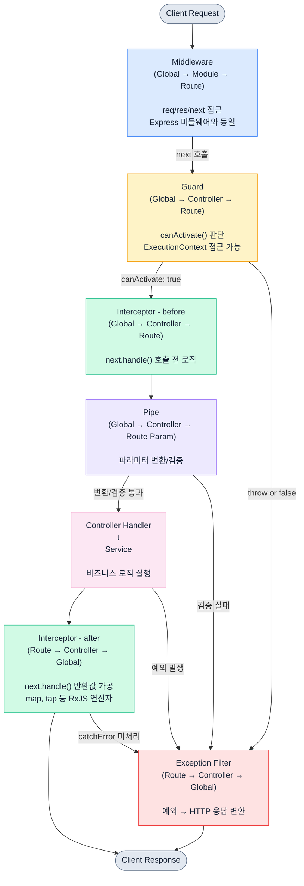
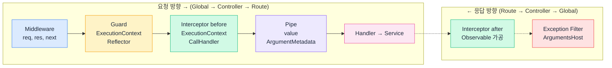

# NestJS 요청 라이프사이클

NestJS에서 HTTP 요청이 들어오면 여러 레이어를 순차적으로 거친 뒤 핸들러에 도달하고, 응답이 만들어진 뒤 다시 반대 방향으로 돌아 나간다. 이 순서를 모르면 "분명 Guard에서 막았는데 왜 Pipe가 실행되지?", "Interceptor에서 변환한 응답이 왜 Filter에서는 보이지 않지?" 같은 문제로 시간을 빼앗긴다. 실행 순서, 각 레이어의 책임, 그리고 디버깅하는 방법을 정리한다.

## 요청 처리 순서

```
Client Request
    ↓
Middleware                (Global → Module → Route)
    ↓
Guard                     (Global → Controller → Route)
    ↓
Interceptor - before      (Global → Controller → Route)
    ↓
Pipe                      (Global → Controller → Route Parameter)
    ↓
Controller (Route Handler)
    ↓
Service                   (비즈니스 로직, 트랜잭션, 외부 호출)
    ↓
Interceptor - after       (Route → Controller → Global)
    ↓
Exception Filter          (Route → Controller → Global)
    ↓
Client Response
```

핵심은 두 가지다.

첫째, Controller와 Service는 Nest 라이프사이클의 별도 레이어가 아니다. Controller가 호출하는 일반 메서드 체인이다. Pipe가 끝나면 핸들러(Controller 메서드)가 실행되고, 그 안에서 Service를 호출한다. Service 단계에서 발생하는 예외도 Interceptor가 감싸고 있는 Observable로 흘러간다.

둘째, before 처리는 Global → Controller → Route 순으로 들어가지만, after 처리와 에러 핸들링은 Route → Controller → Global 순으로 빠져나간다. 스택처럼 동작한다고 보면 된다. `tap` 연산자의 로그 순서가 등록 순서와 반대로 찍힌다면 이 규칙 때문이다.

### 전체 흐름 다이어그램

정상 경로와 예외 발생 경로를 함께 표시했다. 어느 단계든 예외가 발생하면 그 시점부터 남은 before 단계는 모두 건너뛰고 Exception Filter로 직행한다.



### 실행 순서와 스코프 비교

각 레이어가 언제 실행되고, 무엇에 접근할 수 있는지 한눈에 비교한 그림이다.



Middleware는 `req`/`res`만 알고 "어떤 핸들러가 실행될지"는 모른다. Guard부터 `ExecutionContext`가 주어지면서 핸들러/컨트롤러 메타데이터에 접근할 수 있게 된다. 이 차이 때문에 인증/인가 같은 메타데이터 기반 로직은 Middleware가 아니라 Guard에서 처리해야 한다.


## Middleware

Express 미들웨어와 동일한 개념이다. `req`, `res`, `next`를 받고, 라우트 핸들러에 도달하기 전에 실행된다. NestJS가 라우팅 결정을 내리기 직전 단계라서 어떤 컨트롤러/핸들러가 호출될지에 대한 정보가 없다.

### 실무에서 주로 쓰는 경우

- 요청 로깅 (어떤 IP에서 어떤 경로로 요청했는지)
- 요청 본문 파싱 (커스텀 파서가 필요한 경우)
- CORS 처리 (NestJS 내장 옵션으로 대부분 해결되지만 세밀한 제어가 필요할 때)
- Request ID 부여 같은 컨텍스트 초기화

```typescript
@Injectable()
export class RequestLoggerMiddleware implements NestMiddleware {
  private readonly logger = new Logger('HTTP');

  use(req: Request, res: Response, next: NextFunction) {
    const { method, originalUrl, ip } = req;
    const startTime = Date.now();

    res.on('finish', () => {
      const duration = Date.now() - startTime;
      this.logger.log(
        `${method} ${originalUrl} ${res.statusCode} ${duration}ms - ${ip}`,
      );
    });

    next();
  }
}
```

### Middleware 등록

```typescript
@Module({})
export class AppModule implements NestModule {
  configure(consumer: MiddlewareConsumer) {
    consumer
      .apply(RequestLoggerMiddleware)
      .forRoutes('*'); // 전체 라우트에 적용
  }
}
```

### 이 단계에서 자주 겪는 문제

**`next()` 호출 누락**: Express에서와 똑같다. `next()`를 빼먹으면 요청이 멈춘다. 타임아웃 에러만 나오고 원인을 찾기 어려우니 작성 직후 `next()` 호출 여부를 확인하는 습관이 필요하다.

**Middleware에서 응답을 끝내버리는 경우**: `res.send()`나 `res.end()`를 Middleware에서 호출하면 이후 레이어가 전부 무시된다. Guard, Pipe, Interceptor에서 처리해야 할 로직이 있다면 응답을 직접 내려보내면 안 된다.

**의존성 주입과 함수형 미들웨어 혼동**: 클래스 미들웨어는 DI를 받지만 함수형 미들웨어(`app.use(loggerFn)`)는 DI를 받지 못한다. 함수형은 `main.ts`에서 등록할 수 있어 편하지만, Service를 주입받아야 한다면 반드시 클래스 형태로 만들어야 한다.


## Guard

**인가(Authorization)** 처리 전용 레이어다. `canActivate()` 메서드의 반환값으로 다음 단계 진입 여부를 결정한다. Guard는 Middleware와 다르게 `ExecutionContext`에 접근할 수 있다. "어떤 컨트롤러의 어떤 핸들러가 실행될 예정인지" 알 수 있다는 점이 결정적인 차이다.

### Guard에서 throw vs return false 차이

이 부분이 가장 헷갈리는 지점이다. 둘 다 요청을 막지만 동작이 다르다.

| 방식 | 응답 상태 | 응답 메시지 | 사용 시점 |
|------|----------|------------|-----------|
| `return false` | 403 Forbidden | "Forbidden resource" 고정 | 단순 거부, 이유를 클라이언트에 알릴 필요 없음 |
| `throw new ForbiddenException('...')` | 403 Forbidden | 직접 지정한 메시지 | 거부 이유를 명시해야 할 때 |
| `throw new UnauthorizedException('...')` | 401 Unauthorized | 직접 지정 | 인증 자체가 안 된 경우 |
| `throw new HttpException({...}, 418)` | 임의 상태 코드 | 임의 페이로드 | 정책상 다른 상태 코드를 써야 할 때 |

`return false`를 쓰면 NestJS 내부에서 `ForbiddenException`을 만들어 던진다. 결과적으로 상태 코드는 403으로 고정되고, 메시지도 "Forbidden resource"로 고정된다. 클라이언트가 "왜 막혔는지"를 알 방법이 없다.

```typescript
// return false - 상태/메시지 고정
@Injectable()
export class SimpleGuard implements CanActivate {
  canActivate(context: ExecutionContext): boolean {
    const request = context.switchToHttp().getRequest();
    return request.headers['x-api-key'] === process.env.API_KEY;
    // 키가 틀리면 403 "Forbidden resource"
  }
}

// throw - 의도한 상태/메시지로 응답
@Injectable()
export class ApiKeyGuard implements CanActivate {
  canActivate(context: ExecutionContext): boolean {
    const request = context.switchToHttp().getRequest();
    const apiKey = request.headers['x-api-key'];

    if (!apiKey) {
      throw new UnauthorizedException('API 키가 필요합니다');
    }
    if (apiKey !== process.env.API_KEY) {
      throw new ForbiddenException('API 키가 올바르지 않습니다');
    }
    return true;
  }
}
```

실무에서는 거의 대부분 `throw`로 던지는 쪽을 선택한다. 이유는 세 가지다.

1. 응답 메시지를 통제할 수 있다. "토큰 만료", "역할 부족", "IP 차단" 같은 구체적인 이유를 클라이언트에 전달할 수 있다.
2. 401/403을 구분할 수 있다. 인증이 안 된 거면 401, 인증은 됐는데 권한이 부족하면 403이다. `return false`는 무조건 403이라서 토큰 만료를 401로 알릴 방법이 없다.
3. Exception Filter에서 통합 처리가 쉽다. 로깅이나 메트릭 수집을 모든 인가 실패에 대해 적용할 때, throw된 예외만 따라가면 된다.

### 역할 기반 인가 처리

```typescript
export const ROLES_KEY = 'roles';
export const Roles = (...roles: string[]) => SetMetadata(ROLES_KEY, roles);
```

```typescript
@Injectable()
export class RolesGuard implements CanActivate {
  constructor(private reflector: Reflector) {}

  canActivate(context: ExecutionContext): boolean {
    const requiredRoles = this.reflector.getAllAndOverride<string[]>(
      ROLES_KEY,
      [context.getHandler(), context.getClass()],
    );

    if (!requiredRoles) {
      return true; // @Roles 미지정 핸들러는 통과
    }

    const request = context.switchToHttp().getRequest();
    const user = request.user;

    if (!user) {
      throw new UnauthorizedException('인증 정보가 없습니다');
    }

    const hasRole = requiredRoles.some((role) => user.roles?.includes(role));
    if (!hasRole) {
      throw new ForbiddenException(
        `필요한 역할: ${requiredRoles.join(', ')}`,
      );
    }

    return true;
  }
}
```

```typescript
@Controller('admin')
@UseGuards(AuthGuard, RolesGuard)  // AuthGuard가 먼저
export class AdminController {
  @Get('users')
  @Roles('ADMIN', 'SUPER_ADMIN')
  findAllUsers() {
    return this.adminService.findAllUsers();
  }

  @Delete('users/:id')
  @Roles('SUPER_ADMIN')
  removeUser(@Param('id') id: string) {
    return this.adminService.removeUser(id);
  }
}
```

### 이 단계에서 자주 겪는 문제

**Guard 순서 잘못 지정**: `@UseGuards(RolesGuard, AuthGuard)`처럼 인증보다 인가 Guard를 먼저 두면 `request.user`가 없는 상태에서 역할을 확인하게 된다. 인증 Guard를 항상 먼저 배치해야 한다.

**`getAllAndOverride` vs `getAllAndMerge`**: `getAllAndOverride`는 핸들러 메타데이터가 있으면 컨트롤러 메타데이터를 무시한다. `getAllAndMerge`는 둘 다 합친다. 컨트롤러에 `@Roles('USER')`, 핸들러에 `@Roles('ADMIN')`을 달았을 때 Override는 `['ADMIN']`만, Merge는 `['USER', 'ADMIN']`이 된다. 역할 정책에 맞는 쪽을 골라 써야 한다.

**Global Guard에서 DI가 안 되는 경우**: `app.useGlobalGuards(new RolesGuard())`로 등록하면 `new`로 직접 만든 인스턴스라서 `Reflector`가 주입되지 않는다. DI가 필요하면 `APP_GUARD` 토큰으로 모듈에 provider로 등록해야 한다.

```typescript
@Module({
  providers: [
    { provide: APP_GUARD, useClass: RolesGuard },
  ],
})
export class AppModule {}
```

**비동기 Guard에서 Promise 미반환**: `canActivate`는 `boolean | Promise<boolean> | Observable<boolean>`을 반환할 수 있다. async로 만들었다면 반드시 await 또는 return Promise해야 한다. 그러지 않으면 Promise 객체가 truthy로 평가되어 항상 통과되는 버그가 생긴다.


## Interceptor

Guard를 통과하면 Interceptor가 실행된다. 핸들러 실행 전후를 모두 감싸는 레이어로, RxJS의 `Observable`을 반환하기 때문에 응답 스트림을 조작할 수 있다.

### Interceptor의 before/after 동작 원리

Interceptor 코드는 한 번에 작성하지만 실행은 두 시점으로 나뉜다.

```typescript
intercept(context: ExecutionContext, next: CallHandler): Observable<any> {
  // [before] 여기는 핸들러 실행 전에 실행
  console.log('before handler');

  return next.handle().pipe(
    // [after] 여기는 핸들러 응답이 흘러나올 때 실행
    tap(() => console.log('after handler')),
  );
}
```

`next.handle()` 호출 전 코드는 before, `.pipe()` 안의 RxJS 연산자는 after에서 동작한다. 헷갈리는 부분은 여러 Interceptor가 쌓였을 때 순서다. `@UseInterceptors(A, B, C)`로 등록하면:

- before: A → B → C 순으로 들어간다
- after: C → B → A 순으로 빠져나온다

before에서 시작 시간을 찍고 after에서 끝 시간을 찍는 로깅 Interceptor 여러 개를 동시에 걸면, 각각의 측정 범위가 다르다는 점에 주의해야 한다. 바깥쪽 Interceptor일수록 측정 범위가 넓다.

### 응답 변환 Interceptor

API 응답 형식을 통일할 때 가장 많이 쓴다.

```typescript
export interface ApiResponse<T> {
  success: boolean;
  data: T;
  timestamp: string;
}

@Injectable()
export class TransformInterceptor<T>
  implements NestInterceptor<T, ApiResponse<T>>
{
  intercept(
    context: ExecutionContext,
    next: CallHandler,
  ): Observable<ApiResponse<T>> {
    return next.handle().pipe(
      map((data) => ({
        success: true,
        data,
        timestamp: new Date().toISOString(),
      })),
    );
  }
}
```

핸들러에서 `{ id: 1, name: 'Kim' }`을 반환하면, 클라이언트에는 `{ success: true, data: { id: 1, name: 'Kim' }, timestamp: '...' }` 형태로 전달된다.

### 로깅 Interceptor

```typescript
@Injectable()
export class LoggingInterceptor implements NestInterceptor {
  private readonly logger = new Logger('Request');

  intercept(context: ExecutionContext, next: CallHandler): Observable<any> {
    const request = context.switchToHttp().getRequest();
    const { method, url } = request;
    const handler = context.getHandler().name;
    const controller = context.getClass().name;

    this.logger.log(`→ ${method} ${url} [${controller}.${handler}]`);
    const now = Date.now();

    return next.handle().pipe(
      tap(() => {
        this.logger.log(
          `← ${method} ${url} [${controller}.${handler}] ${Date.now() - now}ms`,
        );
      }),
    );
  }
}
```

### 캐싱 Interceptor

핸들러 자체를 건너뛰는 패턴이다. `next.handle()`을 호출하지 않고 `of(cached)`로 캐시 값을 즉시 반환하면 Controller와 Service는 실행되지 않는다.

```typescript
@Injectable()
export class HttpCacheInterceptor implements NestInterceptor {
  constructor(
    @Inject(CACHE_MANAGER) private cacheManager: Cache,
    private reflector: Reflector,
  ) {}

  async intercept(
    context: ExecutionContext,
    next: CallHandler,
  ): Promise<Observable<any>> {
    const request = context.switchToHttp().getRequest();

    if (request.method !== 'GET') {
      return next.handle();
    }

    const ttl = this.reflector.get<number>('cacheTTL', context.getHandler());
    if (!ttl) {
      return next.handle();
    }

    const key = `cache:${request.url}`;
    const cached = await this.cacheManager.get(key);

    if (cached) {
      return of(cached);
    }

    return next.handle().pipe(
      tap(async (response) => {
        await this.cacheManager.set(key, response, ttl);
      }),
    );
  }
}
```

### 이 단계에서 자주 겪는 문제

**`next.handle()` 미호출**: 캐싱처럼 의도적으로 건너뛰는 경우가 아니라면, 호출을 빼먹으면 핸들러가 실행되지 않는다. 클라이언트는 응답이 비거나 무한 대기하게 된다.

**`catchError`가 Exception Filter를 먹어버리는 경우**: Interceptor에서 `catchError` 연산자를 쓰면 Exception Filter보다 먼저 에러를 잡는다. 의도한 동작이라면 괜찮지만, Filter에서 처리하려던 에러가 Interceptor에서 먹혀 사라지면 로그 한 줄도 안 남는 상황이 생긴다. `catchError` 안에서 다시 `throwError(() => err)`로 던지면 Filter까지 흘려보낼 수 있다.

```typescript
return next.handle().pipe(
  catchError((err) => {
    this.logger.warn(`인터셉터에서 본 에러: ${err.message}`);
    return throwError(() => err); // 다시 던져서 Filter로 흘려보낸다
  }),
);
```

**`map`과 `tap`의 차이를 헷갈림**: `map`은 값을 변환해서 다음 단계로 흘려보낸다. `tap`은 값을 들여다보기만 하고 그대로 통과시킨다. 응답을 변환할 거면 `map`, 로깅이나 부수 효과만 원하면 `tap`이다. `tap`에 변환 로직을 넣으면 결과가 반영되지 않는다.


## Pipe

Pipe는 핸들러의 **파라미터를 변환하거나 검증**하는 레이어다. 핸들러에 도달하기 직전, Interceptor의 before 단계 이후에 실행된다.

### 내장 Pipe

NestJS에서 기본 제공하는 Pipe들이 있다.

| Pipe | 하는 일 |
|------|---------|
| `ValidationPipe` | class-validator로 DTO 검증 |
| `ParseIntPipe` | 문자열 → 정수 변환 |
| `ParseUUIDPipe` | UUID 형식 검증 |
| `ParseBoolPipe` | 문자열 → boolean 변환 |
| `DefaultValuePipe` | 값이 없으면 기본값 설정 |

### DTO 변환과 Validation

```typescript
export class CreateUserDto {
  @IsString()
  @MinLength(2)
  @MaxLength(50)
  name: string;

  @IsEmail()
  email: string;

  @IsEnum(UserRole)
  role: UserRole;

  @IsOptional()
  @IsString()
  nickname?: string;
}
```

```typescript
app.useGlobalPipes(
  new ValidationPipe({
    whitelist: true,            // DTO에 없는 속성 자동 제거
    forbidNonWhitelisted: true, // 없는 속성 들어오면 에러
    transform: true,            // 평범한 객체를 DTO 인스턴스로 변환
    transformOptions: {
      enableImplicitConversion: true, // @Type() 없이도 타입 변환
    },
  }),
);
```

### Validation 실패 시 디버깅

기본 메시지는 정보가 부족하다. `exceptionFactory`를 커스터마이즈하면 어떤 필드에서 어떤 규칙이 실패했는지 명확하게 볼 수 있다.

```typescript
app.useGlobalPipes(
  new ValidationPipe({
    whitelist: true,
    transform: true,
    exceptionFactory: (errors: ValidationError[]) => {
      const messages = errors.map((error) => {
        const constraints = error.constraints
          ? Object.values(error.constraints)
          : ['알 수 없는 검증 오류'];
        return {
          field: error.property,
          value: error.value,
          errors: constraints,
        };
      });
      return new BadRequestException({
        message: 'Validation 실패',
        details: messages,
      });
    },
  }),
);
```

응답은 이런 형태로 나온다.

```json
{
  "message": "Validation 실패",
  "details": [
    {
      "field": "email",
      "value": "not-an-email",
      "errors": ["email must be an email"]
    }
  ]
}
```

### 커스텀 Pipe

특정 파라미터에 대해 커스텀 변환이 필요할 때 쓴다.

```typescript
@Injectable()
export class ParseDatePipe implements PipeTransform<string, Date> {
  transform(value: string, metadata: ArgumentMetadata): Date {
    const date = new Date(value);
    if (isNaN(date.getTime())) {
      throw new BadRequestException(
        `'${value}'는 유효한 날짜 형식이 아닙니다`,
      );
    }
    return date;
  }
}
```

```typescript
@Get('logs')
findLogs(
  @Query('from', ParseDatePipe) from: Date,
  @Query('to', ParseDatePipe) to: Date,
) {
  return this.logService.findBetween(from, to);
}
```

### 이 단계에서 자주 겪는 문제

**`transform: true` 누락**: 이 옵션 없이 `@Param('id', ParseIntPipe) id: number`를 쓰면 ParseIntPipe가 변환은 시도하지만, 전역에서 자동 변환이 꺼져 있으면 핸들러에 도달할 때 여전히 문자열일 수 있다. `transform: true`를 전역으로 켜두는 게 안전하다.

**`whitelist`만 켜고 `forbidNonWhitelisted` 끄는 경우**: `whitelist`만 쓰면 DTO에 없는 필드를 조용히 제거한다. 클라이언트는 자신이 보낸 데이터가 왜 무시됐는지 알 수 없다. `forbidNonWhitelisted: true`를 같이 켜야 잘못된 필드를 에러로 알려준다.

**중첩 객체 Validation 누락**: DTO 안에 다른 DTO가 있으면 `@ValidateNested()`와 `@Type(() => ChildDto)`를 같이 써야 한다. 빼먹으면 중첩된 객체의 내부 검증이 동작하지 않는다.

```typescript
export class CreateOrderDto {
  @ValidateNested({ each: true })
  @Type(() => OrderItemDto)
  items: OrderItemDto[];
}
```

**파라미터 데코레이터 누락**: `@Body()`, `@Query()`, `@Param()` 같은 파라미터 데코레이터가 없으면 Pipe가 적용될 대상 자체가 없다. "왜 검증이 안 되지?"라고 한참 헤매는 흔한 원인이다.


## Controller와 Service

Pipe까지 통과하면 변환·검증된 파라미터가 Controller 핸들러로 전달된다. Controller는 라이프사이클의 한 단계가 아니라 **목적지**다. Pipe까지의 흐름이 만들어낸 결과물이 핸들러 메서드 호출로 이어진다.

Service는 Controller가 직접 호출하는 일반 클래스다. Nest 라이프사이클 바깥에서 동작한다. 즉, Service 내부에서 발생한 예외도 결국 Controller → Interceptor의 `next.handle()` Observable로 전파되어 Exception Filter가 처리한다.

### Controller에서 Service로의 위임

```typescript
@Controller('users')
export class UsersController {
  constructor(private readonly usersService: UsersService) {}

  @Post()
  async create(@Body() dto: CreateUserDto) {
    // Controller는 입력을 받고 결과를 돌려주는 얇은 레이어
    return this.usersService.create(dto);
  }
}

@Injectable()
export class UsersService {
  constructor(
    @InjectRepository(User) private readonly repo: Repository<User>,
  ) {}

  async create(dto: CreateUserDto): Promise<User> {
    const exists = await this.repo.findOne({ where: { email: dto.email } });
    if (exists) {
      // 여기서 throw해도 Filter까지 잘 흘러간다
      throw new ConflictException('이미 존재하는 이메일입니다');
    }
    return this.repo.save(this.repo.create(dto));
  }
}
```

### Service에서 throw한 예외의 흐름

Service에서 `throw new NotFoundException(...)`을 던지면 다음 순서로 흘러간다.

1. Controller 메서드가 reject된 Promise를 반환한다
2. `next.handle()`이 반환한 Observable이 에러 상태가 된다
3. Interceptor에서 `catchError`가 있다면 먼저 잡힌다 (없으면 통과)
4. Exception Filter가 잡아서 응답으로 변환한다

이 흐름 때문에 Service에서 던진 비즈니스 예외도 Filter에서 일관되게 처리할 수 있다. 다만 Service가 콜백 안에서 throw하는 경우(예: `setTimeout` 콜백, 이벤트 핸들러)는 이 흐름을 벗어난다. 비동기 컨텍스트에서 throw하면 Nest가 잡지 못하니, async 함수 안에서 await하거나 Promise reject로 전달해야 한다.

### 이 단계에서 자주 겪는 문제

**Controller에 비즈니스 로직이 들어가는 경우**: 트랜잭션 처리나 도메인 규칙을 Controller에 직접 쓰면 테스트가 어려워지고 재사용도 불가능해진다. Controller는 입출력 변환과 위임만 담당한다.

**Service에서 던진 예외가 Interceptor에서 캐치되는 줄 모름**: 위에서 본 흐름을 모르면 "분명 Service에서 ConflictException을 던졌는데 왜 Filter에서 BadRequestException으로 바뀌어 있지?"라는 상황이 생긴다. 답은 Interceptor의 `catchError`가 중간에서 변환하고 있기 때문이다.

**HTTP 예외를 Service에서 직접 던지는 게 옳은가**: 의견이 갈리지만, 실무에서는 Service에서 NestJS의 HTTP 예외를 직접 던지는 편이 빠르다. 도메인 예외를 별도로 만들고 Filter에서 매핑하는 방식이 더 깔끔하지만 코드량이 늘어난다. 프로젝트 규모와 도메인 복잡도에 맞춰 고른다.


## ExecutionContext 활용

Guard와 Interceptor에서 받는 `ExecutionContext`는 현재 실행 중인 요청에 대한 정보를 담고 있다. 어떤 컨트롤러의 어떤 핸들러가 호출될 예정인지, HTTP/WebSocket/RPC 중 어떤 컨텍스트인지 확인할 수 있다.

### 주요 메서드

```typescript
// 핸들러 함수 참조
const handler = context.getHandler();   // e.g., findAllUsers

// 컨트롤러 클래스 참조
const controller = context.getClass();  // e.g., AdminController

// 요청 타입 확인
const type = context.getType();         // 'http' | 'ws' | 'rpc'

// HTTP 요청/응답 객체 접근
const request = context.switchToHttp().getRequest();
const response = context.switchToHttp().getResponse();
```

### 메타데이터와 함께 활용

`Reflector`로 데코레이터에 설정한 메타데이터를 읽는다. Guard에서 역할을 확인하거나, Interceptor에서 캐시 TTL을 확인하는 패턴이 대표적이다.

```typescript
export const Public = () => SetMetadata('isPublic', true);

@Injectable()
export class JwtAuthGuard extends AuthGuard('jwt') {
  constructor(private reflector: Reflector) {
    super();
  }

  canActivate(context: ExecutionContext) {
    const isPublic = this.reflector.getAllAndOverride<boolean>('isPublic', [
      context.getHandler(),
      context.getClass(),
    ]);

    if (isPublic) {
      return true; // @Public() 데코레이터가 붙은 핸들러는 인증 생략
    }

    return super.canActivate(context);
  }
}
```

```typescript
@Controller('posts')
@UseGuards(JwtAuthGuard)
export class PostsController {
  @Public()
  @Get()
  findAll() {
    return this.postsService.findAll();
  }

  @Post()
  create(@Body() dto: CreatePostDto) {
    return this.postsService.create(dto);
  }
}
```

### HTTP 외 컨텍스트 분기

WebSocket이나 마이크로서비스를 같은 Guard/Interceptor로 처리해야 할 때, `getType()`으로 분기한다.

```typescript
canActivate(context: ExecutionContext): boolean {
  if (context.getType() === 'http') {
    const request = context.switchToHttp().getRequest();
    return this.validateHttpRequest(request);
  }

  if (context.getType() === 'ws') {
    const client = context.switchToWs().getClient();
    return this.validateWsClient(client);
  }

  const data = context.switchToRpc().getData();
  return this.validateRpcData(data);
}
```


## Exception Filter

핸들러나 각 레이어에서 발생한 예외를 잡아 응답으로 변환하는 마지막 레이어다.

```typescript
@Catch(HttpException)
export class HttpExceptionFilter implements ExceptionFilter {
  private readonly logger = new Logger('Exception');

  catch(exception: HttpException, host: ArgumentsHost) {
    const ctx = host.switchToHttp();
    const response = ctx.getResponse<Response>();
    const request = ctx.getRequest<Request>();
    const status = exception.getStatus();
    const exceptionResponse = exception.getResponse();

    const body = {
      statusCode: status,
      path: request.url,
      method: request.method,
      message:
        typeof exceptionResponse === 'string'
          ? exceptionResponse
          : (exceptionResponse as any).message,
      timestamp: new Date().toISOString(),
    };

    this.logger.error(
      `${request.method} ${request.url} ${status} - ${JSON.stringify(body.message)}`,
    );

    response.status(status).json(body);
  }
}
```

### 이 단계에서 자주 겪는 문제

**`@Catch()`에 타입 안 넣는 경우**: 인자 없이 `@Catch()`라고만 쓰면 모든 예외를 잡는다. 모든 예외를 잡으려면 NestJS가 내부적으로 사용하는 예외까지 들어오므로, `HttpException`이 아닌 케이스에 대한 처리를 따로 작성해야 한다.

**`response.json()` 호출 누락**: Filter에서 응답을 직접 보내야 한다. `throw`를 다시 하거나 그냥 끝내면 클라이언트는 응답을 못 받는다.

**여러 Filter의 우선순위**: 더 구체적인 타입을 잡는 Filter가 우선이다. `@Catch(BadRequestException)`과 `@Catch(HttpException)`이 동시에 등록되어 있으면 BadRequestException은 앞쪽이 처리한다. 다만 등록 순서가 같은 컨텍스트 안이면 마지막 등록이 우선될 수 있으니 의존하지 말고 명확한 타입을 쓴다.

**`@Catch()`로 모든 예외를 잡는데 throw가 동작 안 함**: 비동기 함수 내부에서 `setTimeout` 같은 콜백 안에서 throw하면 Nest의 에러 핸들링을 벗어난다. `process.on('unhandledRejection')`이나 Sentry 같은 외부 도구로 잡아야 한다.


## 전체 레이어 적용 범위 정리

각 레이어를 적용할 수 있는 범위가 다르다.

| 레이어 | Global | Controller | Handler |
|--------|--------|------------|---------|
| Middleware | O (app.use) | O (module configure) | O (forRoutes 지정) |
| Guard | O (useGlobalGuards) | O (@UseGuards) | O (@UseGuards) |
| Interceptor | O (useGlobalInterceptors) | O (@UseInterceptors) | O (@UseInterceptors) |
| Pipe | O (useGlobalPipes) | O (@UsePipes) | O (파라미터 단위) |
| Filter | O (useGlobalFilters) | O (@UseFilters) | O (@UseFilters) |

전역으로 등록하면 모든 라우트에 적용되지만, DI 컨테이너 밖에서 생성되기 때문에 의존성 주입이 안 된다. DI가 필요한 전역 Guard/Interceptor/Pipe/Filter는 `APP_GUARD`, `APP_INTERCEPTOR`, `APP_PIPE`, `APP_FILTER` 토큰으로 모듈에 등록해야 한다.

```typescript
@Module({
  providers: [
    { provide: APP_GUARD, useClass: RolesGuard },
    { provide: APP_INTERCEPTOR, useClass: LoggingInterceptor },
    { provide: APP_PIPE, useClass: ValidationPipe },
    { provide: APP_FILTER, useClass: HttpExceptionFilter },
  ],
})
export class AppModule {}
```


## 라이프사이클 디버깅 팁

"분명 동작해야 하는데 안 된다"는 상황이 가장 답답하다. 라이프사이클 어느 지점에서 막혔는지 빠르게 찾는 방법을 정리한다.

### 1. 단계별 트레이서 Interceptor

각 레이어에 임시로 로그를 박지 말고, 한 곳에서 전체 흐름을 찍는 트레이서를 둔다. Pipe와 Filter는 자체 로그를, Middleware/Guard/Interceptor는 트레이서로 본다.

```typescript
@Injectable()
export class LifecycleTracer implements NestInterceptor {
  private readonly logger = new Logger('Lifecycle');

  intercept(context: ExecutionContext, next: CallHandler): Observable<any> {
    const handler = `${context.getClass().name}.${context.getHandler().name}`;
    this.logger.debug(`[before] ${handler}`);

    return next.handle().pipe(
      tap({
        next: () => this.logger.debug(`[after-success] ${handler}`),
        error: (err) =>
          this.logger.debug(`[after-error] ${handler} - ${err.constructor.name}: ${err.message}`),
      }),
    );
  }
}
```

이걸 전역으로 가장 바깥에 등록하면 핸들러가 도달했는지, 어떤 예외가 빠져나왔는지 한눈에 보인다.

### 2. "도달했는지" 확인 우선

문제를 발견하면 가장 먼저 "핸들러까지 도달했는가"를 확인한다. Controller 메서드 첫 줄에 `console.log` 한 줄을 박으면 된다. 도달했다면 핸들러 또는 Service 문제, 도달 못 했다면 Middleware/Guard/Pipe 중 하나에서 막힌 것이다.

### 3. Validation 실패 분석

Validation 에러가 나면 메시지가 모호한 경우가 많다. 디버깅용 ValidationPipe 설정을 따로 둔다.

```typescript
new ValidationPipe({
  whitelist: true,
  transform: true,
  enableDebugMessages: true, // NestJS 7+ 디버그 메시지
  exceptionFactory: (errors) => {
    console.error('Validation errors:', JSON.stringify(errors, null, 2));
    return new BadRequestException(errors);
  },
})
```

`enableDebugMessages`를 켜면 어떤 DTO의 어떤 필드인지 더 자세한 정보가 찍힌다. 운영에서는 끄고 개발에서만 켠다.

### 4. Guard가 false를 반환했는지 throw했는지 분간

응답이 그냥 403 "Forbidden resource"로 떨어진다면 어디선가 `return false`를 했다는 신호다. 어떤 Guard에서 막혔는지 메시지로는 알 수 없으니 임시로 모든 Guard에 로그를 박거나, `return false` 대신 `throw new ForbiddenException('GuardName 차단')`으로 바꿔본다.

### 5. Interceptor의 응답 변환 흐름 추적

Filter에서 보이는 예외가 핸들러에서 던진 예외와 다른 타입이라면 Interceptor의 `catchError`나 `map`이 중간에서 손대고 있다. Interceptor를 임시로 하나씩 제거하면서 어떤 Interceptor가 변환하고 있는지 좁힌다.

### 6. 비동기 흐름 추적

`async/await`을 빼먹은 Service 메서드가 가장 흔한 함정이다. 메서드는 Promise를 반환하지만 await을 안 하면 Controller가 즉시 빈 응답을 반환한다.

```typescript
// 빠진 await - 응답은 비어 있고, 에러는 unhandledRejection으로 흘러간다
@Get()
findAll() {
  this.usersService.findAll(); // await 빠짐
}

// 정상
@Get()
async findAll() {
  return this.usersService.findAll();
}
```

이런 패턴은 `eslint-plugin-promise`나 `@typescript-eslint/no-floating-promises` 룰을 켜서 정적으로 잡는 게 빠르다.

### 7. 어디서 응답이 끝났는지 확인

`@Res()`를 직접 받아 `res.send()`로 응답을 만들면 Interceptor의 응답 변환과 Exception Filter의 일부 동작이 우회된다. `@Res({ passthrough: true })`를 안 쓰면 라이프사이클이 망가지는 경우가 많으니, `@Res()`를 쓴 핸들러부터 의심한다.

### 8. 미들웨어 적용 여부 확인

Middleware는 라우트별 적용이라서 적용 안 된 라우트에서는 동작하지 않는다. `forRoutes('users')`로 등록했는데 `posts` 경로에서 동작 안 한다면 등록 범위를 봐야 한다. `forRoutes('*')`로 임시 확장해서 적용 여부를 확인한 뒤 좁히는 것도 방법이다.
