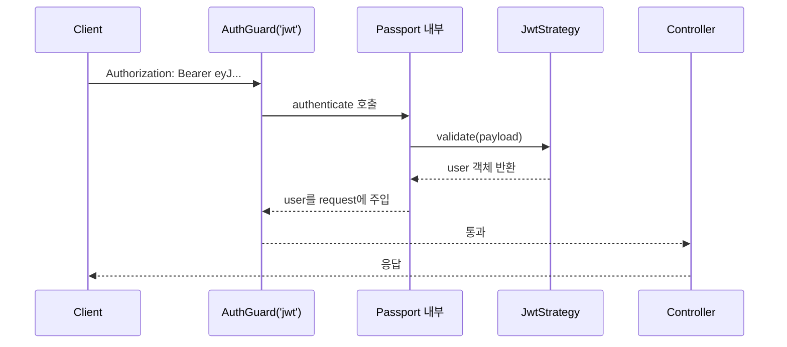
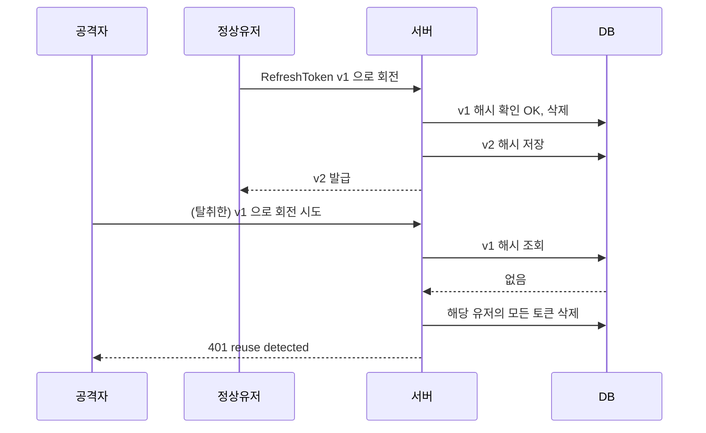

# NestJS 인증 - JWT와 Passport

실무에서 NestJS 인증을 구성할 때 사실상 표준은 `@nestjs/passport` + `passport-jwt` 조합이다. 세션 기반 인증을 안 쓰는 이유는 단순하다. 스케일아웃할 때 세션 저장소(Redis 등)가 또 하나의 장애 포인트가 되고, 모바일 앱·여러 프론트엔드와 같이 쓰기 애매하기 때문이다. 그래서 stateless JWT로 가되, 토큰 탈취 대응을 위해 RefreshToken을 DB에 저장해 관리하는 하이브리드 구조를 많이 쓴다.

이 문서는 그 구조를 실제로 만들어본 경험 기준으로 설명한다. 문서용 예제가 아니라, 프로덕션에서 발견되는 문제들—예를 들면 "왜 만료된 토큰이 여전히 먹히는 것 같지?", "RefreshToken 돌려쓰기 공격은 어떻게 막지?" 같은—을 다룬다.

## Passport Strategy 구조 이해

Passport는 Express 시절부터 내려오는 인증 미들웨어다. 핵심 개념은 Strategy 하나다. Strategy는 "어떤 방식으로 자격증명을 꺼내서 어떻게 검증할지"를 정의하는 클래스다. JWT Strategy라면 "요청 헤더에서 Bearer 토큰을 꺼내 서명 검증하고 payload를 꺼낸다"가 된다. LocalStrategy는 "email/password를 받아 DB와 비교한다"가 된다.

NestJS의 `@nestjs/passport`는 이 Passport를 DI 컨테이너에 올리기 위한 얇은 래퍼다. `PassportStrategy(Strategy)` 를 상속하면 NestJS 모듈 시스템 안에서 Strategy가 Provider로 등록되고, `AuthGuard('jwt')` 같은 가드가 내부적으로 이 Strategy를 호출한다.



여기서 중요한 포인트가 있다. `validate()` 메서드가 반환한 값이 그대로 `request.user`에 들어간다. 그래서 이 메서드에서 DB를 한 번 조회해서 유저 entity를 리턴할지, 아니면 payload에 담긴 id만 리턴할지는 성능과 직결된다. 요청마다 DB 조회가 붙으면 RPS가 높은 API에서 DB 부하가 올라간다. 실무에서는 보통 payload의 필수 정보만으로 `{ id, email, role }` 같은 slim user를 반환하고, 필요한 API에서만 별도로 entity를 조회한다.

## 모듈 셋업

`AuthModule`은 `PassportModule`과 `JwtModule`을 import해서 구성한다. `JwtModule.registerAsync`를 쓰는 이유는 비밀키를 환경변수에서 꺼내야 하기 때문이다. 하드코딩은 절대 안 된다. `.env` 유출이 곧 전체 토큰 위조로 직결된다.

```typescript
// auth.module.ts
import { Module } from '@nestjs/common';
import { PassportModule } from '@nestjs/passport';
import { JwtModule } from '@nestjs/jwt';
import { ConfigModule, ConfigService } from '@nestjs/config';

@Module({
  imports: [
    PassportModule.register({ defaultStrategy: 'jwt' }),
    JwtModule.registerAsync({
      imports: [ConfigModule],
      inject: [ConfigService],
      useFactory: (config: ConfigService) => ({
        secret: config.get<string>('JWT_ACCESS_SECRET'),
        signOptions: {
          expiresIn: config.get<string>('JWT_ACCESS_EXPIRES_IN', '15m'),
          issuer: config.get<string>('JWT_ISSUER'),
        },
      }),
    }),
  ],
  providers: [AuthService, JwtStrategy, JwtRefreshStrategy],
  controllers: [AuthController],
  exports: [AuthService],
})
export class AuthModule {}
```

AccessToken과 RefreshToken은 비밀키를 분리하는 게 원칙이다. AccessToken 키가 유출돼도 RefreshToken은 살아있어야 한다. 그래서 `JwtStrategy`는 AccessToken secret으로, `JwtRefreshStrategy`는 별도 secret으로 검증한다. 그리고 RefreshToken Strategy는 쿠키에서 읽고 AccessToken Strategy는 Authorization 헤더에서 읽는다. 이렇게 분리하면 XSS로 Authorization 헤더를 가로채도 RefreshToken은 httpOnly 쿠키에 있어서 JS로 못 읽는다.

## JWT AccessToken Strategy

AccessToken Strategy는 요청이 올 때마다 실행된다. 토큰 만료가 짧기 때문에(보통 15분~1시간) 이 Strategy에서는 DB 조회를 피해야 한다.

```typescript
// jwt.strategy.ts
import { Injectable, UnauthorizedException } from '@nestjs/common';
import { PassportStrategy } from '@nestjs/passport';
import { ExtractJwt, Strategy } from 'passport-jwt';
import { ConfigService } from '@nestjs/config';

export interface JwtPayload {
  sub: string;      // user id
  email: string;
  role: string;
  iat: number;
  exp: number;
}

@Injectable()
export class JwtStrategy extends PassportStrategy(Strategy, 'jwt') {
  constructor(config: ConfigService) {
    super({
      jwtFromRequest: ExtractJwt.fromAuthHeaderAsBearerToken(),
      ignoreExpiration: false,
      secretOrKey: config.get<string>('JWT_ACCESS_SECRET'),
      issuer: config.get<string>('JWT_ISSUER'),
    });
  }

  async validate(payload: JwtPayload) {
    if (!payload.sub) {
      throw new UnauthorizedException('invalid token payload');
    }
    return {
      id: payload.sub,
      email: payload.email,
      role: payload.role,
    };
  }
}
```

`ignoreExpiration: false`는 기본값이지만 명시적으로 써두는 게 좋다. 토큰 만료 검증을 실수로 꺼두면 보안 사고다. `issuer` 검증을 넣어두면 다른 환경(스테이징, 개발) 토큰이 프로덕션으로 넘어오는 실수를 막을 수 있다. 실제로 개발자가 로컬 토큰을 그대로 프로덕션에서 테스트하다가 발생하는 혼란을 이거 하나로 차단한다.

한 가지 자주 놓치는 건 `clockTolerance` 옵션이다. 서버 시계가 NTP로 동기화돼도 수백 ms 오차는 있다. 토큰 발급 직후 다른 서버에서 검증할 때 "아직 유효하지 않음(nbf)" 에러가 나는 경우가 있다. 운영하다가 간헐적으로 401이 찍히면 이걸 의심해봐야 한다.

## RefreshToken Strategy

RefreshToken은 AccessToken보다 수명이 길다(보통 7~30일). 따라서 유출 위험이 상대적으로 크고, DB에 저장해서 서버 측에서 무효화할 수 있어야 한다. 순수 stateless로는 RefreshToken을 안전하게 관리할 수 없다.

```typescript
// jwt-refresh.strategy.ts
import { Injectable, UnauthorizedException } from '@nestjs/common';
import { PassportStrategy } from '@nestjs/passport';
import { ExtractJwt, Strategy } from 'passport-jwt';
import { Request } from 'express';
import { ConfigService } from '@nestjs/config';
import { AuthService } from './auth.service';

@Injectable()
export class JwtRefreshStrategy extends PassportStrategy(Strategy, 'jwt-refresh') {
  constructor(
    config: ConfigService,
    private readonly authService: AuthService,
  ) {
    super({
      jwtFromRequest: ExtractJwt.fromExtractors([
        (req: Request) => req?.cookies?.['refresh_token'] ?? null,
      ]),
      ignoreExpiration: false,
      secretOrKey: config.get<string>('JWT_REFRESH_SECRET'),
      passReqToCallback: true,
    });
  }

  async validate(req: Request, payload: JwtPayload) {
    const refreshToken = req.cookies?.['refresh_token'];
    if (!refreshToken) {
      throw new UnauthorizedException('refresh token missing');
    }

    const isValid = await this.authService.validateRefreshToken(
      payload.sub,
      refreshToken,
    );
    if (!isValid) {
      throw new UnauthorizedException('refresh token revoked');
    }

    return { id: payload.sub, email: payload.email, role: payload.role };
  }
}
```

`passReqToCallback: true`를 쓰는 이유는 쿠키에 있는 원본 토큰 문자열을 validate 안에서 DB 저장본과 비교하기 위해서다. DB에는 원본을 그대로 저장하지 않고 bcrypt/argon2로 해시해서 저장한다. 그래야 DB 덤프가 유출돼도 당장 RefreshToken으로 써먹을 수 없다.

## 토큰 발급과 회전

로그인 시 AccessToken + RefreshToken을 발급하고, RefreshToken은 해시해서 `user_refresh_tokens` 테이블에 저장한다. 한 유저가 여러 디바이스에서 로그인할 수 있으므로 토큰은 유저당 N개를 허용한다. 각 레코드는 `(userId, tokenHash, deviceId, expiresAt, createdAt)`을 가진다.

```typescript
// auth.service.ts (발췌)
@Injectable()
export class AuthService {
  constructor(
    private readonly jwtService: JwtService,
    private readonly config: ConfigService,
    private readonly refreshTokenRepo: RefreshTokenRepository,
    private readonly userRepo: UserRepository,
  ) {}

  async login(user: User, deviceId: string) {
    const payload = { sub: user.id, email: user.email, role: user.role };

    const accessToken = await this.jwtService.signAsync(payload);
    const refreshToken = await this.jwtService.signAsync(payload, {
      secret: this.config.get('JWT_REFRESH_SECRET'),
      expiresIn: this.config.get('JWT_REFRESH_EXPIRES_IN', '14d'),
    });

    const hashed = await argon2.hash(refreshToken);
    await this.refreshTokenRepo.save({
      userId: user.id,
      tokenHash: hashed,
      deviceId,
      expiresAt: new Date(Date.now() + 14 * 24 * 60 * 60 * 1000),
    });

    return { accessToken, refreshToken };
  }

  async rotate(userId: string, oldRefreshToken: string, deviceId: string) {
    const records = await this.refreshTokenRepo.findByUserAndDevice(userId, deviceId);

    let matched: RefreshTokenRecord | null = null;
    for (const r of records) {
      if (await argon2.verify(r.tokenHash, oldRefreshToken)) {
        matched = r;
        break;
      }
    }

    if (!matched) {
      // 일치하는 레코드가 없다는 건 이미 회전된 토큰이 다시 왔다는 뜻.
      // 탈취 가능성이 있으므로 해당 유저의 모든 세션을 폐기.
      await this.refreshTokenRepo.deleteAllByUser(userId);
      throw new UnauthorizedException('reuse detected');
    }

    await this.refreshTokenRepo.delete(matched.id);
    return this.login({ id: userId } as User, deviceId);
  }
}
```

`rotate` 메서드의 핵심은 **재사용 탐지(reuse detection)** 다. RefreshToken은 한 번 쓰면 즉시 DB에서 삭제하고 새 토큰을 발급한다. 만약 공격자가 탈취한 구 토큰으로 다시 요청하면, DB에 해당 해시가 없으므로 "이미 소비된 토큰"임이 드러난다. 이때는 해당 유저의 모든 RefreshToken을 폐기해 강제 로그아웃시킨다. 정상 유저에겐 불편이지만 탈취 상황에서 공격자를 끊어내는 확실한 방법이다.



이런 방식은 토큰 탈취를 100% 막지는 못하지만, "언젠가 드러난다"는 점이 중요하다. 공격자가 토큰을 쓰든 정상 유저가 쓰든 둘 중 하나는 회전 후 재사용 상태가 되기 때문에, 탐지 시점에 전체 세션을 끊을 수 있다.

## AuthGuard 구현

기본 `AuthGuard('jwt')`를 그대로 써도 되지만, 실무에서는 보통 커스텀해서 쓴다. 이유는 두 가지다. 첫째, 특정 라우트를 인증 면제(public)로 선언하고 싶다. 둘째, 토큰 만료와 토큰 무효(서명 오류)를 다른 HTTP 상태/에러 포맷으로 내려주고 싶다.

```typescript
// jwt-auth.guard.ts
import {
  ExecutionContext,
  Injectable,
  UnauthorizedException,
} from '@nestjs/common';
import { AuthGuard } from '@nestjs/passport';
import { Reflector } from '@nestjs/core';
import { TokenExpiredError } from 'jsonwebtoken';
import { IS_PUBLIC_KEY } from './public.decorator';

@Injectable()
export class JwtAuthGuard extends AuthGuard('jwt') {
  constructor(private reflector: Reflector) {
    super();
  }

  canActivate(context: ExecutionContext) {
    const isPublic = this.reflector.getAllAndOverride<boolean>(IS_PUBLIC_KEY, [
      context.getHandler(),
      context.getClass(),
    ]);
    if (isPublic) return true;
    return super.canActivate(context);
  }

  handleRequest(err: any, user: any, info: any) {
    if (info instanceof TokenExpiredError) {
      throw new UnauthorizedException({
        code: 'TOKEN_EXPIRED',
        message: 'access token expired',
      });
    }
    if (err || !user) {
      throw err || new UnauthorizedException({
        code: 'TOKEN_INVALID',
        message: 'invalid token',
      });
    }
    return user;
  }
}
```

`handleRequest`에서 만료와 위조를 구분하는 게 프론트엔드 입장에서 중요하다. `TOKEN_EXPIRED`를 받으면 RefreshToken으로 회전을 시도하면 되고, `TOKEN_INVALID`를 받으면 바로 로그아웃 처리해야 한다. 이 구분이 없으면 프론트에서 무한 루프에 빠지거나, 서명이 틀린 토큰으로 회전을 계속 시도해서 의미 없는 트래픽을 만든다.

`IS_PUBLIC_KEY`는 커스텀 데코레이터로 정의한다.

```typescript
// public.decorator.ts
import { SetMetadata } from '@nestjs/common';

export const IS_PUBLIC_KEY = 'isPublic';
export const Public = () => SetMetadata(IS_PUBLIC_KEY, true);
```

그리고 `JwtAuthGuard`를 전역 Guard로 등록하면, 기본적으로 모든 라우트가 인증 필요 상태가 되고 `@Public()`이 붙은 라우트만 통과된다. 화이트리스트보다 블랙리스트 방식이 빠뜨리는 라우트를 줄인다.

```typescript
// app.module.ts
{
  provide: APP_GUARD,
  useClass: JwtAuthGuard,
}
```

"인증 붙이는 걸 깜빡했다"가 가장 흔한 보안 실수다. 전역 Guard + `@Public()` 구조로 가면 이걸 구조적으로 막을 수 있다.

## 인증 사용자 추출 데코레이터

컨트롤러에서 `request.user`를 매번 꺼내 쓰는 건 지저분하다. NestJS에서는 `createParamDecorator`로 이걸 깔끔하게 뽑을 수 있다.

```typescript
// current-user.decorator.ts
import { createParamDecorator, ExecutionContext } from '@nestjs/common';

export interface AuthUser {
  id: string;
  email: string;
  role: string;
}

export const CurrentUser = createParamDecorator(
  (data: keyof AuthUser | undefined, ctx: ExecutionContext): AuthUser | any => {
    const request = ctx.switchToHttp().getRequest();
    const user = request.user as AuthUser;
    return data ? user?.[data] : user;
  },
);
```

사용할 때는 이렇게 된다.

```typescript
@Controller('posts')
export class PostsController {
  @Post()
  create(@CurrentUser() user: AuthUser, @Body() dto: CreatePostDto) {
    return this.postsService.create(user.id, dto);
  }

  @Get('me')
  me(@CurrentUser('id') userId: string) {
    return this.usersService.findById(userId);
  }
}
```

`@CurrentUser('id')`처럼 특정 필드만 뽑는 옵션을 넣어두면 컨트롤러가 더 명확해진다. 타입을 `AuthUser`로 좁혀두면 에디터 자동완성도 따라온다.

한 가지 주의할 점은, `@CurrentUser()`는 `JwtAuthGuard`가 먼저 실행돼야만 동작한다는 거다. 전역 Guard로 등록해두면 이게 자연스럽지만, 아니면 `@UseGuards(JwtAuthGuard)`를 반드시 같이 붙여야 한다. 가드 없이 `@CurrentUser()`만 쓰면 `undefined`가 주입되는 버그가 생긴다. 로컬에서 동작하는 것처럼 보이다가 실제 요청에서 401 없이 그냥 `undefined.id`로 터지는 경우가 있으니 주의해야 한다.

## 토큰 탈취 대응 실무

토큰 탈취는 크게 세 경로로 발생한다. XSS, 중간자 공격, 클라이언트 저장소 유출. 각 경로에 대응하는 방법이 다르다.

**XSS 대응**은 RefreshToken을 `httpOnly; Secure; SameSite=Strict` 쿠키에 넣는 것에서 시작한다. AccessToken은 메모리(자바스크립트 변수)에 두고, localStorage에는 절대 넣지 않는다. localStorage는 XSS 한 번으로 다 털리는 저장소다. 이 원칙만 지켜도 대부분의 XSS 기반 토큰 탈취를 막는다.

```typescript
// auth.controller.ts 발췌
@Post('login')
@Public()
async login(
  @Body() dto: LoginDto,
  @Res({ passthrough: true }) res: Response,
) {
  const user = await this.authService.validateCredentials(dto);
  const { accessToken, refreshToken } = await this.authService.login(
    user,
    dto.deviceId,
  );

  res.cookie('refresh_token', refreshToken, {
    httpOnly: true,
    secure: true,
    sameSite: 'strict',
    path: '/auth/refresh',
    maxAge: 14 * 24 * 60 * 60 * 1000,
  });

  return { accessToken };
}
```

`path: '/auth/refresh'`를 지정하면 그 경로로만 쿠키가 붙는다. 다른 API 요청에 굳이 RefreshToken을 실어 보내지 않아도 돼서 노출 범위를 줄인다.

**중간자 공격**은 HTTPS 강제와 HSTS 헤더로 막는다. NestJS 레벨이 아니라 인프라 레벨 문제지만, 개발 환경에서 HTTPS를 안 쓰다가 프로덕션에서 쿠키에 `Secure` 플래그가 붙어 로그인이 안 되는 증상은 흔하다. 로컬에서도 mkcert 같은 도구로 HTTPS를 쓰는 게 장기적으로 편하다.

**클라이언트 저장소 유출**은 앞서 말한 RefreshToken 회전과 재사용 탐지로 대응한다. 여기에 추가로 디바이스 핑거프린팅을 붙이기도 한다. 로그인 시 UA + IP 해시를 토큰 payload나 DB에 저장해두고, 회전 시 이 값이 크게 바뀌면 추가 인증을 요구하는 식이다. 다만 이건 오탐이 많아서(모바일 네트워크 전환, VPN 사용) 민감한 서비스(금융, 관리자 페이지)에만 쓰는 편이 낫다.

## 토큰 만료 처리

프론트엔드에서 AccessToken이 만료되면 RefreshToken으로 회전한다. 이 흐름에서 두 가지 실무 이슈가 있다.

**동시 요청 문제**. 만료된 AccessToken을 가진 상태에서 여러 API를 동시에 호출하면, 각 요청마다 401이 터지고 각자 RefreshToken 회전을 시도한다. 첫 번째 회전이 성공해서 RefreshToken v1이 v2로 바뀌면, 나머지 요청들은 v1으로 회전을 시도하다가 `reuse detected`에 걸려 전체 세션이 날아간다. 실제로 운영하다가 "이상하게 가끔 강제 로그아웃된다" 제보가 들어오면 이 패턴을 의심해야 한다.

해결은 프론트엔드 쪽 HTTP 클라이언트에서 회전을 뮤텍스로 잠그는 거다. 한 번에 하나의 회전 요청만 나가고, 나머지 요청은 그 회전이 끝날 때까지 대기했다가 새 AccessToken으로 재시도한다. axios + axios-auth-refresh, fetch + 커스텀 래퍼 같은 조합으로 구현한다. 서버 쪽에서도 같은 RefreshToken으로 동시 회전이 들어올 수 있다는 걸 감안해 트랜잭션/행 잠금을 쓰는 게 안전하다.

**서버 시계 차이**. 여러 인스턴스를 띄운 상태에서 한 서버가 발급한 토큰을 다른 서버가 검증하는 구조라면, 시계 오차로 "이미 만료된" 취급을 받는 경우가 있다. 특히 컨테이너가 재시작 직후나 VM 일시 정지 후 복구 시에 발생한다. 모니터링할 때 401 비율이 특정 서버에서만 튀면 시계부터 확인한다.

**로그아웃과 블랙리스트**. 순수 stateless JWT에서는 "발급된 AccessToken을 서버에서 즉시 폐기"가 구조적으로 불가능하다. 15분짜리 토큰이면 로그아웃 후에도 최대 15분간 그 토큰으로 요청이 들어올 수 있다. 대부분의 경우 이 정도는 허용하지만, 관리자 권한 회수처럼 즉시 반영이 필요한 케이스는 Redis에 짧은 TTL로 블랙리스트를 둬야 한다. 유저 전체 토큰을 한 번에 날리려면 payload에 `tokenVersion`을 넣고 DB의 `user.tokenVersion`과 비교해 일치하지 않으면 401을 내는 방식이 간단하다. 이건 로그인할 때 DB를 안 타도 되지만, 로그아웃/비밀번호 변경 시점에 tokenVersion을 증가시키면 전 세션이 깔끔하게 무효화된다.

## 정리하며

JWT + Passport 조합은 처음 보면 간단해 보이지만, 프로덕션에서 안정적으로 돌리려면 RefreshToken 저장소, 회전, 재사용 탐지, 동시 요청 처리, 시계 오차, 즉시 폐기 같은 주제를 전부 건드려야 한다. 문서로 읽을 때보다 실제 유저 대응하면서 하나씩 붙이게 되는 경우가 많다.

핵심은 "stateless하지만 필요한 부분만 stateful하게"다. AccessToken은 짧고 stateless, RefreshToken은 DB로 관리, 긴급 폐기 경로는 tokenVersion이나 Redis 블랙리스트로. 이 구조를 잡아두면 어지간한 보안 요구사항에 대응할 수 있다.
