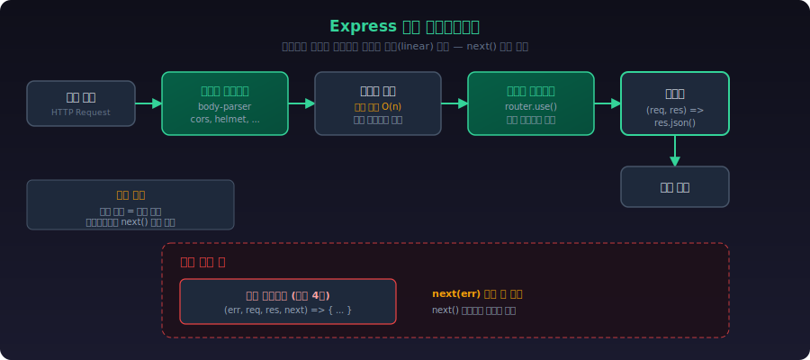
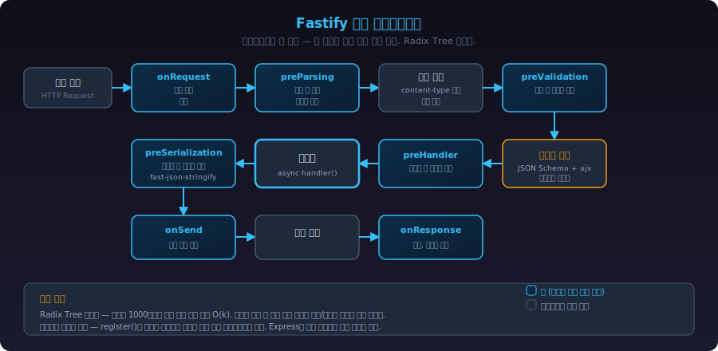
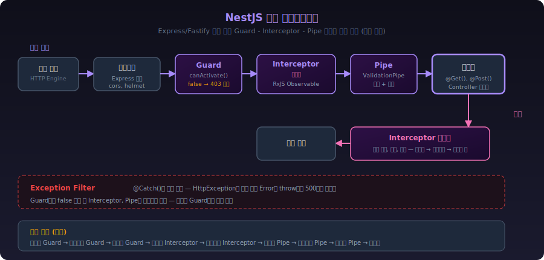
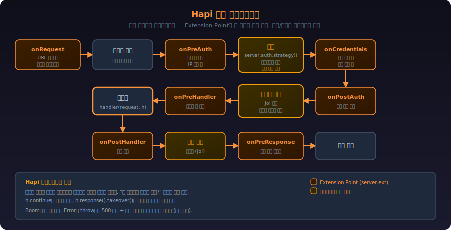
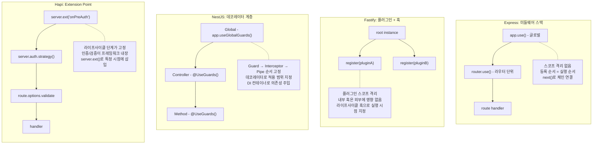
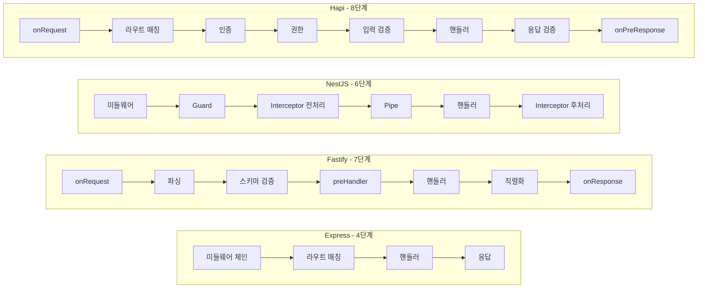
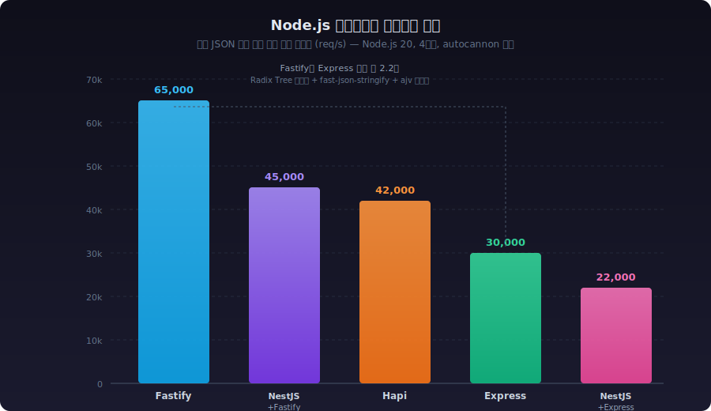
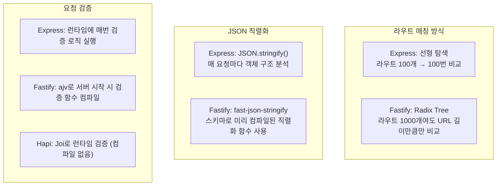

# Node.js 웹 프레임워크 비교: Express vs Fastify vs NestJS vs Hapi

## 각 프레임워크가 요청을 처리하는 방식

프레임워크를 고르기 전에, 요청이 들어왔을 때 내부에서 어떤 순서로 처리되는지부터 알아야 한다. 겉으로는 비슷해 보여도 내부 구조가 다르기 때문에, 디버깅할 때나 성능 이슈를 추적할 때 이 차이가 드러난다.

### Express 요청 처리 흐름

Express는 미들웨어 스택을 순서대로 타고 내려가는 구조다. `next()`를 호출하지 않으면 거기서 멈춘다.



핵심은 **선형(linear) 처리**라는 점이다. 미들웨어가 20개 붙어있으면 요청마다 20개를 순서대로 거친다. 라우트 매칭도 등록 순서대로 순회하기 때문에, 라우트가 수백 개 되면 뒤쪽 라우트의 응답 시간이 느려질 수 있다.

### Fastify 요청 처리 흐름

Fastify는 라이프사이클 훅(Hook) 기반이다. 요청 처리 단계가 명확하게 나뉘어 있고, 각 단계에 훅을 걸 수 있다.



Fastify의 라우트 매칭은 `find-my-way`라는 Radix Tree 기반 라우터를 쓴다. 라우트가 1000개여도 매칭 시간이 거의 일정하다. Express의 선형 탐색과 비교하면 라우트가 많을수록 차이가 벌어진다.

스키마 검증도 특이한데, JSON Schema를 등록하면 서버 시작 시점에 `ajv`로 검증 함수를 컴파일해둔다. 런타임에 매번 스키마를 파싱하는 게 아니라 미리 컴파일된 함수를 호출하는 방식이라 검증 속도가 빠르다.

### NestJS 요청 처리 흐름

NestJS는 Express(또는 Fastify)를 내부 HTTP 엔진으로 쓰면서, 그 위에 자체 레이어를 얹는다.



주의할 점은, NestJS의 Guard → Interceptor → Pipe 순서가 고정되어 있다는 것이다. Express 미들웨어처럼 자유롭게 순서를 바꿀 수 없다. 이 구조를 모르고 미들웨어에서 해야 할 일을 Guard에서 하거나, Pipe에서 해야 할 일을 Interceptor에서 하면 의도대로 동작하지 않는 경우가 생긴다.

### Hapi 요청 처리 흐름

Hapi는 요청 라이프사이클을 가장 세분화해서 관리한다. Extension Point라는 개념으로 각 단계에 로직을 끼워넣는다.



Hapi의 특징은 인증과 검증이 프레임워크 레벨에서 라이프사이클에 내장되어 있다는 것이다. Express에서는 `passport` 미들웨어를 끼워넣는 거고, Hapi에서는 인증이 라이프사이클의 정해진 단계에서 실행된다. 인증 로직의 실행 시점이 보장되기 때문에, "이 미들웨어 순서가 맞나?" 하고 고민할 일이 줄어든다.

---

## 미들웨어 체인 동작 방식 비교

프레임워크마다 요청 처리 파이프라인에 로직을 끼워넣는 방식이 다르다. 이름은 미들웨어, 훅, 플러그인으로 다르지만 하는 일은 비슷하다. 다만 동작 방식의 차이가 실제 코드 작성에 큰 영향을 준다.

### 플러그인/미들웨어 구조 비교

각 프레임워크가 확장 로직을 어떤 구조로 관리하는지 비교한 것이다. 스코프 격리가 되는지, 실행 순서를 프레임워크가 보장하는지가 핵심 차이점이다.



| 항목 | Express | Fastify | NestJS | Hapi |
|------|---------|---------|--------|------|
| 확장 방식 | 미들웨어 | 플러그인 + 훅 | 데코레이터 | Extension Point |
| 스코프 격리 | 없음 (Router로 수동 분리) | 플러그인 단위 자동 격리 | 모듈 단위 | 없음 (서버 전역) |
| 실행 순서 | 등록 순서 (개발자 책임) | 라이프사이클 단계별 고정 | Guard→Interceptor→Pipe 고정 | 라이프사이클 단계별 고정 |
| 의존성 주입 | 없음 | 없음 (데코레이터로 공유) | DI 컨테이너 내장 | 없음 (server.methods로 공유) |

### Express: next()와 미들웨어 스택

Express 미들웨어는 `(req, res, next)` 시그니처를 쓴다. `next()`를 호출하면 다음 미들웨어로 넘어가고, `next(err)`를 호출하면 에러 미들웨어로 건너뛴다.

```javascript
// 인증 미들웨어
function authMiddleware(req, res, next) {
  const token = req.headers.authorization;
  if (!token) {
    return res.status(401).json({ error: 'No token' });
  }
  try {
    req.user = jwt.verify(token, SECRET);
    next(); // 다음 미들웨어로
  } catch (e) {
    next(e); // 에러 미들웨어로 점프
  }
}

// 로깅 미들웨어
function logger(req, res, next) {
  const start = Date.now();
  res.on('finish', () => {
    console.log(`${req.method} ${req.url} ${res.statusCode} ${Date.now() - start}ms`);
  });
  next();
}

// 등록 순서가 실행 순서
app.use(logger);        // 1번
app.use(authMiddleware); // 2번
app.use('/api', apiRouter); // 3번
```

Express에서 자주 겪는 문제:

```javascript
// 순서 실수 — body-parser를 라우트 뒤에 등록하면 req.body가 undefined
app.post('/users', createUser);   // req.body가 undefined!
app.use(express.json());          // 이미 늦음

// next()를 빼먹으면 요청이 멈춤
app.use((req, res, next) => {
  console.log('여기서 멈춤');
  // next() 호출 안 함 → 클라이언트는 응답 없이 타임아웃
});
```

### Fastify: 라이프사이클 훅과 플러그인 캡슐화

Fastify는 미들웨어 대신 훅과 플러그인을 쓴다. 훅은 라이프사이클의 특정 단계에 걸리기 때문에 실행 시점이 명확하다.

```javascript
// 인증 훅 — onRequest 단계에서 실행
fastify.addHook('onRequest', async (request, reply) => {
  const token = request.headers.authorization;
  if (!token) {
    reply.code(401).send({ error: 'No token' });
    return; // return만 하면 됨, next() 불필요
  }
  try {
    request.user = jwt.verify(token, SECRET);
  } catch (e) {
    reply.code(401).send({ error: 'Invalid token' });
  }
});

// 로깅 훅 — onResponse 단계에서 실행 (응답 완료 후)
fastify.addHook('onResponse', async (request, reply) => {
  console.log(`${request.method} ${request.url} ${reply.statusCode} ${reply.elapsedTime}ms`);
});
```

Fastify의 플러그인 캡슐화(encapsulation)는 Express에 없는 개념이다:

```javascript
// 플러그인 안에서 등록한 훅은 해당 플러그인 스코프에서만 동작
fastify.register(async function adminPlugin(instance) {
  // 이 훅은 adminPlugin 안의 라우트에서만 실행됨
  instance.addHook('onRequest', async (request, reply) => {
    if (!request.user.isAdmin) {
      reply.code(403).send({ error: 'Admin only' });
    }
  });

  instance.get('/admin/dashboard', async () => {
    return { data: 'admin stuff' };
  });
}, { prefix: '/api' });

// 이 라우트에는 위의 admin 훅이 적용되지 않음
fastify.get('/public', async () => {
  return { data: 'public' };
});
```

Express에서는 미들웨어 적용 범위를 라우터 단위로 나누려면 `express.Router()`를 따로 만들고 경로를 잘 분리해야 하는데, Fastify는 플러그인 등록만으로 스코프가 격리된다.

### NestJS: 데코레이터 기반 계층 구조

NestJS는 Guard, Interceptor, Pipe, Filter를 데코레이터로 붙인다. 적용 범위를 글로벌, 컨트롤러, 메서드 단위로 설정할 수 있다.

```typescript
// Guard — boolean 반환으로 접근 제어
@Injectable()
export class AuthGuard implements CanActivate {
  constructor(private jwtService: JwtService) {}

  canActivate(context: ExecutionContext): boolean {
    const request = context.switchToHttp().getRequest();
    const token = request.headers.authorization?.split(' ')[1];
    if (!token) return false;
    try {
      request.user = this.jwtService.verify(token);
      return true;
    } catch {
      return false;
    }
  }
}

// Interceptor — 요청 전후 로직 (RxJS)
@Injectable()
export class LoggingInterceptor implements NestInterceptor {
  intercept(context: ExecutionContext, next: CallHandler): Observable<any> {
    const now = Date.now();
    return next.handle().pipe(
      tap(() => {
        const elapsed = Date.now() - now;
        console.log(`${context.getHandler().name} ${elapsed}ms`);
      }),
    );
  }
}

// 컨트롤러에 적용
@Controller('users')
@UseGuards(AuthGuard)                  // 이 컨트롤러 전체에 적용
@UseInterceptors(LoggingInterceptor)   // 이 컨트롤러 전체에 적용
export class UsersController {

  @Get(':id')
  @UsePipes(new ParseIntPipe())        // 이 메서드에만 적용
  findOne(@Param('id') id: number) {
    return this.usersService.findOne(id);
  }
}
```

NestJS에서 헷갈리는 부분은 실행 순서다:

```
글로벌 Guard → 컨트롤러 Guard → 메서드 Guard
  → 글로벌 Interceptor(전처리) → 컨트롤러 Interceptor → 메서드 Interceptor
    → 글로벌 Pipe → 컨트롤러 Pipe → 메서드 Pipe
      → 핸들러 실행
    → 메서드 Interceptor(후처리) → 컨트롤러 Interceptor → 글로벌 Interceptor
```

Guard에서 false를 반환하면 Interceptor와 Pipe는 실행되지 않는다. 이 순서를 모르고 Interceptor에서 인증 체크를 하면, 인증 실패해도 Guard 단계를 이미 통과한 상태라 의도와 다르게 동작한다.

### Hapi: Extension Point와 서버 메서드

Hapi는 `server.ext()`로 라이프사이클의 특정 지점에 로직을 넣는다.

```javascript
// onPreAuth — 인증 전 단계
server.ext('onPreAuth', (request, h) => {
  // IP 차단 등
  if (blockedIPs.includes(request.info.remoteAddress)) {
    return h.response({ error: 'Blocked' }).code(403).takeover();
  }
  return h.continue;
});

// 인증은 strategy로 등록
server.auth.strategy('jwt', 'jwt', {
  key: SECRET,
  validate: async (decoded) => {
    const user = await findUser(decoded.id);
    return { isValid: !!user, credentials: user };
  }
});

// 라우트에 인증 적용
server.route({
  method: 'GET',
  path: '/users/{id}',
  options: {
    auth: 'jwt',
    validate: {
      params: Joi.object({
        id: Joi.number().integer().required()
      })
    }
  },
  handler: (request, h) => {
    return findUser(request.params.id);
  }
});
```

Hapi에서 `h.continue`는 Express의 `next()`와 비슷한 역할이다. `h.response().takeover()`를 쓰면 나머지 라이프사이클을 건너뛰고 바로 응답한다.

### 요청 라이프사이클 단계 수 비교

같은 GET 요청을 처리할 때 프레임워크마다 거치는 내부 단계 수가 다르다. 단계가 많다고 나쁜 건 아니다. 단계마다 역할이 명확하면 디버깅이 쉬워진다.



Express는 단계가 적어서 진입 장벽이 낮지만, 인증이나 검증 같은 공통 로직을 미들웨어 순서로 직접 관리해야 한다. Hapi는 단계가 가장 많지만, 인증과 검증이 프레임워크 레벨에서 정해진 시점에 실행되기 때문에 순서 실수가 줄어든다.

---

## 프레임워크 간 라우팅 규칙 차이

같은 URL 패턴을 쓰더라도 프레임워크마다 문법과 동작이 다르다. 마이그레이션할 때 가장 먼저 깨지는 부분이 라우팅이다.

### 경로 파라미터 문법

```javascript
// Express
app.get('/users/:id', handler);           // :param
app.get('/files/:path(*)', handler);      // 와일드카드 (Express 5부터 문법 변경됨)

// Fastify
fastify.get('/users/:id', handler);       // Express와 동일
fastify.get('/files/*', handler);         // 와일드카드는 * 사용

// NestJS
@Get(':id')                               // 데코레이터 안에서 : 사용
@Get(':path(*)') // 와일드카드            // Express 엔진 따라감

// Hapi
server.route({ path: '/users/{id}' });    // {} 사용 — 여기서 가장 많이 실수함
server.route({ path: '/files/{path*}' }); // 와일드카드는 {param*}
```

Express에서 Hapi로 옮길 때 `:id`를 `{id}`로 전부 바꿔야 한다. 단순 치환으로 안 되는 경우도 있다:

```javascript
// Express: 선택적 파라미터
app.get('/users/:id?', handler); // /users와 /users/123 둘 다 매칭

// Hapi: 선택적 파라미터가 없음 — 라우트 2개 등록해야 함
server.route({ method: 'GET', path: '/users', handler });
server.route({ method: 'GET', path: '/users/{id}', handler });

// Fastify: 선택적 파라미터 없음 — 마찬가지로 2개 등록
fastify.get('/users', handler);
fastify.get('/users/:id', handler);
```

### 라우트 매칭 우선순위

Express는 등록 순서가 곧 우선순위다. 먼저 등록한 라우트가 먼저 매칭된다:

```javascript
// Express — 순서가 중요
app.get('/users/me', getMeHandler);      // 이게 먼저 등록되어야 함
app.get('/users/:id', getUserHandler);   // :id가 'me'도 잡아버림

// 순서 바꾸면 /users/me 요청이 getUserHandler로 감
app.get('/users/:id', getUserHandler);   // 'me'가 id로 잡힘
app.get('/users/me', getMeHandler);      // 여기까지 안 옴
```

Fastify는 Radix Tree 기반이라 등록 순서와 무관하게 정적 경로가 동적 경로보다 우선한다:

```javascript
// Fastify — 순서 무관
fastify.get('/users/:id', getUserHandler);
fastify.get('/users/me', getMeHandler);
// /users/me → getMeHandler (정적 경로 우선)
// /users/123 → getUserHandler
```

이 차이를 모르고 Express에서 Fastify로 옮기면, Express에서 의도적으로 순서로 제어하던 라우팅이 Fastify에서는 다르게 동작한다.

### 쿼리 파라미터 파싱

```javascript
// Express: qs 라이브러리 사용, 중첩 객체 지원
// GET /search?filter[name]=john&filter[age]=30
app.get('/search', (req, res) => {
  console.log(req.query);
  // { filter: { name: 'john', age: '30' } }  ← 타입은 전부 string
});

// Fastify: querystring 모듈 사용, 중첩 객체 미지원 (기본값)
// 같은 요청에 대해
fastify.get('/search', (request, reply) => {
  console.log(request.query);
  // { 'filter[name]': 'john', 'filter[age]': '30' }  ← 파싱 안 됨
});

// Fastify에서 중첩 쿼리를 쓰려면 별도 설정 필요
const fastify = require('fastify')({
  querystringParser: str => qs.parse(str)
});
```

Express에서 Fastify로 옮길 때 프론트엔드에서 `filter[name]=john` 같은 중첩 쿼리를 쓰고 있었다면, 서버 쪽에서 갑자기 파싱이 안 되는 문제가 생긴다.

---

## 에러 핸들링 구조 차이

에러 핸들링은 프레임워크마다 구조가 완전히 다르다. 마이그레이션할 때 기존 에러 처리 코드를 그대로 옮길 수 없다.

### Express: 에러 미들웨어 (4개 인자)

```javascript
// 비동기 에러 처리 — Express 4에서는 수동으로 잡아야 함
app.get('/users/:id', async (req, res, next) => {
  try {
    const user = await findUser(req.params.id);
    if (!user) {
      const err = new Error('User not found');
      err.status = 404;
      throw err;
    }
    res.json(user);
  } catch (err) {
    next(err); // 에러 미들웨어로 전달 — 빼먹으면 에러가 삼켜짐
  }
});

// 에러 미들웨어 — 인자가 4개여야 Express가 에러 미들웨어로 인식함
app.use((err, req, res, next) => {
  console.error(err.stack);
  res.status(err.status || 500).json({
    error: err.message
  });
});
```

Express 4에서 `async` 핸들러의 에러를 `try-catch`로 잡지 않으면 unhandled rejection이 된다. Express 5에서는 async 에러를 자동으로 잡아주지만, 아직 Express 4를 쓰는 프로젝트가 많다.

### Fastify: setErrorHandler와 스키마 검증 에러

```javascript
// Fastify는 async 에러를 자동으로 잡음
fastify.get('/users/:id', async (request, reply) => {
  const user = await findUser(request.params.id);
  if (!user) {
    // reply.code()만 쓰면 됨 — throw해도 자동으로 잡힘
    reply.code(404).send({ error: 'User not found' });
    return;
  }
  return user; // return만 하면 자동으로 JSON 응답
});

// 에러 핸들러
fastify.setErrorHandler((error, request, reply) => {
  // 스키마 검증 에러는 error.validation에 상세 정보가 들어옴
  if (error.validation) {
    reply.code(400).send({
      error: 'Validation failed',
      details: error.validation
    });
    return;
  }
  reply.code(error.statusCode || 500).send({
    error: error.message
  });
});
```

Fastify에서 주의할 점: `reply.send()`를 호출한 뒤에 `return`을 빼먹으면 핸들러가 계속 실행된다. Express의 `return res.json()`과 같은 패턴을 써야 한다.

### NestJS: Exception Filter

```typescript
// 커스텀 예외
export class UserNotFoundException extends HttpException {
  constructor(id: number) {
    super(`User ${id} not found`, HttpStatus.NOT_FOUND);
  }
}

// 핸들러에서는 throw만 하면 됨
@Get(':id')
async findOne(@Param('id') id: number) {
  const user = await this.usersService.findOne(id);
  if (!user) {
    throw new UserNotFoundException(id);
  }
  return user;
}

// 커스텀 Exception Filter
@Catch()
export class AllExceptionsFilter implements ExceptionFilter {
  catch(exception: unknown, host: ArgumentsHost) {
    const ctx = host.switchToHttp();
    const response = ctx.getResponse();

    let status = 500;
    let message = 'Internal server error';

    if (exception instanceof HttpException) {
      status = exception.getStatus();
      message = exception.message;
    }

    response.status(status).json({
      statusCode: status,
      message: message,
      timestamp: new Date().toISOString(),
    });
  }
}
```

NestJS의 에러 처리 흐름에서 자주 실수하는 부분: `HttpException`이 아닌 일반 `Error`를 throw하면 기본 Exception Filter가 500으로 처리한다. Express에서 `err.status = 404`로 쓰던 패턴은 NestJS에서 동작하지 않는다.

### Hapi: Boom 객체

```javascript
const Boom = require('@hapi/boom');

server.route({
  method: 'GET',
  path: '/users/{id}',
  handler: async (request, h) => {
    const user = await findUser(request.params.id);
    if (!user) {
      // Boom 객체를 throw — 상태 코드와 메시지가 자동으로 설정됨
      throw Boom.notFound(`User ${request.params.id} not found`);
    }
    return user;
  }
});

// onPreResponse에서 에러 응답 커스터마이징
server.ext('onPreResponse', (request, h) => {
  const response = request.response;
  if (response.isBoom) {
    // Boom 에러면 포맷 변경
    const error = response;
    return h.response({
      error: error.output.payload.error,
      message: error.message,
      statusCode: error.output.statusCode
    }).code(error.output.statusCode);
  }
  return h.continue;
});
```

Hapi에서 Boom을 안 쓰고 일반 Error를 throw하면 500 에러로 처리되면서 에러 메시지가 클라이언트에 노출되지 않는다 (보안상 의도된 동작). Express에서는 에러 메시지를 그대로 응답에 넣는 코드를 흔히 쓰는데, Hapi로 옮기면 에러 메시지가 사라지는 것처럼 보일 수 있다.

---

## 마이그레이션 시 실제로 깨지는 부분

프레임워크를 바꿀 때 "라우트 문법 바꾸면 되겠지" 싶지만, 실제로는 예상 못한 곳에서 문제가 터진다.

### Express → Fastify 마이그레이션

**1. req/res 객체가 다르다**

Express의 `req`, `res`는 Node.js 기본 `http.IncomingMessage`/`http.ServerResponse`를 확장한 객체다. Fastify의 `request`, `reply`는 Fastify 자체 래퍼 객체다.

```javascript
// Express에서 자주 쓰는 패턴
app.get('/download', (req, res) => {
  res.download('/path/to/file'); // Express 전용 메서드
  res.redirect(301, '/new-url'); // Express 전용
  res.sendFile('/path/to/file'); // Express 전용
});

// Fastify에서는 이 메서드들이 없다
fastify.get('/download', (request, reply) => {
  // reply.download()은 없음 → @fastify/static 플러그인 필요
  // reply.redirect(301, '/new-url') 대신:
  reply.redirect('/new-url'); // 기본 302
  reply.redirect(301, '/new-url'); // Fastify 4에서는 이 문법도 됨
});
```

**2. 미들웨어 호환성**

Express 미들웨어를 Fastify에서 쓰려면 `@fastify/middie` 또는 `@fastify/express` 플러그인이 필요하다. 모든 미들웨어가 호환되는 건 아니다.

```javascript
// Express 미들웨어를 Fastify에서 사용
await fastify.register(require('@fastify/middie'));
fastify.use(require('cors')()); // Express cors 미들웨어

// 동작은 하지만 Fastify의 캡슐화 시스템과 충돌할 수 있다
// 가능하면 Fastify 전용 플러그인(@fastify/cors)을 쓰는 게 낫다
```

**3. 응답 전송 방식**

```javascript
// Express — res.json()을 호출해야 응답이 감
app.get('/users', (req, res) => {
  res.json({ users: [] }); // 명시적 전송
});

// Fastify — return만 하면 자동 전송
fastify.get('/users', async (request, reply) => {
  return { users: [] }; // 자동으로 JSON 직렬화 후 전송
});

// 둘 다 쓰면 에러 — reply.send()와 return을 동시에 쓰지 말 것
fastify.get('/users', async (request, reply) => {
  reply.send({ users: [] });
  return { users: [] }; // FST_ERR_REP_ALREADY_SENT 에러
});
```

### Express → NestJS 마이그레이션

**1. 구조 변환이 가장 크다**

Express의 라우트 파일 하나가 NestJS에서는 Controller + Service + Module 3개 파일이 된다.

```javascript
// Express: routes/users.js (하나의 파일)
const router = express.Router();
router.get('/', async (req, res) => {
  const users = await db.query('SELECT * FROM users');
  res.json(users);
});
router.post('/', async (req, res) => {
  const user = await db.query('INSERT INTO users ...', req.body);
  res.status(201).json(user);
});
module.exports = router;
```

```typescript
// NestJS: 3개 파일로 분리됨

// users.controller.ts
@Controller('users')
export class UsersController {
  constructor(private usersService: UsersService) {}

  @Get()
  findAll() { return this.usersService.findAll(); }

  @Post()
  create(@Body() dto: CreateUserDto) { return this.usersService.create(dto); }
}

// users.service.ts
@Injectable()
export class UsersService {
  findAll() { return db.query('SELECT * FROM users'); }
  create(dto: CreateUserDto) { return db.query('INSERT ...', dto); }
}

// users.module.ts
@Module({
  controllers: [UsersController],
  providers: [UsersService],
})
export class UsersModule {}
```

단순히 코드를 옮기는 게 아니라 구조를 재설계해야 한다. 라우트 50개짜리 Express 앱이면 상당한 작업량이다.

**2. req 객체 접근 방식**

```javascript
// Express — req에 직접 접근
app.get('/users', (req, res) => {
  const page = req.query.page;
  const token = req.headers.authorization;
  const ip = req.ip;
});
```

```typescript
// NestJS — 데코레이터로 추출
@Get()
findAll(
  @Query('page') page: string,
  @Headers('authorization') token: string,
  @Ip() ip: string,
) {
  // ...
}

// 또는 @Req()로 Express req 객체를 직접 가져올 수 있지만
// 이러면 Express에 의존하게 되어 Fastify 엔진으로 전환이 안 됨
@Get()
findAll(@Req() req: Request) {
  // 비추 — Express 의존성 생김
}
```

### Express → Hapi 마이그레이션

**1. 응답 방식이 근본적으로 다르다**

```javascript
// Express — res 객체에 직접 응답
app.get('/users', (req, res) => {
  res.status(200).json({ users: [] });
});

// Hapi — h 툴킷으로 응답 생성
server.route({
  method: 'GET',
  path: '/users',
  handler: (request, h) => {
    // 단순 반환은 자동 JSON 처리
    return { users: [] };

    // 상태 코드 지정 시 h.response() 사용
    return h.response({ users: [] }).code(200).header('X-Custom', 'value');
  }
});
```

**2. 입력값 검증 방식**

Express에서는 `express-validator`나 직접 검증 코드를 쓰는 반면, Hapi는 Joi가 라우트 설정에 내장되어 있다.

```javascript
// Express — 직접 검증하거나 미들웨어 사용
app.post('/users', (req, res) => {
  if (!req.body.name || !req.body.email) {
    return res.status(400).json({ error: 'Missing fields' });
  }
  // ...
});

// Hapi — 라우트 설정에 Joi 스키마 선언
server.route({
  method: 'POST',
  path: '/users',
  options: {
    validate: {
      payload: Joi.object({
        name: Joi.string().required(),
        email: Joi.string().email().required()
      }),
      failAction: (request, h, err) => {
        // 검증 실패 시 처리 — 이걸 안 쓰면 400 에러가 자동 반환됨
        throw err;
      }
    }
  },
  handler: (request, h) => {
    // 여기 도달하면 payload는 검증 완료된 상태
    return createUser(request.payload);
  }
});
```

Express에서 핸들러 안에 있던 검증 로직을 전부 Joi 스키마로 바꿔야 한다. 검증 로직이 복잡한 경우 (다른 필드 값에 따라 검증 조건이 바뀌는 등) 전환 작업이 꽤 걸린다.

---

## 성능 특성 비교

벤치마크 숫자보다 왜 차이가 나는지가 중요하다. 아래는 단순 JSON 응답 기준으로 측정한 초당 요청 처리량(req/s)이다. 실제 프로덕션에서는 DB 쿼리, 외부 API 호출이 병목이라 프레임워크 간 차이가 이 수치만큼 벌어지진 않는다.

### 벤치마크 비교 (단순 JSON 응답 기준)



| 프레임워크 | 처리량 (req/s) | JSON 직렬화 | 라우트 매칭 | 비고 |
|-----------|---------------|------------|-----------|------|
| Fastify | ~65,000 | fast-json-stringify (컴파일) | Radix Tree O(k) | 스키마 정의 시 최대 성능 |
| Hapi | ~42,000 | JSON.stringify | 정적 테이블 | Joi 검증 포함 시 감소 |
| Express | ~30,000 | JSON.stringify | 선형 탐색 O(n) | 미들웨어 수에 비례해 감소 |
| NestJS + Express | ~22,000 | JSON.stringify | 선형 탐색 | DI 오버헤드 추가 |
| NestJS + Fastify | ~45,000 | fast-json-stringify | Radix Tree | 엔진 교체만으로 2배 차이 |

수치는 Node.js 20, 4코어 환경에서 `autocannon`으로 측정한 근사값이다. 커넥션 수, 페이로드 크기, 미들웨어 수에 따라 달라진다. 벤치마크 숫자만 보고 프레임워크를 고르면 안 된다. 실제 서비스에서 프레임워크가 차지하는 응답 시간 비중은 보통 5~15% 수준이다. 나머지는 DB, 네트워크, 비즈니스 로직이 잡아먹는다.

### 성능 차이가 발생하는 지점



### Fastify가 빠른 이유

- **Radix Tree 라우터**: 라우트 매칭이 O(k) (k는 URL 경로 길이). Express의 선형 탐색은 O(n) (n은 라우트 수).
- **JSON 직렬화**: `fast-json-stringify`로 스키마 기반 직렬화. `JSON.stringify()`보다 2-3배 빠르다. 스키마를 알면 객체 구조를 미리 알기 때문에 최적화 가능.
- **스키마 컴파일**: 서버 시작 시점에 검증 함수와 직렬화 함수를 미리 컴파일.

```javascript
// Fastify 스키마 정의 — 응답 스키마를 쓰면 직렬화가 빨라짐
fastify.get('/users/:id', {
  schema: {
    params: {
      type: 'object',
      properties: {
        id: { type: 'integer' }
      }
    },
    response: {
      200: {
        type: 'object',
        properties: {
          id: { type: 'integer' },
          name: { type: 'string' },
          email: { type: 'string' }
        }
      }
    }
  }
}, async (request, reply) => {
  return findUser(request.params.id);
});
```

### NestJS의 성능 오버헤드

NestJS는 Express나 Fastify 위에서 돌아가기 때문에 기본적으로 하부 엔진보다 느리다. DI 컨테이너, 데코레이터 메타데이터 처리, RxJS 파이프라인이 오버헤드를 만든다.

하부 엔진을 Express에서 Fastify로 바꾸면 NestJS 성능이 올라간다:

```typescript
// main.ts — Fastify 엔진 사용
import { NestFactory } from '@nestjs/core';
import { FastifyAdapter, NestFastifyApplication } from '@nestjs/platform-fastify';
import { AppModule } from './app.module';

async function bootstrap() {
  const app = await NestFactory.create<NestFastifyApplication>(
    AppModule,
    new FastifyAdapter()
  );
  await app.listen(3000, '0.0.0.0'); // Fastify는 0.0.0.0 명시 필요
}
```

다만, Express 전용 미들웨어를 쓰고 있었다면 Fastify 엔진으로 바꿀 때 호환성 문제가 생긴다. `@Req()` 데코레이터로 Express의 `Request` 타입을 직접 쓰고 있었다면 전부 수정해야 한다.

---

## 프로젝트 상황별 선택 기준

### Express를 쓰는 게 맞는 경우

- 프로토타입이나 MVP를 빠르게 만들어야 할 때
- 팀원 대부분이 Express 경험만 있을 때
- npm에 있는 특정 미들웨어가 반드시 필요할 때 (Express 생태계가 가장 크다)

Express를 피해야 하는 경우: 라우트 수가 200개 이상이거나, 동시 요청이 많은 API 서버

### Fastify를 쓰는 게 맞는 경우

- API 서버 성능이 중요할 때
- JSON 기반 REST API가 주된 용도일 때
- 스키마 기반 검증과 직렬화가 필요할 때

Fastify를 피해야 하는 경우: 서버사이드 렌더링이 주 목적이거나, Express 미들웨어 의존성이 많은 기존 프로젝트

### NestJS를 쓰는 게 맞는 경우

- 팀 규모가 크고 코드 구조가 통일되어야 할 때
- TypeScript를 적극 활용하고 싶을 때
- MSA에서 gRPC, GraphQL, WebSocket을 같은 프레임워크로 다루고 싶을 때

NestJS를 피해야 하는 경우: 단순한 API 서버에 NestJS를 쓰면 보일러플레이트만 많아진다. Controller + Service + Module 구조가 과할 수 있다.

### Hapi를 쓰는 게 맞는 경우

- 입력값 검증이 복잡하고 엄격해야 하는 서비스 (금융, 의료 등)
- 인증/인가 로직이 복잡할 때 (라이프사이클 단계별로 처리 가능)

Hapi를 피해야 하는 경우: 생태계가 작아서 서드파티 플러그인 선택지가 적다. 커뮤니티 활동도 다른 프레임워크 대비 줄어드는 추세다.
