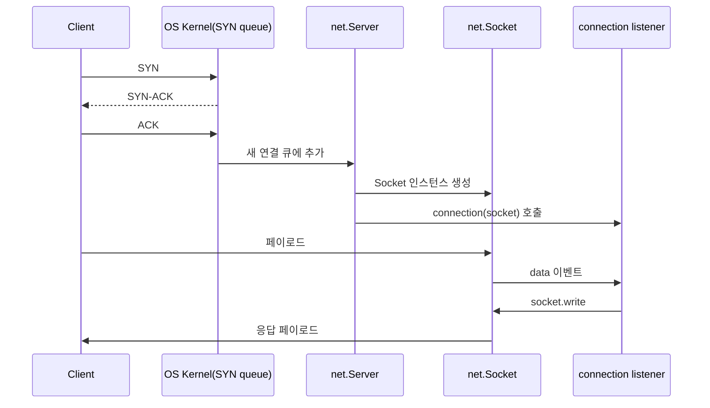
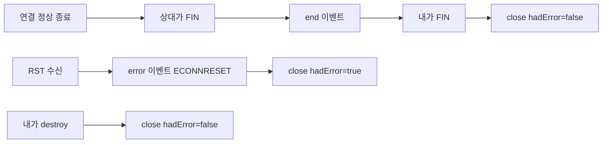
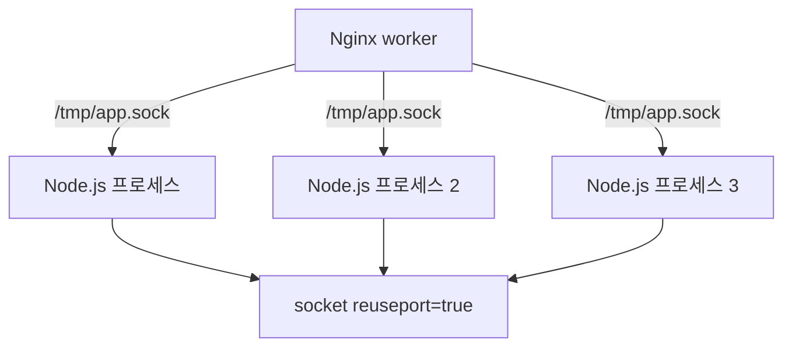

# Node.js net 모듈 TCP 서버/클라이언트 실무 심화

`http` 모듈을 한 꺼풀 더 벗기면 `net` 모듈이 나온다. HTTP/1.1, HTTP/2, gRPC, Redis, MySQL, Kafka — 백엔드에서 다루는 거의 모든 프로토콜이 결국 TCP 위에 올라타고, Node.js에서 그 TCP를 직접 만지는 창구가 `net`이다. 평소엔 `http`나 `redis` 클라이언트가 잘 감춰주지만, 자체 프로토콜을 구현하거나 사이드카 프로세스와 IPC를 해야 하는 순간 갑자기 `net.Socket` 깊숙한 동작을 알아야 한다. 이 문서는 자체 TCP 서버를 운영하면서 마주친 사례를 중심으로 `net` 모듈을 정리한다.

---

## 1. net.createServer 기본 구조

`net.createServer`는 `http.createServer`의 부모뻘 함수다. 인자로 받는 콜백은 새 클라이언트가 붙을 때마다 `net.Socket` 인스턴스를 받아서 호출된다. 이 소켓 객체가 곧 Duplex 스트림이라는 점이 핵심이다. 읽기·쓰기가 같은 객체에서 일어나고, 양쪽 모두 백프레셔가 걸린다.

```js
const net = require('node:net')

const server = net.createServer({ allowHalfOpen: false }, (socket) => {
  socket.setEncoding('utf8')

  socket.on('data', (chunk) => {
    console.log('recv', chunk)
    socket.write('ack\n')
  })

  socket.on('end', () => {
    console.log('peer FIN')
  })

  socket.on('error', (err) => {
    console.error('socket error', err.code)
  })

  socket.on('close', (hadError) => {
    console.log('close, hadError=', hadError)
  })
})

server.listen(9000, '0.0.0.0', () => {
  console.log('listening', server.address())
})
```

겉으로만 보면 단순한데, 운영에 들어가면 신경 써야 하는 포인트가 한 둘이 아니다. 우선 `listen`의 두 번째 인자로 호스트를 명시하는 습관을 들이는 게 안전하다. 명시하지 않으면 IPv6(`::`)에 바인딩되고, OS 설정에 따라 IPv4 클라이언트가 접속 못하는 경우가 있다. 컨테이너 안에서는 `0.0.0.0`이 일반적이다.

또 `server.address()`가 객체를 반환한다는 점도 알아두면 좋다. `{ port, family, address }` 형태인데, 테스트 환경에서 포트를 `0`으로 두고 OS가 빈 포트를 할당하게 만들 때 자주 쓴다.



### server.maxConnections와 listen backlog

서버가 폭주할 때 두 가지 한계가 동시에 걸린다. 하나는 OS 커널의 SYN backlog 큐, 다른 하나는 Node 레벨의 `server.maxConnections`다.

`server.listen(port, host, backlog)`의 세 번째 인자가 backlog인데, 기본값은 `511`이다. 리눅스에서는 이 값이 `net.core.somaxconn` 커널 파라미터와 `min` 처리되니, 기본 128짜리 시스템에선 511을 줘봐야 128로 잘린다. 부하 테스트에서 connection이 갑자기 거부된다면 dmesg에 `possible SYN flooding` 메시지가 떠 있는지부터 보는 게 빠르다.

`server.maxConnections`는 별개로 동시 연결 수의 상한이다. 넘으면 Node가 새 연결을 즉시 끊는다. 메모리 보호 차원에서 의도적으로 잡아두는 편이 좋다. 한 번은 자체 TCP 게이트웨이가 메모리 누수로 죽었는데, 원인은 클라이언트가 끊지 않은 idle 연결이 5만 개 쌓여서 RSS가 8GB까지 올라간 거였다. 그 뒤로는 `server.maxConnections`를 명시적으로 잡고, 별도로 idle 타임아웃도 건다.

---

## 2. net.Socket 이벤트 — data / end / error / close

`net.Socket`이 발생시키는 네 가지 핵심 이벤트는 의미가 미묘하게 다르다. 신참 시절에 가장 헷갈렸던 부분이라, 다시 정리해보면 이렇다.

### data

상대가 보낸 바이트가 도착할 때마다 발생한다. **TCP는 메시지가 아니라 바이트 스트림**이기 때문에, 보낸 쪽이 한 번에 보낸 1KB가 받는 쪽에서 두 번에 나뉘어 올 수도 있고, 반대로 두 번에 나눠 보낸 게 한 번에 합쳐서 도착할 수도 있다. 자체 프로토콜을 만들 때 이걸 잊으면 백퍼센트 깨진다.

```js
// 잘못된 가정 — 메시지 단위로 도착할 거라 믿는다
socket.on('data', (chunk) => {
  const msg = JSON.parse(chunk.toString())  // 청크가 잘리면 즉시 에러
  handle(msg)
})
```

자체 프로토콜이라면 길이 프리픽스(4바이트 빅엔디안 길이 + 페이로드) 같은 프레이밍을 직접 깔아야 한다. 길이 헤더를 다 받을 때까지 버퍼에 쌓고, 한 메시지를 완성하면 핸들러에 넘기는 식이다.

```js
function makeFramedReader(socket, onMessage) {
  let buf = Buffer.alloc(0)

  socket.on('data', (chunk) => {
    buf = Buffer.concat([buf, chunk])

    while (buf.length >= 4) {
      const len = buf.readUInt32BE(0)
      if (buf.length < 4 + len) break

      const payload = buf.subarray(4, 4 + len)
      buf = buf.subarray(4 + len)
      onMessage(payload)
    }
  })
}
```

`Buffer.concat`을 매번 호출하면 GC 압박이 심해진다. 대용량 트래픽이라면 ring buffer나 `Buffer.allocUnsafe`로 미리 잡아두고 offset만 관리하는 식으로 최적화한다. 대부분의 경우엔 위 코드로 충분하지만, 초당 수십만 메시지를 받는 게이트웨이를 만들 땐 프로파일러에서 `Buffer.concat`이 1위로 올라온다.

### end

상대가 FIN 패킷을 보냈다는 신호다. 이 시점에는 **상대는 더 이상 데이터를 안 보내지만, 내 쪽은 여전히 쓸 수 있다.** TCP는 반이중(half-duplex) 종료를 지원하기 때문이다. 이걸 모르고 `end` 받자마자 끊으면 마지막 응답을 못 보내는 경우가 생긴다.

기본 동작에선 `allowHalfOpen: false`라 `end` 이벤트가 발생하면 Node가 자동으로 `socket.end()`를 호출해서 양쪽을 닫는다. 즉 별다른 설정이 없다면 `end` 콜백 안에서 `socket.write`를 시도해도 이미 늦은 경우가 대부분이다. 이 동작이 필요하면 `allowHalfOpen: true`로 켜야 한다.

### error

소켓 레벨 에러가 발생했을 때 한 번만 발생한다. 가장 자주 보는 코드는 다음과 같다.

- `ECONNRESET`: 상대가 RST를 보냈다. 보통 상대가 비정상 종료됐거나, 미들 박스(LB, 방화벽)가 idle 커넥션을 끊을 때 난다.
- `EPIPE`: 이미 닫힌 소켓에 쓰려고 했다. `end` 이후에 `write`를 호출했을 때 자주 본다.
- `ETIMEDOUT`: 커널 레벨 TCP timeout. `socket.setKeepAlive`가 켜져 있으면 idle 상태에서도 나는 경우가 있다.
- `EADDRINUSE`: 포트가 점유돼 있다. 서버를 재시작할 때 이전 프로세스가 `TIME_WAIT`로 남아 있으면 난다. `SO_REUSEADDR`이 기본으로 켜져 있어서 보통은 안 나는데, 단일 머신에서 여러 인스턴스를 띄울 때 가끔 마주친다.

`error` 핸들러를 안 달면 그대로 `uncaughtException`으로 튀어서 프로세스가 죽는다. **소켓을 만드는 모든 코드 경로에 `error` 핸들러를 거는 게 원칙**이다. 클라이언트 측에서 `net.connect` 직후 핸들러를 다는 게 잘 빠뜨리는 부분이다.

### close

연결이 완전히 닫혔다는 신호다. `hadError` 인자로 에러로 닫혔는지 여부를 알 수 있다. 메모리에서 소켓을 추적 중이었다면 이 시점에 제거해야 누수가 안 난다. `end`와 `close`는 다른 이벤트라는 점이 핵심이다. `end`는 상대의 FIN, `close`는 양쪽 다 정리 완료. 둘이 항상 같이 발생하지도 않는다. 예를 들어 RST가 오면 `end` 없이 `error` → `close`만 발생한다.



---

## 3. socket.write 반환값과 drain — 백프레셔 처리

`socket.write(chunk)`가 `boolean`을 반환한다는 사실은 자주 잊힌다. `false`가 떴다는 건 내부 송신 버퍼가 `highWaterMark`(기본 16KB)를 넘었다는 뜻이고, 더 쓰면 메모리에 계속 쌓인다. 클라이언트 회선이 느리거나 상대가 데이터를 안 읽어가면 이게 즉시 문제가 된다.

전형적인 사고 시나리오: 서버가 로그 스트리밍을 TCP로 흘려보내는데, 한 클라이언트의 회선이 느려서 1MB/s밖에 못 받는다. 서버는 초당 100MB를 만들어내고 있다. `socket.write`의 반환값을 무시하면 99MB/s씩 노드 프로세스 안에 쌓인다. 몇 분 안에 OOM이다.

```js
// 메모리 폭주 패턴
function streamLogs(socket, logSource) {
  logSource.on('log', (line) => {
    socket.write(line + '\n')  // 반환값 무시
  })
}
```

`pipe`나 `pipeline`을 쓸 수 있다면 그게 가장 안전하다. 양쪽 다 Duplex 스트림이라 백프레셔가 자동 처리된다.

```js
const { pipeline } = require('node:stream/promises')

socket.on('connect', async () => {
  try {
    await pipeline(logSource, socket)
  } catch (err) {
    log.error('stream broken', err)
  }
})
```

스트림으로 못 만드는 상황(이벤트 emitter에서 들어오는 데이터 등)이라면 직접 `drain`을 기다려야 한다.

```js
async function safeWrite(socket, chunk) {
  if (socket.destroyed) return false

  if (!socket.write(chunk)) {
    await new Promise((resolve, reject) => {
      const onDrain = () => { cleanup(); resolve() }
      const onClose = () => { cleanup(); reject(new Error('closed')) }
      const cleanup = () => {
        socket.off('drain', onDrain)
        socket.off('close', onClose)
      }
      socket.once('drain', onDrain)
      socket.once('close', onClose)
    })
  }
  return true
}
```

`drain` 이벤트만 기다리면 끝날 것 같지만, 그동안 소켓이 죽을 수도 있다. `close`도 같이 들어야 메모리 누수가 안 난다. 위 패턴은 안 보이는 곳에서 자주 깨지는 부분이라 유틸로 빼두는 편이 좋다.

송신 버퍼에 얼마나 쌓여 있는지는 `socket.writableLength`로 볼 수 있다. 모니터링용으로 이 값을 주기적으로 찍어두면 느린 클라이언트를 잡아낼 수 있다. 임계값을 넘으면 강제로 끊는 정책도 흔하다.

```js
setInterval(() => {
  for (const socket of activeSockets) {
    if (socket.writableLength > 10 * 1024 * 1024) {
      log.warn('slow consumer, killing', socket.remoteAddress)
      socket.destroy()
    }
  }
}, 5000)
```

---

## 4. Nagle 알고리즘과 socket.setNoDelay

TCP의 Nagle 알고리즘은 작은 패킷을 모아서 하나로 보내는 최적화다. 작은 write가 자주 일어나는 워크로드에서 네트워크 사용량을 줄여주지만, **응답 지연(latency)이 중요한 워크로드에선 독이 된다.**

기본 동작은 Nagle이 켜져 있는 상태(`TCP_NODELAY` off)다. 한 번 쓴 데이터가 ACK를 받기 전까지 그 다음 작은 write는 잠시 보류되는데, 보통 40ms 정도 걸린다. RPC처럼 요청-응답이 빈번한 프로토콜에서 이게 RTT에 더해진다. HTTP에서 헤더와 바디를 따로 `write`하는 경우, Nagle + delayed ACK 조합 때문에 매 요청마다 추가로 200ms 가까이 늘어나는 사례도 있다.

```js
socket.setNoDelay(true)
```

Redis 클라이언트, gRPC 클라이언트, 자체 RPC 클라이언트는 거의 다 이걸 켠다. 데이터를 어차피 즉시 보내야 하니까. 반대로 일괄 처리하는 배치성 통신이라면 켜지 않는 게 대역폭에 유리하다.

한 번 헛다리 짚은 적이 있다. 자체 메시지 브로커가 publish 후 응답까지 평균 50ms 걸리는 게 이상해서 한참 보다가 `setNoDelay(true)` 한 줄로 5ms로 떨어졌다. 코드 자체엔 문제가 없었고, 그냥 Nagle이 켜진 상태였던 거다. **자체 프로토콜 쓰는 서버를 만들면 `setNoDelay`부터 점검**해야 한다.

`net.createServer`로 받은 클라이언트 소켓에도 동일하게 적용해야 한다. 서버 쪽만 설정하고 클라이언트는 빼먹는 경우가 흔한데, 결국 양쪽 다 켜야 효과가 있다.

---

## 5. socket.setKeepAlive — TCP keepalive 설정

`setKeepAlive`는 HTTP keep-alive와 이름은 비슷한데 완전히 다른 개념이다. 이건 **OS 커널의 TCP keepalive probe** 설정이다. 일정 시간 idle 상태가 지속되면 커널이 probe 패킷을 보내서 상대가 살아있는지 확인하고, 응답이 없으면 연결을 끊는다.

```js
socket.setKeepAlive(true, 60_000)
```

두 번째 인자는 첫 probe를 보내기까지의 idle 시간이다. 기본값은 OS 설정을 따른다. 리눅스에서 `net.ipv4.tcp_keepalive_time`이 보통 7200초(2시간)으로 잡혀 있어서, 기본 상태로 두면 죽은 연결을 인식하는 데 2시간이 걸린다. 데이터가 안 가는 idle 상태에서 미들 박스(NAT, LB)가 멋대로 끊어버린 케이스를 못 알아챌 수 있다.

운영에서 마주친 사례: 자체 TCP 서버와 NLB 뒤의 클라이언트 사이에 NAT 박스가 있었는데, 350초 idle이면 NAT 테이블에서 엔트리가 사라졌다. 양쪽은 연결이 살아있다고 믿지만 실제론 다음 패킷이 RST로 깨졌다. `setKeepAlive(true, 60_000)`로 잡으니 60초마다 probe가 가서 NAT 테이블이 유지됐고, 동시에 죽은 연결도 빨리 알아챌 수 있게 됐다.

probe의 간격, 재시도 횟수는 Node API에서 직접 설정 못한다. OS 파라미터를 건드려야 한다.

- `net.ipv4.tcp_keepalive_intvl`: probe 간격
- `net.ipv4.tcp_keepalive_probes`: 응답 없을 때 재시도 횟수

컨테이너에서는 호스트 커널 파라미터를 그대로 따라간다는 점도 알아둬야 한다. 사이드카로 띄운 컨테이너에서 keepalive 설정이 안 먹는 줄 알았는데 호스트 파라미터가 디폴트라서 그랬던 적도 있다.

HTTP keep-alive와 헷갈리지 말 것. HTTP keep-alive는 응답 후 소켓을 끊지 않고 다음 요청에 재사용하는 애플리케이션 레이어 동작이고, TCP keepalive는 idle 연결의 생사 확인용 커널 레이어 동작이다. 둘은 서로 직교한다.

---

## 6. Unix domain socket — 같은 머신 IPC

`net.createServer`의 `listen`에 포트 대신 경로를 넘기면 Unix domain socket이 된다.

```js
const server = net.createServer((socket) => {
  socket.on('data', (chunk) => socket.write(chunk))
})

server.listen('/tmp/myapp.sock', () => {
  console.log('listening on unix socket')
})
```

클라이언트 쪽도 거의 동일하다.

```js
const client = net.createConnection({ path: '/tmp/myapp.sock' })
client.write('hello')
```

TCP loopback(127.0.0.1)으로도 같은 머신 통신은 가능한데, Unix socket이 더 나은 점이 몇 가지 있다.

첫째, 네트워크 스택을 거치지 않아서 latency가 더 낮다. 벤치마크 해보면 TCP loopback 대비 30~50% 빠른 경우가 흔하다. 둘째, 파일 시스템 권한으로 접근 제어가 가능하다. 소켓 파일의 owner/mode를 설정하면 특정 유저나 그룹만 접근할 수 있다. 셋째, 포트 충돌이 없다. 같은 호스트에 여러 인스턴스를 띄울 때 포트 관리 부담이 사라진다.

운영하면서 마주친 함정 몇 가지가 있다.

**소켓 파일이 안 지워진 채로 남아있다.** 프로세스가 비정상 종료되면 소켓 파일이 그대로 남고, 다음 기동 때 `listen`이 `EADDRINUSE`로 실패한다. 시작 전에 파일을 지우거나, SIGTERM 핸들러에서 정리해야 한다.

```js
const fs = require('node:fs')
const SOCK = '/tmp/myapp.sock'

try { fs.unlinkSync(SOCK) } catch {}
server.listen(SOCK)

process.on('SIGTERM', () => {
  server.close(() => {
    try { fs.unlinkSync(SOCK) } catch {}
    process.exit(0)
  })
})
```

**경로 길이 제한.** Linux에서 Unix socket 경로는 108바이트가 한계다. 컨테이너 안에서 긴 경로(`/var/lib/myapp/sockets/v1/instance-abc-123.sock`)를 쓰면 `ENAMETOOLONG`이 난다. 가능하면 `/tmp` 같이 짧은 경로를 쓴다.

**Nginx, HAProxy 같은 리버스 프록시 뒤에 둘 때 권한 문제.** 프록시 프로세스가 소켓을 읽을 수 있어야 하니 소켓 파일의 group이나 mode를 맞춰야 한다. `server.listen` 후 `fs.chmodSync(SOCK, 0o660)` 같은 식으로 잡는다.



Node 12 이후 `server.listen({ path, exclusive: false })`로 여러 프로세스가 같은 소켓에 동시에 listen 할 수도 있다. cluster 모드와 비슷하게 커널이 라운드 로빈으로 분배한다.

**Windows에선 named pipe.** 윈도우는 Unix socket을 최근 버전부터 지원하지만, Node에서 동일 API로 named pipe도 다룬다. 경로 형식이 `\\?\pipe\myapp`이라 운영체제별 분기가 필요하다.

---

## 7. allowHalfOpen — 반이중 종료 다루기

`net.createServer({ allowHalfOpen: true })`나 `net.connect({ allowHalfOpen: true })`로 켤 수 있는 옵션이다. 기본값은 `false`다.

TCP는 양방향이라 한쪽이 FIN을 보내고 끝내도 다른 쪽은 계속 쓸 수 있다. `allowHalfOpen: false`(기본)는 상대가 FIN을 보내면 자동으로 내 쪽도 FIN을 보내 양쪽을 닫는다. 대부분의 워크로드에선 이게 맞다.

`allowHalfOpen: true`로 켜야 하는 상황은 **요청-끝-응답** 패턴의 프로토콜이다. 클라이언트가 요청을 다 보낸 다음 FIN을 보내서 "더 보낼 거 없다"는 신호를 주고, 그제서야 서버가 응답을 만들어 보내는 형식. 옛날 SMTP나 일부 RPC가 이렇게 동작한다.

```js
const server = net.createServer({ allowHalfOpen: true }, (socket) => {
  let body = Buffer.alloc(0)

  socket.on('data', (chunk) => {
    body = Buffer.concat([body, chunk])
  })

  socket.on('end', async () => {
    // 상대가 FIN 보냄, 이제 응답
    const result = await processRequest(body)
    socket.end(result)  // 응답 보내고 내 쪽 FIN
  })

  socket.on('error', (err) => log.error(err))
})
```

만약 위 패턴을 `allowHalfOpen: false`로 짜면 `end` 콜백에서 `write`를 호출해도 이미 `socket.end()`가 자동으로 불려서 전송이 안 된다. 정확히 말하면 약간의 race가 있어서 작은 데이터는 보낼 때도 있는데, 신뢰할 수 없다. 한 번 이 동작에 의존했다가 본 운영 서버에서 응답의 마지막 청크가 잘려서 클라이언트가 JSON 파싱 에러를 내는 사고가 났다.

반대로 `allowHalfOpen: true`로 켜놓고 양쪽이 다 close를 안 하면 좀비 연결이 쌓인다. 명시적으로 `end`를 호출하거나 타임아웃으로 정리해야 한다. 둘 다 트레이드 오프가 있다.

---

## 8. setTimeout — idle 연결 정리

`socket.setTimeout(ms)`은 idle 시간이 ms를 넘으면 `timeout` 이벤트를 발생시킨다. 자동으로 끊지는 않는다. **이 부분이 자주 놓치는 함정**이다.

```js
socket.setTimeout(30_000)
socket.on('timeout', () => {
  log.warn('idle timeout, destroying', socket.remoteAddress)
  socket.destroy()
})
```

`timeout` 이벤트 안에서 `socket.destroy()`나 `socket.end()`를 직접 호출해야 한다. 안 그러면 그냥 경고만 떴다가 사라지고 연결은 계속 살아 있는다.

서버 전체에 idle 타임아웃을 거는 패턴이 흔하다. `server.on('connection', ...)` 안에서 일괄적으로 setTimeout을 잡거나, 핸들러 안에서 잡는다.

```js
const server = net.createServer((socket) => {
  socket.setTimeout(60_000)
  socket.on('timeout', () => socket.destroy())
  // ...
})
```

`destroy`와 `end`의 차이도 헷갈리기 쉽다. `end`는 graceful close — 큐에 쌓인 송신 데이터를 다 보내고 FIN을 날린다. `destroy`는 즉시 종료 — 송신 버퍼를 버리고 RST를 보낸다. 정상 종료는 `end`, idle/에러 정리는 `destroy`가 일반적이다.

---

## 9. net.connect 클라이언트 측 주의사항

클라이언트 쪽은 서버보다 더 신경 쓸 게 많다. 가장 흔한 실수가 `connect`, `error`, `timeout`을 분리해서 다루지 않는 거다.

```js
const client = net.connect({ host: 'service.internal', port: 9000 })

client.setTimeout(5000)

client.once('connect', () => {
  console.log('connected')
  client.setTimeout(0)  // 연결 후엔 idle timeout 해제 또는 다시 잡기
  client.write('hello')
})

client.on('timeout', () => {
  log.warn('connect timeout')
  client.destroy(new Error('connect timeout'))
})

client.on('error', (err) => {
  log.error('client error', err.code)
})

client.on('close', (hadError) => {
  log.info('connection closed, hadError=', hadError)
})
```

연결 전 단계의 `timeout`은 connect timeout으로, 연결 후의 `timeout`은 idle timeout으로 동작한다. 두 단계를 같은 값으로 두는 경우가 많은데, 보통은 분리해야 한다. connect는 짧게(2~5초), idle은 길게(30~120초).

`setTimeout(0)`은 타임아웃을 끄는 명령이고, 다시 잡을 땐 `setTimeout(30_000)` 식으로 호출한다. `setTimeout`을 다시 호출해도 기존 타이머가 갱신될 뿐 핸들러는 그대로 유지된다.

자동 재연결 로직을 만들 땐 백오프를 반드시 깐다. 즉시 재연결하면 상대 서버가 다운됐을 때 연결 시도 폭풍이 일어난다.

```js
function connectWithBackoff(opts, onSocket) {
  let attempt = 0

  function tryConnect() {
    const sock = net.connect(opts)

    sock.once('connect', () => {
      attempt = 0
      onSocket(sock)
    })

    sock.once('close', (hadError) => {
      if (!hadError) return
      const wait = Math.min(30_000, 1000 * 2 ** attempt) + Math.random() * 500
      attempt++
      log.warn('reconnect in', wait, 'ms')
      setTimeout(tryConnect, wait)
    })

    sock.on('error', () => {})  // close 핸들러가 재연결 담당
  }

  tryConnect()
}
```

지수 백오프에 jitter(`Math.random() * 500`)를 더하는 게 중요하다. 안 그러면 동시에 끊긴 여러 클라이언트가 같은 시점에 재연결을 시도해서 thundering herd가 난다.

---

## 10. 운영 관점 모니터링

`net` 모듈을 직접 만질 때 챙겨두면 좋은 지표 몇 가지를 정리한다.

- `server._connections`: 현재 서버가 잡고 있는 연결 수. private이지만 운영용 모니터링으론 자주 쓰인다. 공식 API는 `server.getConnections(callback)`인데 비동기라 콜백 처리가 귀찮다.
- `socket.bytesRead`, `socket.bytesWritten`: 해당 소켓에서 누적된 바이트 수. 연결 종료 시점에 통계로 찍어두면 대용량 클라이언트 식별에 유용하다.
- `socket.writableLength`: 송신 버퍼에 쌓인 바이트 수. 위에서 본 slow consumer 탐지용.
- `socket.remoteAddress`, `socket.remotePort`: 상대 식별자. 로깅엔 거의 필수.

`netstat`이나 `ss`로 OS 레벨에서 확인하는 것도 잊으면 안 된다. Node 프로세스가 보고하는 연결 수와 OS가 보는 소켓 수가 다르다면 어딘가 누수가 있는 거다. `ss -tnp | grep node | wc -l`로 현재 떠 있는 TCP 소켓 수를 본다.

CLOSE_WAIT 상태로 쌓이는 경우가 가장 위험하다. 상대가 FIN을 보냈는데 내 쪽 애플리케이션이 `socket.end()`를 안 부른 상태다. `allowHalfOpen: true`로 켜놓고 처리 누락이 있으면 흔히 발생한다. CLOSE_WAIT가 많다는 건 코드 어딘가에서 소켓 정리를 안 하고 있다는 뜻이라 코드를 뒤져봐야 한다.

```bash
ss -tan state close-wait | wc -l
```

운영 서버에서 이 명령을 주기적으로 찍어보고 갑자기 늘면 알람을 거는 식으로 잡아둔다.

---

## 정리

`net` 모듈은 평소에는 `http`나 ORM 클라이언트가 다 감춰주지만, 자체 프로토콜을 만들거나 IPC를 짜는 순간 모든 디테일이 드러난다. TCP가 바이트 스트림이라는 점, `data`/`end`/`error`/`close`의 의미가 다르다는 점, 백프레셔는 무시하면 메모리가 터진다는 점, Nagle과 keepalive는 워크로드별로 다르게 잡아야 한다는 점, Unix socket은 권한과 정리가 까다롭다는 점, 이 정도만 챙겨도 자체 TCP 서비스의 99%는 안정적으로 굴릴 수 있다.

`http`, `https`, `tls`, `http2` 모두 결국 `net.Socket`을 상속하거나 감싸는 구조라, 이 모듈의 동작을 알면 상위 프로토콜의 트러블슈팅도 훨씬 쉬워진다.
