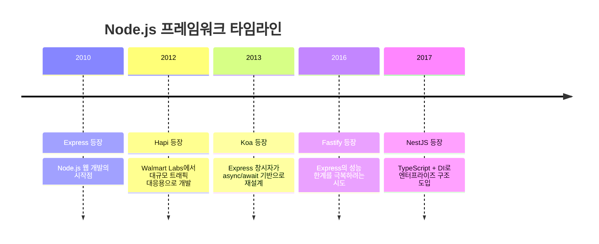
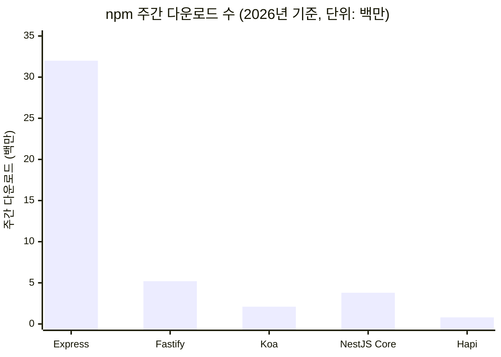
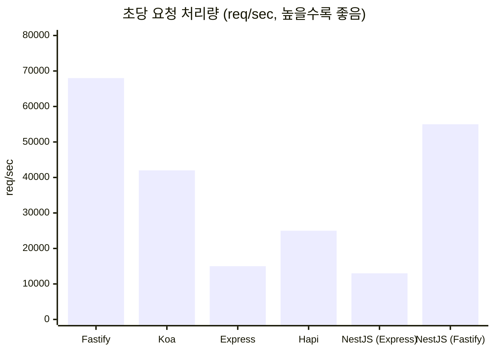
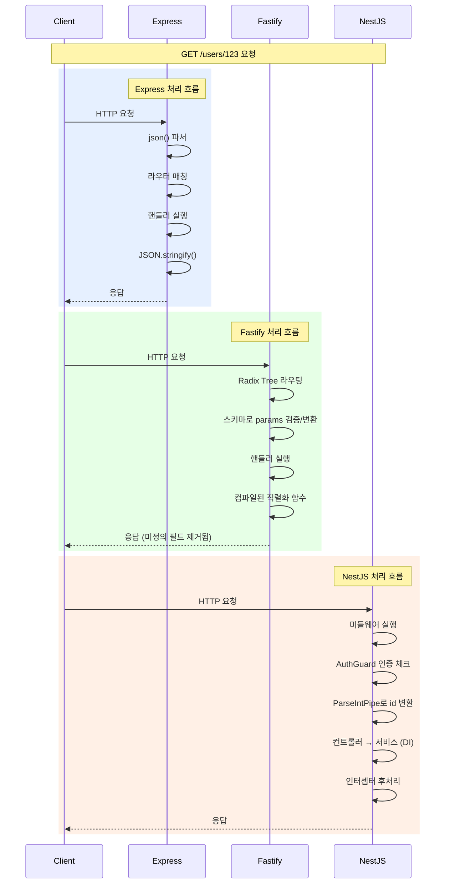
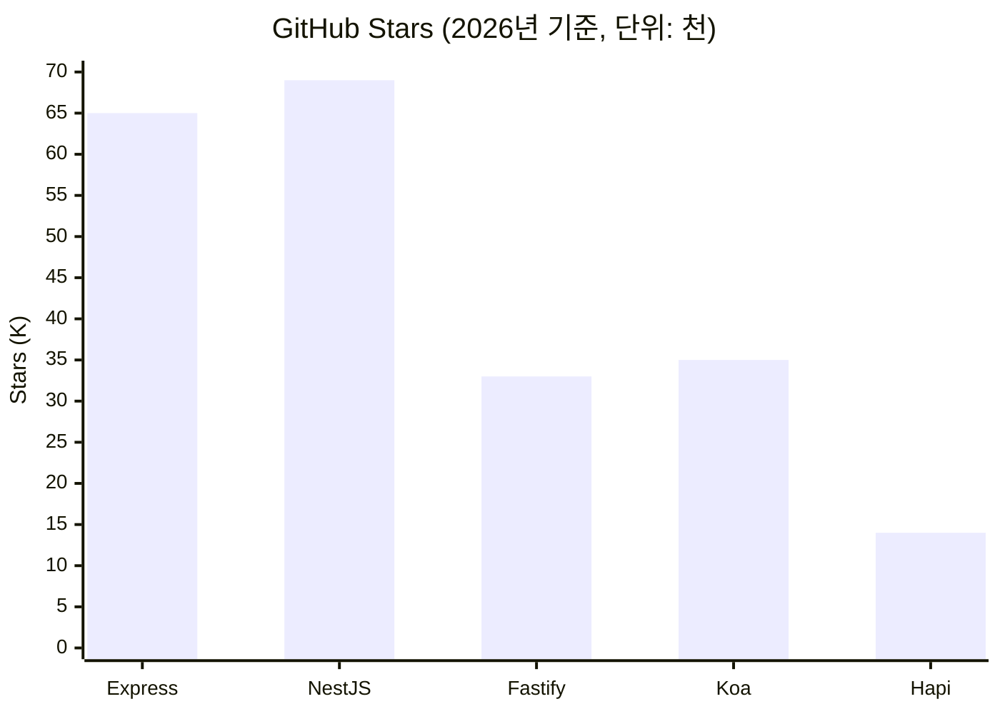
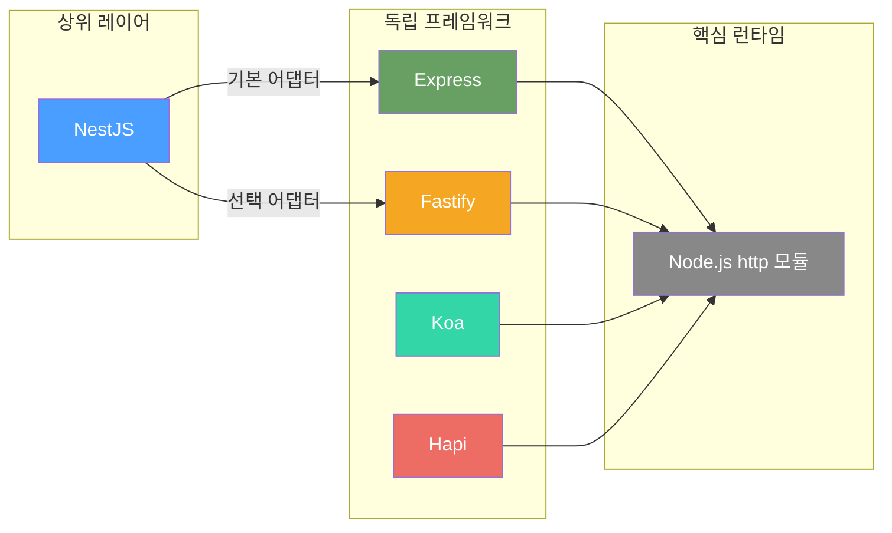
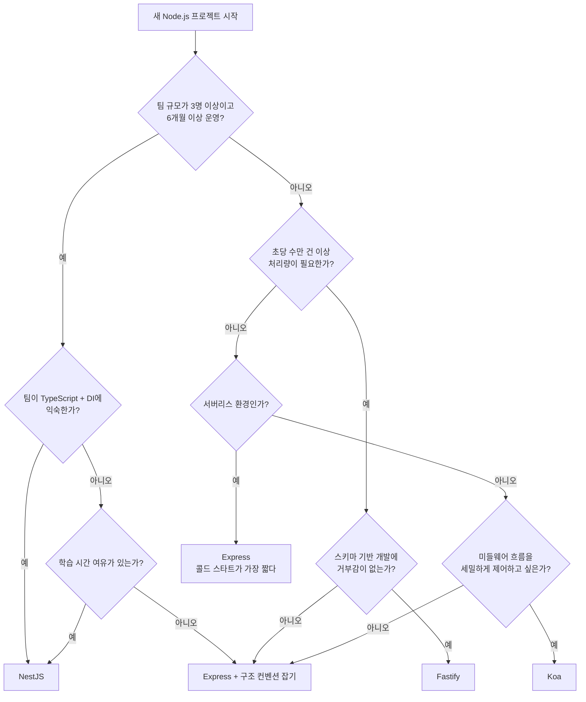
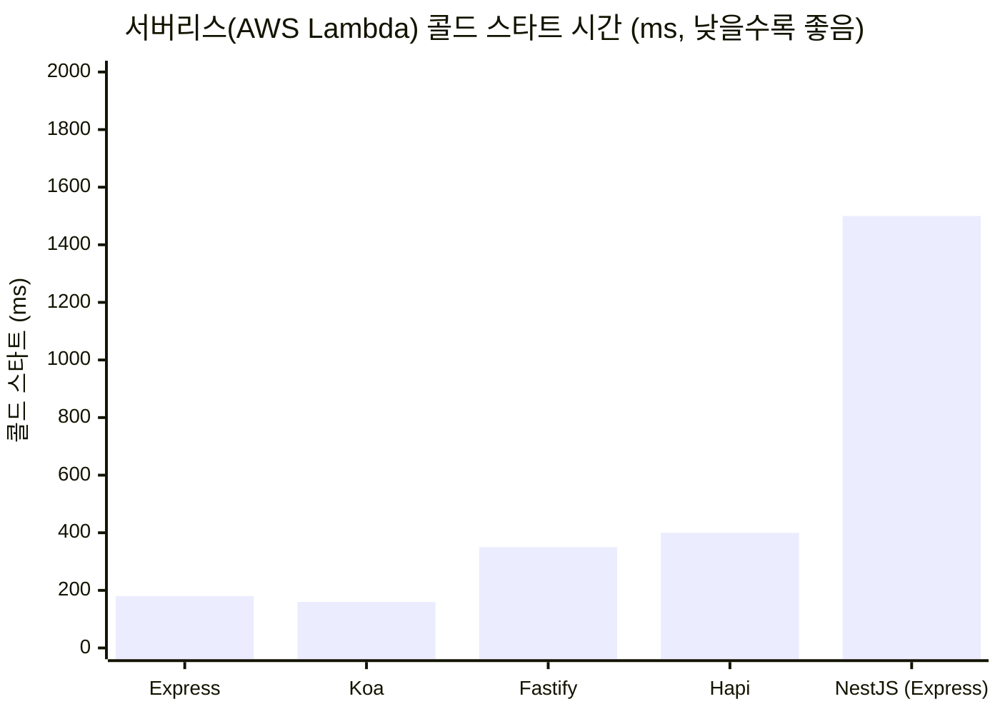

# Node.js 프레임워크 개요

Node.js 생태계에는 HTTP 서버를 구축하는 프레임워크가 여러 개 있다. 각각 설계 방향이 다르고, 프로젝트 성격에 따라 맞는 프레임워크가 다르다. 이 문서는 주요 프레임워크 5개의 설계 철학 차이를 정리하고, 프레임워크 선택과 교체 시 실제로 부딪히는 문제를 다룬다.

---

## 프레임워크 등장 시기와 현재 위치

각 프레임워크가 언제 등장했는지 보면, Node.js 생태계의 흐름이 보인다. Express가 터를 잡고, 그 한계를 극복하려는 시도가 이어졌다.



Express가 10년 넘게 생태계를 지배하고 있고, 후발 주자들은 각각 다른 문제를 해결하려고 나왔다. Hapi는 대규모 트래픽, Koa는 깔끔한 비동기 처리, Fastify는 성능, NestJS는 코드 구조. 목적이 다르니까 "어떤 게 최고냐"는 질문 자체가 맞지 않다.

---

## npm 생태계 규모

프레임워크를 고를 때 다운로드 수가 절대적 기준은 아니지만, 생태계 크기를 가늠하는 데 쓸 수 있다. 주간 다운로드 수 기준으로 프레임워크 간 격차가 크다.



Express가 압도적이다. 주간 3,200만 다운로드는 단순히 새 프로젝트에서 쓰는 것만이 아니라, Express에 의존하는 라이브러리와 레거시 프로젝트가 많다는 뜻이다. NestJS의 다운로드 수에는 NestJS 내부에서 Express를 쓰는 케이스도 포함된다는 점을 감안해야 한다.

Hapi의 다운로드 수가 급격히 줄어드는 추세다. 새 프로젝트에서 Hapi를 선택하는 경우는 드물어졌고, 기존 Hapi 프로젝트가 Express나 Fastify로 전환하는 경우가 늘고 있다.

---

## 벤치마크 성능 비교

"hello world" 벤치마크는 실제 서비스 성능과 다르지만, 프레임워크 자체의 오버헤드를 비교하는 데는 의미가 있다. 아래는 단순 JSON 응답(`{ "hello": "world" }`)의 초당 요청 처리량이다.



몇 가지 짚을 것:

- Fastify가 Express보다 4배 이상 빠르다. JSON 직렬화를 `fast-json-stringify`로 처리하는 게 핵심이다.
- NestJS는 하부 엔진에 따라 성능이 크게 달라진다. Fastify를 엔진으로 쓰면 Express 엔진 대비 4배 가까이 올라간다. NestJS의 DI 컨테이너 오버헤드는 생각보다 작다.
- Koa는 Express보다 빠르다. Express의 `res.json()` 내부에서 `Content-Type` 설정, `ETag` 생성 등 부가 작업이 들어가기 때문이다.
- 이 숫자는 벤치마크 환경(Node.js 버전, 하드웨어, 커넥션 수)에 따라 달라진다. 절대값보다 상대적 순위를 참고한다.

실제 서비스에서는 DB 쿼리, 외부 API 호출, 비즈니스 로직이 응답 시간의 90% 이상을 차지한다. 프레임워크 자체 오버헤드가 병목이 되는 서비스는 초당 수만 건을 처리하는 수준에서나 해당된다.

---

## 프레임워크 아키텍처 비교

각 프레임워크가 HTTP 요청을 어떤 구조로 처리하는지 한눈에 보면 아래와 같다. Express와 Koa는 미들웨어 체인으로 흘려보내고, Fastify는 스키마 컴파일 단계가 끼어 있고, NestJS는 Express/Fastify 위에 DI 컨테이너를 얹은 구조다.

```mermaid
graph TB
    subgraph Express
        E1[HTTP 요청] --> E2[미들웨어 체인]
        E2 --> E3[라우터 매칭]
        E3 --> E4[핸들러 실행]
        E4 --> E5[res.json / res.send]
    end

    subgraph Fastify
        F1[HTTP 요청] --> F2[라우팅 트리 탐색]
        F2 --> F3[스키마 유효성 검사]
        F3 --> F4[핸들러 실행]
        F4 --> F5[스키마 기반 직렬화<br/>fast-json-stringify]
    end

    subgraph NestJS
        N1[HTTP 요청] --> N2[미들웨어]
        N2 --> N3[가드 - 인증/인가]
        N3 --> N4[인터셉터 - 전처리]
        N4 --> N5[파이프 - 유효성 검사/변환]
        N5 --> N6[컨트롤러 → 서비스<br/>DI 컨테이너]
        N6 --> N7[인터셉터 - 후처리]
    end

    subgraph Koa
        K1[HTTP 요청] --> K2["미들웨어 ① 진입"]
        K2 --> K3["미들웨어 ② 진입"]
        K3 --> K4[핸들러 실행]
        K4 --> K5["미들웨어 ② 복귀"]
        K5 --> K6["미들웨어 ① 복귀"]
    end

    subgraph Hapi
        H1[HTTP 요청] --> H2[라우트 매칭]
        H2 --> H3[인증 스킴 실행]
        H3 --> H4[Joi 유효성 검사]
        H4 --> H5[핸들러 실행]
        H5 --> H6[응답 유효성 검사]
    end
```



주목할 차이점:

- **Express/Koa**: 미들웨어 순서가 곧 실행 순서다. 순서를 잘못 넣으면 동작이 달라진다.
- **Fastify**: 요청/응답 모두 스키마를 통과한다. 직렬화 단계에서 성능 차이가 난다.
- **NestJS**: 요청이 거치는 레이어가 가장 많다. 가드 → 인터셉터 → 파이프 순서가 고정이라 역할이 명확하다.
- **Koa**: 양파 모델이라 미들웨어가 요청/응답 두 번 실행된다. Express와 다른 점이다.
- **Hapi**: 인증과 유효성 검사가 핸들러 실행 전에 프레임워크 수준에서 처리된다.

---

## 요청 처리 흐름 비교

GET `/users/123` 요청이 들어왔을 때 각 프레임워크가 내부적으로 거치는 단계를 비교한 것이다. 같은 요청이지만 프레임워크마다 거치는 단계 수가 다르다.



Express는 단계가 적어서 단순하지만 유효성 검사를 직접 해야 한다. Fastify는 스키마 검증과 직렬화가 자동이다. NestJS는 단계가 많지만 각 단계의 역할이 분리되어 있다.

---

## 프레임워크별 설계 철학

### Express

Node.js 웹 프레임워크의 사실상 표준이다. 2010년에 등장했고, npm 생태계에서 가장 많은 미들웨어를 가지고 있다.

핵심 설계 방향은 **미니멀리즘**이다. 프레임워크 자체는 라우팅과 미들웨어 체인만 제공한다. 나머지는 전부 개발자가 고른다. ORM, 유효성 검사, 인증, 로깅 — 전부 직접 조합해야 한다.

```javascript
const express = require('express');
const app = express();

// 미들웨어는 순서대로 실행된다. 순서가 잘못되면 버그가 생긴다.
app.use(express.json()); // 이게 라우터보다 먼저 와야 req.body를 쓸 수 있다
app.use('/api/users', userRouter);

// 에러 핸들링 미들웨어는 반드시 마지막에 등록한다
// 파라미터가 4개(err, req, res, next)여야 Express가 에러 핸들러로 인식한다
app.use((err, req, res, next) => {
  console.error(err.stack);
  res.status(500).json({ message: 'Internal Server Error' });
});
```

Express의 약점은 비동기 에러 처리다. Express 4 기준으로 async 핸들러에서 throw하면 프로세스가 죽는다. `express-async-errors` 패키지를 따로 붙이거나, 모든 핸들러를 try-catch로 감싸야 한다. Express 5에서 이 문제가 해결됐지만, 5 버전이 나오기까지 수년이 걸렸다.

**Express를 쓰는 경우:** 프로토타입, 소규모 API 서버, 레거시 프로젝트 유지보수. npm에서 찾은 미들웨어가 Express 기반인 경우가 많아서 서드파티 호환성이 가장 좋다.

### Fastify

Express의 성능 한계를 해결하려고 만들어졌다. 벤치마크에서 Express보다 2~3배 빠른 처리량을 보여준다.

성능 차이의 핵심은 JSON 직렬화다. Fastify는 응답 스키마를 미리 정의하면 `fast-json-stringify`로 컴파일된 직렬화 함수를 만든다. `JSON.stringify()`보다 훨씬 빠르다.

```javascript
const fastify = require('fastify')({ logger: true });

fastify.route({
  method: 'GET',
  url: '/users/:id',
  schema: {
    params: {
      type: 'object',
      properties: {
        id: { type: 'integer' }
      }
    },
    response: {
      200: {
        type: 'object',
        properties: {
          id: { type: 'integer' },
          name: { type: 'string' },
          email: { type: 'string' }
        }
      }
    }
  },
  handler: async (request, reply) => {
    const user = await findUser(request.params.id);
    return user; // 스키마에 정의되지 않은 필드는 응답에서 자동으로 제거된다
  }
});
```

응답 스키마에 정의하지 않은 필드가 자동으로 빠진다는 점은 보안 측면에서 장점이지만, 처음 쓸 때 "왜 필드가 안 나오지?" 하고 헤매는 경우가 있다. password 같은 민감한 필드가 실수로 노출되는 걸 막아주는 셈이다.

Fastify의 플러그인 시스템은 캡슐화(encapsulation) 개념이 있다. 플러그인 안에서 등록한 데코레이터나 훅은 해당 플러그인 스코프 안에서만 동작한다. Express처럼 전역으로 다 공유되지 않는다.

**Fastify를 쓰는 경우:** 처리량이 중요한 API 서버, JSON 응답이 많은 서비스. 스키마 기반 개발에 거부감이 없는 팀.

### NestJS

TypeScript 기반, Angular에서 영감을 받은 프레임워크다. Express나 Fastify 위에서 동작하는 상위 레이어라고 보면 된다.

핵심은 **의존성 주입(DI)과 모듈 시스템**이다. Spring Boot를 써본 개발자라면 구조가 익숙할 것이다. 컨트롤러, 서비스, 모듈로 나눠서 관심사를 분리하고, 데코레이터로 메타데이터를 붙인다.

```typescript
// users.controller.ts
@Controller('users')
export class UsersController {
  constructor(private readonly usersService: UsersService) {}

  @Get(':id')
  @UseGuards(AuthGuard)
  async findOne(@Param('id', ParseIntPipe) id: number): Promise<UserDto> {
    return this.usersService.findOne(id);
  }
}

// users.module.ts
@Module({
  imports: [TypeOrmModule.forFeature([User])],
  controllers: [UsersController],
  providers: [UsersService],
  exports: [UsersService], // 다른 모듈에서 UsersService를 쓰려면 export해야 한다
})
export class UsersModule {}
```

NestJS에서 흔히 겪는 문제는 **순환 의존성(circular dependency)**이다. 모듈 A가 모듈 B를 import하고, 모듈 B가 모듈 A를 import하면 에러가 난다. `forwardRef()`로 해결하지만, 이게 반복되면 모듈 구조 자체를 재설계해야 한다.

```typescript
// 순환 의존성 해결 — 이게 여러 곳에서 나타나면 설계를 다시 봐야 한다
@Module({
  imports: [forwardRef(() => OrdersModule)],
})
export class UsersModule {}
```

NestJS는 학습 곡선이 있다. 데코레이터, DI 컨테이너, 가드, 인터셉터, 파이프 등 알아야 할 개념이 많다. 대신 팀 규모가 커져도 코드 구조가 일관성을 유지한다.

**NestJS를 쓰는 경우:** 팀이 3명 이상이고, 프로젝트가 6개월 넘게 유지될 때. 마이크로서비스 구성이 필요하거나, TypeScript를 적극 활용하는 팀.

### Koa

Express를 만든 TJ Holowaychuk이 다시 만든 프레임워크다. Express의 콜백 기반 설계를 버리고 async/await를 처음부터 지원한다.

Express보다 더 미니멀하다. 라우터조차 기본 제공하지 않는다. `koa-router`, `koa-bodyparser` 같은 패키지를 직접 붙여야 한다.

```javascript
const Koa = require('koa');
const Router = require('@koa/router');
const app = new Koa();
const router = new Router();

// Koa의 미들웨어는 양파 모델(onion model)을 따른다
// 요청이 들어올 때와 나갈 때 두 번 거친다
app.use(async (ctx, next) => {
  const start = Date.now();
  await next(); // 다음 미들웨어로 넘긴다
  const ms = Date.now() - start;
  ctx.set('X-Response-Time', `${ms}ms`); // 응답이 나갈 때 실행된다
});

router.get('/users/:id', async (ctx) => {
  ctx.body = await findUser(ctx.params.id);
  // ctx.body에 값을 할당하면 응답이 된다
  // res.json()이나 res.send() 같은 메서드가 없다
});

app.use(router.routes());
```

Koa의 `ctx` 객체는 Express의 `req`, `res`를 하나로 합친 것이다. `ctx.request`와 `ctx.response`에 접근할 수 있고, 자주 쓰는 속성은 `ctx`에 직접 프록시되어 있다. `ctx.body`는 `ctx.response.body`와 같다.

Koa의 생태계는 Express에 비해 작다. Express용 미들웨어를 Koa에서 바로 쓸 수 없고, Koa 전용 미들웨어를 찾거나 `koa-connect` 같은 어댑터를 써야 한다.

**Koa를 쓰는 경우:** 미들웨어 구조를 세밀하게 제어하고 싶을 때. async/await 기반으로 깔끔한 코드를 원하는 소규모 프로젝트.

### Hapi

Walmart Labs에서 만들었다. 대규모 트래픽을 처리하는 엔터프라이즈 환경에서 나온 프레임워크다.

Express, Koa와 다르게 미들웨어 패턴을 쓰지 않는다. 대신 플러그인과 서버 메서드라는 구조를 쓴다. 유효성 검사를 `Joi` 라이브러리로 프레임워크 수준에서 지원한다.

```javascript
const Hapi = require('@hapi/hapi');
const Joi = require('joi');

const init = async () => {
  const server = Hapi.server({ port: 3000, host: 'localhost' });

  server.route({
    method: 'POST',
    path: '/users',
    options: {
      validate: {
        payload: Joi.object({
          name: Joi.string().min(2).max(50).required(),
          email: Joi.string().email().required(),
          age: Joi.number().integer().min(0).max(150)
        }),
        failAction: (request, h, err) => {
          // 유효성 검사 실패 시 처리
          throw err;
        }
      }
    },
    handler: async (request, h) => {
      const user = await createUser(request.payload);
      return h.response(user).code(201);
    }
  });

  await server.start();
};
```

Hapi는 설정 기반(configuration-centric) 프레임워크다. 라우트 정의에 인증, 캐싱, 유효성 검사, CORS 등을 선언적으로 붙인다. 코드보다 설정으로 동작을 제어한다는 철학이다.

주의할 점은 Hapi 생태계가 자체적이라는 것이다. `@hapi/boom`(에러 처리), `@hapi/catbox`(캐싱), `@hapi/bell`(OAuth) 등 하위 패키지가 Hapi 전용으로 만들어져 있다. 다른 프레임워크의 미들웨어와 호환되지 않는다.

**Hapi를 쓰는 경우:** 유효성 검사가 많은 API, 설정 기반 라우팅이 맞는 팀. 다만 커뮤니티가 줄어들고 있어서 새 프로젝트에서는 선택이 쉽지 않다.

---

## 프레임워크 비교

| 항목 | Express | Fastify | NestJS | Koa | Hapi |
|------|---------|---------|--------|-----|------|
| 설계 방향 | 미니멀 미들웨어 | 성능 + 스키마 | 구조화 + DI | 초미니멀 async | 설정 기반 |
| TypeScript 지원 | `@types/express` 별도 설치 | 내장 | 네이티브 | `@types/koa` 별도 설치 | 내장 |
| 기본 제공 기능 | 라우팅, 미들웨어 | 라우팅, 직렬화, 유효성 검사 | DI, 모듈, 가드, 파이프 등 | 거의 없음 | 라우팅, 유효성 검사, 캐싱 |
| 런타임 내부 | 자체 | 자체 | Express 또는 Fastify | 자체 | 자체 |
| 학습 비용 | 낮음 | 중간 | 높음 | 낮음 | 중간 |
| npm 생태계 | 가장 큼 | 중간 (Express 어댑터 있음) | Express/Fastify 생태계 활용 | 작음 | 자체 생태계 |

### GitHub Stars와 커뮤니티 활성도

npm 다운로드 수 외에 GitHub Stars도 생태계 관심도를 보여주는 지표다.



NestJS가 Express와 비슷하거나 더 많은 Stars를 가지고 있다. 다운로드 수는 Express가 압도적이지만, 새로 관심을 가지는 개발자 비율은 NestJS가 높다는 뜻이다. Hapi는 Stars도 적고 증가 속도도 느리다.

Stars 수가 많다고 실무에서 잘 맞는 건 아니다. 하지만 Stars가 적으면 StackOverflow 답변, 블로그 글, 서드파티 플러그인이 적다는 걸 의미한다. 문제가 생겼을 때 레퍼런스를 찾기 어렵다.

### 프레임워크 의존성 관계

각 프레임워크가 내부적으로 어떤 관계에 있는지 알아두면, 전환이나 조합을 판단할 때 도움이 된다.



NestJS는 자체적으로 HTTP를 처리하지 않는다. Express나 Fastify를 엔진으로 쓰는 상위 레이어다. 나머지 4개는 모두 Node.js의 `http` 모듈 위에서 직접 동작한다. NestJS에서 Fastify 어댑터로 바꾸면 NestJS의 구조는 그대로 유지하면서 처리량을 올릴 수 있다.

---

## 프레임워크 선택 기준

아래 플로우차트는 프로젝트 상황에 따라 프레임워크를 고르는 흐름이다. 실제로는 팀 경험이나 기존 코드베이스 같은 변수가 있지만, 출발점으로 참고하면 된다.



### 프로젝트 규모별

**1~2명이 만드는 소규모 API 서버**라면 Express나 Koa면 충분하다. 구조를 강제하는 프레임워크는 오버헤드다. 단, Express를 쓸 때는 프로젝트 구조를 스스로 잡아야 한다. 라우터 분리, 에러 핸들링 패턴, 설정 관리를 초기에 정해놓지 않으면 코드가 금방 얽힌다.

**팀이 3명 이상이고 장기 운영 프로젝트**라면 NestJS를 고려한다. 모듈 구조 덕분에 각자 맡은 영역이 명확하고, 새 팀원이 합류했을 때 코드 구조를 파악하기 쉽다. 다만 팀 전체가 TypeScript와 DI 패턴에 익숙해야 한다. 그렇지 않으면 학습에 시간이 걸린다.

**처리량이 핵심인 서비스**(실시간 데이터 처리, 고빈도 API)라면 Fastify가 맞다. 스키마 기반 직렬화와 플러그인 캡슐화가 프로덕션에서 차이를 만든다.

### 팀 배경별

- Java/Spring 경험이 많은 팀 → NestJS. 데코레이터, DI, 모듈 구조가 Spring과 비슷하다.
- Python/Flask 경험이 많은 팀 → Express 또는 Koa. 미들웨어 기반 라우팅이 Flask와 비슷하다.
- 처음 Node.js를 접하는 팀 → Express. 레퍼런스와 튜토리얼이 가장 많다.

### 런타임 환경별

서버리스(AWS Lambda, Google Cloud Functions)에서는 콜드 스타트 시간이 중요하다. 프레임워크 초기화에 걸리는 시간이 곧 첫 요청 응답 시간에 더해진다.



NestJS는 DI 컨테이너 초기화 때문에 콜드 스타트가 느리다. `@vendia/serverless-express` 같은 어댑터를 쓰더라도 첫 요청 응답 시간이 1~2초 걸리는 경우가 있다. 모듈 수가 많아질수록 이 시간이 늘어난다.

Fastify는 스키마 컴파일 단계가 콜드 스타트에 포함된다. 스키마가 많으면 초기화 시간이 더 걸린다. 하지만 웜 상태에서는 컴파일된 스키마 덕분에 처리량이 높다.

Express와 Koa는 가벼워서 서버리스 환경에 가장 무난하다. 초기화 단계에서 하는 일이 적기 때문이다.

---

## 프레임워크 교체 시 겪는 문제

실제 프로젝트에서 프레임워크를 교체하면 단순히 라우팅 코드를 바꾸는 것으로 끝나지 않는다.

### Express → Fastify 전환

가장 많이 하는 전환이다. 주요 이슈:

**1. 미들웨어 호환성 문제**

Express 미들웨어는 `(req, res, next)` 시그니처를 쓴다. Fastify는 `(request, reply)` 시그니처를 쓴다. `fastify-express` 플러그인으로 Express 미들웨어를 Fastify에서 쓸 수 있지만, 성능상 이점이 줄어든다. Express 미들웨어에 의존하는 비율이 높으면 전환 효과가 크지 않다.

```javascript
// Fastify에서 Express 미들웨어를 쓰는 방법
await fastify.register(require('@fastify/express'));
fastify.use(require('cors')()); // Express용 cors 미들웨어를 그대로 쓸 수 있다
// 하지만 Fastify 네이티브 @fastify/cors를 쓰는 게 성능상 낫다
```

**2. req/res 객체 차이**

Express의 `req.query`는 문자열이다. Fastify는 스키마로 타입을 정의하면 자동 변환한다. `req.query.page`가 Express에서는 `"1"`(문자열)이지만 Fastify에서는 스키마 정의에 따라 `1`(숫자)이 될 수 있다. 이 차이 때문에 `===` 비교가 깨지는 경우가 있다.

**3. 에러 핸들링 방식 차이**

Express는 `next(err)`로 에러를 전달한다. Fastify는 `reply.send(err)` 또는 `throw`로 처리한다. 에러 핸들링 미들웨어 구조가 다르기 때문에 에러 처리 로직을 전부 재작성해야 한다.

### Express → NestJS 전환

코드량이 많이 늘어난다. Express에서 하나의 라우터 파일에 있던 로직이 NestJS에서는 컨트롤러, 서비스, DTO, 모듈 파일로 분리된다.

**1. 모듈 구조 설계가 필요하다**

기존 Express 코드가 라우터 단위로 되어 있으면 모듈 경계를 어디서 나눌지 결정해야 한다. 잘못 나누면 순환 의존성에 빠진다.

**2. 미들웨어가 NestJS의 가드/인터셉터로 바뀐다**

Express에서 `app.use(authMiddleware)` 하던 것을 NestJS에서는 `@UseGuards(AuthGuard)`로 바꿔야 한다. 미들웨어, 가드, 인터셉터, 파이프 중 어디에 넣어야 하는지 판단하는 기준을 알아야 한다.

- 미들웨어: 요청 전처리 (로깅, CORS 등)
- 가드: 인증/인가 체크
- 인터셉터: 응답 변환, 캐싱, 로깅
- 파이프: 데이터 유효성 검사, 변환

**3. 테스트 코드 전면 재작성**

Express에서 `supertest`로 작성한 통합 테스트는 NestJS의 `@nestjs/testing` 모듈로 다시 써야 한다. NestJS의 테스트는 DI 컨테이너를 설정하는 과정이 들어가서 테스트 코드가 더 길어진다.

```typescript
// NestJS 테스트 — DI 컨테이너 설정이 필요하다
const moduleRef = await Test.createTestingModule({
  imports: [UsersModule],
}).overrideProvider(UsersService)
  .useValue(mockUsersService)
  .compile();

const app = moduleRef.createNestApplication();
await app.init();
```

### 공통적으로 발생하는 문제

**환경 변수/설정 관리 방식 차이:** 프레임워크마다 설정을 읽는 방식이 다르다. NestJS는 `@nestjs/config` 모듈을 쓰고, Fastify는 `fastify-env` 플러그인을 쓴다. `dotenv`로 통일할 수 있지만 프레임워크별 설정 주입 방식에 맞춰야 한다.

**로깅 통합:** Express는 보통 `morgan` + `winston` 조합을 쓴다. Fastify는 `pino`가 기본 내장이다. NestJS는 자체 Logger가 있다. 전환하면 로그 포맷이 바뀌기 때문에 로그 파싱 파이프라인(ELK, Datadog 등)도 수정해야 한다.

**배포 파이프라인 수정:** Dockerfile의 빌드 스크립트, health check 엔드포인트, graceful shutdown 로직이 프레임워크마다 다르다. CI/CD 파이프라인도 확인해야 한다.

---

## 실무에서 자주 하는 실수

**"성능이 좋다니까 Fastify로 가자"** — 실제로 병목은 프레임워크가 아니라 데이터베이스 쿼리나 외부 API 호출인 경우가 대부분이다. Express에서 Fastify로 바꿔도 전체 응답 시간이 크게 줄지 않는 경우가 많다. 프레임워크 성능 차이는 초당 수만 건의 요청을 처리하는 수준에서나 체감된다.

**"NestJS가 구조적이니까 무조건 좋다"** — 2~3개 엔드포인트짜리 API 서버에 NestJS를 쓰면 보일러플레이트 코드가 실제 비즈니스 로직보다 많아진다. 프레임워크가 강제하는 구조가 프로젝트 복잡도보다 높으면 오히려 생산성이 떨어진다.

**전환 시 한 번에 바꾸려고 하는 것** — 프레임워크 교체는 점진적으로 해야 한다. Express에서 Fastify로 갈 때 `@fastify/express` 플러그인으로 Express 미들웨어를 하나씩 Fastify 네이티브로 교체하는 방식이 안전하다. 한 번에 전부 바꾸면 버그를 찾기 어렵다.
