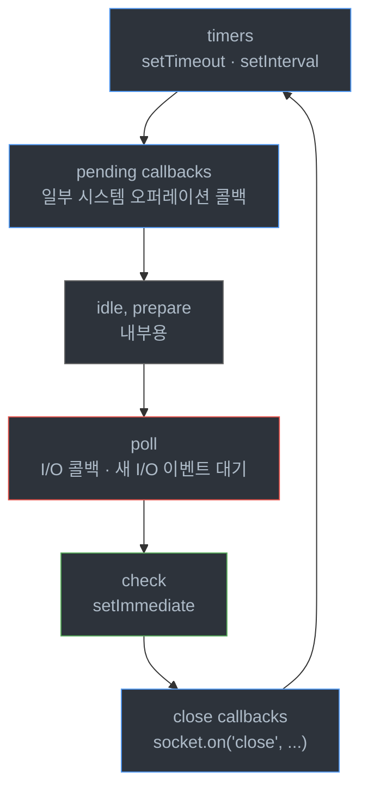
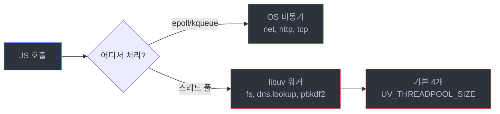

# Node.js 이벤트 루프 심화

## 정의

Node.js 이벤트 루프는 libuv가 돌리는 무한 루프다. 한 바퀴(tick)마다 정해진 순서로 큐를 비우면서 콜백을 실행한다. 자바스크립트가 싱글 스레드인데도 수만 개의 동시 연결을 받아내는 이유가 여기 있다.

루프는 "어떤 콜백이 언제 실행될지"를 결정하는 스케줄러다. 운영하다 보면 `setTimeout(fn, 0)`가 100ms 뒤에 실행되거나, `process.nextTick` 안에서 또 `process.nextTick`을 부르다가 I/O가 영영 안 잡히는 케이스를 만난다. 페이즈 순서와 큐의 우선순위를 모르면 원인을 잡기 어렵다.

이 문서는 6개 페이즈가 실제로 어떤 일을 하는지, 마이크로태스크가 페이즈 사이 어디서 끼어드는지, I/O 풀링이 멈추는 케이스가 무엇인지를 코드와 함께 정리한다.

## 6개 페이즈 전체 그림

libuv 이벤트 루프는 한 tick 동안 6개의 페이즈를 순서대로 돈다. 각 페이즈는 자기 콜백 큐를 가지고, 그 큐의 콜백을 모두 실행하거나 시스템이 정한 상한에 도달할 때까지 돌린 뒤 다음 페이즈로 넘어간다.



페이즈와 페이즈 사이에는 **마이크로태스크 큐**(`process.nextTick` 큐 → Promise 큐)가 한 번씩 비워진다. 이게 자주 헷갈리는 부분이다. 마이크로태스크는 어느 페이즈에서 콜백을 실행한 직후마다 처리되기 때문에, 페이즈 단위가 아니라 콜백 단위로 끼어든다.

### timers

`setTimeout`과 `setInterval`이 만든 콜백 중 **만료된 것**이 여기서 실행된다. 만료되지 않았으면 그냥 통과한다.

자주 오해하는 부분이 있다. `setTimeout(fn, 100)`이 정확히 100ms 뒤 실행된다고 보장하지 않는다. 100ms가 지난 시점에 timers 페이즈가 돌면 그때 실행된다. 다른 페이즈가 오래 걸리면 150ms, 200ms도 흔하다.

```javascript
const start = Date.now();
setTimeout(() => {
  console.log(`elapsed=${Date.now() - start}ms`);
}, 100);

// 동기 블로킹으로 200ms 잡아먹기
const block = Date.now() + 200;
while (Date.now() < block) {}
// 출력: elapsed=200ms (100ms가 아니다)
```

여기서 `while` 루프가 자바스크립트 메인 스레드를 잡고 있기 때문에 timers 페이즈에 들어갈 수 없고, 200ms 뒤에야 setTimeout 콜백이 실행된다.

### pending callbacks

`pending_callbacks` 페이즈는 이전 루프 iteration에서 미뤄진 시스템 오퍼레이션의 콜백을 처리한다. 예를 들면 TCP 소켓의 `ECONNREFUSED` 같은 오류 콜백이 여기로 떨어진다.

애플리케이션 코드에서 직접 다룰 일은 거의 없다. 다만 디버깅할 때 "왜 이 에러 콜백이 한 tick 뒤에 실행되지?"라는 의문이 들면 이 페이즈를 떠올리면 된다.

### idle, prepare

libuv 내부용이다. 외부에 노출되지 않는다. 무시해도 된다.

### poll

가장 무거운 페이즈다. 두 가지 일을 한다.

첫째, I/O 이벤트를 폴링한다. 파일 디스크립터에서 데이터가 들어왔는지 OS에 묻는다(`epoll_wait`, `kqueue`, `IOCP` 등). 들어왔다면 해당 콜백을 큐에 넣고 실행한다.

둘째, **다른 페이즈에 일이 없으면 여기서 블로킹한다**. 이 점이 중요하다. timers 페이즈가 다음에 실행할 만료된 타이머도 없고, `setImmediate`도 없으면 poll 페이즈는 새 I/O 이벤트를 기다리며 멈춰 있는다. 만약 만료가 곧 다가오는 setTimeout이 있다면 그 시간만큼만 기다린다.

이게 Node가 CPU를 안 쓰면서도 I/O 응답성을 유지하는 핵심 메커니즘이다. busy loop가 아니라 OS가 깨워줄 때까지 자고 있는다.

```javascript
const fs = require('fs');

// 만료된 타이머가 없고 setImmediate도 없으면
// poll에서 이 readFile 콜백이 올 때까지 블로킹
fs.readFile('/etc/hosts', () => {
  console.log('파일 읽기 완료');
});
```

### check

`setImmediate`로 등록한 콜백이 여기서 실행된다. poll 페이즈가 끝나면 바로 check 페이즈로 넘어가기 때문에, `setImmediate`는 "현재 poll 페이즈가 끝난 직후" 실행을 보장한다.

I/O 콜백 안에서 무거운 후처리를 다음 tick으로 미루고 싶을 때 자주 쓴다.

```javascript
fs.readFile(path, (err, data) => {
  // 이 시점은 poll 페이즈
  setImmediate(() => {
    // check 페이즈 — 같은 tick 안, poll 직후
    processHeavyData(data);
  });
});
```

### close callbacks

`socket.on('close', ...)`처럼 close 이벤트 콜백이 여기서 실행된다. `socket.destroy()`를 호출하면 다음 tick의 이 페이즈에서 close 콜백이 실행된다.

## 마이크로태스크: nextTick vs Promise

페이즈 그림만 보면 "큐가 6개구나"라고 생각하기 쉬운데, 실제로는 두 개의 마이크로태스크 큐가 더 있다. 그리고 이 두 개의 우선순위가 다르다.

| 우선순위 | 큐 | 등록 방법 |
|----------|-----|----------|
| 1 | nextTick 큐 | `process.nextTick(fn)` |
| 2 | 마이크로태스크 큐 | `Promise.resolve().then(fn)`, `queueMicrotask(fn)` |
| 3 | 매크로태스크 (페이즈 큐) | `setTimeout`, `setImmediate`, I/O 콜백 등 |

**이 두 큐는 페이즈 사이가 아니라 콜백 사이마다 비워진다.** 즉 어떤 콜백이 끝나면, 그 다음 콜백을 실행하기 전에 nextTick 큐를 전부 비우고, 그 다음 Promise 마이크로태스크 큐를 전부 비운다.

```javascript
setTimeout(() => console.log('timeout'), 0);
setImmediate(() => console.log('immediate'));

Promise.resolve().then(() => console.log('promise'));
process.nextTick(() => console.log('nextTick'));

console.log('sync');

// 출력 순서:
// sync
// nextTick
// promise
// timeout  (또는 immediate가 먼저 — 아래에서 설명)
// immediate (또는 timeout)
```

동기 코드가 끝나면 nextTick 큐 → 마이크로태스크 큐가 비워지고, 그 다음에야 timers/check 페이즈로 들어간다.

### nextTick 무한 루프 함정

`process.nextTick` 안에서 다시 `process.nextTick`을 부르면 nextTick 큐가 비워지지 않는다. 큐가 비어야 다음 페이즈로 넘어가는데, 비울 때마다 새로 채워지면 영원히 못 넘어간다.

```javascript
// 절대 하면 안 되는 코드
function recursiveNextTick() {
  process.nextTick(recursiveNextTick);
}
recursiveNextTick();

// 이벤트 루프가 다른 페이즈로 넘어가지 못한다
// I/O 콜백, setTimeout, setImmediate 전부 굶어 죽는다
setTimeout(() => console.log('이거 안 찍힌다'), 100);
```

운영 환경에서 이 패턴이 나오는 경우는 보통 재귀 콜백이 의도치 않게 동기적으로 자기 자신을 다시 호출할 때다. Promise 체이닝에서도 똑같은 문제가 발생할 수 있지만, Promise는 적어도 그 안에서 `await`을 쓰면 한 번 양보하기 때문에 nextTick보다 덜 위험하다.

### Promise도 마이크로태스크라 위험할 수 있다

```javascript
async function tightLoop() {
  while (true) {
    await Promise.resolve();
    // 매번 마이크로태스크 큐로 들어가지만
    // 큐가 비기 전에 다시 채운다
  }
}
tightLoop();

setTimeout(() => console.log('이것도 안 찍힌다'), 100);
```

`await Promise.resolve()`는 마이크로태스크 큐에 콜백을 등록하고 즉시 처리한다. 페이즈로 넘어가지 못한다. 빠른 I/O 폴링이 필요한 서버에서 이런 무한 마이크로태스크 루프는 치명적이다.

## 페이즈별 실행 순서 디버깅 사례

문서로만 읽으면 헷갈리니까 실제 코드의 실행 순서를 추적해 본다.

```javascript
const fs = require('fs');

console.log('1. 동기 시작');

setTimeout(() => console.log('5. timeout'), 0);
setImmediate(() => console.log('6. immediate'));

fs.readFile(__filename, () => {
  console.log('7. readFile (poll)');

  setTimeout(() => console.log('10. inner timeout'), 0);
  setImmediate(() => console.log('8. inner immediate'));
  process.nextTick(() => console.log('9. nextTick in poll'));
});

process.nextTick(() => console.log('2. nextTick'));
Promise.resolve().then(() => console.log('3. promise'));

console.log('4. 동기 끝');
```

출력은 다음과 같다.

```
1. 동기 시작
4. 동기 끝
2. nextTick
3. promise
5. timeout         (또는 6이 먼저 — OS 타이밍에 따라)
6. immediate
7. readFile (poll)
9. nextTick in poll
8. inner immediate
10. inner timeout
```

요점.

- 동기 코드(1, 4)가 끝난 직후 nextTick(2) → Promise(3)가 처리된다.
- timers와 check는 순서가 OS 스케줄링에 따라 달라진다(5, 6).
- I/O 콜백(7)에서 등록한 setImmediate(8)는 같은 tick의 check에서 실행된다.
- I/O 콜백 안에서 등록한 setTimeout(10)은 다음 tick의 timers까지 가야 한다.
- I/O 콜백 안의 nextTick(9)은 그 콜백 종료 직후 바로 실행된다.

7번 이후 9, 8, 10의 순서가 핵심이다. **I/O 콜백 안에서는 setImmediate가 setTimeout(0)보다 빠르다**. 이게 다음 절의 주제다.

## setImmediate vs setTimeout(0)

가장 자주 받는 질문 중 하나다. 결론부터 말하면.

- 메인 모듈(최상위)에서 둘 다 호출 → **순서 보장 없음**
- I/O 콜백 안에서 둘 다 호출 → **setImmediate가 먼저**

### 메인 모듈의 비결정성

```javascript
setTimeout(() => console.log('timeout'), 0);
setImmediate(() => console.log('immediate'));
```

같은 코드를 100번 돌려 보면 timeout이 먼저인 경우와 immediate가 먼저인 경우가 섞인다.

이유는 `setTimeout(fn, 0)`이 내부적으로 `setTimeout(fn, 1)`로 변환되기 때문이다(Node는 0ms 타이머를 허용하지 않고 최소 1ms로 강제한다). 그래서 이벤트 루프가 처음 timers 페이즈에 도달했을 때 1ms가 지났는지 안 지났는지가 OS 스케줄링에 달려 있다.

지났으면 timeout이 먼저, 안 지났으면 immediate가 먼저다.

### I/O 콜백 안에서는 결정적

```javascript
const fs = require('fs');

fs.readFile(__filename, () => {
  setTimeout(() => console.log('timeout'), 0);
  setImmediate(() => console.log('immediate'));
});

// 항상 immediate가 먼저
```

I/O 콜백은 poll 페이즈에서 실행된다. poll 다음이 check다. setImmediate는 check에서 처리되니까 바로 다음 페이즈에서 실행된다. setTimeout은 다음 tick의 timers 페이즈까지 기다려야 한다.

### 실측: 1만 번 반복

```javascript
const fs = require('fs');

let timeoutCount = 0;
let immediateCount = 0;
const TOTAL = 10000;

function race(callback) {
  let done = false;
  setTimeout(() => {
    if (!done) { done = true; timeoutCount++; callback(); }
  }, 0);
  setImmediate(() => {
    if (!done) { done = true; immediateCount++; callback(); }
  });
}

let i = 0;
function next() {
  if (i++ >= TOTAL) {
    console.log(`timeout: ${timeoutCount}, immediate: ${immediateCount}`);
    return;
  }
  race(next);
}

// 메인 모듈에서 호출 — 비결정적
next();
```

내 로컬에서 돌려 보면 메인 모듈에서는 대략 6:4 ~ 4:6 사이로 갈린다. 같은 코드를 `fs.readFile` 콜백 안으로 옮기면 10000:0이 된다.

### 실무에서 어느 쪽을 써야 하나

I/O 콜백 안에서 "현재 tick의 후처리를 미루고 싶다"면 `setImmediate`. 다음 페이즈에서 확실히 실행된다.

타이머처럼 "정해진 시간 뒤에 실행"이면 `setTimeout`. 단 0ms는 의도가 모호하니까 쓰지 말고, 즉시 비동기로 미루고 싶으면 `setImmediate`나 `queueMicrotask`를 명시적으로 쓰는 게 낫다.

`process.nextTick`은 "다음 페이즈로 가기 전에 먼저 처리"가 필요할 때만. 대부분은 `queueMicrotask`로 충분하고, nextTick은 위에서 본 무한 루프 함정이 있어서 신중하게 써야 한다.

## I/O 폴링 중 블로킹이 일어나는 케이스

이벤트 루프가 빠른 이유는 poll 페이즈에서 OS에게 I/O를 위임하기 때문이다. 그런데 위임할 수 없는 작업이 자바스크립트 스레드에 올라오면 루프 전체가 멈춘다. "이벤트 루프 블로킹"이라 부르는 그것이다.

### CPU 바운드 작업

가장 흔한 케이스. 동기 암호화, 대용량 JSON 파싱, 정규식 백트래킹, 큰 배열의 동기 정렬.

```javascript
const crypto = require('crypto');

// 동기 PBKDF2 — 100~500ms 동안 메인 스레드를 잡는다
const hash = crypto.pbkdf2Sync(password, salt, 100000, 64, 'sha512');
```

이 동안 다른 모든 HTTP 요청, 타이머, I/O 콜백이 대기한다. 100ms p99가 갑자기 500ms로 튀는 원인이다.

해결책. 비동기 버전(`crypto.pbkdf2`) 또는 `worker_threads`로 옮긴다. CPU 작업이 진짜 무거우면 워커 풀을 따로 만들어 돌린다.

### 동기 fs API

`readFileSync`, `existsSync`, `statSync`는 디스크가 빠를 때는 문제 없어 보이지만, 네트워크 마운트나 컨테이너 환경에서 100ms 넘게 걸리는 일이 흔하다. 그동안 이벤트 루프는 멈춰 있다.

```javascript
// 서버 핫패스에서 절대 쓰지 말 것
const config = JSON.parse(fs.readFileSync('./config.json', 'utf8'));
```

부팅 시점 한 번이면 괜찮지만, 요청마다 동기 I/O를 부르면 동시 처리 능력이 0에 수렴한다.

### 정규식 백트래킹

악명 높은 ReDoS. 사용자 입력을 정규식에 넣을 때 백트래킹이 폭발하면 한 요청이 수십 초간 CPU를 잡는다.

```javascript
// 외부 입력으로 이 정규식이 돌아가면 위험
const re = /^(a+)+$/;
re.test('aaaaaaaaaaaaaaaaaaaaaaaaaaaaaaaa!');
// 입력 길이 30에서도 수 초 걸린다
```

검증할 정규식은 RE2 같은 선형 시간 엔진이나 미리 짜놓은 안전한 패턴을 쓰는 게 낫다.

### Promise 마이크로태스크 폭주

위에서 본 무한 마이크로태스크 패턴. 의도치 않게 발생할 수 있는 시나리오 하나.

```javascript
async function pump(stream) {
  while (!stream.done) {
    const chunk = await stream.read();
    // chunk가 항상 즉시 resolve되는 promise를 돌려주면
    // 매크로태스크로 못 넘어간다
    process(chunk);
  }
}
```

스트림 라이브러리가 내부적으로 동기적으로 즉시 resolve하는 Promise를 돌려주는 경우, 위 루프가 마이크로태스크 큐 안에서만 돌면서 다른 요청을 막는다. 주기적으로 `await new Promise(r => setImmediate(r))`로 양보를 끼워 넣는 게 안전하다.

### libuv 스레드 풀 고갈

`fs`, `crypto.pbkdf2`, `dns.lookup` 같은 일부 작업은 libuv 스레드 풀(기본 4개)에서 돌아간다. 스레드 풀이 다 차면 새 작업은 대기한다. CPU 코어가 16개여도 기본 4개만 쓴다.

```bash
# 스레드 풀 크기 조정
UV_THREADPOOL_SIZE=16 node app.js
```

DNS 조회가 느려질 때 `dns.lookup` 대신 `dns.resolve`를 쓰는 게 권장되는 이유가 이거다. `lookup`은 스레드 풀을 쓰고, `resolve`는 비동기 네트워크 호출을 쓴다.



## EventLoopUtilization으로 부하 측정

이벤트 루프가 얼마나 바쁜지 측정하는 표준 API가 있다. Node 14부터 `perf_hooks.performance.eventLoopUtilization()`이다.

```javascript
const { performance } = require('node:perf_hooks');

let prev = performance.eventLoopUtilization();

setInterval(() => {
  const current = performance.eventLoopUtilization();
  const diff = performance.eventLoopUtilization(current, prev);
  console.log(`utilization=${(diff.utilization * 100).toFixed(2)}%`);
  prev = current;
}, 1000);
```

`utilization`은 0~1 사이 값이다. 0.7이면 이벤트 루프가 70% 시간을 콜백 실행에 쓰고 30%를 idle(주로 poll에서 I/O 대기) 상태로 보냈다는 뜻이다.

### 수치 해석

- 0.0 ~ 0.3: 한가하다. CPU 작업 거의 없음, I/O 대기 위주.
- 0.3 ~ 0.6: 정상 부하. 트래픽이 들어오고 콜백이 실행되고 있다.
- 0.6 ~ 0.8: 주의. 응답 시간 p99가 늘어나기 시작한다.
- 0.8 이상: 위험. 새 요청이 들어와도 처리 못 하고 큐에 쌓인다. p99가 폭발한다.

0.9를 넘기면 거의 항상 CPU 바운드 작업이 메인 스레드를 잡고 있는 거다. 클러스터 인스턴스를 늘리거나 worker_threads로 옮겨야 한다.

### 로드 밸런서에서 ELU 사용

여러 인스턴스를 띄운 환경에서 라우팅에 활용할 수도 있다. ELU가 0.8 이상인 인스턴스는 헬스체크에서 일시적으로 빼는 식으로.

```javascript
const { performance } = require('node:perf_hooks');
let prev = performance.eventLoopUtilization();

setInterval(() => {
  const current = performance.eventLoopUtilization();
  const diff = performance.eventLoopUtilization(current, prev);
  prev = current;

  if (diff.utilization > 0.85) {
    // 헬스체크 false로 전환
    healthStatus.healthy = false;
  } else if (diff.utilization < 0.6) {
    healthStatus.healthy = true;
  }
}, 1000);
```

운영하다 보면 한 인스턴스만 ELU가 튀는 경우가 있다. 보통은 그 인스턴스에 들어간 요청 중 하나가 무거운 CPU 작업을 하고 있다. APM에 ELU와 함께 요청 트레이스를 묶어 두면 원인 파악이 빠르다.

### histogram으로 latency 측정

ELU와 함께 자주 쓰는 게 `monitorEventLoopDelay`다. 이벤트 루프가 한 tick 도는 데 걸리는 시간을 측정한다.

```javascript
const { monitorEventLoopDelay } = require('node:perf_hooks');

const h = monitorEventLoopDelay({ resolution: 20 });
h.enable();

setInterval(() => {
  console.log({
    min: h.min / 1e6,         // ns → ms
    mean: h.mean / 1e6,
    p99: h.percentile(99) / 1e6,
    max: h.max / 1e6,
  });
  h.reset();
}, 1000);
```

평균 1ms 미만이면 정상이다. p99가 100ms를 넘으면 어딘가에서 메인 스레드가 잡히고 있다. ELU는 "얼마나 바쁜가", monitorEventLoopDelay는 "한 번 막힐 때 얼마나 오래 막히나"를 본다. 둘 다 같이 봐야 한다.

## 마무리: 페이즈를 기억하는 법

페이즈 순서는 외워야 한다. 디버깅하다 보면 "이 콜백이 왜 여기서 실행되지?"를 페이즈 순서로 풀어야 할 때가 자주 온다.

기억 방법은 단순하다. **타이머가 먼저(timers), I/O 받고(poll), setImmediate 실행하고(check), 닫는 거 마무리(close)**. 가운데 pending callbacks와 idle/prepare는 거의 신경 쓸 일 없다.

그 사이마다 nextTick → Promise 마이크로태스크가 끼어든다는 것, 그리고 이 두 큐는 페이즈가 아니라 콜백 단위로 비워진다는 것. 이 두 가지만 잡고 있으면 대부분의 실행 순서 문제는 풀린다.
